# gson b8f616

https://github.com/google/gson/commit/b8f616

## Delta Energy per test method

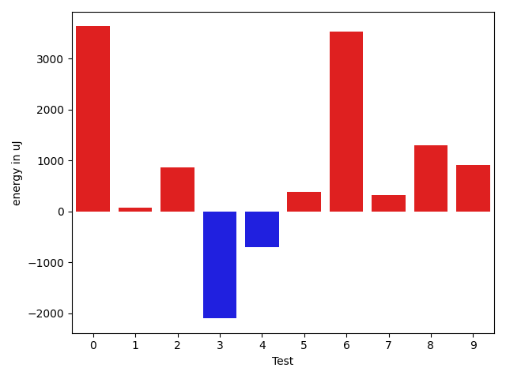

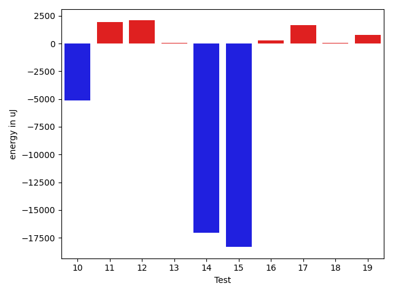

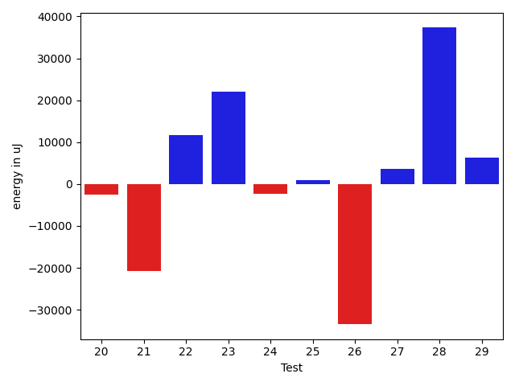

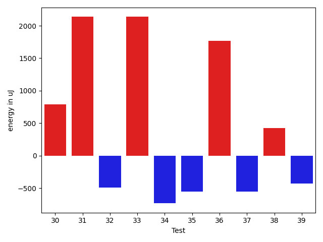

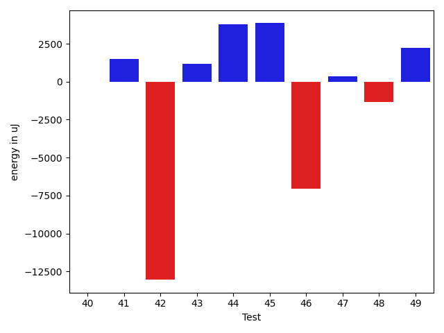

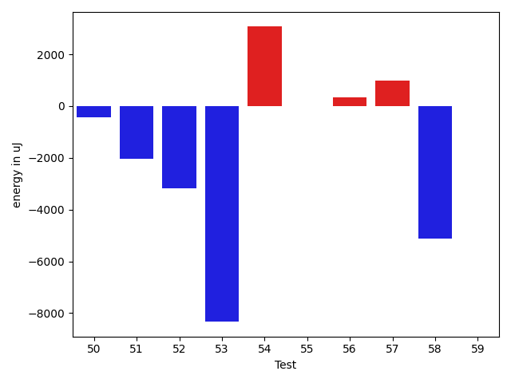

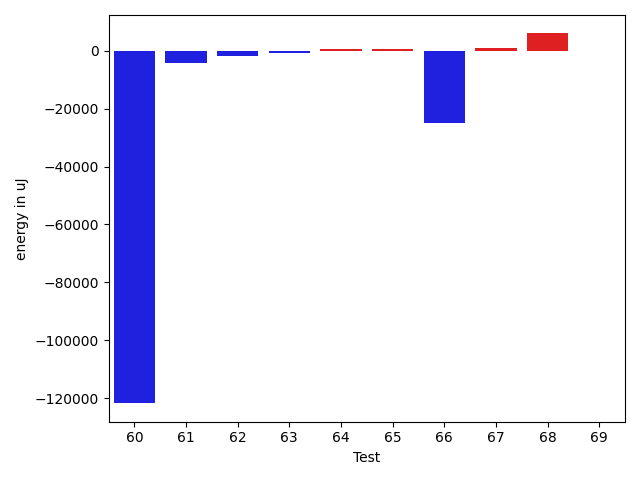

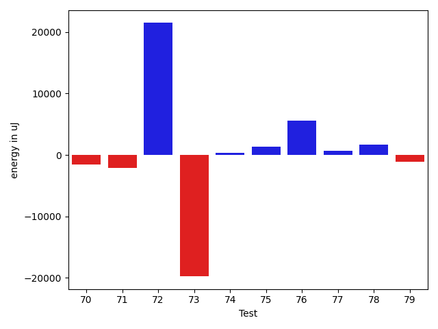

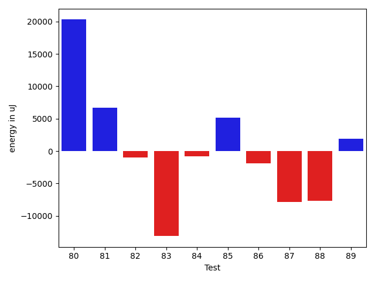

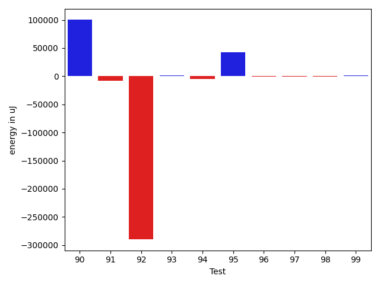

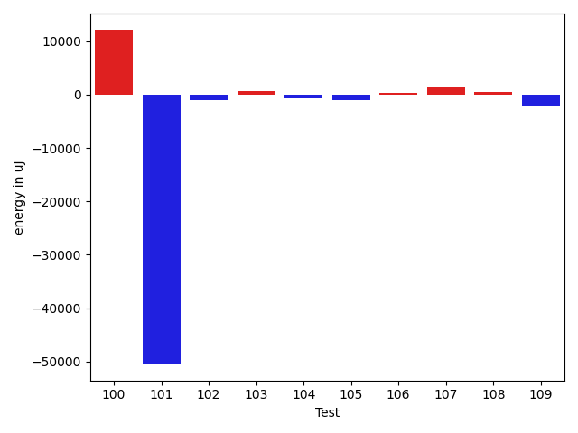

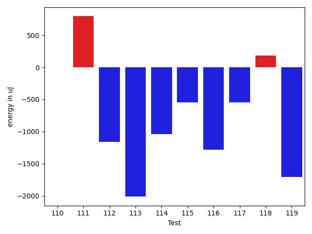

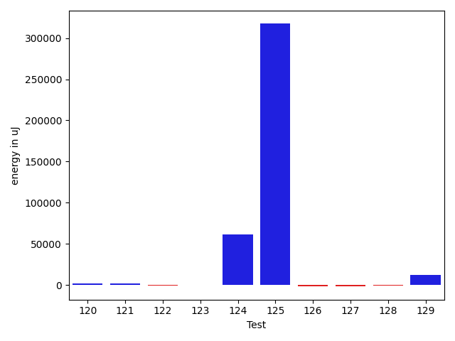

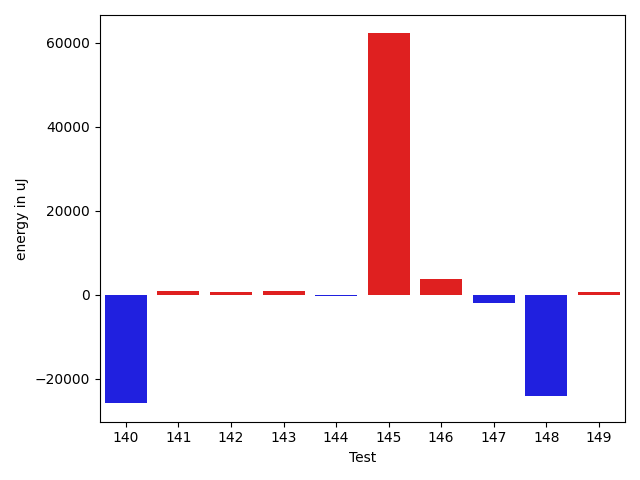

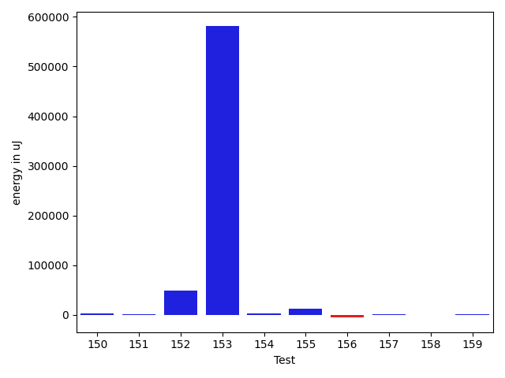

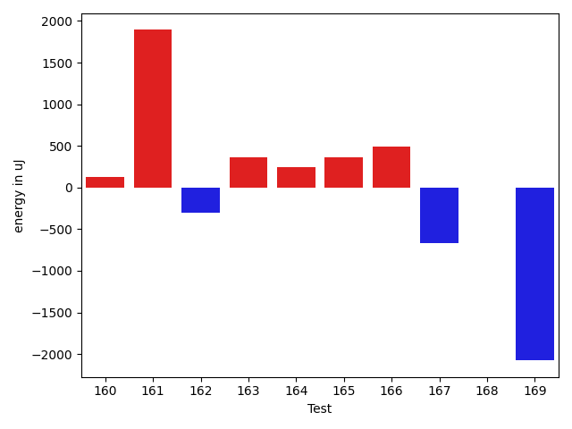

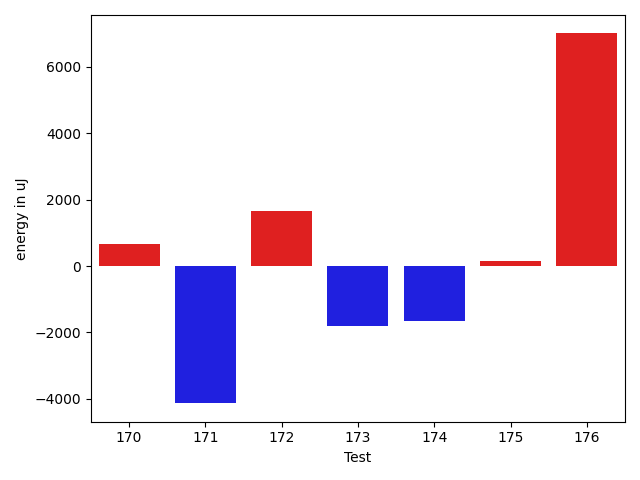

| ID | EnergyV1 | EnergyV2 | DeltaEnergy | σV1 | σV2 |
| --- | --- | --- | --- | --- | --- |
| 0 | 43212 | 43701 | 489 | 11978.466366104589 | 22147.634168763318 |
| 1 | 43212 | 43518 | 306 | 4124.938862033013 | 3068.2455529573626 |
| 2 | 43640 | 44739 | 1099 | 3594.3967952560024 | 3469.8792678095865 |
| 3 | 42969 | 43823 | 854 | 11877.01526290617 | 5555.206183788321 |
| 4 | 43518 | 44433 | 915 | 8108.308186467427 | 4013.8475078565866 |
| 5 | 43456 | 44006 | 550 | 3843.0704573206244 | 3835.0346021907026 |
| 6 | 45288 | 45104 | -184 | 113984.16192722188 | 120934.62785454126 |
| 7 | 44006 | 44372 | 366 | 8685.423481060177 | 14643.888424490555 |
| 8 | 42419 | 43457 | 1038 | 3444.1891559612136 | 3743.8378784993515 |
| 9 | 43396 | 43213 | -183 | 11879.40175033893 | 13377.464507746072 |
| 10 | 45471 | 44921 | -550 | 21194.43250570834 | 18090.694834527807 |
| 11 | 44616 | 45044 | 428 | 8457.044571686967 | 9910.384551570132 |
| 12 | 42419 | 44128 | 1709 | 4078.263090837078 | 7286.298651615436 |
| 13 | 44067 | 42481 | -1586 | 3725.609763067875 | 3929.1348688621433 |
| 14 | 44861 | 43823 | -1038 | 37905.21449662429 | 17142.300358773104 |
| 15 | 45410 | 45166 | -244 | 64978.88472225461 | 57756.55350072599 |
| 16 | 43762 | 44372 | 610 | 3787.9272392886105 | 3754.665538516374 |
| 17 | 41870 | 43640 | 1770 | 4195.264991845039 | 3409.908939584735 |
| 18 | 43274 | 43823 | 549 | 3737.803031147717 | 3967.3193260767052 |
| 19 | 47729 | 46875 | -854 | 27588.35404484178 | 31046.06313021232 |
| 20 | 45410 | 45837 | 427 | 16516.657080820925 | 16416.517539659133 |
| 21 | 44861 | 44616 | -245 | 9659.785678996677 | 10387.969667263127 |
| 22 | 90454 | 88440 | -2014 | 23248.124648519388 | 24118.36576079593 |
| 23 | 115784 | 89172 | -26612 | 204489.7537776647 | 236226.91538488335 |
| 24 | 45715 | 44983 | -732 | 19146.1060721108 | 17564.6144667968 |
| 25 | 46447 | 45838 | -609 | 80602.68603955643 | 81748.5715842676 |
| 26 | 44495 | 43518 | -977 | 6144.6051018598755 | 4641.253933056359 |
| 27 | 44617 | 44678 | 61 | 13752.906874116832 | 19703.253568142438 |
| 28 | 47730 | 47974 | 244 | 26149.62128520911 | 32602.50313474341 |
| 29 | 44495 | 44434 | -61 | 10251.705685304258 | 15794.85802559 |
| 30 | 44678 | 45471 | 793 | 20767.68415520078 | 32440.07281234214 |
| 31 | 83740 | 85876 | 2136 | 56050.9391021437 | 63761.5868864566 |
| 32 | 45776 | 45288 | -488 | 19071.685024343533 | 22785.648437320524 |
| 33 | 43396 | 45532 | 2136 | 8053.168989885695 | 9583.092301859173 |
| 34 | 43823 | 43090 | -733 | 3261.480467696529 | 8439.793241709807 |
| 35 | 43945 | 43396 | -549 | 11278.569162025198 | 3505.8471909412133 |
| 36 | 80689 | 82458 | 1769 | 21417.303559682183 | 21456.125945912903 |
| 37 | 43579 | 43030 | -549 | 2849.1899804111376 | 5532.903419310455 |
| 38 | 44128 | 44555 | 427 | 19741.767428834468 | 18272.88627624942 |
| 39 | 43457 | 43030 | -427 | 2862.6109342695945 | 11945.433578520144 |
| 40 | 366576 | 363281 | -3295 | 44507.5916487422 | 53109.138998228445 |
| 41 | 43457 | 43274 | -183 | 3332.2795284656177 | 3047.3551191520523 |
| 42 | 44251 | 44434 | 183 | 17820.54271262788 | 16320.631340812706 |
| 43 | 44494 | 46814 | 2320 | 17144.26034608295 | 25634.474898656776 |
| 44 | 43030 | 44434 | 1404 | 2998.5045921183173 | 14740.015896057404 |
| 45 | 43518 | 43640 | 122 | 2556.23881739982 | 2487.7373867744877 |
| 46 | 43335 | 44067 | 732 | 3614.018358958472 | 3443.504723161454 |
| 47 | 42358 | 45288 | 2930 | 7675.5005150209845 | 22385.489852818 |
| 48 | 43091 | 45410 | 2319 | 3050.1572539956164 | 3303.289808960678 |
| 49 | 43335 | 43335 | 0 | 3493.219848921089 | 7263.425001901495 |
| 50 | 44129 | 43152 | -977 | 4603.8370128543875 | 4493.911746678919 |
| 51 | 45166 | 43335 | -1831 | 7740.41058210397 | 3917.594176093066 |
| 52 | 43030 | 42420 | -610 | 27005.96135046201 | 3043.9025398978683 |
| 53 | 42175 | 43091 | 916 | 19789.392517307893 | 3612.0062762957646 |
| 54 | 42968 | 43701 | 733 | 4486.559126255714 | 6930.629216381507 |
| 55 | 43640 | 43518 | -122 | 3558.8548720058816 | 4666.047255877595 |
| 56 | 42969 | 42724 | -245 | 3927.9280811038225 | 2772.1185407606445 |
| 57 | 43457 | 44556 | 1099 | 4626.200030410067 | 4210.351402853473 |
| 58 | 45410 | 44495 | -915 | 31989.173526612292 | 30558.774973652864 |
| 59 | 43823 | 42724 | -1099 | 4584.700213202266 | 4093.2769850451014 |
| 60 | 46508 | 43335 | -3173 | 299792.6936229281 | 4063.1751328240825 |
| 61 | 46387 | 45105 | -1282 | 18684.26465323786 | 15109.761643626984 |
| 62 | 44922 | 44128 | -794 | 9567.707185588713 | 11542.582335411527 |
| 63 | 42847 | 42847 | 0 | 4047.1489626184484 | 3946.5784809967563 |
| 64 | 41809 | 42969 | 1160 | 3685.1458823109083 | 3321.7566907280693 |
| 65 | 44311 | 44311 | 0 | 3122.3437343693527 | 8096.0569877756725 |
| 66 | 45105 | 45593 | 488 | 214677.12700757774 | 128690.46768606876 |
| 67 | 42663 | 44250 | 1587 | 3150.332182837585 | 4233.220997065945 |
| 68 | 44067 | 46203 | 2136 | 3512.4395091667498 | 19119.81298156444 |
| 69 | 43030 | 43640 | 610 | 4417.07227697261 | 2794.048280820422 |
| 70 | 44800 | 43212 | -1588 | 3213.680213592426 | 4027.870005626078 |
| 71 | 43823 | 43884 | 61 | 4475.723183044912 | 4223.490514604134 |
| 72 | 43579 | 42541 | -1038 | 19720.64627421195 | 4432.421893276857 |
| 73 | 85022 | 87707 | 2685 | 159485.5032294259 | 215793.9967491816 |
| 74 | 44006 | 43701 | -305 | 34936.67018523425 | 3854.6659021750907 |
| 75 | 43029 | 42847 | -182 | 4656.700485137951 | 5766.798137895558 |
| 76 | 43335 | 42663 | -672 | 4520.2030637763555 | 4912.869336930117 |
| 77 | 47180 | 50598 | 3418 | 62191.58387081406 | 76308.66266763199 |
| 78 | 44434 | 43212 | -1222 | 3902.4916307662584 | 3138.143286077074 |
| 79 | 43213 | 43212 | -1 | 43472.30925665586 | 6436.800581953266 |
| 80 | 41809 | 43213 | 1404 | 4985.982663457008 | 3208.9706697982438 |
| 81 | 43640 | 41443 | -2197 | 4619.030513414783 | 34075.88052581474 |
| 82 | 44494 | 44922 | 428 | 4579.921285592387 | 21197.800399084153 |
| 83 | 42786 | 42115 | -671 | 5258.149641682042 | 5028.470829675553 |
| 84 | 43823 | 42908 | -915 | 4376.80220342134 | 25532.36434670004 |
| 85 | 43701 | 44861 | 1160 | 3136.063697134536 | 4013.1030998468004 |
| 86 | 50354 | 84167 | 33813 | 329991.5020838244 | 345593.96400035085 |
| 87 | 43762 | 42602 | -1160 | 4024.6719864275983 | 7260.428001958105 |
| 88 | 44555 | 43030 | -1525 | 27377.499993736186 | 4296.35651195415 |
| 89 | 45410 | 45532 | 122 | 241591.06213280646 | 248539.27640466686 |
| 90 | 42481 | 43640 | 1159 | 3747.1520893190077 | 4066.4098914684073 |
| 91 | 45776 | 42724 | -3052 | 29915.33920339733 | 3966.904485945847 |
| 92 | 46143 | 45959 | -184 | 86006.32688210605 | 84702.21031698295 |
| 93 | 50110 | 49804 | -306 | 49919.550350623635 | 45834.38435290359 |
| 94 | 43396 | 44800 | 1404 | 3751.4191222655863 | 7043.076666030548 |
| 95 | 43213 | 44373 | 1160 | 7537.348497341117 | 4904.8360359884155 |
| 96 | 43579 | 44677 | 1098 | 4480.861147364178 | 3747.2658065644696 |
| 97 | 43274 | 43945 | 671 | 12066.003753967974 | 4227.3418385844925 |
| 98 | 132507 | 128539 | -3968 | 240104.93334130768 | 134112.24251458092 |
| 99 | 45349 | 41931 | -3418 | 4482.2675808865615 | 3224.9142037117476 |
| 100 | 124328 | 130798 | 6470 | 39627.326320614644 | 53479.42176647465 |
| 101 | 145446 | 140930 | -4516 | 247740.8267195279 | 129659.76348557952 |
| 102 | 44861 | 44373 | -488 | 10897.47601192843 | 9224.274223714187 |
| 103 | 44495 | 43945 | -550 | 6718.541313968382 | 9386.923496976804 |
| 104 | 44495 | 42969 | -1526 | 4633.56559545927 | 4106.8114224731025 |
| 105 | 44861 | 43579 | -1282 | 4618.305723184014 | 4341.346396063351 |
| 106 | 42297 | 43152 | 855 | 3824.0689977267666 | 3944.981223614541 |
| 107 | 43213 | 44434 | 1221 | 6330.599928647935 | 6386.538119290884 |
| 108 | 43152 | 42359 | -793 | 4818.895346098829 | 3987.2288641902787 |
| 109 | 44372 | 42908 | -1464 | 11295.584682667048 | 8456.09558835997 |
| 110 | 44494 | 44495 | 1 | 5029.335447276572 | 4251.2226754526255 |
| 111 | 42724 | 43518 | 794 | 7007.129458482938 | 6490.340860419249 |
| 112 | 44250 | 43091 | -1159 | 7057.532909057143 | 6797.646619222142 |
| 113 | 93444 | 91431 | -2013 | 250780.263541051 | 138930.56557383714 |
| 114 | 48096 | 47058 | -1038 | 35964.08005745257 | 34362.69131344762 |
| 115 | 44494 | 43945 | -549 | 14211.072721447035 | 13463.27876068743 |
| 116 | 45471 | 44190 | -1281 | 3719.879342262011 | 2799.3993973975175 |
| 117 | 45654 | 45105 | -549 | 411651.3702506565 | 165155.70865712155 |
| 118 | 43762 | 43945 | 183 | 4494.369911436578 | 4646.196746165796 |
| 119 | 44555 | 42847 | -1708 | 4470.702297259161 | 4662.627544593284 |
| 120 | 44128 | 43579 | -549 | 19424.60408776576 | 8853.853395710878 |
| 121 | 43457 | 42664 | -793 | 4531.870108266641 | 3980.7334903373962 |
| 122 | 92895 | 91979 | -916 | 214960.09943758184 | 188725.97164256367 |
| 123 | 42114 | 43518 | 1404 | 4422.868480974762 | 4899.033572318966 |
| 124 | 43213 | 43029 | -184 | 3776.852942265558 | 3024.3054335453457 |
| 125 | 43091 | 44006 | 915 | 3627.801187261181 | 4100.797311706042 |
| 126 | 44372 | 43884 | -488 | 21046.661856093055 | 18957.375778971204 |
| 127 | 42175 | 41870 | -305 | 4137.338134203524 | 5298.954301750631 |
| 128 | 44311 | 43701 | -610 | 4396.312885213171 | 4716.347809113417 |
| 129 | 74036 | 79345 | 5309 | 31478.349307493958 | 36671.99949664672 |
| 130 | 45165 | 44922 | -243 | 222545.060499799 | 221736.44589130345 |
| 131 | 45227 | 44372 | -855 | 25042.232273443347 | 35066.06094950625 |
| 132 | 45532 | 45227 | -305 | 17140.034684611688 | 14375.67198005268 |
| 133 | 45105 | 44250 | -855 | 25739.000906042846 | 12706.66950144639 |
| 134 | 44678 | 45593 | 915 | 30608.546485126237 | 40134.77619690975 |
| 135 | 86792 | 87646 | 854 | 36631.85533127537 | 37270.211728535454 |
| 136 | 45654 | 44800 | -854 | 21052.8659731101 | 9687.61190577577 |
| 137 | 44616 | 44861 | 245 | 19541.040314159894 | 17190.445458501894 |
| 138 | 44250 | 43518 | -732 | 16983.68765149879 | 12278.996767405131 |
| 139 | 45227 | 46631 | 1404 | 20287.881868110333 | 115897.87566442294 |
| 140 | 48279 | 49134 | 855 | 185082.59837369053 | 108691.70910251791 |
| 141 | 45105 | 45166 | 61 | 3952.4074623592014 | 3258.279099463396 |
| 142 | 44129 | 44556 | 427 | 3266.411210233019 | 4098.604053542652 |
| 143 | 44556 | 45044 | 488 | 5032.617155710377 | 3736.329069340533 |
| 144 | 43823 | 44189 | 366 | 3803.2534733905313 | 4189.210313337706 |
| 145 | 46143 | 47974 | 1831 | 200067.52771681812 | 334700.2652038667 |
| 146 | 81238 | 84534 | 3296 | 32233.540797746115 | 31897.382249207236 |
| 147 | 71899 | 48522 | -23377 | 39399.220626446804 | 40530.67797114846 |
| 148 | 44067 | 44556 | 489 | 144243.73096919604 | 4384.407204014272 |
| 149 | 42724 | 42907 | 183 | 3445.86478077278 | 3570.7122470202507 |
| 150 | 46082 | 45044 | -1038 | 315950.4196690545 | 176185.62076963714 |
| 151 | 44494 | 43091 | -1403 | 7556.860131357333 | 10391.854211909982 |
| 152 | 45410 | 42297 | -3113 | 3872.5746962166886 | 4142.894141378303 |
| 153 | 46692 | 47547 | 855 | 23826.973775492996 | 28940.703798198614 |
| 154 | 46265 | 45715 | -550 | 209013.5575146106 | 321702.22222907195 |
| 155 | 47791 | 47119 | -672 | 31342.066496354346 | 125243.88430972678 |
| 156 | 44556 | 43579 | -977 | 3787.7440690785193 | 4364.705541296254 |
| 157 | 45288 | 43885 | -1403 | 287154.2902504559 | 276961.5281535548 |
| 158 | 43884 | 44861 | 977 | 182692.2108213555 | 5964.2174147899195 |
| 159 | 304931 | 306212 | 1281 | 198556.84438820256 | 79447.4410384925 |
| 160 | 45349 | 45471 | 122 | 219199.7068812465 | 206290.5843048398 |
| 161 | 42724 | 44616 | 1892 | 6980.303004577544 | 2741.141486224307 |
| 162 | 44556 | 44251 | -305 | 3327.3286925661105 | 3152.1727520226027 |
| 163 | 44128 | 44495 | 367 | 17648.1126889366 | 14500.436012715567 |
| 164 | 43212 | 43457 | 245 | 1893.9519565820117 | 3536.732439342846 |
| 165 | 45105 | 45471 | 366 | 3273.431501099045 | 3174.5497035121703 |
| 166 | 43946 | 44434 | 488 | 2985.324919211289 | 15929.563619738989 |
| 167 | 44800 | 44129 | -671 | 8710.172485213161 | 16717.113495869464 |
| 168 | 43884 | 43884 | 0 | 3349.7692442913135 | 2934.016667566078 |
| 169 | 45288 | 43212 | -2076 | 2721.790669761361 | 3397.6129521846933 |
| 170 | 43090 | 44556 | 1466 | 3735.6628795085853 | 3219.9804632316873 |
| 171 | 46021 | 45227 | -794 | 31228.33688168705 | 27635.128202326163 |
| 172 | 46081 | 45899 | -182 | 34527.69178729465 | 37612.68237339301 |
| 173 | 47424 | 45349 | -2075 | 14694.373023140863 | 20927.754360363375 |
| 174 | 44373 | 44067 | -306 | 10780.210617570681 | 6861.030169808351 |
| 175 | 45288 | 46570 | 1282 | 39652.906026802724 | 35956.23719216502 |
| 176 | 45838 | 44800 | -1038 | 10605.92465349229 | 29657.323836528758 |

## Delta Duration per test method

| ID | DurationV1 | DurationsV2 | DeltaDuration |
| --- | --- | --- | --- |
| 0 | 1189759.3684210526 | 1181325.8815789474 | -8433.486842105165 |
| 1 | 745518.0857142857 | 695477.9047619047 | -50040.18095238099 |
| 2 | 840247.8983050848 | 802760.275862069 | -37487.6224430158 |
| 3 | 1104652.9571428571 | 995199.86 | -109453.09714285715 |
| 4 | 1003022.0285714286 | 922675.4821428572 | -80346.54642857146 |
| 5 | 492879.9166666667 | 448896.28 | -43983.63666666666 |
| 6 | 1789036.1549295774 | 1837799.4333333333 | 48763.278403755976 |
| 7 | 1217113.869047619 | 1241089.2528735632 | 23975.38382594427 |
| 8 | 607730.9714285714 | 602414.8974358974 | -5316.073992674006 |
| 9 | 1146690.92 | 1096434.703125 | -50256.216874999925 |
| 10 | 1508139.9278350514 | 1459557.0 | -48582.927835051436 |
| 11 | 903435.2333333333 | 845901.06 | -57534.17333333322 |
| 12 | 993611.2857142857 | 1016386.904109589 | 22775.618395303376 |
| 13 | 758026.4888888889 | 776831.7083333334 | 18805.21944444452 |
| 14 | 1663466.370786517 | 1232319.5568181819 | -431146.81396833505 |
| 15 | 2192366.455882353 | 1624532.2666666666 | -567834.1892156862 |
| 16 | 718700.1590909091 | 687638.1836734693 | -31061.97541743971 |
| 17 | 702677.1315789474 | 669902.9795918367 | -32774.15198711073 |
| 18 | 828817.0 | 807822.2666666667 | -20994.73333333328 |
| 19 | 1708480.7604166667 | 1744629.4680851065 | 36148.70766843972 |
| 20 | 1502849.7444444445 | 1487109.5604395603 | -15740.184004884213 |
| 21 | 1278830.1979166667 | 1318886.5151515151 | 40056.31723484839 |
| 22 | 2399781.393939394 | 2382802.404040404 | -16978.98989898991 |
| 23 | 3763186.4838709678 | 3907108.125 | 143921.64112903224 |
| 24 | 1543434.121212121 | 1611165.7676767677 | 67731.64646464656 |
| 25 | 2317700.2352941176 | 2399291.6764705884 | 81591.44117647083 |
| 26 | 930009.2105263158 | 813386.1777777778 | -116623.03274853807 |
| 27 | 1075007.6486486488 | 1251778.4935064935 | 176770.84485784476 |
| 28 | 1673359.9595959596 | 1854210.6767676768 | 180850.7171717172 |
| 29 | 1219729.9493670885 | 1278517.4725274725 | 58787.52316038404 |
| 30 | 1198278.2153846154 | 1532968.646153846 | 334690.4307692307 |
| 31 | 2470969.0707070706 | 2634646.6565656564 | 163677.58585858578 |
| 32 | 1406008.597826087 | 1531532.6395348837 | 125524.04170879675 |
| 33 | 924259.5 | 972723.7101449275 | 48464.21014492749 |
| 34 | 1092985.6585365853 | 1144981.2098765431 | 51995.55133995786 |
| 35 | 1141339.054054054 | 1086408.7209302327 | -54930.3331238213 |
| 36 | 1864144.9292929294 | 1881444.3636363635 | 17299.43434343417 |
| 37 | 818635.1403508772 | 1070535.3295454546 | 251900.1891945774 |
| 38 | 1176608.4098360655 | 1226164.896551724 | 49556.48671565857 |
| 39 | 958418.911392405 | 1228912.0736842104 | 270493.1622918054 |
| 40 | 9045471.414141415 | 9029848.686868686 | -15622.727272728458 |
| 41 | 532798.2424242424 | 558787.7333333333 | 25989.490909090848 |
| 42 | 1405465.202020202 | 1420856.0707070706 | 15390.868686868576 |
| 43 | 1471265.2717391304 | 1688856.8484848484 | 217591.57674571802 |
| 44 | 934810.2435897436 | 1354731.9569892474 | 419921.71339950373 |
| 45 | 484700.28571428574 | 473459.25 | -11241.03571428574 |
| 46 | 524850.2666666667 | 557546.717948718 | 32696.451282051275 |
| 47 | 815571.3225806452 | 860457.0277777778 | 44885.70519713254 |
| 48 | 485402.6956521739 | 487996.6818181818 | 2593.986166007933 |
| 49 | 872623.5438596491 | 1094757.953488372 | 222134.40962872293 |
| 50 | 622240.8780487805 | 637338.7428571428 | 15097.864808362327 |
| 51 | 834223.2972972973 | 640762.0303030303 | -193461.266994267 |
| 52 | 873530.2115384615 | 790556.4727272728 | -82973.73881118873 |
| 53 | 976507.8095238095 | 1060605.85 | 84098.04047619062 |
| 54 | 520573.5909090909 | 662808.8125 | 142235.22159090912 |
| 55 | 519815.26923076925 | 508639.8461538461 | -11175.423076923122 |
| 56 | 682648.8679245283 | 698859.1136363636 | 16210.245711835334 |
| 57 | 666946.6326530612 | 666543.6285714286 | -403.0040816325927 |
| 58 | 1378291.0 | 1132163.6792452831 | -246127.32075471687 |
| 59 | 845932.9824561403 | 807721.3728813559 | -38211.60957478441 |
| 60 | 4306751.551724138 | 526143.05 | -3780608.501724138 |
| 61 | 1508146.1511627906 | 1358819.3152173914 | -149326.83594539925 |
| 62 | 1025732.1403508772 | 922133.6521739131 | -103598.4881769641 |
| 63 | 738456.380952381 | 738930.0 | 473.61904761905316 |
| 64 | 491297.4347826087 | 464486.54545454547 | -26810.889328063233 |
| 65 | 522752.86666666664 | 643453.7878787878 | 120700.9212121212 |
| 66 | 2500165.8 | 1717224.8795180724 | -782940.9204819275 |
| 67 | 513566.23333333334 | 496627.4 | -16938.833333333314 |
| 68 | 483560.4166666667 | 624721.8 | 141161.38333333336 |
| 69 | 689204.85 | 486082.13333333336 | -203122.71666666662 |
| 70 | 431077.36842105264 | 478139.8 | 47062.43157894735 |
| 71 | 658243.2647058824 | 783678.6129032258 | 125435.34819734341 |
| 72 | 1120005.456521739 | 868866.4666666667 | -251138.98985507234 |
| 73 | 2763153.488888889 | 3689639.722222222 | 926486.2333333329 |
| 74 | 883477.40625 | 523038.5652173913 | -360438.8410326087 |
| 75 | 868306.3461538461 | 866982.2950819673 | -1324.0510718788719 |
| 76 | 598468.5806451613 | 565883.6451612903 | -32584.935483871028 |
| 77 | 2454018.7804878047 | 2706294.2448979593 | 252275.46441015461 |
| 78 | 545480.8823529412 | 526842.3333333334 | -18638.54901960783 |
| 79 | 1061281.1857142858 | 985343.4117647059 | -75937.77394957992 |
| 80 | 563264.7575757576 | 565864.4516129033 | 2599.694037145702 |
| 81 | 573304.4324324324 | 743362.44 | 170058.00756756752 |
| 82 | 562739.2333333333 | 744936.6363636364 | 182197.40303030307 |
| 83 | 557113.1481481482 | 604155.8285714285 | 47042.68042328034 |
| 84 | 677189.2352941176 | 785351.1063829787 | 108161.87108886114 |
| 85 | 612742.8275862068 | 599790.2 | -12952.627586206887 |
| 86 | 4914711.588235294 | 5576276.768115942 | 661565.1798806479 |
| 87 | 863809.6451612903 | 958902.5254237289 | 95092.88026243856 |
| 88 | 780065.6818181818 | 639110.0487804879 | -140955.63303769391 |
| 89 | 3073325.588235294 | 3264109.0657894737 | 190783.47755417973 |
| 90 | 663820.5853658536 | 701149.911111111 | 37329.32574525743 |
| 91 | 693210.6666666666 | 457315.05555555556 | -235895.61111111107 |
| 92 | 2392463.37704918 | 2323493.212121212 | -68970.16492796829 |
| 93 | 2140592.494949495 | 2112405.5454545454 | -28186.949494949542 |
| 94 | 946746.0454545454 | 981766.09375 | 35020.04829545459 |
| 95 | 854120.6111111111 | 817850.4166666666 | -36270.194444444496 |
| 96 | 791978.0465116279 | 727796.8913043478 | -64181.15520728007 |
| 97 | 806921.2 | 767146.9555555555 | -39774.244444444426 |
| 98 | 5182961.363636363 | 3736186.8484848486 | -1446774.5151515147 |
| 99 | 880131.5555555555 | 426931.46153846156 | -453200.09401709394 |
| 100 | 3138117.9393939395 | 3566309.8484848486 | 428191.9090909092 |
| 101 | 6003989.181818182 | 4411956.181818182 | -1592033.0 |
| 102 | 1057562.0416666667 | 1051378.3829787234 | -6183.65868794336 |
| 103 | 1152187.6375 | 1138304.7857142857 | -13882.851785714272 |
| 104 | 737496.3947368421 | 731238.2978723404 | -6258.096864501713 |
| 105 | 669531.5641025641 | 691136.4285714285 | 21604.864468864398 |
| 106 | 580894.425 | 629182.8235294118 | 48288.39852941176 |
| 107 | 1041668.6666666666 | 991180.1866666666 | -50488.47999999998 |
| 108 | 462436.3333333333 | 504897.22222222225 | 42460.888888888934 |
| 109 | 884568.9444444445 | 708998.1764705882 | -175570.7679738563 |
| 110 | 791630.3958333334 | 797557.1111111111 | 5926.715277777752 |
| 111 | 1075416.6417910447 | 1017983.5492957747 | -57433.09249527007 |
| 112 | 1162382.0169491526 | 1161332.9333333333 | -1049.083615819225 |
| 113 | 4354067.5050505055 | 3309531.898989899 | -1044535.6060606064 |
| 114 | 1766071.3333333333 | 1695085.0933333333 | -70986.23999999999 |
| 115 | 1425622.905882353 | 1268325.6781609196 | -157297.2277214334 |
| 116 | 435812.77777777775 | 461388.63157894736 | 25575.853801169607 |
| 117 | 6530112.852941177 | 1665663.5263157894 | -4864449.326625387 |
| 118 | 524817.7272727273 | 545704.4761904762 | 20886.74891774892 |
| 119 | 709121.8478260869 | 763954.28 | 54832.43217391311 |
| 120 | 1075373.891304348 | 910162.5652173914 | -165211.32608695654 |
| 121 | 572692.0294117647 | 591166.03125 | 18474.0018382353 |
| 122 | 3966772.909090909 | 3700308.01010101 | -266464.8989898991 |
| 123 | 588466.7142857143 | 638594.0416666666 | 50127.32738095231 |
| 124 | 417721.15 | 436775.13636363635 | 19053.98636363633 |
| 125 | 590358.0 | 601299.2058823529 | 10941.205882352893 |
| 126 | 1256951.3958333333 | 1123171.0 | -133780.39583333326 |
| 127 | 456912.71428571426 | 920152.5882352941 | 463239.87394957984 |
| 128 | 806192.6666666666 | 813943.0545454546 | 7750.387878787937 |
| 129 | 1961129.5056179776 | 2063992.238095238 | 102862.73247726052 |
| 130 | 2392263.630769231 | 2480948.157142857 | 88684.5263736262 |
| 131 | 1135462.2698412698 | 1288007.3333333333 | 152545.06349206343 |
| 132 | 1371046.3979591837 | 1380087.469387755 | 9041.071428571362 |
| 133 | 1260797.7105263157 | 1095194.7794117648 | -165602.9311145509 |
| 134 | 1379728.7142857143 | 1591932.6931818181 | 212203.9788961038 |
| 135 | 2058490.6516853932 | 2324419.852631579 | 265929.20094618597 |
| 136 | 1297683.024390244 | 1129884.1204819276 | -167798.90390831628 |
| 137 | 1191345.2207792208 | 1171434.2345679011 | -19910.986211319687 |
| 138 | 1294058.0681818181 | 1228058.3095238095 | -65999.75865800865 |
| 139 | 1022767.2 | 1812172.375 | 789405.175 |
| 140 | 2867154.3125 | 2074866.802197802 | -792287.5103021979 |
| 141 | 701677.2790697674 | 653376.775 | -48300.50406976743 |
| 142 | 654328.46875 | 638854.4705882353 | -15473.998161764699 |
| 143 | 685327.0454545454 | 627019.5238095238 | -58307.521645021625 |
| 144 | 697383.3428571429 | 845742.35 | 148359.00714285707 |
| 145 | 3147829.010638298 | 4982678.680851064 | 1834849.6702127657 |
| 146 | 2090278.7575757576 | 2094653.5918367347 | 4374.834260977106 |
| 147 | 1974849.5353535353 | 2112386.9696969697 | 137537.4343434344 |
| 148 | 1380870.189189189 | 617466.6428571428 | -763403.5463320463 |
| 149 | 614373.3529411765 | 595006.4571428571 | -19366.89579831937 |
| 150 | 4619159.5625 | 2122966.18 | -2496193.3825 |
| 151 | 1187717.4 | 748393.074074074 | -439324.32592592586 |
| 152 | 417696.6666666667 | 435315.93333333335 | 17619.266666666663 |
| 153 | 1710049.0707070706 | 1744112.202020202 | 34063.131313131424 |
| 154 | 2530431.6052631577 | 4387909.985915493 | 1857478.3806523355 |
| 155 | 1749345.7073170731 | 2275771.3289473685 | 526425.6216302954 |
| 156 | 726599.8666666667 | 683401.1333333333 | -43198.733333333395 |
| 157 | 2883941.75 | 4009980.625 | 1126038.875 |
| 158 | 1485735.3793103448 | 757399.2807017544 | -728336.0986085904 |
| 159 | 8315487.161616161 | 7624047.111111111 | -691440.0505050505 |
| 160 | 2320159.825 | 1764883.0333333334 | -555276.7916666667 |
| 161 | 799499.75 | 462184.9 | -337314.85 |
| 162 | 405070.29411764705 | 412921.4375 | 7851.143382352951 |
| 163 | 761202.0909090909 | 778640.6896551724 | 17438.598746081465 |
| 164 | 385703.5882352941 | 426607.6 | 40904.01176470588 |
| 165 | 448168.1176470588 | 386306.35294117645 | -61861.76470588235 |
| 166 | 455293.375 | 688165.2173913043 | 232871.84239130432 |
| 167 | 1093654.9677419355 | 1110332.0909090908 | 16677.12316715531 |
| 168 | 484509.3 | 454971.6111111111 | -29537.688888888864 |
| 169 | 393300.85 | 442201.7894736842 | 48900.93947368424 |
| 170 | 410998.3043478261 | 447652.4375 | 36654.13315217389 |
| 171 | 1434114.6811594204 | 1245174.3421052631 | -188940.33905415726 |
| 172 | 1432811.4078947369 | 1550781.913580247 | 117970.50568551011 |
| 173 | 794296.1666666666 | 751558.9166666666 | -42737.25 |
| 174 | 860451.7142857143 | 542689.2857142857 | -317762.42857142864 |
| 175 | 1711114.5483870967 | 1549718.3076923077 | -161396.24069478898 |
| 176 | 694934.2666666667 | 1199591.8421052631 | 504657.5754385964 |

## Misc.

| ID | Test Class | Test Method |
| --- | --- | --- |
| 0 | com.google.gson.functional.CustomTypeAdaptersTest | testCustomAdapterInvokedForCollectionElementDeserialization |
| 1 | com.google.gson.functional.CustomTypeAdaptersTest | testCustomTypeAdapterAppliesToSubClassesSerializedAsBaseClass |
| 2 | com.google.gson.functional.CustomTypeAdaptersTest | testCustomAdapterInvokedForMapElementDeserialization |
| 3 | com.google.gson.functional.CustomTypeAdaptersTest | testCustomAdapterInvokedForMapElementSerializationWithType |
| 4 | com.google.gson.functional.CustomTypeAdaptersTest | testCustomNestedSerializers |
| 5 | com.google.gson.functional.CustomTypeAdaptersTest | testCustomAdapterInvokedForMapElementSerialization |
| 6 | com.google.gson.functional.CustomTypeAdaptersTest | testCustomSerializers |
| 7 | com.google.gson.functional.CustomTypeAdaptersTest | testCustomTypeAdapterDoesNotAppliesToSubClasses |
| 8 | com.google.gson.functional.CustomTypeAdaptersTest | testCustomAdapterInvokedForCollectionElementSerialization |
| 9 | com.google.gson.functional.CustomTypeAdaptersTest | testRegisterHierarchyAdapterForDate |
| 10 | com.google.gson.functional.CustomTypeAdaptersTest | testCustomAdapterInvokedForCollectionElementSerializationWithType |
| 11 | com.google.gson.functional.CustomTypeAdaptersTest | testCustomDeserializers |
| 12 | com.google.gson.functional.CustomTypeAdaptersTest | testCustomByteArrayDeserializerAndInstanceCreator |
| 13 | com.google.gson.functional.CustomTypeAdaptersTest | testCustomByteArraySerializer |
| 14 | com.google.gson.functional.CustomTypeAdaptersTest | testEnsureCustomSerializerNotInvokedForNullValues |
| 15 | com.google.gson.functional.CustomTypeAdaptersTest | testEnsureCustomDeserializerNotInvokedForNullValues |
| 16 | com.google.gson.functional.CustomTypeAdaptersTest | testCustomDeserializerInvokedForPrimitives |
| 17 | com.google.gson.functional.CustomTypeAdaptersTest | testCustomSerializerInvokedForPrimitives |
| 18 | com.google.gson.functional.CustomTypeAdaptersTest | testCustomNestedDeserializers |
| 19 | com.google.gson.functional.StreamingTypeAdaptersTest | testNullSafe |
| 20 | com.google.gson.functional.StreamingTypeAdaptersTest | testSerializeWithCustomTypeAdapter |
| 21 | com.google.gson.functional.StreamingTypeAdaptersTest | testDeserializeWithCustomTypeAdapter |
| 22 | com.google.gson.functional.InstanceCreatorTest | testInstanceCreatorForParametrizedType |
| 23 | com.google.gson.functional.InstanceCreatorTest | testInstanceCreatorReturnsBaseType |
| 24 | com.google.gson.functional.InstanceCreatorTest | testInstanceCreatorForCollectionType |
| 25 | com.google.gson.functional.InstanceCreatorTest | testInstanceCreatorReturnsSubTypeForField |
| 26 | com.google.gson.functional.InstanceCreatorTest | testInstanceCreatorReturnsSubTypeForTopLevelObject |
| 27 | com.google.gson.functional.MapTest | testSerializeMaps |
| 28 | com.google.gson.functional.MapTest | testInterfaceTypeMapWithSerializer |
| 29 | com.google.gson.functional.MapTest | testMapSubclassDeserialization |
| 30 | com.google.gson.functional.MapTest | testMapSerializationWithNullValueButSerializeNulls |
| 31 | com.google.gson.functional.MapTest | testInterfaceTypeMap |
| 32 | com.google.gson.functional.MapTest | testMapSerializationWithNullValuesSerialized |
| 33 | com.google.gson.functional.MapTest | testCustomSerializerForSpecificMapType |
| 34 | com.google.gson.functional.MapTest | testGeneralMapField |
| 35 | com.google.gson.functional.DefaultTypeAdaptersTest | testDateSerializationWithPattern |
| 36 | com.google.gson.functional.DefaultTypeAdaptersTest | testOverrideBigIntegerTypeAdapter |
| 37 | com.google.gson.functional.DefaultTypeAdaptersTest | testSqlDateSerialization |
| 38 | com.google.gson.functional.DefaultTypeAdaptersTest | testClassSerialization |
| 39 | com.google.gson.functional.DefaultTypeAdaptersTest | testTimestampSerialization |
| 40 | com.google.gson.functional.DefaultTypeAdaptersTest | testDefaultDateDeserializationUsingBuilder |
| 41 | com.google.gson.functional.DefaultTypeAdaptersTest | testDefaultCalendarSerialization |
| 42 | com.google.gson.functional.DefaultTypeAdaptersTest | testOverrideBigDecimalTypeAdapter |
| 43 | com.google.gson.functional.DefaultTypeAdaptersTest | testDateSerializationInCollection |
| 44 | com.google.gson.functional.DefaultTypeAdaptersTest | testDateSerializationWithPatternNotOverridenByTypeAdapter |
| 45 | com.google.gson.functional.DefaultTypeAdaptersTest | testDefaultGregorianCalendarDeserialization |
| 46 | com.google.gson.functional.DefaultTypeAdaptersTest | testDefaultCalendarDeserialization |
| 47 | com.google.gson.functional.DefaultTypeAdaptersTest | testClassDeserialization |
| 48 | com.google.gson.functional.DefaultTypeAdaptersTest | testDefaultGregorianCalendarSerialization |
| 49 | com.google.gson.functional.DefaultTypeAdaptersTest | testDateDeserializationWithPattern |
| 50 | com.google.gson.functional.NullObjectAndFieldTest | testExplicitDeserializationOfNulls |
| 51 | com.google.gson.functional.NullObjectAndFieldTest | testExplicitSerializationOfNullStringMembers |
| 52 | com.google.gson.functional.NullObjectAndFieldTest | testCustomTypeAdapterPassesNullDesrialization |
| 53 | com.google.gson.functional.NullObjectAndFieldTest | testTopLevelNullObjectDeserialization |
| 54 | com.google.gson.functional.NullObjectAndFieldTest | testPrintPrintingArraysWithNulls |
| 55 | com.google.gson.functional.NullObjectAndFieldTest | testNullWrappedPrimitiveMemberDeserialization |
| 56 | com.google.gson.functional.NullObjectAndFieldTest | testCustomTypeAdapterPassesNullSerialization |
| 57 | com.google.gson.functional.NullObjectAndFieldTest | testExplicitSerializationOfNullCollectionMembers |
| 58 | com.google.gson.functional.NullObjectAndFieldTest | testCustomSerializationOfNulls |
| 59 | com.google.gson.functional.NullObjectAndFieldTest | testPrintPrintingObjectWithNulls |
| 60 | com.google.gson.functional.NullObjectAndFieldTest | testTopLevelNullObjectSerialization |
| 61 | com.google.gson.functional.NullObjectAndFieldTest | testExplicitSerializationOfNullArrayMembers |
| 62 | com.google.gson.functional.NullObjectAndFieldTest | testExplicitSerializationOfNulls |
| 63 | com.google.gson.functional.NullObjectAndFieldTest | testNullWrappedPrimitiveMemberSerialization |
| 64 | com.google.gson.functional.TypeAdapterPrecedenceTest | testSerializeNonstreamingTypeAdapterFollowedByStreamingTypeAdapter |
| 65 | com.google.gson.functional.TypeAdapterPrecedenceTest | testStreamingHierarchicalFollowedByNonstreamingHierarchical |
| 66 | com.google.gson.functional.TypeAdapterPrecedenceTest | testNonstreamingFollowedByNonstreaming |
| 67 | com.google.gson.functional.TypeAdapterPrecedenceTest | testStreamingFollowedByNonstreaming |
| 68 | com.google.gson.functional.TypeAdapterPrecedenceTest | testStreamingHierarchicalFollowedByNonstreaming |
| 69 | com.google.gson.functional.TypeAdapterPrecedenceTest | testNonstreamingHierarchicalFollowedByNonstreaming |
| 70 | com.google.gson.functional.TypeAdapterPrecedenceTest | testStreamingFollowedByNonstreamingHierarchical |
| 71 | com.google.gson.functional.TypeAdapterPrecedenceTest | testStreamingFollowedByStreaming |
| 72 | com.google.gson.functional.NamingPolicyTest | testGsonWithNonDefaultFieldNamingPolicySerialization |
| 73 | com.google.gson.functional.NamingPolicyTest | testGsonDuplicateNameUsingSerializedNameFieldNamingPolicySerialization |
| 74 | com.google.gson.functional.NamingPolicyTest | testGsonWithSerializedNameFieldNamingPolicyDeserialization |
| 75 | com.google.gson.functional.NamingPolicyTest | testDeprecatedNamingStrategy |
| 76 | com.google.gson.functional.NamingPolicyTest | testGsonWithLowerCaseUnderscorePolicyDeserialiation |
| 77 | com.google.gson.functional.NamingPolicyTest | testGsonWithNonDefaultFieldNamingPolicyDeserialiation |
| 78 | com.google.gson.functional.NamingPolicyTest | testGsonWithUpperCamelCaseSpacesPolicyDeserialiation |
| 79 | com.google.gson.functional.NamingPolicyTest | testGsonWithSerializedNameFieldNamingPolicySerialization |
| 80 | com.google.gson.functional.NamingPolicyTest | testGsonWithLowerCaseUnderscorePolicySerialization |
| 81 | com.google.gson.functional.NamingPolicyTest | testGsonWithUpperCamelCaseSpacesPolicySerialiation |
| 82 | com.google.gson.functional.NamingPolicyTest | testGsonWithLowerCaseDashPolicySerialization |
| 83 | com.google.gson.functional.NamingPolicyTest | testGsonWithLowerCaseDashPolicyDeserialiation |
| 84 | com.google.gson.functional.CustomSerializerTest | testSerializerReturnsNull |
| 85 | com.google.gson.functional.CustomSerializerTest | testBaseClassSerializerInvokedForBaseClassFields |
| 86 | com.google.gson.functional.CustomSerializerTest | testSubClassSerializerInvokedForBaseClassFieldsHoldingSubClassInstances |
| 87 | com.google.gson.functional.CustomSerializerTest | testSubClassSerializerInvokedForBaseClassFieldsHoldingArrayOfSubClassInstances |
| 88 | com.google.gson.functional.CustomSerializerTest | testBaseClassSerializerInvokedForBaseClassFieldsHoldingSubClassInstances |
| 89 | com.google.gson.functional.FieldExclusionTest | testDefaultInnerClassExclusion |
| 90 | com.google.gson.functional.FieldExclusionTest | testDefaultNestedStaticClassIncluded |
| 91 | com.google.gson.functional.FieldExclusionTest | testInnerClassExclusion |
| 92 | com.google.gson.functional.CustomDeserializerTest | testCustomDeserializerReturnsNull |
| 93 | com.google.gson.functional.CustomDeserializerTest | testJsonTypeFieldBasedDeserialization |
| 94 | com.google.gson.functional.CustomDeserializerTest | testCustomDeserializerReturnsNullForArrayElementsForArrayField |
| 95 | com.google.gson.functional.CustomDeserializerTest | testCustomDeserializerReturnsNullForArrayElements |
| 96 | com.google.gson.functional.CustomDeserializerTest | testCustomDeserializerReturnsNullForTopLevelObject |
| 97 | com.google.gson.functional.TypeHierarchyAdapterTest | testRegisterSuperTypeFirst |
| 98 | com.google.gson.functional.TypeHierarchyAdapterTest | testTypeHierarchy |
| 99 | com.google.gson.functional.TypeHierarchyAdapterTest | testRegisterSubTypeFirstAllowed |
| 100 | com.google.gson.functional.EnumTest | testEnumSubclassWithRegisteredTypeAdapter |
| 101 | com.google.gson.functional.VersioningTest | testVersionedUntilSerialization |
| 102 | com.google.gson.functional.VersioningTest | testVersionedGsonWithUnversionedClassesSerialization |
| 103 | com.google.gson.functional.VersioningTest | testVersionedGsonMixingSinceAndUntilSerialization |
| 104 | com.google.gson.functional.VersioningTest | testVersionedGsonMixingSinceAndUntilDeserialization |
| 105 | com.google.gson.functional.VersioningTest | testVersionedClassesDeserialization |
| 106 | com.google.gson.functional.VersioningTest | testVersionedGsonWithUnversionedClassesDeserialization |
| 107 | com.google.gson.functional.VersioningTest | testVersionedClassesSerialization |
| 108 | com.google.gson.functional.VersioningTest | testIgnoreLaterVersionClassDeserialization |
| 109 | com.google.gson.functional.VersioningTest | testVersionedUntilDeserialization |
| 110 | com.google.gson.functional.VersioningTest | testIgnoreLaterVersionClassSerialization |
| 111 | com.google.gson.functional.MapAsArrayTypeAdapterTest | testMultipleEnableComplexKeyRegistrationHasNoEffect |
| 112 | com.google.gson.functional.MapAsArrayTypeAdapterTest | testMapWithTypeVariableDeserialization |
| 113 | com.google.gson.functional.MapAsArrayTypeAdapterTest | testSerializeComplexMapWithTypeAdapter |
| 114 | com.google.gson.functional.MapAsArrayTypeAdapterTest | testTwoTypesCollapseToOneDeserialize |
| 115 | com.google.gson.functional.MapAsArrayTypeAdapterTest | testMapWithTypeVariableSerialization |
| 116 | com.google.gson.OverrideCoreTypeAdaptersTest | testOverridePrimitiveBooleanAdapter |
| 117 | com.google.gson.OverrideCoreTypeAdaptersTest | testOverrideWrapperBooleanAdapter |
| 118 | com.google.gson.OverrideCoreTypeAdaptersTest | testOverrideStringAdapter |
| 119 | com.google.gson.functional.ExclusionStrategyFunctionalTest | testExclusionStrategyWithMode |
| 120 | com.google.gson.functional.ExclusionStrategyFunctionalTest | testExclusionStrategySerializationDoesNotImpactDeserialization |
| 121 | com.google.gson.functional.ExclusionStrategyFunctionalTest | testExcludeTopLevelClassDeserializationDoesNotImpactSerialization |
| 122 | com.google.gson.functional.ExclusionStrategyFunctionalTest | testExclusionStrategySerialization |
| 123 | com.google.gson.functional.ExclusionStrategyFunctionalTest | testExclusionStrategySerializationDoesNotImpactSerialization |
| 124 | com.google.gson.functional.ExclusionStrategyFunctionalTest | testExcludeTopLevelClassSerialization |
| 125 | com.google.gson.functional.ExclusionStrategyFunctionalTest | testExcludeTopLevelClassSerializationDoesNotImpactDeserialization |
| 126 | com.google.gson.functional.ExclusionStrategyFunctionalTest | testExclusionStrategyDeserialization |
| 127 | com.google.gson.functional.ExclusionStrategyFunctionalTest | testExcludeTopLevelClassDeserialization |
| 128 | com.google.gson.functional.JsonAdapterAnnotationOnClassesTest | testRegisteredDeserializerOverridesJsonAdapter |
| 129 | com.google.gson.functional.JsonAdapterAnnotationOnClassesTest | testRegisteredSerializerOverridesJsonAdapter |
| 130 | com.google.gson.functional.JsonAdapterAnnotationOnClassesTest | testRegisteredAdapterOverridesJsonAdapter |
| 131 | com.google.gson.functional.JavaUtilConcurrentAtomicTest | testAtomicLongWithStringSerializationPolicy |
| 132 | com.google.gson.functional.JavaUtilConcurrentAtomicTest | testAtomicLongArrayWithStringSerializationPolicy |
| 133 | com.google.gson.functional.ParameterizedTypesTest | testParameterizedTypeWithReaderDeserialization |
| 134 | com.google.gson.functional.ParameterizedTypesTest | testParameterizedTypeWithCustomSerializer |
| 135 | com.google.gson.functional.ParameterizedTypesTest | testParameterizedTypeDeserialization |
| 136 | com.google.gson.functional.ParameterizedTypesTest | testParameterizedTypesWithCustomDeserializer |
| 137 | com.google.gson.functional.ObjectTest | testAnonymousLocalClassesCustomSerialization |
| 138 | com.google.gson.functional.ObjectTest | testInnerClassDeserialization |
| 139 | com.google.gson.functional.ObjectTest | testJsonObjectSerialization |
| 140 | com.google.gson.functional.FieldNamingTest | testIdentity |
| 141 | com.google.gson.functional.FieldNamingTest | testUpperCamelCaseWithSpaces |
| 142 | com.google.gson.functional.FieldNamingTest | testLowerCaseWithDashes |
| 143 | com.google.gson.functional.FieldNamingTest | testLowerCaseWithUnderscores |
| 144 | com.google.gson.functional.FieldNamingTest | testUpperCamelCase |
| 145 | com.google.gson.functional.JsonAdapterAnnotationOnFieldsTest | testRegisteredTypeAdapterTakesPrecedenceOverClassAnnotationAdapter |
| 146 | com.google.gson.functional.JsonAdapterAnnotationOnFieldsTest | testFieldAnnotationTakesPrecedenceOverRegisteredTypeAdapter |
| 147 | com.google.gson.functional.UncategorizedTest | testReturningDerivedClassesDuringDeserialization |
| 148 | com.google.gson.functional.SecurityTest | testJsonWithNonExectuableTokenWithRegularGsonDeserialization |
| 149 | com.google.gson.functional.SecurityTest | testJsonWithNonExectuableTokenWithConfiguredGsonDeserialization |
| 150 | com.google.gson.functional.SecurityTest | testNonExecutableJsonSerialization |
| 151 | com.google.gson.functional.SecurityTest | testNonExecutableJsonDeserialization |
| 152 | com.google.gson.functional.SecurityTest | testJsonWithNonExectuableTokenSerialization |
| 153 | com.google.gson.GsonTypeAdapterTest | testDeserializerForAbstractClass |
| 154 | com.google.gson.MixedStreamTest | testWriteHtmlSafe |
| 155 | com.google.gson.MixedStreamTest | testWriteLenient |
| 156 | com.google.gson.GsonBuilderTest | testTransientFieldExclusion |
| 157 | com.google.gson.GsonBuilderTest | testCreatingMoreThanOnce |
| 158 | com.google.gson.GsonBuilderTest | testExcludeFieldsWithModifiers |
| 159 | com.google.gson.functional.CircularReferenceTest | testSelfReferenceCustomHandlerSerialization |
| 160 | com.google.gson.LongSerializationPolicyTest | testDefaultLongSerializationIntegration |
| 161 | com.google.gson.LongSerializationPolicyTest | testStringLongSerializationIntegration |
| 162 | com.google.gson.functional.PrimitiveTest | testDoubleInfinitySerialization |
| 163 | com.google.gson.functional.PrimitiveTest | testLongAsStringDeserialization |
| 164 | com.google.gson.functional.PrimitiveTest | testNegativeInfinityFloatSerialization |
| 165 | com.google.gson.functional.PrimitiveTest | testNegativeInfinitySerialization |
| 166 | com.google.gson.functional.PrimitiveTest | testLongAsStringSerialization |
| 167 | com.google.gson.functional.PrimitiveTest | testDoubleNaNSerialization |
| 168 | com.google.gson.functional.PrimitiveTest | testHtmlCharacterSerialization |
| 169 | com.google.gson.functional.PrimitiveTest | testFloatNaNSerialization |
| 170 | com.google.gson.functional.PrimitiveTest | testFloatInfinitySerialization |
| 171 | com.google.gson.functional.EscapingTest | testGsonAcceptsEscapedAndNonEscapedJsonDeserialization |
| 172 | com.google.gson.functional.CollectionTest | testUserCollectionTypeAdapter |
| 173 | com.google.gson.functional.ReadersWritersTest | testTopLevelNullObjectSerializationWithWriterAndSerializeNulls |
| 174 | com.google.gson.functional.ReadersWritersTest | testTopLevelNullObjectDeserializationWithReaderAndSerializeNulls |
| 175 | com.google.gson.functional.PrintFormattingTest | testJsonObjectWithNullValuesSerialized |
| 176 | com.google.gson.functional.ArrayTest | testNullsInArrayWithSerializeNullPropertySetSerialization |

| Test | IterationV1 | IterationV2 | DeltaIteration |
| --- | --- | --- | --- |
| 0 | 76 | 76 | 0 |
| 1 | 35 | 42 | 7 |
| 2 | 59 | 58 | -1 |
| 3 | 70 | 50 | -20 |
| 4 | 70 | 56 | -14 |
| 5 | 24 | 25 | 1 |
| 6 | 71 | 60 | -11 |
| 7 | 84 | 87 | 3 |
| 8 | 35 | 39 | 4 |
| 9 | 75 | 64 | -11 |
| 10 | 97 | 95 | -2 |
| 11 | 60 | 50 | -10 |
| 12 | 77 | 73 | -4 |
| 13 | 45 | 48 | 3 |
| 14 | 89 | 88 | -1 |
| 15 | 68 | 60 | -8 |
| 16 | 44 | 49 | 5 |
| 17 | 38 | 49 | 11 |
| 18 | 54 | 45 | -9 |
| 19 | 96 | 94 | -2 |
| 20 | 90 | 91 | 1 |
| 21 | 96 | 99 | 3 |
| 22 | 99 | 99 | 0 |
| 23 | 62 | 64 | 2 |
| 24 | 99 | 99 | 0 |
| 25 | 68 | 68 | 0 |
| 26 | 57 | 45 | -12 |
| 27 | 74 | 77 | 3 |
| 28 | 99 | 99 | 0 |
| 29 | 79 | 91 | 12 |
| 30 | 65 | 65 | 0 |
| 31 | 99 | 99 | 0 |
| 32 | 92 | 86 | -6 |
| 33 | 62 | 69 | 7 |
| 34 | 82 | 81 | -1 |
| 35 | 74 | 86 | 12 |
| 36 | 99 | 99 | 0 |
| 37 | 57 | 88 | 31 |
| 38 | 61 | 58 | -3 |
| 39 | 79 | 95 | 16 |
| 40 | 99 | 99 | 0 |
| 41 | 33 | 30 | -3 |
| 42 | 99 | 99 | 0 |
| 43 | 92 | 99 | 7 |
| 44 | 78 | 93 | 15 |
| 45 | 28 | 24 | -4 |
| 46 | 30 | 39 | 9 |
| 47 | 31 | 36 | 5 |
| 48 | 23 | 22 | -1 |
| 49 | 57 | 86 | 29 |
| 50 | 41 | 35 | -6 |
| 51 | 37 | 33 | -4 |
| 52 | 52 | 55 | 3 |
| 53 | 21 | 20 | -1 |
| 54 | 22 | 32 | 10 |
| 55 | 26 | 39 | 13 |
| 56 | 53 | 44 | -9 |
| 57 | 49 | 35 | -14 |
| 58 | 62 | 53 | -9 |
| 59 | 57 | 59 | 2 |
| 60 | 29 | 20 | -9 |
| 61 | 86 | 92 | 6 |
| 62 | 57 | 46 | -11 |
| 63 | 42 | 45 | 3 |
| 64 | 23 | 22 | -1 |
| 65 | 30 | 33 | 3 |
| 66 | 90 | 83 | -7 |
| 67 | 30 | 20 | -10 |
| 68 | 24 | 20 | -4 |
| 69 | 20 | 15 | -5 |
| 70 | 19 | 15 | -4 |
| 71 | 34 | 31 | -3 |
| 72 | 46 | 45 | -1 |
| 73 | 90 | 90 | 0 |
| 74 | 32 | 23 | -9 |
| 75 | 52 | 61 | 9 |
| 76 | 31 | 31 | 0 |
| 77 | 41 | 49 | 8 |
| 78 | 34 | 27 | -7 |
| 79 | 70 | 68 | -2 |
| 80 | 33 | 31 | -2 |
| 81 | 37 | 25 | -12 |
| 82 | 30 | 33 | 3 |
| 83 | 27 | 35 | 8 |
| 84 | 51 | 47 | -4 |
| 85 | 29 | 20 | -9 |
| 86 | 68 | 69 | 1 |
| 87 | 62 | 59 | -3 |
| 88 | 44 | 41 | -3 |
| 89 | 85 | 76 | -9 |
| 90 | 41 | 45 | 4 |
| 91 | 18 | 18 | 0 |
| 92 | 61 | 66 | 5 |
| 93 | 99 | 99 | 0 |
| 94 | 66 | 64 | -2 |
| 95 | 54 | 48 | -6 |
| 96 | 43 | 46 | 3 |
| 97 | 65 | 45 | -20 |
| 98 | 99 | 99 | 0 |
| 99 | 9 | 13 | 4 |
| 100 | 99 | 99 | 0 |
| 101 | 99 | 99 | 0 |
| 102 | 48 | 47 | -1 |
| 103 | 80 | 84 | 4 |
| 104 | 38 | 47 | 9 |
| 105 | 39 | 35 | -4 |
| 106 | 40 | 34 | -6 |
| 107 | 72 | 75 | 3 |
| 108 | 27 | 18 | -9 |
| 109 | 36 | 34 | -2 |
| 110 | 48 | 54 | 6 |
| 111 | 67 | 71 | 4 |
| 112 | 59 | 75 | 16 |
| 113 | 99 | 99 | 0 |
| 114 | 72 | 75 | 3 |
| 115 | 85 | 87 | 2 |
| 116 | 18 | 19 | 1 |
| 117 | 34 | 38 | 4 |
| 118 | 22 | 21 | -1 |
| 119 | 46 | 50 | 4 |
| 120 | 46 | 46 | 0 |
| 121 | 34 | 32 | -2 |
| 122 | 99 | 99 | 0 |
| 123 | 35 | 24 | -11 |
| 124 | 20 | 22 | 2 |
| 125 | 38 | 34 | -4 |
| 126 | 48 | 55 | 7 |
| 127 | 14 | 17 | 3 |
| 128 | 45 | 55 | 10 |
| 129 | 89 | 84 | -5 |
| 130 | 65 | 70 | 5 |
| 131 | 63 | 63 | 0 |
| 132 | 98 | 98 | 0 |
| 133 | 76 | 68 | -8 |
| 134 | 91 | 88 | -3 |
| 135 | 89 | 95 | 6 |
| 136 | 82 | 83 | 1 |
| 137 | 77 | 81 | 4 |
| 138 | 88 | 84 | -4 |
| 139 | 25 | 24 | -1 |
| 140 | 96 | 91 | -5 |
| 141 | 43 | 40 | -3 |
| 142 | 32 | 34 | 2 |
| 143 | 44 | 42 | -2 |
| 144 | 35 | 40 | 5 |
| 145 | 94 | 94 | 0 |
| 146 | 99 | 98 | -1 |
| 147 | 99 | 99 | 0 |
| 148 | 37 | 28 | -9 |
| 149 | 34 | 35 | 1 |
| 150 | 48 | 50 | 2 |
| 151 | 35 | 27 | -8 |
| 152 | 18 | 15 | -3 |
| 153 | 99 | 99 | 0 |
| 154 | 76 | 71 | -5 |
| 155 | 82 | 76 | -6 |
| 156 | 45 | 30 | -15 |
| 157 | 12 | 16 | 4 |
| 158 | 58 | 57 | -1 |
| 159 | 99 | 99 | 0 |
| 160 | 40 | 30 | -10 |
| 161 | 28 | 20 | -8 |
| 162 | 17 | 16 | -1 |
| 163 | 22 | 29 | 7 |
| 164 | 17 | 20 | 3 |
| 165 | 17 | 17 | 0 |
| 166 | 24 | 23 | -1 |
| 167 | 31 | 44 | 13 |
| 168 | 20 | 18 | -2 |
| 169 | 20 | 19 | -1 |
| 170 | 23 | 16 | -7 |
| 171 | 69 | 76 | 7 |
| 172 | 76 | 81 | 5 |
| 173 | 18 | 24 | 6 |
| 174 | 14 | 35 | 21 |
| 175 | 31 | 26 | -5 |
| 176 | 30 | 38 | 8 |

| Time Label | Time (s) |
| --- | --- |
| Selection | 34.713611125946045 |
| Injection | 19.99311065673828 |
| Total | 1515.8494236469269 |

