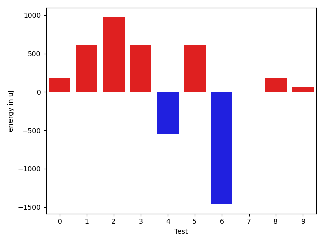
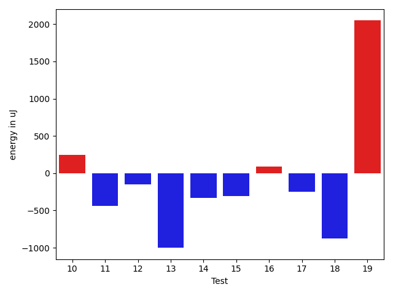
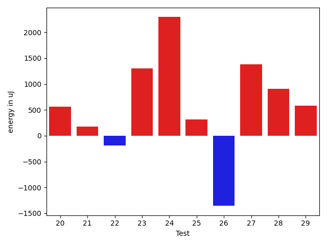
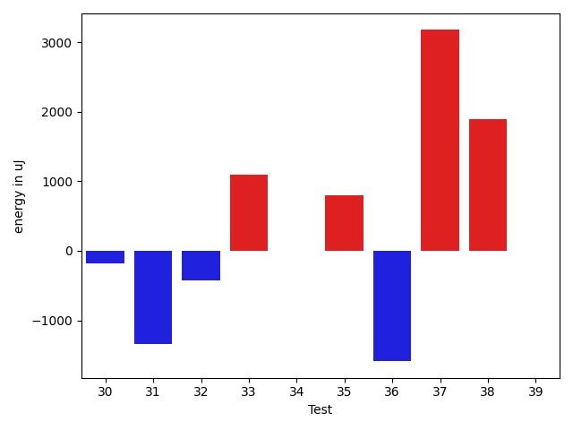
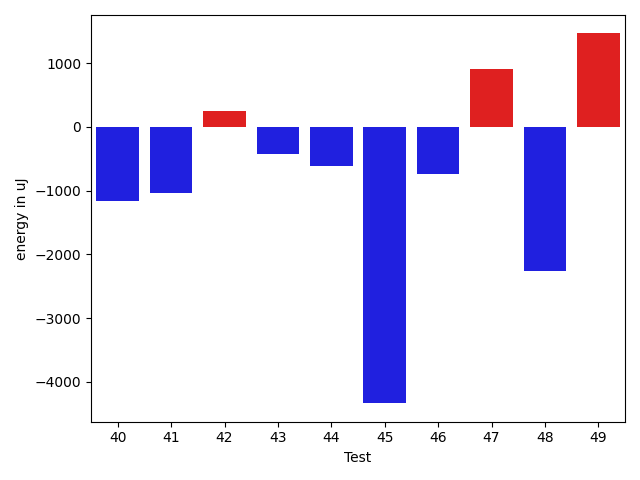
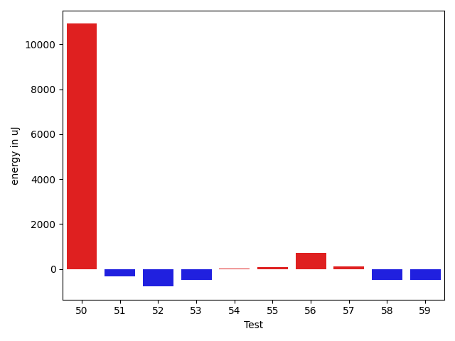
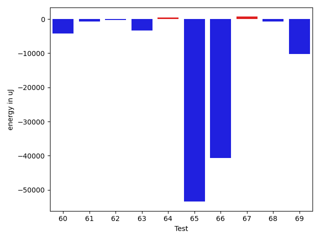

# gson e2cfc0

https://github.com/google/gson/commit/e2cfc0

## Delta Energy per test method

| ID | EnergyV1 | EnergyV2 | DeltaEnergy | σV1 | σV2 |
| --- | --- | --- | --- | --- | --- |
| 0 | 35767 | 35950 | 183 | 3521.8256587248106 | 6294.851320816641 |
| 1 | 35644 | 36255 | 611 | 3632.85689409354 | 3436.5452173094195 |
| 2 | 34668 | 35644 | 976 | 5765.640893922813 | 11632.70734108502 |
| 3 | 37353 | 37964 | 611 | 36907.21433772946 | 25082.990630412143 |
| 4 | 36926 | 36377 | -549 | 3558.89438217982 | 5201.653499400988 |
| 5 | 71350 | 71960 | 610 | 22999.769396935546 | 18958.259610142664 |
| 6 | 36804 | 35339 | -1465 | 37373.2380288888 | 29375.47143241487 |
| 7 | 39246 | 39246 | 0 | 71279.55953844551 | 55369.67918094776 |
| 8 | 35340 | 35522 | 182 | 3223.7402192055365 | 3502.4379684825376 |
| 9 | 36377 | 36437 | 60 | 12177.100263824654 | 12389.999082944538 |
| 10 | 35827 | 35644 | -183 | 3196.324203157527 | 3970.801311226899 |
| 11 | 36011 | 35522 | -489 | 2915.5675950047303 | 3654.947744834174 |
| 12 | 35584 | 35644 | 60 | 4230.530316348558 | 3100.542511768537 |
| 13 | 36072 | 34241 | -1831 | 3056.3655805520825 | 3241.092318887287 |
| 14 | 35034 | 34729 | -305 | 3918.5381326380857 | 3217.28004421071 |
| 15 | 36010 | 35217 | -793 | 3420.5614390906285 | 3802.237489387207 |
| 16 | 34606 | 35156 | 550 | 3945.4684526196993 | 2981.42107938274 |
| 17 | 35888 | 35279 | -609 | 5875.395859586073 | 5060.807966781984 |
| 18 | 37476 | 37109 | -367 | 3928.0647846170305 | 3809.207316319004 |
| 19 | 36377 | 37293 | 916 | 7408.857844884898 | 9654.61544700503 |
| 20 | 36682 | 38086 | 1404 | 3603.3509733996216 | 3817.352509524472 |
| 21 | 36254 | 36560 | 306 | 11201.850080350448 | 11035.423695614503 |
| 22 | 38086 | 38635 | 549 | 23190.277228614585 | 24893.22326488146 |
| 23 | 92957 | 80993 | -11964 | 59404.013877153695 | 52532.743849921826 |
| 24 | 36071 | 37109 | 1038 | 9579.478851863627 | 11634.083028784462 |
| 25 | 36011 | 36194 | 183 | 3703.6718297424663 | 3330.535060782729 |
| 26 | 35339 | 36926 | 1587 | 19368.363682069637 | 6105.741260216022 |
| 27 | 34546 | 35583 | 1037 | 3795.882608681266 | 3825.3839550596904 |
| 28 | 34790 | 36194 | 1404 | 3499.2780952946023 | 3083.832821793443 |
| 29 | 35584 | 35522 | -62 | 3313.122276308775 | 3982.4151422918676 |
| 30 | 38696 | 38513 | -183 | 388528.44453424506 | 318050.38375252235 |
| 31 | 38940 | 37598 | -1342 | 4314.455136268465 | 3270.6313938268427 |
| 32 | 37353 | 36926 | -427 | 3945.040002253103 | 3169.643995617949 |
| 33 | 34180 | 35278 | 1098 | 5865.3349727846335 | 5718.778208299115 |
| 34 | 35157 | 35156 | -1 | 12304.974734930745 | 9558.350765881965 |
| 35 | 35522 | 36315 | 793 | 48746.85206565562 | 69703.49641892673 |
| 36 | 38513 | 36926 | -1587 | 35779.3920192307 | 33964.367321036814 |
| 37 | 38574 | 41748 | 3174 | 23777.705926451003 | 21272.536145423786 |
| 38 | 38025 | 39917 | 1892 | 562814.7290279642 | 649235.3624740369 |
| 39 | 35950 | 35949 | -1 | 5043.205818251238 | 8665.518708322212 |
| 40 | 37964 | 36804 | -1160 | 6957.648972424664 | 7864.275374738744 |
| 41 | 38330 | 37293 | -1037 | 17865.575459988497 | 12821.87930507014 |
| 42 | 37902 | 38147 | 245 | 30532.58011355301 | 38844.873702117104 |
| 43 | 38941 | 38513 | -428 | 10410.484161598994 | 5826.195994305406 |
| 44 | 39428 | 38818 | -610 | 6733.999754504958 | 10360.753598979441 |
| 45 | 75683 | 71350 | -4333 | 25167.91039250479 | 27910.05476547722 |
| 46 | 41809 | 41076 | -733 | 14166.205983903916 | 12722.30792971911 |
| 47 | 38208 | 39123 | 915 | 13901.99109603885 | 12415.992190457997 |
| 48 | 83068 | 80811 | -2257 | 103720.28175070322 | 98595.77864594263 |
| 49 | 40589 | 42053 | 1464 | 22078.305184784138 | 21215.60602603804 |
| 50 | 38025 | 39490 | 1465 | 35873.22148454686 | 46722.705388279894 |
| 51 | 37842 | 37109 | -733 | 3738.8610601413966 | 3930.10841956154 |
| 52 | 38147 | 36438 | -1709 | 2688.5908367581706 | 3432.73438134095 |
| 53 | 35644 | 35950 | 306 | 3433.8792433043377 | 3711.81527174646 |
| 54 | 36804 | 37292 | 488 | 3126.995926413964 | 3842.486862637375 |
| 55 | 35889 | 36377 | 488 | 3586.796505177032 | 3350.4318808621033 |
| 56 | 36560 | 37414 | 854 | 4371.494131015162 | 4613.699510327654 |
| 57 | 36010 | 37353 | 1343 | 2729.306895265613 | 3216.10614098154 |
| 58 | 35645 | 36255 | 610 | 4996.241785804828 | 2629.882687135851 |
| 59 | 37964 | 37231 | -733 | 4063.3575572123973 | 2902.9066735869337 |
| 60 | 39124 | 37598 | -1526 | 12452.033052528983 | 9561.852637524195 |
| 61 | 36987 | 36316 | -671 | 3524.522454264158 | 3486.943273209605 |
| 62 | 35888 | 36498 | 610 | 3769.987119089291 | 4270.582067018 |
| 63 | 38818 | 35828 | -2990 | 5377.835734139804 | 2661.836200820779 |
| 64 | 40222 | 39673 | -549 | 51607.99219657284 | 56329.1806695131 |
| 65 | 40039 | 39490 | -549 | 564989.4932690257 | 458547.32597878325 |
| 66 | 42602 | 39306 | -3296 | 116412.31645089948 | 85161.72451949162 |
| 67 | 36438 | 36865 | 427 | 3137.936322630432 | 3501.367549194995 |
| 68 | 38208 | 37170 | -1038 | 3910.7422230637717 | 3201.0652546524157 |
| 69 | 38513 | 38452 | -61 | 628550.1179248288 | 671755.2645670393 |

## Delta Duration per test method

| ID | DurationV1 | DurationsV2 | DeltaDuration |
| --- | --- | --- | --- |
| 0 | 822632.298245614 | 869568.1020408163 | 46935.803795202286 |
| 1 | 934878.0185185185 | 911035.9821428572 | -23842.03637566138 |
| 2 | 1079085.9295774647 | 1089022.5694444445 | 9936.639866979793 |
| 3 | 1388923.8055555555 | 1360752.043478261 | -28171.762077294523 |
| 4 | 1027282.5921052631 | 1011229.2702702703 | -16053.32183499285 |
| 5 | 2352400.9292929294 | 2284850.1919191917 | -67550.73737373762 |
| 6 | 1587745.7341772153 | 1473616.72 | -114129.01417721529 |
| 7 | 1796061.5483870967 | 1471851.5972222222 | -324209.9511648745 |
| 8 | 868029.0 | 892048.0169491526 | 24019.016949152574 |
| 9 | 1219983.8148148148 | 1216976.939759036 | -3006.8750557787716 |
| 10 | 1066476.2857142857 | 1102225.7313432836 | 35749.44562899787 |
| 11 | 806213.2916666666 | 827926.0819672131 | 21712.790300546447 |
| 12 | 529155.2258064516 | 530945.2777777778 | 1790.0519713261165 |
| 13 | 545392.3181818182 | 532803.6176470588 | -12588.700534759439 |
| 14 | 858064.0714285715 | 845556.9056603773 | -12507.165768194129 |
| 15 | 840032.0833333334 | 826378.375 | -13653.708333333372 |
| 16 | 854725.911111111 | 856392.3658536585 | 1666.4547425474739 |
| 17 | 1150738.5609756098 | 1125164.1547619049 | -25574.406213704962 |
| 18 | 747904.375 | 799496.3846153846 | 51592.009615384624 |
| 19 | 983961.8070175438 | 1013212.9137931034 | 29251.1067755596 |
| 20 | 772997.325 | 769267.8095238095 | -3729.515476190485 |
| 21 | 1318150.9047619049 | 1298084.3529411764 | -20066.551820728462 |
| 22 | 972378.875 | 940281.2894736842 | -32097.585526315845 |
| 23 | 2953353.373737374 | 2964507.663265306 | 11154.289527932182 |
| 24 | 1077467.9166666667 | 1134367.9014084507 | 56899.984741783934 |
| 25 | 955542.679245283 | 959150.9516129033 | 3608.2723676202586 |
| 26 | 919251.6842105263 | 750215.268292683 | -169036.41591784335 |
| 27 | 948485.9 | 922056.2857142857 | -26429.614285714342 |
| 28 | 649725.0 | 671752.5862068966 | 22027.58620689658 |
| 29 | 644216.71875 | 572774.7666666667 | -71441.95208333328 |
| 30 | 3775146.797752809 | 3138345.430232558 | -636801.3675202508 |
| 31 | 634751.6521739131 | 596247.1904761905 | -38504.46169772255 |
| 32 | 743621.8529411765 | 741625.0952380953 | -1996.757703081239 |
| 33 | 1150956.0714285714 | 1126189.4024390243 | -24766.668989547063 |
| 34 | 1389799.0111111111 | 1293094.3068181819 | -96704.70429292927 |
| 35 | 1762178.252631579 | 1833040.0 | 70861.74736842094 |
| 36 | 2010985.802197802 | 1851429.4347826086 | -159556.36741519347 |
| 37 | 1759923.7777777778 | 1717543.1818181819 | -42380.59595959587 |
| 38 | 6058647.423076923 | 8657132.516129032 | 2598485.093052109 |
| 39 | 1200796.9277108433 | 1174567.7415730336 | -26229.18613780965 |
| 40 | 957755.253968254 | 992607.8166666667 | 34852.56269841269 |
| 41 | 1123014.0666666667 | 971352.5510204082 | -151661.5156462585 |
| 42 | 1278245.8974358975 | 1583841.0943396227 | 305595.19690372515 |
| 43 | 1008032.7540983607 | 989203.9629629629 | -18828.79113539774 |
| 44 | 964386.3611111111 | 964204.4444444445 | -181.91666666662786 |
| 45 | 2306487.9191919193 | 2323833.262626263 | 17345.34343434358 |
| 46 | 954154.8055555555 | 1259442.1875 | 305287.3819444445 |
| 47 | 1242244.0303030303 | 1126682.072463768 | -115561.9578392622 |
| 48 | 3705528.1717171716 | 3388752.1818181816 | -316775.9898989899 |
| 49 | 1723343.121212121 | 1758527.387755102 | 35184.26654298091 |
| 50 | 1266942.294117647 | 1699820.4 | 432878.1058823529 |
| 51 | 733706.8604651163 | 725379.9565217391 | -8326.903943377198 |
| 52 | 483553.625 | 553293.8846153846 | 69740.25961538462 |
| 53 | 502869.4761904762 | 550370.7272727273 | 47501.25108225108 |
| 54 | 546764.0476190476 | 567753.5357142857 | 20989.488095238106 |
| 55 | 655773.4411764706 | 681659.1282051282 | 25885.687028657645 |
| 56 | 486810.4375 | 506264.6923076923 | 19454.254807692312 |
| 57 | 494742.95652173914 | 483795.46153846156 | -10947.494983277575 |
| 58 | 463994.73333333334 | 463898.35294117645 | -96.3803921568906 |
| 59 | 433131.71428571426 | 432557.13333333336 | -574.5809523809003 |
| 60 | 1151917.4736842106 | 1005470.7333333333 | -146446.74035087728 |
| 61 | 519316.1904761905 | 499772.5263157895 | -19543.66416040098 |
| 62 | 556493.8181818182 | 556150.0 | -343.81818181823473 |
| 63 | 524563.1176470588 | 578502.5 | 53939.382352941204 |
| 64 | 1897753.171875 | 1828580.472972973 | -69172.69890202698 |
| 65 | 6511595.169014084 | 4923340.584615384 | -1588254.5843987 |
| 66 | 3466462.8181818184 | 2222451.5681818184 | -1244011.25 |
| 67 | 678824.4444444445 | 654979.4347826086 | -23845.00966183585 |
| 68 | 620125.5185185185 | 558886.2631578947 | -61239.25536062382 |
| 69 | 9306469.92857143 | 8228303.411764706 | -1078166.5168067235 |

## Misc.

| ID | Test Class | Test Method |
| --- | --- | --- |
| 0 | com.google.gson.functional.CustomTypeAdaptersTest | testCustomTypeAdapterAppliesToSubClassesSerializedAsBaseClass |
| 1 | com.google.gson.functional.CustomTypeAdaptersTest | testCustomAdapterInvokedForMapElementDeserialization |
| 2 | com.google.gson.functional.CustomTypeAdaptersTest | testCustomAdapterInvokedForMapElementSerializationWithType |
| 3 | com.google.gson.functional.CustomTypeAdaptersTest | testCustomNestedSerializers |
| 4 | com.google.gson.functional.CustomTypeAdaptersTest | testCustomNestedDeserializers |
| 5 | com.google.gson.functional.CustomTypeAdaptersTest | testCustomTypeAdapterDoesNotAppliesToSubClasses |
| 6 | com.google.gson.functional.CustomTypeAdaptersTest | testCustomAdapterInvokedForCollectionElementSerializationWithType |
| 7 | com.google.gson.functional.CustomTypeAdaptersTest | testCustomDeserializers |
| 8 | com.google.gson.functional.CustomTypeAdaptersTest | testCustomByteArrayDeserializerAndInstanceCreator |
| 9 | com.google.gson.functional.CustomTypeAdaptersTest | testCustomDeserializerForLong |
| 10 | com.google.gson.functional.CustomTypeAdaptersTest | testCustomSerializerForLong |
| 11 | com.google.gson.functional.CustomTypeAdaptersTest | testCustomByteArraySerializer |
| 12 | com.google.gson.functional.CustomTypeAdaptersTest | testCustomAdapterInvokedForMapElementSerialization |
| 13 | com.google.gson.functional.CustomTypeAdaptersTest | testCustomAdapterInvokedForCollectionElementSerialization |
| 14 | com.google.gson.functional.DefaultTypeAdaptersTest | testDateSerializationWithPattern |
| 15 | com.google.gson.functional.DefaultTypeAdaptersTest | testDateDeserializationWithPattern |
| 16 | com.google.gson.functional.DefaultTypeAdaptersTest | testDefaultDateSerializationUsingBuilder |
| 17 | com.google.gson.functional.DefaultTypeAdaptersTest | testDefaultDateDeserializationUsingBuilder |
| 18 | com.google.gson.functional.DefaultTypeAdaptersTest | testSetSerialization |
| 19 | com.google.gson.functional.ObjectTest | testNestedSerialization |
| 20 | com.google.gson.functional.ObjectTest | testBagOfPrimitiveWrappersSerialization |
| 21 | com.google.gson.functional.ObjectTest | testArrayOfArraysSerialization |
| 22 | com.google.gson.functional.ObjectTest | testBagOfPrimitivesSerialization |
| 23 | com.google.gson.functional.ObjectTest | testSubInterfacesOfCollectionSerialization |
| 24 | com.google.gson.functional.ObjectTest | testInheritenceSerialization |
| 25 | com.google.gson.functional.ObjectTest | testArrayOfObjectsSerialization |
| 26 | com.google.gson.functional.ObjectTest | testClassWithTransientFieldsSerialization |
| 27 | com.google.gson.functional.ObjectTest | testInnerClassDeserialization |
| 28 | com.google.gson.functional.ObjectTest | testNullFieldsSerialization |
| 29 | com.google.gson.functional.ObjectTest | testPrimitiveArrayFieldSerialization |
| 30 | com.google.gson.functional.FieldExclusionTest | testDefaultInnerClassExclusion |
| 31 | com.google.gson.functional.FieldExclusionTest | testInnerClassExclusion |
| 32 | com.google.gson.functional.FieldExclusionTest | testDefaultNestedStaticClassIncluded |
| 33 | com.google.gson.functional.ParameterizedTypesTest | testParameterizedTypeWithReaderDeserialization |
| 34 | com.google.gson.functional.ParameterizedTypesTest | testParameterizedTypeWithCustomSerializer |
| 35 | com.google.gson.functional.ParameterizedTypesTest | testParameterizedTypeDeserialization |
| 36 | com.google.gson.functional.ParameterizedTypesTest | testTypesWithMultipleParametersSerialization |
| 37 | com.google.gson.functional.ParameterizedTypesTest | testParameterizedTypesWithCustomDeserializer |
| 38 | com.google.gson.FunctionWithInternalDependenciesTest | testAnonymousLocalClassesSerialization |
| 39 | com.google.gson.functional.MapTest | testParameterizedMapSubclassDeserialization |
| 40 | com.google.gson.functional.MapTest | testMapSerializationWithNullValueButSerializeNulls |
| 41 | com.google.gson.functional.ArrayTest | testArrayOfPrimitivesWithCustomTypeAdapter |
| 42 | com.google.gson.functional.VersioningTest | testVersionedGsonWithUnversionedClassesSerialization |
| 43 | com.google.gson.functional.NullObjectAndFieldTest | testPrintPrintingObjectWithNulls |
| 44 | com.google.gson.functional.NullObjectAndFieldTest | testPrintPrintingArraysWithNulls |
| 45 | com.google.gson.functional.UncategorizedTest | testReturningDerivedClassesDuringDeserialization |
| 46 | com.google.gson.functional.UncategorizedTest | testStaticFieldsAreNotSerialized |
| 47 | com.google.gson.functional.PrettyPrintingTest | testPrettyPrintArrayOfObjects |
| 48 | com.google.gson.functional.PrettyPrintingTest | testPrettyPrintList |
| 49 | com.google.gson.functional.CollectionTest | testWildcardCollectionField |
| 50 | com.google.gson.functional.CollectionTest | testCollectionOfBagOfPrimitivesSerialization |
| 51 | com.google.gson.functional.CollectionTest | testRawCollectionSerialization |
| 52 | com.google.gson.functional.PrimitiveTest | testNegativeInfinitySerialization |
| 53 | com.google.gson.functional.PrimitiveTest | testFloatInfinitySerialization |
| 54 | com.google.gson.functional.PrimitiveTest | testDoubleNaNSerialization |
| 55 | com.google.gson.functional.PrimitiveTest | testHtmlCharacterSerialization |
| 56 | com.google.gson.functional.PrimitiveTest | testDoubleInfinitySerialization |
| 57 | com.google.gson.functional.PrimitiveTest | testNumberSerialization |
| 58 | com.google.gson.functional.PrimitiveTest | testPrimitiveLongAutoboxedSerialization |
| 59 | com.google.gson.functional.PrimitiveTest | testReallyLongValuesSerialization |
| 60 | com.google.gson.functional.PrimitiveTest | testOverridingDefaultPrimitiveSerialization |
| 61 | com.google.gson.functional.PrimitiveTest | testFloatNaNSerialization |
| 62 | com.google.gson.functional.PrimitiveTest | testPrimitiveLongAutoboxedInASingleElementArraySerialization |
| 63 | com.google.gson.functional.PrimitiveTest | testNegativeInfinityFloatSerialization |
| 64 | com.google.gson.functional.EscapingTest | testEscapingObjectFields |
| 65 | com.google.gson.functional.PrintFormattingTest | testCompactFormattingLeavesNoWhiteSpace |
| 66 | com.google.gson.functional.ReadersWritersTest | testWriterForSerialization |
| 67 | com.google.gson.functional.ReadersWritersTest | testTopLevelNullObjectDeserializationWithReaderAndSerializeNulls |
| 68 | com.google.gson.functional.ReadersWritersTest | testTopLevelNullObjectSerializationWithWriterAndSerializeNulls |
| 69 | com.google.gson.GsonBuilderTest | testCreatingMoreThanOnce |

| Test | IterationV1 | IterationV2 | DeltaIteration |
| --- | --- | --- | --- |
| 0 | 57 | 49 | -8 |
| 1 | 54 | 56 | 2 |
| 2 | 71 | 72 | 1 |
| 3 | 72 | 69 | -3 |
| 4 | 76 | 74 | -2 |
| 5 | 99 | 99 | 0 |
| 6 | 79 | 75 | -4 |
| 7 | 62 | 72 | 10 |
| 8 | 57 | 59 | 2 |
| 9 | 81 | 83 | 2 |
| 10 | 63 | 67 | 4 |
| 11 | 48 | 61 | 13 |
| 12 | 31 | 18 | -13 |
| 13 | 22 | 34 | 12 |
| 14 | 56 | 53 | -3 |
| 15 | 48 | 56 | 8 |
| 16 | 45 | 41 | -4 |
| 17 | 82 | 84 | 2 |
| 18 | 32 | 26 | -6 |
| 19 | 57 | 58 | 1 |
| 20 | 40 | 42 | 2 |
| 21 | 84 | 85 | 1 |
| 22 | 40 | 38 | -2 |
| 23 | 99 | 98 | -1 |
| 24 | 72 | 71 | -1 |
| 25 | 53 | 62 | 9 |
| 26 | 38 | 41 | 3 |
| 27 | 60 | 63 | 3 |
| 28 | 42 | 29 | -13 |
| 29 | 32 | 30 | -2 |
| 30 | 89 | 86 | -3 |
| 31 | 23 | 21 | -2 |
| 32 | 34 | 42 | 8 |
| 33 | 84 | 82 | -2 |
| 34 | 90 | 88 | -2 |
| 35 | 95 | 90 | -5 |
| 36 | 91 | 92 | 1 |
| 37 | 99 | 99 | 0 |
| 38 | 52 | 62 | 10 |
| 39 | 83 | 89 | 6 |
| 40 | 63 | 60 | -3 |
| 41 | 45 | 49 | 4 |
| 42 | 39 | 53 | 14 |
| 43 | 61 | 54 | -7 |
| 44 | 36 | 45 | 9 |
| 45 | 99 | 99 | 0 |
| 46 | 36 | 32 | -4 |
| 47 | 66 | 69 | 3 |
| 48 | 99 | 99 | 0 |
| 49 | 99 | 98 | -1 |
| 50 | 51 | 45 | -6 |
| 51 | 43 | 46 | 3 |
| 52 | 16 | 26 | 10 |
| 53 | 21 | 22 | 1 |
| 54 | 21 | 28 | 7 |
| 55 | 34 | 39 | 5 |
| 56 | 16 | 26 | 10 |
| 57 | 23 | 13 | -10 |
| 58 | 15 | 17 | 2 |
| 59 | 14 | 15 | 1 |
| 60 | 38 | 45 | 7 |
| 61 | 21 | 19 | -2 |
| 62 | 22 | 19 | -3 |
| 63 | 17 | 20 | 3 |
| 64 | 64 | 74 | 10 |
| 65 | 71 | 65 | -6 |
| 66 | 44 | 44 | 0 |
| 67 | 27 | 23 | -4 |
| 68 | 27 | 19 | -8 |
| 69 | 28 | 34 | 6 |

| Time Label | Time (s) |
| --- | --- |
| Selection | 23.511122226715088 |
| Injection | 11.225844144821167 |
| Total | 985.2112083435059 |

