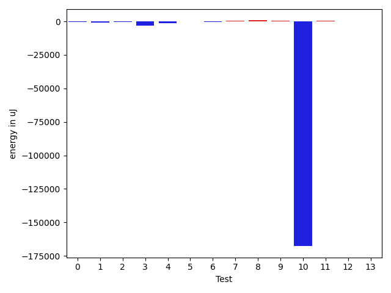
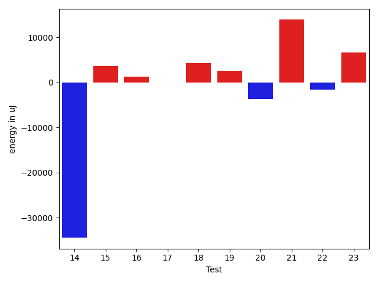

# gson cc3344

https://github.com/google/gson/commit/cc3344

## Delta Energy per test method

| ID | EnergyV1 | EnergyV2 | DeltaEnergy | σV1 | σV2 |
| --- | --- | --- | --- | --- | --- |
| 0 | 34729 | 34363 | -366 | 35034.621495294785 | 3706.052612043112 |
| 1 | 33875 | 33020 | -855 | 5659.010341734548 | 6178.875282160986 |
| 2 | 33203 | 32898 | -305 | 7792.515500499694 | 2907.853902282527 |
| 3 | 41382 | 38208 | -3174 | 53524.00966141105 | 45661.426130220185 |
| 4 | 39611 | 38330 | -1281 | 16822.997602222233 | 18614.762514692342 |
| 5 | 36560 | 36743 | 183 | 3683.055707255421 | 3316.871161181129 |
| 6 | 36011 | 35766 | -245 | 6873.841351834683 | 35536.74955294665 |
| 7 | 36010 | 36621 | 611 | 67152.12671929863 | 55245.217706631374 |
| 8 | 34912 | 35645 | 733 | 3663.9820938359708 | 3493.71427344748 |
| 9 | 34973 | 35461 | 488 | 6389.211247131203 | 7900.634053907241 |
| 10 | 211181 | 43457 | -167724 | 120836.13857388143 | 125033.0995408269 |
| 11 | 36438 | 36743 | 305 | 11107.024913636387 | 14663.355045875038 |
| 12 | 35766 | 35767 | 1 | 38682.74623663433 | 30199.270426589897 |
| 13 | 36011 | 35949 | -62 | 3076.148815794626 | 3366.035860338677 |
| 14 | 40222 | 37842 | -2380 | 123000.97814811212 | 120964.47593742257 |
| 15 | 34424 | 34912 | 488 | 3398.7930482349047 | 27260.039260396774 |
| 16 | 35095 | 36865 | 1770 | 3716.494738736429 | 3677.272628571273 |
| 17 | 36255 | 36926 | 671 | 3610.6683430432568 | 3532.3740646404335 |
| 18 | 36560 | 36926 | 366 | 3502.138364587635 | 27597.70711237194 |
| 19 | 35095 | 36621 | 1526 | 3474.9446691461408 | 4189.9157635765605 |
| 20 | 37414 | 35217 | -2197 | 40411.62903155638 | 37682.47346680506 |
| 21 | 36621 | 37903 | 1282 | 61872.10355127828 | 75890.06266029627 |
| 22 | 37597 | 36193 | -1404 | 4337.276639493958 | 4447.943768937091 |
| 23 | 37536 | 38452 | 916 | 64762.57455918813 | 67109.39054925581 |

## Delta Duration per test method

| ID | DurationV1 | DurationsV2 | DeltaDuration |
| --- | --- | --- | --- |
| 0 | 1220121.4714285715 | 1163522.961038961 | -56598.51038961043 |
| 1 | 1226405.962962963 | 1326420.1 | 100014.13703703717 |
| 2 | 803838.3333333334 | 720439.027027027 | -83399.30630630639 |
| 3 | 2198431.5507246377 | 1878323.3 | -320108.25072463765 |
| 4 | 1618819.625 | 1378674.4166666667 | -240145.20833333326 |
| 5 | 947054.3793103448 | 942779.1020408163 | -4275.27726952848 |
| 6 | 990586.0508474576 | 1117964.4915254237 | 127378.44067796611 |
| 7 | 1662518.2717391304 | 1571382.7608695652 | -91135.51086956519 |
| 8 | 1049478.2222222222 | 1024977.1884057971 | -24501.03381642513 |
| 9 | 1234995.402173913 | 1273408.0697674418 | 38412.66759352875 |
| 10 | 5128873.056818182 | 4597972.384615385 | -530900.6722027967 |
| 11 | 1413688.9484536082 | 1445812.0416666667 | 32123.093213058542 |
| 12 | 1118838.2241379311 | 1135415.8196721312 | 16577.59553420008 |
| 13 | 975690.2033898305 | 994165.21875 | 18475.015360169462 |
| 14 | 4244162.7875 | 3032726.2266666666 | -1211436.560833333 |
| 15 | 1028209.1315789474 | 1113912.6764705882 | 85703.54489164078 |
| 16 | 903554.0 | 925728.1379310344 | 22174.137931034435 |
| 17 | 761919.7419354839 | 759985.1538461539 | -1934.5880893300055 |
| 18 | 975772.0158730159 | 1088195.4561403508 | 112423.44026733493 |
| 19 | 619976.6666666666 | 634832.4285714285 | 14855.761904761894 |
| 20 | 1336035.109375 | 1307622.0476190476 | -28413.061755952425 |
| 21 | 1806666.5970149254 | 2270637.9852941176 | 463971.38827919215 |
| 22 | 561823.9 | 625631.8235294118 | 63807.92352941178 |
| 23 | 1912470.88 | 2138438.707692308 | 225967.827692308 |

## Misc.

| ID | Test Class | Test Method |
| --- | --- | --- |
| 0 | com.google.gson.functional.CustomTypeAdaptersTest | testCustomAdapterInvokedForMapElementDeserialization |
| 1 | com.google.gson.functional.CustomTypeAdaptersTest | testCustomAdapterInvokedForMapElementSerializationWithType |
| 2 | com.google.gson.functional.CustomTypeAdaptersTest | testCustomAdapterInvokedForMapElementSerialization |
| 3 | com.google.gson.DefaultMapJsonSerializerTest | testEmptyMapSerialization |
| 4 | com.google.gson.DefaultMapJsonSerializerTest | testEmptyMapNoTypeSerialization |
| 5 | com.google.gson.functional.MapTest | testMapSerializationEmpty |
| 6 | com.google.gson.functional.MapTest | testMapDeserializationWithNullKey |
| 7 | com.google.gson.functional.MapTest | testParameterizedMapSubclassDeserialization |
| 8 | com.google.gson.functional.MapTest | testMapSerializationWithNullValueButSerializeNulls |
| 9 | com.google.gson.functional.MapTest | testMapSerializationWithWildcardValues |
| 10 | com.google.gson.functional.MapTest | testMapDeserialization |
| 11 | com.google.gson.functional.MapTest | testParameterizedMapSubclassSerialization |
| 12 | com.google.gson.functional.MapTest | testMapDeserializationWithNullValue |
| 13 | com.google.gson.functional.MapTest | testMapSerializationWithNullValue |
| 14 | com.google.gson.functional.MapTest | testMapSerialization |
| 15 | com.google.gson.functional.MapTest | testMapDeserializationWithWildcardValues |
| 16 | com.google.gson.functional.MapTest | testMapSerializationWithNullKey |
| 17 | com.google.gson.functional.MapTest | testRawMapSerialization |
| 18 | com.google.gson.functional.MapTest | testMapDeserializationEmpty |
| 19 | com.google.gson.functional.MapTest | testMapSubclassSerialization |
| 20 | com.google.gson.TypeInfoMapTest | testNonMapConstruction |
| 21 | com.google.gson.TypeInfoMapTest | testMapImplementations |
| 22 | com.google.gson.TypeInfoMapTest | testInvalidConstruction |
| 23 | com.google.gson.TypeInfoMapTest | testBasicGetters |

| Test | IterationV1 | IterationV2 | DeltaIteration |
| --- | --- | --- | --- |
| 0 | 70 | 77 | 7 |
| 1 | 81 | 80 | -1 |
| 2 | 33 | 37 | 4 |
| 3 | 69 | 60 | -9 |
| 4 | 40 | 36 | -4 |
| 5 | 58 | 49 | -9 |
| 6 | 59 | 59 | 0 |
| 7 | 92 | 92 | 0 |
| 8 | 72 | 69 | -3 |
| 9 | 92 | 86 | -6 |
| 10 | 88 | 78 | -10 |
| 11 | 97 | 96 | -1 |
| 12 | 58 | 61 | 3 |
| 13 | 59 | 64 | 5 |
| 14 | 80 | 75 | -5 |
| 15 | 76 | 68 | -8 |
| 16 | 60 | 58 | -2 |
| 17 | 31 | 26 | -5 |
| 18 | 63 | 57 | -6 |
| 19 | 33 | 28 | -5 |
| 20 | 64 | 63 | -1 |
| 21 | 67 | 68 | 1 |
| 22 | 20 | 17 | -3 |
| 23 | 50 | 65 | 15 |

| Time Label | Time (s) |
| --- | --- |
| Selection | 23.93152093887329 |
| Injection | 9.046013832092285 |
| Total | 939.4237570762634 |

