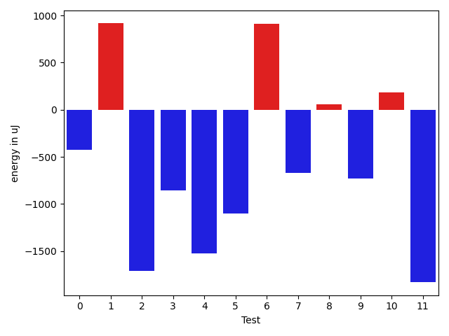
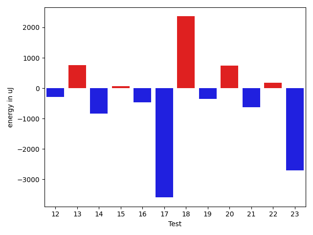
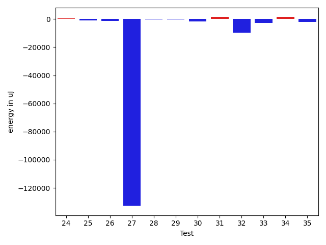
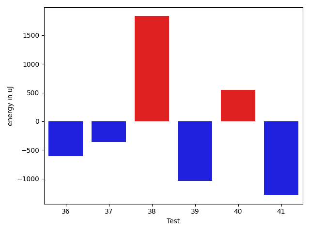

# gson e83933

https://github.com/google/gson/commit/e83933

## Delta Energy per test method

| ID | EnergyV1 | EnergyV2 | DeltaEnergy | σV1 | σV2 |
| --- | --- | --- | --- | --- | --- |
| 0 | 35949 | 35522 | -427 | 3766.7881022608067 | 3718.306730331483 |
| 1 | 34423 | 35339 | 916 | 7897.500393576299 | 5627.66664196987 |
| 2 | 39002 | 37292 | -1710 | 41462.83498366898 | 46196.96767614673 |
| 3 | 35645 | 34790 | -855 | 3086.979717746422 | 3588.654242059853 |
| 4 | 37658 | 36133 | -1525 | 5561.760815531685 | 7806.42312163371 |
| 5 | 73364 | 72265 | -1099 | 22941.471239135022 | 22344.94308917349 |
| 6 | 37659 | 38574 | 915 | 33814.90156935503 | 156456.54785259863 |
| 7 | 39246 | 38574 | -672 | 67729.16875157715 | 160492.50506954268 |
| 8 | 36560 | 36621 | 61 | 4491.686694744076 | 6648.257270356757 |
| 9 | 36560 | 35827 | -733 | 3868.523226027236 | 3346.533394201516 |
| 10 | 36499 | 36682 | 183 | 15669.644115134624 | 12759.37019397285 |
| 11 | 36255 | 34424 | -1831 | 4485.80696844651 | 4070.3160041162705 |
| 12 | 36194 | 35156 | -1038 | 3766.8807738529604 | 3991.4549035534137 |
| 13 | 35217 | 36072 | 855 | 3327.4420623319675 | 4631.628210931608 |
| 14 | 36560 | 35949 | -611 | 4130.498596553847 | 3445.1351869556584 |
| 15 | 36377 | 36193 | -184 | 7288.2304577353825 | 6781.054447748348 |
| 16 | 36438 | 35401 | -1037 | 4029.8928030932134 | 5780.606047159842 |
| 17 | 36927 | 35828 | -1099 | 11164.215011974642 | 6048.6475445902515 |
| 18 | 35278 | 36682 | 1404 | 3707.607583654856 | 9319.496508754137 |
| 19 | 39062 | 37049 | -2013 | 7461.964392661863 | 10234.383641493121 |
| 20 | 36987 | 38758 | 1771 | 3297.929701595634 | 4343.325676666873 |
| 21 | 36865 | 36010 | -855 | 3961.931011514461 | 3077.0630881594993 |
| 22 | 36805 | 37415 | 610 | 4120.747821677709 | 4501.254853926846 |
| 23 | 38818 | 34973 | -3845 | 3962.3369658167344 | 2981.706886734509 |
| 24 | 36926 | 37048 | 122 | 3702.2003421295135 | 3488.523584107609 |
| 25 | 37048 | 39063 | 2015 | 4470.533324067723 | 3848.4795893194346 |
| 26 | 38940 | 36805 | -2135 | 3008.6492716681514 | 3358.5389602854248 |
| 27 | 40039 | 39856 | -183 | 631837.3607824378 | 474372.08772632893 |
| 28 | 36560 | 36743 | 183 | 4106.365182206422 | 3078.856863059709 |
| 29 | 36438 | 36011 | -427 | 4304.904463552173 | 4910.982108449482 |
| 30 | 35461 | 34546 | -915 | 9213.271449582297 | 7455.76761287087 |
| 31 | 36316 | 36071 | -245 | 9820.673250095162 | 11879.264163515885 |
| 32 | 37659 | 38147 | 488 | 118493.87486489599 | 100906.7283148915 |
| 33 | 40345 | 39734 | -611 | 23775.86681050683 | 20173.25927872693 |
| 34 | 38513 | 39002 | 489 | 13481.39586455154 | 13630.874143463088 |
| 35 | 38391 | 36133 | -2258 | 7029.998848451595 | 7263.66239079846 |
| 36 | 37719 | 37109 | -610 | 8993.416244331276 | 8218.239719439183 |
| 37 | 76843 | 76477 | -366 | 35662.79598180252 | 38589.00704412548 |
| 38 | 37780 | 39612 | 1832 | 656046.7503565686 | 777080.2079013218 |
| 39 | 36194 | 35156 | -1038 | 7401.4625526325435 | 9882.998755153529 |
| 40 | 38819 | 39368 | 549 | 4086.4180407834447 | 5177.161859706533 |
| 41 | 39185 | 37902 | -1283 | 12395.554769729953 | 6078.262867406618 |

## Delta Duration per test method

| ID | DurationV1 | DurationsV2 | DeltaDuration |
| --- | --- | --- | --- |
| 0 | 892374.3962264151 | 967864.7692307692 | 75490.37300435419 |
| 1 | 1164342.731707317 | 1240696.7777777778 | 76354.0460704607 |
| 2 | 1786225.4078947369 | 1939195.5952380951 | 152970.1873433583 |
| 3 | 594187.8518518518 | 574317.9393939395 | -19869.912457912345 |
| 4 | 1099153.3285714285 | 1140741.676056338 | 41588.347484909464 |
| 5 | 2405748.595959596 | 2366813.777777778 | -38934.818181817885 |
| 6 | 1786657.746835443 | 2391601.022727273 | 604943.27589183 |
| 7 | 1939165.3333333333 | 2435245.8088235296 | 496080.4754901964 |
| 8 | 1127915.7435897435 | 1124336.5952380951 | -3579.1483516483568 |
| 9 | 860764.3709677419 | 912778.5192307692 | 52014.14826302731 |
| 10 | 1345038.012195122 | 1371013.2409638555 | 25975.228768733563 |
| 11 | 681749.5714285715 | 716061.5862068966 | 34312.0147783251 |
| 12 | 915780.0576923077 | 926083.4923076923 | 10303.434615384554 |
| 13 | 974655.794520548 | 1015355.4242424242 | 40699.629721876234 |
| 14 | 942616.3898305085 | 895160.94 | -47455.44983050856 |
| 15 | 1238593.3666666667 | 1212257.761904762 | -26335.604761904804 |
| 16 | 930155.5967741936 | 872948.390625 | -57207.206149193575 |
| 17 | 1196046.06 | 1042592.3636363636 | -153453.6963636364 |
| 18 | 786625.875 | 795719.731707317 | 9093.856707317056 |
| 19 | 1089527.8695652173 | 1103516.7962962964 | 13988.926731079118 |
| 20 | 569460.5 | 564359.6875 | -5100.8125 |
| 21 | 552425.2 | 567036.3448275862 | 14611.14482758625 |
| 22 | 586058.9705882353 | 603073.45 | 17014.479411764652 |
| 23 | 642729.0 | 694115.4 | 51386.40000000002 |
| 24 | 626054.625 | 648639.0 | 22584.375 |
| 25 | 613356.56 | 600805.9230769231 | -12550.636923076934 |
| 26 | 606956.380952381 | 601473.1428571428 | -5483.238095238106 |
| 27 | 9152309.066666666 | 4958882.849462366 | -4193426.2172043007 |
| 28 | 851429.9047619047 | 859742.2 | 8312.29523809522 |
| 29 | 741001.5882352941 | 737772.8387096775 | -3228.749525616644 |
| 30 | 1253580.6829268292 | 1270073.6966292134 | 16493.013702384196 |
| 31 | 1358108.989010989 | 1387194.6421052632 | 29085.653094274225 |
| 32 | 3032955.0322580645 | 2763998.8469387754 | -268956.1853192891 |
| 33 | 1829445.2222222222 | 1835612.0505050505 | 6166.82828282821 |
| 34 | 1133576.0980392157 | 1366791.1666666667 | 233215.06862745108 |
| 35 | 1125786.6307692307 | 1119578.4166666667 | -6208.214102563914 |
| 36 | 1258715.1136363635 | 1272328.761904762 | 13613.648268398363 |
| 37 | 2537436.696969697 | 2669957.6868686867 | 132520.9898989899 |
| 38 | 9147190.581395349 | 18428503.060606062 | 9281312.479210714 |
| 39 | 1201264.537313433 | 1175047.8169014084 | -26216.72041202453 |
| 40 | 695434.6060606061 | 616023.04 | -79411.56606060604 |
| 41 | 993841.625 | 820985.4705882353 | -172856.1544117647 |

## Misc.

| ID | Test Class | Test Method |
| --- | --- | --- |
| 0 | com.google.gson.functional.CustomTypeAdaptersTest | testCustomTypeAdapterAppliesToSubClassesSerializedAsBaseClass |
| 1 | com.google.gson.functional.CustomTypeAdaptersTest | testCustomAdapterInvokedForMapElementSerializationWithType |
| 2 | com.google.gson.functional.CustomTypeAdaptersTest | testCustomNestedSerializers |
| 3 | com.google.gson.functional.CustomTypeAdaptersTest | testCustomAdapterInvokedForMapElementSerialization |
| 4 | com.google.gson.functional.CustomTypeAdaptersTest | testCustomNestedDeserializers |
| 5 | com.google.gson.functional.CustomTypeAdaptersTest | testCustomTypeAdapterDoesNotAppliesToSubClasses |
| 6 | com.google.gson.functional.CustomTypeAdaptersTest | testCustomAdapterInvokedForCollectionElementSerializationWithType |
| 7 | com.google.gson.functional.CustomTypeAdaptersTest | testCustomDeserializers |
| 8 | com.google.gson.functional.CustomTypeAdaptersTest | testCustomSerializerForLong |
| 9 | com.google.gson.functional.CustomTypeAdaptersTest | testCustomByteArraySerializer |
| 10 | com.google.gson.functional.CustomTypeAdaptersTest | testCustomDeserializerForLong |
| 11 | com.google.gson.functional.CustomTypeAdaptersTest | testCustomAdapterInvokedForCollectionElementSerialization |
| 12 | com.google.gson.functional.CustomTypeAdaptersTest | testCustomByteArrayDeserializerAndInstanceCreator |
| 13 | com.google.gson.functional.CustomTypeAdaptersTest | testCustomAdapterInvokedForMapElementDeserialization |
| 14 | com.google.gson.functional.DefaultTypeAdaptersTest | testDateSerializationWithPattern |
| 15 | com.google.gson.functional.DefaultTypeAdaptersTest | testDefaultDateDeserializationUsingBuilder |
| 16 | com.google.gson.functional.DefaultTypeAdaptersTest | testDateDeserializationWithPattern |
| 17 | com.google.gson.functional.DefaultTypeAdaptersTest | testDefaultDateSerializationUsingBuilder |
| 18 | com.google.gson.functional.PrimitiveTest | testLongAsStringDeserialization |
| 19 | com.google.gson.functional.PrimitiveTest | testOverridingDefaultPrimitiveSerialization |
| 20 | com.google.gson.functional.PrimitiveTest | testFloatInfinitySerialization |
| 21 | com.google.gson.functional.PrimitiveTest | testNegativeInfinityFloatSerialization |
| 22 | com.google.gson.functional.PrimitiveTest | testNegativeInfinitySerialization |
| 23 | com.google.gson.functional.PrimitiveTest | testLongAsStringSerialization |
| 24 | com.google.gson.functional.PrimitiveTest | testDoubleNaNSerialization |
| 25 | com.google.gson.functional.PrimitiveTest | testDoubleInfinitySerialization |
| 26 | com.google.gson.functional.PrimitiveTest | testFloatNaNSerialization |
| 27 | com.google.gson.functional.FieldExclusionTest | testDefaultInnerClassExclusion |
| 28 | com.google.gson.functional.FieldExclusionTest | testDefaultNestedStaticClassIncluded |
| 29 | com.google.gson.functional.FieldExclusionTest | testInnerClassExclusion |
| 30 | com.google.gson.functional.ParameterizedTypesTest | testParameterizedTypeWithReaderDeserialization |
| 31 | com.google.gson.functional.ParameterizedTypesTest | testParameterizedTypeWithCustomSerializer |
| 32 | com.google.gson.functional.ParameterizedTypesTest | testParameterizedTypeDeserialization |
| 33 | com.google.gson.functional.ParameterizedTypesTest | testParameterizedTypesWithCustomDeserializer |
| 34 | com.google.gson.functional.ArrayTest | testArrayOfPrimitivesWithCustomTypeAdapter |
| 35 | com.google.gson.functional.MapTest | testMapSerializationWithNullValueButSerializeNulls |
| 36 | com.google.gson.functional.MapTest | testParameterizedMapSubclassDeserialization |
| 37 | com.google.gson.functional.UncategorizedTest | testReturningDerivedClassesDuringDeserialization |
| 38 | com.google.gson.GsonBuilderTest | testCreatingMoreThanOnce |
| 39 | com.google.gson.functional.ObjectTest | testInnerClassDeserialization |
| 40 | com.google.gson.functional.ReadersWritersTest | testTopLevelNullObjectDeserializationWithReaderAndSerializeNulls |
| 41 | com.google.gson.functional.ReadersWritersTest | testTopLevelNullObjectSerializationWithWriterAndSerializeNulls |

| Test | IterationV1 | IterationV2 | DeltaIteration |
| --- | --- | --- | --- |
| 0 | 53 | 52 | -1 |
| 1 | 82 | 72 | -10 |
| 2 | 76 | 84 | 8 |
| 3 | 27 | 33 | 6 |
| 4 | 70 | 71 | 1 |
| 5 | 99 | 99 | 0 |
| 6 | 79 | 88 | 9 |
| 7 | 66 | 68 | 2 |
| 8 | 78 | 84 | 6 |
| 9 | 62 | 52 | -10 |
| 10 | 82 | 83 | 1 |
| 11 | 28 | 29 | 1 |
| 12 | 52 | 65 | 13 |
| 13 | 73 | 66 | -7 |
| 14 | 59 | 50 | -9 |
| 15 | 90 | 84 | -6 |
| 16 | 62 | 64 | 2 |
| 17 | 50 | 55 | 5 |
| 18 | 40 | 41 | 1 |
| 19 | 46 | 54 | 8 |
| 20 | 30 | 16 | -14 |
| 21 | 20 | 29 | 9 |
| 22 | 34 | 20 | -14 |
| 23 | 29 | 25 | -4 |
| 24 | 24 | 32 | 8 |
| 25 | 25 | 26 | 1 |
| 26 | 21 | 35 | 14 |
| 27 | 90 | 93 | 3 |
| 28 | 42 | 45 | 3 |
| 29 | 34 | 31 | -3 |
| 30 | 82 | 89 | 7 |
| 31 | 91 | 95 | 4 |
| 32 | 93 | 98 | 5 |
| 33 | 99 | 99 | 0 |
| 34 | 51 | 48 | -3 |
| 35 | 65 | 60 | -5 |
| 36 | 88 | 84 | -4 |
| 37 | 99 | 99 | 0 |
| 38 | 43 | 33 | -10 |
| 39 | 67 | 71 | 4 |
| 40 | 33 | 25 | -8 |
| 41 | 40 | 34 | -6 |

| Time Label | Time (s) |
| --- | --- |
| Selection | 22.952542304992676 |
| Injection | 10.494826555252075 |
| Total | 967.7962870597839 |

