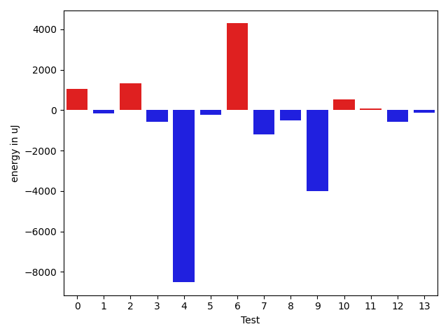
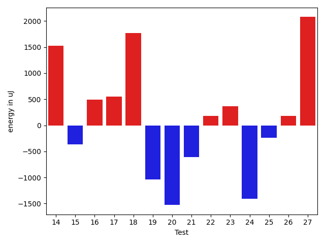
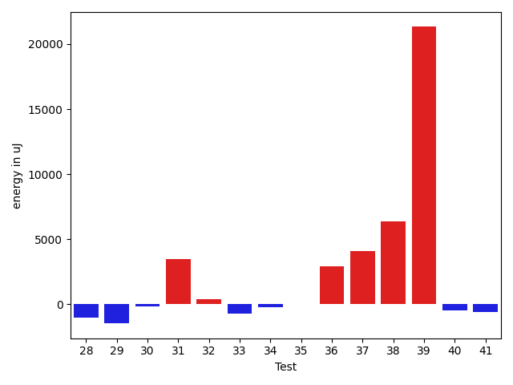
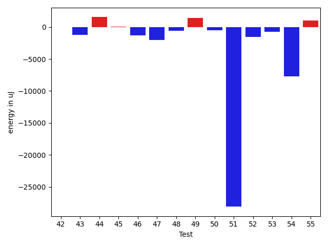
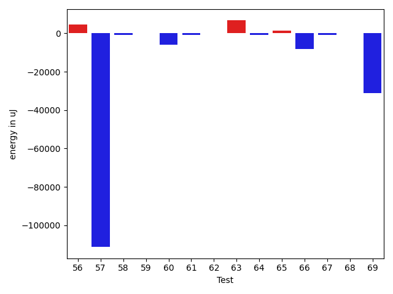
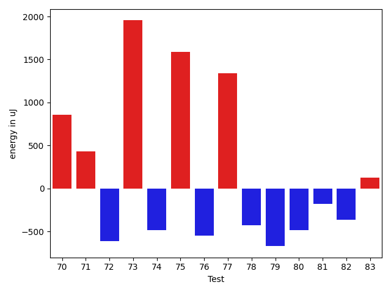
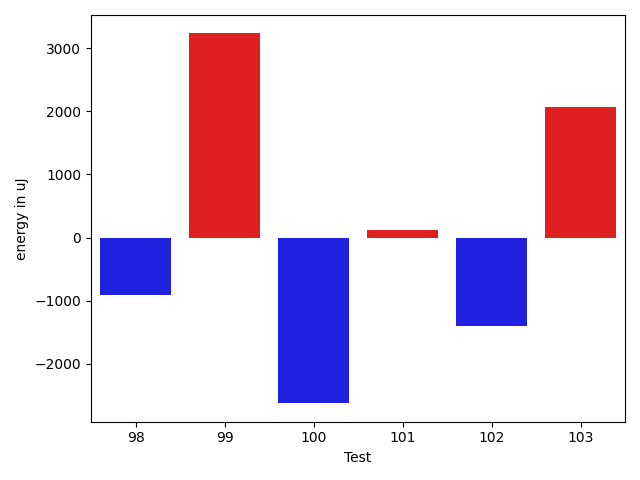

# gson 458f2b

https://github.com/google/gson/commit/458f2b

## Delta Energy per test method

| ID | EnergyV1 | EnergyV2 | DeltaEnergy | σV1 | σV2 |
| --- | --- | --- | --- | --- | --- |
| 0 | 34790 | 35828 | 1038 | 4134.280808137869 | 3783.9841140459234 |
| 1 | 34668 | 35095 | 427 | 5489.9527296075075 | 6586.918054662402 |
| 2 | 36926 | 35949 | -977 | 30342.19651803693 | 33980.20126556951 |
| 3 | 35950 | 35340 | -610 | 3971.9980853548295 | 3834.973128219632 |
| 4 | 69702 | 63598 | -6104 | 24794.040812087285 | 18198.06135124226 |
| 5 | 33996 | 32837 | -1159 | 4439.618160878253 | 3431.399688196212 |
| 6 | 34485 | 34607 | 122 | 26088.161385015566 | 30117.678005847418 |
| 7 | 34729 | 34240 | -489 | 6532.760439689094 | 3347.887908054563 |
| 8 | 34057 | 34668 | 611 | 3852.7812362259647 | 2857.320489870875 |
| 9 | 36132 | 34363 | -1769 | 14286.224343769747 | 9568.959372944131 |
| 10 | 35217 | 35522 | 305 | 3760.3056220886983 | 3567.790145961479 |
| 11 | 39185 | 37109 | -2076 | 322058.90116768406 | 297484.2776109637 |
| 12 | 37170 | 35156 | -2014 | 67834.64826639445 | 69929.07646851998 |
| 13 | 34118 | 33935 | -183 | 4605.602215154403 | 5352.560949499991 |
| 14 | 34485 | 36011 | 1526 | 5340.572004158096 | 2777.728034765817 |
| 15 | 35279 | 34912 | -367 | 4236.397266947783 | 3133.715854948964 |
| 16 | 36438 | 36926 | 488 | 3974.0562091941924 | 3756.3050814186217 |
| 17 | 34790 | 35339 | 549 | 4041.840058354918 | 3838.2036417574304 |
| 18 | 35156 | 36926 | 1770 | 3166.889006734374 | 4268.584894796123 |
| 19 | 34973 | 33935 | -1038 | 3277.5756089433585 | 3748.2623496228216 |
| 20 | 35889 | 34362 | -1527 | 4874.516364972789 | 3670.953916168387 |
| 21 | 35583 | 34974 | -609 | 3998.344235818018 | 4516.006562074292 |
| 22 | 34363 | 34546 | 183 | 3671.397693978193 | 4172.99992751758 |
| 23 | 35401 | 35766 | 365 | 2095.7736760056086 | 3425.6598246724675 |
| 24 | 36072 | 34668 | -1404 | 3216.730041517317 | 4193.878027240707 |
| 25 | 36010 | 35767 | -243 | 3003.5957894940966 | 3341.053089244819 |
| 26 | 36133 | 36316 | 183 | 3584.3776283198727 | 3879.0355487493975 |
| 27 | 34179 | 36255 | 2076 | 4982.72534328387 | 4369.022690800229 |
| 28 | 34973 | 34607 | -366 | 7617.021982778706 | 4156.134763230955 |
| 29 | 36865 | 36133 | -732 | 4344.776830705673 | 3354.212369737757 |
| 30 | 34912 | 35339 | 427 | 2954.6915417123773 | 2885.073528578799 |
| 31 | 32532 | 35462 | 2930 | 4222.186640515049 | 3690.938322191913 |
| 32 | 34912 | 36316 | 1404 | 4239.3058551292725 | 3445.851695201847 |
| 33 | 37171 | 36316 | -855 | 4672.584657832898 | 2725.583525697856 |
| 34 | 37171 | 36376 | -795 | 3743.504400595639 | 3962.985420916913 |
| 35 | 34729 | 34729 | 0 | 2746.5994248809093 | 3733.1124228450444 |
| 36 | 37720 | 38513 | 793 | 22564.143530432844 | 22340.106681546265 |
| 37 | 38635 | 39185 | 550 | 70686.30545555167 | 61239.832193271075 |
| 38 | 38086 | 38207 | 121 | 23288.656689015268 | 30039.520223201605 |
| 39 | 38574 | 40527 | 1953 | 49473.05638896063 | 59735.763581761064 |
| 40 | 35461 | 34607 | -854 | 4250.751205266396 | 3573.611041585697 |
| 41 | 35889 | 35034 | -855 | 4181.344869549559 | 3797.516732383116 |
| 42 | 34485 | 34484 | -1 | 4726.170869220257 | 4702.689921076138 |
| 43 | 39124 | 37903 | -1221 | 344377.53192952025 | 447042.5880459733 |
| 44 | 33935 | 35461 | 1526 | 4458.945343168166 | 3928.0225582057747 |
| 45 | 35949 | 36010 | 61 | 3546.752838708795 | 4011.3644812706807 |
| 46 | 77759 | 76416 | -1343 | 41211.18665902148 | 38213.61800639479 |
| 47 | 145141 | 143127 | -2014 | 400770.3229137026 | 353077.5375649131 |
| 48 | 35339 | 34729 | -610 | 9302.653593703491 | 3868.902831054713 |
| 49 | 34668 | 36071 | 1403 | 3780.916337397589 | 4245.274645974057 |
| 50 | 36560 | 36072 | -488 | 73583.30109452418 | 70455.6753115086 |
| 51 | 73059 | 44983 | -28076 | 33376.85493598487 | 36070.191810519595 |
| 52 | 38208 | 36682 | -1526 | 165707.85423721344 | 6143.85511307106 |
| 53 | 36743 | 35949 | -794 | 4288.506038504718 | 3597.914827496161 |
| 54 | 78918 | 71228 | -7690 | 163194.85993774998 | 209281.28011146962 |
| 55 | 36865 | 37841 | 976 | 26044.109108395318 | 164774.46707170038 |
| 56 | 39307 | 36865 | -2442 | 211235.8684376859 | 248463.7951970043 |
| 57 | 36927 | 35888 | -1039 | 372679.63166577485 | 3575.481201834124 |
| 58 | 37170 | 36011 | -1159 | 4056.089071589364 | 3443.603088103369 |
| 59 | 34546 | 34118 | -428 | 3602.414647455777 | 3977.4026978622596 |
| 60 | 35705 | 34057 | -1648 | 74780.92228244217 | 61581.13371285841 |
| 61 | 35279 | 34912 | -367 | 3225.9540481322974 | 3791.060547518424 |
| 62 | 35950 | 35583 | -367 | 3579.21941519797 | 3925.7315774605127 |
| 63 | 34485 | 35584 | 1099 | 37574.337819779124 | 40339.451529807244 |
| 64 | 36927 | 36804 | -123 | 9609.066656220752 | 9123.963739824849 |
| 65 | 36071 | 34728 | -1343 | 4034.091184201093 | 8144.438858955595 |
| 66 | 199523 | 203185 | 3662 | 347107.9459009965 | 284558.10308599 |
| 67 | 35157 | 34301 | -856 | 3622.7544589450304 | 3229.237390194046 |
| 68 | 34546 | 34729 | 183 | 3458.6707734872653 | 4547.407593616962 |
| 69 | 38513 | 38391 | -122 | 434234.0827452583 | 370798.5556780035 |
| 70 | 36255 | 37109 | 854 | 4356.096366131081 | 3583.028518041622 |
| 71 | 37049 | 37476 | 427 | 3090.810976344782 | 4078.3273287265465 |
| 72 | 37475 | 36865 | -610 | 90659.34759581018 | 56241.01485576117 |
| 73 | 34545 | 36499 | 1954 | 6928.301807797551 | 13482.010042461015 |
| 74 | 36377 | 35889 | -488 | 9083.719262828006 | 8400.51498488245 |
| 75 | 36194 | 37781 | 1587 | 92650.52741291071 | 85902.2124915548 |
| 76 | 42053 | 41503 | -550 | 36956.03830148909 | 42357.61302157458 |
| 77 | 38757 | 40100 | 1343 | 19039.030095009504 | 18448.632853826548 |
| 78 | 35950 | 35522 | -428 | 6172.696135498377 | 4235.027020901826 |
| 79 | 37720 | 37048 | -672 | 4707.719099230815 | 8630.511998664831 |
| 80 | 36499 | 36010 | -489 | 3724.1782194825637 | 8990.789308762485 |
| 81 | 35949 | 35766 | -183 | 12462.353559060643 | 12047.537824419174 |
| 82 | 70313 | 69946 | -367 | 46625.36471185789 | 38840.96962397822 |
| 83 | 35461 | 35583 | 122 | 3796.4908429310067 | 5224.528378428637 |
| 84 | 36010 | 35156 | -854 | 3662.610230928716 | 3180.1389237570215 |
| 85 | 35705 | 36072 | 367 | 4773.021287974247 | 2897.106889208612 |
| 86 | 37231 | 36438 | -793 | 4199.315741150879 | 3334.358449443461 |
| 87 | 34790 | 35950 | 1160 | 3704.304415041308 | 3063.310032422992 |
| 88 | 34851 | 35217 | 366 | 3731.116575081646 | 3477.5096572789685 |
| 89 | 35095 | 36011 | 916 | 4487.4066940015855 | 3646.931160965336 |
| 90 | 39124 | 38269 | -855 | 23027.994808269792 | 15475.852651872501 |
| 91 | 40527 | 39550 | -977 | 59732.5260646816 | 52575.14841703444 |
| 92 | 69519 | 72388 | 2869 | 27475.259567093362 | 25317.01898511804 |
| 93 | 37903 | 37659 | -244 | 25292.655913503062 | 16072.113952930931 |
| 94 | 37353 | 37171 | -182 | 4289.1177729996125 | 3031.562338032157 |
| 95 | 42603 | 40161 | -2442 | 22597.98072292978 | 17545.248183901836 |
| 96 | 38146 | 38086 | -60 | 43608.76377110681 | 31169.823065461616 |
| 97 | 36010 | 36377 | 367 | 4074.791043072937 | 3961.4609433333503 |
| 98 | 39551 | 38635 | -916 | 531896.0607625089 | 557002.6565941597 |
| 99 | 38147 | 41381 | 3234 | 90210.78011597527 | 117013.27035914036 |
| 100 | 38025 | 35400 | -2625 | 3696.9400257341526 | 3660.7321195074696 |
| 101 | 37536 | 37658 | 122 | 3682.497693003921 | 4743.621099519066 |
| 102 | 38147 | 36743 | -1404 | 11892.154807037514 | 9760.2049818082 |
| 103 | 35523 | 37598 | 2075 | 639749.6791109202 | 707720.91171558 |

## Delta Duration per test method

| ID | DurationV1 | DurationsV2 | DeltaDuration |
| --- | --- | --- | --- |
| 0 | 881611.140625 | 875143.4406779661 | -6467.699947033892 |
| 1 | 1076338.2173913044 | 1032741.6338028169 | -43596.583588487585 |
| 2 | 1263054.7391304348 | 1280478.9444444445 | 17424.205314009683 |
| 3 | 990398.9354838709 | 960795.1 | -29603.835483870935 |
| 4 | 2319306.5555555555 | 2139871.474747475 | -179435.08080808073 |
| 5 | 465405.08 | 508316.89285714284 | 42911.812857142824 |
| 6 | 1345837.0 | 1446361.2923076923 | 100524.29230769235 |
| 7 | 1050516.9692307692 | 958247.1857142857 | -92269.7835164835 |
| 8 | 830455.9636363636 | 814024.46875 | -16431.494886363624 |
| 9 | 1227853.2368421052 | 1105208.7323943663 | -122644.50444773887 |
| 10 | 841826.3469387755 | 767577.4363636364 | -74248.9105751391 |
| 11 | 2987225.4516129033 | 3266277.132352941 | 279051.68074003793 |
| 12 | 1571412.0847457626 | 1608000.8064516129 | 36588.721705850214 |
| 13 | 815538.649122807 | 813929.9107142857 | -1608.7384085212834 |
| 14 | 491032.0416666667 | 479746.2727272727 | -11285.76893939398 |
| 15 | 760561.7391304348 | 760834.4897959183 | 272.7506654835306 |
| 16 | 699807.4594594594 | 690014.9777777778 | -9792.481681681587 |
| 17 | 780144.7692307692 | 812050.12 | 31905.350769230747 |
| 18 | 657655.6206896552 | 630727.8285714285 | -26927.792118226644 |
| 19 | 762010.5531914893 | 780374.68 | 18364.126808510744 |
| 20 | 1048515.8235294118 | 1054768.9436619717 | 6253.12013255991 |
| 21 | 527328.5909090909 | 542758.8947368421 | 15430.303827751195 |
| 22 | 515586.3793103448 | 507094.94444444444 | -8491.434865900374 |
| 23 | 482596.0588235294 | 491193.0416666667 | 8596.982843137288 |
| 24 | 495243.8 | 455643.60869565216 | -39600.19130434783 |
| 25 | 438324.8888888889 | 542717.7368421053 | 104392.8479532164 |
| 26 | 553933.36 | 619224.5 | 65291.140000000014 |
| 27 | 635247.0810810811 | 662125.6363636364 | 26878.555282555288 |
| 28 | 739247.6363636364 | 801572.1951219512 | 62324.558758314815 |
| 29 | 611404.4516129033 | 705543.3076923077 | 94138.85607940448 |
| 30 | 412485.4666666667 | 469291.71428571426 | 56806.247619047586 |
| 31 | 440102.5625 | 494756.3076923077 | 54653.74519230769 |
| 32 | 429020.6 | 389675.46153846156 | -39345.138461538416 |
| 33 | 395435.6923076923 | 387016.6666666667 | -8419.025641025626 |
| 34 | 503032.71428571426 | 529077.48 | 26044.76571428572 |
| 35 | 460049.17391304346 | 463861.48 | 3812.3060869565234 |
| 36 | 1010787.612244898 | 1364918.2352941176 | 354130.6230492196 |
| 37 | 1434448.7666666666 | 1870626.2 | 436177.43333333335 |
| 38 | 1372405.6363636365 | 1626417.2235294117 | 254011.58716577524 |
| 39 | 1112457.0555555555 | 1983771.7878787878 | 871314.7323232323 |
| 40 | 752599.5434782609 | 794221.8518518518 | 41622.30837359093 |
| 41 | 769173.3333333334 | 790704.6382978724 | 21531.304964539013 |
| 42 | 544547.1304347826 | 568321.8648648649 | 23774.73443008226 |
| 43 | 3559344.8181818184 | 7274168.361111111 | 3714823.5429292927 |
| 44 | 603330.1935483871 | 646327.46875 | 42997.27520161285 |
| 45 | 643430.3 | 566950.04 | -76480.26000000001 |
| 46 | 2916961.383838384 | 2831350.606060606 | -85610.77777777798 |
| 47 | 8015446.858585859 | 7220591.343434343 | -794855.5151515156 |
| 48 | 866842.4 | 851706.0540540541 | -15136.345945945941 |
| 49 | 809206.4 | 860905.8048780488 | 51699.40487804881 |
| 50 | 1913525.2127659575 | 1863212.7727272727 | -50312.440038684756 |
| 51 | 2168111.222222222 | 2077926.934065934 | -90184.28815628798 |
| 52 | 1651809.137254902 | 885009.0188679246 | -766800.1183869774 |
| 53 | 778750.8823529412 | 903545.1351351351 | 124794.25278219394 |
| 54 | 3651524.767676768 | 3654081.3131313133 | 2556.545454545412 |
| 55 | 1280349.6216216215 | 1936229.1594202898 | 655879.5377986683 |
| 56 | 1919546.8333333333 | 2110271.1666666665 | 190724.33333333326 |
| 57 | 4009702.027027027 | 758087.8478260869 | -3251614.1792009403 |
| 58 | 673983.4666666667 | 668471.5833333334 | -5511.883333333302 |
| 59 | 1039308.1830985915 | 1063483.5652173914 | 24175.38211879984 |
| 60 | 1568405.6511627906 | 1466309.1025641025 | -102096.5485986881 |
| 61 | 626009.2121212122 | 667685.3846153846 | 41676.17249417247 |
| 62 | 924503.5 | 927152.9322033898 | 2649.4322033898206 |
| 63 | 1256854.5609756098 | 1458158.8723404256 | 201304.3113648158 |
| 64 | 972468.3157894737 | 971444.245614035 | -1024.0701754386537 |
| 65 | 1013219.0142857142 | 1034025.7397260274 | 20806.72544031311 |
| 66 | 7993879.197916667 | 7773517.835051547 | -220361.36286512017 |
| 67 | 752657.052631579 | 729037.6382978724 | -23619.414333706605 |
| 68 | 641407.1 | 711135.1282051282 | 69728.02820512827 |
| 69 | 4809519.483516484 | 3765246.097826087 | -1044273.3856903967 |
| 70 | 721842.5714285715 | 710614.1836734693 | -11228.387755102129 |
| 71 | 514732.7826086957 | 591148.275862069 | 76415.49325337331 |
| 72 | 1900926.4318181819 | 1403792.8292682928 | -497133.6025498891 |
| 73 | 1158810.9176470588 | 1181906.686746988 | 23095.769099929137 |
| 74 | 1275524.0842105264 | 1310943.3636363635 | 35419.2794258371 |
| 75 | 2274315.2291666665 | 2161327.8804347827 | -112987.3487318838 |
| 76 | 2074997.5151515151 | 2137661.9591836734 | 62664.44403215824 |
| 77 | 1723013.2828282828 | 1728155.8282828282 | 5142.545454545412 |
| 78 | 1144442.1666666667 | 1176017.1022727273 | 31574.93560606055 |
| 79 | 859406.0588235294 | 1052704.576923077 | 193298.5180995476 |
| 80 | 547316.3939393939 | 625070.5238095238 | 77754.12987012987 |
| 81 | 1225440.393258427 | 1224636.0595238095 | -804.3337346175686 |
| 82 | 2609023.7010309277 | 2537406.387755102 | -71617.3132758257 |
| 83 | 1047446.53125 | 1035816.6805555555 | -11629.850694444496 |
| 84 | 638257.4074074074 | 643864.8529411765 | 5607.445533769089 |
| 85 | 931667.7457627119 | 904093.9666666667 | -27573.779096045182 |
| 86 | 776398.8979591837 | 711890.175 | -64508.72295918362 |
| 87 | 871766.253968254 | 888039.9508196721 | 16273.69685141812 |
| 88 | 840228.2068965518 | 856430.6896551724 | 16202.482758620637 |
| 89 | 855365.3235294118 | 851432.6451612903 | -3932.678368121502 |
| 90 | 1282431.972972973 | 951661.5833333334 | -330770.38963963964 |
| 91 | 1983508.6710526317 | 1759782.0 | -223726.6710526317 |
| 92 | 2204325.202020202 | 2187168.696969697 | -17156.505050505046 |
| 93 | 1099501.2424242424 | 903041.2162162162 | -196460.02620802622 |
| 94 | 808732.6363636364 | 932247.325 | 123514.6886363636 |
| 95 | 1679446.2947368422 | 1635699.5858585858 | -43746.70887825638 |
| 96 | 1324757.2280701755 | 1177198.7073170731 | -147558.52075310238 |
| 97 | 729212.5384615385 | 644038.3333333334 | -85174.20512820513 |
| 98 | 6351677.506493507 | 6809844.349206349 | 458166.8427128419 |
| 99 | 1819791.8666666667 | 3103430.263157895 | 1283638.3964912281 |
| 100 | 538379.0 | 605407.7619047619 | 67028.7619047619 |
| 101 | 500777.5652173913 | 578014.7777777778 | 77237.21256038646 |
| 102 | 999239.7045454546 | 846810.1111111111 | -152429.59343434346 |
| 103 | 8250452.090909091 | 13944525.903225806 | 5694073.812316715 |

## Misc.

| ID | Test Class | Test Method |
| --- | --- | --- |
| 0 | com.google.gson.functional.CustomTypeAdaptersTest | testCustomAdapterInvokedForMapElementDeserialization |
| 1 | com.google.gson.functional.CustomTypeAdaptersTest | testCustomAdapterInvokedForMapElementSerializationWithType |
| 2 | com.google.gson.functional.CustomTypeAdaptersTest | testCustomNestedSerializers |
| 3 | com.google.gson.functional.CustomTypeAdaptersTest | testCustomNestedDeserializers |
| 4 | com.google.gson.functional.CustomTypeAdaptersTest | testCustomTypeAdapterDoesNotAppliesToSubClasses |
| 5 | com.google.gson.functional.CustomTypeAdaptersTest | testCustomAdapterInvokedForCollectionElementSerialization |
| 6 | com.google.gson.functional.CustomTypeAdaptersTest | testCustomAdapterInvokedForCollectionElementSerializationWithType |
| 7 | com.google.gson.functional.CustomTypeAdaptersTest | testCustomSerializerForLong |
| 8 | com.google.gson.functional.CustomTypeAdaptersTest | testCustomByteArrayDeserializerAndInstanceCreator |
| 9 | com.google.gson.functional.CustomTypeAdaptersTest | testCustomDeserializerForLong |
| 10 | com.google.gson.functional.CustomTypeAdaptersTest | testCustomTypeAdapterAppliesToSubClassesSerializedAsBaseClass |
| 11 | com.google.gson.functional.CustomTypeAdaptersTest | testCustomSerializers |
| 12 | com.google.gson.functional.CustomTypeAdaptersTest | testCustomDeserializers |
| 13 | com.google.gson.functional.CustomTypeAdaptersTest | testCustomByteArraySerializer |
| 14 | com.google.gson.functional.CustomTypeAdaptersTest | testCustomAdapterInvokedForMapElementSerialization |
| 15 | com.google.gson.functional.DefaultTypeAdaptersTest | testDateSerializationWithPattern |
| 16 | com.google.gson.functional.DefaultTypeAdaptersTest | testBigIntegerFieldDeserialization |
| 17 | com.google.gson.functional.DefaultTypeAdaptersTest | testDateDeserializationWithPattern |
| 18 | com.google.gson.functional.DefaultTypeAdaptersTest | testSetSerialization |
| 19 | com.google.gson.functional.DefaultTypeAdaptersTest | testDefaultDateSerializationUsingBuilder |
| 20 | com.google.gson.functional.DefaultTypeAdaptersTest | testDefaultDateDeserializationUsingBuilder |
| 21 | com.google.gson.functional.PrimitiveTest | testDoubleInfinitySerialization |
| 22 | com.google.gson.functional.PrimitiveTest | testSmallValueForBigIntegerDeserialization |
| 23 | com.google.gson.functional.PrimitiveTest | testFloatNaNSerialization |
| 24 | com.google.gson.functional.PrimitiveTest | testNegativeInfinityFloatSerialization |
| 25 | com.google.gson.functional.PrimitiveTest | testFloatInfinitySerialization |
| 26 | com.google.gson.functional.PrimitiveTest | testBigIntegerInASingleElementArrayDeserialization |
| 27 | com.google.gson.functional.PrimitiveTest | testBadValueForBigIntegerDeserialization |
| 28 | com.google.gson.functional.PrimitiveTest | testOverridingDefaultPrimitiveSerialization |
| 29 | com.google.gson.functional.PrimitiveTest | testBigIntegerDeserialization |
| 30 | com.google.gson.functional.PrimitiveTest | testReallyLongValuesSerialization |
| 31 | com.google.gson.functional.PrimitiveTest | testNegativeInfinitySerialization |
| 32 | com.google.gson.functional.PrimitiveTest | testNumberSerialization |
| 33 | com.google.gson.functional.PrimitiveTest | testPrimitiveLongAutoboxedSerialization |
| 34 | com.google.gson.functional.PrimitiveTest | testDoubleNaNSerialization |
| 35 | com.google.gson.functional.PrimitiveTest | testPrimitiveLongAutoboxedInASingleElementArraySerialization |
| 36 | com.google.gson.functional.NullObjectAndFieldTest | testExplicitDeserializationOfNulls |
| 37 | com.google.gson.functional.NullObjectAndFieldTest | testTopLevelNullObjectDeserialization |
| 38 | com.google.gson.functional.NullObjectAndFieldTest | testExplicitSerializationOfNullArrayMembers |
| 39 | com.google.gson.functional.NullObjectAndFieldTest | testExplicitSerializationOfNulls |
| 40 | com.google.gson.functional.NullObjectAndFieldTest | testNullWrappedPrimitiveMemberSerialization |
| 41 | com.google.gson.functional.NullObjectAndFieldTest | testNullWrappedPrimitiveMemberDeserialization |
| 42 | com.google.gson.functional.NullObjectAndFieldTest | testCustomSerializationOfNulls |
| 43 | com.google.gson.functional.NullObjectAndFieldTest | testTopLevelNullObjectSerialization |
| 44 | com.google.gson.functional.NullObjectAndFieldTest | testExplicitSerializationOfNullCollectionMembers |
| 45 | com.google.gson.functional.NullObjectAndFieldTest | testExplicitSerializationOfNullStringMembers |
| 46 | com.google.gson.functional.NamingPolicyTest | testGsonWithNonDefaultFieldNamingPolicySerialization |
| 47 | com.google.gson.functional.NamingPolicyTest | testGsonDuplicateNameUsingSerializedNameFieldNamingPolicySerialization |
| 48 | com.google.gson.functional.NamingPolicyTest | testGsonWithSerializedNameFieldNamingPolicyDeserialization |
| 49 | com.google.gson.functional.NamingPolicyTest | testGsonWithSerializedNameFieldNamingPolicySerialization |
| 50 | com.google.gson.functional.NamingPolicyTest | testGsonWithNonDefaultFieldNamingPolicyDeserialiation |
| 51 | com.google.gson.JsonDeserializerExceptionWrapperTest | testProperSerialization |
| 52 | com.google.gson.FunctionalWithInternalDependenciesTest | testAnonymousLocalClassesSerialization |
| 53 | com.google.gson.FunctionalWithInternalDependenciesTest | testPrettyPrintListOfPrimitiveArrays |
| 54 | com.google.gson.FunctionalWithInternalDependenciesTest | testPrettyPrintList |
| 55 | com.google.gson.FunctionalWithInternalDependenciesTest | testPrettyPrintArrayOfObjects |
| 56 | com.google.gson.FunctionalWithInternalDependenciesTest | testPrettyPrintArrayOfPrimitives |
| 57 | com.google.gson.FunctionalWithInternalDependenciesTest | testPrettyPrintArrayOfPrimitiveArrays |
| 58 | com.google.gson.FunctionalWithInternalDependenciesTest | testMultipleArrays |
| 59 | com.google.gson.functional.VersioningTest | testVersionedGsonMixingSinceAndUntilDeserialization |
| 60 | com.google.gson.functional.VersioningTest | testVersionedUntilSerialization |
| 61 | com.google.gson.functional.VersioningTest | testIgnoreLaterVersionClassSerialization |
| 62 | com.google.gson.functional.VersioningTest | testVersionedClassesDeserialization |
| 63 | com.google.gson.functional.VersioningTest | testVersionedGsonWithUnversionedClassesSerialization |
| 64 | com.google.gson.functional.VersioningTest | testVersionedClassesSerialization |
| 65 | com.google.gson.functional.VersioningTest | testVersionedGsonMixingSinceAndUntilSerialization |
| 66 | com.google.gson.functional.VersioningTest | testVersionedUntilDeserialization |
| 67 | com.google.gson.functional.VersioningTest | testVersionedGsonWithUnversionedClassesDeserialization |
| 68 | com.google.gson.functional.VersioningTest | testIgnoreLaterVersionClassDeserialization |
| 69 | com.google.gson.functional.FieldExclusionTest | testDefaultInnerClassExclusion |
| 70 | com.google.gson.functional.FieldExclusionTest | testDefaultNestedStaticClassIncluded |
| 71 | com.google.gson.functional.FieldExclusionTest | testInnerClassExclusion |
| 72 | com.google.gson.GsonTypeAdapterTest | testDefaultTypeAdapterThrowsParseException |
| 73 | com.google.gson.functional.ParameterizedTypesTest | testParameterizedTypeWithReaderDeserialization |
| 74 | com.google.gson.functional.ParameterizedTypesTest | testParameterizedTypeWithCustomSerializer |
| 75 | com.google.gson.functional.ParameterizedTypesTest | testParameterizedTypeDeserialization |
| 76 | com.google.gson.functional.ParameterizedTypesTest | testTypesWithMultipleParametersSerialization |
| 77 | com.google.gson.functional.ParameterizedTypesTest | testParameterizedTypesWithCustomDeserializer |
| 78 | com.google.gson.functional.MapTest | testParameterizedMapSubclassDeserialization |
| 79 | com.google.gson.functional.MapTest | testMapSerializationWithNullValueButSerializeNulls |
| 80 | com.google.gson.functional.ObjectTest | testPrimitiveArrayFieldSerialization |
| 81 | com.google.gson.functional.ObjectTest | testArrayOfArraysSerialization |
| 82 | com.google.gson.functional.ObjectTest | testSubInterfacesOfCollectionSerialization |
| 83 | com.google.gson.functional.ObjectTest | testInheritenceSerialization |
| 84 | com.google.gson.functional.ObjectTest | testNullFieldsSerialization |
| 85 | com.google.gson.functional.ObjectTest | testNestedSerialization |
| 86 | com.google.gson.functional.ObjectTest | testBagOfPrimitiveWrappersSerialization |
| 87 | com.google.gson.functional.ObjectTest | testArrayOfObjectsSerialization |
| 88 | com.google.gson.functional.ObjectTest | testInnerClassDeserialization |
| 89 | com.google.gson.functional.ObjectTest | testClassWithTransientFieldsSerialization |
| 90 | com.google.gson.functional.ObjectTest | testBagOfPrimitivesSerialization |
| 91 | com.google.gson.functional.EscapingTest | testEscapingObjectFields |
| 92 | com.google.gson.functional.UncategorizedTest | testReturningDerivedClassesDuringDeserialization |
| 93 | com.google.gson.functional.UncategorizedTest | testStaticFieldsAreNotSerialized |
| 94 | com.google.gson.DefaultDateTypeAdapterTest | testDateSerialization |
| 95 | com.google.gson.functional.CollectionTest | testWildcardCollectionField |
| 96 | com.google.gson.functional.CollectionTest | testCollectionOfBagOfPrimitivesSerialization |
| 97 | com.google.gson.functional.CollectionTest | testRawCollectionSerialization |
| 98 | com.google.gson.functional.PrintFormattingTest | testCompactFormattingLeavesNoWhiteSpace |
| 99 | com.google.gson.functional.ReadersWritersTest | testWriterForSerialization |
| 100 | com.google.gson.functional.ReadersWritersTest | testTopLevelNullObjectSerializationWithWriterAndSerializeNulls |
| 101 | com.google.gson.functional.ReadersWritersTest | testTopLevelNullObjectDeserializationWithReaderAndSerializeNulls |
| 102 | com.google.gson.functional.ArrayTest | testArrayOfPrimitivesWithCustomTypeAdapter |
| 103 | com.google.gson.GsonBuilderTest | testCreatingMoreThanOnce |

| Test | IterationV1 | IterationV2 | DeltaIteration |
| --- | --- | --- | --- |
| 0 | 64 | 59 | -5 |
| 1 | 69 | 71 | 2 |
| 2 | 69 | 72 | 3 |
| 3 | 62 | 60 | -2 |
| 4 | 99 | 99 | 0 |
| 5 | 25 | 28 | 3 |
| 6 | 72 | 65 | -7 |
| 7 | 65 | 70 | 5 |
| 8 | 55 | 64 | 9 |
| 9 | 76 | 71 | -5 |
| 10 | 49 | 55 | 6 |
| 11 | 62 | 68 | 6 |
| 12 | 59 | 62 | 3 |
| 13 | 57 | 56 | -1 |
| 14 | 24 | 22 | -2 |
| 15 | 46 | 49 | 3 |
| 16 | 37 | 45 | 8 |
| 17 | 52 | 50 | -2 |
| 18 | 29 | 35 | 6 |
| 19 | 47 | 50 | 3 |
| 20 | 68 | 71 | 3 |
| 21 | 22 | 19 | -3 |
| 22 | 29 | 18 | -11 |
| 23 | 17 | 24 | 7 |
| 24 | 20 | 23 | 3 |
| 25 | 18 | 19 | 1 |
| 26 | 25 | 26 | 1 |
| 27 | 37 | 33 | -4 |
| 28 | 33 | 41 | 8 |
| 29 | 31 | 26 | -5 |
| 30 | 15 | 7 | -8 |
| 31 | 16 | 26 | 10 |
| 32 | 15 | 13 | -2 |
| 33 | 13 | 15 | 2 |
| 34 | 21 | 25 | 4 |
| 35 | 23 | 25 | 2 |
| 36 | 49 | 51 | 2 |
| 37 | 30 | 40 | 10 |
| 38 | 77 | 85 | 8 |
| 39 | 36 | 33 | -3 |
| 40 | 46 | 54 | 8 |
| 41 | 51 | 47 | -4 |
| 42 | 23 | 37 | 14 |
| 43 | 22 | 36 | 14 |
| 44 | 31 | 32 | 1 |
| 45 | 30 | 25 | -5 |
| 46 | 99 | 99 | 0 |
| 47 | 99 | 99 | 0 |
| 48 | 45 | 37 | -8 |
| 49 | 50 | 41 | -9 |
| 50 | 47 | 44 | -3 |
| 51 | 90 | 91 | 1 |
| 52 | 51 | 53 | 2 |
| 53 | 51 | 37 | -14 |
| 54 | 99 | 99 | 0 |
| 55 | 74 | 69 | -5 |
| 56 | 30 | 30 | 0 |
| 57 | 37 | 46 | 9 |
| 58 | 30 | 36 | 6 |
| 59 | 71 | 69 | -2 |
| 60 | 43 | 39 | -4 |
| 61 | 33 | 39 | 6 |
| 62 | 56 | 59 | 3 |
| 63 | 41 | 47 | 6 |
| 64 | 57 | 57 | 0 |
| 65 | 70 | 73 | 3 |
| 66 | 96 | 97 | 1 |
| 67 | 38 | 47 | 9 |
| 68 | 40 | 39 | -1 |
| 69 | 91 | 92 | 1 |
| 70 | 35 | 49 | 14 |
| 71 | 23 | 29 | 6 |
| 72 | 44 | 41 | -3 |
| 73 | 85 | 83 | -2 |
| 74 | 95 | 88 | -7 |
| 75 | 96 | 92 | -4 |
| 76 | 99 | 98 | -1 |
| 77 | 99 | 99 | 0 |
| 78 | 78 | 88 | 10 |
| 79 | 51 | 52 | 1 |
| 80 | 33 | 21 | -12 |
| 81 | 89 | 84 | -5 |
| 82 | 97 | 98 | 1 |
| 83 | 64 | 72 | 8 |
| 84 | 27 | 34 | 7 |
| 85 | 59 | 60 | 1 |
| 86 | 49 | 40 | -9 |
| 87 | 63 | 61 | -2 |
| 88 | 58 | 58 | 0 |
| 89 | 34 | 31 | -3 |
| 90 | 37 | 36 | -1 |
| 91 | 76 | 71 | -5 |
| 92 | 99 | 99 | 0 |
| 93 | 33 | 37 | 4 |
| 94 | 44 | 40 | -4 |
| 95 | 95 | 99 | 4 |
| 96 | 57 | 41 | -16 |
| 97 | 39 | 36 | -3 |
| 98 | 77 | 63 | -14 |
| 99 | 45 | 38 | -7 |
| 100 | 23 | 21 | -2 |
| 101 | 23 | 18 | -5 |
| 102 | 44 | 45 | 1 |
| 103 | 33 | 31 | -2 |

| Time Label | Time (s) |
| --- | --- |
| Selection | 23.217284679412842 |
| Injection | 11.332136392593384 |
| Total | 993.3227543830872 |

