# gson 54a480

https://github.com/google/gson/commit/54a480

## Delta Energy per test method

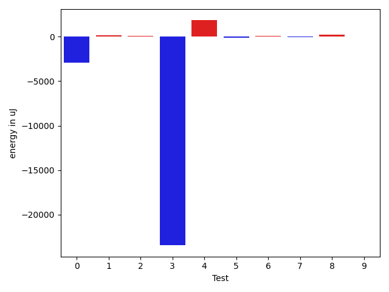

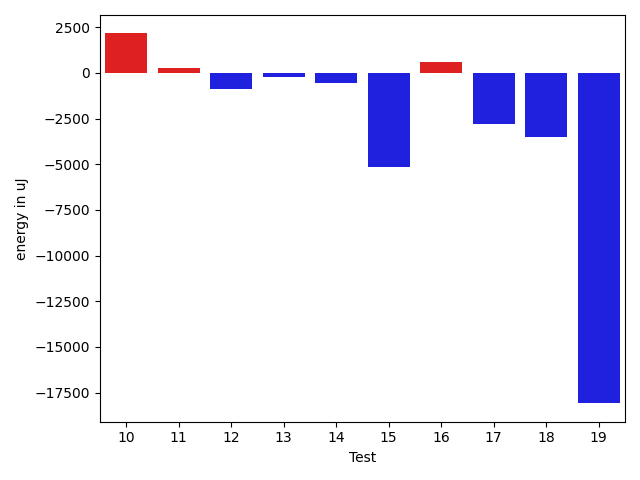

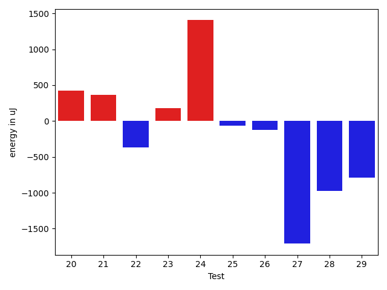

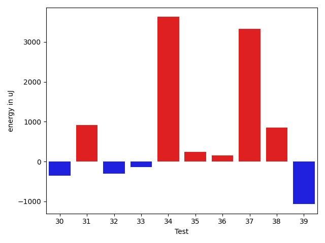

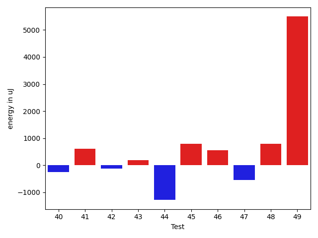

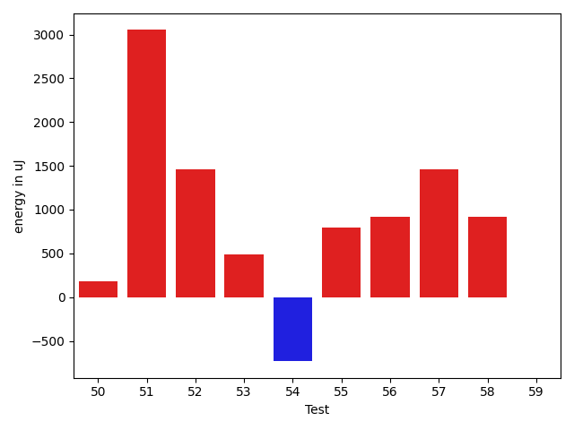

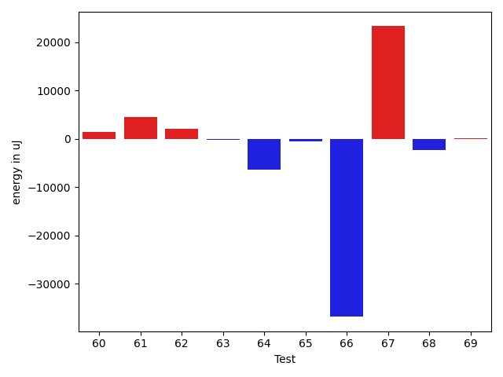

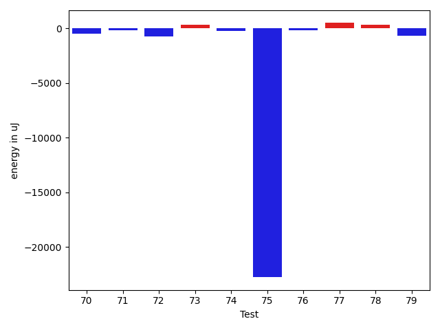

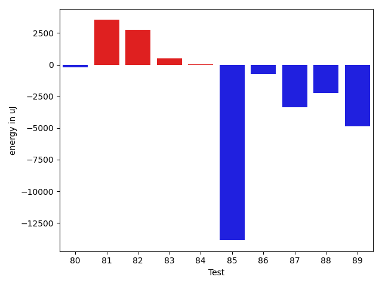

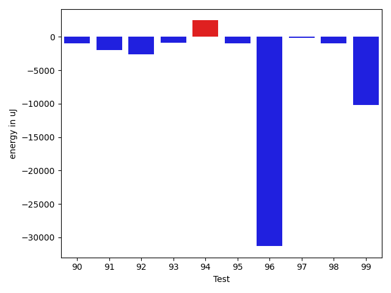

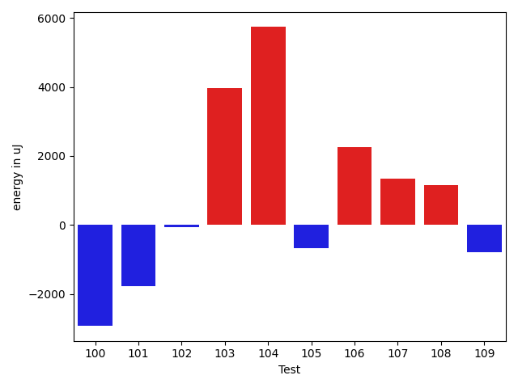

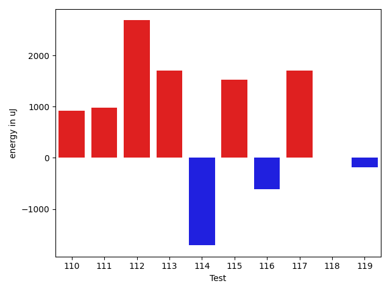

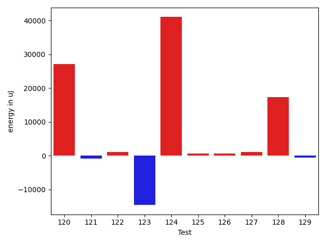

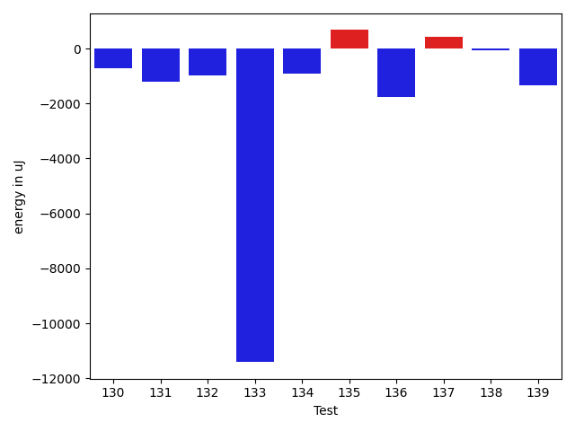

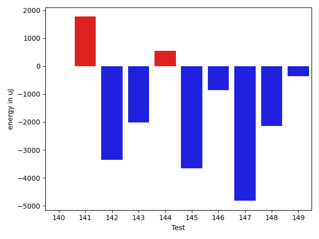

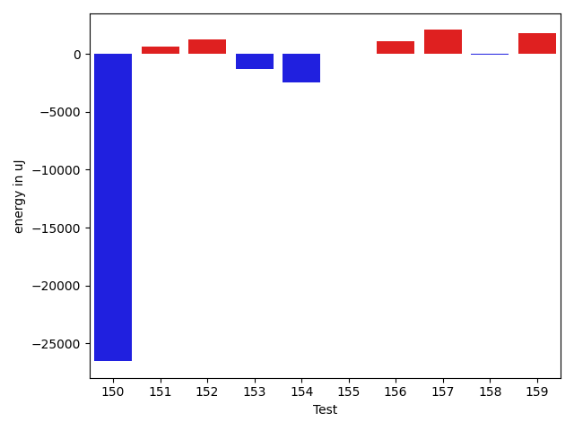

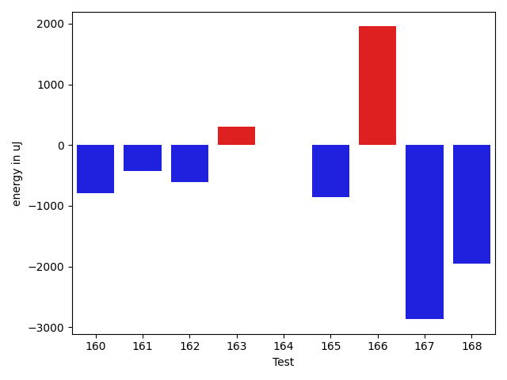

| ID | EnergyV1 | EnergyV2 | DeltaEnergy | σV1 | σV2 |
| --- | --- | --- | --- | --- | --- |
| 0 | 37658 | 34729 | -2929 | 4077.1118790431406 | 4416.759481776965 |
| 1 | 37170 | 37292 | 122 | 85855.47448082427 | 96293.8842205708 |
| 2 | 34485 | 34606 | 121 | 7697.770991478824 | 13234.887904567195 |
| 3 | 66040 | 42602 | -23438 | 38215.57879141012 | 34140.87474575183 |
| 4 | 33081 | 34912 | 1831 | 38040.04257216509 | 4234.641365439184 |
| 5 | 36927 | 36804 | -123 | 18418.998098498185 | 17530.734256227526 |
| 6 | 33875 | 33935 | 60 | 19411.96516294239 | 34097.053875850026 |
| 7 | 35095 | 35034 | -61 | 17082.1159944823 | 13875.64892575905 |
| 8 | 33325 | 33570 | 245 | 64326.668010245 | 3499.3424023271127 |
| 9 | 33692 | 33691 | -1 | 15540.179183168473 | 7041.712391818549 |
| 10 | 33569 | 35339 | 1770 | 3291.3324893659037 | 3582.7507644266857 |
| 11 | 32715 | 33508 | 793 | 3605.94034249043 | 2500.4852762573996 |
| 12 | 34058 | 33020 | -1038 | 7354.646171665906 | 3797.021439170947 |
| 13 | 33020 | 32959 | -61 | 2383.3727539856623 | 2787.369591344916 |
| 14 | 34668 | 33935 | -733 | 3996.602330905449 | 3636.318147325868 |
| 15 | 33997 | 34363 | 366 | 40888.90705529338 | 6653.296189671702 |
| 16 | 34241 | 34607 | 366 | 11023.768697638745 | 12660.913978119477 |
| 17 | 37964 | 36255 | -1709 | 91077.15294580549 | 98435.40656703853 |
| 18 | 36072 | 34240 | -1832 | 9294.379223771399 | 3404.0082863872562 |
| 19 | 77881 | 66528 | -11353 | 54123.60989258366 | 46564.207786616804 |
| 20 | 34424 | 34851 | 427 | 22699.156106975828 | 4036.8130019418145 |
| 21 | 34058 | 34424 | 366 | 6670.786874287878 | 3786.8121986045203 |
| 22 | 34424 | 34057 | -367 | 4115.061671773584 | 3559.853928110057 |
| 23 | 34668 | 34851 | 183 | 7709.507333433377 | 3545.519792465617 |
| 24 | 34301 | 35706 | 1405 | 3685.00671234927 | 8358.964419679476 |
| 25 | 34180 | 34119 | -61 | 60684.08301641551 | 6914.241262321546 |
| 26 | 33935 | 33813 | -122 | 3024.660001975043 | 3530.62341806962 |
| 27 | 35400 | 33691 | -1709 | 51315.846580538295 | 25667.758770130276 |
| 28 | 33997 | 33020 | -977 | 3093.6120499434887 | 3769.301639836765 |
| 29 | 34362 | 33569 | -793 | 24376.000603961595 | 15167.561800068086 |
| 30 | 34851 | 34241 | -610 | 2921.1643896406013 | 2888.8388529593244 |
| 31 | 31616 | 33020 | 1404 | 2660.6788462419713 | 2799.357466449347 |
| 32 | 34179 | 34180 | 1 | 2947.658286600988 | 4348.91091653991 |
| 33 | 33081 | 33142 | 61 | 3903.5735022728195 | 3437.256213110076 |
| 34 | 37231 | 36011 | -1220 | 13061.963522635739 | 21288.390843322155 |
| 35 | 34118 | 34057 | -61 | 3236.368107220206 | 3415.242604025122 |
| 36 | 34240 | 34241 | 1 | 3237.445861217742 | 3336.648846723757 |
| 37 | 33996 | 33997 | 1 | 2885.337994061153 | 21723.115117605957 |
| 38 | 33081 | 33326 | 245 | 3282.1265374791224 | 4134.587092202845 |
| 39 | 33997 | 33142 | -855 | 4354.099136277419 | 3368.2346528083185 |
| 40 | 35095 | 34851 | -244 | 2966.132290338333 | 28449.80657298042 |
| 41 | 34423 | 35034 | 611 | 6675.871577765253 | 7203.497295757992 |
| 42 | 32715 | 32593 | -122 | 3344.564803571036 | 3641.7529329632007 |
| 43 | 34790 | 34973 | 183 | 4618.878430196243 | 4560.9294532474405 |
| 44 | 33570 | 32287 | -1283 | 3682.4891892161045 | 3489.698831730095 |
| 45 | 33935 | 34729 | 794 | 3521.3374208181094 | 3727.495898810835 |
| 46 | 34607 | 35156 | 549 | 11514.567212441974 | 8622.914746711704 |
| 47 | 34729 | 34179 | -550 | 3522.5932317068327 | 21555.89438868274 |
| 48 | 34851 | 35644 | 793 | 24288.813156472315 | 35279.89245359446 |
| 49 | 115540 | 121033 | 5493 | 65647.59716049861 | 63535.51770853906 |
| 50 | 34301 | 34485 | 184 | 22569.306479137605 | 9096.928148762678 |
| 51 | 67810 | 70862 | 3052 | 27868.22251542 | 30734.461017431844 |
| 52 | 34607 | 36072 | 1465 | 30849.063641620705 | 27963.9348095152 |
| 53 | 34057 | 34545 | 488 | 68586.80188814618 | 59106.49159000449 |
| 54 | 63293 | 62561 | -732 | 21667.526267033776 | 29784.320900009574 |
| 55 | 35156 | 35950 | 794 | 13324.79752679062 | 42904.83913758419 |
| 56 | 37171 | 38086 | 915 | 35562.362996170814 | 41038.533937582295 |
| 57 | 34180 | 35645 | 1465 | 8645.141109803883 | 10391.987299834936 |
| 58 | 39428 | 40344 | 916 | 43264.42321362145 | 30169.269967305594 |
| 59 | 34302 | 34302 | 0 | 5807.0085360818475 | 22065.961480559225 |
| 60 | 34851 | 35583 | 732 | 3946.893306105436 | 3802.161551239009 |
| 61 | 68115 | 70556 | 2441 | 20987.495608080397 | 17855.8946577073 |
| 62 | 35095 | 36987 | 1892 | 36462.79443262446 | 34728.724081360255 |
| 63 | 34851 | 34546 | -305 | 5891.732034482149 | 5055.609782896923 |
| 64 | 35461 | 34973 | -488 | 32003.773304785987 | 4186.781787912491 |
| 65 | 34912 | 34546 | -366 | 9202.372397798032 | 7854.756395045629 |
| 66 | 35645 | 36865 | 1220 | 248996.2761450256 | 43218.00466316684 |
| 67 | 36133 | 37964 | 1831 | 53016.75660127397 | 86328.3090997464 |
| 68 | 33752 | 33447 | -305 | 19080.672793602665 | 3898.137556973322 |
| 69 | 33386 | 33752 | 366 | 5586.058912711022 | 5105.593456070971 |
| 70 | 35462 | 34973 | -489 | 12841.27023190926 | 11180.713317618096 |
| 71 | 37902 | 37720 | -182 | 338124.50319440244 | 365366.06324189744 |
| 72 | 35400 | 34667 | -733 | 32709.324341169617 | 3835.1599254375024 |
| 73 | 33936 | 34240 | 304 | 3385.216548855424 | 4194.789092363496 |
| 74 | 36194 | 35950 | -244 | 4751.785863113876 | 4053.7333133843013 |
| 75 | 101196 | 78429 | -22767 | 61991.027772933376 | 61841.88649953847 |
| 76 | 35583 | 35400 | -183 | 7583.951705663355 | 43876.74669114208 |
| 77 | 37171 | 37659 | 488 | 10157.180071751342 | 56392.26408062407 |
| 78 | 37109 | 37414 | 305 | 55281.601072517675 | 57816.973052248024 |
| 79 | 35949 | 35278 | -671 | 4309.701867632097 | 3614.922361084213 |
| 80 | 36194 | 34485 | -1709 | 2684.167340153922 | 3541.821617612457 |
| 81 | 35583 | 35644 | 61 | 28827.11368102981 | 34884.39054974605 |
| 82 | 36438 | 39184 | 2746 | 25892.252171224198 | 19135.636484270995 |
| 83 | 34485 | 34607 | 122 | 3729.5501566947423 | 3565.0979503841595 |
| 84 | 34363 | 34974 | 611 | 4011.2106078911797 | 3624.3733686743085 |
| 85 | 34301 | 34485 | 184 | 52346.26442178615 | 4231.242449791184 |
| 86 | 35950 | 36621 | 671 | 5963.938343490945 | 3855.9694252108843 |
| 87 | 34973 | 34607 | -366 | 16757.3262304014 | 3659.0334821910774 |
| 88 | 38879 | 37109 | -1770 | 12769.344529441874 | 11922.493506798162 |
| 89 | 36072 | 35156 | -916 | 24148.631911812132 | 3703.227882265853 |
| 90 | 40649 | 40894 | 245 | 16393.178990463017 | 15831.564979341969 |
| 91 | 35522 | 36316 | 794 | 20579.66146267638 | 8898.155143987402 |
| 92 | 36499 | 34607 | -1892 | 8012.137929910042 | 3850.6145643943937 |
| 93 | 38575 | 36132 | -2443 | 17247.768254856703 | 20530.914240126454 |
| 94 | 39245 | 38940 | -305 | 42873.43595732861 | 57385.884539025705 |
| 95 | 34790 | 33203 | -1587 | 3800.4873374129993 | 4036.657618099629 |
| 96 | 38025 | 35644 | -2381 | 348013.5376976979 | 337738.686139625 |
| 97 | 35217 | 34546 | -671 | 4326.821043861185 | 3589.4505989055574 |
| 98 | 35644 | 36743 | 1099 | 31699.8836241329 | 21358.50750542685 |
| 99 | 37842 | 38207 | 365 | 46973.49856927667 | 39346.37036965972 |
| 100 | 37048 | 34118 | -2930 | 3775.2187191319063 | 3763.397812682224 |
| 101 | 35767 | 33997 | -1770 | 3335.8076141168576 | 3326.1805412598333 |
| 102 | 34912 | 34851 | -61 | 3966.13508185593 | 3070.2970839665404 |
| 103 | 75195 | 79162 | 3967 | 38142.22972639877 | 53293.53976869085 |
| 104 | 87463 | 93201 | 5738 | 352838.06886148837 | 286577.1287852071 |
| 105 | 35828 | 35157 | -671 | 8625.621929229754 | 10356.527844605727 |
| 106 | 33997 | 36255 | 2258 | 3197.9020970759307 | 4996.280275055462 |
| 107 | 36621 | 37963 | 1342 | 83232.95805670113 | 72813.24760310185 |
| 108 | 35827 | 36988 | 1161 | 4451.870202385609 | 5550.494500656141 |
| 109 | 35950 | 35156 | -794 | 2859.9556043046805 | 2833.68863502623 |
| 110 | 37293 | 38208 | 915 | 3909.085190596868 | 3801.1598145763896 |
| 111 | 36133 | 37109 | 976 | 3091.062213766491 | 3058.3065262647806 |
| 112 | 36804 | 39489 | 2685 | 13269.78412158992 | 15250.131217636283 |
| 113 | 34790 | 36499 | 1709 | 2909.138850600123 | 4336.5421884658 |
| 114 | 38208 | 36499 | -1709 | 3259.3712114885097 | 4089.6684789536316 |
| 115 | 35339 | 36865 | 1526 | 3086.627124687838 | 3372.3467621687455 |
| 116 | 36132 | 35523 | -609 | 3534.8921402083224 | 38691.242335299714 |
| 117 | 36194 | 37903 | 1709 | 3001.2690406170964 | 5237.1985476493055 |
| 118 | 36255 | 36255 | 0 | 3446.169246021185 | 3582.7632227095332 |
| 119 | 36621 | 36438 | -183 | 3757.042849307619 | 3615.0114478373707 |
| 120 | 35461 | 39001 | 3540 | 3296.357088200557 | 62333.04641586992 |
| 121 | 34668 | 35278 | 610 | 22287.199884459533 | 16758.532731693773 |
| 122 | 34180 | 34668 | 488 | 3932.646267209087 | 5565.373289106543 |
| 123 | 38329 | 38391 | 62 | 75901.79058959536 | 68698.68789801517 |
| 124 | 200988 | 174682 | -26306 | 269765.000139841 | 399952.23095219943 |
| 125 | 35827 | 34973 | -854 | 3865.1775942460554 | 4558.043444117392 |
| 126 | 34789 | 34668 | -121 | 4731.937812590337 | 4880.734791834177 |
| 127 | 35401 | 36744 | 1343 | 4303.914282298731 | 4927.019611216043 |
| 128 | 36682 | 39063 | 2381 | 29270.793430635884 | 49354.577612225 |
| 129 | 35827 | 35705 | -122 | 4175.089923561226 | 4944.127228730826 |
| 130 | 36560 | 35828 | -732 | 3682.841464590639 | 24359.5095764039 |
| 131 | 40161 | 38941 | -1220 | 57691.09790222293 | 49366.14035127642 |
| 132 | 229309 | 228332 | -977 | 80344.97897636276 | 88567.55009121042 |
| 133 | 357787 | 346374 | -11413 | 129715.14912122992 | 139494.21380208211 |
| 134 | 66040 | 65125 | -915 | 69797.48081984809 | 60515.24884824641 |
| 135 | 37963 | 38635 | 672 | 61309.16089809147 | 62342.64223843509 |
| 136 | 36437 | 34668 | -1769 | 3467.8381205327487 | 4786.179429982801 |
| 137 | 36072 | 36499 | 427 | 37900.53007764755 | 34761.13843071515 |
| 138 | 35218 | 35156 | -62 | 3682.0183704050146 | 4067.556709081905 |
| 139 | 36804 | 35461 | -1343 | 5029.898218126361 | 3681.931931508768 |
| 140 | 37109 | 37109 | 0 | 4368.060323729005 | 31846.89826282947 |
| 141 | 34668 | 36437 | 1769 | 25990.880874599712 | 4395.720541168969 |
| 142 | 43091 | 39734 | -3357 | 64221.077817717574 | 59048.82829466927 |
| 143 | 35950 | 33935 | -2015 | 4778.7009115808605 | 3111.177871165798 |
| 144 | 35766 | 36316 | 550 | 4443.4280035620595 | 2905.2426217715492 |
| 145 | 39062 | 35401 | -3661 | 3346.868002700435 | 3857.1029442379395 |
| 146 | 37781 | 36926 | -855 | 43012.10517407491 | 44542.81243902082 |
| 147 | 45532 | 40710 | -4822 | 23011.09693163904 | 34335.76404341692 |
| 148 | 37354 | 35217 | -2137 | 3220.4127832274858 | 3475.9600711640132 |
| 149 | 36133 | 35767 | -366 | 4511.992479267224 | 3714.758290921602 |
| 150 | 71106 | 44555 | -26551 | 177534.7204085788 | 79326.87153380424 |
| 151 | 36560 | 37170 | 610 | 34808.099141187166 | 167007.76053319042 |
| 152 | 35889 | 37170 | 1281 | 290754.3376557088 | 210077.5174537378 |
| 153 | 37964 | 36682 | -1282 | 286798.40441508224 | 4833.088804015502 |
| 154 | 38208 | 35767 | -2441 | 299229.4388894162 | 193603.93388279725 |
| 155 | 39185 | 39185 | 0 | 47679.59848572354 | 37851.50410528646 |
| 156 | 38330 | 39429 | 1099 | 102162.84967995952 | 82111.68581729414 |
| 157 | 71594 | 73669 | 2075 | 29634.14513626725 | 24294.91562222666 |
| 158 | 39185 | 39124 | -61 | 22537.78783648383 | 19810.37241905078 |
| 159 | 38818 | 40588 | 1770 | 63020.68811930206 | 57887.31113280602 |
| 160 | 36499 | 35706 | -793 | 4033.558594863666 | 22636.579375100217 |
| 161 | 36804 | 36377 | -427 | 3773.100481528821 | 6791.361940177536 |
| 162 | 38269 | 37658 | -611 | 3405.1968207072996 | 3384.487914818955 |
| 163 | 38574 | 38879 | 305 | 130110.58849906229 | 89419.89425952193 |
| 164 | 38574 | 38574 | 0 | 84501.71856614646 | 57871.61890311277 |
| 165 | 36743 | 35888 | -855 | 2830.0343699586742 | 4621.100533486539 |
| 166 | 37414 | 39368 | 1954 | 524313.4626672792 | 576387.5042660971 |
| 167 | 41076 | 38208 | -2868 | 52396.22354007192 | 45447.95781430242 |
| 168 | 38391 | 36437 | -1954 | 385461.49689000915 | 657587.7997665578 |

## Delta Duration per test method

| ID | DurationV1 | DurationsV2 | DeltaDuration |
| --- | --- | --- | --- |
| 0 | 768932.3035714285 | 810204.2040816327 | 41271.90051020414 |
| 1 | 1474927.4179104478 | 2007907.4179104478 | 532980.0 |
| 2 | 1040512.4032258064 | 982970.5492957747 | -57541.853930031764 |
| 3 | 2153742.6818181816 | 1837056.743902439 | -316685.93791574263 |
| 4 | 998644.037735849 | 820771.1489361703 | -177872.88879967877 |
| 5 | 1630875.5913978494 | 1571894.0777777778 | -58981.51362007158 |
| 6 | 1170826.6266666667 | 1240871.8421052631 | 70045.21543859644 |
| 7 | 1394533.282051282 | 1172843.4722222222 | -221689.80982905976 |
| 8 | 937810.3333333334 | 602079.9285714285 | -335730.40476190485 |
| 9 | 855052.725490196 | 715827.6818181818 | -139225.04367201426 |
| 10 | 483924.1666666667 | 450640.6 | -33283.56666666671 |
| 11 | 513222.28 | 465643.61904761905 | -47578.660952380975 |
| 12 | 573840.52 | 444346.28571428574 | -129494.23428571428 |
| 13 | 754172.0810810811 | 604378.7058823529 | -149793.37519872817 |
| 14 | 716707.0652173914 | 590421.9714285714 | -126285.09378881997 |
| 15 | 1241348.6184210526 | 1051604.861111111 | -189743.75730994157 |
| 16 | 1202562.5802469135 | 1131783.858974359 | -70778.72127255448 |
| 17 | 2083016.4074074074 | 1850950.1666666667 | -232066.24074074067 |
| 18 | 872209.4375 | 798130.9655172414 | -74078.47198275861 |
| 19 | 3121395.125 | 2489929.1919191917 | -631465.9330808083 |
| 20 | 1036087.4705882353 | 889991.375 | -146096.0955882353 |
| 21 | 976336.7868852459 | 910415.6 | -65921.18688524596 |
| 22 | 724042.875 | 593407.717948718 | -130635.157051282 |
| 23 | 795815.3333333334 | 563520.0 | -232295.33333333337 |
| 24 | 1041353.676923077 | 1051042.5846153847 | 9688.907692307723 |
| 25 | 1099656.1296296297 | 846996.8085106383 | -252659.32111899136 |
| 26 | 685868.3846153846 | 632290.447368421 | -53577.937246963615 |
| 27 | 1258637.5625 | 715362.12 | -543275.4425 |
| 28 | 589591.2666666667 | 549527.1176470588 | -40064.149019607925 |
| 29 | 902848.5 | 847692.6521739131 | -55155.847826086916 |
| 30 | 501404.8695652174 | 470768.14285714284 | -30636.726708074566 |
| 31 | 569782.0833333334 | 540878.6666666666 | -28903.416666666744 |
| 32 | 494685.6176470588 | 480491.36 | -14194.25764705881 |
| 33 | 909162.1875 | 903659.1060606061 | -5503.081439393922 |
| 34 | 923862.0 | 981680.693877551 | 57818.693877551006 |
| 35 | 730723.0 | 683664.4186046511 | -47058.58139534888 |
| 36 | 631691.3333333334 | 613318.8863636364 | -18372.44696969702 |
| 37 | 934338.6382978724 | 1037747.4791666666 | 103408.84086879424 |
| 38 | 606130.9166666666 | 593436.0 | -12694.916666666628 |
| 39 | 761089.0540540541 | 651025.8064516129 | -110063.24760244123 |
| 40 | 600187.1612903225 | 757575.6333333333 | 157388.47204301076 |
| 41 | 746739.0256410256 | 642152.3243243244 | -104586.70131670125 |
| 42 | 814324.2741935484 | 815734.5614035088 | 1410.2872099603992 |
| 43 | 683186.4444444445 | 679959.375 | -3227.069444444496 |
| 44 | 744261.0566037736 | 735342.2549019608 | -8918.801701812772 |
| 45 | 944503.7101449275 | 978143.8208955224 | 33640.110750594875 |
| 46 | 1340905.9583333333 | 1299758.7708333333 | -41147.1875 |
| 47 | 1080045.4285714286 | 1223768.9268292682 | 143723.4982578396 |
| 48 | 1275490.180851064 | 1370527.7954545454 | 95037.61460348149 |
| 49 | 4067087.0204081633 | 4026383.8020833335 | -40703.218324829824 |
| 50 | 1352341.9462365592 | 1239919.1868131869 | -112422.75942337234 |
| 51 | 2318689.898989899 | 2498540.3232323234 | 179850.4242424243 |
| 52 | 1478559.6326530613 | 1479181.59375 | 621.9610969386995 |
| 53 | 1794243.0989010988 | 1678128.7586206896 | -116114.3402804092 |
| 54 | 1911969.5252525252 | 2005680.3434343433 | 93710.81818181812 |
| 55 | 1327308.9647058824 | 1626469.7590361445 | 299160.7943302621 |
| 56 | 1833640.40625 | 1955626.625 | 121986.21875 |
| 57 | 1252497.2 | 1329431.3541666667 | 76934.15416666679 |
| 58 | 1897505.4747474748 | 1793554.8383838383 | -103950.63636363647 |
| 59 | 855811.8113207547 | 1125903.21875 | 270091.4074292453 |
| 60 | 776794.8292682926 | 793417.8478260869 | 16623.018557794276 |
| 61 | 2168480.3131313133 | 2222732.1414141413 | 54251.82828282798 |
| 62 | 1552601.4189189188 | 1692808.8333333333 | 140207.41441441444 |
| 63 | 1021791.5 | 1091782.0615384616 | 69990.5615384616 |
| 64 | 1025501.9818181818 | 871385.6551724138 | -154116.32664576801 |
| 65 | 1062372.3857142858 | 1092629.142857143 | 30256.757142857183 |
| 66 | 2647076.40625 | 1599942.9142857143 | -1047133.4919642857 |
| 67 | 1308458.396551724 | 2128404.7358490564 | 819946.3392973323 |
| 68 | 990349.5272727272 | 813992.421875 | -176357.10539772722 |
| 69 | 842051.051724138 | 838805.4444444445 | -3245.607279693475 |
| 70 | 1185509.8243243243 | 1419130.7692307692 | 233620.944906445 |
| 71 | 3685251.285714286 | 5060923.044776119 | 1375671.7590618334 |
| 72 | 1093142.4242424243 | 930989.9230769231 | -162152.5011655012 |
| 73 | 469614.8181818182 | 472778.35294117645 | 3163.53475935827 |
| 74 | 445786.0 | 475811.0833333333 | 30025.083333333314 |
| 75 | 3449929.515789474 | 3100197.352272727 | -349732.16351674683 |
| 76 | 872767.6037735849 | 921126.4150943396 | 48358.8113207547 |
| 77 | 975310.7291666666 | 1367483.8909090909 | 392173.16174242424 |
| 78 | 1298056.9268292682 | 1279881.825 | -18175.10182926827 |
| 79 | 553138.8620689656 | 525976.7 | -27162.162068965612 |
| 80 | 594909.3571428572 | 562773.5172413794 | -32135.839901477797 |
| 81 | 847434.3720930233 | 992925.7380952381 | 145491.36600221484 |
| 82 | 694388.4583333334 | 806160.3214285715 | 111771.8630952381 |
| 83 | 755376.8653846154 | 750563.0416666666 | -4813.823717948748 |
| 84 | 633202.7105263158 | 752722.8 | 119520.0894736842 |
| 85 | 1502744.64 | 1015880.661971831 | -486863.9780281689 |
| 86 | 917521.1914893617 | 846917.9772727273 | -70603.2142166344 |
| 87 | 902820.4444444445 | 722051.0731707317 | -180769.37127371284 |
| 88 | 1329543.3376623376 | 1179814.2784810127 | -149729.0591813249 |
| 89 | 799143.8888888889 | 620014.2702702703 | -179129.61861861858 |
| 90 | 1294240.649122807 | 1271128.5714285714 | -23112.077694235602 |
| 91 | 1030316.612244898 | 791906.358974359 | -238410.253270539 |
| 92 | 832086.3962264151 | 738402.9534883721 | -93683.44273804291 |
| 93 | 1083967.5 | 1152849.7027027027 | 68882.20270270272 |
| 94 | 1198777.7586206896 | 1176723.0 | -22054.758620689623 |
| 95 | 560999.1818181818 | 533377.4210526316 | -27621.760765550192 |
| 96 | 4281371.222222222 | 2876024.6071428573 | -1405346.6150793647 |
| 97 | 773952.86 | 741280.509090909 | -32672.35090909095 |
| 98 | 1362721.6543209876 | 1345289.0 | -17432.65432098764 |
| 99 | 1465183.945945946 | 999709.5882352941 | -465474.35771065194 |
| 100 | 753034.4 | 713574.1372549019 | -39460.262745098094 |
| 101 | 572311.32 | 525449.9583333334 | -46861.36166666658 |
| 102 | 587549.7142857143 | 516283.18518518517 | -71266.52910052915 |
| 103 | 2673595.616161616 | 3077320.0 | 403724.38383838395 |
| 104 | 6176181.767676768 | 5746011.666666667 | -430170.1010101009 |
| 105 | 792184.8205128205 | 865671.59375 | 73486.7732371795 |
| 106 | 782205.625 | 764171.8269230769 | -18033.79807692312 |
| 107 | 1904336.0857142857 | 1597217.0222222223 | -307119.06349206343 |
| 108 | 560171.3333333334 | 644147.6666666666 | 83976.33333333326 |
| 109 | 397271.4375 | 419656.9411764706 | 22385.503676470602 |
| 110 | 520942.125 | 596374.7727272727 | 75432.6477272727 |
| 111 | 452116.875 | 465600.125 | 13483.25 |
| 112 | 1112379.6 | 1058429.1315789474 | -53950.468421052676 |
| 113 | 456380.8461538461 | 418097.5 | -38283.34615384613 |
| 114 | 594730.5897435897 | 620991.9444444445 | 26261.354700854747 |
| 115 | 510638.18518518517 | 526656.4782608695 | 16018.293075684342 |
| 116 | 391919.70588235295 | 708094.2 | 316174.494117647 |
| 117 | 481339.0416666667 | 482382.65 | 1043.6083333333372 |
| 118 | 414523.0833333333 | 445694.45 | 31171.366666666698 |
| 119 | 698308.6363636364 | 642578.3414634146 | -55730.29490022175 |
| 120 | 513531.47826086957 | 1232118.4761904762 | 718586.9979296066 |
| 121 | 1052894.893939394 | 1025149.0694444445 | -27745.824494949542 |
| 122 | 933095.4696969697 | 957459.4769230769 | 24364.007226107176 |
| 123 | 2149075.921875 | 1640304.1639344261 | -508771.75794057385 |
| 124 | 7353970.202247191 | 8571826.181818182 | 1217855.9795709904 |
| 125 | 859327.7111111111 | 876279.5961538461 | 16951.885042735026 |
| 126 | 596071.6 | 593957.0967741936 | -2114.503225806402 |
| 127 | 692188.85 | 694147.2631578947 | 1958.4131578947417 |
| 128 | 1073206.642857143 | 1569283.9411764706 | 496077.29831932765 |
| 129 | 572351.5384615385 | 616224.6857142857 | 43873.14725274721 |
| 130 | 774934.3913043478 | 904063.275862069 | 129128.8845577212 |
| 131 | 2141543.7934782607 | 1884372.3820224719 | -257171.41145578888 |
| 132 | 7234462.585858586 | 7312951.575757576 | 78488.98989898991 |
| 133 | 10643211.808080807 | 10840920.97979798 | 197709.1717171725 |
| 134 | 2534126.3535353537 | 2193417.5555555555 | -340708.79797979817 |
| 135 | 1562034.4468085107 | 1805782.1960784313 | 243747.74926992063 |
| 136 | 703490.9512195121 | 712795.8536585366 | 9304.902439024416 |
| 137 | 1510326.486111111 | 1488457.6666666667 | -21868.819444444263 |
| 138 | 611653.2 | 559495.4583333334 | -52157.74166666658 |
| 139 | 589665.8181818182 | 743714.25 | 154048.43181818177 |
| 140 | 530463.7272727273 | 769926.6428571428 | 239462.91558441555 |
| 141 | 977569.723076923 | 925574.8524590164 | -51994.87061790668 |
| 142 | 2050360.53125 | 1710851.1666666667 | -339509.36458333326 |
| 143 | 501091.75 | 504917.85714285716 | 3826.1071428571595 |
| 144 | 431595.5 | 427449.1111111111 | -4146.388888888876 |
| 145 | 363800.95 | 400293.28571428574 | 36492.33571428573 |
| 146 | 1542824.2272727273 | 1422868.9347826086 | -119955.29249011865 |
| 147 | 1721318.9375 | 1804728.3958333333 | 83409.45833333326 |
| 148 | 678286.825 | 679694.5714285715 | 1407.746428571525 |
| 149 | 696501.6578947369 | 716995.1891891892 | 20493.531294452376 |
| 150 | 3185910.3775510206 | 2533051.393939394 | -652858.9836116266 |
| 151 | 1378436.8245614036 | 1688127.8 | 309690.97543859645 |
| 152 | 2867144.5588235296 | 1912838.7142857143 | -954305.8445378153 |
| 153 | 2236106.3333333335 | 621131.8 | -1614974.5333333334 |
| 154 | 2830176.880952381 | 1678532.441860465 | -1151644.439091916 |
| 155 | 1581129.7586206896 | 1442117.049180328 | -139012.7094403617 |
| 156 | 2004404.76 | 1769140.8666666667 | -235263.8933333333 |
| 157 | 2267316.97979798 | 2214186.727272727 | -53130.252525252756 |
| 158 | 1211971.761904762 | 1008451.7647058824 | -203519.9971988795 |
| 159 | 1918739.975609756 | 1462050.7631578948 | -456689.21245186124 |
| 160 | 1112071.217948718 | 1202759.2222222222 | 90688.00427350425 |
| 161 | 821244.3076923077 | 914563.9811320754 | 93319.67343976768 |
| 162 | 471631.1904761905 | 455438.63333333336 | -16192.557142857113 |
| 163 | 3298083.090909091 | 1826576.5294117648 | -1471506.561497326 |
| 164 | 2155681.2333333334 | 1352309.7142857143 | -803371.5190476191 |
| 165 | 535125.5238095238 | 531385.2857142857 | -3740.2380952381063 |
| 166 | 5676176.34375 | 7752073.338709678 | 2075896.9949596776 |
| 167 | 1716288.1935483871 | 1286131.6285714286 | -430156.56497695856 |
| 168 | 3412799.5625 | 9253944.692307692 | 5841145.129807692 |

## Misc.

| ID | Test Class | Test Method |
| --- | --- | --- |
| 0 | com.google.gson.functional.CustomDeserializerTest | testDefaultConstructorNotCalledOnField |
| 1 | com.google.gson.functional.CustomDeserializerTest | testDefaultConstructorNotCalledOnObject |
| 2 | com.google.gson.functional.ObjectTest | testDirectedAcyclicGraphDeserialization |
| 3 | com.google.gson.functional.ObjectTest | testDirectedAcyclicGraphSerialization |
| 4 | com.google.gson.functional.ObjectTest | testNestedSerialization |
| 5 | com.google.gson.functional.ObjectTest | testArrayOfArraysDeserialization |
| 6 | com.google.gson.functional.ObjectTest | testStringFieldWithNumberValueDeserialization |
| 7 | com.google.gson.functional.ObjectTest | testSubInterfacesOfCollectionDeserialization |
| 8 | com.google.gson.functional.ObjectTest | testClassWithTransientFieldsDeserializationTransientFieldsPassedInJsonAreIgnored |
| 9 | com.google.gson.functional.ObjectTest | testPrimitiveArrayInAnObjectDeserialization |
| 10 | com.google.gson.functional.ObjectTest | testClassWithNoFieldsSerialization |
| 11 | com.google.gson.functional.ObjectTest | testSelfReferenceSerialization |
| 12 | com.google.gson.functional.ObjectTest | testEmptyCollectionInAnObjectSerialization |
| 13 | com.google.gson.functional.ObjectTest | testClassWithEnumFieldDeserialization |
| 14 | com.google.gson.functional.ObjectTest | testBagOfPrimitiveWrappersSerialization |
| 15 | com.google.gson.functional.ObjectTest | testArrayOfObjectsDeserialization |
| 16 | com.google.gson.functional.ObjectTest | testArrayOfArraysSerialization |
| 17 | com.google.gson.functional.ObjectTest | testJsonInSingleQuotesDeserialization |
| 18 | com.google.gson.functional.ObjectTest | testBagOfPrimitivesSerialization |
| 19 | com.google.gson.functional.ObjectTest | testSubInterfacesOfCollectionSerialization |
| 20 | com.google.gson.functional.ObjectTest | testNestedDeserialization |
| 21 | com.google.gson.functional.ObjectTest | testInheritenceDeserialization |
| 22 | com.google.gson.functional.ObjectTest | testBagOfPrimitiveWrappersDeserialization |
| 23 | com.google.gson.functional.ObjectTest | testJsonInMixedQuotesDeserialization |
| 24 | com.google.gson.functional.ObjectTest | testInheritenceSerialization |
| 25 | com.google.gson.functional.ObjectTest | testArrayOfObjectsSerialization |
| 26 | com.google.gson.functional.ObjectTest | testCircularSerialization |
| 27 | com.google.gson.functional.ObjectTest | testNullPrimitiveFieldsDeserialization |
| 28 | com.google.gson.functional.ObjectTest | testNullObjectFieldsDeserialization |
| 29 | com.google.gson.functional.ObjectTest | testEmptyCollectionInAnObjectDeserialization |
| 30 | com.google.gson.functional.ObjectTest | testClassWithNoFieldsDeserialization |
| 31 | com.google.gson.functional.ObjectTest | testPrivateNoArgConstructorDeserialization |
| 32 | com.google.gson.functional.ObjectTest | testPrimitiveArrayFieldSerialization |
| 33 | com.google.gson.functional.ObjectTest | testClassWithObjectFieldSerialization |
| 34 | com.google.gson.functional.ObjectTest | testAnonymousLocalClassesSerialization |
| 35 | com.google.gson.functional.ObjectTest | testNullFieldsDeserialization |
| 36 | com.google.gson.functional.ObjectTest | testClassWithEnumFieldSerialization |
| 37 | com.google.gson.functional.ObjectTest | testNullArraysDeserialization |
| 38 | com.google.gson.functional.ObjectTest | testObjectFieldNamesWithoutQuotesDeserialization |
| 39 | com.google.gson.functional.ObjectTest | testBagOfPrimitivesDeserialization |
| 40 | com.google.gson.functional.ObjectTest | testNullFieldsSerialization |
| 41 | com.google.gson.functional.ObjectTest | testClassWithTransientFieldsSerialization |
| 42 | com.google.gson.functional.ObjectTest | testInnerClassDeserialization |
| 43 | com.google.gson.functional.ObjectTest | testClassWithTransientFieldsDeserialization |
| 44 | com.google.gson.functional.ObjectTest | testInnerClassSerialization |
| 45 | com.google.gson.functional.ParameterizedTypesTest | testParameterizedTypeGenericArraysSerialization |
| 46 | com.google.gson.functional.ParameterizedTypesTest | testVariableTypeArrayDeserialization |
| 47 | com.google.gson.functional.ParameterizedTypesTest | testParameterizedTypeWithReaderDeserialization |
| 48 | com.google.gson.functional.ParameterizedTypesTest | testParameterizedTypeWithCustomSerializer |
| 49 | com.google.gson.functional.ParameterizedTypesTest | testParameterizedTypesSerialization |
| 50 | com.google.gson.functional.ParameterizedTypesTest | testVariableTypeDeserialization |
| 51 | com.google.gson.functional.ParameterizedTypesTest | testVariableTypeFieldsAndGenericArraysSerialization |
| 52 | com.google.gson.functional.ParameterizedTypesTest | testParameterizedTypeGenericArraysDeserialization |
| 53 | com.google.gson.functional.ParameterizedTypesTest | testParameterizedTypeDeserialization |
| 54 | com.google.gson.functional.ParameterizedTypesTest | testVariableTypeFieldsAndGenericArraysDeserialization |
| 55 | com.google.gson.functional.ParameterizedTypesTest | testTypesWithMultipleParametersDeserialization |
| 56 | com.google.gson.functional.ParameterizedTypesTest | testTypesWithMultipleParametersSerialization |
| 57 | com.google.gson.functional.ParameterizedTypesTest | testParameterizedTypeWithVariableTypeDeserialization |
| 58 | com.google.gson.functional.ParameterizedTypesTest | testParameterizedTypesWithCustomDeserializer |
| 59 | com.google.gson.functional.ParameterizedTypesTest | testParameterizedTypesWithWriterSerialization |
| 60 | com.google.gson.functional.CustomTypeAdaptersTest | testCustomTypeAdapterAppliesToSubClassesSerializedAsBaseClass |
| 61 | com.google.gson.functional.CustomTypeAdaptersTest | testCustomTypeAdapterDoesNotAppliesToSubClasses |
| 62 | com.google.gson.functional.CustomTypeAdaptersTest | testCustomAdapterInvokedForCollectionElementSerializationWithType |
| 63 | com.google.gson.functional.CustomTypeAdaptersTest | testCustomSerializerForLong |
| 64 | com.google.gson.functional.CustomTypeAdaptersTest | testCustomAdapterInvokedForMapElementDeserialization |
| 65 | com.google.gson.functional.CustomTypeAdaptersTest | testCustomAdapterInvokedForMapElementSerializationWithType |
| 66 | com.google.gson.functional.CustomTypeAdaptersTest | testCustomNestedSerializers |
| 67 | com.google.gson.functional.CustomTypeAdaptersTest | testCustomDeserializers |
| 68 | com.google.gson.functional.CustomTypeAdaptersTest | testCustomByteArrayDeserializerAndInstanceCreator |
| 69 | com.google.gson.functional.CustomTypeAdaptersTest | testCustomByteArraySerializer |
| 70 | com.google.gson.functional.CustomTypeAdaptersTest | testCustomDeserializerForLong |
| 71 | com.google.gson.functional.CustomTypeAdaptersTest | testCustomSerializers |
| 72 | com.google.gson.functional.CustomTypeAdaptersTest | testCustomNestedDeserializers |
| 73 | com.google.gson.functional.CustomTypeAdaptersTest | testCustomAdapterInvokedForCollectionElementSerialization |
| 74 | com.google.gson.functional.CustomTypeAdaptersTest | testCustomAdapterInvokedForMapElementSerialization |
| 75 | com.google.gson.functional.ExposeFieldsTest | testNullExposeFieldSerialization |
| 76 | com.google.gson.functional.ExposeFieldsTest | testNoExposedFieldDeserialization |
| 77 | com.google.gson.functional.ExposeFieldsTest | testArrayWithOneNullExposeFieldObjectSerialization |
| 78 | com.google.gson.functional.ExposeFieldsTest | testExposeAnnotationDeserialization |
| 79 | com.google.gson.functional.ExposeFieldsTest | testNoExposedFieldSerialization |
| 80 | com.google.gson.functional.ExposeFieldsTest | testExposedInterfaceFieldDeserialization |
| 81 | com.google.gson.functional.ExposeFieldsTest | testExposedInterfaceFieldSerialization |
| 82 | com.google.gson.functional.ExposeFieldsTest | testExposeAnnotationSerialization |
| 83 | com.google.gson.functional.DefaultTypeAdaptersTest | testDateSerializationWithPattern |
| 84 | com.google.gson.functional.DefaultTypeAdaptersTest | testBigIntegerFieldDeserialization |
| 85 | com.google.gson.functional.DefaultTypeAdaptersTest | testDefaultDateDeserializationUsingBuilder |
| 86 | com.google.gson.functional.DefaultTypeAdaptersTest | testBigIntegerFieldSerialization |
| 87 | com.google.gson.functional.DefaultTypeAdaptersTest | testDefaultDateSerializationUsingBuilder |
| 88 | com.google.gson.functional.DefaultTypeAdaptersTest | testUrlNullSerialization |
| 89 | com.google.gson.functional.DefaultTypeAdaptersTest | testBigDecimalFieldDeserialization |
| 90 | com.google.gson.functional.DefaultTypeAdaptersTest | testBigDecimalFieldSerialization |
| 91 | com.google.gson.functional.DefaultTypeAdaptersTest | testUrlNullDeserialization |
| 92 | com.google.gson.functional.DefaultTypeAdaptersTest | testDateDeserializationWithPattern |
| 93 | com.google.gson.functional.NullObjectAndFieldTest | testExplicitDeserializationOfNulls |
| 94 | com.google.gson.functional.NullObjectAndFieldTest | testTopLevelNullObjectDeserialization |
| 95 | com.google.gson.functional.NullObjectAndFieldTest | testCustomSerializationOfNulls |
| 96 | com.google.gson.functional.NullObjectAndFieldTest | testTopLevelNullObjectSerialization |
| 97 | com.google.gson.functional.NullObjectAndFieldTest | testNullWrappedPrimitiveMemberSerialization |
| 98 | com.google.gson.functional.NullObjectAndFieldTest | testExplicitSerializationOfNullArrayMembers |
| 99 | com.google.gson.functional.NullObjectAndFieldTest | testExplicitSerializationOfNulls |
| 100 | com.google.gson.functional.NullObjectAndFieldTest | testNullWrappedPrimitiveMemberDeserialization |
| 101 | com.google.gson.functional.NullObjectAndFieldTest | testExplicitSerializationOfNullCollectionMembers |
| 102 | com.google.gson.functional.NullObjectAndFieldTest | testExplicitSerializationOfNullStringMembers |
| 103 | com.google.gson.functional.NamingPolicyTest | testGsonWithNonDefaultFieldNamingPolicySerialization |
| 104 | com.google.gson.functional.NamingPolicyTest | testGsonDuplicateNameUsingSerializedNameFieldNamingPolicySerialization |
| 105 | com.google.gson.functional.NamingPolicyTest | testGsonWithSerializedNameFieldNamingPolicyDeserialization |
| 106 | com.google.gson.functional.NamingPolicyTest | testGsonWithSerializedNameFieldNamingPolicySerialization |
| 107 | com.google.gson.functional.NamingPolicyTest | testGsonWithNonDefaultFieldNamingPolicyDeserialiation |
| 108 | com.google.gson.functional.PrimitiveTest | testPrimitiveDoubleAutoboxedInASingleElementArraySerialization |
| 109 | com.google.gson.functional.PrimitiveTest | testNegativeInfinityFloatSerialization |
| 110 | com.google.gson.functional.PrimitiveTest | testPrimitiveBooleanAutoboxedInASingleElementArraySerialization |
| 111 | com.google.gson.functional.PrimitiveTest | testDoubleInfinitySerialization |
| 112 | com.google.gson.functional.PrimitiveTest | testPrimitiveIntegerAutoboxedInASingleElementArraySerialization |
| 113 | com.google.gson.functional.PrimitiveTest | testNegativeInfinitySerialization |
| 114 | com.google.gson.functional.PrimitiveTest | testBigIntegerInASingleElementArraySerialization |
| 115 | com.google.gson.functional.PrimitiveTest | testBigDecimalInASingleElementArraySerialization |
| 116 | com.google.gson.functional.PrimitiveTest | testFloatInfinitySerialization |
| 117 | com.google.gson.functional.PrimitiveTest | testDoubleNaNSerialization |
| 118 | com.google.gson.functional.PrimitiveTest | testFloatNaNSerialization |
| 119 | com.google.gson.functional.PrimitiveTest | testOverridingDefaultPrimitiveSerialization |
| 120 | com.google.gson.functional.PrimitiveTest | testPrimitiveLongAutoboxedInASingleElementArraySerialization |
| 121 | com.google.gson.functional.VersioningTest | testVersionedGsonMixingSinceAndUntilDeserialization |
| 122 | com.google.gson.functional.VersioningTest | testVersionedGsonMixingSinceAndUntilSerialization |
| 123 | com.google.gson.functional.VersioningTest | testVersionedUntilDeserialization |
| 124 | com.google.gson.functional.VersioningTest | testVersionedUntilSerialization |
| 125 | com.google.gson.functional.VersioningTest | testVersionedClassesDeserialization |
| 126 | com.google.gson.functional.VersioningTest | testIgnoreLaterVersionClassDeserialization |
| 127 | com.google.gson.functional.VersioningTest | testVersionedGsonWithUnversionedClassesDeserialization |
| 128 | com.google.gson.functional.VersioningTest | testVersionedGsonWithUnversionedClassesSerialization |
| 129 | com.google.gson.functional.VersioningTest | testIgnoreLaterVersionClassSerialization |
| 130 | com.google.gson.functional.VersioningTest | testVersionedClassesSerialization |
| 131 | com.google.gson.functional.ConcurrencyTest | testSingleThreadSerialization |
| 132 | com.google.gson.functional.ConcurrencyTest | testMultiThreadSerialization |
| 133 | com.google.gson.functional.ConcurrencyTest | testMultiThreadDeserialization |
| 134 | com.google.gson.functional.ConcurrencyTest | testSingleThreadDeserialization |
| 135 | com.google.gson.functional.ArrayTest | testTopLevelArrayOfIntsDeserialization |
| 136 | com.google.gson.functional.ArrayTest | testArrayOfPrimitivesWithCustomTypeAdapter |
| 137 | com.google.gson.functional.ArrayTest | testArrayOfCollectionSerialization |
| 138 | com.google.gson.functional.ArrayTest | testNullsInArrayDeserialization |
| 139 | com.google.gson.functional.ArrayTest | testNullsInArraySerialization |
| 140 | com.google.gson.functional.ArrayTest | testEmptyArrayDeserialization |
| 141 | com.google.gson.functional.ArrayTest | testArrayOfCollectionDeserialization |
| 142 | com.google.gson.functional.ArrayTest | testTopLevelArrayOfIntsSerialization |
| 143 | com.google.gson.functional.ArrayTest | testArrayOfStringsDeserialization |
| 144 | com.google.gson.functional.ArrayTest | testArrayOfStringsSerialization |
| 145 | com.google.gson.functional.ArrayTest | testEmptyArraySerialization |
| 146 | com.google.gson.functional.CollectionTest | testCollectionOfBagOfPrimitivesSerialization |
| 147 | com.google.gson.functional.CollectionTest | testWildcardCollectionField |
| 148 | com.google.gson.functional.CollectionTest | testRawCollectionSerialization |
| 149 | com.google.gson.FunctionalWithInternalDependenciesTest | testPrettyPrintListOfPrimitiveArrays |
| 150 | com.google.gson.FunctionalWithInternalDependenciesTest | testPrettyPrintList |
| 151 | com.google.gson.FunctionalWithInternalDependenciesTest | testPrettyPrintArrayOfObjects |
| 152 | com.google.gson.FunctionalWithInternalDependenciesTest | testMultipleArrays |
| 153 | com.google.gson.FunctionalWithInternalDependenciesTest | testPrettyPrintArrayOfPrimitives |
| 154 | com.google.gson.FunctionalWithInternalDependenciesTest | testPrettyPrintArrayOfPrimitiveArrays |
| 155 | com.google.gson.functional.EscapingTest | testEscapingObjectFields |
| 156 | com.google.gson.functional.EscapingTest | testEscapingQuotesInStringArray |
| 157 | com.google.gson.functional.UncategorizedTest | testReturningDerivedClassesDuringDeserialization |
| 158 | com.google.gson.functional.UncategorizedTest | testStaticFieldsAreNotSerialized |
| 159 | com.google.gson.functional.UncategorizedTest | testObjectEqualButNotSameSerialization |
| 160 | com.google.gson.functional.MapTest | testParameterizedMapSubclassDeserialization |
| 161 | com.google.gson.functional.MapTest | testMapSerializationWithNullValueButSerializeNulls |
| 162 | com.google.gson.functional.ReadersWritersTest | testTopLevelNullObjectSerializationWithWriterAndSerializeNulls |
| 163 | com.google.gson.functional.ReadersWritersTest | testWriterForSerialization |
| 164 | com.google.gson.functional.ReadersWritersTest | testReaderForDeserialization |
| 165 | com.google.gson.functional.ReadersWritersTest | testTopLevelNullObjectDeserializationWithReaderAndSerializeNulls |
| 166 | com.google.gson.functional.PrintFormattingTest | testCompactFormattingLeavesNoWhiteSpace |
| 167 | com.google.gson.functional.StringTest | testStringValueAsSingleElementArraySerialization |
| 168 | com.google.gson.GsonBuilderTest | testCreatingMoreThanOnce |

| Test | IterationV1 | IterationV2 | DeltaIteration |
| --- | --- | --- | --- |
| 0 | 56 | 49 | -7 |
| 1 | 67 | 67 | 0 |
| 2 | 62 | 71 | 9 |
| 3 | 88 | 82 | -6 |
| 4 | 53 | 47 | -6 |
| 5 | 93 | 90 | -3 |
| 6 | 75 | 57 | -18 |
| 7 | 78 | 72 | -6 |
| 8 | 33 | 28 | -5 |
| 9 | 51 | 44 | -7 |
| 10 | 18 | 15 | -3 |
| 11 | 25 | 21 | -4 |
| 12 | 25 | 21 | -4 |
| 13 | 37 | 34 | -3 |
| 14 | 46 | 35 | -11 |
| 15 | 76 | 72 | -4 |
| 16 | 81 | 78 | -3 |
| 17 | 54 | 54 | 0 |
| 18 | 32 | 29 | -3 |
| 19 | 96 | 99 | 3 |
| 20 | 68 | 64 | -4 |
| 21 | 61 | 60 | -1 |
| 22 | 32 | 39 | 7 |
| 23 | 42 | 36 | -6 |
| 24 | 65 | 65 | 0 |
| 25 | 54 | 47 | -7 |
| 26 | 39 | 38 | -1 |
| 27 | 32 | 25 | -7 |
| 28 | 30 | 34 | 4 |
| 29 | 32 | 46 | 14 |
| 30 | 23 | 21 | -2 |
| 31 | 36 | 27 | -9 |
| 32 | 34 | 25 | -9 |
| 33 | 64 | 66 | 2 |
| 34 | 45 | 49 | 4 |
| 35 | 45 | 43 | -2 |
| 36 | 33 | 44 | 11 |
| 37 | 47 | 48 | 1 |
| 38 | 36 | 34 | -2 |
| 39 | 37 | 31 | -6 |
| 40 | 31 | 30 | -1 |
| 41 | 39 | 37 | -2 |
| 42 | 62 | 57 | -5 |
| 43 | 36 | 40 | 4 |
| 44 | 53 | 51 | -2 |
| 45 | 69 | 67 | -2 |
| 46 | 96 | 96 | 0 |
| 47 | 77 | 82 | 5 |
| 48 | 94 | 88 | -6 |
| 49 | 98 | 96 | -2 |
| 50 | 93 | 91 | -2 |
| 51 | 99 | 99 | 0 |
| 52 | 98 | 96 | -2 |
| 53 | 91 | 87 | -4 |
| 54 | 99 | 99 | 0 |
| 55 | 85 | 83 | -2 |
| 56 | 96 | 96 | 0 |
| 57 | 95 | 96 | 1 |
| 58 | 99 | 99 | 0 |
| 59 | 53 | 64 | 11 |
| 60 | 41 | 46 | 5 |
| 61 | 99 | 99 | 0 |
| 62 | 74 | 72 | -2 |
| 63 | 74 | 65 | -9 |
| 64 | 55 | 58 | 3 |
| 65 | 70 | 70 | 0 |
| 66 | 64 | 70 | 6 |
| 67 | 58 | 53 | -5 |
| 68 | 55 | 64 | 9 |
| 69 | 58 | 63 | 5 |
| 70 | 74 | 78 | 4 |
| 71 | 56 | 67 | 11 |
| 72 | 66 | 78 | 12 |
| 73 | 22 | 17 | -5 |
| 74 | 18 | 24 | 6 |
| 75 | 95 | 88 | -7 |
| 76 | 53 | 53 | 0 |
| 77 | 48 | 55 | 7 |
| 78 | 41 | 40 | -1 |
| 79 | 29 | 30 | 1 |
| 80 | 28 | 29 | 1 |
| 81 | 43 | 42 | -1 |
| 82 | 24 | 28 | 4 |
| 83 | 52 | 48 | -4 |
| 84 | 38 | 30 | -8 |
| 85 | 75 | 71 | -4 |
| 86 | 47 | 44 | -3 |
| 87 | 45 | 41 | -4 |
| 88 | 77 | 79 | 2 |
| 89 | 36 | 37 | 1 |
| 90 | 57 | 49 | -8 |
| 91 | 49 | 39 | -10 |
| 92 | 53 | 43 | -10 |
| 93 | 42 | 37 | -5 |
| 94 | 29 | 24 | -5 |
| 95 | 33 | 19 | -14 |
| 96 | 27 | 28 | 1 |
| 97 | 50 | 55 | 5 |
| 98 | 81 | 72 | -9 |
| 99 | 37 | 34 | -3 |
| 100 | 45 | 51 | 6 |
| 101 | 25 | 24 | -1 |
| 102 | 21 | 27 | 6 |
| 103 | 99 | 99 | 0 |
| 104 | 99 | 99 | 0 |
| 105 | 39 | 32 | -7 |
| 106 | 48 | 52 | 4 |
| 107 | 35 | 45 | 10 |
| 108 | 30 | 21 | -9 |
| 109 | 16 | 17 | 1 |
| 110 | 16 | 22 | 6 |
| 111 | 24 | 16 | -8 |
| 112 | 25 | 38 | 13 |
| 113 | 13 | 16 | 3 |
| 114 | 39 | 36 | -3 |
| 115 | 27 | 23 | -4 |
| 116 | 17 | 15 | -2 |
| 117 | 24 | 20 | -4 |
| 118 | 12 | 20 | 8 |
| 119 | 33 | 41 | 8 |
| 120 | 23 | 21 | -2 |
| 121 | 66 | 72 | 6 |
| 122 | 66 | 65 | -1 |
| 123 | 64 | 61 | -3 |
| 124 | 89 | 99 | 10 |
| 125 | 45 | 52 | 7 |
| 126 | 30 | 31 | 1 |
| 127 | 40 | 38 | -2 |
| 128 | 42 | 34 | -8 |
| 129 | 13 | 35 | 22 |
| 130 | 46 | 58 | 12 |
| 131 | 92 | 89 | -3 |
| 132 | 99 | 99 | 0 |
| 133 | 99 | 99 | 0 |
| 134 | 99 | 99 | 0 |
| 135 | 47 | 51 | 4 |
| 136 | 41 | 41 | 0 |
| 137 | 72 | 78 | 6 |
| 138 | 25 | 24 | -1 |
| 139 | 22 | 24 | 2 |
| 140 | 22 | 28 | 6 |
| 141 | 65 | 61 | -4 |
| 142 | 32 | 30 | -2 |
| 143 | 16 | 21 | 5 |
| 144 | 18 | 18 | 0 |
| 145 | 20 | 14 | -6 |
| 146 | 44 | 46 | 2 |
| 147 | 96 | 96 | 0 |
| 148 | 40 | 35 | -5 |
| 149 | 38 | 37 | -1 |
| 150 | 98 | 99 | 1 |
| 151 | 57 | 65 | 8 |
| 152 | 34 | 28 | -6 |
| 153 | 27 | 20 | -7 |
| 154 | 42 | 43 | 1 |
| 155 | 58 | 61 | 3 |
| 156 | 50 | 45 | -5 |
| 157 | 99 | 99 | 0 |
| 158 | 42 | 34 | -8 |
| 159 | 41 | 38 | -3 |
| 160 | 78 | 81 | 3 |
| 161 | 52 | 53 | 1 |
| 162 | 21 | 30 | 9 |
| 163 | 22 | 34 | 12 |
| 164 | 30 | 42 | 12 |
| 165 | 21 | 21 | 0 |
| 166 | 64 | 62 | -2 |
| 167 | 31 | 35 | 4 |
| 168 | 32 | 26 | -6 |

| Time Label | Time (s) |
| --- | --- |
| Selection | 22.737510204315186 |
| Injection | 11.710662841796875 |
| Total | 1012.4747655391693 |

