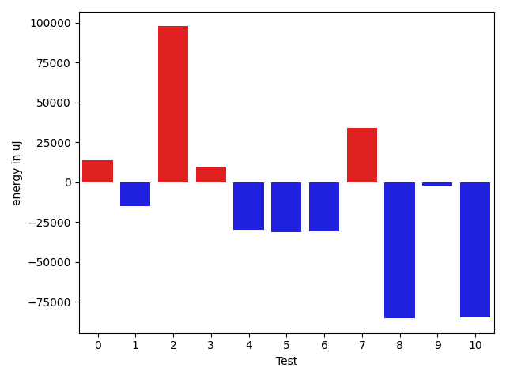
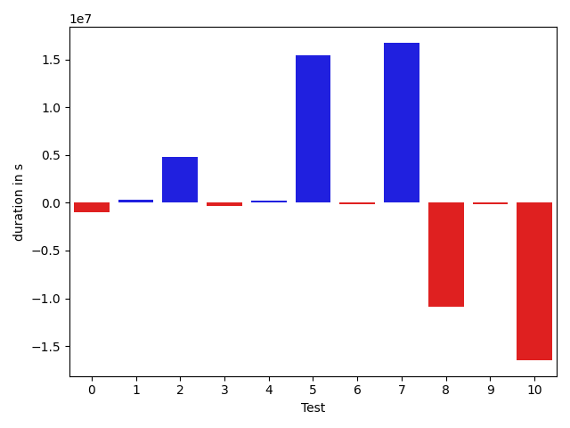

# gson 584809

https://github.com/google/gson/commit/584809

## Delta Energy per test method

| ID | EnergyV1 | EnergyV2 | DeltaEnergy | σ |
| --- | --- | --- | --- | --- |
| 0 | 145084.51515151514 | 158719.9393939394 | 13635.424242424255 | 56978.296445449545 | 61199.799644786275 |
| 1 | 61457.333333333336 | 46508.67692307692 | -14948.656410256415 | 149090.0335716941 | 17193.897108797904 |
| 2 | 108486.01515151515 | 206073.53968253967 | 97587.52453102452 | 258331.79040654536 | 403312.13518724684 |
| 3 | 391880.890625 | 401454.61666666664 | 9573.72604166664 | 509702.1269148626 | 514936.20673885714 |
| 4 | 66363.63888888889 | 36407.34375 | -29956.29513888889 | 178214.43922672863 | 2042.7619111354943 |
| 5 | 102100.45454545454 | 71055.81818181818 | -31044.636363636368 | 257970.66930200945 | 225192.61191753088 |
| 6 | 68462.72727272728 | 37568.0 | -30894.72727272728 | 186560.45394752725 | 7599.199809317786 |
| 7 | 36002.137931034486 | 70280.90909090909 | 34278.7711598746 | 2102.798803633205 | 179727.8143756955 |
| 8 | 181284.87179487178 | 96020.58974358975 | -85264.28205128203 | 375092.49452950695 | 247452.1837049423 |
| 9 | 54124.985714285714 | 52019.171428571426 | -2105.8142857142884 | 144987.1824778702 | 129715.60237160271 |
| 10 | 517033.0918367347 | 432415.6767676768 | -84617.4150690579 | 565109.5693463869 | 524021.4065947997 |

## Delta Duration per test method

| ID | DurationV1 | DurationsV2 | DeltaDuration |
| --- | --- | --- | --- |
| 0 | 5061023.03030303 | 5491563.6161616165 | 430540.58585858624 |
| 1 | 1866452.0133333334 | 1558992.4 | -307459.6133333335 |
| 2 | 3277482.1818181816 | 6367732.825396826 | 3090250.643578644 |
| 3 | 11878771.984375 | 12287875.4 | 409103.4156250004 |
| 4 | 1698238.638888889 | 824708.875 | -873529.763888889 |
| 5 | 2858153.8484848486 | 1788515.2045454546 | -1069638.643939394 |
| 6 | 1734064.606060606 | 843504.7741935484 | -890559.8318670576 |
| 7 | 718364.8275862068 | 1822452.6666666667 | 1104087.83908046 |
| 8 | 5270975.948717949 | 2814021.923076923 | -2456954.025641026 |
| 9 | 1697572.1285714286 | 1702567.5571428572 | 4995.428571428638 |
| 10 | 16033663.489795918 | 13198119.676767677 | -2835543.8130282406 |

## Misc.

| ID | Test Class | Test Method |
| --- | --- | --- |
| 0 | com.google.gson.functional.StreamingTypeAdaptersTest | testNullSafe |
| 1 | com.google.gson.functional.TypeAdapterPrecedenceTest | testSerializeNonstreamingTypeAdapterFollowedByStreamingTypeAdapter |
| 2 | com.google.gson.functional.TypeAdapterPrecedenceTest | testNonstreamingHierarchicalFollowedByNonstreaming |
| 3 | com.google.gson.functional.TypeAdapterPrecedenceTest | testStreamingFollowedByStreaming |
| 4 | com.google.gson.functional.TypeAdapterPrecedenceTest | testStreamingFollowedByNonstreamingHierarchical |
| 5 | com.google.gson.functional.TypeAdapterPrecedenceTest | testStreamingHierarchicalFollowedByNonstreamingHierarchical |
| 6 | com.google.gson.functional.TypeAdapterPrecedenceTest | testNonstreamingFollowedByNonstreaming |
| 7 | com.google.gson.functional.TypeAdapterPrecedenceTest | testStreamingFollowedByNonstreaming |
| 8 | com.google.gson.functional.TypeAdapterPrecedenceTest | testStreamingHierarchicalFollowedByNonstreaming |
| 9 | com.google.gson.functional.JsonAdapterAnnotationOnClassesTest | testRegisteredDeserializerOverridesJsonAdapter |
| 10 | com.google.gson.functional.JsonAdapterAnnotationOnClassesTest | testRegisteredSerializerOverridesJsonAdapter |

| Test | IterationV1 | IterationV2 | DeltaIteration |
| --- | --- | --- | --- |
| 0 | 99 | 99 | 0 |
| 1 | 75 | 65 | -10 |
| 2 | 66 | 63 | -3 |
| 3 | 64 | 60 | -4 |
| 4 | 36 | 32 | -4 |
| 5 | 33 | 44 | 11 |
| 6 | 33 | 31 | -2 |
| 7 | 29 | 33 | 4 |
| 8 | 39 | 39 | 0 |
| 9 | 70 | 70 | 0 |
| 10 | 98 | 99 | 1 |

| Time Label | Time (s) |
| --- | --- |
| Selection | 35.30132079124451 |
| Injection | 14.453169345855713 |
| Total | 1370.2666823863983 |

