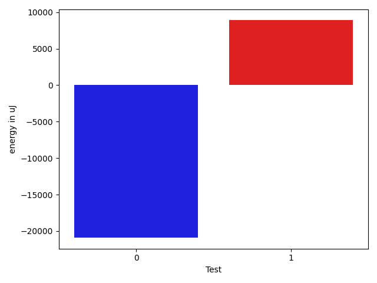

# gson 73117f

https://github.com/google/gson/commit/73117f

## Delta Energy per test method

| ID | EnergyV1 | EnergyV2 | DeltaEnergy | σV1 | σV2 |
| --- | --- | --- | --- | --- | --- |
| 0 | 34973 | 34790 | -183 | 364389.6389141847 | 359486.53395215573 |
| 1 | 33813 | 35278 | 1465 | 549321.8890117735 | 545243.7012380828 |

## Delta Duration per test method

| ID | DurationV1 | DurationsV2 | DeltaDuration |
| --- | --- | --- | --- |
| 0 | 5705922.776595744 | 4654455.4949494945 | -1051467.2816462498 |
| 1 | 9672199.90140845 | 10236260.791666666 | 564060.8902582154 |

## Misc.

| ID | Test Class | Test Method |
| --- | --- | --- |
| 0 | com.google.gson.FunctionalWithInternalDependenciesTest | testAnonymousLocalClassesSerialization |
| 1 | com.google.gson.FunctionalWithInternalDependenciesTest | testPrettyPrintListOfPrimitiveArrays |

| Test | IterationV1 | IterationV2 | DeltaIteration |
| --- | --- | --- | --- |
| 0 | 94 | 99 | 5 |
| 1 | 71 | 72 | 1 |

| Time Label | Time (s) |
| --- | --- |
| Selection | 22.920753479003906 |
| Injection | 8.22804856300354 |
| Total | 920.0195894241333 |

