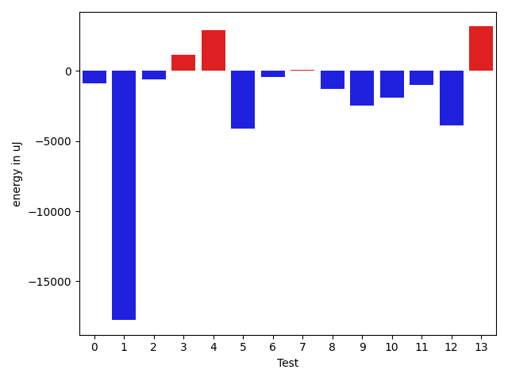
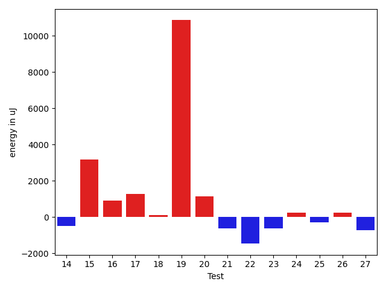
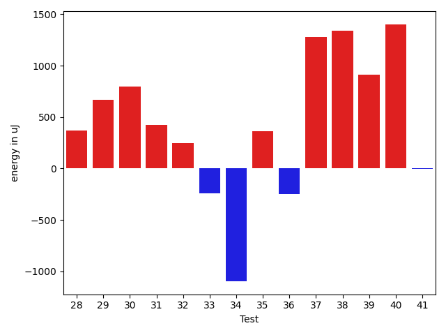
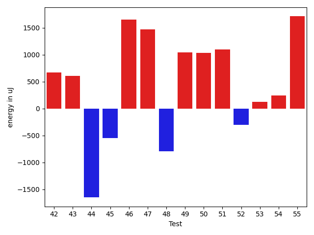
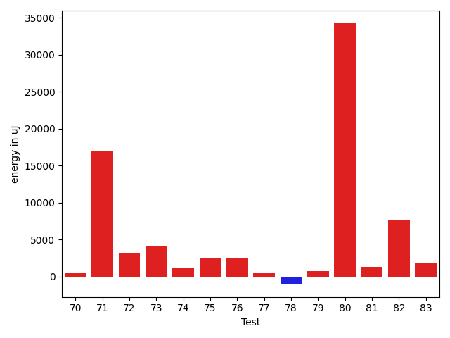
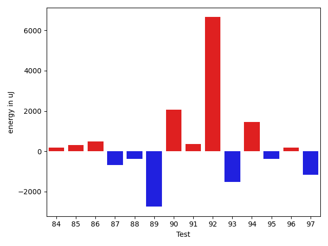
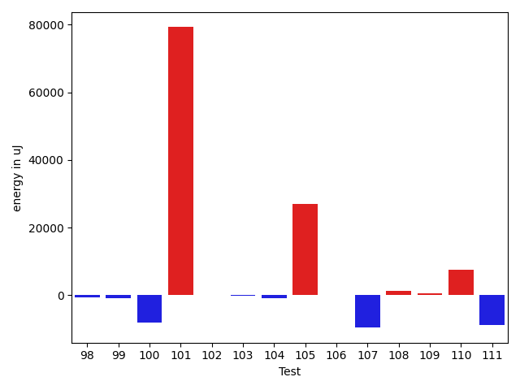
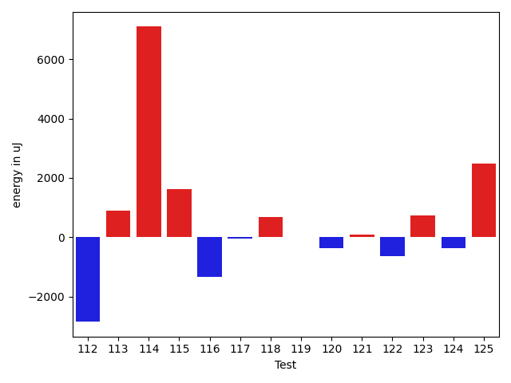
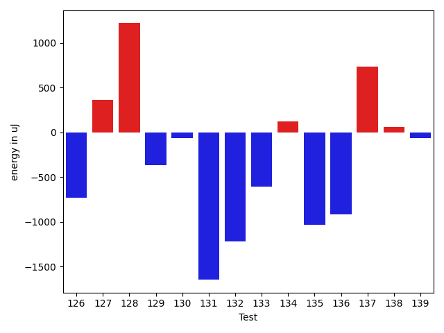
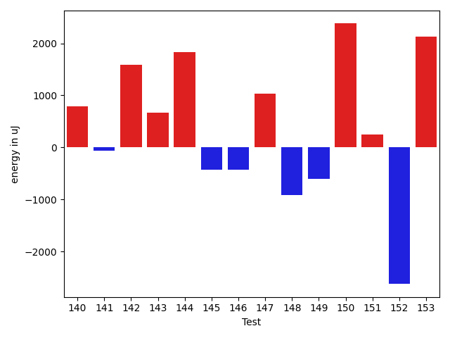

# gson 911a92

https://github.com/google/gson/commit/911a92

## Delta Energy per test method

| ID | EnergyV1 | EnergyV2 | DeltaEnergy | σV1 | σV2 |
| --- | --- | --- | --- | --- | --- |
| 0 | 37048 | 35644 | -1404 | 3223.3895441582026 | 4423.5432092808815 |
| 1 | 39428 | 36987 | -2441 | 106544.54462285062 | 77603.71119314042 |
| 2 | 34668 | 35095 | 427 | 3347.258608509243 | 3042.8478363919608 |
| 3 | 33753 | 33875 | 122 | 5169.196421167761 | 7323.174894902021 |
| 4 | 66650 | 69519 | 2869 | 19493.27114626056 | 20743.624899344315 |
| 5 | 35095 | 35645 | 550 | 34982.46489753754 | 27245.215482025087 |
| 6 | 34546 | 34912 | 366 | 7372.106263737714 | 3757.660075941796 |
| 7 | 33570 | 33752 | 182 | 2887.6454479724757 | 3244.8613991480624 |
| 8 | 34546 | 33935 | -611 | 8180.968326174137 | 5224.4518518593595 |
| 9 | 34057 | 34729 | 672 | 24471.894193842414 | 3646.1632415968847 |
| 10 | 34973 | 35339 | 366 | 45737.442373758146 | 42145.97595467155 |
| 11 | 35339 | 33752 | -1587 | 5168.732789291184 | 4004.4618948687253 |
| 12 | 38025 | 36499 | -1526 | 80496.39866373058 | 73247.89007216283 |
| 13 | 34424 | 35218 | 794 | 11270.859599462825 | 14361.728466085424 |
| 14 | 38086 | 37598 | -488 | 321590.60629048053 | 324325.4181187482 |
| 15 | 32349 | 35523 | 3174 | 3146.5645129847567 | 3427.381667245497 |
| 16 | 33142 | 34058 | 916 | 4002.4859392900903 | 3455.9482797629794 |
| 17 | 35888 | 37170 | 1282 | 3517.7238577796065 | 3346.6098482882785 |
| 18 | 35888 | 36011 | 123 | 4527.951654411889 | 180359.87649148895 |
| 19 | 62439 | 73303 | 10864 | 59657.598894668525 | 65412.635525730024 |
| 20 | 36010 | 37170 | 1160 | 3704.837470764758 | 3175.7783992488726 |
| 21 | 36743 | 36133 | -610 | 166897.0724481766 | 14022.887425142686 |
| 22 | 36987 | 35522 | -1465 | 3441.6699335208855 | 3237.607360472079 |
| 23 | 38391 | 37781 | -610 | 14270.711719448047 | 3769.196502055289 |
| 24 | 33386 | 33630 | 244 | 3732.244809211127 | 3432.70862987057 |
| 25 | 34546 | 34241 | -305 | 3337.7083283122874 | 3121.773714481707 |
| 26 | 33753 | 33996 | 243 | 3063.3710640471986 | 3258.4503122675974 |
| 27 | 37597 | 36865 | -732 | 46182.373182901545 | 51994.284729451654 |
| 28 | 34179 | 34546 | 367 | 3652.608800860859 | 3960.368186525024 |
| 29 | 34668 | 35339 | 671 | 6578.325783720926 | 3761.2176497352016 |
| 30 | 36682 | 37476 | 794 | 17935.17405868441 | 17705.605379276025 |
| 31 | 33325 | 33752 | 427 | 3433.2393351910687 | 3203.2233095221004 |
| 32 | 33325 | 33570 | 245 | 3332.7812919371986 | 3603.8868186863633 |
| 33 | 34546 | 34302 | -244 | 4108.8514181220235 | 3880.550712966101 |
| 34 | 35400 | 34301 | -1099 | 33698.06653487939 | 32957.422625020314 |
| 35 | 35095 | 35461 | 366 | 7348.03653679929 | 4025.276685529257 |
| 36 | 35523 | 35278 | -245 | 7921.402339427284 | 9230.609251640031 |
| 37 | 33203 | 34485 | 1282 | 3612.7404333230556 | 3525.8209711585127 |
| 38 | 32898 | 34241 | 1343 | 3536.12659646702 | 3376.5647712847713 |
| 39 | 33752 | 34668 | 916 | 3565.6578635645906 | 3753.036351365555 |
| 40 | 32837 | 34240 | 1403 | 3048.94067216047 | 3407.3761926911616 |
| 41 | 33997 | 33996 | -1 | 3485.922689828213 | 3481.3167401559826 |
| 42 | 34484 | 35156 | 672 | 4046.34563649538 | 3465.4207275828717 |
| 43 | 36560 | 37170 | 610 | 18524.83624687771 | 17156.459229955806 |
| 44 | 35644 | 33996 | -1648 | 12594.302166866912 | 13489.975444782856 |
| 45 | 34607 | 34057 | -550 | 2882.1345830931855 | 3144.091107137218 |
| 46 | 34363 | 36010 | 1647 | 3806.670136296295 | 3332.1538048068683 |
| 47 | 34362 | 35828 | 1466 | 5621.370604964481 | 7593.797824656905 |
| 48 | 35095 | 34302 | -793 | 10927.474820661819 | 12255.719989075194 |
| 49 | 33264 | 34302 | 1038 | 6310.461834142756 | 3246.9149603716455 |
| 50 | 34241 | 35278 | 1037 | 3012.775924431376 | 3677.464930994753 |
| 51 | 33814 | 34912 | 1098 | 3290.4314494096193 | 6188.00230422491 |
| 52 | 35156 | 34851 | -305 | 5240.0393760577235 | 4665.25952664964 |
| 53 | 33630 | 33753 | 123 | 22413.692048578072 | 2781.9515209628016 |
| 54 | 36377 | 36621 | 244 | 3520.819434094853 | 3095.7039989810846 |
| 55 | 35034 | 36744 | 1710 | 3653.1122143073285 | 3724.1069728054217 |
| 56 | 37353 | 36377 | -976 | 13919.925658227437 | 12543.68100149133 |
| 57 | 34058 | 36072 | 2014 | 6268.2212938326165 | 4960.037520864421 |
| 58 | 34973 | 35644 | 671 | 3050.350933842176 | 4126.335121527019 |
| 59 | 34607 | 37231 | 2624 | 2824.4016802444057 | 3858.6795137512718 |
| 60 | 36499 | 36194 | -305 | 13874.849613120265 | 16343.249025821031 |
| 61 | 35766 | 36315 | 549 | 2974.365281602508 | 3002.885297694721 |
| 62 | 35095 | 35096 | 1 | 3009.0321027791574 | 3053.5415872150934 |
| 63 | 37781 | 39063 | 1282 | 55036.743408269125 | 46561.65391014448 |
| 64 | 34057 | 33631 | -426 | 2985.356905271437 | 3861.494190828528 |
| 65 | 36682 | 35156 | -1526 | 3379.6688197752374 | 3549.9352173666493 |
| 66 | 36194 | 35645 | -549 | 3556.003773442134 | 3741.5595301226367 |
| 67 | 36499 | 35461 | -1038 | 2484.241715794647 | 2981.967144352868 |
| 68 | 36010 | 38147 | 2137 | 3204.937317187435 | 3689.9818406565364 |
| 69 | 35157 | 36072 | 915 | 11602.233759382232 | 10292.005013495092 |
| 70 | 36011 | 36743 | 732 | 12599.096269749136 | 12470.45171463057 |
| 71 | 34058 | 37659 | 3601 | 73089.50101322403 | 92777.42077849877 |
| 72 | 63660 | 66955 | 3295 | 20417.795297592897 | 22793.63025968579 |
| 73 | 35156 | 37536 | 2380 | 18795.903826484162 | 19400.589742699587 |
| 74 | 36315 | 41687 | 5372 | 46609.119552381024 | 37495.07493033235 |
| 75 | 34546 | 35157 | 611 | 7717.383165271554 | 10335.154000084294 |
| 76 | 36621 | 37902 | 1281 | 18843.58231693888 | 19278.87163247599 |
| 77 | 33692 | 33936 | 244 | 6624.6647458863645 | 6366.736493439459 |
| 78 | 35035 | 35461 | 426 | 11079.65178298588 | 8078.274692008037 |
| 79 | 76233 | 75256 | -977 | 41037.73652763392 | 45240.59552704258 |
| 80 | 113342 | 135376 | 22034 | 288065.1406173177 | 352912.02170043066 |
| 81 | 33997 | 36621 | 2624 | 9354.45164194791 | 6753.161223241219 |
| 82 | 34790 | 37293 | 2503 | 53640.25208299273 | 65695.4728143897 |
| 83 | 35400 | 36560 | 1160 | 2989.256418529116 | 4066.58300371628 |
| 84 | 34973 | 35156 | 183 | 4242.8162519627385 | 3148.893890618577 |
| 85 | 36133 | 36438 | 305 | 2738.317495381989 | 3910.5763849108253 |
| 86 | 35339 | 35827 | 488 | 3486.891178022372 | 2918.0107914277646 |
| 87 | 35950 | 35278 | -672 | 1915.875042912612 | 3163.6699274360644 |
| 88 | 36498 | 36133 | -365 | 2483.3465102558685 | 2754.7539079441076 |
| 89 | 39123 | 36377 | -2746 | 76583.29473450649 | 74705.399797028 |
| 90 | 33631 | 35705 | 2074 | 3542.5003060429303 | 2623.3305819425445 |
| 91 | 35828 | 36193 | 365 | 2825.9598145762793 | 2830.770111157425 |
| 92 | 62439 | 69092 | 6653 | 24551.056357470607 | 27824.163176170317 |
| 93 | 36132 | 34607 | -1525 | 3091.789745478646 | 3792.2343832210518 |
| 94 | 36010 | 37475 | 1465 | 3732.08376781658 | 3747.563229624632 |
| 95 | 35706 | 35340 | -366 | 3401.2457493541983 | 3888.540066514538 |
| 96 | 36011 | 36194 | 183 | 3667.0550240451807 | 2211.297045853406 |
| 97 | 36987 | 35828 | -1159 | 3692.9895643631703 | 2957.095094852379 |
| 98 | 35340 | 33752 | -1588 | 3238.098059815777 | 2900.730639838515 |
| 99 | 35339 | 34484 | -855 | 3017.9776037288607 | 3113.1524258646036 |
| 100 | 36010 | 35950 | -60 | 35541.390328247486 | 2623.3162295079865 |
| 101 | 176818 | 181457 | 4639 | 306612.31408971973 | 420359.3442624062 |
| 102 | 34973 | 35523 | 550 | 4051.199881209103 | 2850.446026036366 |
| 103 | 34912 | 34546 | -366 | 3897.003723977096 | 3312.1059596921564 |
| 104 | 34851 | 34485 | -366 | 7247.721708805333 | 3537.1210727195817 |
| 105 | 35766 | 37720 | 1954 | 45501.052086775904 | 81787.32222179807 |
| 106 | 34790 | 36133 | 1343 | 3727.921324639981 | 3340.1726978798642 |
| 107 | 33752 | 34240 | 488 | 41612.96936340882 | 3069.377806506675 |
| 108 | 34607 | 37048 | 2441 | 2943.5283820897325 | 3951.7255580122346 |
| 109 | 33325 | 33203 | -122 | 3765.4942619400713 | 3222.932205121639 |
| 110 | 36621 | 35400 | -1221 | 36217.02083697051 | 40602.601420461266 |
| 111 | 40466 | 39977 | -489 | 53445.38938343679 | 44490.25839780941 |
| 112 | 239867 | 239745 | -122 | 70787.05612627485 | 75112.73065957762 |
| 113 | 33447 | 36071 | 2624 | 3984.1379949118227 | 4194.3474196430925 |
| 114 | 36682 | 37292 | 610 | 49693.86058794911 | 62473.27301892866 |
| 115 | 34729 | 35523 | 794 | 4078.8698286559197 | 3902.9460480569537 |
| 116 | 35278 | 35400 | 122 | 3423.119599990805 | 3938.270197530933 |
| 117 | 34241 | 34973 | 732 | 5424.700318039748 | 4011.397585800768 |
| 118 | 35950 | 37048 | 1098 | 2955.0678796720367 | 3125.5126878001956 |
| 119 | 35278 | 36437 | 1159 | 4048.676671266988 | 3842.0761450902146 |
| 120 | 35218 | 35217 | -1 | 3629.8985253513392 | 2940.5425940632113 |
| 121 | 35584 | 35950 | 366 | 3082.447318144432 | 3785.539203498557 |
| 122 | 35461 | 35095 | -366 | 6336.383818383414 | 5157.941380637603 |
| 123 | 35949 | 36316 | 367 | 3331.4700418514853 | 3492.0297825852367 |
| 124 | 35766 | 35584 | -182 | 8869.465604769659 | 8766.55496928326 |
| 125 | 35828 | 38818 | 2990 | 3392.991508814735 | 3571.418955824798 |
| 126 | 35583 | 34851 | -732 | 3426.735124522519 | 3885.9137220963303 |
| 127 | 34423 | 34790 | 367 | 6104.394060044597 | 4972.926467164849 |
| 128 | 33630 | 34851 | 1221 | 2803.9908631315343 | 4096.290807939528 |
| 129 | 36926 | 36560 | -366 | 8030.173513998969 | 3698.7901148618344 |
| 130 | 34790 | 34729 | -61 | 3273.211311688888 | 3024.3635075169123 |
| 131 | 34362 | 32714 | -1648 | 3283.112302821514 | 3017.6733632166392 |
| 132 | 37964 | 36743 | -1221 | 61574.65140957464 | 48252.075619083196 |
| 133 | 37536 | 36926 | -610 | 112091.78639010251 | 98904.5646678069 |
| 134 | 70312 | 70434 | 122 | 37288.63081231266 | 21828.57917582409 |
| 135 | 38574 | 37537 | -1037 | 24002.999722497203 | 18118.369012245883 |
| 136 | 36255 | 35340 | -915 | 23913.829215712147 | 26852.419728560188 |
| 137 | 33752 | 34485 | 733 | 3858.982834574192 | 3714.3454464821216 |
| 138 | 33936 | 33997 | 61 | 4386.023618215743 | 3610.378181022038 |
| 139 | 37170 | 37110 | -60 | 19090.80584936819 | 30350.45717414735 |
| 140 | 33691 | 34485 | 794 | 4613.3639635983845 | 3944.1994082853284 |
| 141 | 38880 | 38818 | -62 | 64924.59308251846 | 61428.532416297145 |
| 142 | 36743 | 38330 | 1587 | 477421.86108110956 | 393085.34930155735 |
| 143 | 38025 | 38697 | 672 | 50380.46672667514 | 63221.532622694685 |
| 144 | 33386 | 35217 | 1831 | 3531.1698970886778 | 3331.649306302966 |
| 145 | 34790 | 34362 | -428 | 4285.302935616104 | 3140.249398222775 |
| 146 | 39367 | 38941 | -426 | 28121.63218135124 | 25239.488820976836 |
| 147 | 37293 | 38330 | 1037 | 311052.92345986457 | 718514.5143563935 |
| 148 | 38574 | 37659 | -915 | 94514.74108173238 | 93898.78012275654 |
| 149 | 37415 | 36804 | -611 | 2641.414906046067 | 3580.526765249307 |
| 150 | 35034 | 37415 | 2381 | 4084.327452966468 | 3899.634393119437 |
| 151 | 36804 | 37048 | 244 | 3889.4808007506967 | 3995.834334305025 |
| 152 | 38269 | 35644 | -2625 | 705053.8116568509 | 527228.5459043144 |
| 153 | 35706 | 37841 | 2135 | 24872.49791805386 | 3915.4288587384717 |

## Delta Duration per test method

| ID | DurationV1 | DurationsV2 | DeltaDuration |
| --- | --- | --- | --- |
| 0 | 902125.4727272728 | 776834.35 | -125291.1227272728 |
| 1 | 2110214.5689655175 | 1503350.5714285714 | -606863.9975369461 |
| 2 | 801526.2452830189 | 792574.0 | -8952.245283018914 |
| 3 | 1058560.6216216215 | 1104607.014925373 | 46046.39330375148 |
| 4 | 2246579.585858586 | 2209772.2525252528 | -36807.33333333302 |
| 5 | 1610682.9638554216 | 1513249.0810810812 | -97433.88277434045 |
| 6 | 1021312.6029411765 | 1032193.7878787878 | 10881.184937611339 |
| 7 | 842129.8333333334 | 871090.3928571428 | 28960.55952380947 |
| 8 | 869438.1034482758 | 848676.7272727273 | -20761.376175548532 |
| 9 | 1045897.7462686567 | 898002.7288135593 | -147895.0174550974 |
| 10 | 1606666.593220339 | 1525063.9402985075 | -81602.65292183147 |
| 11 | 971930.2253521127 | 961821.6615384616 | -10108.563813651097 |
| 12 | 1882020.0555555555 | 1801032.0983606558 | -80987.95719489967 |
| 13 | 1237474.5789473683 | 1213407.0632911392 | -24067.51565622911 |
| 14 | 3776060.01754386 | 4342223.013513514 | 566162.9959696541 |
| 15 | 502942.9375 | 494561.7619047619 | -8381.175595238106 |
| 16 | 479733.4090909091 | 496571.9090909091 | 16838.5 |
| 17 | 570984.4285714285 | 553270.8205128205 | -17713.60805860802 |
| 18 | 780802.8888888889 | 1455839.5961538462 | 675036.7072649574 |
| 19 | 2482296.4646464647 | 2555443.7474747472 | 73147.28282828256 |
| 20 | 702360.1521739131 | 758605.2894736842 | 56245.13729977107 |
| 21 | 1922535.93220339 | 1033264.0615384616 | -889271.8706649283 |
| 22 | 687353.0454545454 | 700625.5609756098 | 13272.5155210644 |
| 23 | 704424.619047619 | 600591.1034482758 | -103833.51559934323 |
| 24 | 690759.5609756098 | 710842.0697674418 | 20082.50879183202 |
| 25 | 827573.2321428572 | 807724.8360655737 | -19848.396077283425 |
| 26 | 844286.8333333334 | 822454.2131147541 | -21832.620218579308 |
| 27 | 1467869.486111111 | 1638221.4133333333 | 170351.92722222232 |
| 28 | 756603.0185185185 | 752626.0 | -3977.01851851854 |
| 29 | 795602.5471698113 | 817009.9122807018 | 21407.365110890474 |
| 30 | 1740948.2857142857 | 1558601.0631578946 | -182347.22255639103 |
| 31 | 876793.5652173914 | 892510.6037735849 | 15717.038556193584 |
| 32 | 758636.3478260869 | 764446.7234042553 | 5810.37557816843 |
| 33 | 773408.0697674418 | 795365.7959183673 | 21957.726150925504 |
| 34 | 1232182.9215686275 | 1137866.3404255318 | -94316.58114309562 |
| 35 | 974970.4736842106 | 1024980.5 | 50010.02631578944 |
| 36 | 902505.2631578947 | 943807.7142857143 | 41302.4511278196 |
| 37 | 720330.3469387755 | 724887.6136363636 | 4557.266697588144 |
| 38 | 741137.9629629629 | 739806.1886792453 | -1331.7742837176193 |
| 39 | 375805.6666666667 | 436316.0 | 60510.333333333314 |
| 40 | 639561.7586206896 | 631214.0 | -8347.758620689623 |
| 41 | 750020.2093023256 | 793933.4901960784 | 43913.28089375282 |
| 42 | 923518.9807692308 | 794797.380952381 | -128721.5998168498 |
| 43 | 1533591.465116279 | 1463336.3 | -70255.16511627892 |
| 44 | 1231312.782051282 | 1224754.808219178 | -6557.973832103889 |
| 45 | 716356.4 | 684743.6818181818 | -31612.718181818258 |
| 46 | 876106.0434782609 | 886538.25 | 10432.206521739135 |
| 47 | 1069499.6184210526 | 1034184.0273972603 | -35315.59102379228 |
| 48 | 1120200.0921052631 | 1138758.6666666667 | 18558.5745614036 |
| 49 | 932125.3684210526 | 916633.625 | -15491.743421052583 |
| 50 | 745926.0 | 710574.7659574468 | -35351.23404255323 |
| 51 | 852647.25 | 786099.4745762711 | -66547.77542372886 |
| 52 | 938909.5873015873 | 946034.0 | 7124.412698412663 |
| 53 | 886219.593220339 | 828744.8035714285 | -57474.78964891052 |
| 54 | 719701.6 | 685610.6052631579 | -34090.99473684211 |
| 55 | 626687.1212121212 | 598355.5 | -28331.621212121216 |
| 56 | 1062820.0 | 757736.3947368421 | -305083.60526315786 |
| 57 | 884512.3035714285 | 870711.2068965518 | -13801.096674876753 |
| 58 | 593902.6857142857 | 610360.9761904762 | 16458.29047619051 |
| 59 | 638811.1724137932 | 555935.3125 | -82875.85991379316 |
| 60 | 1050983.6315789474 | 878357.72 | -172625.91157894745 |
| 61 | 507677.1538461539 | 389456.55555555556 | -118220.59829059831 |
| 62 | 437776.2 | 345748.3846153846 | -92027.81538461539 |
| 63 | 1994515.0 | 1210579.3333333333 | -783935.6666666667 |
| 64 | 541159.4444444445 | 509085.3333333333 | -32074.111111111182 |
| 65 | 518154.23076923075 | 499055.8 | -19098.430769230763 |
| 66 | 531016.0 | 455023.6842105263 | -75992.31578947371 |
| 67 | 436122.4285714286 | 438728.1 | 2605.671428571397 |
| 68 | 458721.3846153846 | 392867.0625 | -65854.32211538462 |
| 69 | 1339435.0 | 1322878.8645833333 | -16556.135416666744 |
| 70 | 1478189.5151515151 | 1381320.4838709678 | -96869.03128054738 |
| 71 | 1943943.6404494382 | 2498082.5888888887 | 554138.9484394505 |
| 72 | 2009624.393939394 | 2008201.292929293 | -1423.1010101011489 |
| 73 | 1448932.125 | 1491583.9886363635 | 42651.86363636353 |
| 74 | 2013195.836734694 | 2089001.3673469387 | 75805.53061224474 |
| 75 | 1292345.7551020407 | 1281365.2826086956 | -10980.47249334515 |
| 76 | 1692342.1515151516 | 1689981.2525252525 | -2360.898989899084 |
| 77 | 1119250.219512195 | 1090766.7283950618 | -28483.491117133293 |
| 78 | 1265344.8444444444 | 1261253.1505376345 | -4091.693906809902 |
| 79 | 2875958.303030303 | 2964390.9393939395 | 88432.63636363624 |
| 80 | 5610112.404040404 | 6642238.929292929 | 1032126.5252525257 |
| 81 | 906655.0952380953 | 836256.9782608695 | -70398.11697722576 |
| 82 | 1386277.5 | 1550525.25 | 164247.75 |
| 83 | 919804.1914893617 | 880228.8571428572 | -39575.33434650453 |
| 84 | 551955.9310344828 | 557573.5 | 5617.568965517217 |
| 85 | 580304.2258064516 | 554723.9666666667 | -25580.25913978496 |
| 86 | 627533.9117647059 | 587511.7 | -40022.21176470595 |
| 87 | 519931.1052631579 | 467432.8461538461 | -52498.259109311795 |
| 88 | 442825.45 | 430422.6 | -12402.850000000035 |
| 89 | 1956774.3095238095 | 1593639.606060606 | -363134.7034632035 |
| 90 | 481611.4516129032 | 469591.5652173913 | -12019.886395511916 |
| 91 | 544096.8 | 515242.26666666666 | -28854.533333333384 |
| 92 | 1849715.8048780488 | 2031006.6470588236 | 181290.84218077478 |
| 93 | 421355.6666666667 | 419237.8333333333 | -2117.833333333372 |
| 94 | 603037.5 | 553930.1470588235 | -49107.352941176505 |
| 95 | 650000.2 | 565149.9 | -84850.29999999993 |
| 96 | 690491.55 | 617934.3125 | -72557.23750000005 |
| 97 | 709810.7173913043 | 656576.35 | -53234.367391304346 |
| 98 | 445269.17647058825 | 457256.5714285714 | 11987.394957983168 |
| 99 | 490172.5882352941 | 443013.86666666664 | -47158.72156862746 |
| 100 | 767956.6875 | 404833.35 | -363123.3375 |
| 101 | 7296469.767676768 | 9471512.626262626 | 2175042.858585858 |
| 102 | 624281.2058823529 | 592628.1612903225 | -31653.044592030346 |
| 103 | 879440.0370370371 | 911650.1379310344 | 32210.100893997354 |
| 104 | 991017.5081967213 | 989587.6923076923 | -1429.8158890290651 |
| 105 | 1264234.0983606558 | 2138102.8 | 873868.701639344 |
| 106 | 591318.4516129033 | 607008.7105263158 | 15690.258913412574 |
| 107 | 1310849.9285714286 | 978794.2337662338 | -332055.69480519486 |
| 108 | 854506.0238095238 | 948553.8181818182 | 94047.79437229445 |
| 109 | 682589.0263157894 | 714135.0243902439 | 31545.99807445449 |
| 110 | 1231631.9444444445 | 1595170.8333333333 | 363538.88888888876 |
| 111 | 2147517.4606741574 | 1866004.4731182796 | -281512.9875558778 |
| 112 | 7320184.04040404 | 7289857.3838383835 | -30326.656565656886 |
| 113 | 681204.875 | 693057.4666666667 | 11852.591666666674 |
| 114 | 1332276.015625 | 1586467.1 | 254191.0843750001 |
| 115 | 689269.8536585366 | 688965.6923076923 | -304.1613508443115 |
| 116 | 668178.3478260869 | 626165.6818181818 | -42012.66600790515 |
| 117 | 906128.8918918918 | 903424.2727272727 | -2704.619164619129 |
| 118 | 548238.25 | 550430.16 | 2191.9100000000326 |
| 119 | 656976.0769230769 | 592720.9411764706 | -64255.13574660628 |
| 120 | 475265.0869565217 | 453881.85 | -21383.236956521752 |
| 121 | 525339.8333333334 | 492474.21428571426 | -32865.61904761911 |
| 122 | 1174187.1710526317 | 1121507.4 | -52679.77105263178 |
| 123 | 849438.1176470588 | 837058.9122807018 | -12379.205366356997 |
| 124 | 1289961.2127659575 | 1240995.076923077 | -48966.13584288047 |
| 125 | 798753.7666666667 | 558669.0 | -240084.76666666672 |
| 126 | 713104.1818181818 | 479378.652173913 | -233725.52964426874 |
| 127 | 1080937.9726027397 | 1045564.4634146341 | -35373.509188105585 |
| 128 | 770059.4893617021 | 750978.3333333334 | -19081.156028368743 |
| 129 | 750919.0833333334 | 749177.9130434783 | -1741.1702898551011 |
| 130 | 986762.1627906977 | 781386.24 | -205375.92279069766 |
| 131 | 760357.8085106383 | 743950.4634146341 | -16407.345096004196 |
| 132 | 1862157.761904762 | 1601909.3 | -260248.46190476185 |
| 133 | 2319899.25 | 1870612.92 | -449286.3300000001 |
| 134 | 2293019.9292929294 | 2112176.9191919193 | -180843.0101010101 |
| 135 | 1371287.3529411764 | 1079034.1515151516 | -292253.2014260248 |
| 136 | 1438870.046511628 | 1465458.1975308643 | 26588.151019236306 |
| 137 | 771177.9464285715 | 781911.2888888889 | 10733.34246031742 |
| 138 | 758913.2352941176 | 796863.55 | 37950.314705882454 |
| 139 | 1220946.6382978724 | 1249293.2045454546 | 28346.566247582203 |
| 140 | 608037.2702702703 | 573550.5588235294 | -34486.7114467409 |
| 141 | 1693361.7027027027 | 1862612.205882353 | 169250.5031796503 |
| 142 | 9421565.88 | 5615770.1875 | -3805795.692500001 |
| 143 | 1437793.6511627906 | 1866136.2571428572 | 428342.6059800666 |
| 144 | 548272.8421052631 | 499499.3043478261 | -48773.537757437036 |
| 145 | 567716.8125 | 624418.3548387097 | 56701.542338709696 |
| 146 | 1181067.7407407407 | 997505.2727272727 | -183562.46801346797 |
| 147 | 2488748.4242424243 | 10786415.471428571 | 8297667.047186147 |
| 148 | 2226255.777777778 | 1835050.3636363635 | -391205.41414141445 |
| 149 | 596247.8823529412 | 521986.6666666667 | -74261.21568627452 |
| 150 | 565914.9166666666 | 470676.06666666665 | -95238.84999999998 |
| 151 | 706464.1025641026 | 614749.3333333334 | -91714.76923076925 |
| 152 | 12807425.967741935 | 7759365.88 | -5048060.087741935 |
| 153 | 841476.625 | 592310.696969697 | -249165.92803030298 |

## Misc.

| ID | Test Class | Test Method |
| --- | --- | --- |
| 0 | com.google.gson.functional.CustomDeserializerTest | testDefaultConstructorNotCalledOnField |
| 1 | com.google.gson.functional.CustomDeserializerTest | testDefaultConstructorNotCalledOnObject |
| 2 | com.google.gson.functional.CustomTypeAdaptersTest | testCustomTypeAdapterAppliesToSubClassesSerializedAsBaseClass |
| 3 | com.google.gson.functional.CustomTypeAdaptersTest | testCustomAdapterInvokedForMapElementSerializationWithType |
| 4 | com.google.gson.functional.CustomTypeAdaptersTest | testCustomTypeAdapterDoesNotAppliesToSubClasses |
| 5 | com.google.gson.functional.CustomTypeAdaptersTest | testCustomAdapterInvokedForCollectionElementSerializationWithType |
| 6 | com.google.gson.functional.CustomTypeAdaptersTest | testCustomSerializerForLong |
| 7 | com.google.gson.functional.CustomTypeAdaptersTest | testCustomByteArrayDeserializerAndInstanceCreator |
| 8 | com.google.gson.functional.CustomTypeAdaptersTest | testCustomByteArraySerializer |
| 9 | com.google.gson.functional.CustomTypeAdaptersTest | testCustomAdapterInvokedForMapElementDeserialization |
| 10 | com.google.gson.functional.CustomTypeAdaptersTest | testCustomNestedSerializers |
| 11 | com.google.gson.functional.CustomTypeAdaptersTest | testCustomNestedDeserializers |
| 12 | com.google.gson.functional.CustomTypeAdaptersTest | testCustomDeserializers |
| 13 | com.google.gson.functional.CustomTypeAdaptersTest | testCustomDeserializerForLong |
| 14 | com.google.gson.functional.CustomTypeAdaptersTest | testCustomSerializers |
| 15 | com.google.gson.functional.CustomTypeAdaptersTest | testCustomAdapterInvokedForCollectionElementSerialization |
| 16 | com.google.gson.functional.CustomTypeAdaptersTest | testCustomAdapterInvokedForMapElementSerialization |
| 17 | com.google.gson.FunctionalWithInternalDependenciesTest | testMultipleArrays |
| 18 | com.google.gson.FunctionalWithInternalDependenciesTest | testAnonymousLocalClassesSerialization |
| 19 | com.google.gson.FunctionalWithInternalDependenciesTest | testPrettyPrintList |
| 20 | com.google.gson.FunctionalWithInternalDependenciesTest | testPrettyPrintListOfPrimitiveArrays |
| 21 | com.google.gson.FunctionalWithInternalDependenciesTest | testPrettyPrintArrayOfObjects |
| 22 | com.google.gson.FunctionalWithInternalDependenciesTest | testPrettyPrintArrayOfPrimitiveArrays |
| 23 | com.google.gson.FunctionalWithInternalDependenciesTest | testPrettyPrintArrayOfPrimitives |
| 24 | com.google.gson.functional.CollectionTest | testRawCollectionOfBagOfPrimitivesNotAllowed |
| 25 | com.google.gson.functional.CollectionTest | testCollectionOfEnumsDeserialization |
| 26 | com.google.gson.functional.CollectionTest | testWildcardPrimitiveCollectionDeserilaization |
| 27 | com.google.gson.functional.CollectionTest | testTopLevelCollectionOfIntegersDeserialization |
| 28 | com.google.gson.functional.CollectionTest | testQueueSerialization |
| 29 | com.google.gson.functional.CollectionTest | testLinkedListDeserialization |
| 30 | com.google.gson.functional.CollectionTest | testWildcardCollectionField |
| 31 | com.google.gson.functional.CollectionTest | testRawCollectionDeserializationNotAlllowed |
| 32 | com.google.gson.functional.CollectionTest | testNullsInListDeserialization |
| 33 | com.google.gson.functional.CollectionTest | testQueueDeserialization |
| 34 | com.google.gson.functional.CollectionTest | testCollectionOfBagOfPrimitivesSerialization |
| 35 | com.google.gson.functional.CollectionTest | testTopLevelListOfIntegerCollectionsDeserialization |
| 36 | com.google.gson.functional.CollectionTest | testLinkedListSerialization |
| 37 | com.google.gson.functional.CollectionTest | testCollectionOfObjectSerialization |
| 38 | com.google.gson.functional.CollectionTest | testCollectionOfStringsDeserialization |
| 39 | com.google.gson.functional.CollectionTest | testCollectionOfStringsSerialization |
| 40 | com.google.gson.functional.CollectionTest | testRawCollectionSerialization |
| 41 | com.google.gson.functional.CollectionTest | testNullsInListSerialization |
| 42 | com.google.gson.functional.ObjectTest | testNestedSerialization |
| 43 | com.google.gson.functional.ObjectTest | testArrayOfArraysDeserialization |
| 44 | com.google.gson.functional.ObjectTest | testSubInterfacesOfCollectionDeserialization |
| 45 | com.google.gson.functional.ObjectTest | testPrimitiveArrayInAnObjectDeserialization |
| 46 | com.google.gson.functional.ObjectTest | testClassWithObjectFieldSerialization |
| 47 | com.google.gson.functional.ObjectTest | testArrayOfObjectsDeserialization |
| 48 | com.google.gson.functional.ObjectTest | testArrayOfArraysSerialization |
| 49 | com.google.gson.functional.ObjectTest | testInheritenceDeserialization |
| 50 | com.google.gson.functional.ObjectTest | testNullFieldsDeserialization |
| 51 | com.google.gson.functional.ObjectTest | testArrayOfObjectsSerialization |
| 52 | com.google.gson.functional.ObjectTest | testInheritenceSerialization |
| 53 | com.google.gson.functional.ObjectTest | testInnerClassDeserialization |
| 54 | com.google.gson.functional.ObjectTest | testClassWithTransientFieldsDeserialization |
| 55 | com.google.gson.functional.ObjectTest | testClassWithTransientFieldsDeserializationTransientFieldsPassedInJsonAreIgnored |
| 56 | com.google.gson.functional.ObjectTest | testBagOfPrimitivesSerialization |
| 57 | com.google.gson.functional.ObjectTest | testNestedDeserialization |
| 58 | com.google.gson.functional.ObjectTest | testNullFieldsSerialization |
| 59 | com.google.gson.functional.StringTest | testSingleQuoteInStringSerialization |
| 60 | com.google.gson.functional.StringTest | testStringValueAsSingleElementArraySerialization |
| 61 | com.google.gson.functional.StringTest | testEscapedCtrlRInStringSerialization |
| 62 | com.google.gson.functional.StringTest | testJavascriptKeywordsInStringSerialization |
| 63 | com.google.gson.functional.StringTest | testStringValueSerialization |
| 64 | com.google.gson.functional.StringTest | testStringValueAsSingleElementArrayDeserialization |
| 65 | com.google.gson.functional.StringTest | testEscapingQuotesInStringSerialization |
| 66 | com.google.gson.functional.StringTest | testEscapedCtrlNInStringSerialization |
| 67 | com.google.gson.functional.StringTest | testAssignmentCharSerialization |
| 68 | com.google.gson.functional.StringTest | testEscapedBackslashInStringSerialization |
| 69 | com.google.gson.functional.ParameterizedTypesTest | testVariableTypeArrayDeserialization |
| 70 | com.google.gson.functional.ParameterizedTypesTest | testParameterizedTypeGenericArraysDeserialization |
| 71 | com.google.gson.functional.ParameterizedTypesTest | testParameterizedTypeDeserialization |
| 72 | com.google.gson.functional.ParameterizedTypesTest | testVariableTypeFieldsAndGenericArraysDeserialization |
| 73 | com.google.gson.functional.ParameterizedTypesTest | testTypesWithMultipleParametersDeserialization |
| 74 | com.google.gson.functional.ParameterizedTypesTest | testTypesWithMultipleParametersSerialization |
| 75 | com.google.gson.functional.ParameterizedTypesTest | testParameterizedTypeWithVariableTypeDeserialization |
| 76 | com.google.gson.functional.ParameterizedTypesTest | testParameterizedTypesWithCustomDeserializer |
| 77 | com.google.gson.functional.ParameterizedTypesTest | testParameterizedTypeWithReaderDeserialization |
| 78 | com.google.gson.functional.ParameterizedTypesTest | testParameterizedTypeWithCustomSerializer |
| 79 | com.google.gson.functional.NamingPolicyTest | testGsonWithNonDefaultFieldNamingPolicySerialization |
| 80 | com.google.gson.functional.NamingPolicyTest | testGsonDuplicateNameUsingSerializedNameFieldNamingPolicySerialization |
| 81 | com.google.gson.functional.NamingPolicyTest | testGsonWithSerializedNameFieldNamingPolicyDeserialization |
| 82 | com.google.gson.functional.NamingPolicyTest | testGsonWithNonDefaultFieldNamingPolicyDeserialiation |
| 83 | com.google.gson.functional.NamingPolicyTest | testGsonWithSerializedNameFieldNamingPolicySerialization |
| 84 | com.google.gson.functional.PrimitiveTest | testPrimitiveDoubleAutoboxedInASingleElementArraySerialization |
| 85 | com.google.gson.functional.PrimitiveTest | testPrimitiveDoubleAutoboxedInASingleElementArrayDeserialization |
| 86 | com.google.gson.functional.PrimitiveTest | testNumberDeserialization |
| 87 | com.google.gson.functional.PrimitiveTest | testBigDecimalInASingleElementArrayDeserialization |
| 88 | com.google.gson.functional.PrimitiveTest | testNegativeInfinitySerialization |
| 89 | com.google.gson.functional.PrimitiveTest | testPrimitiveIntegerAutoboxedInASingleElementArrayDeserialization |
| 90 | com.google.gson.functional.PrimitiveTest | testDoubleNaNSerialization |
| 91 | com.google.gson.functional.PrimitiveTest | testBigIntegerInASingleElementArrayDeserialization |
| 92 | com.google.gson.functional.PrimitiveTest | testPrimitiveDoubleAutoboxedSerialization |
| 93 | com.google.gson.functional.PrimitiveTest | testFloatInfinitySerialization |
| 94 | com.google.gson.functional.PrimitiveTest | testPrimitiveLongAutoboxedInASingleElementArrayDeserialization |
| 95 | com.google.gson.functional.PrimitiveTest | testPrimitiveBooleanAutoboxedInASingleElementArrayDeserialization |
| 96 | com.google.gson.functional.PrimitiveTest | testOverridingDefaultPrimitiveSerialization |
| 97 | com.google.gson.functional.PrimitiveTest | testPrimitiveBooleanAutoboxedDeserialization |
| 98 | com.google.gson.functional.PrimitiveTest | testDoubleInfinitySerialization |
| 99 | com.google.gson.functional.PrimitiveTest | testFloatNaNSerialization |
| 100 | com.google.gson.functional.PrimitiveTest | testNegativeInfinityFloatSerialization |
| 101 | com.google.gson.functional.VersioningTest | testVersionedUntilSerialization |
| 102 | com.google.gson.functional.VersioningTest | testIgnoreLaterVersionClassSerialization |
| 103 | com.google.gson.functional.VersioningTest | testVersionedClassesDeserialization |
| 104 | com.google.gson.functional.VersioningTest | testVersionedGsonMixingSinceAndUntilSerialization |
| 105 | com.google.gson.functional.VersioningTest | testVersionedUntilDeserialization |
| 106 | com.google.gson.functional.VersioningTest | testIgnoreLaterVersionClassDeserialization |
| 107 | com.google.gson.functional.VersioningTest | testVersionedGsonMixingSinceAndUntilDeserialization |
| 108 | com.google.gson.functional.VersioningTest | testVersionedClassesSerialization |
| 109 | com.google.gson.functional.VersioningTest | testVersionedGsonWithUnversionedClassesDeserialization |
| 110 | com.google.gson.functional.VersioningTest | testVersionedGsonWithUnversionedClassesSerialization |
| 111 | com.google.gson.functional.ConcurrencyTest | testSingleThreadSerialization |
| 112 | com.google.gson.functional.ConcurrencyTest | testMultiThreadSerialization |
| 113 | com.google.gson.functional.ArrayTest | testTopLevelEnumInASingleElementArrayDeserialization |
| 114 | com.google.gson.functional.ArrayTest | testTopLevelArrayOfIntsDeserialization |
| 115 | com.google.gson.functional.ArrayTest | testArrayOfPrimitivesWithCustomTypeAdapter |
| 116 | com.google.gson.functional.ArrayTest | testNullsInArraySerialization |
| 117 | com.google.gson.functional.ArrayTest | testArrayOfCollectionDeserialization |
| 118 | com.google.gson.functional.ArrayTest | testEmptyArrayDeserialization |
| 119 | com.google.gson.functional.ArrayTest | testNullsInArrayDeserialization |
| 120 | com.google.gson.functional.ArrayTest | testArrayOfStringsSerialization |
| 121 | com.google.gson.functional.ArrayTest | testArrayOfStringsDeserialization |
| 122 | com.google.gson.functional.MapTest | testParameterizedMapSubclassDeserialization |
| 123 | com.google.gson.functional.MapTest | testMapSerializationWithNullValueButSerializeNulls |
| 124 | com.google.gson.functional.MapTest | testParameterizedMapSubclassSerialization |
| 125 | com.google.gson.functional.MapTest | testRawMapSerialization |
| 126 | com.google.gson.functional.MapTest | testMapSubclassSerialization |
| 127 | com.google.gson.functional.DefaultTypeAdaptersTest | testDefaultDateDeserializationUsingBuilder |
| 128 | com.google.gson.functional.DefaultTypeAdaptersTest | testDateSerializationWithPattern |
| 129 | com.google.gson.functional.DefaultTypeAdaptersTest | testSetSerialization |
| 130 | com.google.gson.functional.DefaultTypeAdaptersTest | testDateDeserializationWithPattern |
| 131 | com.google.gson.functional.DefaultTypeAdaptersTest | testDefaultDateSerializationUsingBuilder |
| 132 | com.google.gson.functional.EscapingTest | testEscapingObjectFields |
| 133 | com.google.gson.functional.EscapingTest | testEscapingQuotesInStringArray |
| 134 | com.google.gson.functional.UncategorizedTest | testReturningDerivedClassesDuringDeserialization |
| 135 | com.google.gson.functional.UncategorizedTest | testStaticFieldsAreNotSerialized |
| 136 | com.google.gson.functional.NullObjectAndFieldTest | testExplicitSerializationOfNullArrayMembers |
| 137 | com.google.gson.functional.NullObjectAndFieldTest | testNullWrappedPrimitiveMemberSerialization |
| 138 | com.google.gson.functional.NullObjectAndFieldTest | testNullWrappedPrimitiveMemberDeserialization |
| 139 | com.google.gson.functional.NullObjectAndFieldTest | testExplicitDeserializationOfNulls |
| 140 | com.google.gson.functional.NullObjectAndFieldTest | testExplicitSerializationOfNullStringMembers |
| 141 | com.google.gson.functional.NullObjectAndFieldTest | testTopLevelNullObjectDeserialization |
| 142 | com.google.gson.functional.NullObjectAndFieldTest | testTopLevelNullObjectSerialization |
| 143 | com.google.gson.functional.NullObjectAndFieldTest | testExplicitSerializationOfNulls |
| 144 | com.google.gson.functional.NullObjectAndFieldTest | testCustomSerializationOfNulls |
| 145 | com.google.gson.functional.NullObjectAndFieldTest | testExplicitSerializationOfNullCollectionMembers |
| 146 | com.google.gson.functional.InternationalizationTest | testStringsWithUnicodeChineseCharactersSerialization |
| 147 | com.google.gson.functional.PrintFormattingTest | testCompactFormattingLeavesNoWhiteSpace |
| 148 | com.google.gson.functional.ReadersWritersTest | testWriterForSerialization |
| 149 | com.google.gson.functional.ReadersWritersTest | testTopLevelNullObjectDeserializationWithReaderAndSerializeNulls |
| 150 | com.google.gson.functional.ReadersWritersTest | testTopLevelNullObjectSerializationWithWriterAndSerializeNulls |
| 151 | com.google.gson.GsonTypeAdapterTest | testTypeAdapterDoesNotAffectNonAdaptedTypes |
| 152 | com.google.gson.GsonBuilderTest | testCreatingMoreThanOnce |
| 153 | com.google.gson.functional.ExposeFieldsTest | testExposedInterfaceFieldDeserialization |

| Test | IterationV1 | IterationV2 | DeltaIteration |
| --- | --- | --- | --- |
| 0 | 55 | 40 | -15 |
| 1 | 58 | 63 | 5 |
| 2 | 53 | 49 | -4 |
| 3 | 74 | 67 | -7 |
| 4 | 99 | 99 | 0 |
| 5 | 83 | 74 | -9 |
| 6 | 68 | 66 | -2 |
| 7 | 54 | 56 | 2 |
| 8 | 58 | 55 | -3 |
| 9 | 67 | 59 | -8 |
| 10 | 59 | 67 | 8 |
| 11 | 71 | 65 | -6 |
| 12 | 54 | 61 | 7 |
| 13 | 76 | 79 | 3 |
| 14 | 57 | 74 | 17 |
| 15 | 16 | 21 | 5 |
| 16 | 22 | 22 | 0 |
| 17 | 35 | 39 | 4 |
| 18 | 45 | 52 | 7 |
| 19 | 99 | 99 | 0 |
| 20 | 46 | 38 | -8 |
| 21 | 59 | 65 | 6 |
| 22 | 44 | 41 | -3 |
| 23 | 21 | 29 | 8 |
| 24 | 41 | 43 | 2 |
| 25 | 56 | 61 | 5 |
| 26 | 48 | 61 | 13 |
| 27 | 72 | 75 | 3 |
| 28 | 54 | 54 | 0 |
| 29 | 53 | 57 | 4 |
| 30 | 98 | 95 | -3 |
| 31 | 46 | 53 | 7 |
| 32 | 46 | 47 | 1 |
| 33 | 43 | 49 | 6 |
| 34 | 51 | 47 | -4 |
| 35 | 57 | 58 | 1 |
| 36 | 57 | 63 | 6 |
| 37 | 49 | 44 | -5 |
| 38 | 54 | 53 | -1 |
| 39 | 21 | 17 | -4 |
| 40 | 29 | 27 | -2 |
| 41 | 43 | 51 | 8 |
| 42 | 52 | 42 | -10 |
| 43 | 86 | 90 | 4 |
| 44 | 78 | 73 | -5 |
| 45 | 45 | 44 | -1 |
| 46 | 69 | 60 | -9 |
| 47 | 76 | 73 | -3 |
| 48 | 76 | 72 | -4 |
| 49 | 57 | 56 | -1 |
| 50 | 48 | 47 | -1 |
| 51 | 48 | 59 | 11 |
| 52 | 63 | 63 | 0 |
| 53 | 59 | 56 | -3 |
| 54 | 40 | 38 | -2 |
| 55 | 33 | 28 | -5 |
| 56 | 22 | 38 | 16 |
| 57 | 56 | 58 | 2 |
| 58 | 35 | 42 | 7 |
| 59 | 29 | 16 | -13 |
| 60 | 38 | 25 | -13 |
| 61 | 13 | 18 | 5 |
| 62 | 15 | 13 | -2 |
| 63 | 27 | 21 | -6 |
| 64 | 27 | 18 | -9 |
| 65 | 26 | 20 | -6 |
| 66 | 14 | 19 | 5 |
| 67 | 21 | 20 | -1 |
| 68 | 13 | 16 | 3 |
| 69 | 92 | 96 | 4 |
| 70 | 99 | 93 | -6 |
| 71 | 89 | 90 | 1 |
| 72 | 99 | 99 | 0 |
| 73 | 88 | 88 | 0 |
| 74 | 98 | 98 | 0 |
| 75 | 98 | 92 | -6 |
| 76 | 99 | 99 | 0 |
| 77 | 82 | 81 | -1 |
| 78 | 90 | 93 | 3 |
| 79 | 99 | 99 | 0 |
| 80 | 99 | 99 | 0 |
| 81 | 42 | 46 | 4 |
| 82 | 36 | 52 | 16 |
| 83 | 47 | 49 | 2 |
| 84 | 29 | 32 | 3 |
| 85 | 31 | 30 | -1 |
| 86 | 34 | 30 | -4 |
| 87 | 19 | 26 | 7 |
| 88 | 20 | 15 | -5 |
| 89 | 42 | 33 | -9 |
| 90 | 31 | 23 | -8 |
| 91 | 25 | 15 | -10 |
| 92 | 41 | 34 | -7 |
| 93 | 18 | 18 | 0 |
| 94 | 24 | 34 | 10 |
| 95 | 40 | 30 | -10 |
| 96 | 40 | 32 | -8 |
| 97 | 46 | 40 | -6 |
| 98 | 17 | 14 | -3 |
| 99 | 17 | 15 | -2 |
| 100 | 16 | 20 | 4 |
| 101 | 99 | 99 | 0 |
| 102 | 34 | 31 | -3 |
| 103 | 54 | 58 | 4 |
| 104 | 61 | 65 | 4 |
| 105 | 61 | 60 | -1 |
| 106 | 31 | 38 | 7 |
| 107 | 70 | 77 | 7 |
| 108 | 42 | 44 | 2 |
| 109 | 38 | 41 | 3 |
| 110 | 36 | 42 | 6 |
| 111 | 89 | 93 | 4 |
| 112 | 99 | 99 | 0 |
| 113 | 32 | 30 | -2 |
| 114 | 64 | 50 | -14 |
| 115 | 41 | 39 | -2 |
| 116 | 23 | 22 | -1 |
| 117 | 74 | 66 | -8 |
| 118 | 28 | 25 | -3 |
| 119 | 26 | 34 | 8 |
| 120 | 23 | 20 | -3 |
| 121 | 18 | 14 | -4 |
| 122 | 76 | 80 | 4 |
| 123 | 51 | 57 | 6 |
| 124 | 94 | 91 | -3 |
| 125 | 30 | 27 | -3 |
| 126 | 22 | 23 | 1 |
| 127 | 73 | 82 | 9 |
| 128 | 47 | 45 | -2 |
| 129 | 24 | 23 | -1 |
| 130 | 43 | 50 | 7 |
| 131 | 47 | 41 | -6 |
| 132 | 63 | 60 | -3 |
| 133 | 40 | 50 | 10 |
| 134 | 99 | 99 | 0 |
| 135 | 34 | 33 | -1 |
| 136 | 86 | 81 | -5 |
| 137 | 56 | 45 | -11 |
| 138 | 51 | 40 | -11 |
| 139 | 47 | 44 | -3 |
| 140 | 37 | 34 | -3 |
| 141 | 37 | 34 | -3 |
| 142 | 25 | 32 | 7 |
| 143 | 43 | 35 | -8 |
| 144 | 38 | 23 | -15 |
| 145 | 32 | 31 | -1 |
| 146 | 27 | 22 | -5 |
| 147 | 66 | 70 | 4 |
| 148 | 36 | 33 | -3 |
| 149 | 17 | 18 | 1 |
| 150 | 12 | 15 | 3 |
| 151 | 39 | 21 | -18 |
| 152 | 31 | 25 | -6 |
| 153 | 32 | 33 | 1 |

| Time Label | Time (s) |
| --- | --- |
| Selection | 23.25069522857666 |
| Injection | 11.703315019607544 |
| Total | 1010.9478743076324 |

