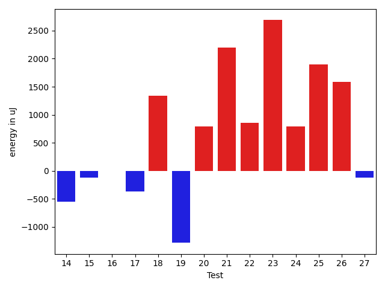
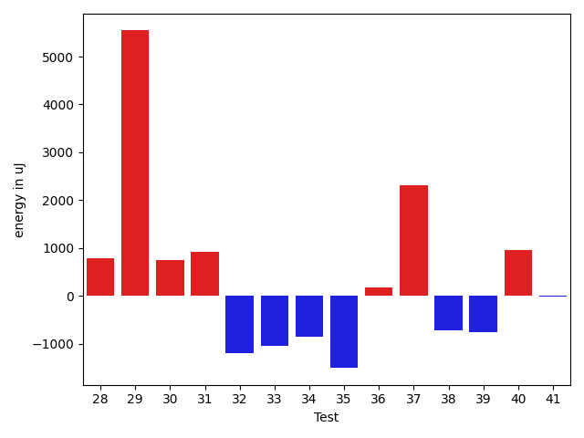
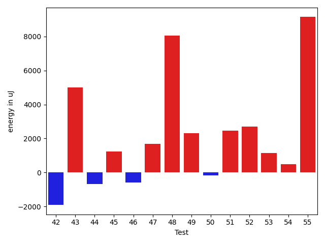
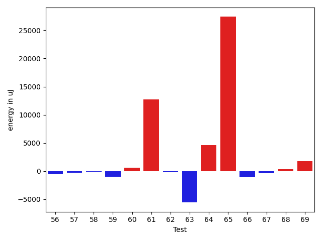
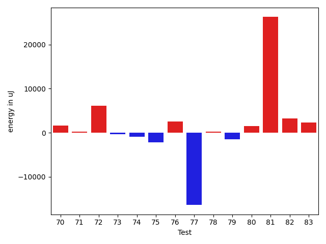

# gson e0195f

https://github.com/google/gson/commit/e0195f

## Delta Energy per test method

| ID | EnergyV1 | EnergyV2 | DeltaEnergy | σV1 | σV2 |
| --- | --- | --- | --- | --- | --- |
| 0 | 36255 | 37170 | 915 | 4220.374612771964 | 4081.4807698567856 |
| 1 | 39001 | 38025 | -976 | 104928.96279406773 | 119211.7041895373 |
| 2 | 36865 | 35278 | -1587 | 3205.9703585654065 | 4789.3245493377135 |
| 3 | 36438 | 36988 | 550 | 2978.4546433045143 | 5025.549263071207 |
| 4 | 37048 | 36377 | -671 | 2533.0196953161467 | 3571.667493216406 |
| 5 | 36926 | 35827 | -1099 | 3720.621380369141 | 3569.5399189092955 |
| 6 | 36560 | 35645 | -915 | 2523.495450758729 | 3838.959443569963 |
| 7 | 35217 | 37719 | 2502 | 3287.8584063186177 | 3187.226879627841 |
| 8 | 37049 | 34606 | -2443 | 10165.332812229562 | 4146.193712209908 |
| 9 | 36194 | 36987 | 793 | 2440.0546458135345 | 3450.9902675883654 |
| 10 | 35644 | 38330 | 2686 | 3709.1717687209557 | 4188.915405530573 |
| 11 | 37415 | 37842 | 427 | 4939.842698800123 | 8019.514755106596 |
| 12 | 36865 | 37293 | 428 | 3012.6911204075086 | 3784.4324924617167 |
| 13 | 35950 | 36133 | 183 | 2861.263154663808 | 5087.213584034661 |
| 14 | 35828 | 35278 | -550 | 2859.5642150509575 | 5358.83013095666 |
| 15 | 37720 | 37597 | -123 | 3960.0845199117016 | 3981.018598218938 |
| 16 | 38391 | 38391 | 0 | 3664.1822381055836 | 11506.621395044198 |
| 17 | 38635 | 38269 | -366 | 39610.22719436628 | 34997.21730438432 |
| 18 | 35279 | 36621 | 1342 | 3751.2853823354826 | 2658.7026942719503 |
| 19 | 38452 | 37170 | -1282 | 54711.14618612448 | 38866.8069148481 |
| 20 | 142700 | 143493 | 793 | 31149.48015584513 | 32750.049945639686 |
| 21 | 35522 | 37720 | 2198 | 3136.518274185171 | 3118.8515770653967 |
| 22 | 35706 | 36560 | 854 | 4324.50933564524 | 4474.702014482752 |
| 23 | 33203 | 35889 | 2686 | 3302.1430992861688 | 4337.672935081152 |
| 24 | 34607 | 35400 | 793 | 6243.23618375068 | 16242.667566160346 |
| 25 | 35949 | 37842 | 1893 | 3946.3292091313288 | 4698.169357443864 |
| 26 | 36438 | 38025 | 1587 | 3790.3970511296857 | 2685.105157456077 |
| 27 | 36316 | 36193 | -123 | 4039.5144581000336 | 3620.497939556438 |
| 28 | 38208 | 38147 | -61 | 16874.97996013163 | 18574.01655085935 |
| 29 | 35705 | 37354 | 1649 | 2546.454507465969 | 27238.339531705016 |
| 30 | 35339 | 36194 | 855 | 5707.8401866972235 | 7632.912415264436 |
| 31 | 36987 | 38574 | 1587 | 12774.152627153515 | 11565.595875897077 |
| 32 | 93017 | 76721 | -16296 | 61388.25023472935 | 65263.779811771994 |
| 33 | 38879 | 37842 | -1037 | 17594.268340581068 | 16724.67389747699 |
| 34 | 36682 | 36072 | -610 | 5190.219432393186 | 4278.422846941621 |
| 35 | 37109 | 35278 | -1831 | 2891.7764505053883 | 3045.023909269793 |
| 36 | 36621 | 36011 | -610 | 3579.292069555609 | 4073.6347829398264 |
| 37 | 37109 | 37353 | 244 | 6151.39878681579 | 12546.211765751345 |
| 38 | 36804 | 36560 | -244 | 4286.998381532689 | 4187.583772691095 |
| 39 | 38146 | 35950 | -2196 | 3086.0115480489308 | 3639.9255477385227 |
| 40 | 35156 | 36682 | 1526 | 3975.1985930474802 | 4436.150006033729 |
| 41 | 37536 | 36804 | -732 | 3602.1212210111316 | 3906.404857374901 |
| 42 | 36987 | 36377 | -610 | 3011.091763239407 | 2880.767872691616 |
| 43 | 39307 | 37475 | -1832 | 42565.40425713509 | 46781.205079189436 |
| 44 | 36560 | 35583 | -977 | 3129.9564326554705 | 4366.251722866882 |
| 45 | 35950 | 37658 | 1708 | 10948.135787223584 | 11900.136443762536 |
| 46 | 38208 | 35949 | -2259 | 3049.7941804669176 | 4436.893739471718 |
| 47 | 83740 | 76965 | -6775 | 34586.12230896929 | 42545.09699023111 |
| 48 | 37354 | 36255 | -1099 | 47430.64363197635 | 59275.8396184076 |
| 49 | 35156 | 36743 | 1587 | 6469.78901763051 | 9713.498205763686 |
| 50 | 36072 | 36987 | 915 | 3473.815944295804 | 3234.802929554682 |
| 51 | 34119 | 36377 | 2258 | 2694.598351084747 | 3903.1368935738496 |
| 52 | 37720 | 38635 | 915 | 34795.97181212686 | 38576.08848022357 |
| 53 | 35950 | 36559 | 609 | 4950.690811640874 | 4319.432229171087 |
| 54 | 36682 | 36072 | -610 | 3488.563808047179 | 3947.892720736135 |
| 55 | 40039 | 60303 | 20264 | 16757.68814232555 | 24245.941153364874 |
| 56 | 37780 | 36133 | -1647 | 6014.909163087191 | 5723.318588283708 |
| 57 | 36377 | 35766 | -611 | 4698.996349457144 | 3604.724672290209 |
| 58 | 36438 | 36560 | 122 | 3202.5731906129236 | 3406.8857681347504 |
| 59 | 35889 | 34668 | -1221 | 4333.248826544931 | 3988.631889697132 |
| 60 | 35339 | 36011 | 672 | 4106.0909919746055 | 3364.788059238464 |
| 61 | 37659 | 38575 | 916 | 39277.80674961265 | 56506.12677658344 |
| 62 | 36072 | 35462 | -610 | 8411.086641174834 | 7810.729880919387 |
| 63 | 46081 | 42175 | -3906 | 43106.56127181743 | 40141.511665295104 |
| 64 | 41381 | 45776 | 4395 | 54023.81685535754 | 54133.51044466044 |
| 65 | 239318 | 288207 | 48889 | 80992.1150567434 | 75682.63217629345 |
| 66 | 37597 | 37842 | 245 | 4647.49257469379 | 3830.4842963518777 |
| 67 | 38513 | 37781 | -732 | 4314.0188097245755 | 4018.44917027353 |
| 68 | 40344 | 41382 | 1038 | 16626.876688311142 | 15587.738423157763 |
| 69 | 35644 | 38757 | 3113 | 4117.936244008912 | 4051.738422713607 |
| 70 | 35217 | 37109 | 1892 | 4482.782315698681 | 3720.0003022205133 |
| 71 | 36560 | 39185 | 2625 | 3480.8844827460475 | 3676.8035999768563 |
| 72 | 38086 | 39062 | 976 | 36842.12948141308 | 43797.21051040003 |
| 73 | 36866 | 37476 | 610 | 10642.768155117365 | 9490.421951397948 |
| 74 | 36438 | 35767 | -671 | 3585.4978118238687 | 3108.1788254453354 |
| 75 | 36988 | 35156 | -1832 | 7390.549285043123 | 4504.285022285276 |
| 76 | 79406 | 76904 | -2502 | 73911.77874496162 | 85903.2169979547 |
| 77 | 38940 | 39062 | 122 | 53903.69883450169 | 17393.418388557297 |
| 78 | 37659 | 38574 | 915 | 2578.999465858409 | 4080.105755648097 |
| 79 | 38635 | 36743 | -1892 | 5285.692566661703 | 5175.4062813750115 |
| 80 | 38941 | 39184 | 243 | 51521.31729277833 | 56675.689638905365 |
| 81 | 38941 | 38635 | -306 | 96977.84136579456 | 138665.81399969727 |
| 82 | 40100 | 39856 | -244 | 27237.55827955465 | 33633.33383327827 |
| 83 | 36926 | 39184 | 2258 | 3378.153158986569 | 4473.732930294032 |

## Delta Duration per test method

| ID | DurationV1 | DurationsV2 | DeltaDuration |
| --- | --- | --- | --- |
| 0 | 928939.3035714285 | 842047.2727272727 | -86892.03084415582 |
| 1 | 2094208.808219178 | 2028969.9047619049 | -65238.90345727326 |
| 2 | 469623.55 | 415522.5 | -54101.04999999999 |
| 3 | 454281.6 | 439939.6666666667 | -14341.93333333329 |
| 4 | 448881.9090909091 | 431714.22222222225 | -17167.68686868687 |
| 5 | 741772.4897959183 | 749660.8684210526 | 7888.378625134239 |
| 6 | 380433.1 | 342341.6875 | -38091.41249999998 |
| 7 | 493581.25 | 452698.2 | -40883.04999999999 |
| 8 | 601414.2352941176 | 483584.15789473685 | -117830.07739938074 |
| 9 | 473217.6153846154 | 501250.76470588235 | 28033.149321266974 |
| 10 | 404954.1666666667 | 447860.94444444444 | 42906.77777777775 |
| 11 | 691395.5 | 754467.8260869565 | 63072.32608695654 |
| 12 | 487454.1538461539 | 454507.4 | -32946.75384615385 |
| 13 | 391549.8461538461 | 453635.0 | 62085.15384615387 |
| 14 | 429062.4166666667 | 433639.5 | 4577.083333333314 |
| 15 | 492911.35294117645 | 440372.4285714286 | -52538.92436974787 |
| 16 | 704670.2941176471 | 616084.0666666667 | -88586.22745098046 |
| 17 | 1600546.988095238 | 1484466.7558139535 | -116080.23228128464 |
| 18 | 682113.7435897436 | 693003.3939393939 | 10889.6503496503 |
| 19 | 1754492.1363636365 | 1535850.441860465 | -218641.69450317137 |
| 20 | 4531426.848484849 | 4496357.818181818 | -35069.030303030275 |
| 21 | 533166.6818181818 | 538772.8076923077 | 5606.125874125981 |
| 22 | 753788.9743589744 | 742328.568627451 | -11460.40573152341 |
| 23 | 722487.3142857143 | 723134.1818181818 | 646.8675324674696 |
| 24 | 1099237.5875 | 1148798.835443038 | 49561.24794303812 |
| 25 | 455781.9130434783 | 412704.35714285716 | -43077.55590062111 |
| 26 | 505938.7037037037 | 522687.625 | 16748.921296296292 |
| 27 | 660273.1025641026 | 635759.3421052631 | -24513.760458839475 |
| 28 | 1242290.0735294118 | 1211487.3194444445 | -30802.75408496731 |
| 29 | 710228.96875 | 776097.2222222222 | 65868.25347222225 |
| 30 | 1008844.8095238095 | 979682.2372881356 | -29162.5722356739 |
| 31 | 1257297.2613636365 | 1264533.5764705883 | 7236.315106951864 |
| 32 | 3456353.202020202 | 3440351.6363636362 | -16001.565656565595 |
| 33 | 1449637.3604651163 | 1529228.6097560977 | 79591.24929098133 |
| 34 | 960649.7627118644 | 961869.5 | 1219.7372881355695 |
| 35 | 506063.39130434784 | 482421.8333333333 | -23641.557971014525 |
| 36 | 730970.9428571429 | 711543.5135135135 | -19427.429343629396 |
| 37 | 654553.4285714285 | 925336.9130434783 | 270783.48447204975 |
| 38 | 563745.6666666666 | 563165.6363636364 | -580.0303030302748 |
| 39 | 466716.72222222225 | 459626.82352941175 | -7089.8986928105005 |
| 40 | 463963.5 | 449238.0 | -14725.5 |
| 41 | 436599.3157894737 | 474483.0833333333 | 37883.767543859605 |
| 42 | 488606.1052631579 | 530853.1764705882 | 42247.07120743027 |
| 43 | 1457913.0666666667 | 1667849.5185185184 | 209936.45185185177 |
| 44 | 523047.73913043475 | 516469.95454545453 | -6577.784584980225 |
| 45 | 978790.7027027027 | 1005662.2272727273 | 26871.524570024572 |
| 46 | 458135.8888888889 | 464404.23529411765 | 6268.3464052287745 |
| 47 | 2968264.6363636362 | 2951201.131313131 | -17063.505050505046 |
| 48 | 1341885.5283018867 | 1695463.1276595744 | 353577.59935768764 |
| 49 | 1145719.7631578948 | 1156632.5352112676 | 10912.772053372813 |
| 50 | 552752.15625 | 534517.875 | -18234.28125 |
| 51 | 623970.5769230769 | 527990.5238095238 | -95980.05311355309 |
| 52 | 1651397.0704225353 | 1619898.2631578948 | -31498.80726464046 |
| 53 | 958072.0 | 903589.5 | -54482.5 |
| 54 | 772185.195652174 | 897944.0877192982 | 125758.89206712425 |
| 55 | 1683096.8453608248 | 1901794.9081632653 | 218698.0628024405 |
| 56 | 938213.9655172414 | 1110547.3934426229 | 172333.42792538146 |
| 57 | 835069.4081632653 | 919163.9807692308 | 84094.57260596543 |
| 58 | 800617.9375 | 916414.8596491228 | 115796.92214912281 |
| 59 | 856845.5714285715 | 908234.1111111111 | 51388.539682539646 |
| 60 | 428091.1875 | 478833.4375 | 50742.25 |
| 61 | 1495077.0681818181 | 1899536.9310344828 | 404459.86285266466 |
| 62 | 1338182.5 | 1293493.3789473684 | -44689.12105263164 |
| 63 | 2416481.6868686867 | 2257106.101010101 | -159375.58585858578 |
| 64 | 2179364.2680412373 | 2223475.0315789473 | 44110.76353771007 |
| 65 | 7375881.313131313 | 7978906.090909091 | 603024.777777778 |
| 66 | 531301.7058823529 | 532786.8421052631 | 1485.1362229102524 |
| 67 | 494928.0 | 475066.2105263158 | -19861.789473684214 |
| 68 | 1114699.8235294118 | 1283124.1176470588 | 168424.294117647 |
| 69 | 544621.1666666666 | 398160.125 | -146461.04166666663 |
| 70 | 416379.3846153846 | 491518.07692307694 | 75138.69230769231 |
| 71 | 455833.4666666667 | 437659.35294117645 | -18174.113725490228 |
| 72 | 1383118.5227272727 | 1637484.530612245 | 254366.00788497226 |
| 73 | 1351813.1444444444 | 1343733.2325581396 | -8079.91188630485 |
| 74 | 557510.15625 | 540403.3846153846 | -17106.771634615376 |
| 75 | 745598.7741935484 | 804649.1363636364 | 59050.36217008799 |
| 76 | 3030569.232323232 | 3113671.090909091 | 83101.85858585872 |
| 77 | 1684053.9852941176 | 1191751.3382352942 | -492302.6470588234 |
| 78 | 517711.85714285716 | 540666.9090909091 | 22955.0519480519 |
| 79 | 831058.0869565217 | 817466.6071428572 | -13591.47981366457 |
| 80 | 1687437.0 | 1704427.6944444445 | 16990.694444444496 |
| 81 | 1983819.7659574468 | 2769813.4905660376 | 785993.7246085908 |
| 82 | 1193306.6956521738 | 1350302.4074074074 | 156995.71175523358 |
| 83 | 921323.3529411765 | 727916.6666666666 | -193406.68627450988 |

## Misc.

| ID | Test Class | Test Method |
| --- | --- | --- |
| 0 | com.google.gson.functional.CustomDeserializerTest | testDefaultConstructorNotCalledOnField |
| 1 | com.google.gson.functional.CustomDeserializerTest | testDefaultConstructorNotCalledOnObject |
| 2 | com.google.gson.EscaperTest | testSlashEscaping |
| 3 | com.google.gson.EscaperTest | testNewlineEscaping |
| 4 | com.google.gson.EscaperTest | testAmpersandEscaping |
| 5 | com.google.gson.EscaperTest | testControlCharBlockEscaping |
| 6 | com.google.gson.EscaperTest | testUnicodeCharacterStringNoEscaping |
| 7 | com.google.gson.EscaperTest | testLineSeparatorEscaping |
| 8 | com.google.gson.EscaperTest | testQuoteEscaping |
| 9 | com.google.gson.EscaperTest | testCarrageReturnEscaping |
| 10 | com.google.gson.EscaperTest | testParagraphSeparatorEscaping |
| 11 | com.google.gson.EscaperTest | testTabEscaping |
| 12 | com.google.gson.EscaperTest | testGreaterThanAndLessThanEscaping |
| 13 | com.google.gson.EscaperTest | testSingleQuoteNotEscaped |
| 14 | com.google.gson.EscaperTest | testRequiredEscapingUnicodeCharacter |
| 15 | com.google.gson.EscaperTest | testEqualsEscaping |
| 16 | com.google.gson.EscaperTest | testNoSpecialCharacters |
| 17 | com.google.gson.functional.DefaultTypeAdaptersTest | testDateSerializationWithPattern |
| 18 | com.google.gson.functional.DefaultTypeAdaptersTest | testUuidSerialization |
| 19 | com.google.gson.functional.DefaultTypeAdaptersTest | testDateDeserializationWithPattern |
| 20 | com.google.gson.functional.DefaultTypeAdaptersTest | testDefaultDateDeserialization |
| 21 | com.google.gson.functional.DefaultTypeAdaptersTest | testLocaleSerializationWithLanguage |
| 22 | com.google.gson.functional.DefaultTypeAdaptersTest | testDefaultDateSerialization |
| 23 | com.google.gson.functional.DefaultTypeAdaptersTest | testDefaultDateSerializationUsingBuilder |
| 24 | com.google.gson.functional.DefaultTypeAdaptersTest | testDefaultDateDeserializationUsingBuilder |
| 25 | com.google.gson.functional.DefaultTypeAdaptersTest | testLocaleSerializationWithLanguageCountry |
| 26 | com.google.gson.functional.DefaultTypeAdaptersTest | testLocaleSerializationWithLanguageCountryVariant |
| 27 | com.google.gson.functional.DefaultTypeAdaptersTest | testSetSerialization |
| 28 | com.google.gson.functional.ObjectTest | testNestedSerialization |
| 29 | com.google.gson.functional.ObjectTest | testNullFieldsSerialization |
| 30 | com.google.gson.functional.ObjectTest | testClassWithObjectFieldSerialization |
| 31 | com.google.gson.functional.ObjectTest | testArrayOfArraysSerialization |
| 32 | com.google.gson.functional.ObjectTest | testSubInterfacesOfCollectionSerialization |
| 33 | com.google.gson.functional.ObjectTest | testInheritenceSerialization |
| 34 | com.google.gson.functional.ObjectTest | testArrayOfObjectsSerialization |
| 35 | com.google.gson.functional.ObjectTest | testTopLevelEnumSerialization |
| 36 | com.google.gson.functional.ObjectTest | testClassWithEnumFieldSerialization |
| 37 | com.google.gson.functional.ObjectTest | testBagOfPrimitivesSerialization |
| 38 | com.google.gson.functional.StringTest | testSingleQuoteInStringSerialization |
| 39 | com.google.gson.functional.StringTest | testEscapedBackslashInStringSerialization |
| 40 | com.google.gson.functional.StringTest | testEscapedCtrlRInStringSerialization |
| 41 | com.google.gson.functional.StringTest | testAssignmentCharSerialization |
| 42 | com.google.gson.functional.StringTest | testEscapedCtrlNInStringSerialization |
| 43 | com.google.gson.functional.StringTest | testStringValueSerialization |
| 44 | com.google.gson.functional.StringTest | testEscapingQuotesInStringSerialization |
| 45 | com.google.gson.functional.StringTest | testStringValueAsSingleElementArraySerialization |
| 46 | com.google.gson.functional.StringTest | testJavascriptKeywordsInStringSerialization |
| 47 | com.google.gson.functional.NamingPolicyTest | testGsonWithNonDefaultFieldNamingPolicySerialization |
| 48 | com.google.gson.functional.NamingPolicyTest | testGsonWithNonDefaultFieldNamingPolicyDeserialiation |
| 49 | com.google.gson.functional.CustomTypeAdaptersTest | testCustomAdapterInvokedForMapElementSerializationWithType |
| 50 | com.google.gson.functional.CustomTypeAdaptersTest | testCustomAdapterInvokedForMapElementSerialization |
| 51 | com.google.gson.functional.CustomTypeAdaptersTest | testCustomAdapterInvokedForCollectionElementSerialization |
| 52 | com.google.gson.functional.CustomTypeAdaptersTest | testCustomAdapterInvokedForCollectionElementSerializationWithType |
| 53 | com.google.gson.functional.CustomTypeAdaptersTest | testCustomByteArraySerializer |
| 54 | com.google.gson.functional.CollectionTest | testNullsInListSerialization |
| 55 | com.google.gson.functional.CollectionTest | testWildcardCollectionField |
| 56 | com.google.gson.functional.CollectionTest | testLinkedListSerialization |
| 57 | com.google.gson.functional.CollectionTest | testCollectionOfObjectSerialization |
| 58 | com.google.gson.functional.CollectionTest | testQueueSerialization |
| 59 | com.google.gson.functional.CollectionTest | testCollectionOfEnumsSerialization |
| 60 | com.google.gson.functional.CollectionTest | testCollectionOfStringsSerialization |
| 61 | com.google.gson.functional.CollectionTest | testCollectionOfBagOfPrimitivesSerialization |
| 62 | com.google.gson.functional.ParameterizedTypesTest | testParameterizedTypeWithCustomSerializer |
| 63 | com.google.gson.functional.ParameterizedTypesTest | testTypesWithMultipleParametersSerialization |
| 64 | com.google.gson.functional.ConcurrencyTest | testSingleThreadSerialization |
| 65 | com.google.gson.functional.ConcurrencyTest | testMultiThreadSerialization |
| 66 | com.google.gson.JsonEscapingVisitorTest | testStringPrimitiveVisitationEscapingRequired |
| 67 | com.google.gson.JsonEscapingVisitorTest | testStringArrayVisitationNoEscaping |
| 68 | com.google.gson.JsonEscapingVisitorTest | testStringPrimitiveVisitationNoEscapingRequired |
| 69 | com.google.gson.JsonEscapingVisitorTest | testStringFieldVisitationEscapingRequired |
| 70 | com.google.gson.JsonEscapingVisitorTest | testStringFieldVisitationNoEscaping |
| 71 | com.google.gson.JsonEscapingVisitorTest | testStringArrayVisitationEscapingRequired |
| 72 | com.google.gson.functional.VersioningTest | testVersionedGsonWithUnversionedClassesSerialization |
| 73 | com.google.gson.functional.MapTest | testParameterizedMapSubclassSerialization |
| 74 | com.google.gson.functional.MapTest | testMapSubclassSerialization |
| 75 | com.google.gson.functional.MapTest | testRawMapSerialization |
| 76 | com.google.gson.FunctionalWithInternalDependenciesTest | testPrettyPrintList |
| 77 | com.google.gson.FunctionalWithInternalDependenciesTest | testPrettyPrintArrayOfObjects |
| 78 | com.google.gson.functional.ArrayTest | testArrayOfStringsSerialization |
| 79 | com.google.gson.functional.ArrayTest | testNullsInArraySerialization |
| 80 | com.google.gson.functional.EscapingTest | testEscapingObjectFields |
| 81 | com.google.gson.functional.EscapingTest | testEscapingQuotesInStringArray |
| 82 | com.google.gson.functional.InternationalizationTest | testStringsWithUnicodeChineseCharactersSerialization |
| 83 | com.google.gson.GsonTypeAdapterTest | testTypeAdapterDoesNotAffectNonAdaptedTypes |

| Test | IterationV1 | IterationV2 | DeltaIteration |
| --- | --- | --- | --- |
| 0 | 56 | 55 | -1 |
| 1 | 73 | 63 | -10 |
| 2 | 20 | 12 | -8 |
| 3 | 15 | 15 | 0 |
| 4 | 11 | 18 | 7 |
| 5 | 49 | 38 | -11 |
| 6 | 10 | 16 | 6 |
| 7 | 20 | 15 | -5 |
| 8 | 17 | 19 | 2 |
| 9 | 13 | 17 | 4 |
| 10 | 18 | 18 | 0 |
| 11 | 18 | 23 | 5 |
| 12 | 13 | 20 | 7 |
| 13 | 13 | 11 | -2 |
| 14 | 12 | 14 | 2 |
| 15 | 17 | 21 | 4 |
| 16 | 17 | 15 | -2 |
| 17 | 84 | 86 | 2 |
| 18 | 39 | 33 | -6 |
| 19 | 88 | 86 | -2 |
| 20 | 99 | 99 | 0 |
| 21 | 22 | 26 | 4 |
| 22 | 39 | 51 | 12 |
| 23 | 35 | 44 | 9 |
| 24 | 80 | 79 | -1 |
| 25 | 23 | 14 | -9 |
| 26 | 27 | 24 | -3 |
| 27 | 39 | 38 | -1 |
| 28 | 68 | 72 | 4 |
| 29 | 32 | 36 | 4 |
| 30 | 63 | 59 | -4 |
| 31 | 88 | 85 | -3 |
| 32 | 99 | 99 | 0 |
| 33 | 86 | 82 | -4 |
| 34 | 59 | 62 | 3 |
| 35 | 23 | 18 | -5 |
| 36 | 35 | 37 | 2 |
| 37 | 28 | 23 | -5 |
| 38 | 24 | 22 | -2 |
| 39 | 18 | 17 | -1 |
| 40 | 12 | 11 | -1 |
| 41 | 19 | 24 | 5 |
| 42 | 19 | 17 | -2 |
| 43 | 30 | 27 | -3 |
| 44 | 23 | 22 | -1 |
| 45 | 37 | 44 | 7 |
| 46 | 18 | 17 | -1 |
| 47 | 99 | 99 | 0 |
| 48 | 53 | 47 | -6 |
| 49 | 76 | 71 | -5 |
| 50 | 32 | 24 | -8 |
| 51 | 26 | 21 | -5 |
| 52 | 71 | 76 | 5 |
| 53 | 57 | 58 | 1 |
| 54 | 46 | 57 | 11 |
| 55 | 97 | 98 | 1 |
| 56 | 58 | 61 | 3 |
| 57 | 49 | 52 | 3 |
| 58 | 48 | 57 | 9 |
| 59 | 49 | 54 | 5 |
| 60 | 16 | 16 | 0 |
| 61 | 44 | 58 | 14 |
| 62 | 92 | 95 | 3 |
| 63 | 99 | 99 | 0 |
| 64 | 97 | 95 | -2 |
| 65 | 99 | 99 | 0 |
| 66 | 17 | 19 | 2 |
| 67 | 17 | 19 | 2 |
| 68 | 17 | 17 | 0 |
| 69 | 12 | 16 | 4 |
| 70 | 13 | 13 | 0 |
| 71 | 15 | 17 | 2 |
| 72 | 44 | 49 | 5 |
| 73 | 90 | 86 | -4 |
| 74 | 32 | 26 | -6 |
| 75 | 31 | 22 | -9 |
| 76 | 99 | 99 | 0 |
| 77 | 68 | 68 | 0 |
| 78 | 14 | 22 | 8 |
| 79 | 23 | 28 | 5 |
| 80 | 72 | 72 | 0 |
| 81 | 47 | 53 | 6 |
| 82 | 23 | 27 | 4 |
| 83 | 34 | 24 | -10 |

| Time Label | Time (s) |
| --- | --- |
| Selection | 22.949816465377808 |
| Injection | 11.01293683052063 |
| Total | 987.8921909332275 |

