# gson 51881c

https://github.com/google/gson/commit/51881c

## Delta Energy per test method

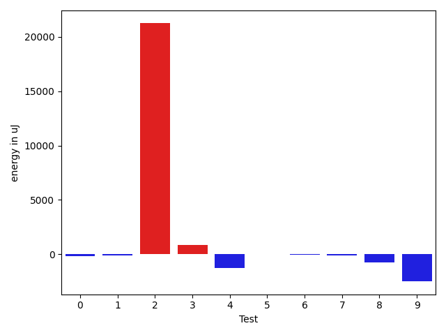

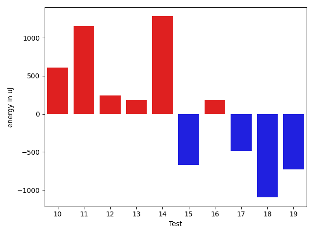

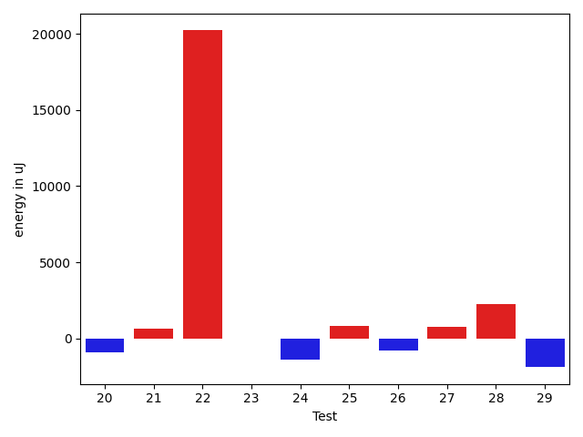

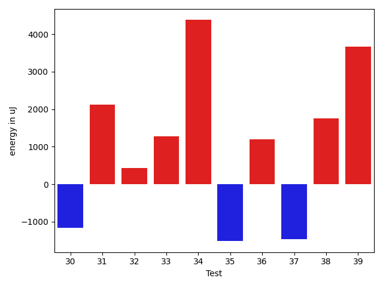

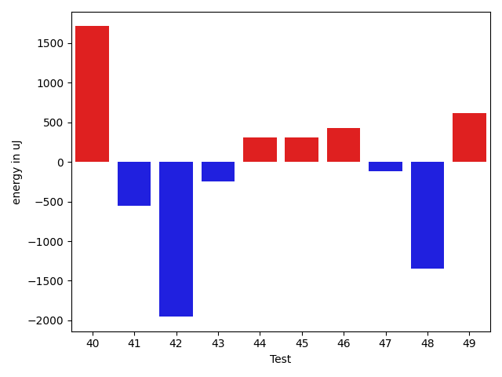

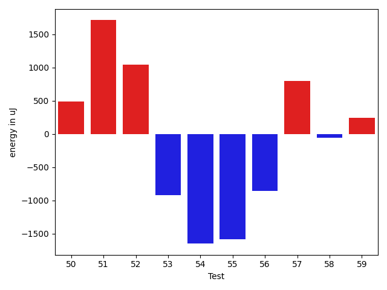

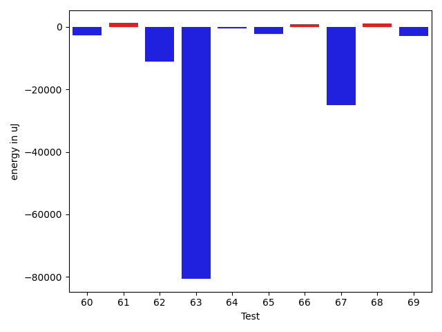

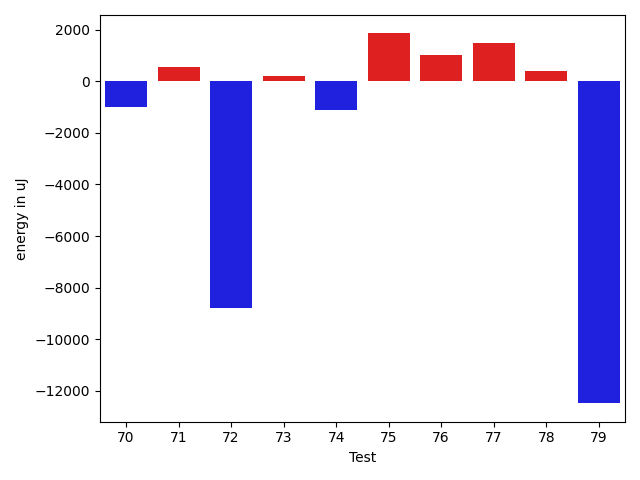

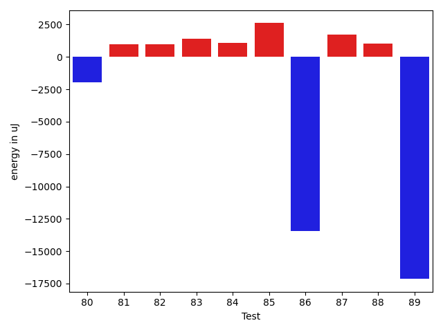

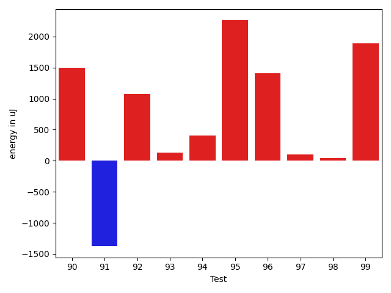

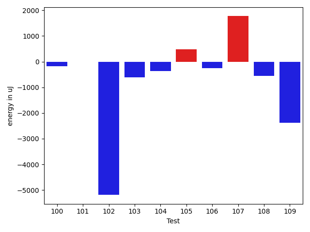

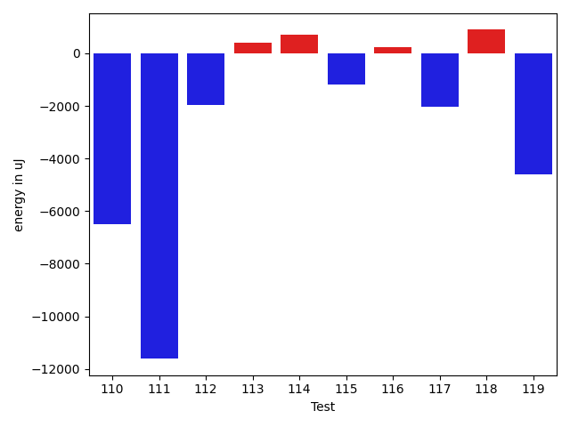

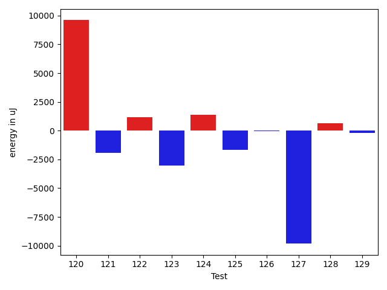

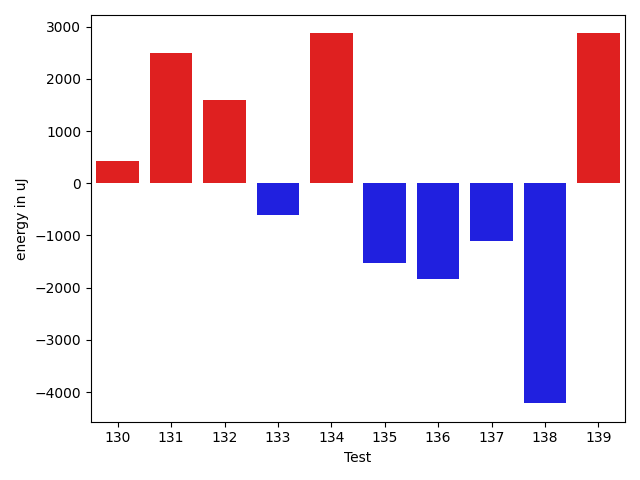

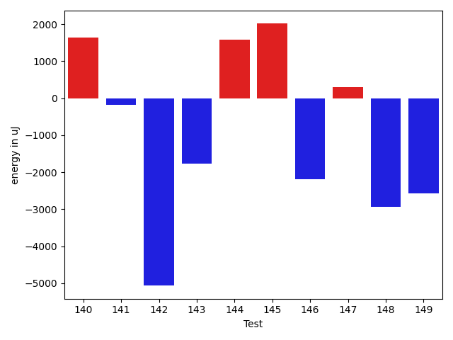

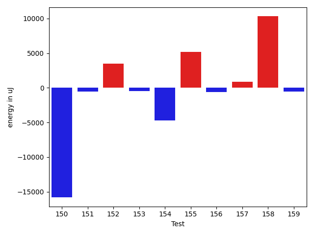

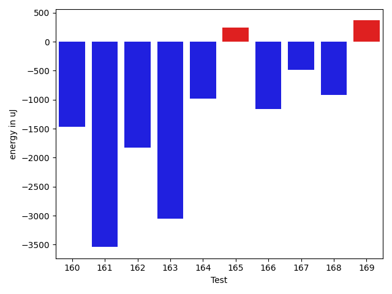

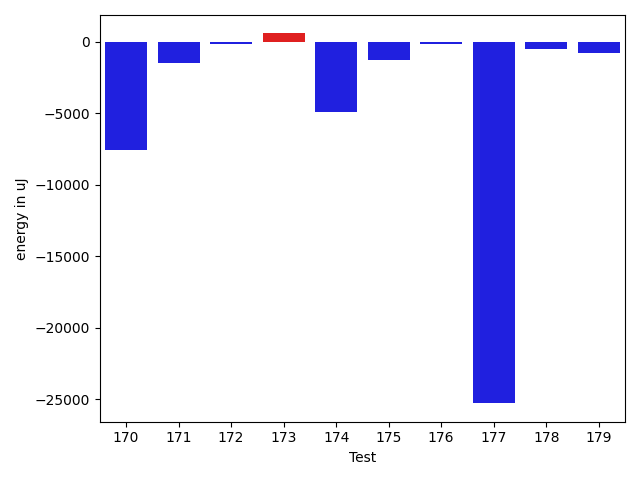

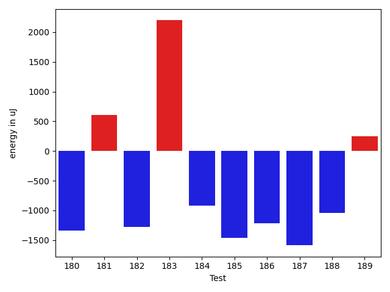

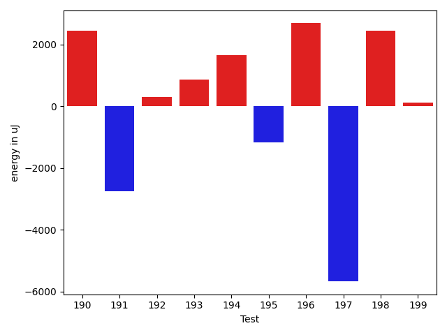

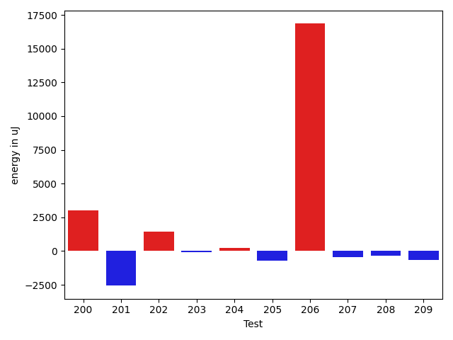

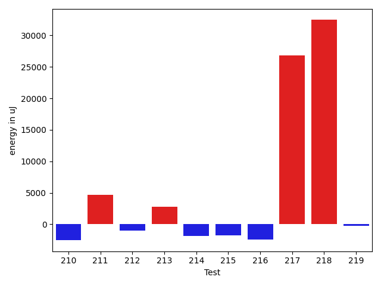

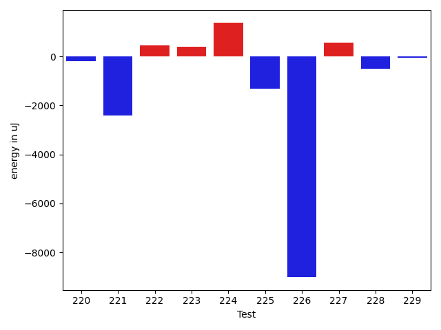

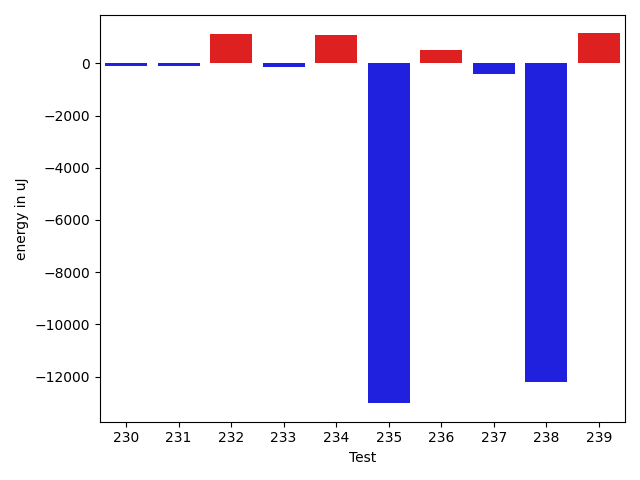

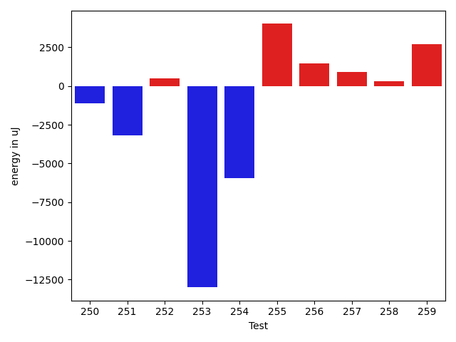

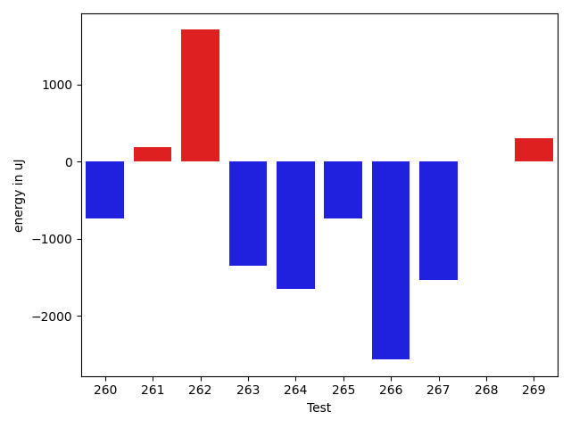

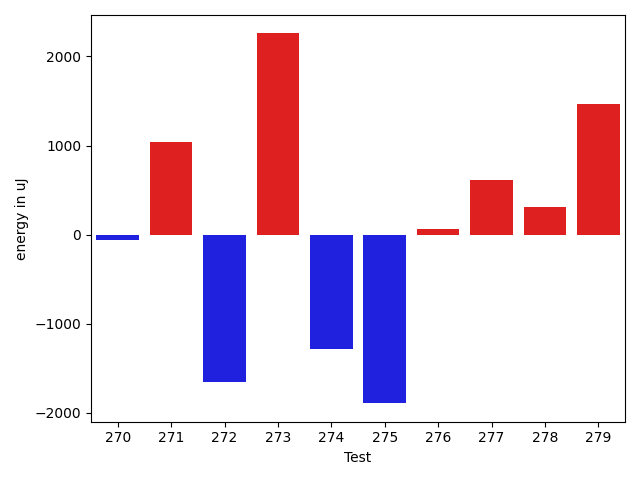

| ID | EnergyV1 | EnergyV2 | DeltaEnergy | σV1 | σV2 |
| --- | --- | --- | --- | --- | --- |
| 0 | 33874 | 33691 | -183 | 15355.54614666894 | 3856.0296539694214 |
| 1 | 34424 | 34302 | -122 | 3351.586474314224 | 3270.848190095814 |
| 2 | 38635 | 59875 | 21240 | 31003.148294291146 | 35987.444159236264 |
| 3 | 33936 | 34790 | 854 | 20850.74461098799 | 43568.38716362966 |
| 4 | 38269 | 36987 | -1282 | 21232.394524491494 | 18659.746181659175 |
| 5 | 34119 | 34118 | -1 | 3529.076551818301 | 4131.063592648783 |
| 6 | 34363 | 34302 | -61 | 8990.986033222385 | 21204.260922514117 |
| 7 | 34546 | 34424 | -122 | 34254.77849659694 | 24550.174279960203 |
| 8 | 34363 | 33630 | -733 | 31693.686743276685 | 4782.237985620447 |
| 9 | 36194 | 33692 | -2502 | 3692.7365004886033 | 6357.446372546739 |
| 10 | 32653 | 33264 | 611 | 3963.995304142274 | 3789.0449974968033 |
| 11 | 34180 | 35339 | 1159 | 2931.7546234333263 | 2741.1890500847435 |
| 12 | 33691 | 33936 | 245 | 4057.004832560077 | 3612.001632099596 |
| 13 | 34607 | 34790 | 183 | 9081.190007619534 | 7854.186049892428 |
| 14 | 67444 | 68726 | 1282 | 42861.969985768264 | 48927.118863756994 |
| 15 | 34362 | 33691 | -671 | 6894.402362380659 | 32622.987645989753 |
| 16 | 33630 | 33813 | 183 | 6967.997202668314 | 6527.388488956719 |
| 17 | 35156 | 34668 | -488 | 13446.179921162202 | 7703.355589655687 |
| 18 | 35766 | 34668 | -1098 | 28553.03952135696 | 4371.68449674726 |
| 19 | 33813 | 33081 | -732 | 4167.896451496845 | 4002.516801535085 |
| 20 | 34546 | 33691 | -855 | 4059.1891152848048 | 3291.1775782919785 |
| 21 | 34851 | 34607 | -244 | 5177.457274336363 | 7001.550908589846 |
| 22 | 38696 | 36560 | -2136 | 86712.30392716102 | 109729.50188090892 |
| 23 | 36132 | 34485 | -1647 | 5442.737718882217 | 14276.038886051048 |
| 24 | 35034 | 33691 | -1343 | 5332.65483248972 | 2555.81122053291 |
| 25 | 33692 | 33631 | -61 | 3437.1052386401557 | 4256.838476315854 |
| 26 | 35035 | 34241 | -794 | 33240.28633023103 | 29634.58604392026 |
| 27 | 35706 | 36377 | 671 | 2403.7001928867817 | 2567.6244135170723 |
| 28 | 35828 | 35278 | -550 | 3593.409710291417 | 16934.32963058149 |
| 29 | 35218 | 33020 | -2198 | 3277.146341433382 | 3111.1553290508464 |
| 30 | 33630 | 32776 | -854 | 4918.413409685225 | 3711.891962511574 |
| 31 | 32897 | 35583 | 2686 | 3257.5851115516184 | 3963.736626909008 |
| 32 | 33997 | 34729 | 732 | 3274.559984634656 | 2596.322453770066 |
| 33 | 33508 | 34851 | 1343 | 3646.223193784068 | 3519.4998181078117 |
| 34 | 33874 | 34180 | 306 | 3904.1767447027237 | 20871.221687376128 |
| 35 | 36255 | 33325 | -2930 | 3407.0660997643213 | 4002.146810131251 |
| 36 | 34484 | 36621 | 2137 | 3615.1530892063806 | 3602.3382930396747 |
| 37 | 33997 | 33325 | -672 | 3978.0416672985953 | 2897.952860649114 |
| 38 | 38024 | 37292 | -732 | 20390.95976566405 | 20582.191551656757 |
| 39 | 34851 | 36255 | 1404 | 5878.471351254064 | 10992.74331568688 |
| 40 | 34668 | 36377 | 1709 | 4746.138860629238 | 5022.967451807129 |
| 41 | 34668 | 34118 | -550 | 4069.6793517621672 | 3697.548540127259 |
| 42 | 34790 | 32837 | -1953 | 4308.771392744172 | 3775.1692295866874 |
| 43 | 34546 | 34302 | -244 | 39124.61182540843 | 4185.847688075689 |
| 44 | 33569 | 33875 | 306 | 2764.7123941238847 | 3296.4763381425755 |
| 45 | 34119 | 34424 | 305 | 3877.8179613755597 | 5498.996442573183 |
| 46 | 34057 | 34485 | 428 | 14871.488302834594 | 8739.413054671653 |
| 47 | 35401 | 35278 | -123 | 11896.45415441192 | 10352.098420859862 |
| 48 | 36316 | 34973 | -1343 | 16496.78153941355 | 12583.387451775166 |
| 49 | 98083 | 98693 | 610 | 77418.70630668955 | 57797.33514686299 |
| 50 | 34729 | 35217 | 488 | 8018.3424288038195 | 8602.500157905179 |
| 51 | 69702 | 71411 | 1709 | 26194.292633829125 | 23972.60625097402 |
| 52 | 34790 | 35828 | 1038 | 11714.702504899275 | 14482.407447481775 |
| 53 | 35217 | 34302 | -915 | 66408.13141936604 | 53911.293614199574 |
| 54 | 63660 | 62012 | -1648 | 20635.152708475696 | 27474.46382264451 |
| 55 | 37292 | 35706 | -1586 | 43280.83348584434 | 18985.730546142768 |
| 56 | 38452 | 37597 | -855 | 41525.85669861792 | 40085.00966166949 |
| 57 | 35339 | 36133 | 794 | 10840.98411358703 | 10905.123240233293 |
| 58 | 38697 | 38636 | -61 | 19102.46573625979 | 17820.3116258099 |
| 59 | 34058 | 34301 | 243 | 9511.534308084641 | 7405.246011040482 |
| 60 | 36377 | 35522 | -855 | 21438.097982521784 | 4483.352348300127 |
| 61 | 35034 | 35217 | 183 | 6015.834695221993 | 9319.452871145771 |
| 62 | 36926 | 35156 | -1770 | 44669.472550415005 | 31037.345052192995 |
| 63 | 37963 | 37475 | -488 | 393085.1992694438 | 271676.9749166188 |
| 64 | 35400 | 33874 | -1526 | 4362.188579796556 | 4249.091206114651 |
| 65 | 66406 | 66955 | 549 | 26570.26324407875 | 22469.045485389168 |
| 66 | 35766 | 35950 | 184 | 31877.227015415625 | 32880.9945983333 |
| 67 | 35340 | 36255 | 915 | 188281.95004483848 | 12316.72118944986 |
| 68 | 34668 | 35705 | 1037 | 4180.815493118537 | 4041.623384157633 |
| 69 | 35217 | 36682 | 1465 | 32092.726775020215 | 14762.595726310767 |
| 70 | 35583 | 34119 | -1464 | 8163.2427022844295 | 6616.166075717405 |
| 71 | 34057 | 35156 | 1099 | 4005.795270388127 | 4172.004261210139 |
| 72 | 37170 | 37170 | 0 | 63554.6565132484 | 56033.628435340084 |
| 73 | 35034 | 35584 | 550 | 5444.6862040942 | 4228.1788249555475 |
| 74 | 33630 | 34058 | 428 | 4956.626722098631 | 4286.963828952642 |
| 75 | 33509 | 35522 | 2013 | 4122.926646030029 | 4038.1743423280136 |
| 76 | 33997 | 34851 | 854 | 3699.5192806854334 | 4521.229238868563 |
| 77 | 33569 | 35156 | 1587 | 4301.993959394487 | 4090.683914066522 |
| 78 | 34729 | 34240 | -489 | 3625.4787842355686 | 4210.358212937469 |
| 79 | 36133 | 36499 | 366 | 57925.6989797509 | 35381.88547111327 |
| 80 | 38635 | 39062 | 427 | 16807.26025679816 | 16916.224844137967 |
| 81 | 34180 | 35095 | 915 | 3351.8992854201324 | 4201.46798831774 |
| 82 | 34851 | 36682 | 1831 | 5264.1645829976715 | 4662.809326969325 |
| 83 | 33386 | 34118 | 732 | 3784.872665843191 | 5097.0031536961915 |
| 84 | 35156 | 35767 | 611 | 3286.9957801888345 | 4228.531017977756 |
| 85 | 33569 | 36621 | 3052 | 4112.705952623344 | 4565.250154216625 |
| 86 | 36560 | 35583 | -977 | 43960.40620288788 | 38262.414503152555 |
| 87 | 34180 | 36133 | 1953 | 3759.017743016176 | 3957.674447575345 |
| 88 | 34607 | 35949 | 1342 | 3031.351181294583 | 4003.888072971605 |
| 89 | 41015 | 39612 | -1403 | 64555.068765533055 | 52519.684599996 |
| 90 | 35034 | 37292 | 2258 | 10650.671527441571 | 9760.855142252412 |
| 91 | 35034 | 34851 | -183 | 9626.12951069395 | 4307.991975868723 |
| 92 | 34179 | 34057 | -122 | 3992.3550326969403 | 4165.202001495955 |
| 93 | 34363 | 34424 | 61 | 3683.5322005138246 | 3976.3337793794362 |
| 94 | 35339 | 36071 | 732 | 4444.267476014737 | 4182.591874663364 |
| 95 | 33020 | 34668 | 1648 | 4744.361416197126 | 6014.9082420266395 |
| 96 | 34973 | 35278 | 305 | 4508.171936592097 | 3718.693379233284 |
| 97 | 123474 | 119507 | -3967 | 37442.039127187454 | 41190.16862184483 |
| 98 | 36254 | 37476 | 1222 | 4028.8789013484466 | 4145.278046906841 |
| 99 | 38208 | 42114 | 3906 | 39127.9094435217 | 31642.855373891554 |
| 100 | 37110 | 36926 | -184 | 5092.791021521391 | 3542.1149584250124 |
| 101 | 36621 | 36621 | 0 | 4540.138576078928 | 3756.42926411859 |
| 102 | 91186 | 85998 | -5188 | 72666.05158588765 | 70009.53678523126 |
| 103 | 34851 | 34241 | -610 | 3950.1087392317327 | 4112.496329025446 |
| 104 | 34179 | 33813 | -366 | 4474.42805075437 | 3915.806263125807 |
| 105 | 34424 | 34912 | 488 | 4021.199286600703 | 4539.623739122761 |
| 106 | 37354 | 37109 | -245 | 69102.4408306749 | 80326.14970356281 |
| 107 | 36377 | 38147 | 1770 | 17006.564212973764 | 11122.508038257993 |
| 108 | 36316 | 35766 | -550 | 3019.3156893985965 | 4275.491768133228 |
| 109 | 37354 | 34973 | -2381 | 2868.4737141708115 | 3009.7629998980906 |
| 110 | 39429 | 36804 | -2625 | 42113.559997516226 | 27458.8391313544 |
| 111 | 36987 | 36133 | -854 | 77014.26583797141 | 55647.6834702935 |
| 112 | 37292 | 35278 | -2014 | 9291.268603055894 | 9927.952754590271 |
| 113 | 35279 | 35279 | 0 | 3872.179450113018 | 4240.466446795683 |
| 114 | 32349 | 33814 | 1465 | 5037.031179859212 | 3625.76739154646 |
| 115 | 36560 | 35705 | -855 | 13546.711138332013 | 13239.167529327467 |
| 116 | 34912 | 34668 | -244 | 3526.3924178727557 | 3675.5983368400025 |
| 117 | 36132 | 35339 | -793 | 7080.10093893834 | 3629.930156199825 |
| 118 | 33997 | 35888 | 1891 | 5173.485352452592 | 3747.1450973978017 |
| 119 | 34729 | 34729 | 0 | 53053.83774671199 | 15856.8855264577 |
| 120 | 136413 | 149047 | 12634 | 25939.973905616385 | 29802.605180095605 |
| 121 | 37354 | 37353 | -1 | 16906.69848688383 | 16073.811922051904 |
| 122 | 31983 | 34057 | 2074 | 3774.042674904959 | 3401.613820148373 |
| 123 | 37719 | 36438 | -1281 | 24952.96113435135 | 19838.471101258267 |
| 124 | 34424 | 35888 | 1464 | 3884.575496128756 | 3799.308742763545 |
| 125 | 34790 | 35950 | 1160 | 5372.496566877554 | 3517.8176931606404 |
| 126 | 34363 | 34729 | 366 | 3549.8559445193027 | 3364.7005590969775 |
| 127 | 36743 | 34485 | -2258 | 37977.81034450679 | 3429.520109139773 |
| 128 | 32409 | 32531 | 122 | 3550.1499336514403 | 3855.1068483895488 |
| 129 | 34973 | 34241 | -732 | 4308.298493181219 | 3467.221602967084 |
| 130 | 34118 | 34546 | 428 | 5047.153164540039 | 2087.125070814993 |
| 131 | 32349 | 34851 | 2502 | 3427.51114935745 | 4199.539350462664 |
| 132 | 34912 | 36499 | 1587 | 4340.29092365236 | 4362.7435024040315 |
| 133 | 36071 | 35461 | -610 | 4036.569605769511 | 3886.4729430294333 |
| 134 | 33142 | 36010 | 2868 | 4067.940963022809 | 4817.219553591054 |
| 135 | 36743 | 35217 | -1526 | 19084.83673230379 | 9515.549551315133 |
| 136 | 36011 | 34179 | -1832 | 4061.0237740351213 | 4307.674282147431 |
| 137 | 38330 | 37231 | -1099 | 4153.437348295147 | 33878.44786583943 |
| 138 | 36743 | 32531 | -4212 | 25479.67605976974 | 4069.426682284785 |
| 139 | 36926 | 39794 | 2868 | 3828.259017104357 | 4881.767168505684 |
| 140 | 35095 | 36743 | 1648 | 4101.33971204456 | 4415.129057789679 |
| 141 | 36255 | 36072 | -183 | 4369.293434204992 | 4996.24328905831 |
| 142 | 42297 | 37232 | -5065 | 53370.662678717345 | 41814.19867403553 |
| 143 | 36621 | 34851 | -1770 | 4068.2992426196965 | 3086.324733299301 |
| 144 | 35827 | 37415 | 1588 | 4359.452941610149 | 3732.6164871097794 |
| 145 | 35278 | 37292 | 2014 | 4577.53301833538 | 3028.445671875261 |
| 146 | 36927 | 34729 | -2198 | 4275.6900403312275 | 4804.099192108657 |
| 147 | 33813 | 34119 | 306 | 4636.681274106979 | 3846.606655652955 |
| 148 | 35767 | 32837 | -2930 | 4607.1436343053365 | 2579.920646915075 |
| 149 | 37171 | 34607 | -2564 | 5279.674100678469 | 3857.1366018631097 |
| 150 | 41137 | 40405 | -732 | 98870.5233501691 | 72485.4006230887 |
| 151 | 35705 | 33752 | -1953 | 3333.777678047563 | 4045.9229476437017 |
| 152 | 35888 | 38025 | 2137 | 4459.556416001484 | 4095.9886719346873 |
| 153 | 37109 | 36743 | -366 | 2841.105663796604 | 3846.4608259818724 |
| 154 | 81604 | 76537 | -5067 | 276281.28332039196 | 285431.59611588105 |
| 155 | 76354 | 76721 | 367 | 51368.91362567971 | 54372.68714350045 |
| 156 | 38269 | 37841 | -428 | 33033.813251736734 | 32341.336168164857 |
| 157 | 35339 | 36499 | 1160 | 7673.703920185564 | 7366.297888236078 |
| 158 | 36072 | 35095 | -977 | 42579.024065195816 | 63798.4443691305 |
| 159 | 35035 | 34302 | -733 | 3752.0240834234783 | 4314.486958699108 |
| 160 | 34668 | 33203 | -1465 | 3468.2359399480583 | 3234.6113613971893 |
| 161 | 35706 | 32166 | -3540 | 3450.7674974314973 | 3743.4531870070996 |
| 162 | 34668 | 32837 | -1831 | 4062.5908414246674 | 4761.914563405311 |
| 163 | 36621 | 33569 | -3052 | 3648.6966727479858 | 27680.868552088094 |
| 164 | 34241 | 33264 | -977 | 3745.108548493622 | 4723.408541448973 |
| 165 | 34851 | 35095 | 244 | 4362.3223998486865 | 3403.873005710785 |
| 166 | 34668 | 33508 | -1160 | 2559.8238899385246 | 3869.2899125698495 |
| 167 | 34363 | 33875 | -488 | 3425.0606899853956 | 4004.9809496456783 |
| 168 | 34851 | 33936 | -915 | 3635.630526660938 | 3439.8405788286514 |
| 169 | 34729 | 35095 | 366 | 4908.09395642745 | 3252.082605100922 |
| 170 | 35522 | 35889 | 367 | 38486.81485854504 | 4583.842893367693 |
| 171 | 34607 | 33325 | -1282 | 6920.993095154559 | 5223.032239753073 |
| 172 | 34546 | 33691 | -855 | 2969.634969498946 | 4632.423323163649 |
| 173 | 31739 | 33753 | 2014 | 4265.8799446866 | 3517.9716668684086 |
| 174 | 64636 | 60974 | -3662 | 20265.86835132512 | 22517.722790438056 |
| 175 | 36072 | 33813 | -2259 | 4033.3447395537537 | 3411.973227093085 |
| 176 | 34119 | 32898 | -1221 | 2795.551461399581 | 3677.905043217566 |
| 177 | 40650 | 39246 | -1404 | 102895.63069839859 | 76386.51472067852 |
| 178 | 37903 | 34729 | -3174 | 4357.447459884166 | 4101.442163254959 |
| 179 | 37842 | 35522 | -2320 | 4381.177885252117 | 4720.630737471084 |
| 180 | 35706 | 34363 | -1343 | 5002.105378960166 | 4004.8794244211954 |
| 181 | 35279 | 35888 | 609 | 3932.9411548386815 | 4030.1663911674746 |
| 182 | 34973 | 33691 | -1282 | 3929.161932227968 | 4699.186031434028 |
| 183 | 35644 | 37842 | 2198 | 16889.741478745556 | 11140.249711394365 |
| 184 | 36621 | 35706 | -915 | 3788.8415466084252 | 4660.054738773714 |
| 185 | 35644 | 34180 | -1464 | 3712.2023669360938 | 3467.470980412093 |
| 186 | 35034 | 33813 | -1221 | 3534.361370687937 | 3921.4661418965247 |
| 187 | 35461 | 33874 | -1587 | 3278.6570329315987 | 4323.7793228439705 |
| 188 | 34485 | 33447 | -1038 | 3816.1168469965055 | 4196.8779920316965 |
| 189 | 34118 | 34363 | 245 | 2658.049911746078 | 3243.4220111481022 |
| 190 | 34241 | 36682 | 2441 | 3757.359621230236 | 3942.6797168272456 |
| 191 | 36560 | 33813 | -2747 | 3213.4861104801003 | 2771.5217617823346 |
| 192 | 34912 | 35218 | 306 | 3845.0138374533763 | 4924.862477120488 |
| 193 | 36133 | 36988 | 855 | 3495.6648688053606 | 4474.31932457693 |
| 194 | 32226 | 33874 | 1648 | 2651.9179223095625 | 2973.0745213288887 |
| 195 | 36682 | 35522 | -1160 | 2913.0718510491633 | 4897.944778438358 |
| 196 | 33386 | 36072 | 2686 | 3713.9143614652075 | 4260.59345145647 |
| 197 | 38086 | 32410 | -5676 | 5014.54300565421 | 4217.623234816625 |
| 198 | 34119 | 36560 | 2441 | 3863.14347261398 | 3424.297751798246 |
| 199 | 36926 | 37048 | 122 | 3748.4477590714573 | 3981.0483709678447 |
| 200 | 58045 | 61035 | 2990 | 57927.885782096295 | 67625.36783865305 |
| 201 | 38269 | 35705 | -2564 | 8731.328885048877 | 3979.3769820512643 |
| 202 | 36255 | 37719 | 1464 | 35720.192973659476 | 231505.03062512167 |
| 203 | 36499 | 36438 | -61 | 3517.2217860993437 | 12656.78881974018 |
| 204 | 36377 | 36621 | 244 | 3875.4147893536265 | 208848.80611373423 |
| 205 | 37537 | 36804 | -733 | 7666.222911414721 | 4086.1637969194408 |
| 206 | 172363 | 189208 | 16845 | 238950.51621744738 | 237756.06756662682 |
| 207 | 35644 | 35217 | -427 | 4555.836608911759 | 3978.472559327944 |
| 208 | 35828 | 35462 | -366 | 4579.861722884973 | 3830.453572003285 |
| 209 | 38147 | 37475 | -672 | 30717.64085017963 | 41123.14774766874 |
| 210 | 35217 | 35034 | -183 | 18315.856786823515 | 3991.66383791506 |
| 211 | 37964 | 37231 | -733 | 63075.4204601257 | 75611.70950145724 |
| 212 | 35156 | 34241 | -915 | 5448.930383341245 | 4844.89875047392 |
| 213 | 35706 | 36132 | 426 | 7908.594512196661 | 31121.411516534845 |
| 214 | 36621 | 35157 | -1464 | 3620.42009418827 | 4183.946423160196 |
| 215 | 35767 | 33691 | -2076 | 4060.3517039783637 | 3221.3248688829653 |
| 216 | 38147 | 34851 | -3296 | 4461.766954848157 | 4738.8464154771855 |
| 217 | 38757 | 39002 | 245 | 49761.051139407864 | 85923.54966206312 |
| 218 | 39002 | 40161 | 1159 | 73052.54535435945 | 111577.73430581744 |
| 219 | 37048 | 37353 | 305 | 3990.100913733279 | 3574.296136277196 |
| 220 | 34790 | 34912 | 122 | 4020.8785290893347 | 4509.563664466613 |
| 221 | 36316 | 35644 | -672 | 19491.811570120877 | 6055.610154034003 |
| 222 | 34973 | 36621 | 1648 | 4448.341612412781 | 4244.26469926954 |
| 223 | 36133 | 34363 | -1770 | 4153.601597942328 | 6739.313390634841 |
| 224 | 37292 | 37415 | 123 | 42939.95992794885 | 50042.38389932924 |
| 225 | 35644 | 35827 | 183 | 11049.613258904516 | 7452.025378178741 |
| 226 | 39673 | 38818 | -855 | 58501.706476192165 | 46414.72344637743 |
| 227 | 34424 | 35827 | 1403 | 4333.509651545921 | 4011.7788944468257 |
| 228 | 36315 | 34362 | -1953 | 4492.433979432365 | 4803.405973050567 |
| 229 | 36865 | 37109 | 244 | 4487.105430842918 | 3674.1794208593933 |
| 230 | 35950 | 35278 | -672 | 4354.891208098659 | 4380.927461094853 |
| 231 | 36621 | 35888 | -733 | 2451.065253179984 | 3580.6240269539608 |
| 232 | 36682 | 36499 | -183 | 4547.042947355672 | 3772.57899761266 |
| 233 | 35156 | 35340 | 184 | 3394.700054496715 | 3590.6668893674896 |
| 234 | 36194 | 36072 | -122 | 3980.7049209617853 | 5067.707531346288 |
| 235 | 39002 | 39002 | 0 | 95196.12898197692 | 80018.5078795798 |
| 236 | 36316 | 37231 | 915 | 4037.097049237352 | 3936.4117818104764 |
| 237 | 36804 | 35766 | -1038 | 4467.865257929138 | 3986.8905204710877 |
| 238 | 39306 | 36559 | -2747 | 60524.69882424505 | 3963.9198437837927 |
| 239 | 34241 | 35278 | 1037 | 3536.8357077378378 | 3074.591320809971 |
| 240 | 34546 | 34790 | 244 | 4196.559385675366 | 3832.2845143125082 |
| 241 | 39063 | 38330 | -733 | 58393.18541744583 | 71337.76583544668 |
| 242 | 37781 | 36377 | -1404 | 35837.789270765425 | 34810.048680705215 |
| 243 | 34668 | 35034 | 366 | 5310.830752711916 | 3934.5434784581485 |
| 244 | 33569 | 34607 | 1038 | 3551.9079666929365 | 4202.714553627719 |
| 245 | 36499 | 37048 | 549 | 32462.30476278944 | 3222.4884639478555 |
| 246 | 38575 | 39001 | 426 | 60755.24586170865 | 50587.77781079907 |
| 247 | 36560 | 37049 | 489 | 3861.42364898476 | 2827.4841633292217 |
| 248 | 35279 | 33996 | -1283 | 3516.3717558648136 | 4822.5657766753275 |
| 249 | 35523 | 36865 | 1342 | 4095.047692433604 | 1862.3407302520009 |
| 250 | 39124 | 37109 | -2015 | 5721.931486613589 | 3778.5141128261575 |
| 251 | 41504 | 39368 | -2136 | 49560.7921168337 | 47004.26577106238 |
| 252 | 243896 | 258911 | 15015 | 120911.83109309307 | 103441.29889311042 |
| 253 | 415709 | 392883 | -22826 | 101468.30798882623 | 103607.40736369418 |
| 254 | 65430 | 64148 | -1282 | 55340.25898566199 | 55032.799254982485 |
| 255 | 40039 | 38635 | -1404 | 25040.576314983715 | 27399.658066390624 |
| 256 | 69397 | 71106 | 1709 | 25043.280786102652 | 23160.372384684262 |
| 257 | 39856 | 40039 | 183 | 70782.06225139248 | 66394.80912198465 |
| 258 | 35279 | 35827 | 548 | 4525.326846803444 | 3975.5748250420984 |
| 259 | 36743 | 37414 | 671 | 21691.161169813764 | 27012.60589161209 |
| 260 | 38208 | 37476 | -732 | 17017.144717720505 | 19595.07712618314 |
| 261 | 35644 | 35828 | 184 | 4493.60350044307 | 4635.822961062662 |
| 262 | 37903 | 39612 | 1709 | 38177.504248253914 | 44134.37137698462 |
| 263 | 36804 | 35461 | -1343 | 4969.2559965977025 | 3807.498634609339 |
| 264 | 39734 | 38086 | -1648 | 412825.6430449112 | 317323.0175533037 |
| 265 | 37170 | 36438 | -732 | 39513.099772395275 | 4393.039443371799 |
| 266 | 38269 | 35705 | -2564 | 40927.968616703256 | 51267.56647572394 |
| 267 | 35950 | 34423 | -1527 | 4459.242732351732 | 3830.5808211699164 |
| 268 | 36804 | 36804 | 0 | 4141.1967452817335 | 3994.3659881011213 |
| 269 | 37781 | 38086 | 305 | 104820.38403454295 | 103160.27027199582 |
| 270 | 37537 | 37475 | -62 | 292584.6621789214 | 309510.3644734669 |
| 271 | 36377 | 37415 | 1038 | 3058.2379296541008 | 5244.552145584619 |
| 272 | 39368 | 37719 | -1649 | 75499.34214390935 | 74297.54908768556 |
| 273 | 36316 | 38574 | 2258 | 9404.05780767005 | 7844.700645800464 |
| 274 | 38635 | 37354 | -1281 | 4473.613608826134 | 5178.341387049847 |
| 275 | 37171 | 35278 | -1893 | 4680.214803831123 | 3245.381138537506 |
| 276 | 38696 | 38757 | 61 | 60349.164876441755 | 47268.69821041108 |
| 277 | 36560 | 37171 | 611 | 128519.71353446368 | 109267.55732297264 |
| 278 | 39734 | 40039 | 305 | 475775.11694571044 | 450769.40209988604 |
| 279 | 36011 | 37475 | 1464 | 3931.8456395406456 | 478079.2775737431 |

## Delta Duration per test method

| ID | DurationV1 | DurationsV2 | DeltaDuration |
| --- | --- | --- | --- |
| 0 | 958898.5818181818 | 987308.1449275363 | 28409.563109354465 |
| 1 | 537776.0256410256 | 565187.6785714285 | 27411.652930402895 |
| 2 | 1797741.5393258426 | 2112367.09375 | 314625.55442415737 |
| 3 | 850945.5454545454 | 988414.3333333334 | 137468.78787878796 |
| 4 | 1468441.3368421053 | 1568686.1123595505 | 100244.77551744529 |
| 5 | 573856.8125 | 649829.6363636364 | 75972.82386363635 |
| 6 | 963040.64 | 1068803.2307692308 | 105762.59076923074 |
| 7 | 1362883.9743589743 | 1359739.2763157894 | -3144.6980431848206 |
| 8 | 806031.880952381 | 753075.8666666667 | -52956.01428571425 |
| 9 | 872234.9142857143 | 947923.5576923077 | 75688.64340659347 |
| 10 | 691498.7407407408 | 701091.4375 | 9592.696759259212 |
| 11 | 559177.6521739131 | 569732.5882352941 | 10554.936061381013 |
| 12 | 843740.4642857143 | 872722.7966101695 | 28982.332324455143 |
| 13 | 1049901.28 | 1111328.025974026 | 61426.74597402592 |
| 14 | 2507462.845360825 | 2767277.43877551 | 259814.59341468522 |
| 15 | 856514.0 | 1091648.7 | 235134.69999999995 |
| 16 | 879715.9344262296 | 926229.6031746032 | 46513.66874837363 |
| 17 | 1006121.5373134328 | 982287.7121212122 | -23833.825192220625 |
| 18 | 731361.6060606061 | 637175.6764705882 | -94185.92959001788 |
| 19 | 721108.26 | 785079.1481481482 | 63970.888148148195 |
| 20 | 540153.2195121951 | 596361.2592592592 | 56208.03974706412 |
| 21 | 959077.4626865672 | 1055737.1153846155 | 96659.65269804827 |
| 22 | 1746837.1538461538 | 2449478.2641509436 | 702641.1103047899 |
| 23 | 696827.6 | 756010.9791666666 | 59183.37916666665 |
| 24 | 768447.431372549 | 858857.9019607843 | 90410.4705882353 |
| 25 | 495922.04545454547 | 521955.25925925927 | 26033.2138047138 |
| 26 | 764044.2058823529 | 805507.8518518518 | 41463.6459694989 |
| 27 | 360792.55555555556 | 393973.26666666666 | 33180.7111111111 |
| 28 | 606432.8275862068 | 826041.9772727273 | 219609.14968652045 |
| 29 | 578906.2972972973 | 611946.7037037037 | 33040.40640640643 |
| 30 | 509965.34285714285 | 527726.0833333334 | 17760.74047619052 |
| 31 | 438945.63157894736 | 443161.35 | 4215.7184210526175 |
| 32 | 382417.3333333333 | 424151.22222222225 | 41733.888888888934 |
| 33 | 561524.3 | 677676.512195122 | 116152.21219512192 |
| 34 | 646430.1142857143 | 840621.5151515151 | 194191.4008658008 |
| 35 | 427613.78571428574 | 477886.9375 | 50273.15178571426 |
| 36 | 616050.34375 | 677501.55 | 61451.20625000005 |
| 37 | 548309.5806451613 | 495509.26923076925 | -52800.31141439208 |
| 38 | 980876.0416666666 | 1137415.5272727273 | 156539.4856060607 |
| 39 | 688039.5769230769 | 878474.9354838709 | 190435.35856079403 |
| 40 | 554313.9 | 642416.2162162162 | 88102.31621621619 |
| 41 | 521365.1724137931 | 509136.7916666667 | -12228.380747126415 |
| 42 | 418513.0833333333 | 433634.2380952381 | 15121.154761904792 |
| 43 | 686946.2666666667 | 480256.8181818182 | -206689.44848484854 |
| 44 | 364549.6 | 375018.63636363635 | 10469.036363636376 |
| 45 | 945150.6666666666 | 937337.4705882353 | -7813.196078431327 |
| 46 | 880786.2884615385 | 905741.8545454545 | 24955.566083915997 |
| 47 | 1286256.288888889 | 1242703.7604166667 | -43552.528472222155 |
| 48 | 1328093.0444444444 | 1263182.1860465116 | -64910.85839793272 |
| 49 | 3359550.265957447 | 3207878.717391304 | -151671.54856614256 |
| 50 | 1205959.880952381 | 1194013.843373494 | -11946.037578887073 |
| 51 | 2292043.6767676766 | 2349296.8080808083 | 57253.13131313166 |
| 52 | 1356839.7127659575 | 1325666.7978723405 | -31172.914893616922 |
| 53 | 1726149.4157303371 | 1550598.7674418604 | -175550.64828847675 |
| 54 | 1886601.4040404041 | 1937798.1313131314 | 51196.727272727294 |
| 55 | 1539783.3703703703 | 1401656.1022727273 | -138127.26809764304 |
| 56 | 1860335.5051546392 | 1972484.0967741935 | 112148.59161955421 |
| 57 | 1224334.688172043 | 1225956.4893617022 | 1621.8011896591634 |
| 58 | 1595382.4646464647 | 1562377.5757575757 | -33004.88888888899 |
| 59 | 1045461.5131578947 | 1034234.5915492958 | -11226.921608598903 |
| 60 | 950900.4655172414 | 795559.5636363636 | -155340.9018808778 |
| 61 | 1107758.276923077 | 1040993.7792207792 | -66764.49770229775 |
| 62 | 1584445.0746268656 | 1258307.7 | -326137.3746268656 |
| 63 | 5100482.079365079 | 2558163.2352941176 | -2542318.8440709617 |
| 64 | 910784.0172413794 | 867199.515625 | -43584.50161637936 |
| 65 | 2073473.051020408 | 2029440.2947368422 | -44032.75628356589 |
| 66 | 1445032.575 | 1409767.0526315789 | -35265.52236842108 |
| 67 | 1857770.53125 | 1056967.5072463767 | -800803.0240036233 |
| 68 | 777557.5178571428 | 783588.1034482758 | 6030.585591132985 |
| 69 | 1344913.5405405406 | 1197189.72 | -147723.82054054062 |
| 70 | 880724.92 | 821842.1509433963 | -58882.76905660378 |
| 71 | 395994.6666666667 | 465101.38095238095 | 69106.71428571426 |
| 72 | 1626025.5757575757 | 1219324.8545454545 | -406700.7212121212 |
| 73 | 859694.8636363636 | 789654.6 | -70040.26363636367 |
| 74 | 478126.93333333335 | 405602.5714285714 | -72524.36190476193 |
| 75 | 758808.0434782609 | 743882.1463414634 | -14925.89713679743 |
| 76 | 653185.9642857143 | 552101.88 | -101084.08428571431 |
| 77 | 731420.4888888889 | 746597.8139534884 | 15177.325064599514 |
| 78 | 937922.8196721311 | 907642.640625 | -30280.179047131096 |
| 79 | 1603808.4328358208 | 1204688.5194805195 | -399119.91335530137 |
| 80 | 1551957.4431818181 | 1440810.7395833333 | -111146.70359848486 |
| 81 | 743544.62 | 769046.6111111111 | 25501.99111111113 |
| 82 | 918943.4242424242 | 896756.0655737704 | -22187.35866865376 |
| 83 | 689800.4102564103 | 639453.1470588235 | -50347.263197586755 |
| 84 | 778481.0869565217 | 755897.46 | -22583.626956521766 |
| 85 | 826574.4444444445 | 773151.1914893617 | -53423.252955082804 |
| 86 | 1647313.3170731708 | 1121104.9782608696 | -526208.3388123012 |
| 87 | 819897.641509434 | 697026.5348837209 | -122871.10662571306 |
| 88 | 749888.4528301887 | 739004.9019607843 | -10883.550869404338 |
| 89 | 2077792.5555555555 | 1440331.6166666667 | -637460.9388888888 |
| 90 | 922665.0181818182 | 820365.431372549 | -102299.58680926915 |
| 91 | 854823.425925926 | 813011.2291666666 | -41812.19675925933 |
| 92 | 719723.7884615385 | 700318.9268292683 | -19404.861632270156 |
| 93 | 704698.4761904762 | 704395.0425531915 | -303.43363728467375 |
| 94 | 779013.716981132 | 774049.5666666667 | -4964.150314465398 |
| 95 | 400643.05 | 415128.25 | 14485.200000000012 |
| 96 | 382738.05555555556 | 359260.6842105263 | -23477.37134502927 |
| 97 | 3776301.0 | 3793058.878787879 | 16757.8787878789 |
| 98 | 680800.4186046511 | 727437.380952381 | 46636.96234772983 |
| 99 | 1332047.566037736 | 1357403.0961538462 | 25355.53011611034 |
| 100 | 372735.6666666667 | 602124.3076923077 | 229388.64102564106 |
| 101 | 373378.6 | 422857.64285714284 | 49479.042857142864 |
| 102 | 3627769.56122449 | 3431193.775510204 | -196575.7857142859 |
| 103 | 674405.4146341464 | 610159.3962264151 | -64246.01840773132 |
| 104 | 583414.0 | 508371.3076923077 | -75042.69230769231 |
| 105 | 602681.4146341464 | 600237.9302325582 | -2443.4844015882118 |
| 106 | 1436579.7631578948 | 1821510.5714285714 | 384930.8082706765 |
| 107 | 1017253.74 | 923802.914893617 | -93450.82510638295 |
| 108 | 472251.53846153844 | 477013.1666666667 | 4761.628205128247 |
| 109 | 558713.3333333334 | 397764.4666666667 | -160948.8666666667 |
| 110 | 1132896.7142857143 | 768845.24 | -364051.4742857143 |
| 111 | 1623391.1944444445 | 1417554.4285714286 | -205836.76587301586 |
| 112 | 849540.6590909091 | 779046.4444444445 | -70494.21464646456 |
| 113 | 520674.39285714284 | 561493.16 | 40818.76714285719 |
| 114 | 996924.8860759494 | 944597.2207792208 | -52327.665296728606 |
| 115 | 1174587.2409638555 | 1155969.9583333333 | -18617.28263052227 |
| 116 | 795987.512195122 | 808088.25 | 12100.737804878037 |
| 117 | 632856.7083333334 | 535666.6 | -97190.1083333334 |
| 118 | 444559.0 | 418499.0 | -26060.0 |
| 119 | 909880.0 | 782274.9142857143 | -127605.08571428573 |
| 120 | 4600085.585858586 | 4650363.04040404 | 50277.45454545412 |
| 121 | 1243256.26 | 1277124.7450980393 | 33868.485098039266 |
| 122 | 700095.0869565217 | 675459.693877551 | -24635.393078970723 |
| 123 | 980368.5535714285 | 906709.4629629629 | -73659.0906084656 |
| 124 | 609436.0454545454 | 611884.75 | 2448.704545454588 |
| 125 | 486885.6666666667 | 455710.9090909091 | -31174.75757575757 |
| 126 | 882924.8771929825 | 892170.6818181818 | 9245.804625199293 |
| 127 | 691786.5217391305 | 465166.1923076923 | -226620.32943143818 |
| 128 | 673244.1538461539 | 642450.40625 | -30793.747596153873 |
| 129 | 607347.7419354839 | 592760.7714285714 | -14586.970506912447 |
| 130 | 340116.85714285716 | 368139.4285714286 | 28022.57142857142 |
| 131 | 710908.431372549 | 688704.2325581395 | -22204.198814409552 |
| 132 | 531524.947368421 | 468732.45454545453 | -62792.49282296648 |
| 133 | 490300.06666666665 | 495239.2962962963 | 4939.229629629641 |
| 134 | 445516.0869565217 | 417121.45 | -28394.636956521717 |
| 135 | 959967.1034482758 | 847703.268292683 | -112263.83515559288 |
| 136 | 456653.7037037037 | 432422.6818181818 | -24231.021885521885 |
| 137 | 463956.92307692306 | 690966.12 | 227009.19692307693 |
| 138 | 631126.1578947369 | 389556.9411764706 | -241569.21671826625 |
| 139 | 378349.78571428574 | 339863.625 | -38486.16071428574 |
| 140 | 365201.5625 | 402758.14285714284 | 37556.58035714284 |
| 141 | 674297.9411764706 | 400602.29411764705 | -273695.64705882355 |
| 142 | 1531715.2222222222 | 1342619.962962963 | -189095.25925925933 |
| 143 | 391964.9 | 391353.6875 | -611.2125000000233 |
| 144 | 413408.8095238095 | 442631.375 | 29222.565476190473 |
| 145 | 419549.72222222225 | 465638.75 | 46089.02777777775 |
| 146 | 376451.8333333333 | 407148.2380952381 | 30696.404761904792 |
| 147 | 445021.22222222225 | 512542.6923076923 | 67521.47008547006 |
| 148 | 412242.38095238095 | 405078.76923076925 | -7163.611721611698 |
| 149 | 411276.0 | 438394.6666666667 | 27118.666666666686 |
| 150 | 2527050.1764705884 | 2102377.1818181816 | -424672.9946524068 |
| 151 | 466929.3157894737 | 406301.8823529412 | -60627.433436532505 |
| 152 | 431433.45 | 404029.8888888889 | -27403.561111111136 |
| 153 | 347443.14285714284 | 396965.9411764706 | 49522.79831932776 |
| 154 | 4003220.1818181816 | 4051011.898989899 | 47791.717171717435 |
| 155 | 2809910.3131313133 | 2895343.6868686867 | 85433.37373737339 |
| 156 | 1788996.1666666667 | 1550705.0615384616 | -238291.10512820515 |
| 157 | 680350.8235294118 | 748889.9523809524 | 68539.12885154062 |
| 158 | 1099883.4318181819 | 1413474.3720930233 | 313590.9402748414 |
| 159 | 663157.4347826086 | 689343.612244898 | 26186.177462289343 |
| 160 | 477274.0 | 457833.5263157895 | -19440.473684210505 |
| 161 | 363837.15789473685 | 408504.8461538461 | 44667.68825910927 |
| 162 | 523428.1034482759 | 580077.3461538461 | 56649.24270557024 |
| 163 | 536268.1388888889 | 733973.5151515151 | 197705.37626262626 |
| 164 | 431541.65 | 398480.4761904762 | -33061.17380952381 |
| 165 | 623474.2105263158 | 640170.7297297297 | 16696.51920341386 |
| 166 | 459846.2 | 451002.03846153844 | -8844.161538461572 |
| 167 | 387210.2413793103 | 423666.2727272727 | 36456.03134796239 |
| 168 | 484327.0833333333 | 511301.7894736842 | 26974.7061403509 |
| 169 | 582915.5161290322 | 663838.44 | 80922.9238709677 |
| 170 | 821058.4242424242 | 589642.695652174 | -231415.72859025025 |
| 171 | 899502.0625 | 873421.85 | -26080.212500000023 |
| 172 | 443548.8846153846 | 457323.1304347826 | 13774.24581939797 |
| 173 | 324161.2727272727 | 343909.8 | 19748.527272727282 |
| 174 | 1960410.0263157894 | 1849603.1935483871 | -110806.83276740229 |
| 175 | 500240.9375 | 525897.12 | 25656.182499999995 |
| 176 | 434101.3333333333 | 379921.7894736842 | -54179.5438596491 |
| 177 | 2551513.714285714 | 1676745.2631578948 | -874768.4511278193 |
| 178 | 434055.2105263158 | 451317.7826086957 | 17262.57208237989 |
| 179 | 358294.2 | 357985.84210526315 | -308.357894736866 |
| 180 | 464782.5 | 456479.0 | -8303.5 |
| 181 | 369134.5263157895 | 324134.63636363635 | -44999.88995215314 |
| 182 | 493718.95454545453 | 451347.6666666667 | -42371.28787878784 |
| 183 | 948114.3529411765 | 732717.9 | -215396.45294117648 |
| 184 | 359307.64285714284 | 394290.14285714284 | 34982.5 |
| 185 | 522122.4375 | 530825.3 | 8702.862500000047 |
| 186 | 675558.8611111111 | 634891.4571428571 | -40667.40396825399 |
| 187 | 538102.3142857143 | 583853.8095238095 | 45751.49523809517 |
| 188 | 390863.8333333333 | 419732.52 | 28868.686666666705 |
| 189 | 505151.6111111111 | 484700.36 | -20451.251111111138 |
| 190 | 433455.347826087 | 416131.70588235295 | -17323.641943734023 |
| 191 | 414663.23076923075 | 326028.36363636365 | -88634.8671328671 |
| 192 | 484125.0 | 463865.724137931 | -20259.275862068986 |
| 193 | 392709.375 | 359585.4736842105 | -33123.901315789495 |
| 194 | 424069.4166666667 | 355605.625 | -68463.79166666669 |
| 195 | 408080.3125 | 349606.05263157893 | -58474.25986842107 |
| 196 | 321420.1818181818 | 327210.8125 | 5790.6306818181765 |
| 197 | 600334.5333333333 | 553861.0 | -46473.533333333326 |
| 198 | 416816.6 | 444951.09523809527 | 28134.49523809529 |
| 199 | 740940.3953488372 | 742265.5862068966 | 1325.19085805933 |
| 200 | 2071908.59375 | 2354210.868686869 | 282302.2749368688 |
| 201 | 645484.2 | 735621.3448275862 | 90137.14482758625 |
| 202 | 1085581.6037735848 | 1845885.9107142857 | 760304.3069407009 |
| 203 | 859716.5806451613 | 718941.525 | -140775.0556451613 |
| 204 | 532323.2857142857 | 1642636.9677419355 | 1110313.6820276498 |
| 205 | 525431.5 | 530770.4642857143 | 5338.964285714319 |
| 206 | 6572150.6 | 6841391.59375 | 269240.9937500004 |
| 207 | 567815.2692307692 | 586046.9230769231 | 18231.653846153873 |
| 208 | 808884.3220338983 | 844341.2363636363 | 35456.91432973801 |
| 209 | 1169761.0322580645 | 1500961.2631578948 | 331200.23089983035 |
| 210 | 832909.7307692308 | 819727.5510204082 | -13182.179748822586 |
| 211 | 1705303.0483870967 | 1914732.603448276 | 209429.5550611792 |
| 212 | 1045805.873015873 | 968631.625 | -77174.24801587302 |
| 213 | 958271.5454545454 | 1089551.4262295081 | 131279.88077496272 |
| 214 | 566015.7878787878 | 566342.65625 | 326.8683712121565 |
| 215 | 672909.475 | 697330.6216216217 | 24421.14662162168 |
| 216 | 475049.9166666667 | 487574.9411764706 | 12525.024509803916 |
| 217 | 1331603.1555555556 | 2125732.862745098 | 794129.7071895422 |
| 218 | 1922032.756097561 | 2905840.9714285713 | 983808.2153310103 |
| 219 | 485868.73076923075 | 546765.1052631579 | 60896.37449392711 |
| 220 | 727464.2857142857 | 754023.2678571428 | 26558.98214285716 |
| 221 | 1096908.5853658537 | 1026308.951807229 | -70599.63355862477 |
| 222 | 761139.8181818182 | 714494.3333333334 | -46645.48484848486 |
| 223 | 848750.6470588235 | 818816.0 | -29934.647058823495 |
| 224 | 1249291.0862068965 | 1278836.0555555555 | 29544.96934865904 |
| 225 | 1152239.0454545454 | 1161129.1046511629 | 8890.059196617454 |
| 226 | 1818331.486111111 | 1593488.462686567 | -224843.0234245439 |
| 227 | 749644.7959183673 | 704534.5961538461 | -45110.19976452121 |
| 228 | 763727.6530612245 | 829839.0576923077 | 66111.40463108325 |
| 229 | 672767.9 | 645060.8958333334 | -27707.00416666665 |
| 230 | 748353.05 | 714079.425 | -34273.625 |
| 231 | 609172.7368421053 | 690504.12 | 81331.38315789471 |
| 232 | 690846.0263157894 | 690697.8717948718 | -148.15452091768384 |
| 233 | 361158.95 | 405845.96 | 44687.01000000001 |
| 234 | 702658.8478260869 | 685713.625 | -16945.222826086916 |
| 235 | 2437343.9487179485 | 1820436.075 | -616907.8737179486 |
| 236 | 749053.625 | 588025.4615384615 | -161028.1634615385 |
| 237 | 562651.6071428572 | 539895.5666666667 | -22756.04047619051 |
| 238 | 896535.6176470588 | 557435.1034482758 | -339100.51419878297 |
| 239 | 456122.82352941175 | 484604.95 | 28482.126470588264 |
| 240 | 695812.15 | 665409.0952380953 | -30403.054761904757 |
| 241 | 1627838.7288135593 | 1807643.1509433961 | 179804.42212983686 |
| 242 | 1583235.2368421052 | 1522520.1066666667 | -60715.13017543848 |
| 243 | 887131.8888888889 | 871534.6 | -15597.2888888889 |
| 244 | 710493.0 | 627477.0975609756 | -83015.90243902442 |
| 245 | 656710.8666666667 | 452703.5263157895 | -204007.3403508772 |
| 246 | 1673675.8 | 1378018.7352941176 | -295657.06470588245 |
| 247 | 594078.4642857143 | 721595.5714285715 | 127517.10714285716 |
| 248 | 584825.6923076923 | 563519.2105263158 | -21306.48178137641 |
| 249 | 402246.9090909091 | 362945.6666666667 | -39301.24242424243 |
| 250 | 385152.125 | 401069.86363636365 | 15917.738636363647 |
| 251 | 1907088.677419355 | 1867955.3666666667 | -39133.31075268821 |
| 252 | 8318724.090909091 | 8285866.707070707 | -32857.38383838348 |
| 253 | 11568205.484848484 | 11250464.878787879 | -317740.6060606055 |
| 254 | 2252081.0707070706 | 2152418.6868686867 | -99662.38383838395 |
| 255 | 1229091.15625 | 1292982.3684210526 | 63891.21217105258 |
| 256 | 2109677.414141414 | 2120797.787878788 | 11120.373737373855 |
| 257 | 1735795.2571428572 | 1969106.6756756757 | 233311.41853281856 |
| 258 | 687283.58 | 699234.4565217391 | 11950.876521739177 |
| 259 | 1308875.5505617978 | 1361763.607142857 | 52888.05658105924 |
| 260 | 1057200.1219512196 | 1075022.6666666667 | 17822.54471544712 |
| 261 | 694732.5531914893 | 694145.947368421 | -586.6058230682975 |
| 262 | 950350.9310344828 | 1092906.8 | 142555.86896551726 |
| 263 | 455235.2083333333 | 476941.7826086957 | 21706.574275362364 |
| 264 | 5947506.944444444 | 3631746.4545454546 | -2315760.4898989894 |
| 265 | 762110.9166666666 | 512080.2380952381 | -250030.67857142852 |
| 266 | 1226334.5135135136 | 1315250.03125 | 88915.51773648639 |
| 267 | 478258.2380952381 | 507375.3076923077 | 29117.06959706958 |
| 268 | 770299.8775510204 | 808536.6382978724 | 38236.76074685203 |
| 269 | 1994283.7419354839 | 2028794.4029850746 | 34510.66104959068 |
| 270 | 3702786.711111111 | 4961357.895833333 | 1258571.184722222 |
| 271 | 485099.875 | 496012.5263157895 | 10912.651315789495 |
| 272 | 1486407.9375 | 1889677.4838709678 | 403269.54637096776 |
| 273 | 684365.8 | 750781.8095238095 | 66416.00952380942 |
| 274 | 408537.3181818182 | 525494.0 | 116956.68181818182 |
| 275 | 457679.85 | 527749.125 | 70069.27500000002 |
| 276 | 1673590.2777777778 | 1558255.0588235294 | -115335.21895424835 |
| 277 | 2127492.447368421 | 2221569.7021276597 | 94077.25475923857 |
| 278 | 5057966.753846154 | 4743919.161764706 | -314047.59208144806 |
| 279 | 473734.3793103448 | 5565513.518518519 | 5091779.139208173 |

## Misc.

| ID | Test Class | Test Method |
| --- | --- | --- |
| 0 | com.google.gson.functional.ObjectTest | testDirectedAcyclicGraphDeserialization |
| 1 | com.google.gson.functional.ObjectTest | testEmptyCollectionInAnObjectDeserialization |
| 2 | com.google.gson.functional.ObjectTest | testDirectedAcyclicGraphSerialization |
| 3 | com.google.gson.functional.ObjectTest | testNestedSerialization |
| 4 | com.google.gson.functional.ObjectTest | testArrayOfArraysDeserialization |
| 5 | com.google.gson.functional.ObjectTest | testClassWithTransientFieldsDeserialization |
| 6 | com.google.gson.functional.ObjectTest | testStringFieldWithNumberValueDeserialization |
| 7 | com.google.gson.functional.ObjectTest | testSubInterfacesOfCollectionDeserialization |
| 8 | com.google.gson.functional.ObjectTest | testPrimitiveArrayInAnObjectDeserialization |
| 9 | com.google.gson.functional.ObjectTest | testNullArraysDeserialization |
| 10 | com.google.gson.functional.ObjectTest | testInnerClassSerialization |
| 11 | com.google.gson.functional.ObjectTest | testClassWithEnumFieldDeserialization |
| 12 | com.google.gson.functional.ObjectTest | testClassWithObjectFieldSerialization |
| 13 | com.google.gson.functional.ObjectTest | testArrayOfArraysSerialization |
| 14 | com.google.gson.functional.ObjectTest | testSubInterfacesOfCollectionSerialization |
| 15 | com.google.gson.functional.ObjectTest | testNestedDeserialization |
| 16 | com.google.gson.functional.ObjectTest | testInheritenceDeserialization |
| 17 | com.google.gson.functional.ObjectTest | testInheritenceSerialization |
| 18 | com.google.gson.functional.ObjectTest | testCircularSerialization |
| 19 | com.google.gson.functional.ObjectTest | testInnerClassDeserialization |
| 20 | com.google.gson.functional.ObjectTest | testClassWithTransientFieldsDeserializationTransientFieldsPassedInJsonAreIgnored |
| 21 | com.google.gson.functional.ObjectTest | testArrayOfObjectsDeserialization |
| 22 | com.google.gson.functional.ObjectTest | testJsonInSingleQuotesDeserialization |
| 23 | com.google.gson.functional.ObjectTest | testNullFieldsDeserialization |
| 24 | com.google.gson.functional.ObjectTest | testArrayOfObjectsSerialization |
| 25 | com.google.gson.functional.ObjectTest | testNullPrimitiveFieldsDeserialization |
| 26 | com.google.gson.functional.ObjectTest | testNullFieldsSerialization |
| 27 | com.google.gson.functional.ObjectTest | testTopLevelEnumSerialization |
| 28 | com.google.gson.functional.ObjectTest | testBagOfPrimitivesDeserialization |
| 29 | com.google.gson.functional.ObjectTest | testClassWithEnumFieldSerialization |
| 30 | com.google.gson.functional.ObjectTest | testPrivateNoArgConstructorDeserialization |
| 31 | com.google.gson.functional.ObjectTest | testPrimitiveArrayFieldSerialization |
| 32 | com.google.gson.functional.ObjectTest | testTopLevelEnumDeserialization |
| 33 | com.google.gson.functional.ObjectTest | testBagOfPrimitiveWrappersDeserialization |
| 34 | com.google.gson.functional.ObjectTest | testClassWithTransientFieldsSerialization |
| 35 | com.google.gson.functional.ObjectTest | testSelfReferenceSerialization |
| 36 | com.google.gson.functional.ObjectTest | testBagOfPrimitiveWrappersSerialization |
| 37 | com.google.gson.functional.ObjectTest | testObjectFieldNamesWithoutQuotesDeserialization |
| 38 | com.google.gson.functional.ObjectTest | testAnonymousLocalClassesSerialization |
| 39 | com.google.gson.functional.ObjectTest | testBagOfPrimitivesSerialization |
| 40 | com.google.gson.functional.ObjectTest | testJsonInMixedQuotesDeserialization |
| 41 | com.google.gson.functional.ObjectTest | testNullObjectFieldsDeserialization |
| 42 | com.google.gson.functional.ObjectTest | testEmptyCollectionInAnObjectSerialization |
| 43 | com.google.gson.functional.ObjectTest | testClassWithNoFieldsDeserialization |
| 44 | com.google.gson.functional.ObjectTest | testClassWithNoFieldsSerialization |
| 45 | com.google.gson.functional.ParameterizedTypesTest | testParameterizedTypeGenericArraysSerialization |
| 46 | com.google.gson.functional.ParameterizedTypesTest | testParameterizedTypesWithWriterSerialization |
| 47 | com.google.gson.functional.ParameterizedTypesTest | testVariableTypeArrayDeserialization |
| 48 | com.google.gson.functional.ParameterizedTypesTest | testParameterizedTypeWithCustomSerializer |
| 49 | com.google.gson.functional.ParameterizedTypesTest | testParameterizedTypesSerialization |
| 50 | com.google.gson.functional.ParameterizedTypesTest | testVariableTypeDeserialization |
| 51 | com.google.gson.functional.ParameterizedTypesTest | testVariableTypeFieldsAndGenericArraysSerialization |
| 52 | com.google.gson.functional.ParameterizedTypesTest | testParameterizedTypeGenericArraysDeserialization |
| 53 | com.google.gson.functional.ParameterizedTypesTest | testParameterizedTypeDeserialization |
| 54 | com.google.gson.functional.ParameterizedTypesTest | testVariableTypeFieldsAndGenericArraysDeserialization |
| 55 | com.google.gson.functional.ParameterizedTypesTest | testTypesWithMultipleParametersDeserialization |
| 56 | com.google.gson.functional.ParameterizedTypesTest | testTypesWithMultipleParametersSerialization |
| 57 | com.google.gson.functional.ParameterizedTypesTest | testParameterizedTypeWithVariableTypeDeserialization |
| 58 | com.google.gson.functional.ParameterizedTypesTest | testParameterizedTypesWithCustomDeserializer |
| 59 | com.google.gson.functional.ParameterizedTypesTest | testParameterizedTypeWithReaderDeserialization |
| 60 | com.google.gson.functional.CustomTypeAdaptersTest | testCustomAdapterInvokedForMapElementDeserialization |
| 61 | com.google.gson.functional.CustomTypeAdaptersTest | testCustomAdapterInvokedForMapElementSerializationWithType |
| 62 | com.google.gson.functional.CustomTypeAdaptersTest | testCustomNestedSerializers |
| 63 | com.google.gson.functional.CustomTypeAdaptersTest | testCustomSerializers |
| 64 | com.google.gson.functional.CustomTypeAdaptersTest | testCustomNestedDeserializers |
| 65 | com.google.gson.functional.CustomTypeAdaptersTest | testCustomTypeAdapterDoesNotAppliesToSubClasses |
| 66 | com.google.gson.functional.CustomTypeAdaptersTest | testCustomAdapterInvokedForCollectionElementSerializationWithType |
| 67 | com.google.gson.functional.CustomTypeAdaptersTest | testCustomSerializerForLong |
| 68 | com.google.gson.functional.CustomTypeAdaptersTest | testCustomByteArrayDeserializerAndInstanceCreator |
| 69 | com.google.gson.functional.CustomTypeAdaptersTest | testCustomDeserializerForLong |
| 70 | com.google.gson.functional.CustomTypeAdaptersTest | testCustomTypeAdapterAppliesToSubClassesSerializedAsBaseClass |
| 71 | com.google.gson.functional.CustomTypeAdaptersTest | testCustomAdapterInvokedForCollectionElementSerialization |
| 72 | com.google.gson.functional.CustomTypeAdaptersTest | testCustomDeserializers |
| 73 | com.google.gson.functional.CustomTypeAdaptersTest | testCustomByteArraySerializer |
| 74 | com.google.gson.functional.CustomTypeAdaptersTest | testCustomAdapterInvokedForMapElementSerialization |
| 75 | com.google.gson.functional.CollectionTest | testNullsInListDeserialization |
| 76 | com.google.gson.functional.CollectionTest | testRawCollectionSerialization |
| 77 | com.google.gson.functional.CollectionTest | testNullsInListSerialization |
| 78 | com.google.gson.functional.CollectionTest | testWildcardPrimitiveCollectionSerilaization |
| 79 | com.google.gson.functional.CollectionTest | testTopLevelCollectionOfIntegersDeserialization |
| 80 | com.google.gson.functional.CollectionTest | testWildcardCollectionField |
| 81 | com.google.gson.functional.CollectionTest | testCollectionOfEnumsSerialization |
| 82 | com.google.gson.functional.CollectionTest | testTopLevelListOfIntegerCollectionsDeserialization |
| 83 | com.google.gson.functional.CollectionTest | testRawCollectionOfBagOfPrimitivesNotAllowed |
| 84 | com.google.gson.functional.CollectionTest | testCollectionOfEnumsDeserialization |
| 85 | com.google.gson.functional.CollectionTest | testQueueDeserialization |
| 86 | com.google.gson.functional.CollectionTest | testCollectionOfBagOfPrimitivesSerialization |
| 87 | com.google.gson.functional.CollectionTest | testQueueSerialization |
| 88 | com.google.gson.functional.CollectionTest | testLinkedListDeserialization |
| 89 | com.google.gson.functional.CollectionTest | testTopLevelCollectionOfIntegersSerialization |
| 90 | com.google.gson.functional.CollectionTest | testLinkedListSerialization |
| 91 | com.google.gson.functional.CollectionTest | testRawCollectionDeserializationNotAlllowed |
| 92 | com.google.gson.functional.CollectionTest | testCollectionOfStringsDeserialization |
| 93 | com.google.gson.functional.CollectionTest | testCollectionOfObjectSerialization |
| 94 | com.google.gson.functional.CollectionTest | testWildcardPrimitiveCollectionDeserilaization |
| 95 | com.google.gson.functional.CollectionTest | testRawCollectionOfIntegersSerialization |
| 96 | com.google.gson.functional.CollectionTest | testCollectionOfStringsSerialization |
| 97 | com.google.gson.ParameterizedTypeHandlerMapTest | testTypeOverridding |
| 98 | com.google.gson.ParameterizedTypeHandlerMapTest | testHasSpecificType |
| 99 | com.google.gson.ParameterizedTypeHandlerMapTest | testHasGenericButNotSpecific |
| 100 | com.google.gson.ParameterizedTypeHandlerMapTest | testNullMap |
| 101 | com.google.gson.ParameterizedTypeHandlerMapTest | testMakeUnmodifiable |
| 102 | com.google.gson.functional.ExposeFieldsTest | testNullExposeFieldSerialization |
| 103 | com.google.gson.functional.ExposeFieldsTest | testNoExposedFieldDeserialization |
| 104 | com.google.gson.functional.ExposeFieldsTest | testExposedInterfaceFieldDeserialization |
| 105 | com.google.gson.functional.ExposeFieldsTest | testExposedInterfaceFieldSerialization |
| 106 | com.google.gson.functional.ExposeFieldsTest | testExposeAnnotationDeserialization |
| 107 | com.google.gson.functional.ExposeFieldsTest | testArrayWithOneNullExposeFieldObjectSerialization |
| 108 | com.google.gson.functional.ExposeFieldsTest | testNoExposedFieldSerialization |
| 109 | com.google.gson.functional.ExposeFieldsTest | testExposeAnnotationSerialization |
| 110 | com.google.gson.functional.DefaultTypeAdaptersTest | testLocaleSerializationWithLanguage |
| 111 | com.google.gson.functional.DefaultTypeAdaptersTest | testUrlDeserialization |
| 112 | com.google.gson.functional.DefaultTypeAdaptersTest | testUrlNullDeserialization |
| 113 | com.google.gson.functional.DefaultTypeAdaptersTest | testUriSerialization |
| 114 | com.google.gson.functional.DefaultTypeAdaptersTest | testDefaultDateDeserializationUsingBuilder |
| 115 | com.google.gson.functional.DefaultTypeAdaptersTest | testUrlNullSerialization |
| 116 | com.google.gson.functional.DefaultTypeAdaptersTest | testBigIntegerFieldSerialization |
| 117 | com.google.gson.functional.DefaultTypeAdaptersTest | testSetSerialization |
| 118 | com.google.gson.functional.DefaultTypeAdaptersTest | testLocaleDeserializationWithLanguageCountry |
| 119 | com.google.gson.functional.DefaultTypeAdaptersTest | testBigDecimalFieldDeserialization |
| 120 | com.google.gson.functional.DefaultTypeAdaptersTest | testDefaultDateDeserialization |
| 121 | com.google.gson.functional.DefaultTypeAdaptersTest | testBigDecimalFieldSerialization |
| 122 | com.google.gson.functional.DefaultTypeAdaptersTest | testDateSerializationWithPattern |
| 123 | com.google.gson.functional.DefaultTypeAdaptersTest | testUrlSerialization |
| 124 | com.google.gson.functional.DefaultTypeAdaptersTest | testBigIntegerFieldDeserialization |
| 125 | com.google.gson.functional.DefaultTypeAdaptersTest | testLocaleSerializationWithLanguageCountryVariant |
| 126 | com.google.gson.functional.DefaultTypeAdaptersTest | testDefaultDateSerialization |
| 127 | com.google.gson.functional.DefaultTypeAdaptersTest | testLocaleDeserializationWithLanguage |
| 128 | com.google.gson.functional.DefaultTypeAdaptersTest | testDefaultDateSerializationUsingBuilder |
| 129 | com.google.gson.functional.DefaultTypeAdaptersTest | testUuidSerialization |
| 130 | com.google.gson.functional.DefaultTypeAdaptersTest | testLocaleSerializationWithLanguageCountry |
| 131 | com.google.gson.functional.DefaultTypeAdaptersTest | testDateDeserializationWithPattern |
| 132 | com.google.gson.functional.DefaultTypeAdaptersTest | testUriDeserialization |
| 133 | com.google.gson.functional.DefaultTypeAdaptersTest | testUuidDeserialization |
| 134 | com.google.gson.functional.DefaultTypeAdaptersTest | testLocaleDeserializationWithLanguageCountryVariant |
| 135 | com.google.gson.functional.StringTest | testStringValueAsSingleElementArraySerialization |
| 136 | com.google.gson.functional.StringTest | testEscapingQuotesInStringSerialization |
| 137 | com.google.gson.functional.StringTest | testSingleQuoteInStringSerialization |
| 138 | com.google.gson.functional.StringTest | testStringWithEscapedSlashDeserialization |
| 139 | com.google.gson.functional.StringTest | testEscapedBackslashInStringSerialization |
| 140 | com.google.gson.functional.StringTest | testAssignmentCharSerialization |
| 141 | com.google.gson.functional.StringTest | testJavascriptKeywordsInStringSerialization |
| 142 | com.google.gson.functional.StringTest | testStringValueSerialization |
| 143 | com.google.gson.functional.StringTest | testEscapingQuotesInStringDeserialization |
| 144 | com.google.gson.functional.StringTest | testJavascriptKeywordsInStringDeserialization |
| 145 | com.google.gson.functional.StringTest | testEscapedCtrlNInStringDeserialization |
| 146 | com.google.gson.functional.StringTest | testEscapedCtrlRInStringDeserialization |
| 147 | com.google.gson.functional.StringTest | testStringValueAsSingleElementArrayDeserialization |
| 148 | com.google.gson.functional.StringTest | testSingleQuoteInStringDeserialization |
| 149 | com.google.gson.functional.StringTest | testEscapedCtrlNInStringSerialization |
| 150 | com.google.gson.functional.StringTest | testStringValueDeserialization |
| 151 | com.google.gson.functional.StringTest | testAssignmentCharDeserialization |
| 152 | com.google.gson.functional.StringTest | testEscapedBackslashInStringDeserialization |
| 153 | com.google.gson.functional.StringTest | testEscapedCtrlRInStringSerialization |
| 154 | com.google.gson.functional.NamingPolicyTest | testGsonWithNonDefaultFieldNamingPolicySerialization |
| 155 | com.google.gson.functional.NamingPolicyTest | testGsonWithSerializedNameFieldNamingPolicySerialization |
| 156 | com.google.gson.functional.NamingPolicyTest | testGsonDuplicateNameUsingSerializedNameFieldNamingPolicySerialization |
| 157 | com.google.gson.functional.NamingPolicyTest | testGsonWithSerializedNameFieldNamingPolicyDeserialization |
| 158 | com.google.gson.functional.NamingPolicyTest | testGsonWithNonDefaultFieldNamingPolicyDeserialiation |
| 159 | com.google.gson.functional.PrimitiveTest | testDoubleAsStringRepresentationDeserialization |
| 160 | com.google.gson.functional.PrimitiveTest | testBigDecimalSerialization |
| 161 | com.google.gson.functional.PrimitiveTest | testBigDecimalAsStringRepresentationDeserialization |
| 162 | com.google.gson.functional.PrimitiveTest | testNumberDeserialization |
| 163 | com.google.gson.functional.PrimitiveTest | testBadValueForBigIntegerDeserialization |
| 164 | com.google.gson.functional.PrimitiveTest | testSmallValueForBigDecimalDeserialization |
| 165 | com.google.gson.functional.PrimitiveTest | testPrimitiveBooleanAutoboxedDeserialization |
| 166 | com.google.gson.functional.PrimitiveTest | testDoubleNoFractAsStringRepresentationDeserialization |
| 167 | com.google.gson.functional.PrimitiveTest | testBigDecimalPreservePrecisionDeserialization |
| 168 | com.google.gson.functional.PrimitiveTest | testPrimitiveBooleanAutoboxedInASingleElementArraySerialization |
| 169 | com.google.gson.functional.PrimitiveTest | testPrimitiveBooleanAutoboxedInASingleElementArrayDeserialization |
| 170 | com.google.gson.functional.PrimitiveTest | testPrimitiveIntegerAutoboxedDeserialization |
| 171 | com.google.gson.functional.PrimitiveTest | testPrimitiveDoubleAutoboxedDeserialization |
| 172 | com.google.gson.functional.PrimitiveTest | testPrimitiveLongAutoboxedInASingleElementArraySerialization |
| 173 | com.google.gson.functional.PrimitiveTest | testBigDecimalPreservePrecisionSerialization |
| 174 | com.google.gson.functional.PrimitiveTest | testPrimitiveDoubleAutoboxedSerialization |
| 175 | com.google.gson.functional.PrimitiveTest | testPrimitiveLongAutoboxedDeserialization |
| 176 | com.google.gson.functional.PrimitiveTest | testBigDecimalDeserialization |
| 177 | com.google.gson.functional.PrimitiveTest | testPrimitiveIntegerAutoboxedInASingleElementArrayDeserialization |
| 178 | com.google.gson.functional.PrimitiveTest | testBigIntegerInASingleElementArrayDeserialization |
| 179 | com.google.gson.functional.PrimitiveTest | testPrimitiveBooleanAutoboxedSerialization |
| 180 | com.google.gson.functional.PrimitiveTest | testReallyLongValuesDeserialization |
| 181 | com.google.gson.functional.PrimitiveTest | testPrimitiveLongAutoboxedSerialization |
| 182 | com.google.gson.functional.PrimitiveTest | testPrimitiveLongAutoboxedInASingleElementArrayDeserialization |
| 183 | com.google.gson.functional.PrimitiveTest | testPrimitiveIntegerAutoboxedInASingleElementArraySerialization |
| 184 | com.google.gson.functional.PrimitiveTest | testNumberSerialization |
| 185 | com.google.gson.functional.PrimitiveTest | testBigIntegerInASingleElementArraySerialization |
| 186 | com.google.gson.functional.PrimitiveTest | testBigIntegerSerialization |
| 187 | com.google.gson.functional.PrimitiveTest | testOverridingDefaultPrimitiveSerialization |
| 188 | com.google.gson.functional.PrimitiveTest | testBigIntegerDeserialization |
| 189 | com.google.gson.functional.PrimitiveTest | testPrimitiveDoubleAutoboxedInASingleElementArrayDeserialization |
| 190 | com.google.gson.functional.PrimitiveTest | testBigDecimalInASingleElementArraySerialization |
| 191 | com.google.gson.functional.PrimitiveTest | testReallyLongValuesSerialization |
| 192 | com.google.gson.functional.PrimitiveTest | testPrimitiveDoubleAutoboxedInASingleElementArraySerialization |
| 193 | com.google.gson.functional.PrimitiveTest | testSmallValueForBigIntegerDeserialization |
| 194 | com.google.gson.functional.PrimitiveTest | testSmallValueForBigDecimalSerialization |
| 195 | com.google.gson.functional.PrimitiveTest | testBigDecimalNoFractAsStringRepresentationDeserialization |
| 196 | com.google.gson.functional.PrimitiveTest | testSmallValueForBigIntegerSerialization |
| 197 | com.google.gson.functional.PrimitiveTest | testPrimitiveIntegerAutoboxedSerialization |
| 198 | com.google.gson.functional.PrimitiveTest | testBigDecimalInASingleElementArrayDeserialization |
| 199 | com.google.gson.FunctionalWithInternalDependenciesTest | testAnonymousLocalClassesSerialization |
| 200 | com.google.gson.FunctionalWithInternalDependenciesTest | testPrettyPrintList |
| 201 | com.google.gson.FunctionalWithInternalDependenciesTest | testPrettyPrintListOfPrimitiveArrays |
| 202 | com.google.gson.FunctionalWithInternalDependenciesTest | testPrettyPrintArrayOfObjects |
| 203 | com.google.gson.FunctionalWithInternalDependenciesTest | testPrettyPrintArrayOfPrimitiveArrays |
| 204 | com.google.gson.FunctionalWithInternalDependenciesTest | testMultipleArrays |
| 205 | com.google.gson.FunctionalWithInternalDependenciesTest | testPrettyPrintArrayOfPrimitives |
| 206 | com.google.gson.functional.VersioningTest | testVersionedUntilSerialization |
| 207 | com.google.gson.functional.VersioningTest | testIgnoreLaterVersionClassDeserialization |
| 208 | com.google.gson.functional.VersioningTest | testVersionedClassesDeserialization |
| 209 | com.google.gson.functional.VersioningTest | testVersionedGsonWithUnversionedClassesSerialization |
| 210 | com.google.gson.functional.VersioningTest | testVersionedClassesSerialization |
| 211 | com.google.gson.functional.VersioningTest | testVersionedUntilDeserialization |
| 212 | com.google.gson.functional.VersioningTest | testVersionedGsonMixingSinceAndUntilDeserialization |
| 213 | com.google.gson.functional.VersioningTest | testVersionedGsonMixingSinceAndUntilSerialization |
| 214 | com.google.gson.functional.VersioningTest | testIgnoreLaterVersionClassSerialization |
| 215 | com.google.gson.functional.VersioningTest | testVersionedGsonWithUnversionedClassesDeserialization |
| 216 | com.google.gson.functional.ReadersWritersTest | testTopLevelNullObjectDeserializationWithReaderAndSerializeNulls |
| 217 | com.google.gson.functional.ReadersWritersTest | testReaderForDeserialization |
| 218 | com.google.gson.functional.ReadersWritersTest | testWriterForSerialization |
| 219 | com.google.gson.functional.ReadersWritersTest | testTopLevelNullObjectSerializationWithWriterAndSerializeNulls |
| 220 | com.google.gson.functional.MapTest | testMapDeserializationWithNullKey |
| 221 | com.google.gson.functional.MapTest | testParameterizedMapSubclassDeserialization |
| 222 | com.google.gson.functional.MapTest | testMapSerializationWithNullValueButSerializeNulls |
| 223 | com.google.gson.functional.MapTest | testMapSerializationWithWildcardValues |
| 224 | com.google.gson.functional.MapTest | testMapDeserialization |
| 225 | com.google.gson.functional.MapTest | testParameterizedMapSubclassSerialization |
| 226 | com.google.gson.functional.MapTest | testMapSerialization |
| 227 | com.google.gson.functional.MapTest | testMapDeserializationWithNullValue |
| 228 | com.google.gson.functional.MapTest | testMapDeserializationWithWildcardValues |
| 229 | com.google.gson.functional.MapTest | testMapSerializationWithNullValue |
| 230 | com.google.gson.functional.MapTest | testMapSerializationWithNullKey |
| 231 | com.google.gson.functional.MapTest | testRawMapSerialization |
| 232 | com.google.gson.functional.MapTest | testMapSerializationEmpty |
| 233 | com.google.gson.functional.MapTest | testMapSubclassSerialization |
| 234 | com.google.gson.functional.MapTest | testMapDeserializationEmpty |
| 235 | com.google.gson.GsonTypeAdapterTest | testDefaultTypeAdapterThrowsParseException |
| 236 | com.google.gson.GsonTypeAdapterTest | testTypeAdapterDoesNotAffectNonAdaptedTypes |
| 237 | com.google.gson.GsonTypeAdapterTest | testTypeAdapterProperlyConvertsTypes |
| 238 | com.google.gson.GsonTypeAdapterTest | testTypeAdapterThrowsException |
| 239 | com.google.gson.functional.ArrayTest | testArrayOfStringsDeserialization |
| 240 | com.google.gson.functional.ArrayTest | testTopLevelEnumInASingleElementArrayDeserialization |
| 241 | com.google.gson.functional.ArrayTest | testTopLevelArrayOfIntsDeserialization |
| 242 | com.google.gson.functional.ArrayTest | testArrayOfCollectionSerialization |
| 243 | com.google.gson.functional.ArrayTest | testArrayOfCollectionDeserialization |
| 244 | com.google.gson.functional.ArrayTest | testArrayOfPrimitivesWithCustomTypeAdapter |
| 245 | com.google.gson.functional.ArrayTest | testEmptyArrayDeserialization |
| 246 | com.google.gson.functional.ArrayTest | testTopLevelArrayOfIntsSerialization |
| 247 | com.google.gson.functional.ArrayTest | testNullsInArraySerialization |
| 248 | com.google.gson.functional.ArrayTest | testNullsInArrayDeserialization |
| 249 | com.google.gson.functional.ArrayTest | testEmptyArraySerialization |
| 250 | com.google.gson.functional.ArrayTest | testArrayOfStringsSerialization |
| 251 | com.google.gson.functional.ConcurrencyTest | testSingleThreadSerialization |
| 252 | com.google.gson.functional.ConcurrencyTest | testMultiThreadSerialization |
| 253 | com.google.gson.functional.ConcurrencyTest | testMultiThreadDeserialization |
| 254 | com.google.gson.functional.ConcurrencyTest | testSingleThreadDeserialization |
| 255 | com.google.gson.functional.UncategorizedTest | testStaticFieldsAreNotSerialized |
| 256 | com.google.gson.functional.UncategorizedTest | testReturningDerivedClassesDuringDeserialization |
| 257 | com.google.gson.functional.UncategorizedTest | testObjectEqualButNotSameSerialization |
| 258 | com.google.gson.functional.NullObjectAndFieldTest | testNullWrappedPrimitiveMemberSerialization |
| 259 | com.google.gson.functional.NullObjectAndFieldTest | testExplicitSerializationOfNullArrayMembers |
| 260 | com.google.gson.functional.NullObjectAndFieldTest | testExplicitDeserializationOfNulls |
| 261 | com.google.gson.functional.NullObjectAndFieldTest | testNullWrappedPrimitiveMemberDeserialization |
| 262 | com.google.gson.functional.NullObjectAndFieldTest | testTopLevelNullObjectDeserialization |
| 263 | com.google.gson.functional.NullObjectAndFieldTest | testCustomSerializationOfNulls |
| 264 | com.google.gson.functional.NullObjectAndFieldTest | testTopLevelNullObjectSerialization |
| 265 | com.google.gson.functional.NullObjectAndFieldTest | testExplicitSerializationOfNullCollectionMembers |
| 266 | com.google.gson.functional.NullObjectAndFieldTest | testExplicitSerializationOfNulls |
| 267 | com.google.gson.functional.NullObjectAndFieldTest | testExplicitSerializationOfNullStringMembers |
| 268 | com.google.gson.functional.CustomDeserializerTest | testDefaultConstructorNotCalledOnField |
| 269 | com.google.gson.functional.CustomDeserializerTest | testDefaultConstructorNotCalledOnObject |
| 270 | com.google.gson.DefaultDateTypeAdapterTest | testDatePattern |
| 271 | com.google.gson.DefaultDateTypeAdapterTest | testInvalidDatePattern |
| 272 | com.google.gson.functional.InternationalizationTest | testStringsWithRawChineseCharactersDeserialization |
| 273 | com.google.gson.functional.InternationalizationTest | testStringsWithUnicodeChineseCharactersSerialization |
| 274 | com.google.gson.functional.InternationalizationTest | testStringsWithUnicodeChineseCharactersDeserialization |
| 275 | com.google.gson.functional.InternationalizationTest | testStringsWithUnicodeChineseCharactersEscapedDeserialization |
| 276 | com.google.gson.functional.EscapingTest | testEscapingObjectFields |
| 277 | com.google.gson.functional.EscapingTest | testEscapingQuotesInStringArray |
| 278 | com.google.gson.functional.PrintFormattingTest | testCompactFormattingLeavesNoWhiteSpace |
| 279 | com.google.gson.GsonBuilderTest | testCreatingMoreThanOnce |

| Test | IterationV1 | IterationV2 | DeltaIteration |
| --- | --- | --- | --- |
| 0 | 55 | 69 | 14 |
| 1 | 39 | 28 | -11 |
| 2 | 89 | 96 | 7 |
| 3 | 44 | 48 | 4 |
| 4 | 95 | 89 | -6 |
| 5 | 32 | 44 | 12 |
| 6 | 50 | 65 | 15 |
| 7 | 78 | 76 | -2 |
| 8 | 42 | 45 | 3 |
| 9 | 35 | 52 | 17 |
| 10 | 54 | 48 | -6 |
| 11 | 23 | 34 | 11 |
| 12 | 56 | 59 | 3 |
| 13 | 75 | 77 | 2 |
| 14 | 97 | 98 | 1 |
| 15 | 50 | 50 | 0 |
| 16 | 61 | 63 | 2 |
| 17 | 67 | 66 | -1 |
| 18 | 33 | 34 | 1 |
| 19 | 50 | 54 | 4 |
| 20 | 41 | 27 | -14 |
| 21 | 67 | 78 | 11 |
| 22 | 39 | 53 | 14 |
| 23 | 45 | 48 | 3 |
| 24 | 51 | 51 | 0 |
| 25 | 22 | 27 | 5 |
| 26 | 34 | 27 | -7 |
| 27 | 9 | 15 | 6 |
| 28 | 29 | 44 | 15 |
| 29 | 37 | 27 | -10 |
| 30 | 35 | 36 | 1 |
| 31 | 19 | 20 | 1 |
| 32 | 21 | 18 | -3 |
| 33 | 30 | 41 | 11 |
| 34 | 35 | 33 | -2 |
| 35 | 14 | 16 | 2 |
| 36 | 32 | 40 | 8 |
| 37 | 31 | 26 | -5 |
| 38 | 48 | 55 | 7 |
| 39 | 26 | 31 | 5 |
| 40 | 40 | 37 | -3 |
| 41 | 29 | 24 | -5 |
| 42 | 24 | 21 | -3 |
| 43 | 15 | 22 | 7 |
| 44 | 15 | 11 | -4 |
| 45 | 69 | 68 | -1 |
| 46 | 52 | 55 | 3 |
| 47 | 90 | 96 | 6 |
| 48 | 90 | 86 | -4 |
| 49 | 94 | 92 | -2 |
| 50 | 84 | 83 | -1 |
| 51 | 99 | 99 | 0 |
| 52 | 94 | 94 | 0 |
| 53 | 89 | 86 | -3 |
| 54 | 99 | 99 | 0 |
| 55 | 81 | 88 | 7 |
| 56 | 97 | 93 | -4 |
| 57 | 93 | 94 | 1 |
| 58 | 99 | 99 | 0 |
| 59 | 76 | 71 | -5 |
| 60 | 58 | 55 | -3 |
| 61 | 65 | 77 | 12 |
| 62 | 67 | 60 | -7 |
| 63 | 63 | 68 | 5 |
| 64 | 58 | 64 | 6 |
| 65 | 98 | 95 | -3 |
| 66 | 80 | 76 | -4 |
| 67 | 64 | 69 | 5 |
| 68 | 56 | 58 | 2 |
| 69 | 74 | 75 | 1 |
| 70 | 50 | 53 | 3 |
| 71 | 24 | 21 | -3 |
| 72 | 66 | 55 | -11 |
| 73 | 44 | 45 | 1 |
| 74 | 15 | 21 | 6 |
| 75 | 46 | 41 | -5 |
| 76 | 28 | 25 | -3 |
| 77 | 45 | 43 | -2 |
| 78 | 61 | 64 | 3 |
| 79 | 67 | 77 | 10 |
| 80 | 88 | 96 | 8 |
| 81 | 50 | 54 | 4 |
| 82 | 66 | 61 | -5 |
| 83 | 39 | 34 | -5 |
| 84 | 46 | 50 | 4 |
| 85 | 54 | 47 | -7 |
| 86 | 41 | 46 | 5 |
| 87 | 53 | 43 | -10 |
| 88 | 53 | 51 | -2 |
| 89 | 54 | 60 | 6 |
| 90 | 55 | 51 | -4 |
| 91 | 54 | 48 | -6 |
| 92 | 52 | 41 | -11 |
| 93 | 42 | 47 | 5 |
| 94 | 53 | 60 | 7 |
| 95 | 20 | 20 | 0 |
| 96 | 18 | 19 | 1 |
| 97 | 99 | 99 | 0 |
| 98 | 43 | 42 | -1 |
| 99 | 53 | 52 | -1 |
| 100 | 12 | 13 | 1 |
| 101 | 10 | 14 | 4 |
| 102 | 98 | 98 | 0 |
| 103 | 41 | 53 | 12 |
| 104 | 28 | 39 | 11 |
| 105 | 41 | 43 | 2 |
| 106 | 38 | 35 | -3 |
| 107 | 50 | 47 | -3 |
| 108 | 26 | 24 | -2 |
| 109 | 15 | 15 | 0 |
| 110 | 21 | 25 | 4 |
| 111 | 36 | 21 | -15 |
| 112 | 44 | 36 | -8 |
| 113 | 28 | 25 | -3 |
| 114 | 79 | 77 | -2 |
| 115 | 83 | 72 | -11 |
| 116 | 41 | 44 | 3 |
| 117 | 24 | 30 | 6 |
| 118 | 17 | 21 | 4 |
| 119 | 44 | 35 | -9 |
| 120 | 99 | 99 | 0 |
| 121 | 50 | 51 | 1 |
| 122 | 46 | 49 | 3 |
| 123 | 56 | 54 | -2 |
| 124 | 22 | 36 | 14 |
| 125 | 18 | 22 | 4 |
| 126 | 57 | 66 | 9 |
| 127 | 23 | 26 | 3 |
| 128 | 52 | 32 | -20 |
| 129 | 31 | 35 | 4 |
| 130 | 14 | 7 | -7 |
| 131 | 51 | 43 | -8 |
| 132 | 19 | 22 | 3 |
| 133 | 30 | 27 | -3 |
| 134 | 23 | 20 | -3 |
| 135 | 29 | 41 | 12 |
| 136 | 27 | 22 | -5 |
| 137 | 26 | 25 | -1 |
| 138 | 19 | 17 | -2 |
| 139 | 14 | 8 | -6 |
| 140 | 16 | 14 | -2 |
| 141 | 17 | 17 | 0 |
| 142 | 18 | 27 | 9 |
| 143 | 20 | 16 | -4 |
| 144 | 21 | 16 | -5 |
| 145 | 18 | 8 | -10 |
| 146 | 18 | 21 | 3 |
| 147 | 18 | 26 | 8 |
| 148 | 21 | 13 | -8 |
| 149 | 16 | 9 | -7 |
| 150 | 17 | 22 | 5 |
| 151 | 19 | 17 | -2 |
| 152 | 20 | 18 | -2 |
| 153 | 14 | 17 | 3 |
| 154 | 99 | 99 | 0 |
| 155 | 99 | 99 | 0 |
| 156 | 72 | 65 | -7 |
| 157 | 34 | 42 | 8 |
| 158 | 44 | 43 | -1 |
| 159 | 46 | 49 | 3 |
| 160 | 21 | 19 | -2 |
| 161 | 19 | 13 | -6 |
| 162 | 29 | 26 | -3 |
| 163 | 36 | 33 | -3 |
| 164 | 20 | 21 | 1 |
| 165 | 38 | 37 | -1 |
| 166 | 20 | 26 | 6 |
| 167 | 29 | 22 | -7 |
| 168 | 24 | 19 | -5 |
| 169 | 31 | 25 | -6 |
| 170 | 33 | 23 | -10 |
| 171 | 48 | 40 | -8 |
| 172 | 26 | 23 | -3 |
| 173 | 11 | 15 | 4 |
| 174 | 38 | 31 | -7 |
| 175 | 32 | 25 | -7 |
| 176 | 15 | 19 | 4 |
| 177 | 35 | 38 | 3 |
| 178 | 19 | 23 | 4 |
| 179 | 15 | 19 | 4 |
| 180 | 18 | 17 | -1 |
| 181 | 19 | 11 | -8 |
| 182 | 22 | 27 | 5 |
| 183 | 34 | 30 | -4 |
| 184 | 14 | 14 | 0 |
| 185 | 32 | 40 | 8 |
| 186 | 36 | 35 | -1 |
| 187 | 35 | 21 | -14 |
| 188 | 24 | 25 | 1 |
| 189 | 18 | 25 | 7 |
| 190 | 23 | 17 | -6 |
| 191 | 13 | 11 | -2 |
| 192 | 23 | 29 | 6 |
| 193 | 16 | 19 | 3 |
| 194 | 12 | 16 | 4 |
| 195 | 16 | 19 | 3 |
| 196 | 11 | 16 | 5 |
| 197 | 15 | 17 | 2 |
| 198 | 10 | 21 | 11 |
| 199 | 43 | 58 | 15 |
| 200 | 96 | 99 | 3 |
| 201 | 30 | 29 | -1 |
| 202 | 53 | 56 | 3 |
| 203 | 31 | 40 | 9 |
| 204 | 28 | 31 | 3 |
| 205 | 20 | 28 | 8 |
| 206 | 95 | 96 | 1 |
| 207 | 26 | 39 | 13 |
| 208 | 59 | 55 | -4 |
| 209 | 31 | 38 | 7 |
| 210 | 52 | 49 | -3 |
| 211 | 62 | 58 | -4 |
| 212 | 63 | 64 | 1 |
| 213 | 55 | 61 | 6 |
| 214 | 33 | 32 | -1 |
| 215 | 40 | 37 | -3 |
| 216 | 24 | 17 | -7 |
| 217 | 45 | 51 | 6 |
| 218 | 41 | 35 | -6 |
| 219 | 26 | 19 | -7 |
| 220 | 42 | 56 | 14 |
| 221 | 82 | 83 | 1 |
| 222 | 44 | 33 | -11 |
| 223 | 68 | 55 | -13 |
| 224 | 58 | 54 | -4 |
| 225 | 88 | 86 | -2 |
| 226 | 72 | 67 | -5 |
| 227 | 49 | 52 | 3 |
| 228 | 49 | 52 | 3 |
| 229 | 40 | 48 | 8 |
| 230 | 40 | 40 | 0 |
| 231 | 19 | 25 | 6 |
| 232 | 38 | 39 | 1 |
| 233 | 20 | 25 | 5 |
| 234 | 46 | 48 | 2 |
| 235 | 39 | 40 | 1 |
| 236 | 32 | 26 | -6 |
| 237 | 28 | 30 | 2 |
| 238 | 34 | 29 | -5 |
| 239 | 17 | 20 | 3 |
| 240 | 40 | 42 | 2 |
| 241 | 59 | 53 | -6 |
| 242 | 76 | 75 | -1 |
| 243 | 54 | 70 | 16 |
| 244 | 33 | 41 | 8 |
| 245 | 30 | 19 | -11 |
| 246 | 30 | 34 | 4 |
| 247 | 28 | 21 | -7 |
| 248 | 26 | 19 | -7 |
| 249 | 11 | 15 | 4 |
| 250 | 16 | 22 | 6 |
| 251 | 93 | 90 | -3 |
| 252 | 99 | 99 | 0 |
| 253 | 99 | 99 | 0 |
| 254 | 99 | 99 | 0 |
| 255 | 32 | 38 | 6 |
| 256 | 99 | 99 | 0 |
| 257 | 35 | 37 | 2 |
| 258 | 50 | 46 | -4 |
| 259 | 89 | 84 | -5 |
| 260 | 41 | 42 | 1 |
| 261 | 47 | 38 | -9 |
| 262 | 29 | 25 | -4 |
| 263 | 24 | 23 | -1 |
| 264 | 18 | 22 | 4 |
| 265 | 24 | 21 | -3 |
| 266 | 37 | 32 | -5 |
| 267 | 21 | 26 | 5 |
| 268 | 49 | 47 | -2 |
| 269 | 62 | 67 | 5 |
| 270 | 45 | 48 | 3 |
| 271 | 24 | 19 | -5 |
| 272 | 32 | 31 | -1 |
| 273 | 20 | 21 | 1 |
| 274 | 22 | 12 | -10 |
| 275 | 20 | 16 | -4 |
| 276 | 54 | 68 | 14 |
| 277 | 38 | 47 | 9 |
| 278 | 65 | 68 | 3 |
| 279 | 29 | 27 | -2 |

| Time Label | Time (s) |
| --- | --- |
| Selection | 23.77604603767395 |
| Injection | 11.77809739112854 |
| Total | 1035.3194134235382 |

