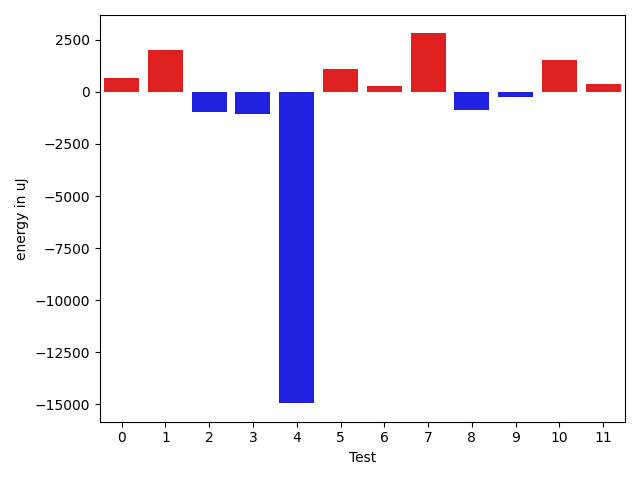
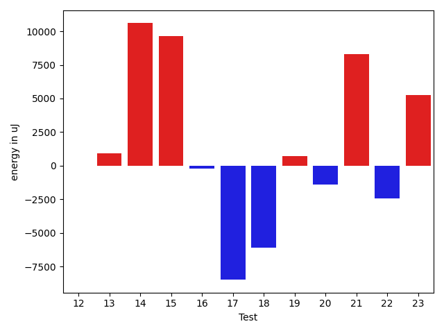
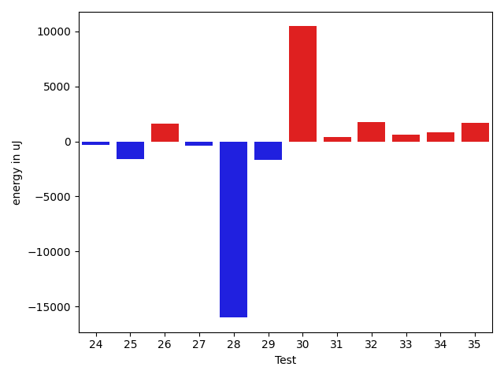
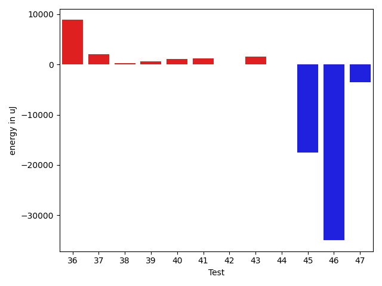
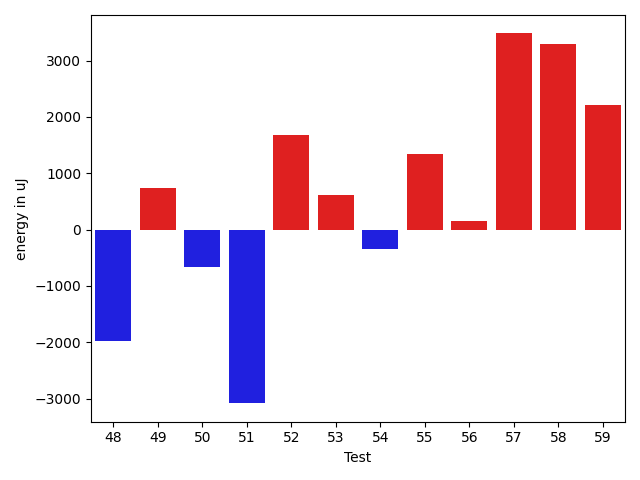
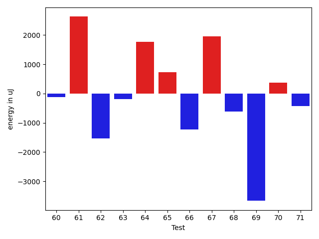

# gson f33a84

https://github.com/google/gson/commit/f33a84

## Delta Energy per test method

| ID | EnergyV1 | EnergyV2 | DeltaEnergy | σV1 | σV2 |
| --- | --- | --- | --- | --- | --- |
| 0 | 36865 | 37536 | 671 | 4163.70550198954 | 3437.4411626352844 |
| 1 | 38208 | 40222 | 2014 | 102766.62148804257 | 125417.2376908442 |
| 2 | 35949 | 34973 | -976 | 3814.272781824429 | 4591.568510068542 |
| 3 | 37537 | 36499 | -1038 | 4281.889922927255 | 4248.075089227923 |
| 4 | 58045 | 43091 | -14954 | 19848.447265831022 | 17420.254632629207 |
| 5 | 35156 | 36255 | 1099 | 3590.1923564731565 | 3612.3857008353907 |
| 6 | 36438 | 36743 | 305 | 3648.586256124603 | 4518.308168223158 |
| 7 | 37536 | 40344 | 2808 | 48374.56658115881 | 44889.81785748072 |
| 8 | 36438 | 35583 | -855 | 2137.2198229074547 | 3785.553096972753 |
| 9 | 37598 | 37354 | -244 | 9015.850709377773 | 8412.702296069037 |
| 10 | 36621 | 38146 | 1525 | 8548.531271797152 | 18401.97721201511 |
| 11 | 35095 | 35461 | 366 | 3321.748078681862 | 3480.9132174553883 |
| 12 | 37597 | 37598 | 1 | 11784.5806310475 | 10837.969393370926 |
| 13 | 37598 | 36438 | -1160 | 6024.3414118620385 | 11158.245615602493 |
| 14 | 72510 | 81359 | 8849 | 57247.2637692583 | 62432.49078602067 |
| 15 | 36133 | 38086 | 1953 | 6619.421262924774 | 17197.342880717242 |
| 16 | 36560 | 36865 | 305 | 7015.573133609336 | 5096.928125461031 |
| 17 | 37171 | 37720 | 549 | 35676.70233520459 | 2857.417442194521 |
| 18 | 37537 | 36194 | -1343 | 19965.710712325366 | 3730.2816995042017 |
| 19 | 36132 | 36560 | 428 | 4096.873292794109 | 4209.515552443932 |
| 20 | 79285 | 80932 | 1647 | 45254.284068970104 | 40285.70721541244 |
| 21 | 37109 | 36560 | -549 | 47555.63755334019 | 53208.689252381904 |
| 22 | 35644 | 35462 | -182 | 10161.121984917918 | 5308.340454432561 |
| 23 | 38086 | 37537 | -549 | 32115.498937301636 | 38690.44914921858 |
| 24 | 36988 | 36683 | -305 | 5469.52373453028 | 7170.282815828953 |
| 25 | 38452 | 36866 | -1586 | 4146.226667579495 | 3030.833272798093 |
| 26 | 36377 | 37964 | 1587 | 2900.7882300429233 | 3065.7896254472516 |
| 27 | 35706 | 35279 | -427 | 11700.787233621808 | 9772.764300807414 |
| 28 | 55602 | 39611 | -15991 | 41687.424704970654 | 41607.866729443056 |
| 29 | 43823 | 42175 | -1648 | 62644.95009482098 | 62378.16255077765 |
| 30 | 266235 | 276672 | 10437 | 84867.47457651496 | 78290.02858655802 |
| 31 | 35827 | 36193 | 366 | 3423.320481240976 | 4289.861719713473 |
| 32 | 182678 | 184447 | 1769 | 92974.85137351141 | 89762.28592504734 |
| 33 | 33936 | 34546 | 610 | 3174.771983938374 | 4531.26196377731 |
| 34 | 35095 | 35888 | 793 | 3256.22743206298 | 5765.5239734847455 |
| 35 | 33508 | 35157 | 1649 | 3879.9556594952705 | 4588.2388269843495 |
| 36 | 34424 | 35218 | 794 | 21273.877265317573 | 40819.93241931312 |
| 37 | 34057 | 36377 | 2320 | 2734.0349907806326 | 4316.839331869384 |
| 38 | 33874 | 34790 | 916 | 3520.7148717906875 | 3752.4959551388374 |
| 39 | 34485 | 35461 | 976 | 6648.344485963435 | 3745.5569755808665 |
| 40 | 32898 | 35766 | 2868 | 4110.512320991459 | 2965.4366622190964 |
| 41 | 36132 | 34545 | -1587 | 3513.3080549638057 | 17602.322538044904 |
| 42 | 34058 | 34851 | 793 | 3622.301808316439 | 3699.848301234584 |
| 43 | 32959 | 35217 | 2258 | 3844.7391359158078 | 4022.87523952914 |
| 44 | 41382 | 38208 | -3174 | 38532.29142200894 | 44263.84444833247 |
| 45 | 40466 | 40222 | -244 | 69930.21640810106 | 50122.7850525753 |
| 46 | 40832 | 39124 | -1708 | 109747.0304915828 | 49868.10081572128 |
| 47 | 37109 | 36376 | -733 | 13287.519176728523 | 8259.290793375003 |
| 48 | 37414 | 36927 | -487 | 4168.538162013545 | 4094.7482555911374 |
| 49 | 40283 | 38880 | -1403 | 4398.753893256939 | 10357.795817429283 |
| 50 | 36316 | 35523 | -793 | 2442.577688286211 | 2987.528879451302 |
| 51 | 38086 | 37231 | -855 | 11571.186120705173 | 4121.290359523337 |
| 52 | 38391 | 37842 | -549 | 4149.396310676477 | 3778.2947812580255 |
| 53 | 36133 | 37537 | 1404 | 3468.8152316188753 | 3649.2673535382414 |
| 54 | 38085 | 37537 | -548 | 3533.838990933349 | 2507.3109874435404 |
| 55 | 36377 | 38208 | 1831 | 4171.6722797938 | 3396.0151949132432 |
| 56 | 34729 | 36071 | 1342 | 4643.174814647301 | 2953.0847028526327 |
| 57 | 34118 | 37292 | 3174 | 3311.2236801520967 | 3596.3765549869104 |
| 58 | 35462 | 39490 | 4028 | 2894.8544868438553 | 4171.314882623943 |
| 59 | 35644 | 38208 | 2564 | 3715.1398890299847 | 3241.2280077772994 |
| 60 | 36804 | 36682 | -122 | 10917.13879258969 | 3689.0396162050843 |
| 61 | 37170 | 39795 | 2625 | 3622.7006125810426 | 6276.703301362375 |
| 62 | 38147 | 36621 | -1526 | 4237.434655805588 | 4070.7196228595612 |
| 63 | 39795 | 39612 | -183 | 4054.7016127413553 | 4188.960179776731 |
| 64 | 38086 | 39855 | 1769 | 15910.84077284307 | 9615.546115007912 |
| 65 | 36255 | 36987 | 732 | 3972.412643169445 | 2578.325226231598 |
| 66 | 37659 | 36438 | -1221 | 4016.270569812351 | 3402.4668339622385 |
| 67 | 36499 | 38452 | 1953 | 4341.258898829539 | 3393.5429546602127 |
| 68 | 37170 | 36560 | -610 | 2874.90117976052 | 3711.2626386802494 |
| 69 | 39978 | 36316 | -3662 | 12596.722092087202 | 9034.560890196493 |
| 70 | 37903 | 38269 | 366 | 3709.6227121725824 | 3393.2282891403315 |
| 71 | 36804 | 36377 | -427 | 3412.445190126844 | 3454.5867616659375 |
| 72 | 41504 | 37964 | -3540 | 41524.73904736968 | 57692.71259783189 |
| 73 | 37110 | 38269 | 1159 | 3530.6957315847076 | 2836.743084311459 |
| 74 | 35583 | 37902 | 2319 | 3556.8880840005727 | 4101.3136085351425 |
| 75 | 37536 | 37780 | 244 | 4064.1402423010586 | 2519.8858658398603 |
| 76 | 37171 | 36133 | -1038 | 3880.103664691636 | 2422.6069945412114 |
| 77 | 37476 | 38330 | 854 | 34388.076781446485 | 18847.554408846267 |
| 78 | 41565 | 39917 | -1648 | 26400.290954739456 | 22341.36045901686 |
| 79 | 38208 | 36987 | -1221 | 7038.364515142063 | 2967.5135101432 |
| 80 | 36987 | 39734 | 2747 | 3283.4640374226747 | 4349.450500272533 |
| 81 | 38757 | 36804 | -1953 | 4032.9887798654627 | 4465.564360943462 |

## Delta Duration per test method

| ID | DurationV1 | DurationsV2 | DeltaDuration |
| --- | --- | --- | --- |
| 0 | 895312.1698113207 | 866237.9756097561 | -29074.19420156465 |
| 1 | 2172415.838235294 | 2335788.203125 | 163372.36488970602 |
| 2 | 831989.9333333333 | 896456.75 | 64466.81666666665 |
| 3 | 856752.5625 | 879788.4285714285 | 23035.86607142852 |
| 4 | 1795749.4166666667 | 1768982.9387755103 | -26766.47789115645 |
| 5 | 895521.9411764706 | 847153.38 | -48368.5611764706 |
| 6 | 880119.0370370371 | 886969.2413793104 | 6850.204342273297 |
| 7 | 1657638.3559322034 | 1996559.593220339 | 338921.23728813557 |
| 8 | 448931.35714285716 | 472204.4375 | 23273.08035714284 |
| 9 | 1033289.0322580645 | 1088174.3768115942 | 54885.34455352975 |
| 10 | 950236.1754385965 | 1222652.59375 | 272416.4183114035 |
| 11 | 941940.3823529412 | 975885.5076923077 | 33945.125339366496 |
| 12 | 1274713.7738095238 | 1268882.4831460675 | -5831.290663456311 |
| 13 | 747636.1842105263 | 740603.8928571428 | -7032.291353383451 |
| 14 | 2997965.0303030303 | 3334481.878787879 | 336516.8484848486 |
| 15 | 1087299.2878787878 | 1427811.6551724137 | 340512.36729362584 |
| 16 | 899229.1363636364 | 989419.8333333334 | 90190.69696969702 |
| 17 | 964203.282051282 | 704456.4074074074 | -259746.8746438746 |
| 18 | 771927.0 | 461674.95652173914 | -310252.04347826086 |
| 19 | 724606.3243243244 | 706995.5945945946 | -17610.72972972982 |
| 20 | 3068549.878787879 | 2996991.101010101 | -71558.77777777798 |
| 21 | 1337613.4038461538 | 1631816.1276595744 | 294202.7238134206 |
| 22 | 1162741.4342105263 | 1195004.5974025973 | 32263.16319207102 |
| 23 | 1564509.5333333334 | 1705911.6144578313 | 141402.0811244978 |
| 24 | 964348.380952381 | 1001935.1052631579 | 37586.72431077692 |
| 25 | 513772.4210526316 | 601592.45 | 87820.02894736838 |
| 26 | 545448.6 | 565304.1 | 19855.5 |
| 27 | 1361687.914893617 | 1340995.0333333334 | -20692.88156028348 |
| 28 | 2469502.787878788 | 2216162.448979592 | -253340.33889919613 |
| 29 | 2260706.6597938146 | 2421275.9139784947 | 160569.25418468006 |
| 30 | 7740133.666666667 | 7869251.060606061 | 129117.39393939357 |
| 31 | 657087.4722222222 | 626976.5714285715 | -30110.90079365077 |
| 32 | 6262700.484848484 | 5873038.313131313 | -389662.17171717156 |
| 33 | 469797.05 | 459935.4375 | -9861.612499999988 |
| 34 | 885843.0 | 887672.052631579 | 1829.0526315789903 |
| 35 | 717285.6216216217 | 737045.0476190476 | 19759.42599742592 |
| 36 | 1147780.3857142858 | 1375049.5128205128 | 227269.12710622698 |
| 37 | 514852.7826086957 | 501428.4210526316 | -13424.361556064105 |
| 38 | 625223.696969697 | 616375.3666666667 | -8848.330303030321 |
| 39 | 934566.0606060605 | 967189.0961538461 | 32623.035547785577 |
| 40 | 513141.7586206897 | 552762.1538461539 | 39620.39522546419 |
| 41 | 828620.9122807018 | 945499.340425532 | 116878.42814483016 |
| 42 | 661708.5 | 673665.21875 | 11956.71875 |
| 43 | 715552.5238095238 | 742665.1521739131 | 27112.628364389297 |
| 44 | 1734133.8043478262 | 1649810.088888889 | -84323.71545893722 |
| 45 | 2190789.782608696 | 1693145.7666666666 | -497644.0159420292 |
| 46 | 2485059.48 | 1288320.1363636365 | -1196739.3436363635 |
| 47 | 1332453.1956521738 | 1353370.452631579 | 20917.25697940518 |
| 48 | 528697.0952380953 | 552445.4333333333 | 23748.338095238083 |
| 49 | 694969.2592592592 | 828485.0 | 133515.7407407408 |
| 50 | 436432.53846153844 | 423136.1666666667 | -13296.371794871753 |
| 51 | 601892.9333333333 | 596721.6 | -5171.333333333372 |
| 52 | 460328.6666666667 | 491260.21428571426 | 30931.547619047575 |
| 53 | 483067.77777777775 | 461567.72 | -21500.05777777778 |
| 54 | 496727.4705882353 | 462175.0714285714 | -34552.39915966388 |
| 55 | 506673.45 | 464560.9285714286 | -42112.52142857143 |
| 56 | 526826.1875 | 453982.86666666664 | -72843.32083333336 |
| 57 | 498266.35 | 473053.0 | -25213.349999999977 |
| 58 | 393609.75 | 638877.1 | 245267.34999999998 |
| 59 | 507233.3888888889 | 494046.52 | -13186.868888888857 |
| 60 | 863499.2916666666 | 489470.625 | -374028.6666666666 |
| 61 | 586202.8888888889 | 438196.77777777775 | -148006.11111111112 |
| 62 | 455886.5333333333 | 452569.7272727273 | -3316.8060606060317 |
| 63 | 499197.64285714284 | 560513.6428571428 | 61316.0 |
| 64 | 1223483.5555555555 | 796023.6875 | -427459.8680555555 |
| 65 | 447386.4705882353 | 502957.8333333333 | 55571.36274509801 |
| 66 | 426445.3076923077 | 430464.1538461539 | 4018.846153846185 |
| 67 | 428842.2 | 439454.13636363635 | 10611.936363636341 |
| 68 | 543554.2727272727 | 516715.4166666667 | -26838.85606060602 |
| 69 | 1061411.0277777778 | 1030914.4193548387 | -30496.608422939084 |
| 70 | 479594.6111111111 | 454946.6666666667 | -24647.944444444438 |
| 71 | 450392.36363636365 | 483722.5714285714 | 33330.20779220777 |
| 72 | 1405690.625 | 1454590.0 | 48899.375 |
| 73 | 559195.6315789474 | 574662.9166666666 | 15467.28508771921 |
| 74 | 484966.4736842105 | 523209.86666666664 | 38243.392982456135 |
| 75 | 437630.9090909091 | 521218.2727272727 | 83587.36363636359 |
| 76 | 473972.2631578947 | 495779.55 | 21807.28684210527 |
| 77 | 1360280.6805555555 | 1256440.75 | -103839.9305555555 |
| 78 | 1299711.0714285714 | 987610.0416666666 | -312101.02976190473 |
| 79 | 732290.1111111111 | 959777.3548387097 | 227487.24372759857 |
| 80 | 526174.8518518518 | 533779.2592592592 | 7604.407407407416 |
| 81 | 769675.6153846154 | 776145.2777777778 | 6469.662393162376 |

## Misc.

| ID | Test Class | Test Method |
| --- | --- | --- |
| 0 | com.google.gson.functional.CustomDeserializerTest | testDefaultConstructorNotCalledOnField |
| 1 | com.google.gson.functional.CustomDeserializerTest | testDefaultConstructorNotCalledOnObject |
| 2 | com.google.gson.functional.CollectionTest | testCollectionOfObjectSerialization |
| 3 | com.google.gson.functional.CollectionTest | testQueueSerialization |
| 4 | com.google.gson.functional.CollectionTest | testWildcardCollectionField |
| 5 | com.google.gson.functional.CollectionTest | testCollectionOfEnumsSerialization |
| 6 | com.google.gson.functional.CollectionTest | testNullsInListSerialization |
| 7 | com.google.gson.functional.CollectionTest | testCollectionOfBagOfPrimitivesSerialization |
| 8 | com.google.gson.functional.CollectionTest | testCollectionOfStringsSerialization |
| 9 | com.google.gson.functional.CollectionTest | testLinkedListSerialization |
| 10 | com.google.gson.functional.ObjectTest | testNestedSerialization |
| 11 | com.google.gson.functional.ObjectTest | testClassWithObjectFieldSerialization |
| 12 | com.google.gson.functional.ObjectTest | testArrayOfArraysSerialization |
| 13 | com.google.gson.functional.ObjectTest | testBagOfPrimitivesSerialization |
| 14 | com.google.gson.functional.ObjectTest | testSubInterfacesOfCollectionSerialization |
| 15 | com.google.gson.functional.ObjectTest | testInheritenceSerialization |
| 16 | com.google.gson.functional.ObjectTest | testArrayOfObjectsSerialization |
| 17 | com.google.gson.functional.ObjectTest | testNullFieldsSerialization |
| 18 | com.google.gson.functional.ObjectTest | testTopLevelEnumSerialization |
| 19 | com.google.gson.functional.ObjectTest | testClassWithEnumFieldSerialization |
| 20 | com.google.gson.functional.NamingPolicyTest | testGsonWithNonDefaultFieldNamingPolicySerialization |
| 21 | com.google.gson.functional.NamingPolicyTest | testGsonWithNonDefaultFieldNamingPolicyDeserialiation |
| 22 | com.google.gson.functional.CustomTypeAdaptersTest | testCustomAdapterInvokedForMapElementSerializationWithType |
| 23 | com.google.gson.functional.CustomTypeAdaptersTest | testCustomAdapterInvokedForCollectionElementSerializationWithType |
| 24 | com.google.gson.functional.CustomTypeAdaptersTest | testCustomByteArraySerializer |
| 25 | com.google.gson.functional.CustomTypeAdaptersTest | testCustomAdapterInvokedForMapElementSerialization |
| 26 | com.google.gson.functional.CustomTypeAdaptersTest | testCustomAdapterInvokedForCollectionElementSerialization |
| 27 | com.google.gson.functional.ParameterizedTypesTest | testParameterizedTypeWithCustomSerializer |
| 28 | com.google.gson.functional.ParameterizedTypesTest | testTypesWithMultipleParametersSerialization |
| 29 | com.google.gson.functional.ConcurrencyTest | testSingleThreadSerialization |
| 30 | com.google.gson.functional.ConcurrencyTest | testMultiThreadSerialization |
| 31 | com.google.gson.functional.DefaultTypeAdaptersTest | testUuidSerialization |
| 32 | com.google.gson.functional.DefaultTypeAdaptersTest | testDefaultDateDeserializationUsingBuilder |
| 33 | com.google.gson.functional.DefaultTypeAdaptersTest | testLocaleSerializationWithLanguageCountry |
| 34 | com.google.gson.functional.DefaultTypeAdaptersTest | testDateDeserializationWithPattern |
| 35 | com.google.gson.functional.DefaultTypeAdaptersTest | testDefaultDateSerialization |
| 36 | com.google.gson.functional.DefaultTypeAdaptersTest | testDefaultDateDeserialization |
| 37 | com.google.gson.functional.DefaultTypeAdaptersTest | testLocaleSerializationWithLanguage |
| 38 | com.google.gson.functional.DefaultTypeAdaptersTest | testUriSerialization |
| 39 | com.google.gson.functional.DefaultTypeAdaptersTest | testDateSerializationWithPattern |
| 40 | com.google.gson.functional.DefaultTypeAdaptersTest | testLocaleSerializationWithLanguageCountryVariant |
| 41 | com.google.gson.functional.DefaultTypeAdaptersTest | testUrlSerialization |
| 42 | com.google.gson.functional.DefaultTypeAdaptersTest | testSetSerialization |
| 43 | com.google.gson.functional.DefaultTypeAdaptersTest | testDefaultDateSerializationUsingBuilder |
| 44 | com.google.gson.functional.VersioningTest | testVersionedGsonWithUnversionedClassesSerialization |
| 45 | com.google.gson.functional.EscapingTest | testEscapingObjectFields |
| 46 | com.google.gson.functional.EscapingTest | testEscapingQuotesInStringArray |
| 47 | com.google.gson.functional.MapTest | testParameterizedMapSubclassSerialization |
| 48 | com.google.gson.functional.MapTest | testMapSubclassSerialization |
| 49 | com.google.gson.functional.MapTest | testRawMapSerialization |
| 50 | com.google.gson.EscaperTest | testSingleQuoteNotEscaped |
| 51 | com.google.gson.EscaperTest | testNoSpecialCharacters |
| 52 | com.google.gson.EscaperTest | testRequiredEscapingUnicodeCharacter |
| 53 | com.google.gson.EscaperTest | testGreaterThanAndLessThanEscaping |
| 54 | com.google.gson.EscaperTest | testQuoteEscaping |
| 55 | com.google.gson.EscaperTest | testCarrageReturnEscaping |
| 56 | com.google.gson.EscaperTest | testSlashEscaping |
| 57 | com.google.gson.EscaperTest | testAmpersandEscaping |
| 58 | com.google.gson.EscaperTest | testUnicodeCharacterStringNoEscaping |
| 59 | com.google.gson.EscaperTest | testEqualsEscaping |
| 60 | com.google.gson.EscaperTest | testTabEscaping |
| 61 | com.google.gson.EscaperTest | testNewlineEscaping |
| 62 | com.google.gson.JsonEscapingVisitorTest | testStringFieldVisitationNoEscaping |
| 63 | com.google.gson.JsonEscapingVisitorTest | testStringPrimitiveVisitationEscapingRequired |
| 64 | com.google.gson.JsonEscapingVisitorTest | testStringPrimitiveVisitationNoEscapingRequired |
| 65 | com.google.gson.JsonEscapingVisitorTest | testStringFieldVisitationEscapingRequired |
| 66 | com.google.gson.JsonEscapingVisitorTest | testStringArrayVisitationNoEscaping |
| 67 | com.google.gson.JsonEscapingVisitorTest | testStringArrayVisitationEscapingRequired |
| 68 | com.google.gson.functional.StringTest | testEscapingQuotesInStringSerialization |
| 69 | com.google.gson.functional.StringTest | testStringValueAsSingleElementArraySerialization |
| 70 | com.google.gson.functional.StringTest | testEscapedBackslashInStringSerialization |
| 71 | com.google.gson.functional.StringTest | testJavascriptKeywordsInStringSerialization |
| 72 | com.google.gson.functional.StringTest | testStringValueSerialization |
| 73 | com.google.gson.functional.StringTest | testSingleQuoteInStringSerialization |
| 74 | com.google.gson.functional.StringTest | testEscapedCtrlRInStringSerialization |
| 75 | com.google.gson.functional.StringTest | testEscapedCtrlNInStringSerialization |
| 76 | com.google.gson.functional.StringTest | testAssignmentCharSerialization |
| 77 | com.google.gson.FunctionalWithInternalDependenciesTest | testPrettyPrintArrayOfObjects |
| 78 | com.google.gson.functional.InternationalizationTest | testStringsWithUnicodeChineseCharactersSerialization |
| 79 | com.google.gson.GsonTypeAdapterTest | testTypeAdapterDoesNotAffectNonAdaptedTypes |
| 80 | com.google.gson.functional.ArrayTest | testArrayOfStringsSerialization |
| 81 | com.google.gson.functional.ArrayTest | testNullsInArraySerialization |

| Test | IterationV1 | IterationV2 | DeltaIteration |
| --- | --- | --- | --- |
| 0 | 53 | 41 | -12 |
| 1 | 68 | 64 | -4 |
| 2 | 60 | 56 | -4 |
| 3 | 48 | 63 | 15 |
| 4 | 96 | 98 | 2 |
| 5 | 51 | 50 | -1 |
| 6 | 54 | 58 | 4 |
| 7 | 59 | 59 | 0 |
| 8 | 14 | 16 | 2 |
| 9 | 62 | 69 | 7 |
| 10 | 57 | 64 | 7 |
| 11 | 68 | 65 | -3 |
| 12 | 84 | 89 | 5 |
| 13 | 38 | 28 | -10 |
| 14 | 99 | 99 | 0 |
| 15 | 66 | 87 | 21 |
| 16 | 66 | 66 | 0 |
| 17 | 39 | 27 | -12 |
| 18 | 24 | 23 | -1 |
| 19 | 37 | 37 | 0 |
| 20 | 99 | 99 | 0 |
| 21 | 52 | 47 | -5 |
| 22 | 76 | 77 | 1 |
| 23 | 75 | 83 | 8 |
| 24 | 63 | 57 | -6 |
| 25 | 19 | 20 | 1 |
| 26 | 15 | 20 | 5 |
| 27 | 94 | 90 | -4 |
| 28 | 99 | 98 | -1 |
| 29 | 97 | 93 | -4 |
| 30 | 99 | 99 | 0 |
| 31 | 36 | 42 | 6 |
| 32 | 99 | 99 | 0 |
| 33 | 20 | 16 | -4 |
| 34 | 46 | 57 | 11 |
| 35 | 37 | 42 | 5 |
| 36 | 70 | 78 | 8 |
| 37 | 23 | 19 | -4 |
| 38 | 33 | 30 | -3 |
| 39 | 66 | 52 | -14 |
| 40 | 29 | 26 | -3 |
| 41 | 57 | 47 | -10 |
| 42 | 26 | 32 | 6 |
| 43 | 42 | 46 | 4 |
| 44 | 46 | 45 | -1 |
| 45 | 69 | 60 | -9 |
| 46 | 50 | 44 | -6 |
| 47 | 92 | 95 | 3 |
| 48 | 21 | 30 | 9 |
| 49 | 27 | 15 | -12 |
| 50 | 13 | 12 | -1 |
| 51 | 15 | 20 | 5 |
| 52 | 12 | 14 | 2 |
| 53 | 18 | 25 | 7 |
| 54 | 17 | 14 | -3 |
| 55 | 20 | 14 | -6 |
| 56 | 16 | 15 | -1 |
| 57 | 20 | 17 | -3 |
| 58 | 8 | 10 | 2 |
| 59 | 18 | 25 | 7 |
| 60 | 24 | 24 | 0 |
| 61 | 9 | 18 | 9 |
| 62 | 15 | 11 | -4 |
| 63 | 14 | 14 | 0 |
| 64 | 18 | 16 | -2 |
| 65 | 17 | 12 | -5 |
| 66 | 13 | 13 | 0 |
| 67 | 15 | 22 | 7 |
| 68 | 22 | 24 | 2 |
| 69 | 36 | 31 | -5 |
| 70 | 18 | 9 | -9 |
| 71 | 22 | 14 | -8 |
| 72 | 32 | 23 | -9 |
| 73 | 19 | 24 | 5 |
| 74 | 19 | 15 | -4 |
| 75 | 22 | 11 | -11 |
| 76 | 19 | 20 | 1 |
| 77 | 72 | 68 | -4 |
| 78 | 28 | 24 | -4 |
| 79 | 27 | 31 | 4 |
| 80 | 27 | 27 | 0 |
| 81 | 26 | 18 | -8 |

| Time Label | Time (s) |
| --- | --- |
| Selection | 22.256153345108032 |
| Injection | 10.862183332443237 |
| Total | 980.0426590442657 |

