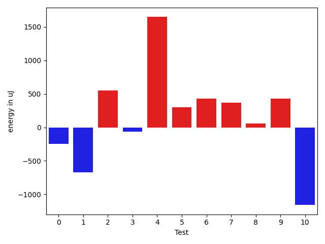
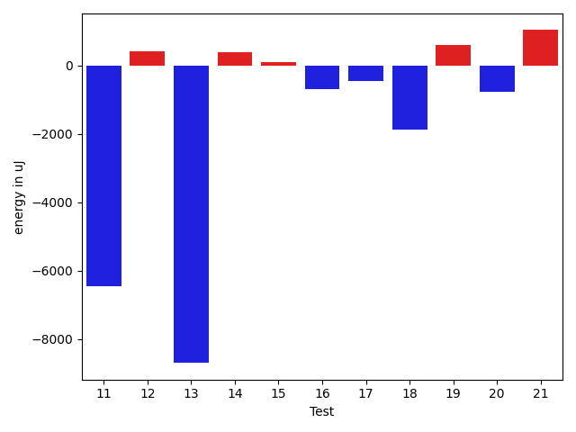
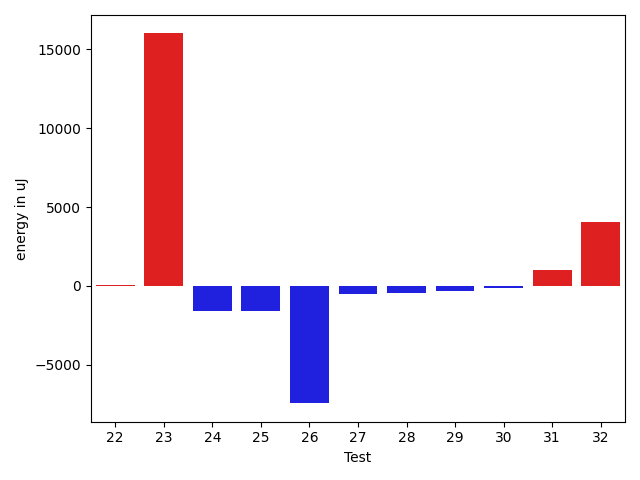
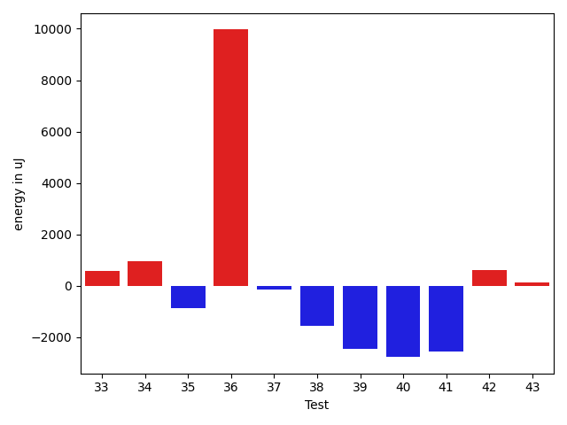
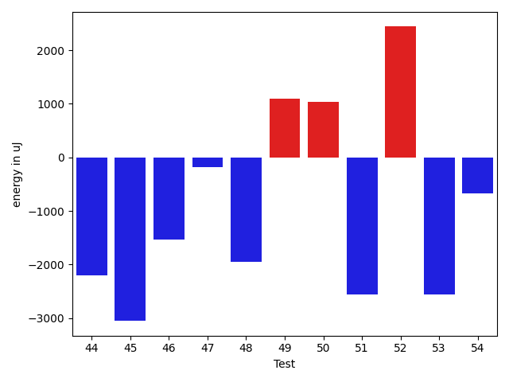
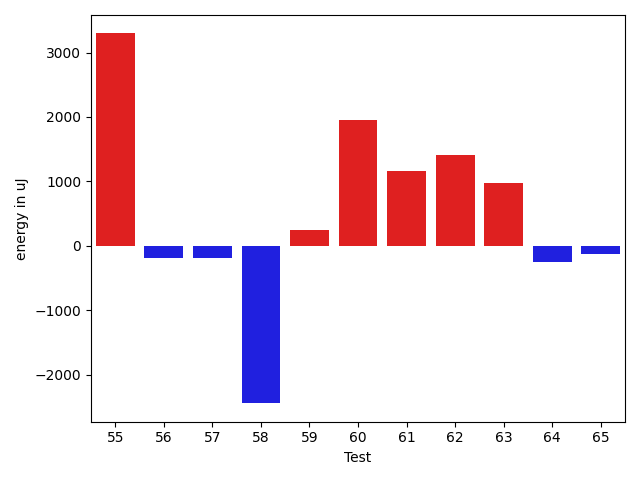
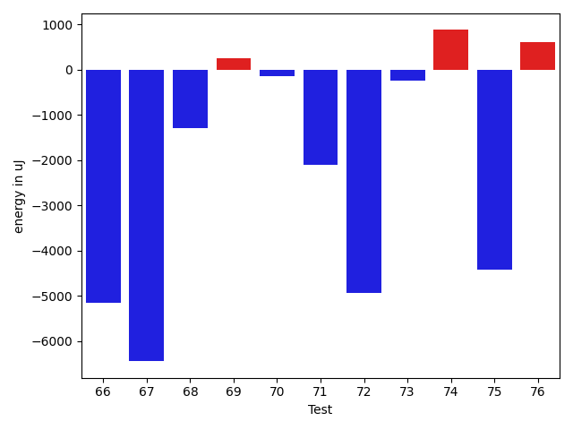
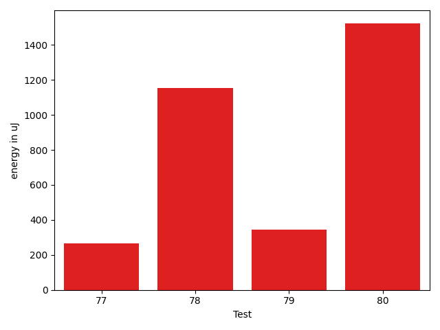

# gson e4fdea

https://github.com/google/gson/commit/e4fdea

## Delta Energy per test method

| ID | EnergyV1 | EnergyV2 | DeltaEnergy | σV1 | σV2 |
| --- | --- | --- | --- | --- | --- |
| 0 | 37170 | 36927 | -243 | 4148.084558262891 | 3885.832688495399 |
| 1 | 39490 | 38818 | -672 | 140921.99189839524 | 126728.67492252948 |
| 2 | 34790 | 35340 | 550 | 3075.465287328734 | 3592.3307152822285 |
| 3 | 37293 | 37231 | -62 | 49989.09416502764 | 40591.11399730831 |
| 4 | 36072 | 37720 | 1648 | 3404.907537178461 | 4254.598813777654 |
| 5 | 41138 | 41442 | 304 | 18798.572264660805 | 17994.69905816449 |
| 6 | 37353 | 37781 | 428 | 7006.861515706557 | 7831.618425686709 |
| 7 | 36987 | 37353 | 366 | 3325.310866332721 | 3635.8534176601156 |
| 8 | 34912 | 34973 | 61 | 3584.958238343331 | 3994.62132433838 |
| 9 | 35034 | 35461 | 427 | 3085.48438698752 | 4655.696703867209 |
| 10 | 36987 | 35828 | -1159 | 3234.8791669631296 | 2838.9643455942796 |
| 11 | 38269 | 35767 | -2502 | 16417.279770271423 | 8725.21368249584 |
| 12 | 35583 | 36438 | 855 | 4623.874787433317 | 3501.4010030807667 |
| 13 | 40222 | 39185 | -1037 | 44354.7798427726 | 40318.318164255965 |
| 14 | 36682 | 37903 | 1221 | 4888.012748039841 | 5066.725155607825 |
| 15 | 36133 | 37964 | 1831 | 2782.4698045114073 | 3116.3984104201336 |
| 16 | 38818 | 37292 | -1526 | 2688.053071670219 | 3722.32490073968 |
| 17 | 35523 | 35889 | 366 | 3203.6935290963306 | 2225.090517259916 |
| 18 | 37964 | 36927 | -1037 | 2938.384954169363 | 3044.00436244657 |
| 19 | 35950 | 35828 | -122 | 3653.3699237826986 | 3752.4948202737705 |
| 20 | 35217 | 35156 | -61 | 7088.383239478677 | 5024.155019060971 |
| 21 | 35278 | 36132 | 854 | 3489.233516482435 | 3167.5013978882694 |
| 22 | 36560 | 35645 | -915 | 3412.7743784738163 | 3394.3817821483017 |
| 23 | 178588 | 190246 | 11658 | 117067.80562616047 | 106959.48338114757 |
| 24 | 35828 | 35400 | -428 | 3501.1718995730716 | 3078.89610097796 |
| 25 | 36255 | 34729 | -1526 | 6592.004943654855 | 4201.177889888169 |
| 26 | 35584 | 35096 | -488 | 47197.95846747417 | 38775.9212984805 |
| 27 | 35522 | 36621 | 1099 | 4483.689851165047 | 3870.0892808243134 |
| 28 | 35278 | 35095 | -183 | 3793.4670621218397 | 3014.5970853926096 |
| 29 | 34790 | 34851 | 61 | 3923.1214690886754 | 3500.3027825282484 |
| 30 | 35828 | 34424 | -1404 | 3245.64812715521 | 3931.2054557045144 |
| 31 | 36315 | 36560 | 245 | 3365.4855578356 | 3141.115895559401 |
| 32 | 81115 | 80627 | -488 | 41019.68057077674 | 40651.51186809064 |
| 33 | 36621 | 36499 | -122 | 53117.77109204586 | 49915.14879402845 |
| 34 | 35889 | 35279 | -610 | 8652.856305489468 | 11431.017090076044 |
| 35 | 44617 | 60119 | 15502 | 38272.20911830804 | 36541.8927318434 |
| 36 | 44373 | 70435 | 26062 | 60198.95088585668 | 64493.49186043081 |
| 37 | 262023 | 264159 | 2136 | 87503.5033932251 | 81418.97840278548 |
| 38 | 38941 | 35828 | -3113 | 4105.355025165675 | 3659.5619813977205 |
| 39 | 39550 | 36255 | -3295 | 3880.3547342872307 | 3310.548547590023 |
| 40 | 37658 | 37170 | -488 | 4011.9174515130676 | 2989.8813115387784 |
| 41 | 38635 | 35522 | -3113 | 3905.462396676731 | 4076.5150628755487 |
| 42 | 39062 | 38208 | -854 | 12316.25140050956 | 14309.072489013568 |
| 43 | 35523 | 36621 | 1098 | 2722.913040949238 | 4148.431759412224 |
| 44 | 37536 | 35339 | -2197 | 2995.2895473096128 | 13346.780727019828 |
| 45 | 39795 | 36743 | -3052 | 11229.804496109153 | 10317.061854358859 |
| 46 | 36072 | 34546 | -1526 | 3196.848170991814 | 2702.2022734323964 |
| 47 | 36499 | 36316 | -183 | 3735.4326519962847 | 3523.713161748696 |
| 48 | 38818 | 36865 | -1953 | 11264.349094996594 | 9849.635905640584 |
| 49 | 37109 | 38208 | 1099 | 2975.6163972994823 | 3693.5573459428774 |
| 50 | 35583 | 36621 | 1038 | 3369.83704327327 | 3062.082742045976 |
| 51 | 37781 | 35217 | -2564 | 3181.808622580347 | 4303.39695259422 |
| 52 | 36011 | 38452 | 2441 | 2758.3254460697685 | 4894.405571755006 |
| 53 | 37353 | 34790 | -2563 | 4235.4802372340255 | 3345.1945269056487 |
| 54 | 37476 | 36804 | -672 | 3892.131317871425 | 10872.5510836384 |
| 55 | 35950 | 39245 | 3295 | 3151.5011647936135 | 4246.867512257319 |
| 56 | 36927 | 36743 | -184 | 12844.352829260615 | 8966.30713692773 |
| 57 | 35949 | 35767 | -182 | 3598.526376171224 | 4060.0203540758516 |
| 58 | 37598 | 35156 | -2442 | 4003.860937665451 | 4391.9185789134335 |
| 59 | 37415 | 37658 | 243 | 36181.81417679848 | 28086.14899691614 |
| 60 | 35278 | 37231 | 1953 | 5636.221300979461 | 6430.284236050642 |
| 61 | 35522 | 36682 | 1160 | 8408.670347746804 | 5739.390141181661 |
| 62 | 33630 | 35034 | 1404 | 3545.5570475737654 | 4061.8476796051877 |
| 63 | 36072 | 37049 | 977 | 4450.267023514264 | 4113.99026514421 |
| 64 | 39001 | 38757 | -244 | 83012.31379291796 | 110989.98219512758 |
| 65 | 39124 | 39002 | -122 | 47658.082937919295 | 61485.269823673465 |
| 66 | 40161 | 38086 | -2075 | 41005.41930885517 | 22220.722253503347 |
| 67 | 80261 | 70374 | -9887 | 51080.005360337156 | 47426.694365532814 |
| 68 | 35949 | 36011 | 62 | 6935.008613065228 | 3902.8408462714588 |
| 69 | 36988 | 37109 | 121 | 7281.764216729039 | 6408.56172528142 |
| 70 | 35706 | 35340 | -366 | 7222.199642050556 | 5810.089750654274 |
| 71 | 37048 | 35766 | -1282 | 10908.1674789086 | 9658.291093150445 |
| 72 | 37048 | 36072 | -976 | 35898.278472838465 | 3531.8372171094593 |
| 73 | 36865 | 35950 | -915 | 3797.0629615334137 | 3809.8929408474355 |
| 74 | 35095 | 36926 | 1831 | 4644.663172532813 | 4158.195558404998 |
| 75 | 37903 | 36682 | -1221 | 30067.19350765204 | 18688.836745166886 |
| 76 | 36499 | 36682 | 183 | 3242.853636743811 | 3331.150208093998 |
| 77 | 35828 | 36987 | 1159 | 4373.281344251285 | 3602.408134241728 |
| 78 | 37415 | 38330 | 915 | 3196.4107863243353 | 3724.73178564578 |
| 79 | 39978 | 38147 | -1831 | 35437.66070227917 | 39439.62684728424 |
| 80 | 35095 | 37170 | 2075 | 3134.2579904794848 | 3692.9168329166955 |

## Delta Duration per test method

| ID | DurationV1 | DurationsV2 | DeltaDuration |
| --- | --- | --- | --- |
| 0 | 841537.3725490196 | 939971.2807017544 | 98433.90815273474 |
| 1 | 3244978.4383561644 | 2583988.2564102565 | -660990.1819459079 |
| 2 | 852606.4117647059 | 836457.1320754717 | -16149.279689234216 |
| 3 | 1818104.92 | 1441077.1090909091 | -377027.8109090908 |
| 4 | 850955.8928571428 | 859915.1346153846 | 8959.241758241784 |
| 5 | 1780194.8383838383 | 1694822.2315789473 | -85372.60680489102 |
| 6 | 1032223.8208955224 | 1018264.1166666667 | -13959.70422885567 |
| 7 | 878302.9782608695 | 899168.6 | 20865.621739130467 |
| 8 | 888401.8679245283 | 848590.9672131147 | -39810.90071141359 |
| 9 | 486903.6875 | 491842.44 | 4938.752500000002 |
| 10 | 526991.6538461539 | 545308.0 | 18316.346153846127 |
| 11 | 1057490.205882353 | 1098544.2962962964 | 41054.0904139434 |
| 12 | 577543.5789473684 | 589350.7916666666 | 11807.2127192982 |
| 13 | 1613857.2272727273 | 1255831.8064516129 | -358025.42082111444 |
| 14 | 475021.125 | 480869.0 | 5847.875 |
| 15 | 437693.76923076925 | 463969.72222222225 | 26275.952991453 |
| 16 | 448117.7272727273 | 435475.3333333333 | -12642.39393939398 |
| 17 | 453663.5294117647 | 466248.1 | 12584.570588235278 |
| 18 | 478263.6666666667 | 461190.8125 | -17072.854166666686 |
| 19 | 502186.25 | 503161.0 | 974.75 |
| 20 | 967068.3833333333 | 965138.4 | -1929.983333333279 |
| 21 | 577474.5384615385 | 513790.25925925927 | -63684.27920227923 |
| 22 | 640675.5714285715 | 670870.5945945946 | 30195.02316602308 |
| 23 | 5680277.031914894 | 6383926.451612903 | 703649.4196980093 |
| 24 | 455774.2631578947 | 439203.3888888889 | -16570.874269005843 |
| 25 | 920650.3275862068 | 945973.4923076923 | 25323.16472148546 |
| 26 | 1831339.7045454546 | 1546203.3333333333 | -285136.37121212133 |
| 27 | 853219.3421052631 | 705571.0789473684 | -147648.26315789472 |
| 28 | 736970.7058823529 | 729907.2894736842 | -7063.416408668738 |
| 29 | 774583.0714285715 | 797766.075 | 23183.003571428475 |
| 30 | 700579.1428571428 | 630538.4375 | -70040.70535714284 |
| 31 | 590700.56 | 615700.375 | 24999.814999999944 |
| 32 | 3024348.595959596 | 3210247.303030303 | 185898.70707070734 |
| 33 | 1452089.25 | 1623180.04 | 171090.79000000004 |
| 34 | 1313678.120879121 | 1343562.2173913044 | 29884.096512183547 |
| 35 | 2233586.43877551 | 2289530.7525773197 | 55944.31380180968 |
| 36 | 2161761.4105263157 | 2496002.28125 | 334240.8707236843 |
| 37 | 7711937.101010101 | 7824235.808080808 | 112298.70707070734 |
| 38 | 427190.5 | 398811.2380952381 | -28379.261904761894 |
| 39 | 528969.1538461539 | 567251.5909090909 | 38282.43706293707 |
| 40 | 444680.0 | 486197.9130434783 | 41517.91304347827 |
| 41 | 429738.0 | 466544.04545454547 | 36806.04545454547 |
| 42 | 1219685.4117647058 | 978670.7894736842 | -241014.62229102163 |
| 43 | 444017.85714285716 | 443999.5625 | -18.294642857159488 |
| 44 | 500773.9166666667 | 631498.7692307692 | 130724.85256410256 |
| 45 | 886182.6666666666 | 668632.9333333333 | -217549.73333333328 |
| 46 | 424778.17647058825 | 447352.44444444444 | 22574.267973856186 |
| 47 | 458685.72 | 432637.7272727273 | -26047.992727272678 |
| 48 | 1026190.8888888889 | 858518.7368421053 | -167672.1520467836 |
| 49 | 497490.35714285716 | 479203.13636363635 | -18287.220779220806 |
| 50 | 526063.3333333334 | 514925.77777777775 | -11137.55555555562 |
| 51 | 479992.8823529412 | 492970.7083333333 | 12977.82598039211 |
| 52 | 482123.0588235294 | 454837.9090909091 | -27285.14973262028 |
| 53 | 419653.9 | 413870.22222222225 | -5783.677777777775 |
| 54 | 459513.6 | 596851.2142857143 | 137337.61428571434 |
| 55 | 480669.64705882355 | 408268.05555555556 | -72401.59150326799 |
| 56 | 1345956.755319149 | 1328008.7234042552 | -17948.03191489377 |
| 57 | 555247.76 | 504303.25 | -50944.51000000001 |
| 58 | 752974.5238095238 | 740234.3793103448 | -12740.144499178976 |
| 59 | 1805930.0 | 1468600.4342105263 | -337329.5657894737 |
| 60 | 974546.5573770492 | 934071.1764705882 | -40475.38090646104 |
| 61 | 1225257.1232876712 | 1102612.9701492537 | -122644.15313841752 |
| 62 | 630737.36 | 546350.3181818182 | -84387.04181818175 |
| 63 | 589197.8636363636 | 541604.2173913043 | -47593.646245059324 |
| 64 | 1859401.5142857144 | 2806873.0392156863 | 947471.5249299719 |
| 65 | 1478168.5633802817 | 1996410.1666666667 | 518241.60328638507 |
| 66 | 1423778.0298507463 | 1265882.0869565217 | -157895.94289422454 |
| 67 | 2858076.2577319588 | 2683054.2 | -175022.05773195857 |
| 68 | 1042672.0133333333 | 1020477.2786885246 | -22194.73464480869 |
| 69 | 956215.1475409836 | 974213.551724138 | 17998.404183154344 |
| 70 | 963912.9152542372 | 1016665.033898305 | 52752.118644067785 |
| 71 | 1222907.2988505748 | 1215401.7027027027 | -7505.596147872042 |
| 72 | 1090545.607142857 | 910349.2075471698 | -180196.39959568728 |
| 73 | 676593.9512195121 | 709432.4716981133 | 32838.5204786011 |
| 74 | 651283.5925925926 | 678458.1578947369 | 27174.56530214427 |
| 75 | 1038386.3421052631 | 937597.9 | -100788.44210526312 |
| 76 | 468355.0588235294 | 485701.1304347826 | 17346.071611253195 |
| 77 | 730511.4615384615 | 711317.1578947369 | -19194.30364372465 |
| 78 | 536103.3333333334 | 459464.5 | -76638.83333333337 |
| 79 | 1513340.0526315789 | 1508584.0869565217 | -4755.965675057145 |
| 80 | 878515.5483870967 | 718637.7931034482 | -159877.7552836485 |

## Misc.

| ID | Test Class | Test Method |
| --- | --- | --- |
| 0 | com.google.gson.functional.CustomDeserializerTest | testDefaultConstructorNotCalledOnField |
| 1 | com.google.gson.functional.CustomDeserializerTest | testDefaultConstructorNotCalledOnObject |
| 2 | com.google.gson.functional.CollectionTest | testCollectionOfObjectSerialization |
| 3 | com.google.gson.functional.CollectionTest | testCollectionOfBagOfPrimitivesSerialization |
| 4 | com.google.gson.functional.CollectionTest | testQueueSerialization |
| 5 | com.google.gson.functional.CollectionTest | testWildcardCollectionField |
| 6 | com.google.gson.functional.CollectionTest | testLinkedListSerialization |
| 7 | com.google.gson.functional.CollectionTest | testNullsInListSerialization |
| 8 | com.google.gson.functional.CollectionTest | testCollectionOfEnumsSerialization |
| 9 | com.google.gson.functional.CollectionTest | testCollectionOfStringsSerialization |
| 10 | com.google.gson.functional.StringTest | testEscapingQuotesInStringSerialization |
| 11 | com.google.gson.functional.StringTest | testStringValueAsSingleElementArraySerialization |
| 12 | com.google.gson.functional.StringTest | testSingleQuoteInStringSerialization |
| 13 | com.google.gson.functional.StringTest | testStringValueSerialization |
| 14 | com.google.gson.functional.StringTest | testEscapedCtrlRInStringSerialization |
| 15 | com.google.gson.functional.StringTest | testEscapedBackslashInStringSerialization |
| 16 | com.google.gson.functional.StringTest | testAssignmentCharSerialization |
| 17 | com.google.gson.functional.StringTest | testEscapedCtrlNInStringSerialization |
| 18 | com.google.gson.functional.StringTest | testJavascriptKeywordsInStringSerialization |
| 19 | com.google.gson.functional.DefaultTypeAdaptersTest | testLocaleSerializationWithLanguage |
| 20 | com.google.gson.functional.DefaultTypeAdaptersTest | testDateSerializationWithPattern |
| 21 | com.google.gson.functional.DefaultTypeAdaptersTest | testLocaleSerializationWithLanguageCountryVariant |
| 22 | com.google.gson.functional.DefaultTypeAdaptersTest | testUuidSerialization |
| 23 | com.google.gson.functional.DefaultTypeAdaptersTest | testDefaultDateDeserializationUsingBuilder |
| 24 | com.google.gson.functional.DefaultTypeAdaptersTest | testLocaleSerializationWithLanguageCountry |
| 25 | com.google.gson.functional.DefaultTypeAdaptersTest | testDateDeserializationWithPattern |
| 26 | com.google.gson.functional.DefaultTypeAdaptersTest | testDefaultDateDeserialization |
| 27 | com.google.gson.functional.DefaultTypeAdaptersTest | testDefaultDateSerialization |
| 28 | com.google.gson.functional.DefaultTypeAdaptersTest | testDefaultDateSerializationUsingBuilder |
| 29 | com.google.gson.functional.DefaultTypeAdaptersTest | testUrlSerialization |
| 30 | com.google.gson.functional.DefaultTypeAdaptersTest | testSetSerialization |
| 31 | com.google.gson.functional.DefaultTypeAdaptersTest | testUriSerialization |
| 32 | com.google.gson.functional.NamingPolicyTest | testGsonWithNonDefaultFieldNamingPolicySerialization |
| 33 | com.google.gson.functional.NamingPolicyTest | testGsonWithNonDefaultFieldNamingPolicyDeserialiation |
| 34 | com.google.gson.functional.ParameterizedTypesTest | testParameterizedTypeWithCustomSerializer |
| 35 | com.google.gson.functional.ParameterizedTypesTest | testTypesWithMultipleParametersSerialization |
| 36 | com.google.gson.functional.ConcurrencyTest | testSingleThreadSerialization |
| 37 | com.google.gson.functional.ConcurrencyTest | testMultiThreadSerialization |
| 38 | com.google.gson.JsonEscapingVisitorTest | testStringArrayVisitationNoEscaping |
| 39 | com.google.gson.JsonEscapingVisitorTest | testStringPrimitiveVisitationEscapingRequired |
| 40 | com.google.gson.JsonEscapingVisitorTest | testStringFieldVisitationNoEscaping |
| 41 | com.google.gson.JsonEscapingVisitorTest | testStringFieldVisitationEscapingRequired |
| 42 | com.google.gson.JsonEscapingVisitorTest | testStringPrimitiveVisitationNoEscapingRequired |
| 43 | com.google.gson.JsonEscapingVisitorTest | testStringArrayVisitationEscapingRequired |
| 44 | com.google.gson.EscaperTest | testGreaterThanAndLessThanEscaping |
| 45 | com.google.gson.EscaperTest | testNoSpecialCharacters |
| 46 | com.google.gson.EscaperTest | testRequiredEscapingUnicodeCharacter |
| 47 | com.google.gson.EscaperTest | testSlashEscaping |
| 48 | com.google.gson.EscaperTest | testTabEscaping |
| 49 | com.google.gson.EscaperTest | testCarrageReturnEscaping |
| 50 | com.google.gson.EscaperTest | testEqualsEscaping |
| 51 | com.google.gson.EscaperTest | testAmpersandEscaping |
| 52 | com.google.gson.EscaperTest | testQuoteEscaping |
| 53 | com.google.gson.EscaperTest | testUnicodeCharacterStringNoEscaping |
| 54 | com.google.gson.EscaperTest | testSingleQuoteNotEscaped |
| 55 | com.google.gson.EscaperTest | testNewlineEscaping |
| 56 | com.google.gson.functional.MapTest | testParameterizedMapSubclassSerialization |
| 57 | com.google.gson.functional.MapTest | testMapSubclassSerialization |
| 58 | com.google.gson.functional.MapTest | testRawMapSerialization |
| 59 | com.google.gson.functional.CustomTypeAdaptersTest | testCustomAdapterInvokedForCollectionElementSerializationWithType |
| 60 | com.google.gson.functional.CustomTypeAdaptersTest | testCustomByteArraySerializer |
| 61 | com.google.gson.functional.CustomTypeAdaptersTest | testCustomAdapterInvokedForMapElementSerializationWithType |
| 62 | com.google.gson.functional.CustomTypeAdaptersTest | testCustomAdapterInvokedForCollectionElementSerialization |
| 63 | com.google.gson.functional.CustomTypeAdaptersTest | testCustomAdapterInvokedForMapElementSerialization |
| 64 | com.google.gson.functional.EscapingTest | testEscapingQuotesInStringArray |
| 65 | com.google.gson.functional.EscapingTest | testEscapingObjectFields |
| 66 | com.google.gson.FunctionalWithInternalDependenciesTest | testPrettyPrintArrayOfObjects |
| 67 | com.google.gson.functional.ObjectTest | testSubInterfacesOfCollectionSerialization |
| 68 | com.google.gson.functional.ObjectTest | testInheritenceSerialization |
| 69 | com.google.gson.functional.ObjectTest | testNestedSerialization |
| 70 | com.google.gson.functional.ObjectTest | testClassWithObjectFieldSerialization |
| 71 | com.google.gson.functional.ObjectTest | testArrayOfArraysSerialization |
| 72 | com.google.gson.functional.ObjectTest | testArrayOfObjectsSerialization |
| 73 | com.google.gson.functional.ObjectTest | testClassWithEnumFieldSerialization |
| 74 | com.google.gson.functional.ObjectTest | testNullFieldsSerialization |
| 75 | com.google.gson.functional.ObjectTest | testBagOfPrimitivesSerialization |
| 76 | com.google.gson.functional.ObjectTest | testTopLevelEnumSerialization |
| 77 | com.google.gson.functional.ArrayTest | testNullsInArraySerialization |
| 78 | com.google.gson.functional.ArrayTest | testArrayOfStringsSerialization |
| 79 | com.google.gson.functional.VersioningTest | testVersionedGsonWithUnversionedClassesSerialization |
| 80 | com.google.gson.GsonTypeAdapterTest | testTypeAdapterDoesNotAffectNonAdaptedTypes |

| Test | IterationV1 | IterationV2 | DeltaIteration |
| --- | --- | --- | --- |
| 0 | 51 | 57 | 6 |
| 1 | 73 | 78 | 5 |
| 2 | 51 | 53 | 2 |
| 3 | 50 | 55 | 5 |
| 4 | 56 | 52 | -4 |
| 5 | 99 | 95 | -4 |
| 6 | 67 | 60 | -7 |
| 7 | 46 | 55 | 9 |
| 8 | 53 | 61 | 8 |
| 9 | 16 | 25 | 9 |
| 10 | 26 | 24 | -2 |
| 11 | 34 | 27 | -7 |
| 12 | 19 | 24 | 5 |
| 13 | 22 | 31 | 9 |
| 14 | 16 | 9 | -7 |
| 15 | 13 | 18 | 5 |
| 16 | 22 | 15 | -7 |
| 17 | 17 | 10 | -7 |
| 18 | 18 | 16 | -2 |
| 19 | 20 | 23 | 3 |
| 20 | 60 | 60 | 0 |
| 21 | 26 | 27 | 1 |
| 22 | 35 | 37 | 2 |
| 23 | 94 | 93 | -1 |
| 24 | 19 | 18 | -1 |
| 25 | 58 | 65 | 7 |
| 26 | 88 | 81 | -7 |
| 27 | 38 | 38 | 0 |
| 28 | 51 | 38 | -13 |
| 29 | 42 | 40 | -2 |
| 30 | 28 | 32 | 4 |
| 31 | 25 | 32 | 7 |
| 32 | 99 | 99 | 0 |
| 33 | 52 | 50 | -2 |
| 34 | 91 | 92 | 1 |
| 35 | 98 | 97 | -1 |
| 36 | 95 | 96 | 1 |
| 37 | 99 | 99 | 0 |
| 38 | 14 | 21 | 7 |
| 39 | 13 | 22 | 9 |
| 40 | 14 | 23 | 9 |
| 41 | 19 | 22 | 3 |
| 42 | 17 | 19 | 2 |
| 43 | 14 | 16 | 2 |
| 44 | 12 | 13 | 1 |
| 45 | 12 | 15 | 3 |
| 46 | 17 | 18 | 1 |
| 47 | 25 | 11 | -14 |
| 48 | 18 | 19 | 1 |
| 49 | 14 | 22 | 8 |
| 50 | 27 | 18 | -9 |
| 51 | 17 | 24 | 7 |
| 52 | 17 | 11 | -6 |
| 53 | 20 | 18 | -2 |
| 54 | 15 | 14 | -1 |
| 55 | 17 | 18 | 1 |
| 56 | 94 | 94 | 0 |
| 57 | 25 | 28 | 3 |
| 58 | 21 | 29 | 8 |
| 59 | 80 | 76 | -4 |
| 60 | 61 | 51 | -10 |
| 61 | 73 | 67 | -6 |
| 62 | 25 | 22 | -3 |
| 63 | 22 | 23 | 1 |
| 64 | 35 | 51 | 16 |
| 65 | 71 | 72 | 1 |
| 66 | 67 | 69 | 2 |
| 67 | 97 | 95 | -2 |
| 68 | 75 | 61 | -14 |
| 69 | 61 | 58 | -3 |
| 70 | 59 | 59 | 0 |
| 71 | 87 | 74 | -13 |
| 72 | 56 | 53 | -3 |
| 73 | 41 | 53 | 12 |
| 74 | 27 | 38 | 11 |
| 75 | 38 | 40 | 2 |
| 76 | 17 | 23 | 6 |
| 77 | 26 | 19 | -7 |
| 78 | 24 | 16 | -8 |
| 79 | 38 | 46 | 8 |
| 80 | 31 | 29 | -2 |

| Time Label | Time (s) |
| --- | --- |
| Selection | 22.56826639175415 |
| Injection | 10.906053066253662 |
| Total | 979.4962074756622 |

