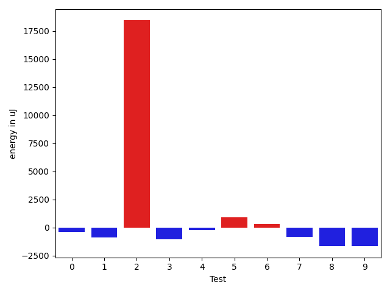
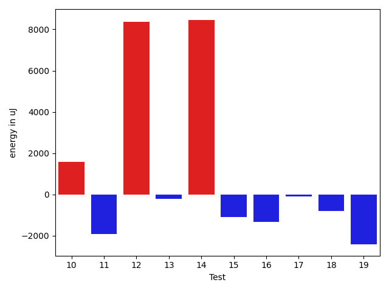
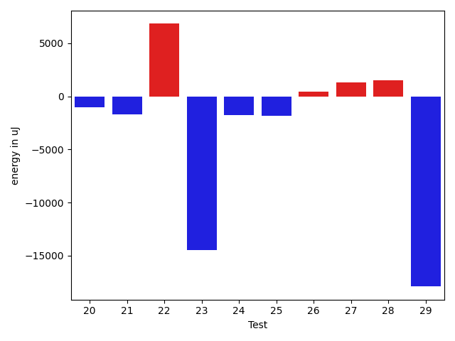
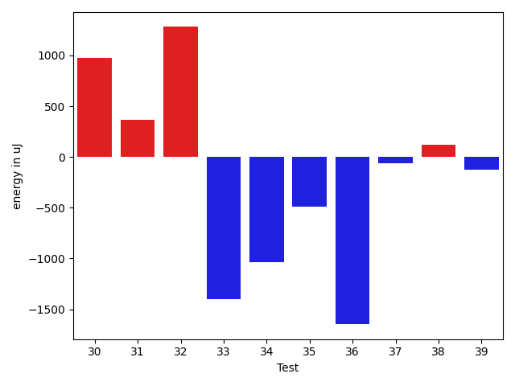
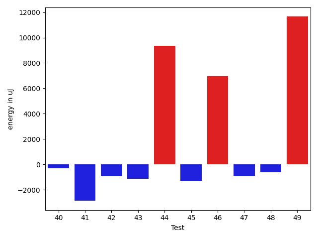
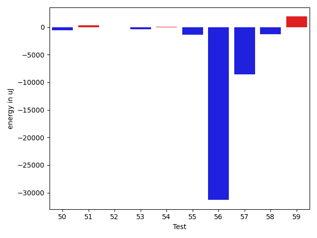
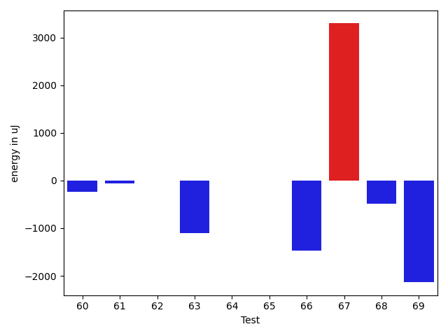
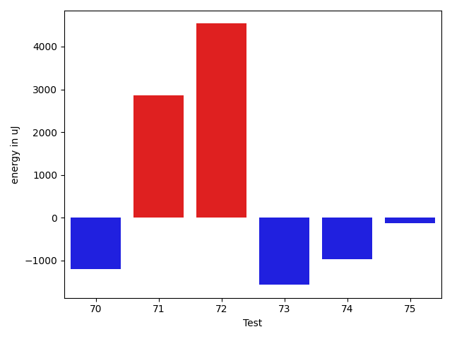

# gson a18a75

https://github.com/google/gson/commit/a18a75

## Delta Energy per test method

| ID | EnergyV1 | EnergyV2 | DeltaEnergy | σV1 | σV2 |
| --- | --- | --- | --- | --- | --- |
| 0 | 37354 | 36987 | -367 | 3847.0251003143953 | 8082.551463477563 |
| 1 | 39307 | 38452 | -855 | 123551.41905510545 | 102510.88771583867 |
| 2 | 43090 | 61523 | 18433 | 28338.711857204045 | 21780.497415206857 |
| 3 | 36377 | 35339 | -1038 | 9815.976116062584 | 11328.427714056881 |
| 4 | 36499 | 36255 | -244 | 12179.371050571535 | 14203.997555352114 |
| 5 | 34484 | 35400 | 916 | 3243.978502848339 | 3037.682722238722 |
| 6 | 35645 | 35949 | 304 | 3622.1819713357013 | 3015.196876562928 |
| 7 | 36316 | 35522 | -794 | 3478.027290708915 | 3268.4505204735706 |
| 8 | 37292 | 35644 | -1648 | 63471.5398665087 | 3609.045943083122 |
| 9 | 34668 | 33020 | -1648 | 3815.4703931030454 | 26036.1169880303 |
| 10 | 37780 | 36010 | -1770 | 49184.78912800035 | 59648.049224065144 |
| 11 | 35888 | 34424 | -1464 | 15063.577218557024 | 13162.824914983537 |
| 12 | 34973 | 36560 | 1587 | 6493.02261289536 | 49564.83813041658 |
| 13 | 35766 | 36072 | 306 | 9572.188806519964 | 9477.080962457763 |
| 14 | 37903 | 36499 | -1404 | 103065.51568285203 | 108426.58329827184 |
| 15 | 36560 | 35461 | -1099 | 3728.7167821947787 | 3506.1714044181813 |
| 16 | 37292 | 35706 | -1586 | 3207.0294598805012 | 3090.904350254492 |
| 17 | 34607 | 34973 | 366 | 2638.96953844717 | 2721.83081391769 |
| 18 | 35400 | 34362 | -1038 | 2881.598799301945 | 3103.230896687077 |
| 19 | 34180 | 33570 | -610 | 9475.600931525534 | 6306.302516462068 |
| 20 | 35462 | 35645 | 183 | 7157.165531123988 | 3886.842508883755 |
| 21 | 36621 | 35400 | -1221 | 11850.08149483606 | 6651.5443303310185 |
| 22 | 35828 | 33509 | -2319 | 69141.9694622829 | 111308.98150212319 |
| 23 | 36255 | 35461 | -794 | 85526.71208421215 | 5910.212004623171 |
| 24 | 36072 | 34607 | -1465 | 3730.118120633387 | 3686.5233618408743 |
| 25 | 35217 | 35217 | 0 | 13948.800382125619 | 11989.757958964561 |
| 26 | 35218 | 35767 | 549 | 8474.707694442697 | 7099.901663227457 |
| 27 | 34790 | 35523 | 733 | 10552.405882001702 | 11365.858536212096 |
| 28 | 34790 | 36194 | 1404 | 12738.3353002709 | 13300.132205820952 |
| 29 | 38208 | 36926 | -1282 | 98220.73466559335 | 80839.56571739606 |
| 30 | 65491 | 66467 | 976 | 27974.53083493175 | 20895.005049229974 |
| 31 | 37598 | 37964 | 366 | 19258.43578666034 | 19805.09941760328 |
| 32 | 33997 | 35278 | 1281 | 13251.177312066126 | 12184.650695330783 |
| 33 | 60119 | 58716 | -1403 | 18677.047502730267 | 19006.005798038193 |
| 34 | 40772 | 39734 | -1038 | 54829.311699707374 | 52970.204294342446 |
| 35 | 38697 | 38208 | -489 | 25229.78722063056 | 21578.430074376138 |
| 36 | 40588 | 38940 | -1648 | 53449.97353385765 | 45866.875909014045 |
| 37 | 36804 | 36743 | -61 | 4111.981000554687 | 3887.2566961712428 |
| 38 | 38879 | 39001 | 122 | 18549.288424242903 | 19876.320311881067 |
| 39 | 37110 | 36988 | -122 | 3695.8310608859574 | 3400.899210548795 |
| 40 | 37353 | 37781 | 428 | 4091.307542846284 | 3704.3532815290446 |
| 41 | 38452 | 34973 | -3479 | 3880.7471247291737 | 3762.0950119438417 |
| 42 | 38086 | 37842 | -244 | 4190.083838825768 | 3869.258282193241 |
| 43 | 38757 | 37048 | -1709 | 4961.350225387935 | 3254.5463779458228 |
| 44 | 38940 | 37841 | -1099 | 33078.82148093953 | 60860.57798852129 |
| 45 | 36377 | 35522 | -855 | 4147.770292507564 | 3647.8462195240404 |
| 46 | 41382 | 45471 | 4089 | 18432.67541381141 | 22346.589834702314 |
| 47 | 36133 | 34912 | -1221 | 4001.5957200485373 | 3713.3054526776014 |
| 48 | 37353 | 37170 | -183 | 3355.3515960824925 | 4583.968826480874 |
| 49 | 38940 | 38574 | -366 | 45200.00382650857 | 60520.48785515067 |
| 50 | 38086 | 37476 | -610 | 3864.590057897367 | 6492.659123163637 |
| 51 | 37537 | 37842 | 305 | 3750.3402561012713 | 4340.393872552225 |
| 52 | 37109 | 37110 | 1 | 32316.043398391084 | 40662.92267550978 |
| 53 | 37597 | 37170 | -427 | 3312.816986723479 | 3987.271484644474 |
| 54 | 36316 | 36377 | 61 | 6053.269829147121 | 4155.890741703647 |
| 55 | 36438 | 35034 | -1404 | 3637.9340625845625 | 3730.8468051144187 |
| 56 | 369201 | 337889 | -31312 | 94451.04781137942 | 109410.28974020593 |
| 57 | 68970 | 60364 | -8606 | 56444.314926505205 | 47688.03346884521 |
| 58 | 40222 | 38940 | -1282 | 32253.052290562387 | 32991.942588670114 |
| 59 | 74341 | 76233 | 1892 | 28742.185008043998 | 25902.276275096076 |
| 60 | 37415 | 37171 | -244 | 11947.232423942187 | 4041.8940392342515 |
| 61 | 39246 | 39184 | -62 | 53101.22530334984 | 38943.239184155194 |
| 62 | 38330 | 38330 | 0 | 56839.747867443264 | 58399.658761575876 |
| 63 | 36682 | 35583 | -1099 | 7403.411483077923 | 5778.336588998259 |
| 64 | 36804 | 36804 | 0 | 13198.137340164472 | 12335.918089243964 |
| 65 | 36682 | 36682 | 0 | 3900.7224538629707 | 6269.342002378999 |
| 66 | 38696 | 37231 | -1465 | 4439.068534908248 | 3679.0443003866435 |
| 67 | 36560 | 39856 | 3296 | 7643.701302798271 | 10794.6631884483 |
| 68 | 38086 | 37598 | -488 | 9773.296925150598 | 9556.857666008587 |
| 69 | 39306 | 37171 | -2135 | 2513.592520147353 | 3458.7959041516115 |
| 70 | 39306 | 37475 | -1831 | 3255.704472153454 | 3579.3612988853865 |
| 71 | 35767 | 38879 | 3112 | 9113.98538113267 | 10243.034297023514 |
| 72 | 36987 | 36560 | -427 | 52968.99605135437 | 59657.0384691563 |
| 73 | 38208 | 35705 | -2503 | 5203.55169527038 | 6417.582313722307 |
| 74 | 38757 | 36621 | -2136 | 4327.7928717751165 | 4714.8324921158055 |
| 75 | 36987 | 37110 | 123 | 3838.9907118581405 | 3897.7405298967756 |

## Delta Duration per test method

| ID | DurationV1 | DurationsV2 | DeltaDuration |
| --- | --- | --- | --- |
| 0 | 849063.0204081633 | 863207.5 | 14144.479591836687 |
| 1 | 2489645.921875 | 1841046.5161290322 | -648599.4057459678 |
| 2 | 1797072.857142857 | 1767333.4838709678 | -29739.373271889286 |
| 3 | 820221.6111111111 | 850833.6382978724 | 30612.02718676126 |
| 4 | 1384990.025 | 1391866.0273972603 | 6876.002397260396 |
| 5 | 801373.2909090909 | 799542.7407407408 | -1830.550168350106 |
| 6 | 702979.7714285714 | 681933.9069767442 | -21045.86445182725 |
| 7 | 728309.6216216217 | 713274.2777777778 | -15035.343843843904 |
| 8 | 1167497.3404255318 | 797808.5744680851 | -369688.76595744677 |
| 9 | 923076.274509804 | 1024582.28 | 101506.00549019605 |
| 10 | 1654155.91954023 | 1791740.417721519 | 137584.49818128906 |
| 11 | 1117773.8378378379 | 1178793.281690141 | 61019.443852303084 |
| 12 | 756831.0540540541 | 935458.303030303 | 178627.2489762489 |
| 13 | 1202312.4615384615 | 1136994.0759493671 | -65318.38558909437 |
| 14 | 1898946.6041666667 | 2092338.7727272727 | 193392.16856060596 |
| 15 | 744753.6944444445 | 720718.1282051282 | -24035.56623931625 |
| 16 | 690778.1914893617 | 773670.3823529412 | 82892.19086357951 |
| 17 | 668941.1538461539 | 621388.6071428572 | -47552.54670329671 |
| 18 | 957865.5490196078 | 902538.0877192982 | -55327.46130030963 |
| 19 | 706090.7741935484 | 675403.911111111 | -30686.86308243731 |
| 20 | 1059186.9365079366 | 1005866.0806451613 | -53320.855862775235 |
| 21 | 1092559.544117647 | 1019002.5657894737 | -73556.97832817328 |
| 22 | 1106738.2916666667 | 1179623.6 | 72885.30833333335 |
| 23 | 1211041.121212121 | 790442.5142857142 | -420598.60692640685 |
| 24 | 562118.1428571428 | 597542.8387096775 | 35424.69585253461 |
| 25 | 1419685.7894736843 | 1363196.4361702127 | -56489.35330347158 |
| 26 | 1218566.987804878 | 1161238.1125 | -57328.87530487799 |
| 27 | 1350817.8315789474 | 1295148.3626373627 | -55669.468941584695 |
| 28 | 1453944.298969072 | 1398411.1020408163 | -55533.196928255726 |
| 29 | 2844015.488888889 | 2229262.804597701 | -614752.6842911881 |
| 30 | 2275722.717171717 | 2047046.9797979798 | -228675.73737373715 |
| 31 | 1613394.8421052631 | 1568969.680851064 | -44425.16125419922 |
| 32 | 1374939.90625 | 1311178.914893617 | -63760.99135638308 |
| 33 | 1777017.707070707 | 1740253.898989899 | -36763.80808080803 |
| 34 | 1877767.3235294118 | 1642534.5625 | -235232.7610294118 |
| 35 | 1606227.87654321 | 1514863.0117647059 | -91364.86477850401 |
| 36 | 1879767.5789473683 | 1564815.6818181819 | -314951.8971291864 |
| 37 | 866563.6610169491 | 812421.5652173914 | -54142.09579955775 |
| 38 | 1314358.7450980393 | 1276678.3181818181 | -37680.42691622116 |
| 39 | 670994.8947368421 | 624805.7941176471 | -46189.10061919503 |
| 40 | 850563.1296296297 | 868281.9583333334 | 17718.828703703708 |
| 41 | 619890.5625 | 662672.4705882353 | 42781.9080882353 |
| 42 | 637851.75 | 518456.44444444444 | -119395.30555555556 |
| 43 | 565355.380952381 | 559864.2962962963 | -5491.084656084655 |
| 44 | 1162047.3157894737 | 1466374.5652173914 | 304327.24942791765 |
| 45 | 892372.4807692308 | 938039.3962264151 | 45666.91545718431 |
| 46 | 1665790.2525252525 | 1840231.1224489796 | 174440.86992372712 |
| 47 | 877049.1739130435 | 904633.6071428572 | 27584.4332298137 |
| 48 | 918242.3333333334 | 941397.046875 | 23154.713541666628 |
| 49 | 1385531.4166666667 | 1879772.6268656717 | 494241.21019900497 |
| 50 | 820840.9090909091 | 870491.44 | 49650.530909090885 |
| 51 | 1092000.537313433 | 1055704.64 | -36295.897313433 |
| 52 | 1488629.391304348 | 1497878.492063492 | 9249.100759144174 |
| 53 | 834057.1521739131 | 883735.0212765958 | 49677.869102682685 |
| 54 | 918001.1272727273 | 870055.2156862745 | -47945.91158645286 |
| 55 | 895453.0384615385 | 894037.6981132076 | -1415.3403483309085 |
| 56 | 10248321.464646464 | 10121830.06060606 | -126491.40404040366 |
| 57 | 2247822.0303030303 | 2273285.01010101 | 25462.979797979817 |
| 58 | 1409257.2307692308 | 1440880.3181818181 | 31623.087412587367 |
| 59 | 2482549.888888889 | 2347517.111111111 | -135032.77777777798 |
| 60 | 752090.3529411765 | 617158.6486486486 | -134931.70429252787 |
| 61 | 1513767.0238095238 | 1209289.9444444445 | -304477.0793650793 |
| 62 | 1510980.765625 | 1607296.125 | 96315.359375 |
| 63 | 1078385.6666666667 | 1095669.810810811 | 17284.144144144142 |
| 64 | 1169241.3875 | 1233290.7307692308 | 64049.3432692308 |
| 65 | 982655.4516129033 | 1078401.9253731344 | 95746.47376023117 |
| 66 | 693268.7352941176 | 629662.2972972973 | -63606.437996820314 |
| 67 | 599585.68 | 820832.0 | 221246.31999999995 |
| 68 | 666465.5172413794 | 597141.7272727273 | -69323.78996865207 |
| 69 | 514978.4736842105 | 657935.8571428572 | 142957.38345864665 |
| 70 | 456367.75 | 481685.1176470588 | 25317.367647058796 |
| 71 | 619900.05 | 673740.75 | 53840.69999999995 |
| 72 | 1694280.7777777778 | 1778490.3392857143 | 84209.56150793657 |
| 73 | 926223.1136363636 | 997808.9523809524 | 71585.83874458878 |
| 74 | 714039.5365853659 | 734722.90625 | 20683.369664634112 |
| 75 | 703251.5384615385 | 703589.36 | 337.8215384614887 |

## Misc.

| ID | Test Class | Test Method |
| --- | --- | --- |
| 0 | com.google.gson.functional.CustomDeserializerTest | testDefaultConstructorNotCalledOnField |
| 1 | com.google.gson.functional.CustomDeserializerTest | testDefaultConstructorNotCalledOnObject |
| 2 | com.google.gson.functional.ObjectTest | testArrayOfArraysDeserialization |
| 3 | com.google.gson.functional.ObjectTest | testClassWithTransientFieldsDeserialization |
| 4 | com.google.gson.functional.ObjectTest | testSubInterfacesOfCollectionDeserialization |
| 5 | com.google.gson.functional.ObjectTest | testPrimitiveArrayInAnObjectDeserialization |
| 6 | com.google.gson.functional.ObjectTest | testClassWithEnumFieldDeserialization |
| 7 | com.google.gson.functional.ObjectTest | testBagOfPrimitiveWrappersDeserialization |
| 8 | com.google.gson.functional.ObjectTest | testNullFieldsDeserialization |
| 9 | com.google.gson.functional.ObjectTest | testInnerClassDeserialization |
| 10 | com.google.gson.functional.ObjectTest | testDirectedAcyclicGraphDeserialization |
| 11 | com.google.gson.functional.ObjectTest | testStringFieldWithNumberValueDeserialization |
| 12 | com.google.gson.functional.ObjectTest | testPrivateNoArgConstructorDeserialization |
| 13 | com.google.gson.functional.ObjectTest | testArrayOfObjectsDeserialization |
| 14 | com.google.gson.functional.ObjectTest | testJsonInSingleQuotesDeserialization |
| 15 | com.google.gson.functional.ObjectTest | testJsonInMixedQuotesDeserialization |
| 16 | com.google.gson.functional.ObjectTest | testBagOfPrimitivesDeserialization |
| 17 | com.google.gson.functional.ObjectTest | testEmptyCollectionInAnObjectDeserialization |
| 18 | com.google.gson.functional.ObjectTest | testNullArraysDeserialization |
| 19 | com.google.gson.functional.ObjectTest | testObjectFieldNamesWithoutQuotesDeserialization |
| 20 | com.google.gson.functional.ObjectTest | testNestedDeserialization |
| 21 | com.google.gson.functional.ObjectTest | testInheritenceDeserialization |
| 22 | com.google.gson.functional.ObjectTest | testNullPrimitiveFieldsDeserialization |
| 23 | com.google.gson.functional.ObjectTest | testClassWithTransientFieldsDeserializationTransientFieldsPassedInJsonAreIgnored |
| 24 | com.google.gson.functional.ObjectTest | testNullObjectFieldsDeserialization |
| 25 | com.google.gson.functional.ParameterizedTypesTest | testVariableTypeArrayDeserialization |
| 26 | com.google.gson.functional.ParameterizedTypesTest | testParameterizedTypeWithReaderDeserialization |
| 27 | com.google.gson.functional.ParameterizedTypesTest | testVariableTypeDeserialization |
| 28 | com.google.gson.functional.ParameterizedTypesTest | testParameterizedTypeGenericArraysDeserialization |
| 29 | com.google.gson.functional.ParameterizedTypesTest | testParameterizedTypeDeserialization |
| 30 | com.google.gson.functional.ParameterizedTypesTest | testVariableTypeFieldsAndGenericArraysDeserialization |
| 31 | com.google.gson.functional.ParameterizedTypesTest | testTypesWithMultipleParametersDeserialization |
| 32 | com.google.gson.functional.ParameterizedTypesTest | testParameterizedTypeWithVariableTypeDeserialization |
| 33 | com.google.gson.functional.ParameterizedTypesTest | testParameterizedTypesWithCustomDeserializer |
| 34 | com.google.gson.functional.NullObjectAndFieldTest | testTopLevelNullObjectDeserialization |
| 35 | com.google.gson.functional.NullObjectAndFieldTest | testExplicitSerializationOfNullArrayMembers |
| 36 | com.google.gson.functional.NullObjectAndFieldTest | testExplicitSerializationOfNulls |
| 37 | com.google.gson.functional.NullObjectAndFieldTest | testNullWrappedPrimitiveMemberDeserialization |
| 38 | com.google.gson.functional.NullObjectAndFieldTest | testExplicitDeserializationOfNulls |
| 39 | com.google.gson.functional.NullObjectAndFieldTest | testExplicitSerializationOfNullStringMembers |
| 40 | com.google.gson.functional.NullObjectAndFieldTest | testNullWrappedPrimitiveMemberSerialization |
| 41 | com.google.gson.functional.NullObjectAndFieldTest | testExplicitSerializationOfNullCollectionMembers |
| 42 | com.google.gson.functional.ReadersWritersTest | testTopLevelNullObjectDeserializationWithReaderAndSerializeNulls |
| 43 | com.google.gson.functional.ReadersWritersTest | testTopLevelNullObjectDeserializationWithReader |
| 44 | com.google.gson.functional.ReadersWritersTest | testReaderForDeserialization |
| 45 | com.google.gson.functional.CollectionTest | testNullsInListSerialization |
| 46 | com.google.gson.functional.CollectionTest | testWildcardCollectionField |
| 47 | com.google.gson.functional.CollectionTest | testNullsInListDeserialization |
| 48 | com.google.gson.functional.VersioningTest | testVersionedClassesDeserialization |
| 49 | com.google.gson.functional.VersioningTest | testVersionedUntilDeserialization |
| 50 | com.google.gson.functional.VersioningTest | testVersionedGsonWithUnversionedClassesDeserialization |
| 51 | com.google.gson.functional.VersioningTest | testVersionedGsonMixingSinceAndUntilDeserialization |
| 52 | com.google.gson.functional.MapTest | testMapSerializationWithWildcardValues |
| 53 | com.google.gson.functional.MapTest | testMapSerializationWithNullValue |
| 54 | com.google.gson.functional.MapTest | testMapDeserializationWithNullValue |
| 55 | com.google.gson.functional.MapTest | testMapSerializationWithNullValueButSerializeNulls |
| 56 | com.google.gson.functional.ConcurrencyTest | testMultiThreadDeserialization |
| 57 | com.google.gson.functional.ConcurrencyTest | testSingleThreadDeserialization |
| 58 | com.google.gson.functional.EscapingTest | testEscapingObjectFields |
| 59 | com.google.gson.functional.UncategorizedTest | testReturningDerivedClassesDuringDeserialization |
| 60 | com.google.gson.functional.ExposeFieldsTest | testExposedInterfaceFieldDeserialization |
| 61 | com.google.gson.functional.ExposeFieldsTest | testExposeAnnotationDeserialization |
| 62 | com.google.gson.functional.CustomTypeAdaptersTest | testCustomDeserializers |
| 63 | com.google.gson.functional.CustomTypeAdaptersTest | testCustomSerializerForLong |
| 64 | com.google.gson.functional.CustomTypeAdaptersTest | testCustomDeserializerForLong |
| 65 | com.google.gson.functional.CustomTypeAdaptersTest | testCustomNestedDeserializers |
| 66 | com.google.gson.functional.ArrayTest | testNullsInArrayDeserialization |
| 67 | com.google.gson.JsonObjectTest | testAddingAndRemovingObjectProperties |
| 68 | com.google.gson.JsonObjectTest | testAddingBooleanProperties |
| 69 | com.google.gson.JsonObjectTest | testAddingCharacterProperties |
| 70 | com.google.gson.JsonObjectTest | testAddingStringProperties |
| 71 | com.google.gson.JsonObjectTest | testAddingNullProperties |
| 72 | com.google.gson.functional.NamingPolicyTest | testGsonWithNonDefaultFieldNamingPolicyDeserialiation |
| 73 | com.google.gson.functional.NamingPolicyTest | testGsonWithSerializedNameFieldNamingPolicyDeserialization |
| 74 | com.google.gson.functional.DefaultTypeAdaptersTest | testBigDecimalFieldDeserialization |
| 75 | com.google.gson.functional.DefaultTypeAdaptersTest | testBigIntegerFieldDeserialization |

| Test | IterationV1 | IterationV2 | DeltaIteration |
| --- | --- | --- | --- |
| 0 | 49 | 52 | 3 |
| 1 | 64 | 62 | -2 |
| 2 | 91 | 93 | 2 |
| 3 | 36 | 47 | 11 |
| 4 | 80 | 73 | -7 |
| 5 | 55 | 54 | -1 |
| 6 | 35 | 43 | 8 |
| 7 | 37 | 36 | -1 |
| 8 | 47 | 47 | 0 |
| 9 | 51 | 50 | -1 |
| 10 | 87 | 79 | -8 |
| 11 | 74 | 71 | -3 |
| 12 | 37 | 33 | -4 |
| 13 | 78 | 79 | 1 |
| 14 | 48 | 44 | -4 |
| 15 | 36 | 39 | 3 |
| 16 | 47 | 34 | -13 |
| 17 | 26 | 28 | 2 |
| 18 | 51 | 57 | 6 |
| 19 | 31 | 45 | 14 |
| 20 | 63 | 62 | -1 |
| 21 | 68 | 76 | 8 |
| 22 | 24 | 25 | 1 |
| 23 | 33 | 35 | 2 |
| 24 | 28 | 31 | 3 |
| 25 | 95 | 94 | -1 |
| 26 | 82 | 80 | -2 |
| 27 | 95 | 91 | -4 |
| 28 | 97 | 98 | 1 |
| 29 | 90 | 87 | -3 |
| 30 | 99 | 99 | 0 |
| 31 | 95 | 94 | -1 |
| 32 | 96 | 94 | -2 |
| 33 | 99 | 99 | 0 |
| 34 | 34 | 32 | -2 |
| 35 | 81 | 85 | 4 |
| 36 | 38 | 44 | 6 |
| 37 | 59 | 46 | -13 |
| 38 | 51 | 44 | -7 |
| 39 | 38 | 34 | -4 |
| 40 | 54 | 48 | -6 |
| 41 | 32 | 34 | 2 |
| 42 | 24 | 27 | 3 |
| 43 | 21 | 27 | 6 |
| 44 | 38 | 46 | 8 |
| 45 | 52 | 53 | 1 |
| 46 | 99 | 98 | -1 |
| 47 | 46 | 56 | 10 |
| 48 | 54 | 64 | 10 |
| 49 | 60 | 67 | 7 |
| 50 | 44 | 50 | 6 |
| 51 | 67 | 75 | 8 |
| 52 | 69 | 63 | -6 |
| 53 | 46 | 47 | 1 |
| 54 | 55 | 51 | -4 |
| 55 | 52 | 53 | 1 |
| 56 | 99 | 99 | 0 |
| 57 | 99 | 99 | 0 |
| 58 | 65 | 66 | 1 |
| 59 | 99 | 99 | 0 |
| 60 | 34 | 37 | 3 |
| 61 | 42 | 36 | -6 |
| 62 | 64 | 64 | 0 |
| 63 | 72 | 74 | 2 |
| 64 | 80 | 78 | -2 |
| 65 | 62 | 67 | 5 |
| 66 | 34 | 37 | 3 |
| 67 | 25 | 14 | -11 |
| 68 | 29 | 22 | -7 |
| 69 | 19 | 21 | 2 |
| 70 | 20 | 17 | -3 |
| 71 | 20 | 20 | 0 |
| 72 | 45 | 56 | 11 |
| 73 | 44 | 42 | -2 |
| 74 | 41 | 32 | -9 |
| 75 | 39 | 25 | -14 |

| Time Label | Time (s) |
| --- | --- |
| Selection | 22.93214249610901 |
| Injection | 11.239184379577637 |
| Total | 978.1746029853821 |

