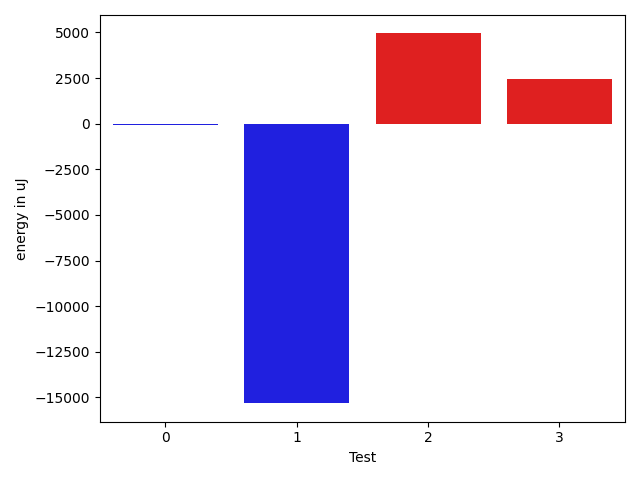

# gson cbc6b4

https://github.com/google/gson/commit/cbc6b4

## Delta Energy per test method

| ID | EnergyV1 | EnergyV2 | DeltaEnergy | σV1 | σV2 |
| --- | --- | --- | --- | --- | --- |
| 0 | 36072 | 36011 | -61 | 45247.36980417315 | 5805.298767314028 |
| 1 | 55420 | 40100 | -15320 | 17041.995294337525 | 20366.416425112922 |
| 2 | 197814 | 202758 | 4944 | 651305.5816669354 | 671700.0158928401 |
| 3 | 67383 | 69824 | 2441 | 73038.62900161858 | 66814.8411064518 |

## Delta Duration per test method

| ID | DurationV1 | DurationsV2 | DeltaDuration |
| --- | --- | --- | --- |
| 0 | 1131234.84 | 846359.9555555555 | -284874.88444444456 |
| 1 | 1967869.7666666666 | 1756889.3461538462 | -210980.42051282036 |
| 2 | 16663666.540816326 | 17666643.755102042 | 1002977.2142857164 |
| 3 | 3082284.8585858587 | 3153632.3535353537 | 71347.49494949495 |

## Misc.

| ID | Test Class | Test Method |
| --- | --- | --- |
| 0 | com.google.gson.functional.PrimitiveTest | testPrimitiveDoubleAutoboxedInASingleElementArraySerialization |
| 1 | com.google.gson.functional.PrimitiveTest | testPrimitiveDoubleAutoboxedSerialization |
| 2 | com.google.gson.functional.NamingPolicyTest | testGsonDuplicateNameUsingSerializedNameFieldNamingPolicySerialization |
| 3 | com.google.gson.functional.ParameterizedTypesTest | testTypesWithMultipleParametersSerialization |

| Test | IterationV1 | IterationV2 | DeltaIteration |
| --- | --- | --- | --- |
| 0 | 50 | 45 | -5 |
| 1 | 60 | 52 | -8 |
| 2 | 98 | 98 | 0 |
| 3 | 99 | 99 | 0 |

| Time Label | Time (s) |
| --- | --- |
| Selection | 22.819229125976562 |
| Injection | 8.321006298065186 |
| Total | 924.8865282535553 |

