# gson fc6566

https://github.com/google/gson/commit/fc6566

## Delta Energy per test method

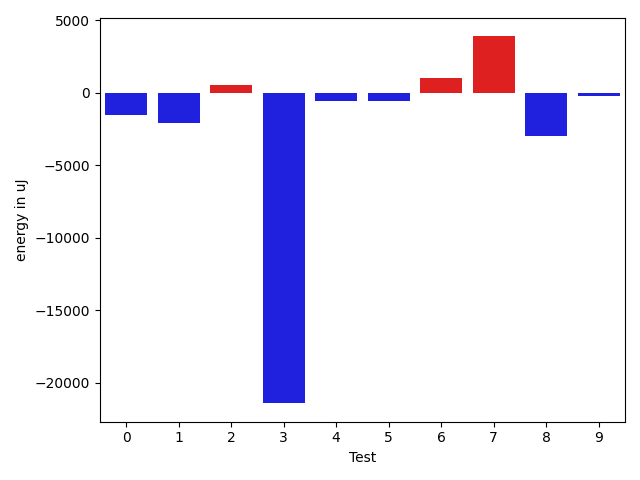

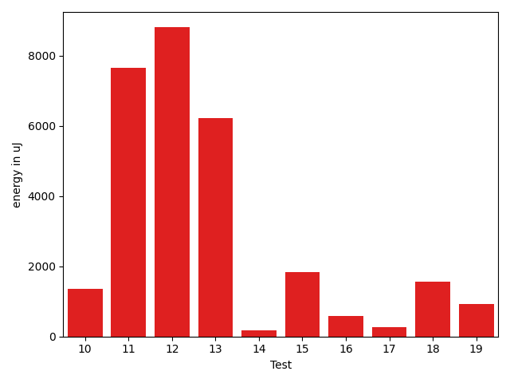

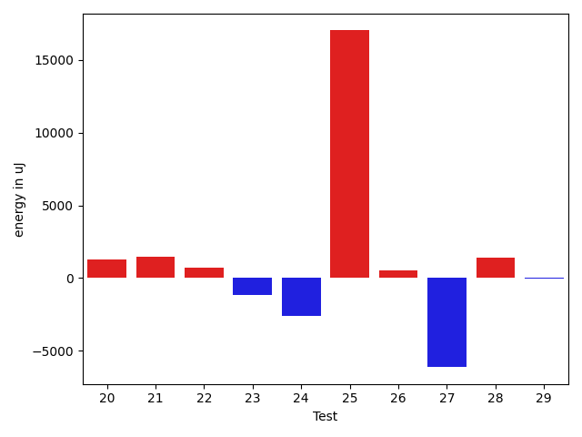

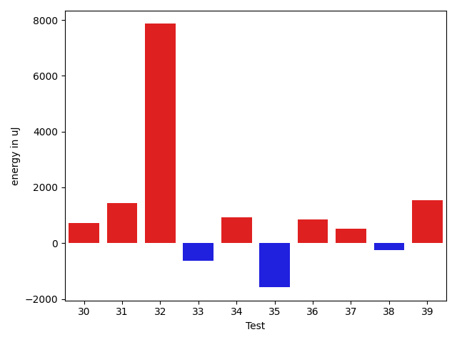

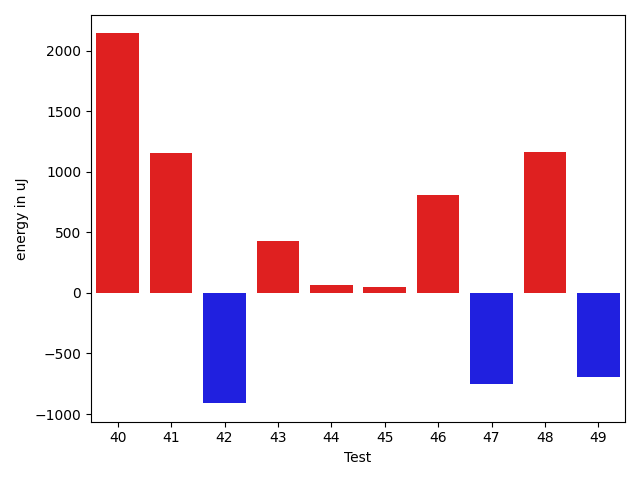

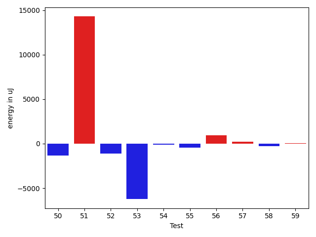

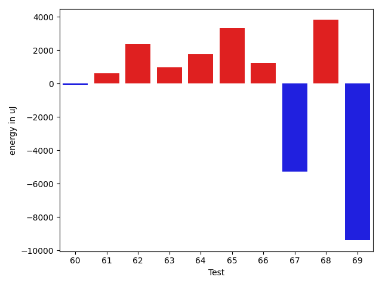

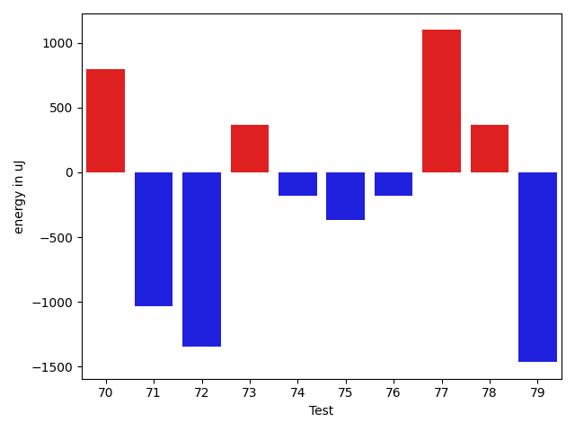

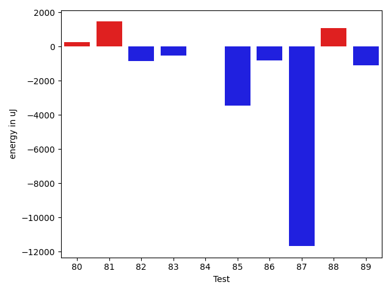

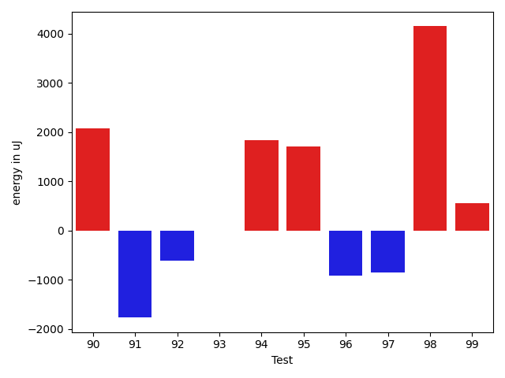

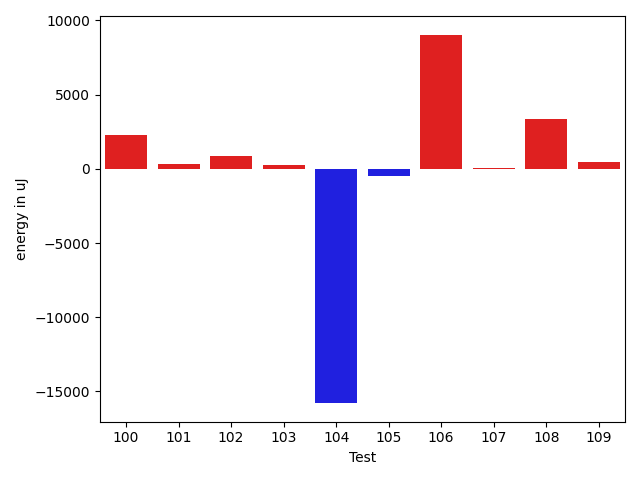

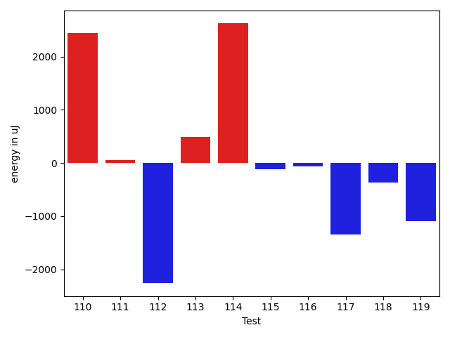

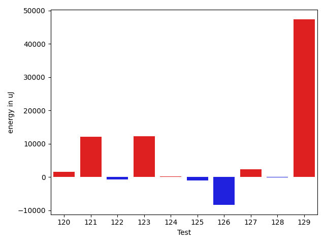

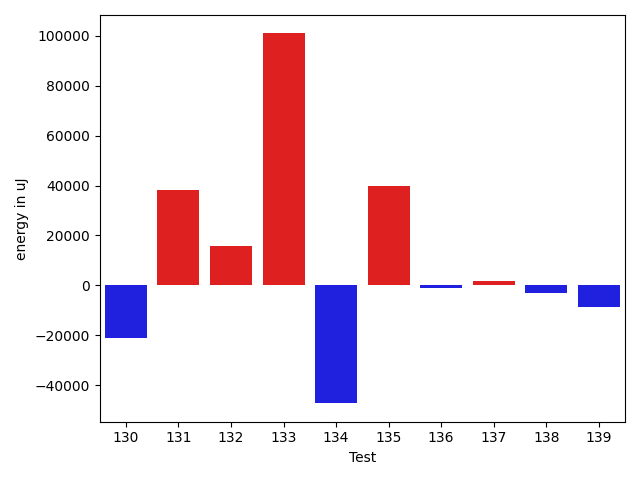

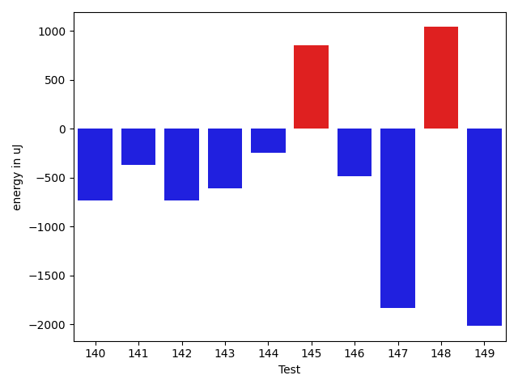

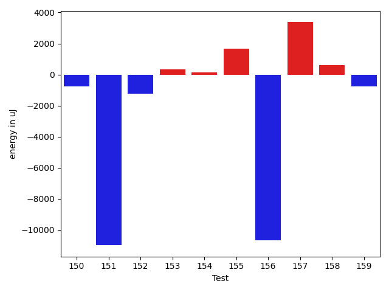

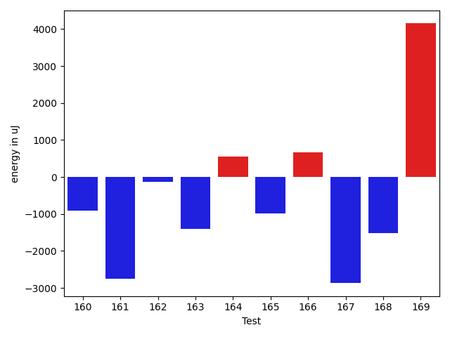

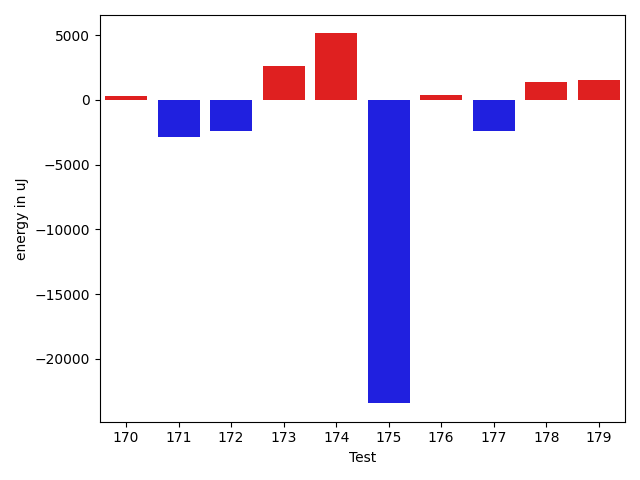

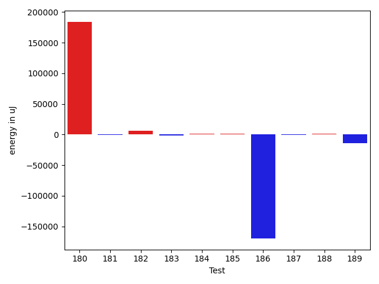

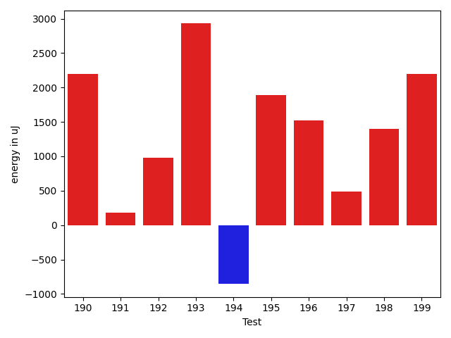

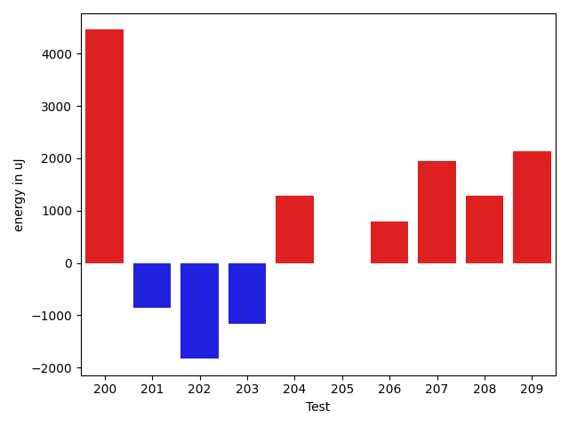

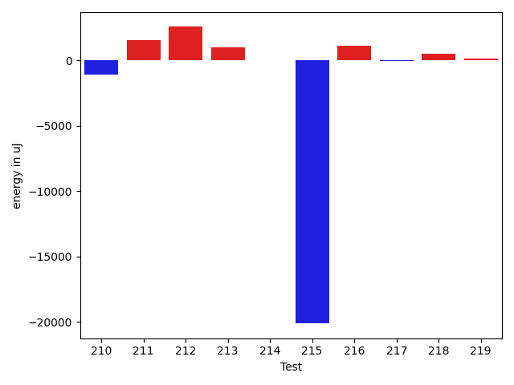

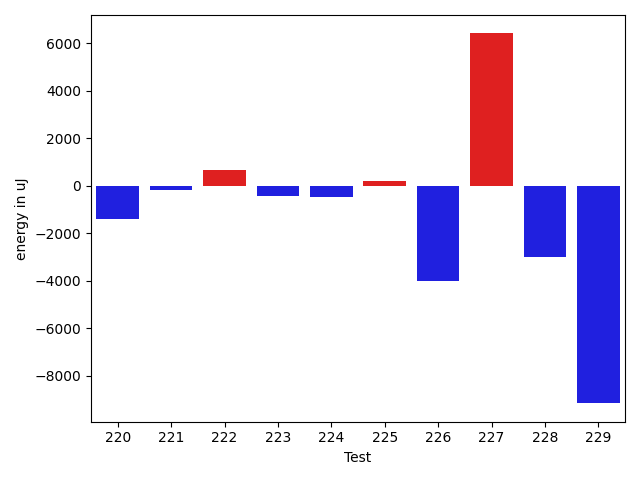

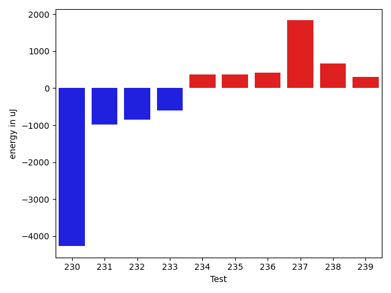

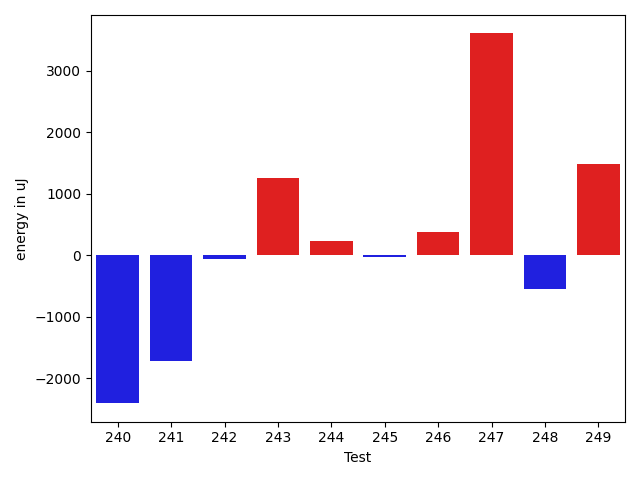

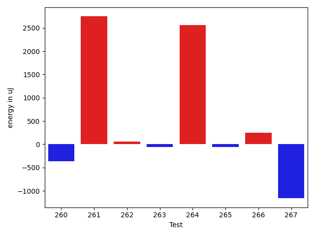

| ID | EnergyV1 | EnergyV2 | DeltaEnergy | σV1 | σV2 |
| --- | --- | --- | --- | --- | --- |
| 0 | 38879 | 37354 | -1525 | 106300.7887403507 | 77366.62610547185 |
| 1 | 37658 | 35584 | -2074 | 4322.905882697558 | 73223.3611495424 |
| 2 | 34118 | 34668 | 550 | 6876.725732998021 | 3658.33667257082 |
| 3 | 60974 | 39551 | -21423 | 31265.84037068305 | 27565.39036958756 |
| 4 | 33630 | 33081 | -549 | 3562.687926903918 | 22824.163605905374 |
| 5 | 38085 | 37537 | -548 | 18539.334464383424 | 20812.134537981485 |
| 6 | 34546 | 35583 | 1037 | 10245.094569360432 | 12306.466739012612 |
| 7 | 32043 | 35949 | 3906 | 3941.361226917215 | 4030.999684921074 |
| 8 | 36255 | 33264 | -2991 | 3095.555524907519 | 4644.022386326486 |
| 9 | 34851 | 34607 | -244 | 6877.33963990823 | 7056.189523508317 |
| 10 | 35400 | 34912 | -488 | 7794.105472245161 | 10413.35671456454 |
| 11 | 64636 | 69458 | 4822 | 40406.88812025872 | 45434.68868413767 |
| 12 | 34058 | 34851 | 793 | 3527.0693740838146 | 36317.3061277113 |
| 13 | 35035 | 33936 | -1099 | 8351.265260574246 | 55823.202834704 |
| 14 | 35950 | 35644 | -306 | 3661.9167297346085 | 2982.403173844547 |
| 15 | 35095 | 34851 | -244 | 7154.80858148093 | 10853.44187968971 |
| 16 | 34912 | 35034 | 122 | 2679.896535858535 | 4406.24816624011 |
| 17 | 34301 | 33813 | -488 | 3416.8879621135216 | 7315.367498070078 |
| 18 | 32776 | 34790 | 2014 | 3684.8652658337996 | 3834.3776039636705 |
| 19 | 33813 | 33142 | -671 | 3317.906021316023 | 4444.325677660142 |
| 20 | 34057 | 34546 | 489 | 6893.6635020760295 | 7771.647644233218 |
| 21 | 31555 | 34729 | 3174 | 3170.7244606291265 | 3388.638787844986 |
| 22 | 33874 | 34668 | 794 | 2971.910737457794 | 4889.530255400893 |
| 23 | 35095 | 34180 | -915 | 4021.3123264662768 | 3680.203625821355 |
| 24 | 34485 | 34607 | 122 | 20588.99632345004 | 3835.094341476451 |
| 25 | 35278 | 35156 | -122 | 72550.90030942346 | 101858.8909468943 |
| 26 | 34424 | 33813 | -611 | 4007.8472438800386 | 4162.610393118476 |
| 27 | 34912 | 35583 | 671 | 41726.883370466334 | 4096.858510908352 |
| 28 | 32959 | 32898 | -61 | 2936.5461109487783 | 5167.000779772706 |
| 29 | 34119 | 34607 | 488 | 3467.2437825702564 | 3436.2636763948917 |
| 30 | 33569 | 33081 | -488 | 2712.2576647304727 | 3934.907041922519 |
| 31 | 34668 | 35217 | 549 | 2828.787036680013 | 4379.274822890201 |
| 32 | 33448 | 33447 | -1 | 3548.88263714401 | 36210.42107864404 |
| 33 | 34424 | 34790 | 366 | 5736.553672469287 | 4283.371472341388 |
| 34 | 33142 | 35095 | 1953 | 3639.319885967707 | 3707.1425471232365 |
| 35 | 37293 | 35888 | -1405 | 15989.575926835822 | 17212.418963467266 |
| 36 | 34484 | 35461 | 977 | 3732.0739220719825 | 4957.000063871091 |
| 37 | 34729 | 35461 | 732 | 4558.478647135345 | 4132.3611022965015 |
| 38 | 33935 | 34180 | 245 | 3357.23962248716 | 3970.2201398894335 |
| 39 | 33081 | 34240 | 1159 | 2827.382201298972 | 3841.4858122270657 |
| 40 | 33325 | 34912 | 1587 | 2458.269903136486 | 4378.227078629067 |
| 41 | 35156 | 35278 | 122 | 3122.999447956893 | 4145.102136158249 |
| 42 | 35034 | 33997 | -1037 | 3491.4361687864293 | 3591.4207707178716 |
| 43 | 34058 | 34485 | 427 | 3609.458401286443 | 3801.378634127361 |
| 44 | 35278 | 33691 | -1587 | 2891.433078941998 | 4319.130533765833 |
| 45 | 33813 | 34546 | 733 | 3344.5711442409006 | 4058.597438570047 |
| 46 | 35339 | 36011 | 672 | 6810.672768708366 | 7863.769697136356 |
| 47 | 34424 | 33508 | -916 | 4010.2989075784612 | 3319.591918814061 |
| 48 | 34667 | 33996 | -671 | 9487.084048351675 | 11832.873977494764 |
| 49 | 34851 | 34668 | -183 | 10197.544207131386 | 9286.609265047286 |
| 50 | 36437 | 35095 | -1342 | 15927.76311859537 | 14725.726133619124 |
| 51 | 78247 | 92529 | 14282 | 77449.69779877119 | 82697.69155619487 |
| 52 | 35217 | 34119 | -1098 | 9141.241329281096 | 9000.8678466961 |
| 53 | 74463 | 68237 | -6226 | 22523.08023745687 | 27273.845933537243 |
| 54 | 35400 | 35278 | -122 | 12618.909987497578 | 11740.562188211878 |
| 55 | 35339 | 34912 | -427 | 56833.784819428474 | 96152.68202880668 |
| 56 | 63294 | 64209 | 915 | 32092.228957408824 | 22084.878019075335 |
| 57 | 36438 | 36682 | 244 | 65882.70146857254 | 46839.80861420511 |
| 58 | 36804 | 36499 | -305 | 46901.680920645675 | 43218.146041593056 |
| 59 | 34912 | 34973 | 61 | 9668.705727860537 | 9599.961411169093 |
| 60 | 37842 | 39917 | 2075 | 18422.430555645857 | 16257.312396848927 |
| 61 | 33447 | 33020 | -427 | 3761.0270226524076 | 6009.767239932056 |
| 62 | 36926 | 35584 | -1342 | 4833.2149169176555 | 22129.042131987684 |
| 63 | 35095 | 35095 | 0 | 7129.3556306401515 | 21473.619016347086 |
| 64 | 35523 | 35949 | 426 | 32514.821634423388 | 34504.92975809471 |
| 65 | 34607 | 39551 | 4944 | 4499.429408269453 | 5751.275492182778 |
| 66 | 34790 | 36194 | 1404 | 3866.677716829731 | 3490.1620908984787 |
| 67 | 68908 | 68176 | -732 | 29308.61805957393 | 24552.820247921052 |
| 68 | 36499 | 36377 | -122 | 24449.028208178835 | 30439.545779834756 |
| 69 | 36560 | 37231 | 671 | 58478.161482569696 | 31570.637568534894 |
| 70 | 34790 | 35584 | 794 | 3780.7292055217026 | 6163.9179311075 |
| 71 | 36377 | 35340 | -1037 | 10107.612447939351 | 9418.883548140178 |
| 72 | 36438 | 35095 | -1343 | 3483.572011439506 | 4690.842280144729 |
| 73 | 37170 | 37537 | 367 | 251380.33583183706 | 140075.47051043974 |
| 74 | 35766 | 35583 | -183 | 3579.5592418132946 | 3899.5485249224494 |
| 75 | 35217 | 34851 | -366 | 6151.975034606487 | 6294.676086264511 |
| 76 | 35339 | 35156 | -183 | 4515.942449025296 | 4149.9593865964525 |
| 77 | 32593 | 33691 | 1098 | 3259.1168215633547 | 4066.5714938121664 |
| 78 | 36133 | 36499 | 366 | 23405.55339535648 | 4456.159264754475 |
| 79 | 34851 | 33386 | -1465 | 3509.6357987688693 | 3329.4623002337307 |
| 80 | 34668 | 34790 | 122 | 4064.0153749034366 | 4128.12487698713 |
| 81 | 34424 | 35462 | 1038 | 3513.102107349951 | 4119.7099930204795 |
| 82 | 33936 | 32959 | -977 | 5570.913543809837 | 3584.428047135923 |
| 83 | 34546 | 32837 | -1709 | 3450.9697252667156 | 2959.160874715834 |
| 84 | 35461 | 34668 | -793 | 4117.9562455912 | 3668.167136403352 |
| 85 | 33630 | 35888 | 2258 | 25926.46033674426 | 3758.300342229184 |
| 86 | 34606 | 33325 | -1281 | 3567.797433248048 | 4252.115536885358 |
| 87 | 34668 | 33630 | -1038 | 39695.566998683105 | 3992.948342908508 |
| 88 | 34424 | 34729 | 305 | 3552.0314783605013 | 3455.503453571861 |
| 89 | 35278 | 33630 | -1648 | 2931.503260857994 | 3552.279135979795 |
| 90 | 33020 | 35095 | 2075 | 3735.7516281867565 | 3281.1934714275494 |
| 91 | 32592 | 30822 | -1770 | 2919.202081598647 | 4517.615960541816 |
| 92 | 33691 | 33081 | -610 | 3355.3363129279883 | 4267.630451042671 |
| 93 | 33692 | 33692 | 0 | 3088.0160291186558 | 4321.69483784639 |
| 94 | 33631 | 35461 | 1830 | 3984.976021257844 | 2486.160164010177 |
| 95 | 34302 | 36011 | 1709 | 4567.002516117352 | 3843.370263993516 |
| 96 | 33691 | 32776 | -915 | 2902.1955368748086 | 3440.2177843628087 |
| 97 | 36560 | 35705 | -855 | 5283.443413153963 | 2996.194837478403 |
| 98 | 56762 | 60913 | 4151 | 19560.694501899463 | 19777.959898145502 |
| 99 | 34180 | 34729 | 549 | 2726.6815632743032 | 30177.1508880313 |
| 100 | 35034 | 35278 | 244 | 25436.244902125673 | 31093.66104373195 |
| 101 | 35706 | 34973 | -733 | 3847.256522344785 | 4128.443911558739 |
| 102 | 34424 | 37414 | 2990 | 4691.882871513312 | 4805.645366212791 |
| 103 | 34790 | 35278 | 488 | 3659.516650626273 | 3462.5478333539145 |
| 104 | 40466 | 37353 | -3113 | 34115.11763522597 | 3354.0298015554695 |
| 105 | 32715 | 32654 | -61 | 4657.9063330025 | 3442.5746851764525 |
| 106 | 36621 | 37292 | 671 | 56017.51685246581 | 74371.03886593398 |
| 107 | 34118 | 34546 | 428 | 4513.9430337055055 | 3391.016424154989 |
| 108 | 35095 | 36621 | 1526 | 7211.647838615262 | 10438.799269591711 |
| 109 | 34301 | 34606 | 305 | 3689.144016348654 | 3449.2480299156064 |
| 110 | 33142 | 35583 | 2441 | 3844.462362173242 | 3236.9535723813005 |
| 111 | 35767 | 35828 | 61 | 3999.527365568211 | 3440.633510070098 |
| 112 | 35706 | 33447 | -2259 | 3423.3480523458315 | 49846.16167133713 |
| 113 | 32836 | 33325 | 489 | 3195.7490929836968 | 3294.1110836760226 |
| 114 | 33631 | 36255 | 2624 | 2930.4377232761663 | 5120.209474020691 |
| 115 | 34179 | 34058 | -121 | 3865.647088134146 | 2958.990103016917 |
| 116 | 36194 | 36133 | -61 | 3727.523388172769 | 3975.8117460187314 |
| 117 | 125122 | 123779 | -1343 | 36545.170231669574 | 39544.28851818101 |
| 118 | 36133 | 35767 | -366 | 3722.686815267431 | 4520.0951817562745 |
| 119 | 40100 | 39002 | -1098 | 37441.68330787913 | 30070.342436478095 |
| 120 | 35705 | 38147 | 2442 | 4093.529982247053 | 8457.623343948297 |
| 121 | 82885 | 95642 | 12757 | 76295.47519951258 | 88994.67983930872 |
| 122 | 36987 | 37293 | 306 | 12675.347835964749 | 10266.886168745783 |
| 123 | 37231 | 38025 | 794 | 96447.40928983837 | 70680.31052122173 |
| 124 | 34912 | 35584 | 672 | 4597.979938581724 | 4206.075200172504 |
| 125 | 35095 | 33874 | -1221 | 4231.720313051061 | 4065.4870366902396 |
| 126 | 38086 | 35461 | -2625 | 44942.94889232075 | 26351.00649918329 |
| 127 | 34729 | 37354 | 2625 | 3143.9144081153922 | 4327.708123244913 |
| 128 | 36072 | 36927 | 855 | 3592.1730560292904 | 5071.110366576535 |
| 129 | 35645 | 36315 | 670 | 8577.445864734384 | 265379.7823880327 |
| 130 | 35888 | 37109 | 1221 | 155748.23129849145 | 7072.307521078755 |
| 131 | 64819 | 67505 | 2686 | 45923.87040482524 | 186400.45634965645 |
| 132 | 36804 | 36438 | -366 | 53338.264825717444 | 217249.90282522741 |
| 133 | 35157 | 37720 | 2563 | 3646.0215983788244 | 337675.3467887872 |
| 134 | 38025 | 36804 | -1221 | 372631.9570408611 | 294346.6813358044 |
| 135 | 35706 | 36804 | 1098 | 3578.1818356722665 | 235951.84650027403 |
| 136 | 35278 | 33753 | -1525 | 3414.0129407870722 | 3753.1669109199615 |
| 137 | 33325 | 34485 | 1160 | 3234.6419980926294 | 3958.620470781273 |
| 138 | 34790 | 34912 | 122 | 19242.898333273275 | 3949.101565335252 |
| 139 | 37597 | 37170 | -427 | 54931.64846107081 | 38405.62142860622 |
| 140 | 36132 | 35400 | -732 | 22804.579918930514 | 3451.4423873634746 |
| 141 | 36010 | 35644 | -366 | 4326.890111482395 | 3802.428810408533 |
| 142 | 36377 | 35645 | -732 | 9594.674619901143 | 9645.073045463356 |
| 143 | 33752 | 33142 | -610 | 3782.270037249631 | 5687.022851906647 |
| 144 | 34546 | 34302 | -244 | 4092.1109119323196 | 3413.2949035048787 |
| 145 | 35034 | 35889 | 855 | 3806.0496484249907 | 4255.69241814999 |
| 146 | 34423 | 33935 | -488 | 3308.905109777282 | 4005.9086254698946 |
| 147 | 35400 | 33569 | -1831 | 3885.7056839754787 | 3797.9399894902517 |
| 148 | 35278 | 36316 | 1038 | 4062.3866403843854 | 4760.022819370692 |
| 149 | 37781 | 35766 | -2015 | 42565.27942755729 | 37514.257652942535 |
| 150 | 35095 | 34302 | -793 | 3827.4802271061953 | 3874.0477347591623 |
| 151 | 39795 | 38086 | -1709 | 75776.2704451417 | 54946.125025175774 |
| 152 | 35278 | 33203 | -2075 | 3565.8842632443484 | 3532.172323636495 |
| 153 | 34118 | 34423 | 305 | 4254.639398729713 | 3676.9838520886533 |
| 154 | 34973 | 34119 | -854 | 3815.4492029771036 | 3677.73032325353 |
| 155 | 35400 | 38818 | 3418 | 12083.475809704334 | 13075.470231654726 |
| 156 | 39795 | 36926 | -2869 | 62358.975309762696 | 47991.06080281611 |
| 157 | 33447 | 37537 | 4090 | 3310.213266039919 | 4548.320409777658 |
| 158 | 37048 | 36559 | -489 | 5482.949746986365 | 3681.5301798089 |
| 159 | 37719 | 36621 | -1098 | 4073.94301165618 | 4633.143475007007 |
| 160 | 37109 | 36194 | -915 | 3323.9363365189124 | 3883.3807512490453 |
| 161 | 37598 | 34851 | -2747 | 3262.236273811699 | 4771.278047775425 |
| 162 | 35522 | 35400 | -122 | 4512.553695463616 | 5069.632131091796 |
| 163 | 35034 | 33630 | -1404 | 3594.6805867605726 | 4361.3253482410455 |
| 164 | 38574 | 39123 | 549 | 21164.94627487114 | 48233.2229961378 |
| 165 | 34973 | 33997 | -976 | 3440.799280327174 | 4829.185393262512 |
| 166 | 36499 | 37170 | 671 | 25888.128458571508 | 3871.5533927779165 |
| 167 | 37964 | 35095 | -2869 | 26568.769549191114 | 3258.8944297600356 |
| 168 | 37170 | 35644 | -1526 | 3333.02261885181 | 3470.5808378484453 |
| 169 | 34118 | 38269 | 4151 | 3252.4996413773456 | 3788.6233088536114 |
| 170 | 35400 | 35706 | 306 | 3856.3923763019757 | 3157.6649914687127 |
| 171 | 37781 | 34912 | -2869 | 4489.115949716603 | 3306.717971040167 |
| 172 | 36682 | 34301 | -2381 | 4265.4353561832095 | 3893.8428354904104 |
| 173 | 33264 | 35888 | 2624 | 3646.0127732712544 | 3202.2459501106405 |
| 174 | 83130 | 88256 | 5126 | 372039.005202303 | 292389.4477881268 |
| 175 | 63476 | 40039 | -23437 | 165187.7105749881 | 38865.55972583514 |
| 176 | 35278 | 35645 | 367 | 10250.531131538135 | 10215.28683732064 |
| 177 | 76599 | 74157 | -2442 | 61688.570514479296 | 64668.77204054928 |
| 178 | 35706 | 37109 | 1403 | 57707.383633126316 | 49888.352357059266 |
| 179 | 34484 | 36011 | 1527 | 4132.971010626753 | 6572.781923156009 |
| 180 | 36682 | 170410 | 133728 | 43829.84275804099 | 272137.32514352835 |
| 181 | 37048 | 35278 | -1770 | 3820.3119170194354 | 5854.308355755019 |
| 182 | 37170 | 38452 | 1282 | 35882.804107062606 | 38218.67195625632 |
| 183 | 37414 | 36499 | -915 | 5718.0458123345925 | 3374.989603203008 |
| 184 | 35400 | 35339 | -61 | 4267.450654540633 | 8081.842483698826 |
| 185 | 34667 | 35095 | 428 | 4726.02989915429 | 3763.5552865690347 |
| 186 | 172852 | 36865 | -135987 | 205864.72690649255 | 50055.66209401428 |
| 187 | 34912 | 34607 | -305 | 4506.96039632718 | 3769.0704102321206 |
| 188 | 35034 | 36926 | 1892 | 4031.658242894603 | 4013.236796290964 |
| 189 | 38086 | 38024 | -62 | 56806.12194852792 | 36505.119886697306 |
| 190 | 35462 | 37658 | 2196 | 78824.61809396859 | 10509.054202812657 |
| 191 | 36743 | 36926 | 183 | 4471.934720917576 | 4292.2656640301575 |
| 192 | 35157 | 36132 | 975 | 29905.791508241342 | 4685.297062441936 |
| 193 | 34790 | 37719 | 2929 | 3385.0655700436305 | 4520.142902715509 |
| 194 | 35217 | 34362 | -855 | 3705.85233320967 | 4193.253661014884 |
| 195 | 35400 | 37292 | 1892 | 3661.888139410537 | 3959.2888719923035 |
| 196 | 37415 | 38940 | 1525 | 21234.13152819089 | 19593.82221312052 |
| 197 | 35522 | 36010 | 488 | 4440.556605393793 | 4624.412698170304 |
| 198 | 36743 | 38147 | 1404 | 31706.03797111245 | 23297.66620643936 |
| 199 | 39367 | 41564 | 2197 | 97332.89349680151 | 81207.25627214002 |
| 200 | 34119 | 38574 | 4455 | 3278.72596100004 | 4461.747581190679 |
| 201 | 38574 | 37719 | -855 | 51799.318051445814 | 54006.642327372625 |
| 202 | 39672 | 37842 | -1830 | 44722.419107996626 | 61739.516255898845 |
| 203 | 36377 | 35218 | -1159 | 3976.9779153074232 | 4357.416493579734 |
| 204 | 35340 | 36621 | 1281 | 4411.194248546837 | 3146.3634279691337 |
| 205 | 35278 | 35278 | 0 | 3334.978309138926 | 3027.8728868359995 |
| 206 | 35462 | 36255 | 793 | 27499.884167097498 | 27036.689255023346 |
| 207 | 35400 | 37353 | 1953 | 3822.78085790022 | 4383.1466651357605 |
| 208 | 34058 | 35339 | 1281 | 4152.934129122847 | 3784.7864206500485 |
| 209 | 33386 | 35522 | 2136 | 3743.2809646321653 | 3497.240856830362 |
| 210 | 37536 | 36621 | -915 | 7995.591592641767 | 6316.59128361448 |
| 211 | 35095 | 36621 | 1526 | 3450.4441269884933 | 4782.433036237282 |
| 212 | 34179 | 36438 | 2259 | 4930.283435057258 | 4060.3937484301014 |
| 213 | 34546 | 35705 | 1159 | 4863.937625195371 | 5945.582435708641 |
| 214 | 34851 | 35156 | 305 | 8730.793367696679 | 7299.03938248151 |
| 215 | 38208 | 38758 | 550 | 80424.11433105927 | 38468.71858402862 |
| 216 | 34790 | 36255 | 1465 | 4031.167792422086 | 4573.261097127519 |
| 217 | 35888 | 35095 | -793 | 2992.430302957039 | 4203.161396029706 |
| 218 | 34118 | 35400 | 1282 | 4174.797962195048 | 3729.284510465781 |
| 219 | 34484 | 34912 | 428 | 3658.161833489601 | 3877.7276053921896 |
| 220 | 37171 | 35766 | -1405 | 3786.6768048481513 | 3651.1452501585172 |
| 221 | 37049 | 36865 | -184 | 64310.08173283832 | 21841.622189079273 |
| 222 | 33936 | 34607 | 671 | 4097.013313270551 | 3999.899925773767 |
| 223 | 35461 | 35034 | -427 | 3555.0937771877925 | 3800.7147150862907 |
| 224 | 34973 | 34485 | -488 | 4164.729326607591 | 4283.404173980961 |
| 225 | 34729 | 34912 | 183 | 3330.4567861529345 | 2889.420158862733 |
| 226 | 41138 | 37109 | -4029 | 29404.038359104543 | 28841.815636304404 |
| 227 | 65491 | 71899 | 6408 | 41362.20037375179 | 24673.88963199934 |
| 228 | 39795 | 36804 | -2991 | 73786.06868019399 | 72627.76694825888 |
| 229 | 257689 | 248535 | -9154 | 87755.9829418275 | 84241.45926146684 |
| 230 | 371337 | 367065 | -4272 | 109582.45771606306 | 120558.32106363404 |
| 231 | 40588 | 39612 | -976 | 55625.472296693406 | 64831.37924761322 |
| 232 | 39551 | 38697 | -854 | 58172.77052521642 | 53200.04570194964 |
| 233 | 33752 | 33142 | -610 | 3822.5863110726486 | 5911.50081245236 |
| 234 | 36315 | 36682 | 367 | 13708.429290638602 | 13123.786294792142 |
| 235 | 34119 | 34485 | 366 | 3706.4821632997923 | 4230.5891410769345 |
| 236 | 34424 | 34851 | 427 | 35854.55020599708 | 5474.902728922353 |
| 237 | 143920 | 145752 | 1832 | 40998.48363277501 | 36673.028505946706 |
| 238 | 37903 | 38574 | 671 | 13896.602613847526 | 16923.523572820835 |
| 239 | 33630 | 33935 | 305 | 30969.424335316857 | 3838.3831209845844 |
| 240 | 35705 | 32714 | -2991 | 4024.594365534672 | 2816.1358996805675 |
| 241 | 36805 | 33142 | -3663 | 3164.3982531279985 | 4978.1728024062495 |
| 242 | 33508 | 33020 | -488 | 4186.871740718866 | 3612.5707195886052 |
| 243 | 35828 | 36926 | 1098 | 8991.084454428546 | 7961.545036050084 |
| 244 | 33325 | 33692 | 367 | 3507.939530488799 | 3787.535547824049 |
| 245 | 34790 | 34240 | -550 | 3067.764673097689 | 3905.432866311222 |
| 246 | 34729 | 34790 | 61 | 3119.3958081263477 | 4168.366667698365 |
| 247 | 37476 | 37597 | 121 | 32558.66010414419 | 36847.7610861396 |
| 248 | 35766 | 36011 | 245 | 4225.854094535665 | 5120.452658457063 |
| 249 | 34973 | 33814 | -1159 | 3254.390434565545 | 4707.277123599943 |
| 250 | 35400 | 35278 | -122 | 3569.1556943302953 | 3893.8619014978576 |
| 251 | 34058 | 36560 | 2502 | 3285.389585060436 | 3067.2891860105533 |
| 252 | 36255 | 34790 | -1465 | 3825.449829758587 | 4400.429472841775 |
| 253 | 35034 | 35462 | 428 | 3274.977692884165 | 4076.844606151715 |
| 254 | 41748 | 37963 | -3785 | 73906.3535932332 | 62387.95009206506 |
| 255 | 35156 | 35766 | 610 | 3408.264863342963 | 5168.217011852078 |
| 256 | 35217 | 35766 | 549 | 2989.3409155489444 | 4982.431237370363 |
| 257 | 36987 | 34545 | -2442 | 3968.6129396578785 | 4389.606485653228 |
| 258 | 37597 | 38940 | 1343 | 44800.77499414734 | 52824.85757231528 |
| 259 | 37415 | 37780 | 365 | 90018.58158373545 | 145681.07844153958 |
| 260 | 38391 | 38025 | -366 | 416113.4265173416 | 417590.36224111234 |
| 261 | 36255 | 39002 | 2747 | 4866.765716901717 | 44546.280729209655 |
| 262 | 36804 | 36866 | 62 | 3057.752534542323 | 6757.58339783423 |
| 263 | 37598 | 37537 | -61 | 59614.885109355026 | 72855.65519285547 |
| 264 | 35583 | 38147 | 2564 | 5151.308351127416 | 3579.2546911395284 |
| 265 | 37292 | 37231 | -61 | 59186.325418358065 | 56697.66245775664 |
| 266 | 38391 | 38635 | 244 | 94557.93551259817 | 92523.86993091412 |
| 267 | 38635 | 37475 | -1160 | 4110.863776625191 | 4051.7807758789604 |

## Delta Duration per test method

| ID | DurationV1 | DurationsV2 | DeltaDuration |
| --- | --- | --- | --- |
| 0 | 2149663.9552238807 | 1561676.6607142857 | -587987.294509595 |
| 1 | 737746.8636363636 | 1166870.0188679246 | 429123.15523156093 |
| 2 | 893500.5 | 941443.3333333334 | 47942.83333333337 |
| 3 | 1898122.7976190476 | 1865456.6043956045 | -32666.193223443115 |
| 4 | 767887.8301886793 | 945204.7555555556 | 177316.9253668763 |
| 5 | 1520236.8988764044 | 1551083.1860465116 | 30846.287170107244 |
| 6 | 1081032.3417721519 | 1218938.4794520547 | 137906.13767990284 |
| 7 | 529790.4827586206 | 480379.5789473684 | -49410.90381125221 |
| 8 | 582489.2058823529 | 642699.2424242424 | 60210.03654188954 |
| 9 | 1011626.2 | 1041870.1194029851 | 30243.919402985135 |
| 10 | 1048558.5443037974 | 1098922.0 | 50363.45569620258 |
| 11 | 2355304.616161616 | 2546687.898989899 | 191383.28282828303 |
| 12 | 792984.74 | 1069449.0158730159 | 276464.27587301587 |
| 13 | 882185.679245283 | 1130968.0847457626 | 248782.40550047962 |
| 14 | 551682.0 | 580283.1111111111 | 28601.111111111124 |
| 15 | 964890.9846153846 | 1023887.8472222222 | 58996.86260683765 |
| 16 | 626238.0882352941 | 704269.6666666666 | 78031.57843137253 |
| 17 | 805963.1372549019 | 831130.4693877551 | 25167.33213285322 |
| 18 | 724041.7413793104 | 780801.4042553192 | 56759.66287600878 |
| 19 | 525879.0967741936 | 617117.1212121212 | 91238.02443792764 |
| 20 | 901698.9574468085 | 978137.1090909091 | 76438.15164410067 |
| 21 | 510735.724137931 | 501041.94736842107 | -9693.776769509946 |
| 22 | 727874.1276595745 | 703454.8095238095 | -24419.318135765032 |
| 23 | 542424.3529411765 | 676509.1764705882 | 134084.8235294117 |
| 24 | 925196.4626865672 | 887950.1481481482 | -37246.314538419014 |
| 25 | 1367216.1666666667 | 1895362.1818181819 | 528146.0151515151 |
| 26 | 585607.0588235294 | 621802.6 | 36195.54117647058 |
| 27 | 783564.90625 | 620504.4545454546 | -163060.4517045454 |
| 28 | 425573.22222222225 | 446167.84210526315 | 20594.619883040898 |
| 29 | 604725.8918918918 | 762049.09375 | 157323.20185810816 |
| 30 | 414607.94736842107 | 437183.9285714286 | 22575.98120300751 |
| 31 | 596312.8 | 669577.48 | 73264.67999999993 |
| 32 | 525337.8333333334 | 823253.0416666666 | 297915.20833333326 |
| 33 | 669979.4893617021 | 823961.7619047619 | 153982.27254305978 |
| 34 | 671336.64 | 707252.5555555555 | 35915.91555555549 |
| 35 | 916606.8536585366 | 862476.0612244898 | -54130.79243404674 |
| 36 | 576534.3448275862 | 602506.2352941176 | 25971.89046653139 |
| 37 | 415426.8333333333 | 454750.2173913043 | 39323.38405797101 |
| 38 | 456630.0869565217 | 725499.6428571428 | 268869.5559006211 |
| 39 | 509569.3 | 549979.8148148148 | 40410.514814814844 |
| 40 | 437089.6666666667 | 403772.78571428574 | -33316.88095238095 |
| 41 | 602114.6315789474 | 626862.2857142857 | 24747.654135338264 |
| 42 | 315587.53846153844 | 405511.375 | 89923.83653846156 |
| 43 | 550459.9444444445 | 512684.4 | -37775.54444444447 |
| 44 | 511601.28571428574 | 666858.0416666666 | 155256.7559523809 |
| 45 | 319395.8333333333 | 423409.78571428574 | 104013.95238095243 |
| 46 | 651663.9310344828 | 818420.28 | 166756.34896551725 |
| 47 | 946948.5625 | 960538.4153846154 | 13589.852884615422 |
| 48 | 850560.2380952381 | 915176.0181818182 | 64615.78008658008 |
| 49 | 1247623.1368421053 | 1260968.6842105263 | 13345.547368420986 |
| 50 | 1307219.2872340425 | 1314338.0112359552 | 7118.724001912633 |
| 51 | 3160964.723404255 | 3438390.4210526315 | 277425.6976483762 |
| 52 | 1193134.1162790698 | 1266190.426966292 | 73056.31068722229 |
| 53 | 2655734.8585858587 | 2391980.2525252528 | -263754.60606060596 |
| 54 | 1394565.6304347827 | 1353094.7216494845 | -41470.908785298234 |
| 55 | 1595366.142857143 | 2045929.8505747127 | 450563.7077175698 |
| 56 | 1941013.2626262626 | 1905865.2222222222 | -35148.04040404037 |
| 57 | 1661020.4642857143 | 1639896.8352941177 | -21123.628991596634 |
| 58 | 1927721.1134020619 | 1968082.8105263158 | 40361.69712425396 |
| 59 | 1232891.831460674 | 1232241.6195652173 | -650.2118954567704 |
| 60 | 1579344.313131313 | 1595425.3434343433 | 16081.030303030275 |
| 61 | 1036557.1025641026 | 1062091.8607594937 | 25534.75819539104 |
| 62 | 806245.948275862 | 885559.2631578947 | 79313.31488203269 |
| 63 | 1058280.0833333333 | 1068657.506849315 | 10377.423515981762 |
| 64 | 1148305.253968254 | 1221247.8507462686 | 72942.59677801467 |
| 65 | 453845.0909090909 | 424870.3076923077 | -28974.783216783195 |
| 66 | 876535.4179104478 | 887291.5263157894 | 10756.108405341627 |
| 67 | 2263557.777777778 | 2153449.97979798 | -110107.79797979817 |
| 68 | 1248161.8378378379 | 1354781.4117647058 | 106619.57392686792 |
| 69 | 1375322.3389830508 | 1070919.353846154 | -304402.98513689684 |
| 70 | 1015490.1710526316 | 1054759.357142857 | 39269.18609022547 |
| 71 | 1079889.028169014 | 1069002.1304347827 | -10886.897734231316 |
| 72 | 772196.195652174 | 722463.0784313725 | -49733.11722080142 |
| 73 | 2257174.0634920634 | 1514927.1515151516 | -742246.9119769118 |
| 74 | 471275.4210526316 | 471384.46153846156 | 109.04048582998803 |
| 75 | 956011.8219178083 | 1003788.6578947369 | 47776.83597692859 |
| 76 | 799498.1842105263 | 772058.12 | -27440.064210526296 |
| 77 | 655908.5416666666 | 443071.39285714284 | -212837.1488095238 |
| 78 | 670675.5757575758 | 562213.7142857143 | -108461.86147186148 |
| 79 | 467860.64 | 526805.8636363636 | 58945.22363636363 |
| 80 | 641472.3157894737 | 669850.36 | 28378.044210526277 |
| 81 | 386075.75 | 494291.0 | 108215.25 |
| 82 | 948769.7368421053 | 846106.0697674418 | -102663.66707466345 |
| 83 | 591542.9230769231 | 661354.3142857143 | 69811.39120879117 |
| 84 | 460333.6296296296 | 504967.5238095238 | 44633.89417989418 |
| 85 | 671547.40625 | 533442.04 | -138105.36624999996 |
| 86 | 551449.6388888889 | 568590.9032258064 | 17141.26433691755 |
| 87 | 840479.7857142857 | 383372.3888888889 | -457107.3968253968 |
| 88 | 386390.5833333333 | 394153.4705882353 | 7762.887254901987 |
| 89 | 511652.1052631579 | 487269.7727272727 | -24382.332535885216 |
| 90 | 347377.7 | 375642.85714285716 | 28265.157142857148 |
| 91 | 341145.44444444444 | 311029.0 | -30116.444444444438 |
| 92 | 398216.7894736842 | 402636.0833333333 | 4419.2938596491 |
| 93 | 428951.8125 | 464720.5789473684 | 35768.76644736843 |
| 94 | 390597.7 | 446198.77777777775 | 55601.07777777774 |
| 95 | 395357.5333333333 | 351652.94736842107 | -43704.58596491226 |
| 96 | 437903.70588235295 | 725486.3461538461 | 287582.6402714932 |
| 97 | 475837.9 | 446197.36363636365 | -29640.536363636376 |
| 98 | 1507026.1351351351 | 1804700.8378378379 | 297674.7027027027 |
| 99 | 419376.3 | 645546.4090909091 | 226170.10909090907 |
| 100 | 722608.1842105263 | 775250.9736842106 | 52642.78947368427 |
| 101 | 505742.0 | 553178.1842105263 | 47436.18421052629 |
| 102 | 416982.4 | 413077.3333333333 | -3905.0666666667094 |
| 103 | 523142.8125 | 538138.625 | 14995.8125 |
| 104 | 1049004.7857142857 | 357605.8333333333 | -691398.9523809524 |
| 105 | 459658.54545454547 | 509776.23076923075 | 50117.68531468528 |
| 106 | 1470969.7586206896 | 1838382.2916666667 | 367412.5330459771 |
| 107 | 480561.8076923077 | 471814.2916666667 | -8747.516025641002 |
| 108 | 796478.695652174 | 819900.1923076923 | 23421.496655518305 |
| 109 | 536436.6451612903 | 520919.16279069765 | -15517.482370592654 |
| 110 | 363009.3333333333 | 371164.9090909091 | 8155.575757575803 |
| 111 | 387104.8461538461 | 348077.94444444444 | -39026.90170940169 |
| 112 | 433540.75 | 926557.7142857143 | 493016.9642857143 |
| 113 | 453975.0 | 401532.8333333333 | -52442.166666666686 |
| 114 | 310689.5 | 316995.0909090909 | 6305.590909090883 |
| 115 | 380642.8 | 401806.45454545453 | 21163.65454545454 |
| 116 | 419740.5 | 427571.51851851854 | 7831.01851851854 |
| 117 | 3973651.8282828284 | 3880450.9292929294 | -93200.89898989908 |
| 118 | 726369.3541666666 | 718426.9069767442 | -7942.4471899224445 |
| 119 | 1458947.5 | 1268934.2711864407 | -190013.22881355928 |
| 120 | 520492.73333333334 | 580776.4545454546 | 60283.72121212125 |
| 121 | 3603312.5773195876 | 3813930.826530612 | 210618.2492110245 |
| 122 | 1003696.3157894737 | 1013666.0181818182 | 9969.70239234448 |
| 123 | 1581092.76 | 2089677.6857142858 | 508584.9257142858 |
| 124 | 709507.26 | 737576.8888888889 | 28069.628888888867 |
| 125 | 639626.4864864865 | 678967.4358974359 | 39340.94941094937 |
| 126 | 926859.6785714285 | 787572.08 | -139287.59857142856 |
| 127 | 472967.1666666667 | 476369.26666666666 | 3402.0999999999767 |
| 128 | 520090.5909090909 | 503741.3 | -16349.290909090894 |
| 129 | 661502.4285714285 | 1880855.1818181819 | 1219352.7532467535 |
| 130 | 1483861.44 | 855589.7692307692 | -628271.6707692307 |
| 131 | 2254912.612244898 | 3340023.2268041237 | 1085110.6145592257 |
| 132 | 1639246.2580645161 | 1999386.2586206896 | 360140.0005561735 |
| 133 | 668406.5789473684 | 3918769.7027027025 | 3250363.123755334 |
| 134 | 3631456.1153846155 | 2233696.96 | -1397759.1553846155 |
| 135 | 683481.9117647059 | 1838844.1025641025 | 1155362.1907993965 |
| 136 | 591077.2352941176 | 737316.2 | 146238.96470588236 |
| 137 | 693950.9803921569 | 647263.0638297872 | -46687.916562369675 |
| 138 | 851154.7777777778 | 725729.9777777778 | -125424.79999999993 |
| 139 | 1682854.9295774647 | 1442511.430379747 | -240343.49919771776 |
| 140 | 899877.0666666667 | 746635.406779661 | -153241.6598870057 |
| 141 | 920032.5277777778 | 928744.0615384616 | 8711.533760683844 |
| 142 | 891113.1384615385 | 897128.1578947369 | 6015.01943319838 |
| 143 | 1008797.085106383 | 842569.0588235294 | -166228.02628285356 |
| 144 | 794291.6444444444 | 724532.306122449 | -69759.33832199546 |
| 145 | 772483.2826086957 | 723592.3333333334 | -48890.949275362305 |
| 146 | 712807.3571428572 | 694335.0163934426 | -18472.34074941452 |
| 147 | 828842.0363636364 | 755764.0317460317 | -73078.00461760466 |
| 148 | 809990.8260869565 | 763149.8095238095 | -46841.01656314707 |
| 149 | 1510721.738095238 | 1338229.3111111112 | -172492.4269841269 |
| 150 | 787757.8 | 730687.641509434 | -57070.15849056607 |
| 151 | 2196280.8928571427 | 1819514.656716418 | -376766.23614072474 |
| 152 | 830276.283018868 | 765334.7045454546 | -64941.57847341336 |
| 153 | 393270.9090909091 | 337237.0 | -56033.90909090912 |
| 154 | 434241.8947368421 | 386426.13636363635 | -47815.758373205725 |
| 155 | 806892.4545454546 | 812023.9 | 5131.4454545454355 |
| 156 | 1544388.25 | 1294662.0 | -249726.25 |
| 157 | 371615.5333333333 | 381519.15 | 9903.616666666698 |
| 158 | 375446.4210526316 | 375206.9375 | -239.48355263157282 |
| 159 | 382506.6666666667 | 371104.4 | -11402.266666666663 |
| 160 | 407202.6153846154 | 455463.0 | 48260.384615384624 |
| 161 | 460582.8888888889 | 434127.0 | -26455.888888888876 |
| 162 | 435261.0869565217 | 459803.8947368421 | 24542.80778032035 |
| 163 | 426364.0416666667 | 401413.44444444444 | -24950.597222222248 |
| 164 | 653700.9545454546 | 1357425.3529411764 | 703724.3983957218 |
| 165 | 378030.5833333333 | 390944.75 | 12914.166666666686 |
| 166 | 637706.5 | 373372.05263157893 | -264334.44736842107 |
| 167 | 628482.6111111111 | 363376.3333333333 | -265106.2777777778 |
| 168 | 451944.27777777775 | 478197.9285714286 | 26253.650793650828 |
| 169 | 365383.6923076923 | 367120.8333333333 | 1737.1410256410018 |
| 170 | 327235.6666666667 | 359478.54545454547 | 32242.878787878784 |
| 171 | 399704.0 | 382589.9 | -17114.099999999977 |
| 172 | 513718.5 | 463394.7 | -50323.79999999999 |
| 173 | 363342.9285714286 | 402350.125 | 39007.19642857142 |
| 174 | 5470153.191919192 | 4270698.707070707 | -1199454.4848484844 |
| 175 | 2565395.864864865 | 1744383.3157894737 | -821012.5490753911 |
| 176 | 940048.2051282051 | 821797.6756756756 | -118250.5294525295 |
| 177 | 3057235.8865979384 | 3066010.3535353537 | 8774.466937415302 |
| 178 | 1719183.0208333333 | 1231719.1132075472 | -487463.907625786 |
| 179 | 909462.5357142857 | 912682.7575757576 | 3220.2218614718877 |
| 180 | 1015359.5 | 6838153.343434343 | 5822793.843434343 |
| 181 | 815714.9302325582 | 852302.1666666666 | 36587.23643410846 |
| 182 | 1075114.8648648649 | 1459875.4871794872 | 384760.6223146224 |
| 183 | 834475.6097560975 | 828991.6888888889 | -5483.920867208624 |
| 184 | 912824.4285714285 | 932663.6438356164 | 19839.215264187893 |
| 185 | 596386.9032258064 | 544997.1111111111 | -51389.7921146953 |
| 186 | 6266906.666666667 | 1279594.3673469387 | -4987312.299319728 |
| 187 | 666584.0697674418 | 659960.0487804879 | -6624.020986953983 |
| 188 | 598129.75 | 577224.0909090909 | -20905.65909090906 |
| 189 | 1617044.1315789474 | 1080249.717948718 | -536794.4136302294 |
| 190 | 1525009.0 | 531947.3888888889 | -993061.6111111111 |
| 191 | 648632.7407407408 | 549201.0357142857 | -99431.7050264551 |
| 192 | 798089.16 | 534106.304347826 | -263982.855652174 |
| 193 | 549221.8235294118 | 563862.3214285715 | 14640.497899159673 |
| 194 | 571884.5666666667 | 651218.4102564103 | 79333.8435897436 |
| 195 | 740970.1166666667 | 863379.7142857143 | 122409.59761904762 |
| 196 | 1128818.6666666667 | 1137215.725 | 8397.058333333349 |
| 197 | 840611.425925926 | 719869.2040816327 | -120742.2218442933 |
| 198 | 1471035.2087912087 | 1351453.8024691357 | -119581.40632207296 |
| 199 | 2545007.697674419 | 2156115.15625 | -388892.5414244188 |
| 200 | 572308.0 | 595740.4347826086 | 23432.434782608645 |
| 201 | 1329048.8510638298 | 1476381.0 | 147332.14893617015 |
| 202 | 1225791.3846153845 | 1814203.7272727273 | 588412.3426573428 |
| 203 | 563997.5454545454 | 620298.0 | 56300.45454545459 |
| 204 | 440771.5238095238 | 461803.90476190473 | 21032.380952380947 |
| 205 | 665329.0731707317 | 638641.5263157894 | -26687.546854942222 |
| 206 | 1282522.950617284 | 1262394.975609756 | -20127.975007527974 |
| 207 | 547949.6666666666 | 476001.3043478261 | -71948.36231884052 |
| 208 | 831969.2666666667 | 841867.8095238095 | 9898.542857142747 |
| 209 | 670153.1538461539 | 646666.4255319149 | -23486.72831423895 |
| 210 | 545940.9629629629 | 733284.3478260869 | 187343.384863124 |
| 211 | 447710.64285714284 | 479797.8125 | 32087.16964285716 |
| 212 | 420079.8333333333 | 419820.85714285716 | -258.97619047615444 |
| 213 | 1056257.6883116884 | 1001172.1944444445 | -55085.49386724387 |
| 214 | 1186086.3863636365 | 1143331.087912088 | -42755.29845154844 |
| 215 | 2055825.7733333334 | 1403865.5147058824 | -651960.258627451 |
| 216 | 761731.6818181818 | 734001.6458333334 | -27730.035984848393 |
| 217 | 732189.3125 | 834298.8863636364 | 102109.57386363635 |
| 218 | 715513.6153846154 | 505448.35 | -210065.2653846154 |
| 219 | 745865.5277777778 | 695434.1914893617 | -50431.33628841606 |
| 220 | 754410.65 | 744741.6666666666 | -9668.983333333395 |
| 221 | 1755077.0 | 907749.2407407408 | -847327.7592592592 |
| 222 | 728801.5135135135 | 633330.7105263158 | -95470.80298719765 |
| 223 | 726591.659574468 | 682080.4516129033 | -44511.20796156477 |
| 224 | 752818.0961538461 | 727185.4615384615 | -25632.634615384624 |
| 225 | 433160.7368421053 | 410924.5652173913 | -22236.171624713985 |
| 226 | 1577317.0303030303 | 1203650.2068965517 | -373666.8234064786 |
| 227 | 2221065.292929293 | 2141079.787878788 | -79985.50505050505 |
| 228 | 2285448.972972973 | 2010455.7586206896 | -274993.21435228316 |
| 229 | 8021432.0 | 7890404.454545454 | -131027.54545454588 |
| 230 | 10910991.555555556 | 11003185.666666666 | 92194.11111111008 |
| 231 | 2010443.206185567 | 2250266.336734694 | 239823.130549127 |
| 232 | 1846076.6559139786 | 1895722.4175824176 | 49645.76166843902 |
| 233 | 972807.1866666666 | 1003280.5584415584 | 30473.37177489174 |
| 234 | 1150698.904109589 | 1145054.0384615385 | -5644.86564805056 |
| 235 | 809258.75 | 738772.2641509434 | -70486.48584905663 |
| 236 | 1153444.796875 | 1000320.7837837838 | -153124.0130912162 |
| 237 | 4770812.848484849 | 4768990.262626262 | -1822.5858585862443 |
| 238 | 1211460.7068965517 | 1164201.673076923 | -47259.03381962865 |
| 239 | 818268.6829268293 | 828654.3695652174 | 10385.686638388084 |
| 240 | 573169.1764705882 | 538547.7931034482 | -34621.38336713996 |
| 241 | 553383.5862068966 | 565793.3333333334 | 12409.747126436792 |
| 242 | 675336.0 | 652922.7045454546 | -22413.295454545412 |
| 243 | 806555.2777777778 | 780750.3409090909 | -25804.93686868681 |
| 244 | 681981.375 | 685275.9795918367 | 3294.604591836687 |
| 245 | 528188.6111111111 | 560576.75 | 32388.138888888876 |
| 246 | 594163.6578947369 | 595054.3548387097 | 890.6969439728418 |
| 247 | 1118184.3636363635 | 1247420.6964285714 | 129236.33279220783 |
| 248 | 466123.6129032258 | 479439.45 | 13315.837096774194 |
| 249 | 402248.3076923077 | 373783.5714285714 | -28464.736263736268 |
| 250 | 450049.44444444444 | 464871.38095238095 | 14821.936507936509 |
| 251 | 438426.5714285714 | 419722.77777777775 | -18703.79365079367 |
| 252 | 422796.68 | 430994.5909090909 | 8197.91090909089 |
| 253 | 428987.05555555556 | 462943.4583333333 | 33956.40277777775 |
| 254 | 1887264.1304347827 | 1501393.1 | -385871.0304347826 |
| 255 | 553947.9230769231 | 554358.125 | 410.2019230768783 |
| 256 | 440379.25 | 415321.95454545453 | -25057.29545454547 |
| 257 | 451691.63157894736 | 467888.9666666667 | 16197.335087719315 |
| 258 | 1509403.5606060605 | 1720864.9285714286 | 211461.3679653681 |
| 259 | 1811037.1346153845 | 2951758.35 | 1140721.2153846156 |
| 260 | 4327123.766666667 | 4111076.8970588236 | -216046.869607843 |
| 261 | 464631.55555555556 | 820466.8333333334 | 355835.2777777778 |
| 262 | 493979.46875 | 720895.380952381 | 226915.91220238095 |
| 263 | 1178754.12 | 1778074.8148148148 | 599320.6948148147 |
| 264 | 459127.6296296296 | 462854.63157894736 | 3727.0019493177533 |
| 265 | 1467237.2222222222 | 1349750.4146341463 | -117486.80758807599 |
| 266 | 2415698.1621621624 | 2221002.935483871 | -194695.22667829134 |
| 267 | 761102.6666666666 | 729046.4285714285 | -32056.238095238106 |

## Misc.

| ID | Test Class | Test Method |
| --- | --- | --- |
| 0 | com.google.gson.functional.CustomDeserializerTest | testDefaultConstructorNotCalledOnObject |
| 1 | com.google.gson.functional.CustomDeserializerTest | testDefaultConstructorNotCalledOnField |
| 2 | com.google.gson.functional.ObjectTest | testDirectedAcyclicGraphDeserialization |
| 3 | com.google.gson.functional.ObjectTest | testDirectedAcyclicGraphSerialization |
| 4 | com.google.gson.functional.ObjectTest | testNestedSerialization |
| 5 | com.google.gson.functional.ObjectTest | testArrayOfArraysDeserialization |
| 6 | com.google.gson.functional.ObjectTest | testSubInterfacesOfCollectionDeserialization |
| 7 | com.google.gson.functional.ObjectTest | testObjectFieldNamesWithoutQuotesDeserialization |
| 8 | com.google.gson.functional.ObjectTest | testClassWithEnumFieldSerialization |
| 9 | com.google.gson.functional.ObjectTest | testArrayOfObjectsDeserialization |
| 10 | com.google.gson.functional.ObjectTest | testArrayOfArraysSerialization |
| 11 | com.google.gson.functional.ObjectTest | testSubInterfacesOfCollectionSerialization |
| 12 | com.google.gson.functional.ObjectTest | testNestedDeserialization |
| 13 | com.google.gson.functional.ObjectTest | testInheritenceDeserialization |
| 14 | com.google.gson.functional.ObjectTest | testBagOfPrimitiveWrappersDeserialization |
| 15 | com.google.gson.functional.ObjectTest | testInheritenceSerialization |
| 16 | com.google.gson.functional.ObjectTest | testNullFieldsDeserialization |
| 17 | com.google.gson.functional.ObjectTest | testArrayOfObjectsSerialization |
| 18 | com.google.gson.functional.ObjectTest | testInnerClassDeserialization |
| 19 | com.google.gson.functional.ObjectTest | testEmptyCollectionInAnObjectDeserialization |
| 20 | com.google.gson.functional.ObjectTest | testStringFieldWithNumberValueDeserialization |
| 21 | com.google.gson.functional.ObjectTest | testPrivateNoArgConstructorDeserialization |
| 22 | com.google.gson.functional.ObjectTest | testPrimitiveArrayInAnObjectDeserialization |
| 23 | com.google.gson.functional.ObjectTest | testClassWithEnumFieldDeserialization |
| 24 | com.google.gson.functional.ObjectTest | testClassWithObjectFieldSerialization |
| 25 | com.google.gson.functional.ObjectTest | testJsonInSingleQuotesDeserialization |
| 26 | com.google.gson.functional.ObjectTest | testCircularSerialization |
| 27 | com.google.gson.functional.ObjectTest | testBagOfPrimitivesDeserialization |
| 28 | com.google.gson.functional.ObjectTest | testClassWithNoFieldsDeserialization |
| 29 | com.google.gson.functional.ObjectTest | testClassWithTransientFieldsDeserialization |
| 30 | com.google.gson.functional.ObjectTest | testPrimitiveArrayFieldSerialization |
| 31 | com.google.gson.functional.ObjectTest | testClassWithTransientFieldsSerialization |
| 32 | com.google.gson.functional.ObjectTest | testNullObjectFieldsDeserialization |
| 33 | com.google.gson.functional.ObjectTest | testNullArraysDeserialization |
| 34 | com.google.gson.functional.ObjectTest | testInnerClassSerialization |
| 35 | com.google.gson.functional.ObjectTest | testAnonymousLocalClassesSerialization |
| 36 | com.google.gson.functional.ObjectTest | testJsonInMixedQuotesDeserialization |
| 37 | com.google.gson.functional.ObjectTest | testSelfReferenceSerialization |
| 38 | com.google.gson.functional.ObjectTest | testNullPrimitiveFieldsDeserialization |
| 39 | com.google.gson.functional.ObjectTest | testClassWithTransientFieldsDeserializationTransientFieldsPassedInJsonAreIgnored |
| 40 | com.google.gson.functional.ObjectTest | testClassWithNoFieldsSerialization |
| 41 | com.google.gson.functional.ObjectTest | testBagOfPrimitiveWrappersSerialization |
| 42 | com.google.gson.functional.ObjectTest | testTopLevelEnumDeserialization |
| 43 | com.google.gson.functional.ObjectTest | testEmptyCollectionInAnObjectSerialization |
| 44 | com.google.gson.functional.ObjectTest | testNullFieldsSerialization |
| 45 | com.google.gson.functional.ObjectTest | testTopLevelEnumSerialization |
| 46 | com.google.gson.functional.ObjectTest | testBagOfPrimitivesSerialization |
| 47 | com.google.gson.functional.ParameterizedTypesTest | testParameterizedTypeGenericArraysSerialization |
| 48 | com.google.gson.functional.ParameterizedTypesTest | testParameterizedTypesWithWriterSerialization |
| 49 | com.google.gson.functional.ParameterizedTypesTest | testVariableTypeArrayDeserialization |
| 50 | com.google.gson.functional.ParameterizedTypesTest | testParameterizedTypeWithCustomSerializer |
| 51 | com.google.gson.functional.ParameterizedTypesTest | testParameterizedTypesSerialization |
| 52 | com.google.gson.functional.ParameterizedTypesTest | testVariableTypeDeserialization |
| 53 | com.google.gson.functional.ParameterizedTypesTest | testVariableTypeFieldsAndGenericArraysSerialization |
| 54 | com.google.gson.functional.ParameterizedTypesTest | testParameterizedTypeGenericArraysDeserialization |
| 55 | com.google.gson.functional.ParameterizedTypesTest | testParameterizedTypeDeserialization |
| 56 | com.google.gson.functional.ParameterizedTypesTest | testVariableTypeFieldsAndGenericArraysDeserialization |
| 57 | com.google.gson.functional.ParameterizedTypesTest | testTypesWithMultipleParametersDeserialization |
| 58 | com.google.gson.functional.ParameterizedTypesTest | testTypesWithMultipleParametersSerialization |
| 59 | com.google.gson.functional.ParameterizedTypesTest | testParameterizedTypeWithVariableTypeDeserialization |
| 60 | com.google.gson.functional.ParameterizedTypesTest | testParameterizedTypesWithCustomDeserializer |
| 61 | com.google.gson.functional.ParameterizedTypesTest | testParameterizedTypeWithReaderDeserialization |
| 62 | com.google.gson.functional.CustomTypeAdaptersTest | testCustomAdapterInvokedForMapElementDeserialization |
| 63 | com.google.gson.functional.CustomTypeAdaptersTest | testCustomAdapterInvokedForMapElementSerializationWithType |
| 64 | com.google.gson.functional.CustomTypeAdaptersTest | testCustomNestedSerializers |
| 65 | com.google.gson.functional.CustomTypeAdaptersTest | testCustomAdapterInvokedForMapElementSerialization |
| 66 | com.google.gson.functional.CustomTypeAdaptersTest | testCustomNestedDeserializers |
| 67 | com.google.gson.functional.CustomTypeAdaptersTest | testCustomTypeAdapterDoesNotAppliesToSubClasses |
| 68 | com.google.gson.functional.CustomTypeAdaptersTest | testCustomAdapterInvokedForCollectionElementSerializationWithType |
| 69 | com.google.gson.functional.CustomTypeAdaptersTest | testCustomDeserializers |
| 70 | com.google.gson.functional.CustomTypeAdaptersTest | testCustomByteArrayDeserializerAndInstanceCreator |
| 71 | com.google.gson.functional.CustomTypeAdaptersTest | testCustomDeserializerForLong |
| 72 | com.google.gson.functional.CustomTypeAdaptersTest | testCustomTypeAdapterAppliesToSubClassesSerializedAsBaseClass |
| 73 | com.google.gson.functional.CustomTypeAdaptersTest | testCustomSerializers |
| 74 | com.google.gson.functional.CustomTypeAdaptersTest | testCustomAdapterInvokedForCollectionElementSerialization |
| 75 | com.google.gson.functional.CustomTypeAdaptersTest | testCustomSerializerForLong |
| 76 | com.google.gson.functional.CustomTypeAdaptersTest | testCustomByteArraySerializer |
| 77 | com.google.gson.functional.PrimitiveTest | testDoubleNoFractAsStringRepresentationDeserialization |
| 78 | com.google.gson.functional.PrimitiveTest | testPrimitiveIntegerAutoboxedDeserialization |
| 79 | com.google.gson.functional.PrimitiveTest | testPrimitiveDoubleAutoboxedInASingleElementArraySerialization |
| 80 | com.google.gson.functional.PrimitiveTest | testDoubleAsStringRepresentationDeserialization |
| 81 | com.google.gson.functional.PrimitiveTest | testPrimitiveIntegerAutoboxedSerialization |
| 82 | com.google.gson.functional.PrimitiveTest | testPrimitiveDoubleAutoboxedDeserialization |
| 83 | com.google.gson.functional.PrimitiveTest | testBigIntegerSerialization |
| 84 | com.google.gson.functional.PrimitiveTest | testPrimitiveLongAutoboxedDeserialization |
| 85 | com.google.gson.functional.PrimitiveTest | testBadValueForBigIntegerDeserialization |
| 86 | com.google.gson.functional.PrimitiveTest | testOverridingDefaultPrimitiveSerialization |
| 87 | com.google.gson.functional.PrimitiveTest | testBigDecimalPreservePrecisionDeserialization |
| 88 | com.google.gson.functional.PrimitiveTest | testBigDecimalNoFractAsStringRepresentationDeserialization |
| 89 | com.google.gson.functional.PrimitiveTest | testPrimitiveLongAutoboxedInASingleElementArraySerialization |
| 90 | com.google.gson.functional.PrimitiveTest | testSmallValueForBigDecimalSerialization |
| 91 | com.google.gson.functional.PrimitiveTest | testBigDecimalPreservePrecisionSerialization |
| 92 | com.google.gson.functional.PrimitiveTest | testBigDecimalDeserialization |
| 93 | com.google.gson.functional.PrimitiveTest | testBigDecimalInASingleElementArraySerialization |
| 94 | com.google.gson.functional.PrimitiveTest | testBigDecimalAsStringRepresentationDeserialization |
| 95 | com.google.gson.functional.PrimitiveTest | testSmallValueForBigIntegerDeserialization |
| 96 | com.google.gson.functional.PrimitiveTest | testPrimitiveDoubleAutoboxedInASingleElementArrayDeserialization |
| 97 | com.google.gson.functional.PrimitiveTest | testPrimitiveBooleanAutoboxedInASingleElementArraySerialization |
| 98 | com.google.gson.functional.PrimitiveTest | testPrimitiveDoubleAutoboxedSerialization |
| 99 | com.google.gson.functional.PrimitiveTest | testSmallValueForBigDecimalDeserialization |
| 100 | com.google.gson.functional.PrimitiveTest | testPrimitiveBooleanAutoboxedDeserialization |
| 101 | com.google.gson.functional.PrimitiveTest | testNumberDeserialization |
| 102 | com.google.gson.functional.PrimitiveTest | testBigDecimalInASingleElementArrayDeserialization |
| 103 | com.google.gson.functional.PrimitiveTest | testPrimitiveBooleanAutoboxedInASingleElementArrayDeserialization |
| 104 | com.google.gson.functional.PrimitiveTest | testNumberSerialization |
| 105 | com.google.gson.functional.PrimitiveTest | testBigDecimalSerialization |
| 106 | com.google.gson.functional.PrimitiveTest | testPrimitiveIntegerAutoboxedInASingleElementArrayDeserialization |
| 107 | com.google.gson.functional.PrimitiveTest | testPrimitiveLongAutoboxedInASingleElementArrayDeserialization |
| 108 | com.google.gson.functional.PrimitiveTest | testPrimitiveIntegerAutoboxedInASingleElementArraySerialization |
| 109 | com.google.gson.functional.PrimitiveTest | testBigIntegerInASingleElementArraySerialization |
| 110 | com.google.gson.functional.PrimitiveTest | testReallyLongValuesSerialization |
| 111 | com.google.gson.functional.PrimitiveTest | testPrimitiveBooleanAutoboxedSerialization |
| 112 | com.google.gson.functional.PrimitiveTest | testBigIntegerInASingleElementArrayDeserialization |
| 113 | com.google.gson.functional.PrimitiveTest | testBigIntegerDeserialization |
| 114 | com.google.gson.functional.PrimitiveTest | testSmallValueForBigIntegerSerialization |
| 115 | com.google.gson.functional.PrimitiveTest | testPrimitiveLongAutoboxedSerialization |
| 116 | com.google.gson.functional.PrimitiveTest | testReallyLongValuesDeserialization |
| 117 | com.google.gson.ParameterizedTypeHandlerMapTest | testTypeOverridding |
| 118 | com.google.gson.ParameterizedTypeHandlerMapTest | testHasSpecificType |
| 119 | com.google.gson.ParameterizedTypeHandlerMapTest | testHasGenericButNotSpecific |
| 120 | com.google.gson.ParameterizedTypeHandlerMapTest | testNullMap |
| 121 | com.google.gson.functional.ExposeFieldsTest | testNullExposeFieldSerialization |
| 122 | com.google.gson.functional.ExposeFieldsTest | testArrayWithOneNullExposeFieldObjectSerialization |
| 123 | com.google.gson.functional.ExposeFieldsTest | testExposeAnnotationDeserialization |
| 124 | com.google.gson.functional.ExposeFieldsTest | testNoExposedFieldDeserialization |
| 125 | com.google.gson.functional.ExposeFieldsTest | testExposedInterfaceFieldSerialization |
| 126 | com.google.gson.functional.ExposeFieldsTest | testExposedInterfaceFieldDeserialization |
| 127 | com.google.gson.functional.ExposeFieldsTest | testExposeAnnotationSerialization |
| 128 | com.google.gson.functional.ExposeFieldsTest | testNoExposedFieldSerialization |
| 129 | com.google.gson.FunctionalWithInternalDependenciesTest | testMultipleArrays |
| 130 | com.google.gson.FunctionalWithInternalDependenciesTest | testAnonymousLocalClassesSerialization |
| 131 | com.google.gson.FunctionalWithInternalDependenciesTest | testPrettyPrintList |
| 132 | com.google.gson.FunctionalWithInternalDependenciesTest | testPrettyPrintArrayOfObjects |
| 133 | com.google.gson.FunctionalWithInternalDependenciesTest | testPrettyPrintArrayOfPrimitiveArrays |
| 134 | com.google.gson.FunctionalWithInternalDependenciesTest | testPrettyPrintArrayOfPrimitives |
| 135 | com.google.gson.FunctionalWithInternalDependenciesTest | testPrettyPrintListOfPrimitiveArrays |
| 136 | com.google.gson.functional.CollectionTest | testRawCollectionSerialization |
| 137 | com.google.gson.functional.CollectionTest | testRawCollectionOfBagOfPrimitivesNotAllowed |
| 138 | com.google.gson.functional.CollectionTest | testQueueDeserialization |
| 139 | com.google.gson.functional.CollectionTest | testTopLevelCollectionOfIntegersDeserialization |
| 140 | com.google.gson.functional.CollectionTest | testLinkedListDeserialization |
| 141 | com.google.gson.functional.CollectionTest | testTopLevelListOfIntegerCollectionsDeserialization |
| 142 | com.google.gson.functional.CollectionTest | testLinkedListSerialization |
| 143 | com.google.gson.functional.CollectionTest | testRawCollectionDeserializationNotAlllowed |
| 144 | com.google.gson.functional.CollectionTest | testCollectionOfObjectSerialization |
| 145 | com.google.gson.functional.CollectionTest | testNullsInListDeserialization |
| 146 | com.google.gson.functional.CollectionTest | testCollectionOfStringsDeserialization |
| 147 | com.google.gson.functional.CollectionTest | testCollectionOfEnumsDeserialization |
| 148 | com.google.gson.functional.CollectionTest | testNullsInListSerialization |
| 149 | com.google.gson.functional.CollectionTest | testCollectionOfBagOfPrimitivesSerialization |
| 150 | com.google.gson.functional.CollectionTest | testQueueSerialization |
| 151 | com.google.gson.functional.CollectionTest | testTopLevelCollectionOfIntegersSerialization |
| 152 | com.google.gson.functional.CollectionTest | testCollectionOfEnumsSerialization |
| 153 | com.google.gson.functional.CollectionTest | testCollectionOfStringsSerialization |
| 154 | com.google.gson.functional.CollectionTest | testRawCollectionOfIntegersSerialization |
| 155 | com.google.gson.functional.StringTest | testStringValueAsSingleElementArraySerialization |
| 156 | com.google.gson.functional.StringTest | testStringValueDeserialization |
| 157 | com.google.gson.functional.StringTest | testStringWithEscapedSlashDeserialization |
| 158 | com.google.gson.functional.StringTest | testEscapedBackslashInStringSerialization |
| 159 | com.google.gson.functional.StringTest | testSingleQuoteInStringDeserialization |
| 160 | com.google.gson.functional.StringTest | testEscapedCtrlNInStringSerialization |
| 161 | com.google.gson.functional.StringTest | testAssignmentCharSerialization |
| 162 | com.google.gson.functional.StringTest | testEscapingQuotesInStringSerialization |
| 163 | com.google.gson.functional.StringTest | testAssignmentCharDeserialization |
| 164 | com.google.gson.functional.StringTest | testStringValueSerialization |
| 165 | com.google.gson.functional.StringTest | testEscapedCtrlRInStringDeserialization |
| 166 | com.google.gson.functional.StringTest | testEscapedCtrlNInStringDeserialization |
| 167 | com.google.gson.functional.StringTest | testEscapedCtrlRInStringSerialization |
| 168 | com.google.gson.functional.StringTest | testSingleQuoteInStringSerialization |
| 169 | com.google.gson.functional.StringTest | testEscapingQuotesInStringDeserialization |
| 170 | com.google.gson.functional.StringTest | testJavascriptKeywordsInStringSerialization |
| 171 | com.google.gson.functional.StringTest | testEscapedBackslashInStringDeserialization |
| 172 | com.google.gson.functional.StringTest | testStringValueAsSingleElementArrayDeserialization |
| 173 | com.google.gson.functional.StringTest | testJavascriptKeywordsInStringDeserialization |
| 174 | com.google.gson.functional.NamingPolicyTest | testGsonWithNonDefaultFieldNamingPolicySerialization |
| 175 | com.google.gson.functional.NamingPolicyTest | testGsonDuplicateNameUsingSerializedNameFieldNamingPolicySerialization |
| 176 | com.google.gson.functional.NamingPolicyTest | testGsonWithSerializedNameFieldNamingPolicyDeserialization |
| 177 | com.google.gson.functional.NamingPolicyTest | testGsonWithSerializedNameFieldNamingPolicySerialization |
| 178 | com.google.gson.functional.NamingPolicyTest | testGsonWithNonDefaultFieldNamingPolicyDeserialiation |
| 179 | com.google.gson.functional.VersioningTest | testVersionedGsonMixingSinceAndUntilDeserialization |
| 180 | com.google.gson.functional.VersioningTest | testVersionedUntilSerialization |
| 181 | com.google.gson.functional.VersioningTest | testVersionedClassesDeserialization |
| 182 | com.google.gson.functional.VersioningTest | testVersionedGsonWithUnversionedClassesSerialization |
| 183 | com.google.gson.functional.VersioningTest | testVersionedClassesSerialization |
| 184 | com.google.gson.functional.VersioningTest | testVersionedGsonMixingSinceAndUntilSerialization |
| 185 | com.google.gson.functional.VersioningTest | testIgnoreLaterVersionClassDeserialization |
| 186 | com.google.gson.functional.VersioningTest | testVersionedUntilDeserialization |
| 187 | com.google.gson.functional.VersioningTest | testVersionedGsonWithUnversionedClassesDeserialization |
| 188 | com.google.gson.functional.VersioningTest | testIgnoreLaterVersionClassSerialization |
| 189 | com.google.gson.GsonTypeAdapterTest | testDefaultTypeAdapterThrowsParseException |
| 190 | com.google.gson.GsonTypeAdapterTest | testTypeAdapterDoesNotAffectNonAdaptedTypes |
| 191 | com.google.gson.GsonTypeAdapterTest | testTypeAdapterThrowsException |
| 192 | com.google.gson.GsonTypeAdapterTest | testTypeAdapterProperlyConvertsTypes |
| 193 | com.google.gson.functional.NullObjectAndFieldTest | testExplicitSerializationOfNullCollectionMembers |
| 194 | com.google.gson.functional.NullObjectAndFieldTest | testCustomSerializationOfNulls |
| 195 | com.google.gson.functional.NullObjectAndFieldTest | testNullWrappedPrimitiveMemberDeserialization |
| 196 | com.google.gson.functional.NullObjectAndFieldTest | testExplicitDeserializationOfNulls |
| 197 | com.google.gson.functional.NullObjectAndFieldTest | testNullWrappedPrimitiveMemberSerialization |
| 198 | com.google.gson.functional.NullObjectAndFieldTest | testExplicitSerializationOfNullArrayMembers |
| 199 | com.google.gson.functional.NullObjectAndFieldTest | testExplicitSerializationOfNulls |
| 200 | com.google.gson.functional.NullObjectAndFieldTest | testExplicitSerializationOfNullStringMembers |
| 201 | com.google.gson.functional.ArrayTest | testTopLevelArrayOfIntsDeserialization |
| 202 | com.google.gson.functional.ArrayTest | testTopLevelArrayOfIntsSerialization |
| 203 | com.google.gson.functional.ArrayTest | testNullsInArrayDeserialization |
| 204 | com.google.gson.functional.ArrayTest | testArrayOfStringsDeserialization |
| 205 | com.google.gson.functional.ArrayTest | testArrayOfPrimitivesWithCustomTypeAdapter |
| 206 | com.google.gson.functional.ArrayTest | testArrayOfCollectionSerialization |
| 207 | com.google.gson.functional.ArrayTest | testEmptyArrayDeserialization |
| 208 | com.google.gson.functional.ArrayTest | testArrayOfCollectionDeserialization |
| 209 | com.google.gson.functional.ArrayTest | testTopLevelEnumInASingleElementArrayDeserialization |
| 210 | com.google.gson.functional.ArrayTest | testNullsInArraySerialization |
| 211 | com.google.gson.functional.ArrayTest | testArrayOfStringsSerialization |
| 212 | com.google.gson.functional.ArrayTest | testEmptyArraySerialization |
| 213 | com.google.gson.functional.MapTest | testParameterizedMapSubclassDeserialization |
| 214 | com.google.gson.functional.MapTest | testParameterizedMapSubclassSerialization |
| 215 | com.google.gson.functional.MapTest | testMapSerialization |
| 216 | com.google.gson.functional.MapTest | testMapDeserializationWithNullValue |
| 217 | com.google.gson.functional.MapTest | testMapSerializationWithNullKey |
| 218 | com.google.gson.functional.MapTest | testRawMapSerialization |
| 219 | com.google.gson.functional.MapTest | testMapDeserializationEmpty |
| 220 | com.google.gson.functional.MapTest | testMapSerializationWithNullValueButSerializeNulls |
| 221 | com.google.gson.functional.MapTest | testMapDeserialization |
| 222 | com.google.gson.functional.MapTest | testMapSerializationWithNullValue |
| 223 | com.google.gson.functional.MapTest | testMapSerializationEmpty |
| 224 | com.google.gson.functional.MapTest | testMapDeserializationWithNullKey |
| 225 | com.google.gson.functional.MapTest | testMapSubclassSerialization |
| 226 | com.google.gson.functional.UncategorizedTest | testStaticFieldsAreNotSerialized |
| 227 | com.google.gson.functional.UncategorizedTest | testReturningDerivedClassesDuringDeserialization |
| 228 | com.google.gson.functional.UncategorizedTest | testObjectEqualButNotSameSerialization |
| 229 | com.google.gson.functional.ConcurrencyTest | testMultiThreadSerialization |
| 230 | com.google.gson.functional.ConcurrencyTest | testMultiThreadDeserialization |
| 231 | com.google.gson.functional.ConcurrencyTest | testSingleThreadDeserialization |
| 232 | com.google.gson.functional.ConcurrencyTest | testSingleThreadSerialization |
| 233 | com.google.gson.functional.DefaultTypeAdaptersTest | testDefaultDateDeserializationUsingBuilder |
| 234 | com.google.gson.functional.DefaultTypeAdaptersTest | testUrlNullSerialization |
| 235 | com.google.gson.functional.DefaultTypeAdaptersTest | testBigIntegerFieldSerialization |
| 236 | com.google.gson.functional.DefaultTypeAdaptersTest | testDefaultDateSerialization |
| 237 | com.google.gson.functional.DefaultTypeAdaptersTest | testDefaultDateDeserialization |
| 238 | com.google.gson.functional.DefaultTypeAdaptersTest | testBigDecimalFieldSerialization |
| 239 | com.google.gson.functional.DefaultTypeAdaptersTest | testDateSerializationWithPattern |
| 240 | com.google.gson.functional.DefaultTypeAdaptersTest | testBigIntegerFieldDeserialization |
| 241 | com.google.gson.functional.DefaultTypeAdaptersTest | testUuidSerialization |
| 242 | com.google.gson.functional.DefaultTypeAdaptersTest | testDefaultDateSerializationUsingBuilder |
| 243 | com.google.gson.functional.DefaultTypeAdaptersTest | testUrlNullDeserialization |
| 244 | com.google.gson.functional.DefaultTypeAdaptersTest | testDateDeserializationWithPattern |
| 245 | com.google.gson.functional.DefaultTypeAdaptersTest | testSetSerialization |
| 246 | com.google.gson.functional.DefaultTypeAdaptersTest | testBigDecimalFieldDeserialization |
| 247 | com.google.gson.functional.DefaultTypeAdaptersTest | testUrlSerialization |
| 248 | com.google.gson.functional.DefaultTypeAdaptersTest | testUuidDeserialization |
| 249 | com.google.gson.functional.DefaultTypeAdaptersTest | testLocaleSerializationWithLanguageCountry |
| 250 | com.google.gson.functional.DefaultTypeAdaptersTest | testLocaleSerializationWithLanguageCountryVariant |
| 251 | com.google.gson.functional.DefaultTypeAdaptersTest | testLocaleDeserializationWithLanguageCountry |
| 252 | com.google.gson.functional.DefaultTypeAdaptersTest | testLocaleDeserializationWithLanguageCountryVariant |
| 253 | com.google.gson.functional.DefaultTypeAdaptersTest | testLocaleDeserializationWithLanguage |
| 254 | com.google.gson.functional.DefaultTypeAdaptersTest | testUrlDeserialization |
| 255 | com.google.gson.functional.DefaultTypeAdaptersTest | testUriSerialization |
| 256 | com.google.gson.functional.DefaultTypeAdaptersTest | testLocaleSerializationWithLanguage |
| 257 | com.google.gson.functional.DefaultTypeAdaptersTest | testUriDeserialization |
| 258 | com.google.gson.functional.EscapingTest | testEscapingObjectFields |
| 259 | com.google.gson.functional.EscapingTest | testEscapingQuotesInStringArray |
| 260 | com.google.gson.functional.PrintFormattingTest | testCompactFormattingLeavesNoWhiteSpace |
| 261 | com.google.gson.functional.InternationalizationTest | testStringsWithUnicodeChineseCharactersDeserialization |
| 262 | com.google.gson.functional.InternationalizationTest | testStringsWithUnicodeChineseCharactersSerialization |
| 263 | com.google.gson.functional.InternationalizationTest | testStringsWithRawChineseCharactersDeserialization |
| 264 | com.google.gson.functional.InternationalizationTest | testStringsWithUnicodeChineseCharactersEscapedDeserialization |
| 265 | com.google.gson.functional.ReadersWritersTest | testReaderForDeserialization |
| 266 | com.google.gson.functional.ReadersWritersTest | testWriterForSerialization |
| 267 | com.google.gson.TypeInfoTest | testStrangeTypeParameters |

| Test | IterationV1 | IterationV2 | DeltaIteration |
| --- | --- | --- | --- |
| 0 | 67 | 56 | -11 |
| 1 | 44 | 53 | 9 |
| 2 | 68 | 72 | 4 |
| 3 | 84 | 91 | 7 |
| 4 | 53 | 45 | -8 |
| 5 | 89 | 86 | -3 |
| 6 | 79 | 73 | -6 |
| 7 | 29 | 19 | -10 |
| 8 | 34 | 33 | -1 |
| 9 | 70 | 67 | -3 |
| 10 | 79 | 77 | -2 |
| 11 | 99 | 99 | 0 |
| 12 | 50 | 63 | 13 |
| 13 | 53 | 59 | 6 |
| 14 | 35 | 27 | -8 |
| 15 | 65 | 72 | 7 |
| 16 | 34 | 42 | 8 |
| 17 | 51 | 49 | -2 |
| 18 | 58 | 47 | -11 |
| 19 | 31 | 33 | 2 |
| 20 | 47 | 55 | 8 |
| 21 | 29 | 38 | 9 |
| 22 | 47 | 42 | -5 |
| 23 | 34 | 34 | 0 |
| 24 | 67 | 54 | -13 |
| 25 | 48 | 44 | -4 |
| 26 | 34 | 35 | 1 |
| 27 | 32 | 33 | 1 |
| 28 | 18 | 19 | 1 |
| 29 | 37 | 32 | -5 |
| 30 | 19 | 14 | -5 |
| 31 | 30 | 25 | -5 |
| 32 | 24 | 24 | 0 |
| 33 | 47 | 42 | -5 |
| 34 | 50 | 45 | -5 |
| 35 | 41 | 49 | 8 |
| 36 | 29 | 34 | 5 |
| 37 | 12 | 23 | 11 |
| 38 | 23 | 28 | 5 |
| 39 | 30 | 27 | -3 |
| 40 | 18 | 14 | -4 |
| 41 | 38 | 35 | -3 |
| 42 | 13 | 16 | 3 |
| 43 | 18 | 25 | 7 |
| 44 | 28 | 24 | -4 |
| 45 | 12 | 14 | 2 |
| 46 | 29 | 25 | -4 |
| 47 | 64 | 65 | 1 |
| 48 | 63 | 55 | -8 |
| 49 | 95 | 95 | 0 |
| 50 | 94 | 89 | -5 |
| 51 | 94 | 95 | 1 |
| 52 | 86 | 89 | 3 |
| 53 | 99 | 99 | 0 |
| 54 | 92 | 97 | 5 |
| 55 | 91 | 87 | -4 |
| 56 | 99 | 99 | 0 |
| 57 | 84 | 85 | 1 |
| 58 | 97 | 95 | -2 |
| 59 | 89 | 92 | 3 |
| 60 | 99 | 99 | 0 |
| 61 | 78 | 79 | 1 |
| 62 | 58 | 57 | -1 |
| 63 | 72 | 73 | 1 |
| 64 | 63 | 67 | 4 |
| 65 | 22 | 13 | -9 |
| 66 | 67 | 57 | -10 |
| 67 | 99 | 99 | 0 |
| 68 | 74 | 68 | -6 |
| 69 | 59 | 65 | 6 |
| 70 | 76 | 70 | -6 |
| 71 | 71 | 69 | -2 |
| 72 | 46 | 51 | 5 |
| 73 | 63 | 66 | 3 |
| 74 | 19 | 13 | -6 |
| 75 | 73 | 76 | 3 |
| 76 | 38 | 50 | 12 |
| 77 | 24 | 28 | 4 |
| 78 | 33 | 28 | -5 |
| 79 | 25 | 22 | -3 |
| 80 | 38 | 50 | 12 |
| 81 | 12 | 19 | 7 |
| 82 | 38 | 43 | 5 |
| 83 | 39 | 35 | -4 |
| 84 | 27 | 21 | -6 |
| 85 | 32 | 25 | -7 |
| 86 | 36 | 31 | -5 |
| 87 | 14 | 18 | 4 |
| 88 | 24 | 17 | -7 |
| 89 | 19 | 22 | 3 |
| 90 | 20 | 14 | -6 |
| 91 | 18 | 11 | -7 |
| 92 | 19 | 24 | 5 |
| 93 | 16 | 19 | 3 |
| 94 | 20 | 18 | -2 |
| 95 | 15 | 19 | 4 |
| 96 | 17 | 26 | 9 |
| 97 | 20 | 22 | 2 |
| 98 | 37 | 37 | 0 |
| 99 | 20 | 22 | 2 |
| 100 | 38 | 38 | 0 |
| 101 | 28 | 38 | 10 |
| 102 | 25 | 18 | -7 |
| 103 | 32 | 24 | -8 |
| 104 | 14 | 12 | -2 |
| 105 | 22 | 26 | 4 |
| 106 | 29 | 24 | -5 |
| 107 | 26 | 24 | -2 |
| 108 | 23 | 26 | 3 |
| 109 | 31 | 43 | 12 |
| 110 | 12 | 11 | -1 |
| 111 | 13 | 18 | 5 |
| 112 | 20 | 21 | 1 |
| 113 | 14 | 24 | 10 |
| 114 | 8 | 11 | 3 |
| 115 | 10 | 11 | 1 |
| 116 | 24 | 27 | 3 |
| 117 | 99 | 99 | 0 |
| 118 | 48 | 43 | -5 |
| 119 | 52 | 59 | 7 |
| 120 | 15 | 22 | 7 |
| 121 | 97 | 98 | 1 |
| 122 | 57 | 55 | -2 |
| 123 | 50 | 35 | -15 |
| 124 | 50 | 36 | -14 |
| 125 | 37 | 39 | 2 |
| 126 | 28 | 25 | -3 |
| 127 | 18 | 15 | -3 |
| 128 | 22 | 20 | -2 |
| 129 | 35 | 33 | -2 |
| 130 | 50 | 52 | 2 |
| 131 | 98 | 97 | -1 |
| 132 | 62 | 58 | -4 |
| 133 | 38 | 37 | -1 |
| 134 | 26 | 25 | -1 |
| 135 | 34 | 39 | 5 |
| 136 | 34 | 35 | 1 |
| 137 | 51 | 47 | -4 |
| 138 | 45 | 45 | 0 |
| 139 | 71 | 79 | 8 |
| 140 | 60 | 59 | -1 |
| 141 | 72 | 65 | -7 |
| 142 | 65 | 57 | -8 |
| 143 | 47 | 51 | 4 |
| 144 | 45 | 49 | 4 |
| 145 | 46 | 48 | 2 |
| 146 | 42 | 61 | 19 |
| 147 | 55 | 63 | 8 |
| 148 | 46 | 42 | -4 |
| 149 | 42 | 45 | 3 |
| 150 | 45 | 53 | 8 |
| 151 | 56 | 67 | 11 |
| 152 | 53 | 44 | -9 |
| 153 | 11 | 13 | 2 |
| 154 | 19 | 22 | 3 |
| 155 | 33 | 30 | -3 |
| 156 | 16 | 21 | 5 |
| 157 | 15 | 20 | 5 |
| 158 | 19 | 16 | -3 |
| 159 | 15 | 20 | 5 |
| 160 | 13 | 13 | 0 |
| 161 | 9 | 14 | 5 |
| 162 | 23 | 19 | -4 |
| 163 | 24 | 18 | -6 |
| 164 | 22 | 17 | -5 |
| 165 | 12 | 16 | 4 |
| 166 | 20 | 19 | -1 |
| 167 | 18 | 18 | 0 |
| 168 | 18 | 14 | -4 |
| 169 | 13 | 12 | -1 |
| 170 | 15 | 11 | -4 |
| 171 | 10 | 20 | 10 |
| 172 | 18 | 20 | 2 |
| 173 | 14 | 16 | 2 |
| 174 | 99 | 99 | 0 |
| 175 | 74 | 76 | 2 |
| 176 | 39 | 37 | -2 |
| 177 | 97 | 99 | 2 |
| 178 | 48 | 53 | 5 |
| 179 | 56 | 66 | 10 |
| 180 | 38 | 99 | 61 |
| 181 | 43 | 42 | -1 |
| 182 | 37 | 39 | 2 |
| 183 | 41 | 45 | 4 |
| 184 | 63 | 73 | 10 |
| 185 | 31 | 27 | -4 |
| 186 | 96 | 49 | -47 |
| 187 | 43 | 41 | -2 |
| 188 | 32 | 33 | 1 |
| 189 | 38 | 39 | 1 |
| 190 | 20 | 18 | -2 |
| 191 | 27 | 28 | 1 |
| 192 | 25 | 23 | -2 |
| 193 | 34 | 28 | -6 |
| 194 | 30 | 39 | 9 |
| 195 | 60 | 42 | -18 |
| 196 | 48 | 40 | -8 |
| 197 | 54 | 49 | -5 |
| 198 | 91 | 81 | -10 |
| 199 | 43 | 32 | -11 |
| 200 | 34 | 23 | -11 |
| 201 | 47 | 44 | -3 |
| 202 | 26 | 22 | -4 |
| 203 | 22 | 26 | 4 |
| 204 | 21 | 21 | 0 |
| 205 | 41 | 38 | -3 |
| 206 | 81 | 82 | 1 |
| 207 | 21 | 23 | 2 |
| 208 | 60 | 63 | 3 |
| 209 | 26 | 47 | 21 |
| 210 | 27 | 23 | -4 |
| 211 | 14 | 16 | 2 |
| 212 | 12 | 21 | 9 |
| 213 | 77 | 72 | -5 |
| 214 | 88 | 91 | 3 |
| 215 | 75 | 68 | -7 |
| 216 | 44 | 48 | 4 |
| 217 | 48 | 44 | -4 |
| 218 | 26 | 20 | -6 |
| 219 | 36 | 47 | 11 |
| 220 | 40 | 42 | 2 |
| 221 | 59 | 54 | -5 |
| 222 | 37 | 38 | 1 |
| 223 | 47 | 31 | -16 |
| 224 | 52 | 52 | 0 |
| 225 | 19 | 23 | 4 |
| 226 | 33 | 29 | -4 |
| 227 | 99 | 99 | 0 |
| 228 | 37 | 29 | -8 |
| 229 | 99 | 99 | 0 |
| 230 | 99 | 99 | 0 |
| 231 | 97 | 98 | 1 |
| 232 | 93 | 91 | -2 |
| 233 | 75 | 77 | 2 |
| 234 | 73 | 78 | 5 |
| 235 | 44 | 53 | 9 |
| 236 | 64 | 74 | 10 |
| 237 | 99 | 99 | 0 |
| 238 | 58 | 52 | -6 |
| 239 | 41 | 46 | 5 |
| 240 | 34 | 29 | -5 |
| 241 | 29 | 36 | 7 |
| 242 | 41 | 44 | 3 |
| 243 | 36 | 44 | 8 |
| 244 | 48 | 49 | 1 |
| 245 | 18 | 24 | 6 |
| 246 | 38 | 31 | -7 |
| 247 | 55 | 56 | 1 |
| 248 | 31 | 20 | -11 |
| 249 | 13 | 7 | -6 |
| 250 | 27 | 21 | -6 |
| 251 | 21 | 18 | -3 |
| 252 | 25 | 22 | -3 |
| 253 | 18 | 24 | 6 |
| 254 | 23 | 30 | 7 |
| 255 | 26 | 24 | -2 |
| 256 | 24 | 22 | -2 |
| 257 | 19 | 30 | 11 |
| 258 | 66 | 56 | -10 |
| 259 | 52 | 40 | -12 |
| 260 | 60 | 68 | 8 |
| 261 | 18 | 24 | 6 |
| 262 | 32 | 21 | -11 |
| 263 | 25 | 27 | 2 |
| 264 | 27 | 19 | -8 |
| 265 | 36 | 41 | 5 |
| 266 | 37 | 31 | -6 |
| 267 | 36 | 42 | 6 |

| Time Label | Time (s) |
| --- | --- |
| Selection | 22.91715168952942 |
| Injection | 11.42556619644165 |
| Total | 1021.0621724128723 |

