# gson ea79cd

https://github.com/google/gson/commit/ea79cd

## Delta Energy per test method

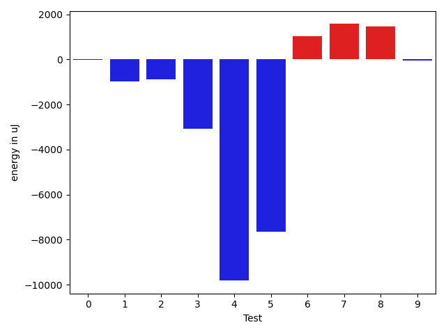

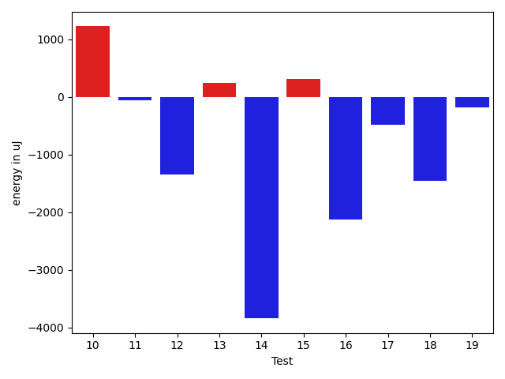

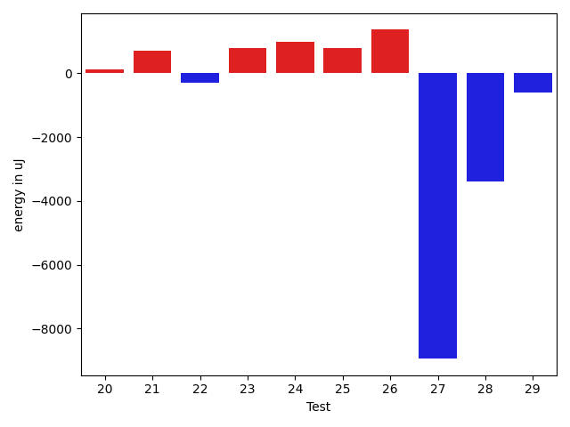

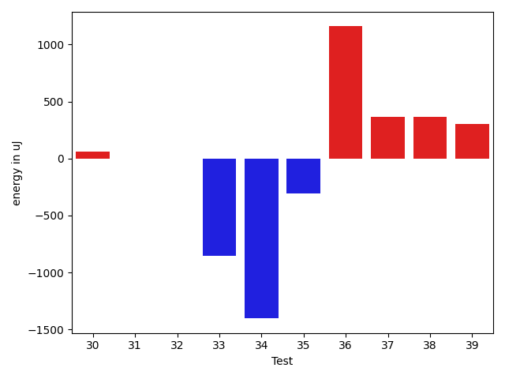

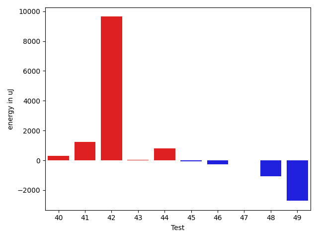

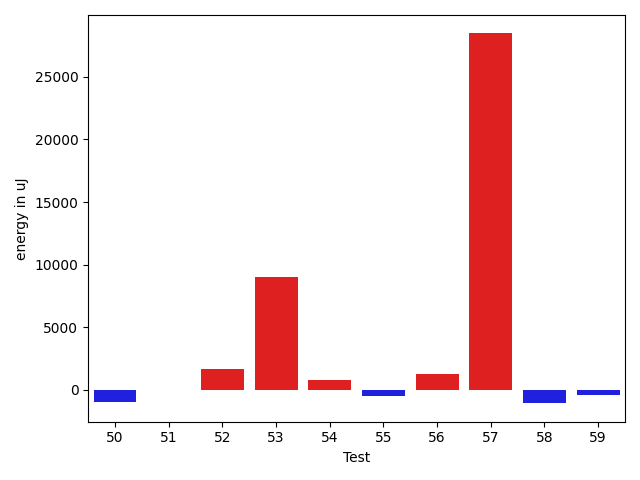

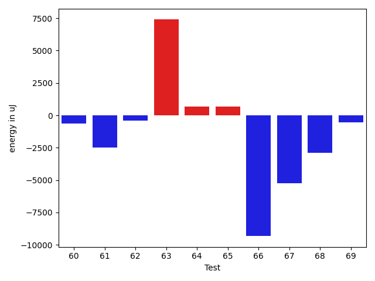

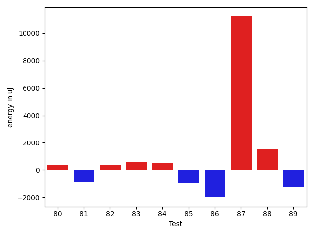

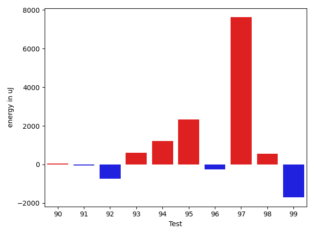

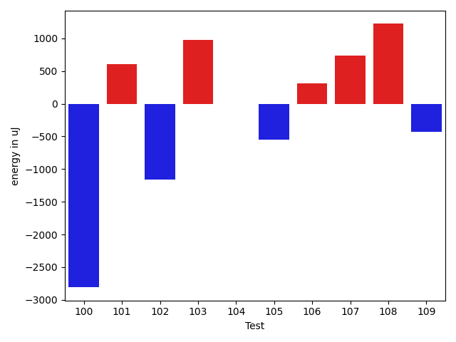

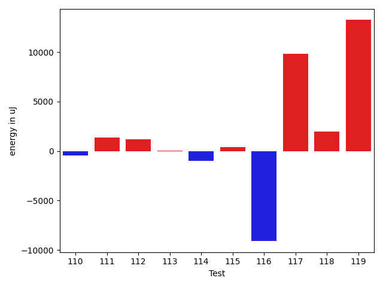

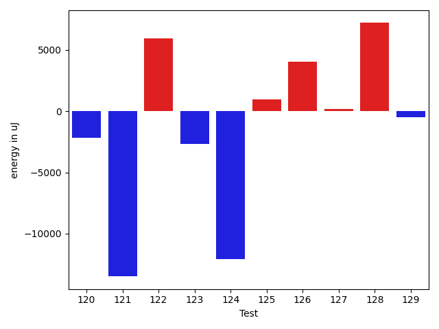

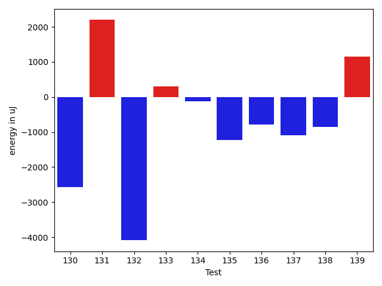

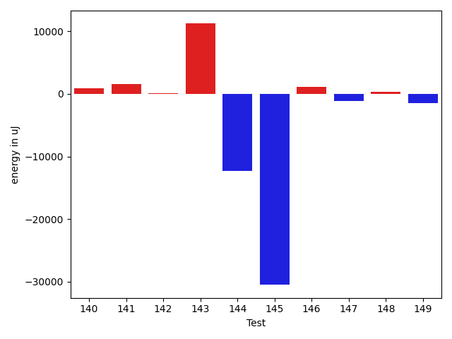

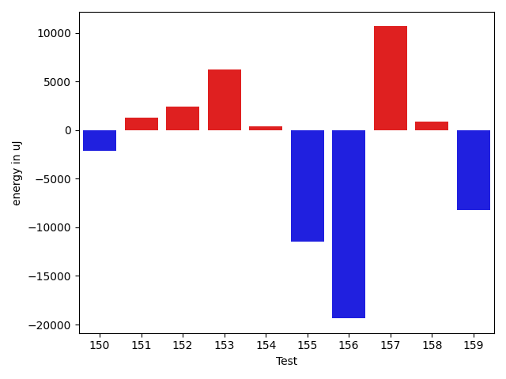

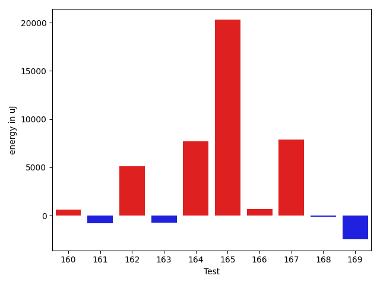

| ID | EnergyV1 | EnergyV2 | DeltaEnergy | σV1 | σV2 |
| --- | --- | --- | --- | --- | --- |
| 0 | 35034 | 33996 | -1038 | 3251.6396918237715 | 3870.663483033483 |
| 1 | 32776 | 34606 | 1830 | 24208.520847339507 | 13004.683237910871 |
| 2 | 35888 | 34973 | -915 | 3453.4180060525982 | 3834.1454053216744 |
| 3 | 37659 | 37658 | -1 | 18372.36427779891 | 16464.393910459657 |
| 4 | 34606 | 34607 | 1 | 77215.94609412592 | 33462.55467387023 |
| 5 | 35034 | 34301 | -733 | 41515.875624773136 | 3615.4185933625813 |
| 6 | 35705 | 35400 | -305 | 3573.754871717753 | 6711.654229186567 |
| 7 | 33569 | 34362 | 793 | 2602.3706808068205 | 6888.4634627397145 |
| 8 | 33631 | 35340 | 1709 | 4903.6565104567 | 3914.5507347006574 |
| 9 | 33752 | 32898 | -854 | 3047.121621271114 | 3353.3638907918403 |
| 10 | 34607 | 35827 | 1220 | 2865.595566785542 | 3947.5815577546527 |
| 11 | 33875 | 33813 | -62 | 3147.9248760906294 | 2154.9944265345707 |
| 12 | 35523 | 34180 | -1343 | 59616.52512943443 | 7328.496813038201 |
| 13 | 34729 | 34973 | 244 | 14258.79472741406 | 14075.321083035453 |
| 14 | 72998 | 69153 | -3845 | 53689.54678618215 | 48568.64019627315 |
| 15 | 35339 | 35644 | 305 | 6926.649180574132 | 8376.442166569082 |
| 16 | 36621 | 34485 | -2136 | 10493.841847907475 | 30455.71794713401 |
| 17 | 34180 | 33691 | -489 | 3028.8381547154872 | 3874.8418770427884 |
| 18 | 35156 | 33691 | -1465 | 2586.5195329085855 | 2922.258080828607 |
| 19 | 36377 | 36194 | -183 | 18113.553507190692 | 29488.12092317239 |
| 20 | 34790 | 34973 | 183 | 6742.947231623466 | 5409.886224043958 |
| 21 | 34058 | 33997 | -61 | 2940.7034103841793 | 4007.061938489208 |
| 22 | 34363 | 35278 | 915 | 3433.4403754302116 | 3886.474603030361 |
| 23 | 32959 | 33569 | 610 | 2982.9157074143122 | 4166.029323109226 |
| 24 | 33935 | 35949 | 2014 | 3155.430009054363 | 3710.15797188294 |
| 25 | 34362 | 33936 | -426 | 3041.836888867586 | 4119.414079988384 |
| 26 | 33813 | 33935 | 122 | 2966.7815034078476 | 6720.951200750672 |
| 27 | 34302 | 35217 | 915 | 46831.221351012195 | 8395.332728849951 |
| 28 | 35339 | 35462 | 123 | 16412.29322738716 | 2834.4011459789053 |
| 29 | 35889 | 33203 | -2686 | 2944.456892286342 | 3259.286577696959 |
| 30 | 35888 | 35950 | 62 | 49787.18581986956 | 4052.2363037247087 |
| 31 | 34546 | 34546 | 0 | 3294.1565308892045 | 3802.4124060742474 |
| 32 | 33508 | 33508 | 0 | 30589.33647112413 | 79853.29282808272 |
| 33 | 34484 | 33631 | -853 | 4076.531148203273 | 4128.737090858668 |
| 34 | 35461 | 34058 | -1403 | 4590.837823774369 | 4101.150118804169 |
| 35 | 35218 | 34912 | -306 | 3635.4517909292804 | 3750.5748675016066 |
| 36 | 34302 | 35461 | 1159 | 4397.246135963611 | 4101.365069534776 |
| 37 | 35034 | 35401 | 367 | 3860.9436805000287 | 4428.185180736908 |
| 38 | 33813 | 34180 | 367 | 4053.21643691087 | 3849.8444475587976 |
| 39 | 36255 | 36560 | 305 | 8955.948888706884 | 8180.3297996519905 |
| 40 | 34119 | 35156 | 1037 | 4197.159166668385 | 4132.829127983401 |
| 41 | 32165 | 33936 | 1771 | 4673.069307052134 | 3983.9160142252 |
| 42 | 34912 | 35340 | 428 | 41755.76088661599 | 48396.32099739952 |
| 43 | 32897 | 33570 | 673 | 3104.0689469412027 | 3113.1427013007374 |
| 44 | 34058 | 35339 | 1281 | 3299.360492917108 | 4148.1438834221835 |
| 45 | 34180 | 33386 | -794 | 4454.16980973303 | 3933.8402753904156 |
| 46 | 35400 | 34851 | -549 | 4225.474851684982 | 2980.602269676382 |
| 47 | 34545 | 34729 | 184 | 4197.383885752529 | 2693.306852264241 |
| 48 | 34973 | 34302 | -671 | 4009.748207493832 | 3130.8758181839294 |
| 49 | 36988 | 35767 | -1221 | 20400.16145733396 | 15223.938709899401 |
| 50 | 34119 | 33081 | -1038 | 2665.478158161186 | 2846.183448448505 |
| 51 | 33813 | 33447 | -366 | 2656.0578019877507 | 3483.111906837843 |
| 52 | 33020 | 35278 | 2258 | 3930.126204363191 | 3174.3221407498067 |
| 53 | 34484 | 35035 | 551 | 3337.4790875333174 | 34509.28968317807 |
| 54 | 34362 | 36194 | 1832 | 3820.1843793253647 | 5376.649190779519 |
| 55 | 35828 | 34973 | -855 | 3450.821841834644 | 3957.096971265678 |
| 56 | 32715 | 33874 | 1159 | 3607.0249749714826 | 2887.855115747702 |
| 57 | 32776 | 33936 | 1160 | 3149.235530004139 | 62151.39497080181 |
| 58 | 35828 | 34912 | -916 | 3386.955470094253 | 3797.2846918741648 |
| 59 | 35888 | 35827 | -61 | 3151.564584875999 | 4242.773231429336 |
| 60 | 36072 | 35645 | -427 | 4398.963910328772 | 4532.1485754616615 |
| 61 | 34851 | 34546 | -305 | 39408.47318451166 | 33789.36419500194 |
| 62 | 35950 | 36377 | 427 | 3880.621796483619 | 4829.006630767864 |
| 63 | 42603 | 41077 | -1526 | 38029.60754375429 | 52242.61289229703 |
| 64 | 39124 | 41626 | 2502 | 64825.98523801543 | 66561.34609244467 |
| 65 | 34912 | 34912 | 0 | 4343.507074542095 | 3767.219583311927 |
| 66 | 36133 | 38208 | 2075 | 80585.93391438983 | 68040.41903278275 |
| 67 | 33447 | 33204 | -243 | 29488.480554774655 | 3940.1991505640663 |
| 68 | 39551 | 36804 | -2747 | 39719.446451243115 | 36226.318742175856 |
| 69 | 36194 | 35522 | -672 | 3781.5385509736643 | 3789.5757260071423 |
| 70 | 33630 | 33936 | 306 | 3339.177746816669 | 3787.990546707376 |
| 71 | 36316 | 34423 | -1893 | 3691.0513451078164 | 3542.4604151492517 |
| 72 | 119446 | 126282 | 6836 | 29346.912672052636 | 43006.23915041951 |
| 73 | 34851 | 33203 | -1648 | 4070.1142322905553 | 3583.5425316600767 |
| 74 | 36254 | 35034 | -1220 | 3696.498629466412 | 3272.0666847689336 |
| 75 | 38269 | 33630 | -4639 | 3152.0161096599036 | 2802.564923201661 |
| 76 | 34363 | 34485 | 122 | 4828.167583504119 | 3168.8702511095885 |
| 77 | 33569 | 34180 | 611 | 3559.929969198832 | 3103.216069228557 |
| 78 | 35461 | 34668 | -793 | 4636.3409969500735 | 4105.898605664782 |
| 79 | 33753 | 33874 | 121 | 3523.111921913263 | 3701.4551016626237 |
| 80 | 32470 | 32837 | 367 | 3525.4040819214465 | 3381.233132128226 |
| 81 | 36499 | 35888 | -611 | 4410.619304587509 | 3552.792755514507 |
| 82 | 34485 | 34729 | 244 | 3675.8570419227494 | 3720.564050763142 |
| 83 | 34424 | 36072 | 1648 | 3572.990021855783 | 4298.244835442303 |
| 84 | 33509 | 34363 | 854 | 3678.6868760759317 | 3796.874450158268 |
| 85 | 36010 | 35584 | -426 | 3730.720747664204 | 4388.4070002678645 |
| 86 | 35889 | 36315 | 426 | 4072.361771748674 | 3343.2739777050874 |
| 87 | 39490 | 40039 | 549 | 18546.16259813008 | 37342.41289212015 |
| 88 | 35949 | 38147 | 2198 | 3585.5949048558723 | 6190.74947132671 |
| 89 | 36193 | 34424 | -1769 | 12421.851356549496 | 15484.119455756289 |
| 90 | 33814 | 33874 | 60 | 6723.025234306178 | 7211.529266377708 |
| 91 | 34302 | 34241 | -61 | 7902.3301028342175 | 9973.970132478853 |
| 92 | 35278 | 34546 | -732 | 31605.162123352195 | 7308.959458841432 |
| 93 | 35706 | 36316 | 610 | 24114.855783496118 | 81466.81010734821 |
| 94 | 35461 | 36682 | 1221 | 89065.60311759378 | 81623.82382604353 |
| 95 | 61279 | 63598 | 2319 | 20591.90396137309 | 20956.043359113723 |
| 96 | 36499 | 36255 | -244 | 17209.60218545783 | 17762.45630640267 |
| 97 | 37903 | 45532 | 7629 | 40194.95903283639 | 42575.32819766502 |
| 98 | 34912 | 35461 | 549 | 14179.36040821053 | 10164.222303424684 |
| 99 | 38025 | 36316 | -1709 | 19310.44362728476 | 19902.31776598184 |
| 100 | 77637 | 74829 | -2808 | 47824.802477006604 | 36833.60991423387 |
| 101 | 37903 | 38513 | 610 | 84677.46087655028 | 66278.5721693779 |
| 102 | 36071 | 34912 | -1159 | 3595.5398345676995 | 3647.7597853770553 |
| 103 | 65613 | 66589 | 976 | 39261.20603027534 | 33565.97327619192 |
| 104 | 35949 | 35949 | 0 | 3533.934843447437 | 29532.34283871377 |
| 105 | 36560 | 36011 | -549 | 3210.005200148847 | 3550.1075401845223 |
| 106 | 36071 | 36377 | 306 | 37618.17109430805 | 48056.61354245603 |
| 107 | 34729 | 35461 | 732 | 4648.275430132664 | 3458.3872492004275 |
| 108 | 36804 | 38025 | 1221 | 25755.094859771954 | 56312.1931653306 |
| 109 | 36010 | 35584 | -426 | 3222.9062602665585 | 4083.10872490251 |
| 110 | 36194 | 35706 | -488 | 3695.5194854836564 | 3968.8954669529917 |
| 111 | 35156 | 34485 | -671 | 3808.1250999829704 | 8571.541193081452 |
| 112 | 37964 | 36743 | -1221 | 33689.31913083336 | 40209.39212499392 |
| 113 | 36072 | 35705 | -367 | 7187.675188593991 | 8784.957325767364 |
| 114 | 36927 | 36621 | -306 | 3233.070017131872 | 3657.2360057632586 |
| 115 | 36926 | 38574 | 1648 | 3519.7428977592285 | 4143.904703296154 |
| 116 | 35400 | 35888 | 488 | 42177.167628313 | 3530.53309678581 |
| 117 | 37231 | 37597 | 366 | 246791.93117467227 | 264359.22851022886 |
| 118 | 37659 | 36132 | -1527 | 3769.823395386049 | 23487.044790045424 |
| 119 | 39611 | 38208 | -1403 | 63650.07484265351 | 81511.87160162622 |
| 120 | 38757 | 35827 | -2930 | 5154.379280029429 | 3363.467561622371 |
| 121 | 39489 | 40405 | 916 | 68008.95065956519 | 33818.123614974684 |
| 122 | 227843 | 235961 | 8118 | 86731.82451333827 | 80769.44996220678 |
| 123 | 338011 | 336853 | -1158 | 127821.96972605973 | 119301.01457613001 |
| 124 | 64697 | 61219 | -3478 | 69199.55105483904 | 48916.49366286964 |
| 125 | 36011 | 36499 | 488 | 4417.307799316889 | 6069.0862597081095 |
| 126 | 36499 | 36743 | 244 | 4106.331508625309 | 23618.71458793356 |
| 127 | 35950 | 35889 | -61 | 3459.0366672818027 | 4280.791494399782 |
| 128 | 35217 | 34668 | -549 | 3368.4757603546573 | 33092.41384441247 |
| 129 | 37109 | 36621 | -488 | 3944.546052757765 | 4044.0594772524737 |
| 130 | 39185 | 36621 | -2564 | 34546.07494226611 | 2587.4438963767907 |
| 131 | 36376 | 38574 | 2198 | 2631.3307100316288 | 41053.83807685022 |
| 132 | 37781 | 33692 | -4089 | 3805.377706587865 | 3302.4938559578054 |
| 133 | 36072 | 36377 | 305 | 4188.474639841305 | 4246.328548914782 |
| 134 | 37720 | 37597 | -123 | 9457.066743472624 | 3059.6596390082286 |
| 135 | 37171 | 35950 | -1221 | 3886.367306303686 | 43648.19283624263 |
| 136 | 38819 | 38025 | -794 | 24289.49339140373 | 35331.547019140766 |
| 137 | 73364 | 72265 | -1099 | 58814.67665589722 | 29749.33361693964 |
| 138 | 38086 | 37231 | -855 | 52040.888702805394 | 74464.95035003473 |
| 139 | 38086 | 39246 | 1160 | 92773.8896597791 | 112119.60719816804 |
| 140 | 36011 | 37842 | 1831 | 4317.152801468172 | 4242.642046408183 |
| 141 | 36621 | 38391 | 1770 | 4179.7038356323765 | 4225.969392690685 |
| 142 | 38513 | 39794 | 1281 | 38699.95855652359 | 35803.43659872476 |
| 143 | 34301 | 37720 | 3419 | 3939.885931794924 | 38983.33334775701 |
| 144 | 37720 | 39063 | 1343 | 66071.74363201518 | 40119.79719690035 |
| 145 | 38819 | 37231 | -1588 | 113969.9991946462 | 81703.14429915197 |
| 146 | 37354 | 38025 | 671 | 36635.31522894985 | 38212.420150517544 |
| 147 | 36377 | 36377 | 0 | 46771.51082607317 | 44584.637445300476 |
| 148 | 34729 | 35767 | 1038 | 6865.689538045593 | 4794.979849859168 |
| 149 | 35095 | 35462 | 367 | 6009.5679334156175 | 3763.176774826887 |
| 150 | 35035 | 33935 | -1100 | 9337.439982598133 | 6756.102298324981 |
| 151 | 35584 | 36133 | 549 | 3451.6641887543265 | 7021.000689092749 |
| 152 | 35095 | 36988 | 1893 | 13117.711827351122 | 14873.079504756186 |
| 153 | 35217 | 35095 | -122 | 3058.728736185927 | 32074.282529781358 |
| 154 | 35461 | 34790 | -671 | 5037.928863451346 | 3949.4969792063816 |
| 155 | 34973 | 35644 | 671 | 48755.22178980671 | 3635.9974592325702 |
| 156 | 71594 | 72143 | 549 | 177465.97224877286 | 70736.58180253205 |
| 157 | 37109 | 38574 | 1465 | 55389.19537292984 | 192593.7609777297 |
| 158 | 36927 | 36194 | -733 | 27821.69983284348 | 31074.014075912368 |
| 159 | 36438 | 36560 | 122 | 54495.95608418012 | 44912.299023875275 |
| 160 | 36865 | 36560 | -305 | 3481.4337896668253 | 4141.900172626085 |
| 161 | 35156 | 34851 | -305 | 3594.475234974328 | 3882.8170872282885 |
| 162 | 37292 | 38330 | 1038 | 43837.72824883724 | 51619.942893782245 |
| 163 | 37475 | 35217 | -2258 | 4099.636928618468 | 4912.932781794439 |
| 164 | 37109 | 37842 | 733 | 6677.805612437367 | 40466.5102902744 |
| 165 | 38574 | 37781 | -793 | 80539.8981168442 | 114831.80642556609 |
| 166 | 36499 | 36804 | 305 | 3772.5420349965584 | 4128.133331045508 |
| 167 | 39245 | 37598 | -1647 | 53581.90184069202 | 202755.76097032856 |
| 168 | 38818 | 39002 | 184 | 5112.984812655367 | 5373.986217099021 |
| 169 | 37780 | 35828 | -1952 | 4826.9071858291845 | 3347.049659250308 |

## Delta Duration per test method

| ID | DurationV1 | DurationsV2 | DeltaDuration |
| --- | --- | --- | --- |
| 0 | 880891.8615384615 | 859415.8833333333 | -21475.978205128224 |
| 1 | 700671.1785714285 | 662151.2 | -38519.97857142857 |
| 2 | 779277.5660377359 | 813786.7708333334 | 34509.20479559747 |
| 3 | 1568305.1145833333 | 1508986.6105263159 | -59318.50405701739 |
| 4 | 1596676.2921348314 | 1329491.0 | -267185.2921348314 |
| 5 | 853565.1481481482 | 560255.551724138 | -293309.59642401023 |
| 6 | 666704.5945945946 | 697994.7674418605 | 31290.17284726596 |
| 7 | 772358.8039215687 | 800894.925 | 28536.121078431373 |
| 8 | 924370.676923077 | 932303.2272727273 | 7932.5503496503225 |
| 9 | 623968.3548387097 | 558865.4827586206 | -65102.87208008906 |
| 10 | 643973.5952380953 | 626921.9736842106 | -17051.621553884703 |
| 11 | 406311.35714285716 | 390111.0 | -16200.35714285716 |
| 12 | 1403425.0 | 998929.25 | -404495.75 |
| 13 | 1238692.8313253012 | 1217575.01369863 | -21117.817626671167 |
| 14 | 2977905.0412371135 | 2646987.3092783503 | -330917.7319587632 |
| 15 | 976109.2063492064 | 918928.8 | -57180.40634920634 |
| 16 | 1005567.7931034482 | 1072662.813559322 | 67095.02045587369 |
| 17 | 604180.0 | 591539.3939393939 | -12640.606060606078 |
| 18 | 646188.5588235294 | 675499.9069767442 | 29311.348153214785 |
| 19 | 1314086.7228915663 | 1481856.3086419753 | 167769.58575040894 |
| 20 | 933028.2075471698 | 851716.4038461539 | -81311.80370101589 |
| 21 | 509146.54054054053 | 490927.1 | -18219.440540540556 |
| 22 | 650851.0789473684 | 567918.8666666667 | -82932.21228070173 |
| 23 | 630349.0909090909 | 582526.6538461539 | -47822.43706293707 |
| 24 | 617435.4285714285 | 626795.1714285715 | 9359.742857142934 |
| 25 | 824618.0408163265 | 821032.6603773584 | -3585.3804389680736 |
| 26 | 724092.1428571428 | 722411.0 | -1681.1428571428405 |
| 27 | 880923.7 | 617639.1363636364 | -263284.5636363636 |
| 28 | 802769.1891891892 | 720646.8285714285 | -82122.36061776069 |
| 29 | 407660.53846153844 | 382578.6 | -25081.938461538462 |
| 30 | 894382.3666666667 | 569174.25 | -325208.1166666667 |
| 31 | 549253.4444444445 | 584901.6785714285 | 35648.234126984025 |
| 32 | 877676.0 | 1098079.8095238095 | 220403.80952380947 |
| 33 | 749520.4186046511 | 782939.3777777777 | 33418.95917312661 |
| 34 | 756598.8793103448 | 801376.75 | 44777.87068965519 |
| 35 | 730781.9285714285 | 748274.8775510204 | 17492.948979591834 |
| 36 | 735397.3333333334 | 780371.62 | 44974.28666666662 |
| 37 | 812930.0169491526 | 820991.4285714285 | 8061.411622275948 |
| 38 | 809447.9777777778 | 823001.25 | 13553.272222222178 |
| 39 | 915486.9642857143 | 1009858.8909090909 | 94371.92662337655 |
| 40 | 598743.5384615385 | 614040.7368421053 | 15297.198380566784 |
| 41 | 764375.4651162791 | 727281.16 | -37094.30511627905 |
| 42 | 1226890.641025641 | 1688384.0 | 461493.358974359 |
| 43 | 802712.6097560975 | 796158.0784313725 | -6554.531324725016 |
| 44 | 745650.9555555555 | 771992.4146341464 | 26341.45907859085 |
| 45 | 670275.6756756756 | 712340.6176470588 | 42064.941971383174 |
| 46 | 384532.3333333333 | 399349.3 | 14816.966666666674 |
| 47 | 478696.84375 | 513460.85714285716 | 34764.01339285716 |
| 48 | 425052.8333333333 | 442609.4583333333 | 17556.625 |
| 49 | 1009175.4411764706 | 1148712.59375 | 139537.1525735294 |
| 50 | 396490.05263157893 | 423467.6 | 26977.547368421045 |
| 51 | 402343.65 | 397407.3333333333 | -4936.316666666709 |
| 52 | 344151.8 | 373299.3846153846 | 29147.584615384636 |
| 53 | 440910.0833333333 | 830078.0625 | 389167.9791666667 |
| 54 | 402832.4117647059 | 487150.6153846154 | 84318.20361990947 |
| 55 | 447675.76470588235 | 490478.95 | 42803.18529411766 |
| 56 | 374139.4285714286 | 434001.4705882353 | 59862.04201680672 |
| 57 | 398994.652173913 | 1982536.4705882352 | 1583541.818414322 |
| 58 | 408161.35294117645 | 478823.82352941175 | 70662.4705882353 |
| 59 | 482198.54545454547 | 556894.3666666667 | 74695.82121212123 |
| 60 | 404152.6875 | 450413.76923076925 | 46261.08173076925 |
| 61 | 734883.3125 | 663491.0454545454 | -71392.26704545459 |
| 62 | 403100.875 | 503781.1 | 100680.22499999998 |
| 63 | 1369810.761904762 | 1702568.4 | 332757.638095238 |
| 64 | 1802997.8695652173 | 1775889.7272727273 | -27108.142292489996 |
| 65 | 497490.6666666667 | 587104.6666666666 | 89613.99999999994 |
| 66 | 1999091.48 | 1741706.6 | -257384.8799999999 |
| 67 | 890487.358974359 | 710141.2653061225 | -180346.0936682365 |
| 68 | 1233170.551020408 | 1234123.0 | 952.4489795919508 |
| 69 | 588536.84375 | 573899.3870967742 | -14637.456653225818 |
| 70 | 1003263.2432432432 | 993863.3611111111 | -9399.882132132072 |
| 71 | 527134.9 | 488544.6923076923 | -38590.20769230771 |
| 72 | 3928109.9292929294 | 4254310.717171717 | 326200.7878787881 |
| 73 | 511601.347826087 | 506050.30303030304 | -5551.044795783935 |
| 74 | 623473.1176470588 | 594260.8888888889 | -29212.22875816992 |
| 75 | 482579.25 | 443361.45454545453 | -39217.79545454547 |
| 76 | 526564.16 | 519537.35714285716 | -7026.802857142873 |
| 77 | 832474.96 | 858316.3725490196 | 25841.412549019675 |
| 78 | 481332.8 | 427598.05 | -53734.75 |
| 79 | 739809.612244898 | 720891.4042553192 | -18918.207989578834 |
| 80 | 678057.9230769231 | 664443.5454545454 | -13614.37762237771 |
| 81 | 469485.15 | 473630.04545454547 | 4144.895454545447 |
| 82 | 587338.7714285714 | 571857.3333333334 | -15481.43809523806 |
| 83 | 458175.54545454547 | 442876.5652173913 | -15298.980237154174 |
| 84 | 625650.027027027 | 581854.304347826 | -43795.72267920093 |
| 85 | 489841.28571428574 | 481988.0 | -7853.285714285739 |
| 86 | 411684.9 | 395938.0 | -15746.900000000023 |
| 87 | 1353390.1627906978 | 1584197.775510204 | 230807.61271950626 |
| 88 | 944850.6222222223 | 836305.3018867924 | -108545.32033542986 |
| 89 | 1315591.6210526316 | 1314104.9670329671 | -1486.6540196645074 |
| 90 | 1090624.641025641 | 1060265.8266666667 | -30358.81435897434 |
| 91 | 1280996.7303370787 | 1226529.3666666667 | -54467.363670411985 |
| 92 | 1395115.3956043955 | 1227688.677777778 | -167426.71782661765 |
| 93 | 1440560.9587628867 | 1903707.71875 | 463146.7599871133 |
| 94 | 2133830.054347826 | 2220109.6860465114 | 86279.63169868523 |
| 95 | 1942040.0808080807 | 1942437.878787879 | 397.79797979816794 |
| 96 | 1409186.8181818181 | 1424699.3370786516 | 15512.518896833528 |
| 97 | 2054638.081632653 | 2175698.21875 | 121060.13711734698 |
| 98 | 1280745.4948453608 | 1236110.9891304348 | -44634.50571492594 |
| 99 | 1680383.494949495 | 1627430.3737373736 | -52953.12121212133 |
| 100 | 2906210.696969697 | 2769336.6464646463 | -136874.05050505046 |
| 101 | 1894864.731707317 | 1690631.456521739 | -204233.27518557804 |
| 102 | 737144.1707317074 | 712935.9285714285 | -24208.242160278838 |
| 103 | 2206875.966666667 | 2078206.581632653 | -128669.38503401377 |
| 104 | 965010.7727272727 | 1130918.5223880596 | 165907.74966078694 |
| 105 | 907288.6458333334 | 844079.9375 | -63208.70833333337 |
| 106 | 1123434.918367347 | 1470295.0 | 346860.081632653 |
| 107 | 718667.45 | 753913.2444444444 | 35245.79444444447 |
| 108 | 1089474.3220338982 | 1498239.5740740742 | 408765.25204017595 |
| 109 | 619962.6052631579 | 647192.25 | 27229.644736842136 |
| 110 | 1014248.3725490196 | 785439.48 | -228808.89254901966 |
| 111 | 1093579.9743589743 | 1069294.8051948051 | -24285.169164169114 |
| 112 | 1103441.6764705882 | 1164671.484375 | 61229.807904411806 |
| 113 | 1225026.347826087 | 1251925.142857143 | 26898.79503105604 |
| 114 | 782419.1041666666 | 797293.4339622641 | 14874.32979559747 |
| 115 | 586413.2857142857 | 507245.55 | -79167.73571428569 |
| 116 | 786229.052631579 | 461858.4 | -324370.65263157897 |
| 117 | 2652300.8653846155 | 3194819.0 | 542518.1346153845 |
| 118 | 776270.42 | 903664.38 | 127393.95999999996 |
| 119 | 1685964.2325581396 | 2061648.5405405406 | 375684.307982401 |
| 120 | 696594.8636363636 | 616549.75 | -80045.11363636365 |
| 121 | 2175888.404494382 | 1791503.8865979381 | -384384.51789644384 |
| 122 | 7215832.292929293 | 7241946.434343434 | 26114.141414141282 |
| 123 | 10204509.393939395 | 10131400.191919193 | -73109.20202020183 |
| 124 | 2365013.7448979593 | 2001492.2525252525 | -363521.49237270677 |
| 125 | 476863.05263157893 | 412520.05555555556 | -64342.99707602337 |
| 126 | 749795.972972973 | 817176.0 | 67380.02702702698 |
| 127 | 756447.48 | 666669.5652173914 | -89777.91478260863 |
| 128 | 438014.4705882353 | 756435.5789473684 | 318421.1083591331 |
| 129 | 646176.1052631579 | 584660.125 | -61515.980263157864 |
| 130 | 722591.3888888889 | 457789.15789473685 | -264802.230994152 |
| 131 | 357097.5 | 780727.0 | 423629.5 |
| 132 | 421673.64285714284 | 414788.3076923077 | -6885.335164835153 |
| 133 | 411457.3125 | 394218.1176470588 | -17239.194852941204 |
| 134 | 960465.0454545454 | 493487.04761904763 | -466977.9978354978 |
| 135 | 376432.6296296296 | 739239.0 | 362806.3703703704 |
| 136 | 1309104.3076923077 | 1128694.5172413792 | -180409.7904509285 |
| 137 | 2613890.393939394 | 2231714.1717171716 | -382176.2222222225 |
| 138 | 1431195.288888889 | 1723543.7307692308 | 292348.44188034185 |
| 139 | 2236783.717948718 | 2568770.534883721 | 331986.8169350028 |
| 140 | 390191.78571428574 | 405673.3333333333 | 15481.547619047575 |
| 141 | 526465.68 | 519124.0588235294 | -7341.621176470653 |
| 142 | 1590110.3174603174 | 1646572.0597014925 | 56461.74224117515 |
| 143 | 349290.06666666665 | 814793.9375 | 465503.87083333335 |
| 144 | 1832057.223880597 | 1473041.7464788733 | -359015.4774017236 |
| 145 | 2537421.111111111 | 1636379.625 | -901041.486111111 |
| 146 | 1698981.0294117648 | 1779196.0675675676 | 80215.03815580276 |
| 147 | 1386235.6666666667 | 1390823.7666666666 | 4588.09999999986 |
| 148 | 1038906.1617647059 | 1076983.0273972603 | 38076.8656325544 |
| 149 | 919559.0847457628 | 907534.9824561403 | -12024.102289622417 |
| 150 | 1102898.8533333333 | 1132949.6944444445 | 30050.841111111222 |
| 151 | 928390.8382352941 | 1032158.253968254 | 103767.41573295987 |
| 152 | 1196279.2337662338 | 1257760.1168831168 | 61480.88311688299 |
| 153 | 473950.1724137931 | 707749.3448275862 | 233799.1724137931 |
| 154 | 821167.1851851852 | 849227.5272727272 | 28060.342087542056 |
| 155 | 783736.5238095238 | 468086.05263157893 | -315650.47117794486 |
| 156 | 3456915.0808080807 | 2774286.0714285714 | -682629.0093795094 |
| 157 | 1643241.7692307692 | 1805603.484375 | 162361.71514423075 |
| 158 | 658404.2272727273 | 970026.2 | 311621.97272727266 |
| 159 | 1261798.4333333333 | 981150.1034482758 | -280648.3298850575 |
| 160 | 456272.82352941175 | 391586.0 | -64686.82352941175 |
| 161 | 734267.9375 | 985202.7647058824 | 250934.8272058824 |
| 162 | 1255753.891304348 | 1371129.1578947369 | 115375.26659038896 |
| 163 | 603916.8965517242 | 583163.3448275862 | -20753.55172413797 |
| 164 | 845663.45 | 905086.7021276596 | 59423.25212765962 |
| 165 | 1761393.372881356 | 2532465.8333333335 | 771072.4604519776 |
| 166 | 773416.1666666666 | 996527.8666666667 | 223111.70000000007 |
| 167 | 1636469.6166666667 | 1962504.7323943663 | 326035.1157276996 |
| 168 | 532750.1666666666 | 721582.1818181818 | 188832.01515151514 |
| 169 | 609712.947368421 | 476709.2727272727 | -133003.6746411483 |

## Misc.

| ID | Test Class | Test Method |
| --- | --- | --- |
| 0 | com.google.gson.functional.ObjectTest | testDirectedAcyclicGraphDeserialization |
| 1 | com.google.gson.functional.ObjectTest | testNullObjectFieldsDeserialization |
| 2 | com.google.gson.functional.ObjectTest | testNestedSerialization |
| 3 | com.google.gson.functional.ObjectTest | testArrayOfArraysDeserialization |
| 4 | com.google.gson.functional.ObjectTest | testSubInterfacesOfCollectionDeserialization |
| 5 | com.google.gson.functional.ObjectTest | testPrivateNoArgConstructorDeserialization |
| 6 | com.google.gson.functional.ObjectTest | testClassWithTransientFieldsDeserializationTransientFieldsPassedInJsonAreIgnored |
| 7 | com.google.gson.functional.ObjectTest | testNullArraysDeserialization |
| 8 | com.google.gson.functional.ObjectTest | testClassWithObjectFieldSerialization |
| 9 | com.google.gson.functional.ObjectTest | testObjectFieldNamesWithoutQuotesDeserialization |
| 10 | com.google.gson.functional.ObjectTest | testClassWithEnumFieldSerialization |
| 11 | com.google.gson.functional.ObjectTest | testTopLevelEnumDeserialization |
| 12 | com.google.gson.functional.ObjectTest | testArrayOfObjectsDeserialization |
| 13 | com.google.gson.functional.ObjectTest | testArrayOfArraysSerialization |
| 14 | com.google.gson.functional.ObjectTest | testSubInterfacesOfCollectionSerialization |
| 15 | com.google.gson.functional.ObjectTest | testNestedDeserialization |
| 16 | com.google.gson.functional.ObjectTest | testInheritenceDeserialization |
| 17 | com.google.gson.functional.ObjectTest | testBagOfPrimitiveWrappersDeserialization |
| 18 | com.google.gson.functional.ObjectTest | testJsonInMixedQuotesDeserialization |
| 19 | com.google.gson.functional.ObjectTest | testInheritenceSerialization |
| 20 | com.google.gson.functional.ObjectTest | testArrayOfObjectsSerialization |
| 21 | com.google.gson.functional.ObjectTest | testNullPrimitiveFieldsDeserialization |
| 22 | com.google.gson.functional.ObjectTest | testBagOfPrimitivesDeserialization |
| 23 | com.google.gson.functional.ObjectTest | testEmptyCollectionInAnObjectDeserialization |
| 24 | com.google.gson.functional.ObjectTest | testClassWithEnumFieldDeserialization |
| 25 | com.google.gson.functional.ObjectTest | testInnerClassDeserialization |
| 26 | com.google.gson.functional.ObjectTest | testPrimitiveArrayInAnObjectDeserialization |
| 27 | com.google.gson.functional.ObjectTest | testBagOfPrimitivesSerialization |
| 28 | com.google.gson.functional.ObjectTest | testNullFieldsDeserialization |
| 29 | com.google.gson.functional.ObjectTest | testTopLevelEnumSerialization |
| 30 | com.google.gson.functional.ObjectTest | testNullFieldsSerialization |
| 31 | com.google.gson.functional.ObjectTest | testClassWithTransientFieldsDeserialization |
| 32 | com.google.gson.functional.ObjectTest | testJsonInSingleQuotesDeserialization |
| 33 | com.google.gson.functional.CollectionTest | testNullsInListDeserialization |
| 34 | com.google.gson.functional.CollectionTest | testNullsInListSerialization |
| 35 | com.google.gson.functional.CollectionTest | testQueueDeserialization |
| 36 | com.google.gson.functional.CollectionTest | testQueueSerialization |
| 37 | com.google.gson.functional.CollectionTest | testLinkedListDeserialization |
| 38 | com.google.gson.functional.CollectionTest | testCollectionOfEnumsSerialization |
| 39 | com.google.gson.functional.CollectionTest | testLinkedListSerialization |
| 40 | com.google.gson.functional.CollectionTest | testRawCollectionSerialization |
| 41 | com.google.gson.functional.CollectionTest | testCollectionOfStringsDeserialization |
| 42 | com.google.gson.functional.CollectionTest | testCollectionOfBagOfPrimitivesSerialization |
| 43 | com.google.gson.functional.CollectionTest | testCollectionOfEnumsDeserialization |
| 44 | com.google.gson.functional.CollectionTest | testCollectionOfObjectSerialization |
| 45 | com.google.gson.functional.CollectionTest | testRawCollectionOfBagOfPrimitivesNotAllowed |
| 46 | com.google.gson.functional.CollectionTest | testCollectionOfStringsSerialization |
| 47 | com.google.gson.functional.StringTest | testEscapingQuotesInStringSerialization |
| 48 | com.google.gson.functional.StringTest | testEscapedBackslashInStringDeserialization |
| 49 | com.google.gson.functional.StringTest | testStringValueAsSingleElementArraySerialization |
| 50 | com.google.gson.functional.StringTest | testSingleQuoteInStringDeserialization |
| 51 | com.google.gson.functional.StringTest | testEscapingQuotesInStringDeserialization |
| 52 | com.google.gson.functional.StringTest | testJavascriptKeywordsInStringSerialization |
| 53 | com.google.gson.functional.StringTest | testAssignmentCharDeserialization |
| 54 | com.google.gson.functional.StringTest | testEscapedBackslashInStringSerialization |
| 55 | com.google.gson.functional.StringTest | testEscapedCtrlRInStringDeserialization |
| 56 | com.google.gson.functional.StringTest | testAssignmentCharSerialization |
| 57 | com.google.gson.functional.StringTest | testStringWithEscapedSlashDeserialization |
| 58 | com.google.gson.functional.StringTest | testEscapedCtrlNInStringSerialization |
| 59 | com.google.gson.functional.StringTest | testSingleQuoteInStringSerialization |
| 60 | com.google.gson.functional.StringTest | testEscapedCtrlNInStringDeserialization |
| 61 | com.google.gson.functional.StringTest | testJavascriptKeywordsInStringDeserialization |
| 62 | com.google.gson.functional.StringTest | testEscapedCtrlRInStringSerialization |
| 63 | com.google.gson.functional.StringTest | testStringValueSerialization |
| 64 | com.google.gson.functional.StringTest | testStringValueDeserialization |
| 65 | com.google.gson.functional.StringTest | testStringValueAsSingleElementArrayDeserialization |
| 66 | com.google.gson.functional.DefaultTypeAdaptersTest | testUrlDeserialization |
| 67 | com.google.gson.functional.DefaultTypeAdaptersTest | testDateSerializationWithPattern |
| 68 | com.google.gson.functional.DefaultTypeAdaptersTest | testUrlSerialization |
| 69 | com.google.gson.functional.DefaultTypeAdaptersTest | testUriSerialization |
| 70 | com.google.gson.functional.DefaultTypeAdaptersTest | testDefaultDateDeserializationUsingBuilder |
| 71 | com.google.gson.functional.DefaultTypeAdaptersTest | testUriDeserialization |
| 72 | com.google.gson.functional.DefaultTypeAdaptersTest | testDefaultDateDeserialization |
| 73 | com.google.gson.functional.DefaultTypeAdaptersTest | testUuidDeserialization |
| 74 | com.google.gson.functional.DefaultTypeAdaptersTest | testUuidSerialization |
| 75 | com.google.gson.functional.DefaultTypeAdaptersTest | testLocaleDeserializationWithLanguageCountryVariant |
| 76 | com.google.gson.functional.DefaultTypeAdaptersTest | testSetSerialization |
| 77 | com.google.gson.functional.DefaultTypeAdaptersTest | testDefaultDateSerialization |
| 78 | com.google.gson.functional.DefaultTypeAdaptersTest | testLocaleSerializationWithLanguage |
| 79 | com.google.gson.functional.DefaultTypeAdaptersTest | testDateDeserializationWithPattern |
| 80 | com.google.gson.functional.DefaultTypeAdaptersTest | testDefaultDateSerializationUsingBuilder |
| 81 | com.google.gson.functional.DefaultTypeAdaptersTest | testLocaleDeserializationWithLanguage |
| 82 | com.google.gson.functional.DefaultTypeAdaptersTest | testBigIntegerFieldDeserialization |
| 83 | com.google.gson.functional.DefaultTypeAdaptersTest | testLocaleDeserializationWithLanguageCountry |
| 84 | com.google.gson.functional.DefaultTypeAdaptersTest | testBigDecimalFieldDeserialization |
| 85 | com.google.gson.functional.DefaultTypeAdaptersTest | testLocaleSerializationWithLanguageCountryVariant |
| 86 | com.google.gson.functional.DefaultTypeAdaptersTest | testLocaleSerializationWithLanguageCountry |
| 87 | com.google.gson.functional.NullObjectAndFieldTest | testExplicitDeserializationOfNulls |
| 88 | com.google.gson.functional.NullObjectAndFieldTest | testNullWrappedPrimitiveMemberDeserialization |
| 89 | com.google.gson.functional.ParameterizedTypesTest | testVariableTypeArrayDeserialization |
| 90 | com.google.gson.functional.ParameterizedTypesTest | testParameterizedTypeWithReaderDeserialization |
| 91 | com.google.gson.functional.ParameterizedTypesTest | testParameterizedTypeWithCustomSerializer |
| 92 | com.google.gson.functional.ParameterizedTypesTest | testVariableTypeDeserialization |
| 93 | com.google.gson.functional.ParameterizedTypesTest | testParameterizedTypeGenericArraysDeserialization |
| 94 | com.google.gson.functional.ParameterizedTypesTest | testParameterizedTypeDeserialization |
| 95 | com.google.gson.functional.ParameterizedTypesTest | testVariableTypeFieldsAndGenericArraysDeserialization |
| 96 | com.google.gson.functional.ParameterizedTypesTest | testTypesWithMultipleParametersDeserialization |
| 97 | com.google.gson.functional.ParameterizedTypesTest | testTypesWithMultipleParametersSerialization |
| 98 | com.google.gson.functional.ParameterizedTypesTest | testParameterizedTypeWithVariableTypeDeserialization |
| 99 | com.google.gson.functional.ParameterizedTypesTest | testParameterizedTypesWithCustomDeserializer |
| 100 | com.google.gson.functional.NamingPolicyTest | testGsonWithNonDefaultFieldNamingPolicySerialization |
| 101 | com.google.gson.functional.NamingPolicyTest | testGsonWithSerializedNameFieldNamingPolicyDeserialization |
| 102 | com.google.gson.functional.NamingPolicyTest | testGsonWithNonDefaultFieldNamingPolicyDeserialiation |
| 103 | com.google.gson.JsonDeserializerExceptionWrapperTest | testProperSerialization |
| 104 | com.google.gson.functional.VersioningTest | testVersionedGsonMixingSinceAndUntilDeserialization |
| 105 | com.google.gson.functional.VersioningTest | testVersionedClassesDeserialization |
| 106 | com.google.gson.functional.VersioningTest | testVersionedGsonWithUnversionedClassesSerialization |
| 107 | com.google.gson.functional.VersioningTest | testVersionedGsonWithUnversionedClassesDeserialization |
| 108 | com.google.gson.functional.VersioningTest | testVersionedUntilDeserialization |
| 109 | com.google.gson.functional.VersioningTest | testIgnoreLaterVersionClassDeserialization |
| 110 | com.google.gson.functional.MapTest | testMapDeserializationWithNullKey |
| 111 | com.google.gson.functional.MapTest | testParameterizedMapSubclassDeserialization |
| 112 | com.google.gson.functional.MapTest | testMapDeserialization |
| 113 | com.google.gson.functional.MapTest | testParameterizedMapSubclassSerialization |
| 114 | com.google.gson.functional.MapTest | testMapDeserializationWithNullValue |
| 115 | com.google.gson.functional.MapTest | testRawMapSerialization |
| 116 | com.google.gson.functional.MapTest | testMapSubclassSerialization |
| 117 | com.google.gson.DefaultDateTypeAdapterTest | testDatePattern |
| 118 | com.google.gson.DefaultDateTypeAdapterTest | testDateSerialization |
| 119 | com.google.gson.GsonTypeAdapterTest | testDefaultTypeAdapterThrowsParseException |
| 120 | com.google.gson.GsonTypeAdapterTest | testTypeAdapterDoesNotAffectNonAdaptedTypes |
| 121 | com.google.gson.functional.ConcurrencyTest | testSingleThreadSerialization |
| 122 | com.google.gson.functional.ConcurrencyTest | testMultiThreadSerialization |
| 123 | com.google.gson.functional.ConcurrencyTest | testMultiThreadDeserialization |
| 124 | com.google.gson.functional.ConcurrencyTest | testSingleThreadDeserialization |
| 125 | com.google.gson.functional.ArrayTest | testArrayOfStringsSerialization |
| 126 | com.google.gson.functional.ArrayTest | testTopLevelEnumInASingleElementArrayDeserialization |
| 127 | com.google.gson.functional.ArrayTest | testNullsInArraySerialization |
| 128 | com.google.gson.functional.ArrayTest | testArrayOfStringsDeserialization |
| 129 | com.google.gson.functional.ArrayTest | testNullsInArrayDeserialization |
| 130 | com.google.gson.JsonEscapingVisitorTest | testStringPrimitiveVisitationEscapingRequired |
| 131 | com.google.gson.JsonEscapingVisitorTest | testStringArrayVisitationNoEscaping |
| 132 | com.google.gson.JsonEscapingVisitorTest | testStringFieldVisitationEscapingRequired |
| 133 | com.google.gson.JsonEscapingVisitorTest | testStringArrayVisitationEscapingRequired |
| 134 | com.google.gson.JsonEscapingVisitorTest | testStringPrimitiveVisitationNoEscapingRequired |
| 135 | com.google.gson.JsonEscapingVisitorTest | testStringFieldVisitationNoEscaping |
| 136 | com.google.gson.functional.UncategorizedTest | testStaticFieldsAreNotSerialized |
| 137 | com.google.gson.functional.UncategorizedTest | testReturningDerivedClassesDuringDeserialization |
| 138 | com.google.gson.functional.ReadersWritersTest | testReaderForDeserialization |
| 139 | com.google.gson.functional.ReadersWritersTest | testWriterForSerialization |
| 140 | com.google.gson.JsonPrimitiveTest | testParsingStringAsBoolean |
| 141 | com.google.gson.JsonPrimitiveTest | testParsingStringAsNumber |
| 142 | com.google.gson.JsonPrimitiveTest | testExponential |
| 143 | com.google.gson.JsonPrimitiveTest | testStringsAndChar |
| 144 | com.google.gson.functional.EscapingTest | testEscapingObjectFields |
| 145 | com.google.gson.functional.EscapingTest | testEscapingQuotesInStringArray |
| 146 | com.google.gson.functional.CustomTypeAdaptersTest | testCustomAdapterInvokedForCollectionElementSerializationWithType |
| 147 | com.google.gson.functional.CustomTypeAdaptersTest | testCustomDeserializers |
| 148 | com.google.gson.functional.CustomTypeAdaptersTest | testCustomByteArrayDeserializerAndInstanceCreator |
| 149 | com.google.gson.functional.CustomTypeAdaptersTest | testCustomAdapterInvokedForMapElementDeserialization |
| 150 | com.google.gson.functional.CustomTypeAdaptersTest | testCustomAdapterInvokedForMapElementSerializationWithType |
| 151 | com.google.gson.functional.CustomTypeAdaptersTest | testCustomNestedDeserializers |
| 152 | com.google.gson.functional.CustomTypeAdaptersTest | testCustomDeserializerForLong |
| 153 | com.google.gson.functional.CustomTypeAdaptersTest | testCustomAdapterInvokedForCollectionElementSerialization |
| 154 | com.google.gson.functional.CustomTypeAdaptersTest | testCustomByteArraySerializer |
| 155 | com.google.gson.functional.CustomTypeAdaptersTest | testCustomAdapterInvokedForMapElementSerialization |
| 156 | com.google.gson.FunctionalWithInternalDependenciesTest | testPrettyPrintList |
| 157 | com.google.gson.FunctionalWithInternalDependenciesTest | testPrettyPrintArrayOfObjects |
| 158 | com.google.gson.functional.InternationalizationTest | testStringsWithUnicodeChineseCharactersEscapedDeserialization |
| 159 | com.google.gson.functional.InternationalizationTest | testStringsWithRawChineseCharactersDeserialization |
| 160 | com.google.gson.functional.InternationalizationTest | testStringsWithUnicodeChineseCharactersDeserialization |
| 161 | com.google.gson.functional.InternationalizationTest | testStringsWithUnicodeChineseCharactersSerialization |
| 162 | com.google.gson.functional.ExposeFieldsTest | testExposeAnnotationDeserialization |
| 163 | com.google.gson.functional.ExposeFieldsTest | testExposedInterfaceFieldDeserialization |
| 164 | com.google.gson.functional.ExposeFieldsTest | testNoExposedFieldDeserialization |
| 165 | com.google.gson.functional.CustomDeserializerTest | testDefaultConstructorNotCalledOnObject |
| 166 | com.google.gson.functional.CustomDeserializerTest | testDefaultConstructorNotCalledOnField |
| 167 | com.google.gson.functional.PrintFormattingTest | testCompactFormattingLeavesNoWhiteSpace |
| 168 | com.google.gson.JsonObjectTest | testAddingCharacterProperties |
| 169 | com.google.gson.JsonObjectTest | testAddingStringProperties |

| Test | IterationV1 | IterationV2 | DeltaIteration |
| --- | --- | --- | --- |
| 0 | 65 | 60 | -5 |
| 1 | 28 | 25 | -3 |
| 2 | 53 | 48 | -5 |
| 3 | 96 | 95 | -1 |
| 4 | 89 | 82 | -7 |
| 5 | 27 | 29 | 2 |
| 6 | 37 | 43 | 6 |
| 7 | 51 | 40 | -11 |
| 8 | 65 | 66 | 1 |
| 9 | 31 | 29 | -2 |
| 10 | 42 | 38 | -4 |
| 11 | 28 | 18 | -10 |
| 12 | 72 | 68 | -4 |
| 13 | 83 | 73 | -10 |
| 14 | 97 | 97 | 0 |
| 15 | 63 | 45 | -18 |
| 16 | 58 | 59 | 1 |
| 17 | 42 | 33 | -9 |
| 18 | 34 | 43 | 9 |
| 19 | 83 | 81 | -2 |
| 20 | 53 | 52 | -1 |
| 21 | 37 | 30 | -7 |
| 22 | 38 | 30 | -8 |
| 23 | 33 | 26 | -7 |
| 24 | 35 | 35 | 0 |
| 25 | 49 | 53 | 4 |
| 26 | 49 | 44 | -5 |
| 27 | 20 | 22 | 2 |
| 28 | 37 | 35 | -2 |
| 29 | 13 | 15 | 2 |
| 30 | 30 | 28 | -2 |
| 31 | 36 | 28 | -8 |
| 32 | 43 | 42 | -1 |
| 33 | 43 | 45 | 2 |
| 34 | 58 | 52 | -6 |
| 35 | 56 | 49 | -7 |
| 36 | 54 | 50 | -4 |
| 37 | 59 | 56 | -3 |
| 38 | 45 | 48 | 3 |
| 39 | 56 | 55 | -1 |
| 40 | 39 | 38 | -1 |
| 41 | 43 | 50 | 7 |
| 42 | 39 | 36 | -3 |
| 43 | 41 | 51 | 10 |
| 44 | 45 | 41 | -4 |
| 45 | 37 | 34 | -3 |
| 46 | 12 | 10 | -2 |
| 47 | 32 | 21 | -11 |
| 48 | 12 | 24 | 12 |
| 49 | 34 | 32 | -2 |
| 50 | 19 | 15 | -4 |
| 51 | 20 | 18 | -2 |
| 52 | 15 | 13 | -2 |
| 53 | 24 | 16 | -8 |
| 54 | 17 | 13 | -4 |
| 55 | 17 | 20 | 3 |
| 56 | 21 | 17 | -4 |
| 57 | 23 | 17 | -6 |
| 58 | 17 | 17 | 0 |
| 59 | 22 | 30 | 8 |
| 60 | 16 | 13 | -3 |
| 61 | 16 | 22 | 6 |
| 62 | 16 | 10 | -6 |
| 63 | 21 | 25 | 4 |
| 64 | 23 | 33 | 10 |
| 65 | 24 | 12 | -12 |
| 66 | 25 | 30 | 5 |
| 67 | 39 | 49 | 10 |
| 68 | 49 | 60 | 11 |
| 69 | 32 | 31 | -1 |
| 70 | 74 | 72 | -2 |
| 71 | 30 | 26 | -4 |
| 72 | 99 | 99 | 0 |
| 73 | 23 | 33 | 10 |
| 74 | 34 | 27 | -7 |
| 75 | 12 | 11 | -1 |
| 76 | 25 | 28 | 3 |
| 77 | 50 | 51 | 1 |
| 78 | 25 | 20 | -5 |
| 79 | 49 | 47 | -2 |
| 80 | 39 | 44 | 5 |
| 81 | 20 | 22 | 2 |
| 82 | 35 | 33 | -2 |
| 83 | 22 | 23 | 1 |
| 84 | 37 | 46 | 9 |
| 85 | 21 | 25 | 4 |
| 86 | 10 | 10 | 0 |
| 87 | 43 | 49 | 6 |
| 88 | 45 | 53 | 8 |
| 89 | 95 | 91 | -4 |
| 90 | 78 | 75 | -3 |
| 91 | 89 | 90 | 1 |
| 92 | 91 | 90 | -1 |
| 93 | 97 | 96 | -1 |
| 94 | 92 | 86 | -6 |
| 95 | 99 | 99 | 0 |
| 96 | 88 | 89 | 1 |
| 97 | 98 | 96 | -2 |
| 98 | 97 | 92 | -5 |
| 99 | 99 | 99 | 0 |
| 100 | 99 | 99 | 0 |
| 101 | 41 | 46 | 5 |
| 102 | 41 | 42 | 1 |
| 103 | 90 | 98 | 8 |
| 104 | 66 | 67 | 1 |
| 105 | 48 | 64 | 16 |
| 106 | 49 | 39 | -10 |
| 107 | 40 | 45 | 5 |
| 108 | 59 | 54 | -5 |
| 109 | 38 | 32 | -6 |
| 110 | 51 | 50 | -1 |
| 111 | 78 | 77 | -1 |
| 112 | 68 | 64 | -4 |
| 113 | 92 | 91 | -1 |
| 114 | 48 | 53 | 5 |
| 115 | 14 | 20 | 6 |
| 116 | 19 | 20 | 1 |
| 117 | 52 | 59 | 7 |
| 118 | 50 | 50 | 0 |
| 119 | 43 | 37 | -6 |
| 120 | 22 | 32 | 10 |
| 121 | 89 | 97 | 8 |
| 122 | 99 | 99 | 0 |
| 123 | 99 | 99 | 0 |
| 124 | 98 | 99 | 1 |
| 125 | 19 | 18 | -1 |
| 126 | 37 | 36 | -1 |
| 127 | 25 | 23 | -2 |
| 128 | 17 | 19 | 2 |
| 129 | 19 | 24 | 5 |
| 130 | 18 | 19 | 1 |
| 131 | 12 | 13 | 1 |
| 132 | 14 | 13 | -1 |
| 133 | 16 | 17 | 1 |
| 134 | 22 | 21 | -1 |
| 135 | 27 | 13 | -14 |
| 136 | 39 | 29 | -10 |
| 137 | 99 | 99 | 0 |
| 138 | 45 | 52 | 7 |
| 139 | 39 | 43 | 4 |
| 140 | 14 | 18 | 4 |
| 141 | 25 | 17 | -8 |
| 142 | 63 | 67 | 4 |
| 143 | 15 | 16 | 1 |
| 144 | 67 | 71 | 4 |
| 145 | 45 | 48 | 3 |
| 146 | 68 | 74 | 6 |
| 147 | 51 | 60 | 9 |
| 148 | 68 | 73 | 5 |
| 149 | 59 | 57 | -2 |
| 150 | 75 | 72 | -3 |
| 151 | 68 | 63 | -5 |
| 152 | 77 | 77 | 0 |
| 153 | 29 | 29 | 0 |
| 154 | 54 | 55 | 1 |
| 155 | 21 | 19 | -2 |
| 156 | 99 | 98 | -1 |
| 157 | 65 | 64 | -1 |
| 158 | 22 | 20 | -2 |
| 159 | 30 | 29 | -1 |
| 160 | 17 | 15 | -2 |
| 161 | 16 | 17 | 1 |
| 162 | 46 | 38 | -8 |
| 163 | 29 | 29 | 0 |
| 164 | 40 | 47 | 7 |
| 165 | 59 | 66 | 7 |
| 166 | 48 | 60 | 12 |
| 167 | 60 | 71 | 11 |
| 168 | 18 | 22 | 4 |
| 169 | 19 | 11 | -8 |

| Time Label | Time (s) |
| --- | --- |
| Selection | 22.825857877731323 |
| Injection | 11.36596131324768 |
| Total | 997.8694243431091 |

