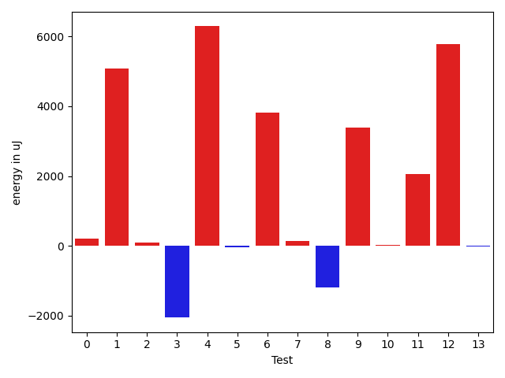
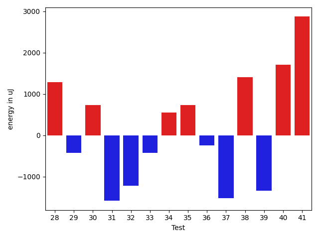
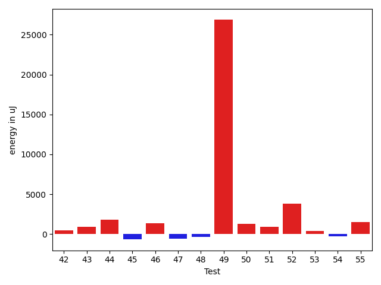
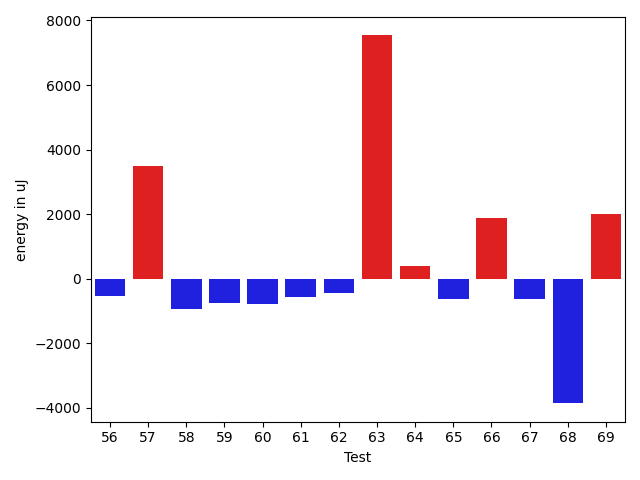
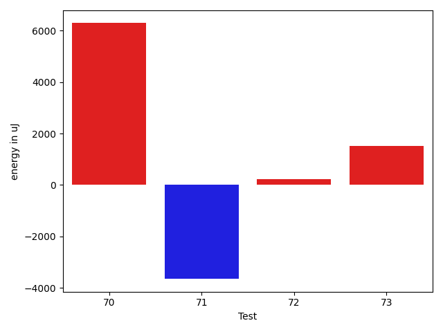

# gson 11a29b

https://github.com/google/gson/commit/11a29b

## Delta Energy per test method

| ID | EnergyV1 | EnergyV2 | DeltaEnergy | σV1 | σV2 |
| --- | --- | --- | --- | --- | --- |
| 0 | 36499 | 36865 | 366 | 3362.546966091465 | 4075.7933863931244 |
| 1 | 37658 | 37842 | 184 | 42525.8177797475 | 56564.73092358922 |
| 2 | 36865 | 36499 | -366 | 26382.624817740707 | 21580.56921926527 |
| 3 | 35217 | 32776 | -2441 | 8114.783548708342 | 7647.127316148598 |
| 4 | 39185 | 63171 | 23986 | 17491.125447674658 | 19127.792388621907 |
| 5 | 37048 | 36194 | -854 | 3856.7173445327617 | 7456.448432030433 |
| 6 | 35034 | 37414 | 2380 | 14776.902831866035 | 14303.61640422251 |
| 7 | 33997 | 34180 | 183 | 3155.2892368471175 | 2497.5113783446386 |
| 8 | 36377 | 36194 | -183 | 8467.785712903657 | 6673.709661582575 |
| 9 | 35400 | 36316 | 916 | 7071.442518191458 | 22113.53206993074 |
| 10 | 35766 | 35278 | -488 | 3766.374277737145 | 3673.553755506831 |
| 11 | 35217 | 35278 | 61 | 5508.8133350870885 | 19585.416878859935 |
| 12 | 35767 | 35705 | -62 | 5572.665043665274 | 46665.10331688425 |
| 13 | 35950 | 36011 | 61 | 3590.862510839412 | 3292.3705272884276 |
| 14 | 34302 | 34119 | -183 | 3192.5769391233503 | 3546.376359948278 |
| 15 | 35462 | 34485 | -977 | 3160.022043451765 | 6455.406567645376 |
| 16 | 35462 | 34607 | -855 | 3499.6485662011232 | 67784.03692060286 |
| 17 | 35278 | 33813 | -1465 | 2795.5076660022028 | 5872.8633070624455 |
| 18 | 36621 | 36132 | -489 | 2964.8829404078324 | 3157.3643279442745 |
| 19 | 36438 | 35095 | -1343 | 3507.5273284751465 | 4546.186828601228 |
| 20 | 34973 | 34119 | -854 | 3075.7506108667058 | 3321.461584403268 |
| 21 | 37110 | 36621 | -489 | 82379.23950919675 | 92039.28238404446 |
| 22 | 36682 | 36133 | -549 | 3423.743446610539 | 2873.193784279958 |
| 23 | 34058 | 34485 | 427 | 3173.417488379926 | 60933.28364385001 |
| 24 | 36499 | 36072 | -427 | 3516.985608387733 | 3518.2466899383285 |
| 25 | 36377 | 36377 | 0 | 4692.304591588969 | 4590.663024008623 |
| 26 | 35401 | 34790 | -611 | 10431.484835889381 | 10662.177724504489 |
| 27 | 35584 | 35888 | 304 | 5491.679908007944 | 15543.768030468033 |
| 28 | 35095 | 36377 | 1282 | 10083.775608776385 | 12408.41423429764 |
| 29 | 36743 | 36316 | -427 | 14150.578337945466 | 12923.294074018155 |
| 30 | 36621 | 37354 | 733 | 69200.32292975755 | 64914.627030008116 |
| 31 | 66528 | 64941 | -1587 | 20814.532302777527 | 21244.34648078815 |
| 32 | 39307 | 38085 | -1222 | 83745.01847617379 | 26481.828643491455 |
| 33 | 35705 | 35279 | -426 | 11817.109100969674 | 12788.846742441716 |
| 34 | 45593 | 46142 | 549 | 18148.106932671224 | 27880.411569519336 |
| 35 | 35889 | 36621 | 732 | 7575.284169843238 | 7660.6576935124085 |
| 36 | 36499 | 36254 | -245 | 3575.201553431459 | 4631.021006290507 |
| 37 | 38757 | 37231 | -1526 | 54942.133980485814 | 36007.1220467516 |
| 38 | 35156 | 36560 | 1404 | 3166.7791502231553 | 3818.7538516213585 |
| 39 | 39002 | 37659 | -1343 | 3557.211308024985 | 3227.2190318836538 |
| 40 | 38574 | 40283 | 1709 | 45666.07377829701 | 65349.275172032205 |
| 41 | 34851 | 37720 | 2869 | 4476.31804568149 | 4254.241438624781 |
| 42 | 36682 | 37170 | 488 | 4012.0932937183807 | 4733.773714818207 |
| 43 | 36743 | 37658 | 915 | 4466.351886403162 | 4604.578267232125 |
| 44 | 35095 | 36926 | 1831 | 3948.616225421669 | 3477.3629574370148 |
| 45 | 36743 | 36071 | -672 | 3725.7262308843897 | 3695.7679997194723 |
| 46 | 36865 | 38208 | 1343 | 3571.461627065311 | 3871.9009039488596 |
| 47 | 37170 | 36560 | -610 | 63901.66482991015 | 51466.35355502986 |
| 48 | 35828 | 35461 | -367 | 8242.609941638631 | 6941.683421331131 |
| 49 | 437865 | 464721 | 26856 | 161836.7201760626 | 154644.39943119363 |
| 50 | 64391 | 65674 | 1283 | 21636.131741436177 | 29082.1189547929 |
| 51 | 39307 | 40222 | 915 | 48364.54039262227 | 57187.50467390515 |
| 52 | 74341 | 78125 | 3784 | 25635.15173788972 | 26125.95684532466 |
| 53 | 37110 | 37476 | 366 | 155045.30402330612 | 193274.33247656678 |
| 54 | 35279 | 34973 | -306 | 7648.043412318184 | 8022.688935739512 |
| 55 | 36499 | 38025 | 1526 | 14988.365393541932 | 12378.92131941254 |
| 56 | 36438 | 35705 | -733 | 5169.185605172055 | 3831.194215643347 |
| 57 | 38696 | 38635 | -61 | 54129.33064231559 | 68404.34990129936 |
| 58 | 37170 | 36072 | -1098 | 3565.606165402835 | 3508.317157524071 |
| 59 | 36316 | 36376 | 60 | 4129.611570657188 | 3654.732694353243 |
| 60 | 39001 | 38147 | -854 | 19043.97578649522 | 16484.528398654347 |
| 61 | 36804 | 35644 | -1160 | 4572.058369495299 | 3941.2100208832994 |
| 62 | 38269 | 39062 | 793 | 25645.503604064666 | 25800.706861201863 |
| 63 | 41077 | 39306 | -1771 | 46754.280255685146 | 52376.88565531555 |
| 64 | 40161 | 38940 | -1221 | 56398.27983220962 | 50901.4013801343 |
| 65 | 35706 | 35583 | -123 | 3629.7297733759556 | 4563.252713097738 |
| 66 | 34790 | 36377 | 1587 | 3751.280750038411 | 3826.4722512517974 |
| 67 | 36255 | 35766 | -489 | 3663.1831103563472 | 3399.089296030268 |
| 68 | 38513 | 37536 | -977 | 10796.463641263652 | 3397.459703941947 |
| 69 | 35156 | 37903 | 2747 | 3406.468154848949 | 3443.3280489185363 |
| 70 | 37719 | 35767 | -1952 | 4141.7246388883705 | 17060.583257967497 |
| 71 | 36805 | 37475 | 670 | 14918.017096445617 | 3538.1979008815306 |
| 72 | 38513 | 38086 | -427 | 3938.857652924259 | 3977.1867098193547 |
| 73 | 35950 | 38207 | 2257 | 2755.915864905507 | 2641.4972041041315 |

## Delta Duration per test method

| ID | DurationV1 | DurationsV2 | DeltaDuration |
| --- | --- | --- | --- |
| 0 | 851706.8035714285 | 849332.8627450981 | -2373.9408263304504 |
| 1 | 1236536.7352941176 | 1389573.126984127 | 153036.3916900095 |
| 2 | 1384571.988095238 | 1432627.8375 | 48055.8494047618 |
| 3 | 717961.0294117647 | 692496.8709677419 | -25464.15844402276 |
| 4 | 1658814.9677419355 | 1816265.4888888889 | 157450.52114695334 |
| 5 | 739101.4090909091 | 773672.7105263158 | 34571.301435406785 |
| 6 | 1416097.2027027027 | 1470170.6097560977 | 54073.40705339494 |
| 7 | 626805.0 | 762314.46875 | 135509.46875 |
| 8 | 1066299.6315789474 | 1059608.3384615385 | -6691.2931174088735 |
| 9 | 1014865.1875 | 1151910.347826087 | 137045.16032608692 |
| 10 | 717147.375 | 716371.8157894737 | -775.5592105262913 |
| 11 | 898524.7666666667 | 1035004.393442623 | 136479.62677595625 |
| 12 | 1151062.7466666666 | 1393081.281690141 | 242018.53502347437 |
| 13 | 753671.6170212766 | 800828.4444444445 | 47156.82742316788 |
| 14 | 646772.6333333333 | 636692.76 | -10079.873333333293 |
| 15 | 690445.1379310344 | 665032.731707317 | -25412.40622371738 |
| 16 | 765941.2888888889 | 1365509.2790697673 | 599567.9901808784 |
| 17 | 899132.6041666666 | 937221.9565217391 | 38089.35235507251 |
| 18 | 640787.8484848485 | 729475.05 | 88687.20151515154 |
| 19 | 739888.4 | 723654.1219512195 | -16234.278048780514 |
| 20 | 812922.6444444444 | 817376.5833333334 | 4453.9388888889225 |
| 21 | 1482194.02 | 1802461.7555555555 | 320267.73555555544 |
| 22 | 770312.5476190476 | 749709.5384615385 | -20603.009157509077 |
| 23 | 583306.7083333334 | 966255.3793103448 | 382948.67097701144 |
| 24 | 844288.7627118644 | 869159.2592592592 | 24870.49654739478 |
| 25 | 893357.7777777778 | 912713.62 | 19355.842222222243 |
| 26 | 1419940.8041237113 | 1362717.1263157895 | -57223.67780792178 |
| 27 | 1188401.2142857143 | 1238143.175 | 49741.96071428573 |
| 28 | 1339430.8387096773 | 1307247.0 | -32183.838709677337 |
| 29 | 1442987.206185567 | 1416740.3673469387 | -26246.83883862826 |
| 30 | 1971717.4361702127 | 1975342.5 | 3625.0638297873084 |
| 31 | 2145798.101010101 | 2048511.4545454546 | -97286.64646464633 |
| 32 | 1966936.3516483516 | 1695527.0898876404 | -271409.2617607112 |
| 33 | 1380775.0 | 1325032.6315789474 | -55742.36842105258 |
| 34 | 1819602.6262626264 | 1896842.383838384 | 77239.75757575757 |
| 35 | 1125338.9 | 1155255.6417910447 | 29916.741791044828 |
| 36 | 960570.8305084746 | 967589.7611940298 | 7018.930685555213 |
| 37 | 1805396.2264150945 | 1346741.8591549296 | -458654.3672601648 |
| 38 | 877894.1842105263 | 874533.9107142857 | -3360.2734962406103 |
| 39 | 619711.2307692308 | 562181.8636363636 | -57529.367132867104 |
| 40 | 1323778.5714285714 | 2067103.5 | 743324.9285714286 |
| 41 | 612182.1875 | 578741.4285714285 | -33440.75892857148 |
| 42 | 755359.275 | 712788.5757575758 | -42570.69924242422 |
| 43 | 798467.2708333334 | 738429.3333333334 | -60037.9375 |
| 44 | 867686.9464285715 | 849133.1964285715 | -18553.75 |
| 45 | 874970.45 | 830040.5652173914 | -44929.8847826086 |
| 46 | 814135.44 | 839983.18 | 25847.740000000107 |
| 47 | 2212536.3396226414 | 1808491.8490566039 | -404044.4905660376 |
| 48 | 1001068.96 | 964429.2 | -36639.76000000001 |
| 49 | 12646335.232323233 | 12853043.04040404 | 206707.80808080733 |
| 50 | 2016337.2121212122 | 2035898.5454545454 | 19561.333333333256 |
| 51 | 1870176.842857143 | 1846026.4794520547 | -24150.363405088196 |
| 52 | 2494143.1515151514 | 2421586.515151515 | -72556.63636363624 |
| 53 | 2064017.8591549296 | 2041804.7454545454 | -22213.113700384274 |
| 54 | 1139162.3684210526 | 1090403.126984127 | -48759.241436925484 |
| 55 | 1303181.3181818181 | 1253958.1392405063 | -49223.17894131178 |
| 56 | 1015910.6176470588 | 992355.8524590164 | -23554.765188042424 |
| 57 | 1561966.9545454546 | 1627564.1219512196 | 65597.16740576504 |
| 58 | 651730.282051282 | 720395.2222222222 | 68664.94017094024 |
| 59 | 839414.1935483871 | 798903.7894736842 | -40510.404074702994 |
| 60 | 1177681.1739130435 | 1182460.6458333333 | 4779.471920289798 |
| 61 | 659742.4736842106 | 627821.15625 | -31921.317434210563 |
| 62 | 1637057.4375 | 1616065.7590361445 | -20991.678463855525 |
| 63 | 1403176.1627906978 | 1716127.825 | 312951.6622093022 |
| 64 | 1563933.6666666667 | 1558132.4871794872 | -5801.179487179499 |
| 65 | 655938.1818181818 | 587222.5405405406 | -68715.64127764117 |
| 66 | 890044.6129032258 | 827521.68 | -62522.93290322577 |
| 67 | 685053.3333333334 | 614033.9411764706 | -71019.39215686277 |
| 68 | 721231.0 | 596995.1428571428 | -124235.85714285716 |
| 69 | 655488.2 | 563331.5555555555 | -92156.64444444445 |
| 70 | 662272.625 | 1184783.5238095238 | 522510.8988095238 |
| 71 | 836407.875 | 445619.8333333333 | -390788.0416666667 |
| 72 | 791673.9 | 500991.60869565216 | -290682.29130434786 |
| 73 | 764940.8076923077 | 694829.1153846154 | -70111.69230769237 |

## Misc.

| ID | Test Class | Test Method |
| --- | --- | --- |
| 0 | com.google.gson.functional.CustomDeserializerTest | testDefaultConstructorNotCalledOnField |
| 1 | com.google.gson.functional.CustomDeserializerTest | testDefaultConstructorNotCalledOnObject |
| 2 | com.google.gson.functional.ObjectTest | testDirectedAcyclicGraphDeserialization |
| 3 | com.google.gson.functional.ObjectTest | testEmptyCollectionInAnObjectDeserialization |
| 4 | com.google.gson.functional.ObjectTest | testArrayOfArraysDeserialization |
| 5 | com.google.gson.functional.ObjectTest | testClassWithTransientFieldsDeserialization |
| 6 | com.google.gson.functional.ObjectTest | testSubInterfacesOfCollectionDeserialization |
| 7 | com.google.gson.functional.ObjectTest | testObjectFieldNamesWithoutQuotesDeserialization |
| 8 | com.google.gson.functional.ObjectTest | testNestedDeserialization |
| 9 | com.google.gson.functional.ObjectTest | testInheritenceDeserialization |
| 10 | com.google.gson.functional.ObjectTest | testBagOfPrimitiveWrappersDeserialization |
| 11 | com.google.gson.functional.ObjectTest | testInnerClassDeserialization |
| 12 | com.google.gson.functional.ObjectTest | testArrayOfObjectsDeserialization |
| 13 | com.google.gson.functional.ObjectTest | testNullFieldsDeserialization |
| 14 | com.google.gson.functional.ObjectTest | testNullObjectFieldsDeserialization |
| 15 | com.google.gson.functional.ObjectTest | testPrivateNoArgConstructorDeserialization |
| 16 | com.google.gson.functional.ObjectTest | testClassWithTransientFieldsDeserializationTransientFieldsPassedInJsonAreIgnored |
| 17 | com.google.gson.functional.ObjectTest | testNullArraysDeserialization |
| 18 | com.google.gson.functional.ObjectTest | testClassWithEnumFieldDeserialization |
| 19 | com.google.gson.functional.ObjectTest | testJsonInMixedQuotesDeserialization |
| 20 | com.google.gson.functional.ObjectTest | testPrimitiveArrayInAnObjectDeserialization |
| 21 | com.google.gson.functional.ObjectTest | testJsonInSingleQuotesDeserialization |
| 22 | com.google.gson.functional.ObjectTest | testBagOfPrimitivesDeserialization |
| 23 | com.google.gson.functional.ObjectTest | testNullPrimitiveFieldsDeserialization |
| 24 | com.google.gson.functional.CollectionTest | testNullsInListDeserialization |
| 25 | com.google.gson.functional.CollectionTest | testNullsInListSerialization |
| 26 | com.google.gson.functional.ParameterizedTypesTest | testVariableTypeArrayDeserialization |
| 27 | com.google.gson.functional.ParameterizedTypesTest | testParameterizedTypeWithReaderDeserialization |
| 28 | com.google.gson.functional.ParameterizedTypesTest | testVariableTypeDeserialization |
| 29 | com.google.gson.functional.ParameterizedTypesTest | testParameterizedTypeGenericArraysDeserialization |
| 30 | com.google.gson.functional.ParameterizedTypesTest | testParameterizedTypeDeserialization |
| 31 | com.google.gson.functional.ParameterizedTypesTest | testVariableTypeFieldsAndGenericArraysDeserialization |
| 32 | com.google.gson.functional.ParameterizedTypesTest | testTypesWithMultipleParametersDeserialization |
| 33 | com.google.gson.functional.ParameterizedTypesTest | testParameterizedTypeWithVariableTypeDeserialization |
| 34 | com.google.gson.functional.ParameterizedTypesTest | testParameterizedTypesWithCustomDeserializer |
| 35 | com.google.gson.functional.VersioningTest | testVersionedGsonMixingSinceAndUntilDeserialization |
| 36 | com.google.gson.functional.VersioningTest | testVersionedClassesDeserialization |
| 37 | com.google.gson.functional.VersioningTest | testVersionedUntilDeserialization |
| 38 | com.google.gson.functional.VersioningTest | testVersionedGsonWithUnversionedClassesDeserialization |
| 39 | com.google.gson.functional.ReadersWritersTest | testTopLevelNullObjectDeserializationWithReaderAndSerializeNulls |
| 40 | com.google.gson.functional.ReadersWritersTest | testReaderForDeserialization |
| 41 | com.google.gson.functional.ReadersWritersTest | testTopLevelNullObjectDeserializationWithReader |
| 42 | com.google.gson.functional.DefaultTypeAdaptersTest | testBigIntegerFieldDeserialization |
| 43 | com.google.gson.functional.DefaultTypeAdaptersTest | testBigDecimalFieldDeserialization |
| 44 | com.google.gson.functional.MapTest | testMapSerializationWithNullValueButSerializeNulls |
| 45 | com.google.gson.functional.MapTest | testMapDeserializationWithNullValue |
| 46 | com.google.gson.functional.MapTest | testMapSerializationWithNullValue |
| 47 | com.google.gson.functional.NamingPolicyTest | testGsonWithNonDefaultFieldNamingPolicyDeserialiation |
| 48 | com.google.gson.functional.NamingPolicyTest | testGsonWithSerializedNameFieldNamingPolicyDeserialization |
| 49 | com.google.gson.functional.ConcurrencyTest | testMultiThreadDeserialization |
| 50 | com.google.gson.functional.ConcurrencyTest | testSingleThreadDeserialization |
| 51 | com.google.gson.functional.EscapingTest | testEscapingObjectFields |
| 52 | com.google.gson.functional.UncategorizedTest | testReturningDerivedClassesDuringDeserialization |
| 53 | com.google.gson.functional.CustomTypeAdaptersTest | testCustomDeserializers |
| 54 | com.google.gson.functional.CustomTypeAdaptersTest | testCustomSerializerForLong |
| 55 | com.google.gson.functional.CustomTypeAdaptersTest | testCustomDeserializerForLong |
| 56 | com.google.gson.functional.CustomTypeAdaptersTest | testCustomNestedDeserializers |
| 57 | com.google.gson.functional.ExposeFieldsTest | testExposeAnnotationDeserialization |
| 58 | com.google.gson.functional.ExposeFieldsTest | testExposedInterfaceFieldDeserialization |
| 59 | com.google.gson.functional.NullObjectAndFieldTest | testNullWrappedPrimitiveMemberDeserialization |
| 60 | com.google.gson.functional.NullObjectAndFieldTest | testExplicitDeserializationOfNulls |
| 61 | com.google.gson.functional.NullObjectAndFieldTest | testExplicitSerializationOfNullCollectionMembers |
| 62 | com.google.gson.functional.NullObjectAndFieldTest | testExplicitSerializationOfNullArrayMembers |
| 63 | com.google.gson.functional.NullObjectAndFieldTest | testExplicitSerializationOfNulls |
| 64 | com.google.gson.functional.NullObjectAndFieldTest | testTopLevelNullObjectDeserialization |
| 65 | com.google.gson.functional.NullObjectAndFieldTest | testCustomSerializationOfNulls |
| 66 | com.google.gson.functional.NullObjectAndFieldTest | testNullWrappedPrimitiveMemberSerialization |
| 67 | com.google.gson.functional.NullObjectAndFieldTest | testExplicitSerializationOfNullStringMembers |
| 68 | com.google.gson.JsonObjectTest | testAddingNullProperties |
| 69 | com.google.gson.JsonObjectTest | testAddingCharacterProperties |
| 70 | com.google.gson.JsonObjectTest | testAddingAndRemovingObjectProperties |
| 71 | com.google.gson.JsonObjectTest | testAddingStringProperties |
| 72 | com.google.gson.JsonObjectTest | testAddingBooleanProperties |
| 73 | com.google.gson.functional.ArrayTest | testNullsInArrayDeserialization |

| Test | IterationV1 | IterationV2 | DeltaIteration |
| --- | --- | --- | --- |
| 0 | 56 | 51 | -5 |
| 1 | 68 | 63 | -5 |
| 2 | 84 | 80 | -4 |
| 3 | 34 | 31 | -3 |
| 4 | 93 | 90 | -3 |
| 5 | 44 | 38 | -6 |
| 6 | 74 | 82 | 8 |
| 7 | 35 | 32 | -3 |
| 8 | 57 | 65 | 8 |
| 9 | 64 | 69 | 5 |
| 10 | 40 | 38 | -2 |
| 11 | 60 | 61 | 1 |
| 12 | 75 | 71 | -4 |
| 13 | 47 | 54 | 7 |
| 14 | 30 | 25 | -5 |
| 15 | 29 | 41 | 12 |
| 16 | 45 | 43 | -2 |
| 17 | 48 | 46 | -2 |
| 18 | 33 | 40 | 7 |
| 19 | 40 | 41 | 1 |
| 20 | 45 | 60 | 15 |
| 21 | 50 | 45 | -5 |
| 22 | 42 | 39 | -3 |
| 23 | 24 | 29 | 5 |
| 24 | 59 | 54 | -5 |
| 25 | 45 | 50 | 5 |
| 26 | 97 | 95 | -2 |
| 27 | 84 | 80 | -4 |
| 28 | 93 | 93 | 0 |
| 29 | 97 | 98 | 1 |
| 30 | 94 | 90 | -4 |
| 31 | 99 | 99 | 0 |
| 32 | 91 | 89 | -2 |
| 33 | 93 | 95 | 2 |
| 34 | 99 | 99 | 0 |
| 35 | 70 | 67 | -3 |
| 36 | 59 | 67 | 8 |
| 37 | 53 | 71 | 18 |
| 38 | 38 | 56 | 18 |
| 39 | 26 | 22 | -4 |
| 40 | 49 | 52 | 3 |
| 41 | 16 | 28 | 12 |
| 42 | 40 | 33 | -7 |
| 43 | 48 | 39 | -9 |
| 44 | 56 | 56 | 0 |
| 45 | 60 | 46 | -14 |
| 46 | 50 | 50 | 0 |
| 47 | 53 | 53 | 0 |
| 48 | 50 | 55 | 5 |
| 49 | 99 | 99 | 0 |
| 50 | 99 | 99 | 0 |
| 51 | 70 | 73 | 3 |
| 52 | 99 | 99 | 0 |
| 53 | 71 | 55 | -16 |
| 54 | 76 | 63 | -13 |
| 55 | 88 | 79 | -9 |
| 56 | 68 | 61 | -7 |
| 57 | 44 | 41 | -3 |
| 58 | 39 | 36 | -3 |
| 59 | 62 | 38 | -24 |
| 60 | 46 | 48 | 2 |
| 61 | 38 | 32 | -6 |
| 62 | 80 | 83 | 3 |
| 63 | 43 | 40 | -3 |
| 64 | 30 | 39 | 9 |
| 65 | 33 | 37 | 4 |
| 66 | 62 | 50 | -12 |
| 67 | 36 | 34 | -2 |
| 68 | 31 | 21 | -10 |
| 69 | 20 | 18 | -2 |
| 70 | 16 | 21 | 5 |
| 71 | 16 | 18 | 2 |
| 72 | 20 | 23 | 3 |
| 73 | 26 | 26 | 0 |

| Time Label | Time (s) |
| --- | --- |
| Selection | 23.554574728012085 |
| Injection | 11.172928810119629 |
| Total | 973.1416616439819 |

