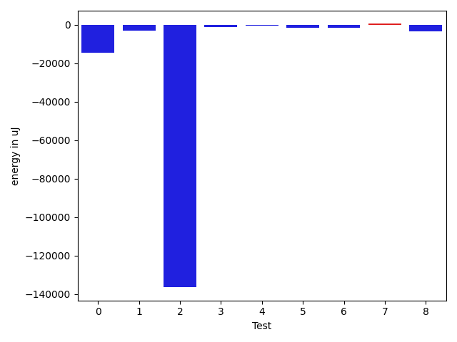

# gson 6f59bc

https://github.com/google/gson/commit/6f59bc

## Delta Energy per test method

| ID | EnergyV1 | EnergyV2 | DeltaEnergy | σV1 | σV2 |
| --- | --- | --- | --- | --- | --- |
| 0 | 235412 | 220886 | -14526 | 95576.47123727319 | 153315.77829008133 |
| 1 | 148010 | 144897 | -3113 | 238223.4343766278 | 35261.200995188745 |
| 2 | 169799 | 33325 | -136474 | 681018.1245603033 | 333034.8429794271 |
| 3 | 36194 | 34851 | -1343 | 84778.32978583385 | 68244.14680915428 |
| 4 | 34851 | 34424 | -427 | 285223.79135235434 | 280380.1256965929 |
| 5 | 36438 | 34790 | -1648 | 457182.56016092136 | 332146.19981250796 |
| 6 | 38147 | 36499 | -1648 | 150889.06896797306 | 142790.5014513374 |
| 7 | 36621 | 37049 | 428 | 134995.7911200084 | 130897.84601536379 |
| 8 | 36743 | 33386 | -3357 | 154940.12874809632 | 133051.06433182055 |

## Delta Duration per test method

| ID | DurationV1 | DurationsV2 | DeltaDuration |
| --- | --- | --- | --- |
| 0 | 6517693.29787234 | 7224330.5360824745 | 706637.2382101342 |
| 1 | 5666004.5050505055 | 4688469.888888889 | -977534.6161616165 |
| 2 | 20004901.945652176 | 3823539.069767442 | -16181362.875884734 |
| 3 | 2588078.36 | 1709426.7692307692 | -878651.5907692306 |
| 4 | 3567431.1481481483 | 3456239.189873418 | -111191.95827473048 |
| 5 | 6354970.428571428 | 3417121.423076923 | -2937849.005494505 |
| 6 | 4599274.844444444 | 4256013.025 | -343261.81944444403 |
| 7 | 3945135.6296296297 | 3827632.2448979593 | -117503.38473167038 |
| 8 | 3763246.1 | 3148367.3055555555 | -614878.7944444446 |

## Misc.

| ID | Test Class | Test Method |
| --- | --- | --- |
| 0 | com.google.gson.functional.VersioningTest | testVersionedClassesDeserialization |
| 1 | com.google.gson.functional.VersioningTest | testVersionedGsonWithUnversionedClassesSerialization |
| 2 | com.google.gson.functional.VersioningTest | testVersionedClassesSerialization |
| 3 | com.google.gson.functional.VersioningTest | testIgnoreLaterVersionClassDeserialization |
| 4 | com.google.gson.functional.VersioningTest | testVersionedGsonWithUnversionedClassesDeserialization |
| 5 | com.google.gson.functional.VersioningTest | testIgnoreLaterVersionClassSerialization |
| 6 | com.google.gson.VersionExclusionStrategyTest | testClassAndFieldAreAheadInVersion |
| 7 | com.google.gson.VersionExclusionStrategyTest | testClassAndFieldAreBehindInVersion |
| 8 | com.google.gson.VersionExclusionStrategyTest | testClassAndFieldAreAtSameVersion |

| Test | IterationV1 | IterationV2 | DeltaIteration |
| --- | --- | --- | --- |
| 0 | 94 | 97 | 3 |
| 1 | 99 | 99 | 0 |
| 2 | 92 | 86 | -6 |
| 3 | 50 | 39 | -11 |
| 4 | 81 | 79 | -2 |
| 5 | 63 | 52 | -11 |
| 6 | 45 | 40 | -5 |
| 7 | 54 | 49 | -5 |
| 8 | 30 | 36 | 6 |

| Time Label | Time (s) |
| --- | --- |
| Selection | 22.238942623138428 |
| Injection | 8.022527933120728 |
| Total | 915.2107231616974 |

