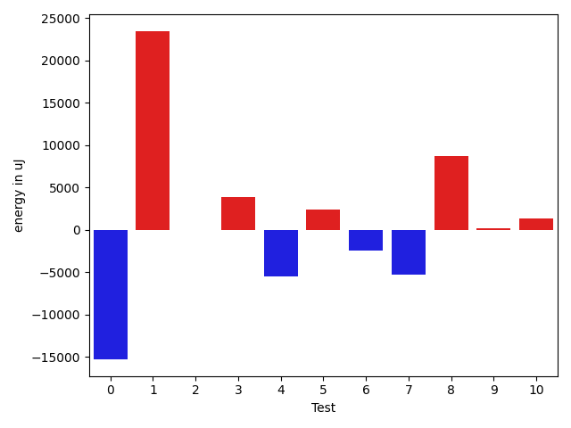
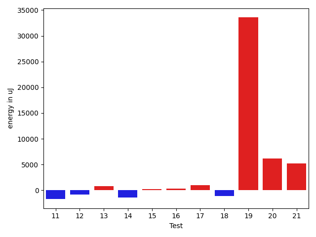
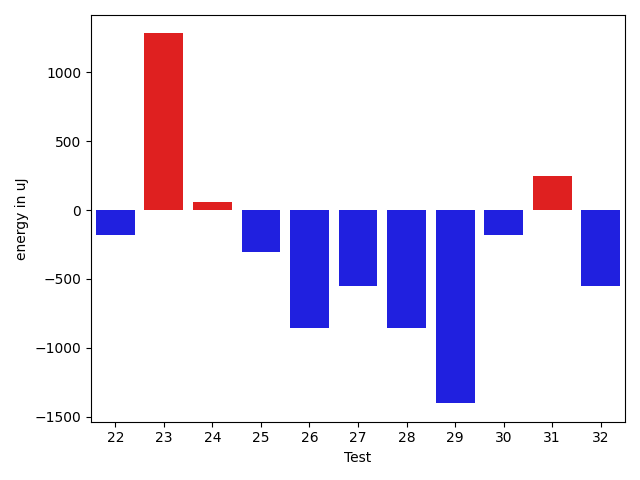
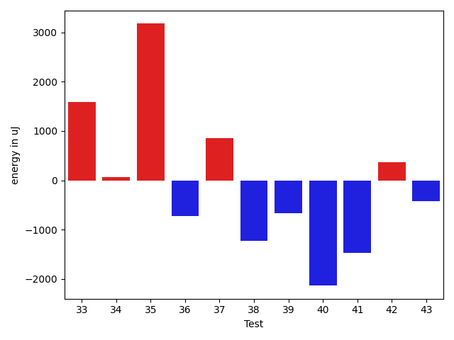
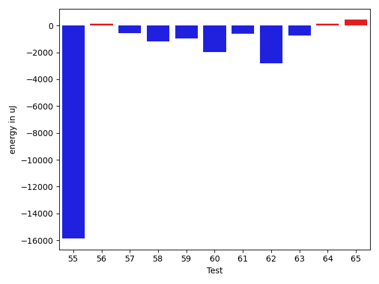
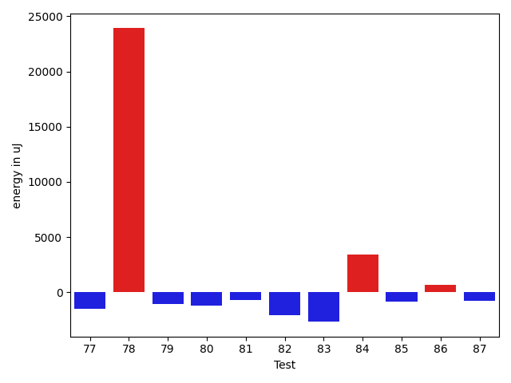
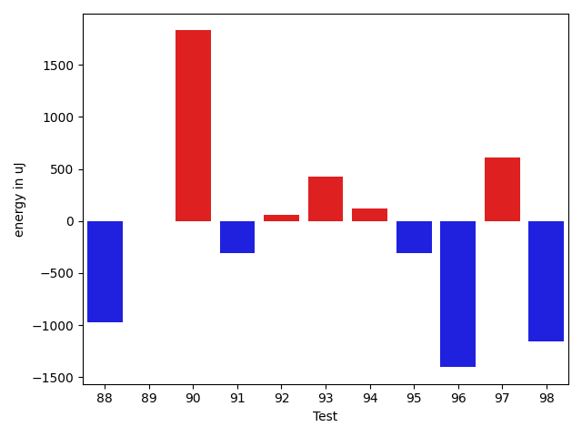
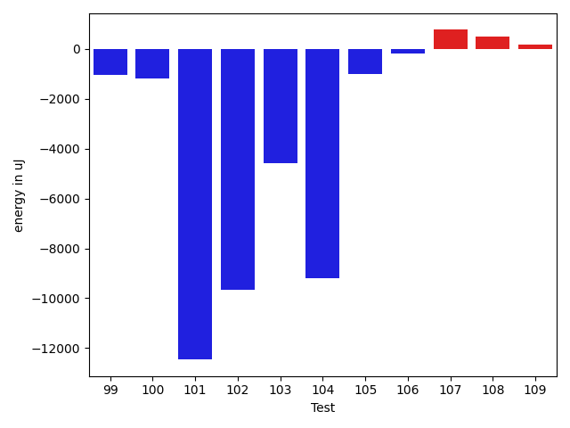
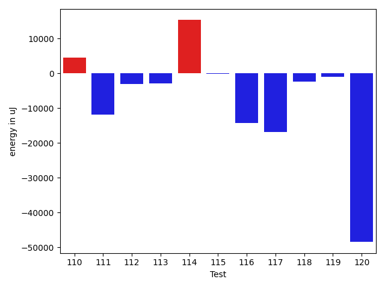
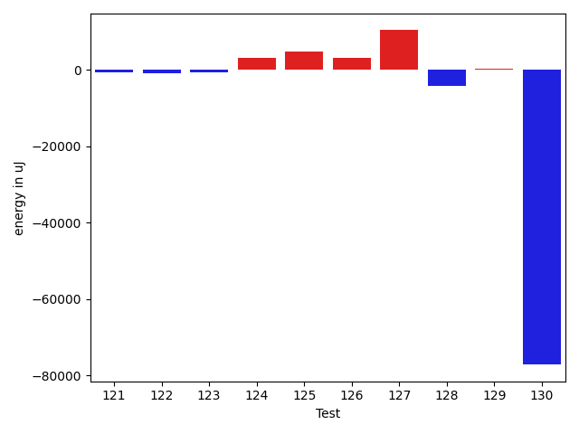

# gson 5ae7e1

https://github.com/google/gson/commit/5ae7e1

## Delta Energy per test method

| ID | EnergyV1 | EnergyV2 | DeltaEnergy | σV1 | σV2 |
| --- | --- | --- | --- | --- | --- |
| 0 | 38880 | 35278 | -3602 | 60274.14021818162 | 4605.486554100446 |
| 1 | 37963 | 36865 | -1098 | 5344.1129567894195 | 92276.01925304272 |
| 2 | 36499 | 37231 | 732 | 4169.05345110862 | 3818.0782698552007 |
| 3 | 34973 | 37170 | 2197 | 2608.885619497305 | 9748.47195295755 |
| 4 | 35156 | 35218 | 62 | 29172.736133111746 | 5769.007013603846 |
| 5 | 33081 | 33570 | 489 | 2764.9066468094243 | 12501.692306524192 |
| 6 | 62012 | 63843 | 1831 | 48760.65244710304 | 35792.06363767679 |
| 7 | 36133 | 35156 | -977 | 20261.791018852866 | 6286.823626878814 |
| 8 | 36255 | 40283 | 4028 | 15897.751462904684 | 21549.554993580696 |
| 9 | 34851 | 35156 | 305 | 3079.5077548996355 | 4645.997775543714 |
| 10 | 35034 | 34668 | -366 | 14252.711125406668 | 14591.391376987012 |
| 11 | 35644 | 34790 | -854 | 6374.155298869387 | 3722.367873845262 |
| 12 | 33569 | 33814 | 245 | 3696.446869637801 | 3263.728107548176 |
| 13 | 33386 | 34729 | 1343 | 3617.4876353760724 | 3336.5744842961617 |
| 14 | 34424 | 33447 | -977 | 10164.194371239644 | 7738.911263986228 |
| 15 | 35401 | 35766 | 365 | 3925.9145673333237 | 3922.5077294464218 |
| 16 | 33813 | 35461 | 1648 | 3442.2496962790938 | 2861.2090964241265 |
| 17 | 33447 | 33813 | 366 | 3170.7818505266496 | 6596.188677733836 |
| 18 | 34424 | 34057 | -367 | 8711.21569790503 | 7766.274722306941 |
| 19 | 35706 | 38513 | 2807 | 72153.05481983638 | 105970.51849818105 |
| 20 | 33631 | 37048 | 3417 | 3702.52773822746 | 11887.583585842322 |
| 21 | 67016 | 73364 | 6348 | 47965.65547489092 | 45654.60545471665 |
| 22 | 34057 | 33875 | -182 | 6079.157206193678 | 3669.7273301017776 |
| 23 | 33691 | 34973 | 1282 | 3509.8048465608204 | 3488.224632154825 |
| 24 | 34729 | 34790 | 61 | 72963.92649921468 | 2467.9755320234976 |
| 25 | 34485 | 34180 | -305 | 5644.548451607444 | 6101.0598154133995 |
| 26 | 34302 | 33447 | -855 | 3350.368401708896 | 3283.9284367354903 |
| 27 | 35279 | 34729 | -550 | 11486.6653422027 | 7952.949015634926 |
| 28 | 35523 | 34668 | -855 | 18590.80026723941 | 41820.28728625984 |
| 29 | 34607 | 33204 | -1403 | 3296.828542634401 | 3216.2633286420323 |
| 30 | 33265 | 33081 | -184 | 3652.986462480478 | 4345.638949613739 |
| 31 | 33630 | 33874 | 244 | 3290.3610230827594 | 2873.391464420463 |
| 32 | 33935 | 33386 | -549 | 5905.1069928918305 | 3602.3730459136746 |
| 33 | 32348 | 33935 | 1587 | 4132.189327670579 | 3452.3000843566565 |
| 34 | 35218 | 35278 | 60 | 18154.37586673204 | 25641.35003048401 |
| 35 | 33203 | 36377 | 3174 | 3667.232638227316 | 3840.1795333195337 |
| 36 | 34790 | 34058 | -732 | 3244.132267154029 | 3505.12653487862 |
| 37 | 35156 | 36010 | 854 | 3081.012124259461 | 3124.6965299740923 |
| 38 | 34912 | 33691 | -1221 | 6946.324076289523 | 3983.588531693974 |
| 39 | 33752 | 33081 | -671 | 3331.7352216395802 | 4063.8311850797204 |
| 40 | 33752 | 31616 | -2136 | 3253.7577945569274 | 3145.9960153962193 |
| 41 | 35035 | 33569 | -1466 | 44523.29621833192 | 2795.2657616406873 |
| 42 | 33386 | 33752 | 366 | 4140.19145373662 | 6175.153699275882 |
| 43 | 33936 | 33508 | -428 | 3764.327226126405 | 3543.2353342108117 |
| 44 | 34240 | 34058 | -182 | 9466.782617595089 | 9855.763069987619 |
| 45 | 35767 | 34546 | -1221 | 10610.054625062701 | 8024.887073832249 |
| 46 | 128478 | 127929 | -549 | 74660.15148922373 | 69938.78157989688 |
| 47 | 34241 | 34362 | 121 | 10375.828969238506 | 11961.27977099052 |
| 48 | 83191 | 93323 | 10132 | 24438.02408406109 | 23113.62975320245 |
| 49 | 34790 | 34424 | -366 | 14020.813481439482 | 10471.214603888546 |
| 50 | 38208 | 36499 | -1709 | 84164.06269683773 | 83196.23377761754 |
| 51 | 66589 | 64514 | -2075 | 19908.0699508527 | 21622.245325611457 |
| 52 | 38452 | 37781 | -671 | 17962.973331970665 | 17020.287620587955 |
| 53 | 40527 | 40344 | -183 | 47006.84348320399 | 45303.07049777124 |
| 54 | 34180 | 33692 | -488 | 9619.750037724432 | 10118.37465484674 |
| 55 | 55297 | 39428 | -15869 | 19313.66980952813 | 18362.096836595396 |
| 56 | 33752 | 33875 | 123 | 3642.6960344965664 | 4997.69973543808 |
| 57 | 34729 | 34180 | -549 | 4067.069022630702 | 3413.670217562464 |
| 58 | 36011 | 34851 | -1160 | 4284.062479529308 | 7533.442666401529 |
| 59 | 34607 | 33630 | -977 | 6842.7167390111435 | 9433.062535139394 |
| 60 | 35461 | 33508 | -1953 | 3851.5264318027575 | 3855.7479494169625 |
| 61 | 38025 | 37414 | -611 | 347327.68111088424 | 243595.3083583629 |
| 62 | 71533 | 68725 | -2808 | 18286.944679805678 | 22396.58589522217 |
| 63 | 37110 | 36377 | -733 | 67469.31279898658 | 61524.23025664877 |
| 64 | 34851 | 34973 | 122 | 5601.575933228154 | 5231.7594602431545 |
| 65 | 35156 | 35584 | 428 | 12320.472143954768 | 15480.859586735276 |
| 66 | 36865 | 36499 | -366 | 38983.4974648948 | 45731.46673333893 |
| 67 | 35645 | 35217 | -428 | 4093.769305769199 | 5613.917586727591 |
| 68 | 91125 | 101318 | 10193 | 87491.25286189782 | 82892.85069920764 |
| 69 | 36255 | 36254 | -1 | 17076.15803584946 | 3969.1053607697945 |
| 70 | 37171 | 35523 | -1648 | 3743.2203685463137 | 10356.106245223553 |
| 71 | 37414 | 37658 | 244 | 64697.92755880563 | 25139.081803263613 |
| 72 | 37354 | 37109 | -245 | 78420.53453971779 | 71237.29452447571 |
| 73 | 35583 | 36072 | 489 | 3447.002656737525 | 3193.077499842432 |
| 74 | 36377 | 35156 | -1221 | 4092.4499031602745 | 3313.50198165023 |
| 75 | 39246 | 38513 | -733 | 16756.573166527724 | 23026.365240864194 |
| 76 | 38880 | 38330 | -550 | 20984.72064783751 | 24283.509738351666 |
| 77 | 37353 | 35278 | -2075 | 4529.704500226809 | 4121.629095343705 |
| 78 | 41077 | 41382 | 305 | 63008.80834773754 | 81750.53184246396 |
| 79 | 36682 | 36011 | -671 | 3918.8390955923232 | 4344.216796547954 |
| 80 | 35522 | 36011 | 489 | 4258.679547548034 | 4415.462093395934 |
| 81 | 35950 | 35218 | -732 | 5103.1225365714945 | 3267.1269764931544 |
| 82 | 37109 | 35401 | -1708 | 4126.0971665122 | 3787.5215689761467 |
| 83 | 75439 | 75866 | 427 | 41296.06193158669 | 32929.89912399827 |
| 84 | 110901 | 98266 | -12635 | 365291.43210079457 | 339581.33138659823 |
| 85 | 35523 | 35462 | -61 | 6823.627489786865 | 5865.773747646117 |
| 86 | 37232 | 36438 | -794 | 53051.236111411876 | 52542.46144616109 |
| 87 | 35523 | 35279 | -244 | 4013.2410293908047 | 3663.5250338437704 |
| 88 | 36926 | 35949 | -977 | 4139.055121353182 | 4018.9158909804905 |
| 89 | 34179 | 34180 | 1 | 6884.163353345873 | 5334.522108397339 |
| 90 | 34240 | 36071 | 1831 | 2954.5039067489247 | 3829.659139733354 |
| 91 | 34607 | 34301 | -306 | 8544.191959779204 | 8888.642515030062 |
| 92 | 34729 | 34790 | 61 | 4245.939745914836 | 4370.747976154224 |
| 93 | 33936 | 34362 | 426 | 3842.3769881660915 | 3833.603366800079 |
| 94 | 35950 | 36072 | 122 | 4171.618832576872 | 3993.358314688228 |
| 95 | 36132 | 35828 | -304 | 4325.688512861217 | 3968.0207444104467 |
| 96 | 38818 | 37414 | -1404 | 64492.92659080607 | 57111.35694271088 |
| 97 | 37597 | 38207 | 610 | 55557.90154352357 | 45495.995550966196 |
| 98 | 36438 | 35278 | -1160 | 4218.318916345705 | 3549.66624235276 |
| 99 | 35950 | 34363 | -1587 | 3682.1208495400147 | 3684.186524324826 |
| 100 | 34484 | 32898 | -1586 | 4473.571286517691 | 3178.220168584927 |
| 101 | 44006 | 39246 | -4760 | 54466.68284843417 | 32999.6992994359 |
| 102 | 257751 | 242065 | -15686 | 87699.724829626 | 84414.39843080234 |
| 103 | 341064 | 335570 | -5494 | 105857.96388627039 | 109469.16973270955 |
| 104 | 69458 | 48767 | -20691 | 54247.35822398393 | 45695.95972289263 |
| 105 | 36499 | 33814 | -2685 | 4016.1933283049752 | 4149.130332439671 |
| 106 | 38147 | 37231 | -916 | 13346.91821562251 | 14064.003590309096 |
| 107 | 38513 | 37780 | -733 | 15747.929442611454 | 18818.67996293411 |
| 108 | 35645 | 35828 | 183 | 3727.0980240833633 | 5273.076873724231 |
| 109 | 35461 | 35340 | -121 | 3799.368866089768 | 3380.2937068211986 |
| 110 | 37048 | 37292 | 244 | 63171.79939345434 | 63849.58108750597 |
| 111 | 114746 | 126892 | 12146 | 272479.0504570267 | 207126.32684662566 |
| 112 | 36865 | 34912 | -1953 | 7596.392448573311 | 3856.8030471330794 |
| 113 | 36865 | 38086 | 1221 | 42227.232037105576 | 36704.7649054476 |
| 114 | 37292 | 38818 | 1526 | 30397.960419294144 | 59302.36722487113 |
| 115 | 71228 | 71838 | 610 | 27395.470932582968 | 19719.139664706785 |
| 116 | 41015 | 38758 | -2257 | 73447.16877760783 | 64488.56421534493 |
| 117 | 41626 | 38329 | -3297 | 33089.91753589822 | 13011.682368159065 |
| 118 | 69336 | 74523 | 5187 | 147574.17374357677 | 142939.37566619017 |
| 119 | 37598 | 36804 | -794 | 5464.440829717859 | 3855.6233674626646 |
| 120 | 37781 | 36926 | -855 | 331855.4162177675 | 201197.19376438516 |
| 121 | 36255 | 37781 | 1526 | 4673.000949650292 | 4559.082129285483 |
| 122 | 39246 | 37415 | -1831 | 7718.912457075803 | 9506.786540203144 |
| 123 | 35645 | 35828 | 183 | 4632.280619899511 | 4000.3661259032574 |
| 124 | 40588 | 43152 | 2564 | 106947.54151596453 | 115868.63289446945 |
| 125 | 39490 | 38574 | -916 | 81848.00011625706 | 96151.27108314054 |
| 126 | 41016 | 39306 | -1710 | 48511.94131908549 | 49793.77812773776 |
| 127 | 35644 | 38330 | 2686 | 3360.783278701559 | 17803.476292634536 |
| 128 | 36438 | 37292 | 854 | 78723.40695901142 | 58105.21976229237 |
| 129 | 36682 | 36682 | 0 | 3013.1974313011756 | 3100.3212902469077 |
| 130 | 38269 | 38758 | 489 | 485975.4686064668 | 376576.89085965557 |

## Delta Duration per test method

| ID | DurationV1 | DurationsV2 | DeltaDuration |
| --- | --- | --- | --- |
| 0 | 1414578.9 | 843851.7555555556 | -570727.1444444443 |
| 1 | 843952.6666666666 | 1821628.2702702703 | 977675.6036036037 |
| 2 | 511578.9411764706 | 603205.0588235294 | 91626.1176470588 |
| 3 | 754619.9545454546 | 1004949.52 | 250329.56545454543 |
| 4 | 1168705.647887324 | 1018572.3970588235 | -150133.2508285005 |
| 5 | 575206.3823529412 | 668859.3333333334 | 93652.95098039217 |
| 6 | 2112907.9032258065 | 2115441.0674157306 | 2533.1641899240203 |
| 7 | 1031376.1041666666 | 814204.1052631579 | -217171.99890350876 |
| 8 | 1465842.6210526316 | 1662212.8181818181 | 196370.19712918648 |
| 9 | 580255.9032258064 | 510974.39285714284 | -69281.51036866358 |
| 10 | 1235469.1392405063 | 1387373.961038961 | 151904.82179845474 |
| 11 | 624178.5151515151 | 598625.2941176471 | -25553.22103386803 |
| 12 | 642612.6060606061 | 582944.4 | -59668.206060606055 |
| 13 | 805856.3777777777 | 901797.0454545454 | 95940.66767676768 |
| 14 | 1038026.6393442623 | 990680.1525423729 | -47346.486801889376 |
| 15 | 654171.225 | 771768.7073170731 | 117597.48231707315 |
| 16 | 619283.8787878788 | 665943.5172413794 | 46659.63845350058 |
| 17 | 1065347.3287671234 | 1069888.5569620254 | 4541.2281949019525 |
| 18 | 1090506.4556962026 | 1152949.4125 | 62442.95680379751 |
| 19 | 1269823.2765957448 | 2510194.3333333335 | 1240371.0567375887 |
| 20 | 630820.5 | 905081.8157894737 | 274261.3157894737 |
| 21 | 2694979.2268041237 | 2785860.7448979593 | 90881.51809383556 |
| 22 | 955820.873015873 | 874941.0714285715 | -80879.80158730154 |
| 23 | 922948.5964912281 | 918365.358490566 | -4583.238000662066 |
| 24 | 1244400.0697674418 | 711056.2666666667 | -533343.8031007751 |
| 25 | 1004686.0149253731 | 993145.8412698413 | -11540.173655531835 |
| 26 | 666905.9090909091 | 679275.52 | 12369.61090909096 |
| 27 | 838341.6153846154 | 728878.2702702703 | -109463.34511434508 |
| 28 | 700600.0833333334 | 837202.9714285714 | 136602.888095238 |
| 29 | 837880.1186440678 | 837333.5161290322 | -546.6025150355417 |
| 30 | 776219.6808510638 | 789541.86 | 13322.179148936179 |
| 31 | 583487.8333333334 | 632558.1935483871 | 49070.36021505378 |
| 32 | 777654.675 | 671964.7209302326 | -105689.9540697675 |
| 33 | 519544.9310344828 | 561618.4285714285 | 42073.49753694574 |
| 34 | 1002334.6206896552 | 929084.3888888889 | -73250.23180076631 |
| 35 | 717934.5128205129 | 642046.2564102564 | -75888.2564102565 |
| 36 | 836370.6923076923 | 862016.7678571428 | 25646.075549450587 |
| 37 | 625581.5789473684 | 739516.6842105263 | 113935.10526315786 |
| 38 | 617541.2222222222 | 597495.0625 | -20046.159722222248 |
| 39 | 687312.4871794871 | 699635.2727272727 | 12322.785547785577 |
| 40 | 574649.6451612903 | 548569.3666666667 | -26080.278494623606 |
| 41 | 883062.6470588235 | 445057.1176470588 | -438005.5294117647 |
| 42 | 1005686.5875 | 991854.014084507 | -13832.57341549301 |
| 43 | 870649.9047619047 | 853788.98 | -16860.924761904753 |
| 44 | 1359313.7142857143 | 1344194.7395833333 | -15118.974702381063 |
| 45 | 1298832.1789473684 | 1275144.5714285714 | -23687.607518797042 |
| 46 | 4580995.424242424 | 4603554.929292929 | 22559.50505050551 |
| 47 | 1342894.4719101123 | 1304424.2891566264 | -38470.18275348586 |
| 48 | 2873175.6363636362 | 2870169.393939394 | -3006.2424242421985 |
| 49 | 1441054.3229166667 | 1390506.4020618557 | -50547.92085481109 |
| 50 | 2291677.1157894735 | 2159311.159574468 | -132365.95621500537 |
| 51 | 2119393.888888889 | 2059486.5656565656 | -59907.3232323234 |
| 52 | 1607718.0689655172 | 1510729.224719101 | -96988.84424641612 |
| 53 | 2439186.2577319588 | 2277693.0408163266 | -161493.21691563213 |
| 54 | 1306898.7741935484 | 1292640.1789473684 | -14258.59524617996 |
| 55 | 1759315.01010101 | 1719825.5959595959 | -39489.41414141422 |
| 56 | 1141877.9871794872 | 1104985.4146341463 | -36892.57254534098 |
| 57 | 811030.7592592592 | 821528.4107142857 | 10497.65145502647 |
| 58 | 859747.8055555555 | 941631.140625 | 81883.3350694445 |
| 59 | 1033756.3918918918 | 1079146.5507246377 | 45390.15883274586 |
| 60 | 449484.7619047619 | 553677.619047619 | 104192.85714285716 |
| 61 | 4704406.257575758 | 3035560.647887324 | -1668845.6096884338 |
| 62 | 2209841.3232323234 | 2269316.8282828284 | 59475.505050505046 |
| 63 | 1671264.2272727273 | 1558448.3230769231 | -112815.90419580415 |
| 64 | 1005147.5909090909 | 1017736.0875 | 12588.496590909082 |
| 65 | 1157128.6235294119 | 1259584.7246376812 | 102456.1011082693 |
| 66 | 1427010.875 | 1546624.923076923 | 119614.048076923 |
| 67 | 931622.5138888889 | 989469.0757575758 | 57846.56186868693 |
| 68 | 3827192.0 | 3909948.8350515463 | 82756.83505154634 |
| 69 | 817101.7142857143 | 697130.0512820513 | -119971.66300366307 |
| 70 | 564199.55 | 572109.4761904762 | 7909.926190476166 |
| 71 | 1446330.450980392 | 1127987.5555555555 | -318342.89542483655 |
| 72 | 1938749.5384615385 | 2063248.5789473683 | 124499.04048582981 |
| 73 | 658467.6333333333 | 677073.96 | 18606.32666666666 |
| 74 | 559755.3333333334 | 519833.2 | -39922.13333333336 |
| 75 | 1057973.1489361702 | 1342883.2105263157 | 284910.0615901456 |
| 76 | 1376389.3111111112 | 1563132.7407407407 | 186743.42962962948 |
| 77 | 621202.09375 | 649769.7419354839 | 28567.64818548388 |
| 78 | 1753375.9259259258 | 2572837.6 | 819461.6740740743 |
| 79 | 797888.3095238095 | 791445.813559322 | -6442.4959644874325 |
| 80 | 627815.724137931 | 606205.3793103448 | -21610.344827586203 |
| 81 | 541106.9583333334 | 596384.8260869565 | 55277.86775362317 |
| 82 | 815820.875 | 807915.1111111111 | -7905.763888888876 |
| 83 | 2830416.131313131 | 2794308.9191919193 | -36107.212121211924 |
| 84 | 6571913.232323232 | 6750766.868686869 | 178853.6363636367 |
| 85 | 794821.625 | 785276.4318181818 | -9545.193181818235 |
| 86 | 1348405.7346938776 | 1444732.7346938776 | 96327.0 |
| 87 | 822305.6603773584 | 841059.9 | 18754.239622641588 |
| 88 | 748691.96 | 784524.3469387755 | 35832.38693877554 |
| 89 | 1125680.4390243902 | 1146129.0886075948 | 20448.64958320465 |
| 90 | 843088.320754717 | 836620.8703703703 | -6467.450384346652 |
| 91 | 1234358.1222222222 | 1247936.6555555556 | 13578.533333333442 |
| 92 | 782121.1276595745 | 848496.7962962963 | 66375.66863672179 |
| 93 | 816389.6603773584 | 802541.3773584906 | -13848.283018867834 |
| 94 | 793208.3695652174 | 813554.1304347826 | 20345.760869565187 |
| 95 | 763896.2432432432 | 793706.0408163265 | 29809.797573083313 |
| 96 | 2012707.2923076923 | 1584077.4225352113 | -428629.86977248103 |
| 97 | 1604409.4225352113 | 1388133.343283582 | -216276.0792516293 |
| 98 | 707202.6 | 825317.3333333334 | 118114.7333333334 |
| 99 | 798227.5370370371 | 800060.1206896552 | 1832.5836526181083 |
| 100 | 508399.5416666667 | 473587.73333333334 | -34811.80833333335 |
| 101 | 2040536.9157894736 | 1740681.3541666667 | -299855.5616228068 |
| 102 | 7805864.545454546 | 7517082.444444444 | -288782.10101010185 |
| 103 | 9861109.141414141 | 9928472.373737374 | 67363.23232323304 |
| 104 | 2302708.724489796 | 2036820.696969697 | -265888.02752009896 |
| 105 | 623554.7878787878 | 585869.9411764706 | -37684.84670231724 |
| 106 | 1256217.0930232557 | 1279996.2763157894 | 23779.183292533737 |
| 107 | 1249812.7391304348 | 1294090.4179104478 | 44277.678780013 |
| 108 | 927363.3050847457 | 941562.8524590164 | 14199.547374270624 |
| 109 | 643925.5 | 676721.475 | 32795.97499999998 |
| 110 | 1519954.141025641 | 1647247.85 | 127293.70897435909 |
| 111 | 5609521.252525252 | 5145421.606060606 | -464099.64646464586 |
| 112 | 770113.6923076923 | 827110.925 | 56997.23269230779 |
| 113 | 1404617.9666666666 | 1184756.9782608696 | -219860.98840579693 |
| 114 | 1280778.8644067796 | 1741333.9714285715 | 460555.10702179186 |
| 115 | 2213049.6363636362 | 2153089.494949495 | -59960.14141414128 |
| 116 | 2269183.290322581 | 1837658.8 | -431524.4903225808 |
| 117 | 1635104.8076923077 | 1042115.2105263158 | -592989.5971659919 |
| 118 | 3132932.272727273 | 3106995.878787879 | -25936.393939394038 |
| 119 | 904702.0545454546 | 873916.4310344828 | -30785.62351097178 |
| 120 | 3027679.8266666667 | 1816285.9726027397 | -1211393.854063927 |
| 121 | 469058.9411764706 | 440516.13636363635 | -28542.80481283425 |
| 122 | 837917.44 | 648345.1111111111 | -189572.32888888882 |
| 123 | 491308.4761904762 | 441166.2631578947 | -50142.213032581494 |
| 124 | 3297699.4523809524 | 3232529.6666666665 | -65169.785714285914 |
| 125 | 2268069.0416666665 | 2336996.085106383 | 68927.04343971657 |
| 126 | 1761310.06779661 | 1842828.90625 | 81518.83845338994 |
| 127 | 634303.4 | 1285493.16 | 651189.7599999999 |
| 128 | 1791559.738095238 | 1639290.7608695652 | -152268.97722567292 |
| 129 | 701165.675 | 758744.6976744186 | 57579.02267441852 |
| 130 | 5831243.758064516 | 3034597.705882353 | -2796646.052182163 |

## Misc.

| ID | Test Class | Test Method |
| --- | --- | --- |
| 0 | com.google.gson.functional.CustomDeserializerTest | testDefaultConstructorNotCalledOnField |
| 1 | com.google.gson.functional.CustomDeserializerTest | testDefaultConstructorNotCalledOnObject |
| 2 | com.google.gson.JsonObjectTest | testAddingNullProperties |
| 3 | com.google.gson.JsonObjectTest | testAddingAndRemovingObjectProperties |
| 4 | com.google.gson.functional.ObjectTest | testDirectedAcyclicGraphDeserialization |
| 5 | com.google.gson.functional.ObjectTest | testEmptyCollectionInAnObjectDeserialization |
| 6 | com.google.gson.functional.ObjectTest | testDirectedAcyclicGraphSerialization |
| 7 | com.google.gson.functional.ObjectTest | testNestedSerialization |
| 8 | com.google.gson.functional.ObjectTest | testArrayOfArraysDeserialization |
| 9 | com.google.gson.functional.ObjectTest | testNullFieldsSerialization |
| 10 | com.google.gson.functional.ObjectTest | testSubInterfacesOfCollectionDeserialization |
| 11 | com.google.gson.functional.ObjectTest | testPrivateNoArgConstructorDeserialization |
| 12 | com.google.gson.functional.ObjectTest | testClassWithTransientFieldsDeserializationTransientFieldsPassedInJsonAreIgnored |
| 13 | com.google.gson.functional.ObjectTest | testNullArraysDeserialization |
| 14 | com.google.gson.functional.ObjectTest | testClassWithObjectFieldSerialization |
| 15 | com.google.gson.functional.ObjectTest | testBagOfPrimitiveWrappersSerialization |
| 16 | com.google.gson.functional.ObjectTest | testClassWithEnumFieldSerialization |
| 17 | com.google.gson.functional.ObjectTest | testArrayOfObjectsDeserialization |
| 18 | com.google.gson.functional.ObjectTest | testArrayOfArraysSerialization |
| 19 | com.google.gson.functional.ObjectTest | testJsonInSingleQuotesDeserialization |
| 20 | com.google.gson.functional.ObjectTest | testBagOfPrimitivesSerialization |
| 21 | com.google.gson.functional.ObjectTest | testSubInterfacesOfCollectionSerialization |
| 22 | com.google.gson.functional.ObjectTest | testNestedDeserialization |
| 23 | com.google.gson.functional.ObjectTest | testInheritenceDeserialization |
| 24 | com.google.gson.functional.ObjectTest | testBagOfPrimitiveWrappersDeserialization |
| 25 | com.google.gson.functional.ObjectTest | testInheritenceSerialization |
| 26 | com.google.gson.functional.ObjectTest | testNullFieldsDeserialization |
| 27 | com.google.gson.functional.ObjectTest | testClassWithTransientFieldsSerialization |
| 28 | com.google.gson.functional.ObjectTest | testNullPrimitiveFieldsDeserialization |
| 29 | com.google.gson.functional.ObjectTest | testInnerClassDeserialization |
| 30 | com.google.gson.functional.ObjectTest | testInnerClassSerialization |
| 31 | com.google.gson.functional.ObjectTest | testClassWithEnumFieldDeserialization |
| 32 | com.google.gson.functional.ObjectTest | testClassWithTransientFieldsDeserialization |
| 33 | com.google.gson.functional.ObjectTest | testNullObjectFieldsDeserialization |
| 34 | com.google.gson.functional.ObjectTest | testEmptyCollectionInAnObjectSerialization |
| 35 | com.google.gson.functional.ObjectTest | testJsonInMixedQuotesDeserialization |
| 36 | com.google.gson.functional.ObjectTest | testArrayOfObjectsSerialization |
| 37 | com.google.gson.functional.ObjectTest | testBagOfPrimitivesDeserialization |
| 38 | com.google.gson.functional.ObjectTest | testPrimitiveArrayFieldSerialization |
| 39 | com.google.gson.functional.ObjectTest | testPrimitiveArrayInAnObjectDeserialization |
| 40 | com.google.gson.functional.ObjectTest | testObjectFieldNamesWithoutQuotesDeserialization |
| 41 | com.google.gson.functional.ObjectTest | testClassWithNoFieldsSerialization |
| 42 | com.google.gson.functional.ParameterizedTypesTest | testParameterizedTypeGenericArraysSerialization |
| 43 | com.google.gson.functional.ParameterizedTypesTest | testParameterizedTypesWithWriterSerialization |
| 44 | com.google.gson.functional.ParameterizedTypesTest | testVariableTypeArrayDeserialization |
| 45 | com.google.gson.functional.ParameterizedTypesTest | testParameterizedTypeWithCustomSerializer |
| 46 | com.google.gson.functional.ParameterizedTypesTest | testParameterizedTypesSerialization |
| 47 | com.google.gson.functional.ParameterizedTypesTest | testVariableTypeDeserialization |
| 48 | com.google.gson.functional.ParameterizedTypesTest | testVariableTypeFieldsAndGenericArraysSerialization |
| 49 | com.google.gson.functional.ParameterizedTypesTest | testParameterizedTypeGenericArraysDeserialization |
| 50 | com.google.gson.functional.ParameterizedTypesTest | testParameterizedTypeDeserialization |
| 51 | com.google.gson.functional.ParameterizedTypesTest | testVariableTypeFieldsAndGenericArraysDeserialization |
| 52 | com.google.gson.functional.ParameterizedTypesTest | testTypesWithMultipleParametersDeserialization |
| 53 | com.google.gson.functional.ParameterizedTypesTest | testTypesWithMultipleParametersSerialization |
| 54 | com.google.gson.functional.ParameterizedTypesTest | testParameterizedTypeWithVariableTypeDeserialization |
| 55 | com.google.gson.functional.ParameterizedTypesTest | testParameterizedTypesWithCustomDeserializer |
| 56 | com.google.gson.functional.ParameterizedTypesTest | testParameterizedTypeWithReaderDeserialization |
| 57 | com.google.gson.functional.CustomTypeAdaptersTest | testCustomTypeAdapterAppliesToSubClassesSerializedAsBaseClass |
| 58 | com.google.gson.functional.CustomTypeAdaptersTest | testCustomAdapterInvokedForMapElementDeserialization |
| 59 | com.google.gson.functional.CustomTypeAdaptersTest | testCustomAdapterInvokedForMapElementSerializationWithType |
| 60 | com.google.gson.functional.CustomTypeAdaptersTest | testCustomAdapterInvokedForMapElementSerialization |
| 61 | com.google.gson.functional.CustomTypeAdaptersTest | testCustomSerializers |
| 62 | com.google.gson.functional.CustomTypeAdaptersTest | testCustomTypeAdapterDoesNotAppliesToSubClasses |
| 63 | com.google.gson.functional.CustomTypeAdaptersTest | testCustomDeserializers |
| 64 | com.google.gson.functional.CustomTypeAdaptersTest | testCustomSerializerForLong |
| 65 | com.google.gson.functional.CustomTypeAdaptersTest | testCustomDeserializerForLong |
| 66 | com.google.gson.functional.CustomTypeAdaptersTest | testCustomNestedSerializers |
| 67 | com.google.gson.functional.CustomTypeAdaptersTest | testCustomNestedDeserializers |
| 68 | com.google.gson.functional.ExposeFieldsTest | testNullExposeFieldSerialization |
| 69 | com.google.gson.functional.ExposeFieldsTest | testExposedInterfaceFieldSerialization |
| 70 | com.google.gson.functional.ExposeFieldsTest | testExposeAnnotationSerialization |
| 71 | com.google.gson.functional.ExposeFieldsTest | testArrayWithOneNullExposeFieldObjectSerialization |
| 72 | com.google.gson.functional.ExposeFieldsTest | testExposeAnnotationDeserialization |
| 73 | com.google.gson.functional.ExposeFieldsTest | testExposedInterfaceFieldDeserialization |
| 74 | com.google.gson.functional.ExposeFieldsTest | testNoExposedFieldSerialization |
| 75 | com.google.gson.functional.NullObjectAndFieldTest | testExplicitDeserializationOfNulls |
| 76 | com.google.gson.functional.NullObjectAndFieldTest | testExplicitSerializationOfNullArrayMembers |
| 77 | com.google.gson.functional.NullObjectAndFieldTest | testExplicitSerializationOfNullCollectionMembers |
| 78 | com.google.gson.functional.NullObjectAndFieldTest | testExplicitSerializationOfNulls |
| 79 | com.google.gson.functional.NullObjectAndFieldTest | testNullWrappedPrimitiveMemberDeserialization |
| 80 | com.google.gson.functional.NullObjectAndFieldTest | testExplicitSerializationOfNullStringMembers |
| 81 | com.google.gson.functional.NullObjectAndFieldTest | testCustomSerializationOfNulls |
| 82 | com.google.gson.functional.NullObjectAndFieldTest | testNullWrappedPrimitiveMemberSerialization |
| 83 | com.google.gson.functional.NamingPolicyTest | testGsonWithNonDefaultFieldNamingPolicySerialization |
| 84 | com.google.gson.functional.NamingPolicyTest | testGsonDuplicateNameUsingSerializedNameFieldNamingPolicySerialization |
| 85 | com.google.gson.functional.NamingPolicyTest | testGsonWithSerializedNameFieldNamingPolicyDeserialization |
| 86 | com.google.gson.functional.NamingPolicyTest | testGsonWithNonDefaultFieldNamingPolicyDeserialiation |
| 87 | com.google.gson.functional.NamingPolicyTest | testGsonWithSerializedNameFieldNamingPolicySerialization |
| 88 | com.google.gson.functional.MapTest | testMapSerializationEmpty |
| 89 | com.google.gson.functional.MapTest | testParameterizedMapSubclassDeserialization |
| 90 | com.google.gson.functional.MapTest | testMapSerializationWithNullValueButSerializeNulls |
| 91 | com.google.gson.functional.MapTest | testParameterizedMapSubclassSerialization |
| 92 | com.google.gson.functional.MapTest | testMapDeserializationWithNullValue |
| 93 | com.google.gson.functional.MapTest | testMapSerializationWithNullKey |
| 94 | com.google.gson.functional.MapTest | testMapDeserializationEmpty |
| 95 | com.google.gson.functional.MapTest | testMapSerializationWithNullValue |
| 96 | com.google.gson.functional.MapTest | testMapSerialization |
| 97 | com.google.gson.functional.MapTest | testMapDeserialization |
| 98 | com.google.gson.functional.MapTest | testRawMapSerialization |
| 99 | com.google.gson.functional.MapTest | testMapDeserializationWithNullKey |
| 100 | com.google.gson.functional.MapTest | testMapSubclassSerialization |
| 101 | com.google.gson.functional.ConcurrencyTest | testSingleThreadSerialization |
| 102 | com.google.gson.functional.ConcurrencyTest | testMultiThreadSerialization |
| 103 | com.google.gson.functional.ConcurrencyTest | testMultiThreadDeserialization |
| 104 | com.google.gson.functional.ConcurrencyTest | testSingleThreadDeserialization |
| 105 | com.google.gson.functional.DefaultTypeAdaptersTest | testBigIntegerFieldDeserialization |
| 106 | com.google.gson.functional.DefaultTypeAdaptersTest | testUrlNullSerialization |
| 107 | com.google.gson.functional.DefaultTypeAdaptersTest | testBigDecimalFieldSerialization |
| 108 | com.google.gson.functional.DefaultTypeAdaptersTest | testBigIntegerFieldSerialization |
| 109 | com.google.gson.functional.DefaultTypeAdaptersTest | testBigDecimalFieldDeserialization |
| 110 | com.google.gson.functional.VersioningTest | testVersionedClassesDeserialization |
| 111 | com.google.gson.functional.VersioningTest | testVersionedClassesSerialization |
| 112 | com.google.gson.functional.VersioningTest | testVersionedGsonWithUnversionedClassesDeserialization |
| 113 | com.google.gson.functional.VersioningTest | testVersionedGsonWithUnversionedClassesSerialization |
| 114 | com.google.gson.functional.EscapingTest | testEscapingObjectFields |
| 115 | com.google.gson.functional.UncategorizedTest | testReturningDerivedClassesDuringDeserialization |
| 116 | com.google.gson.functional.UncategorizedTest | testObjectEqualButNotSameSerialization |
| 117 | com.google.gson.functional.UncategorizedTest | testStaticFieldsAreNotSerialized |
| 118 | com.google.gson.FunctionalWithInternalDependenciesTest | testPrettyPrintList |
| 119 | com.google.gson.FunctionalWithInternalDependenciesTest | testAnonymousLocalClassesSerialization |
| 120 | com.google.gson.FunctionalWithInternalDependenciesTest | testPrettyPrintArrayOfObjects |
| 121 | com.google.gson.JsonEscapingVisitorTest | testStringFieldVisitationNoEscaping |
| 122 | com.google.gson.JsonEscapingVisitorTest | testNonStringFieldVisitation |
| 123 | com.google.gson.JsonEscapingVisitorTest | testStringFieldVisitationEscapingRequired |
| 124 | com.google.gson.functional.ReadersWritersTest | testWriterForSerialization |
| 125 | com.google.gson.functional.ReadersWritersTest | testReaderForDeserialization |
| 126 | com.google.gson.DefaultMapJsonSerializerTest | testEmptyMapSerialization |
| 127 | com.google.gson.DefaultMapJsonSerializerTest | testEmptyMapNoTypeSerialization |
| 128 | com.google.gson.functional.CollectionTest | testCollectionOfBagOfPrimitivesSerialization |
| 129 | com.google.gson.functional.CollectionTest | testRawCollectionSerialization |
| 130 | com.google.gson.functional.PrintFormattingTest | testCompactFormattingLeavesNoWhiteSpace |

| Test | IterationV1 | IterationV2 | DeltaIteration |
| --- | --- | --- | --- |
| 0 | 70 | 45 | -25 |
| 1 | 27 | 74 | 47 |
| 2 | 17 | 17 | 0 |
| 3 | 22 | 25 | 3 |
| 4 | 71 | 68 | -3 |
| 5 | 34 | 36 | 2 |
| 6 | 93 | 89 | -4 |
| 7 | 48 | 57 | 9 |
| 8 | 95 | 88 | -7 |
| 9 | 31 | 28 | -3 |
| 10 | 79 | 77 | -2 |
| 11 | 33 | 34 | 1 |
| 12 | 33 | 40 | 7 |
| 13 | 45 | 44 | -1 |
| 14 | 61 | 59 | -2 |
| 15 | 40 | 41 | 1 |
| 16 | 33 | 29 | -4 |
| 17 | 73 | 79 | 6 |
| 18 | 79 | 80 | 1 |
| 19 | 47 | 45 | -2 |
| 20 | 32 | 38 | 6 |
| 21 | 97 | 98 | 1 |
| 22 | 63 | 56 | -7 |
| 23 | 57 | 53 | -4 |
| 24 | 43 | 30 | -13 |
| 25 | 67 | 63 | -4 |
| 26 | 44 | 50 | 6 |
| 27 | 39 | 37 | -2 |
| 28 | 24 | 35 | 11 |
| 29 | 59 | 62 | 3 |
| 30 | 47 | 50 | 3 |
| 31 | 30 | 31 | 1 |
| 32 | 40 | 43 | 3 |
| 33 | 29 | 28 | -1 |
| 34 | 29 | 36 | 7 |
| 35 | 39 | 39 | 0 |
| 36 | 52 | 56 | 4 |
| 37 | 38 | 38 | 0 |
| 38 | 27 | 16 | -11 |
| 39 | 39 | 44 | 5 |
| 40 | 31 | 30 | -1 |
| 41 | 17 | 17 | 0 |
| 42 | 80 | 71 | -9 |
| 43 | 63 | 50 | -13 |
| 44 | 98 | 96 | -2 |
| 45 | 95 | 91 | -4 |
| 46 | 99 | 99 | 0 |
| 47 | 89 | 83 | -6 |
| 48 | 99 | 99 | 0 |
| 49 | 96 | 97 | 1 |
| 50 | 95 | 94 | -1 |
| 51 | 99 | 99 | 0 |
| 52 | 87 | 89 | 2 |
| 53 | 97 | 98 | 1 |
| 54 | 93 | 95 | 2 |
| 55 | 99 | 99 | 0 |
| 56 | 78 | 82 | 4 |
| 57 | 54 | 56 | 2 |
| 58 | 72 | 64 | -8 |
| 59 | 74 | 69 | -5 |
| 60 | 21 | 21 | 0 |
| 61 | 66 | 71 | 5 |
| 62 | 99 | 99 | 0 |
| 63 | 66 | 65 | -1 |
| 64 | 66 | 80 | 14 |
| 65 | 85 | 69 | -16 |
| 66 | 64 | 65 | 1 |
| 67 | 72 | 66 | -6 |
| 68 | 98 | 97 | -1 |
| 69 | 49 | 39 | -10 |
| 70 | 20 | 21 | 1 |
| 71 | 51 | 54 | 3 |
| 72 | 39 | 38 | -1 |
| 73 | 30 | 25 | -5 |
| 74 | 18 | 25 | 7 |
| 75 | 47 | 38 | -9 |
| 76 | 90 | 81 | -9 |
| 77 | 32 | 31 | -1 |
| 78 | 27 | 35 | 8 |
| 79 | 42 | 59 | 17 |
| 80 | 29 | 29 | 0 |
| 81 | 24 | 23 | -1 |
| 82 | 40 | 54 | 14 |
| 83 | 99 | 99 | 0 |
| 84 | 99 | 99 | 0 |
| 85 | 40 | 44 | 4 |
| 86 | 49 | 49 | 0 |
| 87 | 53 | 50 | -3 |
| 88 | 50 | 49 | -1 |
| 89 | 82 | 79 | -3 |
| 90 | 53 | 54 | 1 |
| 91 | 90 | 90 | 0 |
| 92 | 47 | 54 | 7 |
| 93 | 53 | 53 | 0 |
| 94 | 46 | 46 | 0 |
| 95 | 37 | 49 | 12 |
| 96 | 65 | 71 | 6 |
| 97 | 71 | 67 | -4 |
| 98 | 25 | 18 | -7 |
| 99 | 54 | 58 | 4 |
| 100 | 24 | 15 | -9 |
| 101 | 95 | 96 | 1 |
| 102 | 99 | 99 | 0 |
| 103 | 99 | 99 | 0 |
| 104 | 98 | 99 | 1 |
| 105 | 33 | 34 | 1 |
| 106 | 86 | 76 | -10 |
| 107 | 69 | 67 | -2 |
| 108 | 59 | 61 | 2 |
| 109 | 28 | 40 | 12 |
| 110 | 78 | 80 | 2 |
| 111 | 99 | 99 | 0 |
| 112 | 39 | 40 | 1 |
| 113 | 30 | 46 | 16 |
| 114 | 59 | 70 | 11 |
| 115 | 99 | 99 | 0 |
| 116 | 31 | 30 | -1 |
| 117 | 26 | 38 | 12 |
| 118 | 99 | 99 | 0 |
| 119 | 55 | 58 | 3 |
| 120 | 75 | 73 | -2 |
| 121 | 17 | 22 | 5 |
| 122 | 25 | 18 | -7 |
| 123 | 21 | 19 | -2 |
| 124 | 42 | 36 | -6 |
| 125 | 48 | 47 | -1 |
| 126 | 59 | 64 | 5 |
| 127 | 25 | 25 | 0 |
| 128 | 42 | 46 | 4 |
| 129 | 40 | 43 | 3 |
| 130 | 62 | 68 | 6 |

| Time Label | Time (s) |
| --- | --- |
| Selection | 22.615772008895874 |
| Injection | 11.259287595748901 |
| Total | 984.4641034603119 |

