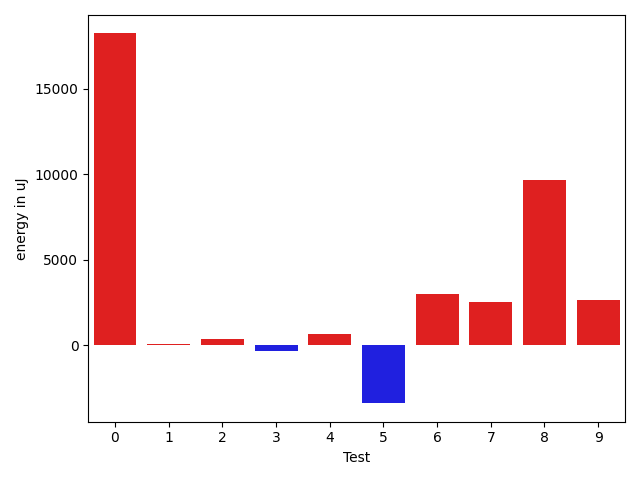
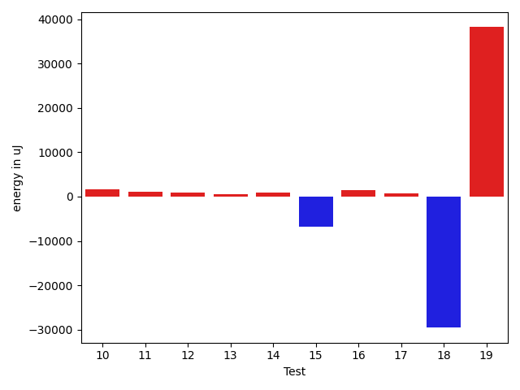
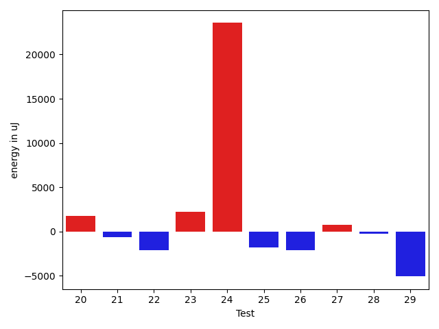
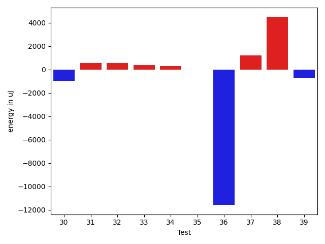
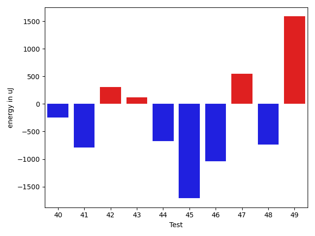
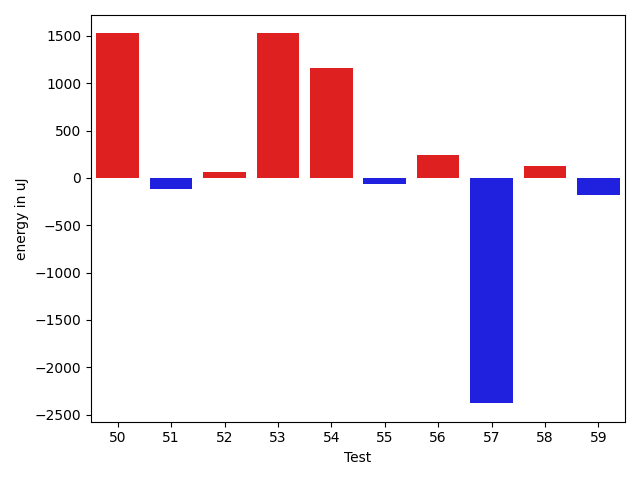
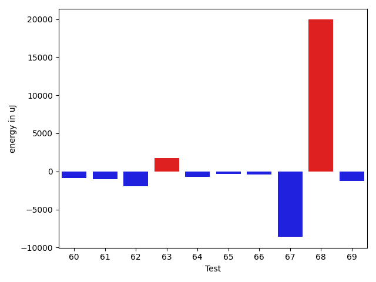
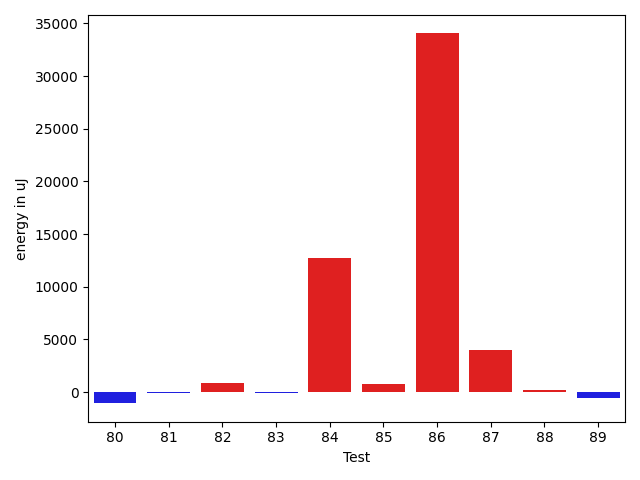
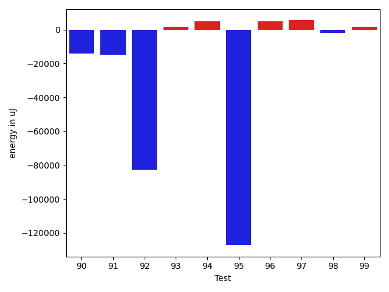

# gson b90228

https://github.com/google/gson/commit/b90228

## Delta Energy per test method

| ID | EnergyV1 | EnergyV2 | DeltaEnergy | σV1 | σV2 |
| --- | --- | --- | --- | --- | --- |
| 0 | 37476 | 37658 | 182 | 68189.20885816865 | 99932.43083759886 |
| 1 | 36560 | 36987 | 427 | 4260.119529272728 | 4020.4238349637644 |
| 2 | 34546 | 34546 | 0 | 3726.5860906256125 | 3986.614451199261 |
| 3 | 34912 | 34973 | 61 | 11335.087476081319 | 11963.758576700524 |
| 4 | 35217 | 34546 | -671 | 5483.822742268169 | 9804.736048298268 |
| 5 | 34790 | 34668 | -122 | 12996.92380869459 | 8436.831158955707 |
| 6 | 74523 | 74341 | -182 | 24636.750479798608 | 25531.29995179741 |
| 7 | 35095 | 35278 | 183 | 11976.365611251262 | 15242.227659722706 |
| 8 | 36682 | 37232 | 550 | 63111.239270750026 | 77199.22209589192 |
| 9 | 65124 | 65491 | 367 | 20377.78880288162 | 22909.14936728062 |
| 10 | 38025 | 38574 | 549 | 18703.239013726885 | 20385.138481986138 |
| 11 | 34851 | 35217 | 366 | 8124.411769210045 | 10201.285001274162 |
| 12 | 41687 | 41199 | -488 | 18378.34622483209 | 21852.21229718391 |
| 13 | 34485 | 34912 | 427 | 3972.2459527604137 | 2872.3024699721764 |
| 14 | 35400 | 36987 | 1587 | 3575.477159887954 | 2885.04459728706 |
| 15 | 38819 | 37964 | -855 | 57384.36839489922 | 36837.7348082043 |
| 16 | 35035 | 36987 | 1952 | 3624.6678794470117 | 2527.4066637142078 |
| 17 | 36072 | 36804 | 732 | 4038.5348840885354 | 3980.1904166955164 |
| 18 | 38635 | 35095 | -3540 | 44864.463691485755 | 3347.3826075649868 |
| 19 | 37658 | 39062 | 1404 | 3942.5955488486716 | 75047.28604409135 |
| 20 | 34363 | 36132 | 1769 | 3517.439831364955 | 2995.362915295728 |
| 21 | 35034 | 34424 | -610 | 3523.792498893701 | 3904.604179741336 |
| 22 | 38635 | 36560 | -2075 | 50004.04065023546 | 3515.75973345753 |
| 23 | 35034 | 37231 | 2197 | 3829.528517396829 | 8952.40036988118 |
| 24 | 40711 | 64270 | 23559 | 35282.313651932935 | 25340.730948283814 |
| 25 | 40405 | 38635 | -1770 | 17663.573066763052 | 18041.359931838044 |
| 26 | 37231 | 35156 | -2075 | 48212.343613535035 | 61861.57701555229 |
| 27 | 34729 | 35462 | 733 | 66570.44813299742 | 4498.384567750406 |
| 28 | 35766 | 35523 | -243 | 4526.292276908048 | 7019.99003385936 |
| 29 | 73364 | 68299 | -5065 | 49077.26633362072 | 55058.91692532744 |
| 30 | 35767 | 35462 | -305 | 5676.761090809482 | 4489.062723239095 |
| 31 | 35766 | 36010 | 244 | 3289.1401249573887 | 3841.7152380381262 |
| 32 | 34790 | 36194 | 1404 | 3747.5272302974654 | 3820.15740002862 |
| 33 | 34790 | 35644 | 854 | 3744.3062974186405 | 4315.35808751364 |
| 34 | 35522 | 35767 | 245 | 4149.5611324375905 | 2857.699495555789 |
| 35 | 36499 | 35827 | -672 | 4043.123426714895 | 3810.387387783911 |
| 36 | 34973 | 34057 | -916 | 45250.26959441085 | 4265.503300290211 |
| 37 | 34973 | 35827 | 854 | 6147.873514413613 | 7896.441175264815 |
| 38 | 35705 | 35584 | -121 | 3183.4457713127276 | 21881.93326268271 |
| 39 | 35461 | 33813 | -1648 | 2601.5815380309414 | 3340.752816005386 |
| 40 | 34851 | 34607 | -244 | 2910.2763242339083 | 6646.672449419826 |
| 41 | 37048 | 36255 | -793 | 72839.64077698627 | 72932.19299128444 |
| 42 | 35461 | 35767 | 306 | 38981.46571632027 | 127621.69958755508 |
| 43 | 34668 | 34790 | 122 | 4818.302884824171 | 5607.1308972052 |
| 44 | 36377 | 35705 | -672 | 3531.4812858377463 | 3542.8228854079275 |
| 45 | 35523 | 33813 | -1710 | 14336.78494548212 | 2217.492429179723 |
| 46 | 34485 | 33447 | -1038 | 3378.572820671564 | 3292.006228635511 |
| 47 | 34058 | 34607 | 549 | 2849.426077555025 | 3774.2930779843273 |
| 48 | 34790 | 34058 | -732 | 3201.308210261681 | 3724.1668169899735 |
| 49 | 33631 | 35217 | 1586 | 2620.128703623873 | 6646.031434351548 |
| 50 | 37842 | 39368 | 1526 | 19894.638792119044 | 18845.928636442317 |
| 51 | 36194 | 36072 | -122 | 3785.3730790005657 | 3312.5188882256925 |
| 52 | 37597 | 37658 | 61 | 26298.764478047895 | 21231.677189896483 |
| 53 | 38147 | 39673 | 1526 | 48767.65636621194 | 44572.168442647606 |
| 54 | 34485 | 35644 | 1159 | 3293.4734138024887 | 4419.491500594762 |
| 55 | 36194 | 36133 | -61 | 3992.8727861548273 | 3861.474821349786 |
| 56 | 38941 | 39184 | 243 | 66783.17258574649 | 51400.05472942125 |
| 57 | 35400 | 33020 | -2380 | 3846.3528076498274 | 3511.6213019292477 |
| 58 | 33752 | 33875 | 123 | 7032.43823306636 | 5252.019077953567 |
| 59 | 38330 | 38147 | -183 | 33790.63329788311 | 38398.4570001059 |
| 60 | 38636 | 38086 | -550 | 66141.01477880213 | 62331.64240108221 |
| 61 | 35706 | 35034 | -672 | 7327.850865859903 | 5638.13889250159 |
| 62 | 36926 | 35828 | -1098 | 14370.72025457792 | 12021.794828553835 |
| 63 | 33203 | 33752 | 549 | 3413.486936810577 | 3895.2909750893123 |
| 64 | 36499 | 35828 | -671 | 5137.1498399173815 | 3796.9230322691265 |
| 65 | 36865 | 35950 | -915 | 4057.754909109223 | 3600.4586473218073 |
| 66 | 36926 | 36194 | -732 | 3603.298641522792 | 4095.6272022243425 |
| 67 | 40954 | 39551 | -1403 | 60795.32056030154 | 37767.18569866466 |
| 68 | 35950 | 38514 | 2564 | 3641.7722143992264 | 41912.827682716794 |
| 69 | 37049 | 35278 | -1771 | 3970.1093239458323 | 3892.5835800064256 |
| 70 | 37414 | 34668 | -2746 | 3525.640314420441 | 3753.6079359983883 |
| 71 | 39307 | 38025 | -1282 | 3829.281154436459 | 3753.1835803088557 |
| 72 | 37414 | 40588 | 3174 | 56140.346505036825 | 68701.72890792422 |
| 73 | 35827 | 34729 | -1098 | 8082.123485727544 | 4964.064612330515 |
| 74 | 36011 | 36499 | 488 | 50947.51457798039 | 51865.513663291655 |
| 75 | 39367 | 38025 | -1342 | 66179.43718215749 | 50903.77430874424 |
| 76 | 38269 | 37902 | -367 | 36190.86427671536 | 31801.33641949949 |
| 77 | 36682 | 36560 | -122 | 5514.145038345049 | 3656.0828480606747 |
| 78 | 38818 | 38269 | -549 | 3397.94290431844 | 3840.627922307345 |
| 79 | 37475 | 36743 | -732 | 4345.79606869667 | 4067.6341540962417 |
| 80 | 38635 | 36071 | -2564 | 4158.9375746697615 | 3559.8920087420242 |
| 81 | 36621 | 36438 | -183 | 3790.856957499481 | 2847.1998716941175 |
| 82 | 36133 | 36438 | 305 | 4162.336677801904 | 3954.365967564471 |
| 83 | 35339 | 35339 | 0 | 2870.8259990381484 | 3516.3450001049832 |
| 84 | 36499 | 37780 | 1281 | 44880.587714225585 | 62707.029950232565 |
| 85 | 36438 | 36255 | -183 | 3503.0912110935674 | 6883.539219580288 |
| 86 | 326232 | 381469 | 55237 | 97106.17099466006 | 135058.38967477932 |
| 87 | 71472 | 70374 | -1098 | 49151.55913570431 | 54796.690700651656 |
| 88 | 75744 | 73364 | -2380 | 27103.3224426953 | 24412.261243203753 |
| 89 | 37659 | 36804 | -855 | 16091.744453956151 | 22036.97813316304 |
| 90 | 40528 | 37292 | -3236 | 56201.24434999219 | 32574.858298424704 |
| 91 | 73975 | 72815 | -1160 | 81558.27912247567 | 57696.576657099664 |
| 92 | 36499 | 37109 | 610 | 325470.92459275876 | 3136.2007468162424 |
| 93 | 38208 | 39367 | 1159 | 4597.044274200208 | 3761.564424101582 |
| 94 | 37781 | 39612 | 1831 | 27766.59516925769 | 31767.40381384701 |
| 95 | 40161 | 37720 | -2441 | 537368.5870233828 | 206806.3133967112 |
| 96 | 38574 | 38635 | 61 | 43230.40648690241 | 48539.573174035795 |
| 97 | 38574 | 38269 | -305 | 94241.0100182185 | 96853.9160393237 |
| 98 | 38086 | 37109 | -977 | 3313.9622208329465 | 4518.516900972597 |
| 99 | 36071 | 37293 | 1222 | 8668.30859718033 | 12295.785140909262 |

## Delta Duration per test method

| ID | DurationV1 | DurationsV2 | DeltaDuration |
| --- | --- | --- | --- |
| 0 | 1456143.6575342466 | 2056304.6153846155 | 600160.9578503689 |
| 1 | 843229.5882352941 | 861684.2641509434 | 18454.675915649277 |
| 2 | 983902.5223880596 | 1014728.5205479452 | 30825.998159885523 |
| 3 | 1351818.0842105264 | 1333673.8936170214 | -18144.190593505045 |
| 4 | 1117195.827160494 | 1166121.036585366 | 48925.20942487195 |
| 5 | 1278838.206521739 | 1284349.4239130435 | 5511.217391304439 |
| 6 | 2600382.1515151514 | 2703018.393939394 | 102636.24242424266 |
| 7 | 1379540.8585858585 | 1423472.7083333333 | 43931.84974747477 |
| 8 | 1755612.8842105262 | 2061036.923076923 | 305424.03886639676 |
| 9 | 2023736.202020202 | 2091257.0 | 67520.79797979794 |
| 10 | 1509943.404494382 | 1606525.6022727273 | 96582.19777834532 |
| 11 | 1310234.3684210526 | 1309210.8260869565 | -1023.5423340960406 |
| 12 | 1747216.9494949495 | 1796585.8686868686 | 49368.919191919034 |
| 13 | 815644.3898305085 | 845413.1090909091 | 29768.719260400627 |
| 14 | 830047.3658536585 | 825075.9607843137 | -4971.405069344793 |
| 15 | 1600536.5294117648 | 1485353.3181818181 | -115183.2112299467 |
| 16 | 560724.9130434783 | 456676.0 | -104048.91304347827 |
| 17 | 784108.88 | 850070.7368421053 | 65961.85684210528 |
| 18 | 1895350.524590164 | 859898.1964285715 | -1035452.3281615925 |
| 19 | 817799.4150943396 | 2198594.2461538464 | 1380794.8310595066 |
| 20 | 772935.0545454546 | 783234.6086956522 | 10299.554150197655 |
| 21 | 702687.3235294118 | 649248.6904761905 | -53438.633053221274 |
| 22 | 1782935.16 | 471703.8095238095 | -1311231.3504761904 |
| 23 | 832006.5666666667 | 1093257.06779661 | 261250.5011299434 |
| 24 | 1856779.8620689656 | 1833894.8426966292 | -22885.019372336334 |
| 25 | 1612707.3043478262 | 1591375.8617021276 | -21331.442645698553 |
| 26 | 1743842.7093023255 | 1780773.9078947369 | 36931.198592411354 |
| 27 | 1062190.0 | 691901.925 | -370288.07499999995 |
| 28 | 1110275.6202531646 | 1092005.8026315789 | -18269.81762158568 |
| 29 | 2773158.6770833335 | 2640850.9591836734 | -132307.7178996601 |
| 30 | 950472.9672131147 | 918480.1724137932 | -31992.794799321564 |
| 31 | 934604.5072463768 | 936328.4492753623 | 1723.9420289854752 |
| 32 | 706993.1111111111 | 710519.6486486486 | 3526.537537537515 |
| 33 | 697564.2666666667 | 739667.1428571428 | 42102.87619047612 |
| 34 | 718754.4489795918 | 697272.6304347826 | -21481.81854480924 |
| 35 | 713334.119047619 | 710452.2647058824 | -2881.8543417366454 |
| 36 | 1283921.9423076923 | 866737.1774193548 | -417184.76488833746 |
| 37 | 1013272.3194444445 | 984611.7594936709 | -28660.559950773604 |
| 38 | 575497.2666666667 | 681101.25 | 105603.98333333328 |
| 39 | 621392.5 | 619665.0 | -1727.5 |
| 40 | 752123.5348837209 | 764965.1111111111 | 12841.576227390207 |
| 41 | 1554911.8541666667 | 1050625.8043478262 | -504286.0498188406 |
| 42 | 944709.2571428572 | 1879721.6666666667 | 935012.4095238096 |
| 43 | 863874.8085106383 | 850181.9782608695 | -13692.830249768798 |
| 44 | 657203.1 | 677499.6923076923 | 20296.592307692277 |
| 45 | 908603.4242424242 | 572935.1428571428 | -335668.28138528136 |
| 46 | 671724.731707317 | 673591.85 | 1867.1182926829206 |
| 47 | 593940.9166666666 | 581272.3928571428 | -12668.523809523787 |
| 48 | 560231.9565217391 | 534522.6538461539 | -25709.302675585262 |
| 49 | 531665.1818181818 | 585572.9583333334 | 53907.77651515161 |
| 50 | 1214959.9795918367 | 1225943.4666666666 | 10983.48707482987 |
| 51 | 866446.875 | 813149.0196078431 | -53297.85539215687 |
| 52 | 1587923.8470588236 | 1492337.7790697673 | -95586.06798905623 |
| 53 | 1410976.388888889 | 1491686.0454545454 | 80709.65656565642 |
| 54 | 637868.947368421 | 652908.1612903225 | 15039.213921901537 |
| 55 | 811786.2142857143 | 787435.2040816327 | -24351.010204081656 |
| 56 | 1664081.32 | 1420676.1944444445 | -243405.12555555557 |
| 57 | 638774.1612903225 | 680843.1428571428 | 42068.981566820294 |
| 58 | 1060208.462686567 | 1068063.6417910447 | 7855.179104477633 |
| 59 | 1620044.987341772 | 1824588.6515151516 | 204543.66417337954 |
| 60 | 1926327.3333333333 | 1947769.1166666667 | 21441.783333333442 |
| 61 | 1115964.2205882352 | 1133836.2465753425 | 17872.025987107307 |
| 62 | 1249560.3536585367 | 1234600.4875 | -14959.866158536635 |
| 63 | 577652.3448275862 | 516940.60714285716 | -60711.73768472904 |
| 64 | 985084.506849315 | 1029748.9558823529 | 44664.449033037876 |
| 65 | 570887.0 | 580209.7727272727 | 9322.772727272706 |
| 66 | 820023.7333333333 | 770593.06 | -49430.67333333322 |
| 67 | 2097948.4307692307 | 1680319.213114754 | -417629.21765447664 |
| 68 | 560176.3181818182 | 1500561.7962962964 | 940385.4781144782 |
| 69 | 736103.9714285714 | 499615.23529411765 | -236488.73613445373 |
| 70 | 545384.5 | 593733.1363636364 | 48348.63636363635 |
| 71 | 578466.9166666666 | 560885.25 | -17581.666666666628 |
| 72 | 1602823.16 | 2160000.7297297297 | 557177.5697297298 |
| 73 | 930523.0238095238 | 794302.7209302326 | -136220.30287929124 |
| 74 | 1582903.9074074074 | 1528022.5294117648 | -54881.3779956426 |
| 75 | 1797448.1785714286 | 1440122.6721311475 | -357325.50644028117 |
| 76 | 1624318.3636363635 | 1488236.3214285714 | -136082.04220779217 |
| 77 | 954263.7846153846 | 963643.5322580645 | 9379.747642679838 |
| 78 | 641378.8648648649 | 696327.8974358974 | 54949.03257103253 |
| 79 | 815836.6304347826 | 790401.8636363636 | -25434.766798418947 |
| 80 | 569961.59375 | 573887.1538461539 | 3925.560096153873 |
| 81 | 635102.6388888889 | 654928.875 | 19826.236111111124 |
| 82 | 731878.95 | 732012.6888888889 | 133.7388888889691 |
| 83 | 627988.3548387097 | 615006.1153846154 | -12982.23945409432 |
| 84 | 1498259.6363636365 | 1943086.2631578948 | 444826.62679425837 |
| 85 | 919276.2368421053 | 978021.7727272727 | 58745.535885167425 |
| 86 | 9922821.282828283 | 10730075.686868686 | 807254.4040404037 |
| 87 | 2240068.5306122447 | 2419398.626262626 | 179330.0956503814 |
| 88 | 2348728.787878788 | 2329122.8484848486 | -19605.93939393945 |
| 89 | 729796.6071428572 | 796078.1515151515 | 66281.54437229433 |
| 90 | 1402467.5238095238 | 956388.2857142857 | -446079.2380952381 |
| 91 | 2912718.585858586 | 2486425.0303030303 | -426293.5555555555 |
| 92 | 3122175.714285714 | 759885.243902439 | -2362290.4703832753 |
| 93 | 806492.7142857143 | 693687.4166666666 | -112805.29761904769 |
| 94 | 1337987.2741935484 | 1460760.21875 | 122772.94455645164 |
| 95 | 5661885.442857143 | 2249379.337662338 | -3412506.1051948047 |
| 96 | 1464186.1830985916 | 1691407.8059701493 | 227221.62287155772 |
| 97 | 1816890.425531915 | 2216028.4716981133 | 399138.0461661983 |
| 98 | 435576.15789473685 | 543910.25 | 108334.09210526315 |
| 99 | 887333.5909090909 | 976160.7727272727 | 88827.18181818177 |

## Misc.

| ID | Test Class | Test Method |
| --- | --- | --- |
| 0 | com.google.gson.functional.CustomDeserializerTest | testDefaultConstructorNotCalledOnObject |
| 1 | com.google.gson.functional.CustomDeserializerTest | testDefaultConstructorNotCalledOnField |
| 2 | com.google.gson.functional.ParameterizedTypesTest | testParameterizedTypeGenericArraysSerialization |
| 3 | com.google.gson.functional.ParameterizedTypesTest | testVariableTypeArrayDeserialization |
| 4 | com.google.gson.functional.ParameterizedTypesTest | testParameterizedTypeWithReaderDeserialization |
| 5 | com.google.gson.functional.ParameterizedTypesTest | testVariableTypeDeserialization |
| 6 | com.google.gson.functional.ParameterizedTypesTest | testVariableTypeFieldsAndGenericArraysSerialization |
| 7 | com.google.gson.functional.ParameterizedTypesTest | testParameterizedTypeGenericArraysDeserialization |
| 8 | com.google.gson.functional.ParameterizedTypesTest | testParameterizedTypeDeserialization |
| 9 | com.google.gson.functional.ParameterizedTypesTest | testVariableTypeFieldsAndGenericArraysDeserialization |
| 10 | com.google.gson.functional.ParameterizedTypesTest | testTypesWithMultipleParametersDeserialization |
| 11 | com.google.gson.functional.ParameterizedTypesTest | testParameterizedTypeWithVariableTypeDeserialization |
| 12 | com.google.gson.functional.ParameterizedTypesTest | testParameterizedTypesWithCustomDeserializer |
| 13 | com.google.gson.functional.CollectionTest | testNullsInListDeserialization |
| 14 | com.google.gson.functional.CollectionTest | testNullsInListSerialization |
| 15 | com.google.gson.functional.CollectionTest | testCollectionOfBagOfPrimitivesSerialization |
| 16 | com.google.gson.functional.CollectionTest | testRawCollectionOfIntegersSerialization |
| 17 | com.google.gson.functional.CollectionTest | testQueueSerialization |
| 18 | com.google.gson.functional.CollectionTest | testCollectionOfEnumsSerialization |
| 19 | com.google.gson.functional.CollectionTest | testTopLevelCollectionOfIntegersSerialization |
| 20 | com.google.gson.functional.CollectionTest | testCollectionOfObjectSerialization |
| 21 | com.google.gson.functional.CollectionTest | testRawCollectionSerialization |
| 22 | com.google.gson.functional.CollectionTest | testCollectionOfStringsSerialization |
| 23 | com.google.gson.functional.CollectionTest | testLinkedListSerialization |
| 24 | com.google.gson.functional.ObjectTest | testDirectedAcyclicGraphSerialization |
| 25 | com.google.gson.functional.ObjectTest | testArrayOfArraysDeserialization |
| 26 | com.google.gson.functional.ObjectTest | testSubInterfacesOfCollectionDeserialization |
| 27 | com.google.gson.functional.ObjectTest | testClassWithTransientFieldsDeserializationTransientFieldsPassedInJsonAreIgnored |
| 28 | com.google.gson.functional.ObjectTest | testArrayOfObjectsDeserialization |
| 29 | com.google.gson.functional.ObjectTest | testSubInterfacesOfCollectionSerialization |
| 30 | com.google.gson.functional.ObjectTest | testNestedDeserialization |
| 31 | com.google.gson.functional.ObjectTest | testInheritenceDeserialization |
| 32 | com.google.gson.functional.ObjectTest | testBagOfPrimitiveWrappersDeserialization |
| 33 | com.google.gson.functional.ObjectTest | testJsonInMixedQuotesDeserialization |
| 34 | com.google.gson.functional.ObjectTest | testNullFieldsDeserialization |
| 35 | com.google.gson.functional.ObjectTest | testBagOfPrimitivesDeserialization |
| 36 | com.google.gson.functional.ObjectTest | testInnerClassDeserialization |
| 37 | com.google.gson.functional.ObjectTest | testDirectedAcyclicGraphDeserialization |
| 38 | com.google.gson.functional.ObjectTest | testNullObjectFieldsDeserialization |
| 39 | com.google.gson.functional.ObjectTest | testEmptyCollectionInAnObjectDeserialization |
| 40 | com.google.gson.functional.ObjectTest | testPrimitiveArrayInAnObjectDeserialization |
| 41 | com.google.gson.functional.ObjectTest | testJsonInSingleQuotesDeserialization |
| 42 | com.google.gson.functional.ObjectTest | testClassWithTransientFieldsDeserialization |
| 43 | com.google.gson.functional.ObjectTest | testNullArraysDeserialization |
| 44 | com.google.gson.functional.ObjectTest | testClassWithEnumFieldDeserialization |
| 45 | com.google.gson.functional.ObjectTest | testObjectFieldNamesWithoutQuotesDeserialization |
| 46 | com.google.gson.functional.ObjectTest | testCircularSerialization |
| 47 | com.google.gson.functional.ObjectTest | testPrivateNoArgConstructorDeserialization |
| 48 | com.google.gson.functional.ObjectTest | testNullPrimitiveFieldsDeserialization |
| 49 | com.google.gson.functional.ObjectTest | testEmptyCollectionInAnObjectSerialization |
| 50 | com.google.gson.functional.NullObjectAndFieldTest | testExplicitDeserializationOfNulls |
| 51 | com.google.gson.functional.NullObjectAndFieldTest | testNullWrappedPrimitiveMemberSerialization |
| 52 | com.google.gson.functional.NullObjectAndFieldTest | testExplicitSerializationOfNullArrayMembers |
| 53 | com.google.gson.functional.NullObjectAndFieldTest | testExplicitSerializationOfNulls |
| 54 | com.google.gson.functional.NullObjectAndFieldTest | testExplicitSerializationOfNullCollectionMembers |
| 55 | com.google.gson.functional.NullObjectAndFieldTest | testNullWrappedPrimitiveMemberDeserialization |
| 56 | com.google.gson.functional.NullObjectAndFieldTest | testTopLevelNullObjectDeserialization |
| 57 | com.google.gson.functional.NullObjectAndFieldTest | testExplicitSerializationOfNullStringMembers |
| 58 | com.google.gson.functional.CustomTypeAdaptersTest | testCustomAdapterInvokedForMapElementSerializationWithType |
| 59 | com.google.gson.functional.CustomTypeAdaptersTest | testCustomAdapterInvokedForCollectionElementSerializationWithType |
| 60 | com.google.gson.functional.CustomTypeAdaptersTest | testCustomDeserializers |
| 61 | com.google.gson.functional.CustomTypeAdaptersTest | testCustomSerializerForLong |
| 62 | com.google.gson.functional.CustomTypeAdaptersTest | testCustomDeserializerForLong |
| 63 | com.google.gson.functional.CustomTypeAdaptersTest | testCustomAdapterInvokedForMapElementSerialization |
| 64 | com.google.gson.functional.CustomTypeAdaptersTest | testCustomNestedDeserializers |
| 65 | com.google.gson.functional.CustomTypeAdaptersTest | testCustomAdapterInvokedForCollectionElementSerialization |
| 66 | com.google.gson.functional.MapTest | testMapSerializationEmpty |
| 67 | com.google.gson.functional.MapTest | testMapSerialization |
| 68 | com.google.gson.functional.MapTest | testMapSubclassSerialization |
| 69 | com.google.gson.functional.MapTest | testRawMapSerialization |
| 70 | com.google.gson.functional.ReadersWritersTest | testTopLevelNullObjectDeserializationWithReaderAndSerializeNulls |
| 71 | com.google.gson.functional.ReadersWritersTest | testTopLevelNullObjectDeserializationWithReader |
| 72 | com.google.gson.functional.ReadersWritersTest | testReaderForDeserialization |
| 73 | com.google.gson.functional.NamingPolicyTest | testGsonWithSerializedNameFieldNamingPolicyDeserialization |
| 74 | com.google.gson.functional.NamingPolicyTest | testGsonWithNonDefaultFieldNamingPolicyDeserialiation |
| 75 | com.google.gson.functional.ArrayTest | testTopLevelArrayOfIntsDeserialization |
| 76 | com.google.gson.functional.ArrayTest | testArrayOfCollectionSerialization |
| 77 | com.google.gson.functional.ArrayTest | testArrayOfCollectionDeserialization |
| 78 | com.google.gson.functional.ArrayTest | testNullsInArrayDeserialization |
| 79 | com.google.gson.functional.ArrayTest | testArrayOfPrimitivesWithCustomTypeAdapter |
| 80 | com.google.gson.functional.ArrayTest | testArrayOfStringsDeserialization |
| 81 | com.google.gson.functional.DefaultTypeAdaptersTest | testBigIntegerFieldDeserialization |
| 82 | com.google.gson.functional.DefaultTypeAdaptersTest | testBigDecimalFieldDeserialization |
| 83 | com.google.gson.functional.DefaultTypeAdaptersTest | testSetSerialization |
| 84 | com.google.gson.functional.VersioningTest | testVersionedClassesDeserialization |
| 85 | com.google.gson.functional.VersioningTest | testVersionedGsonWithUnversionedClassesDeserialization |
| 86 | com.google.gson.functional.ConcurrencyTest | testMultiThreadDeserialization |
| 87 | com.google.gson.functional.ConcurrencyTest | testSingleThreadDeserialization |
| 88 | com.google.gson.functional.UncategorizedTest | testReturningDerivedClassesDuringDeserialization |
| 89 | com.google.gson.functional.ExposeFieldsTest | testExposedInterfaceFieldDeserialization |
| 90 | com.google.gson.functional.ExposeFieldsTest | testExposeAnnotationDeserialization |
| 91 | com.google.gson.FunctionalWithInternalDependenciesTest | testPrettyPrintList |
| 92 | com.google.gson.FunctionalWithInternalDependenciesTest | testPrettyPrintListOfPrimitiveArrays |
| 93 | com.google.gson.DefaultMapJsonSerializerTest | testEmptyMapNoTypeSerialization |
| 94 | com.google.gson.DefaultMapJsonSerializerTest | testEmptyMapSerialization |
| 95 | com.google.gson.functional.PrintFormattingTest | testCompactFormattingLeavesNoWhiteSpace |
| 96 | com.google.gson.functional.EscapingTest | testEscapingObjectFields |
| 97 | com.google.gson.functional.EscapingTest | testEscapingQuotesInStringArray |
| 98 | com.google.gson.JsonObjectTest | testAddingNullProperties |
| 99 | com.google.gson.JsonObjectTest | testAddingAndRemovingObjectProperties |

| Test | IterationV1 | IterationV2 | DeltaIteration |
| --- | --- | --- | --- |
| 0 | 73 | 65 | -8 |
| 1 | 51 | 53 | 2 |
| 2 | 67 | 73 | 6 |
| 3 | 95 | 94 | -1 |
| 4 | 81 | 82 | 1 |
| 5 | 92 | 92 | 0 |
| 6 | 99 | 99 | 0 |
| 7 | 99 | 96 | -3 |
| 8 | 95 | 91 | -4 |
| 9 | 99 | 99 | 0 |
| 10 | 89 | 88 | -1 |
| 11 | 95 | 92 | -3 |
| 12 | 99 | 99 | 0 |
| 13 | 59 | 55 | -4 |
| 14 | 41 | 51 | 10 |
| 15 | 51 | 44 | -7 |
| 16 | 23 | 26 | 3 |
| 17 | 50 | 57 | 7 |
| 18 | 61 | 56 | -5 |
| 19 | 53 | 65 | 12 |
| 20 | 55 | 46 | -9 |
| 21 | 34 | 42 | 8 |
| 22 | 25 | 21 | -4 |
| 23 | 60 | 59 | -1 |
| 24 | 87 | 89 | 2 |
| 25 | 92 | 94 | 2 |
| 26 | 86 | 76 | -10 |
| 27 | 33 | 40 | 7 |
| 28 | 79 | 76 | -3 |
| 29 | 96 | 98 | 2 |
| 30 | 61 | 58 | -3 |
| 31 | 69 | 69 | 0 |
| 32 | 36 | 37 | 1 |
| 33 | 30 | 28 | -2 |
| 34 | 49 | 46 | -3 |
| 35 | 42 | 34 | -8 |
| 36 | 52 | 62 | 10 |
| 37 | 72 | 79 | 7 |
| 38 | 30 | 32 | 2 |
| 39 | 32 | 37 | 5 |
| 40 | 43 | 45 | 2 |
| 41 | 48 | 46 | -2 |
| 42 | 35 | 33 | -2 |
| 43 | 47 | 46 | -1 |
| 44 | 30 | 39 | 9 |
| 45 | 33 | 28 | -5 |
| 46 | 41 | 40 | -1 |
| 47 | 36 | 28 | -8 |
| 48 | 23 | 26 | 3 |
| 49 | 22 | 24 | 2 |
| 50 | 49 | 45 | -4 |
| 51 | 48 | 51 | 3 |
| 52 | 85 | 86 | 1 |
| 53 | 36 | 44 | 8 |
| 54 | 38 | 31 | -7 |
| 55 | 56 | 49 | -7 |
| 56 | 25 | 36 | 11 |
| 57 | 31 | 35 | 4 |
| 58 | 67 | 67 | 0 |
| 59 | 79 | 66 | -13 |
| 60 | 60 | 60 | 0 |
| 61 | 68 | 73 | 5 |
| 62 | 82 | 80 | -2 |
| 63 | 29 | 28 | -1 |
| 64 | 73 | 68 | -5 |
| 65 | 25 | 22 | -3 |
| 66 | 60 | 50 | -10 |
| 67 | 65 | 61 | -4 |
| 68 | 22 | 54 | 32 |
| 69 | 35 | 17 | -18 |
| 70 | 30 | 22 | -8 |
| 71 | 24 | 20 | -4 |
| 72 | 50 | 37 | -13 |
| 73 | 42 | 43 | 1 |
| 74 | 54 | 51 | -3 |
| 75 | 56 | 61 | 5 |
| 76 | 77 | 84 | 7 |
| 77 | 65 | 62 | -3 |
| 78 | 37 | 39 | 2 |
| 79 | 46 | 44 | -2 |
| 80 | 32 | 26 | -6 |
| 81 | 36 | 32 | -4 |
| 82 | 40 | 45 | 5 |
| 83 | 31 | 26 | -5 |
| 84 | 77 | 76 | -1 |
| 85 | 38 | 44 | 6 |
| 86 | 99 | 99 | 0 |
| 87 | 98 | 99 | 1 |
| 88 | 99 | 99 | 0 |
| 89 | 28 | 33 | 5 |
| 90 | 42 | 35 | -7 |
| 91 | 99 | 99 | 0 |
| 92 | 49 | 41 | -8 |
| 93 | 21 | 12 | -9 |
| 94 | 62 | 64 | 2 |
| 95 | 70 | 77 | 7 |
| 96 | 71 | 67 | -4 |
| 97 | 47 | 53 | 6 |
| 98 | 19 | 16 | -3 |
| 99 | 22 | 22 | 0 |

| Time Label | Time (s) |
| --- | --- |
| Selection | 23.271564722061157 |
| Injection | 11.019424676895142 |
| Total | 975.7342076301575 |

