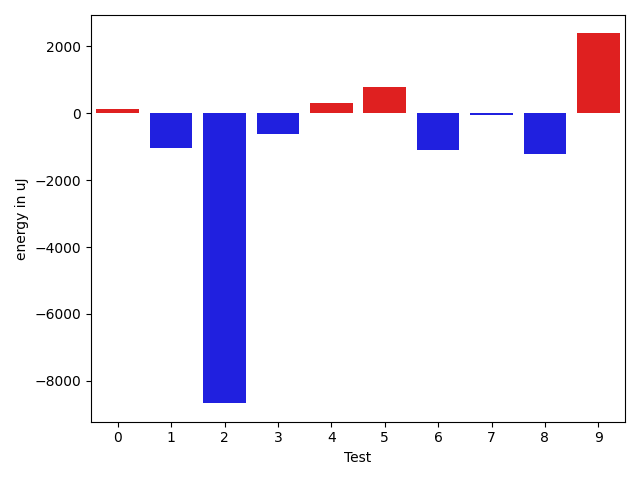
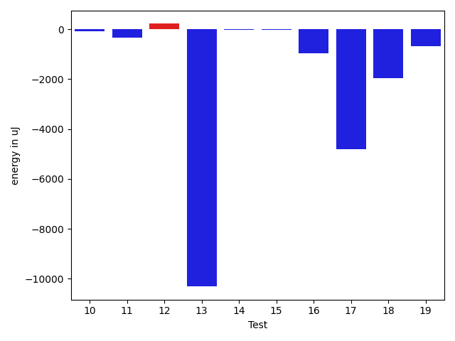
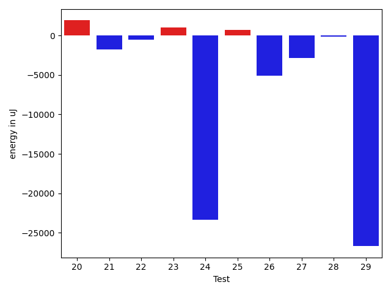
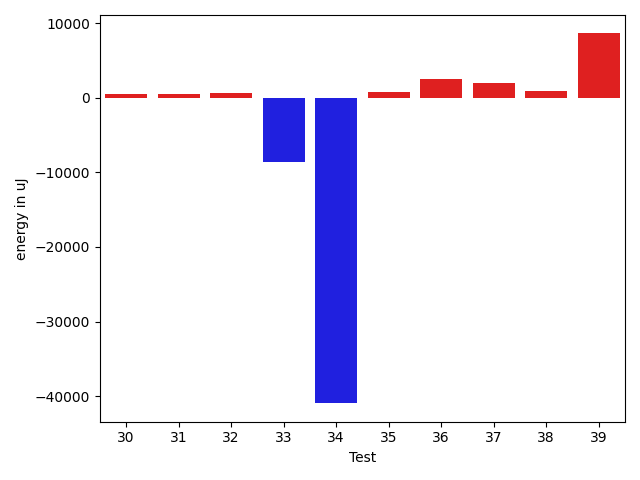
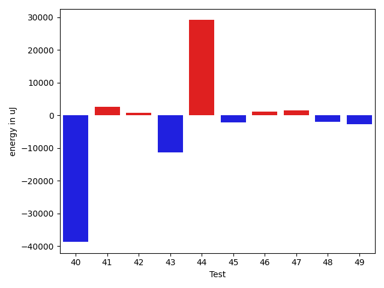
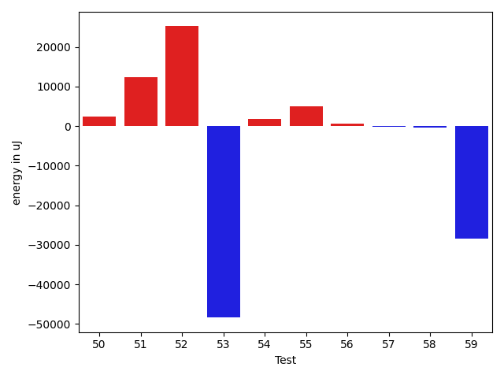

# gson c9e480

https://github.com/google/gson/commit/c9e480

## Delta Energy per test method

| ID | EnergyV1 | EnergyV2 | DeltaEnergy | σV1 | σV2 |
| --- | --- | --- | --- | --- | --- |
| 0 | 37658 | 37781 | 123 | 90601.32191258304 | 96322.9972370245 |
| 1 | 36987 | 35949 | -1038 | 3458.934633888343 | 4002.536912730868 |
| 2 | 114685 | 106018 | -8667 | 98752.29719584441 | 96275.41638215567 |
| 3 | 35583 | 34973 | -610 | 4381.0871645975785 | 3900.553359511567 |
| 4 | 36193 | 36499 | 306 | 8452.151753370425 | 38949.33314969019 |
| 5 | 35705 | 36499 | 794 | 19327.26169457735 | 21099.1118274247 |
| 6 | 42175 | 41076 | -1099 | 38222.85691006542 | 39473.324829300436 |
| 7 | 35828 | 35767 | -61 | 22688.734518129826 | 27790.769137840125 |
| 8 | 34790 | 33570 | -1220 | 4487.140400769603 | 3178.506658166016 |
| 9 | 35827 | 38208 | 2381 | 28645.30620560554 | 13387.72256469721 |
| 10 | 35583 | 35461 | -122 | 3641.4364655319027 | 3489.9723035442803 |
| 11 | 37110 | 37109 | -1 | 12078.279236702861 | 12502.55799183713 |
| 12 | 37231 | 37964 | 733 | 26405.76124400074 | 23861.40915297659 |
| 13 | 96558 | 78735 | -17823 | 52894.851316930384 | 47011.48551497671 |
| 14 | 34851 | 35034 | 183 | 3774.6864820141022 | 2831.7104719344406 |
| 15 | 35156 | 35767 | 611 | 7223.995361448001 | 3526.1218610107935 |
| 16 | 36682 | 35705 | -977 | 2959.7285864679475 | 3087.6868986278264 |
| 17 | 36499 | 36499 | 0 | 33719.28965343124 | 12673.521273524819 |
| 18 | 37536 | 34851 | -2685 | 5409.700067413627 | 3128.9110906842325 |
| 19 | 35339 | 33631 | -1708 | 5258.93490923224 | 7256.151565147248 |
| 20 | 36621 | 35766 | -855 | 8585.81672538096 | 33211.17765623313 |
| 21 | 35888 | 34302 | -1586 | 2664.45450579346 | 3055.8239988141327 |
| 22 | 36010 | 35461 | -549 | 3620.422094543837 | 3110.2724456855117 |
| 23 | 34606 | 35462 | 856 | 12509.618369162146 | 12781.066795192688 |
| 24 | 137634 | 125366 | -12268 | 85944.46658176908 | 61869.405610950824 |
| 25 | 35156 | 35278 | 122 | 10611.465555649665 | 11473.509871833014 |
| 26 | 89172 | 78613 | -10559 | 25828.886102457946 | 23435.89804822515 |
| 27 | 37842 | 35278 | -2564 | 15599.450681216502 | 15292.650038499569 |
| 28 | 66956 | 67505 | 549 | 23120.144807796427 | 18672.105693577774 |
| 29 | 84533 | 38147 | -46386 | 51694.44177730796 | 41018.56951901411 |
| 30 | 33875 | 34423 | 548 | 9376.136518013811 | 9843.189766559346 |
| 31 | 33569 | 33997 | 428 | 3252.1096043839334 | 4517.354883032376 |
| 32 | 34119 | 34729 | 610 | 5343.143372481117 | 3044.208269601919 |
| 33 | 91309 | 82702 | -8607 | 189562.93044352718 | 39498.451430955196 |
| 34 | 76904 | 35949 | -40955 | 55090.296664042304 | 4167.811963472013 |
| 35 | 36255 | 36987 | 732 | 34936.73175082208 | 51894.320025155575 |
| 36 | 36072 | 38514 | 2442 | 36259.102169368125 | 31033.00504208503 |
| 37 | 70556 | 72510 | 1954 | 18673.270002510937 | 23773.822781143586 |
| 38 | 35461 | 36377 | 916 | 6236.009164295972 | 5240.596130853623 |
| 39 | 37231 | 45837 | 8606 | 14593.852008027976 | 41945.29200331471 |
| 40 | 298766 | 269897 | -28869 | 91615.44661411551 | 74127.77814054233 |
| 41 | 38880 | 37354 | -1526 | 37584.41067599779 | 42236.31021220673 |
| 42 | 35339 | 35095 | -244 | 3647.0702790731384 | 3517.199679732975 |
| 43 | 38818 | 38514 | -304 | 48187.23039192107 | 36900.78151090509 |
| 44 | 128295 | 145202 | 16907 | 358987.6129179466 | 370919.95694360015 |
| 45 | 38391 | 37964 | -427 | 23820.29760742967 | 20046.455560631537 |
| 46 | 39063 | 38147 | -916 | 57202.86165428875 | 53060.08568384849 |
| 47 | 38391 | 38452 | 61 | 44203.62569309742 | 48539.396216115696 |
| 48 | 38452 | 36194 | -2258 | 16416.80885812983 | 16765.73910568812 |
| 49 | 37109 | 35461 | -1648 | 8636.03529615233 | 3261.405282031926 |
| 50 | 37231 | 38452 | 1221 | 17161.469683270014 | 22019.140939094657 |
| 51 | 79162 | 76416 | -2746 | 64101.37583785776 | 85891.93254911626 |
| 52 | 37659 | 37720 | 61 | 144367.60650330727 | 262518.53322156664 |
| 53 | 39429 | 39490 | 61 | 524784.3123355273 | 426274.67742063757 |
| 54 | 40710 | 40710 | 0 | 22856.28669064463 | 27894.895445543178 |
| 55 | 39856 | 39611 | -245 | 71064.56097836785 | 76774.41960092908 |
| 56 | 36438 | 37048 | 610 | 3814.634245680244 | 5721.638849949915 |
| 57 | 36804 | 36926 | 122 | 4551.007096219885 | 5058.35970073707 |
| 58 | 36072 | 36132 | 60 | 3763.48937710089 | 3864.7840008790163 |
| 59 | 39917 | 37353 | -2564 | 109073.83057097782 | 77822.07714042989 |

## Delta Duration per test method

| ID | DurationV1 | DurationsV2 | DeltaDuration |
| --- | --- | --- | --- |
| 0 | 1861128.1014492754 | 1887271.8676470588 | 26143.766197783407 |
| 1 | 931762.9782608695 | 949924.6129032258 | 18161.634642356308 |
| 2 | 4592417.474747474 | 4457630.368421053 | -134787.10632642172 |
| 3 | 615922.0909090909 | 626504.8695652174 | 10582.778656126466 |
| 4 | 1075373.9444444445 | 1431610.303030303 | 356236.3585858585 |
| 5 | 978366.5 | 850524.3111111111 | -127842.18888888892 |
| 6 | 1944528.717647059 | 2043205.7105263157 | 98676.99287925684 |
| 7 | 1164295.3773584906 | 1130506.8409090908 | -33788.53644939978 |
| 8 | 890618.0172413794 | 844056.6037735849 | -46561.413467794424 |
| 9 | 1305491.7096774194 | 981580.6451612903 | -323911.0645161291 |
| 10 | 744890.0 | 710990.7333333333 | -33899.26666666672 |
| 11 | 1239599.0232558139 | 1348880.0 | 109280.97674418613 |
| 12 | 1048025.0 | 1082658.8620689656 | 34633.862068965565 |
| 13 | 3343721.3673469387 | 3090551.775510204 | -253169.59183673467 |
| 14 | 758357.85 | 736312.3023255814 | -22045.547674418543 |
| 15 | 847505.7 | 810671.6923076923 | -36834.0076923077 |
| 16 | 811969.3125 | 759747.0769230769 | -52222.23557692312 |
| 17 | 1409538.4605263157 | 1188053.6666666667 | -221484.79385964898 |
| 18 | 781160.3 | 669494.8484848485 | -111665.45151515154 |
| 19 | 1033550.0 | 1030729.0666666667 | -2820.933333333349 |
| 20 | 1001273.9677419355 | 1123409.447761194 | 122135.48001925857 |
| 21 | 575115.7407407408 | 566277.9166666666 | -8837.82407407416 |
| 22 | 568434.5185185185 | 555080.6153846154 | -13353.903133903164 |
| 23 | 1419062.03125 | 1402875.1875 | -16186.84375 |
| 24 | 4938493.905263158 | 4202031.855670103 | -736462.0495930547 |
| 25 | 1352432.2967032967 | 1338628.4086021506 | -13803.88810114609 |
| 26 | 3029990.525252525 | 2872969.606060606 | -157020.91919191927 |
| 27 | 1504654.7040816327 | 1462671.7857142857 | -41982.91836734698 |
| 28 | 2156892.6666666665 | 2152395.292929293 | -4497.373737373389 |
| 29 | 2875211.98989899 | 2234786.887755102 | -640425.1021438879 |
| 30 | 1396879.9052631578 | 1356870.452631579 | -40009.45263157878 |
| 31 | 1099570.445945946 | 1054205.2753623188 | -45365.17058362719 |
| 32 | 1038085.85 | 944704.8032786886 | -93381.0467213114 |
| 33 | 3823047.6767676766 | 3001460.222222222 | -821587.4545454546 |
| 34 | 2992372.8484848486 | 873779.1960784313 | -2118593.6524064173 |
| 35 | 1118101.2542372881 | 1565819.3333333333 | 447718.0790960451 |
| 36 | 1478632.2352941176 | 1468614.0704225353 | -10018.164871582296 |
| 37 | 2328409.222222222 | 2369790.7474747472 | 41381.52525252523 |
| 38 | 1083800.038961039 | 1093630.8219178081 | 9830.782956769224 |
| 39 | 1576810.322222222 | 2020772.8979591837 | 443962.57573696156 |
| 40 | 8765973.929292928 | 7862444.101010101 | -903529.8282828275 |
| 41 | 1544858.0384615385 | 1644112.2641509434 | 99254.22568940488 |
| 42 | 820314.1052631579 | 728120.9230769231 | -92193.18218623474 |
| 43 | 2018870.5142857144 | 1621394.9333333333 | -397475.580952381 |
| 44 | 7213452.96969697 | 8466546.727272727 | 1253093.7575757569 |
| 45 | 1111705.0909090908 | 1075948.85 | -35756.24090909073 |
| 46 | 1476761.558139535 | 1726986.78125 | 250225.2231104651 |
| 47 | 1557921.9452054794 | 1614323.48 | 56401.53479452059 |
| 48 | 1413523.1395348837 | 1334171.92 | -79351.21953488374 |
| 49 | 1052859.2 | 997450.2280701754 | -55408.97192982456 |
| 50 | 1472803.842857143 | 1424740.3 | -48063.542857142864 |
| 51 | 3012396.494949495 | 3497658.0404040404 | 485261.5454545454 |
| 52 | 1861289.4736842106 | 2588052.310810811 | 726762.8371266003 |
| 53 | 5847016.361111111 | 4721629.450704225 | -1125386.9104068857 |
| 54 | 1599313.9887640448 | 1636138.482352941 | 36824.493588896235 |
| 55 | 1917914.4857142856 | 2006479.738095238 | 88565.25238095247 |
| 56 | 891215.756097561 | 909674.1454545455 | 18458.389356984524 |
| 57 | 651382.84375 | 650380.6857142857 | -1002.1580357142957 |
| 58 | 692656.6578947369 | 659642.6136363636 | -33014.04425837321 |
| 59 | 2750384.0196078434 | 1856603.2051282052 | -893780.8144796381 |

## Misc.

| ID | Test Class | Test Method |
| --- | --- | --- |
| 0 | com.google.gson.functional.CustomDeserializerTest | testDefaultConstructorNotCalledOnObject |
| 1 | com.google.gson.functional.CustomDeserializerTest | testDefaultConstructorNotCalledOnField |
| 2 | com.google.gson.functional.ExposeFieldsTest | testNullExposeFieldSerialization |
| 3 | com.google.gson.functional.ExposeFieldsTest | testExposeAnnotationSerialization |
| 4 | com.google.gson.functional.ExposeFieldsTest | testArrayWithOneNullExposeFieldObjectSerialization |
| 5 | com.google.gson.functional.ExposeFieldsTest | testExposedInterfaceFieldSerialization |
| 6 | com.google.gson.functional.ObjectTest | testDirectedAcyclicGraphSerialization |
| 7 | com.google.gson.functional.ObjectTest | testNestedSerialization |
| 8 | com.google.gson.functional.ObjectTest | testInnerClassSerialization |
| 9 | com.google.gson.functional.ObjectTest | testEmptyCollectionInAnObjectSerialization |
| 10 | com.google.gson.functional.ObjectTest | testClassWithEnumFieldSerialization |
| 11 | com.google.gson.functional.ObjectTest | testArrayOfArraysSerialization |
| 12 | com.google.gson.functional.ObjectTest | testBagOfPrimitivesSerialization |
| 13 | com.google.gson.functional.ObjectTest | testSubInterfacesOfCollectionSerialization |
| 14 | com.google.gson.functional.ObjectTest | testCircularSerialization |
| 15 | com.google.gson.functional.ObjectTest | testClassWithTransientFieldsSerialization |
| 16 | com.google.gson.functional.ObjectTest | testBagOfPrimitiveWrappersSerialization |
| 17 | com.google.gson.functional.ObjectTest | testInheritenceSerialization |
| 18 | com.google.gson.functional.ObjectTest | testNullFieldsSerialization |
| 19 | com.google.gson.functional.ObjectTest | testClassWithObjectFieldSerialization |
| 20 | com.google.gson.functional.ObjectTest | testArrayOfObjectsSerialization |
| 21 | com.google.gson.functional.ObjectTest | testSelfReferenceSerialization |
| 22 | com.google.gson.functional.ObjectTest | testPrimitiveArrayFieldSerialization |
| 23 | com.google.gson.functional.ParameterizedTypesTest | testVariableTypeArrayDeserialization |
| 24 | com.google.gson.functional.ParameterizedTypesTest | testParameterizedTypesSerialization |
| 25 | com.google.gson.functional.ParameterizedTypesTest | testVariableTypeDeserialization |
| 26 | com.google.gson.functional.ParameterizedTypesTest | testVariableTypeFieldsAndGenericArraysSerialization |
| 27 | com.google.gson.functional.ParameterizedTypesTest | testParameterizedTypeGenericArraysDeserialization |
| 28 | com.google.gson.functional.ParameterizedTypesTest | testVariableTypeFieldsAndGenericArraysDeserialization |
| 29 | com.google.gson.functional.ParameterizedTypesTest | testTypesWithMultipleParametersSerialization |
| 30 | com.google.gson.functional.ParameterizedTypesTest | testParameterizedTypeWithVariableTypeDeserialization |
| 31 | com.google.gson.functional.ParameterizedTypesTest | testParameterizedTypeGenericArraysSerialization |
| 32 | com.google.gson.functional.ParameterizedTypesTest | testParameterizedTypesWithWriterSerialization |
| 33 | com.google.gson.functional.NamingPolicyTest | testGsonWithNonDefaultFieldNamingPolicySerialization |
| 34 | com.google.gson.functional.NamingPolicyTest | testGsonWithSerializedNameFieldNamingPolicySerialization |
| 35 | com.google.gson.functional.NamingPolicyTest | testGsonWithNonDefaultFieldNamingPolicyDeserialiation |
| 36 | com.google.gson.functional.CustomTypeAdaptersTest | testCustomNestedSerializers |
| 37 | com.google.gson.functional.CustomTypeAdaptersTest | testCustomTypeAdapterDoesNotAppliesToSubClasses |
| 38 | com.google.gson.functional.CustomTypeAdaptersTest | testCustomSerializerForLong |
| 39 | com.google.gson.functional.ConcurrencyTest | testSingleThreadSerialization |
| 40 | com.google.gson.functional.ConcurrencyTest | testMultiThreadSerialization |
| 41 | com.google.gson.functional.CollectionTest | testCollectionOfBagOfPrimitivesSerialization |
| 42 | com.google.gson.functional.CollectionTest | testRawCollectionSerialization |
| 43 | com.google.gson.functional.VersioningTest | testVersionedGsonWithUnversionedClassesSerialization |
| 44 | com.google.gson.functional.VersioningTest | testVersionedClassesSerialization |
| 45 | com.google.gson.functional.UncategorizedTest | testStaticFieldsAreNotSerialized |
| 46 | com.google.gson.functional.UncategorizedTest | testObjectEqualButNotSameSerialization |
| 47 | com.google.gson.functional.EscapingTest | testEscapingObjectFields |
| 48 | com.google.gson.functional.DefaultTypeAdaptersTest | testUrlNullSerialization |
| 49 | com.google.gson.functional.DefaultTypeAdaptersTest | testBigIntegerFieldSerialization |
| 50 | com.google.gson.functional.DefaultTypeAdaptersTest | testBigDecimalFieldSerialization |
| 51 | com.google.gson.FunctionalWithInternalDependenciesTest | testPrettyPrintList |
| 52 | com.google.gson.FunctionalWithInternalDependenciesTest | testPrettyPrintArrayOfObjects |
| 53 | com.google.gson.functional.PrintFormattingTest | testCompactFormattingLeavesNoWhiteSpace |
| 54 | com.google.gson.functional.NullObjectAndFieldTest | testExplicitSerializationOfNullArrayMembers |
| 55 | com.google.gson.functional.NullObjectAndFieldTest | testExplicitSerializationOfNulls |
| 56 | com.google.gson.functional.NullObjectAndFieldTest | testNullWrappedPrimitiveMemberSerialization |
| 57 | com.google.gson.functional.NullObjectAndFieldTest | testExplicitSerializationOfNullStringMembers |
| 58 | com.google.gson.functional.NullObjectAndFieldTest | testExplicitSerializationOfNullCollectionMembers |
| 59 | com.google.gson.functional.ReadersWritersTest | testWriterForSerialization |

| Test | IterationV1 | IterationV2 | DeltaIteration |
| --- | --- | --- | --- |
| 0 | 69 | 68 | -1 |
| 1 | 46 | 62 | 16 |
| 2 | 99 | 95 | -4 |
| 3 | 22 | 23 | 1 |
| 4 | 54 | 66 | 12 |
| 5 | 48 | 45 | -3 |
| 6 | 85 | 76 | -9 |
| 7 | 53 | 44 | -9 |
| 8 | 58 | 53 | -5 |
| 9 | 31 | 31 | 0 |
| 10 | 37 | 45 | 8 |
| 11 | 86 | 78 | -8 |
| 12 | 27 | 29 | 2 |
| 13 | 98 | 98 | 0 |
| 14 | 40 | 43 | 3 |
| 15 | 30 | 26 | -4 |
| 16 | 48 | 39 | -9 |
| 17 | 76 | 72 | -4 |
| 18 | 40 | 33 | -7 |
| 19 | 68 | 60 | -8 |
| 20 | 62 | 67 | 5 |
| 21 | 27 | 36 | 9 |
| 22 | 27 | 26 | -1 |
| 23 | 96 | 96 | 0 |
| 24 | 95 | 97 | 2 |
| 25 | 91 | 93 | 2 |
| 26 | 99 | 99 | 0 |
| 27 | 98 | 98 | 0 |
| 28 | 99 | 99 | 0 |
| 29 | 99 | 98 | -1 |
| 30 | 95 | 95 | 0 |
| 31 | 74 | 69 | -5 |
| 32 | 60 | 61 | 1 |
| 33 | 99 | 99 | 0 |
| 34 | 99 | 51 | -48 |
| 35 | 59 | 48 | -11 |
| 36 | 68 | 71 | 3 |
| 37 | 99 | 99 | 0 |
| 38 | 77 | 73 | -4 |
| 39 | 90 | 98 | 8 |
| 40 | 99 | 99 | 0 |
| 41 | 52 | 53 | 1 |
| 42 | 38 | 39 | 1 |
| 43 | 35 | 45 | 10 |
| 44 | 99 | 99 | 0 |
| 45 | 33 | 40 | 7 |
| 46 | 43 | 32 | -11 |
| 47 | 73 | 75 | 2 |
| 48 | 86 | 75 | -11 |
| 49 | 60 | 57 | -3 |
| 50 | 70 | 70 | 0 |
| 51 | 99 | 99 | 0 |
| 52 | 76 | 74 | -2 |
| 53 | 72 | 71 | -1 |
| 54 | 89 | 85 | -4 |
| 55 | 35 | 42 | 7 |
| 56 | 41 | 55 | 14 |
| 57 | 32 | 35 | 3 |
| 58 | 38 | 44 | 6 |
| 59 | 51 | 39 | -12 |

| Time Label | Time (s) |
| --- | --- |
| Selection | 22.428184509277344 |
| Injection | 10.66515302658081 |
| Total | 963.3880956172943 |

