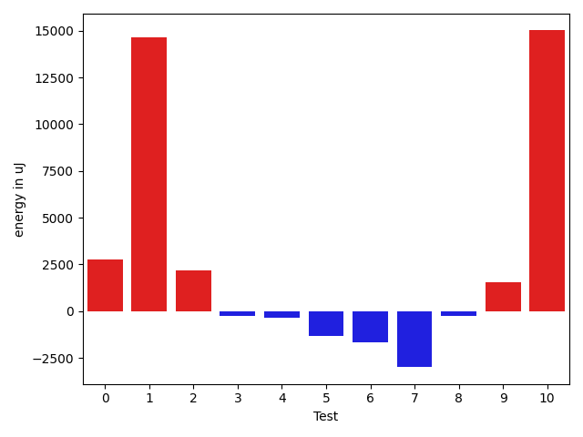

# gson b50618

https://github.com/google/gson/commit/b50618

## Delta Energy per test method

| ID | EnergyV1 | EnergyV2 | DeltaEnergy | σV1 | σV2 |
| --- | --- | --- | --- | --- | --- |
| 0 | 218383 | 221130 | 2747 | 50369.51051820826 | 48651.0186383463 |
| 1 | 87891 | 102539 | 14648 | 174756.21395431538 | 163024.48154101134 |
| 2 | 41931 | 44128 | 2197 | 25981.22251216572 | 21893.09729570887 |
| 3 | 37536 | 37293 | -243 | 4341.730016243596 | 3955.367191715805 |
| 4 | 37476 | 37109 | -367 | 4343.139609671175 | 3727.258837700073 |
| 5 | 39001 | 37659 | -1342 | 5333.456257842656 | 40079.467665553726 |
| 6 | 37536 | 35889 | -1647 | 13706.014220451707 | 3037.966071579965 |
| 7 | 39734 | 36743 | -2991 | 73541.13969394646 | 20551.89105980572 |
| 8 | 37658 | 37415 | -243 | 13053.838014820003 | 3237.287502284741 |
| 9 | 36316 | 37842 | 1526 | 3899.894197282793 | 3682.2345791441476 |
| 10 | 67993 | 83007 | 15014 | 35423.26950958543 | 40056.147069751976 |

## Delta Duration per test method

| ID | DurationV1 | DurationsV2 | DeltaDuration |
| --- | --- | --- | --- |
| 0 | 6692227.252525252 | 6717874.101010101 | 25646.848484848626 |
| 1 | 5552826.2727272725 | 6031318.76 | 478492.4872727273 |
| 2 | 1605193.2222222222 | 1918284.675 | 313091.4527777778 |
| 3 | 703279.1666666666 | 667104.0384615385 | -36175.12820512813 |
| 4 | 641600.3225806452 | 652043.6315789474 | 10443.308998302207 |
| 5 | 705706.7777777778 | 1281672.0833333333 | 575965.3055555555 |
| 6 | 774880.1071428572 | 614169.5384615385 | -160710.56868131866 |
| 7 | 2149228.3333333335 | 958075.3846153846 | -1191152.948717949 |
| 8 | 770890.6923076923 | 701756.9285714285 | -69133.76373626373 |
| 9 | 696826.875 | 620668.2105263158 | -76158.66447368416 |
| 10 | 2290328.8571428573 | 2284026.74 | -6302.117142857052 |

## Misc.

| ID | Test Class | Test Method |
| --- | --- | --- |
| 0 | com.google.gson.functional.EscapingTest | testEscapingObjectFields |
| 1 | com.google.gson.functional.EscapingTest | testEscapingQuotesInStringArray |
| 2 | com.google.gson.JsonEscapingVisitorTest | testStringPrimitiveVisitationEscapingRequired |
| 3 | com.google.gson.JsonEscapingVisitorTest | testStringArrayVisitationEscapingRequired |
| 4 | com.google.gson.JsonEscapingVisitorTest | testStringFieldVisitationEscapingRequired |
| 5 | com.google.gson.functional.StringTest | testEscapedCtrlNInStringSerialization |
| 6 | com.google.gson.functional.StringTest | testEscapedBackslashInStringSerialization |
| 7 | com.google.gson.functional.StringTest | testEscapingQuotesInStringSerialization |
| 8 | com.google.gson.functional.StringTest | testAssignmentCharSerialization |
| 9 | com.google.gson.functional.StringTest | testEscapedCtrlRInStringSerialization |
| 10 | com.google.gson.functional.InternationalizationTest | testStringsWithUnicodeChineseCharactersSerialization |

| Test | IterationV1 | IterationV2 | DeltaIteration |
| --- | --- | --- | --- |
| 0 | 99 | 99 | 0 |
| 1 | 66 | 75 | 9 |
| 2 | 45 | 40 | -5 |
| 3 | 18 | 26 | 8 |
| 4 | 31 | 19 | -12 |
| 5 | 27 | 24 | -3 |
| 6 | 28 | 26 | -2 |
| 7 | 39 | 39 | 0 |
| 8 | 26 | 14 | -12 |
| 9 | 24 | 19 | -5 |
| 10 | 56 | 50 | -6 |

| Time Label | Time (s) |
| --- | --- |
| Selection | 22.09732437133789 |
| Injection | 7.828100204467773 |
| Total | 911.3480787277222 |

