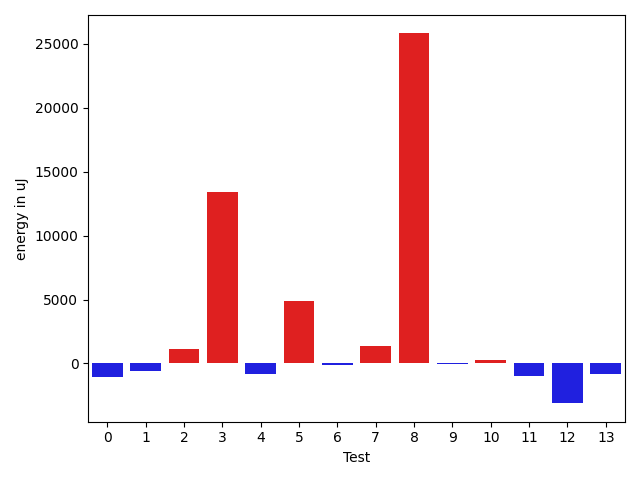
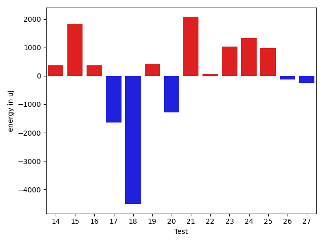
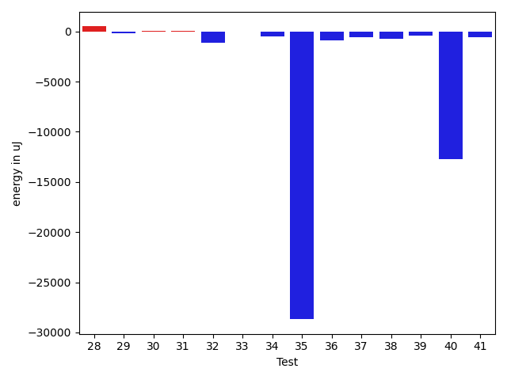
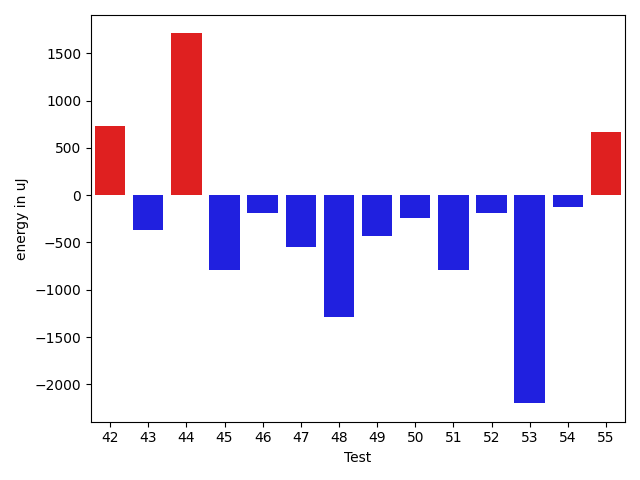
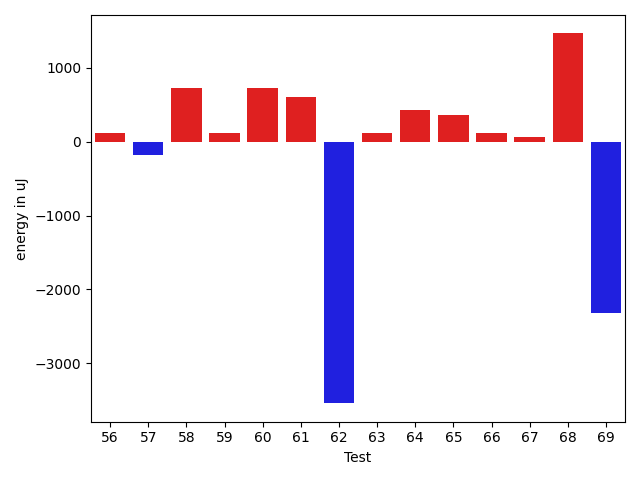
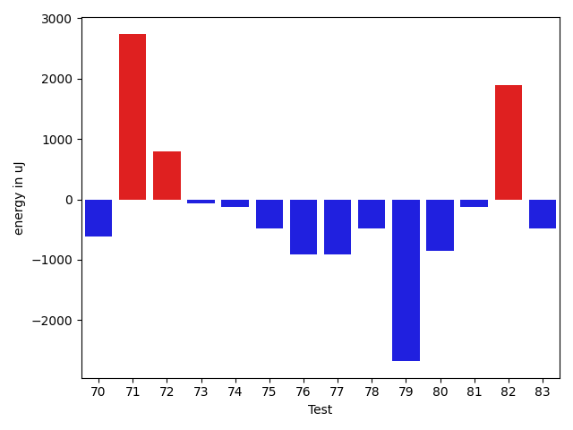
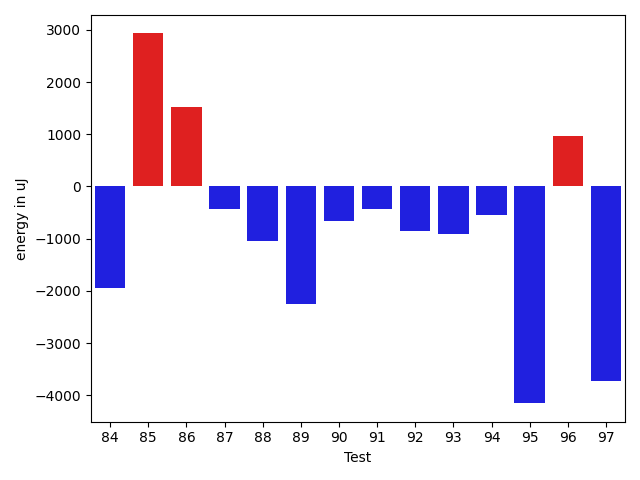
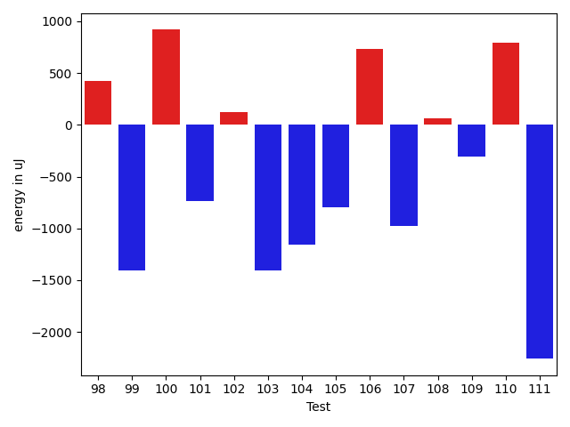
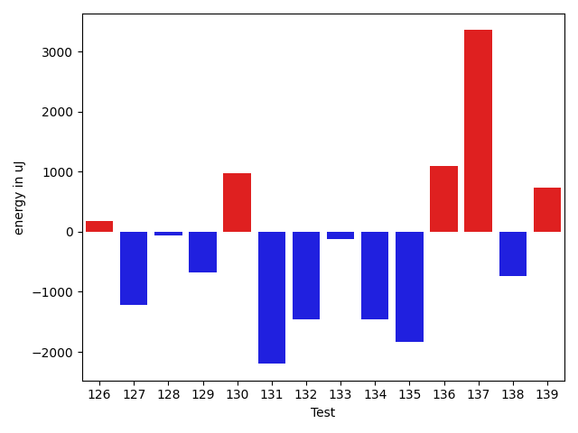
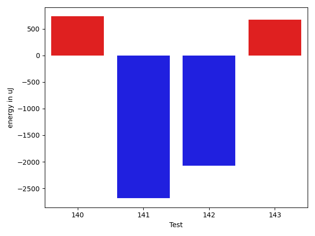

# gson 9bcbb4

https://github.com/google/gson/commit/9bcbb4

## Delta Energy per test method

| ID | EnergyV1 | EnergyV2 | DeltaEnergy | σV1 | σV2 |
| --- | --- | --- | --- | --- | --- |
| 0 | 33996 | 32898 | -1098 | 3549.158729373496 | 4295.76925870063 |
| 1 | 34851 | 34240 | -611 | 13384.398688852654 | 12010.937748940045 |
| 2 | 35522 | 36621 | 1099 | 32111.824694351028 | 26329.30375917123 |
| 3 | 112732 | 126159 | 13427 | 66468.20823431415 | 81722.89039062594 |
| 4 | 34545 | 33752 | -793 | 14879.074597913552 | 11130.903537439686 |
| 5 | 78125 | 83008 | 4883 | 22964.781803148 | 28122.158967038285 |
| 6 | 34973 | 34851 | -122 | 13093.948107760687 | 14653.70944027359 |
| 7 | 63171 | 64514 | 1343 | 20720.620711753276 | 23709.728605470085 |
| 8 | 38208 | 64026 | 25818 | 38800.514762320134 | 41112.72341124733 |
| 9 | 34973 | 34912 | -61 | 13243.546735086013 | 12909.190259002336 |
| 10 | 35645 | 35949 | 304 | 16477.35772173439 | 18585.26129160803 |
| 11 | 35461 | 34485 | -976 | 3919.952511599461 | 4652.141240313162 |
| 12 | 36499 | 33386 | -3113 | 7036.685489587593 | 8951.971780511061 |
| 13 | 37292 | 36438 | -854 | 24925.664940376642 | 43506.35238982434 |
| 14 | 36682 | 37048 | 366 | 218025.5795155473 | 225766.98993458293 |
| 15 | 68786 | 70617 | 1831 | 23154.373104263563 | 20733.81971726271 |
| 16 | 35888 | 36255 | 367 | 26099.1069009876 | 40579.643816827906 |
| 17 | 35339 | 33692 | -1647 | 8955.879304074813 | 4166.057749079104 |
| 18 | 37415 | 32898 | -4517 | 4693.767468557521 | 3884.9235930838745 |
| 19 | 35035 | 35461 | 426 | 4999.9898580393 | 5351.9618873732425 |
| 20 | 35645 | 34363 | -1282 | 3621.207208578506 | 3809.779119125338 |
| 21 | 81054 | 83130 | 2076 | 79683.46143273475 | 75271.92789700354 |
| 22 | 36560 | 36621 | 61 | 11254.407777552778 | 3586.4599523764377 |
| 23 | 36621 | 37659 | 1038 | 7225.715998013665 | 6241.524668460247 |
| 24 | 35339 | 36682 | 1343 | 4205.0069159559425 | 33995.24283819869 |
| 25 | 35339 | 36316 | 977 | 3770.8536895066627 | 4209.150205141886 |
| 26 | 34179 | 34058 | -121 | 3436.5896393930757 | 4034.3180192443924 |
| 27 | 38757 | 38513 | -244 | 56516.97553857374 | 49132.61596588724 |
| 28 | 35278 | 35767 | 489 | 3575.6593607185428 | 4073.84796472198 |
| 29 | 39062 | 38879 | -183 | 38087.36631780721 | 37599.52762798784 |
| 30 | 36743 | 36804 | 61 | 3911.684411797557 | 12392.21598087054 |
| 31 | 35584 | 35644 | 60 | 3779.8660971516824 | 3596.5686206499663 |
| 32 | 35095 | 33935 | -1160 | 4048.0724252229065 | 3259.1025531521423 |
| 33 | 35462 | 35461 | -1 | 3232.9393099155477 | 3811.789507761321 |
| 34 | 39978 | 39490 | -488 | 68996.22449392667 | 52771.434263866664 |
| 35 | 66529 | 37842 | -28687 | 40214.46358445503 | 35433.72255851048 |
| 36 | 34301 | 33447 | -854 | 3287.175783818983 | 2738.2472492935863 |
| 37 | 35278 | 34668 | -610 | 3391.0890673143504 | 3061.985633901998 |
| 38 | 36438 | 35706 | -732 | 12879.87890339501 | 8770.89448106727 |
| 39 | 36011 | 35584 | -427 | 32938.272640082345 | 18860.19024710094 |
| 40 | 79712 | 67016 | -12696 | 55870.235469396175 | 38781.36396509494 |
| 41 | 36315 | 35766 | -549 | 11648.823133690374 | 11576.954609207447 |
| 42 | 34851 | 35584 | 733 | 5557.689032394371 | 3914.2014138531576 |
| 43 | 36621 | 36255 | -366 | 3622.329517429289 | 2910.8498413981324 |
| 44 | 34119 | 35827 | 1708 | 3022.8849732664326 | 3038.284045448747 |
| 45 | 33814 | 33020 | -794 | 1997.319830022563 | 2737.151851302526 |
| 46 | 34180 | 33996 | -184 | 3343.2713088793917 | 2814.674707722534 |
| 47 | 34790 | 34240 | -550 | 3340.7966985907533 | 2885.336133118678 |
| 48 | 36194 | 34912 | -1282 | 2304.1967349974216 | 3641.505381020327 |
| 49 | 35705 | 35278 | -427 | 3439.2173581816382 | 2912.9697815282752 |
| 50 | 34729 | 34485 | -244 | 2773.3962733242593 | 2866.4226442768813 |
| 51 | 35584 | 34790 | -794 | 9672.457120997962 | 3865.6792449311365 |
| 52 | 35950 | 35766 | -184 | 9359.930838885906 | 3852.3838225823347 |
| 53 | 38269 | 36071 | -2198 | 18164.56244885539 | 13319.71867994226 |
| 54 | 36011 | 35889 | -122 | 3568.61874539716 | 2639.4563791811374 |
| 55 | 32959 | 33630 | 671 | 3433.065375422985 | 2933.2022380143903 |
| 56 | 35705 | 35827 | 122 | 3663.9782927639485 | 3774.3602090492536 |
| 57 | 33692 | 33508 | -184 | 3294.386656791283 | 6090.762260744557 |
| 58 | 36072 | 36804 | 732 | 3966.102895968018 | 2401.011277961811 |
| 59 | 37048 | 37171 | 123 | 20443.255679963466 | 17215.5836409741 |
| 60 | 34485 | 35217 | 732 | 3559.6802183476566 | 12131.635468870545 |
| 61 | 35034 | 35644 | 610 | 3356.641198015256 | 5216.97560287763 |
| 62 | 151489 | 147949 | -3540 | 28559.875717118357 | 29866.228215405983 |
| 63 | 37720 | 37842 | 122 | 19012.91792010723 | 15335.54809076229 |
| 64 | 32959 | 33386 | 427 | 3137.629327361403 | 3262.4510682907858 |
| 65 | 38940 | 39306 | 366 | 28303.134710565973 | 33880.50121322784 |
| 66 | 33509 | 33630 | 121 | 3644.646656398944 | 3766.879506636113 |
| 67 | 35645 | 35706 | 61 | 3921.2789006191856 | 4050.16503106083 |
| 68 | 35095 | 36560 | 1465 | 3656.032724389563 | 3369.9420775240847 |
| 69 | 37780 | 35461 | -2319 | 3918.9535737167976 | 3264.505057675986 |
| 70 | 79285 | 78674 | -611 | 326725.4470083392 | 336839.7912334044 |
| 71 | 73119 | 75866 | 2747 | 59489.66651877155 | 57017.56711169855 |
| 72 | 35522 | 36316 | 794 | 58135.43451922528 | 55199.16017307987 |
| 73 | 35888 | 35828 | -60 | 3432.9529058620888 | 4521.179531274904 |
| 74 | 36072 | 35950 | -122 | 8260.944752922882 | 12654.917355782638 |
| 75 | 40039 | 39551 | -488 | 55532.373948950124 | 50235.051558613966 |
| 76 | 36377 | 35461 | -916 | 3253.383393351025 | 4278.816125097918 |
| 77 | 36560 | 35645 | -915 | 3469.101912078815 | 3474.236366295317 |
| 78 | 35400 | 34912 | -488 | 3536.022117022285 | 4769.378040164147 |
| 79 | 36865 | 34180 | -2685 | 3691.8701424601772 | 4239.455613931702 |
| 80 | 38147 | 37292 | -855 | 28366.46902090656 | 28861.402593794835 |
| 81 | 35217 | 35095 | -122 | 3868.767614776423 | 4506.4773748017415 |
| 82 | 34729 | 36621 | 1892 | 4293.204248925468 | 4004.2944834201417 |
| 83 | 38025 | 37537 | -488 | 473011.61439184705 | 462733.15637926356 |
| 84 | 39856 | 37903 | -1953 | 62845.170829555376 | 61270.03959709927 |
| 85 | 37414 | 40344 | 2930 | 12855.965472193142 | 18330.90407389531 |
| 86 | 35339 | 36865 | 1526 | 3491.655441619589 | 3787.0240975343845 |
| 87 | 36071 | 35644 | -427 | 3975.7520627981507 | 3769.582462224232 |
| 88 | 34851 | 33813 | -1038 | 3254.0280233186695 | 4134.728520037753 |
| 89 | 36743 | 34485 | -2258 | 5095.758186792608 | 4168.354518272168 |
| 90 | 37841 | 37171 | -670 | 9048.20928004598 | 6420.41609810225 |
| 91 | 37048 | 36621 | -427 | 4311.357584592378 | 4565.477885581217 |
| 92 | 35644 | 34789 | -855 | 3257.1789387273293 | 3204.0257311409264 |
| 93 | 36254 | 35339 | -915 | 3293.5601642531983 | 3476.8285164603635 |
| 94 | 35217 | 34668 | -549 | 3078.09493700358 | 4641.04567871993 |
| 95 | 70618 | 66467 | -4151 | 31584.682789832004 | 22958.21413493654 |
| 96 | 35828 | 36804 | 976 | 3633.4433899220994 | 3844.8529602202325 |
| 97 | 38819 | 35095 | -3724 | 4019.9649596288755 | 3421.810282581038 |
| 98 | 34790 | 35217 | 427 | 3751.1389889319903 | 3388.494374874822 |
| 99 | 36377 | 34973 | -1404 | 2789.628008588933 | 3541.7123113197445 |
| 100 | 35888 | 36805 | 917 | 2988.699294379115 | 3122.390688238741 |
| 101 | 36071 | 35339 | -732 | 3174.0624632653435 | 4612.112306621434 |
| 102 | 35339 | 35461 | 122 | 3443.1563457231723 | 3621.7273533801826 |
| 103 | 36987 | 35583 | -1404 | 4726.932815209687 | 3019.8588215244527 |
| 104 | 38513 | 37354 | -1159 | 42239.10402517681 | 37893.01262558162 |
| 105 | 39795 | 39001 | -794 | 39956.68255161628 | 45262.11243689362 |
| 106 | 35828 | 36560 | 732 | 4480.801213843115 | 3568.333766301652 |
| 107 | 36133 | 35156 | -977 | 4942.56092793157 | 3156.0958111614373 |
| 108 | 35706 | 35767 | 61 | 4527.946418029142 | 4193.029039098975 |
| 109 | 36987 | 36682 | -305 | 4352.997223247448 | 4783.879823332769 |
| 110 | 36743 | 37537 | 794 | 5790.914807291341 | 4327.299365366349 |
| 111 | 40038 | 37780 | -2258 | 4184.032641782327 | 4864.536361257874 |
| 112 | 254699 | 244689 | -10010 | 76673.35636299576 | 97855.21931995093 |
| 113 | 39856 | 41137 | 1281 | 56753.49525266802 | 68775.1912963955 |
| 114 | 124328 | 136291 | 11963 | 187083.0470883355 | 311834.1704667218 |
| 115 | 36743 | 38391 | 1648 | 41369.061802501565 | 48011.48695303404 |
| 116 | 36315 | 36377 | 62 | 4119.083557038174 | 3846.426742643546 |
| 117 | 65551 | 71106 | 5555 | 72121.22500631127 | 49617.63254490384 |
| 118 | 36866 | 36621 | -245 | 21988.33613784748 | 33463.08830052 |
| 119 | 37231 | 36438 | -793 | 7176.334674543727 | 4063.0400579150364 |
| 120 | 36194 | 35950 | -244 | 5098.745697473056 | 225519.0640284437 |
| 121 | 36621 | 35705 | -916 | 169362.89637524582 | 4063.3751220383288 |
| 122 | 37231 | 36621 | -610 | 4199.899015273491 | 3591.4758275710888 |
| 123 | 36011 | 36499 | 488 | 3769.2807317013417 | 209960.188094209 |
| 124 | 37414 | 38574 | 1160 | 112456.07305187717 | 122100.99941762947 |
| 125 | 39001 | 38818 | -183 | 50037.26921913096 | 64034.129992417715 |
| 126 | 38574 | 38758 | 184 | 60950.804113007085 | 50136.9570776887 |
| 127 | 39612 | 38391 | -1221 | 23318.762355849714 | 25753.866880262187 |
| 128 | 38940 | 38880 | -60 | 34111.61665249609 | 22839.870963545112 |
| 129 | 37049 | 36376 | -673 | 4212.348104850171 | 5082.165549180519 |
| 130 | 36865 | 37842 | 977 | 105203.75145068843 | 42949.98542863034 |
| 131 | 37903 | 35705 | -2198 | 4460.763490983945 | 3442.184064483892 |
| 132 | 37963 | 36499 | -1464 | 4509.032997705214 | 2891.5337835311166 |
| 133 | 37841 | 37720 | -121 | 12378.49009884604 | 16087.720412108476 |
| 134 | 36682 | 35217 | -1465 | 3428.0051953544594 | 2308.828568776816 |
| 135 | 41321 | 39490 | -1831 | 57766.822879435924 | 61984.016248870095 |
| 136 | 35705 | 36804 | 1099 | 4117.697709712483 | 4287.526924113713 |
| 137 | 35828 | 39184 | 3356 | 4383.774620514767 | 4290.541221375031 |
| 138 | 36072 | 35339 | -733 | 3736.1560383244614 | 3329.3925452282742 |
| 139 | 34912 | 35645 | 733 | 2263.5378668669287 | 3862.756406448063 |
| 140 | 37658 | 38391 | 733 | 498678.36275428074 | 541944.2772207161 |
| 141 | 41016 | 38330 | -2686 | 4530.2218597730325 | 4632.6539513170055 |
| 142 | 40344 | 38269 | -2075 | 111826.0820536225 | 69482.78015790838 |
| 143 | 37048 | 37720 | 672 | 4840.178752632801 | 4319.114646851207 |

## Delta Duration per test method

| ID | DurationV1 | DurationsV2 | DeltaDuration |
| --- | --- | --- | --- |
| 0 | 1042779.2631578947 | 1052749.5256410257 | 9970.262483131024 |
| 1 | 1401685.8105263158 | 1407013.775510204 | 5327.964983888203 |
| 2 | 1514109.858695652 | 1597226.28125 | 83116.4225543479 |
| 3 | 4012548.776595745 | 4323219.460674157 | 310670.6840784126 |
| 4 | 1318813.440860215 | 1315269.2708333333 | -3544.170026881853 |
| 5 | 2753866.727272727 | 2827018.556701031 | 73151.82942830399 |
| 6 | 1445971.7959183673 | 1449923.0909090908 | 3951.294990723487 |
| 7 | 2056490.797979798 | 2144916.6666666665 | 88425.86868686858 |
| 8 | 2049321.618556701 | 2395224.329787234 | 345902.71123053273 |
| 9 | 1372699.8602150537 | 1361754.1041666667 | -10945.756048386917 |
| 10 | 1117143.7666666666 | 1331976.140625 | 214832.3739583334 |
| 11 | 807665.7843137255 | 812156.0192307692 | 4490.234917043708 |
| 12 | 1024478.4675324676 | 1142471.875 | 117993.40746753244 |
| 13 | 1205287.282051282 | 1536107.126984127 | 330819.8449328451 |
| 14 | 2149758.686567164 | 2317863.5223880596 | 168104.83582089562 |
| 15 | 2181257.292929293 | 2270541.0 | 89283.70707070688 |
| 16 | 1314760.4025974027 | 1595515.8767123288 | 280755.47411492607 |
| 17 | 1028021.5733333334 | 1024296.3333333334 | -3725.2399999999907 |
| 18 | 468464.6666666667 | 519735.6842105263 | 51271.017543859605 |
| 19 | 789720.8727272727 | 871756.3888888889 | 82035.5161616162 |
| 20 | 718742.4375 | 639387.78125 | -79354.65625 |
| 21 | 3683773.897959184 | 3454572.7474747472 | -229201.15048443666 |
| 22 | 596827.4782608695 | 466430.15 | -130397.32826086949 |
| 23 | 927254.1333333333 | 883313.4054054054 | -43940.72792792786 |
| 24 | 547571.4074074074 | 811596.8181818182 | 264025.4107744108 |
| 25 | 752947.7692307692 | 679338.5 | -73609.26923076925 |
| 26 | 784406.948275862 | 722037.68 | -62369.26827586198 |
| 27 | 1727117.5357142857 | 1636854.4222222222 | -90263.11349206348 |
| 28 | 536010.2173913043 | 471994.04545454547 | -64016.17193675885 |
| 29 | 1745081.4210526317 | 1518967.619047619 | -226113.80200501275 |
| 30 | 871223.0416666666 | 885593.1777777778 | 14370.136111111147 |
| 31 | 830642.3818181818 | 809510.9310344828 | -21131.450783699052 |
| 32 | 803092.3673469388 | 766464.25 | -36628.117346938816 |
| 33 | 792318.5 | 748070.3653846154 | -44248.134615384624 |
| 34 | 1858761.857142857 | 1580362.72 | -278399.1371428571 |
| 35 | 2027971.8024691357 | 1870516.2117647058 | -157455.5907044299 |
| 36 | 767824.0677966102 | 749623.4583333334 | -18200.609463276807 |
| 37 | 738918.3333333334 | 601574.4333333333 | -137343.90000000002 |
| 38 | 1192345.2891566264 | 1108590.281690141 | -83755.00746648549 |
| 39 | 1197569.6 | 926556.0930232558 | -271013.5069767443 |
| 40 | 3036055.5757575757 | 2407865.5757575757 | -628190.0 |
| 41 | 1192136.875 | 1057036.6557377048 | -135100.21926229517 |
| 42 | 917118.1379310344 | 829048.5961538461 | -88069.54177718831 |
| 43 | 666046.2444444444 | 614177.9354838709 | -51868.308960573515 |
| 44 | 465960.44 | 485854.26923076925 | 19893.829230769246 |
| 45 | 575950.1904761905 | 484737.60869565216 | -91212.58178053837 |
| 46 | 921582.1940298508 | 899543.2459016393 | -22038.94812821143 |
| 47 | 671461.2352941176 | 638210.8611111111 | -33250.37418300647 |
| 48 | 426971.2173913043 | 372860.3333333333 | -54110.88405797101 |
| 49 | 617970.9487179487 | 571535.5294117647 | -46435.41930618405 |
| 50 | 543036.7142857143 | 489543.2631578947 | -53493.4511278196 |
| 51 | 861431.1935483871 | 629595.1666666666 | -231836.02688172052 |
| 52 | 895421.3725490196 | 711668.3653846154 | -183753.00716440426 |
| 53 | 1090191.857142857 | 785913.3823529412 | -304278.47478991584 |
| 54 | 545793.0 | 420281.72 | -125511.28000000003 |
| 55 | 760836.7391304348 | 723865.9782608695 | -36970.7608695653 |
| 56 | 519348.275862069 | 468400.3703703704 | -50947.90549169859 |
| 57 | 1061966.5 | 1035190.5 | -26776.0 |
| 58 | 437923.28571428574 | 389820.95652173914 | -48102.329192546604 |
| 59 | 1257063.8522727273 | 1257159.0875 | 95.23522727261297 |
| 60 | 885577.7209302326 | 899669.0980392157 | 14091.377108983113 |
| 61 | 987061.3108108108 | 1014183.7 | 27122.389189189184 |
| 62 | 4693990.343434343 | 4736461.818181818 | 42471.47474747524 |
| 63 | 1326555.517857143 | 1192075.0961538462 | -134480.4217032967 |
| 64 | 734596.3673469388 | 724126.8947368421 | -10469.47261009668 |
| 65 | 1113091.5925925926 | 1135062.9444444445 | 21971.351851851912 |
| 66 | 738616.7608695652 | 741876.8301886793 | 3260.069319114089 |
| 67 | 555149.1290322581 | 549373.9565217391 | -5775.172510518925 |
| 68 | 578448.9655172414 | 617840.8928571428 | 39391.92733990145 |
| 69 | 505449.45454545453 | 464530.93548387097 | -40918.51906158356 |
| 70 | 4490921.575757576 | 5415112.838383839 | 924191.2626262624 |
| 71 | 2899434.875 | 3062142.387755102 | 162707.512755102 |
| 72 | 1335190.2826086956 | 1485335.4782608696 | 150145.19565217406 |
| 73 | 731721.4883720931 | 740014.387755102 | 8292.899383008946 |
| 74 | 1233408.4065934066 | 1300717.2978723405 | 67308.89127893397 |
| 75 | 1583629.5185185184 | 1679199.9864864864 | 95570.46796796797 |
| 76 | 504796.54545454547 | 491335.28571428574 | -13461.259740259731 |
| 77 | 671552.375 | 686328.2666666667 | 14775.891666666721 |
| 78 | 674968.7096774194 | 644280.8666666667 | -30687.843010752695 |
| 79 | 565877.3823529412 | 546178.6206896552 | -19698.761663286015 |
| 80 | 1650612.02247191 | 1516169.2235294117 | -134442.7989424984 |
| 81 | 839641.7857142857 | 794926.2 | -44715.58571428573 |
| 82 | 631882.0789473684 | 612290.1785714285 | -19591.900375939906 |
| 83 | 8559276.346153846 | 7292161.769230769 | -1267114.576923077 |
| 84 | 1913130.4186046512 | 1666047.641025641 | -247082.77757901023 |
| 85 | 595749.9047619047 | 852410.7826086957 | 256660.87784679094 |
| 86 | 474135.3157894737 | 418586.78571428574 | -55548.53007518797 |
| 87 | 504989.21875 | 495387.5652173913 | -9601.653532608703 |
| 88 | 621665.7222222222 | 652831.5833333334 | 31165.861111111124 |
| 89 | 520061.7916666667 | 589761.05 | 69699.25833333336 |
| 90 | 763764.4 | 761424.4137931034 | -2339.986206896603 |
| 91 | 571817.5185185185 | 501618.1111111111 | -70199.40740740742 |
| 92 | 389962.4166666667 | 376646.0588235294 | -13316.357843137288 |
| 93 | 474439.22222222225 | 437182.76470588235 | -37256.4575163399 |
| 94 | 626943.6774193548 | 616641.5945945946 | -10302.082824760233 |
| 95 | 2055930.956521739 | 1943364.52 | -112566.436521739 |
| 96 | 438161.0 | 430202.28571428574 | -7958.714285714261 |
| 97 | 568998.1904761905 | 488452.8095238095 | -80545.380952381 |
| 98 | 701866.6571428571 | 732131.2121212122 | 30264.554978355067 |
| 99 | 585058.6666666666 | 551380.0769230769 | -33678.58974358975 |
| 100 | 406525.1111111111 | 411032.7 | 4507.588888888888 |
| 101 | 393622.46153846156 | 392830.6666666667 | -791.7948717948748 |
| 102 | 429823.3125 | 409893.73333333334 | -19929.579166666663 |
| 103 | 452752.05555555556 | 571599.6842105263 | 118847.62865497073 |
| 104 | 1580098.8378378379 | 1727273.9466666668 | 147175.1088288289 |
| 105 | 1174507.1463414633 | 1648943.3125 | 474436.1661585367 |
| 106 | 683685.4905660377 | 694824.6315789474 | 11139.141012909706 |
| 107 | 483224.94736842107 | 470741.3076923077 | -12483.63967611338 |
| 108 | 664180.1578947369 | 741575.4545454546 | 77395.29665071773 |
| 109 | 626027.8 | 557308.4137931034 | -68719.38620689663 |
| 110 | 738911.4571428571 | 653720.575 | -85190.88214285718 |
| 111 | 668783.75 | 531081.7 | -137702.05000000005 |
| 112 | 7498235.7272727275 | 7685153.747474748 | 186918.02020202018 |
| 113 | 2032409.9239130435 | 2313512.1979166665 | 281102.27400362305 |
| 114 | 5117886.777777778 | 6171087.5050505055 | 1053200.7272727275 |
| 115 | 1242000.5531914893 | 1467586.3333333333 | 225585.78014184395 |
| 116 | 685322.7272727273 | 620443.28125 | -64879.446022727294 |
| 117 | 2557507.585858586 | 2377762.43877551 | -179745.14708307572 |
| 118 | 1209056.7142857143 | 1271910.046875 | 62853.33258928568 |
| 119 | 668504.7826086957 | 607971.5666666667 | -60533.215942029026 |
| 120 | 777258.15625 | 1974387.738095238 | 1197129.581845238 |
| 121 | 1506451.387755102 | 806651.86 | -699799.527755102 |
| 122 | 597016.8918918918 | 581969.7777777778 | -15047.114114114083 |
| 123 | 788208.1875 | 1742055.0731707318 | 953846.8856707318 |
| 124 | 2099309.274509804 | 2884247.0 | 784937.7254901961 |
| 125 | 1507351.7971014492 | 2065244.5 | 557892.7028985508 |
| 126 | 1740997.0526315789 | 1423508.15 | -317488.90263157897 |
| 127 | 1335514.71875 | 1198406.7222222222 | -137107.99652777775 |
| 128 | 1281769.6896551724 | 978111.3793103448 | -303658.3103448276 |
| 129 | 902614.5306122449 | 749924.2075471698 | -152690.3230650751 |
| 130 | 2189704.5735294116 | 1163845.7424242424 | -1025858.8311051691 |
| 131 | 576155.9565217391 | 498505.7619047619 | -77650.19461697724 |
| 132 | 453374.0588235294 | 502607.3076923077 | 49233.24886877829 |
| 133 | 1001866.6551724138 | 1103997.894736842 | 102131.23956442822 |
| 134 | 462046.64705882355 | 459064.8 | -2981.847058823565 |
| 135 | 1447296.5217391304 | 2354225.296296296 | 906928.7745571658 |
| 136 | 458133.64285714284 | 424724.4375 | -33409.20535714284 |
| 137 | 481236.71428571426 | 446803.17647058825 | -34433.53781512601 |
| 138 | 528889.5 | 525295.5789473684 | -3593.921052631573 |
| 139 | 441959.9411764706 | 545230.3333333334 | 103270.39215686277 |
| 140 | 4071372.0327868853 | 5722329.23880597 | 1650957.206019085 |
| 141 | 389956.3333333333 | 399728.9285714286 | 9772.595238095266 |
| 142 | 3147203.4615384615 | 1433133.9444444445 | -1714069.517094017 |
| 143 | 510566.04545454547 | 506763.45454545453 | -3802.590909090941 |

## Misc.

| ID | Test Class | Test Method |
| --- | --- | --- |
| 0 | com.google.gson.functional.ParameterizedTypesTest | testParameterizedTypeGenericArraysSerialization |
| 1 | com.google.gson.functional.ParameterizedTypesTest | testVariableTypeArrayDeserialization |
| 2 | com.google.gson.functional.ParameterizedTypesTest | testParameterizedTypeWithCustomSerializer |
| 3 | com.google.gson.functional.ParameterizedTypesTest | testParameterizedTypesSerialization |
| 4 | com.google.gson.functional.ParameterizedTypesTest | testVariableTypeDeserialization |
| 5 | com.google.gson.functional.ParameterizedTypesTest | testVariableTypeFieldsAndGenericArraysSerialization |
| 6 | com.google.gson.functional.ParameterizedTypesTest | testParameterizedTypeGenericArraysDeserialization |
| 7 | com.google.gson.functional.ParameterizedTypesTest | testVariableTypeFieldsAndGenericArraysDeserialization |
| 8 | com.google.gson.functional.ParameterizedTypesTest | testTypesWithMultipleParametersSerialization |
| 9 | com.google.gson.functional.ParameterizedTypesTest | testParameterizedTypeWithVariableTypeDeserialization |
| 10 | com.google.gson.functional.ParameterizedTypesTest | testParameterizedTypesWithWriterSerialization |
| 11 | com.google.gson.functional.CustomTypeAdaptersTest | testCustomTypeAdapterAppliesToSubClassesSerializedAsBaseClass |
| 12 | com.google.gson.functional.CustomTypeAdaptersTest | testCustomAdapterInvokedForMapElementSerializationWithType |
| 13 | com.google.gson.functional.CustomTypeAdaptersTest | testCustomNestedSerializers |
| 14 | com.google.gson.functional.CustomTypeAdaptersTest | testCustomSerializers |
| 15 | com.google.gson.functional.CustomTypeAdaptersTest | testCustomTypeAdapterDoesNotAppliesToSubClasses |
| 16 | com.google.gson.functional.CustomTypeAdaptersTest | testCustomAdapterInvokedForCollectionElementSerializationWithType |
| 17 | com.google.gson.functional.CustomTypeAdaptersTest | testCustomSerializerForLong |
| 18 | com.google.gson.functional.CustomTypeAdaptersTest | testCustomAdapterInvokedForMapElementSerialization |
| 19 | com.google.gson.functional.CustomTypeAdaptersTest | testCustomByteArraySerializer |
| 20 | com.google.gson.functional.CustomTypeAdaptersTest | testCustomAdapterInvokedForCollectionElementSerialization |
| 21 | com.google.gson.functional.ExposeFieldsTest | testNullExposeFieldSerialization |
| 22 | com.google.gson.functional.ExposeFieldsTest | testExposeAnnotationSerialization |
| 23 | com.google.gson.functional.ExposeFieldsTest | testArrayWithOneNullExposeFieldObjectSerialization |
| 24 | com.google.gson.functional.ExposeFieldsTest | testNoExposedFieldSerialization |
| 25 | com.google.gson.functional.CollectionTest | testRawCollectionSerialization |
| 26 | com.google.gson.functional.CollectionTest | testNullsInListSerialization |
| 27 | com.google.gson.functional.CollectionTest | testCollectionOfBagOfPrimitivesSerialization |
| 28 | com.google.gson.functional.CollectionTest | testRawCollectionOfIntegersSerialization |
| 29 | com.google.gson.functional.CollectionTest | testCollectionOfEnumsSerialization |
| 30 | com.google.gson.functional.CollectionTest | testTopLevelCollectionOfIntegersSerialization |
| 31 | com.google.gson.functional.CollectionTest | testLinkedListSerialization |
| 32 | com.google.gson.functional.CollectionTest | testCollectionOfObjectSerialization |
| 33 | com.google.gson.functional.CollectionTest | testQueueSerialization |
| 34 | com.google.gson.functional.CollectionTest | testCollectionOfStringsSerialization |
| 35 | com.google.gson.functional.ObjectTest | testDirectedAcyclicGraphSerialization |
| 36 | com.google.gson.functional.ObjectTest | testInnerClassSerialization |
| 37 | com.google.gson.functional.ObjectTest | testBagOfPrimitiveWrappersSerialization |
| 38 | com.google.gson.functional.ObjectTest | testArrayOfArraysSerialization |
| 39 | com.google.gson.functional.ObjectTest | testAnonymousLocalClassesSerialization |
| 40 | com.google.gson.functional.ObjectTest | testSubInterfacesOfCollectionSerialization |
| 41 | com.google.gson.functional.ObjectTest | testInheritenceSerialization |
| 42 | com.google.gson.functional.ObjectTest | testArrayOfObjectsSerialization |
| 43 | com.google.gson.functional.ObjectTest | testClassWithEnumFieldSerialization |
| 44 | com.google.gson.functional.ObjectTest | testPrimitiveArrayFieldSerialization |
| 45 | com.google.gson.functional.ObjectTest | testSelfReferenceSerialization |
| 46 | com.google.gson.functional.ObjectTest | testClassWithObjectFieldSerialization |
| 47 | com.google.gson.functional.ObjectTest | testCircularSerialization |
| 48 | com.google.gson.functional.ObjectTest | testTopLevelEnumSerialization |
| 49 | com.google.gson.functional.ObjectTest | testNullFieldsSerialization |
| 50 | com.google.gson.functional.ObjectTest | testEmptyCollectionInAnObjectSerialization |
| 51 | com.google.gson.functional.ObjectTest | testClassWithTransientFieldsSerialization |
| 52 | com.google.gson.functional.ObjectTest | testNestedSerialization |
| 53 | com.google.gson.functional.ObjectTest | testBagOfPrimitivesSerialization |
| 54 | com.google.gson.functional.ObjectTest | testClassWithNoFieldsSerialization |
| 55 | com.google.gson.functional.DefaultTypeAdaptersTest | testDateSerializationWithPattern |
| 56 | com.google.gson.functional.DefaultTypeAdaptersTest | testLocaleSerializationWithLanguageCountryVariant |
| 57 | com.google.gson.functional.DefaultTypeAdaptersTest | testDefaultDateDeserializationUsingBuilder |
| 58 | com.google.gson.functional.DefaultTypeAdaptersTest | testLocaleSerializationWithLanguageCountry |
| 59 | com.google.gson.functional.DefaultTypeAdaptersTest | testUrlNullSerialization |
| 60 | com.google.gson.functional.DefaultTypeAdaptersTest | testBigIntegerFieldSerialization |
| 61 | com.google.gson.functional.DefaultTypeAdaptersTest | testDefaultDateSerialization |
| 62 | com.google.gson.functional.DefaultTypeAdaptersTest | testDefaultDateDeserialization |
| 63 | com.google.gson.functional.DefaultTypeAdaptersTest | testBigDecimalFieldSerialization |
| 64 | com.google.gson.functional.DefaultTypeAdaptersTest | testDefaultDateSerializationUsingBuilder |
| 65 | com.google.gson.functional.DefaultTypeAdaptersTest | testUrlSerialization |
| 66 | com.google.gson.functional.DefaultTypeAdaptersTest | testDateDeserializationWithPattern |
| 67 | com.google.gson.functional.DefaultTypeAdaptersTest | testUriSerialization |
| 68 | com.google.gson.functional.DefaultTypeAdaptersTest | testSetSerialization |
| 69 | com.google.gson.functional.DefaultTypeAdaptersTest | testLocaleSerializationWithLanguage |
| 70 | com.google.gson.functional.NamingPolicyTest | testGsonWithNonDefaultFieldNamingPolicySerialization |
| 71 | com.google.gson.functional.NamingPolicyTest | testGsonWithSerializedNameFieldNamingPolicySerialization |
| 72 | com.google.gson.functional.NamingPolicyTest | testGsonWithNonDefaultFieldNamingPolicyDeserialiation |
| 73 | com.google.gson.functional.MapTest | testMapSerializationEmpty |
| 74 | com.google.gson.functional.MapTest | testParameterizedMapSubclassSerialization |
| 75 | com.google.gson.functional.MapTest | testMapSerialization |
| 76 | com.google.gson.functional.MapTest | testMapSubclassSerialization |
| 77 | com.google.gson.functional.MapTest | testRawMapSerialization |
| 78 | com.google.gson.functional.NullObjectAndFieldTest | testExplicitSerializationOfNullCollectionMembers |
| 79 | com.google.gson.functional.NullObjectAndFieldTest | testCustomSerializationOfNulls |
| 80 | com.google.gson.functional.NullObjectAndFieldTest | testExplicitSerializationOfNullArrayMembers |
| 81 | com.google.gson.functional.NullObjectAndFieldTest | testNullWrappedPrimitiveMemberSerialization |
| 82 | com.google.gson.functional.NullObjectAndFieldTest | testExplicitSerializationOfNullStringMembers |
| 83 | com.google.gson.functional.NullObjectAndFieldTest | testTopLevelNullObjectSerialization |
| 84 | com.google.gson.functional.NullObjectAndFieldTest | testExplicitSerializationOfNulls |
| 85 | com.google.gson.functional.PrimitiveTest | testPrimitiveIntegerAutoboxedSerialization |
| 86 | com.google.gson.functional.PrimitiveTest | testNumberSerialization |
| 87 | com.google.gson.functional.PrimitiveTest | testBigDecimalInASingleElementArraySerialization |
| 88 | com.google.gson.functional.PrimitiveTest | testOverridingDefaultPrimitiveSerialization |
| 89 | com.google.gson.functional.PrimitiveTest | testPrimitiveDoubleAutoboxedInASingleElementArraySerialization |
| 90 | com.google.gson.functional.PrimitiveTest | testPrimitiveIntegerAutoboxedInASingleElementArraySerialization |
| 91 | com.google.gson.functional.PrimitiveTest | testPrimitiveLongAutoboxedInASingleElementArraySerialization |
| 92 | com.google.gson.functional.PrimitiveTest | testSmallValueForBigDecimalSerialization |
| 93 | com.google.gson.functional.PrimitiveTest | testPrimitiveLongAutoboxedSerialization |
| 94 | com.google.gson.functional.PrimitiveTest | testBigIntegerInASingleElementArraySerialization |
| 95 | com.google.gson.functional.PrimitiveTest | testPrimitiveDoubleAutoboxedSerialization |
| 96 | com.google.gson.functional.PrimitiveTest | testPrimitiveBooleanAutoboxedSerialization |
| 97 | com.google.gson.functional.PrimitiveTest | testPrimitiveBooleanAutoboxedInASingleElementArraySerialization |
| 98 | com.google.gson.functional.PrimitiveTest | testBigIntegerSerialization |
| 99 | com.google.gson.functional.PrimitiveTest | testBigDecimalSerialization |
| 100 | com.google.gson.functional.PrimitiveTest | testReallyLongValuesSerialization |
| 101 | com.google.gson.functional.PrimitiveTest | testBigDecimalPreservePrecisionSerialization |
| 102 | com.google.gson.functional.PrimitiveTest | testSmallValueForBigIntegerSerialization |
| 103 | com.google.gson.functional.ArrayTest | testArrayOfStringsSerialization |
| 104 | com.google.gson.functional.ArrayTest | testArrayOfCollectionSerialization |
| 105 | com.google.gson.functional.ArrayTest | testTopLevelArrayOfIntsSerialization |
| 106 | com.google.gson.functional.ArrayTest | testArrayOfPrimitivesWithCustomTypeAdapter |
| 107 | com.google.gson.functional.ArrayTest | testEmptyArraySerialization |
| 108 | com.google.gson.functional.ArrayTest | testNullsInArraySerialization |
| 109 | com.google.gson.GsonTypeAdapterTest | testTypeAdapterProperlyConvertsTypes |
| 110 | com.google.gson.GsonTypeAdapterTest | testTypeAdapterThrowsException |
| 111 | com.google.gson.GsonTypeAdapterTest | testTypeAdapterDoesNotAffectNonAdaptedTypes |
| 112 | com.google.gson.functional.ConcurrencyTest | testMultiThreadSerialization |
| 113 | com.google.gson.functional.ConcurrencyTest | testSingleThreadSerialization |
| 114 | com.google.gson.functional.VersioningTest | testVersionedClassesSerialization |
| 115 | com.google.gson.functional.VersioningTest | testVersionedGsonWithUnversionedClassesSerialization |
| 116 | com.google.gson.functional.VersioningTest | testIgnoreLaterVersionClassSerialization |
| 117 | com.google.gson.FunctionalWithInternalDependenciesTest | testPrettyPrintList |
| 118 | com.google.gson.FunctionalWithInternalDependenciesTest | testPrettyPrintArrayOfObjects |
| 119 | com.google.gson.FunctionalWithInternalDependenciesTest | testPrettyPrintArrayOfPrimitives |
| 120 | com.google.gson.FunctionalWithInternalDependenciesTest | testPrettyPrintListOfPrimitiveArrays |
| 121 | com.google.gson.FunctionalWithInternalDependenciesTest | testAnonymousLocalClassesSerialization |
| 122 | com.google.gson.FunctionalWithInternalDependenciesTest | testMultipleArrays |
| 123 | com.google.gson.FunctionalWithInternalDependenciesTest | testPrettyPrintArrayOfPrimitiveArrays |
| 124 | com.google.gson.functional.EscapingTest | testEscapingQuotesInStringArray |
| 125 | com.google.gson.functional.EscapingTest | testEscapingObjectFields |
| 126 | com.google.gson.functional.UncategorizedTest | testObjectEqualButNotSameSerialization |
| 127 | com.google.gson.functional.UncategorizedTest | testStaticFieldsAreNotSerialized |
| 128 | com.google.gson.functional.InternationalizationTest | testStringsWithUnicodeChineseCharactersSerialization |
| 129 | com.google.gson.functional.CustomDeserializerTest | testDefaultConstructorNotCalledOnField |
| 130 | com.google.gson.functional.CustomDeserializerTest | testDefaultConstructorNotCalledOnObject |
| 131 | com.google.gson.functional.StringTest | testSingleQuoteInStringSerialization |
| 132 | com.google.gson.functional.StringTest | testEscapedCtrlNInStringSerialization |
| 133 | com.google.gson.functional.StringTest | testStringValueAsSingleElementArraySerialization |
| 134 | com.google.gson.functional.StringTest | testEscapedCtrlRInStringSerialization |
| 135 | com.google.gson.functional.StringTest | testStringValueSerialization |
| 136 | com.google.gson.functional.StringTest | testAssignmentCharSerialization |
| 137 | com.google.gson.functional.StringTest | testJavascriptKeywordsInStringSerialization |
| 138 | com.google.gson.functional.StringTest | testEscapingQuotesInStringSerialization |
| 139 | com.google.gson.functional.StringTest | testEscapedBackslashInStringSerialization |
| 140 | com.google.gson.functional.PrintFormattingTest | testCompactFormattingLeavesNoWhiteSpace |
| 141 | com.google.gson.functional.ReadersWritersTest | testTopLevelNullObjectSerializationWithWriter |
| 142 | com.google.gson.functional.ReadersWritersTest | testWriterForSerialization |
| 143 | com.google.gson.functional.ReadersWritersTest | testTopLevelNullObjectSerializationWithWriterAndSerializeNulls |

| Test | IterationV1 | IterationV2 | DeltaIteration |
| --- | --- | --- | --- |
| 0 | 76 | 78 | 2 |
| 1 | 95 | 98 | 3 |
| 2 | 92 | 96 | 4 |
| 3 | 94 | 89 | -5 |
| 4 | 93 | 96 | 3 |
| 5 | 99 | 97 | -2 |
| 6 | 98 | 99 | 1 |
| 7 | 99 | 99 | 0 |
| 8 | 97 | 94 | -3 |
| 9 | 93 | 96 | 3 |
| 10 | 60 | 64 | 4 |
| 11 | 51 | 52 | 1 |
| 12 | 77 | 72 | -5 |
| 13 | 78 | 63 | -15 |
| 14 | 67 | 67 | 0 |
| 15 | 99 | 99 | 0 |
| 16 | 77 | 73 | -4 |
| 17 | 75 | 69 | -6 |
| 18 | 30 | 19 | -11 |
| 19 | 55 | 54 | -1 |
| 20 | 32 | 32 | 0 |
| 21 | 98 | 99 | 1 |
| 22 | 23 | 20 | -3 |
| 23 | 45 | 37 | -8 |
| 24 | 27 | 22 | -5 |
| 25 | 39 | 38 | -1 |
| 26 | 58 | 50 | -8 |
| 27 | 56 | 45 | -11 |
| 28 | 23 | 22 | -1 |
| 29 | 76 | 63 | -13 |
| 30 | 48 | 45 | -3 |
| 31 | 55 | 58 | 3 |
| 32 | 49 | 44 | -5 |
| 33 | 48 | 52 | 4 |
| 34 | 35 | 25 | -10 |
| 35 | 81 | 85 | 4 |
| 36 | 59 | 48 | -11 |
| 37 | 39 | 30 | -9 |
| 38 | 83 | 71 | -12 |
| 39 | 55 | 43 | -12 |
| 40 | 99 | 99 | 0 |
| 41 | 80 | 61 | -19 |
| 42 | 58 | 52 | -6 |
| 43 | 45 | 31 | -14 |
| 44 | 25 | 26 | 1 |
| 45 | 21 | 23 | 2 |
| 46 | 67 | 61 | -6 |
| 47 | 34 | 36 | 2 |
| 48 | 23 | 15 | -8 |
| 49 | 39 | 34 | -5 |
| 50 | 21 | 19 | -2 |
| 51 | 31 | 36 | 5 |
| 52 | 51 | 52 | 1 |
| 53 | 35 | 34 | -1 |
| 54 | 16 | 25 | 9 |
| 55 | 46 | 46 | 0 |
| 56 | 29 | 27 | -2 |
| 57 | 72 | 74 | 2 |
| 58 | 21 | 23 | 2 |
| 59 | 88 | 80 | -8 |
| 60 | 43 | 51 | 8 |
| 61 | 74 | 70 | -4 |
| 62 | 99 | 99 | 0 |
| 63 | 56 | 52 | -4 |
| 64 | 49 | 38 | -11 |
| 65 | 54 | 54 | 0 |
| 66 | 46 | 53 | 7 |
| 67 | 31 | 23 | -8 |
| 68 | 29 | 28 | -1 |
| 69 | 33 | 31 | -2 |
| 70 | 99 | 99 | 0 |
| 71 | 96 | 98 | 2 |
| 72 | 46 | 46 | 0 |
| 73 | 43 | 49 | 6 |
| 74 | 91 | 94 | 3 |
| 75 | 81 | 74 | -7 |
| 76 | 22 | 28 | 6 |
| 77 | 24 | 15 | -9 |
| 78 | 31 | 30 | -1 |
| 79 | 34 | 29 | -5 |
| 80 | 89 | 85 | -4 |
| 81 | 56 | 50 | -6 |
| 82 | 38 | 28 | -10 |
| 83 | 26 | 26 | 0 |
| 84 | 43 | 39 | -4 |
| 85 | 21 | 23 | 2 |
| 86 | 19 | 14 | -5 |
| 87 | 32 | 23 | -9 |
| 88 | 36 | 36 | 0 |
| 89 | 24 | 20 | -4 |
| 90 | 35 | 29 | -6 |
| 91 | 27 | 27 | 0 |
| 92 | 24 | 17 | -7 |
| 93 | 18 | 17 | -1 |
| 94 | 31 | 37 | 6 |
| 95 | 46 | 50 | 4 |
| 96 | 22 | 14 | -8 |
| 97 | 21 | 21 | 0 |
| 98 | 35 | 33 | -2 |
| 99 | 21 | 26 | 5 |
| 100 | 18 | 10 | -8 |
| 101 | 13 | 15 | 2 |
| 102 | 16 | 15 | -1 |
| 103 | 18 | 19 | 1 |
| 104 | 74 | 75 | 1 |
| 105 | 41 | 32 | -9 |
| 106 | 53 | 38 | -15 |
| 107 | 19 | 13 | -6 |
| 108 | 19 | 22 | 3 |
| 109 | 25 | 29 | 4 |
| 110 | 35 | 40 | 5 |
| 111 | 20 | 20 | 0 |
| 112 | 99 | 99 | 0 |
| 113 | 92 | 96 | 4 |
| 114 | 99 | 99 | 0 |
| 115 | 47 | 36 | -11 |
| 116 | 33 | 32 | -1 |
| 117 | 99 | 98 | -1 |
| 118 | 56 | 64 | 8 |
| 119 | 23 | 30 | 7 |
| 120 | 32 | 42 | 10 |
| 121 | 49 | 50 | 1 |
| 122 | 37 | 27 | -10 |
| 123 | 32 | 41 | 9 |
| 124 | 51 | 36 | -15 |
| 125 | 69 | 58 | -11 |
| 126 | 38 | 40 | 2 |
| 127 | 32 | 36 | 4 |
| 128 | 29 | 29 | 0 |
| 129 | 49 | 53 | 4 |
| 130 | 68 | 66 | -2 |
| 131 | 23 | 21 | -2 |
| 132 | 17 | 13 | -4 |
| 133 | 29 | 38 | 9 |
| 134 | 17 | 5 | -12 |
| 135 | 23 | 27 | 4 |
| 136 | 14 | 16 | 2 |
| 137 | 14 | 17 | 3 |
| 138 | 24 | 19 | -5 |
| 139 | 17 | 12 | -5 |
| 140 | 61 | 67 | 6 |
| 141 | 9 | 14 | 5 |
| 142 | 39 | 36 | -3 |
| 143 | 22 | 22 | 0 |

| Time Label | Time (s) |
| --- | --- |
| Selection | 22.5860013961792 |
| Injection | 10.945501804351807 |
| Total | 989.4521963596344 |

