# gson 2effd5

https://github.com/google/gson/commit/2effd5

## Delta Energy per test method

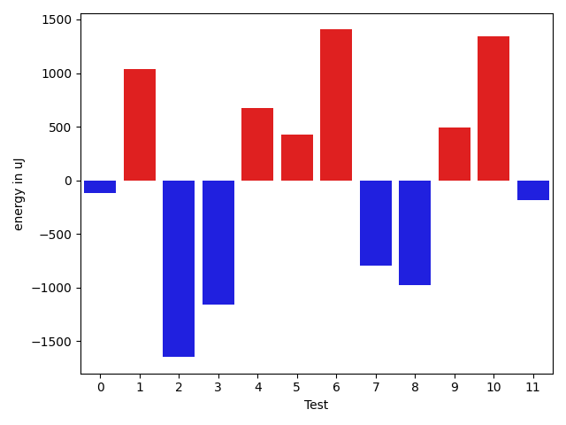

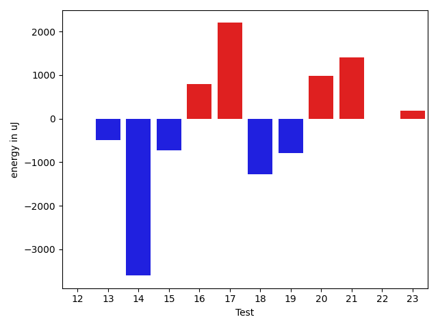

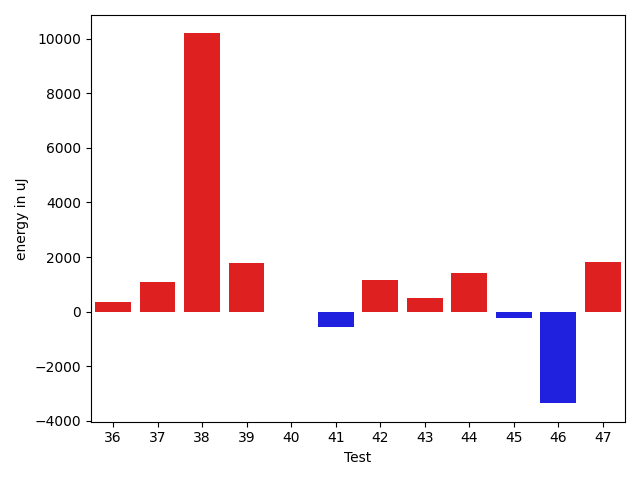

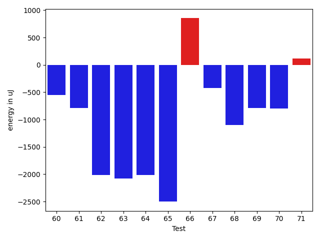

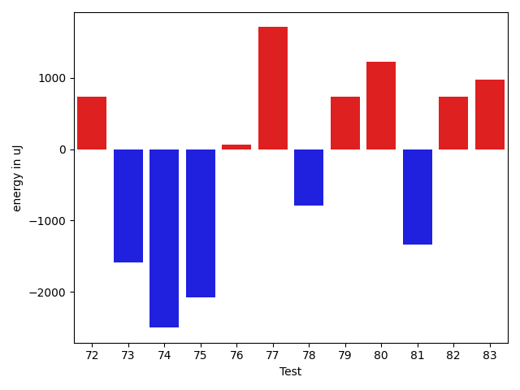

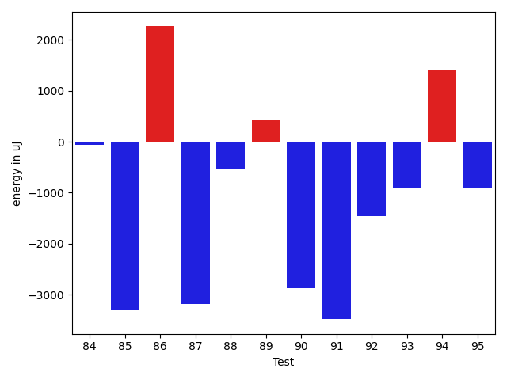

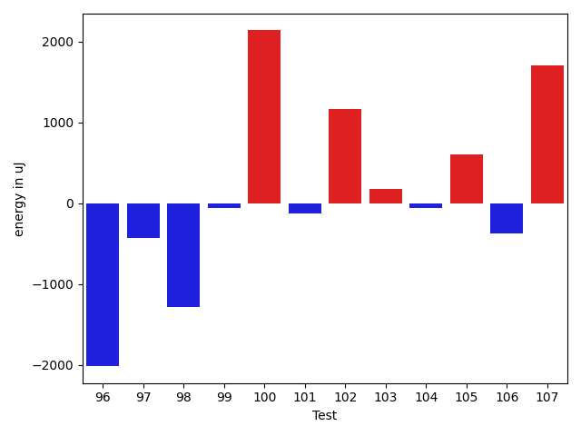

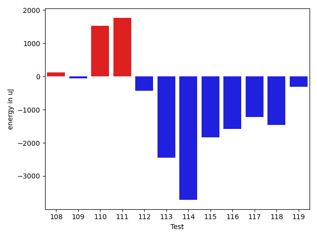

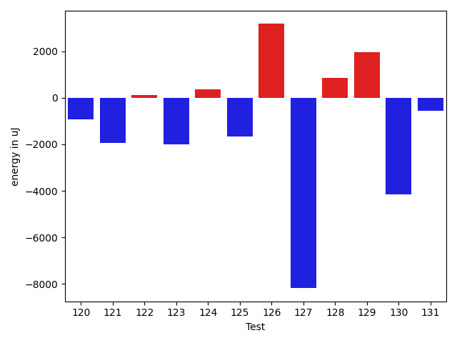

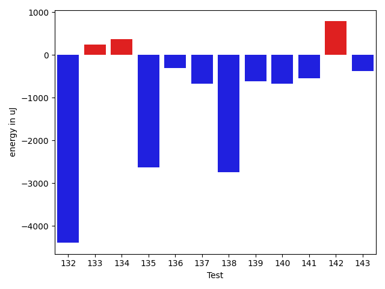

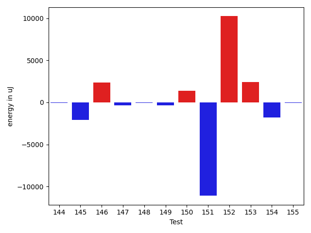

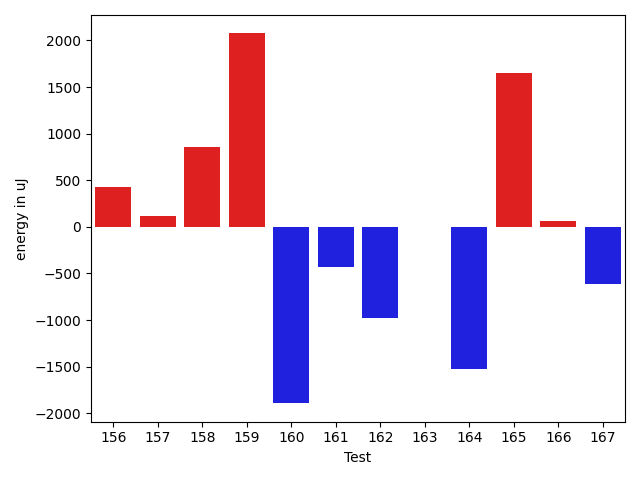

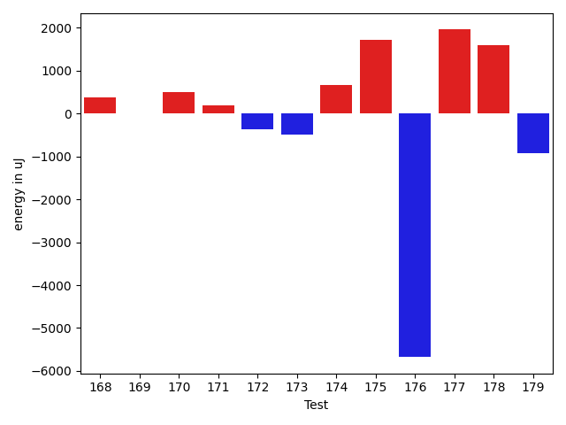

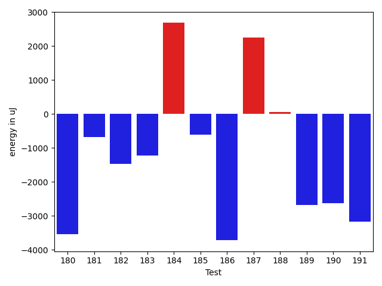

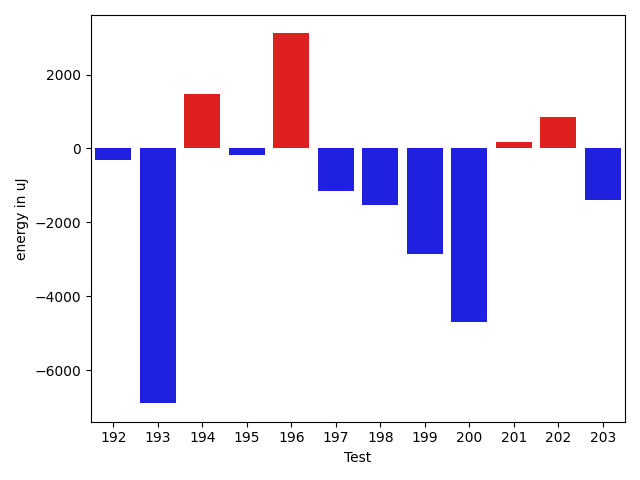

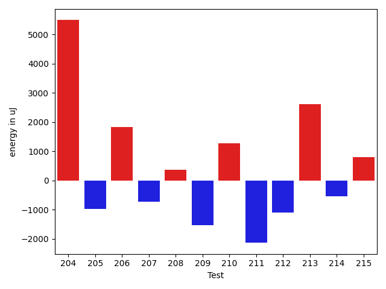

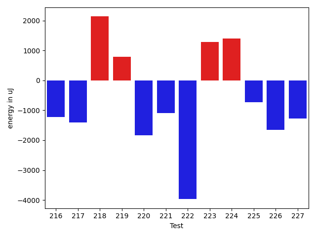

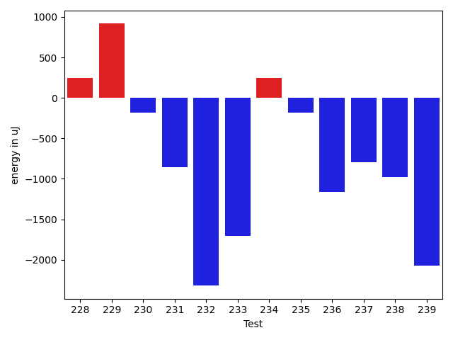

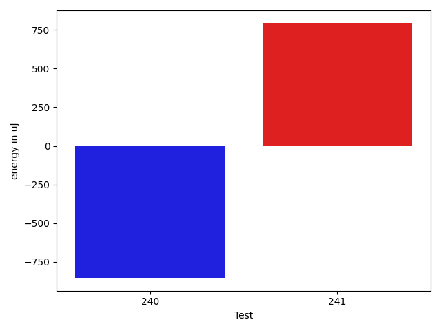

| ID | EnergyV1 | EnergyV2 | DeltaEnergy | σV1 | σV2 |
| --- | --- | --- | --- | --- | --- |
| 0 | 33081 | 32959 | -122 | 8017.692667542741 | 3894.2801797611746 |
| 1 | 33753 | 34790 | 1037 | 4167.236793795396 | 4021.0453792355365 |
| 2 | 34790 | 33142 | -1648 | 7729.5253339987485 | 3859.231701594414 |
| 3 | 38818 | 37659 | -1159 | 87482.55985433135 | 103482.80781072906 |
| 4 | 34789 | 35461 | 672 | 3991.255361710515 | 4307.100402680493 |
| 5 | 33814 | 34240 | 426 | 5557.394087919102 | 3988.473020727092 |
| 6 | 33691 | 35096 | 1405 | 4336.322983674323 | 3610.9705331723158 |
| 7 | 38025 | 37231 | -794 | 33970.44167190181 | 36580.23241967929 |
| 8 | 35034 | 34058 | -976 | 4177.857022276371 | 4058.7035915075926 |
| 9 | 35400 | 35889 | 489 | 4005.167282399076 | 3886.8056436578167 |
| 10 | 34485 | 35828 | 1343 | 9295.075114346797 | 4472.271970441869 |
| 11 | 34607 | 34424 | -183 | 4433.097690599657 | 4173.738820578019 |
| 12 | 36072 | 36072 | 0 | 45784.96295937032 | 34835.33727302945 |
| 13 | 36255 | 35767 | -488 | 11843.135175731244 | 7275.479306932528 |
| 14 | 36743 | 33142 | -3601 | 3825.056352603412 | 4393.036151467362 |
| 15 | 34180 | 33447 | -733 | 3915.7311723545713 | 3197.3492429520265 |
| 16 | 33691 | 34485 | 794 | 4772.880999159324 | 28277.347535615852 |
| 17 | 31494 | 33691 | 2197 | 3671.8315460194726 | 4364.521279590696 |
| 18 | 35217 | 33936 | -1281 | 4759.9245003789165 | 30338.620561235042 |
| 19 | 34485 | 33691 | -794 | 45570.48677823175 | 3626.249433475173 |
| 20 | 32470 | 33447 | 977 | 3240.505919792608 | 5165.347200565838 |
| 21 | 62256 | 63659 | 1403 | 32958.63456410217 | 36218.11251310175 |
| 22 | 34424 | 34424 | 0 | 4514.890833224946 | 4904.798094823159 |
| 23 | 37719 | 37903 | 184 | 16762.7918236553 | 17310.37691075678 |
| 24 | 35950 | 35522 | -428 | 4017.2592440004123 | 3030.1008608075517 |
| 25 | 34240 | 34180 | -60 | 16342.820247830316 | 15479.497754353119 |
| 26 | 32532 | 33447 | 915 | 4460.271594321276 | 3133.7760716834287 |
| 27 | 32409 | 32348 | -61 | 3981.7480575750023 | 2518.6151484730594 |
| 28 | 34729 | 36621 | 1892 | 4916.518167248942 | 3474.5445169115333 |
| 29 | 33569 | 33935 | 366 | 2833.583250682562 | 6721.331193390585 |
| 30 | 32349 | 32776 | 427 | 3819.7742605973967 | 3473.8635487329407 |
| 31 | 34912 | 35767 | 855 | 3684.715671560957 | 3959.7874176447885 |
| 32 | 36193 | 35949 | -244 | 3383.5460207806373 | 3100.343901018177 |
| 33 | 33691 | 34973 | 1282 | 6703.543807070492 | 5886.672069685222 |
| 34 | 34729 | 34302 | -427 | 9120.877492956291 | 11288.079542851008 |
| 35 | 37292 | 37475 | 183 | 16931.102143424934 | 31763.351514633592 |
| 36 | 37415 | 37781 | 366 | 64570.2671427779 | 117995.85686169108 |
| 37 | 35278 | 36376 | 1098 | 2978.999755510788 | 16887.74048359768 |
| 38 | 74768 | 84961 | 10193 | 47184.39805361373 | 58586.90893288683 |
| 39 | 33447 | 35217 | 1770 | 3234.242162395202 | 14818.824906553285 |
| 40 | 34729 | 34729 | 0 | 31383.012231979596 | 60791.64296355285 |
| 41 | 35888 | 35339 | -549 | 3748.451690550231 | 3518.6080529643377 |
| 42 | 33936 | 35095 | 1159 | 9740.401540889772 | 42741.90728519747 |
| 43 | 34119 | 34607 | 488 | 4985.222686924542 | 2553.9826199835243 |
| 44 | 33142 | 34546 | 1404 | 10113.206876337495 | 5013.557221163951 |
| 45 | 33753 | 33508 | -245 | 4389.0555232130655 | 3077.2602674424934 |
| 46 | 37170 | 33814 | -3356 | 3387.105287912521 | 2972.0609903923983 |
| 47 | 33509 | 35339 | 1830 | 4297.473328628792 | 3827.57985952818 |
| 48 | 33325 | 32409 | -916 | 3513.8499382997115 | 2981.131717988992 |
| 49 | 34240 | 35156 | 916 | 3622.1431688729735 | 3680.921917486129 |
| 50 | 34302 | 35522 | 1220 | 3025.971585620435 | 4266.106726814349 |
| 51 | 34668 | 34912 | 244 | 4337.927538036974 | 3014.5414718593215 |
| 52 | 34302 | 34118 | -184 | 2534.2433069634194 | 3262.4170008599453 |
| 53 | 32898 | 33264 | 366 | 3887.9332120538143 | 2742.884076665977 |
| 54 | 32165 | 32470 | 305 | 3152.9791046524556 | 3279.245809390075 |
| 55 | 34607 | 33508 | -1099 | 3318.778086039348 | 28943.682575625182 |
| 56 | 32593 | 33386 | 793 | 4007.0813470498697 | 2331.8067301272345 |
| 57 | 31555 | 32349 | 794 | 4079.564335521325 | 1978.0028082323342 |
| 58 | 33264 | 32959 | -305 | 3329.778935322206 | 3252.650852793382 |
| 59 | 33935 | 35339 | 1404 | 3860.4216817887254 | 7009.648695550585 |
| 60 | 35584 | 35035 | -549 | 33218.01331754417 | 2967.657435994621 |
| 61 | 33813 | 33020 | -793 | 4054.721067643314 | 2588.5079261904184 |
| 62 | 35950 | 33935 | -2015 | 22179.475052142778 | 5002.685163878385 |
| 63 | 36438 | 34363 | -2075 | 16694.739173863523 | 19068.82592805726 |
| 64 | 37902 | 35889 | -2013 | 3412.6179012599696 | 4037.829137977485 |
| 65 | 37842 | 35339 | -2503 | 396433.2904903968 | 152200.15192094535 |
| 66 | 65857 | 66711 | 854 | 24513.362507563124 | 25915.973995072734 |
| 67 | 34302 | 33875 | -427 | 4709.9393129169885 | 245440.66720490236 |
| 68 | 36133 | 35034 | -1099 | 36700.89510881071 | 29483.144850057422 |
| 69 | 34912 | 34119 | -793 | 3893.033777654075 | 6403.224794360239 |
| 70 | 35156 | 34362 | -794 | 8999.522334241581 | 4014.9120008495797 |
| 71 | 35157 | 35278 | 121 | 11003.413358192538 | 13417.570326786828 |
| 72 | 35279 | 36010 | 731 | 24161.9472668406 | 32551.059343557776 |
| 73 | 35401 | 33813 | -1588 | 5433.102883267101 | 4433.672129026033 |
| 74 | 36926 | 34424 | -2502 | 211849.36567595907 | 22152.49515884125 |
| 75 | 35766 | 33691 | -2075 | 7626.235106389587 | 3702.1819275358544 |
| 76 | 34302 | 34363 | 61 | 3884.1197762987367 | 6195.397470649961 |
| 77 | 32165 | 33875 | 1710 | 3556.3703756969617 | 3841.6336772263953 |
| 78 | 37292 | 36499 | -793 | 4800.481544203813 | 36970.665972586925 |
| 79 | 33508 | 34240 | 732 | 3361.9509090601773 | 3345.2245930925606 |
| 80 | 36804 | 38025 | 1221 | 3921.031653735001 | 3798.071908511242 |
| 81 | 33752 | 32409 | -1343 | 3194.1743819369385 | 4939.308186375902 |
| 82 | 33752 | 34485 | 733 | 3912.8799744401827 | 4972.355810408798 |
| 83 | 38025 | 39001 | 976 | 90978.16692491196 | 62968.08259267865 |
| 84 | 34790 | 34729 | -61 | 28520.51264601008 | 4232.715400090498 |
| 85 | 36926 | 33631 | -3295 | 38383.12701668628 | 4085.0947914840635 |
| 86 | 36316 | 38574 | 2258 | 2700.711017491505 | 4654.026293845111 |
| 87 | 36682 | 33508 | -3174 | 34983.60020277359 | 3128.120072536957 |
| 88 | 32471 | 31922 | -549 | 3578.1023876184695 | 4237.223333631652 |
| 89 | 33325 | 33752 | 427 | 3493.5390950560873 | 3806.379788995386 |
| 90 | 38146 | 35278 | -2868 | 4437.452498720409 | 3976.8212957269593 |
| 91 | 63476 | 59997 | -3479 | 26092.167937399707 | 26111.99167773383 |
| 92 | 34790 | 33325 | -1465 | 3980.107546486304 | 3175.966617770693 |
| 93 | 33691 | 32775 | -916 | 33964.29669407386 | 4351.798941550685 |
| 94 | 36805 | 38208 | 1403 | 11859.101471237731 | 12025.745184161146 |
| 95 | 33203 | 32287 | -916 | 9095.330834316972 | 8333.281162361345 |
| 96 | 35644 | 33630 | -2014 | 4243.6063181371255 | 3631.9121214813645 |
| 97 | 35827 | 35400 | -427 | 3260.369879127902 | 4736.441037356712 |
| 98 | 34973 | 33692 | -1281 | 4113.566704178566 | 2847.279919063105 |
| 99 | 33325 | 33264 | -61 | 3944.6773338630223 | 3454.1594468018134 |
| 100 | 32104 | 34241 | 2137 | 4615.903924319564 | 3765.8931151875913 |
| 101 | 35034 | 34912 | -122 | 3398.6609055063564 | 4051.721138911216 |
| 102 | 34240 | 35401 | 1161 | 3211.590402915629 | 3940.44255970399 |
| 103 | 32288 | 32471 | 183 | 3525.7875640401435 | 3520.2997999602253 |
| 104 | 33874 | 33813 | -61 | 3688.5316070497465 | 4000.4038360354843 |
| 105 | 34668 | 35278 | 610 | 3203.1036757955144 | 5323.191851680335 |
| 106 | 35279 | 34912 | -367 | 4874.709128758351 | 4326.820863770321 |
| 107 | 33020 | 34729 | 1709 | 3162.020260450587 | 3613.591185922836 |
| 108 | 34790 | 34912 | 122 | 2926.674517833053 | 3865.7300647268858 |
| 109 | 32837 | 32775 | -62 | 2371.928335275259 | 3003.884293710395 |
| 110 | 32471 | 33997 | 1526 | 4249.373254637918 | 3673.238682188585 |
| 111 | 33142 | 34912 | 1770 | 3859.28312419379 | 2881.865300460797 |
| 112 | 34058 | 33630 | -428 | 4491.507899267647 | 4263.200138568163 |
| 113 | 34851 | 32410 | -2441 | 4071.193393527259 | 35322.39671718781 |
| 114 | 35583 | 31860 | -3723 | 3954.260328184723 | 3173.610912643841 |
| 115 | 34729 | 32898 | -1831 | 4126.205149237462 | 4504.632078071434 |
| 116 | 34607 | 33020 | -1587 | 4091.4002232964303 | 3701.877407357022 |
| 117 | 77820 | 76599 | -1221 | 58234.46312903267 | 75766.33134862334 |
| 118 | 36316 | 34851 | -1465 | 32504.403835034864 | 2694.1383561574203 |
| 119 | 36010 | 35706 | -304 | 4494.361706719481 | 2887.541268343864 |
| 120 | 37353 | 36438 | -915 | 51424.67925762882 | 53100.90013962472 |
| 121 | 37720 | 35766 | -1954 | 3438.5501799450303 | 3096.1217721171397 |
| 122 | 36193 | 36316 | 123 | 13268.182276724834 | 6486.882436839363 |
| 123 | 36926 | 34912 | -2014 | 18120.460494441428 | 33297.480725779584 |
| 124 | 33936 | 34301 | 365 | 11041.664439724627 | 12752.706278945894 |
| 125 | 36927 | 35278 | -1649 | 21663.744593681102 | 19500.447704518196 |
| 126 | 116882 | 120055 | 3173 | 73878.4148837879 | 79339.00083044106 |
| 127 | 77331 | 69153 | -8178 | 23913.939855266126 | 26318.44342615026 |
| 128 | 34058 | 34912 | 854 | 11599.400996747256 | 13076.089559876635 |
| 129 | 61035 | 62988 | 1953 | 35461.29972237338 | 21239.892272427172 |
| 130 | 40528 | 36377 | -4151 | 42387.26570659397 | 42078.02990529362 |
| 131 | 34851 | 34302 | -549 | 10108.759101858082 | 11761.529597264753 |
| 132 | 42724 | 38330 | -4394 | 18843.438499500044 | 18555.673018461068 |
| 133 | 33325 | 33569 | 244 | 5991.543860651879 | 4468.150014329509 |
| 134 | 33569 | 33935 | 366 | 6596.273350658805 | 8051.8039956519 |
| 135 | 37841 | 35217 | -2624 | 32039.01784252271 | 40341.42674262409 |
| 136 | 33813 | 33508 | -305 | 3512.266749906675 | 3261.35251907949 |
| 137 | 34973 | 34302 | -671 | 66068.71939833128 | 84984.46639809242 |
| 138 | 37720 | 34973 | -2747 | 29935.669118674574 | 4000.259551579122 |
| 139 | 35706 | 35095 | -611 | 4982.157810070295 | 3883.2246714411062 |
| 140 | 39307 | 38635 | -672 | 45514.13484994584 | 62310.60739509446 |
| 141 | 36316 | 35766 | -550 | 34122.578042675435 | 34120.29862795577 |
| 142 | 38025 | 38819 | 794 | 56490.43588084045 | 59472.71619178899 |
| 143 | 37354 | 36987 | -367 | 4481.500008990127 | 3823.035411558991 |
| 144 | 33325 | 33264 | -61 | 27415.695555073118 | 3427.2753481819723 |
| 145 | 36926 | 34851 | -2075 | 12936.848547099038 | 4056.620460645584 |
| 146 | 35279 | 37659 | 2380 | 4055.656913070901 | 4574.776927645354 |
| 147 | 34668 | 34301 | -367 | 3778.879008433682 | 3993.323581761204 |
| 148 | 35828 | 35767 | -61 | 6953.1578663079135 | 3786.9334094356605 |
| 149 | 37537 | 37170 | -367 | 3840.539908598896 | 4095.2438706382304 |
| 150 | 38635 | 40039 | 1404 | 32540.298014122352 | 45558.010966540576 |
| 151 | 231261 | 220154 | -11107 | 95538.18019777165 | 74001.70192082513 |
| 152 | 402648 | 412902 | 10254 | 100252.45477046908 | 103814.1320558828 |
| 153 | 42237 | 44678 | 2441 | 49244.64840009249 | 38741.56631584287 |
| 154 | 35767 | 33996 | -1771 | 3023.538980083047 | 3437.4917395077005 |
| 155 | 35705 | 35644 | -61 | 4050.155350411776 | 4632.5169554818285 |
| 156 | 38574 | 39001 | 427 | 31576.154749601406 | 35897.01921726138 |
| 157 | 35644 | 35766 | 122 | 3405.814000525108 | 3698.9419496492505 |
| 158 | 34057 | 34912 | 855 | 3822.282117675987 | 4120.855667892289 |
| 159 | 37658 | 39733 | 2075 | 16992.377899447758 | 25054.719116558404 |
| 160 | 40466 | 38574 | -1892 | 93190.9925640538 | 242373.19941938488 |
| 161 | 36133 | 35705 | -428 | 20602.37933173159 | 5687.53056311327 |
| 162 | 35584 | 34607 | -977 | 6517.9569492977935 | 8213.812122302934 |
| 163 | 35949 | 35950 | 1 | 10652.614797327788 | 5101.860156985372 |
| 164 | 39429 | 37903 | -1526 | 62574.71831596225 | 39827.76340132302 |
| 165 | 36255 | 37903 | 1648 | 47219.254925459754 | 22583.13256655325 |
| 166 | 35583 | 35644 | 61 | 3726.585860374037 | 4057.681537269689 |
| 167 | 35461 | 34851 | -610 | 3937.1070519061127 | 3535.6209422815677 |
| 168 | 34180 | 34546 | 366 | 3579.859726916558 | 3196.2054281427045 |
| 169 | 34973 | 34974 | 1 | 20094.57363134631 | 9041.418425663585 |
| 170 | 35034 | 35523 | 489 | 4015.694132359173 | 4560.550449164552 |
| 171 | 33814 | 33997 | 183 | 22872.77506734576 | 7228.286133318728 |
| 172 | 36438 | 36072 | -366 | 11109.23932966551 | 22371.979966464194 |
| 173 | 33387 | 32898 | -489 | 3666.3753097588788 | 4518.849352136098 |
| 174 | 34362 | 35034 | 672 | 3660.78757275575 | 4036.3014362524373 |
| 175 | 34363 | 36072 | 1709 | 4213.556025108875 | 4274.680376992388 |
| 176 | 140930 | 135254 | -5676 | 26009.305752196728 | 39278.959702199485 |
| 177 | 36438 | 38391 | 1953 | 44193.855754717195 | 39207.701032043595 |
| 178 | 32959 | 34546 | 1587 | 4668.9022085853685 | 3685.526996037393 |
| 179 | 34973 | 34057 | -916 | 53290.02912911946 | 4652.384535749461 |
| 180 | 36255 | 32715 | -3540 | 2809.7551463111913 | 5503.6331256927215 |
| 181 | 34851 | 34180 | -671 | 26031.52927881752 | 3614.827107446764 |
| 182 | 36621 | 35156 | -1465 | 24905.515253452006 | 22266.457055671566 |
| 183 | 32715 | 31494 | -1221 | 3362.8676587103455 | 3464.9460215092513 |
| 184 | 35034 | 37720 | 2686 | 3489.8987191526476 | 4496.469071108798 |
| 185 | 33630 | 33020 | -610 | 3760.951718138068 | 3351.9951096091636 |
| 186 | 37536 | 33814 | -3722 | 3610.903223040989 | 4802.434690862542 |
| 187 | 36011 | 38269 | 2258 | 51616.585286344256 | 65226.15479915351 |
| 188 | 33569 | 33631 | 62 | 3096.3927693072437 | 3885.4078299450007 |
| 189 | 36010 | 33325 | -2685 | 4694.317651216875 | 3923.324215433678 |
| 190 | 35828 | 33203 | -2625 | 4232.992641810437 | 3578.5805565894416 |
| 191 | 38025 | 34851 | -3174 | 40880.274346070626 | 4790.621357000528 |
| 192 | 36499 | 36194 | -305 | 42309.5538818631 | 39923.23317234707 |
| 193 | 128112 | 121216 | -6896 | 255650.97364774076 | 236338.88607663932 |
| 194 | 33447 | 34912 | 1465 | 3695.9343156065124 | 3498.466017246588 |
| 195 | 35156 | 34973 | -183 | 3822.286773743856 | 4563.392927926373 |
| 196 | 35644 | 38757 | 3113 | 40710.36979973001 | 49085.187983723365 |
| 197 | 35828 | 34668 | -1160 | 3810.9142997760805 | 3604.3302807124846 |
| 198 | 34790 | 33264 | -1526 | 3398.331609407769 | 2848.286499700302 |
| 199 | 35950 | 33081 | -2869 | 4454.219386546907 | 5697.232669873555 |
| 200 | 36865 | 32166 | -4699 | 4467.186034651099 | 3863.4102229792275 |
| 201 | 34607 | 34790 | 183 | 5983.851951113054 | 4259.680747473923 |
| 202 | 34362 | 35217 | 855 | 4123.758851157521 | 3283.6482568935426 |
| 203 | 36988 | 35583 | -1405 | 48771.85904251567 | 2738.0980530698407 |
| 204 | 37963 | 43457 | 5494 | 57665.64388743792 | 77675.54325908233 |
| 205 | 34973 | 33997 | -976 | 4540.26510446654 | 3452.307040473272 |
| 206 | 35522 | 37354 | 1832 | 8556.455564449403 | 20992.54146728673 |
| 207 | 36193 | 35461 | -732 | 4016.360788025876 | 3592.7007792034233 |
| 208 | 35644 | 36010 | 366 | 4910.046833788859 | 3981.536618573452 |
| 209 | 39429 | 37903 | -1526 | 74326.7588136919 | 64251.32028161783 |
| 210 | 34118 | 35400 | 1282 | 3601.5197946179514 | 3720.0414698212817 |
| 211 | 36072 | 33935 | -2137 | 3318.8710490060553 | 4353.419420678847 |
| 212 | 36499 | 35401 | -1098 | 4907.913459658798 | 4228.236205559003 |
| 213 | 35583 | 38208 | 2625 | 3042.0481366645895 | 3915.7153951169075 |
| 214 | 35461 | 34912 | -549 | 4193.830501385151 | 3337.9742765385918 |
| 215 | 37353 | 38147 | 794 | 79218.21006079779 | 61791.48337166566 |
| 216 | 37658 | 36438 | -1220 | 11714.009750384314 | 7651.140335047633 |
| 217 | 36804 | 35400 | -1404 | 4721.202394473973 | 3499.858010574547 |
| 218 | 36926 | 39062 | 2136 | 30104.16059141295 | 4421.729770528752 |
| 219 | 37719 | 38513 | 794 | 81284.19686050384 | 59007.236196172154 |
| 220 | 40649 | 38819 | -1830 | 106715.76538587725 | 97850.08930569224 |
| 221 | 71839 | 70740 | -1099 | 52036.51231522202 | 55033.44271900655 |
| 222 | 85572 | 81603 | -3969 | 247011.20210269644 | 246185.79001394066 |
| 223 | 33997 | 35278 | 1281 | 7298.702145953051 | 4683.657561403729 |
| 224 | 35279 | 36682 | 1403 | 26945.46340914057 | 25121.0143074421 |
| 225 | 38574 | 37842 | -732 | 48251.54385652428 | 40660.16371280108 |
| 226 | 38818 | 37170 | -1648 | 95457.37232798977 | 88074.93887081127 |
| 227 | 36926 | 35645 | -1281 | 4524.50107052484 | 31873.384758743287 |
| 228 | 38879 | 39124 | 245 | 86844.82798329643 | 85803.36832160121 |
| 229 | 36560 | 37476 | 916 | 5966.116931262745 | 4568.879374594575 |
| 230 | 34607 | 34424 | -183 | 23871.41775774594 | 6775.155443357999 |
| 231 | 68298 | 67444 | -854 | 30633.830675518544 | 25029.437080580894 |
| 232 | 41565 | 39245 | -2320 | 28673.73840871401 | 23654.271733663667 |
| 233 | 40283 | 38574 | -1709 | 64228.11607437207 | 65742.9551967978 |
| 234 | 64453 | 64697 | 244 | 81219.26447975356 | 78678.98481910226 |
| 235 | 36987 | 36804 | -183 | 4888.149429999046 | 299230.5843261343 |
| 236 | 37598 | 36438 | -1160 | 7286.188433614548 | 161776.78226884815 |
| 237 | 38086 | 37292 | -794 | 338796.9987649805 | 3651.357462838796 |
| 238 | 36621 | 35645 | -976 | 6409.8911868250625 | 4336.183241766063 |
| 239 | 37598 | 35522 | -2076 | 23863.13322815055 | 28733.085054051466 |
| 240 | 38208 | 37354 | -854 | 9717.991341688261 | 193879.64000198324 |
| 241 | 37720 | 38513 | 793 | 801624.2650377005 | 457556.58005786984 |

## Delta Duration per test method

| ID | DurationV1 | DurationsV2 | DeltaDuration |
| --- | --- | --- | --- |
| 0 | 723292.4615384615 | 686864.0 | -36428.4615384615 |
| 1 | 804807.8076923077 | 691528.8260869565 | -113278.9816053512 |
| 2 | 801719.5283018867 | 727314.3170731707 | -74405.21122871607 |
| 3 | 1903591.5833333333 | 1790716.380952381 | -112875.20238095219 |
| 4 | 837795.7258064516 | 896432.5254237289 | 58636.799617277225 |
| 5 | 777980.9361702128 | 647081.2040816327 | -130899.73208858015 |
| 6 | 732619.6530612245 | 704906.5172413794 | -27713.135819845134 |
| 7 | 1453158.6176470588 | 1296167.4 | -156991.2176470589 |
| 8 | 908362.109375 | 832677.8679245283 | -75684.24145047169 |
| 9 | 914372.4727272728 | 706977.4318181818 | -207395.040909091 |
| 10 | 801370.0819672131 | 725161.1 | -76208.9819672131 |
| 11 | 745009.34 | 697040.8 | -47968.53999999992 |
| 12 | 1352119.2388059702 | 1212769.5142857144 | -139349.7245202558 |
| 13 | 943064.7173913043 | 858750.9811320754 | -84313.7362592289 |
| 14 | 674849.1153846154 | 590613.6666666666 | -84235.44871794875 |
| 15 | 721374.1666666666 | 685398.4285714285 | -35975.738095238106 |
| 16 | 500644.9130434783 | 673544.65 | 172899.73695652175 |
| 17 | 379433.0625 | 384372.27777777775 | 4939.215277777752 |
| 18 | 708663.5263157894 | 851516.0625 | 142852.53618421056 |
| 19 | 1113373.4516129033 | 973848.9295774648 | -139524.52203543845 |
| 20 | 555176.9375 | 650674.6774193548 | 95497.73991935479 |
| 21 | 1913751.1724137932 | 2126433.0217391304 | 212681.8493253372 |
| 22 | 708127.8648648649 | 874057.6393442623 | 165929.77447939746 |
| 23 | 1462106.3010752688 | 1661169.6021505375 | 199063.30107526877 |
| 24 | 566426.8064516129 | 714016.8666666667 | 147590.06021505385 |
| 25 | 1169507.974025974 | 1340734.4197530865 | 171226.44572711247 |
| 26 | 429807.1612903226 | 474841.3846153846 | 45034.22332506202 |
| 27 | 684771.0196078431 | 717248.4074074074 | 32477.387799564283 |
| 28 | 651422.5555555555 | 500160.5 | -151262.0555555555 |
| 29 | 704210.4523809524 | 919206.6734693878 | 214996.22108843538 |
| 30 | 699496.1132075472 | 727546.880952381 | 28050.76774483372 |
| 31 | 623887.0277777778 | 684721.6808510638 | 60834.653073286056 |
| 32 | 584803.3235294118 | 664167.9268292683 | 79364.60329985654 |
| 33 | 987865.4117647059 | 1097814.5294117648 | 109949.11764705891 |
| 34 | 1066648.9078947369 | 1203958.2261904762 | 137309.31829573936 |
| 35 | 980761.1351351351 | 1205917.5 | 225156.36486486485 |
| 36 | 1420119.9189189188 | 2512400.048780488 | 1092280.129861569 |
| 37 | 681535.3333333334 | 918802.9189189189 | 237267.58558558556 |
| 38 | 2747246.505050505 | 3336220.1818181816 | 588973.6767676766 |
| 39 | 804753.3653846154 | 934854.625 | 130101.25961538462 |
| 40 | 965414.0 | 1368864.2758620689 | 403450.27586206887 |
| 41 | 568496.9166666666 | 661923.7619047619 | 93426.84523809527 |
| 42 | 970444.4179104478 | 1305677.0634920634 | 335232.6455816156 |
| 43 | 638179.0263157894 | 713595.3617021276 | 75416.33538633818 |
| 44 | 811779.86 | 980317.0 | 168537.14 |
| 45 | 568431.6363636364 | 620577.5777777778 | 52145.941414141445 |
| 46 | 420121.7272727273 | 381007.0714285714 | -39114.65584415587 |
| 47 | 587505.1162790698 | 748644.2380952381 | 161139.1218161683 |
| 48 | 492497.2083333333 | 551336.16 | 58838.95166666672 |
| 49 | 623545.0882352941 | 626364.7058823529 | 2819.617647058796 |
| 50 | 552178.1153846154 | 566989.6578947369 | 14811.542510121479 |
| 51 | 630774.0588235294 | 719038.0 | 88263.9411764706 |
| 52 | 386441.1111111111 | 457466.9166666667 | 71025.80555555556 |
| 53 | 772769.4081632653 | 823213.2075471698 | 50443.799383904436 |
| 54 | 470518.1666666667 | 478198.23076923075 | 7680.064102564065 |
| 55 | 390209.375 | 671593.4761904762 | 281384.1011904762 |
| 56 | 507277.0 | 546524.8 | 39247.80000000005 |
| 57 | 428337.4137931034 | 482332.46875 | 53995.05495689658 |
| 58 | 883874.2881355932 | 921406.1230769231 | 37531.8349413299 |
| 59 | 607864.8571428572 | 717823.3095238095 | 109958.45238095231 |
| 60 | 798159.0 | 691206.4324324324 | -106952.56756756757 |
| 61 | 469283.8846153846 | 491185.037037037 | 21901.152421652398 |
| 62 | 917109.3728813559 | 817035.7666666667 | -100073.6062146892 |
| 63 | 1156552.736111111 | 1151933.647887324 | -4619.088223787025 |
| 64 | 486326.45 | 447976.95 | -38349.5 |
| 65 | 4409281.916666667 | 1494321.3387096773 | -2914960.5779569894 |
| 66 | 2088597.0303030303 | 2103295.3571428573 | 14698.326839827001 |
| 67 | 544441.4230769231 | 2517917.8333333335 | 1973476.4102564105 |
| 68 | 1554800.880597015 | 1358713.5692307693 | -196087.31136624562 |
| 69 | 976377.9866666667 | 969324.1830985915 | -7053.803568075178 |
| 70 | 836219.574074074 | 738560.1666666666 | -97659.40740740742 |
| 71 | 1146669.546875 | 1082738.014925373 | -63931.53194962698 |
| 72 | 1176659.609375 | 1209378.0338983051 | 32718.424523305148 |
| 73 | 909373.4363636364 | 954722.393442623 | 45348.95707898657 |
| 74 | 2213646.907407407 | 909801.8448275862 | -1303845.0625798209 |
| 75 | 780071.5 | 707553.1428571428 | -72518.35714285716 |
| 76 | 893837.6764705882 | 919114.984375 | 25277.307904411806 |
| 77 | 434279.70588235295 | 377482.0 | -56797.70588235295 |
| 78 | 647725.4074074074 | 880852.4166666666 | 233127.0092592592 |
| 79 | 464353.2916666667 | 409173.6666666667 | -55179.625 |
| 80 | 644390.4285714285 | 451794.1666666667 | -192596.26190476184 |
| 81 | 362325.26666666666 | 331846.4 | -30478.86666666664 |
| 82 | 653254.375 | 717321.8 | 64067.42500000005 |
| 83 | 2275532.5428571426 | 1597494.48 | -678038.0628571426 |
| 84 | 634736.9629629629 | 388901.64285714284 | -245835.32010582008 |
| 85 | 880248.0689655172 | 467936.6896551724 | -412311.3793103448 |
| 86 | 350493.1818181818 | 454144.0 | 103650.81818181818 |
| 87 | 795971.2 | 450931.28571428574 | -345039.9142857142 |
| 88 | 510105.2727272727 | 513293.5517241379 | 3188.278996865207 |
| 89 | 681574.3414634146 | 746766.1904761905 | 65191.84901277593 |
| 90 | 455211.52 | 478842.73913043475 | 23631.219130434736 |
| 91 | 1997544.163265306 | 1850594.8717948718 | -146949.29147043428 |
| 92 | 550822.125 | 522917.4137931034 | -27904.71120689658 |
| 93 | 700926.9230769231 | 428796.64705882355 | -272130.27601809957 |
| 94 | 911605.3103448276 | 882330.3333333334 | -29274.977011494222 |
| 95 | 914708.5208333334 | 850326.1282051282 | -64382.392628205125 |
| 96 | 377187.55555555556 | 386810.64285714284 | 9623.087301587278 |
| 97 | 458738.21428571426 | 495152.4827586207 | 36414.268472906435 |
| 98 | 618294.3793103448 | 516842.125 | -101452.25431034481 |
| 99 | 584755.0731707317 | 613169.3939393939 | 28414.320768662263 |
| 100 | 427077.2380952381 | 373853.64705882355 | -53223.59103641455 |
| 101 | 409391.5 | 434522.4375 | 25130.9375 |
| 102 | 467497.4761904762 | 494090.78571428574 | 26593.309523809527 |
| 103 | 571350.6666666666 | 552684.6 | -18666.06666666665 |
| 104 | 589303.4736842106 | 583120.4827586206 | -6182.990925589926 |
| 105 | 399240.7894736842 | 360119.4285714286 | -39121.360902255634 |
| 106 | 443589.0333333333 | 439131.6551724138 | -4457.378160919528 |
| 107 | 413091.55 | 395957.8695652174 | -17133.680434782582 |
| 108 | 717197.1333333333 | 352102.26666666666 | -365094.86666666664 |
| 109 | 454472.76470588235 | 403408.05 | -51064.71470588236 |
| 110 | 553304.9032258064 | 571718.8857142857 | 18413.982488479232 |
| 111 | 425422.0 | 624917.0 | 199495.0 |
| 112 | 398812.21428571426 | 335645.7272727273 | -63166.48701298697 |
| 113 | 461651.45 | 650716.28 | 189064.83000000002 |
| 114 | 393303.6666666667 | 355314.53846153844 | -37989.12820512825 |
| 115 | 543172.625 | 453205.17391304346 | -89967.45108695654 |
| 116 | 436094.04545454547 | 400319.70588235295 | -35774.33957219252 |
| 117 | 3220541.4845360825 | 3269691.6767676766 | 49150.19223159412 |
| 118 | 936768.4146341464 | 694606.5106382979 | -242161.9039958485 |
| 119 | 513287.5909090909 | 435149.9583333333 | -78137.63257575757 |
| 120 | 1330745.4722222222 | 1288407.5384615385 | -42337.93376068375 |
| 121 | 440588.85 | 447315.5 | 6726.650000000023 |
| 122 | 834885.2666666667 | 794352.85 | -40532.416666666744 |
| 123 | 1235386.6363636365 | 1396988.8064516129 | 161602.17008797638 |
| 124 | 1303080.0319148935 | 1280575.9895833333 | -22504.042331560282 |
| 125 | 1659750.9888888889 | 1369879.2916666667 | -289871.6972222221 |
| 126 | 3691493.7032967033 | 4117496.102272727 | 426002.3989760238 |
| 127 | 2594140.898989899 | 2576472.97979798 | -17667.919191919267 |
| 128 | 1354111.6847826086 | 1322444.9175257732 | -31666.767256835476 |
| 129 | 2063080.7575757576 | 1879340.0404040404 | -183740.7171717172 |
| 130 | 2083446.6559139786 | 1946115.4505494505 | -137331.2053645281 |
| 131 | 1269747.5274725275 | 1249672.3956043955 | -20075.131868131924 |
| 132 | 1684996.5454545454 | 1604385.7777777778 | -80610.76767676766 |
| 133 | 1049737.5753424657 | 1051715.0253164556 | 1977.4499739899766 |
| 134 | 1202904.7282608696 | 1220468.8426966292 | 17564.114435759606 |
| 135 | 1557203.978021978 | 1595054.4102564103 | 37850.432234432315 |
| 136 | 963375.7 | 968018.8219178083 | 4643.121917808312 |
| 137 | 1829901.2272727273 | 2082838.5180722892 | 252937.2907995619 |
| 138 | 676343.3333333334 | 416968.28 | -259375.05333333334 |
| 139 | 433376.94444444444 | 442483.5333333333 | 9106.588888888888 |
| 140 | 1451498.576923077 | 1757438.46 | 305939.88307692297 |
| 141 | 1494039.3150684931 | 1530592.8333333333 | 36553.518264840124 |
| 142 | 1610095.303030303 | 1767610.4074074074 | 157515.10437710444 |
| 143 | 553270.6363636364 | 572955.1739130435 | 19684.537549407105 |
| 144 | 974248.1111111111 | 873852.828125 | -100395.28298611112 |
| 145 | 879550.3333333334 | 658288.6388888889 | -221261.6944444445 |
| 146 | 373018.9411764706 | 416170.17647058825 | 43151.23529411765 |
| 147 | 667510.6829268293 | 742986.7575757576 | 75476.07464892825 |
| 148 | 623638.0434782609 | 705377.4 | 81739.35652173916 |
| 149 | 473256.53571428574 | 543562.4 | 70305.86428571428 |
| 150 | 1685260.3085106383 | 1782943.65625 | 97683.34773936169 |
| 151 | 7447961.02020202 | 6927868.212121212 | -520092.80808080826 |
| 152 | 11273944.292929294 | 11743930.202020202 | 469985.90909090824 |
| 153 | 1943246.2142857143 | 1953291.3265306123 | 10045.112244897988 |
| 154 | 587167.1714285715 | 513052.53571428574 | -74114.63571428572 |
| 155 | 750895.911111111 | 781472.5283018867 | 30576.617190775694 |
| 156 | 1608728.551724138 | 1646366.4935064935 | 37637.94178235554 |
| 157 | 589575.9722222222 | 554964.21875 | -34611.75347222225 |
| 158 | 755168.9814814815 | 735303.62 | -19865.361481481465 |
| 159 | 1182360.111111111 | 1280211.9285714286 | 97851.81746031763 |
| 160 | 2475890.3529411764 | 3400069.3513513515 | 924178.9984101751 |
| 161 | 691134.1081081082 | 614637.0 | -76497.10810810816 |
| 162 | 1099929.217948718 | 1039734.6987951808 | -60194.51915353723 |
| 163 | 1224609.2555555555 | 1189513.712643678 | -35095.54291187739 |
| 164 | 2228943.96875 | 1547299.5394736843 | -681644.4292763157 |
| 165 | 1461924.5 | 978292.2222222222 | -483632.27777777775 |
| 166 | 735077.7234042553 | 705939.1041666666 | -29138.61923758872 |
| 167 | 738379.7586206896 | 546029.7 | -192350.05862068967 |
| 168 | 468857.14285714284 | 434544.0833333333 | -34313.05952380953 |
| 169 | 777374.6451612903 | 606155.1153846154 | -171219.52977667493 |
| 170 | 649973.0243902439 | 677611.7 | 27638.67560975603 |
| 171 | 1098170.564102564 | 1018730.3378378379 | -79440.22626472614 |
| 172 | 1114826.9076923076 | 1260640.6543209876 | 145813.74662868003 |
| 173 | 650205.6206896552 | 579048.0 | -71157.62068965519 |
| 174 | 989237.1369863014 | 950368.3424657534 | -38868.79452054796 |
| 175 | 593212.2105263158 | 588809.3846153846 | -4402.82591093122 |
| 176 | 4661154.696969697 | 4618923.767676768 | -42230.92929292936 |
| 177 | 1225676.09375 | 1225750.142857143 | 74.04910714295693 |
| 178 | 561583.25 | 557776.6071428572 | -3806.6428571428405 |
| 179 | 1179212.88 | 454596.3333333333 | -724616.5466666666 |
| 180 | 490245.93333333335 | 408815.4666666667 | -81430.46666666667 |
| 181 | 964967.8510638297 | 841361.3962264151 | -123606.45483741467 |
| 182 | 1382357.8472222222 | 1426016.625 | 43658.77777777775 |
| 183 | 707136.32 | 701508.5714285715 | -5627.74857142847 |
| 184 | 450582.6956521739 | 475990.8181818182 | 25408.122529644286 |
| 185 | 734757.8085106383 | 724072.2708333334 | -10685.537677304936 |
| 186 | 461506.7619047619 | 388416.5333333333 | -73090.22857142857 |
| 187 | 1415349.5 | 1648124.576923077 | 232775.076923077 |
| 188 | 738325.7818181819 | 728426.2653061225 | -9899.516512059374 |
| 189 | 486254.5263157895 | 431178.8461538461 | -55075.68016194337 |
| 190 | 484551.53846153844 | 492744.4 | 8192.861538461584 |
| 191 | 1060964.6 | 470768.63157894736 | -590195.9684210527 |
| 192 | 1429554.6818181819 | 1315382.95 | -114171.73181818193 |
| 193 | 5994443.6161616165 | 5581847.454545454 | -412596.1616161624 |
| 194 | 781371.5833333334 | 784398.2727272727 | 3026.689393939334 |
| 195 | 649971.4827586206 | 617944.03125 | -32027.451508620637 |
| 196 | 1238117.5897435897 | 1500992.875 | 262875.28525641025 |
| 197 | 582298.724137931 | 633328.125 | 51029.400862068986 |
| 198 | 433000.75 | 383097.3125 | -49903.4375 |
| 199 | 392325.5263157895 | 454249.46153846156 | 61923.935222672066 |
| 200 | 404533.13636363635 | 462598.71428571426 | 58065.57792207791 |
| 201 | 455607.77777777775 | 440050.24 | -15557.537777777761 |
| 202 | 383291.5 | 421983.75 | 38692.25 |
| 203 | 978261.0384615385 | 548864.3076923077 | -429396.73076923075 |
| 204 | 1390159.0 | 3071437.1304347827 | 1681278.1304347827 |
| 205 | 408874.63157894736 | 390784.5652173913 | -18090.066361556062 |
| 206 | 904251.3103448276 | 1219899.6666666667 | 315648.35632183915 |
| 207 | 451155.0 | 441425.22222222225 | -9729.777777777752 |
| 208 | 352097.85 | 369512.04545454547 | 17414.195454545494 |
| 209 | 1559199.8214285714 | 2272440.5517241377 | 713240.7302955664 |
| 210 | 465827.5789473684 | 512540.2727272727 | 46712.69377990428 |
| 211 | 375383.9583333333 | 435255.625 | 59871.666666666686 |
| 212 | 405923.35 | 363429.4 | -42493.94999999995 |
| 213 | 412347.347826087 | 385133.7916666667 | -27213.556159420288 |
| 214 | 494612.6296296296 | 484921.4583333333 | -9691.171296296292 |
| 215 | 1908409.6538461538 | 1489938.5833333333 | -418471.0705128205 |
| 216 | 777391.3888888889 | 745669.6315789474 | -31721.75730994146 |
| 217 | 506154.1818181818 | 425654.7368421053 | -80499.44497607654 |
| 218 | 691077.5555555555 | 416644.44444444444 | -274433.11111111107 |
| 219 | 2070667.5428571429 | 1449309.1025641025 | -621358.4402930404 |
| 220 | 2835251.029411765 | 2533701.0555555555 | -301549.9738562093 |
| 221 | 2816968.131313131 | 2868533.525252525 | 51565.39393939404 |
| 222 | 4177002.4591836734 | 4164583.9895833335 | -12418.469600339886 |
| 223 | 694939.2432432432 | 764307.1428571428 | 69367.89961389964 |
| 224 | 804668.3888888889 | 906164.5909090909 | 101496.20202020206 |
| 225 | 1590163.515625 | 1343548.375 | -246615.140625 |
| 226 | 2157569.977272727 | 1686359.6857142858 | -471210.29155844124 |
| 227 | 605403.3783783783 | 1086635.8666666667 | 481232.48828828835 |
| 228 | 2020870.3255813953 | 2353559.5405405406 | 332689.2149591453 |
| 229 | 625930.175 | 589606.7931034482 | -36323.381896551815 |
| 230 | 852059.6451612903 | 875655.7391304348 | 23596.09396914451 |
| 231 | 2230194.868686869 | 2010765.4444444445 | -219429.4242424243 |
| 232 | 1451822.4615384615 | 1050090.0333333334 | -401732.42820512806 |
| 233 | 2056366.357142857 | 1547759.657142857 | -508606.69999999995 |
| 234 | 2501578.0206185565 | 2600128.8969072164 | 98550.87628865987 |
| 235 | 502973.35 | 3299283.730769231 | 2796310.380769231 |
| 236 | 693625.0882352941 | 1449648.0 | 756022.9117647059 |
| 237 | 3478677.6785714286 | 556509.4285714285 | -2922168.25 |
| 238 | 786839.8478260869 | 739455.8888888889 | -47383.95893719804 |
| 239 | 1128111.6545454545 | 1091764.3220338982 | -36347.332511556335 |
| 240 | 709888.5882352941 | 1789683.9722222222 | 1079795.383986928 |
| 241 | 11483590.111111112 | 5327541.042857143 | -6156049.068253969 |

## Misc.

| ID | Test Class | Test Method |
| --- | --- | --- |
| 0 | com.google.gson.functional.CollectionTest | testCollectionOfObjectSerialization |
| 1 | com.google.gson.functional.CollectionTest | testNullsInListDeserialization |
| 2 | com.google.gson.functional.CollectionTest | testCollectionOfStringsDeserialization |
| 3 | com.google.gson.functional.CollectionTest | testCollectionOfBagOfPrimitivesSerialization |
| 4 | com.google.gson.functional.CollectionTest | testTopLevelCollectionOfIntegersDeserialization |
| 5 | com.google.gson.functional.CollectionTest | testQueueSerialization |
| 6 | com.google.gson.functional.CollectionTest | testLinkedListDeserialization |
| 7 | com.google.gson.functional.CollectionTest | testCollectionOfEnumsSerialization |
| 8 | com.google.gson.functional.CollectionTest | testTopLevelListOfIntegerCollectionsDeserialization |
| 9 | com.google.gson.functional.CollectionTest | testTopLevelCollectionOfIntegersSerialization |
| 10 | com.google.gson.functional.CollectionTest | testLinkedListSerialization |
| 11 | com.google.gson.functional.CollectionTest | testQueueDeserialization |
| 12 | com.google.gson.functional.CollectionTest | testCollectionOfEnumsDeserialization |
| 13 | com.google.gson.functional.CollectionTest | testRawCollectionDeserializationNotAlllowed |
| 14 | com.google.gson.functional.CollectionTest | testRawCollectionSerialization |
| 15 | com.google.gson.functional.CollectionTest | testNullsInListSerialization |
| 16 | com.google.gson.functional.CollectionTest | testRawCollectionOfIntegersSerialization |
| 17 | com.google.gson.functional.CollectionTest | testCollectionOfStringsSerialization |
| 18 | com.google.gson.functional.CollectionTest | testRawCollectionOfBagOfPrimitivesNotAllowed |
| 19 | com.google.gson.functional.ObjectTest | testDirectedAcyclicGraphDeserialization |
| 20 | com.google.gson.functional.ObjectTest | testEmptyCollectionInAnObjectDeserialization |
| 21 | com.google.gson.functional.ObjectTest | testDirectedAcyclicGraphSerialization |
| 22 | com.google.gson.functional.ObjectTest | testNestedSerialization |
| 23 | com.google.gson.functional.ObjectTest | testArrayOfArraysDeserialization |
| 24 | com.google.gson.functional.ObjectTest | testNullFieldsSerialization |
| 25 | com.google.gson.functional.ObjectTest | testSubInterfacesOfCollectionDeserialization |
| 26 | com.google.gson.functional.ObjectTest | testPrimitiveArrayFieldSerialization |
| 27 | com.google.gson.functional.ObjectTest | testPrimitiveArrayInAnObjectDeserialization |
| 28 | com.google.gson.functional.ObjectTest | testClassWithNoFieldsSerialization |
| 29 | com.google.gson.functional.ObjectTest | testNullArraysDeserialization |
| 30 | com.google.gson.functional.ObjectTest | testInnerClassSerialization |
| 31 | com.google.gson.functional.ObjectTest | testBagOfPrimitiveWrappersSerialization |
| 32 | com.google.gson.functional.ObjectTest | testClassWithEnumFieldSerialization |
| 33 | com.google.gson.functional.ObjectTest | testArrayOfObjectsDeserialization |
| 34 | com.google.gson.functional.ObjectTest | testArrayOfArraysSerialization |
| 35 | com.google.gson.functional.ObjectTest | testAnonymousLocalClassesSerialization |
| 36 | com.google.gson.functional.ObjectTest | testJsonInSingleQuotesDeserialization |
| 37 | com.google.gson.functional.ObjectTest | testBagOfPrimitivesSerialization |
| 38 | com.google.gson.functional.ObjectTest | testSubInterfacesOfCollectionSerialization |
| 39 | com.google.gson.functional.ObjectTest | testNestedDeserialization |
| 40 | com.google.gson.functional.ObjectTest | testInheritenceDeserialization |
| 41 | com.google.gson.functional.ObjectTest | testBagOfPrimitiveWrappersDeserialization |
| 42 | com.google.gson.functional.ObjectTest | testInheritenceSerialization |
| 43 | com.google.gson.functional.ObjectTest | testNullFieldsDeserialization |
| 44 | com.google.gson.functional.ObjectTest | testArrayOfObjectsSerialization |
| 45 | com.google.gson.functional.ObjectTest | testCircularSerialization |
| 46 | com.google.gson.functional.ObjectTest | testTopLevelEnumSerialization |
| 47 | com.google.gson.functional.ObjectTest | testBagOfPrimitivesDeserialization |
| 48 | com.google.gson.functional.ObjectTest | testNullObjectFieldsDeserialization |
| 49 | com.google.gson.functional.ObjectTest | testClassWithTransientFieldsDeserialization |
| 50 | com.google.gson.functional.ObjectTest | testClassWithTransientFieldsDeserializationTransientFieldsPassedInJsonAreIgnored |
| 51 | com.google.gson.functional.ObjectTest | testClassWithEnumFieldDeserialization |
| 52 | com.google.gson.functional.ObjectTest | testTopLevelEnumDeserialization |
| 53 | com.google.gson.functional.ObjectTest | testInnerClassDeserialization |
| 54 | com.google.gson.functional.ObjectTest | testSelfReferenceSerialization |
| 55 | com.google.gson.functional.ObjectTest | testClassWithNoFieldsDeserialization |
| 56 | com.google.gson.functional.ObjectTest | testPrivateNoArgConstructorDeserialization |
| 57 | com.google.gson.functional.ObjectTest | testEmptyCollectionInAnObjectSerialization |
| 58 | com.google.gson.functional.ObjectTest | testClassWithObjectFieldSerialization |
| 59 | com.google.gson.functional.ObjectTest | testClassWithTransientFieldsSerialization |
| 60 | com.google.gson.functional.ObjectTest | testJsonInMixedQuotesDeserialization |
| 61 | com.google.gson.functional.ObjectTest | testNullPrimitiveFieldsDeserialization |
| 62 | com.google.gson.functional.CustomTypeAdaptersTest | testCustomAdapterInvokedForMapElementDeserialization |
| 63 | com.google.gson.functional.CustomTypeAdaptersTest | testCustomAdapterInvokedForMapElementSerializationWithType |
| 64 | com.google.gson.functional.CustomTypeAdaptersTest | testCustomAdapterInvokedForMapElementSerialization |
| 65 | com.google.gson.functional.CustomTypeAdaptersTest | testCustomSerializers |
| 66 | com.google.gson.functional.CustomTypeAdaptersTest | testCustomTypeAdapterDoesNotAppliesToSubClasses |
| 67 | com.google.gson.functional.CustomTypeAdaptersTest | testCustomAdapterInvokedForCollectionElementSerialization |
| 68 | com.google.gson.functional.CustomTypeAdaptersTest | testCustomAdapterInvokedForCollectionElementSerializationWithType |
| 69 | com.google.gson.functional.CustomTypeAdaptersTest | testCustomByteArrayDeserializerAndInstanceCreator |
| 70 | com.google.gson.functional.CustomTypeAdaptersTest | testCustomByteArraySerializer |
| 71 | com.google.gson.functional.CustomTypeAdaptersTest | testCustomDeserializerForLong |
| 72 | com.google.gson.functional.CustomTypeAdaptersTest | testCustomNestedSerializers |
| 73 | com.google.gson.functional.CustomTypeAdaptersTest | testCustomNestedDeserializers |
| 74 | com.google.gson.functional.CustomTypeAdaptersTest | testCustomDeserializers |
| 75 | com.google.gson.functional.CustomTypeAdaptersTest | testCustomTypeAdapterAppliesToSubClassesSerializedAsBaseClass |
| 76 | com.google.gson.functional.CustomTypeAdaptersTest | testCustomSerializerForLong |
| 77 | com.google.gson.functional.PrimitiveTest | testBigDecimalPreservePrecisionDeserialization |
| 78 | com.google.gson.functional.PrimitiveTest | testPrimitiveIntegerAutoboxedDeserialization |
| 79 | com.google.gson.functional.PrimitiveTest | testBigIntegerDeserialization |
| 80 | com.google.gson.functional.PrimitiveTest | testPrimitiveIntegerAutoboxedSerialization |
| 81 | com.google.gson.functional.PrimitiveTest | testBigDecimalPreservePrecisionSerialization |
| 82 | com.google.gson.functional.PrimitiveTest | testBigIntegerSerialization |
| 83 | com.google.gson.functional.PrimitiveTest | testPrimitiveIntegerAutoboxedInASingleElementArrayDeserialization |
| 84 | com.google.gson.functional.PrimitiveTest | testBigDecimalAsStringRepresentationDeserialization |
| 85 | com.google.gson.functional.PrimitiveTest | testPrimitiveLongAutoboxedDeserialization |
| 86 | com.google.gson.functional.PrimitiveTest | testReallyLongValuesSerialization |
| 87 | com.google.gson.functional.PrimitiveTest | testDoubleNoFractAsStringRepresentationDeserialization |
| 88 | com.google.gson.functional.PrimitiveTest | testPrimitiveDoubleAutoboxedInASingleElementArraySerialization |
| 89 | com.google.gson.functional.PrimitiveTest | testDoubleAsStringRepresentationDeserialization |
| 90 | com.google.gson.functional.PrimitiveTest | testReallyLongValuesDeserialization |
| 91 | com.google.gson.functional.PrimitiveTest | testPrimitiveDoubleAutoboxedSerialization |
| 92 | com.google.gson.functional.PrimitiveTest | testNumberDeserialization |
| 93 | com.google.gson.functional.PrimitiveTest | testPrimitiveDoubleAutoboxedInASingleElementArrayDeserialization |
| 94 | com.google.gson.functional.PrimitiveTest | testPrimitiveIntegerAutoboxedInASingleElementArraySerialization |
| 95 | com.google.gson.functional.PrimitiveTest | testPrimitiveDoubleAutoboxedDeserialization |
| 96 | com.google.gson.functional.PrimitiveTest | testBigDecimalNoFractAsStringRepresentationDeserialization |
| 97 | com.google.gson.functional.PrimitiveTest | testPrimitiveLongAutoboxedInASingleElementArraySerialization |
| 98 | com.google.gson.functional.PrimitiveTest | testPrimitiveBooleanAutoboxedInASingleElementArrayDeserialization |
| 99 | com.google.gson.functional.PrimitiveTest | testOverridingDefaultPrimitiveSerialization |
| 100 | com.google.gson.functional.PrimitiveTest | testSmallValueForBigIntegerDeserialization |
| 101 | com.google.gson.functional.PrimitiveTest | testPrimitiveBooleanAutoboxedSerialization |
| 102 | com.google.gson.functional.PrimitiveTest | testPrimitiveLongAutoboxedInASingleElementArrayDeserialization |
| 103 | com.google.gson.functional.PrimitiveTest | testBadValueForBigIntegerDeserialization |
| 104 | com.google.gson.functional.PrimitiveTest | testPrimitiveBooleanAutoboxedDeserialization |
| 105 | com.google.gson.functional.PrimitiveTest | testSmallValueForBigDecimalSerialization |
| 106 | com.google.gson.functional.PrimitiveTest | testPrimitiveBooleanAutoboxedInASingleElementArraySerialization |
| 107 | com.google.gson.functional.PrimitiveTest | testSmallValueForBigDecimalDeserialization |
| 108 | com.google.gson.functional.PrimitiveTest | testPrimitiveLongAutoboxedSerialization |
| 109 | com.google.gson.functional.PrimitiveTest | testBigDecimalDeserialization |
| 110 | com.google.gson.functional.PrimitiveTest | testBigIntegerInASingleElementArraySerialization |
| 111 | com.google.gson.functional.PrimitiveTest | testBigIntegerInASingleElementArrayDeserialization |
| 112 | com.google.gson.functional.PrimitiveTest | testSmallValueForBigIntegerSerialization |
| 113 | com.google.gson.functional.PrimitiveTest | testBigDecimalInASingleElementArraySerialization |
| 114 | com.google.gson.functional.PrimitiveTest | testNumberSerialization |
| 115 | com.google.gson.functional.PrimitiveTest | testBigDecimalSerialization |
| 116 | com.google.gson.functional.PrimitiveTest | testBigDecimalInASingleElementArrayDeserialization |
| 117 | com.google.gson.functional.ExposeFieldsTest | testNullExposeFieldSerialization |
| 118 | com.google.gson.functional.ExposeFieldsTest | testNoExposedFieldDeserialization |
| 119 | com.google.gson.functional.ExposeFieldsTest | testNoExposedFieldSerialization |
| 120 | com.google.gson.functional.ExposeFieldsTest | testExposeAnnotationDeserialization |
| 121 | com.google.gson.functional.ExposeFieldsTest | testExposeAnnotationSerialization |
| 122 | com.google.gson.functional.ExposeFieldsTest | testArrayWithOneNullExposeFieldObjectSerialization |
| 123 | com.google.gson.functional.ParameterizedTypesTest | testParameterizedTypesWithWriterSerialization |
| 124 | com.google.gson.functional.ParameterizedTypesTest | testVariableTypeArrayDeserialization |
| 125 | com.google.gson.functional.ParameterizedTypesTest | testParameterizedTypeWithCustomSerializer |
| 126 | com.google.gson.functional.ParameterizedTypesTest | testParameterizedTypesSerialization |
| 127 | com.google.gson.functional.ParameterizedTypesTest | testVariableTypeFieldsAndGenericArraysSerialization |
| 128 | com.google.gson.functional.ParameterizedTypesTest | testParameterizedTypeGenericArraysDeserialization |
| 129 | com.google.gson.functional.ParameterizedTypesTest | testVariableTypeFieldsAndGenericArraysDeserialization |
| 130 | com.google.gson.functional.ParameterizedTypesTest | testTypesWithMultipleParametersSerialization |
| 131 | com.google.gson.functional.ParameterizedTypesTest | testParameterizedTypeWithVariableTypeDeserialization |
| 132 | com.google.gson.functional.ParameterizedTypesTest | testParameterizedTypesWithCustomDeserializer |
| 133 | com.google.gson.functional.ParameterizedTypesTest | testParameterizedTypeWithReaderDeserialization |
| 134 | com.google.gson.functional.ParameterizedTypesTest | testVariableTypeDeserialization |
| 135 | com.google.gson.functional.ParameterizedTypesTest | testTypesWithMultipleParametersDeserialization |
| 136 | com.google.gson.functional.ParameterizedTypesTest | testParameterizedTypeGenericArraysSerialization |
| 137 | com.google.gson.functional.ParameterizedTypesTest | testParameterizedTypeDeserialization |
| 138 | com.google.gson.functional.ArrayTest | testArrayOfStringsDeserialization |
| 139 | com.google.gson.functional.ArrayTest | testArrayOfStringsSerialization |
| 140 | com.google.gson.functional.ArrayTest | testTopLevelArrayOfIntsDeserialization |
| 141 | com.google.gson.functional.ArrayTest | testArrayOfCollectionSerialization |
| 142 | com.google.gson.functional.ArrayTest | testTopLevelArrayOfIntsSerialization |
| 143 | com.google.gson.functional.ArrayTest | testNullsInArrayDeserialization |
| 144 | com.google.gson.functional.ArrayTest | testArrayOfCollectionDeserialization |
| 145 | com.google.gson.functional.ArrayTest | testTopLevelEnumInASingleElementArrayDeserialization |
| 146 | com.google.gson.functional.ArrayTest | testEmptyArraySerialization |
| 147 | com.google.gson.functional.ArrayTest | testArrayOfPrimitivesWithCustomTypeAdapter |
| 148 | com.google.gson.functional.ArrayTest | testNullsInArraySerialization |
| 149 | com.google.gson.functional.ArrayTest | testEmptyArrayDeserialization |
| 150 | com.google.gson.functional.ConcurrencyTest | testSingleThreadSerialization |
| 151 | com.google.gson.functional.ConcurrencyTest | testMultiThreadSerialization |
| 152 | com.google.gson.functional.ConcurrencyTest | testMultiThreadDeserialization |
| 153 | com.google.gson.functional.ConcurrencyTest | testSingleThreadDeserialization |
| 154 | com.google.gson.functional.NullObjectAndFieldTest | testCustomSerializationOfNulls |
| 155 | com.google.gson.functional.NullObjectAndFieldTest | testNullWrappedPrimitiveMemberSerialization |
| 156 | com.google.gson.functional.NullObjectAndFieldTest | testExplicitSerializationOfNullArrayMembers |
| 157 | com.google.gson.functional.NullObjectAndFieldTest | testExplicitSerializationOfNullStringMembers |
| 158 | com.google.gson.functional.NullObjectAndFieldTest | testNullWrappedPrimitiveMemberDeserialization |
| 159 | com.google.gson.functional.NullObjectAndFieldTest | testExplicitDeserializationOfNulls |
| 160 | com.google.gson.functional.NullObjectAndFieldTest | testExplicitSerializationOfNulls |
| 161 | com.google.gson.functional.NullObjectAndFieldTest | testExplicitSerializationOfNullCollectionMembers |
| 162 | com.google.gson.functional.MapTest | testParameterizedMapSubclassDeserialization |
| 163 | com.google.gson.functional.MapTest | testParameterizedMapSubclassSerialization |
| 164 | com.google.gson.functional.MapTest | testMapSerialization |
| 165 | com.google.gson.functional.MapTest | testMapDeserialization |
| 166 | com.google.gson.functional.MapTest | testMapSerializationEmpty |
| 167 | com.google.gson.functional.MapTest | testRawMapSerialization |
| 168 | com.google.gson.functional.MapTest | testMapSubclassSerialization |
| 169 | com.google.gson.functional.DefaultTypeAdaptersTest | testBigIntegerFieldDeserialization |
| 170 | com.google.gson.functional.DefaultTypeAdaptersTest | testUrlNullDeserialization |
| 171 | com.google.gson.functional.DefaultTypeAdaptersTest | testDefaultDateDeserializationUsingBuilder |
| 172 | com.google.gson.functional.DefaultTypeAdaptersTest | testUrlNullSerialization |
| 173 | com.google.gson.functional.DefaultTypeAdaptersTest | testSetSerialization |
| 174 | com.google.gson.functional.DefaultTypeAdaptersTest | testDefaultDateSerialization |
| 175 | com.google.gson.functional.DefaultTypeAdaptersTest | testBigDecimalFieldDeserialization |
| 176 | com.google.gson.functional.DefaultTypeAdaptersTest | testDefaultDateDeserialization |
| 177 | com.google.gson.functional.DefaultTypeAdaptersTest | testUrlSerialization |
| 178 | com.google.gson.functional.DefaultTypeAdaptersTest | testUriSerialization |
| 179 | com.google.gson.functional.DefaultTypeAdaptersTest | testLocaleDeserializationWithLanguage |
| 180 | com.google.gson.functional.DefaultTypeAdaptersTest | testLocaleDeserializationWithLanguageCountryVariant |
| 181 | com.google.gson.functional.DefaultTypeAdaptersTest | testBigIntegerFieldSerialization |
| 182 | com.google.gson.functional.DefaultTypeAdaptersTest | testBigDecimalFieldSerialization |
| 183 | com.google.gson.functional.DefaultTypeAdaptersTest | testDefaultDateSerializationUsingBuilder |
| 184 | com.google.gson.functional.DefaultTypeAdaptersTest | testLocaleSerializationWithLanguageCountryVariant |
| 185 | com.google.gson.functional.DefaultTypeAdaptersTest | testDateDeserializationWithPattern |
| 186 | com.google.gson.functional.DefaultTypeAdaptersTest | testLocaleDeserializationWithLanguageCountry |
| 187 | com.google.gson.functional.DefaultTypeAdaptersTest | testUrlDeserialization |
| 188 | com.google.gson.functional.DefaultTypeAdaptersTest | testDateSerializationWithPattern |
| 189 | com.google.gson.functional.DefaultTypeAdaptersTest | testLocaleSerializationWithLanguageCountry |
| 190 | com.google.gson.functional.DefaultTypeAdaptersTest | testUriDeserialization |
| 191 | com.google.gson.functional.DefaultTypeAdaptersTest | testLocaleSerializationWithLanguage |
| 192 | com.google.gson.functional.VersioningTest | testVersionedClassesDeserialization |
| 193 | com.google.gson.functional.VersioningTest | testVersionedClassesSerialization |
| 194 | com.google.gson.functional.VersioningTest | testVersionedGsonWithUnversionedClassesDeserialization |
| 195 | com.google.gson.functional.VersioningTest | testIgnoreLaterVersionClassSerialization |
| 196 | com.google.gson.functional.VersioningTest | testVersionedGsonWithUnversionedClassesSerialization |
| 197 | com.google.gson.functional.VersioningTest | testIgnoreLaterVersionClassDeserialization |
| 198 | com.google.gson.functional.StringTest | testAssignmentCharDeserialization |
| 199 | com.google.gson.functional.StringTest | testEscapedBackslashInStringDeserialization |
| 200 | com.google.gson.functional.StringTest | testAssignmentCharSerialization |
| 201 | com.google.gson.functional.StringTest | testEscapedCtrlNInStringDeserialization |
| 202 | com.google.gson.functional.StringTest | testEscapedBackslashInStringSerialization |
| 203 | com.google.gson.functional.StringTest | testSingleQuoteInStringSerialization |
| 204 | com.google.gson.functional.StringTest | testStringValueDeserialization |
| 205 | com.google.gson.functional.StringTest | testStringWithEscapedSlashDeserialization |
| 206 | com.google.gson.functional.StringTest | testStringValueAsSingleElementArraySerialization |
| 207 | com.google.gson.functional.StringTest | testEscapedCtrlRInStringSerialization |
| 208 | com.google.gson.functional.StringTest | testEscapingQuotesInStringDeserialization |
| 209 | com.google.gson.functional.StringTest | testStringValueSerialization |
| 210 | com.google.gson.functional.StringTest | testStringValueAsSingleElementArrayDeserialization |
| 211 | com.google.gson.functional.StringTest | testSingleQuoteInStringDeserialization |
| 212 | com.google.gson.functional.StringTest | testEscapedCtrlRInStringDeserialization |
| 213 | com.google.gson.functional.StringTest | testEscapedCtrlNInStringSerialization |
| 214 | com.google.gson.functional.StringTest | testEscapingQuotesInStringSerialization |
| 215 | com.google.gson.functional.InternationalizationTest | testStringsWithRawChineseCharactersDeserialization |
| 216 | com.google.gson.functional.InternationalizationTest | testStringsWithUnicodeChineseCharactersSerialization |
| 217 | com.google.gson.functional.InternationalizationTest | testStringsWithUnicodeChineseCharactersEscapedDeserialization |
| 218 | com.google.gson.functional.InternationalizationTest | testStringsWithUnicodeChineseCharactersDeserialization |
| 219 | com.google.gson.functional.ReadersWritersTest | testReaderForDeserialization |
| 220 | com.google.gson.functional.ReadersWritersTest | testWriterForSerialization |
| 221 | com.google.gson.functional.NamingPolicyTest | testGsonWithSerializedNameFieldNamingPolicySerialization |
| 222 | com.google.gson.functional.NamingPolicyTest | testGsonWithNonDefaultFieldNamingPolicyDeserialiation |
| 223 | com.google.gson.functional.NamingPolicyTest | testGsonWithSerializedNameFieldNamingPolicyDeserialization |
| 224 | com.google.gson.functional.NamingPolicyTest | testGsonWithNonDefaultFieldNamingPolicySerialization |
| 225 | com.google.gson.functional.EscapingTest | testEscapingObjectFields |
| 226 | com.google.gson.functional.EscapingTest | testEscapingQuotesInStringArray |
| 227 | com.google.gson.GsonTypeAdapterTest | testTypeAdapterThrowsException |
| 228 | com.google.gson.GsonTypeAdapterTest | testDefaultTypeAdapterThrowsParseException |
| 229 | com.google.gson.GsonTypeAdapterTest | testTypeAdapterProperlyConvertsTypes |
| 230 | com.google.gson.GsonTypeAdapterTest | testTypeAdapterDoesNotAffectNonAdaptedTypes |
| 231 | com.google.gson.functional.UncategorizedTest | testReturningDerivedClassesDuringDeserialization |
| 232 | com.google.gson.functional.UncategorizedTest | testStaticFieldsAreNotSerialized |
| 233 | com.google.gson.functional.UncategorizedTest | testObjectEqualButNotSameSerialization |
| 234 | com.google.gson.FunctionalWithInternalDependenciesTest | testPrettyPrintList |
| 235 | com.google.gson.FunctionalWithInternalDependenciesTest | testMultipleArrays |
| 236 | com.google.gson.FunctionalWithInternalDependenciesTest | testPrettyPrintListOfPrimitiveArrays |
| 237 | com.google.gson.FunctionalWithInternalDependenciesTest | testPrettyPrintArrayOfPrimitives |
| 238 | com.google.gson.FunctionalWithInternalDependenciesTest | testAnonymousLocalClassesSerialization |
| 239 | com.google.gson.FunctionalWithInternalDependenciesTest | testPrettyPrintArrayOfObjects |
| 240 | com.google.gson.FunctionalWithInternalDependenciesTest | testPrettyPrintArrayOfPrimitiveArrays |
| 241 | com.google.gson.functional.PrintFormattingTest | testCompactFormattingLeavesNoWhiteSpace |

| Test | IterationV1 | IterationV2 | DeltaIteration |
| --- | --- | --- | --- |
| 0 | 52 | 42 | -10 |
| 1 | 52 | 46 | -6 |
| 2 | 53 | 41 | -12 |
| 3 | 48 | 42 | -6 |
| 4 | 62 | 59 | -3 |
| 5 | 47 | 49 | 2 |
| 6 | 49 | 58 | 9 |
| 7 | 68 | 70 | 2 |
| 8 | 64 | 53 | -11 |
| 9 | 55 | 44 | -11 |
| 10 | 61 | 50 | -11 |
| 11 | 50 | 50 | 0 |
| 12 | 67 | 70 | 3 |
| 13 | 46 | 53 | 7 |
| 14 | 26 | 33 | 7 |
| 15 | 48 | 42 | -6 |
| 16 | 23 | 20 | -3 |
| 17 | 16 | 18 | 2 |
| 18 | 38 | 32 | -6 |
| 19 | 62 | 71 | 9 |
| 20 | 32 | 31 | -1 |
| 21 | 87 | 92 | 5 |
| 22 | 37 | 61 | 24 |
| 23 | 93 | 93 | 0 |
| 24 | 31 | 30 | -1 |
| 25 | 77 | 81 | 4 |
| 26 | 31 | 26 | -5 |
| 27 | 51 | 54 | 3 |
| 28 | 18 | 20 | 2 |
| 29 | 42 | 49 | 7 |
| 30 | 53 | 42 | -11 |
| 31 | 36 | 47 | 11 |
| 32 | 34 | 41 | 7 |
| 33 | 68 | 68 | 0 |
| 34 | 76 | 84 | 8 |
| 35 | 37 | 42 | 5 |
| 36 | 37 | 41 | 4 |
| 37 | 30 | 37 | 7 |
| 38 | 99 | 99 | 0 |
| 39 | 52 | 64 | 12 |
| 40 | 53 | 58 | 5 |
| 41 | 36 | 42 | 6 |
| 42 | 67 | 63 | -4 |
| 43 | 38 | 47 | 9 |
| 44 | 50 | 56 | 6 |
| 45 | 44 | 45 | 1 |
| 46 | 11 | 14 | 3 |
| 47 | 43 | 42 | -1 |
| 48 | 24 | 25 | 1 |
| 49 | 34 | 34 | 0 |
| 50 | 26 | 38 | 12 |
| 51 | 34 | 43 | 9 |
| 52 | 18 | 12 | -6 |
| 53 | 49 | 53 | 4 |
| 54 | 24 | 26 | 2 |
| 55 | 16 | 21 | 5 |
| 56 | 32 | 30 | -2 |
| 57 | 29 | 32 | 3 |
| 58 | 59 | 65 | 6 |
| 59 | 28 | 42 | 14 |
| 60 | 38 | 37 | -1 |
| 61 | 26 | 27 | 1 |
| 62 | 59 | 60 | 1 |
| 63 | 72 | 71 | -1 |
| 64 | 20 | 20 | 0 |
| 65 | 60 | 62 | 2 |
| 66 | 99 | 98 | -1 |
| 67 | 26 | 18 | -8 |
| 68 | 67 | 65 | -2 |
| 69 | 75 | 71 | -4 |
| 70 | 54 | 48 | -6 |
| 71 | 64 | 67 | 3 |
| 72 | 64 | 59 | -5 |
| 73 | 55 | 61 | 6 |
| 74 | 54 | 58 | 4 |
| 75 | 52 | 49 | -3 |
| 76 | 68 | 64 | -4 |
| 77 | 17 | 20 | 3 |
| 78 | 27 | 24 | -3 |
| 79 | 24 | 21 | -3 |
| 80 | 14 | 12 | -2 |
| 81 | 15 | 15 | 0 |
| 82 | 40 | 35 | -5 |
| 83 | 35 | 25 | -10 |
| 84 | 27 | 14 | -13 |
| 85 | 29 | 29 | 0 |
| 86 | 11 | 11 | 0 |
| 87 | 20 | 21 | 1 |
| 88 | 22 | 29 | 7 |
| 89 | 41 | 42 | 1 |
| 90 | 25 | 23 | -2 |
| 91 | 49 | 39 | -10 |
| 92 | 24 | 29 | 5 |
| 93 | 26 | 17 | -9 |
| 94 | 29 | 24 | -5 |
| 95 | 48 | 39 | -9 |
| 96 | 18 | 14 | -4 |
| 97 | 28 | 29 | 1 |
| 98 | 29 | 16 | -13 |
| 99 | 41 | 33 | -8 |
| 100 | 21 | 17 | -4 |
| 101 | 18 | 16 | -2 |
| 102 | 21 | 28 | 7 |
| 103 | 33 | 25 | -8 |
| 104 | 38 | 29 | -9 |
| 105 | 19 | 14 | -5 |
| 106 | 30 | 29 | -1 |
| 107 | 20 | 23 | 3 |
| 108 | 15 | 15 | 0 |
| 109 | 17 | 20 | 3 |
| 110 | 31 | 35 | 4 |
| 111 | 19 | 20 | 1 |
| 112 | 14 | 11 | -3 |
| 113 | 20 | 25 | 5 |
| 114 | 12 | 13 | 1 |
| 115 | 16 | 23 | 7 |
| 116 | 22 | 17 | -5 |
| 117 | 97 | 99 | 2 |
| 118 | 41 | 47 | 6 |
| 119 | 22 | 24 | 2 |
| 120 | 36 | 39 | 3 |
| 121 | 20 | 18 | -2 |
| 122 | 45 | 40 | -5 |
| 123 | 77 | 62 | -15 |
| 124 | 94 | 96 | 2 |
| 125 | 90 | 96 | 6 |
| 126 | 91 | 88 | -3 |
| 127 | 99 | 99 | 0 |
| 128 | 92 | 97 | 5 |
| 129 | 99 | 99 | 0 |
| 130 | 93 | 91 | -2 |
| 131 | 91 | 91 | 0 |
| 132 | 99 | 99 | 0 |
| 133 | 73 | 79 | 6 |
| 134 | 92 | 89 | -3 |
| 135 | 91 | 78 | -13 |
| 136 | 80 | 73 | -7 |
| 137 | 88 | 83 | -5 |
| 138 | 21 | 25 | 4 |
| 139 | 18 | 15 | -3 |
| 140 | 52 | 50 | -2 |
| 141 | 73 | 78 | 5 |
| 142 | 33 | 27 | -6 |
| 143 | 22 | 23 | 1 |
| 144 | 63 | 64 | 1 |
| 145 | 33 | 36 | 3 |
| 146 | 17 | 17 | 0 |
| 147 | 41 | 33 | -8 |
| 148 | 23 | 20 | -3 |
| 149 | 28 | 20 | -8 |
| 150 | 94 | 96 | 2 |
| 151 | 99 | 99 | 0 |
| 152 | 99 | 99 | 0 |
| 153 | 98 | 98 | 0 |
| 154 | 35 | 28 | -7 |
| 155 | 45 | 53 | 8 |
| 156 | 87 | 77 | -10 |
| 157 | 36 | 32 | -4 |
| 158 | 54 | 50 | -4 |
| 159 | 54 | 42 | -12 |
| 160 | 34 | 37 | 3 |
| 161 | 37 | 31 | -6 |
| 162 | 78 | 83 | 5 |
| 163 | 90 | 87 | -3 |
| 164 | 64 | 76 | 12 |
| 165 | 60 | 54 | -6 |
| 166 | 47 | 48 | 1 |
| 167 | 29 | 20 | -9 |
| 168 | 21 | 24 | 3 |
| 169 | 31 | 26 | -5 |
| 170 | 41 | 40 | -1 |
| 171 | 78 | 74 | -4 |
| 172 | 65 | 81 | 16 |
| 173 | 29 | 29 | 0 |
| 174 | 73 | 73 | 0 |
| 175 | 38 | 26 | -12 |
| 176 | 99 | 99 | 0 |
| 177 | 64 | 56 | -8 |
| 178 | 24 | 28 | 4 |
| 179 | 25 | 21 | -4 |
| 180 | 15 | 15 | 0 |
| 181 | 47 | 53 | 6 |
| 182 | 72 | 48 | -24 |
| 183 | 50 | 42 | -8 |
| 184 | 23 | 22 | -1 |
| 185 | 47 | 48 | 1 |
| 186 | 21 | 15 | -6 |
| 187 | 28 | 26 | -2 |
| 188 | 55 | 49 | -6 |
| 189 | 19 | 13 | -6 |
| 190 | 26 | 25 | -1 |
| 191 | 20 | 19 | -1 |
| 192 | 66 | 80 | 14 |
| 193 | 99 | 99 | 0 |
| 194 | 36 | 33 | -3 |
| 195 | 29 | 32 | 3 |
| 196 | 39 | 32 | -7 |
| 197 | 29 | 32 | 3 |
| 198 | 20 | 16 | -4 |
| 199 | 19 | 13 | -6 |
| 200 | 22 | 14 | -8 |
| 201 | 9 | 25 | 16 |
| 202 | 16 | 16 | 0 |
| 203 | 26 | 26 | 0 |
| 204 | 28 | 23 | -5 |
| 205 | 19 | 23 | 4 |
| 206 | 29 | 39 | 10 |
| 207 | 14 | 18 | 4 |
| 208 | 20 | 22 | 2 |
| 209 | 28 | 29 | 1 |
| 210 | 19 | 22 | 3 |
| 211 | 24 | 16 | -8 |
| 212 | 20 | 10 | -10 |
| 213 | 23 | 24 | 1 |
| 214 | 27 | 24 | -3 |
| 215 | 26 | 24 | -2 |
| 216 | 18 | 19 | 1 |
| 217 | 22 | 19 | -3 |
| 218 | 18 | 18 | 0 |
| 219 | 35 | 39 | 4 |
| 220 | 34 | 36 | 2 |
| 221 | 99 | 99 | 0 |
| 222 | 98 | 96 | -2 |
| 223 | 37 | 42 | 5 |
| 224 | 18 | 22 | 4 |
| 225 | 64 | 56 | -8 |
| 226 | 44 | 35 | -9 |
| 227 | 37 | 30 | -7 |
| 228 | 43 | 37 | -6 |
| 229 | 40 | 29 | -11 |
| 230 | 31 | 23 | -8 |
| 231 | 99 | 99 | 0 |
| 232 | 26 | 30 | 4 |
| 233 | 28 | 35 | 7 |
| 234 | 97 | 97 | 0 |
| 235 | 20 | 26 | 6 |
| 236 | 34 | 43 | 9 |
| 237 | 28 | 28 | 0 |
| 238 | 46 | 45 | -1 |
| 239 | 55 | 59 | 4 |
| 240 | 34 | 36 | 2 |
| 241 | 63 | 70 | 7 |

| Time Label | Time (s) |
| --- | --- |
| Selection | 22.485438585281372 |
| Injection | 11.160051584243774 |
| Total | 1005.5110352039337 |

