# gson 0c98c2

https://github.com/google/gson/commit/0c98c2

## Delta Energy per test method

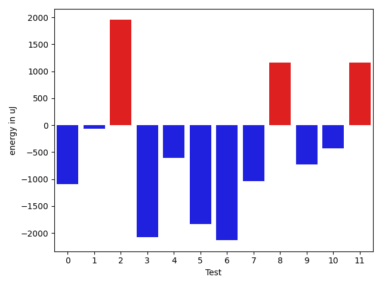

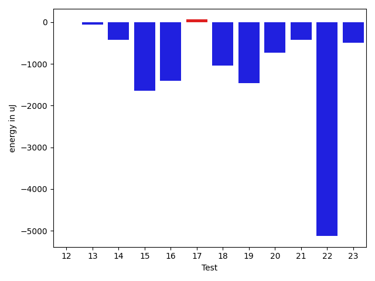

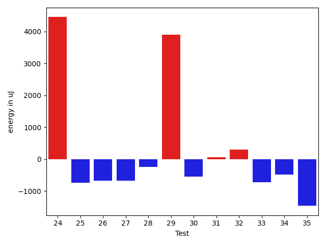

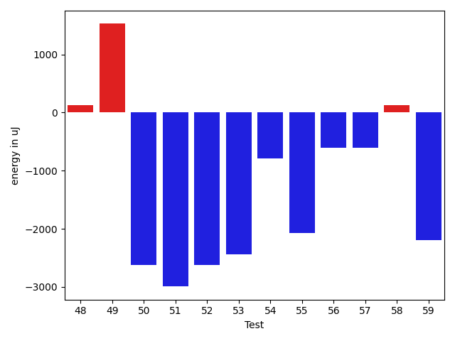

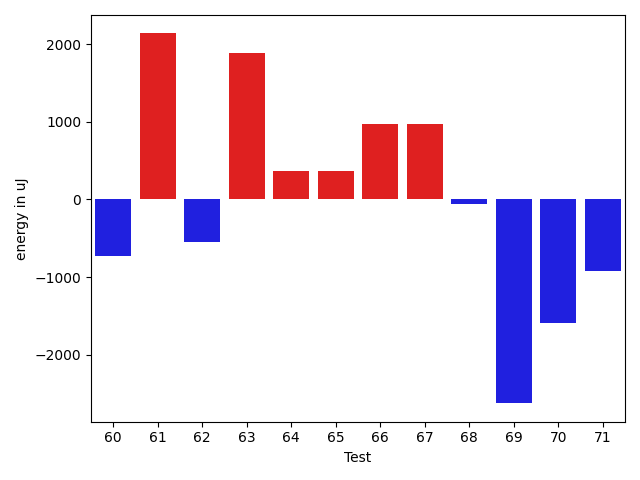

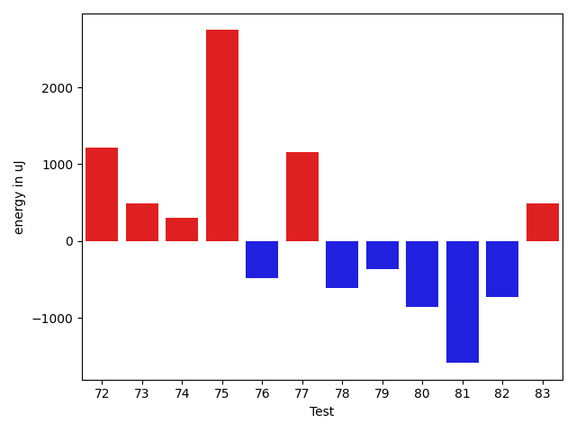

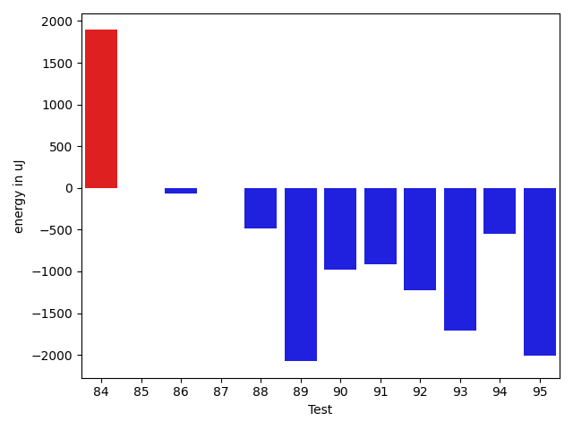

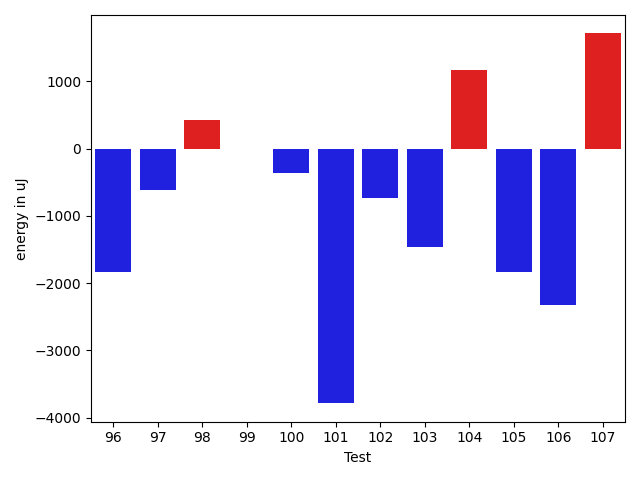

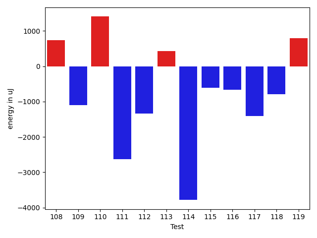

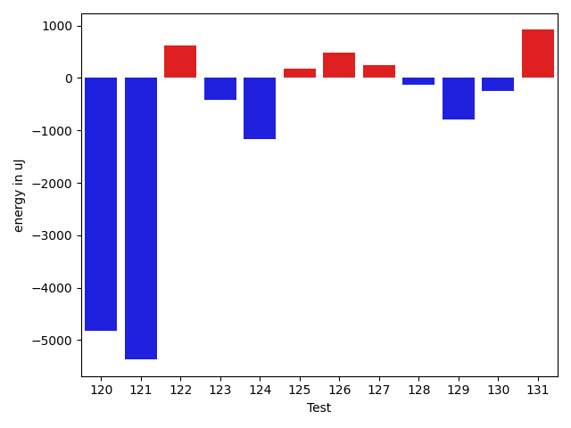

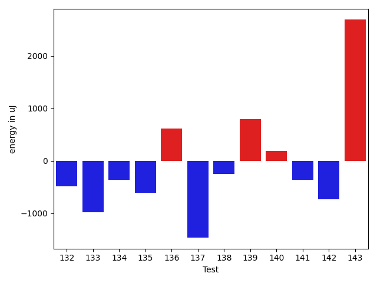

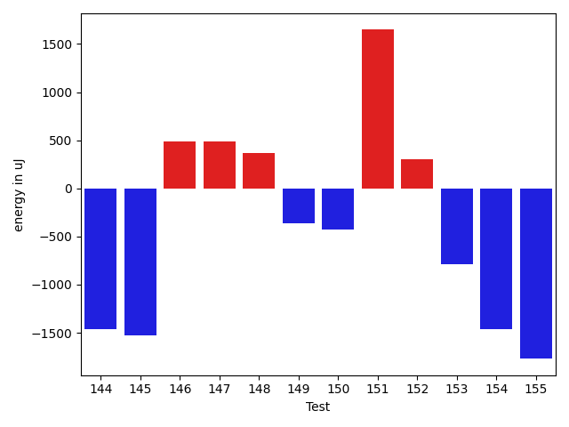

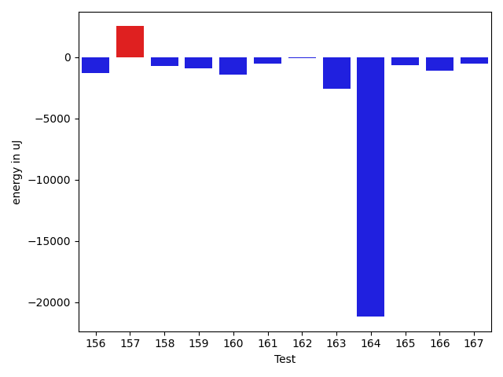

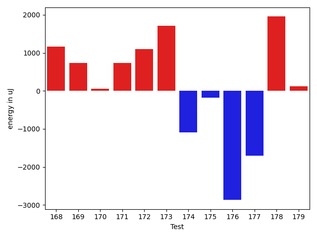

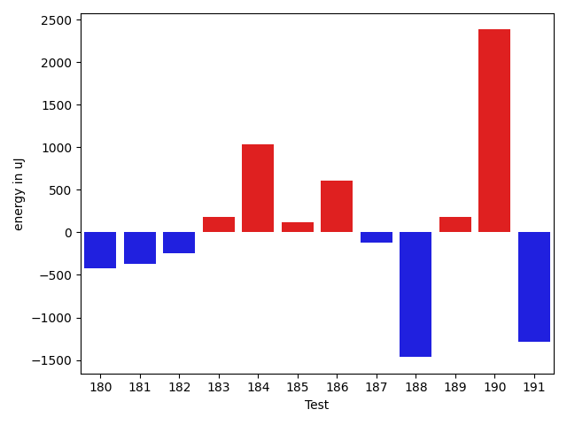

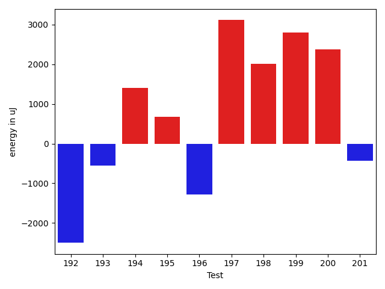

| ID | EnergyV1 | EnergyV2 | DeltaEnergy | σV1 | σV2 |
| --- | --- | --- | --- | --- | --- |
| 0 | 35156 | 34058 | -1098 | 3271.8899307599368 | 3897.542632967916 |
| 1 | 34424 | 34363 | -61 | 3663.915889702413 | 4145.427330493202 |
| 2 | 32776 | 34729 | 1953 | 2685.3789572034057 | 3393.816246700487 |
| 3 | 35279 | 33203 | -2076 | 3620.0620819004357 | 3804.2229107572875 |
| 4 | 34179 | 33569 | -610 | 37065.317905587835 | 35569.4566569483 |
| 5 | 35340 | 33508 | -1832 | 4399.146787716516 | 3881.2870511318893 |
| 6 | 37292 | 35157 | -2135 | 11404.587839356582 | 8765.84491789709 |
| 7 | 36255 | 35217 | -1038 | 8124.861350319299 | 4502.2607695353945 |
| 8 | 37231 | 38392 | 1161 | 39966.19698502405 | 36524.8145673419 |
| 9 | 34302 | 33569 | -733 | 3397.1246705758153 | 3790.635695973941 |
| 10 | 36743 | 36316 | -427 | 3933.8456832468655 | 3917.3545729561442 |
| 11 | 33081 | 34240 | 1159 | 3422.1434477326493 | 2441.3582187952957 |
| 12 | 35523 | 35523 | 0 | 8043.798521805996 | 7997.879251334626 |
| 13 | 39428 | 39368 | -60 | 53802.45885942853 | 61508.50795579093 |
| 14 | 36621 | 36194 | -427 | 59476.301949503424 | 79639.84434927156 |
| 15 | 35644 | 33996 | -1648 | 3716.812063359769 | 3432.2530775458918 |
| 16 | 35339 | 33935 | -1404 | 17044.816326976666 | 25237.427952294893 |
| 17 | 34851 | 34912 | 61 | 2700.301139669048 | 3468.1206207397117 |
| 18 | 35584 | 34546 | -1038 | 23448.10506513977 | 3369.309291057761 |
| 19 | 35400 | 33936 | -1464 | 4227.206003580498 | 25240.26906222024 |
| 20 | 34606 | 33875 | -731 | 18111.32750220355 | 8403.521440242908 |
| 21 | 35583 | 35156 | -427 | 12363.248091615336 | 11661.245762332006 |
| 22 | 131225 | 126099 | -5126 | 73065.88901845469 | 73998.72231947388 |
| 23 | 34851 | 34363 | -488 | 10869.43036940055 | 10075.161226807537 |
| 24 | 79224 | 83679 | 4455 | 28534.538627162594 | 27594.306172548946 |
| 25 | 36133 | 35400 | -733 | 12304.786251007845 | 13397.995273967275 |
| 26 | 35523 | 34851 | -672 | 68953.26432657249 | 67142.43840038167 |
| 27 | 63172 | 62500 | -672 | 30661.18393493654 | 25683.33080551635 |
| 28 | 36133 | 35889 | -244 | 20249.80389972564 | 17738.848444410956 |
| 29 | 38269 | 42175 | 3906 | 45528.905712877095 | 45513.579629688975 |
| 30 | 35461 | 34912 | -549 | 11856.00190690125 | 10582.368181376272 |
| 31 | 38574 | 38635 | 61 | 28265.437157975393 | 18596.93913939473 |
| 32 | 33874 | 34180 | 306 | 4538.291355274763 | 3680.3728215857896 |
| 33 | 34301 | 33569 | -732 | 18504.994032505838 | 10106.895236690829 |
| 34 | 34179 | 33691 | -488 | 3891.9825814958717 | 7856.104863234075 |
| 35 | 34851 | 33386 | -1465 | 4159.893076975084 | 4317.970634179109 |
| 36 | 33569 | 34546 | 977 | 6296.889335268823 | 7664.44821809256 |
| 37 | 37354 | 35095 | -2259 | 19696.78128027015 | 21303.418398694022 |
| 38 | 35095 | 35340 | 245 | 3698.2702387045288 | 3434.173668247261 |
| 39 | 68726 | 65491 | -3235 | 23024.93735337236 | 32513.190078120828 |
| 40 | 35645 | 37536 | 1891 | 48383.442416412734 | 36712.491134216216 |
| 41 | 35461 | 34484 | -977 | 44152.28892119422 | 4123.282300373263 |
| 42 | 38635 | 38147 | -488 | 389465.33100731875 | 364943.01918753586 |
| 43 | 35034 | 34606 | -428 | 5891.5913608515775 | 149900.1173902089 |
| 44 | 32959 | 33569 | 610 | 4380.897401079049 | 3762.5773198035413 |
| 45 | 34607 | 33753 | -854 | 3976.6903848133143 | 20224.486223441905 |
| 46 | 37781 | 36194 | -1587 | 58722.87344240068 | 51597.293813200275 |
| 47 | 34423 | 33813 | -610 | 6281.4165340901 | 7942.161095125067 |
| 48 | 35400 | 35522 | 122 | 4366.020118269062 | 3915.945639042233 |
| 49 | 36010 | 37536 | 1526 | 4829.419279415372 | 23352.015426510836 |
| 50 | 37597 | 34973 | -2624 | 4857.715503168359 | 2819.010020718901 |
| 51 | 36255 | 33264 | -2991 | 4112.590896028825 | 4266.73603250702 |
| 52 | 36743 | 34119 | -2624 | 4683.084011564922 | 3222.333022939535 |
| 53 | 35584 | 33142 | -2442 | 4410.996158394949 | 2589.0832324154817 |
| 54 | 35828 | 35034 | -794 | 4616.509259727782 | 3852.823373919091 |
| 55 | 38635 | 36560 | -2075 | 11995.129340898127 | 7486.0620178534045 |
| 56 | 39429 | 38819 | -610 | 52187.89920195922 | 58826.07903529409 |
| 57 | 35156 | 34546 | -610 | 4449.215828028014 | 4328.497039446674 |
| 58 | 37293 | 37414 | 121 | 37437.38159122543 | 40748.75063236621 |
| 59 | 36560 | 34363 | -2197 | 5268.780442889218 | 4116.9113497534045 |
| 60 | 36377 | 35645 | -732 | 3687.589719698817 | 3801.8170317698823 |
| 61 | 34545 | 36682 | 2137 | 4834.427490382219 | 3757.7553879351376 |
| 62 | 32959 | 32410 | -549 | 3265.576505339023 | 3222.7935959552506 |
| 63 | 32409 | 34301 | 1892 | 2189.615023381344 | 24875.985169829957 |
| 64 | 36011 | 36376 | 365 | 3200.255858521315 | 10584.26885772319 |
| 65 | 33142 | 33508 | 366 | 7887.612901323358 | 5647.22222252485 |
| 66 | 32654 | 33630 | 976 | 3511.799246553949 | 2368.8459820266103 |
| 67 | 61889 | 62866 | 977 | 21097.86331780381 | 23218.67045584254 |
| 68 | 35156 | 35095 | -61 | 3913.1743453042573 | 3897.81198225664 |
| 69 | 35949 | 33325 | -2624 | 3709.1469160457573 | 3156.536880371975 |
| 70 | 36438 | 34851 | -1587 | 3490.574594284427 | 3126.792961201976 |
| 71 | 34668 | 33753 | -915 | 3706.0660010422953 | 30872.022434560393 |
| 72 | 34790 | 36010 | 1220 | 17330.0332503027 | 31665.339256779065 |
| 73 | 34058 | 34546 | 488 | 1730.350324326828 | 4195.30230237155 |
| 74 | 32593 | 32898 | 305 | 3202.5720229419007 | 4252.790445379839 |
| 75 | 33692 | 36438 | 2746 | 3590.9625123068186 | 4048.1865109920236 |
| 76 | 34057 | 33569 | -488 | 3879.648134678606 | 3430.8694398390226 |
| 77 | 34180 | 35339 | 1159 | 4183.304902736922 | 40166.57419247827 |
| 78 | 37781 | 37171 | -610 | 71264.01163953567 | 76842.04758090507 |
| 79 | 34667 | 34302 | -365 | 3327.5013048648907 | 26323.0552316318 |
| 80 | 35156 | 34301 | -855 | 3249.261073466659 | 2404.5496029838678 |
| 81 | 35095 | 33508 | -1587 | 3825.9719920123366 | 4330.190044594607 |
| 82 | 34119 | 33387 | -732 | 28942.872042373823 | 3166.9464751288992 |
| 83 | 33631 | 34119 | 488 | 3899.5436583086944 | 21379.976049741184 |
| 84 | 33264 | 35156 | 1892 | 3678.1193439260865 | 3416.1852970183004 |
| 85 | 33447 | 33447 | 0 | 3707.3930530765147 | 2767.3915495591564 |
| 86 | 34241 | 34179 | -62 | 2079.3013654512292 | 2600.7295731198196 |
| 87 | 33875 | 33874 | -1 | 3607.601473219396 | 3277.0549753900063 |
| 88 | 35462 | 34973 | -489 | 4167.642543007392 | 4043.834363242481 |
| 89 | 35340 | 33264 | -2076 | 5319.6661580630225 | 2923.491972890563 |
| 90 | 34057 | 33081 | -976 | 31054.966532711416 | 3212.529961216654 |
| 91 | 34790 | 33875 | -915 | 3305.747046222333 | 3195.5038706993178 |
| 92 | 34851 | 33630 | -1221 | 3548.873492022765 | 4056.3750181042187 |
| 93 | 35889 | 34179 | -1710 | 3816.523031503937 | 2016.1109994566712 |
| 94 | 33874 | 33325 | -549 | 3041.101784258827 | 2440.4488628823487 |
| 95 | 34790 | 32776 | -2014 | 2822.3555863065085 | 2413.281806252409 |
| 96 | 34912 | 33081 | -1831 | 3394.2285408845264 | 3642.18431932226 |
| 97 | 34057 | 33447 | -610 | 3491.809867990382 | 2833.103220741348 |
| 98 | 34240 | 34668 | 428 | 4476.414775922105 | 2904.7339718982876 |
| 99 | 33814 | 33814 | 0 | 4287.794579144525 | 2640.0163772640162 |
| 100 | 37292 | 36926 | -366 | 6080.8806385818425 | 3432.480450053576 |
| 101 | 72326 | 68542 | -3784 | 93586.87353567277 | 70717.30171834034 |
| 102 | 37048 | 36316 | -732 | 262806.41817573836 | 288308.656285917 |
| 103 | 38391 | 36926 | -1465 | 335257.91666529275 | 10247.680763958251 |
| 104 | 36498 | 37658 | 1160 | 208067.19521041625 | 194273.60288421123 |
| 105 | 38879 | 37049 | -1830 | 415396.2664548623 | 14268.65725769247 |
| 106 | 38330 | 36010 | -2320 | 53295.88583437838 | 64079.22028134862 |
| 107 | 33142 | 34851 | 1709 | 3044.2074311151187 | 3266.4766907863614 |
| 108 | 36499 | 37232 | 733 | 24143.958596186487 | 36946.951086734894 |
| 109 | 36193 | 35095 | -1098 | 4435.957560303448 | 3883.618311253051 |
| 110 | 33508 | 34912 | 1404 | 5603.930351103659 | 19581.310017405583 |
| 111 | 38208 | 35583 | -2625 | 42303.2822296609 | 4252.111735931189 |
| 112 | 35767 | 34424 | -1343 | 3547.1650044803973 | 3573.874639849309 |
| 113 | 34607 | 35034 | 427 | 4189.903912454257 | 3611.988102590117 |
| 114 | 122375 | 118591 | -3784 | 35144.552043828815 | 33003.954554274096 |
| 115 | 36437 | 35828 | -609 | 15464.564908041913 | 13538.081700272896 |
| 116 | 33508 | 32837 | -671 | 3996.858618506105 | 3013.269716683993 |
| 117 | 36438 | 35034 | -1404 | 4364.680391689637 | 3137.1794046212985 |
| 118 | 35828 | 35034 | -794 | 3776.897395549412 | 3318.3467057218418 |
| 119 | 33386 | 34180 | 794 | 3572.9273843950787 | 3452.9197860490317 |
| 120 | 37231 | 32410 | -4821 | 5053.4388105164935 | 3869.756346326057 |
| 121 | 39611 | 34241 | -5370 | 4136.737896848333 | 3197.5366540103355 |
| 122 | 36071 | 36682 | 611 | 4163.344892564684 | 3173.0971979282317 |
| 123 | 36132 | 35706 | -426 | 4325.17741128075 | 3453.640694385229 |
| 124 | 36499 | 35339 | -1160 | 4389.470212709489 | 3718.3757406642394 |
| 125 | 38147 | 38330 | 183 | 19162.657411862536 | 18789.54064256478 |
| 126 | 34973 | 35461 | 488 | 3796.0465862391575 | 2979.866101752728 |
| 127 | 34179 | 34424 | 245 | 3274.4720426963495 | 3657.5429389140463 |
| 128 | 33691 | 33569 | -122 | 3746.08307211343 | 3538.3303441683915 |
| 129 | 35462 | 34668 | -794 | 5455.6101908884075 | 3635.924883321954 |
| 130 | 35156 | 34912 | -244 | 5006.8561326778035 | 7676.503256227668 |
| 131 | 71899 | 72815 | 916 | 48845.90048551063 | 51860.14231709478 |
| 132 | 34729 | 34240 | -489 | 3719.659326899078 | 22562.40814962151 |
| 133 | 35584 | 34607 | -977 | 38715.73321928338 | 22917.533577065093 |
| 134 | 34485 | 34119 | -366 | 5049.166761714252 | 5003.784481406412 |
| 135 | 36010 | 35400 | -610 | 3129.282317092723 | 4279.694300959438 |
| 136 | 37598 | 38208 | 610 | 59432.152481566096 | 97716.4223955479 |
| 137 | 36804 | 35340 | -1464 | 24423.660714162837 | 52075.335290922914 |
| 138 | 34851 | 34607 | -244 | 3849.282510792755 | 5666.020853509101 |
| 139 | 34240 | 35034 | 794 | 7282.860509653535 | 21851.37696406482 |
| 140 | 34668 | 34851 | 183 | 3289.757120389455 | 3174.5270321890744 |
| 141 | 35522 | 35156 | -366 | 3111.8445490413783 | 3968.9763891454595 |
| 142 | 33813 | 33081 | -732 | 23916.40162388012 | 3240.148018267215 |
| 143 | 34546 | 37232 | 2686 | 24059.258128289468 | 3355.530563115169 |
| 144 | 36133 | 34668 | -1465 | 4062.9153162066605 | 3810.003450903744 |
| 145 | 33630 | 32104 | -1526 | 3769.75247503508 | 3071.4739517526273 |
| 146 | 35583 | 36071 | 488 | 3470.378954806722 | 4003.489239399903 |
| 147 | 35217 | 35706 | 489 | 29389.262431615654 | 4241.3776222027545 |
| 148 | 35889 | 36254 | 365 | 5904.716647483261 | 3894.7272350804087 |
| 149 | 35218 | 34851 | -367 | 3552.0913738235504 | 3437.1498136821883 |
| 150 | 35278 | 34851 | -427 | 2968.801852105656 | 3550.5297406101918 |
| 151 | 36316 | 37964 | 1648 | 3902.884952265091 | 7835.0946007271505 |
| 152 | 34485 | 34789 | 304 | 3327.717451948107 | 2984.926297017777 |
| 153 | 35949 | 35157 | -792 | 3954.617869793964 | 3720.051050177138 |
| 154 | 35889 | 34424 | -1465 | 4428.019686828276 | 3819.443606417547 |
| 155 | 84778 | 83008 | -1770 | 310910.0251254235 | 258219.60696636085 |
| 156 | 37781 | 36499 | -1282 | 7330.034750035957 | 8382.79588287453 |
| 157 | 76782 | 79285 | 2503 | 58399.97471133584 | 52775.28032177118 |
| 158 | 37598 | 36865 | -733 | 51387.301633520074 | 55373.44644960795 |
| 159 | 35767 | 34851 | -916 | 36294.431624787845 | 2771.292401820654 |
| 160 | 36011 | 34546 | -1465 | 4438.246697299932 | 5418.8714332414265 |
| 161 | 37415 | 36865 | -550 | 79570.9002339332 | 89466.4653323932 |
| 162 | 36987 | 36865 | -122 | 4377.016899384786 | 3371.0663983025765 |
| 163 | 40527 | 37964 | -2563 | 48431.45212363811 | 53070.67197915023 |
| 164 | 245177 | 223999 | -21178 | 80698.74017183093 | 84075.79856313816 |
| 165 | 352050 | 351378 | -672 | 103688.76019837233 | 97281.64659303447 |
| 166 | 40771 | 39673 | -1098 | 50607.67224743871 | 47771.061877838045 |
| 167 | 39917 | 39368 | -549 | 76511.39280713668 | 50204.01585117642 |
| 168 | 36926 | 38086 | 1160 | 32120.04440770013 | 35626.91530121603 |
| 169 | 36255 | 36987 | 732 | 3927.2184848625184 | 3924.294082290154 |
| 170 | 37232 | 37292 | 60 | 4819.979567109014 | 4094.439584908148 |
| 171 | 35156 | 35889 | 733 | 4559.080400421008 | 3794.9318897050043 |
| 172 | 38086 | 39184 | 1098 | 48545.50279137645 | 34768.66774583714 |
| 173 | 34851 | 36560 | 1709 | 2998.7874134140725 | 2846.2752955699393 |
| 174 | 36010 | 34912 | -1098 | 5715.17839075918 | 7987.602875918612 |
| 175 | 37415 | 37231 | -184 | 11755.28275501719 | 21703.615205630293 |
| 176 | 41626 | 38757 | -2869 | 77476.65246658347 | 47916.50773059136 |
| 177 | 38757 | 37048 | -1709 | 71646.3229404943 | 49982.24499926813 |
| 178 | 35583 | 37536 | 1953 | 27431.97136302097 | 5707.935715834112 |
| 179 | 34241 | 34363 | 122 | 4135.6894164045125 | 4061.177715622627 |
| 180 | 35645 | 35218 | -427 | 49309.377623682834 | 58667.776909755754 |
| 181 | 117615 | 117249 | -366 | 287098.3470508556 | 310229.7650037958 |
| 182 | 37659 | 37415 | -244 | 38910.92413547884 | 39228.76759183718 |
| 183 | 35339 | 35522 | 183 | 6067.131806660081 | 3916.767334417753 |
| 184 | 38208 | 39245 | 1037 | 55071.627456287475 | 71955.77223739788 |
| 185 | 39368 | 39490 | 122 | 89268.92935996708 | 114781.55566379905 |
| 186 | 37353 | 37964 | 611 | 66187.6765990398 | 53557.30135588561 |
| 187 | 38391 | 38269 | -122 | 106923.26439427926 | 103343.07857995578 |
| 188 | 39917 | 38452 | -1465 | 800323.6726864373 | 370778.5874264114 |
| 189 | 36010 | 36194 | 184 | 4177.344370530158 | 3560.550640547797 |
| 190 | 35644 | 38025 | 2381 | 4015.0058530467923 | 4002.9789443077802 |
| 191 | 39428 | 38147 | -1281 | 3512.3978290756436 | 8431.595342472527 |
| 192 | 37841 | 35340 | -2501 | 4049.2153560906095 | 4789.531796061569 |
| 193 | 39611 | 39062 | -549 | 32808.53646076887 | 19856.694243566344 |
| 194 | 35095 | 36499 | 1404 | 8315.529229737107 | 8239.24446994963 |
| 195 | 39185 | 39856 | 671 | 73371.7170999417 | 58105.83448229494 |
| 196 | 36743 | 35461 | -1282 | 45001.92602459887 | 21531.807070805156 |
| 197 | 36499 | 39612 | 3113 | 9710.963599184757 | 11445.935113252217 |
| 198 | 36804 | 38818 | 2014 | 78181.6778938288 | 70344.02219158523 |
| 199 | 35279 | 38086 | 2807 | 4315.504175635861 | 2837.089848771096 |
| 200 | 34301 | 36682 | 2381 | 4160.751865930453 | 3187.739914960456 |
| 201 | 37354 | 36927 | -427 | 8667.434116207065 | 3403.5864043826327 |

## Delta Duration per test method

| ID | DurationV1 | DurationsV2 | DeltaDuration |
| --- | --- | --- | --- |
| 0 | 800558.0681818182 | 778411.2888888889 | -22146.779292929335 |
| 1 | 751888.1428571428 | 757080.16 | 5192.017142857192 |
| 2 | 764322.7647058824 | 731877.2448979592 | -32445.519807923236 |
| 3 | 798450.775862069 | 737915.1489361703 | -60535.626925898716 |
| 4 | 1063506.7192982456 | 1112817.0606060605 | 49310.34130781493 |
| 5 | 790091.3518518518 | 748964.4912280702 | -41126.86062378157 |
| 6 | 1088733.5066666666 | 1056281.2533333334 | -32452.25333333318 |
| 7 | 972173.4084507042 | 942953.4647887324 | -29219.943661971833 |
| 8 | 1426369.2112676057 | 1413726.09375 | -12643.117517605657 |
| 9 | 580920.4814814815 | 526848.4285714285 | -54072.05291005294 |
| 10 | 820744.82 | 803258.2916666666 | -17486.52833333332 |
| 11 | 467625.7272727273 | 482914.3181818182 | 15288.590909090883 |
| 12 | 949716.7076923077 | 906296.6140350878 | -43420.0936572199 |
| 13 | 1540698.0483870967 | 1511251.3770491802 | -29446.671337916516 |
| 14 | 1585175.612244898 | 1853220.953488372 | 268045.34124347405 |
| 15 | 808125.487804878 | 737677.4716981133 | -70448.01610676479 |
| 16 | 990689.0555555555 | 1026837.6666666666 | 36148.611111111124 |
| 17 | 416599.14285714284 | 416416.86666666664 | -182.276190476201 |
| 18 | 943374.6666666666 | 784109.2941176471 | -159265.37254901952 |
| 19 | 968771.1267605633 | 1041513.2432432432 | 72742.11648267985 |
| 20 | 1115947.6621621621 | 1042666.16 | -73281.5021621621 |
| 21 | 1262530.670212766 | 1274627.8777777778 | 12097.207565011922 |
| 22 | 4428349.636363637 | 4423776.232323232 | -4573.404040404595 |
| 23 | 1218767.2417582418 | 1220377.7802197803 | 1610.5384615384974 |
| 24 | 2796920.777777778 | 2785625.8080808083 | -11294.969696969725 |
| 25 | 1405169.7263157894 | 1375297.0 | -29872.72631578939 |
| 26 | 1874889.9680851065 | 1830105.6931818181 | -44784.274903288344 |
| 27 | 2013419.888888889 | 2040263.4848484849 | 26843.59595959587 |
| 28 | 1407319.65 | 1446754.1704545454 | 39434.520454545505 |
| 29 | 2106122.381443299 | 2193352.5102040814 | 87230.12876078254 |
| 30 | 1262425.0869565217 | 1267389.4105263157 | 4964.323569793953 |
| 31 | 1716253.3434343433 | 1642731.202020202 | -73522.14141414128 |
| 32 | 851398.298245614 | 804573.8392857143 | -46824.458959899726 |
| 33 | 1323391.3260869565 | 1312757.9010989012 | -10633.424988055369 |
| 34 | 987948.6808510638 | 845846.2678571428 | -142102.41299392097 |
| 35 | 847922.703125 | 944259.7846153846 | 96337.08149038465 |
| 36 | 1058342.0133333334 | 1113352.0133333334 | 55010.0 |
| 37 | 1335173.8484848484 | 1269830.4328358208 | -65343.41564902756 |
| 38 | 936963.2083333334 | 933217.220338983 | -3745.9879943503765 |
| 39 | 2255849.3131313133 | 2197888.0606060605 | -57961.252525252756 |
| 40 | 1893564.1578947369 | 1826750.8309859154 | -66813.32690882147 |
| 41 | 812232.3684210526 | 478362.39285714284 | -333869.97556390974 |
| 42 | 4505225.507042253 | 3913329.816666667 | -591895.6903755865 |
| 43 | 886910.037735849 | 1468462.0338983051 | 581551.9961624561 |
| 44 | 584610.8421052631 | 546959.0 | -37651.842105263146 |
| 45 | 1113915.9166666667 | 1175845.8513513512 | 61929.9346846845 |
| 46 | 1742412.9032258065 | 1356865.3714285714 | -385547.53179723513 |
| 47 | 1105040.3823529412 | 987669.0277777778 | -117371.35457516345 |
| 48 | 892580.4210526316 | 472136.8181818182 | -420443.6028708134 |
| 49 | 438125.875 | 670345.8 | 232219.92500000005 |
| 50 | 459061.5416666667 | 483896.72222222225 | 24835.180555555562 |
| 51 | 455406.04545454547 | 397327.75 | -58078.29545454547 |
| 52 | 436996.5 | 401413.5882352941 | -35582.9117647059 |
| 53 | 418676.6875 | 422137.875 | 3461.1875 |
| 54 | 434130.4736842105 | 390562.3333333333 | -43568.14035087719 |
| 55 | 896856.4827586206 | 688975.3333333334 | -207881.14942528727 |
| 56 | 1285114.4814814816 | 1401969.962962963 | 116855.48148148134 |
| 57 | 437303.0625 | 369992.7894736842 | -67310.27302631579 |
| 58 | 991160.9090909091 | 866870.2592592592 | -124290.64983164985 |
| 59 | 436714.63636363635 | 464829.22222222225 | 28114.585858585895 |
| 60 | 462951.1538461539 | 354575.5833333333 | -108375.57051282056 |
| 61 | 394442.0 | 435031.3333333333 | 40589.333333333314 |
| 62 | 479366.93333333335 | 489476.26923076925 | 10109.3358974359 |
| 63 | 516973.1666666667 | 720557.44 | 203584.27333333326 |
| 64 | 772091.7333333333 | 908639.6279069767 | 136547.89457364345 |
| 65 | 911628.9787234042 | 899524.0454545454 | -12104.933268858818 |
| 66 | 575472.8823529412 | 557328.5172413794 | -18144.36511156184 |
| 67 | 1811109.2978723405 | 1849526.7948717948 | 38417.49699945422 |
| 68 | 545111.4117647059 | 509778.09375 | -35333.3180147059 |
| 69 | 542458.0303030303 | 580134.625 | 37676.594696969725 |
| 70 | 413616.4166666667 | 432513.3888888889 | 18896.97222222219 |
| 71 | 546730.5714285715 | 736134.76 | 189404.18857142853 |
| 72 | 587820.7916666666 | 672549.2592592592 | 84728.46759259258 |
| 73 | 334789.0 | 366344.92307692306 | 31555.923076923063 |
| 74 | 443721.3076923077 | 443258.5909090909 | -462.7167832168052 |
| 75 | 397306.6153846154 | 393808.8333333333 | -3497.7820512820617 |
| 76 | 670042.0769230769 | 654535.2432432432 | -15506.833679833682 |
| 77 | 606897.6086956522 | 962068.5294117647 | 355170.9207161125 |
| 78 | 1788990.388888889 | 2281950.1818181816 | 492959.79292929266 |
| 79 | 614578.9714285714 | 743153.6216216217 | 128574.65019305027 |
| 80 | 430516.63157894736 | 392988.6111111111 | -37528.020467836235 |
| 81 | 501247.48387096776 | 561312.0 | 60064.51612903224 |
| 82 | 616530.5714285715 | 460638.8846153846 | -155891.68681318685 |
| 83 | 686566.9166666666 | 826354.8139534884 | 139787.89728682174 |
| 84 | 555631.5714285715 | 573311.9117647059 | 17680.340336134424 |
| 85 | 625344.25 | 655509.0571428571 | 30164.807142857113 |
| 86 | 394373.5714285714 | 395884.5 | 1510.9285714285797 |
| 87 | 497610.4074074074 | 477740.44444444444 | -19869.962962962978 |
| 88 | 597745.7741935484 | 606859.1052631579 | 9113.3310696095 |
| 89 | 474884.7894736842 | 422790.86666666664 | -52093.922807017574 |
| 90 | 639411.3478260869 | 422212.7037037037 | -217198.6441223832 |
| 91 | 507408.81481481483 | 527321.7037037037 | 19912.888888888876 |
| 92 | 426690.17391304346 | 388070.4 | -38619.773913043435 |
| 93 | 430030.05 | 462741.1538461539 | 32711.103846153885 |
| 94 | 393347.0 | 427501.375 | 34154.375 |
| 95 | 368225.0 | 349707.0 | -18518.0 |
| 96 | 539421.7619047619 | 452426.0588235294 | -86995.7030812325 |
| 97 | 512637.38095238095 | 534871.0 | 22233.619047619053 |
| 98 | 730392.5625 | 434891.2 | -295501.3625 |
| 99 | 423289.17647058825 | 408069.8333333333 | -15219.343137254938 |
| 100 | 683114.1818181818 | 600679.0 | -82435.18181818177 |
| 101 | 3003306.673469388 | 2680412.3061224488 | -322894.36734693917 |
| 102 | 2627382.586956522 | 3062326.4 | 434943.81304347795 |
| 103 | 3577055.3913043477 | 873379.4 | -2703675.9913043478 |
| 104 | 2156401.7719298247 | 2123581.8333333335 | -32819.938596491236 |
| 105 | 4128355.375 | 739508.9375 | -3388846.4375 |
| 106 | 1190359.75 | 1409336.12 | 218976.3700000001 |
| 107 | 724374.9210526316 | 694478.8333333334 | -29896.0877192982 |
| 108 | 998988.0350877193 | 1172224.918367347 | 173236.88327962765 |
| 109 | 533792.6551724138 | 552747.8611111111 | 18955.205938697327 |
| 110 | 959775.8552631579 | 1032939.0410958905 | 73163.18583273259 |
| 111 | 807989.5625 | 450419.875 | -357569.6875 |
| 112 | 794942.375 | 771326.8518518518 | -23615.523148148204 |
| 113 | 915738.8035714285 | 893816.5 | -21922.30357142852 |
| 114 | 4009385.8282828284 | 3895449.595959596 | -113936.23232323257 |
| 115 | 1102472.7272727273 | 1061699.9583333333 | -40772.76893939404 |
| 116 | 662377.1836734693 | 658170.3658536585 | -4206.817819810822 |
| 117 | 574185.16 | 535843.0 | -38342.16000000003 |
| 118 | 472674.7619047619 | 443173.625 | -29501.136904761894 |
| 119 | 709226.2340425532 | 698806.4222222222 | -10419.81182033103 |
| 120 | 445101.84210526315 | 483167.4117647059 | 38065.56965944276 |
| 121 | 481307.347826087 | 472042.2631578947 | -9265.084668192256 |
| 122 | 465300.3333333333 | 441723.35 | -23576.983333333337 |
| 123 | 474856.3461538461 | 497825.75757575757 | 22969.41142191144 |
| 124 | 468344.4583333333 | 444047.63636363635 | -24296.82196969696 |
| 125 | 1514388.3406593406 | 1543025.2604166667 | 28636.919757326134 |
| 126 | 564654.8571428572 | 563450.375 | -1204.4821428571595 |
| 127 | 455402.64 | 460262.9 | 4860.260000000009 |
| 128 | 844128.2586206896 | 871805.8545454545 | 27677.59592476487 |
| 129 | 936933.6231884058 | 1032402.8461538461 | 95469.22296544036 |
| 130 | 968524.3194444445 | 1072141.844155844 | 103617.52471139957 |
| 131 | 2747940.381443299 | 2949088.8350515463 | 201148.45360824745 |
| 132 | 791078.5254237289 | 976690.6034482758 | 185612.07802454697 |
| 133 | 1476979.524390244 | 1387215.888888889 | -89763.63550135493 |
| 134 | 732915.08 | 729829.75 | -3085.329999999958 |
| 135 | 638418.8823529412 | 658244.9487179487 | 19826.066365007544 |
| 136 | 1245035.574468085 | 1884933.3653846155 | 639897.7909165304 |
| 137 | 792430.1290322581 | 1102247.5714285714 | 309817.4423963133 |
| 138 | 806133.0425531915 | 864987.32 | 58854.27744680841 |
| 139 | 901720.8088235294 | 999962.223880597 | 98241.41505706764 |
| 140 | 651965.1304347826 | 633078.5909090909 | -18886.539525691653 |
| 141 | 642820.4838709678 | 701909.0909090909 | 59088.607038123184 |
| 142 | 870444.1224489796 | 779367.6129032258 | -91076.50954575383 |
| 143 | 786242.7419354839 | 601219.16 | -185023.58193548385 |
| 144 | 538567.9333333333 | 558526.25 | 19958.31666666665 |
| 145 | 730727.1320754717 | 731112.0869565217 | 384.9548810500419 |
| 146 | 742429.1470588235 | 628191.5757575758 | -114237.57130124769 |
| 147 | 777210.125 | 649149.2051282051 | -128060.91987179487 |
| 148 | 754817.75 | 789289.2916666666 | 34471.54166666663 |
| 149 | 605788.5161290322 | 625824.1764705882 | 20035.66034155595 |
| 150 | 751367.2916666666 | 829998.7777777778 | 78631.48611111112 |
| 151 | 390799.72222222225 | 514866.0625 | 124066.34027777775 |
| 152 | 513757.56 | 528376.7777777778 | 14619.217777777754 |
| 153 | 941681.84375 | 625200.8918918918 | -316480.95185810816 |
| 154 | 436760.85714285716 | 436788.0 | 27.142857142840512 |
| 155 | 4555766.777777778 | 4491647.525252526 | -64119.25252525229 |
| 156 | 730433.0571428571 | 729711.5641025641 | -721.4930402929895 |
| 157 | 2872221.98989899 | 2986655.909090909 | 114433.91919191927 |
| 158 | 1409332.1 | 1334868.82 | -74463.28000000003 |
| 159 | 857664.12 | 674111.0833333334 | -183553.03666666662 |
| 160 | 586641.40625 | 592844.2 | 6202.793749999953 |
| 161 | 1668132.1666666667 | 1801454.5681818181 | 133322.40151515137 |
| 162 | 618308.28125 | 626195.9411764706 | 7887.659926470602 |
| 163 | 1898751.2967032967 | 1812783.5164835164 | -85967.78021978028 |
| 164 | 7497099.2727272725 | 7348757.141414141 | -148342.1313131312 |
| 165 | 10327168.656565657 | 10325096.030303031 | -2072.6262626256794 |
| 166 | 1980885.9278350514 | 1870292.5757575757 | -110593.35207747575 |
| 167 | 1904761.7843137255 | 1461998.1020408163 | -442763.6822729092 |
| 168 | 1423748.1126760563 | 1434340.6578947369 | 10592.54521868052 |
| 169 | 896094.1343283582 | 890890.1272727273 | -5204.007055630907 |
| 170 | 619490.551724138 | 552325.7727272727 | -67164.77899686527 |
| 171 | 664845.8965517242 | 645520.6 | -19325.296551724197 |
| 172 | 1462363.3448275863 | 1098036.7826086956 | -364326.56221889076 |
| 173 | 439719.9130434783 | 429997.7368421053 | -9722.17620137299 |
| 174 | 1149520.482352941 | 1105424.375 | -44096.107352941064 |
| 175 | 1321368.6483516484 | 1340904.3258426967 | 19535.67749104835 |
| 176 | 2631630.1714285715 | 1682001.4133333333 | -949628.7580952381 |
| 177 | 1943638.705882353 | 1277070.0153846154 | -666568.6904977376 |
| 178 | 967378.5483870967 | 564620.4230769231 | -402758.1253101736 |
| 179 | 475006.0 | 488173.8846153846 | 13167.884615384624 |
| 180 | 1282370.8378378379 | 1496833.7971014492 | 214462.95926361135 |
| 181 | 5333501.414141414 | 5790358.666666667 | 456857.2525252532 |
| 182 | 1293717.8235294118 | 1211999.6 | -81718.22352941171 |
| 183 | 705261.3783783783 | 857268.6896551724 | 152007.31127679406 |
| 184 | 1360544.6341463414 | 1910555.5 | 550010.8658536586 |
| 185 | 1942641.7894736843 | 2702148.9736842103 | 759507.1842105261 |
| 186 | 1793765.0869565217 | 1727191.109375 | -66573.97758152173 |
| 187 | 1932618.4901960783 | 2053507.0 | 120888.50980392168 |
| 188 | 10761890.114754098 | 3945836.8260869565 | -6816053.2886671405 |
| 189 | 500980.8 | 623306.3846153846 | 122325.58461538464 |
| 190 | 387382.8333333333 | 385556.85714285716 | -1825.9761904761544 |
| 191 | 551588.5789473684 | 1019744.7037037037 | 468156.1247563353 |
| 192 | 538005.3125 | 762323.3157894737 | 224318.0032894737 |
| 193 | 1514684.28 | 1085841.3617021276 | -428842.9182978724 |
| 194 | 809433.5714285715 | 1005564.2631578947 | 196130.69172932324 |
| 195 | 1973972.25 | 1509502.9189189188 | -464469.3310810812 |
| 196 | 755017.0714285715 | 675466.0 | -79551.07142857148 |
| 197 | 831709.4444444445 | 798185.8095238095 | -33523.63492063503 |
| 198 | 2629873.88 | 1753770.8846153845 | -876102.9953846154 |
| 199 | 487259.0833333333 | 436656.0 | -50603.083333333314 |
| 200 | 446461.5625 | 446533.8888888889 | 72.32638888887595 |
| 201 | 553188.304347826 | 540561.8260869565 | -12626.47826086951 |

## Misc.

| ID | Test Class | Test Method |
| --- | --- | --- |
| 0 | com.google.gson.functional.CollectionTest | testCollectionOfObjectSerialization |
| 1 | com.google.gson.functional.CollectionTest | testNullsInListDeserialization |
| 2 | com.google.gson.functional.CollectionTest | testCollectionOfStringsDeserialization |
| 3 | com.google.gson.functional.CollectionTest | testNullsInListSerialization |
| 4 | com.google.gson.functional.CollectionTest | testCollectionOfEnumsDeserialization |
| 5 | com.google.gson.functional.CollectionTest | testQueueDeserialization |
| 6 | com.google.gson.functional.CollectionTest | testTopLevelCollectionOfIntegersDeserialization |
| 7 | com.google.gson.functional.CollectionTest | testTopLevelListOfIntegerCollectionsDeserialization |
| 8 | com.google.gson.functional.CollectionTest | testTopLevelCollectionOfIntegersSerialization |
| 9 | com.google.gson.functional.CollectionTest | testRawCollectionSerialization |
| 10 | com.google.gson.functional.CollectionTest | testRawCollectionOfBagOfPrimitivesNotAllowed |
| 11 | com.google.gson.functional.CollectionTest | testRawCollectionOfIntegersSerialization |
| 12 | com.google.gson.functional.CollectionTest | testLinkedListSerialization |
| 13 | com.google.gson.functional.CollectionTest | testRawCollectionDeserializationNotAlllowed |
| 14 | com.google.gson.functional.CollectionTest | testCollectionOfBagOfPrimitivesSerialization |
| 15 | com.google.gson.functional.CollectionTest | testQueueSerialization |
| 16 | com.google.gson.functional.CollectionTest | testCollectionOfEnumsSerialization |
| 17 | com.google.gson.functional.CollectionTest | testCollectionOfStringsSerialization |
| 18 | com.google.gson.functional.CollectionTest | testLinkedListDeserialization |
| 19 | com.google.gson.functional.ParameterizedTypesTest | testParameterizedTypeGenericArraysSerialization |
| 20 | com.google.gson.functional.ParameterizedTypesTest | testParameterizedTypeWithReaderDeserialization |
| 21 | com.google.gson.functional.ParameterizedTypesTest | testParameterizedTypeWithCustomSerializer |
| 22 | com.google.gson.functional.ParameterizedTypesTest | testParameterizedTypesSerialization |
| 23 | com.google.gson.functional.ParameterizedTypesTest | testVariableTypeDeserialization |
| 24 | com.google.gson.functional.ParameterizedTypesTest | testVariableTypeFieldsAndGenericArraysSerialization |
| 25 | com.google.gson.functional.ParameterizedTypesTest | testParameterizedTypeGenericArraysDeserialization |
| 26 | com.google.gson.functional.ParameterizedTypesTest | testParameterizedTypeDeserialization |
| 27 | com.google.gson.functional.ParameterizedTypesTest | testVariableTypeFieldsAndGenericArraysDeserialization |
| 28 | com.google.gson.functional.ParameterizedTypesTest | testTypesWithMultipleParametersDeserialization |
| 29 | com.google.gson.functional.ParameterizedTypesTest | testTypesWithMultipleParametersSerialization |
| 30 | com.google.gson.functional.ParameterizedTypesTest | testParameterizedTypeWithVariableTypeDeserialization |
| 31 | com.google.gson.functional.ParameterizedTypesTest | testParameterizedTypesWithCustomDeserializer |
| 32 | com.google.gson.functional.ParameterizedTypesTest | testParameterizedTypesWithWriterSerialization |
| 33 | com.google.gson.functional.ParameterizedTypesTest | testVariableTypeArrayDeserialization |
| 34 | com.google.gson.functional.CustomTypeAdaptersTest | testCustomTypeAdapterAppliesToSubClassesSerializedAsBaseClass |
| 35 | com.google.gson.functional.CustomTypeAdaptersTest | testCustomAdapterInvokedForMapElementDeserialization |
| 36 | com.google.gson.functional.CustomTypeAdaptersTest | testCustomAdapterInvokedForMapElementSerializationWithType |
| 37 | com.google.gson.functional.CustomTypeAdaptersTest | testCustomNestedSerializers |
| 38 | com.google.gson.functional.CustomTypeAdaptersTest | testCustomNestedDeserializers |
| 39 | com.google.gson.functional.CustomTypeAdaptersTest | testCustomTypeAdapterDoesNotAppliesToSubClasses |
| 40 | com.google.gson.functional.CustomTypeAdaptersTest | testCustomAdapterInvokedForCollectionElementSerializationWithType |
| 41 | com.google.gson.functional.CustomTypeAdaptersTest | testCustomAdapterInvokedForMapElementSerialization |
| 42 | com.google.gson.functional.CustomTypeAdaptersTest | testCustomSerializers |
| 43 | com.google.gson.functional.CustomTypeAdaptersTest | testCustomByteArraySerializer |
| 44 | com.google.gson.functional.CustomTypeAdaptersTest | testCustomAdapterInvokedForCollectionElementSerialization |
| 45 | com.google.gson.functional.CustomTypeAdaptersTest | testCustomByteArrayDeserializerAndInstanceCreator |
| 46 | com.google.gson.functional.CustomTypeAdaptersTest | testCustomDeserializers |
| 47 | com.google.gson.functional.CustomTypeAdaptersTest | testCustomSerializerForLong |
| 48 | com.google.gson.functional.StringTest | testEscapingQuotesInStringSerialization |
| 49 | com.google.gson.functional.StringTest | testSingleQuoteInStringSerialization |
| 50 | com.google.gson.functional.StringTest | testEscapedCtrlNInStringSerialization |
| 51 | com.google.gson.functional.StringTest | testEscapedCtrlNInStringDeserialization |
| 52 | com.google.gson.functional.StringTest | testSingleQuoteInStringDeserialization |
| 53 | com.google.gson.functional.StringTest | testEscapedCtrlRInStringDeserialization |
| 54 | com.google.gson.functional.StringTest | testEscapingQuotesInStringDeserialization |
| 55 | com.google.gson.functional.StringTest | testStringValueAsSingleElementArraySerialization |
| 56 | com.google.gson.functional.StringTest | testStringValueDeserialization |
| 57 | com.google.gson.functional.StringTest | testEscapedBackslashInStringDeserialization |
| 58 | com.google.gson.functional.StringTest | testStringValueSerialization |
| 59 | com.google.gson.functional.StringTest | testStringWithEscapedSlashDeserialization |
| 60 | com.google.gson.functional.StringTest | testEscapedCtrlRInStringSerialization |
| 61 | com.google.gson.functional.StringTest | testEscapedBackslashInStringSerialization |
| 62 | com.google.gson.functional.PrimitiveTest | testDoubleNoFractAsStringRepresentationDeserialization |
| 63 | com.google.gson.functional.PrimitiveTest | testPrimitiveDoubleAutoboxedInASingleElementArrayDeserialization |
| 64 | com.google.gson.functional.PrimitiveTest | testPrimitiveIntegerAutoboxedInASingleElementArraySerialization |
| 65 | com.google.gson.functional.PrimitiveTest | testPrimitiveDoubleAutoboxedDeserialization |
| 66 | com.google.gson.functional.PrimitiveTest | testBigIntegerInASingleElementArraySerialization |
| 67 | com.google.gson.functional.PrimitiveTest | testPrimitiveDoubleAutoboxedSerialization |
| 68 | com.google.gson.functional.PrimitiveTest | testPrimitiveLongAutoboxedDeserialization |
| 69 | com.google.gson.functional.PrimitiveTest | testNumberDeserialization |
| 70 | com.google.gson.functional.PrimitiveTest | testReallyLongValuesSerialization |
| 71 | com.google.gson.functional.PrimitiveTest | testPrimitiveBooleanAutoboxedInASingleElementArrayDeserialization |
| 72 | com.google.gson.functional.PrimitiveTest | testReallyLongValuesDeserialization |
| 73 | com.google.gson.functional.PrimitiveTest | testBigDecimalPreservePrecisionSerialization |
| 74 | com.google.gson.functional.PrimitiveTest | testBigDecimalInASingleElementArraySerialization |
| 75 | com.google.gson.functional.PrimitiveTest | testSmallValueForBigDecimalDeserialization |
| 76 | com.google.gson.functional.PrimitiveTest | testDoubleAsStringRepresentationDeserialization |
| 77 | com.google.gson.functional.PrimitiveTest | testPrimitiveIntegerAutoboxedSerialization |
| 78 | com.google.gson.functional.PrimitiveTest | testPrimitiveIntegerAutoboxedInASingleElementArrayDeserialization |
| 79 | com.google.gson.functional.PrimitiveTest | testPrimitiveBooleanAutoboxedDeserialization |
| 80 | com.google.gson.functional.PrimitiveTest | testSmallValueForBigIntegerDeserialization |
| 81 | com.google.gson.functional.PrimitiveTest | testPrimitiveDoubleAutoboxedInASingleElementArraySerialization |
| 82 | com.google.gson.functional.PrimitiveTest | testBigIntegerDeserialization |
| 83 | com.google.gson.functional.PrimitiveTest | testBigIntegerSerialization |
| 84 | com.google.gson.functional.PrimitiveTest | testBadValueForBigIntegerDeserialization |
| 85 | com.google.gson.functional.PrimitiveTest | testOverridingDefaultPrimitiveSerialization |
| 86 | com.google.gson.functional.PrimitiveTest | testSmallValueForBigDecimalSerialization |
| 87 | com.google.gson.functional.PrimitiveTest | testPrimitiveBooleanAutoboxedInASingleElementArraySerialization |
| 88 | com.google.gson.functional.PrimitiveTest | testPrimitiveIntegerAutoboxedDeserialization |
| 89 | com.google.gson.functional.PrimitiveTest | testPrimitiveLongAutoboxedSerialization |
| 90 | com.google.gson.functional.PrimitiveTest | testBigDecimalDeserialization |
| 91 | com.google.gson.functional.PrimitiveTest | testPrimitiveLongAutoboxedInASingleElementArrayDeserialization |
| 92 | com.google.gson.functional.PrimitiveTest | testBigDecimalAsStringRepresentationDeserialization |
| 93 | com.google.gson.functional.PrimitiveTest | testNumberSerialization |
| 94 | com.google.gson.functional.PrimitiveTest | testBigDecimalPreservePrecisionDeserialization |
| 95 | com.google.gson.functional.PrimitiveTest | testSmallValueForBigIntegerSerialization |
| 96 | com.google.gson.functional.PrimitiveTest | testPrimitiveLongAutoboxedInASingleElementArraySerialization |
| 97 | com.google.gson.functional.PrimitiveTest | testBigDecimalSerialization |
| 98 | com.google.gson.functional.PrimitiveTest | testPrimitiveBooleanAutoboxedSerialization |
| 99 | com.google.gson.functional.PrimitiveTest | testBigDecimalNoFractAsStringRepresentationDeserialization |
| 100 | com.google.gson.FunctionalWithInternalDependenciesTest | testMultipleArrays |
| 101 | com.google.gson.FunctionalWithInternalDependenciesTest | testPrettyPrintList |
| 102 | com.google.gson.FunctionalWithInternalDependenciesTest | testPrettyPrintArrayOfPrimitiveArrays |
| 103 | com.google.gson.FunctionalWithInternalDependenciesTest | testPrettyPrintListOfPrimitiveArrays |
| 104 | com.google.gson.FunctionalWithInternalDependenciesTest | testPrettyPrintArrayOfObjects |
| 105 | com.google.gson.FunctionalWithInternalDependenciesTest | testPrettyPrintArrayOfPrimitives |
| 106 | com.google.gson.functional.DefaultTypeAdaptersTest | testUrlDeserialization |
| 107 | com.google.gson.functional.DefaultTypeAdaptersTest | testDateSerializationWithPattern |
| 108 | com.google.gson.functional.DefaultTypeAdaptersTest | testUrlSerialization |
| 109 | com.google.gson.functional.DefaultTypeAdaptersTest | testUriSerialization |
| 110 | com.google.gson.functional.DefaultTypeAdaptersTest | testDefaultDateDeserializationUsingBuilder |
| 111 | com.google.gson.functional.DefaultTypeAdaptersTest | testLocaleSerializationWithLanguageCountry |
| 112 | com.google.gson.functional.DefaultTypeAdaptersTest | testBigIntegerFieldSerialization |
| 113 | com.google.gson.functional.DefaultTypeAdaptersTest | testDefaultDateSerialization |
| 114 | com.google.gson.functional.DefaultTypeAdaptersTest | testDefaultDateDeserialization |
| 115 | com.google.gson.functional.DefaultTypeAdaptersTest | testBigDecimalFieldSerialization |
| 116 | com.google.gson.functional.DefaultTypeAdaptersTest | testDefaultDateSerializationUsingBuilder |
| 117 | com.google.gson.functional.DefaultTypeAdaptersTest | testSetSerialization |
| 118 | com.google.gson.functional.DefaultTypeAdaptersTest | testLocaleDeserializationWithLanguage |
| 119 | com.google.gson.functional.DefaultTypeAdaptersTest | testDateDeserializationWithPattern |
| 120 | com.google.gson.functional.DefaultTypeAdaptersTest | testLocaleDeserializationWithLanguageCountry |
| 121 | com.google.gson.functional.DefaultTypeAdaptersTest | testLocaleSerializationWithLanguageCountryVariant |
| 122 | com.google.gson.functional.DefaultTypeAdaptersTest | testLocaleSerializationWithLanguage |
| 123 | com.google.gson.functional.DefaultTypeAdaptersTest | testUriDeserialization |
| 124 | com.google.gson.functional.DefaultTypeAdaptersTest | testLocaleDeserializationWithLanguageCountryVariant |
| 125 | com.google.gson.functional.ObjectTest | testArrayOfArraysDeserialization |
| 126 | com.google.gson.functional.ObjectTest | testClassWithTransientFieldsDeserializationTransientFieldsPassedInJsonAreIgnored |
| 127 | com.google.gson.functional.ObjectTest | testPrimitiveArrayFieldSerialization |
| 128 | com.google.gson.functional.ObjectTest | testClassWithObjectFieldSerialization |
| 129 | com.google.gson.functional.ObjectTest | testArrayOfObjectsDeserialization |
| 130 | com.google.gson.functional.ObjectTest | testArrayOfArraysSerialization |
| 131 | com.google.gson.functional.ObjectTest | testSubInterfacesOfCollectionSerialization |
| 132 | com.google.gson.functional.ObjectTest | testInheritenceDeserialization |
| 133 | com.google.gson.functional.ObjectTest | testSubInterfacesOfCollectionDeserialization |
| 134 | com.google.gson.functional.ObjectTest | testPrimitiveArrayInAnObjectDeserialization |
| 135 | com.google.gson.functional.ObjectTest | testBagOfPrimitiveWrappersSerialization |
| 136 | com.google.gson.functional.ObjectTest | testJsonInSingleQuotesDeserialization |
| 137 | com.google.gson.functional.ObjectTest | testBagOfPrimitivesSerialization |
| 138 | com.google.gson.functional.ObjectTest | testNestedDeserialization |
| 139 | com.google.gson.functional.ObjectTest | testInheritenceSerialization |
| 140 | com.google.gson.functional.ObjectTest | testNullFieldsDeserialization |
| 141 | com.google.gson.functional.ObjectTest | testClassWithTransientFieldsSerialization |
| 142 | com.google.gson.functional.ObjectTest | testInnerClassDeserialization |
| 143 | com.google.gson.functional.ObjectTest | testClassWithTransientFieldsDeserialization |
| 144 | com.google.gson.functional.ObjectTest | testPrivateNoArgConstructorDeserialization |
| 145 | com.google.gson.functional.ObjectTest | testInnerClassSerialization |
| 146 | com.google.gson.functional.ObjectTest | testJsonInMixedQuotesDeserialization |
| 147 | com.google.gson.functional.ObjectTest | testBagOfPrimitivesDeserialization |
| 148 | com.google.gson.functional.ObjectTest | testNestedSerialization |
| 149 | com.google.gson.functional.ObjectTest | testClassWithEnumFieldSerialization |
| 150 | com.google.gson.functional.ObjectTest | testArrayOfObjectsSerialization |
| 151 | com.google.gson.functional.ObjectTest | testTopLevelEnumSerialization |
| 152 | com.google.gson.functional.ObjectTest | testNullFieldsSerialization |
| 153 | com.google.gson.functional.ObjectTest | testBagOfPrimitiveWrappersDeserialization |
| 154 | com.google.gson.functional.ObjectTest | testTopLevelEnumDeserialization |
| 155 | com.google.gson.functional.NamingPolicyTest | testGsonWithNonDefaultFieldNamingPolicySerialization |
| 156 | com.google.gson.functional.NamingPolicyTest | testGsonWithSerializedNameFieldNamingPolicyDeserialization |
| 157 | com.google.gson.functional.NamingPolicyTest | testGsonWithSerializedNameFieldNamingPolicySerialization |
| 158 | com.google.gson.functional.NamingPolicyTest | testGsonWithNonDefaultFieldNamingPolicyDeserialiation |
| 159 | com.google.gson.GsonTypeAdapterTest | testTypeAdapterDoesNotAffectNonAdaptedTypes |
| 160 | com.google.gson.GsonTypeAdapterTest | testTypeAdapterThrowsException |
| 161 | com.google.gson.GsonTypeAdapterTest | testDefaultTypeAdapterThrowsParseException |
| 162 | com.google.gson.GsonTypeAdapterTest | testTypeAdapterProperlyConvertsTypes |
| 163 | com.google.gson.functional.ConcurrencyTest | testSingleThreadSerialization |
| 164 | com.google.gson.functional.ConcurrencyTest | testMultiThreadSerialization |
| 165 | com.google.gson.functional.ConcurrencyTest | testMultiThreadDeserialization |
| 166 | com.google.gson.functional.ConcurrencyTest | testSingleThreadDeserialization |
| 167 | com.google.gson.functional.ArrayTest | testTopLevelArrayOfIntsDeserialization |
| 168 | com.google.gson.functional.ArrayTest | testArrayOfCollectionSerialization |
| 169 | com.google.gson.functional.ArrayTest | testArrayOfCollectionDeserialization |
| 170 | com.google.gson.functional.ArrayTest | testNullsInArraySerialization |
| 171 | com.google.gson.functional.ArrayTest | testArrayOfPrimitivesWithCustomTypeAdapter |
| 172 | com.google.gson.functional.ArrayTest | testTopLevelArrayOfIntsSerialization |
| 173 | com.google.gson.functional.ArrayTest | testArrayOfStringsSerialization |
| 174 | com.google.gson.functional.MapTest | testParameterizedMapSubclassDeserialization |
| 175 | com.google.gson.functional.MapTest | testParameterizedMapSubclassSerialization |
| 176 | com.google.gson.functional.MapTest | testMapSerialization |
| 177 | com.google.gson.functional.MapTest | testMapDeserialization |
| 178 | com.google.gson.functional.MapTest | testRawMapSerialization |
| 179 | com.google.gson.functional.MapTest | testMapSubclassSerialization |
| 180 | com.google.gson.functional.VersioningTest | testVersionedClassesDeserialization |
| 181 | com.google.gson.functional.VersioningTest | testVersionedClassesSerialization |
| 182 | com.google.gson.functional.VersioningTest | testVersionedGsonWithUnversionedClassesSerialization |
| 183 | com.google.gson.functional.VersioningTest | testVersionedGsonWithUnversionedClassesDeserialization |
| 184 | com.google.gson.functional.ReadersWritersTest | testReaderForDeserialization |
| 185 | com.google.gson.functional.ReadersWritersTest | testWriterForSerialization |
| 186 | com.google.gson.functional.EscapingTest | testEscapingObjectFields |
| 187 | com.google.gson.functional.EscapingTest | testEscapingQuotesInStringArray |
| 188 | com.google.gson.functional.PrintFormattingTest | testCompactFormattingLeavesNoWhiteSpace |
| 189 | com.google.gson.JsonEscapingVisitorTest | testNonStringArrayVisitation |
| 190 | com.google.gson.JsonEscapingVisitorTest | testNonStringFieldVisitation |
| 191 | com.google.gson.JsonEscapingVisitorTest | testNonStringPrimitiveVisitation |
| 192 | com.google.gson.JsonEscapingVisitorTest | testStringPrimitiveVisitationNoEscapingRequired |
| 193 | com.google.gson.functional.UncategorizedTest | testStaticFieldsAreNotSerialized |
| 194 | com.google.gson.functional.ExposeFieldsTest | testArrayWithOneNullExposeFieldObjectSerialization |
| 195 | com.google.gson.functional.ExposeFieldsTest | testExposeAnnotationDeserialization |
| 196 | com.google.gson.functional.ExposeFieldsTest | testExposeAnnotationSerialization |
| 197 | com.google.gson.functional.InternationalizationTest | testStringsWithUnicodeChineseCharactersSerialization |
| 198 | com.google.gson.functional.InternationalizationTest | testStringsWithRawChineseCharactersDeserialization |
| 199 | com.google.gson.functional.InternationalizationTest | testStringsWithUnicodeChineseCharactersEscapedDeserialization |
| 200 | com.google.gson.functional.InternationalizationTest | testStringsWithUnicodeChineseCharactersDeserialization |
| 201 | com.google.gson.JsonDeserializerExceptionWrapperTest | testWrappedExceptionPropagation |

| Test | IterationV1 | IterationV2 | DeltaIteration |
| --- | --- | --- | --- |
| 0 | 44 | 45 | 1 |
| 1 | 49 | 50 | 1 |
| 2 | 51 | 49 | -2 |
| 3 | 58 | 47 | -11 |
| 4 | 57 | 66 | 9 |
| 5 | 54 | 57 | 3 |
| 6 | 75 | 75 | 0 |
| 7 | 71 | 71 | 0 |
| 8 | 71 | 64 | -7 |
| 9 | 27 | 35 | 8 |
| 10 | 50 | 48 | -2 |
| 11 | 22 | 22 | 0 |
| 12 | 65 | 57 | -8 |
| 13 | 62 | 61 | -1 |
| 14 | 49 | 43 | -6 |
| 15 | 41 | 53 | 12 |
| 16 | 54 | 57 | 3 |
| 17 | 21 | 15 | -6 |
| 18 | 48 | 51 | 3 |
| 19 | 71 | 74 | 3 |
| 20 | 74 | 75 | 1 |
| 21 | 94 | 90 | -4 |
| 22 | 99 | 99 | 0 |
| 23 | 91 | 91 | 0 |
| 24 | 99 | 99 | 0 |
| 25 | 95 | 94 | -1 |
| 26 | 94 | 88 | -6 |
| 27 | 99 | 99 | 0 |
| 28 | 80 | 88 | 8 |
| 29 | 97 | 98 | 1 |
| 30 | 92 | 95 | 3 |
| 31 | 99 | 99 | 0 |
| 32 | 57 | 56 | -1 |
| 33 | 92 | 91 | -1 |
| 34 | 47 | 56 | 9 |
| 35 | 64 | 65 | 1 |
| 36 | 75 | 75 | 0 |
| 37 | 66 | 67 | 1 |
| 38 | 72 | 59 | -13 |
| 39 | 99 | 99 | 0 |
| 40 | 76 | 71 | -5 |
| 41 | 19 | 28 | 9 |
| 42 | 71 | 60 | -11 |
| 43 | 53 | 59 | 6 |
| 44 | 19 | 20 | 1 |
| 45 | 84 | 74 | -10 |
| 46 | 62 | 70 | 8 |
| 47 | 68 | 72 | 4 |
| 48 | 19 | 22 | 3 |
| 49 | 24 | 25 | 1 |
| 50 | 24 | 18 | -6 |
| 51 | 22 | 16 | -6 |
| 52 | 16 | 17 | 1 |
| 53 | 16 | 8 | -8 |
| 54 | 19 | 9 | -10 |
| 55 | 29 | 21 | -8 |
| 56 | 27 | 27 | 0 |
| 57 | 16 | 19 | 3 |
| 58 | 22 | 27 | 5 |
| 59 | 11 | 18 | 7 |
| 60 | 13 | 12 | -1 |
| 61 | 13 | 24 | 11 |
| 62 | 30 | 26 | -4 |
| 63 | 18 | 25 | 7 |
| 64 | 30 | 43 | 13 |
| 65 | 47 | 44 | -3 |
| 66 | 34 | 29 | -5 |
| 67 | 47 | 39 | -8 |
| 68 | 34 | 32 | -2 |
| 69 | 33 | 32 | -1 |
| 70 | 24 | 18 | -6 |
| 71 | 28 | 25 | -3 |
| 72 | 24 | 27 | 3 |
| 73 | 7 | 13 | 6 |
| 74 | 26 | 22 | -4 |
| 75 | 26 | 18 | -8 |
| 76 | 39 | 37 | -2 |
| 77 | 23 | 17 | -6 |
| 78 | 36 | 33 | -3 |
| 79 | 35 | 37 | 2 |
| 80 | 19 | 18 | -1 |
| 81 | 31 | 23 | -8 |
| 82 | 28 | 26 | -2 |
| 83 | 36 | 43 | 7 |
| 84 | 28 | 34 | 6 |
| 85 | 36 | 35 | -1 |
| 86 | 14 | 16 | 2 |
| 87 | 27 | 18 | -9 |
| 88 | 31 | 38 | 7 |
| 89 | 19 | 15 | -4 |
| 90 | 23 | 27 | 4 |
| 91 | 27 | 27 | 0 |
| 92 | 23 | 20 | -3 |
| 93 | 20 | 13 | -7 |
| 94 | 15 | 16 | 1 |
| 95 | 12 | 12 | 0 |
| 96 | 21 | 17 | -4 |
| 97 | 21 | 24 | 3 |
| 98 | 16 | 20 | 4 |
| 99 | 17 | 24 | 7 |
| 100 | 33 | 30 | -3 |
| 101 | 98 | 98 | 0 |
| 102 | 46 | 35 | -11 |
| 103 | 46 | 45 | -1 |
| 104 | 57 | 60 | 3 |
| 105 | 24 | 32 | 8 |
| 106 | 32 | 25 | -7 |
| 107 | 38 | 36 | -2 |
| 108 | 57 | 49 | -8 |
| 109 | 29 | 36 | 7 |
| 110 | 76 | 73 | -3 |
| 111 | 16 | 16 | 0 |
| 112 | 48 | 54 | 6 |
| 113 | 56 | 56 | 0 |
| 114 | 99 | 99 | 0 |
| 115 | 55 | 48 | -7 |
| 116 | 49 | 41 | -8 |
| 117 | 25 | 21 | -4 |
| 118 | 21 | 16 | -5 |
| 119 | 47 | 45 | -2 |
| 120 | 19 | 17 | -2 |
| 121 | 23 | 19 | -4 |
| 122 | 18 | 20 | 2 |
| 123 | 26 | 33 | 7 |
| 124 | 24 | 22 | -2 |
| 125 | 91 | 96 | 5 |
| 126 | 35 | 24 | -11 |
| 127 | 25 | 20 | -5 |
| 128 | 58 | 55 | -3 |
| 129 | 69 | 65 | -4 |
| 130 | 72 | 77 | 5 |
| 131 | 97 | 97 | 0 |
| 132 | 59 | 58 | -1 |
| 133 | 82 | 81 | -1 |
| 134 | 50 | 44 | -6 |
| 135 | 34 | 39 | 5 |
| 136 | 47 | 52 | 5 |
| 137 | 31 | 35 | 4 |
| 138 | 47 | 50 | 3 |
| 139 | 68 | 67 | -1 |
| 140 | 46 | 44 | -2 |
| 141 | 31 | 33 | 2 |
| 142 | 49 | 62 | 13 |
| 143 | 31 | 25 | -6 |
| 144 | 30 | 32 | 2 |
| 145 | 53 | 46 | -7 |
| 146 | 34 | 33 | -1 |
| 147 | 40 | 39 | -1 |
| 148 | 48 | 48 | 0 |
| 149 | 31 | 34 | 3 |
| 150 | 48 | 54 | 6 |
| 151 | 18 | 16 | -2 |
| 152 | 25 | 27 | 2 |
| 153 | 32 | 37 | 5 |
| 154 | 14 | 19 | 5 |
| 155 | 99 | 99 | 0 |
| 156 | 35 | 39 | 4 |
| 157 | 99 | 99 | 0 |
| 158 | 40 | 50 | 10 |
| 159 | 25 | 24 | -1 |
| 160 | 32 | 30 | -2 |
| 161 | 42 | 44 | 2 |
| 162 | 32 | 34 | 2 |
| 163 | 91 | 91 | 0 |
| 164 | 99 | 99 | 0 |
| 165 | 99 | 99 | 0 |
| 166 | 97 | 99 | 2 |
| 167 | 51 | 49 | -2 |
| 168 | 71 | 76 | 5 |
| 169 | 67 | 55 | -12 |
| 170 | 29 | 22 | -7 |
| 171 | 29 | 40 | 11 |
| 172 | 29 | 23 | -6 |
| 173 | 23 | 19 | -4 |
| 174 | 85 | 88 | 3 |
| 175 | 91 | 89 | -2 |
| 176 | 70 | 75 | 5 |
| 177 | 68 | 65 | -3 |
| 178 | 31 | 26 | -5 |
| 179 | 23 | 26 | 3 |
| 180 | 74 | 69 | -5 |
| 181 | 99 | 99 | 0 |
| 182 | 34 | 40 | 6 |
| 183 | 37 | 29 | -8 |
| 184 | 41 | 34 | -7 |
| 185 | 38 | 38 | 0 |
| 186 | 69 | 64 | -5 |
| 187 | 51 | 43 | -8 |
| 188 | 61 | 69 | 8 |
| 189 | 20 | 13 | -7 |
| 190 | 12 | 14 | 2 |
| 191 | 19 | 27 | 8 |
| 192 | 16 | 19 | 3 |
| 193 | 25 | 47 | 22 |
| 194 | 35 | 38 | 3 |
| 195 | 28 | 37 | 9 |
| 196 | 14 | 24 | 10 |
| 197 | 27 | 21 | -6 |
| 198 | 25 | 26 | 1 |
| 199 | 24 | 20 | -4 |
| 200 | 16 | 18 | 2 |
| 201 | 23 | 23 | 0 |

| Time Label | Time (s) |
| --- | --- |
| Selection | 21.455703258514404 |
| Injection | 10.90506625175476 |
| Total | 995.2157859802246 |

