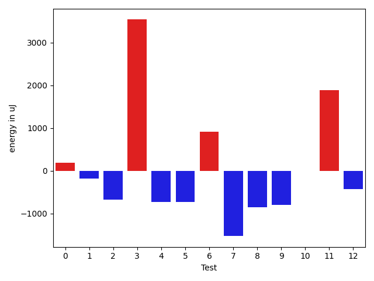
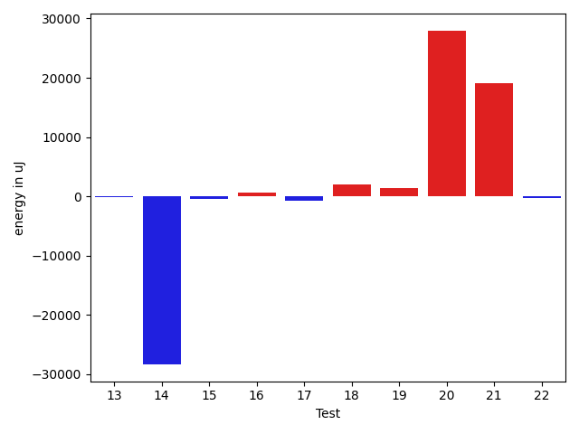

# gson 2250af

https://github.com/google/gson/commit/2250af

## Delta Energy per test method

| ID | EnergyV1 | EnergyV2 | DeltaEnergy | σV1 | σV2 |
| --- | --- | --- | --- | --- | --- |
| 0 | 34057 | 34241 | 184 | 5198.573743395577 | 5430.864377566168 |
| 1 | 96924 | 96740 | -184 | 26353.4666262156 | 28204.12966800356 |
| 2 | 35278 | 34607 | -671 | 16355.209274747096 | 14975.05580183713 |
| 3 | 70068 | 73608 | 3540 | 25166.59587454493 | 24316.552792655206 |
| 4 | 35156 | 34424 | -732 | 12777.196902762757 | 12384.748245902136 |
| 5 | 35706 | 34973 | -733 | 4071.494319092193 | 2788.431005227514 |
| 6 | 35950 | 36865 | 915 | 3394.7717177382565 | 3339.2909653257234 |
| 7 | 39306 | 37780 | -1526 | 49450.071240302634 | 43599.200132327096 |
| 8 | 40039 | 39184 | -855 | 79043.1210093772 | 65103.39283959586 |
| 9 | 38635 | 37842 | -793 | 74589.08246708015 | 76386.35366053553 |
| 10 | 35828 | 35827 | -1 | 3679.8183230968016 | 3156.897833039985 |
| 11 | 33814 | 35705 | 1891 | 3677.1966222110013 | 2600.7256268841934 |
| 12 | 37658 | 37231 | -427 | 2672.124310465086 | 3111.2642279961237 |
| 13 | 37171 | 37110 | -61 | 236603.2965214266 | 277808.89746798907 |
| 14 | 112548 | 84167 | -28381 | 309674.48624382465 | 218251.54421004208 |
| 15 | 40283 | 39917 | -366 | 42112.20837155179 | 31749.99276380212 |
| 16 | 37963 | 38636 | 673 | 38988.293271431685 | 36936.305124047474 |
| 17 | 35217 | 34485 | -732 | 3465.163560139797 | 3951.424737525255 |
| 18 | 38208 | 40161 | 1953 | 714337.0264223317 | 719200.0282342294 |
| 19 | 35705 | 37109 | 1404 | 3456.1203294343873 | 3730.9579785224064 |
| 20 | 83923 | 111939 | 28016 | 53846.10728003406 | 67794.0263532742 |
| 21 | 41504 | 60547 | 19043 | 32173.70122009347 | 37268.869379846816 |
| 22 | 35339 | 35095 | -244 | 3539.8556255695717 | 2993.0739624529115 |

## Delta Duration per test method

| ID | DurationV1 | DurationsV2 | DeltaDuration |
| --- | --- | --- | --- |
| 0 | 1171615.546511628 | 1164127.6296296297 | -7487.916881998302 |
| 1 | 3171091.1717171716 | 3224731.737373737 | 53640.565656565595 |
| 2 | 1617527.8282828282 | 1600485.5959595959 | -17042.23232323234 |
| 3 | 2477508.515151515 | 2515884.9494949495 | 38376.434343434405 |
| 4 | 1517875.4747474748 | 1510126.4444444445 | -7749.030303030275 |
| 5 | 797378.84 | 873094.447368421 | 75715.60736842104 |
| 6 | 994517.4 | 929637.0169491526 | -64880.38305084745 |
| 7 | 2072423.1692307692 | 1728330.546875 | -344092.62235576916 |
| 8 | 2361602.7236842103 | 1932794.676056338 | -428808.0476278723 |
| 9 | 1983560.8101265824 | 2119297.7972972975 | 135736.98717071512 |
| 10 | 1026082.9193548387 | 957568.5357142857 | -68514.38364055299 |
| 11 | 669457.0 | 635307.6764705882 | -34149.323529411806 |
| 12 | 565161.0 | 587397.1304347826 | 22236.130434782594 |
| 13 | 1809845.2033898304 | 3096038.0344827585 | 1286192.831092928 |
| 14 | 5985166.595959596 | 4549264.111111111 | -1435902.4848484853 |
| 15 | 2011372.142857143 | 1663153.0487804879 | -348219.0940766551 |
| 16 | 1898846.8764044943 | 1951941.5679012346 | 53094.69149674033 |
| 17 | 704900.0769230769 | 719299.0857142857 | 14399.00879120885 |
| 18 | 9968434.609756097 | 10628972.48 | 660537.8702439032 |
| 19 | 930692.6774193548 | 847584.84375 | -83107.83366935479 |
| 20 | 3153688.8282828284 | 3805062.0103092785 | 651373.18202645 |
| 21 | 1855907.4375 | 2240673.9759036144 | 384766.5384036144 |
| 22 | 786139.7333333333 | 782924.6470588235 | -3215.086274509784 |

## Misc.

| ID | Test Class | Test Method |
| --- | --- | --- |
| 0 | com.google.gson.functional.ParameterizedTypesTest | testParameterizedTypeGenericArraysSerialization |
| 1 | com.google.gson.functional.ParameterizedTypesTest | testVariableTypeFieldsAndGenericArraysSerialization |
| 2 | com.google.gson.functional.ParameterizedTypesTest | testParameterizedTypeGenericArraysDeserialization |
| 3 | com.google.gson.functional.ParameterizedTypesTest | testVariableTypeFieldsAndGenericArraysDeserialization |
| 4 | com.google.gson.functional.ParameterizedTypesTest | testParameterizedTypeWithVariableTypeDeserialization |
| 5 | com.google.gson.functional.CollectionTest | testRawCollectionSerialization |
| 6 | com.google.gson.functional.CollectionTest | testNullsInListSerialization |
| 7 | com.google.gson.functional.CollectionTest | testCollectionOfBagOfPrimitivesSerialization |
| 8 | com.google.gson.functional.CollectionTest | testTopLevelCollectionOfIntegersSerialization |
| 9 | com.google.gson.functional.CollectionTest | testLinkedListSerialization |
| 10 | com.google.gson.functional.CollectionTest | testQueueSerialization |
| 11 | com.google.gson.functional.CollectionTest | testRawCollectionOfIntegersSerialization |
| 12 | com.google.gson.functional.CollectionTest | testCollectionOfStringsSerialization |
| 13 | com.google.gson.FunctionalWithInternalDependenciesTest | testPrettyPrintListOfPrimitiveArrays |
| 14 | com.google.gson.FunctionalWithInternalDependenciesTest | testPrettyPrintList |
| 15 | com.google.gson.functional.ArrayTest | testArrayOfCollectionSerialization |
| 16 | com.google.gson.functional.CustomTypeAdaptersTest | testCustomAdapterInvokedForCollectionElementSerializationWithType |
| 17 | com.google.gson.functional.CustomTypeAdaptersTest | testCustomAdapterInvokedForCollectionElementSerialization |
| 18 | com.google.gson.functional.PrintFormattingTest | testCompactFormattingLeavesNoWhiteSpace |
| 19 | com.google.gson.functional.DefaultTypeAdaptersTest | testSetSerialization |
| 20 | com.google.gson.functional.ObjectTest | testSubInterfacesOfCollectionSerialization |
| 21 | com.google.gson.functional.ObjectTest | testDirectedAcyclicGraphSerialization |
| 22 | com.google.gson.functional.ObjectTest | testCircularSerialization |

| Test | IterationV1 | IterationV2 | DeltaIteration |
| --- | --- | --- | --- |
| 0 | 86 | 81 | -5 |
| 1 | 99 | 99 | 0 |
| 2 | 99 | 99 | 0 |
| 3 | 99 | 99 | 0 |
| 4 | 99 | 99 | 0 |
| 5 | 50 | 38 | -12 |
| 6 | 60 | 59 | -1 |
| 7 | 65 | 64 | -1 |
| 8 | 76 | 71 | -5 |
| 9 | 79 | 74 | -5 |
| 10 | 62 | 56 | -6 |
| 11 | 25 | 34 | 9 |
| 12 | 22 | 23 | 1 |
| 13 | 59 | 58 | -1 |
| 14 | 99 | 99 | 0 |
| 15 | 84 | 82 | -2 |
| 16 | 89 | 81 | -8 |
| 17 | 26 | 35 | 9 |
| 18 | 82 | 75 | -7 |
| 19 | 31 | 32 | 1 |
| 20 | 99 | 97 | -2 |
| 21 | 80 | 83 | 3 |
| 22 | 45 | 51 | 6 |

| Time Label | Time (s) |
| --- | --- |
| Selection | 22.09535312652588 |
| Injection | 10.033218145370483 |
| Total | 938.708503484726 |

