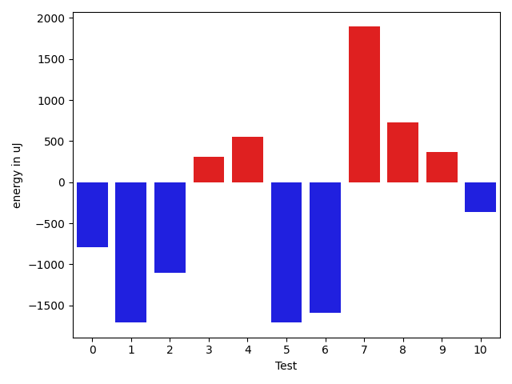
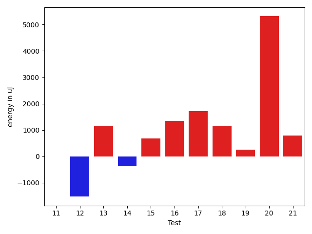
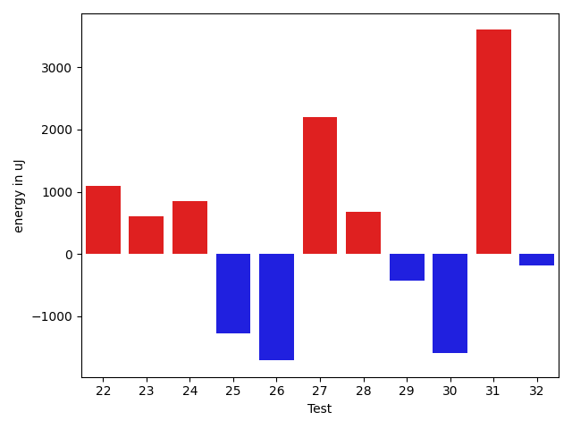
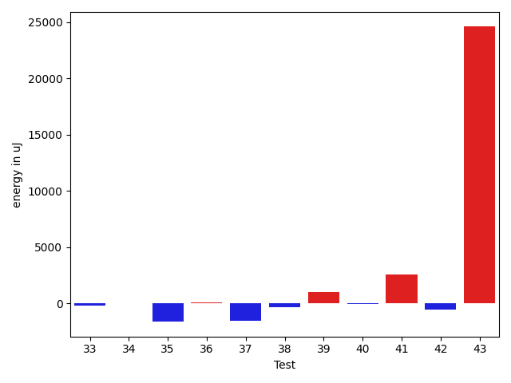
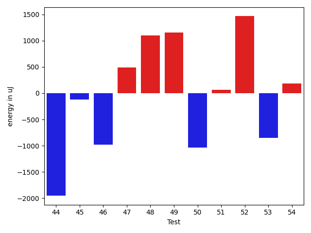
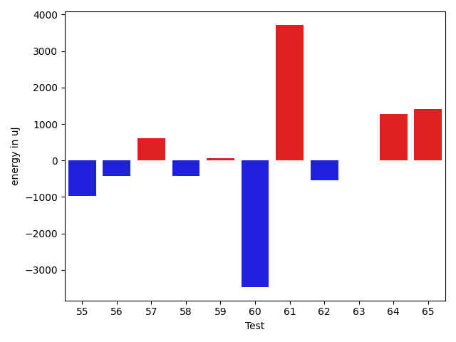
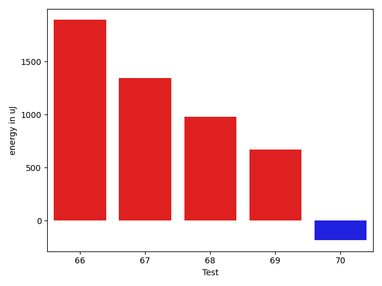

# gson d5319d

https://github.com/google/gson/commit/d5319d

## Delta Energy per test method

| ID | EnergyV1 | EnergyV2 | DeltaEnergy | σV1 | σV2 |
| --- | --- | --- | --- | --- | --- |
| 0 | 36743 | 35950 | -793 | 3612.4475593423676 | 2950.33395798981 |
| 1 | 37598 | 35888 | -1710 | 13706.642855675811 | 3690.5634108629006 |
| 2 | 36743 | 35644 | -1099 | 3450.9967629893927 | 3581.100946878702 |
| 3 | 36255 | 36560 | 305 | 3578.696295138707 | 7694.393087958793 |
| 4 | 34973 | 35522 | 549 | 3136.911575164336 | 3769.751900497478 |
| 5 | 36377 | 34668 | -1709 | 3829.301630636461 | 3825.2008827262753 |
| 6 | 36621 | 35034 | -1587 | 4390.365010095971 | 4659.350822753113 |
| 7 | 34424 | 36316 | 1892 | 2880.289854184941 | 2530.745291330567 |
| 8 | 35095 | 35827 | 732 | 3501.3350875912834 | 4728.903007461586 |
| 9 | 35889 | 36255 | 366 | 3545.557986043658 | 3575.595867816856 |
| 10 | 39063 | 38696 | -367 | 62241.38432639136 | 84409.05792048173 |
| 11 | 35645 | 35645 | 0 | 3408.230927219345 | 3685.148202900902 |
| 12 | 36072 | 34546 | -1526 | 3459.9560623771285 | 3013.124899740901 |
| 13 | 36194 | 37353 | 1159 | 3619.6260837586383 | 3748.8902124903743 |
| 14 | 35583 | 35217 | -366 | 3364.6053691228867 | 2787.555856717671 |
| 15 | 35034 | 35705 | 671 | 4152.386923594346 | 3503.3668092279463 |
| 16 | 36010 | 37353 | 1343 | 2397.862128376776 | 3533.598896270235 |
| 17 | 34484 | 36194 | 1710 | 3444.6434664724175 | 3041.316812816919 |
| 18 | 35401 | 36560 | 1159 | 2866.578594771125 | 3405.9379028004055 |
| 19 | 35583 | 35827 | 244 | 3918.334592312874 | 3745.1036651887493 |
| 20 | 38574 | 43884 | 5310 | 17710.572174901645 | 18201.70287901114 |
| 21 | 35278 | 36072 | 794 | 11673.045069581123 | 13376.138879515112 |
| 22 | 36254 | 37353 | 1099 | 11199.246142931031 | 6007.44836216673 |
| 23 | 35705 | 36316 | 611 | 5162.767380120598 | 3149.739655315093 |
| 24 | 35461 | 36315 | 854 | 3848.0695109005683 | 3545.6358900136015 |
| 25 | 37353 | 36072 | -1281 | 3458.985246819688 | 3983.015290553621 |
| 26 | 36194 | 34485 | -1709 | 4077.772377036488 | 2872.063709878317 |
| 27 | 34058 | 36255 | 2197 | 3743.9183534047975 | 4086.48012902277 |
| 28 | 36865 | 37537 | 672 | 69941.02688540841 | 14281.748330074068 |
| 29 | 37353 | 36926 | -427 | 3605.24892923649 | 4088.4881699802004 |
| 30 | 36498 | 34912 | -1586 | 3668.0064338238462 | 3563.882732222296 |
| 31 | 35340 | 38941 | 3601 | 10974.932450926999 | 24464.047193552946 |
| 32 | 34851 | 34668 | -183 | 13082.931831408796 | 21612.364061070784 |
| 33 | 36377 | 36133 | -244 | 4243.122647621836 | 4566.652495894724 |
| 34 | 37109 | 37110 | 1 | 15891.537377488281 | 76088.67708912776 |
| 35 | 36377 | 34729 | -1648 | 14479.274291000105 | 13795.075694322144 |
| 36 | 35950 | 36011 | 61 | 5888.845719457501 | 8375.920849656906 |
| 37 | 35706 | 34119 | -1587 | 11547.915539879337 | 11637.212813401484 |
| 38 | 36072 | 35706 | -366 | 13356.986111109305 | 15693.194789031479 |
| 39 | 37720 | 38696 | 976 | 63297.242814091725 | 113523.3517500918 |
| 40 | 68481 | 68421 | -60 | 23978.790646185353 | 24551.66886309077 |
| 41 | 35706 | 38269 | 2563 | 14498.357910283192 | 19142.796531704287 |
| 42 | 35522 | 34973 | -549 | 12018.197950661925 | 13363.396027673527 |
| 43 | 39001 | 63599 | 24598 | 19450.598055794813 | 18041.683922729513 |
| 44 | 38269 | 36316 | -1953 | 30470.295683175693 | 7708.388059716372 |
| 45 | 36743 | 36621 | -122 | 3550.7164615796264 | 55527.60104564553 |
| 46 | 39063 | 38085 | -978 | 4216.558596739409 | 9172.106547917057 |
| 47 | 39734 | 40222 | 488 | 50427.573516952696 | 47727.057659212405 |
| 48 | 36866 | 37964 | 1098 | 3758.3858086655596 | 4711.751883533858 |
| 49 | 36377 | 37536 | 1159 | 4274.467484679881 | 5584.973410210376 |
| 50 | 37842 | 36804 | -1038 | 8866.283197429699 | 8550.069728350398 |
| 51 | 38147 | 38208 | 61 | 46220.86765206056 | 48776.02910910731 |
| 52 | 36316 | 37781 | 1465 | 4656.679816105271 | 3642.5272946968926 |
| 53 | 38391 | 37536 | -855 | 3456.214542715452 | 3581.0800198081156 |
| 54 | 38025 | 38207 | 182 | 63819.70878765397 | 59629.83083305561 |
| 55 | 37659 | 36682 | -977 | 3340.7324920096435 | 3030.9245972803574 |
| 56 | 37476 | 37048 | -428 | 4280.1894999824335 | 3897.091394924241 |
| 57 | 35828 | 36438 | 610 | 5949.783158170305 | 3838.9383956912347 |
| 58 | 36682 | 36255 | -427 | 165341.37213068025 | 18645.102055993946 |
| 59 | 37414 | 37476 | 62 | 39476.16278104258 | 35007.37928628902 |
| 60 | 368591 | 365111 | -3480 | 103921.95498452349 | 104102.4649317216 |
| 61 | 65735 | 69457 | 3722 | 58742.17864670679 | 61605.807369054804 |
| 62 | 40161 | 39612 | -549 | 64924.02672363481 | 42754.99057062972 |
| 63 | 36011 | 36011 | 0 | 3494.320166866715 | 3913.0059867781233 |
| 64 | 35340 | 36621 | 1281 | 3523.5981897849188 | 3437.732785289682 |
| 65 | 35217 | 36621 | 1404 | 6113.657133275679 | 3468.874167586343 |
| 66 | 36011 | 37903 | 1892 | 4304.68831928984 | 15102.397625358657 |
| 67 | 37780 | 39123 | 1343 | 62127.244807768766 | 72358.67687289904 |
| 68 | 36255 | 37232 | 977 | 3742.2217488545484 | 34186.218917794926 |
| 69 | 36133 | 36805 | 672 | 3063.9408476794247 | 7372.921427522448 |
| 70 | 39429 | 39245 | -184 | 52781.85527847381 | 66374.03049227913 |

## Delta Duration per test method

| ID | DurationV1 | DurationsV2 | DeltaDuration |
| --- | --- | --- | --- |
| 0 | 498381.0740740741 | 477682.82352941175 | -20698.250544662355 |
| 1 | 1233507.2575757576 | 836662.8 | -396844.4575757575 |
| 2 | 517585.35714285716 | 485383.95454545453 | -32201.40259740263 |
| 3 | 887554.7222222222 | 1015498.4821428572 | 127943.75992063491 |
| 4 | 518820.28 | 550712.7826086957 | 31892.50260869565 |
| 5 | 586267.0555555555 | 528729.5 | -57537.555555555504 |
| 6 | 652512.28125 | 651639.0 | -873.28125 |
| 7 | 566308.0645161291 | 580024.1071428572 | 13716.04262672807 |
| 8 | 750884.7073170731 | 688755.9117647059 | -62128.79555236723 |
| 9 | 543143.7142857143 | 556061.2142857143 | 12917.5 |
| 10 | 1861338.2 | 1955159.2857142857 | 93821.08571428573 |
| 11 | 615360.7307692308 | 541482.375 | -73878.35576923075 |
| 12 | 798901.7111111111 | 714636.3953488372 | -84265.31576227385 |
| 13 | 544587.3333333334 | 530385.5714285715 | -14201.761904761894 |
| 14 | 535317.0833333334 | 545022.5925925926 | 9705.509259259212 |
| 15 | 597534.7407407408 | 561538.1363636364 | -35996.604377104435 |
| 16 | 550421.8947368421 | 511093.2083333333 | -39328.68640350882 |
| 17 | 559445.0277777778 | 542887.8484848485 | -16557.179292929242 |
| 18 | 566234.8666666667 | 626513.5714285715 | 60278.70476190478 |
| 19 | 627403.304347826 | 645169.5357142857 | 17766.23136645963 |
| 20 | 1566510.8387096773 | 1586650.0 | 20139.161290322663 |
| 21 | 1267209.1780821919 | 1293013.2191780822 | 25804.041095890338 |
| 22 | 1128881.0533333332 | 1093832.3026315789 | -35048.750701754354 |
| 23 | 976932.4912280702 | 900928.5081967213 | -76003.98303134891 |
| 24 | 951455.6086956522 | 929713.7704918033 | -21741.83820384892 |
| 25 | 732431.7058823529 | 673270.8333333334 | -59160.87254901952 |
| 26 | 922931.5373134328 | 889753.68 | -33177.85731343273 |
| 27 | 729026.7297297297 | 690912.2 | -38114.52972972975 |
| 28 | 1173557.2127659575 | 797338.1578947369 | -376219.0548712206 |
| 29 | 717971.9024390244 | 713156.0217391305 | -4815.880699893925 |
| 30 | 677377.1034482758 | 622261.2580645161 | -55115.845383759704 |
| 31 | 864958.2702702703 | 1093877.2432432433 | 228918.97297297302 |
| 32 | 905966.7551020408 | 935026.8275862068 | 29060.072484166012 |
| 33 | 736115.1538461539 | 699440.1621621621 | -36674.99168399174 |
| 34 | 899313.6585365854 | 1606024.8484848484 | 706711.189948263 |
| 35 | 1455113.852631579 | 1474227.2842105264 | 19113.431578947464 |
| 36 | 1189179.7922077922 | 1227880.5256410257 | 38700.733433233574 |
| 37 | 1329488.5670103093 | 1359124.1489361702 | 29635.58192586084 |
| 38 | 1508099.1649484537 | 1500656.5408163266 | -7442.624132127035 |
| 39 | 2083307.3608247424 | 3147830.3157894737 | 1064522.9549647314 |
| 40 | 2158746.121212121 | 2289845.6868686867 | 131099.5656565656 |
| 41 | 1415957.4352941175 | 1556596.6304347827 | 140639.19514066516 |
| 42 | 1409565.412371134 | 1396777.3265306123 | -12788.085840521613 |
| 43 | 1675294.8383838383 | 1844426.686868687 | 169131.84848484863 |
| 44 | 1339117.0327868853 | 847548.2093023256 | -491568.82348455966 |
| 45 | 696907.9230769231 | 1147630.175 | 450722.2519230769 |
| 46 | 766612.8205128205 | 839453.2954545454 | 72840.47494172491 |
| 47 | 1536121.7413793104 | 1559763.9649122807 | 23642.223532970296 |
| 48 | 1030484.2297297297 | 1062896.0298507463 | 32411.800121016568 |
| 49 | 795444.9019607843 | 850055.7234042553 | 54610.82144347101 |
| 50 | 1264559.5647058825 | 1300846.8023255814 | 36287.23761969898 |
| 51 | 1556508.7352941176 | 1609532.054054054 | 53023.318759936374 |
| 52 | 726261.9166666666 | 685705.8064516129 | -40556.11021505378 |
| 53 | 755303.5 | 780589.8048780488 | 25286.30487804883 |
| 54 | 1813129.1025641025 | 1705560.935897436 | -107568.16666666651 |
| 55 | 693375.7692307692 | 747315.9523809524 | 53940.18315018318 |
| 56 | 822731.3953488372 | 902799.7045454546 | 80068.30919661734 |
| 57 | 1015347.1060606061 | 1025110.1639344263 | 9763.057873820188 |
| 58 | 1901641.5625 | 1375757.4166666667 | -525884.1458333333 |
| 59 | 1403669.981818182 | 1322469.7611940298 | -81200.2206241521 |
| 60 | 10627631.515151516 | 10448728.696969697 | -178902.81818181835 |
| 61 | 2434352.8080808083 | 2296523.673469388 | -137829.13461142033 |
| 62 | 2049728.705882353 | 1506125.2352941176 | -543603.4705882354 |
| 63 | 794364.6571428571 | 820689.775510204 | 26325.118367346935 |
| 64 | 976422.0833333334 | 976401.8166666667 | -20.266666666720994 |
| 65 | 1069502.7794117648 | 1029764.2777777778 | -39738.50163398706 |
| 66 | 928123.6279069767 | 1073004.125 | 144880.49709302327 |
| 67 | 1740663.894736842 | 2076719.0980392157 | 336055.20330237364 |
| 68 | 790692.84 | 981955.7916666666 | 191262.95166666666 |
| 69 | 779021.3409090909 | 855295.3488372093 | 76274.00792811834 |
| 70 | 1613201.0 | 2020417.25 | 407216.25 |

## Misc.

| ID | Test Class | Test Method |
| --- | --- | --- |
| 0 | com.google.gson.functional.PrimitiveTest | testSmallValueForBigIntegerDeserialization |
| 1 | com.google.gson.functional.PrimitiveTest | testDoubleAsStringRepresentationDeserialization |
| 2 | com.google.gson.functional.PrimitiveTest | testReallyLongValuesDeserialization |
| 3 | com.google.gson.functional.PrimitiveTest | testPrimitiveDoubleAutoboxedDeserialization |
| 4 | com.google.gson.functional.PrimitiveTest | testBigDecimalNoFractAsStringRepresentationDeserialization |
| 5 | com.google.gson.functional.PrimitiveTest | testBigDecimalAsStringRepresentationDeserialization |
| 6 | com.google.gson.functional.PrimitiveTest | testBadValueForBigIntegerDeserialization |
| 7 | com.google.gson.functional.PrimitiveTest | testPrimitiveIntegerAutoboxedDeserialization |
| 8 | com.google.gson.functional.PrimitiveTest | testPrimitiveDoubleAutoboxedInASingleElementArrayDeserialization |
| 9 | com.google.gson.functional.PrimitiveTest | testPrimitiveLongAutoboxedInASingleElementArrayDeserialization |
| 10 | com.google.gson.functional.PrimitiveTest | testNumberDeserialization |
| 11 | com.google.gson.functional.PrimitiveTest | testSmallValueForBigDecimalDeserialization |
| 12 | com.google.gson.functional.PrimitiveTest | testOverridingDefaultPrimitiveSerialization |
| 13 | com.google.gson.functional.PrimitiveTest | testBigIntegerInASingleElementArrayDeserialization |
| 14 | com.google.gson.functional.PrimitiveTest | testPrimitiveLongAutoboxedDeserialization |
| 15 | com.google.gson.functional.PrimitiveTest | testBigDecimalInASingleElementArrayDeserialization |
| 16 | com.google.gson.functional.PrimitiveTest | testBigDecimalDeserialization |
| 17 | com.google.gson.functional.PrimitiveTest | testPrimitiveIntegerAutoboxedInASingleElementArrayDeserialization |
| 18 | com.google.gson.functional.PrimitiveTest | testBigIntegerDeserialization |
| 19 | com.google.gson.functional.PrimitiveTest | testDoubleNoFractAsStringRepresentationDeserialization |
| 20 | com.google.gson.functional.ObjectTest | testArrayOfArraysDeserialization |
| 21 | com.google.gson.functional.ObjectTest | testSubInterfacesOfCollectionDeserialization |
| 22 | com.google.gson.functional.ObjectTest | testArrayOfObjectsDeserialization |
| 23 | com.google.gson.functional.ObjectTest | testNestedDeserialization |
| 24 | com.google.gson.functional.ObjectTest | testInheritenceDeserialization |
| 25 | com.google.gson.functional.ObjectTest | testBagOfPrimitiveWrappersDeserialization |
| 26 | com.google.gson.functional.ObjectTest | testInnerClassDeserialization |
| 27 | com.google.gson.functional.ObjectTest | testClassWithTransientFieldsDeserialization |
| 28 | com.google.gson.functional.ObjectTest | testJsonInMixedQuotesDeserialization |
| 29 | com.google.gson.functional.ObjectTest | testNullFieldsDeserialization |
| 30 | com.google.gson.functional.ObjectTest | testPrivateNoArgConstructorDeserialization |
| 31 | com.google.gson.functional.ObjectTest | testClassWithTransientFieldsDeserializationTransientFieldsPassedInJsonAreIgnored |
| 32 | com.google.gson.functional.ObjectTest | testPrimitiveArrayInAnObjectDeserialization |
| 33 | com.google.gson.functional.ObjectTest | testBagOfPrimitivesDeserialization |
| 34 | com.google.gson.functional.ObjectTest | testJsonInSingleQuotesDeserialization |
| 35 | com.google.gson.functional.ParameterizedTypesTest | testVariableTypeArrayDeserialization |
| 36 | com.google.gson.functional.ParameterizedTypesTest | testParameterizedTypeWithReaderDeserialization |
| 37 | com.google.gson.functional.ParameterizedTypesTest | testVariableTypeDeserialization |
| 38 | com.google.gson.functional.ParameterizedTypesTest | testParameterizedTypeGenericArraysDeserialization |
| 39 | com.google.gson.functional.ParameterizedTypesTest | testParameterizedTypeDeserialization |
| 40 | com.google.gson.functional.ParameterizedTypesTest | testVariableTypeFieldsAndGenericArraysDeserialization |
| 41 | com.google.gson.functional.ParameterizedTypesTest | testTypesWithMultipleParametersDeserialization |
| 42 | com.google.gson.functional.ParameterizedTypesTest | testParameterizedTypeWithVariableTypeDeserialization |
| 43 | com.google.gson.functional.ParameterizedTypesTest | testParameterizedTypesWithCustomDeserializer |
| 44 | com.google.gson.GsonTypeAdapterTest | testDefaultTypeAdapterThrowsParseException |
| 45 | com.google.gson.GsonTypeAdapterTest | testTypeAdapterProperlyConvertsTypes |
| 46 | com.google.gson.GsonTypeAdapterTest | testTypeAdapterThrowsException |
| 47 | com.google.gson.functional.ArrayTest | testTopLevelArrayOfIntsDeserialization |
| 48 | com.google.gson.functional.ArrayTest | testArrayOfCollectionDeserialization |
| 49 | com.google.gson.functional.ArrayTest | testArrayOfPrimitivesWithCustomTypeAdapter |
| 50 | com.google.gson.functional.MapTest | testParameterizedMapSubclassDeserialization |
| 51 | com.google.gson.functional.MapTest | testMapDeserialization |
| 52 | com.google.gson.functional.DefaultTypeAdaptersTest | testBigIntegerFieldDeserialization |
| 53 | com.google.gson.functional.DefaultTypeAdaptersTest | testBigDecimalFieldDeserialization |
| 54 | com.google.gson.functional.VersioningTest | testVersionedClassesDeserialization |
| 55 | com.google.gson.functional.VersioningTest | testIgnoreLaterVersionClassDeserialization |
| 56 | com.google.gson.functional.VersioningTest | testVersionedGsonWithUnversionedClassesDeserialization |
| 57 | com.google.gson.functional.CustomTypeAdaptersTest | testCustomNestedDeserializers |
| 58 | com.google.gson.functional.CustomTypeAdaptersTest | testCustomDeserializerForLong |
| 59 | com.google.gson.functional.CustomTypeAdaptersTest | testCustomDeserializers |
| 60 | com.google.gson.functional.ConcurrencyTest | testMultiThreadDeserialization |
| 61 | com.google.gson.functional.ConcurrencyTest | testSingleThreadDeserialization |
| 62 | com.google.gson.functional.EscapingTest | testEscapingObjectFields |
| 63 | com.google.gson.functional.CollectionTest | testRawCollectionOfBagOfPrimitivesNotAllowed |
| 64 | com.google.gson.functional.CollectionTest | testTopLevelCollectionOfIntegersDeserialization |
| 65 | com.google.gson.functional.CollectionTest | testTopLevelListOfIntegerCollectionsDeserialization |
| 66 | com.google.gson.functional.CollectionTest | testRawCollectionDeserializationNotAlllowed |
| 67 | com.google.gson.functional.ExposeFieldsTest | testExposeAnnotationDeserialization |
| 68 | com.google.gson.functional.ExposeFieldsTest | testNoExposedFieldDeserialization |
| 69 | com.google.gson.functional.NamingPolicyTest | testGsonWithSerializedNameFieldNamingPolicyDeserialization |
| 70 | com.google.gson.functional.ReadersWritersTest | testReaderForDeserialization |

| Test | IterationV1 | IterationV2 | DeltaIteration |
| --- | --- | --- | --- |
| 0 | 27 | 17 | -10 |
| 1 | 66 | 50 | -16 |
| 2 | 28 | 22 | -6 |
| 3 | 54 | 56 | 2 |
| 4 | 25 | 23 | -2 |
| 5 | 18 | 18 | 0 |
| 6 | 32 | 31 | -1 |
| 7 | 31 | 28 | -3 |
| 8 | 41 | 34 | -7 |
| 9 | 28 | 28 | 0 |
| 10 | 60 | 42 | -18 |
| 11 | 26 | 16 | -10 |
| 12 | 45 | 43 | -2 |
| 13 | 33 | 35 | 2 |
| 14 | 24 | 27 | 3 |
| 15 | 27 | 22 | -5 |
| 16 | 19 | 24 | 5 |
| 17 | 36 | 33 | -3 |
| 18 | 30 | 21 | -9 |
| 19 | 23 | 28 | 5 |
| 20 | 93 | 90 | -3 |
| 21 | 73 | 73 | 0 |
| 22 | 75 | 76 | 1 |
| 23 | 57 | 61 | 4 |
| 24 | 69 | 61 | -8 |
| 25 | 34 | 36 | 2 |
| 26 | 67 | 50 | -17 |
| 27 | 37 | 35 | -2 |
| 28 | 47 | 38 | -9 |
| 29 | 41 | 46 | 5 |
| 30 | 29 | 31 | 2 |
| 31 | 37 | 37 | 0 |
| 32 | 49 | 58 | 9 |
| 33 | 39 | 37 | -2 |
| 34 | 41 | 33 | -8 |
| 35 | 95 | 95 | 0 |
| 36 | 77 | 78 | 1 |
| 37 | 97 | 94 | -3 |
| 38 | 97 | 98 | 1 |
| 39 | 97 | 95 | -2 |
| 40 | 99 | 99 | 0 |
| 41 | 85 | 92 | 7 |
| 42 | 97 | 98 | 1 |
| 43 | 99 | 99 | 0 |
| 44 | 61 | 43 | -18 |
| 45 | 26 | 40 | 14 |
| 46 | 39 | 44 | 5 |
| 47 | 58 | 57 | -1 |
| 48 | 74 | 67 | -7 |
| 49 | 51 | 47 | -4 |
| 50 | 85 | 86 | 1 |
| 51 | 68 | 74 | 6 |
| 52 | 36 | 31 | -5 |
| 53 | 36 | 41 | 5 |
| 54 | 78 | 78 | 0 |
| 55 | 39 | 42 | 3 |
| 56 | 43 | 44 | 1 |
| 57 | 66 | 61 | -5 |
| 58 | 80 | 84 | 4 |
| 59 | 55 | 67 | 12 |
| 60 | 99 | 99 | 0 |
| 61 | 99 | 98 | -1 |
| 62 | 68 | 68 | 0 |
| 63 | 35 | 49 | 14 |
| 64 | 60 | 60 | 0 |
| 65 | 68 | 72 | 4 |
| 66 | 43 | 56 | 13 |
| 67 | 38 | 51 | 13 |
| 68 | 50 | 48 | -2 |
| 69 | 44 | 43 | -1 |
| 70 | 56 | 40 | -16 |

| Time Label | Time (s) |
| --- | --- |
| Selection | 21.54865074157715 |
| Injection | 10.357791662216187 |
| Total | 964.9632861614227 |

