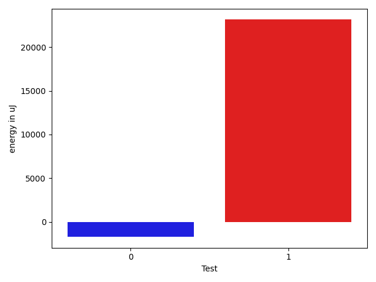

# gson 628a2c

https://github.com/google/gson/commit/628a2c

## Delta Energy per test method

| ID | EnergyV1 | EnergyV2 | DeltaEnergy | σV1 | σV2 |
| --- | --- | --- | --- | --- | --- |
| 0 | 35949 | 34241 | -1708 | 242825.71342610783 | 282304.32328468666 |
| 1 | 43090 | 66223 | 23133 | 466572.9195098186 | 603910.4082271785 |

## Delta Duration per test method

| ID | DurationV1 | DurationsV2 | DeltaDuration |
| --- | --- | --- | --- |
| 0 | 3168757.936170213 | 3598170.393258427 | 429412.4570882139 |
| 1 | 7865423.212121212 | 12767309.888888888 | 4901886.676767676 |

## Misc.

| ID | Test Class | Test Method |
| --- | --- | --- |
| 0 | com.google.gson.FunctionalWithInternalDependenciesTest | testAnonymousLocalClassesSerialization |
| 1 | com.google.gson.FunctionalWithInternalDependenciesTest | testPrettyPrintArrayOfObjects |

| Test | IterationV1 | IterationV2 | DeltaIteration |
| --- | --- | --- | --- |
| 0 | 94 | 89 | -5 |
| 1 | 99 | 99 | 0 |

| Time Label | Time (s) |
| --- | --- |
| Selection | 21.99734663963318 |
| Injection | 7.852405309677124 |
| Total | 901.1448340415955 |

