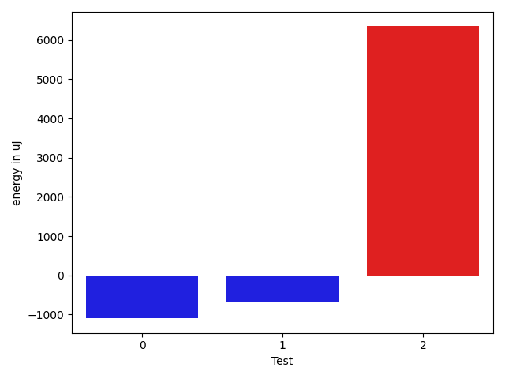

# gson 788d2b

https://github.com/google/gson/commit/788d2b

## Delta Energy per test method

| ID | EnergyV1 | EnergyV2 | DeltaEnergy | σV1 | σV2 |
| --- | --- | --- | --- | --- | --- |
| 0 | 36255 | 35156 | -1099 | 25549.01482327645 | 3769.4456308695626 |
| 1 | 37476 | 36804 | -672 | 4029.616789975003 | 2627.0524862347343 |
| 2 | 324401 | 330749 | 6348 | 164205.3333965255 | 172749.15279415404 |

## Delta Duration per test method

| ID | DurationV1 | DurationsV2 | DeltaDuration |
| --- | --- | --- | --- |
| 0 | 1005921.5666666667 | 882184.5428571429 | -123737.02380952379 |
| 1 | 765256.1176470588 | 740035.074074074 | -25221.043572984752 |
| 2 | 7767997.323232323 | 7363970.204081632 | -404027.11915069073 |

## Misc.

| ID | Test Class | Test Method |
| --- | --- | --- |
| 0 | com.google.gson.functional.PrimitiveTest | testBigDecimalDeserialization |
| 1 | com.google.gson.functional.PrimitiveTest | testBigDecimalInASingleElementArrayDeserialization |
| 2 | com.google.gson.functional.DefaultTypeAdaptersTest | testBigDecimalFieldDeserialization |

| Test | IterationV1 | IterationV2 | DeltaIteration |
| --- | --- | --- | --- |
| 0 | 30 | 35 | 5 |
| 1 | 34 | 27 | -7 |
| 2 | 99 | 98 | -1 |

| Time Label | Time (s) |
| --- | --- |
| Selection | 21.970951557159424 |
| Injection | 7.944886922836304 |
| Total | 906.6562259197235 |

