# gson cf2a45

https://github.com/google/gson/commit/cf2a45

## Delta Energy per test method

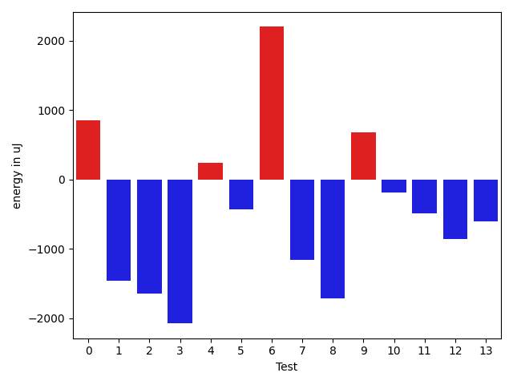

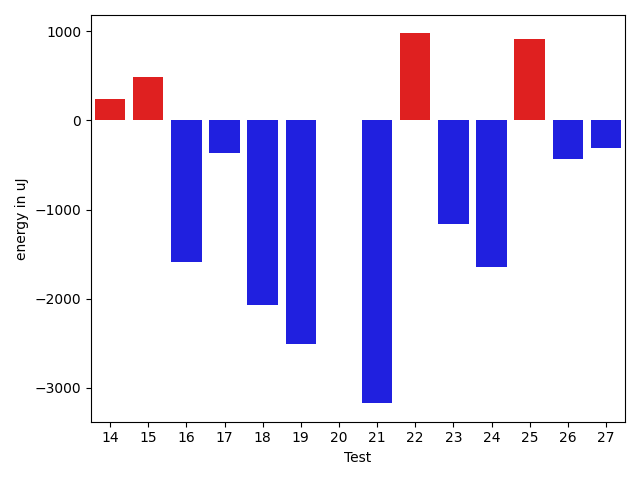

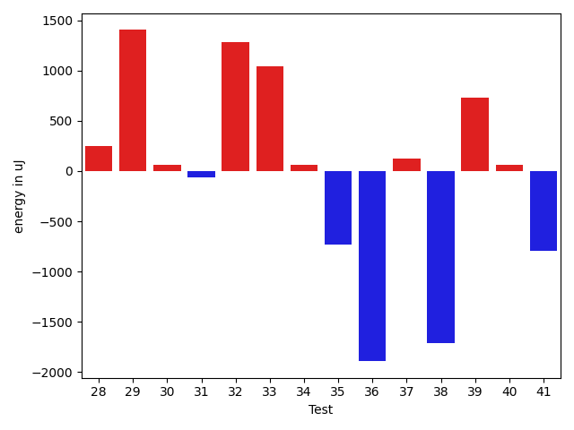

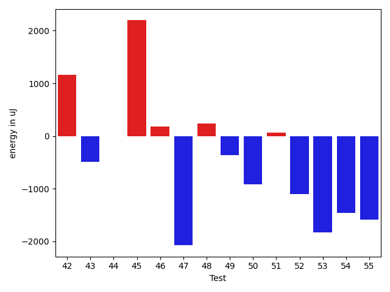

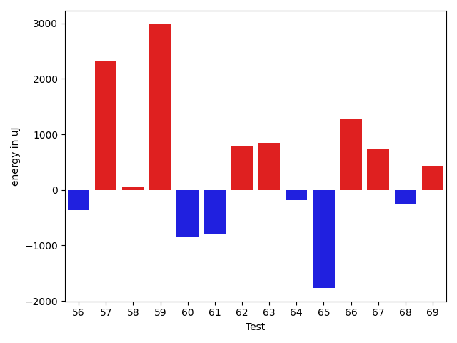

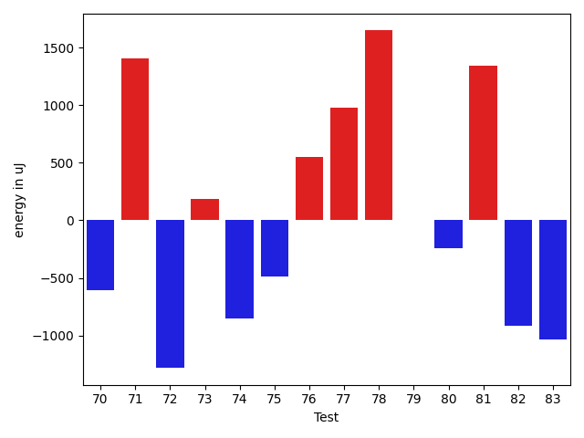

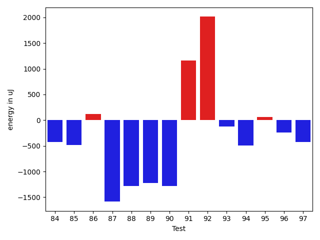

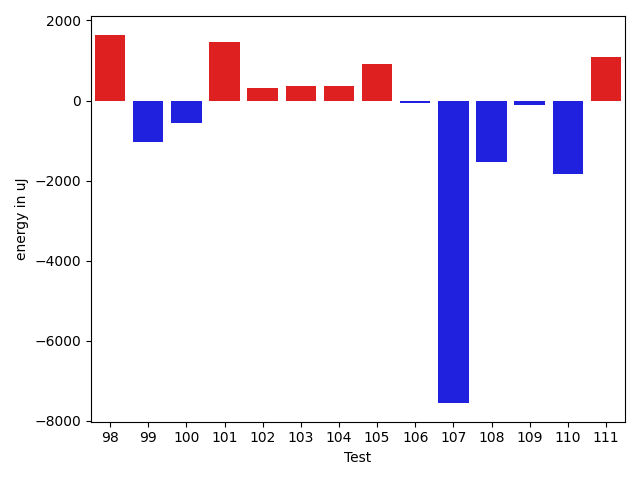

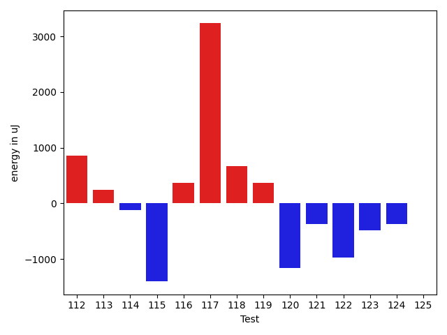

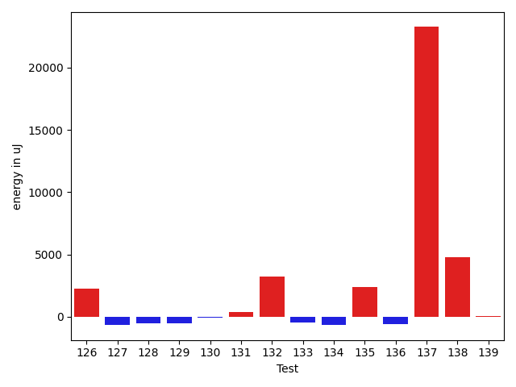

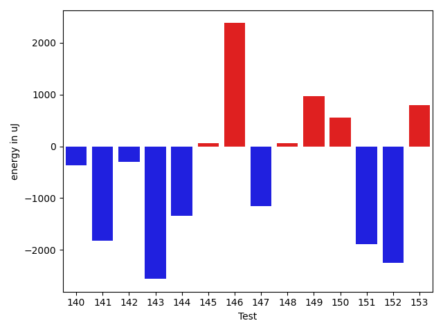

| ID | EnergyV1 | EnergyV2 | DeltaEnergy | σV1 | σV2 |
| --- | --- | --- | --- | --- | --- |
| 0 | 33508 | 34363 | 855 | 7401.524653312859 | 8765.30516292336 |
| 1 | 35095 | 33630 | -1465 | 3969.050880802428 | 6562.536634243558 |
| 2 | 35461 | 33814 | -1647 | 8338.852540345219 | 3731.628214984502 |
| 3 | 37475 | 35400 | -2075 | 210897.96865619186 | 25435.468195723148 |
| 4 | 35828 | 36072 | 244 | 254823.46123800153 | 347315.34425642755 |
| 5 | 35705 | 35278 | -427 | 24529.188918458232 | 4304.357546536734 |
| 6 | 66406 | 68603 | 2197 | 20728.657168770198 | 23347.896350652583 |
| 7 | 35522 | 34363 | -1159 | 3506.4754731449802 | 2851.911626167506 |
| 8 | 35828 | 34118 | -1710 | 36221.257900805525 | 30452.91513563007 |
| 9 | 35278 | 35950 | 672 | 36268.41452585814 | 53940.15251032767 |
| 10 | 35523 | 35339 | -184 | 10844.468175922446 | 12936.928564324293 |
| 11 | 34790 | 34301 | -489 | 8287.631038653759 | 7476.372892796123 |
| 12 | 34485 | 33630 | -855 | 3302.454305058256 | 5657.529792328118 |
| 13 | 34485 | 33875 | -610 | 7656.064270508008 | 5577.955496954775 |
| 14 | 34058 | 34301 | 243 | 4332.01221374885 | 4161.584286895752 |
| 15 | 37780 | 38269 | 489 | 15643.168430837648 | 11276.000015697338 |
| 16 | 36316 | 34729 | -1587 | 3882.0149433577512 | 3642.6658218316998 |
| 17 | 37170 | 36804 | -366 | 388329.22057664196 | 363155.8057586609 |
| 18 | 36255 | 34179 | -2076 | 4069.9534311767097 | 3833.8980299080254 |
| 19 | 39673 | 37170 | -2503 | 28930.75487186702 | 20426.269294304497 |
| 20 | 35522 | 35522 | 0 | 4012.088276728797 | 4051.6060249331354 |
| 21 | 37353 | 34180 | -3173 | 4328.416860529785 | 4026.101316403871 |
| 22 | 37110 | 38086 | 976 | 41146.83363018266 | 42239.67668266316 |
| 23 | 39795 | 38636 | -1159 | 54984.819445977664 | 35404.75750528148 |
| 24 | 36560 | 34912 | -1648 | 4427.194422590721 | 3738.285287252551 |
| 25 | 36926 | 37841 | 915 | 15347.287132161813 | 16702.840473374585 |
| 26 | 34546 | 34119 | -427 | 5555.35347995867 | 15298.297462411947 |
| 27 | 35950 | 35644 | -306 | 3720.7485327714244 | 2778.494129828171 |
| 28 | 35461 | 35706 | 245 | 3476.924271536554 | 2985.46346090333 |
| 29 | 37293 | 38696 | 1403 | 128698.60114729553 | 104898.3925599328 |
| 30 | 34973 | 35034 | 61 | 3196.2362079247196 | 3366.650456225 |
| 31 | 35156 | 35095 | -61 | 3782.1975206830352 | 6980.55265595557 |
| 32 | 32776 | 34058 | 1282 | 3604.256068072393 | 3415.3981313060303 |
| 33 | 33203 | 34241 | 1038 | 3162.32380802157 | 3327.9396451220946 |
| 34 | 34118 | 34180 | 62 | 8666.703045187909 | 3454.002494240575 |
| 35 | 35522 | 34790 | -732 | 5310.340812577387 | 7335.879014786245 |
| 36 | 36804 | 34913 | -1891 | 89047.15372476078 | 4280.540594104649 |
| 37 | 35461 | 35583 | 122 | 3877.932246505559 | 3711.9732687285214 |
| 38 | 36499 | 34790 | -1709 | 80480.8015633591 | 52701.79441329977 |
| 39 | 34912 | 35644 | 732 | 3239.2154546033553 | 3646.697050961032 |
| 40 | 34363 | 34424 | 61 | 3584.925550028277 | 6286.469142929979 |
| 41 | 34668 | 33875 | -793 | 6821.35115406688 | 3703.405422599304 |
| 42 | 33447 | 34607 | 1160 | 2980.762096002944 | 3361.5088969497333 |
| 43 | 35645 | 35156 | -489 | 2475.419206298921 | 4021.0592568998527 |
| 44 | 34790 | 34790 | 0 | 7273.685659348079 | 2341.29157687245 |
| 45 | 33997 | 36193 | 2196 | 3102.022445115444 | 3574.3205801067984 |
| 46 | 32959 | 33142 | 183 | 4147.400961470581 | 2830.5395370422975 |
| 47 | 36682 | 34607 | -2075 | 3578.539033016415 | 3626.4277413297423 |
| 48 | 33936 | 34179 | 243 | 13057.376846418081 | 12193.614812112535 |
| 49 | 33753 | 33386 | -367 | 7228.687338603047 | 6364.387327936602 |
| 50 | 35584 | 34668 | -916 | 12502.36663106415 | 11347.241609966626 |
| 51 | 33813 | 33874 | 61 | 8881.701381339273 | 9189.763308522512 |
| 52 | 36011 | 34912 | -1099 | 13698.014273824452 | 13018.131483849733 |
| 53 | 36682 | 34851 | -1831 | 85205.9732954927 | 79947.46247296203 |
| 54 | 65307 | 63843 | -1464 | 30482.75327488694 | 29846.913605375663 |
| 55 | 35706 | 34118 | -1588 | 13402.806519709144 | 13036.320379969795 |
| 56 | 34301 | 33936 | -365 | 11629.85206465702 | 11039.62997917064 |
| 57 | 34546 | 36866 | 2320 | 12895.823396573574 | 17833.454160606096 |
| 58 | 79284 | 79345 | 61 | 191505.4852171693 | 195211.88055136544 |
| 59 | 72693 | 75684 | 2991 | 52705.09912640028 | 53700.655634068586 |
| 60 | 35827 | 34973 | -854 | 32194.43524501016 | 35195.46867896287 |
| 61 | 36621 | 35827 | -794 | 3644.5662308018973 | 3670.87189902119 |
| 62 | 36988 | 37781 | 793 | 4149.217472025935 | 32205.279468813787 |
| 63 | 34974 | 35827 | 853 | 3398.4248502825176 | 3591.1920343390157 |
| 64 | 36254 | 36072 | -182 | 2902.9313474767646 | 3910.6115720285943 |
| 65 | 39429 | 37659 | -1770 | 102941.19846344244 | 77198.49979946557 |
| 66 | 34912 | 36193 | 1281 | 3180.597212395811 | 2908.1038502478777 |
| 67 | 35950 | 36682 | 732 | 3994.9373316766396 | 3939.4333233462535 |
| 68 | 36621 | 36377 | -244 | 3083.4763955799576 | 3572.6388922365204 |
| 69 | 35339 | 35767 | 428 | 2958.6949085027336 | 3215.686573484563 |
| 70 | 36194 | 35584 | -610 | 3361.221618018083 | 3676.1254807201562 |
| 71 | 36926 | 38330 | 1404 | 3867.1577241798223 | 3638.5998624028016 |
| 72 | 35645 | 34363 | -1282 | 3925.739682558259 | 3881.054086777547 |
| 73 | 37781 | 37963 | 182 | 43732.958094119815 | 48023.177182063024 |
| 74 | 35278 | 34424 | -854 | 3799.9865673056606 | 3709.336516658991 |
| 75 | 36194 | 35706 | -488 | 3982.4362920772373 | 3985.963251174718 |
| 76 | 34912 | 35462 | 550 | 3836.365128055339 | 4348.649400931538 |
| 77 | 34241 | 35218 | 977 | 4050.7353201661113 | 2926.8516416487905 |
| 78 | 34668 | 36315 | 1647 | 3357.7890451111048 | 3576.1657290780367 |
| 79 | 34790 | 34790 | 0 | 3944.8781653112314 | 3616.327552719311 |
| 80 | 36437 | 36194 | -243 | 3299.2357660669204 | 3500.3705066969123 |
| 81 | 36010 | 37353 | 1343 | 4100.774260468206 | 3846.1328474697143 |
| 82 | 37171 | 36254 | -917 | 53458.25846917474 | 49122.44676255034 |
| 83 | 38574 | 37536 | -1038 | 75410.09387618431 | 73401.64183064076 |
| 84 | 36438 | 36010 | -428 | 4059.919863123249 | 3362.5156956495293 |
| 85 | 35217 | 34729 | -488 | 4019.1695019362046 | 3312.46366892657 |
| 86 | 35584 | 35705 | 121 | 8969.411783121963 | 7694.794542210464 |
| 87 | 35766 | 34180 | -1586 | 3556.7838114883734 | 3584.9573464004006 |
| 88 | 35889 | 34607 | -1282 | 2624.6832603082125 | 3556.429374797229 |
| 89 | 35523 | 34302 | -1221 | 3420.5840811741505 | 3477.785575181336 |
| 90 | 37658 | 36377 | -1281 | 12220.41337512594 | 4265.772858650261 |
| 91 | 33691 | 34851 | 1160 | 2582.9265976008205 | 3756.979309894006 |
| 92 | 35278 | 37292 | 2014 | 3467.0233511746105 | 3157.9630048713448 |
| 93 | 35156 | 35034 | -122 | 3258.8053455448107 | 3265.702307463987 |
| 94 | 34912 | 34423 | -489 | 3711.556095023061 | 3484.3567772009865 |
| 95 | 38025 | 38086 | 61 | 38426.559082676125 | 35782.61205047956 |
| 96 | 36316 | 36072 | -244 | 3664.266569262155 | 4051.813284521185 |
| 97 | 35522 | 35095 | -427 | 3825.7743333866415 | 4233.3922641640165 |
| 98 | 36682 | 38330 | 1648 | 3423.638521864577 | 3687.963868710427 |
| 99 | 34546 | 33508 | -1038 | 3209.0841885867603 | 3423.530289783008 |
| 100 | 35645 | 35095 | -550 | 3141.9089342094326 | 3688.4598085972398 |
| 101 | 34118 | 35583 | 1465 | 3450.9111339356436 | 4187.289654000883 |
| 102 | 36376 | 36682 | 306 | 3597.037635155419 | 3912.766663012717 |
| 103 | 35583 | 35950 | 367 | 3738.2796096479055 | 2689.6434553053064 |
| 104 | 36377 | 36744 | 367 | 10143.954648152638 | 12196.797819873182 |
| 105 | 36804 | 37719 | 915 | 54699.382597917334 | 51186.41030401403 |
| 106 | 37049 | 36987 | -62 | 43222.82792360433 | 60906.706641265344 |
| 107 | 136230 | 128662 | -7568 | 302194.2785496532 | 338106.253595827 |
| 108 | 36987 | 35462 | -1525 | 3863.448005501166 | 3648.9955114404816 |
| 109 | 35034 | 34912 | -122 | 3678.17333381398 | 3610.575410931711 |
| 110 | 38452 | 36621 | -1831 | 43597.576387144494 | 44882.254074828954 |
| 111 | 35767 | 36865 | 1098 | 3565.7118917217417 | 3659.9143385490925 |
| 112 | 38086 | 38940 | 854 | 58255.382499856874 | 63090.83842498146 |
| 113 | 38086 | 38330 | 244 | 4680.313757724828 | 3805.760697889451 |
| 114 | 35523 | 35401 | -122 | 3616.2779598060315 | 3234.016182189982 |
| 115 | 37536 | 36133 | -1403 | 3920.5247403465546 | 3659.497424830867 |
| 116 | 35645 | 36010 | 365 | 166760.43788441198 | 4042.9921553720583 |
| 117 | 64820 | 68054 | 3234 | 71837.19562518303 | 157555.94864857302 |
| 118 | 35400 | 36072 | 672 | 19009.634151306396 | 162157.85994900527 |
| 119 | 37048 | 37414 | 366 | 191460.4610682154 | 180548.63750992392 |
| 120 | 36133 | 34973 | -1160 | 4294.630767971462 | 3992.968834209626 |
| 121 | 37597 | 37231 | -366 | 231009.68283823263 | 3718.3567806127744 |
| 122 | 37780 | 36804 | -976 | 229214.9207013679 | 195839.0201838143 |
| 123 | 33386 | 32898 | -488 | 7972.080544155334 | 5231.097916758881 |
| 124 | 35340 | 34973 | -367 | 2921.768115091844 | 3412.4773766869134 |
| 125 | 142639 | 142639 | 0 | 28299.920959007883 | 25133.471441553746 |
| 126 | 35888 | 38146 | 2258 | 3606.8081500892267 | 34882.42009572121 |
| 127 | 33631 | 32959 | -672 | 3180.2805058363124 | 3471.4535649445943 |
| 128 | 36377 | 35827 | -550 | 9784.810993584497 | 35912.9087961886 |
| 129 | 33814 | 33264 | -550 | 3782.9745667242646 | 3795.219792200593 |
| 130 | 35339 | 35278 | -61 | 3916.9190076158357 | 3647.2041001654798 |
| 131 | 32776 | 33142 | 366 | 4132.221537248372 | 3315.753231741116 |
| 132 | 34301 | 37536 | 3235 | 3827.6263787888797 | 7375.840018438578 |
| 133 | 34241 | 33753 | -488 | 3646.2657354399003 | 3659.6233539765435 |
| 134 | 35461 | 34790 | -671 | 3174.4346642426985 | 4090.1944039644645 |
| 135 | 34851 | 37231 | 2380 | 3368.6277562235937 | 4853.821781146902 |
| 136 | 35888 | 35278 | -610 | 3628.74111245546 | 4197.325700794347 |
| 137 | 319213 | 342467 | 23254 | 88296.3905839454 | 96299.96625762372 |
| 138 | 39551 | 44311 | 4760 | 49041.41609432069 | 54708.086227403655 |
| 139 | 37353 | 37414 | 61 | 51665.11912863547 | 46558.85637745012 |
| 140 | 36560 | 36194 | -366 | 97243.68055164417 | 117231.73481429488 |
| 141 | 72510 | 70679 | -1831 | 28764.046117220154 | 26039.084471644088 |
| 142 | 36132 | 35827 | -305 | 3747.965288322337 | 3493.761982907519 |
| 143 | 36865 | 34302 | -2563 | 3586.2567235485576 | 2915.782010638658 |
| 144 | 39185 | 37842 | -1343 | 86199.62892756557 | 78480.87187829686 |
| 145 | 37414 | 37475 | 61 | 392737.28650886996 | 312770.5356437571 |
| 146 | 34912 | 37293 | 2381 | 11441.987902608309 | 11987.783148955807 |
| 147 | 38208 | 37049 | -1159 | 52412.5623165716 | 40837.18519646522 |
| 148 | 35461 | 35522 | 61 | 3655.3191773203525 | 3702.786089779784 |
| 149 | 35706 | 36682 | 976 | 4084.976405737738 | 3762.257913593702 |
| 150 | 35095 | 35645 | 550 | 6137.832252992248 | 3879.704829382167 |
| 151 | 38758 | 36866 | -1892 | 4679.930661137572 | 3063.7718338022496 |
| 152 | 37415 | 35156 | -2259 | 3885.7046609357926 | 3603.493867583368 |
| 153 | 35767 | 36560 | 793 | 542502.365217045 | 727190.304528911 |

## Delta Duration per test method

| ID | DurationV1 | DurationsV2 | DeltaDuration |
| --- | --- | --- | --- |
| 0 | 855010.7192982456 | 903903.6607142857 | 48892.94141604006 |
| 1 | 885033.7575757576 | 898889.8703703703 | 13856.112794612767 |
| 2 | 1099793.763888889 | 1118524.4473684211 | 18730.683479532134 |
| 3 | 1908655.6119402985 | 1239429.7246376812 | -669225.8873026173 |
| 4 | 2797412.606557377 | 3792020.0862068967 | 994607.4796495195 |
| 5 | 1011926.5254237289 | 960110.109375 | -51816.41604872886 |
| 6 | 2196121.8571428573 | 2229472.585858586 | 33350.7287157285 |
| 7 | 494380.5263157895 | 466179.21428571426 | -28201.312030075234 |
| 8 | 1659320.5833333333 | 1421573.2098765431 | -237747.3734567901 |
| 9 | 1172377.06779661 | 1468578.9672131147 | 296201.89941650466 |
| 10 | 1161073.3333333333 | 1228382.0595238095 | 67308.72619047621 |
| 11 | 983621.6 | 1046993.0 | 63371.40000000002 |
| 12 | 1031205.2162162162 | 1050425.2777777778 | 19220.06156156154 |
| 13 | 847749.8958333334 | 878290.4385964912 | 30540.542763157864 |
| 14 | 473533.64705882355 | 505057.39130434784 | 31523.744245524285 |
| 15 | 1166373.261904762 | 1045744.5106382979 | -120628.75126646401 |
| 16 | 574759.2972972973 | 537297.1785714285 | -37462.11872586876 |
| 17 | 5958991.133333334 | 5968557.666666667 | 9566.53333333321 |
| 18 | 772402.4347826086 | 780054.5625 | 7652.127717391355 |
| 19 | 1568417.6046511629 | 1380864.9166666667 | -187552.68798449612 |
| 20 | 744510.2826086957 | 723895.0943396227 | -20615.188269073027 |
| 21 | 584184.7777777778 | 528545.5714285715 | -55639.20634920627 |
| 22 | 1455351.375 | 1131567.9615384615 | -323783.4134615385 |
| 23 | 1706768.0322580645 | 1242690.0882352942 | -464077.9440227703 |
| 24 | 579702.1111111111 | 553402.8 | -26299.311111111077 |
| 25 | 1473780.5 | 1437831.043956044 | -35949.4560439561 |
| 26 | 1115552.6133333333 | 1216996.5324675324 | 101443.91913419915 |
| 27 | 536107.0322580645 | 557278.0869565217 | 21171.054698457243 |
| 28 | 616909.45 | 646534.1388888889 | 29624.688888888923 |
| 29 | 1930176.7272727273 | 2267064.638297872 | 336887.91102514486 |
| 30 | 840842.448275862 | 855904.06 | 15061.611724138027 |
| 31 | 1003865.8524590164 | 978958.328125 | -24907.524334016372 |
| 32 | 603438.8378378379 | 604558.4705882353 | 1119.6327503974317 |
| 33 | 716960.619047619 | 720733.8723404255 | 3773.2532928064466 |
| 34 | 832609.5 | 826801.0243902439 | -5808.475609756075 |
| 35 | 1011025.1549295775 | 1030388.1492537314 | 19362.99432415387 |
| 36 | 1338945.6363636365 | 589567.1388888889 | -749378.4974747476 |
| 37 | 657201.7777777778 | 668566.2571428572 | 11364.47936507943 |
| 38 | 1313534.5609756098 | 996093.6590909091 | -317440.90188470075 |
| 39 | 657286.717948718 | 663174.2647058824 | 5887.546757164411 |
| 40 | 783915.0185185185 | 845701.8596491228 | 61786.84113060427 |
| 41 | 870692.0980392157 | 859416.8275862068 | -11275.270453008823 |
| 42 | 489643.347826087 | 527792.1739130435 | 38148.826086956484 |
| 43 | 465345.77777777775 | 442783.2 | -22562.57777777774 |
| 44 | 627421.5 | 519696.63636363635 | -107724.86363636365 |
| 45 | 438660.05555555556 | 450519.6875 | 11859.631944444438 |
| 46 | 502003.03846153844 | 548806.3548387097 | 46803.31637717126 |
| 47 | 652952.2258064516 | 604443.0625 | -48509.163306451635 |
| 48 | 1364036.25 | 1348143.085106383 | -15893.164893616922 |
| 49 | 1098775.626506024 | 1080395.85 | -18379.776506023947 |
| 50 | 1341381.925531915 | 1323678.030927835 | -17703.89460407989 |
| 51 | 1284358.9777777777 | 1257137.8666666667 | -27221.111111111008 |
| 52 | 1443589.3854166667 | 1403775.612244898 | -39813.77317176876 |
| 53 | 2158944.7555555557 | 2149498.797752809 | -9445.95780274691 |
| 54 | 2234308.6767676766 | 2116474.909090909 | -117833.76767676743 |
| 55 | 1372102.2747252746 | 1350821.2906976745 | -21280.98402760015 |
| 56 | 1339782.3195876288 | 1298213.569892473 | -41568.74969515577 |
| 57 | 1347386.3695652173 | 1616583.0808080807 | 269196.71124286344 |
| 58 | 3634557.1414141413 | 3524765.101010101 | -109792.04040404037 |
| 59 | 2732127.02020202 | 2943321.6464646463 | 211194.62626262615 |
| 60 | 1026635.6842105263 | 1019756.552631579 | -6879.131578947301 |
| 61 | 629545.1034482758 | 703736.3125 | 74191.20905172417 |
| 62 | 530332.9545454546 | 706164.9047619047 | 175831.95021645015 |
| 63 | 644039.9230769231 | 452234.8 | -191805.12307692313 |
| 64 | 484860.2380952381 | 432812.0 | -52048.238095238106 |
| 65 | 2882722.0 | 1505174.34375 | -1377547.65625 |
| 66 | 469524.95 | 425857.96428571426 | -43666.98571428575 |
| 67 | 626558.8076923077 | 533039.5 | -93519.30769230775 |
| 68 | 474631.0 | 452259.8888888889 | -22371.111111111124 |
| 69 | 560296.24 | 480887.625 | -79408.61499999999 |
| 70 | 477286.6111111111 | 435741.0 | -41545.611111111124 |
| 71 | 475910.3870967742 | 412929.1818181818 | -62981.20527859236 |
| 72 | 840746.1481481482 | 832288.8301886793 | -8457.317959468928 |
| 73 | 1514746.5571428572 | 1588202.7647058824 | 73456.20756302518 |
| 74 | 804767.387755102 | 794157.6153846154 | -10609.772370486637 |
| 75 | 929556.4576271187 | 889472.3787878788 | -40084.0788392399 |
| 76 | 956770.3698630137 | 978911.6 | 22141.23013698624 |
| 77 | 827977.0877192982 | 771835.0 | -56142.0877192982 |
| 78 | 777737.2105263158 | 761292.1219512195 | -16445.088575096335 |
| 79 | 769936.1875 | 798820.393442623 | 28884.205942622968 |
| 80 | 763155.5609756098 | 754142.6744186047 | -9012.886557005113 |
| 81 | 706172.4210526316 | 738774.1904761905 | 32601.76942355896 |
| 82 | 1679311.4411764706 | 1381049.2857142857 | -298262.1554621849 |
| 83 | 2065843.5 | 1783372.754385965 | -282470.74561403506 |
| 84 | 608068.9411764706 | 639897.2424242424 | 31828.30124777183 |
| 85 | 593542.2058823529 | 626048.2352941176 | 32506.0294117647 |
| 86 | 695628.7307692308 | 665703.9393939395 | -29924.7913752913 |
| 87 | 716064.7906976744 | 629152.6 | -86912.1906976744 |
| 88 | 466355.5 | 469469.3043478261 | 3113.8043478261097 |
| 89 | 621813.0909090909 | 573172.9189189189 | -48640.171990172006 |
| 90 | 887887.5952380953 | 547246.7083333334 | -340640.8869047619 |
| 91 | 431761.6875 | 451108.347826087 | 19346.660326086974 |
| 92 | 599602.4210526316 | 493671.7619047619 | -105930.65914786968 |
| 93 | 600540.5581395349 | 626910.9756097561 | 26370.417470221175 |
| 94 | 472446.5652173913 | 441472.95454545453 | -30973.610671936767 |
| 95 | 964524.8 | 945844.4210526316 | -18680.378947368474 |
| 96 | 693942.2571428572 | 616365.7297297297 | -77576.52741312748 |
| 97 | 478179.43333333335 | 472292.4705882353 | -5886.962745098048 |
| 98 | 527070.6666666666 | 515440.55555555556 | -11630.111111111066 |
| 99 | 659591.5405405406 | 658162.9722222222 | -1428.5683183183428 |
| 100 | 496263.0 | 485146.61904761905 | -11116.380952380947 |
| 101 | 579599.6296296297 | 519086.17391304346 | -60513.455716586206 |
| 102 | 531835.75 | 493784.78571428574 | -38050.96428571426 |
| 103 | 431516.85714285716 | 409795.5 | -21721.35714285716 |
| 104 | 1152816.9268292682 | 1165932.3766233767 | 13115.449794108514 |
| 105 | 1526674.8620689656 | 1360194.5161290322 | -166480.34593993332 |
| 106 | 1447753.358974359 | 1770103.1866666668 | 322349.82769230776 |
| 107 | 6428174.948979592 | 7004506.676767677 | 576331.7277880851 |
| 108 | 660796.3125 | 663015.2702702703 | 2218.9577702702954 |
| 109 | 675622.2444444444 | 809915.8888888889 | 134293.64444444445 |
| 110 | 1439310.4791666667 | 1676549.7 | 237239.2208333332 |
| 111 | 593162.1818181818 | 683212.724137931 | 90050.54231974925 |
| 112 | 1661004.543478261 | 1668808.0 | 7803.456521739019 |
| 113 | 423308.6666666667 | 456710.28 | 33401.61333333334 |
| 114 | 526210.5555555555 | 559064.0952380953 | 32853.53968253976 |
| 115 | 522691.4090909091 | 490142.6875 | -32548.721590909117 |
| 116 | 1525363.8409090908 | 752899.24 | -772464.6009090908 |
| 117 | 2560213.551020408 | 3155370.3333333335 | 595156.7823129254 |
| 118 | 1038425.9016393443 | 1630281.5625 | 591855.6608606557 |
| 119 | 1712591.0909090908 | 1473937.357142857 | -238653.73376623378 |
| 120 | 775442.3720930233 | 819379.9107142857 | 43937.538621262414 |
| 121 | 2149899.6666666665 | 627721.3461538461 | -1522178.3205128205 |
| 122 | 1815498.825 | 1560918.163265306 | -254580.66173469392 |
| 123 | 1057941.2125 | 1034426.8674698796 | -23514.34503012034 |
| 124 | 500306.8214285714 | 475324.92 | -24981.901428571437 |
| 125 | 4668791.4949494945 | 4543497.232323232 | -125294.26262626238 |
| 126 | 490827.3333333333 | 1110533.8125 | 619706.4791666667 |
| 127 | 758516.2888888889 | 759097.9814814815 | 581.6925925925607 |
| 128 | 877787.659574468 | 1025706.8333333334 | 147919.17375886533 |
| 129 | 761761.25 | 749914.6 | -11846.650000000023 |
| 130 | 623460.2 | 590909.4166666666 | -32550.783333333326 |
| 131 | 697957.8958333334 | 707404.6818181818 | 9446.785984848393 |
| 132 | 583683.8620689656 | 620115.16 | 36431.29793103447 |
| 133 | 468709.22222222225 | 451820.6666666667 | -16888.555555555562 |
| 134 | 590740.8648648649 | 610456.2333333333 | 19715.368468468427 |
| 135 | 559717.0666666667 | 547438.5769230769 | -12278.489743589773 |
| 136 | 422961.0714285714 | 474205.28571428574 | 51244.21428571432 |
| 137 | 9572776.757575758 | 10122089.323232323 | 549312.5656565651 |
| 138 | 2029770.5670103093 | 2204791.8383838385 | 175021.27137352922 |
| 139 | 1669149.2923076923 | 1505351.2786885246 | -163798.01361916773 |
| 140 | 2054028.1707317072 | 2431039.8571428573 | 377011.68641115003 |
| 141 | 2385798.4444444445 | 2319424.9393939395 | -66373.50505050505 |
| 142 | 498313.9259259259 | 479516.22222222225 | -18797.70370370365 |
| 143 | 537862.6470588235 | 537788.8235294118 | -73.82352941168938 |
| 144 | 1925805.5625 | 2168846.4482758623 | 243040.88577586226 |
| 145 | 3581790.552238806 | 3299193.9545454546 | -282596.59769335156 |
| 146 | 751759.5263157894 | 863985.375 | 112225.84868421056 |
| 147 | 1283704.1276595744 | 1321893.875 | 38189.747340425616 |
| 148 | 681186.40625 | 687348.0666666667 | 6161.660416666651 |
| 149 | 569571.0689655172 | 599252.90625 | 29681.837284482783 |
| 150 | 952247.186440678 | 954305.3181818182 | 2058.1317411402706 |
| 151 | 558067.5416666666 | 527610.36 | -30457.181666666642 |
| 152 | 452907.04761904763 | 510290.25 | 57383.20238095237 |
| 153 | 6657344.379310345 | 11055310.74074074 | 4397966.361430395 |

## Misc.

| ID | Test Class | Test Method |
| --- | --- | --- |
| 0 | com.google.gson.functional.CustomTypeAdaptersTest | testCustomTypeAdapterAppliesToSubClassesSerializedAsBaseClass |
| 1 | com.google.gson.functional.CustomTypeAdaptersTest | testCustomAdapterInvokedForMapElementDeserialization |
| 2 | com.google.gson.functional.CustomTypeAdaptersTest | testCustomAdapterInvokedForMapElementSerializationWithType |
| 3 | com.google.gson.functional.CustomTypeAdaptersTest | testCustomNestedSerializers |
| 4 | com.google.gson.functional.CustomTypeAdaptersTest | testCustomSerializers |
| 5 | com.google.gson.functional.CustomTypeAdaptersTest | testCustomNestedDeserializers |
| 6 | com.google.gson.functional.CustomTypeAdaptersTest | testCustomTypeAdapterDoesNotAppliesToSubClasses |
| 7 | com.google.gson.functional.CustomTypeAdaptersTest | testCustomAdapterInvokedForCollectionElementSerialization |
| 8 | com.google.gson.functional.CustomTypeAdaptersTest | testCustomAdapterInvokedForCollectionElementSerializationWithType |
| 9 | com.google.gson.functional.CustomTypeAdaptersTest | testCustomDeserializers |
| 10 | com.google.gson.functional.CustomTypeAdaptersTest | testCustomDeserializerForLong |
| 11 | com.google.gson.functional.CustomTypeAdaptersTest | testCustomSerializerForLong |
| 12 | com.google.gson.functional.CustomTypeAdaptersTest | testCustomByteArrayDeserializerAndInstanceCreator |
| 13 | com.google.gson.functional.CustomTypeAdaptersTest | testCustomByteArraySerializer |
| 14 | com.google.gson.functional.CustomTypeAdaptersTest | testCustomAdapterInvokedForMapElementSerialization |
| 15 | com.google.gson.functional.NullObjectAndFieldTest | testExplicitDeserializationOfNulls |
| 16 | com.google.gson.functional.NullObjectAndFieldTest | testCustomSerializationOfNulls |
| 17 | com.google.gson.functional.NullObjectAndFieldTest | testTopLevelNullObjectSerialization |
| 18 | com.google.gson.functional.NullObjectAndFieldTest | testNullWrappedPrimitiveMemberSerialization |
| 19 | com.google.gson.functional.NullObjectAndFieldTest | testExplicitSerializationOfNullArrayMembers |
| 20 | com.google.gson.functional.NullObjectAndFieldTest | testNullWrappedPrimitiveMemberDeserialization |
| 21 | com.google.gson.functional.NullObjectAndFieldTest | testExplicitSerializationOfNullStringMembers |
| 22 | com.google.gson.functional.NullObjectAndFieldTest | testTopLevelNullObjectDeserialization |
| 23 | com.google.gson.functional.NullObjectAndFieldTest | testExplicitSerializationOfNulls |
| 24 | com.google.gson.functional.NullObjectAndFieldTest | testExplicitSerializationOfNullCollectionMembers |
| 25 | com.google.gson.functional.ObjectTest | testArrayOfArraysDeserialization |
| 26 | com.google.gson.functional.ObjectTest | testSubInterfacesOfCollectionDeserialization |
| 27 | com.google.gson.functional.ObjectTest | testPrivateNoArgConstructorDeserialization |
| 28 | com.google.gson.functional.ObjectTest | testClassWithEnumFieldDeserialization |
| 29 | com.google.gson.functional.ObjectTest | testJsonInSingleQuotesDeserialization |
| 30 | com.google.gson.functional.ObjectTest | testNestedDeserialization |
| 31 | com.google.gson.functional.ObjectTest | testDirectedAcyclicGraphDeserialization |
| 32 | com.google.gson.functional.ObjectTest | testEmptyCollectionInAnObjectDeserialization |
| 33 | com.google.gson.functional.ObjectTest | testPrimitiveArrayInAnObjectDeserialization |
| 34 | com.google.gson.functional.ObjectTest | testNullArraysDeserialization |
| 35 | com.google.gson.functional.ObjectTest | testArrayOfObjectsDeserialization |
| 36 | com.google.gson.functional.ObjectTest | testBagOfPrimitiveWrappersDeserialization |
| 37 | com.google.gson.functional.ObjectTest | testJsonInMixedQuotesDeserialization |
| 38 | com.google.gson.functional.ObjectTest | testNullFieldsDeserialization |
| 39 | com.google.gson.functional.ObjectTest | testBagOfPrimitivesDeserialization |
| 40 | com.google.gson.functional.ObjectTest | testInnerClassDeserialization |
| 41 | com.google.gson.functional.ObjectTest | testInheritenceDeserialization |
| 42 | com.google.gson.functional.ObjectTest | testNullPrimitiveFieldsDeserialization |
| 43 | com.google.gson.functional.ObjectTest | testClassWithNoFieldsDeserialization |
| 44 | com.google.gson.functional.ObjectTest | testClassWithTransientFieldsDeserializationTransientFieldsPassedInJsonAreIgnored |
| 45 | com.google.gson.functional.ObjectTest | testTopLevelEnumDeserialization |
| 46 | com.google.gson.functional.ObjectTest | testNullObjectFieldsDeserialization |
| 47 | com.google.gson.functional.ObjectTest | testClassWithTransientFieldsDeserialization |
| 48 | com.google.gson.functional.ParameterizedTypesTest | testVariableTypeArrayDeserialization |
| 49 | com.google.gson.functional.ParameterizedTypesTest | testParameterizedTypeWithReaderDeserialization |
| 50 | com.google.gson.functional.ParameterizedTypesTest | testParameterizedTypeWithCustomSerializer |
| 51 | com.google.gson.functional.ParameterizedTypesTest | testVariableTypeDeserialization |
| 52 | com.google.gson.functional.ParameterizedTypesTest | testParameterizedTypeGenericArraysDeserialization |
| 53 | com.google.gson.functional.ParameterizedTypesTest | testParameterizedTypeDeserialization |
| 54 | com.google.gson.functional.ParameterizedTypesTest | testVariableTypeFieldsAndGenericArraysDeserialization |
| 55 | com.google.gson.functional.ParameterizedTypesTest | testTypesWithMultipleParametersDeserialization |
| 56 | com.google.gson.functional.ParameterizedTypesTest | testParameterizedTypeWithVariableTypeDeserialization |
| 57 | com.google.gson.functional.ParameterizedTypesTest | testParameterizedTypesWithCustomDeserializer |
| 58 | com.google.gson.functional.NamingPolicyTest | testGsonWithNonDefaultFieldNamingPolicySerialization |
| 59 | com.google.gson.functional.NamingPolicyTest | testGsonWithSerializedNameFieldNamingPolicySerialization |
| 60 | com.google.gson.functional.NamingPolicyTest | testGsonWithNonDefaultFieldNamingPolicyDeserialiation |
| 61 | com.google.gson.functional.NamingPolicyTest | testGsonWithSerializedNameFieldNamingPolicyDeserialization |
| 62 | com.google.gson.functional.StringTest | testStringValueDeserialization |
| 63 | com.google.gson.functional.StringTest | testStringWithEscapedSlashDeserialization |
| 64 | com.google.gson.functional.StringTest | testEscapedCtrlRInStringDeserialization |
| 65 | com.google.gson.functional.StringTest | testStringValueAsSingleElementArrayDeserialization |
| 66 | com.google.gson.functional.StringTest | testEscapingQuotesInStringDeserialization |
| 67 | com.google.gson.functional.StringTest | testSingleQuoteInStringSerialization |
| 68 | com.google.gson.functional.StringTest | testEscapedCtrlNInStringDeserialization |
| 69 | com.google.gson.functional.StringTest | testEscapingQuotesInStringSerialization |
| 70 | com.google.gson.functional.StringTest | testSingleQuoteInStringDeserialization |
| 71 | com.google.gson.functional.StringTest | testEscapedBackslashInStringDeserialization |
| 72 | com.google.gson.functional.CollectionTest | testCollectionOfStringsDeserialization |
| 73 | com.google.gson.functional.CollectionTest | testCollectionOfEnumsDeserialization |
| 74 | com.google.gson.functional.CollectionTest | testQueueDeserialization |
| 75 | com.google.gson.functional.CollectionTest | testTopLevelCollectionOfIntegersDeserialization |
| 76 | com.google.gson.functional.CollectionTest | testTopLevelListOfIntegerCollectionsDeserialization |
| 77 | com.google.gson.functional.CollectionTest | testNullsInListDeserialization |
| 78 | com.google.gson.functional.CollectionTest | testRawCollectionOfBagOfPrimitivesNotAllowed |
| 79 | com.google.gson.functional.CollectionTest | testLinkedListDeserialization |
| 80 | com.google.gson.functional.CollectionTest | testRawCollectionDeserializationNotAlllowed |
| 81 | com.google.gson.functional.ExposeFieldsTest | testNoExposedFieldDeserialization |
| 82 | com.google.gson.functional.ExposeFieldsTest | testExposeAnnotationDeserialization |
| 83 | com.google.gson.GsonTypeAdapterTest | testDefaultTypeAdapterThrowsParseException |
| 84 | com.google.gson.GsonTypeAdapterTest | testTypeAdapterProperlyConvertsTypes |
| 85 | com.google.gson.GsonTypeAdapterTest | testTypeAdapterThrowsException |
| 86 | com.google.gson.GsonTypeAdapterTest | testTypeAdapterDoesNotAffectNonAdaptedTypes |
| 87 | com.google.gson.functional.PrimitiveTest | testPrimitiveDoubleAutoboxedDeserialization |
| 88 | com.google.gson.functional.PrimitiveTest | testBigDecimalDeserialization |
| 89 | com.google.gson.functional.PrimitiveTest | testPrimitiveBooleanAutoboxedInASingleElementArrayDeserialization |
| 90 | com.google.gson.functional.PrimitiveTest | testPrimitiveIntegerAutoboxedDeserialization |
| 91 | com.google.gson.functional.PrimitiveTest | testBigIntegerInASingleElementArrayDeserialization |
| 92 | com.google.gson.functional.PrimitiveTest | testPrimitiveLongAutoboxedDeserialization |
| 93 | com.google.gson.functional.PrimitiveTest | testBadValueForBigIntegerDeserialization |
| 94 | com.google.gson.functional.PrimitiveTest | testBigDecimalInASingleElementArrayDeserialization |
| 95 | com.google.gson.functional.PrimitiveTest | testPrimitiveIntegerAutoboxedInASingleElementArrayDeserialization |
| 96 | com.google.gson.functional.PrimitiveTest | testPrimitiveBooleanAutoboxedDeserialization |
| 97 | com.google.gson.functional.PrimitiveTest | testSmallValueForBigDecimalDeserialization |
| 98 | com.google.gson.functional.PrimitiveTest | testReallyLongValuesDeserialization |
| 99 | com.google.gson.functional.PrimitiveTest | testOverridingDefaultPrimitiveSerialization |
| 100 | com.google.gson.functional.PrimitiveTest | testBigIntegerDeserialization |
| 101 | com.google.gson.functional.PrimitiveTest | testPrimitiveDoubleAutoboxedInASingleElementArrayDeserialization |
| 102 | com.google.gson.functional.PrimitiveTest | testPrimitiveLongAutoboxedInASingleElementArrayDeserialization |
| 103 | com.google.gson.functional.PrimitiveTest | testSmallValueForBigIntegerDeserialization |
| 104 | com.google.gson.functional.MapTest | testParameterizedMapSubclassDeserialization |
| 105 | com.google.gson.functional.MapTest | testMapDeserialization |
| 106 | com.google.gson.functional.VersioningTest | testVersionedClassesDeserialization |
| 107 | com.google.gson.functional.VersioningTest | testVersionedClassesSerialization |
| 108 | com.google.gson.functional.VersioningTest | testIgnoreLaterVersionClassSerialization |
| 109 | com.google.gson.functional.VersioningTest | testVersionedGsonWithUnversionedClassesDeserialization |
| 110 | com.google.gson.functional.VersioningTest | testVersionedGsonWithUnversionedClassesSerialization |
| 111 | com.google.gson.functional.VersioningTest | testIgnoreLaterVersionClassDeserialization |
| 112 | com.google.gson.functional.ReadersWritersTest | testReaderForDeserialization |
| 113 | com.google.gson.functional.ReadersWritersTest | testTopLevelNullObjectDeserializationWithReader |
| 114 | com.google.gson.functional.ReadersWritersTest | testTopLevelNullObjectSerializationWithWriterAndSerializeNulls |
| 115 | com.google.gson.functional.ReadersWritersTest | testTopLevelNullObjectDeserializationWithReaderAndSerializeNulls |
| 116 | com.google.gson.FunctionalWithInternalDependenciesTest | testPrettyPrintListOfPrimitiveArrays |
| 117 | com.google.gson.FunctionalWithInternalDependenciesTest | testPrettyPrintList |
| 118 | com.google.gson.FunctionalWithInternalDependenciesTest | testPrettyPrintArrayOfObjects |
| 119 | com.google.gson.FunctionalWithInternalDependenciesTest | testMultipleArrays |
| 120 | com.google.gson.FunctionalWithInternalDependenciesTest | testAnonymousLocalClassesSerialization |
| 121 | com.google.gson.FunctionalWithInternalDependenciesTest | testPrettyPrintArrayOfPrimitives |
| 122 | com.google.gson.FunctionalWithInternalDependenciesTest | testPrettyPrintArrayOfPrimitiveArrays |
| 123 | com.google.gson.functional.DefaultTypeAdaptersTest | testDefaultDateDeserializationUsingBuilder |
| 124 | com.google.gson.functional.DefaultTypeAdaptersTest | testLocaleDeserializationWithLanguage |
| 125 | com.google.gson.functional.DefaultTypeAdaptersTest | testDefaultDateDeserialization |
| 126 | com.google.gson.functional.DefaultTypeAdaptersTest | testUrlDeserialization |
| 127 | com.google.gson.functional.DefaultTypeAdaptersTest | testDateSerializationWithPattern |
| 128 | com.google.gson.functional.DefaultTypeAdaptersTest | testUrlNullDeserialization |
| 129 | com.google.gson.functional.DefaultTypeAdaptersTest | testDateDeserializationWithPattern |
| 130 | com.google.gson.functional.DefaultTypeAdaptersTest | testSetSerialization |
| 131 | com.google.gson.functional.DefaultTypeAdaptersTest | testDefaultDateSerializationUsingBuilder |
| 132 | com.google.gson.functional.DefaultTypeAdaptersTest | testBigIntegerFieldDeserialization |
| 133 | com.google.gson.functional.DefaultTypeAdaptersTest | testLocaleDeserializationWithLanguageCountryVariant |
| 134 | com.google.gson.functional.DefaultTypeAdaptersTest | testBigDecimalFieldDeserialization |
| 135 | com.google.gson.functional.DefaultTypeAdaptersTest | testUriDeserialization |
| 136 | com.google.gson.functional.DefaultTypeAdaptersTest | testLocaleDeserializationWithLanguageCountry |
| 137 | com.google.gson.functional.ConcurrencyTest | testMultiThreadDeserialization |
| 138 | com.google.gson.functional.ConcurrencyTest | testSingleThreadDeserialization |
| 139 | com.google.gson.functional.EscapingTest | testEscapingObjectFields |
| 140 | com.google.gson.functional.EscapingTest | testEscapingQuotesInStringArray |
| 141 | com.google.gson.functional.UncategorizedTest | testReturningDerivedClassesDuringDeserialization |
| 142 | com.google.gson.functional.InternationalizationTest | testStringsWithUnicodeChineseCharactersEscapedDeserialization |
| 143 | com.google.gson.functional.InternationalizationTest | testStringsWithUnicodeChineseCharactersDeserialization |
| 144 | com.google.gson.functional.InternationalizationTest | testStringsWithRawChineseCharactersDeserialization |
| 145 | com.google.gson.functional.PrintFormattingTest | testCompactFormattingLeavesNoWhiteSpace |
| 146 | com.google.gson.functional.ArrayTest | testTopLevelEnumInASingleElementArrayDeserialization |
| 147 | com.google.gson.functional.ArrayTest | testTopLevelArrayOfIntsDeserialization |
| 148 | com.google.gson.functional.ArrayTest | testArrayOfPrimitivesWithCustomTypeAdapter |
| 149 | com.google.gson.functional.ArrayTest | testNullsInArrayDeserialization |
| 150 | com.google.gson.functional.ArrayTest | testArrayOfCollectionDeserialization |
| 151 | com.google.gson.functional.ArrayTest | testEmptyArrayDeserialization |
| 152 | com.google.gson.functional.ArrayTest | testArrayOfStringsDeserialization |
| 153 | com.google.gson.GsonBuilderTest | testCreatingMoreThanOnce |

| Test | IterationV1 | IterationV2 | DeltaIteration |
| --- | --- | --- | --- |
| 0 | 57 | 56 | -1 |
| 1 | 66 | 54 | -12 |
| 2 | 72 | 76 | 4 |
| 3 | 67 | 69 | 2 |
| 4 | 61 | 58 | -3 |
| 5 | 59 | 64 | 5 |
| 6 | 98 | 99 | 1 |
| 7 | 19 | 28 | 9 |
| 8 | 72 | 81 | 9 |
| 9 | 59 | 61 | 2 |
| 10 | 81 | 84 | 3 |
| 11 | 70 | 68 | -2 |
| 12 | 74 | 72 | -2 |
| 13 | 48 | 57 | 9 |
| 14 | 17 | 23 | 6 |
| 15 | 42 | 47 | 5 |
| 16 | 37 | 28 | -9 |
| 17 | 30 | 24 | -6 |
| 18 | 46 | 48 | 2 |
| 19 | 86 | 84 | -2 |
| 20 | 46 | 53 | 7 |
| 21 | 27 | 28 | 1 |
| 22 | 24 | 26 | 2 |
| 23 | 31 | 34 | 3 |
| 24 | 27 | 30 | 3 |
| 25 | 88 | 91 | 3 |
| 26 | 75 | 77 | 2 |
| 27 | 31 | 23 | -8 |
| 28 | 40 | 36 | -4 |
| 29 | 44 | 47 | 3 |
| 30 | 58 | 50 | -8 |
| 31 | 61 | 64 | 3 |
| 32 | 37 | 34 | -3 |
| 33 | 42 | 47 | 5 |
| 34 | 42 | 41 | -1 |
| 35 | 71 | 67 | -4 |
| 36 | 33 | 36 | 3 |
| 37 | 36 | 35 | -1 |
| 38 | 41 | 44 | 3 |
| 39 | 39 | 34 | -5 |
| 40 | 54 | 57 | 3 |
| 41 | 51 | 58 | 7 |
| 42 | 23 | 23 | 0 |
| 43 | 18 | 20 | 2 |
| 44 | 26 | 22 | -4 |
| 45 | 18 | 16 | -2 |
| 46 | 26 | 31 | 5 |
| 47 | 31 | 32 | 1 |
| 48 | 96 | 94 | -2 |
| 49 | 83 | 80 | -3 |
| 50 | 94 | 97 | 3 |
| 51 | 90 | 90 | 0 |
| 52 | 96 | 98 | 2 |
| 53 | 90 | 89 | -1 |
| 54 | 99 | 99 | 0 |
| 55 | 91 | 86 | -5 |
| 56 | 97 | 93 | -4 |
| 57 | 92 | 99 | 7 |
| 58 | 99 | 99 | 0 |
| 59 | 99 | 99 | 0 |
| 60 | 38 | 38 | 0 |
| 61 | 29 | 32 | 3 |
| 62 | 22 | 21 | -1 |
| 63 | 26 | 20 | -6 |
| 64 | 21 | 18 | -3 |
| 65 | 32 | 32 | 0 |
| 66 | 20 | 28 | 8 |
| 67 | 26 | 22 | -4 |
| 68 | 18 | 18 | 0 |
| 69 | 25 | 24 | -1 |
| 70 | 18 | 20 | 2 |
| 71 | 31 | 11 | -20 |
| 72 | 54 | 53 | -1 |
| 73 | 70 | 68 | -2 |
| 74 | 49 | 39 | -10 |
| 75 | 59 | 66 | 7 |
| 76 | 73 | 60 | -13 |
| 77 | 57 | 60 | 3 |
| 78 | 38 | 41 | 3 |
| 79 | 48 | 61 | 13 |
| 80 | 41 | 43 | 2 |
| 81 | 38 | 42 | 4 |
| 82 | 34 | 35 | 1 |
| 83 | 48 | 57 | 9 |
| 84 | 34 | 33 | -1 |
| 85 | 34 | 34 | 0 |
| 86 | 26 | 33 | 7 |
| 87 | 43 | 35 | -8 |
| 88 | 22 | 23 | 1 |
| 89 | 33 | 37 | 4 |
| 90 | 42 | 24 | -18 |
| 91 | 16 | 23 | 7 |
| 92 | 38 | 21 | -17 |
| 93 | 43 | 41 | -2 |
| 94 | 23 | 22 | -1 |
| 95 | 50 | 38 | -12 |
| 96 | 35 | 37 | 2 |
| 97 | 30 | 17 | -13 |
| 98 | 18 | 18 | 0 |
| 99 | 37 | 36 | -1 |
| 100 | 17 | 21 | 4 |
| 101 | 27 | 23 | -4 |
| 102 | 28 | 14 | -14 |
| 103 | 21 | 18 | -3 |
| 104 | 82 | 77 | -5 |
| 105 | 58 | 62 | 4 |
| 106 | 78 | 75 | -3 |
| 107 | 98 | 99 | 1 |
| 108 | 32 | 37 | 5 |
| 109 | 45 | 45 | 0 |
| 110 | 48 | 40 | -8 |
| 111 | 33 | 29 | -4 |
| 112 | 46 | 43 | -3 |
| 113 | 21 | 25 | 4 |
| 114 | 27 | 21 | -6 |
| 115 | 22 | 16 | -6 |
| 116 | 44 | 50 | 6 |
| 117 | 98 | 99 | 1 |
| 118 | 61 | 64 | 3 |
| 119 | 33 | 42 | 9 |
| 120 | 43 | 56 | 13 |
| 121 | 24 | 26 | 2 |
| 122 | 40 | 49 | 9 |
| 123 | 80 | 83 | 3 |
| 124 | 28 | 25 | -3 |
| 125 | 99 | 99 | 0 |
| 126 | 27 | 16 | -11 |
| 127 | 45 | 54 | 9 |
| 128 | 47 | 54 | 7 |
| 129 | 48 | 45 | -3 |
| 130 | 30 | 24 | -6 |
| 131 | 48 | 44 | -4 |
| 132 | 29 | 25 | -4 |
| 133 | 27 | 21 | -6 |
| 134 | 37 | 30 | -7 |
| 135 | 15 | 26 | 11 |
| 136 | 14 | 21 | 7 |
| 137 | 99 | 99 | 0 |
| 138 | 97 | 99 | 2 |
| 139 | 65 | 61 | -4 |
| 140 | 41 | 42 | 1 |
| 141 | 99 | 99 | 0 |
| 142 | 27 | 18 | -9 |
| 143 | 17 | 17 | 0 |
| 144 | 32 | 29 | -3 |
| 145 | 67 | 66 | -1 |
| 146 | 38 | 48 | 10 |
| 147 | 47 | 48 | 1 |
| 148 | 32 | 45 | 13 |
| 149 | 29 | 32 | 3 |
| 150 | 59 | 66 | 7 |
| 151 | 24 | 25 | 1 |
| 152 | 21 | 32 | 11 |
| 153 | 29 | 27 | -2 |

| Time Label | Time (s) |
| --- | --- |
| Selection | 22.23708152770996 |
| Injection | 10.817671298980713 |
| Total | 983.006630897522 |

