# gson 0d8150

https://github.com/google/gson/commit/0d8150

## Delta Energy per test method

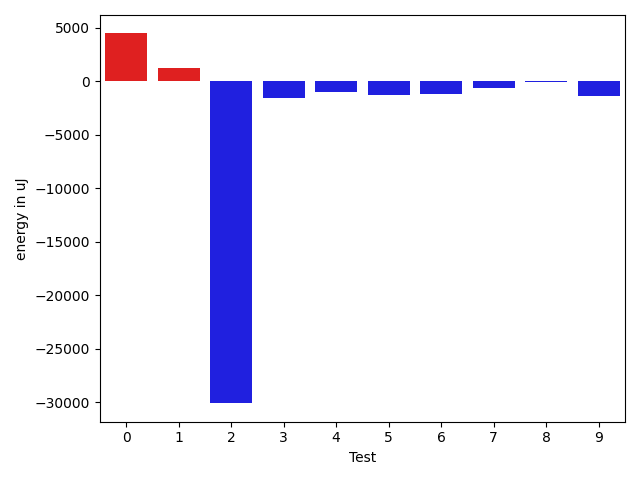

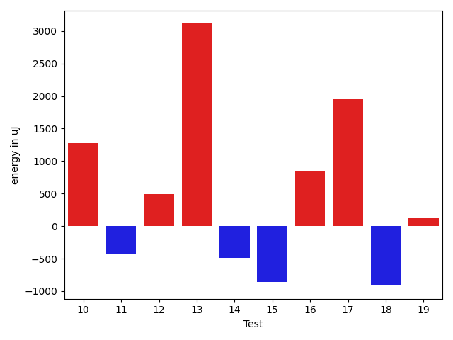

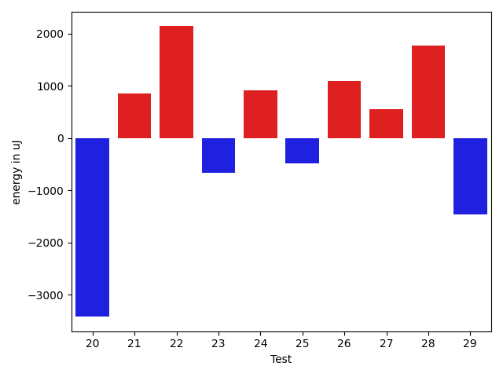

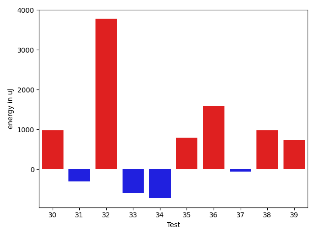

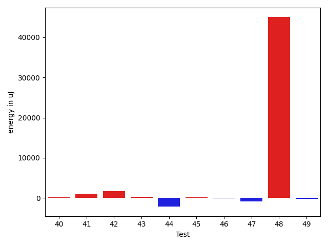

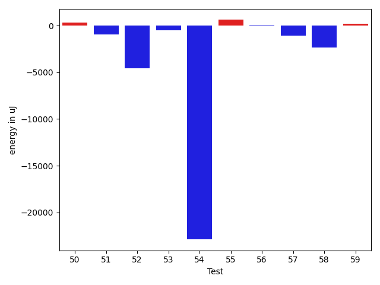

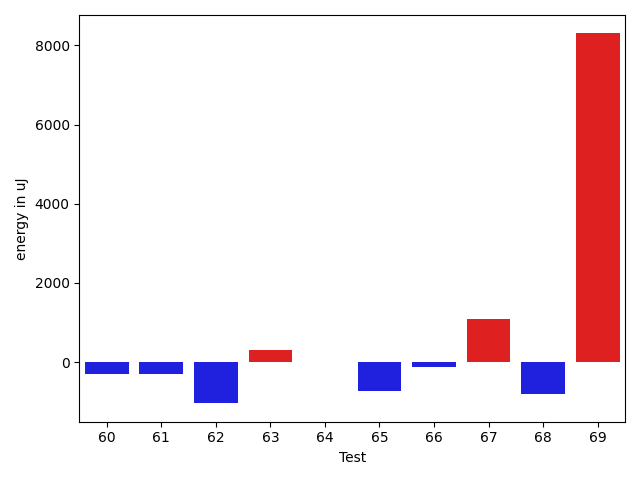

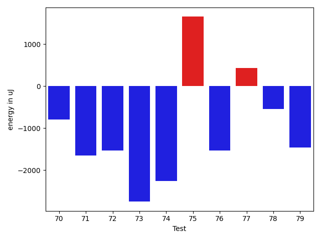

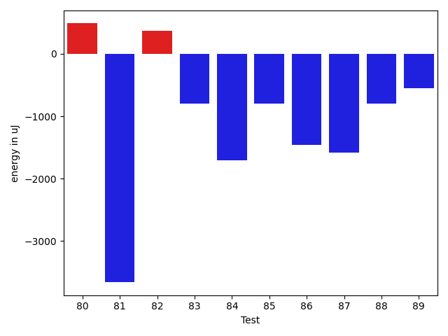

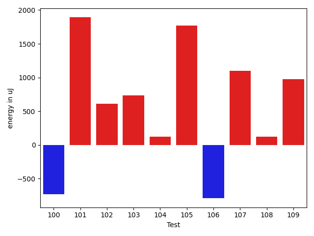

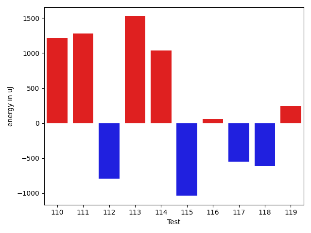

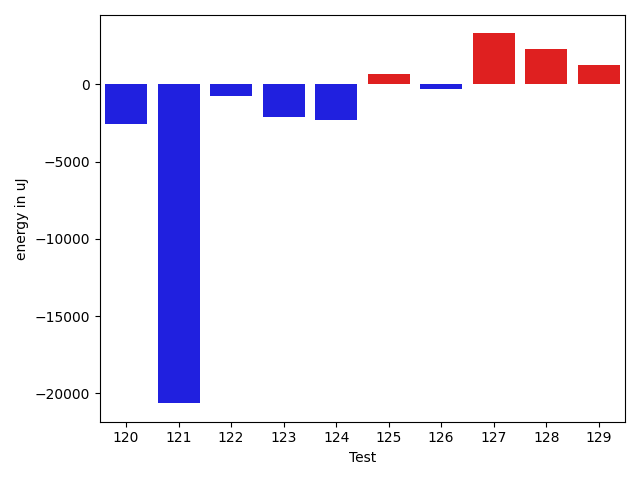

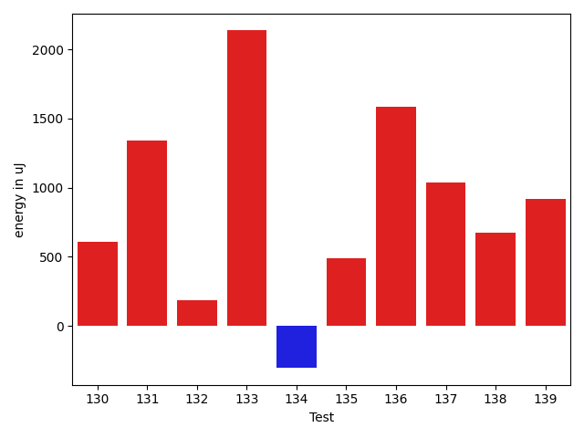

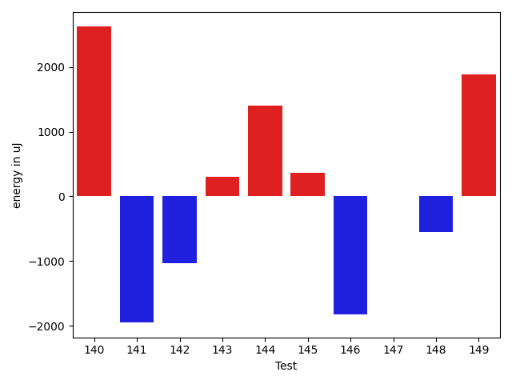

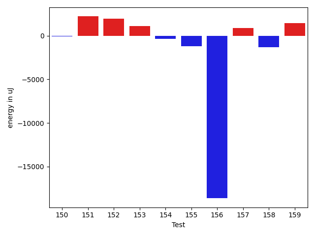

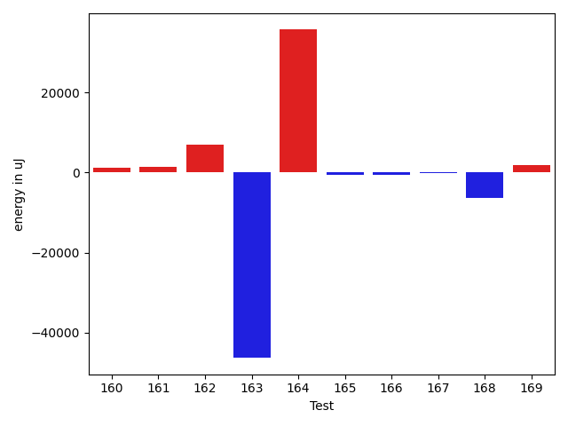

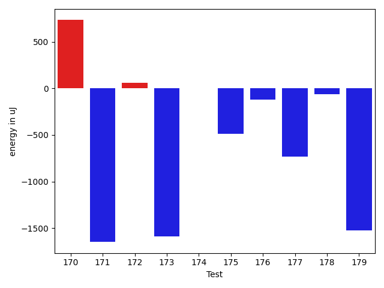

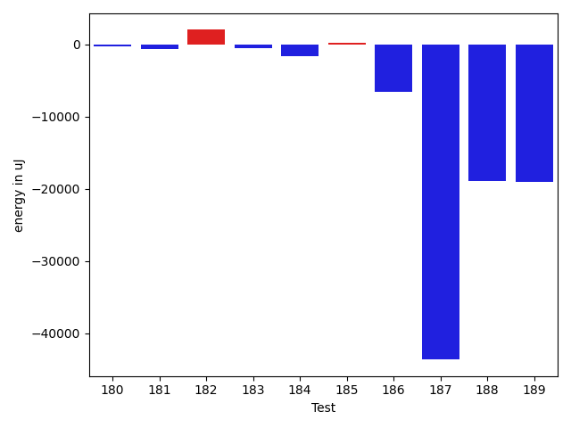

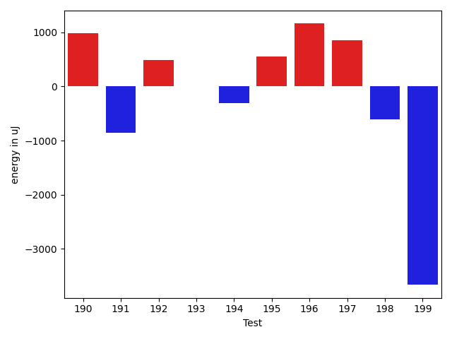

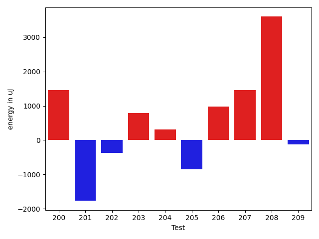

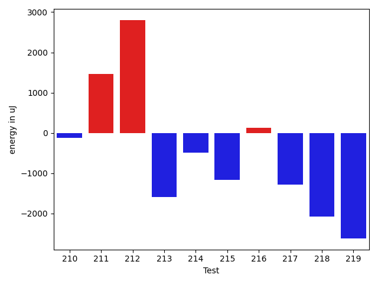

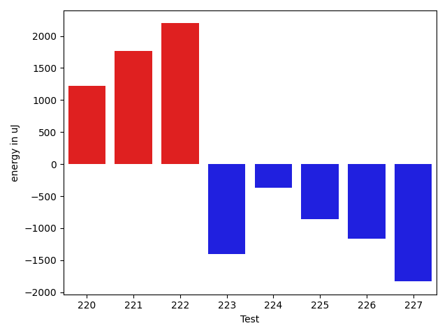

| ID | EnergyV1 | EnergyV2 | DeltaEnergy | σV1 | σV2 |
| --- | --- | --- | --- | --- | --- |
| 0 | 37537 | 41992 | 4455 | 60526.073169769734 | 59042.9971429001 |
| 1 | 36560 | 37781 | 1221 | 22306.040721195848 | 25741.85420700929 |
| 2 | 66773 | 36682 | -30091 | 33697.02844922685 | 16243.925017029744 |
| 3 | 35522 | 33935 | -1587 | 3120.977566650154 | 3052.66765635453 |
| 4 | 35218 | 34180 | -1038 | 82046.05032659257 | 68833.1363929742 |
| 5 | 33081 | 31799 | -1282 | 6381.008351362774 | 4121.889055378853 |
| 6 | 34973 | 33814 | -1159 | 11084.555911663241 | 23672.69278279452 |
| 7 | 33997 | 33386 | -611 | 3500.8469977051027 | 4206.118839745223 |
| 8 | 35400 | 35278 | -122 | 3691.963262828061 | 15021.876994985658 |
| 9 | 35401 | 34058 | -1343 | 3705.451551238139 | 28308.32150166688 |
| 10 | 34363 | 35644 | 1281 | 10166.8061801006 | 6801.484142975058 |
| 11 | 37902 | 37476 | -426 | 25176.989515742902 | 21440.387303888438 |
| 12 | 34607 | 35095 | 488 | 6915.8335978651985 | 60553.55821025251 |
| 13 | 65552 | 68664 | 3112 | 44954.85638982348 | 42353.94902596394 |
| 14 | 35217 | 34729 | -488 | 19827.907620796657 | 5964.94660627864 |
| 15 | 34668 | 33813 | -855 | 3597.7069420045646 | 5742.714751505578 |
| 16 | 33386 | 34241 | 855 | 3865.628286174836 | 3372.779959021088 |
| 17 | 33752 | 35706 | 1954 | 6756.335445578664 | 3451.3267159015736 |
| 18 | 35462 | 34546 | -916 | 6831.755805972557 | 7839.199958227743 |
| 19 | 34301 | 34424 | 123 | 6340.24263560651 | 3218.610479085134 |
| 20 | 37475 | 34057 | -3418 | 4283.803887901499 | 3281.86407170132 |
| 21 | 33631 | 34485 | 854 | 14191.67037522926 | 14903.369979527166 |
| 22 | 32898 | 35034 | 2136 | 16280.288753512352 | 16301.718429825307 |
| 23 | 35340 | 34668 | -672 | 21902.184648125465 | 18569.399024872604 |
| 24 | 32898 | 33813 | 915 | 2976.9595718925925 | 3641.129281631669 |
| 25 | 35278 | 34790 | -488 | 3722.642543437244 | 4108.577126560723 |
| 26 | 33692 | 34790 | 1098 | 3372.883061640294 | 3636.9421715011545 |
| 27 | 34607 | 35156 | 549 | 20751.403802358134 | 6663.8492045997045 |
| 28 | 34058 | 35828 | 1770 | 3506.9327437963398 | 8364.118582565838 |
| 29 | 35217 | 33752 | -1465 | 18850.974025450523 | 3430.269991463161 |
| 30 | 33875 | 34851 | 976 | 3276.43179793441 | 3616.1511590222494 |
| 31 | 33508 | 33203 | -305 | 3032.514146174664 | 4466.712502107431 |
| 32 | 31433 | 35217 | 3784 | 3149.7930079698185 | 3903.3503055740066 |
| 33 | 35339 | 34729 | -610 | 2979.088184280926 | 4154.110323924166 |
| 34 | 33570 | 32837 | -733 | 7283.318998116752 | 4016.8893125755244 |
| 35 | 34607 | 35400 | 793 | 2829.3371987755368 | 3880.482499606468 |
| 36 | 31372 | 32959 | 1587 | 3078.443336048901 | 3791.6159016440474 |
| 37 | 35522 | 35462 | -60 | 4001.2817448663313 | 6688.645789230515 |
| 38 | 33020 | 33996 | 976 | 2963.8106259460283 | 7677.29559661757 |
| 39 | 31738 | 32471 | 733 | 2293.3689489688904 | 2619.4203396086614 |
| 40 | 33874 | 34057 | 183 | 2666.626323768908 | 4309.987593434064 |
| 41 | 32288 | 33264 | 976 | 3524.642455669996 | 3260.2682174937695 |
| 42 | 33692 | 35401 | 1709 | 24482.383284908592 | 20721.116020071215 |
| 43 | 33325 | 33569 | 244 | 3621.596114289784 | 5899.976421223711 |
| 44 | 35461 | 33264 | -2197 | 5522.947830388482 | 19746.97511133963 |
| 45 | 34119 | 34240 | 121 | 23175.5849950739 | 11555.99838617958 |
| 46 | 34119 | 33935 | -184 | 6294.525403970063 | 4741.8539417856955 |
| 47 | 35583 | 34668 | -915 | 11401.553891411708 | 11466.401439336783 |
| 48 | 72998 | 118042 | 45044 | 59564.23100994026 | 66669.16638139251 |
| 49 | 34302 | 34058 | -244 | 7253.301295800808 | 18954.320908504 |
| 50 | 73791 | 74097 | 306 | 26034.717409622837 | 24625.87263871977 |
| 51 | 35400 | 34424 | -976 | 11399.425312046165 | 12469.060799305937 |
| 52 | 39123 | 34546 | -4577 | 52282.00698430259 | 68229.15418961925 |
| 53 | 64270 | 63782 | -488 | 22479.478148879127 | 24228.501143787726 |
| 54 | 61524 | 38635 | -22889 | 49939.176553766425 | 44992.12251577018 |
| 55 | 33630 | 34240 | 610 | 9306.688666902546 | 23843.77485697623 |
| 56 | 34424 | 34363 | -61 | 10022.133178066073 | 9540.638667143718 |
| 57 | 35644 | 34546 | -1098 | 25838.61944871393 | 10181.429739996769 |
| 58 | 35766 | 33447 | -2319 | 3689.743496344927 | 4234.225598052921 |
| 59 | 35034 | 35217 | 183 | 6316.627783521485 | 4483.111747264017 |
| 60 | 35949 | 35645 | -304 | 27522.112206875925 | 21723.176699162934 |
| 61 | 35644 | 35339 | -305 | 6089.404668951806 | 4043.708226338079 |
| 62 | 68909 | 67871 | -1038 | 21067.049360474226 | 20600.261925015588 |
| 63 | 35523 | 35827 | 304 | 37538.8899596733 | 49547.378748822695 |
| 64 | 34545 | 34546 | 1 | 6109.255013127787 | 5309.516424116135 |
| 65 | 35034 | 34302 | -732 | 3557.602507447229 | 23314.413515921176 |
| 66 | 34851 | 34729 | -122 | 27727.260873271243 | 6917.55222816764 |
| 67 | 34545 | 35644 | 1099 | 6252.037573382608 | 7937.3688462189875 |
| 68 | 38025 | 37231 | -794 | 319161.26269256347 | 327903.21465767646 |
| 69 | 101685 | 109985 | 8300 | 77469.78494753792 | 87014.87604491033 |
| 70 | 37232 | 36438 | -794 | 8354.091917015068 | 25202.015354559255 |
| 71 | 36926 | 35278 | -1648 | 4014.8111837631727 | 3891.399491797145 |
| 72 | 37415 | 35888 | -1527 | 3042.6805572084436 | 4058.475655548974 |
| 73 | 37292 | 34545 | -2747 | 3744.6346027150953 | 3175.505014472308 |
| 74 | 39245 | 36987 | -2258 | 56419.7621645998 | 59785.797635974224 |
| 75 | 34729 | 36377 | 1648 | 18562.984443378224 | 27885.138533315745 |
| 76 | 36133 | 34607 | -1526 | 6007.019100654189 | 3479.227082121378 |
| 77 | 33630 | 34058 | 428 | 22862.012385710383 | 14993.336565684174 |
| 78 | 37903 | 37354 | -549 | 55771.003394842446 | 80716.80972643907 |
| 79 | 36560 | 35095 | -1465 | 4101.1633006137 | 18036.147818179 |
| 80 | 34180 | 34668 | 488 | 3124.953197933554 | 3827.9666055469233 |
| 81 | 37537 | 33875 | -3662 | 30802.02905476561 | 56880.382005868814 |
| 82 | 34851 | 35217 | 366 | 3121.8232654981384 | 3590.9379121217116 |
| 83 | 35583 | 34790 | -793 | 3419.5837656978715 | 3848.601195681191 |
| 84 | 35522 | 33813 | -1709 | 4107.223196456483 | 5628.939603628892 |
| 85 | 35217 | 34424 | -793 | 3656.0035950111 | 4871.946561449443 |
| 86 | 35706 | 34241 | -1465 | 3619.744281449442 | 48214.76430939231 |
| 87 | 34485 | 32898 | -1587 | 3608.613037486977 | 3362.782338267019 |
| 88 | 35278 | 34485 | -793 | 23271.50331173983 | 3347.3147198174784 |
| 89 | 35279 | 34729 | -550 | 3385.8017890097863 | 3690.215215458307 |
| 90 | 33874 | 33569 | -305 | 6864.593825602202 | 3333.269046388269 |
| 91 | 34607 | 33997 | -610 | 36708.54348458952 | 41070.179919728726 |
| 92 | 33142 | 33813 | 671 | 4600.257761696451 | 3610.3049953878167 |
| 93 | 37964 | 34424 | -3540 | 38308.775478048105 | 7921.924879958843 |
| 94 | 38696 | 38147 | -549 | 84121.26269155396 | 4216.119426775448 |
| 95 | 37292 | 35644 | -1648 | 4390.24612521895 | 3336.325253680628 |
| 96 | 37415 | 35278 | -2137 | 3067.792105467198 | 2458.1616477340403 |
| 97 | 33325 | 34973 | 1648 | 4737.271268866702 | 3771.424390534431 |
| 98 | 35706 | 34057 | -1649 | 3594.9759147315576 | 2918.5053056036345 |
| 99 | 36804 | 35583 | -1221 | 3805.529053004837 | 2510.5458639800613 |
| 100 | 34668 | 33935 | -733 | 3179.14951293581 | 3857.6668754860398 |
| 101 | 37048 | 38940 | 1892 | 4065.7431219626815 | 114744.74481089803 |
| 102 | 34729 | 35339 | 610 | 3141.892489397203 | 3936.278062380121 |
| 103 | 35645 | 36377 | 732 | 3765.9364713405403 | 2702.130859782887 |
| 104 | 34790 | 34912 | 122 | 4179.598950560166 | 3421.8606918649284 |
| 105 | 33630 | 35400 | 1770 | 2522.388060449859 | 2920.252230585003 |
| 106 | 35522 | 34729 | -793 | 3693.601065389563 | 9032.722438666173 |
| 107 | 35095 | 36194 | 1099 | 2806.030150257165 | 3291.4065314113514 |
| 108 | 36743 | 36865 | 122 | 75104.86825073324 | 50355.60721583302 |
| 109 | 37170 | 38147 | 977 | 49882.968366705296 | 34142.05004331693 |
| 110 | 32532 | 33752 | 1220 | 32501.36601681818 | 4711.611060936674 |
| 111 | 34607 | 35889 | 1282 | 3592.81293446296 | 3796.033712673677 |
| 112 | 32897 | 32105 | -792 | 3719.355532023491 | 3365.0216234966974 |
| 113 | 34362 | 35888 | 1526 | 3210.5201649094092 | 4634.5156869239045 |
| 114 | 35034 | 36072 | 1038 | 16132.081101321024 | 13447.291797276279 |
| 115 | 32898 | 31861 | -1037 | 3646.259162484203 | 3359.9475101720127 |
| 116 | 34546 | 34607 | 61 | 3551.394946803554 | 5158.393899047312 |
| 117 | 33630 | 33081 | -549 | 4623.773084710027 | 3852.6069930546278 |
| 118 | 33997 | 33386 | -611 | 3375.3144979481795 | 3480.8460657336364 |
| 119 | 33691 | 33936 | 245 | 4253.42326594391 | 3774.7646676436802 |
| 120 | 120788 | 118224 | -2564 | 35605.017568707255 | 30783.213813152433 |
| 121 | 59204 | 38574 | -20630 | 19281.454363544544 | 18178.344819937218 |
| 122 | 33936 | 33203 | -733 | 3714.2922417525056 | 3470.7370767659822 |
| 123 | 35888 | 33752 | -2136 | 4632.072214275582 | 3063.5206866826325 |
| 124 | 34057 | 31739 | -2318 | 4503.039911474907 | 3383.920985677914 |
| 125 | 31922 | 32593 | 671 | 3502.8397618746912 | 3747.798964264654 |
| 126 | 33691 | 33387 | -304 | 3648.116016126705 | 3148.235930493209 |
| 127 | 33752 | 37048 | 3296 | 4362.0598175462765 | 4095.9500847079094 |
| 128 | 35095 | 37415 | 2320 | 4551.386470687317 | 4769.377162852813 |
| 129 | 34240 | 35523 | 1283 | 4719.385995962704 | 4884.821838156694 |
| 130 | 33264 | 33874 | 610 | 4389.539453628188 | 4200.3714484208585 |
| 131 | 36011 | 37353 | 1342 | 31361.348380607546 | 24592.295968948027 |
| 132 | 33508 | 33692 | 184 | 3950.227754839089 | 3842.1957489895954 |
| 133 | 32349 | 34485 | 2136 | 28782.23169780573 | 3525.8092953958812 |
| 134 | 34240 | 33935 | -305 | 27316.017103034326 | 3053.6330591608416 |
| 135 | 32837 | 33325 | 488 | 3536.370732259075 | 3547.1156111950554 |
| 136 | 37720 | 39306 | 1586 | 78340.36203878335 | 65423.305625105 |
| 137 | 33752 | 34790 | 1038 | 3278.5609563645967 | 4303.22452009204 |
| 138 | 33508 | 34180 | 672 | 2644.965072430069 | 3297.605952120082 |
| 139 | 63415 | 64331 | 916 | 16451.079437725806 | 21055.145035115103 |
| 140 | 33570 | 36194 | 2624 | 3773.8895495180554 | 4190.288550255221 |
| 141 | 36560 | 34607 | -1953 | 3848.847709556462 | 3672.9649127101666 |
| 142 | 35522 | 34485 | -1037 | 2538.3157090979157 | 3513.72008667452 |
| 143 | 34057 | 34363 | 306 | 3285.6189164903303 | 1841.287191489136 |
| 144 | 33264 | 34668 | 1404 | 3599.6635748152703 | 3974.4788583606223 |
| 145 | 36560 | 36927 | 367 | 3297.3000612126343 | 11038.491963107634 |
| 146 | 37842 | 36011 | -1831 | 3326.5313819538765 | 3832.330616585122 |
| 147 | 33752 | 33753 | 1 | 4441.123533865677 | 4141.760589679493 |
| 148 | 35767 | 35217 | -550 | 2987.894374536763 | 3747.2514496923172 |
| 149 | 32105 | 33997 | 1892 | 22762.436190390516 | 3185.8641157604898 |
| 150 | 35217 | 35156 | -61 | 2839.9898045316554 | 4064.259361088439 |
| 151 | 34118 | 36316 | 2198 | 4163.8613799792165 | 4035.5154649323713 |
| 152 | 34485 | 36438 | 1953 | 2892.1844062922405 | 5217.6830612351305 |
| 153 | 33142 | 34241 | 1099 | 3408.217082369543 | 3486.215824899225 |
| 154 | 34668 | 34302 | -366 | 34855.93452835602 | 2902.386881512753 |
| 155 | 34424 | 33203 | -1221 | 2900.5069707725233 | 4233.373838815986 |
| 156 | 58716 | 40100 | -18616 | 20150.860685978772 | 20182.85517836573 |
| 157 | 33997 | 34851 | 854 | 2847.3491947308985 | 3164.8689492720678 |
| 158 | 33814 | 32470 | -1344 | 4291.748172424636 | 2858.181207971251 |
| 159 | 33692 | 35157 | 1465 | 4030.7415315444932 | 4026.893647403666 |
| 160 | 36682 | 37963 | 1281 | 3290.067266376776 | 3607.4007209611773 |
| 161 | 32836 | 34302 | 1466 | 2979.66721202409 | 3545.9959900480258 |
| 162 | 73791 | 80689 | 6898 | 37980.40753896722 | 319105.88874385634 |
| 163 | 80627 | 34302 | -46325 | 307659.45551389316 | 3032.803853341303 |
| 164 | 36194 | 71899 | 35705 | 3361.011801563172 | 55573.68024637851 |
| 165 | 36865 | 36194 | -671 | 3716.824607471627 | 50765.90794155381 |
| 166 | 67382 | 66711 | -671 | 31244.713350802853 | 34034.239700000755 |
| 167 | 36194 | 36071 | -123 | 179338.7282317259 | 3648.20301272594 |
| 168 | 68970 | 62622 | -6348 | 99323.90620772103 | 77099.59103092492 |
| 169 | 36194 | 38025 | 1831 | 234438.21893369048 | 194451.72878428383 |
| 170 | 35766 | 36499 | 733 | 3644.557969072595 | 3684.7997947649746 |
| 171 | 38269 | 36621 | -1648 | 185171.5327062711 | 178111.3458631383 |
| 172 | 36499 | 36560 | 61 | 4097.804267181411 | 239143.98602208792 |
| 173 | 37659 | 36071 | -1588 | 277519.61077029 | 4051.961935936321 |
| 174 | 35645 | 35645 | 0 | 4128.847823243186 | 3879.664354827064 |
| 175 | 35279 | 34790 | -489 | 3924.6700955104175 | 7580.106482834799 |
| 176 | 37110 | 36988 | -122 | 65776.19828933975 | 49432.10459267027 |
| 177 | 36315 | 35584 | -731 | 11167.592150927729 | 10870.93650835549 |
| 178 | 38330 | 38269 | -61 | 76522.10742970995 | 66087.55029635188 |
| 179 | 36071 | 34546 | -1525 | 10601.8006711631 | 6415.765946814926 |
| 180 | 35950 | 35706 | -244 | 5236.060321224346 | 3233.4620665705065 |
| 181 | 36682 | 36071 | -611 | 191124.99442662593 | 121579.18711623264 |
| 182 | 35034 | 37049 | 2015 | 103273.48345267863 | 176509.10457187594 |
| 183 | 34973 | 34423 | -550 | 4041.3934394245193 | 7853.057223374856 |
| 184 | 37598 | 36011 | -1587 | 12021.473256338493 | 10867.529664588063 |
| 185 | 37597 | 37842 | 245 | 43318.705783872574 | 6217.066534755589 |
| 186 | 43823 | 37232 | -6591 | 52107.47470026628 | 31867.888410340733 |
| 187 | 280822 | 237182 | -43640 | 111425.85798165461 | 74574.53170171946 |
| 188 | 398559 | 379699 | -18860 | 118386.02842880404 | 119544.78950191787 |
| 189 | 60302 | 41259 | -19043 | 61453.28135006407 | 48881.398680921695 |
| 190 | 35461 | 36438 | 977 | 47128.90680763229 | 32071.585098110212 |
| 191 | 118164 | 117309 | -855 | 290033.56299243774 | 164398.9013027238 |
| 192 | 35156 | 35645 | 489 | 4656.024850634092 | 4075.3693396351055 |
| 193 | 34240 | 34241 | 1 | 6148.443887227427 | 3349.5289201526207 |
| 194 | 36377 | 36071 | -306 | 32176.630483852336 | 20557.81985456903 |
| 195 | 34912 | 35462 | 550 | 4370.728084701678 | 3098.824854921859 |
| 196 | 37598 | 38757 | 1159 | 39705.390949970504 | 66130.80395609037 |
| 197 | 38574 | 39429 | 855 | 101842.98500774078 | 81077.86068406512 |
| 198 | 38208 | 37597 | -611 | 47383.14935957906 | 30214.257329014028 |
| 199 | 39124 | 35462 | -3662 | 143098.65538261487 | 92889.77877190367 |
| 200 | 70312 | 71777 | 1465 | 23847.677724049343 | 23962.807070305957 |
| 201 | 38879 | 37109 | -1770 | 40033.52603108841 | 48884.01236412909 |
| 202 | 37720 | 37354 | -366 | 63836.92936931888 | 36396.39753473907 |
| 203 | 35461 | 36255 | 794 | 37577.3139935333 | 36875.62316606066 |
| 204 | 34851 | 35156 | 305 | 8112.975716343876 | 3706.718727789866 |
| 205 | 36010 | 35156 | -854 | 3591.57916366727 | 4662.815475624381 |
| 206 | 33996 | 34973 | 977 | 5439.738406724514 | 4396.5243224218675 |
| 207 | 36621 | 38086 | 1465 | 44766.006872271304 | 63146.70150587182 |
| 208 | 35827 | 39429 | 3602 | 64609.43756396907 | 52966.58240929943 |
| 209 | 35889 | 35767 | -122 | 3674.7914586358243 | 4912.649771160008 |
| 210 | 36437 | 36316 | -121 | 3876.6641285301075 | 4813.903962205803 |
| 211 | 36743 | 38207 | 1464 | 17076.264450848877 | 19174.569087862586 |
| 212 | 34912 | 37720 | 2808 | 3131.012015795461 | 4510.578383552011 |
| 213 | 35218 | 33630 | -1588 | 6832.895012364817 | 3992.3590047538946 |
| 214 | 35888 | 35401 | -487 | 3876.462927007404 | 4006.9040697197747 |
| 215 | 37841 | 36682 | -1159 | 37239.68075912995 | 26081.850725126595 |
| 216 | 35583 | 35705 | 122 | 4508.028710157023 | 3914.466947107869 |
| 217 | 35766 | 34485 | -1281 | 5096.387155144707 | 4279.270378490032 |
| 218 | 39978 | 37903 | -2075 | 85026.74340906524 | 69700.17207391803 |
| 219 | 40954 | 38330 | -2624 | 13697.352763147786 | 16528.261140222075 |
| 220 | 34668 | 35888 | 1220 | 4147.949767321468 | 2994.7436167987976 |
| 221 | 34119 | 35889 | 1770 | 3805.063650946605 | 4109.19731720393 |
| 222 | 37231 | 39428 | 2197 | 253243.3641931172 | 688924.1611046088 |
| 223 | 36743 | 35339 | -1404 | 12208.593547385934 | 7248.725644706263 |
| 224 | 37048 | 36682 | -366 | 98981.8091382168 | 84409.07688536821 |
| 225 | 35461 | 34606 | -855 | 2949.7135331248696 | 3727.7031008602694 |
| 226 | 36133 | 34973 | -1160 | 3872.7117596412836 | 4567.60088022371 |
| 227 | 39184 | 37353 | -1831 | 14456.52864841205 | 14594.466480125478 |

## Delta Duration per test method

| ID | DurationV1 | DurationsV2 | DeltaDuration |
| --- | --- | --- | --- |
| 0 | 1835811.7894736843 | 2087181.4594594594 | 251369.66998577514 |
| 1 | 1389243.621212121 | 1458042.1666666667 | 68798.54545454565 |
| 2 | 1965159.6391752576 | 1490963.108695652 | -474196.53047960554 |
| 3 | 587456.0909090909 | 559991.8928571428 | -27464.1980519481 |
| 4 | 1973429.847826087 | 1619949.8333333333 | -353480.01449275366 |
| 5 | 769439.5098039216 | 708559.274509804 | -60880.23529411759 |
| 6 | 631821.5348837209 | 772153.0571428571 | 140331.5222591362 |
| 7 | 919097.0588235294 | 889234.1052631579 | -29862.953560371534 |
| 8 | 597648.7894736842 | 720039.1590909091 | 122390.3696172249 |
| 9 | 506052.2413793103 | 658727.0454545454 | 152674.8040752351 |
| 10 | 1146724.1395348837 | 1035573.3116883116 | -111150.82784657204 |
| 11 | 1156408.2264150945 | 1000426.4444444445 | -155981.78197064996 |
| 12 | 804686.1707317074 | 1006120.9210526316 | 201434.7503209242 |
| 13 | 2601417.6701030927 | 2612826.18556701 | 11408.515463917516 |
| 14 | 971719.8507462686 | 837308.2068965518 | -134411.64384971687 |
| 15 | 1003075.8611111111 | 933618.6307692308 | -69457.23034188035 |
| 16 | 589653.5625 | 558317.5454545454 | -31336.017045454588 |
| 17 | 681691.7804878049 | 660089.7419354839 | -21602.038552321028 |
| 18 | 1018099.472972973 | 939123.1470588235 | -78976.32591414952 |
| 19 | 873270.3684210526 | 780316.306122449 | -92954.06229860359 |
| 20 | 414455.6875 | 388351.0 | -26104.6875 |
| 21 | 938829.6037735849 | 942797.6346153846 | 3968.0308417996857 |
| 22 | 704277.0344827586 | 703667.0714285715 | -609.9630541871302 |
| 23 | 988062.0 | 1054276.448979592 | 66214.44897959195 |
| 24 | 551157.6585365854 | 510057.5 | -41100.1585365854 |
| 25 | 619976.7567567568 | 573922.9714285714 | -46053.78532818542 |
| 26 | 660912.075 | 594782.119047619 | -66129.9559523809 |
| 27 | 1197038.3139534884 | 914949.2741935484 | -282089.03975994 |
| 28 | 602243.2580645161 | 638070.2727272727 | 35827.014662756585 |
| 29 | 859345.9807692308 | 582338.641025641 | -277007.33974358975 |
| 30 | 673647.1351351351 | 614319.0 | -59328.13513513515 |
| 31 | 606025.6756756756 | 553389.4193548387 | -52636.256320836954 |
| 32 | 441103.8333333333 | 432704.6111111111 | -8399.22222222219 |
| 33 | 437617.0833333333 | 447222.77777777775 | 9605.694444444438 |
| 34 | 794883.4807692308 | 701554.1818181818 | -93329.29895104899 |
| 35 | 359472.0625 | 392979.2727272727 | 33507.210227272706 |
| 36 | 440597.4166666667 | 454679.2 | 14081.783333333326 |
| 37 | 697858.6842105263 | 643738.2432432432 | -54120.440967283095 |
| 38 | 550880.7941176471 | 828913.0512820513 | 278032.25716440415 |
| 39 | 475048.23076923075 | 427472.13333333336 | -47576.09743589739 |
| 40 | 495063.6666666667 | 487120.7916666667 | -7942.875 |
| 41 | 595793.5294117647 | 571679.4666666667 | -24114.062745098025 |
| 42 | 965459.7307692308 | 1001105.8636363636 | 35646.132867132896 |
| 43 | 950588.695652174 | 990258.3134328359 | 39669.61778066191 |
| 44 | 876669.1224489796 | 1063665.6290322582 | 186996.50658327853 |
| 45 | 1290627.641304348 | 1284296.852631579 | -6330.7886727689765 |
| 46 | 1087255.261904762 | 1050397.2105263157 | -36858.051378446165 |
| 47 | 1277888.3111111112 | 1236845.9222222222 | -41042.38888888899 |
| 48 | 2786106.9696969697 | 4208327.626262627 | 1422220.656565657 |
| 49 | 1209443.7640449437 | 1251287.4347826086 | 41843.670737664914 |
| 50 | 2692457.1414141413 | 2687890.5555555555 | -4566.585858585779 |
| 51 | 1304381.4285714286 | 1337610.1720430108 | 33228.74347158219 |
| 52 | 1828283.5444444444 | 1814198.1494252873 | -14085.395019157091 |
| 53 | 2043030.0606060605 | 1980522.4040404041 | -62507.65656565642 |
| 54 | 2386441.1052631577 | 2150795.9591836734 | -235645.14607948437 |
| 55 | 1220199.7096774194 | 1303233.329787234 | 83033.62010981468 |
| 56 | 1258533.5529411766 | 1247267.8202247191 | -11265.732716457453 |
| 57 | 1454581.6781609196 | 1211623.3295454546 | -242958.348615465 |
| 58 | 801796.1568627451 | 777624.8545454545 | -24171.302317290567 |
| 59 | 1044087.4027777778 | 1003450.7142857143 | -40636.68849206343 |
| 60 | 1273723.3770491802 | 1164908.3333333333 | -108815.04371584696 |
| 61 | 971777.9344262296 | 889609.304347826 | -82168.63007840351 |
| 62 | 2169415.878787879 | 2169717.262626263 | 301.38383838394657 |
| 63 | 1200535.7540983607 | 1412371.5740740742 | 211835.8199757135 |
| 64 | 972426.5 | 927489.28125 | -44937.21875 |
| 65 | 1039619.8235294118 | 1059447.9696969697 | 19828.14616755792 |
| 66 | 881472.0178571428 | 805022.3333333334 | -76449.68452380947 |
| 67 | 951776.9264705882 | 1085257.46875 | 133480.5422794118 |
| 68 | 3069943.6461538463 | 3847704.4827586208 | 777760.8366047745 |
| 69 | 3757167.8282828284 | 4145904.0303030303 | 388736.20202020183 |
| 70 | 897001.4047619047 | 1181382.7368421052 | 284381.33208020043 |
| 71 | 677225.4523809524 | 697293.1951219512 | 20067.742740998743 |
| 72 | 494613.60714285716 | 484766.89285714284 | -9846.714285714319 |
| 73 | 461404.36363636365 | 488240.1785714286 | 26835.814935064933 |
| 74 | 1311480.8648648649 | 1759884.1219512196 | 448403.2570863548 |
| 75 | 957990.3076923077 | 1147886.9090909092 | 189896.60139860143 |
| 76 | 905610.6379310344 | 788600.9107142857 | -117009.72721674875 |
| 77 | 963058.0 | 733817.9523809524 | -229240.04761904757 |
| 78 | 1419259.2253521127 | 1822981.3333333333 | 403722.1079812206 |
| 79 | 787515.2352941176 | 881908.9655172414 | 94393.7302231238 |
| 80 | 735295.4038461539 | 733770.7446808511 | -1524.6591653027572 |
| 81 | 1215206.703125 | 1453742.3934426229 | 238535.69031762285 |
| 82 | 864913.966101695 | 753125.9387755102 | -111788.02732618479 |
| 83 | 854283.2272727273 | 777007.2156862745 | -77276.01158645283 |
| 84 | 939324.5142857142 | 947103.8769230769 | 7779.362637362676 |
| 85 | 625092.243902439 | 706010.0476190476 | 80917.80371660856 |
| 86 | 901508.296875 | 1221477.5806451612 | 319969.2837701612 |
| 87 | 713558.5555555555 | 722230.775510204 | 8672.21995464852 |
| 88 | 813699.6279069767 | 786915.1290322581 | -26784.498874718673 |
| 89 | 821714.6279069767 | 812185.1 | -9529.527906976757 |
| 90 | 769736.0227272727 | 732915.7346938775 | -36820.28803339519 |
| 91 | 710682.55 | 797649.5833333334 | 86967.03333333333 |
| 92 | 535334.5882352941 | 580433.9583333334 | 45099.370098039275 |
| 93 | 1147847.4 | 809717.9375 | -338129.4624999999 |
| 94 | 1725103.607142857 | 354392.75 | -1370710.857142857 |
| 95 | 425613.1 | 335910.63636363635 | -89702.46363636362 |
| 96 | 457260.53846153844 | 399569.53846153844 | -57691.0 |
| 97 | 362081.7619047619 | 458064.5263157895 | 95982.7644110276 |
| 98 | 457902.65 | 417024.2105263158 | -40878.43947368424 |
| 99 | 600887.875 | 376255.90476190473 | -224631.97023809527 |
| 100 | 483498.08 | 422185.5833333333 | -61312.4966666667 |
| 101 | 592486.1428571428 | 2745208.0 | 2152721.8571428573 |
| 102 | 551220.4166666666 | 487135.2083333333 | -64085.208333333314 |
| 103 | 604395.7777777778 | 355697.76470588235 | -248698.0130718954 |
| 104 | 515946.2173913043 | 488418.1379310345 | -27528.07946026983 |
| 105 | 470898.65 | 505378.92307692306 | 34480.27307692304 |
| 106 | 432396.5 | 710632.448275862 | 278235.948275862 |
| 107 | 414468.29411764705 | 398855.1176470588 | -15613.176470588252 |
| 108 | 2080271.44 | 1067232.25 | -1013039.19 |
| 109 | 1355324.603448276 | 1094915.0350877193 | -260409.56836055662 |
| 110 | 727587.3571428572 | 542030.1785714285 | -185557.17857142864 |
| 111 | 716930.3488372093 | 682873.3428571429 | -34057.00598006637 |
| 112 | 944909.1625 | 924525.5735294118 | -20383.58897058817 |
| 113 | 557065.1923076923 | 378333.625 | -178731.56730769225 |
| 114 | 1196235.923076923 | 1119969.0125 | -76266.91057692305 |
| 115 | 707845.02 | 701546.5111111111 | -6298.508888888871 |
| 116 | 451692.13636363635 | 436424.3157894737 | -15267.820574162644 |
| 117 | 938098.9333333333 | 851404.9811320754 | -86693.95220125793 |
| 118 | 582933.3076923077 | 490183.8 | -92749.50769230776 |
| 119 | 832467.6607142857 | 781340.7894736842 | -51126.871240601526 |
| 120 | 3927481.6363636362 | 3805347.616161616 | -122134.02020202018 |
| 121 | 1614258.2463768115 | 1571341.6964285714 | -42916.549948240165 |
| 122 | 684853.9387755102 | 688904.3658536585 | 4050.42707814835 |
| 123 | 410177.0 | 437284.90476190473 | 27107.904761904734 |
| 124 | 554825.21875 | 509239.0740740741 | -45586.1446759259 |
| 125 | 593023.5945945946 | 628747.4 | 35723.80540540547 |
| 126 | 438691.61904761905 | 455204.70588235295 | 16513.0868347339 |
| 127 | 510140.0 | 489764.2727272727 | -20375.727272727294 |
| 128 | 375995.72222222225 | 371000.38095238095 | -4995.341269841301 |
| 129 | 645345.9333333333 | 438355.26923076925 | -206990.6641025641 |
| 130 | 408913.1052631579 | 475392.6842105263 | 66479.57894736837 |
| 131 | 851212.9487179487 | 1080429.2558139535 | 229216.30709600472 |
| 132 | 444171.4137931034 | 429096.5 | -15074.91379310342 |
| 133 | 674492.074074074 | 521373.125 | -153118.94907407404 |
| 134 | 780474.3541666666 | 656831.15 | -123643.2041666666 |
| 135 | 527679.4146341464 | 548511.5142857142 | 20832.09965156787 |
| 136 | 1553671.9705882352 | 1556704.861111111 | 3032.890522875823 |
| 137 | 452450.05263157893 | 501566.60869565216 | 49116.55606407323 |
| 138 | 422837.5 | 433913.1034482759 | 11075.603448275884 |
| 139 | 1570953.574468085 | 1793855.5609756098 | 222901.98650752474 |
| 140 | 521670.25925925927 | 546306.0 | 24635.74074074073 |
| 141 | 359237.8888888889 | 450398.44444444444 | 91160.55555555556 |
| 142 | 387645.8461538461 | 377080.65 | -10565.196153846104 |
| 143 | 415081.4285714286 | 440484.90476190473 | 25403.476190476154 |
| 144 | 544217.5185185185 | 534642.6666666666 | -9574.851851851912 |
| 145 | 750620.5833333334 | 862419.2857142857 | 111798.70238095231 |
| 146 | 722775.4090909091 | 507579.724137931 | -215195.68495297804 |
| 147 | 380792.5833333333 | 498263.6 | 117471.01666666666 |
| 148 | 670884.696969697 | 624607.804347826 | -46276.89262187097 |
| 149 | 652411.64 | 543224.0344827586 | -109187.6055172414 |
| 150 | 494248.25 | 482094.3333333333 | -12153.916666666686 |
| 151 | 503447.9130434783 | 509656.7916666667 | 6208.878623188415 |
| 152 | 399893.8 | 427713.35 | 27819.54999999999 |
| 153 | 821022.1458333334 | 870417.7962962963 | 49395.65046296292 |
| 154 | 711327.8636363636 | 449169.3333333333 | -262158.53030303033 |
| 155 | 397996.875 | 405911.07692307694 | 7914.2019230769365 |
| 156 | 1643645.1153846155 | 1705002.5322580645 | 61357.416873448994 |
| 157 | 538269.2857142857 | 567388.5 | 29119.21428571432 |
| 158 | 445658.28571428574 | 478889.68 | 33231.394285714254 |
| 159 | 425345.17647058825 | 453665.6 | 28320.423529411724 |
| 160 | 450903.22222222225 | 499790.0740740741 | 48886.851851851854 |
| 161 | 417100.5862068966 | 481490.47826086957 | 64389.89205397299 |
| 162 | 2699991.232323232 | 5613766.595959596 | 2913775.363636364 |
| 163 | 5077357.070707071 | 589956.6206896552 | -4487400.450017415 |
| 164 | 524957.3333333334 | 2936168.505050505 | 2411211.1717171716 |
| 165 | 721579.6363636364 | 1462437.5185185184 | 740857.8821548821 |
| 166 | 2138815.6363636362 | 2032625.2021276595 | -106190.43423597678 |
| 167 | 1493595.9824561405 | 761852.7966101695 | -731743.185845971 |
| 168 | 3092322.02020202 | 2627845.336734694 | -464476.6834673262 |
| 169 | 1889505.4285714286 | 1689651.7368421052 | -199853.69172932347 |
| 170 | 703208.6875 | 669884.3 | -33324.38749999995 |
| 171 | 1891199.0 | 1768908.095890411 | -122290.90410958906 |
| 172 | 586289.6923076923 | 1597940.6923076923 | 1011651.0 |
| 173 | 2257958.074074074 | 524715.7058823529 | -1733242.3681917214 |
| 174 | 730996.35 | 738150.9090909091 | 7154.559090909082 |
| 175 | 1059183.5375 | 1084420.6913580247 | 25237.153858024627 |
| 176 | 1565291.3870967743 | 1438534.234375 | -126757.1527217743 |
| 177 | 1290468.6703296704 | 1266773.5531914893 | -23695.117138181115 |
| 178 | 1958777.4605263157 | 1985129.25 | 26351.78947368427 |
| 179 | 698249.3181818182 | 623433.5217391305 | -74815.79644268774 |
| 180 | 501942.6666666667 | 491841.5909090909 | -10101.075757575803 |
| 181 | 1916891.5901639345 | 1470050.7843137255 | -446840.80585020897 |
| 182 | 1169157.3962264152 | 1848192.6444444444 | 679035.2482180293 |
| 183 | 738654.0 | 761822.12 | 23168.119999999995 |
| 184 | 788374.9354838709 | 744366.0344827586 | -44008.9010011123 |
| 185 | 1093350.9696969697 | 703649.7647058824 | -389701.2049910873 |
| 186 | 2152235.8645833335 | 1591865.2021276595 | -560370.662455674 |
| 187 | 8738772.747474747 | 7386194.111111111 | -1352578.6363636358 |
| 188 | 11275333.404040404 | 11130837.404040404 | -144496.0 |
| 189 | 2371104.868686869 | 1861112.5578947368 | -509992.31079213205 |
| 190 | 1482448.0533333332 | 1080498.4307692307 | -401949.6225641025 |
| 191 | 5683687.212121212 | 4455232.545454546 | -1228454.666666666 |
| 192 | 536126.1666666666 | 540416.9615384615 | 4290.794871794875 |
| 193 | 794599.4634146341 | 619188.0857142857 | -175411.37770034838 |
| 194 | 1277635.3783783785 | 818934.1282051282 | -458701.2501732502 |
| 195 | 547681.84 | 548550.8518518518 | 869.0118518518284 |
| 196 | 1392908.3 | 1459214.4722222222 | 66306.1722222222 |
| 197 | 2433488.1333333333 | 1837602.0 | -595886.1333333333 |
| 198 | 1756108.828125 | 1253223.1964285714 | -502885.63169642864 |
| 199 | 3286508.3695652173 | 1738595.638888889 | -1547912.7306763283 |
| 200 | 2128685.1818181816 | 2207023.0303030303 | 78337.84848484863 |
| 201 | 1284817.9117647058 | 1366398.2857142857 | 81580.3739495799 |
| 202 | 1450586.3023255814 | 1044422.6279069767 | -406163.6744186047 |
| 203 | 1649307.5375 | 1688460.3246753246 | 39152.78717532451 |
| 204 | 1024277.3064516129 | 885397.2028985508 | -138880.10355306207 |
| 205 | 496974.22222222225 | 466542.2916666667 | -30431.930555555562 |
| 206 | 444397.5625 | 512482.8823529412 | 68085.3198529412 |
| 207 | 1528147.8870967743 | 1562345.9074074074 | 34198.02031063312 |
| 208 | 1785701.2424242424 | 1362422.3823529412 | -423278.8600713012 |
| 209 | 511807.5 | 494141.5862068966 | -17665.91379310342 |
| 210 | 557129.5555555555 | 631651.2105263158 | 74521.65497076034 |
| 211 | 1002257.9189189189 | 1018871.880952381 | 16613.962033462012 |
| 212 | 392313.5833333333 | 467248.8333333333 | 74935.25 |
| 213 | 746836.0833333334 | 699495.8888888889 | -47340.194444444496 |
| 214 | 830230.5454545454 | 762682.1296296297 | -67548.41582491575 |
| 215 | 1619313.7037037036 | 1472184.5783132531 | -147129.12539045047 |
| 216 | 809760.38 | 718568.64 | -91191.73999999999 |
| 217 | 560681.1818181818 | 820669.25 | 259988.06818181823 |
| 218 | 2265420.257142857 | 1822959.7272727273 | -442460.5298701299 |
| 219 | 935198.1785714285 | 1168487.275 | 233289.09642857139 |
| 220 | 572983.8 | 524913.0357142857 | -48070.764285714366 |
| 221 | 559232.0 | 557892.5384615385 | -1339.4615384615026 |
| 222 | 2190462.212121212 | 8471700.984126983 | 6281238.772005771 |
| 223 | 838458.28125 | 838204.5 | -253.78125 |
| 224 | 2444646.55 | 1960315.4 | -484331.1499999999 |
| 225 | 562854.95 | 426247.14285714284 | -136607.8071428571 |
| 226 | 539742.1666666666 | 428698.78571428574 | -111043.38095238089 |
| 227 | 1185547.5238095238 | 1245056.3333333333 | 59508.80952380947 |

## Misc.

| ID | Test Class | Test Method |
| --- | --- | --- |
| 0 | com.google.gson.functional.ObjectTest | testDirectedAcyclicGraphDeserialization |
| 1 | com.google.gson.functional.ObjectTest | testDirectedAcyclicGraphSerialization |
| 2 | com.google.gson.functional.ObjectTest | testArrayOfArraysDeserialization |
| 3 | com.google.gson.functional.ObjectTest | testNullFieldsSerialization |
| 4 | com.google.gson.functional.ObjectTest | testSubInterfacesOfCollectionDeserialization |
| 5 | com.google.gson.functional.ObjectTest | testInnerClassSerialization |
| 6 | com.google.gson.functional.ObjectTest | testClassWithEnumFieldDeserialization |
| 7 | com.google.gson.functional.ObjectTest | testClassWithObjectFieldSerialization |
| 8 | com.google.gson.functional.ObjectTest | testClassWithEnumFieldSerialization |
| 9 | com.google.gson.functional.ObjectTest | testTopLevelEnumDeserialization |
| 10 | com.google.gson.functional.ObjectTest | testArrayOfArraysSerialization |
| 11 | com.google.gson.functional.ObjectTest | testAnonymousLocalClassesSerialization |
| 12 | com.google.gson.functional.ObjectTest | testJsonInSingleQuotesDeserialization |
| 13 | com.google.gson.functional.ObjectTest | testSubInterfacesOfCollectionSerialization |
| 14 | com.google.gson.functional.ObjectTest | testNestedDeserialization |
| 15 | com.google.gson.functional.ObjectTest | testInheritenceDeserialization |
| 16 | com.google.gson.functional.ObjectTest | testBagOfPrimitiveWrappersDeserialization |
| 17 | com.google.gson.functional.ObjectTest | testJsonInMixedQuotesDeserialization |
| 18 | com.google.gson.functional.ObjectTest | testInheritenceSerialization |
| 19 | com.google.gson.functional.ObjectTest | testArrayOfObjectsSerialization |
| 20 | com.google.gson.functional.ObjectTest | testTopLevelEnumSerialization |
| 21 | com.google.gson.functional.ObjectTest | testInnerClassDeserialization |
| 22 | com.google.gson.functional.ObjectTest | testNullObjectFieldsDeserialization |
| 23 | com.google.gson.functional.ObjectTest | testNestedSerialization |
| 24 | com.google.gson.functional.ObjectTest | testPrivateNoArgConstructorDeserialization |
| 25 | com.google.gson.functional.ObjectTest | testClassWithTransientFieldsDeserializationTransientFieldsPassedInJsonAreIgnored |
| 26 | com.google.gson.functional.ObjectTest | testBagOfPrimitiveWrappersSerialization |
| 27 | com.google.gson.functional.ObjectTest | testArrayOfObjectsDeserialization |
| 28 | com.google.gson.functional.ObjectTest | testBagOfPrimitivesSerialization |
| 29 | com.google.gson.functional.ObjectTest | testNullFieldsDeserialization |
| 30 | com.google.gson.functional.ObjectTest | testBagOfPrimitivesDeserialization |
| 31 | com.google.gson.functional.ObjectTest | testEmptyCollectionInAnObjectDeserialization |
| 32 | com.google.gson.functional.ObjectTest | testSelfReferenceSerialization |
| 33 | com.google.gson.functional.ObjectTest | testClassWithNoFieldsDeserialization |
| 34 | com.google.gson.functional.ObjectTest | testPrimitiveArrayInAnObjectDeserialization |
| 35 | com.google.gson.functional.ObjectTest | testClassWithNoFieldsSerialization |
| 36 | com.google.gson.functional.ObjectTest | testNullPrimitiveFieldsDeserialization |
| 37 | com.google.gson.functional.ObjectTest | testClassWithTransientFieldsDeserialization |
| 38 | com.google.gson.functional.ObjectTest | testNullArraysDeserialization |
| 39 | com.google.gson.functional.ObjectTest | testPrimitiveArrayFieldSerialization |
| 40 | com.google.gson.functional.ObjectTest | testEmptyCollectionInAnObjectSerialization |
| 41 | com.google.gson.functional.ObjectTest | testCircularSerialization |
| 42 | com.google.gson.functional.ObjectTest | testClassWithTransientFieldsSerialization |
| 43 | com.google.gson.functional.ParameterizedTypesTest | testParameterizedTypeGenericArraysSerialization |
| 44 | com.google.gson.functional.ParameterizedTypesTest | testParameterizedTypesWithWriterSerialization |
| 45 | com.google.gson.functional.ParameterizedTypesTest | testVariableTypeArrayDeserialization |
| 46 | com.google.gson.functional.ParameterizedTypesTest | testParameterizedTypeWithReaderDeserialization |
| 47 | com.google.gson.functional.ParameterizedTypesTest | testParameterizedTypeWithCustomSerializer |
| 48 | com.google.gson.functional.ParameterizedTypesTest | testParameterizedTypesSerialization |
| 49 | com.google.gson.functional.ParameterizedTypesTest | testVariableTypeDeserialization |
| 50 | com.google.gson.functional.ParameterizedTypesTest | testVariableTypeFieldsAndGenericArraysSerialization |
| 51 | com.google.gson.functional.ParameterizedTypesTest | testParameterizedTypeGenericArraysDeserialization |
| 52 | com.google.gson.functional.ParameterizedTypesTest | testParameterizedTypeDeserialization |
| 53 | com.google.gson.functional.ParameterizedTypesTest | testVariableTypeFieldsAndGenericArraysDeserialization |
| 54 | com.google.gson.functional.ParameterizedTypesTest | testTypesWithMultipleParametersSerialization |
| 55 | com.google.gson.functional.ParameterizedTypesTest | testParameterizedTypeWithVariableTypeDeserialization |
| 56 | com.google.gson.functional.ParameterizedTypesTest | testParameterizedTypesWithCustomDeserializer |
| 57 | com.google.gson.functional.ParameterizedTypesTest | testTypesWithMultipleParametersDeserialization |
| 58 | com.google.gson.functional.CustomTypeAdaptersTest | testCustomTypeAdapterAppliesToSubClassesSerializedAsBaseClass |
| 59 | com.google.gson.functional.CustomTypeAdaptersTest | testCustomAdapterInvokedForMapElementDeserialization |
| 60 | com.google.gson.functional.CustomTypeAdaptersTest | testCustomNestedSerializers |
| 61 | com.google.gson.functional.CustomTypeAdaptersTest | testCustomNestedDeserializers |
| 62 | com.google.gson.functional.CustomTypeAdaptersTest | testCustomTypeAdapterDoesNotAppliesToSubClasses |
| 63 | com.google.gson.functional.CustomTypeAdaptersTest | testCustomDeserializers |
| 64 | com.google.gson.functional.CustomTypeAdaptersTest | testCustomSerializerForLong |
| 65 | com.google.gson.functional.CustomTypeAdaptersTest | testCustomByteArrayDeserializerAndInstanceCreator |
| 66 | com.google.gson.functional.CustomTypeAdaptersTest | testCustomByteArraySerializer |
| 67 | com.google.gson.functional.CustomTypeAdaptersTest | testCustomDeserializerForLong |
| 68 | com.google.gson.functional.CustomTypeAdaptersTest | testCustomSerializers |
| 69 | com.google.gson.functional.ExposeFieldsTest | testNullExposeFieldSerialization |
| 70 | com.google.gson.functional.ExposeFieldsTest | testArrayWithOneNullExposeFieldObjectSerialization |
| 71 | com.google.gson.functional.ExposeFieldsTest | testNoExposedFieldDeserialization |
| 72 | com.google.gson.functional.ExposeFieldsTest | testExposeAnnotationSerialization |
| 73 | com.google.gson.functional.ExposeFieldsTest | testNoExposedFieldSerialization |
| 74 | com.google.gson.functional.ExposeFieldsTest | testExposeAnnotationDeserialization |
| 75 | com.google.gson.functional.CollectionTest | testRawCollectionSerialization |
| 76 | com.google.gson.functional.CollectionTest | testCollectionOfStringsDeserialization |
| 77 | com.google.gson.functional.CollectionTest | testCollectionOfBagOfPrimitivesSerialization |
| 78 | com.google.gson.functional.CollectionTest | testCollectionOfEnumsSerialization |
| 79 | com.google.gson.functional.CollectionTest | testTopLevelCollectionOfIntegersSerialization |
| 80 | com.google.gson.functional.CollectionTest | testNullsInListSerialization |
| 81 | com.google.gson.functional.CollectionTest | testCollectionOfEnumsDeserialization |
| 82 | com.google.gson.functional.CollectionTest | testQueueDeserialization |
| 83 | com.google.gson.functional.CollectionTest | testLinkedListDeserialization |
| 84 | com.google.gson.functional.CollectionTest | testTopLevelListOfIntegerCollectionsDeserialization |
| 85 | com.google.gson.functional.CollectionTest | testRawCollectionOfBagOfPrimitivesNotAllowed |
| 86 | com.google.gson.functional.CollectionTest | testTopLevelCollectionOfIntegersDeserialization |
| 87 | com.google.gson.functional.CollectionTest | testQueueSerialization |
| 88 | com.google.gson.functional.CollectionTest | testRawCollectionDeserializationNotAlllowed |
| 89 | com.google.gson.functional.CollectionTest | testLinkedListSerialization |
| 90 | com.google.gson.functional.CollectionTest | testNullsInListDeserialization |
| 91 | com.google.gson.functional.CollectionTest | testCollectionOfStringsSerialization |
| 92 | com.google.gson.functional.CollectionTest | testRawCollectionOfIntegersSerialization |
| 93 | com.google.gson.functional.StringTest | testStringValueAsSingleElementArraySerialization |
| 94 | com.google.gson.functional.StringTest | testEscapedCtrlNInStringDeserialization |
| 95 | com.google.gson.functional.StringTest | testEscapedBackslashInStringSerialization |
| 96 | com.google.gson.functional.StringTest | testEscapedBackslashInStringDeserialization |
| 97 | com.google.gson.functional.StringTest | testEscapedCtrlNInStringSerialization |
| 98 | com.google.gson.functional.StringTest | testEscapingQuotesInStringDeserialization |
| 99 | com.google.gson.functional.StringTest | testEscapedCtrlRInStringSerialization |
| 100 | com.google.gson.functional.StringTest | testEscapedCtrlRInStringDeserialization |
| 101 | com.google.gson.functional.StringTest | testStringValueAsSingleElementArrayDeserialization |
| 102 | com.google.gson.functional.StringTest | testEscapingQuotesInStringSerialization |
| 103 | com.google.gson.functional.StringTest | testSingleQuoteInStringDeserialization |
| 104 | com.google.gson.functional.StringTest | testStringWithEscapedSlashDeserialization |
| 105 | com.google.gson.functional.StringTest | testSingleQuoteInStringSerialization |
| 106 | com.google.gson.functional.StringTest | testStringValueSerialization |
| 107 | com.google.gson.functional.StringTest | testStringValueDeserialization |
| 108 | com.google.gson.functional.DefaultTypeAdaptersTest | testUrlDeserialization |
| 109 | com.google.gson.functional.DefaultTypeAdaptersTest | testUrlSerialization |
| 110 | com.google.gson.functional.DefaultTypeAdaptersTest | testBigIntegerFieldDeserialization |
| 111 | com.google.gson.functional.DefaultTypeAdaptersTest | testUrlNullDeserialization |
| 112 | com.google.gson.functional.DefaultTypeAdaptersTest | testDefaultDateDeserializationUsingBuilder |
| 113 | com.google.gson.functional.DefaultTypeAdaptersTest | testLocaleDeserializationWithLanguage |
| 114 | com.google.gson.functional.DefaultTypeAdaptersTest | testUrlNullSerialization |
| 115 | com.google.gson.functional.DefaultTypeAdaptersTest | testDateDeserializationWithPattern |
| 116 | com.google.gson.functional.DefaultTypeAdaptersTest | testLocaleDeserializationWithLanguageCountryVariant |
| 117 | com.google.gson.functional.DefaultTypeAdaptersTest | testBigIntegerFieldSerialization |
| 118 | com.google.gson.functional.DefaultTypeAdaptersTest | testSetSerialization |
| 119 | com.google.gson.functional.DefaultTypeAdaptersTest | testDefaultDateSerialization |
| 120 | com.google.gson.functional.DefaultTypeAdaptersTest | testDefaultDateDeserialization |
| 121 | com.google.gson.functional.DefaultTypeAdaptersTest | testBigDecimalFieldSerialization |
| 122 | com.google.gson.functional.DefaultTypeAdaptersTest | testDateSerializationWithPattern |
| 123 | com.google.gson.functional.DefaultTypeAdaptersTest | testLocaleDeserializationWithLanguageCountry |
| 124 | com.google.gson.functional.DefaultTypeAdaptersTest | testBigDecimalFieldDeserialization |
| 125 | com.google.gson.functional.DefaultTypeAdaptersTest | testDefaultDateSerializationUsingBuilder |
| 126 | com.google.gson.functional.DefaultTypeAdaptersTest | testLocaleSerializationWithLanguageCountryVariant |
| 127 | com.google.gson.functional.DefaultTypeAdaptersTest | testUriSerialization |
| 128 | com.google.gson.functional.DefaultTypeAdaptersTest | testLocaleSerializationWithLanguageCountry |
| 129 | com.google.gson.functional.DefaultTypeAdaptersTest | testUriDeserialization |
| 130 | com.google.gson.functional.DefaultTypeAdaptersTest | testLocaleSerializationWithLanguage |
| 131 | com.google.gson.functional.PrimitiveTest | testPrimitiveIntegerAutoboxedDeserialization |
| 132 | com.google.gson.functional.PrimitiveTest | testSmallValueForBigIntegerDeserialization |
| 133 | com.google.gson.functional.PrimitiveTest | testPrimitiveDoubleAutoboxedInASingleElementArrayDeserialization |
| 134 | com.google.gson.functional.PrimitiveTest | testPrimitiveDoubleAutoboxedDeserialization |
| 135 | com.google.gson.functional.PrimitiveTest | testBigIntegerInASingleElementArraySerialization |
| 136 | com.google.gson.functional.PrimitiveTest | testPrimitiveIntegerAutoboxedInASingleElementArrayDeserialization |
| 137 | com.google.gson.functional.PrimitiveTest | testPrimitiveBooleanAutoboxedInASingleElementArraySerialization |
| 138 | com.google.gson.functional.PrimitiveTest | testBigIntegerInASingleElementArrayDeserialization |
| 139 | com.google.gson.functional.PrimitiveTest | testPrimitiveDoubleAutoboxedSerialization |
| 140 | com.google.gson.functional.PrimitiveTest | testPrimitiveLongAutoboxedDeserialization |
| 141 | com.google.gson.functional.PrimitiveTest | testReallyLongValuesSerialization |
| 142 | com.google.gson.functional.PrimitiveTest | testSmallValueForBigIntegerSerialization |
| 143 | com.google.gson.functional.PrimitiveTest | testBigDecimalInASingleElementArrayDeserialization |
| 144 | com.google.gson.functional.PrimitiveTest | testPrimitiveBooleanAutoboxedInASingleElementArrayDeserialization |
| 145 | com.google.gson.functional.PrimitiveTest | testPrimitiveIntegerAutoboxedInASingleElementArraySerialization |
| 146 | com.google.gson.functional.PrimitiveTest | testReallyLongValuesDeserialization |
| 147 | com.google.gson.functional.PrimitiveTest | testPrimitiveLongAutoboxedSerialization |
| 148 | com.google.gson.functional.PrimitiveTest | testPrimitiveBooleanAutoboxedDeserialization |
| 149 | com.google.gson.functional.PrimitiveTest | testPrimitiveDoubleAutoboxedInASingleElementArraySerialization |
| 150 | com.google.gson.functional.PrimitiveTest | testPrimitiveLongAutoboxedInASingleElementArraySerialization |
| 151 | com.google.gson.functional.PrimitiveTest | testPrimitiveLongAutoboxedInASingleElementArrayDeserialization |
| 152 | com.google.gson.functional.PrimitiveTest | testPrimitiveBooleanAutoboxedSerialization |
| 153 | com.google.gson.functional.PrimitiveTest | testBigIntegerSerialization |
| 154 | com.google.gson.functional.PrimitiveTest | testSmallValueForBigDecimalDeserialization |
| 155 | com.google.gson.functional.PrimitiveTest | testSmallValueForBigDecimalSerialization |
| 156 | com.google.gson.functional.PrimitiveTest | testBigDecimalSerialization |
| 157 | com.google.gson.functional.PrimitiveTest | testBadValueForBigIntegerDeserialization |
| 158 | com.google.gson.functional.PrimitiveTest | testBigIntegerDeserialization |
| 159 | com.google.gson.functional.PrimitiveTest | testBigDecimalDeserialization |
| 160 | com.google.gson.functional.PrimitiveTest | testPrimitiveIntegerAutoboxedSerialization |
| 161 | com.google.gson.functional.PrimitiveTest | testBigDecimalInASingleElementArraySerialization |
| 162 | com.google.gson.functional.NamingPolicyTest | testGsonWithNonDefaultFieldNamingPolicySerialization |
| 163 | com.google.gson.functional.NamingPolicyTest | testGsonWithSerializedNameFieldNamingPolicyDeserialization |
| 164 | com.google.gson.functional.NamingPolicyTest | testGsonWithSerializedNameFieldNamingPolicySerialization |
| 165 | com.google.gson.functional.NamingPolicyTest | testGsonWithNonDefaultFieldNamingPolicyDeserialiation |
| 166 | com.google.gson.JsonDeserializerExceptionWrapperTest | testProperSerialization |
| 167 | com.google.gson.FunctionalWithInternalDependenciesTest | testAnonymousLocalClassesSerialization |
| 168 | com.google.gson.FunctionalWithInternalDependenciesTest | testPrettyPrintList |
| 169 | com.google.gson.FunctionalWithInternalDependenciesTest | testPrettyPrintArrayOfPrimitiveArrays |
| 170 | com.google.gson.FunctionalWithInternalDependenciesTest | testPrettyPrintListOfPrimitiveArrays |
| 171 | com.google.gson.FunctionalWithInternalDependenciesTest | testPrettyPrintArrayOfObjects |
| 172 | com.google.gson.FunctionalWithInternalDependenciesTest | testPrettyPrintArrayOfPrimitives |
| 173 | com.google.gson.FunctionalWithInternalDependenciesTest | testMultipleArrays |
| 174 | com.google.gson.functional.MapTest | testMapSerializationEmpty |
| 175 | com.google.gson.functional.MapTest | testParameterizedMapSubclassDeserialization |
| 176 | com.google.gson.functional.MapTest | testMapDeserialization |
| 177 | com.google.gson.functional.MapTest | testParameterizedMapSubclassSerialization |
| 178 | com.google.gson.functional.MapTest | testMapSerialization |
| 179 | com.google.gson.functional.MapTest | testRawMapSerialization |
| 180 | com.google.gson.functional.MapTest | testMapSubclassSerialization |
| 181 | com.google.gson.DefaultDateTypeAdapterTest | testDatePattern |
| 182 | com.google.gson.DefaultDateTypeAdapterTest | testDateSerialization |
| 183 | com.google.gson.GsonTypeAdapterTest | testTypeAdapterDoesNotAffectNonAdaptedTypes |
| 184 | com.google.gson.GsonTypeAdapterTest | testTypeAdapterProperlyConvertsTypes |
| 185 | com.google.gson.GsonTypeAdapterTest | testTypeAdapterThrowsException |
| 186 | com.google.gson.functional.ConcurrencyTest | testSingleThreadSerialization |
| 187 | com.google.gson.functional.ConcurrencyTest | testMultiThreadSerialization |
| 188 | com.google.gson.functional.ConcurrencyTest | testMultiThreadDeserialization |
| 189 | com.google.gson.functional.ConcurrencyTest | testSingleThreadDeserialization |
| 190 | com.google.gson.functional.VersioningTest | testVersionedClassesDeserialization |
| 191 | com.google.gson.functional.VersioningTest | testVersionedClassesSerialization |
| 192 | com.google.gson.functional.VersioningTest | testIgnoreLaterVersionClassSerialization |
| 193 | com.google.gson.functional.VersioningTest | testVersionedGsonWithUnversionedClassesDeserialization |
| 194 | com.google.gson.functional.VersioningTest | testVersionedGsonWithUnversionedClassesSerialization |
| 195 | com.google.gson.functional.VersioningTest | testIgnoreLaterVersionClassDeserialization |
| 196 | com.google.gson.functional.ReadersWritersTest | testReaderForDeserialization |
| 197 | com.google.gson.functional.ReadersWritersTest | testWriterForSerialization |
| 198 | com.google.gson.functional.EscapingTest | testEscapingObjectFields |
| 199 | com.google.gson.functional.EscapingTest | testEscapingQuotesInStringArray |
| 200 | com.google.gson.functional.UncategorizedTest | testReturningDerivedClassesDuringDeserialization |
| 201 | com.google.gson.functional.UncategorizedTest | testStaticFieldsAreNotSerialized |
| 202 | com.google.gson.functional.UncategorizedTest | testObjectEqualButNotSameSerialization |
| 203 | com.google.gson.functional.ArrayTest | testArrayOfCollectionSerialization |
| 204 | com.google.gson.functional.ArrayTest | testArrayOfCollectionDeserialization |
| 205 | com.google.gson.functional.ArrayTest | testArrayOfStringsDeserialization |
| 206 | com.google.gson.functional.ArrayTest | testArrayOfStringsSerialization |
| 207 | com.google.gson.functional.ArrayTest | testTopLevelArrayOfIntsDeserialization |
| 208 | com.google.gson.functional.ArrayTest | testTopLevelArrayOfIntsSerialization |
| 209 | com.google.gson.functional.ArrayTest | testEmptyArrayDeserialization |
| 210 | com.google.gson.functional.ArrayTest | testNullsInArrayDeserialization |
| 211 | com.google.gson.functional.ArrayTest | testTopLevelEnumInASingleElementArrayDeserialization |
| 212 | com.google.gson.functional.ArrayTest | testEmptyArraySerialization |
| 213 | com.google.gson.functional.ArrayTest | testNullsInArraySerialization |
| 214 | com.google.gson.functional.NullObjectAndFieldTest | testNullWrappedPrimitiveMemberSerialization |
| 215 | com.google.gson.functional.NullObjectAndFieldTest | testExplicitSerializationOfNullArrayMembers |
| 216 | com.google.gson.functional.NullObjectAndFieldTest | testNullWrappedPrimitiveMemberDeserialization |
| 217 | com.google.gson.functional.NullObjectAndFieldTest | testExplicitSerializationOfNullCollectionMembers |
| 218 | com.google.gson.functional.NullObjectAndFieldTest | testExplicitSerializationOfNulls |
| 219 | com.google.gson.functional.NullObjectAndFieldTest | testExplicitDeserializationOfNulls |
| 220 | com.google.gson.functional.NullObjectAndFieldTest | testCustomSerializationOfNulls |
| 221 | com.google.gson.functional.NullObjectAndFieldTest | testExplicitSerializationOfNullStringMembers |
| 222 | com.google.gson.functional.PrintFormattingTest | testCompactFormattingLeavesNoWhiteSpace |
| 223 | com.google.gson.functional.InternationalizationTest | testStringsWithUnicodeChineseCharactersSerialization |
| 224 | com.google.gson.functional.InternationalizationTest | testStringsWithRawChineseCharactersDeserialization |
| 225 | com.google.gson.functional.InternationalizationTest | testStringsWithUnicodeChineseCharactersDeserialization |
| 226 | com.google.gson.functional.InternationalizationTest | testStringsWithUnicodeChineseCharactersEscapedDeserialization |
| 227 | com.google.gson.JsonEscapingVisitorTest | testStringPrimitiveVisitationNoEscapingRequired |

| Test | IterationV1 | IterationV2 | DeltaIteration |
| --- | --- | --- | --- |
| 0 | 76 | 74 | -2 |
| 1 | 66 | 66 | 0 |
| 2 | 97 | 92 | -5 |
| 3 | 33 | 28 | -5 |
| 4 | 92 | 78 | -14 |
| 5 | 51 | 51 | 0 |
| 6 | 43 | 35 | -8 |
| 7 | 68 | 57 | -11 |
| 8 | 38 | 44 | 6 |
| 9 | 29 | 22 | -7 |
| 10 | 86 | 77 | -9 |
| 11 | 53 | 54 | 1 |
| 12 | 41 | 38 | -3 |
| 13 | 97 | 97 | 0 |
| 14 | 67 | 58 | -9 |
| 15 | 72 | 65 | -7 |
| 16 | 32 | 33 | 1 |
| 17 | 41 | 31 | -10 |
| 18 | 74 | 68 | -6 |
| 19 | 57 | 49 | -8 |
| 20 | 16 | 22 | 6 |
| 21 | 53 | 52 | -1 |
| 22 | 29 | 28 | -1 |
| 23 | 58 | 49 | -9 |
| 24 | 41 | 30 | -11 |
| 25 | 37 | 35 | -2 |
| 26 | 40 | 42 | 2 |
| 27 | 86 | 62 | -24 |
| 28 | 31 | 22 | -9 |
| 29 | 52 | 39 | -13 |
| 30 | 37 | 35 | -2 |
| 31 | 37 | 31 | -6 |
| 32 | 24 | 18 | -6 |
| 33 | 24 | 18 | -6 |
| 34 | 52 | 44 | -8 |
| 35 | 16 | 11 | -5 |
| 36 | 24 | 25 | 1 |
| 37 | 38 | 37 | -1 |
| 38 | 34 | 39 | 5 |
| 39 | 13 | 15 | 2 |
| 40 | 27 | 24 | -3 |
| 41 | 34 | 30 | -4 |
| 42 | 26 | 44 | 18 |
| 43 | 69 | 67 | -2 |
| 44 | 49 | 62 | 13 |
| 45 | 92 | 95 | 3 |
| 46 | 84 | 76 | -8 |
| 47 | 90 | 90 | 0 |
| 48 | 99 | 99 | 0 |
| 49 | 89 | 92 | 3 |
| 50 | 99 | 99 | 0 |
| 51 | 98 | 93 | -5 |
| 52 | 90 | 87 | -3 |
| 53 | 99 | 99 | 0 |
| 54 | 95 | 98 | 3 |
| 55 | 93 | 94 | 1 |
| 56 | 85 | 89 | 4 |
| 57 | 87 | 88 | 1 |
| 58 | 51 | 55 | 4 |
| 59 | 72 | 56 | -16 |
| 60 | 61 | 60 | -1 |
| 61 | 61 | 46 | -15 |
| 62 | 99 | 99 | 0 |
| 63 | 61 | 54 | -7 |
| 64 | 66 | 64 | -2 |
| 65 | 68 | 66 | -2 |
| 66 | 56 | 48 | -8 |
| 67 | 68 | 64 | -4 |
| 68 | 65 | 58 | -7 |
| 69 | 99 | 99 | 0 |
| 70 | 42 | 38 | -4 |
| 71 | 42 | 41 | -1 |
| 72 | 28 | 28 | 0 |
| 73 | 22 | 28 | 6 |
| 74 | 37 | 41 | 4 |
| 75 | 39 | 44 | 5 |
| 76 | 58 | 56 | -2 |
| 77 | 40 | 42 | 2 |
| 78 | 71 | 60 | -11 |
| 79 | 51 | 58 | 7 |
| 80 | 52 | 47 | -5 |
| 81 | 64 | 61 | -3 |
| 82 | 59 | 49 | -10 |
| 83 | 66 | 51 | -15 |
| 84 | 70 | 65 | -5 |
| 85 | 41 | 42 | 1 |
| 86 | 64 | 62 | -2 |
| 87 | 45 | 49 | 4 |
| 88 | 43 | 31 | -12 |
| 89 | 43 | 50 | 7 |
| 90 | 44 | 49 | 5 |
| 91 | 20 | 12 | -8 |
| 92 | 17 | 24 | 7 |
| 93 | 20 | 32 | 12 |
| 94 | 28 | 12 | -16 |
| 95 | 10 | 11 | 1 |
| 96 | 13 | 13 | 0 |
| 97 | 21 | 19 | -2 |
| 98 | 20 | 19 | -1 |
| 99 | 24 | 21 | -3 |
| 100 | 25 | 12 | -13 |
| 101 | 21 | 28 | 7 |
| 102 | 24 | 24 | 0 |
| 103 | 27 | 17 | -10 |
| 104 | 23 | 29 | 6 |
| 105 | 20 | 26 | 6 |
| 106 | 18 | 29 | 11 |
| 107 | 17 | 17 | 0 |
| 108 | 25 | 28 | 3 |
| 109 | 58 | 57 | -1 |
| 110 | 28 | 28 | 0 |
| 111 | 43 | 35 | -8 |
| 112 | 80 | 68 | -12 |
| 113 | 26 | 16 | -10 |
| 114 | 78 | 80 | 2 |
| 115 | 50 | 45 | -5 |
| 116 | 22 | 19 | -3 |
| 117 | 60 | 53 | -7 |
| 118 | 26 | 15 | -11 |
| 119 | 56 | 57 | 1 |
| 120 | 99 | 99 | 0 |
| 121 | 69 | 56 | -13 |
| 122 | 49 | 41 | -8 |
| 123 | 24 | 21 | -3 |
| 124 | 32 | 27 | -5 |
| 125 | 37 | 45 | 8 |
| 126 | 21 | 17 | -4 |
| 127 | 27 | 33 | 6 |
| 128 | 18 | 21 | 3 |
| 129 | 30 | 26 | -4 |
| 130 | 19 | 19 | 0 |
| 131 | 39 | 43 | 4 |
| 132 | 29 | 22 | -7 |
| 133 | 27 | 24 | -3 |
| 134 | 48 | 40 | -8 |
| 135 | 41 | 35 | -6 |
| 136 | 34 | 36 | 2 |
| 137 | 19 | 23 | 4 |
| 138 | 24 | 29 | 5 |
| 139 | 47 | 41 | -6 |
| 140 | 27 | 25 | -2 |
| 141 | 9 | 18 | 9 |
| 142 | 13 | 20 | 7 |
| 143 | 21 | 21 | 0 |
| 144 | 27 | 30 | 3 |
| 145 | 36 | 35 | -1 |
| 146 | 22 | 29 | 7 |
| 147 | 12 | 15 | 3 |
| 148 | 33 | 46 | 13 |
| 149 | 25 | 29 | 4 |
| 150 | 16 | 21 | 5 |
| 151 | 23 | 24 | 1 |
| 152 | 15 | 20 | 5 |
| 153 | 48 | 54 | 6 |
| 154 | 22 | 21 | -1 |
| 155 | 8 | 13 | 5 |
| 156 | 52 | 62 | 10 |
| 157 | 35 | 38 | 3 |
| 158 | 35 | 25 | -10 |
| 159 | 17 | 20 | 3 |
| 160 | 18 | 27 | 9 |
| 161 | 29 | 23 | -6 |
| 162 | 99 | 99 | 0 |
| 163 | 99 | 29 | -70 |
| 164 | 36 | 99 | 63 |
| 165 | 44 | 54 | 10 |
| 166 | 88 | 94 | 6 |
| 167 | 57 | 59 | 2 |
| 168 | 99 | 98 | -1 |
| 169 | 42 | 38 | -4 |
| 170 | 48 | 40 | -8 |
| 171 | 63 | 73 | 10 |
| 172 | 26 | 39 | 13 |
| 173 | 27 | 34 | 7 |
| 174 | 40 | 55 | 15 |
| 175 | 80 | 81 | 1 |
| 176 | 62 | 64 | 2 |
| 177 | 91 | 94 | 3 |
| 178 | 76 | 72 | -4 |
| 179 | 22 | 23 | 1 |
| 180 | 24 | 22 | -2 |
| 181 | 61 | 51 | -10 |
| 182 | 53 | 45 | -8 |
| 183 | 29 | 25 | -4 |
| 184 | 31 | 29 | -2 |
| 185 | 33 | 34 | 1 |
| 186 | 96 | 94 | -2 |
| 187 | 99 | 99 | 0 |
| 188 | 99 | 99 | 0 |
| 189 | 99 | 95 | -4 |
| 190 | 75 | 65 | -10 |
| 191 | 99 | 99 | 0 |
| 192 | 36 | 26 | -10 |
| 193 | 41 | 35 | -6 |
| 194 | 37 | 39 | 2 |
| 195 | 25 | 27 | 2 |
| 196 | 50 | 36 | -14 |
| 197 | 45 | 34 | -11 |
| 198 | 64 | 56 | -8 |
| 199 | 46 | 36 | -10 |
| 200 | 99 | 99 | 0 |
| 201 | 34 | 35 | 1 |
| 202 | 43 | 43 | 0 |
| 203 | 80 | 77 | -3 |
| 204 | 62 | 69 | 7 |
| 205 | 18 | 24 | 6 |
| 206 | 16 | 17 | 1 |
| 207 | 62 | 54 | -8 |
| 208 | 33 | 34 | 1 |
| 209 | 22 | 29 | 7 |
| 210 | 27 | 19 | -8 |
| 211 | 37 | 42 | 5 |
| 212 | 12 | 12 | 0 |
| 213 | 24 | 18 | -6 |
| 214 | 55 | 54 | -1 |
| 215 | 81 | 83 | 2 |
| 216 | 50 | 50 | 0 |
| 217 | 22 | 24 | 2 |
| 218 | 35 | 44 | 9 |
| 219 | 28 | 40 | 12 |
| 220 | 30 | 28 | -2 |
| 221 | 28 | 26 | -2 |
| 222 | 66 | 63 | -3 |
| 223 | 32 | 18 | -14 |
| 224 | 40 | 25 | -15 |
| 225 | 20 | 21 | 1 |
| 226 | 24 | 14 | -10 |
| 227 | 21 | 18 | -3 |

| Time Label | Time (s) |
| --- | --- |
| Selection | 24.72726559638977 |
| Injection | 11.029200077056885 |
| Total | 1000.5313973426819 |

