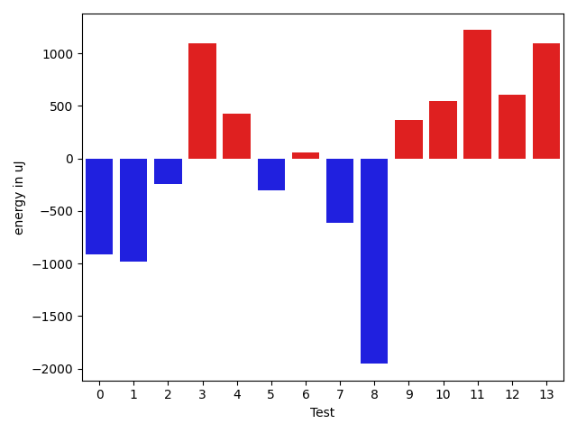
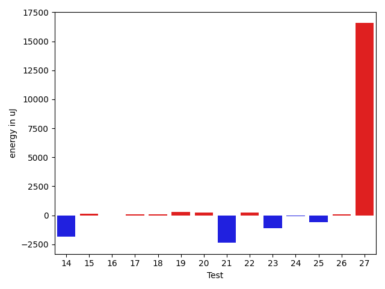
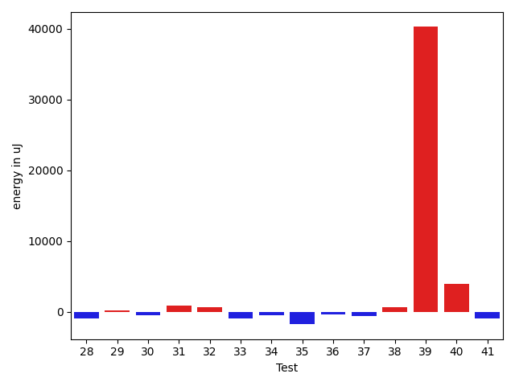
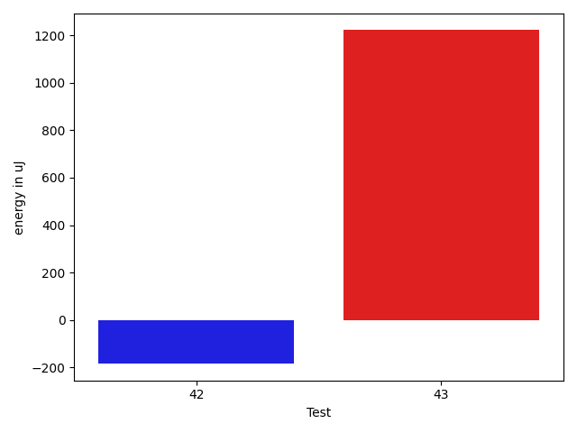

# gson 3ff6bd

https://github.com/google/gson/commit/3ff6bd

## Delta Energy per test method

| ID | EnergyV1 | EnergyV2 | DeltaEnergy | σV1 | σV2 |
| --- | --- | --- | --- | --- | --- |
| 0 | 35705 | 34790 | -915 | 8402.99574358433 | 19949.011434133372 |
| 1 | 70434 | 69457 | -977 | 23201.311111498013 | 25776.538411274534 |
| 2 | 34729 | 34484 | -245 | 2936.046212063938 | 2546.380041680084 |
| 3 | 36194 | 37293 | 1099 | 20744.090603290322 | 28633.702847067976 |
| 4 | 33936 | 34363 | 427 | 8833.794124300537 | 6301.074766555213 |
| 5 | 34180 | 33875 | -305 | 6119.89572923306 | 9555.013764650108 |
| 6 | 33569 | 33630 | 61 | 2626.8912325218184 | 3307.282070564904 |
| 7 | 36011 | 35400 | -611 | 12494.074101678158 | 47763.65741150484 |
| 8 | 39551 | 37598 | -1953 | 129197.53213501943 | 106170.12132236714 |
| 9 | 35095 | 35461 | 366 | 14449.830736581862 | 13126.690397941018 |
| 10 | 34973 | 35523 | 550 | 2734.3579290253256 | 5988.903557144307 |
| 11 | 34973 | 36194 | 1221 | 3270.0278225976017 | 2547.7033874852696 |
| 12 | 34546 | 35156 | 610 | 3047.2065296427677 | 3019.4494491218875 |
| 13 | 33814 | 34912 | 1098 | 2721.9221547261204 | 3437.0224530915643 |
| 14 | 37232 | 35400 | -1832 | 16726.580778654497 | 11637.756721319103 |
| 15 | 34912 | 35035 | 123 | 5882.159172776401 | 2741.1643124003726 |
| 16 | 35279 | 35278 | -1 | 3293.144120353335 | 2491.9980122430384 |
| 17 | 33935 | 33996 | 61 | 2808.4181310461818 | 2907.1264221630913 |
| 18 | 33570 | 33631 | 61 | 1942.0808631181403 | 2853.0464030186713 |
| 19 | 34057 | 34363 | 306 | 22617.744098277828 | 19943.731914193602 |
| 20 | 34302 | 34546 | 244 | 3645.7478651899933 | 2949.0544207137586 |
| 21 | 40222 | 37841 | -2381 | 22180.34295555583 | 9204.41228570303 |
| 22 | 35705 | 35950 | 245 | 4305.113478951368 | 3238.026283330397 |
| 23 | 35095 | 33997 | -1098 | 13215.222572597924 | 13614.801540318205 |
| 24 | 35400 | 35339 | -61 | 9043.099332615991 | 10485.087500231799 |
| 25 | 34485 | 33874 | -611 | 13072.60017946959 | 11119.68739569516 |
| 26 | 35766 | 35828 | 62 | 17150.153867978483 | 15641.390323403572 |
| 27 | 41870 | 58471 | 16601 | 111788.83722782039 | 108205.12903966129 |
| 28 | 70434 | 69519 | -915 | 30423.230591391468 | 33626.77908141466 |
| 29 | 37414 | 37598 | 184 | 15674.398293708487 | 18057.149494442492 |
| 30 | 34851 | 34302 | -549 | 13250.39023980304 | 14008.856680490613 |
| 31 | 35522 | 36438 | 916 | 3002.1553318798633 | 3559.4292213380054 |
| 32 | 36072 | 36682 | 610 | 54943.95388879668 | 58907.19894972987 |
| 33 | 35889 | 34912 | -977 | 3508.720648631928 | 2910.0806835952185 |
| 34 | 35827 | 35339 | -488 | 3771.7566247974696 | 2953.2927386224346 |
| 35 | 38391 | 36621 | -1770 | 62061.21598890966 | 41799.30333305709 |
| 36 | 36682 | 36316 | -366 | 3288.7601180611073 | 8204.089447123306 |
| 37 | 37353 | 36743 | -610 | 168044.00623946177 | 379027.9862010642 |
| 38 | 35889 | 36560 | 671 | 21848.99740052257 | 32310.86792887972 |
| 39 | 357849 | 398131 | 40282 | 114674.97062288287 | 111599.28845804985 |
| 40 | 75623 | 79528 | 3905 | 65372.79795210172 | 69358.26139014859 |
| 41 | 40711 | 39734 | -977 | 126854.61524597608 | 153439.18562345748 |
| 42 | 39551 | 39367 | -184 | 65580.81480925615 | 60025.06675260196 |
| 43 | 38757 | 39978 | 1221 | 54682.44835668384 | 64003.91338669596 |

## Delta Duration per test method

| ID | DurationV1 | DurationsV2 | DeltaDuration |
| --- | --- | --- | --- |
| 0 | 1140496.3731343283 | 1119090.4285714286 | -21405.944562899647 |
| 1 | 2265261.515151515 | 2138273.5555555555 | -126987.95959595963 |
| 2 | 702504.525 | 697176.8 | -5327.724999999977 |
| 3 | 1772067.775510204 | 1834413.2903225806 | 62345.51481237658 |
| 4 | 823098.5490196078 | 784017.2142857143 | -39081.33473389351 |
| 5 | 1101153.7575757576 | 1112064.3 | 10910.542424242478 |
| 6 | 702510.325 | 702102.5384615385 | -407.7865384614561 |
| 7 | 1164845.7538461538 | 1392350.22 | 227504.46615384612 |
| 8 | 3261665.9322033897 | 2198483.9787234045 | -1063181.9534799852 |
| 9 | 1325839.253012048 | 1227884.3670886075 | -97954.88592344057 |
| 10 | 748493.3846153846 | 759592.7073170731 | 11099.322701688507 |
| 11 | 968925.1481481482 | 904624.5918367347 | -64300.55631141353 |
| 12 | 869639.0909090909 | 872890.8222222222 | 3251.731313131284 |
| 13 | 953699.5333333333 | 965609.8833333333 | 11910.349999999977 |
| 14 | 1444207.0689655172 | 1316527.1348314607 | -127679.93413405656 |
| 15 | 1142877.1 | 1063931.6712328766 | -78945.42876712349 |
| 16 | 796361.4489795918 | 797568.4186046511 | 1206.9696250592824 |
| 17 | 652835.0 | 663728.2857142857 | 10893.285714285681 |
| 18 | 685446.5945945946 | 649573.0555555555 | -35873.53903903905 |
| 19 | 989533.3902439025 | 1064921.9302325582 | 75388.53998865571 |
| 20 | 699280.6578947369 | 718152.3333333334 | 18871.675438596518 |
| 21 | 1562395.9361702127 | 1102046.1351351351 | -460349.80103507754 |
| 22 | 901108.4262295082 | 938462.7115384615 | 37354.28530895326 |
| 23 | 1437614.888888889 | 1486585.5670103093 | 48970.67812142032 |
| 24 | 1322514.012195122 | 1332393.7160493827 | 9879.703854260733 |
| 25 | 1415665.3260869565 | 1427404.8282828282 | 11739.502195871668 |
| 26 | 1557879.4747474748 | 1638128.6836734693 | 80249.20892599458 |
| 27 | 3196589.673469388 | 3145826.6597938146 | -50763.01367557328 |
| 28 | 2484641.3434343436 | 2641140.696969697 | 156499.3535353532 |
| 29 | 1570041.752688172 | 1644828.0425531915 | 74786.2898650195 |
| 30 | 1423143.0 | 1461610.2577319588 | 38467.25773195876 |
| 31 | 827160.0285714286 | 824599.4545454546 | -2560.574025974027 |
| 32 | 1701049.5454545454 | 1634709.05 | -66340.49545454537 |
| 33 | 757119.2142857143 | 789316.0 | 32196.78571428568 |
| 34 | 742712.2105263158 | 828963.5909090909 | 86251.3803827751 |
| 35 | 2169531.054054054 | 1653797.2688172043 | -515733.7852368497 |
| 36 | 930764.8125 | 975594.54 | 44829.72750000004 |
| 37 | 1857313.0361445784 | 3977379.8333333335 | 2120066.797188755 |
| 38 | 1354249.9277108433 | 1480189.811764706 | 125939.88405386265 |
| 39 | 10470427.191919193 | 10842018.383838383 | 371591.1919191908 |
| 40 | 2999871.5454545454 | 3241547.414141414 | 241675.8686868688 |
| 41 | 2643844.96 | 3624223.55 | 980378.5899999999 |
| 42 | 1934787.0545454544 | 1950264.462962963 | 15477.408417508472 |
| 43 | 1810345.0 | 2059207.924528302 | 248862.92452830193 |

## Misc.

| ID | Test Class | Test Method |
| --- | --- | --- |
| 0 | com.google.gson.functional.ObjectTest | testDirectedAcyclicGraphDeserialization |
| 1 | com.google.gson.functional.ObjectTest | testArrayOfArraysDeserialization |
| 2 | com.google.gson.functional.ObjectTest | testClassWithTransientFieldsDeserialization |
| 3 | com.google.gson.functional.ObjectTest | testSubInterfacesOfCollectionDeserialization |
| 4 | com.google.gson.functional.ObjectTest | testClassWithTransientFieldsDeserializationTransientFieldsPassedInJsonAreIgnored |
| 5 | com.google.gson.functional.ObjectTest | testPrimitiveArrayInAnObjectDeserialization |
| 6 | com.google.gson.functional.ObjectTest | testNullArraysDeserialization |
| 7 | com.google.gson.functional.ObjectTest | testClassWithEnumFieldDeserialization |
| 8 | com.google.gson.functional.ObjectTest | testJsonInSingleQuotesDeserialization |
| 9 | com.google.gson.functional.ObjectTest | testInheritenceDeserialization |
| 10 | com.google.gson.functional.ObjectTest | testJsonInMixedQuotesDeserialization |
| 11 | com.google.gson.functional.ObjectTest | testNullFieldsDeserialization |
| 12 | com.google.gson.functional.ObjectTest | testBagOfPrimitivesDeserialization |
| 13 | com.google.gson.functional.ObjectTest | testInnerClassDeserialization |
| 14 | com.google.gson.functional.ObjectTest | testArrayOfObjectsDeserialization |
| 15 | com.google.gson.functional.ObjectTest | testNestedDeserialization |
| 16 | com.google.gson.functional.ObjectTest | testBagOfPrimitiveWrappersDeserialization |
| 17 | com.google.gson.functional.ObjectTest | testNullPrimitiveFieldsDeserialization |
| 18 | com.google.gson.functional.ObjectTest | testNullObjectFieldsDeserialization |
| 19 | com.google.gson.functional.ObjectTest | testEmptyCollectionInAnObjectDeserialization |
| 20 | com.google.gson.functional.ObjectTest | testPrivateNoArgConstructorDeserialization |
| 21 | com.google.gson.functional.NullObjectAndFieldTest | testExplicitDeserializationOfNulls |
| 22 | com.google.gson.functional.NullObjectAndFieldTest | testNullWrappedPrimitiveMemberDeserialization |
| 23 | com.google.gson.functional.ParameterizedTypesTest | testVariableTypeArrayDeserialization |
| 24 | com.google.gson.functional.ParameterizedTypesTest | testParameterizedTypeWithReaderDeserialization |
| 25 | com.google.gson.functional.ParameterizedTypesTest | testVariableTypeDeserialization |
| 26 | com.google.gson.functional.ParameterizedTypesTest | testParameterizedTypeGenericArraysDeserialization |
| 27 | com.google.gson.functional.ParameterizedTypesTest | testParameterizedTypeDeserialization |
| 28 | com.google.gson.functional.ParameterizedTypesTest | testVariableTypeFieldsAndGenericArraysDeserialization |
| 29 | com.google.gson.functional.ParameterizedTypesTest | testTypesWithMultipleParametersDeserialization |
| 30 | com.google.gson.functional.ParameterizedTypesTest | testParameterizedTypeWithVariableTypeDeserialization |
| 31 | com.google.gson.functional.NamingPolicyTest | testGsonWithSerializedNameFieldNamingPolicyDeserialization |
| 32 | com.google.gson.functional.NamingPolicyTest | testGsonWithNonDefaultFieldNamingPolicyDeserialiation |
| 33 | com.google.gson.functional.DefaultTypeAdaptersTest | testBigIntegerFieldDeserialization |
| 34 | com.google.gson.functional.DefaultTypeAdaptersTest | testBigDecimalFieldDeserialization |
| 35 | com.google.gson.functional.VersioningTest | testVersionedClassesDeserialization |
| 36 | com.google.gson.functional.VersioningTest | testVersionedGsonWithUnversionedClassesDeserialization |
| 37 | com.google.gson.functional.CustomTypeAdaptersTest | testCustomNestedDeserializers |
| 38 | com.google.gson.functional.CustomTypeAdaptersTest | testCustomDeserializerForLong |
| 39 | com.google.gson.functional.ConcurrencyTest | testMultiThreadDeserialization |
| 40 | com.google.gson.functional.ConcurrencyTest | testSingleThreadDeserialization |
| 41 | com.google.gson.functional.EscapingTest | testEscapingObjectFields |
| 42 | com.google.gson.functional.ReadersWritersTest | testReaderForDeserialization |
| 43 | com.google.gson.functional.ExposeFieldsTest | testExposeAnnotationDeserialization |

| Test | IterationV1 | IterationV2 | DeltaIteration |
| --- | --- | --- | --- |
| 0 | 67 | 70 | 3 |
| 1 | 99 | 99 | 0 |
| 2 | 40 | 30 | -10 |
| 3 | 98 | 93 | -5 |
| 4 | 51 | 42 | -9 |
| 5 | 66 | 70 | 4 |
| 6 | 40 | 39 | -1 |
| 7 | 65 | 50 | -15 |
| 8 | 59 | 47 | -12 |
| 9 | 83 | 79 | -4 |
| 10 | 52 | 41 | -11 |
| 11 | 54 | 49 | -5 |
| 12 | 44 | 45 | 1 |
| 13 | 60 | 60 | 0 |
| 14 | 87 | 89 | 2 |
| 15 | 70 | 73 | 3 |
| 16 | 49 | 43 | -6 |
| 17 | 34 | 28 | -6 |
| 18 | 37 | 36 | -1 |
| 19 | 41 | 43 | 2 |
| 20 | 38 | 39 | 1 |
| 21 | 47 | 37 | -10 |
| 22 | 61 | 52 | -9 |
| 23 | 99 | 97 | -2 |
| 24 | 82 | 81 | -1 |
| 25 | 92 | 99 | 7 |
| 26 | 99 | 98 | -1 |
| 27 | 98 | 97 | -1 |
| 28 | 99 | 99 | 0 |
| 29 | 93 | 94 | 1 |
| 30 | 97 | 97 | 0 |
| 31 | 35 | 44 | 9 |
| 32 | 55 | 60 | 5 |
| 33 | 42 | 42 | 0 |
| 34 | 38 | 44 | 6 |
| 35 | 74 | 93 | 19 |
| 36 | 48 | 50 | 2 |
| 37 | 83 | 72 | -11 |
| 38 | 83 | 85 | 2 |
| 39 | 99 | 99 | 0 |
| 40 | 99 | 99 | 0 |
| 41 | 75 | 80 | 5 |
| 42 | 55 | 54 | -1 |
| 43 | 39 | 53 | 14 |

| Time Label | Time (s) |
| --- | --- |
| Selection | 21.11071538925171 |
| Injection | 10.117647171020508 |
| Total | 945.3301844596863 |

