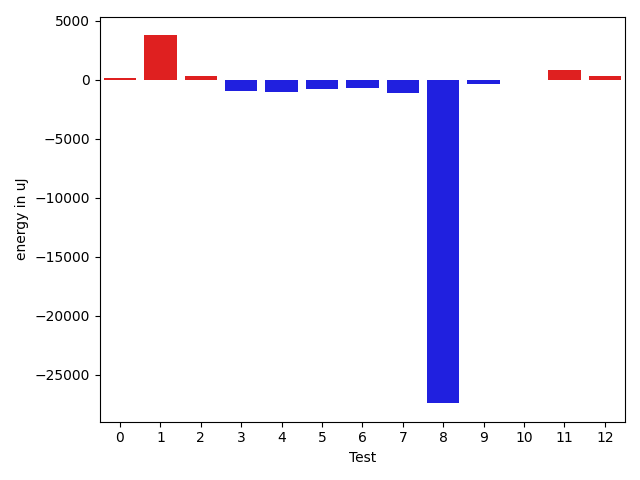
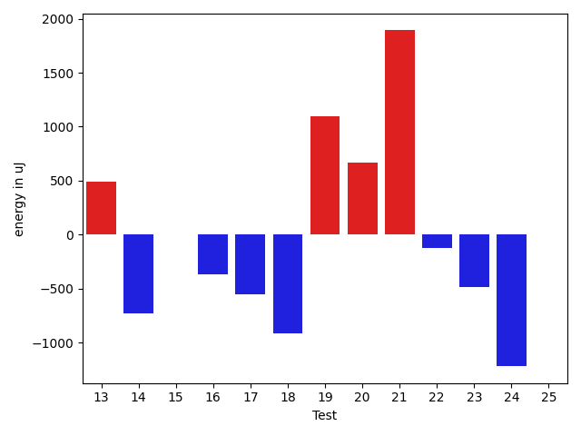
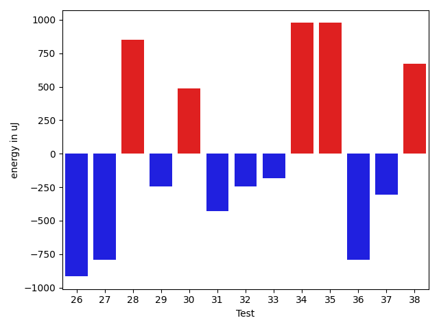
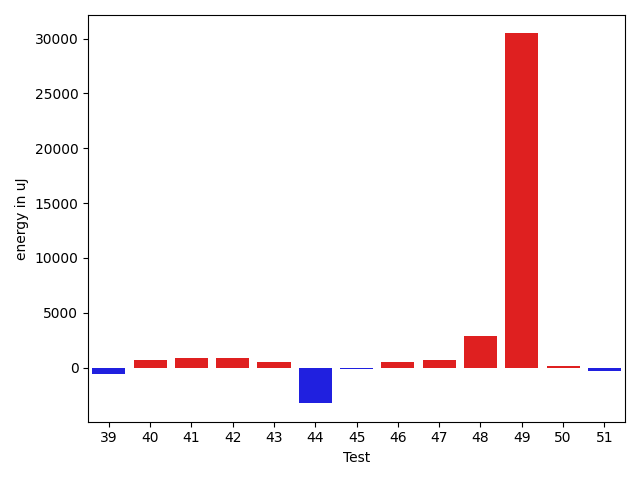
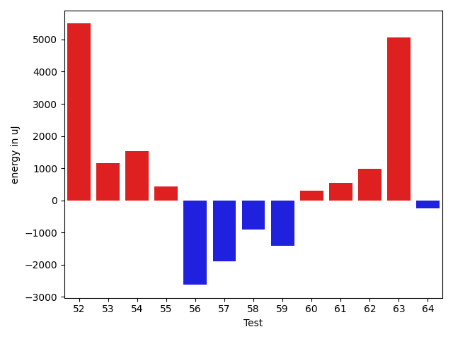
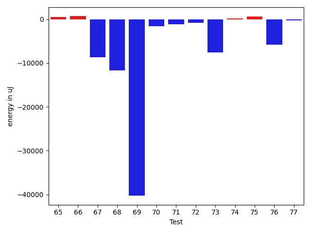
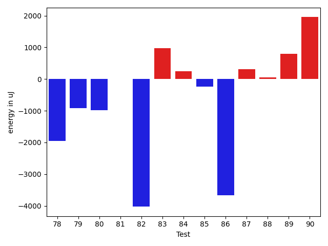
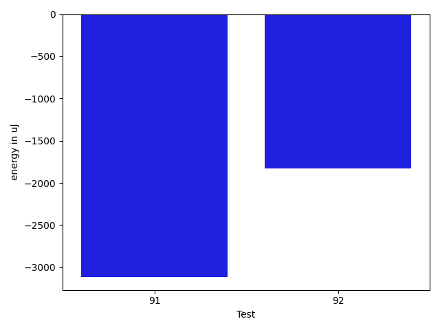

# gson 9a6956

https://github.com/google/gson/commit/9a6956

## Delta Energy per test method

| ID | EnergyV1 | EnergyV2 | DeltaEnergy | σV1 | σV2 |
| --- | --- | --- | --- | --- | --- |
| 0 | 33630 | 33753 | 123 | 3271.884775641993 | 5592.920236445379 |
| 1 | 57617 | 61402 | 3785 | 32541.837710720054 | 37835.250526411764 |
| 2 | 65673 | 65979 | 306 | 26090.95000915563 | 27212.718825725045 |
| 3 | 34119 | 33203 | -916 | 18328.611975245905 | 56761.898157333955 |
| 4 | 33935 | 32898 | -1037 | 8581.566883801243 | 2602.46729507093 |
| 5 | 34851 | 34057 | -794 | 2887.7719974705415 | 3001.815903785841 |
| 6 | 34790 | 34058 | -732 | 12799.155486824782 | 12167.818177983641 |
| 7 | 35400 | 34301 | -1099 | 13370.711728622977 | 11892.715587425288 |
| 8 | 102722 | 75318 | -27404 | 49774.56084024483 | 43370.20056604141 |
| 9 | 34851 | 34484 | -367 | 52996.86922956677 | 2856.8680179313005 |
| 10 | 34485 | 34485 | 0 | 7626.6147094632925 | 8014.505670362125 |
| 11 | 34729 | 35584 | 855 | 13634.942666008003 | 11481.992902044098 |
| 12 | 34668 | 34973 | 305 | 2690.4596405632997 | 3813.8010296873304 |
| 13 | 34240 | 34729 | 489 | 8754.171134798895 | 7442.853026951666 |
| 14 | 35096 | 34363 | -733 | 5154.287412955325 | 47474.7240900266 |
| 15 | 33203 | 33203 | 0 | 2168.4245140801854 | 7206.578036766132 |
| 16 | 35522 | 35156 | -366 | 44939.992463249866 | 7841.498413470383 |
| 17 | 35584 | 35034 | -550 | 2918.2871445919645 | 3317.877976956424 |
| 18 | 34119 | 33203 | -916 | 2993.6161190481625 | 3279.243526587598 |
| 19 | 32959 | 34058 | 1099 | 2849.6742768026957 | 3032.669052212409 |
| 20 | 32227 | 32898 | 671 | 2680.7622330971462 | 2606.668326251999 |
| 21 | 33142 | 35034 | 1892 | 2608.6503149140067 | 3238.170181220577 |
| 22 | 34119 | 33997 | -122 | 26225.174367998854 | 9881.854847522301 |
| 23 | 33936 | 33447 | -489 | 4635.851416245056 | 3062.471663435011 |
| 24 | 33691 | 32471 | -1220 | 2432.486252387782 | 2706.3852530852446 |
| 25 | 34058 | 34058 | 0 | 4690.585855828506 | 3109.0930203120784 |
| 26 | 34912 | 33996 | -916 | 12508.140623210149 | 25170.851670074157 |
| 27 | 34790 | 33996 | -794 | 2674.6060288801827 | 3189.2852841916197 |
| 28 | 33631 | 34484 | 853 | 8422.429392286738 | 8439.35823449911 |
| 29 | 36316 | 36072 | -244 | 14225.60015571072 | 9342.900885030302 |
| 30 | 33752 | 34240 | 488 | 3048.6134471663304 | 3818.5491276019084 |
| 31 | 33447 | 33020 | -427 | 2973.928110792738 | 2361.020418151981 |
| 32 | 33874 | 33631 | -243 | 3458.7652764612867 | 6227.17828910726 |
| 33 | 33019 | 32837 | -182 | 2599.592501425827 | 3878.0422586660916 |
| 34 | 34302 | 35278 | 976 | 3166.5585518483213 | 3406.8163494513306 |
| 35 | 35278 | 36254 | 976 | 100368.02919386032 | 79097.93868826573 |
| 36 | 35217 | 34424 | -793 | 3271.688550368486 | 5259.815438249183 |
| 37 | 33509 | 33203 | -306 | 2925.5259574004504 | 2611.2242861640707 |
| 38 | 32715 | 33386 | 671 | 13301.358810732087 | 9178.697577422645 |
| 39 | 33691 | 33142 | -549 | 6239.6125305148025 | 2852.767546296256 |
| 40 | 33631 | 34362 | 731 | 12429.411520414596 | 15171.590858986256 |
| 41 | 33569 | 34485 | 916 | 16766.64799585478 | 6761.958826022232 |
| 42 | 74096 | 74951 | 855 | 65530.19704994441 | 84689.18148546822 |
| 43 | 34058 | 34607 | 549 | 13735.324597749981 | 11338.743214588674 |
| 44 | 84228 | 80993 | -3235 | 31840.52766252753 | 24675.260820248513 |
| 45 | 34180 | 34058 | -122 | 14800.836912701803 | 12735.980918657666 |
| 46 | 35644 | 36194 | 550 | 51983.34204916989 | 82925.10308664411 |
| 47 | 66101 | 66833 | 732 | 29368.158645084237 | 27674.2440408501 |
| 48 | 34241 | 37109 | 2868 | 61179.31748087087 | 61739.0479753889 |
| 49 | 66894 | 97351 | 30457 | 45450.40727717471 | 52963.79537314732 |
| 50 | 33142 | 33325 | 183 | 10242.35331018685 | 10029.522431144607 |
| 51 | 34546 | 34241 | -305 | 29369.856438505216 | 9169.133100517603 |
| 52 | 78125 | 83618 | 5493 | 64105.380026747356 | 92767.22790744937 |
| 53 | 35766 | 36926 | 1160 | 3104.103522802052 | 3123.9175038154767 |
| 54 | 35095 | 36621 | 1526 | 14927.293849973787 | 14021.35812136899 |
| 55 | 36499 | 36926 | 427 | 37481.92348253511 | 53273.80774185785 |
| 56 | 40039 | 37415 | -2624 | 12274.108656434038 | 15572.136069274504 |
| 57 | 36376 | 34485 | -1891 | 3067.9592666010803 | 3366.412845769702 |
| 58 | 37964 | 37048 | -916 | 31009.965190939376 | 27676.039958803623 |
| 59 | 35827 | 34424 | -1403 | 3201.0535807771435 | 4085.0525027981325 |
| 60 | 38452 | 38757 | 305 | 77007.37933982747 | 104037.75409212385 |
| 61 | 35339 | 35888 | 549 | 5374.552934708294 | 3519.953127223605 |
| 62 | 34302 | 35279 | 977 | 3459.5705354755464 | 2713.4749425577693 |
| 63 | 77758 | 82824 | 5066 | 345297.9600486187 | 291457.4894278969 |
| 64 | 35461 | 35217 | -244 | 3081.612097852439 | 3484.835904086316 |
| 65 | 71899 | 72387 | 488 | 59281.689253885175 | 46193.197956780816 |
| 66 | 36499 | 37170 | 671 | 60052.70500031514 | 41492.88291284412 |
| 67 | 72326 | 63598 | -8728 | 37212.821876189126 | 50294.63678456312 |
| 68 | 295410 | 283752 | -11658 | 91585.0950400108 | 100291.92139956502 |
| 69 | 356750 | 316466 | -40284 | 103093.66424340206 | 77788.84213101566 |
| 70 | 72021 | 70435 | -1586 | 44224.91428476886 | 54010.60413451047 |
| 71 | 35034 | 33874 | -1160 | 3792.2491236086016 | 2505.2359361400313 |
| 72 | 35522 | 34668 | -854 | 5936.956458869564 | 3409.4888893198045 |
| 73 | 75378 | 67749 | -7629 | 22856.400617954874 | 17381.811654925536 |
| 74 | 33874 | 33997 | 123 | 3379.975813279785 | 3289.6303053231345 |
| 75 | 35950 | 36560 | 610 | 65278.433678025474 | 55550.76747098559 |
| 76 | 130798 | 124938 | -5860 | 433319.3938300059 | 306559.04536881845 |
| 77 | 37232 | 36987 | -245 | 48032.88423284884 | 34253.005853012386 |
| 78 | 39673 | 37719 | -1954 | 28930.931958862468 | 21421.130363381417 |
| 79 | 72082 | 71167 | -915 | 28063.81956973368 | 24549.689077959985 |
| 80 | 38513 | 37537 | -976 | 76799.04217689043 | 60827.672787330834 |
| 81 | 35705 | 35705 | 0 | 3229.130104855306 | 31644.521284692713 |
| 82 | 67566 | 63538 | -4028 | 22511.0802931602 | 20358.089446027592 |
| 83 | 36316 | 37293 | 977 | 62263.805888954004 | 30973.722334514707 |
| 84 | 36865 | 37110 | 245 | 19361.968449781834 | 232652.1725365114 |
| 85 | 38391 | 38147 | -244 | 46958.5343755843 | 46559.306124748175 |
| 86 | 83863 | 80200 | -3663 | 99055.5318261947 | 66981.39680305721 |
| 87 | 36743 | 37049 | 306 | 169076.5382868415 | 168738.7233492763 |
| 88 | 39246 | 39306 | 60 | 605146.1666560632 | 697035.0943662872 |
| 89 | 35278 | 36072 | 794 | 3134.886012057496 | 5076.125591805349 |
| 90 | 37476 | 39429 | 1953 | 30472.28040605247 | 116974.91419471474 |
| 91 | 38940 | 35828 | -3112 | 123334.68965408368 | 87918.65735555372 |
| 92 | 39246 | 37414 | -1832 | 69848.39912600085 | 42752.759789914635 |

## Delta Duration per test method

| ID | DurationV1 | DurationsV2 | DeltaDuration |
| --- | --- | --- | --- |
| 0 | 1002738.8676470588 | 1055409.453125 | 52670.585477941204 |
| 1 | 1997759.608695652 | 2100065.7317073173 | 102306.12301166519 |
| 2 | 2047030.948979592 | 2091612.0202020202 | 44581.07122242823 |
| 3 | 1422321.1666666667 | 1528893.6363636365 | 106572.46969696973 |
| 4 | 763970.4864864865 | 670868.1351351351 | -93102.35135135136 |
| 5 | 657467.09375 | 663179.1578947369 | 5712.064144736854 |
| 6 | 1301204.1294117647 | 1269554.177777778 | -31649.951633986784 |
| 7 | 1250224.6923076923 | 1282188.75 | 31964.057692307746 |
| 8 | 3556652.6428571427 | 3128564.505050505 | -428088.1378066377 |
| 9 | 1457772.5 | 987394.0344827586 | -470378.4655172414 |
| 10 | 1054465.8309859154 | 1115440.9733333334 | 60975.142347418005 |
| 11 | 1136044.0 | 1183237.7283950618 | 47193.7283950618 |
| 12 | 822334.875 | 800839.0612244898 | -21495.813775510178 |
| 13 | 1055417.696969697 | 1011007.2678571428 | -44410.42911255418 |
| 14 | 765924.804347826 | 1110997.8292682928 | 345073.0249204667 |
| 15 | 601809.5 | 637858.4583333334 | 36048.95833333337 |
| 16 | 1303661.1186440678 | 999618.0754716981 | -304043.0431723697 |
| 17 | 657574.0540540541 | 662266.5454545454 | 4692.49140049133 |
| 18 | 629341.1621621621 | 635874.0 | 6532.837837837869 |
| 19 | 521420.29032258067 | 490855.77777777775 | -30564.512544802914 |
| 20 | 585719.56 | 647722.0303030303 | 62002.47030303022 |
| 21 | 797680.5217391305 | 762148.7804878049 | -35531.741251325584 |
| 22 | 1123260.7777777778 | 883078.15 | -240182.62777777773 |
| 23 | 986071.1830985915 | 940310.0952380953 | -45761.08786049625 |
| 24 | 677349.6458333334 | 654070.3333333334 | -23279.3125 |
| 25 | 890955.171875 | 842004.6323529412 | -48950.539522058796 |
| 26 | 853862.4 | 842748.0625 | -11114.337500000023 |
| 27 | 603087.9166666666 | 718738.7894736842 | 115650.87280701753 |
| 28 | 942160.1666666666 | 847150.4130434783 | -95009.75362318836 |
| 29 | 861804.5813953489 | 777375.65 | -84428.93139534886 |
| 30 | 704809.8837209302 | 696102.7619047619 | -8707.121816168306 |
| 31 | 631838.1904761905 | 624582.1666666666 | -7256.023809523904 |
| 32 | 670578.2222222222 | 725483.2580645161 | 54905.03584229387 |
| 33 | 539516.4285714285 | 473072.32 | -66444.10857142851 |
| 34 | 707528.4117647059 | 676561.8333333334 | -30966.57843137253 |
| 35 | 1943761.558139535 | 1533505.4905660378 | -410256.0675734971 |
| 36 | 722653.9714285714 | 828792.1777777778 | 106138.20634920639 |
| 37 | 658176.552631579 | 765738.9714285714 | 107562.4187969924 |
| 38 | 1120384.9350649351 | 1079116.4615384615 | -41268.47352647362 |
| 39 | 942039.0161290322 | 921021.4179104478 | -21017.598218584433 |
| 40 | 1376493.6666666667 | 1428811.5154639175 | 52317.84879725077 |
| 41 | 1192786.511627907 | 1215008.1842105263 | 22221.672582619358 |
| 42 | 2906895.2210526317 | 3505510.3163265307 | 598615.0952738989 |
| 43 | 1374396.7916666667 | 1337434.306122449 | -36962.48554421775 |
| 44 | 2846056.9393939395 | 2975241.0 | 129184.06060606055 |
| 45 | 1470685.6363636365 | 1466363.3333333333 | -4322.303030303214 |
| 46 | 1712823.5268817204 | 2491805.3333333335 | 778981.8064516131 |
| 47 | 2332228.4646464647 | 2356688.282828283 | 24459.81818181835 |
| 48 | 1687925.3085106383 | 1825261.402173913 | 137336.09366327478 |
| 49 | 2543762.6767676766 | 2884728.87628866 | 340966.19952098327 |
| 50 | 1343691.775510204 | 1400572.2474226805 | 56880.47191247647 |
| 51 | 1445855.430107527 | 1331273.2688172043 | -114582.16129032266 |
| 52 | 3361299.2551020407 | 4150391.5204081633 | 789092.2653061226 |
| 53 | 594115.6666666666 | 582481.074074074 | -11634.592592592584 |
| 54 | 1071365.5714285714 | 1053321.4897959183 | -18044.08163265302 |
| 55 | 1102756.9444444445 | 1612057.319148936 | 509300.3747044916 |
| 56 | 1052935.642857143 | 1030655.275 | -22280.367857142934 |
| 57 | 610667.5 | 624959.3142857143 | 14291.814285714296 |
| 58 | 1629201.686746988 | 1603974.2068965517 | -25227.479850436328 |
| 59 | 658119.2222222222 | 567832.8148148148 | -90286.40740740742 |
| 60 | 1744724.15625 | 2584250.189189189 | 839526.0329391891 |
| 61 | 794011.3725490196 | 822646.9636363636 | 28635.591087343986 |
| 62 | 804301.4583333334 | 887091.25 | 82789.79166666663 |
| 63 | 5436445.02020202 | 4566591.303030303 | -869853.7171717174 |
| 64 | 720246.1538461539 | 699276.8636363636 | -20969.290209790226 |
| 65 | 2959784.9494949495 | 2775827.9595959596 | -183956.9898989899 |
| 66 | 1788018.4047619049 | 1249866.5714285714 | -538151.8333333335 |
| 67 | 2165218.98989899 | 2104917.6428571427 | -60301.347041847184 |
| 68 | 8970613.02020202 | 8910544.191919193 | -60068.82828282751 |
| 69 | 10202450.131313132 | 9317302.93939394 | -885147.1919191927 |
| 70 | 2342012.5454545454 | 2389244.8383838385 | 47232.29292929312 |
| 71 | 648732.0285714286 | 691654.4418604651 | 42922.413289036485 |
| 72 | 1139722.172839506 | 1166766.3698630137 | 27044.197023507673 |
| 73 | 2761701.3131313133 | 2265109.404040404 | -496591.9090909092 |
| 74 | 670792.6666666666 | 663562.0930232558 | -7230.573643410811 |
| 75 | 2083590.5263157894 | 1689650.357142857 | -393940.1691729324 |
| 76 | 8724064.161616161 | 6269784.555555556 | -2454279.6060606055 |
| 77 | 1719548.9803921569 | 1201682.914893617 | -517866.06549853995 |
| 78 | 1347061.0408163266 | 1138578.6326530613 | -208482.40816326533 |
| 79 | 2476858.262626263 | 2327728.1414141413 | -149130.12121212156 |
| 80 | 2168241.6530612246 | 1600127.5869565217 | -568114.0661047029 |
| 81 | 1005766.6 | 1233219.9411764706 | 227453.34117647063 |
| 82 | 2039788.5858585858 | 1949959.707070707 | -89828.87878787867 |
| 83 | 1762395.34375 | 1190880.265625 | -571515.078125 |
| 84 | 1253332.61971831 | 2463083.890625 | 1209751.27090669 |
| 85 | 1693111.9583333333 | 1853826.1038961038 | 160714.14556277054 |
| 86 | 4001206.1818181816 | 3479607.1818181816 | -521599.0 |
| 87 | 2103233.8307692306 | 2056334.2337662338 | -46899.59700299683 |
| 88 | 6730757.2602739725 | 9071587.0 | 2340829.7397260275 |
| 89 | 798404.9583333334 | 856392.0344827586 | 57987.07614942524 |
| 90 | 1222709.892857143 | 3076807.827586207 | 1854097.934729064 |
| 91 | 2955216.0444444446 | 1966547.829787234 | -988668.2146572105 |
| 92 | 2327936.6744186045 | 1412278.0212765958 | -915658.6531420087 |

## Misc.

| ID | Test Class | Test Method |
| --- | --- | --- |
| 0 | com.google.gson.functional.ObjectTest | testDirectedAcyclicGraphDeserialization |
| 1 | com.google.gson.functional.ObjectTest | testDirectedAcyclicGraphSerialization |
| 2 | com.google.gson.functional.ObjectTest | testArrayOfArraysDeserialization |
| 3 | com.google.gson.functional.ObjectTest | testSubInterfacesOfCollectionDeserialization |
| 4 | com.google.gson.functional.ObjectTest | testClassWithEnumFieldDeserialization |
| 5 | com.google.gson.functional.ObjectTest | testClassWithEnumFieldSerialization |
| 6 | com.google.gson.functional.ObjectTest | testArrayOfObjectsDeserialization |
| 7 | com.google.gson.functional.ObjectTest | testArrayOfArraysSerialization |
| 8 | com.google.gson.functional.ObjectTest | testSubInterfacesOfCollectionSerialization |
| 9 | com.google.gson.functional.ObjectTest | testNestedDeserialization |
| 10 | com.google.gson.functional.ObjectTest | testInheritenceDeserialization |
| 11 | com.google.gson.functional.ObjectTest | testInheritenceSerialization |
| 12 | com.google.gson.functional.ObjectTest | testNullFieldsDeserialization |
| 13 | com.google.gson.functional.ObjectTest | testArrayOfObjectsSerialization |
| 14 | com.google.gson.functional.ObjectTest | testBagOfPrimitivesDeserialization |
| 15 | com.google.gson.functional.ObjectTest | testNullObjectFieldsDeserialization |
| 16 | com.google.gson.functional.ObjectTest | testNestedSerialization |
| 17 | com.google.gson.functional.ObjectTest | testNullFieldsSerialization |
| 18 | com.google.gson.functional.ObjectTest | testPrivateNoArgConstructorDeserialization |
| 19 | com.google.gson.functional.ObjectTest | testSelfReferenceSerialization |
| 20 | com.google.gson.functional.ObjectTest | testNullArraysDeserialization |
| 21 | com.google.gson.functional.ObjectTest | testInnerClassSerialization |
| 22 | com.google.gson.functional.ObjectTest | testEmptyCollectionInAnObjectSerialization |
| 23 | com.google.gson.functional.ObjectTest | testClassWithObjectFieldSerialization |
| 24 | com.google.gson.functional.ObjectTest | testCircularSerialization |
| 25 | com.google.gson.functional.ObjectTest | testInnerClassDeserialization |
| 26 | com.google.gson.functional.ObjectTest | testEmptyCollectionInAnObjectDeserialization |
| 27 | com.google.gson.functional.ObjectTest | testClassWithTransientFieldsDeserialization |
| 28 | com.google.gson.functional.ObjectTest | testPrimitiveArrayInAnObjectDeserialization |
| 29 | com.google.gson.functional.ObjectTest | testBagOfPrimitivesSerialization |
| 30 | com.google.gson.functional.ObjectTest | testBagOfPrimitiveWrappersDeserialization |
| 31 | com.google.gson.functional.ObjectTest | testNullPrimitiveFieldsDeserialization |
| 32 | com.google.gson.functional.ObjectTest | testClassWithTransientFieldsDeserializationTransientFieldsPassedInJsonAreIgnored |
| 33 | com.google.gson.functional.ObjectTest | testPrimitiveArrayFieldSerialization |
| 34 | com.google.gson.functional.ObjectTest | testJsonInMixedQuotesDeserialization |
| 35 | com.google.gson.functional.ObjectTest | testJsonInSingleQuotesDeserialization |
| 36 | com.google.gson.functional.ObjectTest | testBagOfPrimitiveWrappersSerialization |
| 37 | com.google.gson.functional.ObjectTest | testClassWithTransientFieldsSerialization |
| 38 | com.google.gson.functional.ParameterizedTypesTest | testParameterizedTypeGenericArraysSerialization |
| 39 | com.google.gson.functional.ParameterizedTypesTest | testParameterizedTypesWithWriterSerialization |
| 40 | com.google.gson.functional.ParameterizedTypesTest | testVariableTypeArrayDeserialization |
| 41 | com.google.gson.functional.ParameterizedTypesTest | testParameterizedTypeWithReaderDeserialization |
| 42 | com.google.gson.functional.ParameterizedTypesTest | testParameterizedTypesSerialization |
| 43 | com.google.gson.functional.ParameterizedTypesTest | testVariableTypeDeserialization |
| 44 | com.google.gson.functional.ParameterizedTypesTest | testVariableTypeFieldsAndGenericArraysSerialization |
| 45 | com.google.gson.functional.ParameterizedTypesTest | testParameterizedTypeGenericArraysDeserialization |
| 46 | com.google.gson.functional.ParameterizedTypesTest | testParameterizedTypeDeserialization |
| 47 | com.google.gson.functional.ParameterizedTypesTest | testVariableTypeFieldsAndGenericArraysDeserialization |
| 48 | com.google.gson.functional.ParameterizedTypesTest | testTypesWithMultipleParametersDeserialization |
| 49 | com.google.gson.functional.ParameterizedTypesTest | testTypesWithMultipleParametersSerialization |
| 50 | com.google.gson.functional.ParameterizedTypesTest | testParameterizedTypeWithVariableTypeDeserialization |
| 51 | com.google.gson.functional.ParameterizedTypesTest | testParameterizedTypesWithCustomDeserializer |
| 52 | com.google.gson.functional.ExposeFieldsTest | testNullExposeFieldSerialization |
| 53 | com.google.gson.functional.ExposeFieldsTest | testExposeAnnotationSerialization |
| 54 | com.google.gson.functional.ExposeFieldsTest | testArrayWithOneNullExposeFieldObjectSerialization |
| 55 | com.google.gson.functional.ExposeFieldsTest | testExposeAnnotationDeserialization |
| 56 | com.google.gson.functional.NullObjectAndFieldTest | testExplicitDeserializationOfNulls |
| 57 | com.google.gson.functional.NullObjectAndFieldTest | testExplicitSerializationOfNullStringMembers |
| 58 | com.google.gson.functional.NullObjectAndFieldTest | testExplicitSerializationOfNullArrayMembers |
| 59 | com.google.gson.functional.NullObjectAndFieldTest | testExplicitSerializationOfNullCollectionMembers |
| 60 | com.google.gson.functional.NullObjectAndFieldTest | testExplicitSerializationOfNulls |
| 61 | com.google.gson.functional.NullObjectAndFieldTest | testNullWrappedPrimitiveMemberDeserialization |
| 62 | com.google.gson.functional.NullObjectAndFieldTest | testNullWrappedPrimitiveMemberSerialization |
| 63 | com.google.gson.functional.NamingPolicyTest | testGsonWithNonDefaultFieldNamingPolicySerialization |
| 64 | com.google.gson.functional.NamingPolicyTest | testGsonWithSerializedNameFieldNamingPolicyDeserialization |
| 65 | com.google.gson.functional.NamingPolicyTest | testGsonWithSerializedNameFieldNamingPolicySerialization |
| 66 | com.google.gson.functional.NamingPolicyTest | testGsonWithNonDefaultFieldNamingPolicyDeserialiation |
| 67 | com.google.gson.functional.ConcurrencyTest | testSingleThreadSerialization |
| 68 | com.google.gson.functional.ConcurrencyTest | testMultiThreadSerialization |
| 69 | com.google.gson.functional.ConcurrencyTest | testMultiThreadDeserialization |
| 70 | com.google.gson.functional.ConcurrencyTest | testSingleThreadDeserialization |
| 71 | com.google.gson.functional.DefaultTypeAdaptersTest | testBigIntegerFieldDeserialization |
| 72 | com.google.gson.functional.DefaultTypeAdaptersTest | testBigIntegerFieldSerialization |
| 73 | com.google.gson.functional.DefaultTypeAdaptersTest | testBigDecimalFieldSerialization |
| 74 | com.google.gson.functional.DefaultTypeAdaptersTest | testBigDecimalFieldDeserialization |
| 75 | com.google.gson.functional.VersioningTest | testVersionedClassesDeserialization |
| 76 | com.google.gson.functional.VersioningTest | testVersionedClassesSerialization |
| 77 | com.google.gson.functional.VersioningTest | testVersionedGsonWithUnversionedClassesSerialization |
| 78 | com.google.gson.functional.UncategorizedTest | testStaticFieldsAreNotSerialized |
| 79 | com.google.gson.functional.UncategorizedTest | testReturningDerivedClassesDuringDeserialization |
| 80 | com.google.gson.functional.UncategorizedTest | testObjectEqualButNotSameSerialization |
| 81 | com.google.gson.functional.CustomTypeAdaptersTest | testCustomNestedDeserializers |
| 82 | com.google.gson.functional.CustomTypeAdaptersTest | testCustomTypeAdapterDoesNotAppliesToSubClasses |
| 83 | com.google.gson.functional.CustomTypeAdaptersTest | testCustomDeserializers |
| 84 | com.google.gson.functional.CustomTypeAdaptersTest | testCustomNestedSerializers |
| 85 | com.google.gson.functional.EscapingTest | testEscapingObjectFields |
| 86 | com.google.gson.FunctionalWithInternalDependenciesTest | testPrettyPrintList |
| 87 | com.google.gson.FunctionalWithInternalDependenciesTest | testPrettyPrintArrayOfObjects |
| 88 | com.google.gson.functional.PrintFormattingTest | testCompactFormattingLeavesNoWhiteSpace |
| 89 | com.google.gson.functional.CollectionTest | testRawCollectionSerialization |
| 90 | com.google.gson.functional.CollectionTest | testCollectionOfBagOfPrimitivesSerialization |
| 91 | com.google.gson.functional.ReadersWritersTest | testWriterForSerialization |
| 92 | com.google.gson.functional.ReadersWritersTest | testReaderForDeserialization |

| Test | IterationV1 | IterationV2 | DeltaIteration |
| --- | --- | --- | --- |
| 0 | 68 | 64 | -4 |
| 1 | 69 | 82 | 13 |
| 2 | 98 | 99 | 1 |
| 3 | 96 | 88 | -8 |
| 4 | 37 | 37 | 0 |
| 5 | 32 | 38 | 6 |
| 6 | 85 | 90 | 5 |
| 7 | 91 | 88 | -3 |
| 8 | 98 | 99 | 1 |
| 9 | 54 | 58 | 4 |
| 10 | 71 | 75 | 4 |
| 11 | 65 | 81 | 16 |
| 12 | 40 | 49 | 9 |
| 13 | 66 | 56 | -10 |
| 14 | 46 | 41 | -5 |
| 15 | 24 | 24 | 0 |
| 16 | 59 | 53 | -6 |
| 17 | 37 | 33 | -4 |
| 18 | 37 | 30 | -7 |
| 19 | 31 | 27 | -4 |
| 20 | 25 | 33 | 8 |
| 21 | 46 | 41 | -5 |
| 22 | 36 | 20 | -16 |
| 23 | 71 | 63 | -8 |
| 24 | 48 | 36 | -12 |
| 25 | 64 | 68 | 4 |
| 26 | 30 | 32 | 2 |
| 27 | 36 | 38 | 2 |
| 28 | 48 | 46 | -2 |
| 29 | 43 | 40 | -3 |
| 30 | 43 | 42 | -1 |
| 31 | 21 | 24 | 3 |
| 32 | 36 | 31 | -5 |
| 33 | 28 | 25 | -3 |
| 34 | 34 | 36 | 2 |
| 35 | 43 | 53 | 10 |
| 36 | 35 | 45 | 10 |
| 37 | 38 | 35 | -3 |
| 38 | 77 | 78 | 1 |
| 39 | 62 | 67 | 5 |
| 40 | 96 | 97 | 1 |
| 41 | 86 | 76 | -10 |
| 42 | 95 | 98 | 3 |
| 43 | 96 | 98 | 2 |
| 44 | 99 | 99 | 0 |
| 45 | 99 | 99 | 0 |
| 46 | 93 | 96 | 3 |
| 47 | 99 | 99 | 0 |
| 48 | 94 | 92 | -2 |
| 49 | 99 | 97 | -2 |
| 50 | 98 | 97 | -1 |
| 51 | 93 | 93 | 0 |
| 52 | 98 | 98 | 0 |
| 53 | 21 | 27 | 6 |
| 54 | 49 | 49 | 0 |
| 55 | 36 | 47 | 11 |
| 56 | 28 | 40 | 12 |
| 57 | 32 | 35 | 3 |
| 58 | 83 | 87 | 4 |
| 59 | 36 | 27 | -9 |
| 60 | 32 | 37 | 5 |
| 61 | 51 | 55 | 4 |
| 62 | 48 | 48 | 0 |
| 63 | 99 | 99 | 0 |
| 64 | 39 | 44 | 5 |
| 65 | 99 | 99 | 0 |
| 66 | 42 | 49 | 7 |
| 67 | 99 | 98 | -1 |
| 68 | 99 | 99 | 0 |
| 69 | 99 | 99 | 0 |
| 70 | 99 | 99 | 0 |
| 71 | 35 | 43 | 8 |
| 72 | 81 | 73 | -8 |
| 73 | 99 | 99 | 0 |
| 74 | 39 | 43 | 4 |
| 75 | 76 | 70 | -6 |
| 76 | 99 | 99 | 0 |
| 77 | 51 | 47 | -4 |
| 78 | 49 | 49 | 0 |
| 79 | 99 | 99 | 0 |
| 80 | 49 | 46 | -3 |
| 81 | 65 | 68 | 3 |
| 82 | 99 | 99 | 0 |
| 83 | 64 | 64 | 0 |
| 84 | 71 | 64 | -7 |
| 85 | 72 | 77 | 5 |
| 86 | 99 | 99 | 0 |
| 87 | 65 | 77 | 12 |
| 88 | 73 | 66 | -7 |
| 89 | 48 | 58 | 10 |
| 90 | 56 | 58 | 2 |
| 91 | 45 | 47 | 2 |
| 92 | 43 | 47 | 4 |

| Time Label | Time (s) |
| --- | --- |
| Selection | 21.76150631904602 |
| Injection | 10.207416534423828 |
| Total | 956.3432972431183 |

