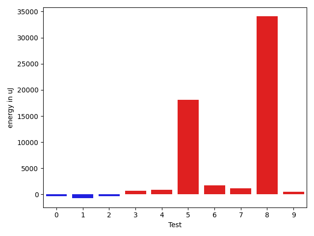
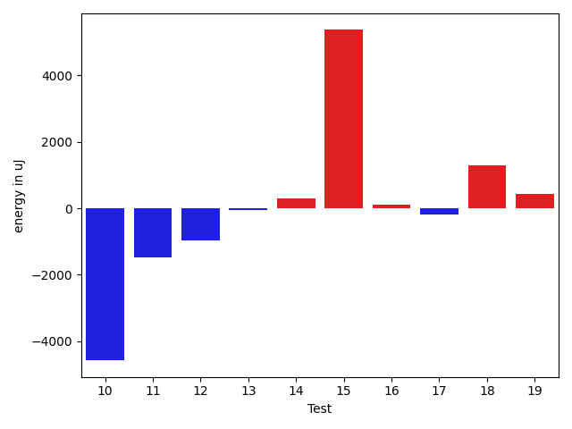
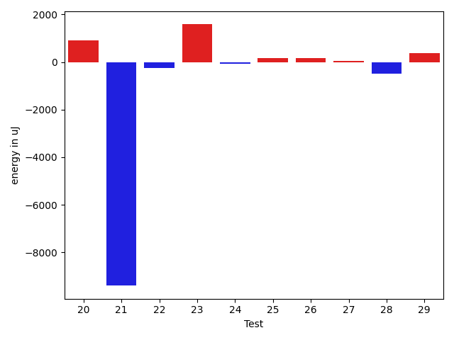
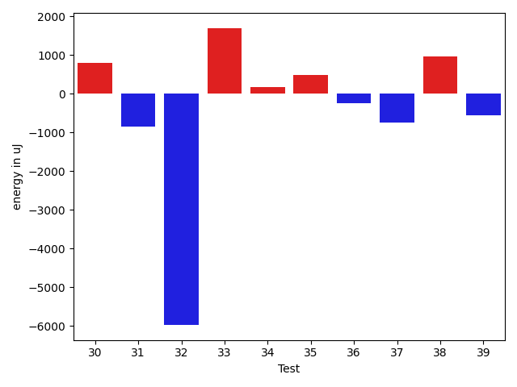
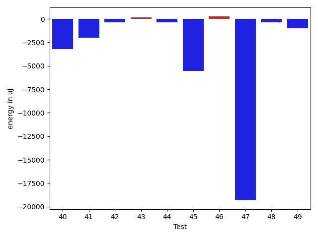
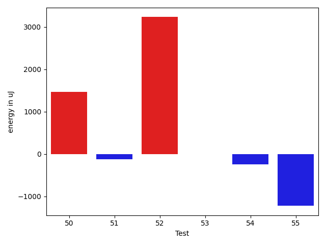

# gson e4ea6b

https://github.com/google/gson/commit/e4ea6b

## Delta Energy per test method

| ID | EnergyV1 | EnergyV2 | DeltaEnergy | σV1 | σV2 |
| --- | --- | --- | --- | --- | --- |
| 0 | 34119 | 33753 | -366 | 47456.76531854162 | 6147.397550882306 |
| 1 | 35034 | 34302 | -732 | 3311.203441287146 | 18111.202628012707 |
| 2 | 34973 | 34607 | -366 | 13435.537613602271 | 12403.637018824998 |
| 3 | 73853 | 74524 | 671 | 72143.55089014718 | 79292.6594321472 |
| 4 | 34119 | 35034 | 915 | 12768.327866320631 | 11965.802027305814 |
| 5 | 79162 | 97290 | 18128 | 30263.552231992908 | 45054.377839507455 |
| 6 | 34607 | 36377 | 1770 | 63649.58578890133 | 17493.165016376377 |
| 7 | 68481 | 69641 | 1160 | 50248.66024828399 | 44398.26999547806 |
| 8 | 67139 | 101196 | 34057 | 47948.303740676616 | 51595.639527062856 |
| 9 | 34607 | 35156 | 549 | 11331.134964196788 | 13352.26297136921 |
| 10 | 82580 | 78002 | -4578 | 82262.73899285142 | 61958.45789366072 |
| 11 | 37842 | 36376 | -1466 | 34139.50707593411 | 3384.485881233974 |
| 12 | 36682 | 35706 | -976 | 15639.791084140841 | 13318.823732821511 |
| 13 | 35766 | 35706 | -60 | 4448.702307909578 | 5304.763084264699 |
| 14 | 37841 | 38147 | 306 | 39791.54573300791 | 37245.8699986404 |
| 15 | 58716 | 64087 | 5371 | 33181.59380156876 | 34318.20415165291 |
| 16 | 35583 | 35705 | 122 | 24331.20657076967 | 28962.297501896093 |
| 17 | 34424 | 34240 | -184 | 7952.383956981888 | 5060.393561464719 |
| 18 | 35340 | 36621 | 1281 | 3440.746865233955 | 2989.8978919346073 |
| 19 | 36193 | 36621 | 428 | 15437.537344319373 | 15105.215805204482 |
| 20 | 36682 | 37597 | 915 | 23493.810330093085 | 15571.42861680954 |
| 21 | 110779 | 101379 | -9400 | 53439.55031886994 | 61417.02679143661 |
| 22 | 35400 | 35156 | -244 | 7506.083154947997 | 5940.503595550633 |
| 23 | 33325 | 34912 | 1587 | 3053.1167146909693 | 2907.770797593557 |
| 24 | 35889 | 35828 | -61 | 2526.443983641699 | 3421.7864535761946 |
| 25 | 35950 | 36132 | 182 | 24009.918628136176 | 9711.43084755994 |
| 26 | 35095 | 35278 | 183 | 3194.2338732187227 | 2420.412150624122 |
| 27 | 34362 | 34423 | 61 | 3046.2867794775952 | 3047.3099588743094 |
| 28 | 35339 | 34851 | -488 | 21073.439796586117 | 28083.919449108656 |
| 29 | 34546 | 34912 | 366 | 3583.174142270709 | 2859.870788087499 |
| 30 | 34851 | 35644 | 793 | 3204.752796141225 | 3302.9310742629414 |
| 31 | 34790 | 33935 | -855 | 2892.6503358316045 | 2136.53883770394 |
| 32 | 103088 | 97107 | -5981 | 389314.3412012593 | 448115.4212515608 |
| 33 | 73914 | 75622 | 1708 | 50994.61537239868 | 54480.843044775866 |
| 34 | 36743 | 36927 | 184 | 70203.05810485492 | 58755.191416515736 |
| 35 | 36194 | 36682 | 488 | 3888.612257804993 | 3084.0479937539512 |
| 36 | 39429 | 39185 | -244 | 25709.899551723465 | 23490.930261386537 |
| 37 | 35644 | 34912 | -732 | 3682.672565165443 | 3273.566244813701 |
| 38 | 35461 | 36438 | 977 | 3074.0449026415718 | 3226.3799774170566 |
| 39 | 39489 | 38941 | -548 | 89135.82918280715 | 88631.78193988229 |
| 40 | 75866 | 72632 | -3234 | 81883.44572478838 | 58577.75045629867 |
| 41 | 328795 | 326781 | -2014 | 100875.36296308828 | 103057.92408807456 |
| 42 | 68848 | 68481 | -367 | 20956.443871604253 | 22846.31364950356 |
| 43 | 35767 | 35950 | 183 | 10964.938044593828 | 8795.23050090801 |
| 44 | 37171 | 36804 | -367 | 17681.134136522607 | 21657.14259693626 |
| 45 | 148620 | 143066 | -5554 | 355026.1991661925 | 358052.1022912121 |
| 46 | 37842 | 38086 | 244 | 50715.98496791323 | 175480.88875243004 |
| 47 | 101623 | 82337 | -19286 | 82673.4529728475 | 96640.20555924333 |
| 48 | 38025 | 37659 | -366 | 174643.80046242237 | 29163.285677937558 |
| 49 | 40161 | 39185 | -976 | 751965.4674270399 | 653992.3887039928 |
| 50 | 35095 | 36560 | 1465 | 3221.0880853333642 | 4019.714299166101 |
| 51 | 75806 | 75683 | -123 | 25194.68107127042 | 23726.427249050565 |
| 52 | 37293 | 40527 | 3234 | 19929.821030530027 | 32529.998688968524 |
| 53 | 38880 | 38879 | -1 | 58747.572838267115 | 70804.88696991 |
| 54 | 38452 | 38208 | -244 | 41178.44207446685 | 38534.37562678545 |
| 55 | 38940 | 37720 | -1220 | 104337.70152822428 | 120677.62809272396 |

## Delta Duration per test method

| ID | DurationV1 | DurationsV2 | DeltaDuration |
| --- | --- | --- | --- |
| 0 | 1394414.5526315789 | 1136692.725 | -257721.82763157878 |
| 1 | 971647.9464285715 | 1071621.5161290322 | 99973.56970046076 |
| 2 | 1428185.5567010308 | 1485988.3636363635 | 57802.806935332716 |
| 3 | 3022099.275510204 | 3355557.09375 | 333457.818239796 |
| 4 | 1413186.6494845361 | 1450779.0210526315 | 37592.371568095405 |
| 5 | 2864519.0918367347 | 3220572.7083333335 | 356053.6164965988 |
| 6 | 1862832.5714285714 | 1617596.5656565656 | -245236.00577200577 |
| 7 | 2542926.909090909 | 2708739.868686869 | 165812.95959595963 |
| 8 | 2559239.1530612246 | 2934394.5463917525 | 375155.39333052794 |
| 9 | 1403422.448979592 | 1425317.6041666667 | 21895.155187074794 |
| 10 | 3646325.1836734693 | 3112270.9484536084 | -534054.2352198609 |
| 11 | 837936.6666666666 | 584198.5238095238 | -253738.14285714284 |
| 12 | 1150047.7547169812 | 1045069.0 | -104978.7547169812 |
| 13 | 881184.28 | 869572.2115384615 | -11612.068461538525 |
| 14 | 1573246.8387096773 | 1337455.576923077 | -235791.26178660034 |
| 15 | 1955699.2278481012 | 1921801.5975609757 | -33897.630287125474 |
| 16 | 1200704.0983606558 | 1126489.559322034 | -74214.53903862182 |
| 17 | 1049556.1898734176 | 1020507.3611111111 | -29048.828762306483 |
| 18 | 929071.4666666667 | 836656.4047619047 | -92415.06190476194 |
| 19 | 1445087.752688172 | 1397989.7411764706 | -47098.01151170139 |
| 20 | 1120072.5416666667 | 952437.5333333333 | -167635.00833333342 |
| 21 | 3686462.4545454546 | 3600181.2040816327 | -86281.25046382193 |
| 22 | 1135338.2615384615 | 1056817.953125 | -78520.30841346155 |
| 23 | 617323.0 | 577497.2857142857 | -39825.71428571432 |
| 24 | 755224.8636363636 | 729327.6 | -25897.26363636367 |
| 25 | 1289279.4057971016 | 1141008.3285714285 | -148271.077225673 |
| 26 | 779499.5641025641 | 760577.4666666667 | -18922.09743589745 |
| 27 | 889666.6290322581 | 857795.8909090909 | -31870.73812316719 |
| 28 | 1180770.888888889 | 1093366.4375 | -87404.45138888899 |
| 29 | 678807.8260869565 | 592669.0769230769 | -86138.74916387966 |
| 30 | 726779.775 | 726333.8793103448 | -445.89568965521175 |
| 31 | 766326.7209302326 | 726485.1470588235 | -39841.573871409055 |
| 32 | 6446617.090909091 | 6865398.919191919 | 418781.82828282844 |
| 33 | 2911862.5353535353 | 3088046.6565656564 | 176184.1212121211 |
| 34 | 1944115.3469387756 | 1761148.8181818181 | -182966.5287569575 |
| 35 | 731724.8421052631 | 685805.6666666666 | -45919.17543859652 |
| 36 | 1827567.2234042552 | 1677869.5340909092 | -149697.68931334605 |
| 37 | 756036.5555555555 | 669638.75 | -86397.8055555555 |
| 38 | 943442.1785714285 | 924178.6727272727 | -19263.505844155792 |
| 39 | 2232025.976190476 | 2382971.4545454546 | 150945.47835497838 |
| 40 | 3006337.5408163266 | 2574398.4583333335 | -431939.08248299314 |
| 41 | 9700969.252525253 | 9527678.08080808 | -173291.1717171725 |
| 42 | 2216374.6464646463 | 2189819.98989899 | -26554.65656565642 |
| 43 | 1234771.8405797102 | 1255174.923076923 | 20403.082497212803 |
| 44 | 1183110.644736842 | 1400282.6206896552 | 217171.97595281317 |
| 45 | 7113241.393939394 | 7633270.323232323 | 520028.92929292936 |
| 46 | 1517121.46 | 2111519.1694915253 | 594397.7094915253 |
| 47 | 3825116.9191919193 | 3936861.9393939395 | 111745.02020202018 |
| 48 | 2080120.1333333333 | 1424004.4197530865 | -656115.7135802468 |
| 49 | 10739858.743589744 | 8762705.824324325 | -1977152.9192654192 |
| 50 | 1189183.686746988 | 1164745.8705882353 | -24437.816158752656 |
| 51 | 2793290.8080808083 | 2677799.707070707 | -115491.10101010138 |
| 52 | 1082305.642857143 | 1606750.4473684211 | 524444.8045112782 |
| 53 | 1507928.825 | 2119406.355555556 | 611477.5305555558 |
| 54 | 1585449.295774648 | 1667618.012987013 | 82168.71721236501 |
| 55 | 2651951.0 | 2922855.5918367347 | 270904.5918367347 |

## Misc.

| ID | Test Class | Test Method |
| --- | --- | --- |
| 0 | com.google.gson.functional.ParameterizedTypesTest | testParameterizedTypeGenericArraysSerialization |
| 1 | com.google.gson.functional.ParameterizedTypesTest | testParameterizedTypesWithWriterSerialization |
| 2 | com.google.gson.functional.ParameterizedTypesTest | testVariableTypeArrayDeserialization |
| 3 | com.google.gson.functional.ParameterizedTypesTest | testParameterizedTypesSerialization |
| 4 | com.google.gson.functional.ParameterizedTypesTest | testVariableTypeDeserialization |
| 5 | com.google.gson.functional.ParameterizedTypesTest | testVariableTypeFieldsAndGenericArraysSerialization |
| 6 | com.google.gson.functional.ParameterizedTypesTest | testParameterizedTypeGenericArraysDeserialization |
| 7 | com.google.gson.functional.ParameterizedTypesTest | testVariableTypeFieldsAndGenericArraysDeserialization |
| 8 | com.google.gson.functional.ParameterizedTypesTest | testTypesWithMultipleParametersSerialization |
| 9 | com.google.gson.functional.ParameterizedTypesTest | testParameterizedTypeWithVariableTypeDeserialization |
| 10 | com.google.gson.functional.ExposeFieldsTest | testNullExposeFieldSerialization |
| 11 | com.google.gson.functional.ExposeFieldsTest | testExposeAnnotationSerialization |
| 12 | com.google.gson.functional.ExposeFieldsTest | testArrayWithOneNullExposeFieldObjectSerialization |
| 13 | com.google.gson.functional.CollectionTest | testRawCollectionSerialization |
| 14 | com.google.gson.functional.CollectionTest | testCollectionOfBagOfPrimitivesSerialization |
| 15 | com.google.gson.functional.ObjectTest | testDirectedAcyclicGraphSerialization |
| 16 | com.google.gson.functional.ObjectTest | testNestedSerialization |
| 17 | com.google.gson.functional.ObjectTest | testClassWithObjectFieldSerialization |
| 18 | com.google.gson.functional.ObjectTest | testBagOfPrimitiveWrappersSerialization |
| 19 | com.google.gson.functional.ObjectTest | testArrayOfArraysSerialization |
| 20 | com.google.gson.functional.ObjectTest | testBagOfPrimitivesSerialization |
| 21 | com.google.gson.functional.ObjectTest | testSubInterfacesOfCollectionSerialization |
| 22 | com.google.gson.functional.ObjectTest | testArrayOfObjectsSerialization |
| 23 | com.google.gson.functional.ObjectTest | testSelfReferenceSerialization |
| 24 | com.google.gson.functional.ObjectTest | testClassWithEnumFieldSerialization |
| 25 | com.google.gson.functional.ObjectTest | testInheritenceSerialization |
| 26 | com.google.gson.functional.ObjectTest | testClassWithTransientFieldsSerialization |
| 27 | com.google.gson.functional.ObjectTest | testInnerClassSerialization |
| 28 | com.google.gson.functional.ObjectTest | testEmptyCollectionInAnObjectSerialization |
| 29 | com.google.gson.functional.ObjectTest | testPrimitiveArrayFieldSerialization |
| 30 | com.google.gson.functional.ObjectTest | testNullFieldsSerialization |
| 31 | com.google.gson.functional.ObjectTest | testCircularSerialization |
| 32 | com.google.gson.functional.NamingPolicyTest | testGsonWithNonDefaultFieldNamingPolicySerialization |
| 33 | com.google.gson.functional.NamingPolicyTest | testGsonWithSerializedNameFieldNamingPolicySerialization |
| 34 | com.google.gson.functional.NamingPolicyTest | testGsonWithNonDefaultFieldNamingPolicyDeserialiation |
| 35 | com.google.gson.functional.NullObjectAndFieldTest | testExplicitSerializationOfNullCollectionMembers |
| 36 | com.google.gson.functional.NullObjectAndFieldTest | testExplicitSerializationOfNullArrayMembers |
| 37 | com.google.gson.functional.NullObjectAndFieldTest | testExplicitSerializationOfNullStringMembers |
| 38 | com.google.gson.functional.NullObjectAndFieldTest | testNullWrappedPrimitiveMemberSerialization |
| 39 | com.google.gson.functional.NullObjectAndFieldTest | testExplicitSerializationOfNulls |
| 40 | com.google.gson.functional.ConcurrencyTest | testSingleThreadSerialization |
| 41 | com.google.gson.functional.ConcurrencyTest | testMultiThreadSerialization |
| 42 | com.google.gson.functional.CustomTypeAdaptersTest | testCustomTypeAdapterDoesNotAppliesToSubClasses |
| 43 | com.google.gson.functional.CustomTypeAdaptersTest | testCustomSerializerForLong |
| 44 | com.google.gson.functional.CustomTypeAdaptersTest | testCustomNestedSerializers |
| 45 | com.google.gson.functional.VersioningTest | testVersionedClassesSerialization |
| 46 | com.google.gson.functional.VersioningTest | testVersionedGsonWithUnversionedClassesSerialization |
| 47 | com.google.gson.FunctionalWithInternalDependenciesTest | testPrettyPrintList |
| 48 | com.google.gson.FunctionalWithInternalDependenciesTest | testPrettyPrintArrayOfObjects |
| 49 | com.google.gson.functional.PrintFormattingTest | testCompactFormattingLeavesNoWhiteSpace |
| 50 | com.google.gson.functional.DefaultTypeAdaptersTest | testBigIntegerFieldSerialization |
| 51 | com.google.gson.functional.DefaultTypeAdaptersTest | testBigDecimalFieldSerialization |
| 52 | com.google.gson.functional.UncategorizedTest | testStaticFieldsAreNotSerialized |
| 53 | com.google.gson.functional.UncategorizedTest | testObjectEqualButNotSameSerialization |
| 54 | com.google.gson.functional.EscapingTest | testEscapingObjectFields |
| 55 | com.google.gson.functional.ReadersWritersTest | testWriterForSerialization |

| Test | IterationV1 | IterationV2 | DeltaIteration |
| --- | --- | --- | --- |
| 0 | 76 | 80 | 4 |
| 1 | 56 | 62 | 6 |
| 2 | 97 | 99 | 2 |
| 3 | 98 | 96 | -2 |
| 4 | 97 | 95 | -2 |
| 5 | 98 | 96 | -2 |
| 6 | 98 | 99 | 1 |
| 7 | 99 | 99 | 0 |
| 8 | 98 | 97 | -1 |
| 9 | 98 | 96 | -2 |
| 10 | 98 | 97 | -1 |
| 11 | 21 | 21 | 0 |
| 12 | 53 | 59 | 6 |
| 13 | 50 | 52 | 2 |
| 14 | 62 | 52 | -10 |
| 15 | 79 | 82 | 3 |
| 16 | 61 | 59 | -2 |
| 17 | 79 | 72 | -7 |
| 18 | 45 | 42 | -3 |
| 19 | 93 | 85 | -8 |
| 20 | 48 | 45 | -3 |
| 21 | 99 | 98 | -1 |
| 22 | 65 | 64 | -1 |
| 23 | 27 | 21 | -6 |
| 24 | 44 | 35 | -9 |
| 25 | 69 | 70 | 1 |
| 26 | 39 | 30 | -9 |
| 27 | 62 | 55 | -7 |
| 28 | 36 | 32 | -4 |
| 29 | 23 | 26 | 3 |
| 30 | 40 | 58 | 18 |
| 31 | 43 | 34 | -9 |
| 32 | 99 | 99 | 0 |
| 33 | 99 | 99 | 0 |
| 34 | 49 | 55 | 6 |
| 35 | 38 | 36 | -2 |
| 36 | 94 | 88 | -6 |
| 37 | 36 | 28 | -8 |
| 38 | 56 | 55 | -1 |
| 39 | 42 | 44 | 2 |
| 40 | 98 | 96 | -2 |
| 41 | 99 | 99 | 0 |
| 42 | 99 | 99 | 0 |
| 43 | 69 | 78 | 9 |
| 44 | 76 | 58 | -18 |
| 45 | 99 | 99 | 0 |
| 46 | 50 | 59 | 9 |
| 47 | 99 | 99 | 0 |
| 48 | 75 | 81 | 6 |
| 49 | 78 | 74 | -4 |
| 50 | 83 | 85 | 2 |
| 51 | 99 | 99 | 0 |
| 52 | 42 | 38 | -4 |
| 53 | 40 | 45 | 5 |
| 54 | 71 | 77 | 6 |
| 55 | 46 | 49 | 3 |

| Time Label | Time (s) |
| --- | --- |
| Selection | 21.352916479110718 |
| Injection | 10.110987424850464 |
| Total | 949.472629070282 |

