# gson 6fa09b

https://github.com/google/gson/commit/6fa09b

## Delta Energy per test method

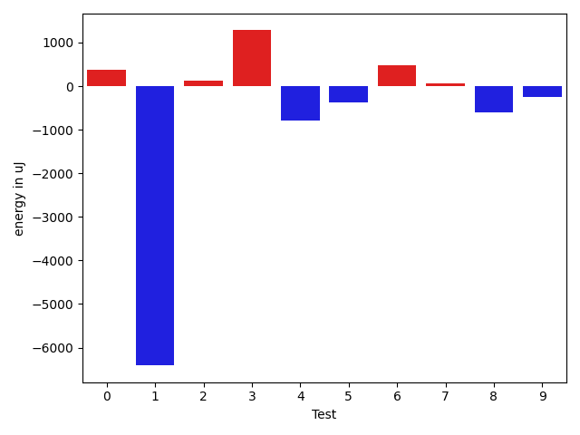

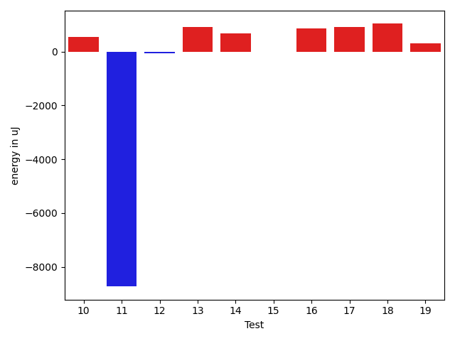

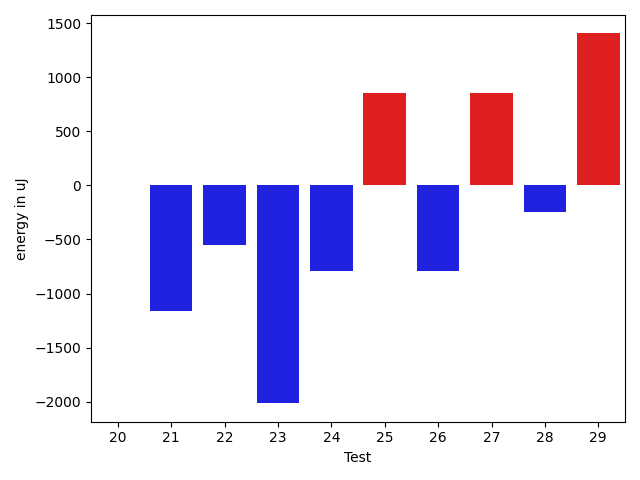

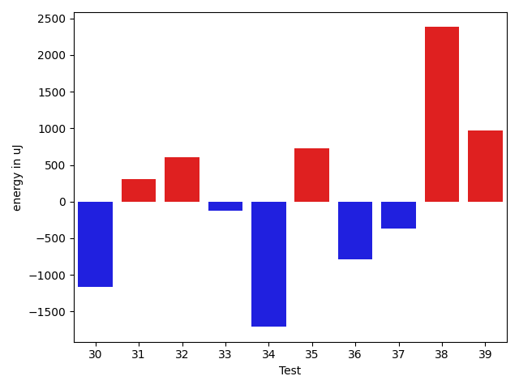

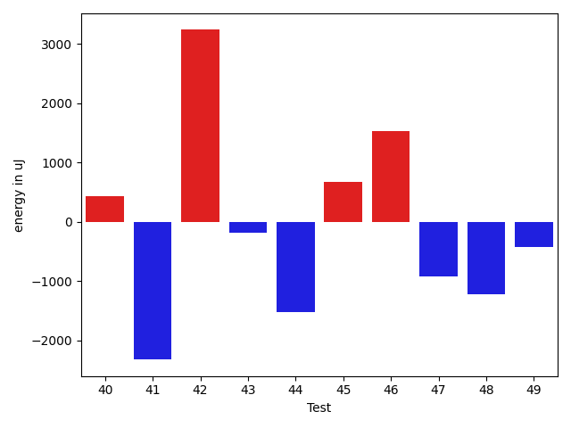

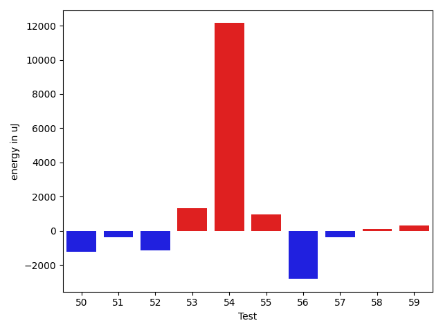

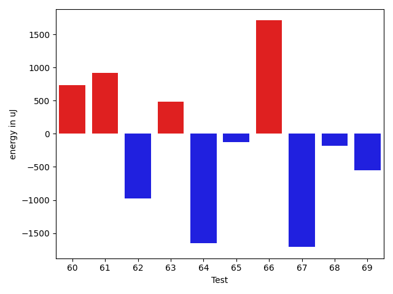

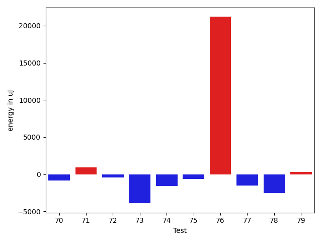

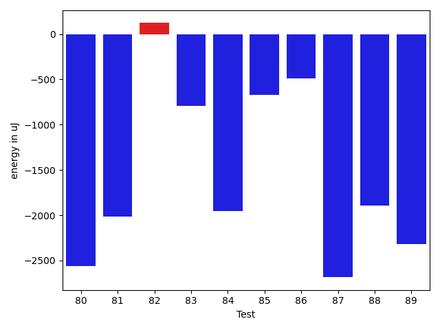

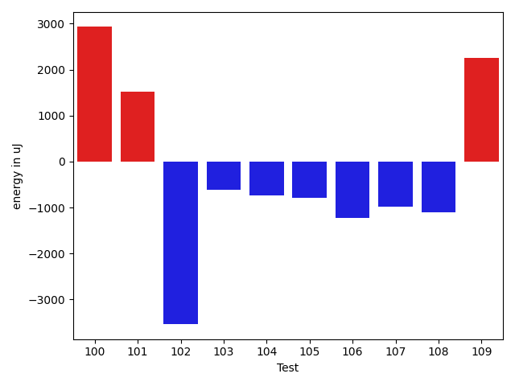

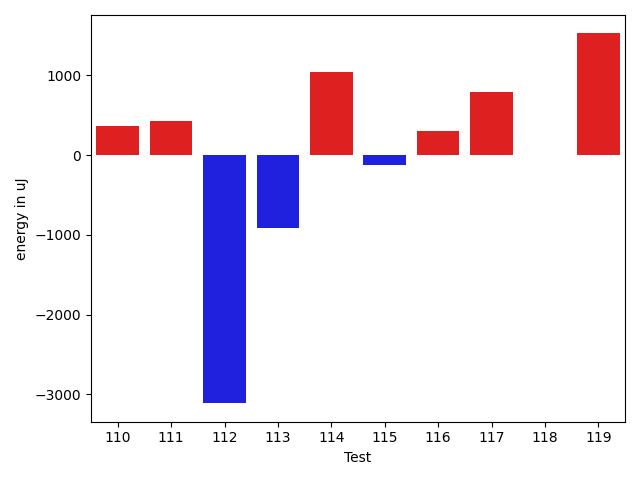

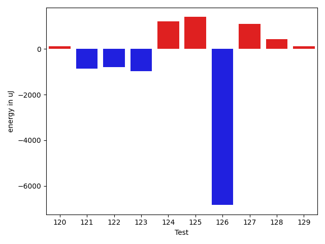

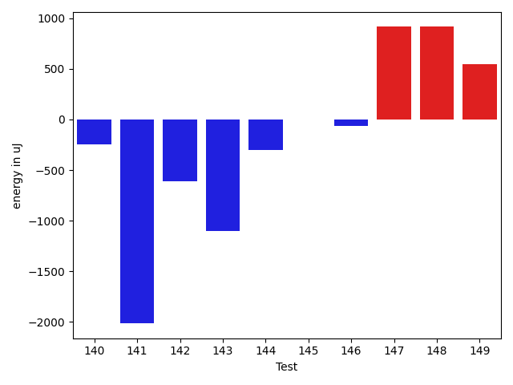

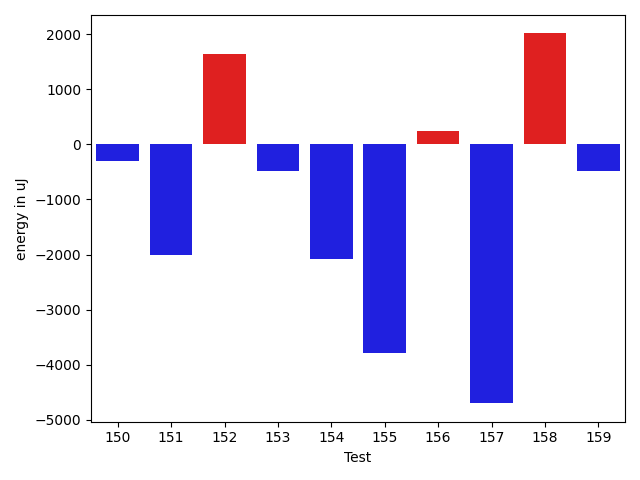

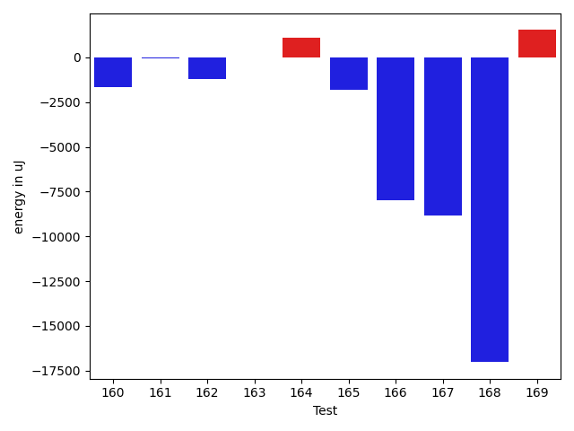

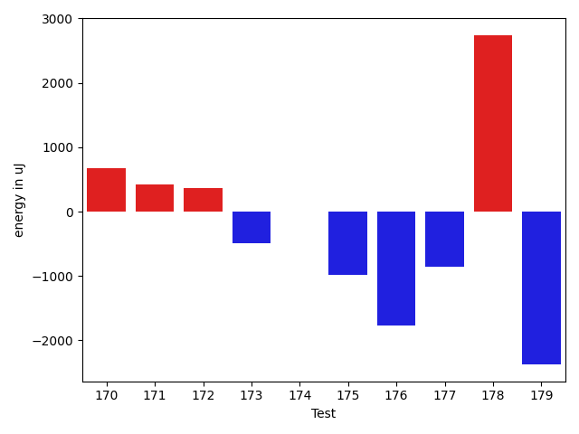

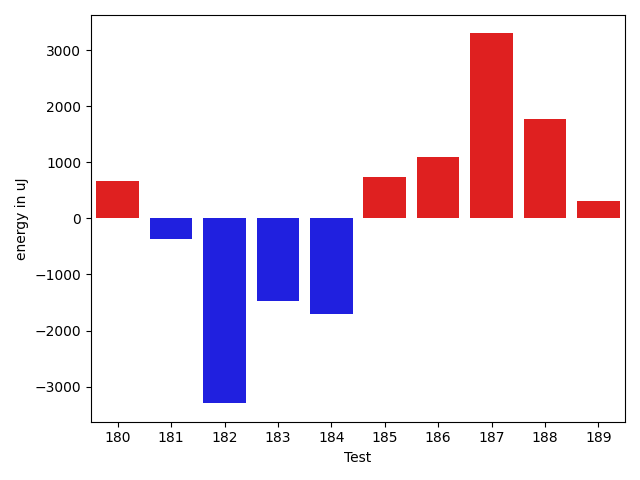

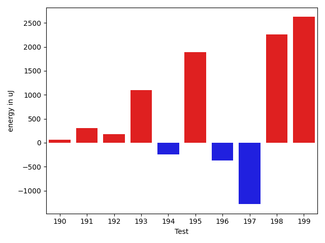

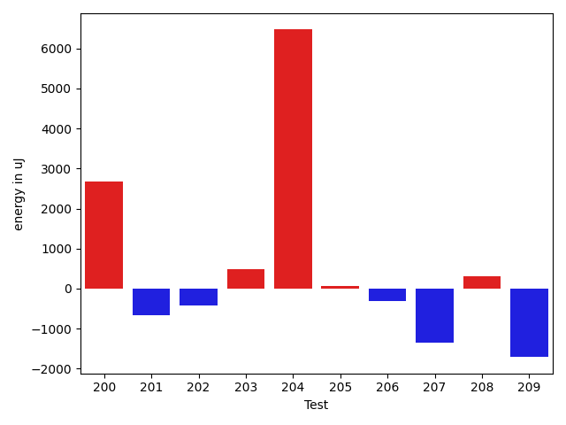

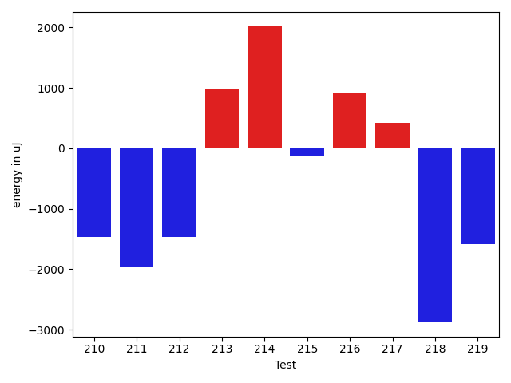

| ID | EnergyV1 | EnergyV2 | DeltaEnergy | σV1 | σV2 |
| --- | --- | --- | --- | --- | --- |
| 0 | 34118 | 34485 | 367 | 9260.015167674517 | 3681.531516145462 |
| 1 | 60181 | 53772 | -6409 | 33840.274232589996 | 31519.913326595342 |
| 2 | 33264 | 33386 | 122 | 9568.04523303938 | 48764.43085595916 |
| 3 | 32288 | 33569 | 1281 | 3629.392736072119 | 2908.6625266197207 |
| 4 | 34485 | 33692 | -793 | 24410.88035138543 | 10027.584110888418 |
| 5 | 34729 | 34363 | -366 | 30171.71896449931 | 30347.22677827766 |
| 6 | 34241 | 34729 | 488 | 3719.986872594721 | 5124.755607939105 |
| 7 | 33142 | 33203 | 61 | 6288.579846833464 | 7282.373783062268 |
| 8 | 34546 | 33935 | -611 | 7345.100069179111 | 21301.103345608757 |
| 9 | 35156 | 34912 | -244 | 29723.612062446966 | 11274.121653259732 |
| 10 | 35218 | 35766 | 548 | 12834.23206631003 | 19240.298637655625 |
| 11 | 84777 | 76049 | -8728 | 43947.91237975843 | 40392.9144749779 |
| 12 | 34119 | 34057 | -62 | 5258.35818291184 | 24461.976293408083 |
| 13 | 33325 | 34241 | 916 | 3997.6549912821165 | 3399.8522443551446 |
| 14 | 33020 | 33692 | 672 | 21975.82285481472 | 4996.347218044427 |
| 15 | 33996 | 33997 | 1 | 7134.317543904501 | 4491.1470097446145 |
| 16 | 62011 | 62866 | 855 | 24131.286594374396 | 22716.181138101856 |
| 17 | 33386 | 34301 | 915 | 12171.040437345526 | 3949.560648363444 |
| 18 | 32959 | 33996 | 1037 | 3147.3543386999395 | 3969.564173608365 |
| 19 | 33630 | 33936 | 306 | 4187.877014627869 | 3266.582598833221 |
| 20 | 33752 | 33752 | 0 | 4559.829361467115 | 37235.72889598415 |
| 21 | 36011 | 34851 | -1160 | 5755.615289528456 | 21284.732008242398 |
| 22 | 36255 | 35706 | -549 | 30315.586917139044 | 3605.6771186464007 |
| 23 | 36865 | 34851 | -2014 | 11833.172106793158 | 12082.592445253498 |
| 24 | 34363 | 33569 | -794 | 38685.8204396392 | 21704.64779653274 |
| 25 | 33630 | 34484 | 854 | 3529.8450334201552 | 2598.1284618813347 |
| 26 | 35217 | 34424 | -793 | 9683.45988900016 | 7512.402374114964 |
| 27 | 34851 | 35705 | 854 | 4153.285268643038 | 3464.6490871446354 |
| 28 | 36316 | 36072 | -244 | 3413.970970499744 | 6519.6434185746175 |
| 29 | 32898 | 34302 | 1404 | 2754.693194357825 | 3727.08488983571 |
| 30 | 32776 | 31616 | -1160 | 3281.544034444761 | 3024.793605015254 |
| 31 | 35889 | 36194 | 305 | 116519.29962380478 | 92522.50685902876 |
| 32 | 33874 | 34485 | 611 | 3597.840521186989 | 3360.5712386134473 |
| 33 | 33752 | 33631 | -121 | 3010.9412133784112 | 3425.5376871350154 |
| 34 | 35828 | 34119 | -1709 | 5884.900465650397 | 3681.2221390517498 |
| 35 | 33326 | 34057 | 731 | 3405.463603779471 | 3796.5372148221345 |
| 36 | 34546 | 33753 | -793 | 3660.6784499988134 | 2814.058223704691 |
| 37 | 34424 | 34058 | -366 | 8536.755828500882 | 6099.657419551362 |
| 38 | 33630 | 36011 | 2381 | 5441.402220589169 | 5782.915971905289 |
| 39 | 34058 | 35034 | 976 | 3951.290142472456 | 3363.515480862248 |
| 40 | 33508 | 33935 | 427 | 3644.003744357145 | 4455.984336790494 |
| 41 | 34729 | 32409 | -2320 | 4502.342108527763 | 2608.0251155731244 |
| 42 | 81665 | 84900 | 3235 | 56457.24458211104 | 64869.410344327756 |
| 43 | 36866 | 36682 | -184 | 46741.29659445386 | 37540.57026888536 |
| 44 | 37109 | 35583 | -1526 | 3396.541676078879 | 3578.1359594368228 |
| 45 | 35949 | 36621 | 672 | 10663.982329734465 | 13506.968575314944 |
| 46 | 34241 | 35767 | 1526 | 4614.340266427586 | 4332.853211753457 |
| 47 | 35034 | 34118 | -916 | 4080.538561141201 | 4407.8183073515875 |
| 48 | 34363 | 33142 | -1221 | 19515.13863497772 | 3514.9126885614187 |
| 49 | 35034 | 34606 | -428 | 4796.836556809188 | 54242.74239885888 |
| 50 | 34057 | 32837 | -1220 | 3732.935170211237 | 7369.381617470147 |
| 51 | 34302 | 33935 | -367 | 3926.336780206232 | 3204.6784807419535 |
| 52 | 34912 | 33752 | -1160 | 3423.774478882892 | 6510.808885413921 |
| 53 | 148071 | 149414 | 1343 | 32444.03039622211 | 27712.474844140936 |
| 54 | 42969 | 55115 | 12146 | 26756.640250756125 | 30474.17426654887 |
| 55 | 34607 | 35583 | 976 | 3754.9089524921865 | 3136.2621235218867 |
| 56 | 35339 | 32531 | -2808 | 6262.318376023434 | 3692.701933685736 |
| 57 | 34424 | 34057 | -367 | 4304.631886325203 | 3586.071119600103 |
| 58 | 32410 | 32532 | 122 | 4113.232087523128 | 4316.338371345602 |
| 59 | 38391 | 38696 | 305 | 51848.61725860805 | 72714.07318401302 |
| 60 | 36011 | 36743 | 732 | 45902.641417736195 | 40904.025054164726 |
| 61 | 34241 | 35156 | 915 | 3119.6213671662385 | 33061.38861078933 |
| 62 | 35218 | 34241 | -977 | 4085.1053697980597 | 2786.426140965027 |
| 63 | 35278 | 35767 | 489 | 4200.879849578142 | 3925.055010524879 |
| 64 | 35523 | 33874 | -1649 | 4698.78956952587 | 65951.26602218485 |
| 65 | 34241 | 34118 | -123 | 4103.176738892894 | 4287.162880516861 |
| 66 | 34118 | 35828 | 1710 | 3782.1046590944243 | 4769.796456873186 |
| 67 | 35339 | 33630 | -1709 | 35989.3188482858 | 3368.942717253605 |
| 68 | 33814 | 33630 | -184 | 3993.793398519654 | 3188.6200395573424 |
| 69 | 37170 | 36621 | -549 | 27343.98383249393 | 4126.999470996915 |
| 70 | 35401 | 34546 | -855 | 2826.2890343383674 | 3470.974106491416 |
| 71 | 33020 | 33936 | 916 | 4197.745691634068 | 26498.78238462607 |
| 72 | 37109 | 36682 | -427 | 3877.474414128638 | 7513.970506335722 |
| 73 | 37231 | 33325 | -3906 | 3853.9042648774034 | 4702.638472514617 |
| 74 | 37781 | 36193 | -1588 | 4004.378001338035 | 33705.88592600276 |
| 75 | 36560 | 35950 | -610 | 3174.2104250200923 | 3388.1694379118653 |
| 76 | 39123 | 60303 | 21180 | 17143.782554045294 | 18400.21193077686 |
| 77 | 37292 | 35767 | -1525 | 4801.800762420644 | 4140.674551948312 |
| 78 | 34607 | 32044 | -2563 | 3466.514290385053 | 3356.0036352781267 |
| 79 | 33996 | 34301 | 305 | 4481.681550767675 | 3907.696930551045 |
| 80 | 35217 | 32653 | -2564 | 4191.946671251016 | 3523.9887961506643 |
| 81 | 65308 | 63293 | -2015 | 19103.636466261123 | 18562.466831834754 |
| 82 | 33386 | 33508 | 122 | 4013.397072838945 | 3663.0434782494335 |
| 83 | 34485 | 33691 | -794 | 4943.90975501661 | 31044.09750529668 |
| 84 | 35279 | 33325 | -1954 | 29142.99967687726 | 2799.144237621599 |
| 85 | 34179 | 33508 | -671 | 3733.6853851865394 | 2893.610414466653 |
| 86 | 34668 | 34180 | -488 | 4209.445501382756 | 3131.8486170311617 |
| 87 | 36438 | 33753 | -2685 | 4345.716668168784 | 3630.256725156135 |
| 88 | 36865 | 34973 | -1892 | 4309.084824941076 | 4146.3835268871135 |
| 89 | 38147 | 35827 | -2320 | 42840.72460390064 | 46161.68132617545 |
| 90 | 33387 | 33264 | -123 | 2553.2542381027347 | 3217.355171501396 |
| 91 | 35889 | 34484 | -1405 | 3516.2594902067644 | 4331.020308836655 |
| 92 | 34362 | 33386 | -976 | 3442.7899240656025 | 3857.8032793346856 |
| 93 | 38330 | 37231 | -1099 | 67552.81374750438 | 62489.55642095325 |
| 94 | 36987 | 35523 | -1464 | 3855.1571661920175 | 3484.12447806975 |
| 95 | 35583 | 34057 | -1526 | 38365.0246520418 | 3453.3795009114897 |
| 96 | 34912 | 33020 | -1892 | 4277.775295805632 | 2692.775680832689 |
| 97 | 34668 | 32471 | -2197 | 3826.72115435785 | 3522.2319666953913 |
| 98 | 38391 | 35461 | -2930 | 36907.45961412465 | 2693.684090311086 |
| 99 | 35156 | 33508 | -1648 | 4220.512424753658 | 3761.93040805671 |
| 100 | 36987 | 39917 | 2930 | 209916.55243035915 | 264734.26167992124 |
| 101 | 33936 | 35461 | 1525 | 3565.374012306863 | 3711.345014565859 |
| 102 | 37048 | 33508 | -3540 | 4844.336278204823 | 3701.0506718032248 |
| 103 | 35400 | 34789 | -611 | 4915.588782253527 | 3231.6856822354234 |
| 104 | 38330 | 37598 | -732 | 27152.126505568125 | 31028.75535290072 |
| 105 | 35340 | 34546 | -794 | 5122.291991194525 | 4186.743537670903 |
| 106 | 40100 | 38879 | -1221 | 71725.5570637693 | 73947.06883210679 |
| 107 | 36682 | 35706 | -976 | 4718.3678969447565 | 3689.402778908097 |
| 108 | 36926 | 35827 | -1099 | 25108.04412182459 | 4357.696533191046 |
| 109 | 35584 | 37842 | 2258 | 3069.9833285793434 | 3452.6673907445984 |
| 110 | 35889 | 36255 | 366 | 11037.315890088732 | 27089.747941184276 |
| 111 | 34728 | 35156 | 428 | 29480.308039000796 | 33375.29444078364 |
| 112 | 73913 | 70800 | -3113 | 51088.2116728929 | 46922.74418984552 |
| 113 | 36255 | 35340 | -915 | 10656.70261797016 | 27600.068222950238 |
| 114 | 77392 | 78430 | 1038 | 24939.931866211587 | 26794.40345777759 |
| 115 | 35889 | 35767 | -122 | 12825.254567231237 | 22900.390900782706 |
| 116 | 36377 | 36682 | 305 | 42260.57907232708 | 44460.277587160985 |
| 117 | 64575 | 65369 | 794 | 26136.12633740321 | 26991.262758901616 |
| 118 | 36254 | 36255 | 1 | 13596.050850506881 | 11845.699864980254 |
| 119 | 40100 | 41625 | 1525 | 44355.31583615988 | 37715.33685973095 |
| 120 | 34790 | 34912 | 122 | 11205.933511483305 | 11834.514579102588 |
| 121 | 35401 | 34546 | -855 | 43861.878324099416 | 46561.6004442077 |
| 122 | 36926 | 36133 | -793 | 40019.57952756805 | 42302.3766700584 |
| 123 | 35583 | 34607 | -976 | 26186.67276828885 | 11220.916633647332 |
| 124 | 33752 | 34974 | 1222 | 3508.8353700795064 | 4173.993597161511 |
| 125 | 75684 | 77087 | 1403 | 33372.059304481256 | 45464.61885201104 |
| 126 | 84350 | 77514 | -6836 | 252924.20464743648 | 360786.4553726325 |
| 127 | 34912 | 36011 | 1099 | 3719.8114904165095 | 4814.516099512072 |
| 128 | 34973 | 35400 | 427 | 3939.0005135217602 | 3974.7618830147135 |
| 129 | 33996 | 34119 | 123 | 3903.925447826229 | 5130.141617709152 |
| 130 | 35034 | 37048 | 2014 | 4468.169809243423 | 3487.270107118174 |
| 131 | 39184 | 39062 | -122 | 4964.178777753678 | 4340.404292400375 |
| 132 | 38024 | 39490 | 1466 | 62703.4350310604 | 55169.45523870224 |
| 133 | 31799 | 35034 | 3235 | 3505.9606561467544 | 4020.2661292506496 |
| 134 | 34241 | 35461 | 1220 | 4242.825280159491 | 3769.765131609661 |
| 135 | 36133 | 36499 | 366 | 3263.331087551836 | 3997.9300546935815 |
| 136 | 35218 | 35644 | 426 | 2508.4600908724856 | 2967.337581231305 |
| 137 | 34790 | 35828 | 1038 | 3778.1818067224394 | 3839.0966158445076 |
| 138 | 35705 | 37353 | 1648 | 3811.181363162886 | 3978.1925798217007 |
| 139 | 36132 | 35461 | -671 | 9644.073381088134 | 7508.501578252301 |
| 140 | 35522 | 35279 | -243 | 4075.3277693334066 | 23505.095824401265 |
| 141 | 36194 | 34180 | -2014 | 3521.459991130923 | 3292.481198565388 |
| 142 | 37414 | 36804 | -610 | 77419.07533611397 | 47215.99835463611 |
| 143 | 34667 | 33569 | -1098 | 4386.830252577658 | 3727.174343923289 |
| 144 | 33691 | 33387 | -304 | 4727.793932346803 | 3119.6366930303516 |
| 145 | 33692 | 33691 | -1 | 4772.956452852717 | 3350.644386753148 |
| 146 | 34424 | 34363 | -61 | 3980.8457747876428 | 3507.53319055433 |
| 147 | 33142 | 34057 | 915 | 4246.9600138766855 | 5826.459826461949 |
| 148 | 33203 | 34118 | 915 | 5041.782231865362 | 2768.5052962346704 |
| 149 | 32959 | 33508 | 549 | 4042.1872206772136 | 3429.225647321406 |
| 150 | 34607 | 34302 | -305 | 4053.196154339876 | 3979.670391547728 |
| 151 | 37720 | 35705 | -2015 | 49168.35607083626 | 54550.73486218832 |
| 152 | 33997 | 35644 | 1647 | 3966.312877855367 | 3354.3833452634085 |
| 153 | 35400 | 34912 | -488 | 7990.066833153769 | 6254.166071181445 |
| 154 | 36560 | 34485 | -2075 | 6637.884627566897 | 4100.29792059469 |
| 155 | 41503 | 37720 | -3783 | 86591.00841040064 | 77376.38373590348 |
| 156 | 34424 | 34668 | 244 | 6041.12973019883 | 4029.551771763483 |
| 157 | 40222 | 35522 | -4700 | 45852.32794992169 | 34901.34141892195 |
| 158 | 32227 | 34240 | 2013 | 3904.2705816067614 | 2993.440967580435 |
| 159 | 33936 | 33448 | -488 | 25445.29311044361 | 3666.141531940935 |
| 160 | 35950 | 34302 | -1648 | 10391.043417535826 | 3522.0671857938296 |
| 161 | 34180 | 34118 | -62 | 4531.0343272121645 | 3736.7350293741806 |
| 162 | 39794 | 38574 | -1220 | 65105.73674379259 | 73402.51440264804 |
| 163 | 35767 | 35767 | 0 | 6222.098193049561 | 37271.12128402051 |
| 164 | 34790 | 35889 | 1099 | 24612.033740976 | 9578.958453675015 |
| 165 | 36072 | 34241 | -1831 | 4561.6002767037035 | 3939.993547624849 |
| 166 | 71839 | 63843 | -7996 | 60486.640904640866 | 63028.31437200937 |
| 167 | 306884 | 298034 | -8850 | 86869.26635340897 | 88130.17433828111 |
| 168 | 402770 | 385742 | -17028 | 107851.50404967833 | 122398.26219007815 |
| 169 | 64025 | 65552 | 1527 | 50075.394038427796 | 54094.99468138455 |
| 170 | 34729 | 35401 | 672 | 7122.141126001726 | 8438.23628999171 |
| 171 | 35950 | 36377 | 427 | 57995.647692209546 | 40520.9560739266 |
| 172 | 36865 | 37231 | 366 | 3537.635968609546 | 3709.12767507402 |
| 173 | 36072 | 35584 | -488 | 14892.570947944661 | 10265.770607120196 |
| 174 | 37780 | 37781 | 1 | 62947.68303409332 | 54180.5205291842 |
| 175 | 35278 | 34301 | -977 | 4503.960621019056 | 3872.415039578163 |
| 176 | 35401 | 33631 | -1770 | 4697.495938612237 | 44284.09158397948 |
| 177 | 36987 | 36133 | -854 | 39108.53357667708 | 41982.763733100925 |
| 178 | 119995 | 122741 | 2746 | 311901.89013732807 | 309285.8317245081 |
| 179 | 36804 | 34424 | -2380 | 4485.170372209612 | 3300.185045646714 |
| 180 | 34973 | 35644 | 671 | 4816.808922666815 | 3786.4655013687316 |
| 181 | 36194 | 35827 | -367 | 45144.961394424805 | 39497.83730708313 |
| 182 | 39123 | 35828 | -3295 | 28224.224960565152 | 21191.379149139124 |
| 183 | 70129 | 68664 | -1465 | 27948.57996297379 | 23562.162888137966 |
| 184 | 39550 | 37842 | -1708 | 70631.94391573747 | 70274.50175658168 |
| 185 | 37659 | 38391 | 732 | 283625.8851244439 | 354578.5046918611 |
| 186 | 34851 | 35950 | 1099 | 4617.399139822337 | 11566.163466239792 |
| 187 | 62317 | 65612 | 3295 | 19664.757430684793 | 24343.28984692016 |
| 188 | 33996 | 35767 | 1771 | 7729.398996594834 | 5573.4583567370455 |
| 189 | 34668 | 34973 | 305 | 24642.036013251767 | 3973.3191279611997 |
| 190 | 34729 | 34790 | 61 | 4060.5442021305007 | 3470.1614774396553 |
| 191 | 36560 | 36866 | 306 | 14888.9948981925 | 20053.350102405697 |
| 192 | 37048 | 37231 | 183 | 40793.00553355726 | 163928.5338082946 |
| 193 | 36011 | 37109 | 1098 | 31572.18734786359 | 33999.75914218773 |
| 194 | 38330 | 38086 | -244 | 60005.39394581668 | 51112.65368440796 |
| 195 | 33508 | 35401 | 1893 | 6859.489645332255 | 22769.801755511788 |
| 196 | 38086 | 37719 | -367 | 43806.104776086075 | 43414.80003573077 |
| 197 | 35583 | 34302 | -1281 | 3242.200014308901 | 2872.8462736302745 |
| 198 | 33691 | 35950 | 2259 | 4234.958374943017 | 4025.97285532849 |
| 199 | 33692 | 36316 | 2624 | 4973.813549891163 | 4624.0033744145585 |
| 200 | 34729 | 37415 | 2686 | 16726.831810548207 | 26579.45428348343 |
| 201 | 36926 | 36255 | -671 | 3907.102526469423 | 5722.8646167358875 |
| 202 | 34607 | 34180 | -427 | 4157.799471260404 | 4223.940906573176 |
| 203 | 36255 | 36743 | 488 | 3711.8494475109915 | 3283.866982594606 |
| 204 | 68543 | 75012 | 6469 | 178394.88784387597 | 163830.9280585845 |
| 205 | 36987 | 37049 | 62 | 38564.57425629332 | 168653.41937670484 |
| 206 | 36316 | 36011 | -305 | 326819.00065919757 | 374497.14528493595 |
| 207 | 37170 | 35828 | -1342 | 412593.3727363902 | 214243.6538857214 |
| 208 | 36133 | 36437 | 304 | 180678.12116928765 | 169269.44386615037 |
| 209 | 37841 | 36132 | -1709 | 275993.6393550031 | 3578.51999559085 |
| 210 | 36133 | 34668 | -1465 | 253126.44232306498 | 245746.18094774563 |
| 211 | 39367 | 37415 | -1952 | 111683.42718666575 | 93881.75612358049 |
| 212 | 39489 | 38025 | -1464 | 39978.56906679951 | 45130.77991947952 |
| 213 | 36987 | 37964 | 977 | 437515.2794747747 | 539588.771036615 |
| 214 | 35462 | 37475 | 2013 | 81257.2278145278 | 86901.71581094249 |
| 215 | 35767 | 35644 | -123 | 4610.966486630368 | 3823.9187556222996 |
| 216 | 36133 | 37048 | 915 | 3191.5995346916175 | 4469.694865424261 |
| 217 | 35949 | 36377 | 428 | 10657.96000316719 | 10496.135513874788 |
| 218 | 39795 | 36926 | -2869 | 86220.00652598208 | 66162.14335014166 |
| 219 | 38696 | 37109 | -1587 | 73371.8517909335 | 89524.9262879463 |

## Delta Duration per test method

| ID | DurationV1 | DurationsV2 | DeltaDuration |
| --- | --- | --- | --- |
| 0 | 1014546.8615384615 | 1014302.7260273972 | -244.13551106431987 |
| 1 | 2093236.322580645 | 1952497.8387096773 | -140738.48387096776 |
| 2 | 921042.2727272727 | 1103786.2115384615 | 182743.9388111888 |
| 3 | 445977.28571428574 | 448040.2173913043 | 2062.9316770185833 |
| 4 | 1369869.3152173914 | 1208444.042105263 | -161425.27311212826 |
| 5 | 766447.9393939395 | 696256.972972973 | -70190.96642096643 |
| 6 | 803793.1914893617 | 775512.5348837209 | -28280.656605640776 |
| 7 | 752696.58 | 755759.2291666666 | 3062.6491666666698 |
| 8 | 924060.1884057971 | 987389.9152542372 | 63329.72684844013 |
| 9 | 1308616.367816092 | 1244050.3375 | -64566.030316092074 |
| 10 | 1244117.6049382717 | 1202111.5555555555 | -42006.049382716184 |
| 11 | 3199261.595959596 | 2996759.1818181816 | -202502.41414141422 |
| 12 | 1109525.7571428572 | 1076250.1186440678 | -33275.6384987894 |
| 13 | 586184.6923076923 | 609092.4523809524 | 22907.76007326017 |
| 14 | 927356.3114754099 | 793334.1960784313 | -134022.11539697857 |
| 15 | 575933.7272727273 | 558470.1304347826 | -17463.5968379447 |
| 16 | 1884370.1157894738 | 1806654.6195652173 | -77715.49622425647 |
| 17 | 585299.2 | 465546.5517241379 | -119752.64827586204 |
| 18 | 492679.962962963 | 443824.27777777775 | -48855.685185185226 |
| 19 | 565722.875 | 554342.4375 | -11380.4375 |
| 20 | 660600.2432432432 | 700962.243902439 | 40362.00065919582 |
| 21 | 740738.9318181818 | 820211.6666666666 | 79472.73484848486 |
| 22 | 828723.8285714285 | 582601.7272727273 | -246122.10129870125 |
| 23 | 864933.7727272727 | 793195.1764705882 | -71738.59625668451 |
| 24 | 1181613.6376811594 | 1147462.5303030303 | -34151.10737812915 |
| 25 | 659242.90625 | 655093.1538461539 | -4149.752403846127 |
| 26 | 946811.578125 | 937304.1194029851 | -9507.458722014911 |
| 27 | 478707.04545454547 | 455517.5238095238 | -23189.521645021683 |
| 28 | 715307.0952380953 | 686700.8235294118 | -28606.27170868346 |
| 29 | 561455.6818181818 | 519236.7916666667 | -42218.89015151508 |
| 30 | 427826.44444444444 | 490222.0588235294 | 62395.61437908496 |
| 31 | 2491512.431372549 | 2031070.119047619 | -460442.31232493 |
| 32 | 673117.8333333334 | 711958.0 | 38840.16666666663 |
| 33 | 744077.3265306122 | 713233.3725490196 | -30843.953981592553 |
| 34 | 644194.5428571429 | 593935.6451612903 | -50258.89769585256 |
| 35 | 640217.4666666667 | 811498.0 | 171280.53333333333 |
| 36 | 597397.5 | 586175.36 | -11222.140000000014 |
| 37 | 947362.4615384615 | 927401.7368421053 | -19960.72469635622 |
| 38 | 743382.8461538461 | 715984.5555555555 | -27398.290598290623 |
| 39 | 431181.2 | 423354.6 | -7826.600000000035 |
| 40 | 582775.1333333333 | 604068.6944444445 | 21293.561111111194 |
| 41 | 369610.93333333335 | 361579.5294117647 | -8031.40392156865 |
| 42 | 3140372.262626263 | 3557761.5757575757 | 417389.31313131284 |
| 43 | 1000864.641025641 | 1087410.7045454546 | 86546.06351981359 |
| 44 | 506184.0 | 476310.13636363635 | -29873.863636363647 |
| 45 | 935464.5333333333 | 986362.1818181818 | 50897.64848484844 |
| 46 | 661754.25 | 711659.8571428572 | 49905.60714285716 |
| 47 | 456533.8695652174 | 492615.0 | 36081.13043478259 |
| 48 | 785988.56 | 704381.4807692308 | -81607.0792307693 |
| 49 | 564612.1304347826 | 995217.3529411765 | 430605.2225063939 |
| 50 | 979022.5625 | 1017949.3287671233 | 38926.76626712328 |
| 51 | 713038.3658536585 | 756634.1041666666 | 43595.7383130081 |
| 52 | 967087.7972972973 | 1006269.7532467532 | 39181.955949455965 |
| 53 | 4615676.585858586 | 4789780.292929293 | 174103.7070707064 |
| 54 | 1918538.488372093 | 1906983.1707317072 | -11555.317640385823 |
| 55 | 459326.36363636365 | 466000.6818181818 | 6674.3181818181765 |
| 56 | 940929.1587301587 | 899188.5689655172 | -41740.58976464148 |
| 57 | 636180.303030303 | 667792.619047619 | 31612.316017316072 |
| 58 | 660013.1219512195 | 675470.9772727273 | 15457.855321507785 |
| 59 | 1644501.3333333333 | 1919685.6333333333 | 275184.30000000005 |
| 60 | 1300693.9122807018 | 1302155.3818181818 | 1461.4695374800358 |
| 61 | 571512.8260869565 | 765440.4054054054 | 193927.5793184489 |
| 62 | 404911.5294117647 | 367725.3846153846 | -37186.144796380075 |
| 63 | 528104.1891891892 | 552652.1891891892 | 24548.0 |
| 64 | 463528.4117647059 | 846810.3846153846 | 383281.9728506787 |
| 65 | 626626.2307692308 | 598658.5428571429 | -27967.687912087888 |
| 66 | 459054.1875 | 424510.08 | -34544.107499999984 |
| 67 | 743732.8333333334 | 488996.39130434784 | -254736.44202898553 |
| 68 | 565513.0769230769 | 628924.2666666667 | 63411.18974358984 |
| 69 | 733887.3076923077 | 714489.5757575758 | -19397.731934731943 |
| 70 | 420403.3076923077 | 420004.54545454547 | -398.7622377622174 |
| 71 | 495984.9259259259 | 685815.3333333334 | 189830.40740740747 |
| 72 | 970247.9333333333 | 733281.7105263158 | -236966.2228070175 |
| 73 | 414247.23076923075 | 430204.28571428574 | 15957.054945054988 |
| 74 | 498510.48 | 740047.304347826 | 241536.82434782607 |
| 75 | 467606.652173913 | 548686.4 | 81079.747826087 |
| 76 | 1522163.0526315789 | 1694360.051724138 | 172196.9990925591 |
| 77 | 434060.63636363635 | 407361.4736842105 | -26699.16267942585 |
| 78 | 459800.0 | 451405.65 | -8394.349999999977 |
| 79 | 534705.7647058824 | 551919.1176470588 | 17213.35294117639 |
| 80 | 831239.3913043478 | 837109.0535714285 | 5869.662267080741 |
| 81 | 1739146.3333333333 | 1656368.7551020407 | -82777.57823129254 |
| 82 | 444686.0 | 437279.4736842105 | -7406.526315789495 |
| 83 | 621911.0909090909 | 786755.5357142857 | 164844.44480519474 |
| 84 | 712389.3793103448 | 524753.8214285715 | -187635.55788177333 |
| 85 | 553040.9722222222 | 622188.6944444445 | 69147.72222222225 |
| 86 | 444945.4347826087 | 458099.16 | 13153.725217391271 |
| 87 | 675589.9555555555 | 691749.9756097561 | 16160.020054200548 |
| 88 | 485523.275862069 | 503996.25 | 18472.974137931014 |
| 89 | 667120.6315789474 | 719738.4375 | 52617.80592105258 |
| 90 | 456860.14814814815 | 451015.5 | -5844.648148148146 |
| 91 | 416108.1666666667 | 405797.8 | -10310.366666666698 |
| 92 | 734874.1739130435 | 712353.0909090909 | -22521.083003952517 |
| 93 | 1184004.1764705882 | 1615397.9444444445 | 431393.7679738563 |
| 94 | 492846.8333333333 | 470025.4761904762 | -22821.3571428571 |
| 95 | 746777.1538461539 | 574164.5652173914 | -172612.58862876252 |
| 96 | 356386.2272727273 | 410499.6111111111 | 54113.38383838383 |
| 97 | 349522.94444444444 | 425030.5714285714 | 75507.62698412698 |
| 98 | 686544.9130434783 | 484469.8333333333 | -202075.07971014496 |
| 99 | 426670.85 | 475881.74074074073 | 49210.89074074075 |
| 100 | 1830950.5238095238 | 2812330.6923076925 | 981380.1684981687 |
| 101 | 572986.2692307692 | 568016.9714285714 | -4969.297802197863 |
| 102 | 557151.1153846154 | 610286.25 | 53135.134615384624 |
| 103 | 524433.9696969697 | 503719.1111111111 | -20714.8585858586 |
| 104 | 1476363.625 | 1589211.103448276 | 112847.47844827594 |
| 105 | 710331.8958333334 | 729392.4285714285 | 19060.53273809515 |
| 106 | 1547582.361111111 | 1770281.25 | 222698.888888889 |
| 107 | 742915.8823529412 | 747291.8269230769 | 4375.944570135674 |
| 108 | 828846.387755102 | 807792.4081632653 | -21053.979591836687 |
| 109 | 471958.9285714286 | 704701.5555555555 | 232742.62698412692 |
| 110 | 1303368.3936170214 | 1376143.7894736843 | 72775.39585666289 |
| 111 | 1176423.525 | 1266180.105263158 | 89756.58026315807 |
| 112 | 2471579.8586956523 | 2416851.0425531915 | -54728.8161424608 |
| 113 | 1236705.907216495 | 1359484.8260869565 | 122778.91887046164 |
| 114 | 2612394.6464646463 | 2730847.3163265307 | 118452.66986188432 |
| 115 | 1331629.7551020407 | 1406858.969072165 | 75229.21397012426 |
| 116 | 1509905.5909090908 | 1570148.4047619049 | 60242.813852814026 |
| 117 | 1942136.5555555555 | 2016475.111111111 | 74338.5555555555 |
| 118 | 1235910.1084337349 | 1275588.875 | 39678.76656626514 |
| 119 | 2087579.268041237 | 2118483.9484536084 | 30904.68041237141 |
| 120 | 1252814.9670329671 | 1276382.6105263159 | 23567.643493348733 |
| 121 | 1352771.857142857 | 1528698.9186046512 | 175927.0614617942 |
| 122 | 1122945.7288135593 | 1136408.213114754 | 13462.484301194781 |
| 123 | 1265713.391304348 | 1239474.7252747254 | -26238.666029622545 |
| 124 | 950459.3456790124 | 976075.9358974359 | 25616.590218423516 |
| 125 | 2716455.717171717 | 2968843.98989899 | 252388.27272727294 |
| 126 | 4520197.808080808 | 5969782.545454546 | 1449584.7373737376 |
| 127 | 563773.5357142857 | 588000.3125 | 24226.77678571432 |
| 128 | 746616.6944444445 | 746779.5333333333 | 162.8388888888294 |
| 129 | 540264.9354838709 | 575638.1538461539 | 35373.21836228296 |
| 130 | 494132.1304347826 | 478070.85 | -16061.280434782617 |
| 131 | 374845.3125 | 426450.0 | 51604.6875 |
| 132 | 2094721.896551724 | 1327695.393939394 | -767026.50261233 |
| 133 | 420048.21428571426 | 437471.8 | 17423.585714285728 |
| 134 | 499386.4193548387 | 444639.5 | -54746.91935483873 |
| 135 | 510280.46153846156 | 480641.875 | -29638.58653846156 |
| 136 | 391517.65 | 410980.6666666667 | 19463.016666666663 |
| 137 | 549684.09375 | 559537.925925926 | 9853.832175925956 |
| 138 | 621434.7575757576 | 593252.65625 | -28182.10132575757 |
| 139 | 898759.4516129033 | 832488.3703703703 | -66271.08124253293 |
| 140 | 507314.7 | 769834.1904761905 | 262519.4904761905 |
| 141 | 339234.44444444444 | 393096.4117647059 | 53861.967320261465 |
| 142 | 2168337.933333333 | 1032525.5 | -1135812.433333333 |
| 143 | 547144.0416666666 | 456024.7 | -91119.34166666662 |
| 144 | 912892.3333333334 | 812190.9019607843 | -100701.43137254904 |
| 145 | 897428.4769230769 | 860598.6379310344 | -36829.83899204247 |
| 146 | 451642.6818181818 | 454381.8846153846 | 2739.202797202801 |
| 147 | 913912.7115384615 | 898902.375 | -15010.336538461503 |
| 148 | 673971.8604651163 | 679785.1538461539 | 5813.29338103754 |
| 149 | 675078.4166666666 | 647967.5555555555 | -27110.861111111124 |
| 150 | 749460.4 | 768151.2807017544 | 18690.88070175436 |
| 151 | 1720496.8734177216 | 1665427.5 | -55069.373417721596 |
| 152 | 925145.25 | 793264.5744680851 | -131880.67553191492 |
| 153 | 948185.5833333334 | 959236.7846153846 | 11051.201282051275 |
| 154 | 995005.5733333334 | 997758.676923077 | 2753.1035897436086 |
| 155 | 2431781.8181818184 | 2063416.5483870967 | -368365.2697947216 |
| 156 | 865749.7704918033 | 841070.5737704918 | -24679.196721311542 |
| 157 | 1747030.3181818181 | 1315714.6792452831 | -431315.638936535 |
| 158 | 471801.84 | 449049.125 | -22752.715000000026 |
| 159 | 995448.5166666667 | 829941.0666666667 | -165507.45000000007 |
| 160 | 977120.5396825396 | 931872.7205882353 | -45247.819094304345 |
| 161 | 664261.675 | 679867.1363636364 | 15605.461363636306 |
| 162 | 1867031.4915254237 | 2066685.9047619049 | 199654.41323648114 |
| 163 | 781437.2222222222 | 946652.7941176471 | 165215.57189542486 |
| 164 | 806091.3703703703 | 712477.7741935484 | -93613.59617682197 |
| 165 | 637100.2068965518 | 702923.2692307692 | 65823.06233421748 |
| 166 | 2340609.6354166665 | 2257356.0204081633 | -83253.6150085032 |
| 167 | 8679584.090909092 | 8773514.050505051 | 93929.95959595963 |
| 168 | 11233407.95959596 | 11053608.0 | -179799.95959595963 |
| 169 | 2221424.2040816327 | 2331789.5353535353 | 110365.33127190266 |
| 170 | 1091095.282352941 | 1120989.5512820513 | 29894.26892911014 |
| 171 | 1474883.7333333334 | 1251062.6964285714 | -223821.03690476203 |
| 172 | 606758.48 | 696808.4 | 90049.92000000004 |
| 173 | 1268882.2765957448 | 1230554.183908046 | -38328.09268769878 |
| 174 | 1829315.7848101265 | 1837546.119047619 | 8230.33423749241 |
| 175 | 739011.6170212766 | 942403.8787878788 | 203392.26176660217 |
| 176 | 480203.5925925926 | 844976.947368421 | 364773.3547758284 |
| 177 | 1308023.0454545454 | 1367886.55 | 59863.504545454634 |
| 178 | 6090051.6161616165 | 5823891.555555556 | -266160.06060606055 |
| 179 | 620187.3055555555 | 575113.4 | -45073.90555555548 |
| 180 | 738932.9583333334 | 772036.6666666666 | 33103.708333333256 |
| 181 | 1441859.0704225353 | 1307113.9605263157 | -134745.10989621957 |
| 182 | 1359595.5128205128 | 1165487.0 | -194108.51282051275 |
| 183 | 2267954.0606060605 | 2149567.5656565656 | -118386.49494949495 |
| 184 | 1897639.4146341463 | 1766096.9166666667 | -131542.49796747952 |
| 185 | 2744613.362318841 | 3662954.592592593 | 918341.230273752 |
| 186 | 823846.4237288135 | 942409.9795918367 | 118563.55586302315 |
| 187 | 1836051.9494949495 | 1920317.6262626264 | 84265.67676767684 |
| 188 | 965203.3188405797 | 958872.25 | -6331.068840579712 |
| 189 | 1000152.7887323943 | 937731.2162162162 | -62421.57251617813 |
| 190 | 759869.4423076923 | 788981.8444444444 | 29112.40213675215 |
| 191 | 952902.0576923077 | 1101524.566037736 | 148622.50834542816 |
| 192 | 1251711.6666666667 | 1902083.5151515151 | 650371.8484848484 |
| 193 | 1458592.5 | 1596794.2054794522 | 138201.70547945215 |
| 194 | 1563481.7142857143 | 1341263.0 | -222218.71428571432 |
| 195 | 949852.2794117647 | 1073441.106060606 | 123588.82664884126 |
| 196 | 1455768.9473684211 | 1401480.06779661 | -54288.87957181106 |
| 197 | 664418.0 | 660225.3157894737 | -4192.684210526291 |
| 198 | 487628.625 | 476347.87096774194 | -11280.75403225806 |
| 199 | 547565.925925926 | 624265.8333333334 | 76699.90740740742 |
| 200 | 969351.2142857143 | 980020.1470588235 | 10668.932773109176 |
| 201 | 395493.25 | 405894.63636363635 | 10401.386363636353 |
| 202 | 454458.36842105264 | 436270.06666666665 | -18188.30175438599 |
| 203 | 446198.05555555556 | 434052.0 | -12146.055555555562 |
| 204 | 3809956.0 | 3582173.303030303 | -227782.6969696968 |
| 205 | 1370731.9047619049 | 1998676.8 | 627944.8952380952 |
| 206 | 3635915.111111111 | 3876878.24 | 240963.12888888922 |
| 207 | 5047419.964285715 | 1862296.5 | -3185123.4642857146 |
| 208 | 1637436.8867924528 | 1520205.388888889 | -117231.49790356378 |
| 209 | 1957140.9761904762 | 781609.1428571428 | -1175531.8333333335 |
| 210 | 1984517.888888889 | 1783972.219512195 | -200545.6693766939 |
| 211 | 2225352.217391304 | 1747489.5957446808 | -477862.62164662336 |
| 212 | 1463254.9583333333 | 1501526.3181818181 | 38271.35984848486 |
| 213 | 4196621.892307692 | 5528779.465753425 | 1332157.5734457327 |
| 214 | 1404358.8846153845 | 1853051.3529411764 | 448692.4683257919 |
| 215 | 517872.23076923075 | 477581.36 | -40290.870769230765 |
| 216 | 442013.375 | 446065.25 | 4051.875 |
| 217 | 573245.0869565217 | 877871.3333333334 | 304626.24637681164 |
| 218 | 1722702.4545454546 | 1528416.3720930233 | -194286.08245243132 |
| 219 | 1590315.5 | 1759181.111111111 | 168865.611111111 |

## Misc.

| ID | Test Class | Test Method |
| --- | --- | --- |
| 0 | com.google.gson.functional.ObjectTest | testDirectedAcyclicGraphDeserialization |
| 1 | com.google.gson.functional.ObjectTest | testDirectedAcyclicGraphSerialization |
| 2 | com.google.gson.functional.ObjectTest | testNestedSerialization |
| 3 | com.google.gson.functional.ObjectTest | testClassWithNoFieldsDeserialization |
| 4 | com.google.gson.functional.ObjectTest | testSubInterfacesOfCollectionDeserialization |
| 5 | com.google.gson.functional.ObjectTest | testPrivateNoArgConstructorDeserialization |
| 6 | com.google.gson.functional.ObjectTest | testPrimitiveArrayInAnObjectDeserialization |
| 7 | com.google.gson.functional.ObjectTest | testInnerClassSerialization |
| 8 | com.google.gson.functional.ObjectTest | testClassWithObjectFieldSerialization |
| 9 | com.google.gson.functional.ObjectTest | testArrayOfObjectsDeserialization |
| 10 | com.google.gson.functional.ObjectTest | testArrayOfArraysSerialization |
| 11 | com.google.gson.functional.ObjectTest | testSubInterfacesOfCollectionSerialization |
| 12 | com.google.gson.functional.ObjectTest | testNestedDeserialization |
| 13 | com.google.gson.functional.ObjectTest | testCircularSerialization |
| 14 | com.google.gson.functional.ObjectTest | testInnerClassDeserialization |
| 15 | com.google.gson.functional.ObjectTest | testEmptyCollectionInAnObjectDeserialization |
| 16 | com.google.gson.functional.ObjectTest | testArrayOfArraysDeserialization |
| 17 | com.google.gson.functional.ObjectTest | testClassWithNoFieldsSerialization |
| 18 | com.google.gson.functional.ObjectTest | testSelfReferenceSerialization |
| 19 | com.google.gson.functional.ObjectTest | testNullArraysDeserialization |
| 20 | com.google.gson.functional.ObjectTest | testClassWithEnumFieldDeserialization |
| 21 | com.google.gson.functional.ObjectTest | testBagOfPrimitiveWrappersSerialization |
| 22 | com.google.gson.functional.ObjectTest | testClassWithEnumFieldSerialization |
| 23 | com.google.gson.functional.ObjectTest | testBagOfPrimitivesSerialization |
| 24 | com.google.gson.functional.ObjectTest | testInheritenceDeserialization |
| 25 | com.google.gson.functional.ObjectTest | testBagOfPrimitiveWrappersDeserialization |
| 26 | com.google.gson.functional.ObjectTest | testInheritenceSerialization |
| 27 | com.google.gson.functional.ObjectTest | testNullPrimitiveFieldsDeserialization |
| 28 | com.google.gson.functional.ObjectTest | testBagOfPrimitivesDeserialization |
| 29 | com.google.gson.functional.ObjectTest | testNullObjectFieldsDeserialization |
| 30 | com.google.gson.functional.ObjectTest | testEmptyCollectionInAnObjectSerialization |
| 31 | com.google.gson.functional.ObjectTest | testJsonInSingleQuotesDeserialization |
| 32 | com.google.gson.functional.ObjectTest | testJsonInMixedQuotesDeserialization |
| 33 | com.google.gson.functional.ObjectTest | testNullFieldsDeserialization |
| 34 | com.google.gson.functional.ObjectTest | testNullFieldsSerialization |
| 35 | com.google.gson.functional.ObjectTest | testClassWithTransientFieldsDeserialization |
| 36 | com.google.gson.functional.ObjectTest | testTopLevelEnumDeserialization |
| 37 | com.google.gson.functional.ObjectTest | testArrayOfObjectsSerialization |
| 38 | com.google.gson.functional.ObjectTest | testClassWithTransientFieldsSerialization |
| 39 | com.google.gson.functional.ObjectTest | testPrimitiveArrayFieldSerialization |
| 40 | com.google.gson.functional.ObjectTest | testClassWithTransientFieldsDeserializationTransientFieldsPassedInJsonAreIgnored |
| 41 | com.google.gson.functional.ObjectTest | testTopLevelEnumSerialization |
| 42 | com.google.gson.functional.ExposeFieldsTest | testNullExposeFieldSerialization |
| 43 | com.google.gson.functional.ExposeFieldsTest | testExposeAnnotationDeserialization |
| 44 | com.google.gson.functional.ExposeFieldsTest | testExposeAnnotationSerialization |
| 45 | com.google.gson.functional.ExposeFieldsTest | testArrayWithOneNullExposeFieldObjectSerialization |
| 46 | com.google.gson.functional.ExposeFieldsTest | testNoExposedFieldDeserialization |
| 47 | com.google.gson.functional.ExposeFieldsTest | testNoExposedFieldSerialization |
| 48 | com.google.gson.functional.DefaultTypeAdaptersTest | testDateSerializationWithPattern |
| 49 | com.google.gson.functional.DefaultTypeAdaptersTest | testBigIntegerFieldDeserialization |
| 50 | com.google.gson.functional.DefaultTypeAdaptersTest | testDefaultDateDeserializationUsingBuilder |
| 51 | com.google.gson.functional.DefaultTypeAdaptersTest | testDateDeserializationWithPattern |
| 52 | com.google.gson.functional.DefaultTypeAdaptersTest | testDefaultDateSerialization |
| 53 | com.google.gson.functional.DefaultTypeAdaptersTest | testDefaultDateDeserialization |
| 54 | com.google.gson.functional.DefaultTypeAdaptersTest | testBigDecimalFieldSerialization |
| 55 | com.google.gson.functional.DefaultTypeAdaptersTest | testLocaleSerializationWithLanguage |
| 56 | com.google.gson.functional.DefaultTypeAdaptersTest | testBigIntegerFieldSerialization |
| 57 | com.google.gson.functional.DefaultTypeAdaptersTest | testBigDecimalFieldDeserialization |
| 58 | com.google.gson.functional.DefaultTypeAdaptersTest | testDefaultDateSerializationUsingBuilder |
| 59 | com.google.gson.functional.DefaultTypeAdaptersTest | testUrlDeserialization |
| 60 | com.google.gson.functional.DefaultTypeAdaptersTest | testUrlSerialization |
| 61 | com.google.gson.functional.DefaultTypeAdaptersTest | testUriSerialization |
| 62 | com.google.gson.functional.DefaultTypeAdaptersTest | testLocaleSerializationWithLanguageCountry |
| 63 | com.google.gson.functional.DefaultTypeAdaptersTest | testLocaleDeserializationWithLanguage |
| 64 | com.google.gson.functional.DefaultTypeAdaptersTest | testLocaleDeserializationWithLanguageCountry |
| 65 | com.google.gson.functional.DefaultTypeAdaptersTest | testUriDeserialization |
| 66 | com.google.gson.functional.DefaultTypeAdaptersTest | testLocaleSerializationWithLanguageCountryVariant |
| 67 | com.google.gson.functional.DefaultTypeAdaptersTest | testLocaleDeserializationWithLanguageCountryVariant |
| 68 | com.google.gson.functional.DefaultTypeAdaptersTest | testSetSerialization |
| 69 | com.google.gson.functional.PrimitiveTest | testPrimitiveIntegerAutoboxedDeserialization |
| 70 | com.google.gson.functional.PrimitiveTest | testSmallValueForBigIntegerDeserialization |
| 71 | com.google.gson.functional.PrimitiveTest | testPrimitiveDoubleAutoboxedInASingleElementArraySerialization |
| 72 | com.google.gson.functional.PrimitiveTest | testPrimitiveIntegerAutoboxedInASingleElementArraySerialization |
| 73 | com.google.gson.functional.PrimitiveTest | testPrimitiveBooleanAutoboxedSerialization |
| 74 | com.google.gson.functional.PrimitiveTest | testReallyLongValuesDeserialization |
| 75 | com.google.gson.functional.PrimitiveTest | testPrimitiveLongAutoboxedInASingleElementArraySerialization |
| 76 | com.google.gson.functional.PrimitiveTest | testBigDecimalSerialization |
| 77 | com.google.gson.functional.PrimitiveTest | testPrimitiveLongAutoboxedSerialization |
| 78 | com.google.gson.functional.PrimitiveTest | testBigDecimalDeserialization |
| 79 | com.google.gson.functional.PrimitiveTest | testBigIntegerInASingleElementArraySerialization |
| 80 | com.google.gson.functional.PrimitiveTest | testBigIntegerSerialization |
| 81 | com.google.gson.functional.PrimitiveTest | testPrimitiveDoubleAutoboxedSerialization |
| 82 | com.google.gson.functional.PrimitiveTest | testBigDecimalInASingleElementArrayDeserialization |
| 83 | com.google.gson.functional.PrimitiveTest | testPrimitiveBooleanAutoboxedInASingleElementArrayDeserialization |
| 84 | com.google.gson.functional.PrimitiveTest | testPrimitiveDoubleAutoboxedInASingleElementArrayDeserialization |
| 85 | com.google.gson.functional.PrimitiveTest | testBadValueForBigIntegerDeserialization |
| 86 | com.google.gson.functional.PrimitiveTest | testSmallValueForBigDecimalDeserialization |
| 87 | com.google.gson.functional.PrimitiveTest | testPrimitiveBooleanAutoboxedDeserialization |
| 88 | com.google.gson.functional.PrimitiveTest | testPrimitiveLongAutoboxedInASingleElementArrayDeserialization |
| 89 | com.google.gson.functional.PrimitiveTest | testReallyLongValuesSerialization |
| 90 | com.google.gson.functional.PrimitiveTest | testBigIntegerDeserialization |
| 91 | com.google.gson.functional.PrimitiveTest | testBigIntegerInASingleElementArrayDeserialization |
| 92 | com.google.gson.functional.PrimitiveTest | testPrimitiveDoubleAutoboxedDeserialization |
| 93 | com.google.gson.functional.PrimitiveTest | testPrimitiveIntegerAutoboxedInASingleElementArrayDeserialization |
| 94 | com.google.gson.functional.PrimitiveTest | testPrimitiveBooleanAutoboxedInASingleElementArraySerialization |
| 95 | com.google.gson.functional.PrimitiveTest | testPrimitiveLongAutoboxedDeserialization |
| 96 | com.google.gson.functional.PrimitiveTest | testSmallValueForBigIntegerSerialization |
| 97 | com.google.gson.functional.PrimitiveTest | testSmallValueForBigDecimalSerialization |
| 98 | com.google.gson.functional.PrimitiveTest | testPrimitiveIntegerAutoboxedSerialization |
| 99 | com.google.gson.functional.PrimitiveTest | testBigDecimalInASingleElementArraySerialization |
| 100 | com.google.gson.functional.NullObjectAndFieldTest | testExplicitDeserializationOfNulls |
| 101 | com.google.gson.functional.NullObjectAndFieldTest | testExplicitSerializationOfNullStringMembers |
| 102 | com.google.gson.functional.NullObjectAndFieldTest | testExplicitSerializationOfNullCollectionMembers |
| 103 | com.google.gson.functional.NullObjectAndFieldTest | testCustomSerializationOfNulls |
| 104 | com.google.gson.functional.NullObjectAndFieldTest | testExplicitSerializationOfNullArrayMembers |
| 105 | com.google.gson.functional.NullObjectAndFieldTest | testNullWrappedPrimitiveMemberDeserialization |
| 106 | com.google.gson.functional.NullObjectAndFieldTest | testExplicitSerializationOfNulls |
| 107 | com.google.gson.functional.NullObjectAndFieldTest | testNullWrappedPrimitiveMemberSerialization |
| 108 | com.google.gson.ParameterizedTypeHandlerMapTest | testHasSpecificType |
| 109 | com.google.gson.ParameterizedTypeHandlerMapTest | testNullMap |
| 110 | com.google.gson.functional.ParameterizedTypesTest | testVariableTypeArrayDeserialization |
| 111 | com.google.gson.functional.ParameterizedTypesTest | testParameterizedTypeWithReaderDeserialization |
| 112 | com.google.gson.functional.ParameterizedTypesTest | testParameterizedTypesSerialization |
| 113 | com.google.gson.functional.ParameterizedTypesTest | testVariableTypeDeserialization |
| 114 | com.google.gson.functional.ParameterizedTypesTest | testVariableTypeFieldsAndGenericArraysSerialization |
| 115 | com.google.gson.functional.ParameterizedTypesTest | testParameterizedTypeGenericArraysDeserialization |
| 116 | com.google.gson.functional.ParameterizedTypesTest | testParameterizedTypeDeserialization |
| 117 | com.google.gson.functional.ParameterizedTypesTest | testVariableTypeFieldsAndGenericArraysDeserialization |
| 118 | com.google.gson.functional.ParameterizedTypesTest | testTypesWithMultipleParametersDeserialization |
| 119 | com.google.gson.functional.ParameterizedTypesTest | testTypesWithMultipleParametersSerialization |
| 120 | com.google.gson.functional.ParameterizedTypesTest | testParameterizedTypeWithVariableTypeDeserialization |
| 121 | com.google.gson.functional.ParameterizedTypesTest | testParameterizedTypesWithCustomDeserializer |
| 122 | com.google.gson.functional.ParameterizedTypesTest | testParameterizedTypesWithWriterSerialization |
| 123 | com.google.gson.functional.ParameterizedTypesTest | testParameterizedTypeWithCustomSerializer |
| 124 | com.google.gson.functional.ParameterizedTypesTest | testParameterizedTypeGenericArraysSerialization |
| 125 | com.google.gson.functional.NamingPolicyTest | testGsonWithNonDefaultFieldNamingPolicySerialization |
| 126 | com.google.gson.functional.NamingPolicyTest | testGsonWithSerializedNameFieldNamingPolicyDeserialization |
| 127 | com.google.gson.functional.NamingPolicyTest | testGsonWithSerializedNameFieldNamingPolicySerialization |
| 128 | com.google.gson.functional.NamingPolicyTest | testGsonWithNonDefaultFieldNamingPolicyDeserialiation |
| 129 | com.google.gson.functional.StringTest | testStringValueDeserialization |
| 130 | com.google.gson.functional.StringTest | testEscapedBackslashInStringDeserialization |
| 131 | com.google.gson.functional.StringTest | testEscapedBackslashInStringSerialization |
| 132 | com.google.gson.functional.StringTest | testEscapedCtrlRInStringDeserialization |
| 133 | com.google.gson.functional.StringTest | testEscapedCtrlNInStringDeserialization |
| 134 | com.google.gson.functional.StringTest | testStringWithEscapedSlashDeserialization |
| 135 | com.google.gson.functional.StringTest | testSingleQuoteInStringDeserialization |
| 136 | com.google.gson.functional.StringTest | testStringValueSerialization |
| 137 | com.google.gson.functional.StringTest | testStringValueAsSingleElementArrayDeserialization |
| 138 | com.google.gson.functional.StringTest | testEscapingQuotesInStringSerialization |
| 139 | com.google.gson.functional.StringTest | testStringValueAsSingleElementArraySerialization |
| 140 | com.google.gson.functional.StringTest | testEscapingQuotesInStringDeserialization |
| 141 | com.google.gson.functional.StringTest | testEscapedCtrlNInStringSerialization |
| 142 | com.google.gson.functional.StringTest | testEscapedCtrlRInStringSerialization |
| 143 | com.google.gson.functional.StringTest | testSingleQuoteInStringSerialization |
| 144 | com.google.gson.functional.CollectionTest | testCollectionOfStringsDeserialization |
| 145 | com.google.gson.functional.CollectionTest | testCollectionOfEnumsDeserialization |
| 146 | com.google.gson.functional.CollectionTest | testCollectionOfStringsSerialization |
| 147 | com.google.gson.functional.CollectionTest | testNullsInListDeserialization |
| 148 | com.google.gson.functional.CollectionTest | testRawCollectionSerialization |
| 149 | com.google.gson.functional.CollectionTest | testRawCollectionOfBagOfPrimitivesNotAllowed |
| 150 | com.google.gson.functional.CollectionTest | testNullsInListSerialization |
| 151 | com.google.gson.functional.CollectionTest | testTopLevelCollectionOfIntegersDeserialization |
| 152 | com.google.gson.functional.CollectionTest | testQueueSerialization |
| 153 | com.google.gson.functional.CollectionTest | testLinkedListDeserialization |
| 154 | com.google.gson.functional.CollectionTest | testTopLevelListOfIntegerCollectionsDeserialization |
| 155 | com.google.gson.functional.CollectionTest | testTopLevelCollectionOfIntegersSerialization |
| 156 | com.google.gson.functional.CollectionTest | testQueueDeserialization |
| 157 | com.google.gson.functional.CollectionTest | testCollectionOfBagOfPrimitivesSerialization |
| 158 | com.google.gson.functional.CollectionTest | testRawCollectionOfIntegersSerialization |
| 159 | com.google.gson.functional.CollectionTest | testCollectionOfEnumsSerialization |
| 160 | com.google.gson.functional.CollectionTest | testLinkedListSerialization |
| 161 | com.google.gson.functional.CollectionTest | testRawCollectionDeserializationNotAlllowed |
| 162 | com.google.gson.GsonTypeAdapterTest | testDefaultTypeAdapterThrowsParseException |
| 163 | com.google.gson.GsonTypeAdapterTest | testTypeAdapterThrowsException |
| 164 | com.google.gson.GsonTypeAdapterTest | testTypeAdapterDoesNotAffectNonAdaptedTypes |
| 165 | com.google.gson.GsonTypeAdapterTest | testTypeAdapterProperlyConvertsTypes |
| 166 | com.google.gson.functional.ConcurrencyTest | testSingleThreadSerialization |
| 167 | com.google.gson.functional.ConcurrencyTest | testMultiThreadSerialization |
| 168 | com.google.gson.functional.ConcurrencyTest | testMultiThreadDeserialization |
| 169 | com.google.gson.functional.ConcurrencyTest | testSingleThreadDeserialization |
| 170 | com.google.gson.functional.MapTest | testParameterizedMapSubclassDeserialization |
| 171 | com.google.gson.functional.MapTest | testMapDeserialization |
| 172 | com.google.gson.functional.MapTest | testRawMapSerialization |
| 173 | com.google.gson.functional.MapTest | testParameterizedMapSubclassSerialization |
| 174 | com.google.gson.functional.MapTest | testMapSerialization |
| 175 | com.google.gson.functional.MapTest | testMapSerializationEmpty |
| 176 | com.google.gson.functional.MapTest | testMapSubclassSerialization |
| 177 | com.google.gson.functional.VersioningTest | testVersionedGsonWithUnversionedClassesSerialization |
| 178 | com.google.gson.functional.VersioningTest | testVersionedClassesSerialization |
| 179 | com.google.gson.functional.VersioningTest | testIgnoreLaterVersionClassDeserialization |
| 180 | com.google.gson.functional.VersioningTest | testVersionedGsonWithUnversionedClassesDeserialization |
| 181 | com.google.gson.functional.VersioningTest | testVersionedClassesDeserialization |
| 182 | com.google.gson.functional.UncategorizedTest | testStaticFieldsAreNotSerialized |
| 183 | com.google.gson.functional.UncategorizedTest | testReturningDerivedClassesDuringDeserialization |
| 184 | com.google.gson.functional.UncategorizedTest | testObjectEqualButNotSameSerialization |
| 185 | com.google.gson.functional.CustomTypeAdaptersTest | testCustomSerializers |
| 186 | com.google.gson.functional.CustomTypeAdaptersTest | testCustomNestedDeserializers |
| 187 | com.google.gson.functional.CustomTypeAdaptersTest | testCustomTypeAdapterDoesNotAppliesToSubClasses |
| 188 | com.google.gson.functional.CustomTypeAdaptersTest | testCustomSerializerForLong |
| 189 | com.google.gson.functional.CustomTypeAdaptersTest | testCustomDeserializerForLong |
| 190 | com.google.gson.functional.CustomTypeAdaptersTest | testCustomTypeAdapterAppliesToSubClassesSerializedAsBaseClass |
| 191 | com.google.gson.functional.CustomTypeAdaptersTest | testCustomNestedSerializers |
| 192 | com.google.gson.functional.CustomTypeAdaptersTest | testCustomDeserializers |
| 193 | com.google.gson.functional.ArrayTest | testArrayOfCollectionSerialization |
| 194 | com.google.gson.functional.ArrayTest | testTopLevelArrayOfIntsSerialization |
| 195 | com.google.gson.functional.ArrayTest | testArrayOfCollectionDeserialization |
| 196 | com.google.gson.functional.ArrayTest | testTopLevelArrayOfIntsDeserialization |
| 197 | com.google.gson.functional.ArrayTest | testNullsInArraySerialization |
| 198 | com.google.gson.functional.ArrayTest | testEmptyArrayDeserialization |
| 199 | com.google.gson.functional.ArrayTest | testNullsInArrayDeserialization |
| 200 | com.google.gson.functional.ArrayTest | testTopLevelEnumInASingleElementArrayDeserialization |
| 201 | com.google.gson.functional.ArrayTest | testEmptyArraySerialization |
| 202 | com.google.gson.functional.ArrayTest | testArrayOfStringsSerialization |
| 203 | com.google.gson.functional.ArrayTest | testArrayOfStringsDeserialization |
| 204 | com.google.gson.FunctionalWithInternalDependenciesTest | testPrettyPrintList |
| 205 | com.google.gson.FunctionalWithInternalDependenciesTest | testPrettyPrintArrayOfObjects |
| 206 | com.google.gson.FunctionalWithInternalDependenciesTest | testPrettyPrintArrayOfPrimitives |
| 207 | com.google.gson.FunctionalWithInternalDependenciesTest | testMultipleArrays |
| 208 | com.google.gson.FunctionalWithInternalDependenciesTest | testAnonymousLocalClassesSerialization |
| 209 | com.google.gson.FunctionalWithInternalDependenciesTest | testPrettyPrintListOfPrimitiveArrays |
| 210 | com.google.gson.FunctionalWithInternalDependenciesTest | testPrettyPrintArrayOfPrimitiveArrays |
| 211 | com.google.gson.functional.EscapingTest | testEscapingQuotesInStringArray |
| 212 | com.google.gson.functional.EscapingTest | testEscapingObjectFields |
| 213 | com.google.gson.functional.PrintFormattingTest | testCompactFormattingLeavesNoWhiteSpace |
| 214 | com.google.gson.functional.InternationalizationTest | testStringsWithRawChineseCharactersDeserialization |
| 215 | com.google.gson.functional.InternationalizationTest | testStringsWithUnicodeChineseCharactersEscapedDeserialization |
| 216 | com.google.gson.functional.InternationalizationTest | testStringsWithUnicodeChineseCharactersDeserialization |
| 217 | com.google.gson.functional.InternationalizationTest | testStringsWithUnicodeChineseCharactersSerialization |
| 218 | com.google.gson.functional.ReadersWritersTest | testReaderForDeserialization |
| 219 | com.google.gson.functional.ReadersWritersTest | testWriterForSerialization |

| Test | IterationV1 | IterationV2 | DeltaIteration |
| --- | --- | --- | --- |
| 0 | 65 | 73 | 8 |
| 1 | 93 | 93 | 0 |
| 2 | 55 | 52 | -3 |
| 3 | 21 | 23 | 2 |
| 4 | 92 | 95 | 3 |
| 5 | 33 | 37 | 4 |
| 6 | 47 | 43 | -4 |
| 7 | 50 | 48 | -2 |
| 8 | 69 | 59 | -10 |
| 9 | 87 | 80 | -7 |
| 10 | 81 | 90 | 9 |
| 11 | 99 | 99 | 0 |
| 12 | 70 | 59 | -11 |
| 13 | 39 | 42 | 3 |
| 14 | 61 | 51 | -10 |
| 15 | 33 | 23 | -10 |
| 16 | 95 | 92 | -3 |
| 17 | 20 | 29 | 9 |
| 18 | 27 | 18 | -9 |
| 19 | 32 | 32 | 0 |
| 20 | 37 | 41 | 4 |
| 21 | 44 | 42 | -2 |
| 22 | 35 | 33 | -2 |
| 23 | 44 | 34 | -10 |
| 24 | 69 | 66 | -3 |
| 25 | 32 | 26 | -6 |
| 26 | 64 | 67 | 3 |
| 27 | 22 | 21 | -1 |
| 28 | 42 | 34 | -8 |
| 29 | 22 | 24 | 2 |
| 30 | 18 | 17 | -1 |
| 31 | 51 | 42 | -9 |
| 32 | 36 | 35 | -1 |
| 33 | 49 | 51 | 2 |
| 34 | 35 | 31 | -4 |
| 35 | 30 | 34 | 4 |
| 36 | 28 | 25 | -3 |
| 37 | 52 | 57 | 5 |
| 38 | 39 | 36 | -3 |
| 39 | 20 | 20 | 0 |
| 40 | 30 | 36 | 6 |
| 41 | 15 | 17 | 2 |
| 42 | 99 | 99 | 0 |
| 43 | 39 | 44 | 5 |
| 44 | 19 | 22 | 3 |
| 45 | 45 | 55 | 10 |
| 46 | 40 | 49 | 9 |
| 47 | 23 | 23 | 0 |
| 48 | 50 | 52 | 2 |
| 49 | 23 | 34 | 11 |
| 50 | 80 | 73 | -7 |
| 51 | 41 | 48 | 7 |
| 52 | 74 | 77 | 3 |
| 53 | 99 | 99 | 0 |
| 54 | 86 | 82 | -4 |
| 55 | 33 | 22 | -11 |
| 56 | 63 | 58 | -5 |
| 57 | 33 | 42 | 9 |
| 58 | 41 | 44 | 3 |
| 59 | 27 | 30 | 3 |
| 60 | 57 | 55 | -2 |
| 61 | 23 | 37 | 14 |
| 62 | 17 | 13 | -4 |
| 63 | 37 | 37 | 0 |
| 64 | 17 | 26 | 9 |
| 65 | 26 | 35 | 9 |
| 66 | 16 | 25 | 9 |
| 67 | 18 | 23 | 5 |
| 68 | 26 | 30 | 4 |
| 69 | 39 | 33 | -6 |
| 70 | 26 | 22 | -4 |
| 71 | 27 | 33 | 6 |
| 72 | 30 | 38 | 8 |
| 73 | 13 | 21 | 8 |
| 74 | 25 | 23 | -2 |
| 75 | 23 | 20 | -3 |
| 76 | 57 | 58 | 1 |
| 77 | 11 | 19 | 8 |
| 78 | 26 | 20 | -6 |
| 79 | 34 | 34 | 0 |
| 80 | 46 | 56 | 10 |
| 81 | 45 | 49 | 4 |
| 82 | 23 | 19 | -4 |
| 83 | 33 | 28 | -5 |
| 84 | 29 | 28 | -1 |
| 85 | 36 | 36 | 0 |
| 86 | 23 | 25 | 2 |
| 87 | 45 | 41 | -4 |
| 88 | 29 | 28 | -1 |
| 89 | 19 | 16 | -3 |
| 90 | 27 | 22 | -5 |
| 91 | 18 | 15 | -3 |
| 92 | 46 | 44 | -2 |
| 93 | 34 | 36 | 2 |
| 94 | 24 | 21 | -3 |
| 95 | 26 | 23 | -3 |
| 96 | 22 | 18 | -4 |
| 97 | 18 | 21 | 3 |
| 98 | 23 | 18 | -5 |
| 99 | 20 | 27 | 7 |
| 100 | 42 | 26 | -16 |
| 101 | 26 | 35 | 9 |
| 102 | 26 | 28 | 2 |
| 103 | 33 | 36 | 3 |
| 104 | 80 | 87 | 7 |
| 105 | 48 | 49 | 1 |
| 106 | 36 | 36 | 0 |
| 107 | 51 | 52 | 1 |
| 108 | 49 | 49 | 0 |
| 109 | 14 | 18 | 4 |
| 110 | 94 | 95 | 1 |
| 111 | 80 | 76 | -4 |
| 112 | 92 | 94 | 2 |
| 113 | 97 | 92 | -5 |
| 114 | 99 | 98 | -1 |
| 115 | 98 | 97 | -1 |
| 116 | 88 | 84 | -4 |
| 117 | 99 | 99 | 0 |
| 118 | 83 | 88 | 5 |
| 119 | 97 | 97 | 0 |
| 120 | 91 | 95 | 4 |
| 121 | 91 | 86 | -5 |
| 122 | 59 | 61 | 2 |
| 123 | 92 | 91 | -1 |
| 124 | 81 | 78 | -3 |
| 125 | 99 | 99 | 0 |
| 126 | 99 | 99 | 0 |
| 127 | 28 | 32 | 4 |
| 128 | 36 | 45 | 9 |
| 129 | 31 | 13 | -18 |
| 130 | 23 | 20 | -3 |
| 131 | 16 | 11 | -5 |
| 132 | 29 | 33 | 4 |
| 133 | 14 | 20 | 6 |
| 134 | 31 | 20 | -11 |
| 135 | 26 | 24 | -2 |
| 136 | 20 | 18 | -2 |
| 137 | 32 | 27 | -5 |
| 138 | 33 | 32 | -1 |
| 139 | 31 | 27 | -4 |
| 140 | 20 | 21 | 1 |
| 141 | 9 | 17 | 8 |
| 142 | 30 | 16 | -14 |
| 143 | 24 | 20 | -4 |
| 144 | 54 | 51 | -3 |
| 145 | 65 | 58 | -7 |
| 146 | 22 | 26 | 4 |
| 147 | 52 | 72 | 20 |
| 148 | 43 | 39 | -4 |
| 149 | 36 | 45 | 9 |
| 150 | 60 | 57 | -3 |
| 151 | 79 | 78 | -1 |
| 152 | 44 | 47 | 3 |
| 153 | 72 | 65 | -7 |
| 154 | 75 | 65 | -10 |
| 155 | 66 | 62 | -4 |
| 156 | 61 | 61 | 0 |
| 157 | 44 | 53 | 9 |
| 158 | 25 | 24 | -1 |
| 159 | 60 | 60 | 0 |
| 160 | 63 | 68 | 5 |
| 161 | 40 | 44 | 4 |
| 162 | 59 | 42 | -17 |
| 163 | 45 | 34 | -11 |
| 164 | 27 | 31 | 4 |
| 165 | 29 | 26 | -3 |
| 166 | 96 | 98 | 2 |
| 167 | 99 | 99 | 0 |
| 168 | 99 | 99 | 0 |
| 169 | 98 | 99 | 1 |
| 170 | 85 | 78 | -7 |
| 171 | 60 | 56 | -4 |
| 172 | 25 | 20 | -5 |
| 173 | 94 | 87 | -7 |
| 174 | 79 | 84 | 5 |
| 175 | 47 | 33 | -14 |
| 176 | 27 | 19 | -8 |
| 177 | 44 | 40 | -4 |
| 178 | 99 | 99 | 0 |
| 179 | 36 | 35 | -1 |
| 180 | 48 | 48 | 0 |
| 181 | 71 | 76 | 5 |
| 182 | 39 | 29 | -10 |
| 183 | 99 | 99 | 0 |
| 184 | 41 | 36 | -5 |
| 185 | 69 | 54 | -15 |
| 186 | 59 | 49 | -10 |
| 187 | 99 | 99 | 0 |
| 188 | 69 | 68 | -1 |
| 189 | 71 | 74 | 3 |
| 190 | 52 | 45 | -7 |
| 191 | 52 | 53 | 1 |
| 192 | 60 | 66 | 6 |
| 193 | 74 | 73 | -1 |
| 194 | 35 | 30 | -5 |
| 195 | 68 | 66 | -2 |
| 196 | 57 | 59 | 2 |
| 197 | 27 | 19 | -8 |
| 198 | 16 | 31 | 15 |
| 199 | 27 | 24 | -3 |
| 200 | 28 | 34 | 6 |
| 201 | 16 | 22 | 6 |
| 202 | 19 | 15 | -4 |
| 203 | 18 | 16 | -2 |
| 204 | 99 | 99 | 0 |
| 205 | 63 | 65 | 2 |
| 206 | 27 | 25 | -2 |
| 207 | 28 | 36 | 8 |
| 208 | 53 | 54 | 1 |
| 209 | 42 | 42 | 0 |
| 210 | 36 | 41 | 5 |
| 211 | 46 | 47 | 1 |
| 212 | 72 | 66 | -6 |
| 213 | 65 | 73 | 8 |
| 214 | 26 | 34 | 8 |
| 215 | 26 | 25 | -1 |
| 216 | 16 | 20 | 4 |
| 217 | 23 | 21 | -2 |
| 218 | 44 | 43 | -1 |
| 219 | 36 | 45 | 9 |

| Time Label | Time (s) |
| --- | --- |
| Selection | 21.90713930130005 |
| Injection | 10.409889698028564 |
| Total | 992.438398361206 |

