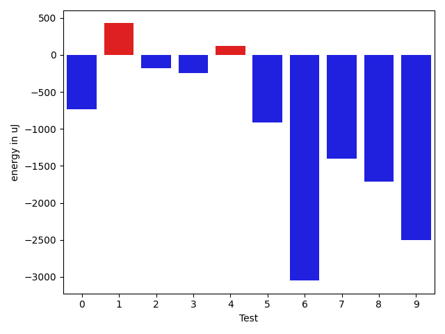
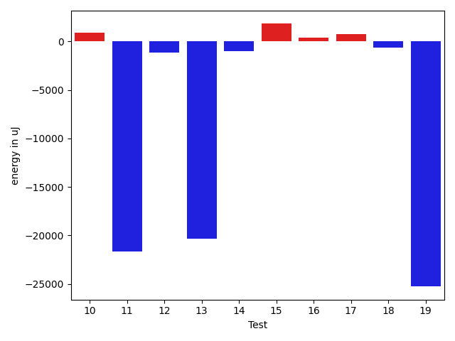
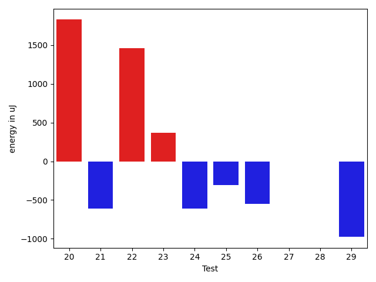
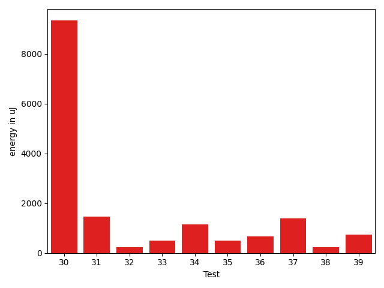
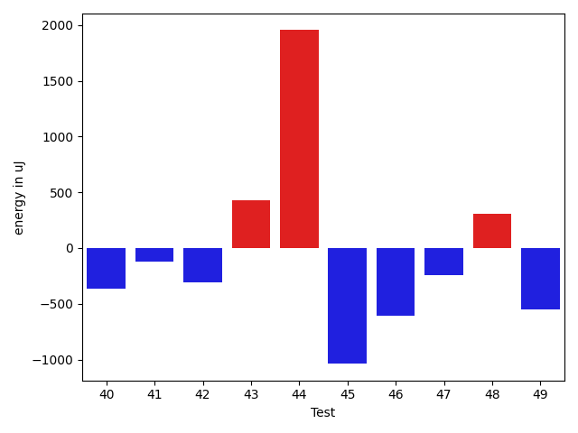
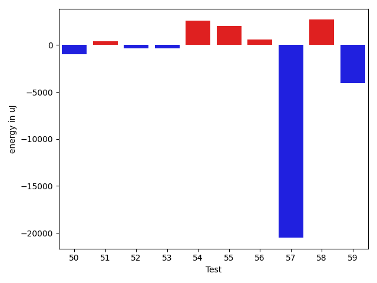
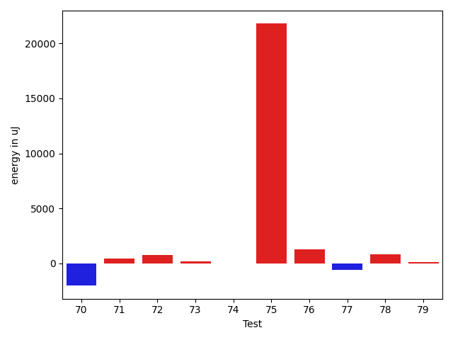
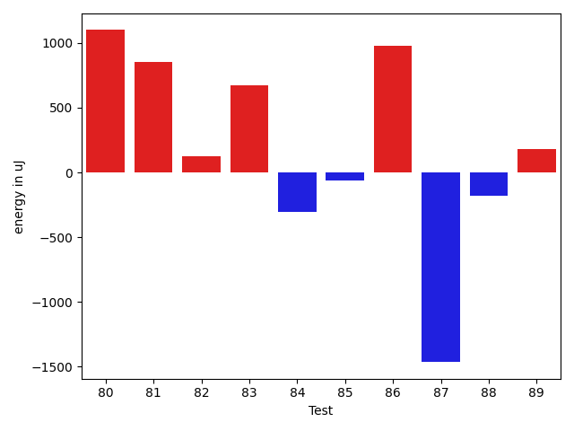
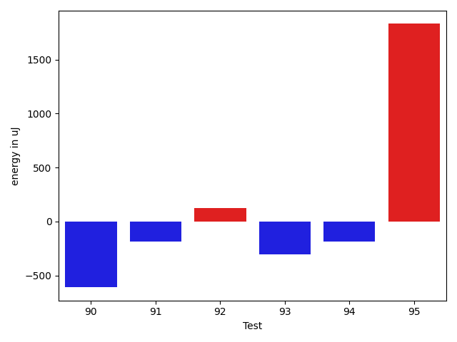

# gson 40b77d

https://github.com/google/gson/commit/40b77d

## Delta Energy per test method

| ID | EnergyV1 | EnergyV2 | DeltaEnergy | σV1 | σV2 |
| --- | --- | --- | --- | --- | --- |
| 0 | 33752 | 33020 | -732 | 2387.63393431304 | 49867.07249996545 |
| 1 | 33813 | 34240 | 427 | 11880.779544973213 | 3698.2707695487807 |
| 2 | 34119 | 33935 | -184 | 14244.625179700233 | 13548.249600378633 |
| 3 | 33935 | 33692 | -243 | 9236.88638963522 | 7718.809630261339 |
| 4 | 72876 | 72998 | 122 | 89602.83496389624 | 82522.75882180345 |
| 5 | 33874 | 32959 | -915 | 10426.344464643367 | 10191.298396610386 |
| 6 | 92346 | 89295 | -3051 | 27543.604522332313 | 27156.67003941603 |
| 7 | 34790 | 33387 | -1403 | 47607.92685500042 | 23896.29023287712 |
| 8 | 36865 | 35156 | -1709 | 100917.47374824353 | 79624.07444304934 |
| 9 | 67260 | 64758 | -2502 | 30384.798328243276 | 28188.938910953133 |
| 10 | 35340 | 36254 | 914 | 57726.02543677504 | 22343.82814064969 |
| 11 | 91613 | 69946 | -21667 | 54892.678956203796 | 50568.87196087181 |
| 12 | 34241 | 33081 | -1160 | 15023.368258714976 | 10716.989183750708 |
| 13 | 99548 | 79223 | -20325 | 100179.06996135082 | 75379.64113709694 |
| 14 | 37109 | 36133 | -976 | 14474.799133179304 | 13437.975520298123 |
| 15 | 34302 | 36133 | 1831 | 2946.841014960177 | 3562.851621730451 |
| 16 | 36316 | 36743 | 427 | 68208.64205996481 | 47187.94896316673 |
| 17 | 35157 | 35949 | 792 | 3514.5249676540766 | 2425.5486647496623 |
| 18 | 36132 | 35522 | -610 | 17835.799739046215 | 2413.9338427872244 |
| 19 | 63354 | 38086 | -25268 | 32246.700291762845 | 37330.7043053704 |
| 20 | 67505 | 69335 | 1830 | 24846.722591281756 | 26014.2956171041 |
| 21 | 34912 | 34302 | -610 | 2898.675888676823 | 3593.4559671373604 |
| 22 | 32959 | 34424 | 1465 | 13618.847043410118 | 17265.744547978204 |
| 23 | 33508 | 33874 | 366 | 2690.986305590387 | 2697.214437196569 |
| 24 | 33936 | 33325 | -611 | 3033.0736889735276 | 2561.5147968383408 |
| 25 | 34362 | 34057 | -305 | 7596.875262186973 | 55047.82897833028 |
| 26 | 33326 | 32776 | -550 | 3067.4007870787646 | 6848.093515731333 |
| 27 | 35217 | 35217 | 0 | 2693.9575381086947 | 2723.1911777662685 |
| 28 | 34973 | 34973 | 0 | 12887.03070485587 | 10195.879410043814 |
| 29 | 36621 | 35644 | -977 | 62692.56649624496 | 97183.83796900492 |
| 30 | 87708 | 97046 | 9338 | 45297.69742581183 | 53535.20415244296 |
| 31 | 33874 | 35340 | 1466 | 36971.04950340492 | 43091.765541581284 |
| 32 | 34546 | 34790 | 244 | 8734.927516275142 | 5137.219424877033 |
| 33 | 34546 | 35034 | 488 | 10809.51227467394 | 12723.169370124006 |
| 34 | 33081 | 34240 | 1159 | 3355.974113308832 | 2729.3704472916006 |
| 35 | 34240 | 34729 | 489 | 2954.1589228337093 | 3731.8855772384018 |
| 36 | 34363 | 35034 | 671 | 27249.4186997212 | 2787.1091028570686 |
| 37 | 31800 | 33203 | 1403 | 3188.789104686396 | 3038.199427989405 |
| 38 | 34668 | 34912 | 244 | 26164.659034956105 | 6771.520692101888 |
| 39 | 32776 | 33508 | 732 | 2585.2661996884226 | 10700.831483464264 |
| 40 | 34485 | 34119 | -366 | 5184.7347170127805 | 2690.329168160586 |
| 41 | 34973 | 34851 | -122 | 3256.661787782084 | 3350.9687086371655 |
| 42 | 34241 | 33936 | -305 | 3139.07217905685 | 3458.322434348387 |
| 43 | 35034 | 35461 | 427 | 11716.399338861815 | 12248.074934949394 |
| 44 | 35461 | 37415 | 1954 | 46282.503524996835 | 16022.8591545057 |
| 45 | 34058 | 33020 | -1038 | 3886.0000977869263 | 2891.945423484866 |
| 46 | 34241 | 33631 | -610 | 4823.933080596313 | 6443.25370707535 |
| 47 | 34119 | 33875 | -244 | 6393.934965064918 | 6145.952491723418 |
| 48 | 33081 | 33387 | 306 | 2627.2155636824996 | 3349.4509106854443 |
| 49 | 35705 | 35156 | -549 | 2354.368656380013 | 2883.418527407184 |
| 50 | 34912 | 33936 | -976 | 4026.753744919376 | 3132.112407605696 |
| 51 | 34607 | 34973 | 366 | 15625.453452086867 | 14217.8653189101 |
| 52 | 34546 | 34180 | -366 | 3083.293858085233 | 3315.99737358117 |
| 53 | 34546 | 34179 | -367 | 2657.8275382976476 | 3026.6425585976936 |
| 54 | 33691 | 36255 | 2564 | 18314.80864395858 | 44635.19113601133 |
| 55 | 31860 | 33875 | 2015 | 2512.874045960856 | 2434.6955910958923 |
| 56 | 34851 | 35461 | 610 | 55329.213097196836 | 70740.2765041659 |
| 57 | 104492 | 83984 | -20508 | 473364.92776639044 | 403610.2050354301 |
| 58 | 33752 | 36438 | 2686 | 3279.6036326551084 | 3146.598493352361 |
| 59 | 78430 | 74341 | -4089 | 52163.493931332574 | 58185.26603007705 |
| 60 | 37292 | 36987 | -305 | 65919.49840293128 | 65409.49763029523 |
| 61 | 36621 | 36072 | -549 | 3269.168913358039 | 5669.139254677772 |
| 62 | 99975 | 84839 | -15136 | 346486.18125841534 | 227649.3395284619 |
| 63 | 37658 | 35584 | -2074 | 193873.24292656677 | 16636.719820449052 |
| 64 | 72449 | 71472 | -977 | 78017.70779855875 | 67179.85159798819 |
| 65 | 316711 | 288329 | -28382 | 78850.88883033303 | 94001.45972780224 |
| 66 | 347655 | 324951 | -22704 | 99910.38885846766 | 93627.03999556712 |
| 67 | 66895 | 71838 | 4943 | 69702.8231176174 | 61843.269380606616 |
| 68 | 37841 | 37232 | -609 | 57792.38639076039 | 64328.093958723875 |
| 69 | 39490 | 38208 | -1282 | 101885.57710613072 | 98399.75972777767 |
| 70 | 67078 | 65063 | -2015 | 22409.563029582234 | 20381.29272128525 |
| 71 | 34790 | 35217 | 427 | 6576.487565023336 | 5966.569573287458 |
| 72 | 36377 | 37171 | 794 | 28146.225387834267 | 16799.69294608222 |
| 73 | 35156 | 35339 | 183 | 13263.517068784984 | 10873.818205717002 |
| 74 | 36682 | 36682 | 0 | 253148.1041732015 | 165931.28499240862 |
| 75 | 123107 | 144897 | 21790 | 269577.70867965725 | 496866.1533277474 |
| 76 | 34973 | 36255 | 1282 | 39610.62485906724 | 71560.524191286 |
| 77 | 35705 | 35095 | -610 | 3230.8784430244355 | 3159.9469964505383 |
| 78 | 36804 | 37658 | 854 | 41295.898395464756 | 46266.3883907548 |
| 79 | 37780 | 37903 | 123 | 37605.87881236345 | 41498.67028587681 |
| 80 | 38208 | 39307 | 1099 | 464057.5490202332 | 427741.76182915113 |
| 81 | 34668 | 35522 | 854 | 7245.93395450825 | 6981.736041095453 |
| 82 | 75073 | 75195 | 122 | 24577.52329216308 | 23152.336667593983 |
| 83 | 34424 | 35095 | 671 | 3846.957988711272 | 2446.0558228794903 |
| 84 | 34363 | 34057 | -306 | 3566.127795750077 | 3651.9547084689225 |
| 85 | 37414 | 37353 | -61 | 29501.341818884976 | 27108.045948732626 |
| 86 | 34606 | 35584 | 978 | 3412.744924640744 | 3753.4020482784294 |
| 87 | 35400 | 33936 | -1464 | 3260.047562002699 | 2983.3133172605226 |
| 88 | 34423 | 34241 | -182 | 2860.3374439408153 | 3913.3910921347992 |
| 89 | 35217 | 35400 | 183 | 3705.8572399962295 | 3664.186921214582 |
| 90 | 40344 | 39734 | -610 | 220511.35523234986 | 84178.73252132152 |
| 91 | 37964 | 37781 | -183 | 13892.189570351888 | 12832.753218221076 |
| 92 | 38086 | 38208 | 122 | 47485.02699960994 | 41127.30641078568 |
| 93 | 36133 | 35828 | -305 | 3300.24702451434 | 3561.0662917692225 |
| 94 | 39002 | 38818 | -184 | 26190.670011947772 | 36825.95388501475 |
| 95 | 36804 | 38636 | 1832 | 49232.73873397152 | 77700.21951433852 |

## Delta Duration per test method

| ID | DurationV1 | DurationsV2 | DeltaDuration |
| --- | --- | --- | --- |
| 0 | 1097522.512195122 | 1356460.5432098766 | 258938.03101475467 |
| 1 | 1030140.2096774194 | 959380.5 | -70759.70967741939 |
| 2 | 1438141.7113402062 | 1410852.8686868686 | -27288.842653337633 |
| 3 | 1217737.511904762 | 1174073.2469135802 | -43664.26499118167 |
| 4 | 3396946.404255319 | 3225299.173469388 | -171647.230785931 |
| 5 | 1409048.4270833333 | 1379971.4631578948 | -29076.963925438467 |
| 6 | 3003528.282828283 | 2868163.1649484537 | -135365.11787982937 |
| 7 | 1704181.2959183673 | 1585279.3673469387 | -118901.92857142864 |
| 8 | 2608057.389473684 | 2282672.4943820224 | -325384.8950916617 |
| 9 | 2490978.1414141413 | 2329009.2551020407 | -161968.88631210057 |
| 10 | 1755098.043478261 | 1557414.7777777778 | -197683.26570048323 |
| 11 | 2925705.326530612 | 2730197.0103092785 | -195508.31622133357 |
| 12 | 1427925.6494845361 | 1378648.7835051545 | -49276.865979381604 |
| 13 | 4117266.0306122447 | 3441203.8061224488 | -676062.224489796 |
| 14 | 1294649.5849056605 | 1132905.0408163266 | -161744.54408933385 |
| 15 | 747000.1052631579 | 730770.081632653 | -16230.023630504846 |
| 16 | 2021279.9761904762 | 1310482.2564102565 | -710797.7197802197 |
| 17 | 533304.9166666666 | 499689.3939393939 | -33615.522727272706 |
| 18 | 720714.1153846154 | 522612.1304347826 | -198101.98494983278 |
| 19 | 1936943.1518987343 | 1961180.6875 | 24237.53560126573 |
| 20 | 2075083.824742268 | 2021084.112244898 | -53999.712497370085 |
| 21 | 632026.8333333334 | 622428.7714285714 | -9598.06190476194 |
| 22 | 1332513.3263157895 | 1429066.923076923 | 96553.59676113352 |
| 23 | 665756.03125 | 665053.8947368421 | -702.1365131578641 |
| 24 | 494500.51851851854 | 546483.7619047619 | 51983.24338624335 |
| 25 | 717835.3611111111 | 1047496.35 | 329660.98888888885 |
| 26 | 960906.0714285715 | 1003106.0317460317 | 42199.96031746024 |
| 27 | 789371.2195121951 | 738196.358974359 | -51174.860537836095 |
| 28 | 1291289.8275862068 | 1236489.5268817204 | -54800.300704486435 |
| 29 | 1408905.4423076923 | 1866874.1666666667 | 457968.7243589745 |
| 30 | 3262640.868686869 | 3523070.845360825 | 260429.97667395603 |
| 31 | 1175357.9705882352 | 1135582.6142857142 | -39775.35630252096 |
| 32 | 1080995.6438356165 | 1033710.6323529412 | -47285.01148267533 |
| 33 | 1089856.5857142857 | 1123210.3015873015 | 33353.71587301581 |
| 34 | 819460.4339622641 | 773748.3095238095 | -45712.12443845463 |
| 35 | 781723.8611111111 | 741907.8 | -39816.06111111108 |
| 36 | 938077.2307692308 | 774986.9130434783 | -163090.31772575248 |
| 37 | 823428.6833333333 | 847411.754385965 | 23983.071052631596 |
| 38 | 1106669.2857142857 | 1049379.8382352942 | -57289.44747899147 |
| 39 | 547492.4347826086 | 644501.5625 | 97009.12771739135 |
| 40 | 949118.4489795918 | 880581.737704918 | -68536.71127467381 |
| 41 | 682769.9210526316 | 694687.4166666666 | 11917.495614035055 |
| 42 | 481601.17647058825 | 431442.8181818182 | -50158.358288770076 |
| 43 | 1286071.5647058825 | 1296386.512195122 | 10314.947489239508 |
| 44 | 1116630.536585366 | 994787.0465116279 | -121843.49007373804 |
| 45 | 672906.075 | 739550.7878787878 | 66644.71287878789 |
| 46 | 1019256.1428571428 | 943107.625 | -76148.51785714284 |
| 47 | 876111.1162790698 | 938418.8703703703 | 62307.754091300536 |
| 48 | 755362.0208333334 | 807256.7068965518 | 51894.686063218396 |
| 49 | 703095.0454545454 | 721884.9761904762 | 18789.9307359308 |
| 50 | 746724.5277777778 | 772674.2857142857 | 25949.75793650793 |
| 51 | 758683.9166666666 | 860952.9666666667 | 102269.05000000005 |
| 52 | 535051.5 | 463401.9583333333 | -71649.54166666669 |
| 53 | 572115.0 | 579831.0769230769 | 7716.076923076878 |
| 54 | 847170.6315789474 | 1577170.25 | 729999.6184210526 |
| 55 | 577957.3870967742 | 605063.5 | 27106.112903225818 |
| 56 | 979805.2647058824 | 1452391.5909090908 | 472586.3262032084 |
| 57 | 7899525.808080808 | 6755045.346938776 | -1144480.4611420324 |
| 58 | 730995.4680851063 | 718588.8285714285 | -12406.639513677801 |
| 59 | 3064641.212121212 | 3026767.2346938774 | -37873.977427334525 |
| 60 | 1936387.9824561405 | 1856605.9607843137 | -79782.02167182672 |
| 61 | 934995.7413793104 | 910141.4150943396 | -24854.32628497074 |
| 62 | 5438334.585858586 | 4613514.090909091 | -824820.4949494954 |
| 63 | 2027580.1216216215 | 1231272.5384615385 | -796307.583160083 |
| 64 | 2886406.1326530613 | 2653056.4591836734 | -233349.67346938793 |
| 65 | 8953465.666666666 | 8923157.43877551 | -30308.22789115645 |
| 66 | 9990483.303030303 | 9490649.81632653 | -499833.4867037721 |
| 67 | 2797587.3434343436 | 2608494.696969697 | -189092.6464646468 |
| 68 | 1644586.3921568627 | 1463749.7735849055 | -180836.6185719571 |
| 69 | 2518349.5263157897 | 2062860.5 | -455489.02631578967 |
| 70 | 2062552.0909090908 | 2024467.8585858585 | -38084.23232323234 |
| 71 | 1098393.794117647 | 1049142.0384615385 | -49251.75565610849 |
| 72 | 1169831.380952381 | 1060521.1666666667 | -109310.21428571432 |
| 73 | 1127132.6666666667 | 1115152.1515151516 | -11980.515151515137 |
| 74 | 2678904.6440677964 | 1775543.8852459015 | -903360.7588218949 |
| 75 | 5592322.711340206 | 9881190.04040404 | 4288867.329063835 |
| 76 | 1403082.12987013 | 2141420.2592592593 | 738338.1293891293 |
| 77 | 797204.46 | 872448.1960784313 | 75243.73607843136 |
| 78 | 1384478.6904761905 | 1688359.732142857 | 303881.0416666665 |
| 79 | 1519575.656716418 | 1647506.0632911392 | 127930.40657472122 |
| 80 | 4731953.366197183 | 4710577.357142857 | -21376.00905432552 |
| 81 | 1140434.25 | 1156603.6463414633 | 16169.396341463318 |
| 82 | 2714551.242424242 | 2721629.663265306 | 7078.420841063838 |
| 83 | 682991.5806451613 | 668931.7105263158 | -14059.870118845487 |
| 84 | 737366.8461538461 | 686177.5 | -51189.34615384613 |
| 85 | 1731748.911111111 | 1619538.011627907 | -112210.89948320412 |
| 86 | 831853.6181818182 | 798269.7884615385 | -33583.82972027967 |
| 87 | 634251.7272727273 | 639831.3636363636 | 5579.636363636353 |
| 88 | 679028.8055555555 | 627811.2285714286 | -51217.576984126936 |
| 89 | 890861.8113207547 | 808209.98 | -82651.83132075472 |
| 90 | 3277246.7027027025 | 2072321.8823529412 | -1204924.8203497613 |
| 91 | 1119673.21875 | 1022749.5897435897 | -96923.62900641025 |
| 92 | 1666622.7586206896 | 1463657.0 | -202965.75862068962 |
| 93 | 860716.9787234042 | 905833.65 | 45116.67127659579 |
| 94 | 1361229.6764705882 | 1413307.4166666667 | 52077.74019607855 |
| 95 | 1352956.95 | 2415351.527777778 | 1062394.577777778 |

## Misc.

| ID | Test Class | Test Method |
| --- | --- | --- |
| 0 | com.google.gson.functional.ParameterizedTypesTest | testParameterizedTypeGenericArraysSerialization |
| 1 | com.google.gson.functional.ParameterizedTypesTest | testParameterizedTypesWithWriterSerialization |
| 2 | com.google.gson.functional.ParameterizedTypesTest | testVariableTypeArrayDeserialization |
| 3 | com.google.gson.functional.ParameterizedTypesTest | testParameterizedTypeWithReaderDeserialization |
| 4 | com.google.gson.functional.ParameterizedTypesTest | testParameterizedTypesSerialization |
| 5 | com.google.gson.functional.ParameterizedTypesTest | testVariableTypeDeserialization |
| 6 | com.google.gson.functional.ParameterizedTypesTest | testVariableTypeFieldsAndGenericArraysSerialization |
| 7 | com.google.gson.functional.ParameterizedTypesTest | testParameterizedTypeGenericArraysDeserialization |
| 8 | com.google.gson.functional.ParameterizedTypesTest | testParameterizedTypeDeserialization |
| 9 | com.google.gson.functional.ParameterizedTypesTest | testVariableTypeFieldsAndGenericArraysDeserialization |
| 10 | com.google.gson.functional.ParameterizedTypesTest | testTypesWithMultipleParametersDeserialization |
| 11 | com.google.gson.functional.ParameterizedTypesTest | testTypesWithMultipleParametersSerialization |
| 12 | com.google.gson.functional.ParameterizedTypesTest | testParameterizedTypeWithVariableTypeDeserialization |
| 13 | com.google.gson.functional.ExposeFieldsTest | testNullExposeFieldSerialization |
| 14 | com.google.gson.functional.ExposeFieldsTest | testArrayWithOneNullExposeFieldObjectSerialization |
| 15 | com.google.gson.functional.ExposeFieldsTest | testNoExposedFieldDeserialization |
| 16 | com.google.gson.functional.ExposeFieldsTest | testExposeAnnotationDeserialization |
| 17 | com.google.gson.functional.ExposeFieldsTest | testNoExposedFieldSerialization |
| 18 | com.google.gson.functional.ExposeFieldsTest | testExposeAnnotationSerialization |
| 19 | com.google.gson.functional.ObjectTest | testDirectedAcyclicGraphSerialization |
| 20 | com.google.gson.functional.ObjectTest | testArrayOfArraysDeserialization |
| 21 | com.google.gson.functional.ObjectTest | testNullFieldsSerialization |
| 22 | com.google.gson.functional.ObjectTest | testSubInterfacesOfCollectionDeserialization |
| 23 | com.google.gson.functional.ObjectTest | testPrivateNoArgConstructorDeserialization |
| 24 | com.google.gson.functional.ObjectTest | testPrimitiveArrayFieldSerialization |
| 25 | com.google.gson.functional.ObjectTest | testClassWithEnumFieldDeserialization |
| 26 | com.google.gson.functional.ObjectTest | testClassWithObjectFieldSerialization |
| 27 | com.google.gson.functional.ObjectTest | testBagOfPrimitiveWrappersSerialization |
| 28 | com.google.gson.functional.ObjectTest | testArrayOfObjectsDeserialization |
| 29 | com.google.gson.functional.ObjectTest | testJsonInSingleQuotesDeserialization |
| 30 | com.google.gson.functional.ObjectTest | testSubInterfacesOfCollectionSerialization |
| 31 | com.google.gson.functional.ObjectTest | testNestedDeserialization |
| 32 | com.google.gson.functional.ObjectTest | testInheritenceDeserialization |
| 33 | com.google.gson.functional.ObjectTest | testInheritenceSerialization |
| 34 | com.google.gson.functional.ObjectTest | testNullFieldsDeserialization |
| 35 | com.google.gson.functional.ObjectTest | testClassWithTransientFieldsSerialization |
| 36 | com.google.gson.functional.ObjectTest | testBagOfPrimitivesDeserialization |
| 37 | com.google.gson.functional.ObjectTest | testInnerClassDeserialization |
| 38 | com.google.gson.functional.ObjectTest | testDirectedAcyclicGraphDeserialization |
| 39 | com.google.gson.functional.ObjectTest | testNullObjectFieldsDeserialization |
| 40 | com.google.gson.functional.ObjectTest | testNestedSerialization |
| 41 | com.google.gson.functional.ObjectTest | testClassWithTransientFieldsDeserialization |
| 42 | com.google.gson.functional.ObjectTest | testClassWithNoFieldsSerialization |
| 43 | com.google.gson.functional.ObjectTest | testArrayOfArraysSerialization |
| 44 | com.google.gson.functional.ObjectTest | testBagOfPrimitivesSerialization |
| 45 | com.google.gson.functional.ObjectTest | testBagOfPrimitiveWrappersDeserialization |
| 46 | com.google.gson.functional.ObjectTest | testArrayOfObjectsSerialization |
| 47 | com.google.gson.functional.ObjectTest | testPrimitiveArrayInAnObjectDeserialization |
| 48 | com.google.gson.functional.ObjectTest | testInnerClassSerialization |
| 49 | com.google.gson.functional.ObjectTest | testClassWithEnumFieldSerialization |
| 50 | com.google.gson.functional.ObjectTest | testJsonInMixedQuotesDeserialization |
| 51 | com.google.gson.functional.ObjectTest | testEmptyCollectionInAnObjectDeserialization |
| 52 | com.google.gson.functional.ObjectTest | testClassWithNoFieldsDeserialization |
| 53 | com.google.gson.functional.ObjectTest | testNullPrimitiveFieldsDeserialization |
| 54 | com.google.gson.functional.ObjectTest | testEmptyCollectionInAnObjectSerialization |
| 55 | com.google.gson.functional.ObjectTest | testNullArraysDeserialization |
| 56 | com.google.gson.functional.ObjectTest | testClassWithTransientFieldsDeserializationTransientFieldsPassedInJsonAreIgnored |
| 57 | com.google.gson.functional.NamingPolicyTest | testGsonWithNonDefaultFieldNamingPolicySerialization |
| 58 | com.google.gson.functional.NamingPolicyTest | testGsonWithSerializedNameFieldNamingPolicyDeserialization |
| 59 | com.google.gson.functional.NamingPolicyTest | testGsonWithSerializedNameFieldNamingPolicySerialization |
| 60 | com.google.gson.functional.NamingPolicyTest | testGsonWithNonDefaultFieldNamingPolicyDeserialiation |
| 61 | com.google.gson.FunctionalWithInternalDependenciesTest | testAnonymousLocalClassesSerialization |
| 62 | com.google.gson.FunctionalWithInternalDependenciesTest | testPrettyPrintList |
| 63 | com.google.gson.FunctionalWithInternalDependenciesTest | testPrettyPrintArrayOfObjects |
| 64 | com.google.gson.functional.ConcurrencyTest | testSingleThreadSerialization |
| 65 | com.google.gson.functional.ConcurrencyTest | testMultiThreadSerialization |
| 66 | com.google.gson.functional.ConcurrencyTest | testMultiThreadDeserialization |
| 67 | com.google.gson.functional.ConcurrencyTest | testSingleThreadDeserialization |
| 68 | com.google.gson.functional.ReadersWritersTest | testReaderForDeserialization |
| 69 | com.google.gson.functional.ReadersWritersTest | testWriterForSerialization |
| 70 | com.google.gson.functional.CustomTypeAdaptersTest | testCustomTypeAdapterDoesNotAppliesToSubClasses |
| 71 | com.google.gson.functional.CustomTypeAdaptersTest | testCustomDeserializerForLong |
| 72 | com.google.gson.functional.CustomTypeAdaptersTest | testCustomNestedDeserializers |
| 73 | com.google.gson.functional.CustomTypeAdaptersTest | testCustomSerializerForLong |
| 74 | com.google.gson.functional.CustomTypeAdaptersTest | testCustomNestedSerializers |
| 75 | com.google.gson.functional.VersioningTest | testVersionedClassesSerialization |
| 76 | com.google.gson.functional.VersioningTest | testVersionedClassesDeserialization |
| 77 | com.google.gson.functional.VersioningTest | testVersionedGsonWithUnversionedClassesDeserialization |
| 78 | com.google.gson.functional.VersioningTest | testVersionedGsonWithUnversionedClassesSerialization |
| 79 | com.google.gson.functional.EscapingTest | testEscapingObjectFields |
| 80 | com.google.gson.functional.PrintFormattingTest | testCompactFormattingLeavesNoWhiteSpace |
| 81 | com.google.gson.functional.DefaultTypeAdaptersTest | testBigIntegerFieldSerialization |
| 82 | com.google.gson.functional.DefaultTypeAdaptersTest | testBigDecimalFieldSerialization |
| 83 | com.google.gson.functional.DefaultTypeAdaptersTest | testBigIntegerFieldDeserialization |
| 84 | com.google.gson.functional.DefaultTypeAdaptersTest | testBigDecimalFieldDeserialization |
| 85 | com.google.gson.functional.NullObjectAndFieldTest | testExplicitSerializationOfNullArrayMembers |
| 86 | com.google.gson.functional.NullObjectAndFieldTest | testNullWrappedPrimitiveMemberDeserialization |
| 87 | com.google.gson.functional.NullObjectAndFieldTest | testExplicitSerializationOfNullStringMembers |
| 88 | com.google.gson.functional.NullObjectAndFieldTest | testExplicitSerializationOfNullCollectionMembers |
| 89 | com.google.gson.functional.NullObjectAndFieldTest | testNullWrappedPrimitiveMemberSerialization |
| 90 | com.google.gson.functional.NullObjectAndFieldTest | testExplicitSerializationOfNulls |
| 91 | com.google.gson.functional.NullObjectAndFieldTest | testExplicitDeserializationOfNulls |
| 92 | com.google.gson.functional.CollectionTest | testCollectionOfBagOfPrimitivesSerialization |
| 93 | com.google.gson.functional.CollectionTest | testRawCollectionSerialization |
| 94 | com.google.gson.functional.UncategorizedTest | testStaticFieldsAreNotSerialized |
| 95 | com.google.gson.functional.UncategorizedTest | testObjectEqualButNotSameSerialization |

| Test | IterationV1 | IterationV2 | DeltaIteration |
| --- | --- | --- | --- |
| 0 | 82 | 81 | -1 |
| 1 | 62 | 58 | -4 |
| 2 | 97 | 99 | 2 |
| 3 | 84 | 81 | -3 |
| 4 | 94 | 98 | 4 |
| 5 | 96 | 95 | -1 |
| 6 | 99 | 97 | -2 |
| 7 | 98 | 98 | 0 |
| 8 | 95 | 89 | -6 |
| 9 | 99 | 98 | -1 |
| 10 | 92 | 90 | -2 |
| 11 | 98 | 97 | -1 |
| 12 | 97 | 97 | 0 |
| 13 | 98 | 98 | 0 |
| 14 | 53 | 49 | -4 |
| 15 | 38 | 49 | 11 |
| 16 | 42 | 39 | -3 |
| 17 | 24 | 33 | 9 |
| 18 | 26 | 23 | -3 |
| 19 | 79 | 80 | 1 |
| 20 | 97 | 98 | 1 |
| 21 | 42 | 35 | -7 |
| 22 | 95 | 91 | -4 |
| 23 | 32 | 38 | 6 |
| 24 | 27 | 21 | -6 |
| 25 | 36 | 40 | 4 |
| 26 | 70 | 63 | -7 |
| 27 | 41 | 39 | -2 |
| 28 | 87 | 93 | 6 |
| 29 | 52 | 54 | 2 |
| 30 | 99 | 97 | -2 |
| 31 | 68 | 70 | 2 |
| 32 | 73 | 68 | -5 |
| 33 | 70 | 63 | -7 |
| 34 | 53 | 42 | -11 |
| 35 | 36 | 25 | -11 |
| 36 | 39 | 46 | 7 |
| 37 | 60 | 57 | -3 |
| 38 | 70 | 68 | -2 |
| 39 | 23 | 16 | -7 |
| 40 | 49 | 61 | 12 |
| 41 | 38 | 36 | -2 |
| 42 | 17 | 22 | 5 |
| 43 | 85 | 82 | -3 |
| 44 | 41 | 43 | 2 |
| 45 | 40 | 33 | -7 |
| 46 | 56 | 64 | 8 |
| 47 | 43 | 54 | 11 |
| 48 | 48 | 58 | 10 |
| 49 | 44 | 42 | -2 |
| 50 | 36 | 35 | -1 |
| 51 | 36 | 30 | -6 |
| 52 | 28 | 24 | -4 |
| 53 | 30 | 26 | -4 |
| 54 | 38 | 24 | -14 |
| 55 | 31 | 26 | -5 |
| 56 | 34 | 44 | 10 |
| 57 | 99 | 98 | -1 |
| 58 | 47 | 35 | -12 |
| 59 | 99 | 98 | -1 |
| 60 | 57 | 51 | -6 |
| 61 | 58 | 53 | -5 |
| 62 | 99 | 99 | 0 |
| 63 | 74 | 78 | 4 |
| 64 | 98 | 98 | 0 |
| 65 | 99 | 98 | -1 |
| 66 | 99 | 98 | -1 |
| 67 | 99 | 99 | 0 |
| 68 | 51 | 53 | 2 |
| 69 | 38 | 40 | 2 |
| 70 | 99 | 99 | 0 |
| 71 | 68 | 78 | 10 |
| 72 | 63 | 66 | 3 |
| 73 | 72 | 66 | -6 |
| 74 | 59 | 61 | 2 |
| 75 | 97 | 99 | 2 |
| 76 | 77 | 81 | 4 |
| 77 | 50 | 51 | 1 |
| 78 | 42 | 56 | 14 |
| 79 | 67 | 79 | 12 |
| 80 | 71 | 70 | -1 |
| 81 | 76 | 82 | 6 |
| 82 | 99 | 98 | -1 |
| 83 | 31 | 38 | 7 |
| 84 | 39 | 48 | 9 |
| 85 | 90 | 86 | -4 |
| 86 | 55 | 52 | -3 |
| 87 | 33 | 33 | 0 |
| 88 | 36 | 35 | -1 |
| 89 | 53 | 50 | -3 |
| 90 | 37 | 34 | -3 |
| 91 | 32 | 39 | 7 |
| 92 | 58 | 54 | -4 |
| 93 | 47 | 40 | -7 |
| 94 | 34 | 48 | 14 |
| 95 | 40 | 36 | -4 |

| Time Label | Time (s) |
| --- | --- |
| Selection | 21.844255924224854 |
| Injection | 10.473567724227905 |
| Total | 958.7844293117523 |

