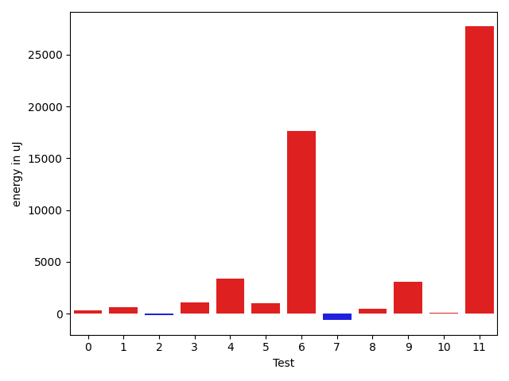
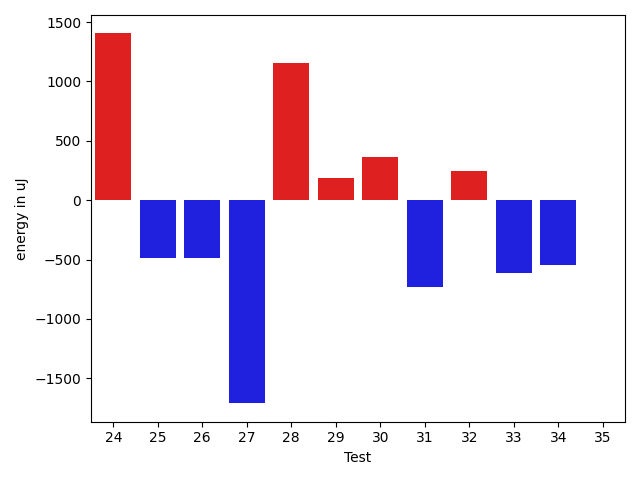
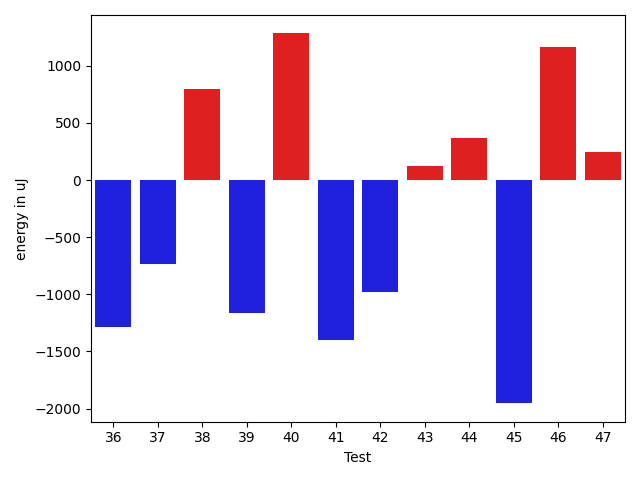
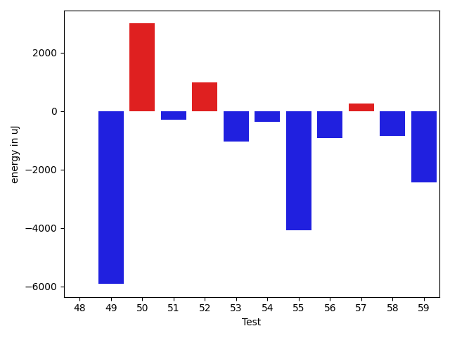
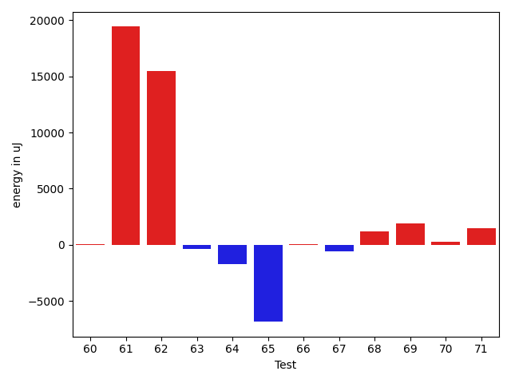
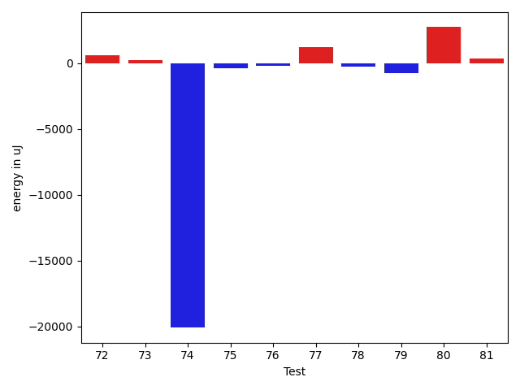

# gson bcd1ba

https://github.com/google/gson/commit/bcd1ba

## Delta Energy per test method

| ID | EnergyV1 | EnergyV2 | DeltaEnergy | σV1 | σV2 |
| --- | --- | --- | --- | --- | --- |
| 0 | 32959 | 33264 | 305 | 51684.73587489262 | 9507.829228319677 |
| 1 | 33874 | 34485 | 611 | 2644.4607429670327 | 14674.482349850876 |
| 2 | 34119 | 33997 | -122 | 13122.18163336429 | 12877.933658221667 |
| 3 | 33569 | 34668 | 1099 | 20152.94584868354 | 18423.282601603885 |
| 4 | 74462 | 77820 | 3358 | 48623.83393042261 | 79728.1933267588 |
| 5 | 33996 | 35034 | 1038 | 10217.202175261904 | 12621.506716639542 |
| 6 | 72570 | 90210 | 17640 | 27330.947588081213 | 32462.0644244332 |
| 7 | 33996 | 33386 | -610 | 25626.093591384797 | 19075.330475531468 |
| 8 | 36255 | 36744 | 489 | 45590.98720087141 | 78137.32034663955 |
| 9 | 66101 | 69153 | 3052 | 35865.19907463213 | 27793.026389377334 |
| 10 | 36438 | 36560 | 122 | 59959.161940292746 | 26549.258569117825 |
| 11 | 67932 | 95642 | 27710 | 48749.53904971815 | 48252.75792557499 |
| 12 | 34180 | 33264 | -916 | 12126.88356124799 | 10841.267434362991 |
| 13 | 80200 | 104614 | 24414 | 98057.54234658327 | 112452.04885215929 |
| 14 | 36805 | 37720 | 915 | 16611.11627016157 | 13213.058023367978 |
| 15 | 36438 | 37903 | 1465 | 70830.0333752551 | 69447.26485486256 |
| 16 | 35889 | 35095 | -794 | 4483.625490596929 | 2649.2050753369253 |
| 17 | 35400 | 34912 | -488 | 62269.28366305271 | 43442.85011011593 |
| 18 | 67444 | 67322 | -122 | 24979.767905478424 | 23907.453430864243 |
| 19 | 35888 | 34485 | -1403 | 2642.562629235702 | 2800.1555012648305 |
| 20 | 33813 | 35339 | 1526 | 41615.7955397328 | 40458.72813615206 |
| 21 | 34851 | 33630 | -1221 | 6557.87486053071 | 6551.451185351322 |
| 22 | 34118 | 34118 | 0 | 2951.967218189944 | 7089.916370639444 |
| 23 | 33630 | 32959 | -671 | 5149.166355323656 | 2569.8589344437646 |
| 24 | 33508 | 34912 | 1404 | 3749.299135557144 | 6153.674151155044 |
| 25 | 33996 | 33509 | -487 | 5826.119337930057 | 2559.2471379462236 |
| 26 | 35339 | 34851 | -488 | 11201.11309925144 | 10793.156501131722 |
| 27 | 36072 | 34362 | -1710 | 13541.101173418854 | 12631.830611735046 |
| 28 | 35401 | 36560 | 1159 | 36555.748293454475 | 71453.07287313744 |
| 29 | 35340 | 35523 | 183 | 9906.891180151919 | 5508.882121481063 |
| 30 | 34667 | 35034 | 367 | 55100.56832234444 | 52542.467982007336 |
| 31 | 35339 | 34607 | -732 | 6058.0639459015765 | 8157.700511706469 |
| 32 | 34790 | 35034 | 244 | 2599.417941732816 | 3384.0906171058646 |
| 33 | 35400 | 34790 | -610 | 16955.662772080977 | 16092.81070971479 |
| 34 | 34180 | 33630 | -550 | 2839.9828754140526 | 3120.991905052776 |
| 35 | 34606 | 34606 | 0 | 11431.40200401262 | 13075.861499303768 |
| 36 | 36316 | 35034 | -1282 | 6327.408578987434 | 3539.4350244087004 |
| 37 | 33386 | 32654 | -732 | 5382.0012101045995 | 7519.913138338671 |
| 38 | 33508 | 34302 | 794 | 2991.368570931908 | 54351.929790048336 |
| 39 | 34058 | 32898 | -1160 | 3456.3265470727733 | 2641.7906966603045 |
| 40 | 34912 | 36194 | 1282 | 3123.24140339714 | 2998.706335106945 |
| 41 | 35644 | 34241 | -1403 | 3013.2053756091705 | 3570.0444507834573 |
| 42 | 33935 | 32959 | -976 | 2325.104169533846 | 6519.777039368763 |
| 43 | 33142 | 33264 | 122 | 4240.050608155782 | 1889.6495652077772 |
| 44 | 34912 | 35278 | 366 | 2681.6447937786243 | 3876.6290339245347 |
| 45 | 34606 | 32653 | -1953 | 2955.2894993031323 | 2855.050962767565 |
| 46 | 34607 | 35767 | 1160 | 6707.555998227929 | 2351.2040816587605 |
| 47 | 34180 | 34424 | 244 | 3708.049924151508 | 2504.7133944243237 |
| 48 | 34729 | 34729 | 0 | 3369.8946015254273 | 2463.4393902894444 |
| 49 | 87158 | 81237 | -5921 | 334171.6616714966 | 421817.0085257501 |
| 50 | 71472 | 74463 | 2991 | 53203.09719469011 | 56043.58333303419 |
| 51 | 34973 | 34668 | -305 | 4002.109290968889 | 8065.5039861815885 |
| 52 | 36377 | 37353 | 976 | 49977.44561306121 | 61130.55822937809 |
| 53 | 35767 | 34729 | -1038 | 3487.7242854066517 | 3988.468282268116 |
| 54 | 35827 | 35462 | -365 | 4087.323132625541 | 3554.8199975306416 |
| 55 | 42115 | 38025 | -4090 | 37146.83618810513 | 33876.7200666601 |
| 56 | 38880 | 37964 | -916 | 105522.29076834008 | 59308.18953777051 |
| 57 | 35706 | 35950 | 244 | 3292.5603229704707 | 3475.969179338063 |
| 58 | 36560 | 35705 | -855 | 3252.369070484578 | 3788.875938967444 |
| 59 | 40283 | 37842 | -2441 | 25696.55920274813 | 11056.269849462204 |
| 60 | 72754 | 72815 | 61 | 78248.25062780773 | 70670.96165210851 |
| 61 | 307617 | 327025 | 19408 | 108912.18950515904 | 88777.78009035742 |
| 62 | 323119 | 338561 | 15442 | 107218.36381615097 | 111492.62432071923 |
| 63 | 71350 | 70984 | -366 | 63599.1819331191 | 59893.935151772224 |
| 64 | 36499 | 34789 | -1710 | 25422.35668136168 | 32131.939988438477 |
| 65 | 116760 | 109924 | -6836 | 187417.27836806825 | 208709.92422862948 |
| 66 | 37415 | 37476 | 61 | 47346.9446705088 | 39245.55276555038 |
| 67 | 38330 | 37781 | -549 | 388820.1674959371 | 236608.19284129742 |
| 68 | 38025 | 39245 | 1220 | 28264.19523927112 | 25246.67115312036 |
| 69 | 37781 | 39673 | 1892 | 87187.70424911991 | 42534.05281992945 |
| 70 | 36255 | 36560 | 305 | 26791.935105680634 | 34714.04595067572 |
| 71 | 67382 | 68848 | 1466 | 19291.296733068557 | 20212.987831349892 |
| 72 | 37354 | 37964 | 610 | 265115.74128067447 | 277804.7787453791 |
| 73 | 37841 | 38086 | 245 | 45930.69500609652 | 41972.019216178676 |
| 74 | 104858 | 84777 | -20081 | 190783.1594968226 | 232687.64130243516 |
| 75 | 38085 | 37719 | -366 | 293071.3026302827 | 252727.69360848688 |
| 76 | 38574 | 38391 | -183 | 440324.36577550153 | 576729.3365650731 |
| 77 | 35827 | 37049 | 1222 | 3235.163399299221 | 24103.306772538363 |
| 78 | 36071 | 35827 | -244 | 25079.5439050209 | 21889.20335563205 |
| 79 | 37902 | 37170 | -732 | 38203.44353183362 | 51978.00093394897 |
| 80 | 36499 | 39245 | 2746 | 89212.71243899167 | 88950.4517731501 |
| 81 | 36499 | 36865 | 366 | 61128.76350815219 | 68323.5693081514 |

## Delta Duration per test method

| ID | DurationV1 | DurationsV2 | DeltaDuration |
| --- | --- | --- | --- |
| 0 | 1337269.948051948 | 1071092.524390244 | -266177.4236617042 |
| 1 | 948693.25 | 1034532.0 | 85838.75 |
| 2 | 1388216.9896907217 | 1392798.0721649486 | 4581.0824742268305 |
| 3 | 1223707.3793103448 | 1255406.6097560977 | 31699.23044575285 |
| 4 | 2700932.2395833335 | 3323360.8210526314 | 622428.5814692979 |
| 5 | 1391363.2659574468 | 1363207.9479166667 | -28155.318040780025 |
| 6 | 2800191.5353535353 | 3012356.797979798 | 212165.26262626285 |
| 7 | 1541678.383838384 | 1525001.6464646466 | -16676.737373737385 |
| 8 | 1655692.7959183673 | 2370138.0425531915 | 714445.2466348242 |
| 9 | 2386644.8383838385 | 2368429.1919191917 | -18215.646464646794 |
| 10 | 1655467.2808988765 | 1555784.6 | -99682.6808988764 |
| 11 | 2636947.556701031 | 2843733.3131313133 | 206785.75643028226 |
| 12 | 1336143.7835051545 | 1394734.494736842 | 58590.71123168757 |
| 13 | 3992282.5463917525 | 4403938.908163265 | 411656.3617715128 |
| 14 | 1218922.6545454545 | 1219987.1 | 1064.445454545552 |
| 15 | 2082722.8421052631 | 2489005.5714285714 | 406282.7293233082 |
| 16 | 529092.4166666666 | 524742.2608695652 | -4350.155797101441 |
| 17 | 1529248.8166666667 | 1300593.38 | -228655.43666666676 |
| 18 | 2073196.5454545454 | 2034912.5773195876 | -38283.96813495783 |
| 19 | 737841.4761904762 | 700577.4864864865 | -37263.989703989704 |
| 20 | 925305.5588235294 | 957444.6666666666 | 32139.10784313723 |
| 21 | 950435.9795918367 | 892565.947368421 | -57870.03222341568 |
| 22 | 645125.2702702703 | 678093.5185185185 | 32968.248248248245 |
| 23 | 828193.7868852459 | 806283.8571428572 | -21909.929742388777 |
| 24 | 774838.0256410256 | 792118.6458333334 | 17280.620192307746 |
| 25 | 1005924.0289855072 | 965355.3125 | -40568.716485507204 |
| 26 | 1283200.0222222223 | 1244068.370786517 | -39131.65143570537 |
| 27 | 1356925.3 | 1293249.987654321 | -63675.31234567915 |
| 28 | 1223313.88 | 1439545.6458333333 | 216231.76583333337 |
| 29 | 809349.2272727273 | 839959.5882352941 | 30610.360962566803 |
| 30 | 1509322.042253521 | 1297483.5454545454 | -211838.49679897563 |
| 31 | 1100342.3797468354 | 1069425.486111111 | -30916.89363572444 |
| 32 | 700557.1944444445 | 697915.9444444445 | -2641.25 |
| 33 | 1294970.9589041097 | 1131565.6470588236 | -163405.31184528605 |
| 34 | 825662.8113207547 | 783569.1454545455 | -42093.665866209194 |
| 35 | 1085682.09375 | 1039037.21875 | -46644.875 |
| 36 | 762407.6666666666 | 698199.0303030303 | -64208.63636363635 |
| 37 | 909545.033898305 | 931214.6949152543 | 21669.66101694922 |
| 38 | 684674.4516129033 | 1043719.78125 | 359045.32963709673 |
| 39 | 718249.4285714285 | 662288.6875 | -55960.74107142852 |
| 40 | 788497.4782608695 | 740430.947368421 | -48066.5308924485 |
| 41 | 720189.84 | 721806.4594594594 | 1616.6194594594417 |
| 42 | 570707.6 | 597327.7419354839 | 26620.1419354839 |
| 43 | 581402.4166666666 | 518231.3076923077 | -63171.10897435894 |
| 44 | 783709.625 | 711582.9629629629 | -72126.66203703708 |
| 45 | 710151.074074074 | 584703.9565217391 | -125447.11755233491 |
| 46 | 855567.0243902439 | 776162.5757575758 | -79404.44863266812 |
| 47 | 490926.36 | 455340.5714285714 | -35585.788571428566 |
| 48 | 563599.4193548387 | 518722.25925925927 | -44877.1600955794 |
| 49 | 5125534.101010101 | 6821871.626262627 | 1696337.5252525257 |
| 50 | 2750341.121212121 | 2974949.43877551 | 224608.31756338896 |
| 51 | 702704.9696969697 | 728145.2666666667 | 25440.296969696996 |
| 52 | 1431977.2558139535 | 1822817.8113207547 | 390840.55550680123 |
| 53 | 724543.0810810811 | 694025.282051282 | -30517.799029799062 |
| 54 | 729994.9772727273 | 718692.15625 | -11302.821022727294 |
| 55 | 1955013.9673913044 | 1762662.4186046512 | -192351.5487866532 |
| 56 | 2782224.5 | 1327262.2608695652 | -1454962.2391304348 |
| 57 | 898140.0576923077 | 853856.9491525424 | -44283.10853976535 |
| 58 | 868708.4814814815 | 887513.1403508772 | 18804.65886939573 |
| 59 | 1447459.7222222222 | 934068.5476190476 | -513391.1746031747 |
| 60 | 2756659.888888889 | 2864529.4646464647 | 107869.57575757569 |
| 61 | 9283615.393939395 | 9282069.272727273 | -1546.1212121210992 |
| 62 | 9900053.818181818 | 10058139.050505051 | 158085.23232323304 |
| 63 | 2706005.212121212 | 2797424.888888889 | 91419.67676767707 |
| 64 | 1269115.1375 | 1238508.3857142858 | -30606.75178571418 |
| 65 | 5038027.101010101 | 4772068.909090909 | -265958.19191919174 |
| 66 | 1451983.0666666667 | 1161626.74 | -290356.32666666666 |
| 67 | 4736702.425 | 2400946.012820513 | -2335756.412179487 |
| 68 | 1322008.8545454545 | 1193510.4130434783 | -128498.44150197622 |
| 69 | 2548445.9024390243 | 1269214.5476190476 | -1279231.3548199767 |
| 70 | 1186577.647887324 | 1235298.5625 | 48720.91461267602 |
| 71 | 2066004.6363636365 | 2039086.4747474748 | -26918.1616161617 |
| 72 | 2636609.884057971 | 2683031.7384615387 | 46421.8544035675 |
| 73 | 1651658.9864864864 | 1560742.5675675676 | -90916.41891891882 |
| 74 | 4509292.737373738 | 4370891.212121212 | -138401.5252525257 |
| 75 | 2774206.2602739725 | 2772449.9852941176 | -1756.274979854934 |
| 76 | 4414182.5 | 6487709.5696202535 | 2073527.0696202535 |
| 77 | 843032.9454545454 | 1040957.6458333334 | 197924.70037878794 |
| 78 | 1139612.6129032257 | 1286180.043478261 | 146567.43057503528 |
| 79 | 1614799.8 | 2006459.82 | 391660.02 |
| 80 | 1878154.2291666667 | 1944325.2 | 66170.97083333321 |
| 81 | 1490842.2 | 1699254.0196078431 | 208411.81960784318 |

## Misc.

| ID | Test Class | Test Method |
| --- | --- | --- |
| 0 | com.google.gson.functional.ParameterizedTypesTest | testParameterizedTypeGenericArraysSerialization |
| 1 | com.google.gson.functional.ParameterizedTypesTest | testParameterizedTypesWithWriterSerialization |
| 2 | com.google.gson.functional.ParameterizedTypesTest | testVariableTypeArrayDeserialization |
| 3 | com.google.gson.functional.ParameterizedTypesTest | testParameterizedTypeWithReaderDeserialization |
| 4 | com.google.gson.functional.ParameterizedTypesTest | testParameterizedTypesSerialization |
| 5 | com.google.gson.functional.ParameterizedTypesTest | testVariableTypeDeserialization |
| 6 | com.google.gson.functional.ParameterizedTypesTest | testVariableTypeFieldsAndGenericArraysSerialization |
| 7 | com.google.gson.functional.ParameterizedTypesTest | testParameterizedTypeGenericArraysDeserialization |
| 8 | com.google.gson.functional.ParameterizedTypesTest | testParameterizedTypeDeserialization |
| 9 | com.google.gson.functional.ParameterizedTypesTest | testVariableTypeFieldsAndGenericArraysDeserialization |
| 10 | com.google.gson.functional.ParameterizedTypesTest | testTypesWithMultipleParametersDeserialization |
| 11 | com.google.gson.functional.ParameterizedTypesTest | testTypesWithMultipleParametersSerialization |
| 12 | com.google.gson.functional.ParameterizedTypesTest | testParameterizedTypeWithVariableTypeDeserialization |
| 13 | com.google.gson.functional.ExposeFieldsTest | testNullExposeFieldSerialization |
| 14 | com.google.gson.functional.ExposeFieldsTest | testArrayWithOneNullExposeFieldObjectSerialization |
| 15 | com.google.gson.functional.ExposeFieldsTest | testExposeAnnotationDeserialization |
| 16 | com.google.gson.functional.ExposeFieldsTest | testExposeAnnotationSerialization |
| 17 | com.google.gson.functional.ObjectTest | testNestedSerialization |
| 18 | com.google.gson.functional.ObjectTest | testArrayOfArraysDeserialization |
| 19 | com.google.gson.functional.ObjectTest | testNullFieldsSerialization |
| 20 | com.google.gson.functional.ObjectTest | testClassWithTransientFieldsDeserializationTransientFieldsPassedInJsonAreIgnored |
| 21 | com.google.gson.functional.ObjectTest | testPrimitiveArrayInAnObjectDeserialization |
| 22 | com.google.gson.functional.ObjectTest | testNullArraysDeserialization |
| 23 | com.google.gson.functional.ObjectTest | testInnerClassSerialization |
| 24 | com.google.gson.functional.ObjectTest | testClassWithEnumFieldDeserialization |
| 25 | com.google.gson.functional.ObjectTest | testClassWithObjectFieldSerialization |
| 26 | com.google.gson.functional.ObjectTest | testArrayOfObjectsDeserialization |
| 27 | com.google.gson.functional.ObjectTest | testArrayOfArraysSerialization |
| 28 | com.google.gson.functional.ObjectTest | testJsonInSingleQuotesDeserialization |
| 29 | com.google.gson.functional.ObjectTest | testBagOfPrimitivesSerialization |
| 30 | com.google.gson.functional.ObjectTest | testNestedDeserialization |
| 31 | com.google.gson.functional.ObjectTest | testInheritenceDeserialization |
| 32 | com.google.gson.functional.ObjectTest | testBagOfPrimitiveWrappersDeserialization |
| 33 | com.google.gson.functional.ObjectTest | testInheritenceSerialization |
| 34 | com.google.gson.functional.ObjectTest | testNullFieldsDeserialization |
| 35 | com.google.gson.functional.ObjectTest | testArrayOfObjectsSerialization |
| 36 | com.google.gson.functional.ObjectTest | testClassWithTransientFieldsSerialization |
| 37 | com.google.gson.functional.ObjectTest | testInnerClassDeserialization |
| 38 | com.google.gson.functional.ObjectTest | testClassWithTransientFieldsDeserialization |
| 39 | com.google.gson.functional.ObjectTest | testPrivateNoArgConstructorDeserialization |
| 40 | com.google.gson.functional.ObjectTest | testBagOfPrimitiveWrappersSerialization |
| 41 | com.google.gson.functional.ObjectTest | testClassWithEnumFieldSerialization |
| 42 | com.google.gson.functional.ObjectTest | testNullObjectFieldsDeserialization |
| 43 | com.google.gson.functional.ObjectTest | testPrimitiveArrayFieldSerialization |
| 44 | com.google.gson.functional.ObjectTest | testJsonInMixedQuotesDeserialization |
| 45 | com.google.gson.functional.ObjectTest | testNullPrimitiveFieldsDeserialization |
| 46 | com.google.gson.functional.ObjectTest | testBagOfPrimitivesDeserialization |
| 47 | com.google.gson.functional.ObjectTest | testTopLevelEnumSerialization |
| 48 | com.google.gson.functional.ObjectTest | testSelfReferenceSerialization |
| 49 | com.google.gson.functional.NamingPolicyTest | testGsonWithNonDefaultFieldNamingPolicySerialization |
| 50 | com.google.gson.functional.NamingPolicyTest | testGsonWithSerializedNameFieldNamingPolicySerialization |
| 51 | com.google.gson.functional.NamingPolicyTest | testGsonWithSerializedNameFieldNamingPolicyDeserialization |
| 52 | com.google.gson.functional.NamingPolicyTest | testGsonWithNonDefaultFieldNamingPolicyDeserialiation |
| 53 | com.google.gson.functional.NullObjectAndFieldTest | testExplicitSerializationOfNullStringMembers |
| 54 | com.google.gson.functional.NullObjectAndFieldTest | testExplicitSerializationOfNullCollectionMembers |
| 55 | com.google.gson.functional.NullObjectAndFieldTest | testExplicitSerializationOfNullArrayMembers |
| 56 | com.google.gson.functional.NullObjectAndFieldTest | testExplicitSerializationOfNulls |
| 57 | com.google.gson.functional.NullObjectAndFieldTest | testNullWrappedPrimitiveMemberDeserialization |
| 58 | com.google.gson.functional.NullObjectAndFieldTest | testNullWrappedPrimitiveMemberSerialization |
| 59 | com.google.gson.functional.NullObjectAndFieldTest | testExplicitDeserializationOfNulls |
| 60 | com.google.gson.functional.ConcurrencyTest | testSingleThreadSerialization |
| 61 | com.google.gson.functional.ConcurrencyTest | testMultiThreadSerialization |
| 62 | com.google.gson.functional.ConcurrencyTest | testMultiThreadDeserialization |
| 63 | com.google.gson.functional.ConcurrencyTest | testSingleThreadDeserialization |
| 64 | com.google.gson.functional.VersioningTest | testVersionedClassesDeserialization |
| 65 | com.google.gson.functional.VersioningTest | testVersionedClassesSerialization |
| 66 | com.google.gson.functional.VersioningTest | testVersionedGsonWithUnversionedClassesDeserialization |
| 67 | com.google.gson.functional.VersioningTest | testVersionedGsonWithUnversionedClassesSerialization |
| 68 | com.google.gson.functional.UncategorizedTest | testStaticFieldsAreNotSerialized |
| 69 | com.google.gson.functional.UncategorizedTest | testObjectEqualButNotSameSerialization |
| 70 | com.google.gson.functional.CustomTypeAdaptersTest | testCustomNestedDeserializers |
| 71 | com.google.gson.functional.CustomTypeAdaptersTest | testCustomTypeAdapterDoesNotAppliesToSubClasses |
| 72 | com.google.gson.functional.CustomTypeAdaptersTest | testCustomNestedSerializers |
| 73 | com.google.gson.functional.EscapingTest | testEscapingObjectFields |
| 74 | com.google.gson.FunctionalWithInternalDependenciesTest | testPrettyPrintList |
| 75 | com.google.gson.FunctionalWithInternalDependenciesTest | testPrettyPrintArrayOfObjects |
| 76 | com.google.gson.functional.PrintFormattingTest | testCompactFormattingLeavesNoWhiteSpace |
| 77 | com.google.gson.functional.CollectionTest | testRawCollectionSerialization |
| 78 | com.google.gson.functional.CollectionTest | testCollectionOfEnumsSerialization |
| 79 | com.google.gson.functional.CollectionTest | testCollectionOfBagOfPrimitivesSerialization |
| 80 | com.google.gson.functional.ReadersWritersTest | testWriterForSerialization |
| 81 | com.google.gson.functional.ReadersWritersTest | testReaderForDeserialization |

| Test | IterationV1 | IterationV2 | DeltaIteration |
| --- | --- | --- | --- |
| 0 | 77 | 82 | 5 |
| 1 | 64 | 69 | 5 |
| 2 | 97 | 97 | 0 |
| 3 | 87 | 82 | -5 |
| 4 | 96 | 95 | -1 |
| 5 | 94 | 96 | 2 |
| 6 | 99 | 99 | 0 |
| 7 | 99 | 99 | 0 |
| 8 | 98 | 94 | -4 |
| 9 | 99 | 99 | 0 |
| 10 | 89 | 90 | 1 |
| 11 | 97 | 99 | 2 |
| 12 | 97 | 95 | -2 |
| 13 | 97 | 98 | 1 |
| 14 | 55 | 60 | 5 |
| 15 | 38 | 42 | 4 |
| 16 | 24 | 23 | -1 |
| 17 | 60 | 50 | -10 |
| 18 | 99 | 97 | -2 |
| 19 | 42 | 37 | -5 |
| 20 | 34 | 36 | 2 |
| 21 | 49 | 57 | 8 |
| 22 | 37 | 27 | -10 |
| 23 | 61 | 49 | -12 |
| 24 | 39 | 48 | 9 |
| 25 | 69 | 64 | -5 |
| 26 | 90 | 89 | -1 |
| 27 | 90 | 81 | -9 |
| 28 | 50 | 48 | -2 |
| 29 | 44 | 34 | -10 |
| 30 | 71 | 66 | -5 |
| 31 | 79 | 72 | -7 |
| 32 | 36 | 36 | 0 |
| 33 | 73 | 68 | -5 |
| 34 | 53 | 55 | 2 |
| 35 | 64 | 64 | 0 |
| 36 | 39 | 33 | -6 |
| 37 | 59 | 59 | 0 |
| 38 | 31 | 32 | 1 |
| 39 | 35 | 32 | -3 |
| 40 | 46 | 38 | -8 |
| 41 | 50 | 37 | -13 |
| 42 | 35 | 31 | -4 |
| 43 | 24 | 13 | -11 |
| 44 | 40 | 27 | -13 |
| 45 | 27 | 23 | -4 |
| 46 | 41 | 33 | -8 |
| 47 | 25 | 21 | -4 |
| 48 | 31 | 27 | -4 |
| 49 | 99 | 99 | 0 |
| 50 | 99 | 98 | -1 |
| 51 | 33 | 45 | 12 |
| 52 | 43 | 53 | 10 |
| 53 | 37 | 39 | 2 |
| 54 | 44 | 32 | -12 |
| 55 | 92 | 86 | -6 |
| 56 | 46 | 46 | 0 |
| 57 | 52 | 59 | 7 |
| 58 | 54 | 57 | 3 |
| 59 | 36 | 42 | 6 |
| 60 | 99 | 99 | 0 |
| 61 | 99 | 99 | 0 |
| 62 | 99 | 99 | 0 |
| 63 | 99 | 99 | 0 |
| 64 | 80 | 70 | -10 |
| 65 | 99 | 99 | 0 |
| 66 | 60 | 50 | -10 |
| 67 | 80 | 78 | -2 |
| 68 | 55 | 46 | -9 |
| 69 | 41 | 42 | 1 |
| 70 | 71 | 64 | -7 |
| 71 | 99 | 99 | 0 |
| 72 | 69 | 65 | -4 |
| 73 | 74 | 74 | 0 |
| 74 | 99 | 99 | 0 |
| 75 | 73 | 68 | -5 |
| 76 | 76 | 79 | 3 |
| 77 | 55 | 48 | -7 |
| 78 | 62 | 69 | 7 |
| 79 | 50 | 50 | 0 |
| 80 | 48 | 40 | -8 |
| 81 | 50 | 51 | 1 |

| Time Label | Time (s) |
| --- | --- |
| Selection | 21.985868453979492 |
| Injection | 10.036272048950195 |
| Total | 952.7193894386292 |

