# gson 0b6bba

https://github.com/google/gson/commit/0b6bba

## Delta Energy per test method

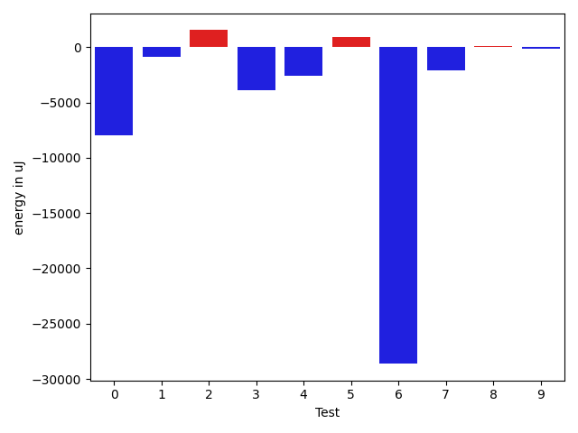

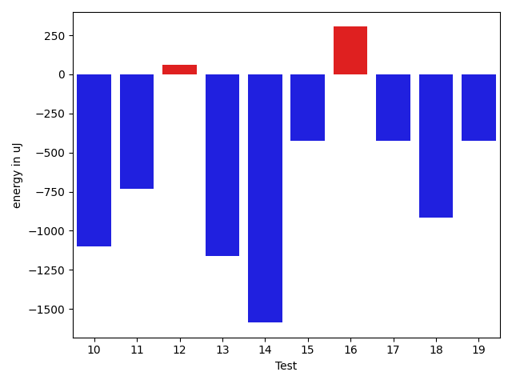

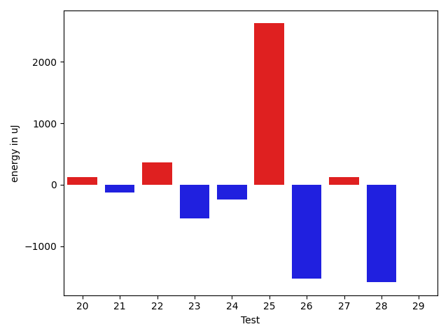

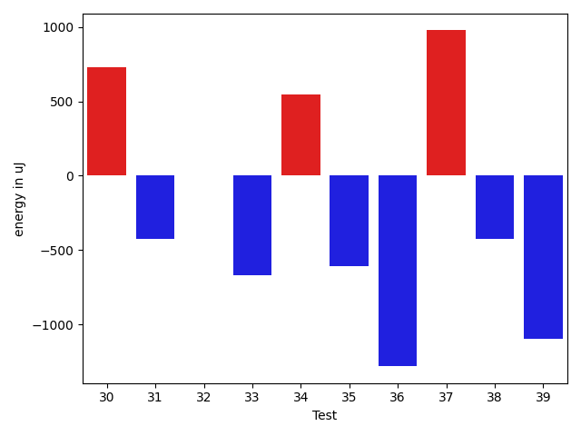

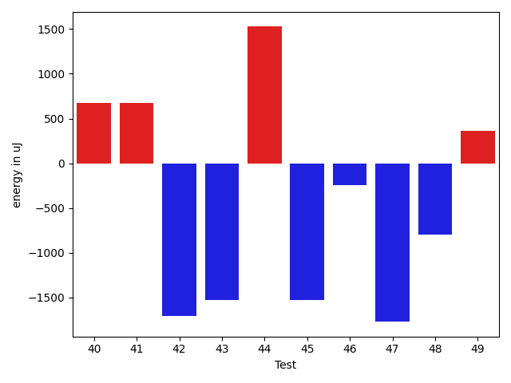

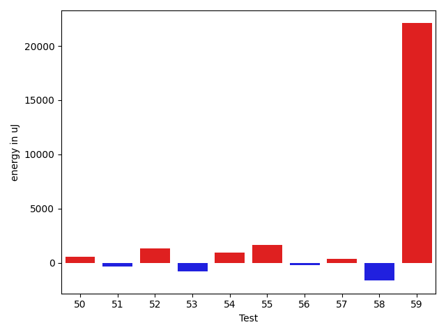

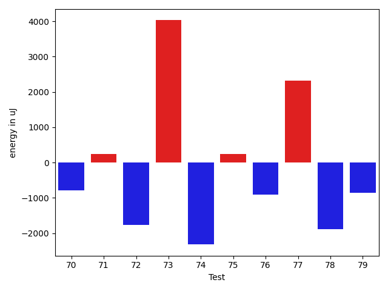

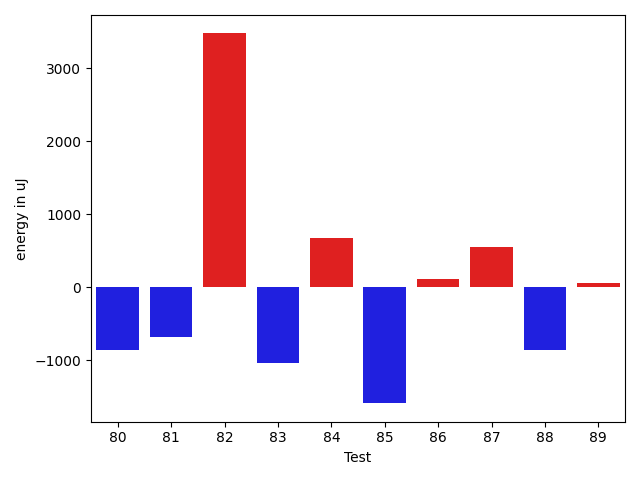

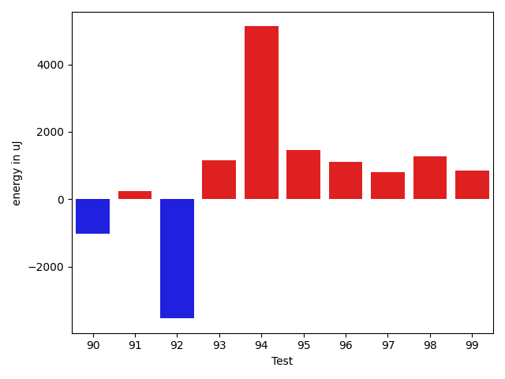

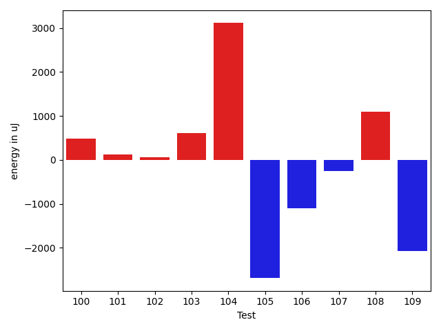

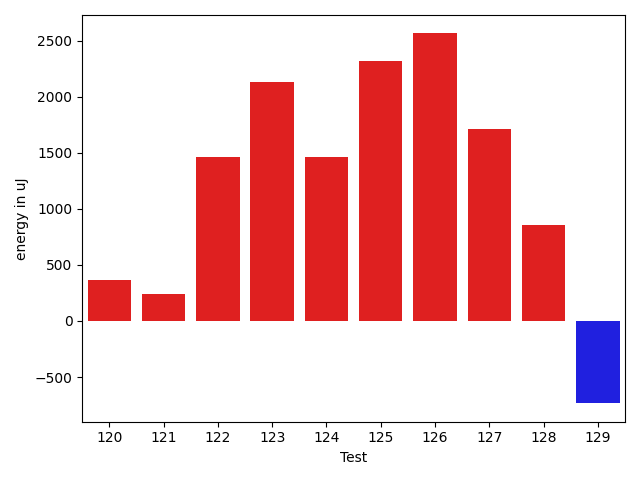

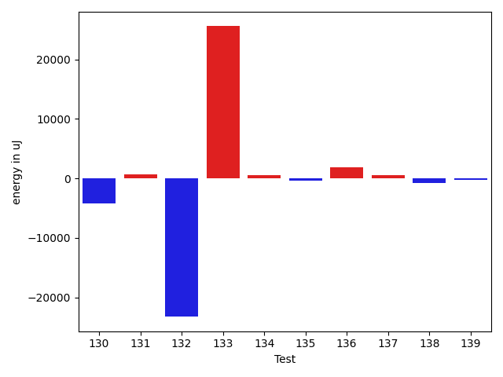

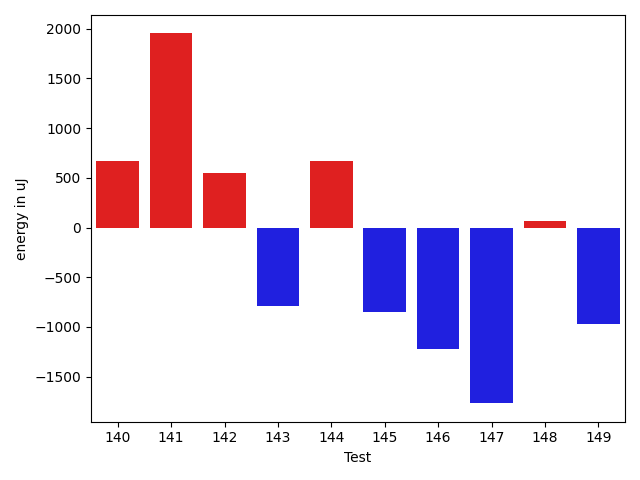

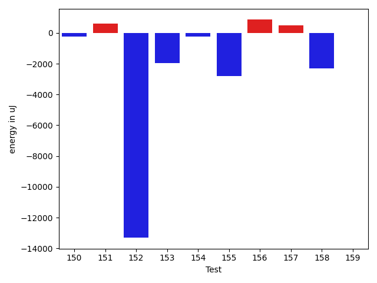

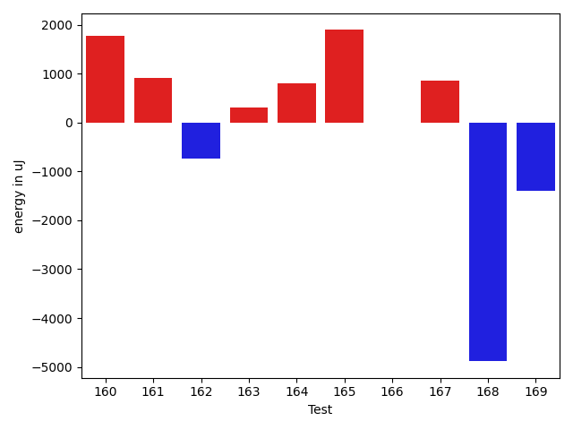

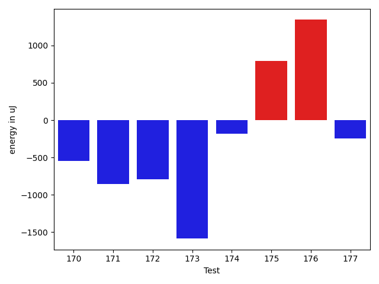

| ID | EnergyV1 | EnergyV2 | DeltaEnergy | σV1 | σV2 |
| --- | --- | --- | --- | --- | --- |
| 0 | 86487 | 78552 | -7935 | 69974.2558859431 | 63277.706153755375 |
| 1 | 36866 | 36011 | -855 | 3553.2648915847985 | 21392.790003607963 |
| 2 | 35889 | 37415 | 1526 | 4143.6951845424155 | 2597.2802467720167 |
| 3 | 37841 | 33936 | -3905 | 4726.897884698403 | 3316.704138167294 |
| 4 | 38391 | 35827 | -2564 | 10914.79677322488 | 9934.356385308352 |
| 5 | 35889 | 36804 | 915 | 60263.59497697906 | 63978.01988204622 |
| 6 | 68725 | 40100 | -28625 | 37929.16677944347 | 42399.61144270706 |
| 7 | 68481 | 66345 | -2136 | 26235.37466760524 | 26685.268202377898 |
| 8 | 33020 | 33081 | 61 | 33724.524304232764 | 36219.94127785962 |
| 9 | 33264 | 33081 | -183 | 3750.669147360927 | 5944.22490508411 |
| 10 | 34546 | 33447 | -1099 | 3278.042192282789 | 2904.538689261576 |
| 11 | 35462 | 34729 | -733 | 3389.135291215248 | 2808.432605453618 |
| 12 | 34790 | 34851 | 61 | 10631.82407413151 | 9742.088339453654 |
| 13 | 36193 | 35034 | -1159 | 12275.603964534386 | 11262.708554042947 |
| 14 | 74646 | 73059 | -1587 | 42057.079312997485 | 44372.20352795812 |
| 15 | 34790 | 34363 | -427 | 3160.2807323355682 | 47143.13516974293 |
| 16 | 34424 | 34728 | 304 | 19426.237514055043 | 20045.030308013924 |
| 17 | 35095 | 34668 | -427 | 40465.06543817483 | 37989.32137610516 |
| 18 | 34302 | 33386 | -916 | 5468.428080465581 | 9405.942593958001 |
| 19 | 35461 | 35034 | -427 | 3552.3364284261056 | 7244.412725763969 |
| 20 | 33874 | 33996 | 122 | 3105.3545822654814 | 1999.148648227123 |
| 21 | 32897 | 32776 | -121 | 22044.887332170194 | 3147.5341860411568 |
| 22 | 34485 | 34851 | 366 | 3516.0503579440906 | 3572.945669461713 |
| 23 | 34057 | 33508 | -549 | 11978.59940198082 | 12814.129419046714 |
| 24 | 33264 | 33020 | -244 | 4078.3415102679915 | 3687.740260751729 |
| 25 | 31372 | 33997 | 2625 | 3897.2947237911544 | 34927.79158370782 |
| 26 | 33813 | 32288 | -1525 | 19657.224636846382 | 5193.151524540367 |
| 27 | 34729 | 34851 | 122 | 4110.417072046685 | 3019.696960145576 |
| 28 | 37475 | 35888 | -1587 | 115071.80660991896 | 81004.64529982973 |
| 29 | 34058 | 34057 | -1 | 3485.902448406681 | 3132.218473321065 |
| 30 | 34729 | 35461 | 732 | 3841.3467487816033 | 3786.158766135006 |
| 31 | 34851 | 34424 | -427 | 13432.058932740812 | 56601.24008931503 |
| 32 | 33569 | 33569 | 0 | 55237.76440049038 | 3334.0857746028787 |
| 33 | 33020 | 32349 | -671 | 3715.945651746631 | 2976.4292253190456 |
| 34 | 35218 | 35767 | 549 | 4353.431313124956 | 2493.417159631425 |
| 35 | 34485 | 33874 | -611 | 8870.921156264503 | 10002.523848967865 |
| 36 | 33264 | 31982 | -1282 | 2870.982823587305 | 2407.437162145223 |
| 37 | 33935 | 34912 | 977 | 39974.00567492338 | 20765.703748970318 |
| 38 | 32532 | 32105 | -427 | 2480.3931032117553 | 2578.770594761703 |
| 39 | 35583 | 34485 | -1098 | 3611.818512393643 | 2878.021494362385 |
| 40 | 32288 | 32959 | 671 | 3794.309608896362 | 2590.4604003675827 |
| 41 | 33386 | 34057 | 671 | 3284.387362358582 | 3483.106419203984 |
| 42 | 33508 | 31799 | -1709 | 10682.224960127242 | 2795.679434660748 |
| 43 | 33996 | 32470 | -1526 | 4009.372192404826 | 2113.8744057114054 |
| 44 | 33386 | 34912 | 1526 | 2258.276718063957 | 2604.6007678266765 |
| 45 | 37292 | 35766 | -1526 | 11282.461439674458 | 12150.133008636065 |
| 46 | 33448 | 33203 | -245 | 3992.4147797094715 | 3218.1702865223824 |
| 47 | 34119 | 32349 | -1770 | 3766.1348186465952 | 2806.4023442422854 |
| 48 | 34729 | 33935 | -794 | 28745.037946531316 | 28701.488512322892 |
| 49 | 34485 | 34851 | 366 | 13163.824771641888 | 11091.09015580008 |
| 50 | 34302 | 34851 | 549 | 25370.21786819684 | 27100.685840985254 |
| 51 | 35645 | 35278 | -367 | 22289.914701744503 | 15402.612578362492 |
| 52 | 69214 | 70557 | 1343 | 73159.69149219344 | 56075.643795789125 |
| 53 | 35706 | 34912 | -794 | 22452.327210718508 | 10611.618981681817 |
| 54 | 78247 | 79163 | 916 | 27435.200664687738 | 28634.962373412018 |
| 55 | 34302 | 35950 | 1648 | 12863.925544579815 | 16119.136598495306 |
| 56 | 36377 | 36133 | -244 | 62675.06099551936 | 72967.14757889966 |
| 57 | 66406 | 66772 | 366 | 24585.69848789619 | 25190.389105558897 |
| 58 | 37414 | 35767 | -1647 | 43988.73480288609 | 63129.46952330055 |
| 59 | 38086 | 60180 | 22094 | 44009.13821439344 | 41360.28754913251 |
| 60 | 34973 | 34607 | -366 | 9412.524201085014 | 12161.59029825762 |
| 61 | 33935 | 33142 | -793 | 3660.469180771981 | 3857.315201993198 |
| 62 | 36926 | 35095 | -1831 | 3826.3871586001333 | 3375.7617150306487 |
| 63 | 33508 | 32776 | -732 | 26840.96089842197 | 3857.1546122008317 |
| 64 | 35766 | 34912 | -854 | 29861.31710217064 | 30660.71023639211 |
| 65 | 37720 | 35644 | -2076 | 3841.949488021948 | 4811.084693589263 |
| 66 | 35584 | 33142 | -2442 | 4150.742484190995 | 3229.6595939774397 |
| 67 | 35767 | 35095 | -672 | 3686.568229149129 | 31694.1359698044 |
| 68 | 35950 | 34546 | -1404 | 3318.981997229555 | 4192.490516909371 |
| 69 | 36499 | 33996 | -2503 | 3482.8040945556672 | 4049.831496102338 |
| 70 | 37049 | 36254 | -795 | 3790.664120206672 | 4231.592871436456 |
| 71 | 33509 | 33753 | 244 | 3568.627905431417 | 3289.124808937101 |
| 72 | 36560 | 34790 | -1770 | 3235.064779654081 | 4387.735681038539 |
| 73 | 63843 | 67870 | 4027 | 33427.25579512178 | 22570.84278575736 |
| 74 | 36438 | 34118 | -2320 | 4440.689865635588 | 3775.3485497202773 |
| 75 | 34180 | 34423 | 243 | 3158.349829598027 | 4119.423574856819 |
| 76 | 36072 | 35156 | -916 | 3504.5337088786387 | 10187.86591554107 |
| 77 | 37659 | 39978 | 2319 | 76965.9490336311 | 94959.73208533807 |
| 78 | 36926 | 35034 | -1892 | 3039.723428462193 | 3614.6743802173937 |
| 79 | 36193 | 35340 | -853 | 3848.5451935949586 | 3599.426827201103 |
| 80 | 35217 | 34363 | -854 | 2699.8913829248463 | 3089.4885758002083 |
| 81 | 34913 | 34241 | -672 | 3688.1184010066368 | 4141.597707526366 |
| 82 | 78552 | 82031 | 3479 | 138739.22045400974 | 353588.15013773105 |
| 83 | 73608 | 72570 | -1038 | 47903.01432113336 | 52326.187781308145 |
| 84 | 35034 | 35705 | 671 | 23681.588183086238 | 62788.60856799827 |
| 85 | 36621 | 35035 | -1586 | 3106.4941205680443 | 3670.67787506613 |
| 86 | 36499 | 36621 | 122 | 21268.014577562364 | 16821.80787483644 |
| 87 | 66223 | 66772 | 549 | 22528.17443509853 | 21875.539621925527 |
| 88 | 35522 | 34668 | -854 | 5794.3492959841915 | 3654.212748880617 |
| 89 | 36072 | 36133 | 61 | 15718.203456855726 | 3863.798232488941 |
| 90 | 37048 | 36011 | -1037 | 8050.348839637514 | 5596.4265202094275 |
| 91 | 34423 | 34668 | 245 | 25643.84689777347 | 3393.905411174566 |
| 92 | 39184 | 35644 | -3540 | 5035.022301478802 | 5199.850844548866 |
| 93 | 34119 | 35278 | 1159 | 34458.38857506705 | 3023.928528446457 |
| 94 | 33508 | 38635 | 5127 | 4375.767727184389 | 4133.97295769222 |
| 95 | 34424 | 35889 | 1465 | 4428.929306026902 | 2976.7323775408504 |
| 96 | 35644 | 36743 | 1099 | 4058.5335459017556 | 4139.811430520974 |
| 97 | 38452 | 39246 | 794 | 88469.15444979805 | 110079.4486554564 |
| 98 | 36377 | 37659 | 1282 | 3996.114722104737 | 10344.797128118471 |
| 99 | 36010 | 36865 | 855 | 13751.148364847237 | 10474.67769954187 |
| 100 | 34973 | 35461 | 488 | 4329.109850477691 | 3996.172877721765 |
| 101 | 34606 | 34729 | 123 | 3743.655641548779 | 2580.140808780047 |
| 102 | 34729 | 34790 | 61 | 4440.007098759757 | 3527.720277938006 |
| 103 | 34362 | 34974 | 612 | 4540.688765718279 | 31830.764658484113 |
| 104 | 34729 | 37842 | 3113 | 54654.23119549494 | 45531.24543279173 |
| 105 | 37231 | 34545 | -2686 | 2750.9863612893464 | 4037.973567588621 |
| 106 | 35767 | 34668 | -1099 | 2879.5157873715884 | 6400.5988931356205 |
| 107 | 37231 | 36987 | -244 | 67080.35237024858 | 57631.887654756865 |
| 108 | 34851 | 35950 | 1099 | 24039.301204352272 | 4694.018564106548 |
| 109 | 40650 | 38575 | -2075 | 37807.84593008789 | 36573.271176173876 |
| 110 | 36438 | 36255 | -183 | 3565.8129120794215 | 16627.57448363925 |
| 111 | 33203 | 35157 | 1954 | 4160.012481062116 | 3134.7161213023937 |
| 112 | 34302 | 33814 | -488 | 21294.90386271593 | 4214.529394379322 |
| 113 | 36865 | 38391 | 1526 | 51048.66885313462 | 40710.531860809824 |
| 114 | 33997 | 35095 | 1098 | 3495.196567292538 | 4058.1591043587896 |
| 115 | 34423 | 35339 | 916 | 3590.611230995745 | 4123.790674583009 |
| 116 | 34118 | 34180 | 62 | 2837.405272119679 | 4338.7249509635185 |
| 117 | 34851 | 33630 | -1221 | 3084.6706909477534 | 3512.3900922355706 |
| 118 | 34546 | 35217 | 671 | 12007.321477891452 | 4261.967712544975 |
| 119 | 37232 | 38574 | 1342 | 90856.48128850556 | 72163.31026239973 |
| 120 | 34607 | 34973 | 366 | 3598.3354505395637 | 3537.113929171669 |
| 121 | 34363 | 34607 | 244 | 3938.5085592278597 | 3343.8990977489025 |
| 122 | 34484 | 35949 | 1465 | 3117.170395354296 | 4565.403531100587 |
| 123 | 34058 | 36193 | 2135 | 3787.658641641298 | 4250.175566697815 |
| 124 | 34423 | 35888 | 1465 | 17093.57309382372 | 32293.021990354384 |
| 125 | 35522 | 37842 | 2320 | 26181.168655162932 | 26599.869494411494 |
| 126 | 36376 | 38940 | 2564 | 10630.22251203019 | 32308.648595119226 |
| 127 | 34790 | 36499 | 1709 | 3448.1470250942994 | 3756.606285271905 |
| 128 | 37841 | 38696 | 855 | 72400.64978328314 | 79835.57540845539 |
| 129 | 38514 | 37780 | -734 | 34909.15507019389 | 12161.000673258759 |
| 130 | 68664 | 64514 | -4150 | 30963.5431845912 | 48575.866781326535 |
| 131 | 292296 | 292968 | 672 | 93713.97065797843 | 81647.39861849882 |
| 132 | 369506 | 346251 | -23255 | 116248.45128896361 | 96473.00002121189 |
| 133 | 41809 | 67383 | 25574 | 28832.73539524185 | 47478.246301741034 |
| 134 | 36926 | 37414 | 488 | 58586.333784160706 | 49706.06735572863 |
| 135 | 35705 | 35339 | -366 | 7156.776572281836 | 8274.382398359756 |
| 136 | 34790 | 36621 | 1831 | 5098.406876022096 | 4687.2271127394715 |
| 137 | 36865 | 37414 | 549 | 26273.799547340706 | 28120.16442680571 |
| 138 | 36987 | 36194 | -793 | 3106.649356918657 | 3592.111567739572 |
| 139 | 37841 | 37598 | -243 | 62392.39281012552 | 71039.3585960443 |
| 140 | 36621 | 37293 | 672 | 3543.1108654563627 | 2892.9673661149195 |
| 141 | 35034 | 36987 | 1953 | 8514.197740695101 | 25024.71967222549 |
| 142 | 35522 | 36071 | 549 | 4390.008289355756 | 2387.238627926975 |
| 143 | 36377 | 35583 | -794 | 3160.190220475951 | 2328.5177717235733 |
| 144 | 36133 | 36804 | 671 | 4636.080451266705 | 3230.4740902297035 |
| 145 | 35706 | 34851 | -855 | 7747.937575534214 | 24556.29711812386 |
| 146 | 37048 | 35827 | -1221 | 38512.6354682455 | 38459.072662945866 |
| 147 | 35278 | 33509 | -1769 | 4812.621016544819 | 3733.488832005603 |
| 148 | 35401 | 35462 | 61 | 9721.228594302433 | 10381.266924438698 |
| 149 | 38879 | 37903 | -976 | 65462.65280706859 | 55840.92295082073 |
| 150 | 34546 | 34302 | -244 | 4083.937006620994 | 3220.5734521616137 |
| 151 | 36255 | 36865 | 610 | 47431.839440614036 | 48025.219547320106 |
| 152 | 137329 | 124023 | -13306 | 350978.3807235967 | 385051.0969595795 |
| 153 | 38696 | 36743 | -1953 | 43334.84043556624 | 46206.025820009956 |
| 154 | 35034 | 34790 | -244 | 3705.7075596919963 | 2884.6338866002084 |
| 155 | 38147 | 35340 | -2807 | 77465.51695321154 | 35115.75317046623 |
| 156 | 35034 | 35889 | 855 | 4393.676809916725 | 4308.208173351255 |
| 157 | 36804 | 37293 | 489 | 10741.786066326998 | 3800.2993534220213 |
| 158 | 37537 | 35218 | -2319 | 4997.743846977353 | 4186.125182970523 |
| 159 | 36377 | 36377 | 0 | 3773.3440557281356 | 250493.00370428682 |
| 160 | 75134 | 76904 | 1770 | 92629.72333201946 | 81712.80177468267 |
| 161 | 36132 | 37048 | 916 | 28044.3284176422 | 34733.88001745546 |
| 162 | 36193 | 35462 | -731 | 319467.4541212225 | 245035.94796870495 |
| 163 | 35889 | 36194 | 305 | 3602.976175134538 | 3545.067799194294 |
| 164 | 37170 | 37963 | 793 | 250344.98562699213 | 410063.8356911958 |
| 165 | 34973 | 36865 | 1892 | 221306.83534477884 | 213296.13926057774 |
| 166 | 35522 | 35522 | 0 | 5817.375226204765 | 3780.3645700268175 |
| 167 | 34180 | 35034 | 854 | 23135.982151671215 | 3908.543810568816 |
| 168 | 64636 | 59753 | -4883 | 33002.07147005917 | 28703.781031152936 |
| 169 | 36193 | 34790 | -1403 | 4296.625176213903 | 32147.385585605472 |
| 170 | 34729 | 34180 | -549 | 28618.769078693877 | 28547.366423416413 |
| 171 | 39184 | 38330 | -854 | 20310.07432722736 | 22994.306319558455 |
| 172 | 39246 | 38452 | -794 | 54069.92853351666 | 64866.05668293311 |
| 173 | 40283 | 38697 | -1586 | 61516.91432191564 | 37019.650605590534 |
| 174 | 39123 | 38941 | -182 | 133220.9463042451 | 88756.10481227475 |
| 175 | 38330 | 39124 | 794 | 43146.13218602783 | 42644.017526349686 |
| 176 | 37292 | 38635 | 1343 | 109893.71324625381 | 120853.91412448906 |
| 177 | 38269 | 38024 | -245 | 425325.92858137755 | 569754.6324947863 |

## Delta Duration per test method

| ID | DurationV1 | DurationsV2 | DeltaDuration |
| --- | --- | --- | --- |
| 0 | 3512945.3571428573 | 3289158.787878788 | -223786.5692640692 |
| 1 | 749570.9361702128 | 986421.7608695652 | 236850.82469935238 |
| 2 | 513263.48 | 542894.3333333334 | 29630.85333333339 |
| 3 | 522077.4482758621 | 457846.0 | -64231.44827586209 |
| 4 | 962356.4912280702 | 952822.283018868 | -9534.208209202276 |
| 5 | 1534662.3 | 1277421.1 | -257241.19999999995 |
| 6 | 2276508.5185185187 | 2116901.4827586208 | -159607.0357598979 |
| 7 | 1983278.1649484537 | 1947986.6701030927 | -35291.49484536098 |
| 8 | 1048289.8913043478 | 1001533.98 | -46755.9113043478 |
| 9 | 876206.7021276596 | 767776.0625 | -108430.63962765958 |
| 10 | 698994.1395348837 | 722471.8181818182 | 23477.678646934568 |
| 11 | 646828.8684210526 | 663091.025 | 16262.15657894744 |
| 12 | 1212237.261904762 | 1230061.0476190476 | 17823.78571428568 |
| 13 | 1216639.5106382978 | 1246240.6206896552 | 29601.11005135742 |
| 14 | 3114310.767676768 | 3134374.9292929294 | 20064.161616161466 |
| 15 | 956987.5614035088 | 1167001.3857142858 | 210013.824310777 |
| 16 | 1091897.6363636365 | 1048898.5915492957 | -42999.04481434077 |
| 17 | 1214104.78125 | 1222776.602739726 | 8671.82148972596 |
| 18 | 900013.4857142858 | 976513.5 | 76500.01428571425 |
| 19 | 707179.0227272727 | 723360.78125 | 16181.758522727294 |
| 20 | 484686.4583333333 | 487442.75 | 2756.291666666686 |
| 21 | 904925.6440677966 | 776389.4426229508 | -128536.20144484588 |
| 22 | 673326.3611111111 | 623129.0263157894 | -50197.33479532169 |
| 23 | 1314164.7954545454 | 1351711.7272727273 | 37546.93181818188 |
| 24 | 615664.55 | 593271.1153846154 | -22393.43461538467 |
| 25 | 438844.1034482759 | 686626.4583333334 | 247782.3548850575 |
| 26 | 971348.0869565217 | 905934.015625 | -65414.07133152173 |
| 27 | 663357.6666666666 | 715603.9512195121 | 52246.28455284552 |
| 28 | 2828643.8235294116 | 2005282.7391304348 | -823361.0843989768 |
| 29 | 776371.8461538461 | 800801.5094339623 | 24429.66328011616 |
| 30 | 732689.125 | 756258.3095238095 | 23569.18452380947 |
| 31 | 1076723.4133333333 | 1275906.523076923 | 199183.10974358977 |
| 32 | 935453.7142857143 | 593963.3658536585 | -341490.3484320558 |
| 33 | 474835.64285714284 | 396247.3333333333 | -78588.30952380953 |
| 34 | 722283.7647058824 | 800299.8888888889 | 78016.12418300647 |
| 35 | 915677.3818181818 | 913687.4464285715 | -1989.9353896103567 |
| 36 | 604068.3 | 578827.358974359 | -25240.94102564105 |
| 37 | 959769.2424242424 | 776377.25 | -183391.99242424243 |
| 38 | 758777.6097560975 | 609282.5641025641 | -149495.04565353342 |
| 39 | 627883.5128205129 | 619672.3488372093 | -8211.163983303588 |
| 40 | 472853.60714285716 | 482148.84210526315 | 9295.234962405986 |
| 41 | 430586.5294117647 | 399622.95 | -30963.579411764687 |
| 42 | 671470.0 | 577183.552631579 | -94286.44736842101 |
| 43 | 526352.8148148148 | 522898.5483870968 | -3454.2664277180447 |
| 44 | 444838.82608695654 | 460395.96153846156 | 15557.135451505019 |
| 45 | 996913.2121212122 | 881600.3076923077 | -115312.90442890441 |
| 46 | 493720.8095238095 | 517270.2083333333 | 23549.398809523787 |
| 47 | 519545.8888888889 | 523269.36363636365 | 3723.474747474771 |
| 48 | 1008350.7547169811 | 1059654.4393939395 | 51303.684676958364 |
| 49 | 1325626.9468085107 | 1341062.5567010308 | 15435.609892520122 |
| 50 | 1182040.5925925926 | 1238893.5324675324 | 56852.93987493985 |
| 51 | 1480568.3936170214 | 1374041.5217391304 | -106526.87187789101 |
| 52 | 2498397.6091954024 | 2583422.2333333334 | 85024.62413793104 |
| 53 | 1362276.907216495 | 1353526.131868132 | -8750.775348362979 |
| 54 | 2800531.2525252528 | 2773955.383838384 | -26575.86868686881 |
| 55 | 1403493.387755102 | 1428123.5555555555 | 24630.16780045349 |
| 56 | 1826216.8876404495 | 1849378.391304348 | 23161.503663898446 |
| 57 | 2050149.9090909092 | 2066619.9191919193 | 16470.01010101009 |
| 58 | 1694303.7078651686 | 1659714.6555555556 | -34589.05230961298 |
| 59 | 2066128.9042553192 | 2158643.9789473685 | 92515.0746920493 |
| 60 | 1318371.694736842 | 1316061.112244898 | -2310.5824919440784 |
| 61 | 1000535.2602739726 | 1033839.9565217391 | 33304.69624776649 |
| 62 | 727189.25 | 808336.7 | 81147.44999999995 |
| 63 | 737835.0370370371 | 490576.0588235294 | -247258.97821350768 |
| 64 | 700955.3888888889 | 1038371.8 | 337416.41111111117 |
| 65 | 539880.3529411765 | 608878.7333333333 | 68998.38039215677 |
| 66 | 546302.4761904762 | 511756.90476190473 | -34545.57142857148 |
| 67 | 593477.3421052631 | 799732.0 | 206254.65789473685 |
| 68 | 714174.9545454546 | 514750.2083333333 | -199424.74621212127 |
| 69 | 722610.4318181818 | 659297.5405405406 | -63312.891277641174 |
| 70 | 494803.7083333333 | 498674.10714285716 | 3870.3988095238456 |
| 71 | 711355.4736842106 | 705355.2702702703 | -6000.203413940268 |
| 72 | 548829.5454545454 | 525425.7586206896 | -23403.78683385579 |
| 73 | 1943528.448979592 | 2172085.5 | 228557.05102040805 |
| 74 | 598473.7586206896 | 561973.375 | -36500.38362068962 |
| 75 | 608233.7368421053 | 576510.4615384615 | -31723.27530364378 |
| 76 | 795526.0666666667 | 971764.3913043478 | 176238.32463768113 |
| 77 | 1677166.05 | 2430190.0857142857 | 753024.0357142857 |
| 78 | 469572.04761904763 | 441188.5 | -28383.547619047633 |
| 79 | 448408.0 | 452959.5625 | 4551.5625 |
| 80 | 707318.75 | 577348.4 | -129970.34999999998 |
| 81 | 437317.4375 | 415745.1111111111 | -21572.326388888876 |
| 82 | 3382643.787878788 | 5182957.515151516 | 1800313.7272727275 |
| 83 | 2637716.393939394 | 2758550.4545454546 | 120834.06060606055 |
| 84 | 916319.1951219512 | 1652080.0857142857 | 735760.8905923346 |
| 85 | 637442.9354838709 | 636716.9375 | -725.9979838709114 |
| 86 | 1114783.2 | 1196126.3442622952 | 81343.14426229522 |
| 87 | 1987401.888888889 | 1961899.7171717172 | -25502.17171717179 |
| 88 | 1028919.3116883116 | 959168.7428571428 | -69750.56883116881 |
| 89 | 1054021.4666666666 | 892177.186440678 | -161844.2802259886 |
| 90 | 1100003.1818181819 | 1017051.8055555555 | -82951.37626262638 |
| 91 | 669577.2608695652 | 484973.05 | -184604.2108695652 |
| 92 | 418884.9166666667 | 448115.44444444444 | 29230.527777777752 |
| 93 | 738832.2352941176 | 434964.4736842105 | -303867.7616099071 |
| 94 | 485825.652173913 | 499262.4166666667 | 13436.76449275366 |
| 95 | 566316.0 | 590452.1 | 24136.099999999977 |
| 96 | 480581.8333333333 | 499538.1904761905 | 18956.35714285716 |
| 97 | 1809954.4666666666 | 2587396.6756756757 | 777442.2090090092 |
| 98 | 671104.2666666667 | 1153195.8695652173 | 482091.60289855057 |
| 99 | 837770.5357142857 | 941507.0263157894 | 103736.49060150376 |
| 100 | 490034.1724137931 | 563010.7307692308 | 72976.55835543765 |
| 101 | 603395.5625 | 703369.7741935484 | 99974.21169354836 |
| 102 | 607826.8888888889 | 612272.3125 | 4445.423611111124 |
| 103 | 534587.9523809524 | 701119.4090909091 | 166531.45670995663 |
| 104 | 1376539.657142857 | 953924.0689655172 | -422615.5881773399 |
| 105 | 357079.5 | 455821.92307692306 | 98742.42307692306 |
| 106 | 1026480.95 | 966503.2131147541 | -59977.73688524589 |
| 107 | 2128968.077922078 | 1894660.3382352942 | -234307.73968678364 |
| 108 | 1020182.4366197183 | 952658.7741935484 | -67523.66242616996 |
| 109 | 1929073.7777777778 | 1643300.0735294118 | -285773.70424836595 |
| 110 | 852738.7843137255 | 886438.5660377359 | 33699.78172401036 |
| 111 | 807728.6851851852 | 820788.2826086957 | 13059.59742351051 |
| 112 | 1118594.1454545455 | 898158.6271186441 | -220435.51833590143 |
| 113 | 1797626.7301587302 | 1465764.8620689656 | -331861.8680897646 |
| 114 | 889625.5614035088 | 860097.551724138 | -29528.009679370793 |
| 115 | 965197.1666666666 | 961732.1666666666 | -3465.0 |
| 116 | 793258.8035714285 | 763963.6904761905 | -29295.11309523799 |
| 117 | 641200.9354838709 | 572387.2352941176 | -68813.70018975332 |
| 118 | 859137.9215686275 | 791135.5098039216 | -68002.4117647059 |
| 119 | 2830094.9696969697 | 1696014.0 | -1134080.9696969697 |
| 120 | 827482.9411764706 | 806838.3829787234 | -20644.558197747217 |
| 121 | 852458.5111111111 | 765076.6111111111 | -87381.90000000002 |
| 122 | 609301.1612903225 | 600736.3571428572 | -8564.804147465387 |
| 123 | 781875.66 | 750500.4 | -31375.26000000001 |
| 124 | 824045.3260869565 | 945939.1568627451 | 121893.83077578852 |
| 125 | 1468512.4367816092 | 1468116.5294117648 | -395.90736984438263 |
| 126 | 856504.875 | 1159964.1923076923 | 303459.31730769225 |
| 127 | 572959.5 | 539972.8461538461 | -32986.65384615387 |
| 128 | 1706772.6206896552 | 1852548.2580645161 | 145775.63737486093 |
| 129 | 1060392.625 | 929862.9375 | -130529.6875 |
| 130 | 1946141.9387755103 | 2106651.4895833335 | 160509.5508078232 |
| 131 | 8812617.414141415 | 8461485.595959596 | -351131.81818181835 |
| 132 | 10633792.616161617 | 10017905.838383839 | -615886.777777778 |
| 133 | 1909391.3775510204 | 2082150.393939394 | 172759.01638837368 |
| 134 | 1785358.8 | 1755862.5283018867 | -29496.271698113298 |
| 135 | 1022520.7076923077 | 1004426.5142857142 | -18094.193406593404 |
| 136 | 448611.28571428574 | 452571.64 | 3960.3542857142747 |
| 137 | 1373377.0235294118 | 1550309.380952381 | 176932.3574229693 |
| 138 | 678792.0434782609 | 684220.7419354839 | 5428.698457223014 |
| 139 | 1506165.121212121 | 2067687.7272727273 | 561522.6060606062 |
| 140 | 514325.26086956525 | 563332.8571428572 | 49007.596273291914 |
| 141 | 764417.6896551724 | 1003039.7142857143 | 238622.0246305419 |
| 142 | 372150.28571428574 | 465895.8 | 93745.51428571425 |
| 143 | 541239.1428571428 | 488286.6956521739 | -52952.44720496895 |
| 144 | 453985.72222222225 | 471003.5789473684 | 17017.85672514618 |
| 145 | 1104276.9875 | 1219560.2409638555 | 115283.25346385548 |
| 146 | 1226137.734375 | 1274849.984375 | 48712.25 |
| 147 | 503685.26666666666 | 704054.2592592592 | 200368.99259259255 |
| 148 | 1225114.1648351648 | 1258092.595505618 | 32978.430670453236 |
| 149 | 1951718.1627906978 | 1925106.0786516855 | -26612.084139012266 |
| 150 | 694395.3529411765 | 596201.2592592592 | -98194.0936819173 |
| 151 | 1511295.948051948 | 1547496.0675675676 | 36200.11951561947 |
| 152 | 6852858.444444444 | 6901199.161616161 | 48340.717171717435 |
| 153 | 1504855.9069767443 | 1417209.0625 | -87646.8444767443 |
| 154 | 786263.6086956522 | 724234.2708333334 | -62029.33786231885 |
| 155 | 1687744.7096774194 | 772683.2121212122 | -915061.4975562072 |
| 156 | 472905.9 | 439760.0833333333 | -33145.81666666671 |
| 157 | 812323.052631579 | 710052.2727272727 | -102270.77990430628 |
| 158 | 508498.9666666667 | 512073.25 | 3574.2833333333256 |
| 159 | 796789.0930232558 | 2027776.7352941176 | 1230987.6422708617 |
| 160 | 3531480.1818181816 | 3245298.3535353537 | -286181.828282828 |
| 161 | 1303572.396825397 | 1281733.9452054794 | -21838.451619917527 |
| 162 | 3107277.756756757 | 2048871.53125 | -1058406.225506757 |
| 163 | 868843.2592592592 | 850505.8823529412 | -18337.376906318008 |
| 164 | 2232669.433333333 | 4116250.0416666665 | 1883580.6083333334 |
| 165 | 2074081.3103448276 | 1813474.75 | -260606.5603448276 |
| 166 | 935542.8125 | 946757.509090909 | 11214.696590909036 |
| 167 | 969012.9714285714 | 707748.9444444445 | -261264.0269841269 |
| 168 | 2056325.4415584416 | 1958865.0125 | -97460.42905844166 |
| 169 | 592668.1034482758 | 774809.7096774194 | 182141.60622914357 |
| 170 | 717166.7419354839 | 804815.7647058824 | 87649.02277039853 |
| 171 | 1009124.275 | 1180715.3333333333 | 171591.05833333323 |
| 172 | 1411482.111111111 | 1607113.4210526317 | 195631.30994152068 |
| 173 | 2108053.0714285714 | 1200102.6666666667 | -907950.4047619046 |
| 174 | 3200866.923076923 | 1876510.725 | -1324356.198076923 |
| 175 | 1424383.044117647 | 1544325.189189189 | 119942.14507154212 |
| 176 | 1961430.9473684211 | 2461915.2 | 500484.25263157906 |
| 177 | 3963886.695652174 | 6685948.090909091 | 2722061.395256917 |

## Misc.

| ID | Test Class | Test Method |
| --- | --- | --- |
| 0 | com.google.gson.functional.ExposeFieldsTest | testNullExposeFieldSerialization |
| 1 | com.google.gson.functional.ExposeFieldsTest | testNoExposedFieldDeserialization |
| 2 | com.google.gson.functional.ExposeFieldsTest | testNoExposedFieldSerialization |
| 3 | com.google.gson.functional.ExposeFieldsTest | testExposeAnnotationSerialization |
| 4 | com.google.gson.functional.ExposeFieldsTest | testArrayWithOneNullExposeFieldObjectSerialization |
| 5 | com.google.gson.functional.ExposeFieldsTest | testExposeAnnotationDeserialization |
| 6 | com.google.gson.functional.ObjectTest | testDirectedAcyclicGraphSerialization |
| 7 | com.google.gson.functional.ObjectTest | testArrayOfArraysDeserialization |
| 8 | com.google.gson.functional.ObjectTest | testPrimitiveArrayInAnObjectDeserialization |
| 9 | com.google.gson.functional.ObjectTest | testInnerClassSerialization |
| 10 | com.google.gson.functional.ObjectTest | testClassWithEnumFieldDeserialization |
| 11 | com.google.gson.functional.ObjectTest | testClassWithEnumFieldSerialization |
| 12 | com.google.gson.functional.ObjectTest | testArrayOfObjectsDeserialization |
| 13 | com.google.gson.functional.ObjectTest | testArrayOfArraysSerialization |
| 14 | com.google.gson.functional.ObjectTest | testSubInterfacesOfCollectionSerialization |
| 15 | com.google.gson.functional.ObjectTest | testNestedDeserialization |
| 16 | com.google.gson.functional.ObjectTest | testInheritenceDeserialization |
| 17 | com.google.gson.functional.ObjectTest | testInheritenceSerialization |
| 18 | com.google.gson.functional.ObjectTest | testArrayOfObjectsSerialization |
| 19 | com.google.gson.functional.ObjectTest | testClassWithTransientFieldsSerialization |
| 20 | com.google.gson.functional.ObjectTest | testNullPrimitiveFieldsDeserialization |
| 21 | com.google.gson.functional.ObjectTest | testInnerClassDeserialization |
| 22 | com.google.gson.functional.ObjectTest | testClassWithTransientFieldsDeserialization |
| 23 | com.google.gson.functional.ObjectTest | testSubInterfacesOfCollectionDeserialization |
| 24 | com.google.gson.functional.ObjectTest | testPrivateNoArgConstructorDeserialization |
| 25 | com.google.gson.functional.ObjectTest | testPrimitiveArrayFieldSerialization |
| 26 | com.google.gson.functional.ObjectTest | testClassWithObjectFieldSerialization |
| 27 | com.google.gson.functional.ObjectTest | testBagOfPrimitiveWrappersSerialization |
| 28 | com.google.gson.functional.ObjectTest | testJsonInSingleQuotesDeserialization |
| 29 | com.google.gson.functional.ObjectTest | testNullFieldsDeserialization |
| 30 | com.google.gson.functional.ObjectTest | testBagOfPrimitivesDeserialization |
| 31 | com.google.gson.functional.ObjectTest | testDirectedAcyclicGraphDeserialization |
| 32 | com.google.gson.functional.ObjectTest | testClassWithTransientFieldsDeserializationTransientFieldsPassedInJsonAreIgnored |
| 33 | com.google.gson.functional.ObjectTest | testClassWithNoFieldsSerialization |
| 34 | com.google.gson.functional.ObjectTest | testJsonInMixedQuotesDeserialization |
| 35 | com.google.gson.functional.ObjectTest | testNestedSerialization |
| 36 | com.google.gson.functional.ObjectTest | testNullArraysDeserialization |
| 37 | com.google.gson.functional.ObjectTest | testBagOfPrimitiveWrappersDeserialization |
| 38 | com.google.gson.functional.ObjectTest | testCircularSerialization |
| 39 | com.google.gson.functional.ObjectTest | testNullFieldsSerialization |
| 40 | com.google.gson.functional.ObjectTest | testSelfReferenceSerialization |
| 41 | com.google.gson.functional.ObjectTest | testTopLevelEnumSerialization |
| 42 | com.google.gson.functional.ObjectTest | testEmptyCollectionInAnObjectDeserialization |
| 43 | com.google.gson.functional.ObjectTest | testNullObjectFieldsDeserialization |
| 44 | com.google.gson.functional.ObjectTest | testClassWithNoFieldsDeserialization |
| 45 | com.google.gson.functional.ObjectTest | testBagOfPrimitivesSerialization |
| 46 | com.google.gson.functional.ObjectTest | testEmptyCollectionInAnObjectSerialization |
| 47 | com.google.gson.functional.ObjectTest | testTopLevelEnumDeserialization |
| 48 | com.google.gson.functional.ParameterizedTypesTest | testParameterizedTypesWithWriterSerialization |
| 49 | com.google.gson.functional.ParameterizedTypesTest | testVariableTypeArrayDeserialization |
| 50 | com.google.gson.functional.ParameterizedTypesTest | testParameterizedTypeWithReaderDeserialization |
| 51 | com.google.gson.functional.ParameterizedTypesTest | testParameterizedTypeWithCustomSerializer |
| 52 | com.google.gson.functional.ParameterizedTypesTest | testParameterizedTypesSerialization |
| 53 | com.google.gson.functional.ParameterizedTypesTest | testVariableTypeDeserialization |
| 54 | com.google.gson.functional.ParameterizedTypesTest | testVariableTypeFieldsAndGenericArraysSerialization |
| 55 | com.google.gson.functional.ParameterizedTypesTest | testParameterizedTypeGenericArraysDeserialization |
| 56 | com.google.gson.functional.ParameterizedTypesTest | testParameterizedTypeDeserialization |
| 57 | com.google.gson.functional.ParameterizedTypesTest | testVariableTypeFieldsAndGenericArraysDeserialization |
| 58 | com.google.gson.functional.ParameterizedTypesTest | testTypesWithMultipleParametersDeserialization |
| 59 | com.google.gson.functional.ParameterizedTypesTest | testTypesWithMultipleParametersSerialization |
| 60 | com.google.gson.functional.ParameterizedTypesTest | testParameterizedTypeWithVariableTypeDeserialization |
| 61 | com.google.gson.functional.ParameterizedTypesTest | testParameterizedTypeGenericArraysSerialization |
| 62 | com.google.gson.functional.PrimitiveTest | testPrimitiveIntegerAutoboxedDeserialization |
| 63 | com.google.gson.functional.PrimitiveTest | testPrimitiveDoubleAutoboxedInASingleElementArraySerialization |
| 64 | com.google.gson.functional.PrimitiveTest | testPrimitiveDoubleAutoboxedInASingleElementArrayDeserialization |
| 65 | com.google.gson.functional.PrimitiveTest | testPrimitiveIntegerAutoboxedSerialization |
| 66 | com.google.gson.functional.PrimitiveTest | testPrimitiveLongAutoboxedInASingleElementArraySerialization |
| 67 | com.google.gson.functional.PrimitiveTest | testBigIntegerInASingleElementArraySerialization |
| 68 | com.google.gson.functional.PrimitiveTest | testPrimitiveBooleanAutoboxedInASingleElementArraySerialization |
| 69 | com.google.gson.functional.PrimitiveTest | testPrimitiveBooleanAutoboxedDeserialization |
| 70 | com.google.gson.functional.PrimitiveTest | testReallyLongValuesDeserialization |
| 71 | com.google.gson.functional.PrimitiveTest | testPrimitiveDoubleAutoboxedDeserialization |
| 72 | com.google.gson.functional.PrimitiveTest | testPrimitiveLongAutoboxedInASingleElementArrayDeserialization |
| 73 | com.google.gson.functional.PrimitiveTest | testPrimitiveDoubleAutoboxedSerialization |
| 74 | com.google.gson.functional.PrimitiveTest | testPrimitiveLongAutoboxedDeserialization |
| 75 | com.google.gson.functional.PrimitiveTest | testPrimitiveBooleanAutoboxedInASingleElementArrayDeserialization |
| 76 | com.google.gson.functional.PrimitiveTest | testPrimitiveIntegerAutoboxedInASingleElementArraySerialization |
| 77 | com.google.gson.functional.PrimitiveTest | testPrimitiveIntegerAutoboxedInASingleElementArrayDeserialization |
| 78 | com.google.gson.functional.PrimitiveTest | testPrimitiveLongAutoboxedSerialization |
| 79 | com.google.gson.functional.PrimitiveTest | testReallyLongValuesSerialization |
| 80 | com.google.gson.functional.PrimitiveTest | testBigDecimalInASingleElementArraySerialization |
| 81 | com.google.gson.functional.PrimitiveTest | testPrimitiveBooleanAutoboxedSerialization |
| 82 | com.google.gson.functional.NamingPolicyTest | testGsonWithNonDefaultFieldNamingPolicySerialization |
| 83 | com.google.gson.functional.NamingPolicyTest | testGsonWithSerializedNameFieldNamingPolicySerialization |
| 84 | com.google.gson.functional.NamingPolicyTest | testGsonWithNonDefaultFieldNamingPolicyDeserialiation |
| 85 | com.google.gson.functional.NamingPolicyTest | testGsonWithSerializedNameFieldNamingPolicyDeserialization |
| 86 | com.google.gson.functional.CustomTypeAdaptersTest | testCustomNestedSerializers |
| 87 | com.google.gson.functional.CustomTypeAdaptersTest | testCustomTypeAdapterDoesNotAppliesToSubClasses |
| 88 | com.google.gson.functional.CustomTypeAdaptersTest | testCustomDeserializerForLong |
| 89 | com.google.gson.functional.CustomTypeAdaptersTest | testCustomNestedDeserializers |
| 90 | com.google.gson.functional.CustomTypeAdaptersTest | testCustomSerializerForLong |
| 91 | com.google.gson.functional.StringTest | testStringValueDeserialization |
| 92 | com.google.gson.functional.StringTest | testEscapedBackslashInStringSerialization |
| 93 | com.google.gson.functional.StringTest | testStringValueSerialization |
| 94 | com.google.gson.functional.StringTest | testEscapedBackslashInStringDeserialization |
| 95 | com.google.gson.functional.StringTest | testStringWithEscapedSlashDeserialization |
| 96 | com.google.gson.functional.StringTest | testEscapedCtrlRInStringDeserialization |
| 97 | com.google.gson.functional.StringTest | testEscapedCtrlNInStringDeserialization |
| 98 | com.google.gson.functional.StringTest | testEscapedCtrlRInStringSerialization |
| 99 | com.google.gson.functional.StringTest | testStringValueAsSingleElementArraySerialization |
| 100 | com.google.gson.functional.StringTest | testSingleQuoteInStringSerialization |
| 101 | com.google.gson.functional.StringTest | testStringValueAsSingleElementArrayDeserialization |
| 102 | com.google.gson.functional.StringTest | testEscapingQuotesInStringSerialization |
| 103 | com.google.gson.functional.StringTest | testEscapingQuotesInStringDeserialization |
| 104 | com.google.gson.functional.StringTest | testSingleQuoteInStringDeserialization |
| 105 | com.google.gson.functional.StringTest | testEscapedCtrlNInStringSerialization |
| 106 | com.google.gson.functional.CollectionTest | testCollectionOfStringsDeserialization |
| 107 | com.google.gson.functional.CollectionTest | testCollectionOfEnumsDeserialization |
| 108 | com.google.gson.functional.CollectionTest | testTopLevelCollectionOfIntegersDeserialization |
| 109 | com.google.gson.functional.CollectionTest | testCollectionOfEnumsSerialization |
| 110 | com.google.gson.functional.CollectionTest | testTopLevelCollectionOfIntegersSerialization |
| 111 | com.google.gson.functional.CollectionTest | testNullsInListDeserialization |
| 112 | com.google.gson.functional.CollectionTest | testQueueDeserialization |
| 113 | com.google.gson.functional.CollectionTest | testCollectionOfBagOfPrimitivesSerialization |
| 114 | com.google.gson.functional.CollectionTest | testLinkedListDeserialization |
| 115 | com.google.gson.functional.CollectionTest | testTopLevelListOfIntegerCollectionsDeserialization |
| 116 | com.google.gson.functional.CollectionTest | testNullsInListSerialization |
| 117 | com.google.gson.functional.CollectionTest | testRawCollectionOfIntegersSerialization |
| 118 | com.google.gson.functional.CollectionTest | testQueueSerialization |
| 119 | com.google.gson.functional.CollectionTest | testCollectionOfStringsSerialization |
| 120 | com.google.gson.functional.CollectionTest | testLinkedListSerialization |
| 121 | com.google.gson.functional.CollectionTest | testRawCollectionSerialization |
| 122 | com.google.gson.functional.NullObjectAndFieldTest | testExplicitSerializationOfNullCollectionMembers |
| 123 | com.google.gson.functional.NullObjectAndFieldTest | testNullWrappedPrimitiveMemberSerialization |
| 124 | com.google.gson.functional.NullObjectAndFieldTest | testNullWrappedPrimitiveMemberDeserialization |
| 125 | com.google.gson.functional.NullObjectAndFieldTest | testExplicitSerializationOfNullArrayMembers |
| 126 | com.google.gson.functional.NullObjectAndFieldTest | testExplicitDeserializationOfNulls |
| 127 | com.google.gson.functional.NullObjectAndFieldTest | testExplicitSerializationOfNullStringMembers |
| 128 | com.google.gson.functional.NullObjectAndFieldTest | testExplicitSerializationOfNulls |
| 129 | com.google.gson.GsonTypeAdapterTest | testTypeAdapterDoesNotAffectNonAdaptedTypes |
| 130 | com.google.gson.functional.ConcurrencyTest | testSingleThreadSerialization |
| 131 | com.google.gson.functional.ConcurrencyTest | testMultiThreadSerialization |
| 132 | com.google.gson.functional.ConcurrencyTest | testMultiThreadDeserialization |
| 133 | com.google.gson.functional.ConcurrencyTest | testSingleThreadDeserialization |
| 134 | com.google.gson.functional.ArrayTest | testTopLevelArrayOfIntsDeserialization |
| 135 | com.google.gson.functional.ArrayTest | testArrayOfCollectionDeserialization |
| 136 | com.google.gson.functional.ArrayTest | testArrayOfStringsDeserialization |
| 137 | com.google.gson.functional.ArrayTest | testArrayOfCollectionSerialization |
| 138 | com.google.gson.functional.ArrayTest | testNullsInArraySerialization |
| 139 | com.google.gson.functional.ArrayTest | testTopLevelArrayOfIntsSerialization |
| 140 | com.google.gson.functional.ArrayTest | testNullsInArrayDeserialization |
| 141 | com.google.gson.functional.ArrayTest | testTopLevelEnumInASingleElementArrayDeserialization |
| 142 | com.google.gson.functional.ArrayTest | testEmptyArraySerialization |
| 143 | com.google.gson.functional.ArrayTest | testEmptyArrayDeserialization |
| 144 | com.google.gson.functional.ArrayTest | testArrayOfStringsSerialization |
| 145 | com.google.gson.functional.MapTest | testParameterizedMapSubclassDeserialization |
| 146 | com.google.gson.functional.MapTest | testMapDeserialization |
| 147 | com.google.gson.functional.MapTest | testMapSubclassSerialization |
| 148 | com.google.gson.functional.MapTest | testParameterizedMapSubclassSerialization |
| 149 | com.google.gson.functional.MapTest | testMapSerialization |
| 150 | com.google.gson.functional.MapTest | testRawMapSerialization |
| 151 | com.google.gson.functional.VersioningTest | testVersionedClassesDeserialization |
| 152 | com.google.gson.functional.VersioningTest | testVersionedClassesSerialization |
| 153 | com.google.gson.functional.VersioningTest | testVersionedGsonWithUnversionedClassesSerialization |
| 154 | com.google.gson.functional.VersioningTest | testVersionedGsonWithUnversionedClassesDeserialization |
| 155 | com.google.gson.functional.InternationalizationTest | testStringsWithRawChineseCharactersDeserialization |
| 156 | com.google.gson.functional.InternationalizationTest | testStringsWithUnicodeChineseCharactersDeserialization |
| 157 | com.google.gson.functional.InternationalizationTest | testStringsWithUnicodeChineseCharactersSerialization |
| 158 | com.google.gson.functional.InternationalizationTest | testStringsWithUnicodeChineseCharactersEscapedDeserialization |
| 159 | com.google.gson.FunctionalWithInternalDependenciesTest | testPrettyPrintListOfPrimitiveArrays |
| 160 | com.google.gson.FunctionalWithInternalDependenciesTest | testPrettyPrintList |
| 161 | com.google.gson.FunctionalWithInternalDependenciesTest | testPrettyPrintArrayOfObjects |
| 162 | com.google.gson.FunctionalWithInternalDependenciesTest | testPrettyPrintArrayOfPrimitiveArrays |
| 163 | com.google.gson.FunctionalWithInternalDependenciesTest | testAnonymousLocalClassesSerialization |
| 164 | com.google.gson.FunctionalWithInternalDependenciesTest | testPrettyPrintArrayOfPrimitives |
| 165 | com.google.gson.FunctionalWithInternalDependenciesTest | testMultipleArrays |
| 166 | com.google.gson.functional.DefaultTypeAdaptersTest | testBigIntegerFieldSerialization |
| 167 | com.google.gson.functional.DefaultTypeAdaptersTest | testBigDecimalFieldDeserialization |
| 168 | com.google.gson.functional.DefaultTypeAdaptersTest | testBigDecimalFieldSerialization |
| 169 | com.google.gson.functional.DefaultTypeAdaptersTest | testSetSerialization |
| 170 | com.google.gson.functional.DefaultTypeAdaptersTest | testBigIntegerFieldDeserialization |
| 171 | com.google.gson.functional.UncategorizedTest | testStaticFieldsAreNotSerialized |
| 172 | com.google.gson.functional.UncategorizedTest | testObjectEqualButNotSameSerialization |
| 173 | com.google.gson.functional.ReadersWritersTest | testReaderForDeserialization |
| 174 | com.google.gson.functional.ReadersWritersTest | testWriterForSerialization |
| 175 | com.google.gson.functional.EscapingTest | testEscapingObjectFields |
| 176 | com.google.gson.functional.EscapingTest | testEscapingQuotesInStringArray |
| 177 | com.google.gson.functional.PrintFormattingTest | testCompactFormattingLeavesNoWhiteSpace |

| Test | IterationV1 | IterationV2 | DeltaIteration |
| --- | --- | --- | --- |
| 0 | 98 | 99 | 1 |
| 1 | 47 | 46 | -1 |
| 2 | 25 | 21 | -4 |
| 3 | 29 | 21 | -8 |
| 4 | 57 | 53 | -4 |
| 5 | 40 | 40 | 0 |
| 6 | 81 | 87 | 6 |
| 7 | 97 | 97 | 0 |
| 8 | 46 | 50 | 4 |
| 9 | 47 | 48 | 1 |
| 10 | 43 | 44 | 1 |
| 11 | 38 | 40 | 2 |
| 12 | 84 | 84 | 0 |
| 13 | 94 | 87 | -7 |
| 14 | 99 | 99 | 0 |
| 15 | 57 | 70 | 13 |
| 16 | 66 | 71 | 5 |
| 17 | 64 | 73 | 9 |
| 18 | 70 | 60 | -10 |
| 19 | 44 | 32 | -12 |
| 20 | 24 | 24 | 0 |
| 21 | 59 | 61 | 2 |
| 22 | 36 | 38 | 2 |
| 23 | 88 | 88 | 0 |
| 24 | 40 | 26 | -14 |
| 25 | 29 | 24 | -5 |
| 26 | 69 | 64 | -5 |
| 27 | 36 | 41 | 5 |
| 28 | 51 | 46 | -5 |
| 29 | 52 | 53 | 1 |
| 30 | 40 | 42 | 2 |
| 31 | 75 | 65 | -10 |
| 32 | 35 | 41 | 6 |
| 33 | 14 | 15 | 1 |
| 34 | 34 | 36 | 2 |
| 35 | 55 | 56 | 1 |
| 36 | 30 | 39 | 9 |
| 37 | 33 | 40 | 7 |
| 38 | 41 | 39 | -2 |
| 39 | 39 | 43 | 4 |
| 40 | 28 | 19 | -9 |
| 41 | 17 | 20 | 3 |
| 42 | 27 | 38 | 11 |
| 43 | 27 | 31 | 4 |
| 44 | 23 | 26 | 3 |
| 45 | 33 | 39 | 6 |
| 46 | 21 | 24 | 3 |
| 47 | 18 | 22 | 4 |
| 48 | 53 | 66 | 13 |
| 49 | 94 | 97 | 3 |
| 50 | 81 | 77 | -4 |
| 51 | 94 | 92 | -2 |
| 52 | 87 | 90 | 3 |
| 53 | 97 | 91 | -6 |
| 54 | 99 | 99 | 0 |
| 55 | 98 | 99 | 1 |
| 56 | 89 | 92 | 3 |
| 57 | 99 | 99 | 0 |
| 58 | 89 | 90 | 1 |
| 59 | 94 | 95 | 1 |
| 60 | 95 | 98 | 3 |
| 61 | 73 | 69 | -4 |
| 62 | 36 | 30 | -6 |
| 63 | 27 | 17 | -10 |
| 64 | 36 | 20 | -16 |
| 65 | 17 | 15 | -2 |
| 66 | 21 | 21 | 0 |
| 67 | 38 | 28 | -10 |
| 68 | 22 | 24 | 2 |
| 69 | 44 | 37 | -7 |
| 70 | 24 | 28 | 4 |
| 71 | 38 | 37 | -1 |
| 72 | 33 | 29 | -4 |
| 73 | 49 | 40 | -9 |
| 74 | 29 | 32 | 3 |
| 75 | 38 | 39 | 1 |
| 76 | 30 | 23 | -7 |
| 77 | 40 | 35 | -5 |
| 78 | 21 | 16 | -5 |
| 79 | 14 | 16 | 2 |
| 80 | 28 | 20 | -8 |
| 81 | 16 | 18 | 2 |
| 82 | 99 | 99 | 0 |
| 83 | 99 | 99 | 0 |
| 84 | 41 | 35 | -6 |
| 85 | 31 | 32 | 1 |
| 86 | 55 | 61 | 6 |
| 87 | 99 | 99 | 0 |
| 88 | 77 | 70 | -7 |
| 89 | 45 | 59 | 14 |
| 90 | 66 | 72 | 6 |
| 91 | 23 | 20 | -3 |
| 92 | 12 | 18 | 6 |
| 93 | 17 | 19 | 2 |
| 94 | 23 | 24 | 1 |
| 95 | 19 | 20 | 1 |
| 96 | 18 | 21 | 3 |
| 97 | 30 | 37 | 7 |
| 98 | 30 | 23 | -7 |
| 99 | 28 | 38 | 10 |
| 100 | 29 | 26 | -3 |
| 101 | 32 | 31 | -1 |
| 102 | 27 | 32 | 5 |
| 103 | 21 | 22 | 1 |
| 104 | 35 | 29 | -6 |
| 105 | 10 | 13 | 3 |
| 106 | 60 | 61 | 1 |
| 107 | 77 | 68 | -9 |
| 108 | 71 | 62 | -9 |
| 109 | 72 | 68 | -4 |
| 110 | 51 | 53 | 2 |
| 111 | 54 | 46 | -8 |
| 112 | 55 | 59 | 4 |
| 113 | 63 | 58 | -5 |
| 114 | 57 | 58 | 1 |
| 115 | 72 | 72 | 0 |
| 116 | 56 | 42 | -14 |
| 117 | 31 | 34 | 3 |
| 118 | 51 | 51 | 0 |
| 119 | 33 | 41 | 8 |
| 120 | 51 | 47 | -4 |
| 121 | 45 | 54 | 9 |
| 122 | 31 | 28 | -3 |
| 123 | 50 | 35 | -15 |
| 124 | 46 | 51 | 5 |
| 125 | 87 | 85 | -2 |
| 126 | 32 | 26 | -6 |
| 127 | 30 | 26 | -4 |
| 128 | 29 | 31 | 2 |
| 129 | 32 | 32 | 0 |
| 130 | 98 | 96 | -2 |
| 131 | 99 | 99 | 0 |
| 132 | 99 | 99 | 0 |
| 133 | 98 | 99 | 1 |
| 134 | 55 | 53 | -2 |
| 135 | 65 | 70 | 5 |
| 136 | 14 | 25 | 11 |
| 137 | 85 | 84 | -1 |
| 138 | 23 | 31 | 8 |
| 139 | 33 | 33 | 0 |
| 140 | 23 | 21 | -2 |
| 141 | 29 | 42 | 13 |
| 142 | 14 | 15 | 1 |
| 143 | 14 | 23 | 9 |
| 144 | 18 | 19 | 1 |
| 145 | 80 | 83 | 3 |
| 146 | 64 | 64 | 0 |
| 147 | 15 | 27 | 12 |
| 148 | 91 | 89 | -2 |
| 149 | 86 | 89 | 3 |
| 150 | 17 | 27 | 10 |
| 151 | 77 | 74 | -3 |
| 152 | 99 | 99 | 0 |
| 153 | 43 | 48 | 5 |
| 154 | 46 | 48 | 2 |
| 155 | 31 | 33 | 2 |
| 156 | 20 | 24 | 4 |
| 157 | 19 | 22 | 3 |
| 158 | 30 | 20 | -10 |
| 159 | 43 | 34 | -9 |
| 160 | 99 | 99 | 0 |
| 161 | 63 | 73 | 10 |
| 162 | 37 | 32 | -5 |
| 163 | 54 | 51 | -3 |
| 164 | 30 | 24 | -6 |
| 165 | 29 | 32 | 3 |
| 166 | 64 | 55 | -9 |
| 167 | 35 | 36 | 1 |
| 168 | 77 | 80 | 3 |
| 169 | 29 | 31 | 2 |
| 170 | 31 | 34 | 3 |
| 171 | 40 | 39 | -1 |
| 172 | 36 | 38 | 2 |
| 173 | 42 | 45 | 3 |
| 174 | 39 | 40 | 1 |
| 175 | 68 | 74 | 6 |
| 176 | 38 | 40 | 2 |
| 177 | 69 | 66 | -3 |

| Time Label | Time (s) |
| --- | --- |
| Selection | 21.94422745704651 |
| Injection | 10.709768772125244 |
| Total | 984.1160175800323 |

