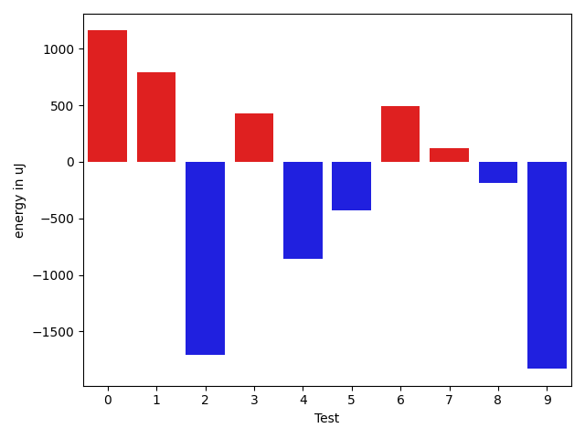

# gson bc2c25

https://github.com/google/gson/commit/bc2c25

## Delta Energy per test method

| ID | EnergyV1 | EnergyV2 | DeltaEnergy | σV1 | σV2 |
| --- | --- | --- | --- | --- | --- |
| 0 | 35583 | 36743 | 1160 | 457511.87337955594 | 388521.1052927128 |
| 1 | 35095 | 35889 | 794 | 211682.43268461534 | 209464.9786155103 |
| 2 | 39550 | 37841 | -1709 | 27350.03261946344 | 30307.63101522196 |
| 3 | 39551 | 39977 | 426 | 662072.6511152904 | 664940.7695511343 |
| 4 | 68847 | 67993 | -854 | 21014.32825651207 | 19952.627373931147 |
| 5 | 36438 | 36011 | -427 | 11911.840366238272 | 12776.848036403628 |
| 6 | 35644 | 36133 | 489 | 5549.532640534029 | 2939.4209976841803 |
| 7 | 35888 | 36011 | 123 | 24838.511510313063 | 18190.917672676784 |
| 8 | 35156 | 34973 | -183 | 12040.629931750813 | 12032.396540675629 |
| 9 | 37292 | 35462 | -1830 | 3878.076380575845 | 3791.6439344210708 |

## Delta Duration per test method

| ID | DurationV1 | DurationsV2 | DeltaDuration |
| --- | --- | --- | --- |
| 0 | 5411916.458333333 | 4921093.826923077 | -490822.631410256 |
| 1 | 2395040.267605634 | 2322257.5 | -72782.76760563394 |
| 2 | 1910161.012987013 | 1981273.025 | 71112.01201298693 |
| 3 | 15977665.294871794 | 16075614.121951219 | 97948.82707942463 |
| 4 | 2318869.757575758 | 2394488.4646464647 | 75618.70707070688 |
| 5 | 1389346.404494382 | 1383492.4886363635 | -5853.915858018445 |
| 6 | 1109517.9672131147 | 1127777.352112676 | 18259.384899561293 |
| 7 | 1768537.0505050505 | 1702302.888888889 | -66234.16161616147 |
| 8 | 1567264.1836734693 | 1542246.4948453608 | -25017.6888281086 |
| 9 | 848903.9444444445 | 840142.0666666667 | -8761.877777777845 |

## Misc.

| ID | Test Class | Test Method |
| --- | --- | --- |
| 0 | com.google.gson.FunctionalWithInternalDependenciesTest | testMultipleArrays |
| 1 | com.google.gson.FunctionalWithInternalDependenciesTest | testAnonymousLocalClassesSerialization |
| 2 | com.google.gson.functional.CustomTypeAdaptersTest | testCustomNestedSerializers |
| 3 | com.google.gson.functional.CustomTypeAdaptersTest | testCustomSerializers |
| 4 | com.google.gson.functional.CustomTypeAdaptersTest | testCustomTypeAdapterDoesNotAppliesToSubClasses |
| 5 | com.google.gson.functional.CustomTypeAdaptersTest | testCustomSerializerForLong |
| 6 | com.google.gson.functional.CustomTypeAdaptersTest | testCustomTypeAdapterAppliesToSubClassesSerializedAsBaseClass |
| 7 | com.google.gson.functional.ParameterizedTypesTest | testParameterizedTypeWithCustomSerializer |
| 8 | com.google.gson.functional.ParameterizedTypesTest | testParameterizedTypesWithCustomDeserializer |
| 9 | com.google.gson.functional.NullObjectAndFieldTest | testCustomSerializationOfNulls |

| Test | IterationV1 | IterationV2 | DeltaIteration |
| --- | --- | --- | --- |
| 0 | 48 | 52 | 4 |
| 1 | 71 | 68 | -3 |
| 2 | 77 | 80 | 3 |
| 3 | 78 | 82 | 4 |
| 4 | 99 | 99 | 0 |
| 5 | 89 | 88 | -1 |
| 6 | 61 | 71 | 10 |
| 7 | 99 | 99 | 0 |
| 8 | 98 | 97 | -1 |
| 9 | 36 | 45 | 9 |

| Time Label | Time (s) |
| --- | --- |
| Selection | 23.07332968711853 |
| Injection | 8.635572671890259 |
| Total | 914.4380509853363 |

