# gson 9245be

https://github.com/google/gson/commit/9245be

## Delta Energy per test method

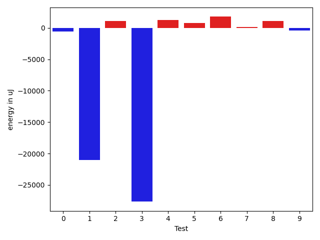

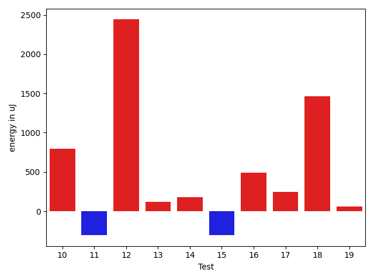

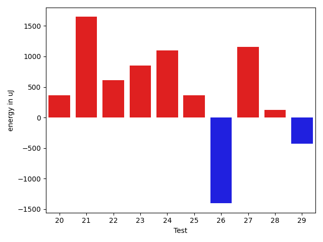

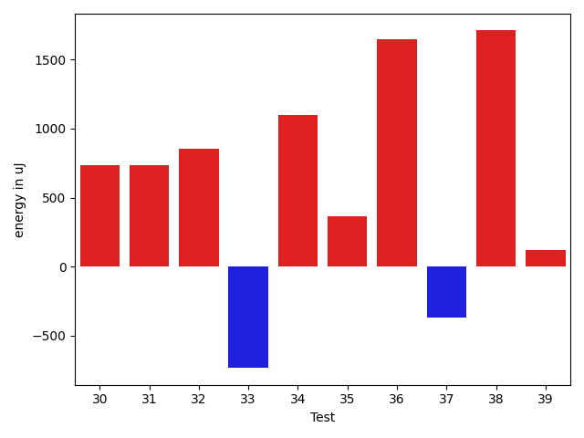

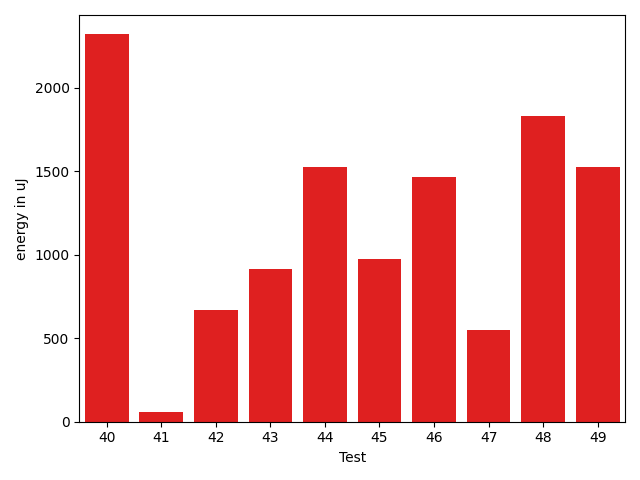

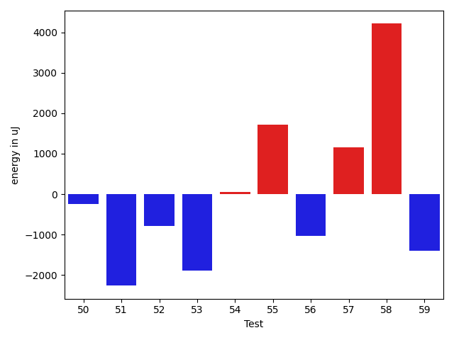

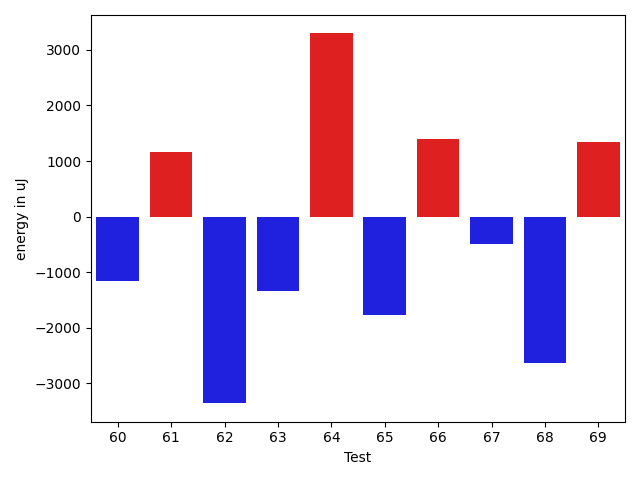

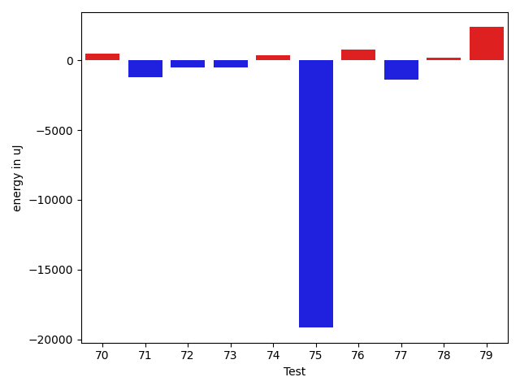

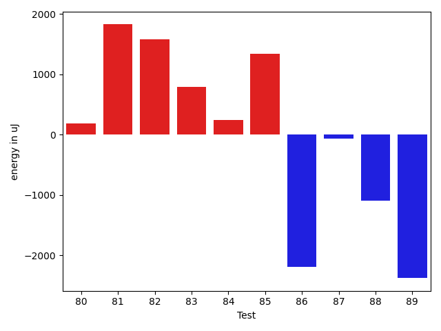

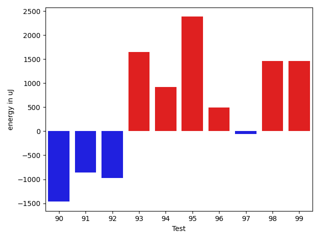

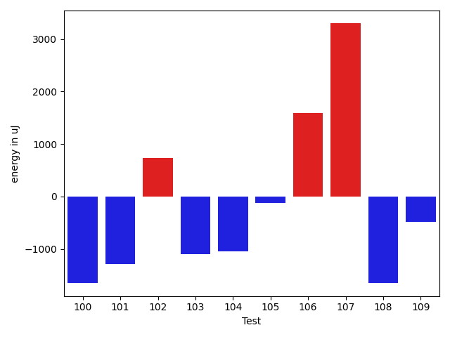

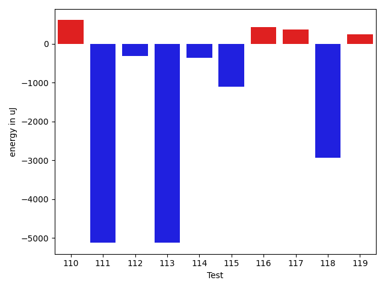

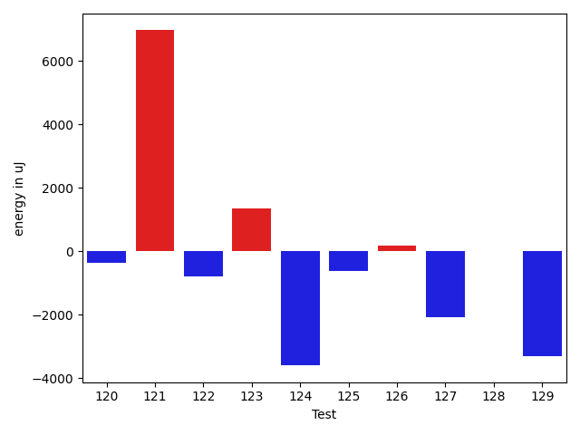

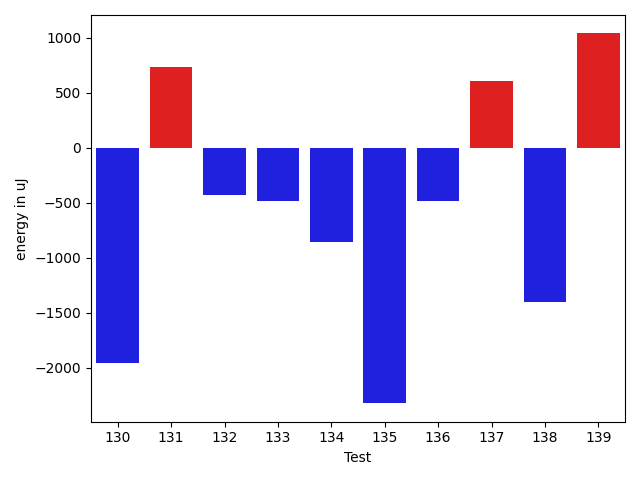

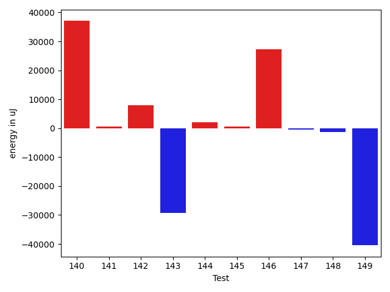

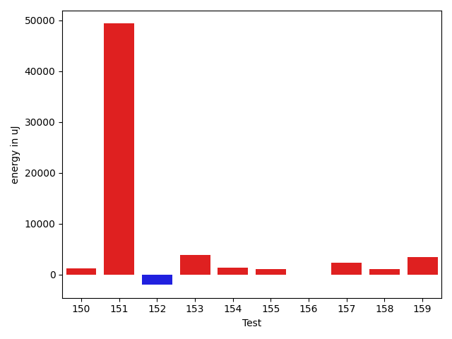

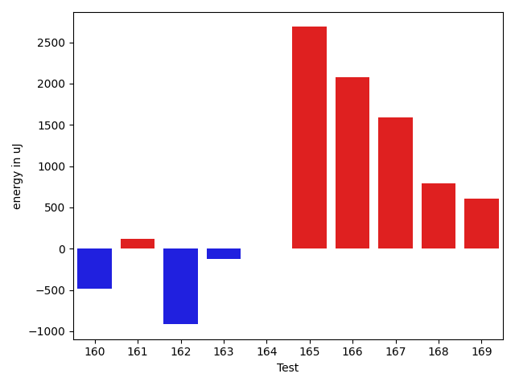

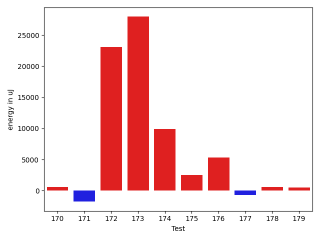

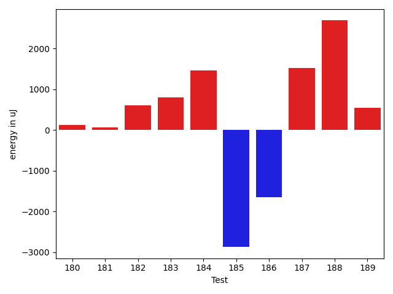

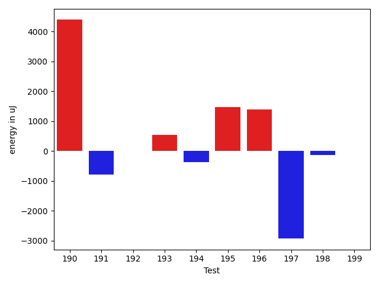

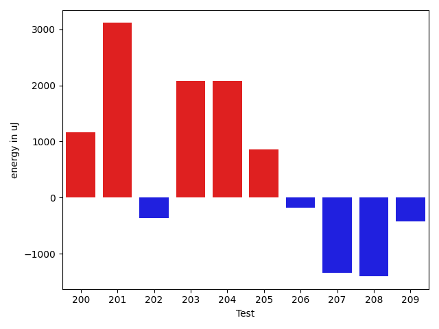

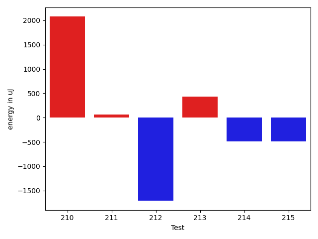

| ID | EnergyV1 | EnergyV2 | DeltaEnergy | σV1 | σV2 |
| --- | --- | --- | --- | --- | --- |
| 0 | 35095 | 34546 | -549 | 3590.0393219408315 | 5133.959051803929 |
| 1 | 62683 | 41626 | -21057 | 33879.336182368366 | 27939.645540983896 |
| 2 | 33020 | 34118 | 1098 | 3122.290613028651 | 3535.3133495993166 |
| 3 | 65979 | 38330 | -27649 | 23742.260970878644 | 22847.92269850918 |
| 4 | 33508 | 34729 | 1221 | 3806.714669656407 | 3973.7518715177134 |
| 5 | 32349 | 33142 | 793 | 3201.828452055252 | 3772.6283118480114 |
| 6 | 33569 | 35339 | 1770 | 2721.277970802505 | 3399.9575857317814 |
| 7 | 33142 | 33264 | 122 | 3062.1949111051017 | 4012.1890098226554 |
| 8 | 34912 | 36011 | 1099 | 27669.521182660363 | 11183.765288959454 |
| 9 | 35156 | 34729 | -427 | 10992.19588589841 | 7840.774969032081 |
| 10 | 71045 | 71838 | 793 | 37181.94515852079 | 37841.46666035333 |
| 11 | 34668 | 34362 | -306 | 14944.196546632233 | 26108.729803140614 |
| 12 | 33569 | 36010 | 2441 | 6550.5379980679645 | 3846.5674167496404 |
| 13 | 33752 | 33874 | 122 | 2583.0657546590955 | 3871.595812562331 |
| 14 | 31922 | 32104 | 182 | 3099.3274833713963 | 4307.919535588581 |
| 15 | 35217 | 34912 | -305 | 3276.939576442373 | 3522.034998051552 |
| 16 | 32348 | 32837 | 489 | 3904.3692431606382 | 3498.18277409849 |
| 17 | 35400 | 35645 | 245 | 2955.9188557156594 | 3266.0011560068474 |
| 18 | 34607 | 36072 | 1465 | 3224.5998289931817 | 3410.226997259788 |
| 19 | 34118 | 34180 | 62 | 4490.379810634063 | 6135.210222672805 |
| 20 | 34668 | 35034 | 366 | 3342.2239533103757 | 3744.917023821238 |
| 21 | 33569 | 35217 | 1648 | 6365.307322645813 | 3302.851577672274 |
| 22 | 33753 | 34362 | 609 | 3271.994223805611 | 3152.8543983417403 |
| 23 | 34729 | 35583 | 854 | 3704.7719255051074 | 3369.5580416609364 |
| 24 | 34118 | 35217 | 1099 | 3027.7694698323685 | 2977.2588860402657 |
| 25 | 33447 | 33813 | 366 | 8140.916736605511 | 10526.22235568093 |
| 26 | 34424 | 33020 | -1404 | 2313.687134645649 | 3852.754130344797 |
| 27 | 32654 | 33814 | 1160 | 3932.861561545707 | 4155.775858293491 |
| 28 | 34058 | 34180 | 122 | 3717.1331573838215 | 4135.139199054314 |
| 29 | 32776 | 32348 | -428 | 3713.6135403867415 | 26203.84498712689 |
| 30 | 34668 | 35400 | 732 | 6148.522968140453 | 3064.676188522348 |
| 31 | 33081 | 33814 | 733 | 3171.2015551136146 | 3859.5441485282654 |
| 32 | 33264 | 34119 | 855 | 7862.182291290879 | 34957.975723383446 |
| 33 | 32410 | 31677 | -733 | 2862.0629606164407 | 4894.151491893155 |
| 34 | 33630 | 34729 | 1099 | 2862.5525306301865 | 3270.35571971104 |
| 35 | 33325 | 33692 | 367 | 2493.7969296923934 | 3837.678396042407 |
| 36 | 33386 | 35034 | 1648 | 3075.5341374505697 | 3184.532609561099 |
| 37 | 36437 | 36072 | -365 | 14656.119216947489 | 8274.389181111768 |
| 38 | 36133 | 37842 | 1709 | 96472.76720884371 | 34688.40922242215 |
| 39 | 34424 | 34546 | 122 | 3226.2071923657604 | 3266.132383247495 |
| 40 | 32959 | 35279 | 2320 | 37510.544199555596 | 3837.0771627588706 |
| 41 | 35889 | 35950 | 61 | 4103.264541481154 | 3870.9672014059356 |
| 42 | 35034 | 35705 | 671 | 3736.2087490898753 | 4276.538205792157 |
| 43 | 36438 | 37353 | 915 | 289401.42242618266 | 299196.7707680777 |
| 44 | 34851 | 36377 | 1526 | 20326.424401387623 | 26007.613470750573 |
| 45 | 61096 | 62072 | 976 | 20456.731022899305 | 19900.780868575574 |
| 46 | 33813 | 35279 | 1466 | 4256.090156179347 | 6918.505216378995 |
| 47 | 34668 | 35217 | 549 | 3749.137443446551 | 26082.505377110203 |
| 48 | 33935 | 35767 | 1832 | 22372.185897066305 | 25621.417095339075 |
| 49 | 35705 | 37232 | 1527 | 36633.07930584831 | 53015.01309726382 |
| 50 | 34668 | 34423 | -245 | 26273.00693898989 | 3976.3740401068835 |
| 51 | 36255 | 33996 | -2259 | 7873.453374624602 | 7761.329010709892 |
| 52 | 37231 | 36438 | -793 | 4697.048534392985 | 3809.692473610465 |
| 53 | 36560 | 34668 | -1892 | 3162.4986367585993 | 4727.604924412533 |
| 54 | 34729 | 34790 | 61 | 3246.6445751313645 | 4148.409029784792 |
| 55 | 34729 | 36438 | 1709 | 3661.5360978233266 | 32770.514976343366 |
| 56 | 36072 | 35034 | -1038 | 3669.955757529268 | 4809.463749491147 |
| 57 | 38269 | 39429 | 1160 | 60248.695006790185 | 72727.23088318289 |
| 58 | 35522 | 39733 | 4211 | 67682.05060829059 | 72082.36282170555 |
| 59 | 35583 | 34180 | -1403 | 3353.6103461502844 | 38887.94780744488 |
| 60 | 36194 | 35035 | -1159 | 32319.012457247518 | 39403.51224133124 |
| 61 | 32532 | 33692 | 1160 | 3017.406318093208 | 3955.819629527871 |
| 62 | 38147 | 34790 | -3357 | 2821.9800595676115 | 3909.0510803035686 |
| 63 | 35278 | 33936 | -1342 | 4575.517473887096 | 2995.9031116752517 |
| 64 | 34851 | 38146 | 3295 | 2912.393330850118 | 4229.878526478678 |
| 65 | 35828 | 34058 | -1770 | 35556.81908766894 | 4424.520662698475 |
| 66 | 35156 | 36560 | 1404 | 4320.253036274843 | 5252.478253090028 |
| 67 | 36316 | 35828 | -488 | 28212.59673373208 | 8752.525618742708 |
| 68 | 35583 | 32958 | -2625 | 3957.299177188626 | 3096.1122395675516 |
| 69 | 34179 | 35522 | 1343 | 3629.9131249830975 | 3796.506392687274 |
| 70 | 33752 | 34241 | 489 | 3711.9113265649266 | 4144.889453483316 |
| 71 | 34851 | 33631 | -1220 | 4659.57444806251 | 6552.2310796442625 |
| 72 | 34241 | 33752 | -489 | 60367.11465258432 | 3530.8647017975636 |
| 73 | 34851 | 34363 | -488 | 3521.9493397408946 | 3983.1199258013767 |
| 74 | 34668 | 35034 | 366 | 4064.1919820697667 | 4137.872448493308 |
| 75 | 57678 | 38513 | -19165 | 20204.65213332985 | 17452.222846770634 |
| 76 | 37841 | 38635 | 794 | 105411.33889214596 | 91264.05546704153 |
| 77 | 35461 | 34057 | -1404 | 3843.3264154532653 | 3653.45071562323 |
| 78 | 33997 | 34179 | 182 | 2482.5903303331966 | 3503.190319541682 |
| 79 | 35400 | 37781 | 2381 | 3844.050369302611 | 3686.031856549805 |
| 80 | 34119 | 34302 | 183 | 3976.6615175904485 | 3268.159662806764 |
| 81 | 33509 | 35339 | 1830 | 4855.0611870088715 | 3919.6427407155043 |
| 82 | 61401 | 62988 | 1587 | 18789.253141110294 | 16006.429538826715 |
| 83 | 33814 | 34607 | 793 | 3521.365588713418 | 4924.371623126453 |
| 84 | 33203 | 33447 | 244 | 3330.9437782146942 | 35011.93905920828 |
| 85 | 33752 | 35095 | 1343 | 4659.636333342203 | 4341.473415590904 |
| 86 | 36743 | 34546 | -2197 | 4694.6545071344735 | 4709.981465108122 |
| 87 | 35523 | 35462 | -61 | 4033.711333655879 | 3245.8279067134786 |
| 88 | 36804 | 35706 | -1098 | 50470.495057618675 | 5010.677871056969 |
| 89 | 36804 | 34424 | -2380 | 3559.715462449612 | 3797.871243063526 |
| 90 | 34301 | 32836 | -1465 | 4184.741942157124 | 3748.065168816477 |
| 91 | 34485 | 33630 | -855 | 3788.969213241101 | 3524.5834885382933 |
| 92 | 34119 | 33142 | -977 | 3794.880092381781 | 2631.8545360427674 |
| 93 | 32532 | 34180 | 1648 | 4971.8603381832845 | 35598.83392000502 |
| 94 | 34180 | 35095 | 915 | 2943.8228445339573 | 3025.437835878541 |
| 95 | 33386 | 35767 | 2381 | 2502.4875542515038 | 4063.0292946136738 |
| 96 | 35950 | 36438 | 488 | 10066.615058111149 | 19914.49853508242 |
| 97 | 36194 | 36133 | -61 | 10504.885886866823 | 3900.357389940415 |
| 98 | 37720 | 39184 | 1464 | 28603.157782544502 | 39565.38767684484 |
| 99 | 36988 | 38452 | 1464 | 2172.761683510949 | 3840.038132541785 |
| 100 | 80017 | 78369 | -1648 | 75178.83876745246 | 51818.53937594164 |
| 101 | 36072 | 34790 | -1282 | 4233.775097160138 | 3569.1443156837586 |
| 102 | 35156 | 35888 | 732 | 12278.233134496042 | 10025.403034789138 |
| 103 | 36010 | 34912 | -1098 | 3112.1237347663196 | 3242.831787778474 |
| 104 | 36499 | 35461 | -1038 | 4414.310478118855 | 2941.1782751575097 |
| 105 | 35889 | 35766 | -123 | 59448.742989767874 | 47410.34766044171 |
| 106 | 35583 | 37170 | 1587 | 4218.149007135713 | 47969.11644586482 |
| 107 | 34973 | 38269 | 3296 | 3542.4469919741823 | 17439.265312793425 |
| 108 | 35888 | 34240 | -1648 | 4143.564181864542 | 3923.4655595193763 |
| 109 | 34790 | 34302 | -488 | 3575.5910908429096 | 4423.355258869995 |
| 110 | 34423 | 35034 | 611 | 3427.1300305477143 | 3928.269072291381 |
| 111 | 40771 | 35645 | -5126 | 103004.993317162 | 11533.526339382268 |
| 112 | 35278 | 34973 | -305 | 3721.0027540028723 | 3623.400907555005 |
| 113 | 39673 | 34546 | -5127 | 54895.42200398074 | 3253.896205992902 |
| 114 | 36133 | 35767 | -366 | 13536.5102668678 | 3448.2585556084005 |
| 115 | 37598 | 36499 | -1099 | 66585.0300870218 | 56809.74166715824 |
| 116 | 33631 | 34057 | 426 | 3282.8649790445593 | 3797.2111412705103 |
| 117 | 33997 | 34363 | 366 | 27558.081951588723 | 43566.499333579704 |
| 118 | 35339 | 32409 | -2930 | 4052.0885501365156 | 4036.8725797287316 |
| 119 | 33814 | 34058 | 244 | 26484.668371881107 | 8122.454096175447 |
| 120 | 34424 | 34057 | -367 | 3632.586774642297 | 4288.616511125715 |
| 121 | 44311 | 51270 | 6959 | 30716.13471309934 | 29408.427936688648 |
| 122 | 37903 | 37109 | -794 | 42418.80827416337 | 39611.01804831068 |
| 123 | 33325 | 34668 | 1343 | 17993.59676146043 | 4227.663631073314 |
| 124 | 36987 | 33386 | -3601 | 3954.29550021835 | 3277.428860784014 |
| 125 | 36621 | 36010 | -611 | 3827.289639981881 | 4175.214775538499 |
| 126 | 34057 | 34241 | 184 | 9401.646842215125 | 24812.033307875256 |
| 127 | 146362 | 144286 | -2076 | 35727.40593989461 | 39590.05626245655 |
| 128 | 32959 | 32959 | 0 | 3768.7900883440034 | 4955.840983543224 |
| 129 | 36377 | 33081 | -3296 | 3934.494680588809 | 3417.9820540487494 |
| 130 | 33997 | 32044 | -1953 | 3084.2087090712766 | 3624.004205310714 |
| 131 | 35828 | 36560 | 732 | 3763.3942422348764 | 2952.1372010309647 |
| 132 | 34363 | 33935 | -428 | 8594.110040019397 | 4007.9565806629366 |
| 133 | 33691 | 33204 | -487 | 3852.43449801855 | 4159.10632248196 |
| 134 | 34363 | 33508 | -855 | 3356.026689239656 | 28607.47992617236 |
| 135 | 37232 | 34912 | -2320 | 3182.6582985855634 | 4051.310237008312 |
| 136 | 34484 | 33997 | -487 | 13919.657540302129 | 5329.568881919079 |
| 137 | 34973 | 35583 | 610 | 10179.748951011543 | 12154.751241726992 |
| 138 | 35523 | 34118 | -1405 | 12618.369166842718 | 10427.523290847948 |
| 139 | 35095 | 36132 | 1037 | 20447.890959945194 | 26484.116187801723 |
| 140 | 35644 | 72754 | 37110 | 26298.788365240518 | 73364.3500850724 |
| 141 | 34851 | 35522 | 671 | 8809.765061259339 | 12145.793040997809 |
| 142 | 75439 | 83312 | 7873 | 27885.486840406735 | 30561.488743912014 |
| 143 | 66284 | 36987 | -29297 | 68383.27552761127 | 67562.2172885796 |
| 144 | 63110 | 65124 | 2014 | 25389.2328871934 | 26101.85377828934 |
| 145 | 35156 | 35645 | 489 | 31810.728598849622 | 45327.717588841806 |
| 146 | 41626 | 68970 | 27344 | 45131.580914757586 | 65566.35903427949 |
| 147 | 35339 | 34790 | -549 | 9132.314404987379 | 10378.322457922442 |
| 148 | 35706 | 34301 | -1405 | 49112.62097545243 | 10710.637499908418 |
| 149 | 79956 | 39489 | -40467 | 208806.13063603264 | 41189.91717369347 |
| 150 | 76233 | 77454 | 1221 | 45835.84939070967 | 62080.58898316512 |
| 151 | 37170 | 86486 | 49316 | 40205.42612010624 | 422325.02698988817 |
| 152 | 36377 | 34363 | -2014 | 3512.1096556726975 | 3320.932254460243 |
| 153 | 36255 | 40100 | 3845 | 54730.691792773425 | 46401.23598124578 |
| 154 | 33142 | 34424 | 1282 | 4271.398940521818 | 2907.5161451658355 |
| 155 | 35278 | 36316 | 1038 | 4196.3587248168515 | 3051.151178744763 |
| 156 | 35461 | 35462 | 1 | 4127.552289723293 | 3604.930138943981 |
| 157 | 35828 | 38085 | 2257 | 19907.177246869276 | 21498.32707203154 |
| 158 | 37415 | 38513 | 1098 | 13233.229452242571 | 15899.867028235034 |
| 159 | 36194 | 39611 | 3417 | 343476.17928187695 | 537934.5323608138 |
| 160 | 37109 | 36621 | -488 | 38132.43010226107 | 36228.71676859057 |
| 161 | 34423 | 34546 | 123 | 3644.9096611977866 | 4041.440263280165 |
| 162 | 36621 | 35705 | -916 | 3122.4056300178786 | 2747.2793791201466 |
| 163 | 36865 | 36743 | -122 | 5030.50075241712 | 3266.6292963848837 |
| 164 | 39001 | 39001 | 0 | 61533.75541366693 | 75509.70175998942 |
| 165 | 37902 | 40588 | 2686 | 107955.01428155282 | 108308.78778832921 |
| 166 | 35888 | 37964 | 2076 | 4710.64858955723 | 3584.959356044017 |
| 167 | 36865 | 38452 | 1587 | 52619.988240076615 | 83239.3734287097 |
| 168 | 35706 | 36499 | 793 | 7949.052816548153 | 21608.64179088716 |
| 169 | 34851 | 35461 | 610 | 4128.473602885679 | 4000.4809763913563 |
| 170 | 35278 | 35828 | 550 | 3866.830661544696 | 3431.2782944679457 |
| 171 | 44250 | 42480 | -1770 | 60046.501316712216 | 66540.35423344771 |
| 172 | 248779 | 271850 | 23071 | 81326.85715872074 | 113609.82204645782 |
| 173 | 348022 | 375976 | 27954 | 99038.31501742786 | 113620.18941885987 |
| 174 | 53955 | 63842 | 9887 | 51073.2712658742 | 62158.06117464343 |
| 175 | 36010 | 38513 | 2503 | 36711.63695349609 | 44155.16533724208 |
| 176 | 119263 | 124572 | 5309 | 312309.38889955747 | 301995.1752198433 |
| 177 | 35400 | 34728 | -672 | 5553.331207701712 | 3172.6240476142143 |
| 178 | 34240 | 34851 | 611 | 3561.1910799861103 | 3708.766244393889 |
| 179 | 35523 | 36011 | 488 | 4028.1011997905935 | 4104.553213357752 |
| 180 | 36499 | 36621 | 122 | 52473.89902740095 | 53494.17525359155 |
| 181 | 37719 | 37780 | 61 | 84783.6268680114 | 74166.87598689373 |
| 182 | 38147 | 38758 | 611 | 74254.92641985013 | 52829.173512427515 |
| 183 | 35705 | 36499 | 794 | 60535.63243911023 | 50739.84561683209 |
| 184 | 37719 | 39184 | 1465 | 60894.16310146446 | 65560.49853632467 |
| 185 | 35889 | 33020 | -2869 | 3801.9108659576677 | 7842.401017262224 |
| 186 | 36621 | 34973 | -1648 | 3755.527011532968 | 3667.5747717800145 |
| 187 | 68847 | 70373 | 1526 | 25655.20558335743 | 25936.227096952465 |
| 188 | 37231 | 39917 | 2686 | 70450.67550430224 | 42376.318785550444 |
| 189 | 38452 | 39002 | 550 | 61413.26245186424 | 23557.597983977306 |
| 190 | 67626 | 72022 | 4396 | 83552.76117281994 | 92426.17967212647 |
| 191 | 36255 | 35462 | -793 | 3838.7652321921846 | 7881.365560557377 |
| 192 | 36621 | 36621 | 0 | 6563.2213072039285 | 3911.7210601401207 |
| 193 | 37293 | 37842 | 549 | 316027.1768677235 | 6833.138920414157 |
| 194 | 36926 | 36560 | -366 | 30214.35298065426 | 18207.257097505062 |
| 195 | 34851 | 36316 | 1465 | 251479.23851395427 | 4192.424449579516 |
| 196 | 36072 | 37475 | 1403 | 336106.79104903305 | 270750.5098419913 |
| 197 | 39307 | 36377 | -2930 | 729244.9090044408 | 535002.4738210854 |
| 198 | 36499 | 36376 | -123 | 3737.138198532475 | 8322.80696433334 |
| 199 | 36621 | 36621 | 0 | 32322.286543222977 | 36767.636235669015 |
| 200 | 34119 | 35278 | 1159 | 8069.2575743396665 | 6523.362844713376 |
| 201 | 33875 | 36987 | 3112 | 3248.366497179775 | 3430.903626516554 |
| 202 | 37902 | 37537 | -365 | 36935.367731987135 | 50699.170624521685 |
| 203 | 34241 | 36316 | 2075 | 3226.239276383685 | 3927.1731967764285 |
| 204 | 37780 | 39856 | 2076 | 12760.593578716289 | 13600.239874238858 |
| 205 | 37720 | 38574 | 854 | 49575.8252948811 | 61046.833254918936 |
| 206 | 36377 | 36194 | -183 | 2757.4748858500507 | 3827.9169260912067 |
| 207 | 36621 | 35278 | -1343 | 3349.3671260894525 | 4064.5535559846494 |
| 208 | 35767 | 34363 | -1404 | 4290.649949801957 | 3620.2336566021622 |
| 209 | 36926 | 36499 | -427 | 3554.67170134191 | 3887.9379566333864 |
| 210 | 36804 | 38880 | 2076 | 89238.18555785796 | 103008.9679389615 |
| 211 | 37292 | 37353 | 61 | 7729.537156327128 | 9592.619893536645 |
| 212 | 35645 | 33936 | -1709 | 27595.19218199187 | 42188.779795896764 |
| 213 | 37475 | 37903 | 428 | 32361.667449135697 | 30274.120275311456 |
| 214 | 38452 | 37964 | -488 | 9392.82428553611 | 12931.612754115396 |
| 215 | 38513 | 38025 | -488 | 655474.1904815445 | 735918.8102085447 |

## Delta Duration per test method

| ID | DurationV1 | DurationsV2 | DeltaDuration |
| --- | --- | --- | --- |
| 0 | 943334.2380952381 | 911906.5178571428 | -31427.720238095266 |
| 1 | 2055448.9278350514 | 1883993.1818181819 | -171455.74601686955 |
| 2 | 829157.0701754387 | 759533.7446808511 | -69623.32549458754 |
| 3 | 1931744.1157894738 | 1648382.2282608696 | -283361.88752860413 |
| 4 | 440183.36842105264 | 423898.46153846156 | -16284.90688259108 |
| 5 | 797189.5576923077 | 696106.7021276596 | -101082.85556464817 |
| 6 | 679692.575 | 587659.3823529412 | -92033.19264705875 |
| 7 | 938419.8115942029 | 824002.873015873 | -114416.93857832986 |
| 8 | 1290019.7209302327 | 1153276.058139535 | -136743.66279069777 |
| 9 | 1265373.6341463414 | 1062093.175 | -203280.4591463413 |
| 10 | 2982073.5656565656 | 2739350.262626263 | -242723.30303030275 |
| 11 | 1075078.2125 | 1056488.1935483871 | -18590.018951612758 |
| 12 | 868000.2181818181 | 761525.52 | -106474.69818181812 |
| 13 | 892909.2181818181 | 828279.6206896552 | -64629.59749216295 |
| 14 | 763356.9322033898 | 743025.1568627451 | -20331.77534064476 |
| 15 | 600749.7407407408 | 555609.35 | -45140.39074074081 |
| 16 | 599095.9428571429 | 531864.4634146341 | -67231.47944250877 |
| 17 | 723901.3191489362 | 651820.4705882353 | -72080.84856070089 |
| 18 | 656049.0285714286 | 748776.8888888889 | 92727.86031746026 |
| 19 | 1066467.890625 | 929849.4333333333 | -136618.45729166665 |
| 20 | 654083.9285714285 | 596728.4523809524 | -57355.476190476096 |
| 21 | 781944.1851851852 | 717649.9636363636 | -64294.221548821544 |
| 22 | 399386.6111111111 | 365866.71428571426 | -33519.89682539686 |
| 23 | 757486.3720930233 | 643323.3684210526 | -114163.00367197068 |
| 24 | 665097.8285714285 | 618204.0322580645 | -46893.79631336406 |
| 25 | 1156360.4875 | 1257070.9493670885 | 100710.46186708845 |
| 26 | 474225.7272727273 | 447432.2916666667 | -26793.435606060608 |
| 27 | 457462.0588235294 | 412097.2916666667 | -45364.76715686271 |
| 28 | 498117.75 | 396617.8 | -101499.95000000001 |
| 29 | 589904.625 | 686449.59375 | 96544.96875 |
| 30 | 704485.6842105263 | 713388.5454545454 | 8902.861244019121 |
| 31 | 468551.9259259259 | 467496.4285714286 | -1055.4973544973182 |
| 32 | 559676.4117647059 | 668043.7666666667 | 108367.35490196082 |
| 33 | 465085.76923076925 | 393654.72 | -71431.04923076928 |
| 34 | 694566.2222222222 | 601071.119047619 | -93495.1031746032 |
| 35 | 541083.0833333334 | 525688.8055555555 | -15394.277777777868 |
| 36 | 408645.8695652174 | 370244.44444444444 | -38401.42512077297 |
| 37 | 893458.3939393939 | 646798.4516129033 | -246659.94232649065 |
| 38 | 1974325.4814814816 | 1064578.088888889 | -909747.3925925926 |
| 39 | 415996.6666666667 | 470347.21428571426 | 54350.547619047575 |
| 40 | 749466.9736842106 | 609703.6451612903 | -139763.32852292026 |
| 41 | 652028.1944444445 | 611221.0731707317 | -40807.12127371284 |
| 42 | 887637.487804878 | 768081.28 | -119556.20780487801 |
| 43 | 2840876.3333333335 | 2547096.2786885244 | -293780.0546448091 |
| 44 | 978035.0793650794 | 964777.4590163934 | -13257.620348686003 |
| 45 | 1890457.101010101 | 1867749.191919192 | -22707.909090908943 |
| 46 | 939333.1095890411 | 978465.9242424242 | 39132.8146533831 |
| 47 | 929546.8970588235 | 1064704.8461538462 | 135157.94909502275 |
| 48 | 1047572.2 | 1119418.2666666666 | 71846.06666666665 |
| 49 | 1165741.603174603 | 1288251.4166666667 | 122509.81349206367 |
| 50 | 656748.65625 | 567512.625 | -89236.03125 |
| 51 | 917923.9411764706 | 884448.5483870967 | -33475.39278937387 |
| 52 | 523821.2580645161 | 574898.6666666666 | 51077.408602150506 |
| 53 | 371871.75 | 425786.84210526315 | 53915.092105263146 |
| 54 | 401731.1052631579 | 511324.16 | 109593.05473684205 |
| 55 | 529965.6071428572 | 630655.2608695652 | 100689.65372670803 |
| 56 | 501633.93333333335 | 650585.3793103448 | 148951.44597701146 |
| 57 | 1482033.6 | 2135437.5517241377 | 653403.9517241376 |
| 58 | 1623492.3333333333 | 1735167.3 | 111674.96666666679 |
| 59 | 567463.0882352941 | 825142.8461538461 | 257679.75791855203 |
| 60 | 659643.0869565217 | 802310.8260869565 | 142667.7391304348 |
| 61 | 407751.5652173913 | 406275.8333333333 | -1475.7318840579828 |
| 62 | 434630.0833333333 | 494117.74074074073 | 59487.657407407416 |
| 63 | 364431.3076923077 | 408929.7272727273 | 44498.419580419606 |
| 64 | 412522.0 | 455094.05555555556 | 42572.05555555556 |
| 65 | 845351.2647058824 | 662037.2790697674 | -183313.98563611496 |
| 66 | 729831.6585365854 | 724080.4857142858 | -5751.172822299646 |
| 67 | 1057132.2972972973 | 1085219.0882352942 | 28086.790937996935 |
| 68 | 462682.6666666667 | 442473.375 | -20209.291666666686 |
| 69 | 520271.7037037037 | 516942.6666666667 | -3329.037037037022 |
| 70 | 449822.95454545453 | 428343.9166666667 | -21479.037878787844 |
| 71 | 1036467.425925926 | 879273.0555555555 | -157194.37037037045 |
| 72 | 999867.3913043478 | 427403.36 | -572464.0313043478 |
| 73 | 671241.0652173914 | 711659.875 | 40418.809782608645 |
| 74 | 511016.71428571426 | 544811.44 | 33794.72571428568 |
| 75 | 1628909.1929824562 | 1609273.8490566039 | -19635.34392585233 |
| 76 | 2352990.769230769 | 2005267.0208333333 | -347723.74839743576 |
| 77 | 579511.0 | 576028.6176470588 | -3482.382352941204 |
| 78 | 492358.4583333333 | 484541.8333333333 | -7816.625 |
| 79 | 606434.8636363636 | 630283.5 | 23848.636363636353 |
| 80 | 476047.1052631579 | 477652.0 | 1604.8947368420777 |
| 81 | 523754.16 | 479190.75 | -44563.409999999974 |
| 82 | 1620301.5681818181 | 1518006.6530612244 | -102294.91512059374 |
| 83 | 362957.9375 | 328154.21428571426 | -34803.72321428574 |
| 84 | 654447.6666666666 | 778153.1714285715 | 123705.50476190483 |
| 85 | 428259.2105263158 | 497037.15789473685 | 68777.94736842107 |
| 86 | 402581.8333333333 | 458717.6842105263 | 56135.85087719298 |
| 87 | 415866.4166666667 | 433445.5 | 17579.083333333314 |
| 88 | 823615.0555555555 | 470098.65 | -353516.4055555555 |
| 89 | 549548.0689655172 | 577633.9333333333 | 28085.86436781613 |
| 90 | 358000.71428571426 | 410960.2105263158 | 52959.496240601526 |
| 91 | 497202.1666666667 | 560588.303030303 | 63386.136363636295 |
| 92 | 509481.6 | 424278.1666666667 | -85203.43333333329 |
| 93 | 462645.48 | 707589.6451612903 | 244944.16516129032 |
| 94 | 521493.0 | 475216.51851851854 | -46276.48148148146 |
| 95 | 458972.14285714284 | 472147.6666666667 | 13175.523809523846 |
| 96 | 1251606.8020833333 | 1325570.8651685393 | 73964.06308520609 |
| 97 | 757256.125 | 747384.5510204082 | -9871.573979591834 |
| 98 | 1206284.076923077 | 1662636.396551724 | 456352.31962864706 |
| 99 | 536748.1666666666 | 656104.0625 | 119355.89583333337 |
| 100 | 3563619.4242424243 | 3041128.606060606 | -522490.81818181835 |
| 101 | 659242.0 | 678035.8409090909 | 18793.84090909094 |
| 102 | 998327.8235294118 | 952815.1489361703 | -45512.674593241536 |
| 103 | 496369.86363636365 | 467303.64285714284 | -29066.220779220806 |
| 104 | 459320.8947368421 | 485190.5714285714 | 25869.676691729343 |
| 105 | 1560197.4193548388 | 1052596.2777777778 | -507601.14157706103 |
| 106 | 756975.02 | 1256919.642857143 | 499944.62285714294 |
| 107 | 616188.0967741936 | 910345.9666666667 | 294157.8698924731 |
| 108 | 1007180.5076923077 | 941853.2571428572 | -65327.25054945052 |
| 109 | 716351.641025641 | 754239.2222222222 | 37887.581196581246 |
| 110 | 725562.8536585366 | 648127.9722222222 | -77434.88143631432 |
| 111 | 2478183.6375 | 1105303.3857142858 | -1372880.2517857144 |
| 112 | 806417.2786885246 | 872196.1568627451 | 65778.87817422044 |
| 113 | 2028079.511627907 | 757153.725 | -1270925.7866279068 |
| 114 | 959265.0588235294 | 421905.71428571426 | -537359.3445378151 |
| 115 | 1820324.16 | 1534394.4090909092 | -285929.75090909074 |
| 116 | 682159.4897959183 | 716495.1041666666 | 34335.614370748284 |
| 117 | 1237071.3580246915 | 1409386.2906976745 | 172314.93267298304 |
| 118 | 458253.04347826086 | 462080.9259259259 | 3827.8824476650334 |
| 119 | 982044.8148148148 | 887870.131147541 | -94174.68366727384 |
| 120 | 978219.5 | 948541.3478260869 | -29678.152173913084 |
| 121 | 1870474.536585366 | 1854299.8139534884 | -16174.722631877521 |
| 122 | 1294988.431372549 | 1137259.5961538462 | -157728.83521870268 |
| 123 | 679638.1219512195 | 554650.05 | -124988.07195121946 |
| 124 | 392757.5789473684 | 778933.4375 | 386175.8585526316 |
| 125 | 544303.6756756756 | 556283.8125 | 11980.136824324378 |
| 126 | 882029.8709677419 | 874473.8888888889 | -7555.982078853063 |
| 127 | 4595135.642105263 | 4556243.53125 | -38892.11085526273 |
| 128 | 644906.2 | 706301.6111111111 | 61395.41111111117 |
| 129 | 429085.03571428574 | 497146.17647058825 | 68061.14075630251 |
| 130 | 411972.55555555556 | 424167.85185185185 | 12195.296296296292 |
| 131 | 663368.2195121951 | 552442.09375 | -110926.1257621951 |
| 132 | 470762.0 | 476055.45454545453 | 5293.45454545453 |
| 133 | 673338.0625 | 636770.9230769231 | -36567.13942307688 |
| 134 | 568502.125 | 845241.0909090909 | 276738.96590909094 |
| 135 | 573735.5666666667 | 569387.3333333334 | -4348.233333333279 |
| 136 | 1001754.0461538462 | 886292.1111111111 | -115461.93504273507 |
| 137 | 1329178.9791666667 | 1382846.84375 | 53667.864583333256 |
| 138 | 1165484.3950617283 | 1150586.4117647058 | -14897.983297022525 |
| 139 | 1423112.2857142857 | 1483643.170212766 | 60530.88449848024 |
| 140 | 1345819.0327868853 | 2780916.811111111 | 1435097.778324226 |
| 141 | 1290743.8510638298 | 1330454.505376344 | 39710.654312514234 |
| 142 | 2810084.1414141413 | 2892804.888888889 | 82720.74747474771 |
| 143 | 2510022.352272727 | 1993095.6559139786 | -516926.6963587485 |
| 144 | 1986455.2323232323 | 2184548.5656565656 | 198093.33333333326 |
| 145 | 1574547.1363636365 | 1665346.0543478262 | 90798.9179841897 |
| 146 | 2328710.3804347827 | 2632418.90625 | 303708.5258152173 |
| 147 | 1276824.4742268042 | 1298019.1888888888 | 21194.71466208459 |
| 148 | 1496967.097826087 | 1343377.6666666667 | -153589.43115942017 |
| 149 | 3663102.0808080807 | 1806253.512195122 | -1856848.5686129588 |
| 150 | 2660855.717171717 | 3064059.121212121 | 403203.40404040413 |
| 151 | 1089588.2340425532 | 6167958.425287357 | 5078370.191244803 |
| 152 | 650013.3142857143 | 691081.1081081082 | 41067.79382239387 |
| 153 | 1515285.0 | 1592680.3157894737 | 77395.31578947371 |
| 154 | 569358.5151515151 | 573879.88 | 4521.364848484867 |
| 155 | 578597.2258064516 | 709648.4666666667 | 131051.24086021504 |
| 156 | 756499.28 | 746146.1111111111 | -10353.168888888904 |
| 157 | 1371720.8588235294 | 1518247.1097560977 | 146526.25093256822 |
| 158 | 919567.0256410256 | 937299.2333333333 | 17732.207692307653 |
| 159 | 4220644.413793104 | 9646386.6 | 5425742.186206896 |
| 160 | 1303373.107142857 | 1123622.0232558139 | -179751.08388704318 |
| 161 | 712959.2941176471 | 731815.4736842106 | 18856.179566563456 |
| 162 | 711972.3571428572 | 561148.8285714285 | -150823.52857142861 |
| 163 | 505161.4117647059 | 544898.0666666667 | 39736.65490196075 |
| 164 | 1701642.0810810812 | 1820911.4081632653 | 119269.32708218414 |
| 165 | 2225201.53125 | 2770040.911764706 | 544839.380514706 |
| 166 | 425553.1818181818 | 476553.05263157893 | 50999.87081339711 |
| 167 | 1610794.3333333333 | 2306687.592592593 | 695893.2592592596 |
| 168 | 694651.380952381 | 1000339.96875 | 305688.58779761905 |
| 169 | 568011.5106382979 | 660870.9555555555 | 92859.44491725764 |
| 170 | 716137.1395348837 | 854925.7804878049 | 138788.64095292124 |
| 171 | 2130246.4444444445 | 2389534.3469387754 | 259287.9024943309 |
| 172 | 7638555.555555556 | 8851264.656565657 | 1212709.101010101 |
| 173 | 9979149.232323233 | 10837867.858585859 | 858718.6262626257 |
| 174 | 2198706.9393939395 | 2442465.6363636362 | 243758.6969696968 |
| 175 | 1151981.0930232557 | 1798308.357142857 | 646327.2641196013 |
| 176 | 6187822.4949494945 | 6357387.222222222 | 169564.72727272753 |
| 177 | 750714.8604651163 | 778736.95 | 28022.08953488362 |
| 178 | 536808.696969697 | 551830.9166666666 | 15022.219696969609 |
| 179 | 555481.3548387097 | 620033.6086956522 | 64552.25385694252 |
| 180 | 1522040.0845070423 | 1585061.0 | 63020.91549295769 |
| 181 | 1763779.3880597015 | 1766918.0 | 3138.6119402984623 |
| 182 | 1495581.2051282052 | 1159590.111111111 | -335991.09401709423 |
| 183 | 1557842.8333333333 | 1329510.2857142857 | -228332.54761904757 |
| 184 | 1917942.2 | 1872750.7428571428 | -45191.457142857136 |
| 185 | 695946.2105263158 | 680749.0 | -15197.210526315845 |
| 186 | 716209.9285714285 | 735097.5416666666 | 18887.613095238106 |
| 187 | 2264004.8181818184 | 2161120.5555555555 | -102884.26262626285 |
| 188 | 1663839.975609756 | 1169655.0 | -494184.9756097561 |
| 189 | 1655070.5853658537 | 1044515.0277777778 | -610555.557588076 |
| 190 | 2968161.7474747472 | 3038804.5757575757 | 70642.82828282844 |
| 191 | 827453.4814814815 | 838825.2340425532 | 11371.752561071771 |
| 192 | 761160.7352941176 | 719808.375 | -41352.36029411759 |
| 193 | 3268749.03125 | 704405.8837209302 | -2564343.14752907 |
| 194 | 1219900.0576923077 | 1164117.25 | -55782.807692307746 |
| 195 | 2187263.8518518517 | 635540.074074074 | -1551723.7777777775 |
| 196 | 3025975.3714285716 | 2218355.769230769 | -807619.6021978026 |
| 197 | 8650775.819444444 | 5597062.895522388 | -3053712.9239220563 |
| 198 | 579171.7083333334 | 667401.7333333333 | 88230.0249999999 |
| 199 | 1571281.2432432433 | 1559307.1538461538 | -11974.089397089556 |
| 200 | 974584.1911764706 | 1005537.5230769231 | 30953.331900452496 |
| 201 | 392514.65 | 427887.0 | 35372.34999999998 |
| 202 | 1411656.6274509805 | 1538841.9661016949 | 127185.33865071437 |
| 203 | 487446.2380952381 | 424906.1724137931 | -62540.065681445005 |
| 204 | 936480.6363636364 | 1173751.1935483871 | 237270.5571847508 |
| 205 | 1375121.6285714286 | 1739456.7142857143 | 364335.0857142857 |
| 206 | 455059.5 | 476370.1666666667 | 21310.666666666686 |
| 207 | 538012.0588235294 | 602483.7692307692 | 64471.71040723985 |
| 208 | 367110.0 | 391678.27777777775 | 24568.277777777752 |
| 209 | 562483.7222222222 | 451624.48387096776 | -110859.23835125449 |
| 210 | 2323677.64516129 | 2169917.5 | -153760.1451612902 |
| 211 | 765460.5 | 743477.78125 | -21982.71875 |
| 212 | 744300.8181818182 | 719919.5833333334 | -24381.234848484863 |
| 213 | 1421405.2258064516 | 1411034.9855072463 | -10370.240299205296 |
| 214 | 975869.0952380953 | 711620.72 | -264248.3752380953 |
| 215 | 7691670.15625 | 13393452.370370371 | 5701782.214120371 |

## Misc.

| ID | Test Class | Test Method |
| --- | --- | --- |
| 0 | com.google.gson.functional.ObjectTest | testDirectedAcyclicGraphDeserialization |
| 1 | com.google.gson.functional.ObjectTest | testDirectedAcyclicGraphSerialization |
| 2 | com.google.gson.functional.ObjectTest | testNestedSerialization |
| 3 | com.google.gson.functional.ObjectTest | testArrayOfArraysDeserialization |
| 4 | com.google.gson.functional.ObjectTest | testClassWithNoFieldsDeserialization |
| 5 | com.google.gson.functional.ObjectTest | testInnerClassSerialization |
| 6 | com.google.gson.functional.ObjectTest | testClassWithEnumFieldDeserialization |
| 7 | com.google.gson.functional.ObjectTest | testClassWithObjectFieldSerialization |
| 8 | com.google.gson.functional.ObjectTest | testArrayOfObjectsDeserialization |
| 9 | com.google.gson.functional.ObjectTest | testArrayOfArraysSerialization |
| 10 | com.google.gson.functional.ObjectTest | testSubInterfacesOfCollectionSerialization |
| 11 | com.google.gson.functional.ObjectTest | testInheritenceDeserialization |
| 12 | com.google.gson.functional.ObjectTest | testInheritenceSerialization |
| 13 | com.google.gson.functional.ObjectTest | testArrayOfObjectsSerialization |
| 14 | com.google.gson.functional.ObjectTest | testInnerClassDeserialization |
| 15 | com.google.gson.functional.ObjectTest | testNullFieldsSerialization |
| 16 | com.google.gson.functional.ObjectTest | testPrivateNoArgConstructorDeserialization |
| 17 | com.google.gson.functional.ObjectTest | testBagOfPrimitiveWrappersSerialization |
| 18 | com.google.gson.functional.ObjectTest | testClassWithEnumFieldSerialization |
| 19 | com.google.gson.functional.ObjectTest | testNestedDeserialization |
| 20 | com.google.gson.functional.ObjectTest | testBagOfPrimitiveWrappersDeserialization |
| 21 | com.google.gson.functional.ObjectTest | testNullFieldsDeserialization |
| 22 | com.google.gson.functional.ObjectTest | testTopLevelEnumSerialization |
| 23 | com.google.gson.functional.ObjectTest | testBagOfPrimitivesDeserialization |
| 24 | com.google.gson.functional.ObjectTest | testClassWithTransientFieldsDeserialization |
| 25 | com.google.gson.functional.ObjectTest | testSubInterfacesOfCollectionDeserialization |
| 26 | com.google.gson.functional.ObjectTest | testSelfReferenceSerialization |
| 27 | com.google.gson.functional.ObjectTest | testEmptyCollectionInAnObjectSerialization |
| 28 | com.google.gson.functional.ObjectTest | testTopLevelEnumDeserialization |
| 29 | com.google.gson.functional.ObjectTest | testCircularSerialization |
| 30 | com.google.gson.functional.ObjectTest | testClassWithTransientFieldsSerialization |
| 31 | com.google.gson.functional.ObjectTest | testNullObjectFieldsDeserialization |
| 32 | com.google.gson.functional.ObjectTest | testEmptyCollectionInAnObjectDeserialization |
| 33 | com.google.gson.functional.ObjectTest | testPrimitiveArrayFieldSerialization |
| 34 | com.google.gson.functional.ObjectTest | testPrimitiveArrayInAnObjectDeserialization |
| 35 | com.google.gson.functional.ObjectTest | testNullArraysDeserialization |
| 36 | com.google.gson.functional.ObjectTest | testClassWithNoFieldsSerialization |
| 37 | com.google.gson.functional.ObjectTest | testBagOfPrimitivesSerialization |
| 38 | com.google.gson.functional.ObjectTest | testJsonInSingleQuotesDeserialization |
| 39 | com.google.gson.functional.ObjectTest | testNullPrimitiveFieldsDeserialization |
| 40 | com.google.gson.functional.ObjectTest | testClassWithTransientFieldsDeserializationTransientFieldsPassedInJsonAreIgnored |
| 41 | com.google.gson.functional.ObjectTest | testJsonInMixedQuotesDeserialization |
| 42 | com.google.gson.functional.CustomTypeAdaptersTest | testCustomTypeAdapterAppliesToSubClassesSerializedAsBaseClass |
| 43 | com.google.gson.functional.CustomTypeAdaptersTest | testCustomSerializers |
| 44 | com.google.gson.functional.CustomTypeAdaptersTest | testCustomNestedDeserializers |
| 45 | com.google.gson.functional.CustomTypeAdaptersTest | testCustomTypeAdapterDoesNotAppliesToSubClasses |
| 46 | com.google.gson.functional.CustomTypeAdaptersTest | testCustomSerializerForLong |
| 47 | com.google.gson.functional.CustomTypeAdaptersTest | testCustomDeserializerForLong |
| 48 | com.google.gson.functional.CustomTypeAdaptersTest | testCustomNestedSerializers |
| 49 | com.google.gson.functional.CustomTypeAdaptersTest | testCustomDeserializers |
| 50 | com.google.gson.functional.StringTest | testEscapingQuotesInStringSerialization |
| 51 | com.google.gson.functional.StringTest | testStringValueAsSingleElementArraySerialization |
| 52 | com.google.gson.functional.StringTest | testSingleQuoteInStringSerialization |
| 53 | com.google.gson.functional.StringTest | testEscapedBackslashInStringSerialization |
| 54 | com.google.gson.functional.StringTest | testEscapedBackslashInStringDeserialization |
| 55 | com.google.gson.functional.StringTest | testStringWithEscapedSlashDeserialization |
| 56 | com.google.gson.functional.StringTest | testEscapedCtrlRInStringDeserialization |
| 57 | com.google.gson.functional.StringTest | testStringValueDeserialization |
| 58 | com.google.gson.functional.StringTest | testStringValueSerialization |
| 59 | com.google.gson.functional.StringTest | testStringValueAsSingleElementArrayDeserialization |
| 60 | com.google.gson.functional.StringTest | testEscapingQuotesInStringDeserialization |
| 61 | com.google.gson.functional.StringTest | testSingleQuoteInStringDeserialization |
| 62 | com.google.gson.functional.StringTest | testEscapedCtrlNInStringDeserialization |
| 63 | com.google.gson.functional.StringTest | testEscapedCtrlRInStringSerialization |
| 64 | com.google.gson.functional.StringTest | testEscapedCtrlNInStringSerialization |
| 65 | com.google.gson.functional.PrimitiveTest | testPrimitiveBooleanAutoboxedDeserialization |
| 66 | com.google.gson.functional.PrimitiveTest | testPrimitiveIntegerAutoboxedDeserialization |
| 67 | com.google.gson.functional.PrimitiveTest | testPrimitiveIntegerAutoboxedInASingleElementArraySerialization |
| 68 | com.google.gson.functional.PrimitiveTest | testBigDecimalInASingleElementArraySerialization |
| 69 | com.google.gson.functional.PrimitiveTest | testPrimitiveLongAutoboxedInASingleElementArrayDeserialization |
| 70 | com.google.gson.functional.PrimitiveTest | testBigDecimalInASingleElementArrayDeserialization |
| 71 | com.google.gson.functional.PrimitiveTest | testBigIntegerSerialization |
| 72 | com.google.gson.functional.PrimitiveTest | testBigIntegerInASingleElementArrayDeserialization |
| 73 | com.google.gson.functional.PrimitiveTest | testPrimitiveDoubleAutoboxedDeserialization |
| 74 | com.google.gson.functional.PrimitiveTest | testPrimitiveLongAutoboxedInASingleElementArraySerialization |
| 75 | com.google.gson.functional.PrimitiveTest | testBigDecimalSerialization |
| 76 | com.google.gson.functional.PrimitiveTest | testPrimitiveIntegerAutoboxedInASingleElementArrayDeserialization |
| 77 | com.google.gson.functional.PrimitiveTest | testPrimitiveLongAutoboxedDeserialization |
| 78 | com.google.gson.functional.PrimitiveTest | testBigIntegerDeserialization |
| 79 | com.google.gson.functional.PrimitiveTest | testPrimitiveIntegerAutoboxedSerialization |
| 80 | com.google.gson.functional.PrimitiveTest | testBigDecimalDeserialization |
| 81 | com.google.gson.functional.PrimitiveTest | testPrimitiveBooleanAutoboxedInASingleElementArraySerialization |
| 82 | com.google.gson.functional.PrimitiveTest | testPrimitiveDoubleAutoboxedSerialization |
| 83 | com.google.gson.functional.PrimitiveTest | testSmallValueForBigIntegerSerialization |
| 84 | com.google.gson.functional.PrimitiveTest | testPrimitiveBooleanAutoboxedInASingleElementArrayDeserialization |
| 85 | com.google.gson.functional.PrimitiveTest | testPrimitiveLongAutoboxedSerialization |
| 86 | com.google.gson.functional.PrimitiveTest | testReallyLongValuesSerialization |
| 87 | com.google.gson.functional.PrimitiveTest | testSmallValueForBigIntegerDeserialization |
| 88 | com.google.gson.functional.PrimitiveTest | testReallyLongValuesDeserialization |
| 89 | com.google.gson.functional.PrimitiveTest | testBadValueForBigIntegerDeserialization |
| 90 | com.google.gson.functional.PrimitiveTest | testSmallValueForBigDecimalSerialization |
| 91 | com.google.gson.functional.PrimitiveTest | testBigIntegerInASingleElementArraySerialization |
| 92 | com.google.gson.functional.PrimitiveTest | testSmallValueForBigDecimalDeserialization |
| 93 | com.google.gson.functional.PrimitiveTest | testPrimitiveDoubleAutoboxedInASingleElementArraySerialization |
| 94 | com.google.gson.functional.PrimitiveTest | testPrimitiveDoubleAutoboxedInASingleElementArrayDeserialization |
| 95 | com.google.gson.functional.PrimitiveTest | testPrimitiveBooleanAutoboxedSerialization |
| 96 | com.google.gson.ParameterizedTypeHandlerMapTest | testTypeOverridding |
| 97 | com.google.gson.ParameterizedTypeHandlerMapTest | testHasSpecificType |
| 98 | com.google.gson.ParameterizedTypeHandlerMapTest | testHasGenericButNotSpecific |
| 99 | com.google.gson.ParameterizedTypeHandlerMapTest | testNullMap |
| 100 | com.google.gson.functional.ExposeFieldsTest | testNullExposeFieldSerialization |
| 101 | com.google.gson.functional.ExposeFieldsTest | testNoExposedFieldDeserialization |
| 102 | com.google.gson.functional.ExposeFieldsTest | testArrayWithOneNullExposeFieldObjectSerialization |
| 103 | com.google.gson.functional.ExposeFieldsTest | testNoExposedFieldSerialization |
| 104 | com.google.gson.functional.ExposeFieldsTest | testExposeAnnotationSerialization |
| 105 | com.google.gson.functional.ExposeFieldsTest | testExposeAnnotationDeserialization |
| 106 | com.google.gson.functional.CollectionTest | testRawCollectionSerialization |
| 107 | com.google.gson.functional.CollectionTest | testRawCollectionOfIntegersSerialization |
| 108 | com.google.gson.functional.CollectionTest | testTopLevelListOfIntegerCollectionsDeserialization |
| 109 | com.google.gson.functional.CollectionTest | testRawCollectionDeserializationNotAlllowed |
| 110 | com.google.gson.functional.CollectionTest | testRawCollectionOfBagOfPrimitivesNotAllowed |
| 111 | com.google.gson.functional.CollectionTest | testTopLevelCollectionOfIntegersDeserialization |
| 112 | com.google.gson.functional.CollectionTest | testTopLevelCollectionOfIntegersSerialization |
| 113 | com.google.gson.functional.CollectionTest | testCollectionOfBagOfPrimitivesSerialization |
| 114 | com.google.gson.functional.CollectionTest | testCollectionOfStringsSerialization |
| 115 | com.google.gson.functional.DefaultTypeAdaptersTest | testUrlDeserialization |
| 116 | com.google.gson.functional.DefaultTypeAdaptersTest | testDateSerializationWithPattern |
| 117 | com.google.gson.functional.DefaultTypeAdaptersTest | testDefaultDateDeserializationUsingBuilder |
| 118 | com.google.gson.functional.DefaultTypeAdaptersTest | testLocaleDeserializationWithLanguageCountryVariant |
| 119 | com.google.gson.functional.DefaultTypeAdaptersTest | testBigIntegerFieldSerialization |
| 120 | com.google.gson.functional.DefaultTypeAdaptersTest | testDefaultDateSerialization |
| 121 | com.google.gson.functional.DefaultTypeAdaptersTest | testBigDecimalFieldSerialization |
| 122 | com.google.gson.functional.DefaultTypeAdaptersTest | testUrlSerialization |
| 123 | com.google.gson.functional.DefaultTypeAdaptersTest | testBigIntegerFieldDeserialization |
| 124 | com.google.gson.functional.DefaultTypeAdaptersTest | testLocaleSerializationWithLanguageCountry |
| 125 | com.google.gson.functional.DefaultTypeAdaptersTest | testUriDeserialization |
| 126 | com.google.gson.functional.DefaultTypeAdaptersTest | testDateDeserializationWithPattern |
| 127 | com.google.gson.functional.DefaultTypeAdaptersTest | testDefaultDateDeserialization |
| 128 | com.google.gson.functional.DefaultTypeAdaptersTest | testDefaultDateSerializationUsingBuilder |
| 129 | com.google.gson.functional.DefaultTypeAdaptersTest | testLocaleSerializationWithLanguage |
| 130 | com.google.gson.functional.DefaultTypeAdaptersTest | testLocaleSerializationWithLanguageCountryVariant |
| 131 | com.google.gson.functional.DefaultTypeAdaptersTest | testLocaleDeserializationWithLanguage |
| 132 | com.google.gson.functional.DefaultTypeAdaptersTest | testLocaleDeserializationWithLanguageCountry |
| 133 | com.google.gson.functional.DefaultTypeAdaptersTest | testBigDecimalFieldDeserialization |
| 134 | com.google.gson.functional.DefaultTypeAdaptersTest | testSetSerialization |
| 135 | com.google.gson.functional.DefaultTypeAdaptersTest | testUriSerialization |
| 136 | com.google.gson.functional.ParameterizedTypesTest | testParameterizedTypesWithWriterSerialization |
| 137 | com.google.gson.functional.ParameterizedTypesTest | testVariableTypeArrayDeserialization |
| 138 | com.google.gson.functional.ParameterizedTypesTest | testParameterizedTypeWithReaderDeserialization |
| 139 | com.google.gson.functional.ParameterizedTypesTest | testParameterizedTypeWithCustomSerializer |
| 140 | com.google.gson.functional.ParameterizedTypesTest | testParameterizedTypesSerialization |
| 141 | com.google.gson.functional.ParameterizedTypesTest | testVariableTypeDeserialization |
| 142 | com.google.gson.functional.ParameterizedTypesTest | testVariableTypeFieldsAndGenericArraysSerialization |
| 143 | com.google.gson.functional.ParameterizedTypesTest | testParameterizedTypeDeserialization |
| 144 | com.google.gson.functional.ParameterizedTypesTest | testVariableTypeFieldsAndGenericArraysDeserialization |
| 145 | com.google.gson.functional.ParameterizedTypesTest | testTypesWithMultipleParametersDeserialization |
| 146 | com.google.gson.functional.ParameterizedTypesTest | testTypesWithMultipleParametersSerialization |
| 147 | com.google.gson.functional.ParameterizedTypesTest | testParameterizedTypeWithVariableTypeDeserialization |
| 148 | com.google.gson.functional.ParameterizedTypesTest | testParameterizedTypesWithCustomDeserializer |
| 149 | com.google.gson.functional.NamingPolicyTest | testGsonWithNonDefaultFieldNamingPolicySerialization |
| 150 | com.google.gson.functional.NamingPolicyTest | testGsonWithSerializedNameFieldNamingPolicySerialization |
| 151 | com.google.gson.functional.NamingPolicyTest | testGsonWithNonDefaultFieldNamingPolicyDeserialiation |
| 152 | com.google.gson.functional.NamingPolicyTest | testGsonWithSerializedNameFieldNamingPolicyDeserialization |
| 153 | com.google.gson.functional.NullObjectAndFieldTest | testTopLevelNullObjectDeserialization |
| 154 | com.google.gson.functional.NullObjectAndFieldTest | testExplicitSerializationOfNullCollectionMembers |
| 155 | com.google.gson.functional.NullObjectAndFieldTest | testCustomSerializationOfNulls |
| 156 | com.google.gson.functional.NullObjectAndFieldTest | testNullWrappedPrimitiveMemberSerialization |
| 157 | com.google.gson.functional.NullObjectAndFieldTest | testExplicitSerializationOfNullArrayMembers |
| 158 | com.google.gson.functional.NullObjectAndFieldTest | testExplicitDeserializationOfNulls |
| 159 | com.google.gson.functional.NullObjectAndFieldTest | testTopLevelNullObjectSerialization |
| 160 | com.google.gson.functional.NullObjectAndFieldTest | testExplicitSerializationOfNulls |
| 161 | com.google.gson.functional.NullObjectAndFieldTest | testNullWrappedPrimitiveMemberDeserialization |
| 162 | com.google.gson.functional.NullObjectAndFieldTest | testExplicitSerializationOfNullStringMembers |
| 163 | com.google.gson.functional.ReadersWritersTest | testTopLevelNullObjectDeserializationWithReaderAndSerializeNulls |
| 164 | com.google.gson.functional.ReadersWritersTest | testReaderForDeserialization |
| 165 | com.google.gson.functional.ReadersWritersTest | testWriterForSerialization |
| 166 | com.google.gson.functional.ReadersWritersTest | testTopLevelNullObjectSerializationWithWriterAndSerializeNulls |
| 167 | com.google.gson.GsonTypeAdapterTest | testDefaultTypeAdapterThrowsParseException |
| 168 | com.google.gson.GsonTypeAdapterTest | testTypeAdapterDoesNotAffectNonAdaptedTypes |
| 169 | com.google.gson.GsonTypeAdapterTest | testTypeAdapterProperlyConvertsTypes |
| 170 | com.google.gson.GsonTypeAdapterTest | testTypeAdapterThrowsException |
| 171 | com.google.gson.functional.ConcurrencyTest | testSingleThreadSerialization |
| 172 | com.google.gson.functional.ConcurrencyTest | testMultiThreadSerialization |
| 173 | com.google.gson.functional.ConcurrencyTest | testMultiThreadDeserialization |
| 174 | com.google.gson.functional.ConcurrencyTest | testSingleThreadDeserialization |
| 175 | com.google.gson.functional.VersioningTest | testVersionedGsonWithUnversionedClassesSerialization |
| 176 | com.google.gson.functional.VersioningTest | testVersionedClassesSerialization |
| 177 | com.google.gson.functional.VersioningTest | testVersionedGsonWithUnversionedClassesDeserialization |
| 178 | com.google.gson.functional.VersioningTest | testIgnoreLaterVersionClassDeserialization |
| 179 | com.google.gson.functional.VersioningTest | testIgnoreLaterVersionClassSerialization |
| 180 | com.google.gson.functional.VersioningTest | testVersionedClassesDeserialization |
| 181 | com.google.gson.functional.EscapingTest | testEscapingObjectFields |
| 182 | com.google.gson.functional.EscapingTest | testEscapingQuotesInStringArray |
| 183 | com.google.gson.functional.MapTest | testMapDeserialization |
| 184 | com.google.gson.functional.MapTest | testMapSerialization |
| 185 | com.google.gson.functional.MapTest | testRawMapSerialization |
| 186 | com.google.gson.functional.MapTest | testMapSerializationEmpty |
| 187 | com.google.gson.functional.UncategorizedTest | testReturningDerivedClassesDuringDeserialization |
| 188 | com.google.gson.functional.UncategorizedTest | testObjectEqualButNotSameSerialization |
| 189 | com.google.gson.functional.UncategorizedTest | testStaticFieldsAreNotSerialized |
| 190 | com.google.gson.FunctionalWithInternalDependenciesTest | testPrettyPrintList |
| 191 | com.google.gson.FunctionalWithInternalDependenciesTest | testAnonymousLocalClassesSerialization |
| 192 | com.google.gson.FunctionalWithInternalDependenciesTest | testPrettyPrintListOfPrimitiveArrays |
| 193 | com.google.gson.FunctionalWithInternalDependenciesTest | testPrettyPrintArrayOfPrimitiveArrays |
| 194 | com.google.gson.FunctionalWithInternalDependenciesTest | testPrettyPrintArrayOfObjects |
| 195 | com.google.gson.FunctionalWithInternalDependenciesTest | testPrettyPrintArrayOfPrimitives |
| 196 | com.google.gson.FunctionalWithInternalDependenciesTest | testMultipleArrays |
| 197 | com.google.gson.functional.PrintFormattingTest | testCompactFormattingLeavesNoWhiteSpace |
| 198 | com.google.gson.functional.ArrayTest | testNullsInArraySerialization |
| 199 | com.google.gson.functional.ArrayTest | testArrayOfCollectionSerialization |
| 200 | com.google.gson.functional.ArrayTest | testArrayOfCollectionDeserialization |
| 201 | com.google.gson.functional.ArrayTest | testArrayOfStringsSerialization |
| 202 | com.google.gson.functional.ArrayTest | testTopLevelArrayOfIntsDeserialization |
| 203 | com.google.gson.functional.ArrayTest | testArrayOfStringsDeserialization |
| 204 | com.google.gson.functional.ArrayTest | testTopLevelEnumInASingleElementArrayDeserialization |
| 205 | com.google.gson.functional.ArrayTest | testTopLevelArrayOfIntsSerialization |
| 206 | com.google.gson.functional.ArrayTest | testEmptyArrayDeserialization |
| 207 | com.google.gson.functional.ArrayTest | testNullsInArrayDeserialization |
| 208 | com.google.gson.functional.ArrayTest | testEmptyArraySerialization |
| 209 | com.google.gson.functional.InternationalizationTest | testStringsWithUnicodeChineseCharactersDeserialization |
| 210 | com.google.gson.functional.InternationalizationTest | testStringsWithRawChineseCharactersDeserialization |
| 211 | com.google.gson.functional.InternationalizationTest | testStringsWithUnicodeChineseCharactersSerialization |
| 212 | com.google.gson.functional.InternationalizationTest | testStringsWithUnicodeChineseCharactersEscapedDeserialization |
| 213 | com.google.gson.DefaultMapJsonSerializerTest | testEmptyMapSerialization |
| 214 | com.google.gson.DefaultMapJsonSerializerTest | testEmptyMapNoTypeSerialization |
| 215 | com.google.gson.GsonBuilderTest | testCreatingMoreThanOnce |

| Test | IterationV1 | IterationV2 | DeltaIteration |
| --- | --- | --- | --- |
| 0 | 63 | 56 | -7 |
| 1 | 97 | 99 | 2 |
| 2 | 57 | 47 | -10 |
| 3 | 95 | 92 | -3 |
| 4 | 19 | 26 | 7 |
| 5 | 52 | 47 | -5 |
| 6 | 40 | 34 | -6 |
| 7 | 69 | 63 | -6 |
| 8 | 86 | 86 | 0 |
| 9 | 82 | 80 | -2 |
| 10 | 99 | 99 | 0 |
| 11 | 80 | 62 | -18 |
| 12 | 55 | 50 | -5 |
| 13 | 55 | 58 | 3 |
| 14 | 59 | 51 | -8 |
| 15 | 27 | 40 | 13 |
| 16 | 35 | 41 | 6 |
| 17 | 47 | 34 | -13 |
| 18 | 35 | 27 | -8 |
| 19 | 64 | 60 | -4 |
| 20 | 28 | 42 | 14 |
| 21 | 54 | 55 | 1 |
| 22 | 18 | 14 | -4 |
| 23 | 43 | 38 | -5 |
| 24 | 35 | 31 | -4 |
| 25 | 80 | 79 | -1 |
| 26 | 22 | 24 | 2 |
| 27 | 17 | 24 | 7 |
| 28 | 24 | 15 | -9 |
| 29 | 32 | 32 | 0 |
| 30 | 38 | 22 | -16 |
| 31 | 27 | 28 | 1 |
| 32 | 34 | 30 | -4 |
| 33 | 13 | 25 | 12 |
| 34 | 45 | 42 | -3 |
| 35 | 36 | 36 | 0 |
| 36 | 23 | 18 | -5 |
| 37 | 33 | 31 | -2 |
| 38 | 54 | 45 | -9 |
| 39 | 21 | 28 | 7 |
| 40 | 38 | 31 | -7 |
| 41 | 36 | 41 | 5 |
| 42 | 41 | 50 | 9 |
| 43 | 69 | 61 | -8 |
| 44 | 63 | 61 | -2 |
| 45 | 99 | 99 | 0 |
| 46 | 73 | 66 | -7 |
| 47 | 68 | 65 | -3 |
| 48 | 55 | 60 | 5 |
| 49 | 63 | 60 | -3 |
| 50 | 32 | 32 | 0 |
| 51 | 34 | 31 | -3 |
| 52 | 31 | 27 | -4 |
| 53 | 20 | 19 | -1 |
| 54 | 19 | 25 | 6 |
| 55 | 28 | 23 | -5 |
| 56 | 15 | 29 | 14 |
| 57 | 35 | 29 | -6 |
| 58 | 27 | 30 | 3 |
| 59 | 34 | 26 | -8 |
| 60 | 23 | 23 | 0 |
| 61 | 23 | 18 | -5 |
| 62 | 24 | 27 | 3 |
| 63 | 13 | 11 | -2 |
| 64 | 9 | 18 | 9 |
| 65 | 34 | 43 | 9 |
| 66 | 41 | 35 | -6 |
| 67 | 37 | 34 | -3 |
| 68 | 18 | 24 | 6 |
| 69 | 27 | 33 | 6 |
| 70 | 22 | 24 | 2 |
| 71 | 54 | 54 | 0 |
| 72 | 23 | 25 | 2 |
| 73 | 46 | 48 | 2 |
| 74 | 21 | 25 | 4 |
| 75 | 57 | 53 | -4 |
| 76 | 39 | 48 | 9 |
| 77 | 33 | 34 | 1 |
| 78 | 24 | 24 | 0 |
| 79 | 22 | 20 | -2 |
| 80 | 19 | 24 | 5 |
| 81 | 25 | 16 | -9 |
| 82 | 44 | 49 | 5 |
| 83 | 16 | 14 | -2 |
| 84 | 33 | 35 | 2 |
| 85 | 19 | 19 | 0 |
| 86 | 18 | 19 | 1 |
| 87 | 24 | 20 | -4 |
| 88 | 18 | 20 | 2 |
| 89 | 29 | 30 | 1 |
| 90 | 14 | 19 | 5 |
| 91 | 30 | 33 | 3 |
| 92 | 15 | 30 | 15 |
| 93 | 25 | 31 | 6 |
| 94 | 20 | 27 | 7 |
| 95 | 14 | 15 | 1 |
| 96 | 96 | 89 | -7 |
| 97 | 48 | 49 | 1 |
| 98 | 52 | 58 | 6 |
| 99 | 6 | 16 | 10 |
| 100 | 99 | 99 | 0 |
| 101 | 45 | 44 | -1 |
| 102 | 51 | 47 | -4 |
| 103 | 22 | 28 | 6 |
| 104 | 19 | 21 | 2 |
| 105 | 31 | 36 | 5 |
| 106 | 50 | 56 | 6 |
| 107 | 31 | 30 | -1 |
| 108 | 65 | 70 | 5 |
| 109 | 39 | 45 | 6 |
| 110 | 41 | 36 | -5 |
| 111 | 80 | 70 | -10 |
| 112 | 61 | 51 | -10 |
| 113 | 43 | 40 | -3 |
| 114 | 34 | 28 | -6 |
| 115 | 25 | 22 | -3 |
| 116 | 49 | 48 | -1 |
| 117 | 81 | 86 | 5 |
| 118 | 23 | 27 | 4 |
| 119 | 54 | 61 | 7 |
| 120 | 70 | 69 | -1 |
| 121 | 82 | 86 | 4 |
| 122 | 51 | 52 | 1 |
| 123 | 41 | 40 | -1 |
| 124 | 19 | 16 | -3 |
| 125 | 37 | 32 | -5 |
| 126 | 62 | 45 | -17 |
| 127 | 95 | 96 | 1 |
| 128 | 50 | 36 | -14 |
| 129 | 28 | 17 | -11 |
| 130 | 18 | 27 | 9 |
| 131 | 41 | 32 | -9 |
| 132 | 23 | 22 | -1 |
| 133 | 32 | 39 | 7 |
| 134 | 24 | 33 | 9 |
| 135 | 30 | 27 | -3 |
| 136 | 65 | 63 | -2 |
| 137 | 96 | 96 | 0 |
| 138 | 81 | 85 | 4 |
| 139 | 98 | 94 | -4 |
| 140 | 61 | 90 | 29 |
| 141 | 94 | 93 | -1 |
| 142 | 99 | 99 | 0 |
| 143 | 88 | 93 | 5 |
| 144 | 99 | 99 | 0 |
| 145 | 88 | 92 | 4 |
| 146 | 92 | 96 | 4 |
| 147 | 97 | 90 | -7 |
| 148 | 92 | 90 | -2 |
| 149 | 99 | 41 | -58 |
| 150 | 99 | 99 | 0 |
| 151 | 47 | 87 | 40 |
| 152 | 35 | 37 | 2 |
| 153 | 30 | 19 | -11 |
| 154 | 33 | 25 | -8 |
| 155 | 31 | 30 | -1 |
| 156 | 50 | 45 | -5 |
| 157 | 85 | 82 | -3 |
| 158 | 39 | 30 | -9 |
| 159 | 29 | 20 | -9 |
| 160 | 28 | 43 | 15 |
| 161 | 51 | 38 | -13 |
| 162 | 28 | 35 | 7 |
| 163 | 17 | 15 | -2 |
| 164 | 37 | 49 | 12 |
| 165 | 32 | 34 | 2 |
| 166 | 22 | 19 | -3 |
| 167 | 54 | 54 | 0 |
| 168 | 42 | 32 | -10 |
| 169 | 47 | 45 | -2 |
| 170 | 43 | 41 | -2 |
| 171 | 99 | 98 | -1 |
| 172 | 99 | 99 | 0 |
| 173 | 99 | 99 | 0 |
| 174 | 99 | 99 | 0 |
| 175 | 43 | 42 | -1 |
| 176 | 99 | 99 | 0 |
| 177 | 43 | 40 | -3 |
| 178 | 33 | 24 | -9 |
| 179 | 31 | 23 | -8 |
| 180 | 71 | 78 | 7 |
| 181 | 67 | 64 | -3 |
| 182 | 39 | 36 | -3 |
| 183 | 60 | 63 | 3 |
| 184 | 70 | 70 | 0 |
| 185 | 19 | 15 | -4 |
| 186 | 42 | 48 | 6 |
| 187 | 99 | 99 | 0 |
| 188 | 41 | 39 | -2 |
| 189 | 41 | 36 | -5 |
| 190 | 99 | 99 | 0 |
| 191 | 54 | 47 | -7 |
| 192 | 34 | 32 | -2 |
| 193 | 32 | 43 | 11 |
| 194 | 52 | 64 | 12 |
| 195 | 27 | 27 | 0 |
| 196 | 35 | 26 | -9 |
| 197 | 72 | 67 | -5 |
| 198 | 24 | 30 | 6 |
| 199 | 74 | 78 | 4 |
| 200 | 68 | 65 | -3 |
| 201 | 20 | 18 | -2 |
| 202 | 51 | 59 | 8 |
| 203 | 21 | 29 | 8 |
| 204 | 33 | 31 | -2 |
| 205 | 35 | 35 | 0 |
| 206 | 16 | 24 | 8 |
| 207 | 17 | 26 | 9 |
| 208 | 11 | 18 | 7 |
| 209 | 18 | 31 | 13 |
| 210 | 31 | 40 | 9 |
| 211 | 24 | 32 | 8 |
| 212 | 33 | 24 | -9 |
| 213 | 62 | 69 | 7 |
| 214 | 21 | 25 | 4 |
| 215 | 32 | 27 | -5 |

| Time Label | Time (s) |
| --- | --- |
| Selection | 22.62824273109436 |
| Injection | 10.323195219039917 |
| Total | 993.261873960495 |

