# gson eaa43b

https://github.com/google/gson/commit/eaa43b

## Delta Energy per test method

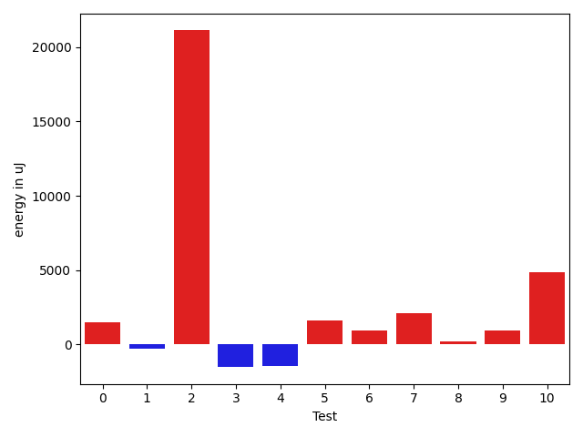

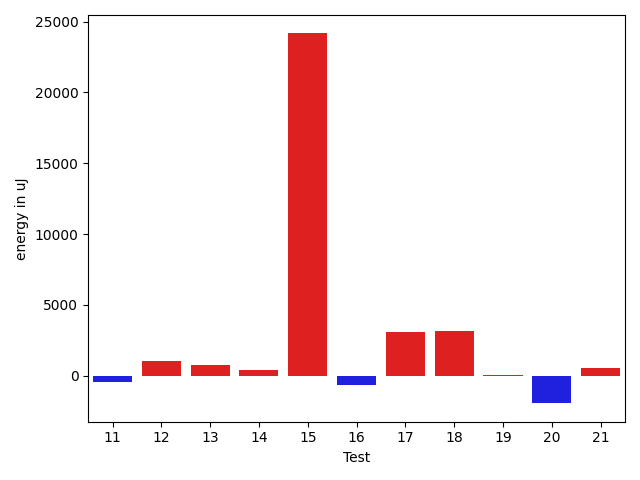

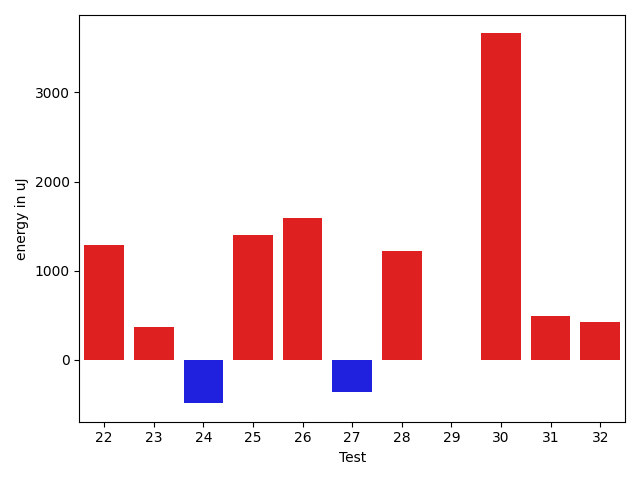

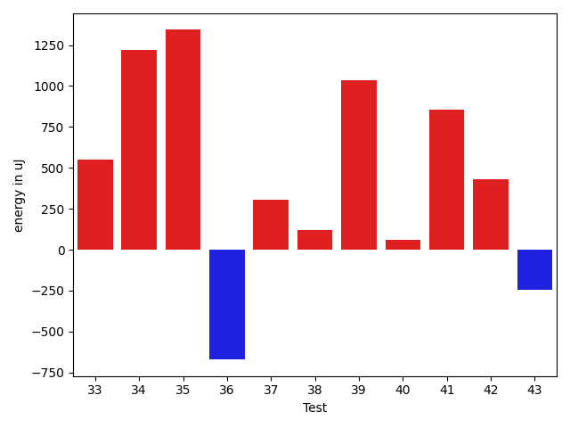

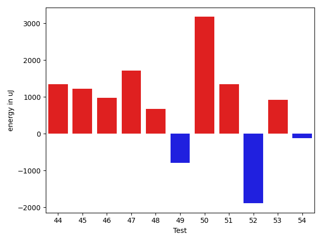

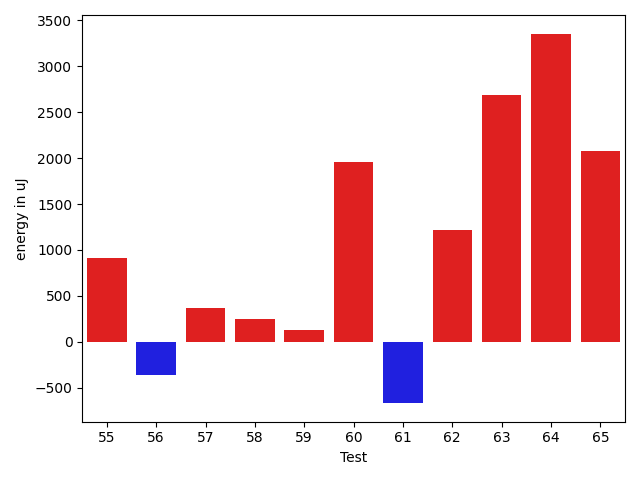

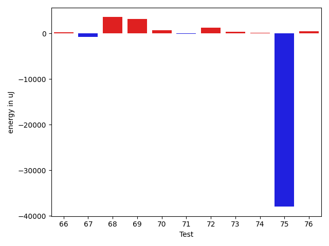

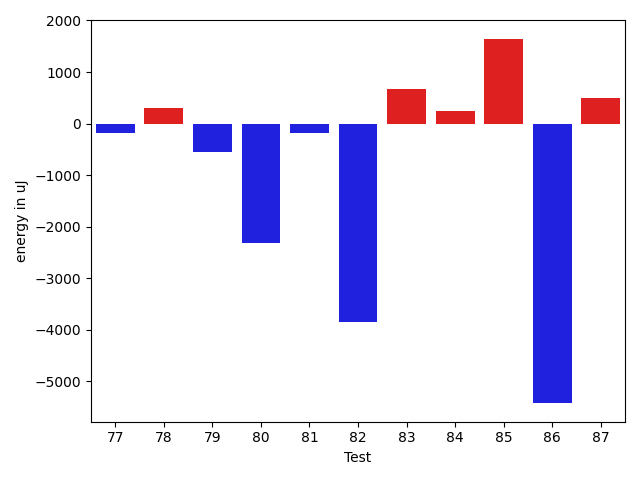

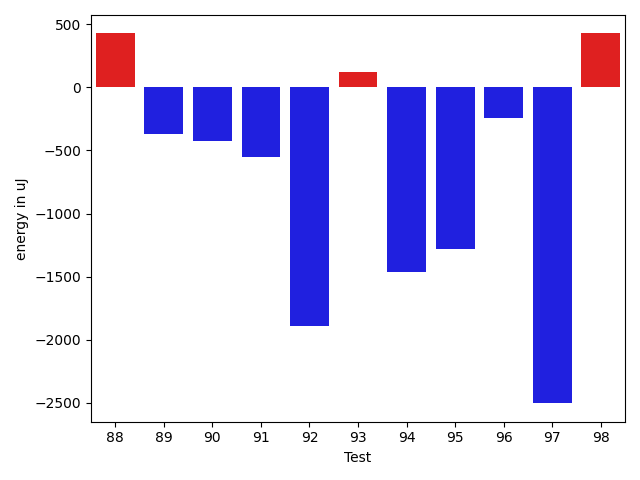

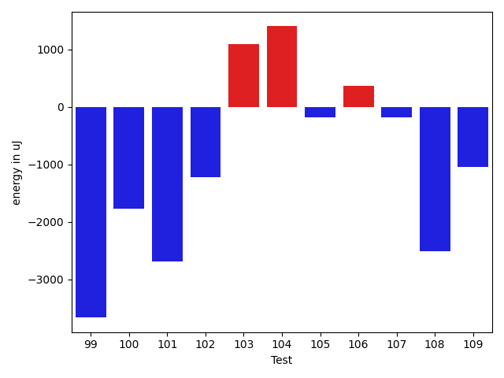

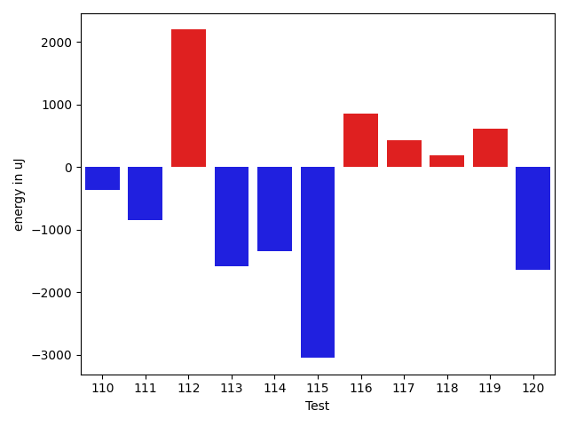

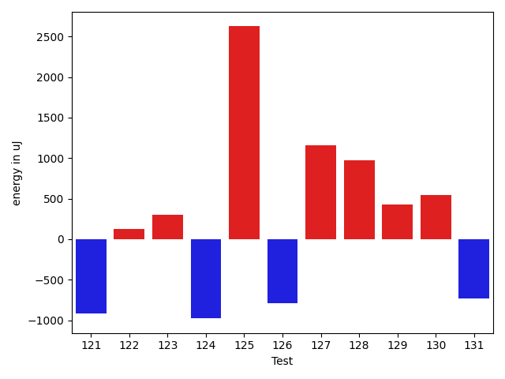

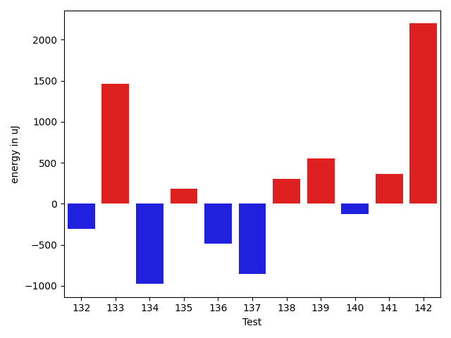

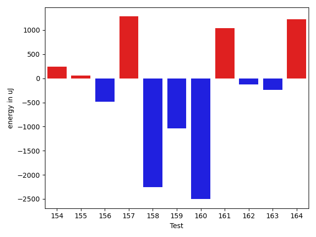

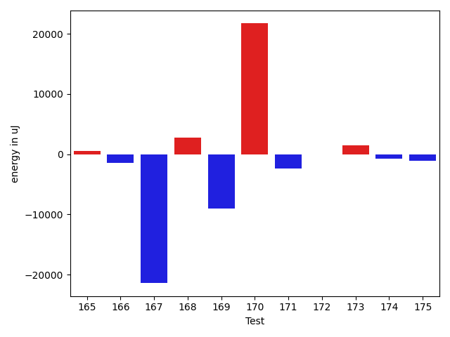

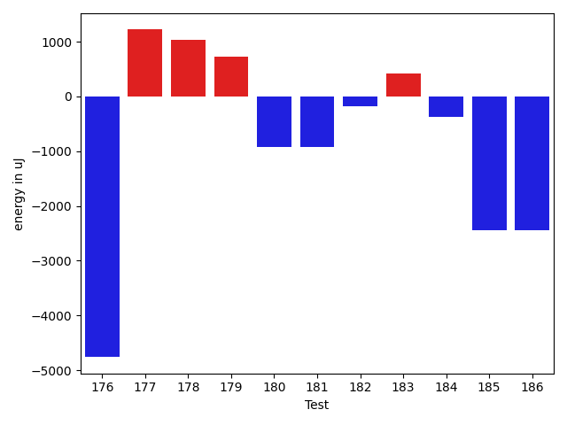

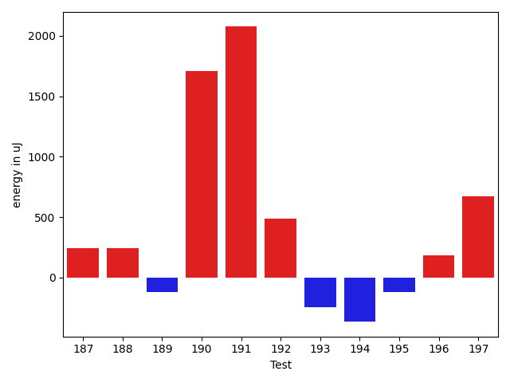

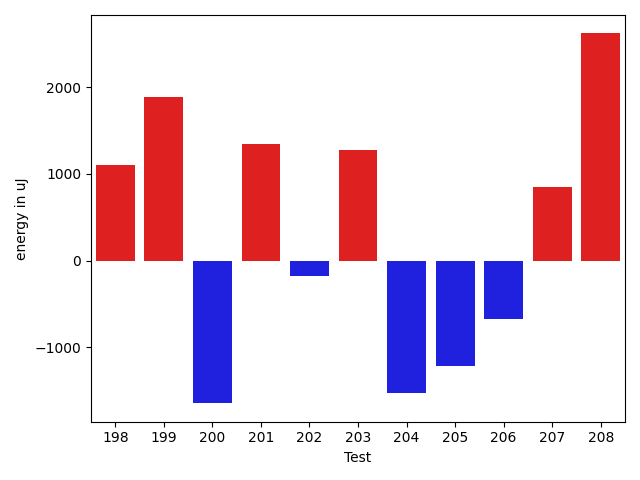

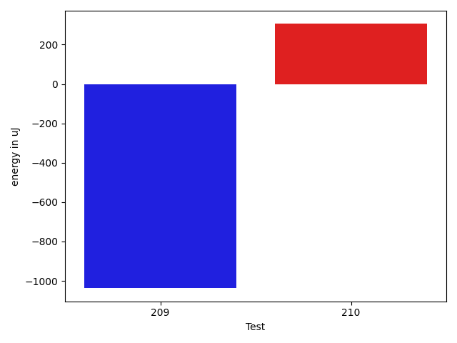

| ID | EnergyV1 | EnergyV2 | DeltaEnergy | σV1 | σV2 |
| --- | --- | --- | --- | --- | --- |
| 0 | 33692 | 35156 | 1464 | 3610.3819443309067 | 3962.850627383903 |
| 1 | 33996 | 33692 | -304 | 3191.621246898624 | 35690.78143473629 |
| 2 | 45471 | 66590 | 21119 | 30701.79027635322 | 39445.760740048405 |
| 3 | 33814 | 32288 | -1526 | 4999.503277034251 | 5290.454136612471 |
| 4 | 34546 | 33081 | -1465 | 33599.79411712918 | 3168.923741422887 |
| 5 | 33142 | 34729 | 1587 | 3489.3318912794753 | 3593.0929262766786 |
| 6 | 33448 | 34363 | 915 | 3717.6254327224374 | 3004.904806212425 |
| 7 | 33692 | 35767 | 2075 | 3807.5930191362363 | 30452.796299849215 |
| 8 | 32898 | 33081 | 183 | 3429.339701094955 | 3640.2770171309103 |
| 9 | 34363 | 35278 | 915 | 10087.585484681134 | 9722.819385656288 |
| 10 | 74340 | 79223 | 4883 | 41081.03031830717 | 42567.09099611631 |
| 11 | 34729 | 34301 | -428 | 3037.7061272250908 | 8581.88209914352 |
| 12 | 34790 | 35828 | 1038 | 26408.131050685733 | 4052.9086120571574 |
| 13 | 33448 | 34180 | 732 | 7405.959472283989 | 26505.46781900669 |
| 14 | 32898 | 33326 | 428 | 2767.039024969913 | 20184.23290999514 |
| 15 | 41504 | 65673 | 24169 | 25468.90904422024 | 28114.474054231418 |
| 16 | 33569 | 32898 | -671 | 9438.77652831838 | 7675.624500641219 |
| 17 | 31983 | 35095 | 3112 | 2630.9596672433345 | 3660.618736933701 |
| 18 | 33936 | 37109 | 3173 | 4613.6859058409145 | 4801.095596160254 |
| 19 | 33081 | 33142 | 61 | 3230.143092708897 | 3581.0436871071615 |
| 20 | 33875 | 31921 | -1954 | 7688.00071425595 | 3310.4321214948554 |
| 21 | 33936 | 34485 | 549 | 3779.2348987724477 | 3291.6504179255126 |
| 22 | 32898 | 34180 | 1282 | 19714.19809024652 | 3723.986836711429 |
| 23 | 34973 | 35339 | 366 | 2965.037888761002 | 4015.8476211807647 |
| 24 | 34485 | 33996 | -489 | 3470.893146965824 | 3191.077246880049 |
| 25 | 36438 | 37842 | 1404 | 75645.9321647509 | 133967.16968860096 |
| 26 | 35888 | 37475 | 1587 | 12727.680340453458 | 12905.815481870082 |
| 27 | 34790 | 34424 | -366 | 2753.5487831568353 | 3399.9182202401557 |
| 28 | 33813 | 35034 | 1221 | 3162.2149745271854 | 22825.853997237642 |
| 29 | 33142 | 33142 | 0 | 2522.235114229167 | 3734.9134638652245 |
| 30 | 33020 | 36682 | 3662 | 8344.541456844709 | 4071.6557039949976 |
| 31 | 34119 | 34607 | 488 | 3524.336974051526 | 3719.0182073100764 |
| 32 | 34851 | 35278 | 427 | 3835.5530732409266 | 4391.530173660752 |
| 33 | 34118 | 34668 | 550 | 3081.8426531685373 | 3021.4747161818705 |
| 34 | 33019 | 34240 | 1221 | 3796.6377124568235 | 3458.664893744727 |
| 35 | 34424 | 35767 | 1343 | 10185.145973673976 | 10053.204644415631 |
| 36 | 33935 | 33264 | -671 | 6598.564181974753 | 7763.972510258077 |
| 37 | 35034 | 35339 | 305 | 54345.853887151316 | 4360.832840109215 |
| 38 | 33020 | 33142 | 122 | 3129.5410600497635 | 2641.702240151903 |
| 39 | 33569 | 34606 | 1037 | 3644.596366218496 | 43858.0711875012 |
| 40 | 33569 | 33631 | 62 | 3697.2775998334387 | 2720.9904095005095 |
| 41 | 34546 | 35401 | 855 | 3126.109997926465 | 2888.740785792315 |
| 42 | 35095 | 35523 | 428 | 3312.0214095863416 | 3851.777461354301 |
| 43 | 36804 | 36560 | -244 | 25932.314503485497 | 17915.32237625679 |
| 44 | 36987 | 38330 | 1343 | 416384.48953102576 | 258481.79394875118 |
| 45 | 34973 | 36194 | 1221 | 3578.6450405328746 | 4104.8345590741665 |
| 46 | 63416 | 64392 | 976 | 21534.97391802544 | 20247.157931956768 |
| 47 | 34789 | 36499 | 1710 | 8208.401884137129 | 24183.69837337725 |
| 48 | 33997 | 34668 | 671 | 3766.442575926932 | 3422.6723024558337 |
| 49 | 37475 | 36682 | -793 | 55725.18812831161 | 33987.81782671067 |
| 50 | 33081 | 36255 | 3174 | 3512.9704515822486 | 5405.479901546566 |
| 51 | 38208 | 39551 | 1343 | 18994.507161791167 | 21717.00556147402 |
| 52 | 35278 | 33386 | -1892 | 3455.4060032738466 | 3534.8050666727013 |
| 53 | 33509 | 34424 | 915 | 30570.428652103215 | 3961.225127406924 |
| 54 | 34729 | 34607 | -122 | 4319.209729510712 | 3241.3439042402697 |
| 55 | 35461 | 36376 | 915 | 29241.692517430496 | 3833.437649228994 |
| 56 | 37720 | 37353 | -367 | 105582.02589444738 | 110936.50023049064 |
| 57 | 35156 | 35522 | 366 | 3395.572961088014 | 29610.149787919177 |
| 58 | 32348 | 32593 | 245 | 2442.5968251023337 | 5249.484914590394 |
| 59 | 34668 | 34790 | 122 | 47413.495058262575 | 3673.191424777036 |
| 60 | 34485 | 36438 | 1953 | 3349.5421949209053 | 3128.7460552298494 |
| 61 | 35461 | 34790 | -671 | 4110.075300818108 | 3769.0291842509705 |
| 62 | 33264 | 34484 | 1220 | 4863.1836454682825 | 38670.76020727173 |
| 63 | 34058 | 36743 | 2685 | 37433.96387092668 | 4449.734287463122 |
| 64 | 34240 | 37598 | 3358 | 3734.980622290949 | 5126.567686381948 |
| 65 | 80566 | 82642 | 2076 | 70546.22989716315 | 90263.9958991404 |
| 66 | 35218 | 35461 | 243 | 4135.577118152802 | 4027.502703705534 |
| 67 | 37109 | 36316 | -793 | 4876.121517107628 | 4545.011558437067 |
| 68 | 34729 | 38269 | 3540 | 3998.61967737156 | 4827.756918008093 |
| 69 | 35827 | 38940 | 3113 | 13652.689764784694 | 15147.176562133436 |
| 70 | 35828 | 36560 | 732 | 55216.778744017334 | 64770.23107420008 |
| 71 | 34301 | 34179 | -122 | 3216.738565505587 | 3182.113568888785 |
| 72 | 33508 | 34790 | 1282 | 9829.965649849926 | 10464.396292772382 |
| 73 | 33386 | 33691 | 305 | 5594.825223924822 | 10751.49041093085 |
| 74 | 34363 | 34485 | 122 | 9208.579997804702 | 9146.050131558388 |
| 75 | 109801 | 71838 | -37963 | 99638.66626416738 | 83990.06596813664 |
| 76 | 33752 | 34240 | 488 | 10368.870382759289 | 8677.108204707121 |
| 77 | 74646 | 74462 | -184 | 26842.78377253268 | 26695.44226052856 |
| 78 | 33935 | 34240 | 305 | 13489.593482735936 | 12873.285535273697 |
| 79 | 36010 | 35462 | -548 | 80894.35240031089 | 73214.98248952487 |
| 80 | 62805 | 60486 | -2319 | 24870.991235075508 | 64608.14068571559 |
| 81 | 34729 | 34546 | -183 | 15938.65719847563 | 12120.613897433474 |
| 82 | 41260 | 37415 | -3845 | 46090.56276439429 | 43074.19377733456 |
| 83 | 33447 | 34119 | 672 | 9456.393802156985 | 59019.668265626504 |
| 84 | 33813 | 34058 | 245 | 9469.366417672496 | 8588.522367424477 |
| 85 | 79956 | 81604 | 1648 | 369076.9615571314 | 286573.0367771931 |
| 86 | 75501 | 70068 | -5433 | 60823.973508038755 | 51029.241125700784 |
| 87 | 35888 | 36377 | 489 | 52105.121657785465 | 46453.354764493066 |
| 88 | 33692 | 34119 | 427 | 5895.655625495597 | 3770.127273470124 |
| 89 | 33874 | 33508 | -366 | 4002.1988077870583 | 3748.9068447498457 |
| 90 | 35095 | 34668 | -427 | 9952.839256509329 | 4433.532571964107 |
| 91 | 33203 | 32654 | -549 | 4350.714071152817 | 27410.772589865708 |
| 92 | 60607 | 58716 | -1891 | 19727.702525356406 | 33207.03275195461 |
| 93 | 33814 | 33936 | 122 | 3185.595381983761 | 6137.698292852771 |
| 94 | 64453 | 62988 | -1465 | 19903.118440872655 | 16135.558719764253 |
| 95 | 34912 | 33630 | -1282 | 2626.036048058441 | 4323.471550633236 |
| 96 | 34851 | 34607 | -244 | 3931.748438632786 | 3874.79989646618 |
| 97 | 34790 | 32287 | -2503 | 4002.9786150300056 | 2939.344199134843 |
| 98 | 33264 | 33691 | 427 | 3800.3533487368118 | 35785.24688227818 |
| 99 | 34667 | 31006 | -3661 | 3530.1767256450084 | 3798.838393885313 |
| 100 | 34546 | 32775 | -1771 | 4361.26697005824 | 3329.169210871593 |
| 101 | 36133 | 33447 | -2686 | 2881.8910890481184 | 3389.807958586113 |
| 102 | 34424 | 33203 | -1221 | 2775.016147897837 | 3588.3029683314794 |
| 103 | 33997 | 35095 | 1098 | 3961.5462445237213 | 4149.226405583684 |
| 104 | 32715 | 34119 | 1404 | 3753.682243828554 | 3970.5413218966623 |
| 105 | 35217 | 35034 | -183 | 4580.770316684179 | 4034.090431482046 |
| 106 | 33142 | 33508 | 366 | 3505.3096039438706 | 2736.792051574985 |
| 107 | 34302 | 34119 | -183 | 3628.3070052033304 | 2378.7669877947737 |
| 108 | 35400 | 32897 | -2503 | 4247.074306667074 | 39626.00654635955 |
| 109 | 34484 | 33447 | -1037 | 3264.2450018952254 | 3607.9085811931145 |
| 110 | 33874 | 33508 | -366 | 3407.504203959256 | 2963.528959670556 |
| 111 | 34851 | 33996 | -855 | 4118.704287920883 | 3545.921516333942 |
| 112 | 32776 | 34973 | 2197 | 3502.239948603804 | 2779.6485761873914 |
| 113 | 35095 | 33509 | -1586 | 3739.2709829891933 | 38621.968489525716 |
| 114 | 38025 | 36682 | -1343 | 111971.9995294747 | 84197.19283524761 |
| 115 | 34912 | 31860 | -3052 | 4484.069027780286 | 3977.6271076368394 |
| 116 | 32593 | 33448 | 855 | 3148.9521644623346 | 4085.5145512848594 |
| 117 | 33387 | 33814 | 427 | 3039.946965477062 | 3458.9931293854575 |
| 118 | 33508 | 33691 | 183 | 2912.580675277511 | 3276.521872389518 |
| 119 | 33081 | 33691 | 610 | 2364.4651549844843 | 4294.837722338818 |
| 120 | 37536 | 35888 | -1648 | 49033.33117773869 | 39209.29223697939 |
| 121 | 36560 | 35644 | -916 | 3817.6762233794097 | 3053.003100816268 |
| 122 | 32836 | 32959 | 123 | 35234.476277502865 | 23979.546861156192 |
| 123 | 34729 | 35034 | 305 | 5262.080541839783 | 3693.265628941027 |
| 124 | 36254 | 35278 | -976 | 5056.817555492863 | 4633.565302226786 |
| 125 | 140076 | 142700 | 2624 | 37613.533891143634 | 31863.68739401701 |
| 126 | 39306 | 38513 | -793 | 28664.721265272965 | 23479.193491898113 |
| 127 | 30822 | 31982 | 1160 | 3147.40714314022 | 3991.713690823593 |
| 128 | 33020 | 33996 | 976 | 6355.540781408193 | 3912.212116250634 |
| 129 | 34301 | 34729 | 428 | 4061.7726289884813 | 3567.3959053425156 |
| 130 | 36621 | 37171 | 550 | 71517.13612215039 | 67919.4814876015 |
| 131 | 33631 | 32898 | -733 | 3271.0586465438014 | 3850.601541023411 |
| 132 | 32775 | 32471 | -304 | 4283.058295303647 | 4389.898228869753 |
| 133 | 33447 | 34912 | 1465 | 2801.139905615807 | 4100.104091190095 |
| 134 | 33386 | 32409 | -977 | 3225.7485912840325 | 3910.152278943211 |
| 135 | 33570 | 33752 | 182 | 3724.4726755197653 | 24412.366131264975 |
| 136 | 35278 | 34790 | -488 | 4228.993787841264 | 4316.5117117905165 |
| 137 | 32898 | 32043 | -855 | 4052.830848018834 | 4010.048111096148 |
| 138 | 33447 | 33752 | 305 | 3675.0482517774594 | 4426.695299731693 |
| 139 | 33447 | 33996 | 549 | 3641.079037943784 | 4569.97994165093 |
| 140 | 33386 | 33264 | -122 | 3272.3395090091462 | 4038.0804613943874 |
| 141 | 37536 | 37903 | 367 | 48023.490803913875 | 58526.95959624287 |
| 142 | 34607 | 36804 | 2197 | 4462.085869361497 | 42459.01511737218 |
| 143 | 34790 | 36560 | 1770 | 3860.31796987709 | 5015.786436664872 |
| 144 | 36133 | 34546 | -1587 | 26817.06020523168 | 4408.713136164347 |
| 145 | 35218 | 35767 | 549 | 4446.502589684781 | 2921.0963182265523 |
| 146 | 35034 | 36193 | 1159 | 3722.8282377964247 | 3843.8494714377125 |
| 147 | 34851 | 36316 | 1465 | 3954.2953221126545 | 4180.482216658698 |
| 148 | 38025 | 35095 | -2930 | 29947.997653784372 | 11081.534239863233 |
| 149 | 34485 | 35827 | 1342 | 3781.402950693063 | 233577.3949754271 |
| 150 | 34851 | 36926 | 2075 | 4862.308498917088 | 7112.941411785985 |
| 151 | 37414 | 37048 | -366 | 29299.27830116938 | 24138.512239711126 |
| 152 | 38025 | 38513 | 488 | 64242.66236548897 | 51564.160712911886 |
| 153 | 34485 | 33996 | -489 | 10340.55361938688 | 55923.76871202975 |
| 154 | 36011 | 36254 | 243 | 32490.13075388103 | 57552.75847535937 |
| 155 | 35278 | 35339 | 61 | 6839.190952956275 | 3770.9734100340293 |
| 156 | 34668 | 34180 | -488 | 4333.306723497901 | 7052.082751536704 |
| 157 | 33142 | 34423 | 1281 | 3656.318714827798 | 6123.111320635773 |
| 158 | 37475 | 35217 | -2258 | 42527.34451416376 | 36766.315274792825 |
| 159 | 35278 | 34240 | -1038 | 3770.8076704749424 | 3882.1691057391554 |
| 160 | 38269 | 35766 | -2503 | 57789.20538952582 | 88305.60851564653 |
| 161 | 34058 | 35095 | 1037 | 10372.094770549304 | 9110.88582637455 |
| 162 | 33874 | 33752 | -122 | 3578.717347720449 | 3944.0384599118565 |
| 163 | 34057 | 33814 | -243 | 3505.4710701022977 | 3478.261326849125 |
| 164 | 34241 | 35462 | 1221 | 3811.846660656683 | 3565.73928431258 |
| 165 | 33081 | 33631 | 550 | 2985.5991228374864 | 24086.143327023732 |
| 166 | 35339 | 33874 | -1465 | 3454.7710368647827 | 3954.8300422677007 |
| 167 | 65429 | 44006 | -21423 | 59074.91639706684 | 79264.95682227904 |
| 168 | 243835 | 246642 | 2807 | 68391.38916330595 | 78517.79431653203 |
| 169 | 342955 | 333922 | -9033 | 104984.76082240924 | 94518.39406475304 |
| 170 | 44312 | 66040 | 21728 | 46698.22671912003 | 55698.179565789804 |
| 171 | 38147 | 35766 | -2381 | 44163.34040806949 | 9776.648972146206 |
| 172 | 37475 | 37414 | -61 | 43311.74893281643 | 30906.50623277223 |
| 173 | 35095 | 36560 | 1465 | 25175.571277979416 | 31873.50315899624 |
| 174 | 35401 | 34668 | -733 | 3645.8504971496805 | 4171.991041042322 |
| 175 | 35644 | 34607 | -1037 | 4745.911760269496 | 6953.069194140517 |
| 176 | 40161 | 35401 | -4760 | 67070.47147961563 | 27983.856543133345 |
| 177 | 33508 | 34729 | 1221 | 3183.757563355323 | 44450.29657398594 |
| 178 | 34546 | 35584 | 1038 | 52706.19595084979 | 5353.777444597038 |
| 179 | 35462 | 36194 | 732 | 8159.545410472054 | 9807.571861116496 |
| 180 | 35705 | 34790 | -915 | 3737.3480715642063 | 3441.2085903042075 |
| 181 | 36621 | 35705 | -916 | 4052.3913537063213 | 3311.2931408232057 |
| 182 | 36011 | 35827 | -184 | 51395.45048944141 | 56640.291172015815 |
| 183 | 125243 | 125671 | 428 | 315916.0167757913 | 329798.0949731091 |
| 184 | 34790 | 34424 | -366 | 11393.454583541472 | 7069.171887533276 |
| 185 | 37963 | 35523 | -2440 | 50773.46907218398 | 40446.61931999313 |
| 186 | 39245 | 36804 | -2441 | 88650.94683883301 | 56832.57468863583 |
| 187 | 36988 | 37232 | 244 | 9403.307805129243 | 7452.688282436123 |
| 188 | 34912 | 35156 | 244 | 5157.797591263016 | 4353.693258333013 |
| 189 | 35400 | 35279 | -121 | 4378.465391617887 | 3652.8652108843116 |
| 190 | 37292 | 39001 | 1709 | 26433.09300431976 | 22951.38202702873 |
| 191 | 69030 | 71106 | 2076 | 24747.048547655504 | 24646.488196238126 |
| 192 | 37292 | 37781 | 489 | 68005.47861397077 | 63477.001632974134 |
| 193 | 71655 | 71411 | -244 | 208587.34883806622 | 67723.39331389545 |
| 194 | 36010 | 35645 | -365 | 250189.38522515853 | 37897.74801576826 |
| 195 | 36743 | 36621 | -122 | 10149.795073118301 | 9401.91095758309 |
| 196 | 36133 | 36316 | 183 | 3420.3399376882985 | 7538.184466389083 |
| 197 | 36072 | 36743 | 671 | 192517.8443259711 | 3617.991508037008 |
| 198 | 35583 | 36682 | 1099 | 300862.7130455967 | 215908.25997857048 |
| 199 | 35584 | 37476 | 1892 | 208810.28185017238 | 264897.01143433084 |
| 200 | 37354 | 35705 | -1649 | 14310.45865640222 | 9841.429367729059 |
| 201 | 39001 | 40344 | 1343 | 31951.66865166756 | 44860.712440420866 |
| 202 | 35950 | 35767 | -183 | 29909.424955788618 | 3942.064201861147 |
| 203 | 36438 | 37720 | 1282 | 57883.415757458926 | 57578.58238562692 |
| 204 | 36377 | 34851 | -1526 | 4553.5164645258865 | 4446.391301622346 |
| 205 | 37903 | 36682 | -1221 | 43963.8335496047 | 46483.2025801857 |
| 206 | 38208 | 37537 | -671 | 48397.648287230266 | 47218.957787722364 |
| 207 | 37110 | 37964 | 854 | 126073.0058384056 | 114364.69500236677 |
| 208 | 37171 | 39794 | 2623 | 393053.6367282136 | 579454.5339526224 |
| 209 | 37353 | 36316 | -1037 | 63170.417675206176 | 54649.43282568951 |
| 210 | 37170 | 37475 | 305 | 45058.42754745098 | 26013.3541831191 |

## Delta Duration per test method

| ID | DurationV1 | DurationsV2 | DeltaDuration |
| --- | --- | --- | --- |
| 0 | 990122.6388888889 | 1012891.8571428572 | 22769.218253968284 |
| 1 | 511933.3333333333 | 880938.3103448276 | 369004.9770114943 |
| 2 | 1999204.4895833333 | 2244845.3092783503 | 245640.81969501707 |
| 3 | 823428.7346938775 | 1011926.2 | 188497.46530612244 |
| 4 | 722208.4285714285 | 599037.9310344828 | -123170.49753694574 |
| 5 | 418104.3 | 489398.1818181818 | 71293.88181818184 |
| 6 | 545933.8055555555 | 572444.7272727273 | 26510.92171717179 |
| 7 | 595178.85 | 846519.3703703703 | 251340.52037037036 |
| 8 | 660584.4693877551 | 703117.1463414634 | 42532.67695370829 |
| 9 | 1245702.2435897435 | 1168081.5 | -77620.7435897435 |
| 10 | 2931872.4444444445 | 3020066.474747475 | 88194.03030303027 |
| 11 | 931952.828125 | 999760.08 | 67807.25187499996 |
| 12 | 838673.1111111111 | 761938.0 | -76735.11111111112 |
| 13 | 814966.5344827586 | 1018982.3620689656 | 204015.82758620696 |
| 14 | 490842.85185185185 | 647729.125 | 156886.27314814815 |
| 15 | 1790748.2613636365 | 1973406.6559139786 | 182658.3945503421 |
| 16 | 1109394.9189189188 | 1140133.2875 | 30738.368581081275 |
| 17 | 435393.6818181818 | 454223.86363636365 | 18830.181818181823 |
| 18 | 479984.5 | 487040.0 | 7055.5 |
| 19 | 534772.3 | 551253.3783783783 | 16481.078378378297 |
| 20 | 518334.2 | 444375.8947368421 | -73958.30526315793 |
| 21 | 637767.7446808511 | 621971.0 | -15796.744680851116 |
| 22 | 934653.25 | 906262.65 | -28390.599999999977 |
| 23 | 679123.2051282051 | 611927.1111111111 | -67196.094017094 |
| 24 | 564031.5 | 598173.9666666667 | 34142.466666666674 |
| 25 | 1568166.2325581396 | 2907401.68 | 1339235.4474418606 |
| 26 | 808876.8888888889 | 973116.8421052631 | 164239.95321637427 |
| 27 | 665966.9714285714 | 730805.2777777778 | 64838.30634920637 |
| 28 | 807812.7272727273 | 1042958.9333333333 | 235146.20606060605 |
| 29 | 611352.5555555555 | 593054.4166666666 | -18298.138888888876 |
| 30 | 693132.65625 | 762869.96875 | 69737.3125 |
| 31 | 451017.4666666667 | 487037.09523809527 | 36019.62857142859 |
| 32 | 754990.3783783783 | 763895.1333333333 | 8904.754954954959 |
| 33 | 610335.3666666667 | 739686.7105263158 | 129351.34385964915 |
| 34 | 717306.4054054054 | 843738.4375 | 126432.03209459456 |
| 35 | 1159419.582278481 | 1225055.725 | 65636.1427215191 |
| 36 | 1044748.918367347 | 1029755.2807017544 | -14993.6376655926 |
| 37 | 990068.9696969697 | 591033.35 | -399035.61969696975 |
| 38 | 444263.0 | 506788.09523809527 | 62525.095238095266 |
| 39 | 647617.3428571429 | 1207501.243902439 | 559883.9010452961 |
| 40 | 773855.1538461539 | 800155.9583333334 | 26300.8044871795 |
| 41 | 380570.72222222225 | 400404.4 | 19833.677777777775 |
| 42 | 805076.425925926 | 789695.074074074 | -15381.351851851912 |
| 43 | 1270848.1904761905 | 1166165.3076923077 | -104682.88278388279 |
| 44 | 5499714.7164179105 | 2588869.372881356 | -2910845.3435365544 |
| 45 | 904860.9402985075 | 924530.4444444445 | 19669.50414593704 |
| 46 | 1903664.4545454546 | 1914329.383838384 | 10664.929292929359 |
| 47 | 1041635.4848484849 | 1090167.1911764706 | 48531.70632798574 |
| 48 | 975167.4714285714 | 946734.2857142857 | -28433.185714285704 |
| 49 | 1638420.196969697 | 1128343.7272727273 | -510076.4696969697 |
| 50 | 462197.962962963 | 646694.5757575758 | 184496.61279461283 |
| 51 | 1182411.9375 | 1045398.5294117647 | -137013.4080882353 |
| 52 | 542696.09375 | 509015.5625 | -33680.53125 |
| 53 | 678220.4 | 439351.55 | -238868.85000000003 |
| 54 | 427642.9166666667 | 397898.75 | -29744.166666666686 |
| 55 | 875284.1851851852 | 698150.6842105263 | -177133.50097465888 |
| 56 | 2267967.552631579 | 2484119.3125 | 216151.75986842113 |
| 57 | 498008.36842105264 | 645687.6428571428 | 147679.2744360902 |
| 58 | 445383.71428571426 | 478581.5294117647 | 33197.81512605044 |
| 59 | 797561.8947368421 | 512456.1666666667 | -285105.72807017545 |
| 60 | 387998.2 | 409378.94736842107 | 21380.747368421056 |
| 61 | 492626.6666666667 | 695678.4545454546 | 203051.7878787879 |
| 62 | 421674.35294117645 | 687089.8947368421 | 265415.5417956657 |
| 63 | 807007.0 | 438290.04761904763 | -368716.95238095237 |
| 64 | 398592.5333333333 | 388623.9166666667 | -9968.61666666664 |
| 65 | 3301134.98989899 | 3595457.232323232 | 294322.2424242422 |
| 66 | 657146.804347826 | 688507.1304347826 | 31360.326086956542 |
| 67 | 497167.8 | 515091.60714285716 | 17923.80714285717 |
| 68 | 513103.04761904763 | 469024.625 | -44078.42261904763 |
| 69 | 987616.8490566037 | 1088809.4888888889 | 101192.63983228512 |
| 70 | 1367479.0 | 1485172.0 | 117693.0 |
| 71 | 831669.2931034482 | 834425.5714285715 | 2756.2783251232468 |
| 72 | 1322613.4361702127 | 1275512.494736842 | -47100.94143337058 |
| 73 | 1092558.861111111 | 1129326.985915493 | 36768.12480438198 |
| 74 | 1275104.7608695652 | 1266074.0326086956 | -9030.728260869626 |
| 75 | 4689522.132653061 | 3117483.56122449 | -1572038.5714285714 |
| 76 | 1354820.1477272727 | 1264271.4456521738 | -90548.70207509887 |
| 77 | 2652916.618556701 | 2612288.6326530613 | -40627.98590363981 |
| 78 | 1357023.8865979381 | 1346118.305263158 | -10905.581334780203 |
| 79 | 2331426.476744186 | 2117861.4725274723 | -213565.00421671383 |
| 80 | 2052475.393939394 | 2179325.5656565656 | 126850.17171717156 |
| 81 | 1369061.4352941175 | 1321487.0588235294 | -47574.37647058815 |
| 82 | 2281608.3608247424 | 2192279.9693877553 | -89328.39143698709 |
| 83 | 1262343.6666666667 | 1495339.0736842104 | 232995.40701754368 |
| 84 | 1232746.5681818181 | 1207670.4606741574 | -25076.107507660752 |
| 85 | 5485219.808080808 | 4479292.414141414 | -1005927.3939393945 |
| 86 | 2985076.282828283 | 2649462.292929293 | -335613.9898989899 |
| 87 | 1464559.7045454546 | 1201326.5238095238 | -263233.1807359308 |
| 88 | 675807.0512820513 | 600877.2142857143 | -74929.83699633693 |
| 89 | 494346.4285714286 | 551360.4642857143 | 57014.03571428574 |
| 90 | 914217.6097560975 | 775518.2 | -138699.4097560976 |
| 91 | 757177.7446808511 | 933430.5333333333 | 176252.7886524822 |
| 92 | 1841846.9310344828 | 1721868.177419355 | -119978.75361512788 |
| 93 | 855988.6078431372 | 894641.7234042553 | 38653.11556111812 |
| 94 | 1864671.8545454545 | 1849454.4130434783 | -15217.441501976224 |
| 95 | 590295.6774193548 | 527380.3235294118 | -62915.353889942984 |
| 96 | 888419.3555555556 | 838937.0 | -49482.35555555555 |
| 97 | 455333.8823529412 | 406024.7037037037 | -49309.178649237496 |
| 98 | 592284.7857142857 | 782777.04 | 190492.25428571436 |
| 99 | 461693.7619047619 | 427888.14285714284 | -33805.61904761905 |
| 100 | 554532.1304347826 | 523200.73076923075 | -31331.399665551842 |
| 101 | 396141.9411764706 | 411026.8125 | 14884.871323529398 |
| 102 | 607633.5 | 550197.7674418605 | -57435.73255813948 |
| 103 | 511187.25 | 512540.0 | 1352.75 |
| 104 | 492804.8275862069 | 470695.9583333333 | -22108.869252873585 |
| 105 | 449398.0909090909 | 433713.6875 | -15684.403409090883 |
| 106 | 384299.1904761905 | 376796.23529411765 | -7502.955182072823 |
| 107 | 731684.8260869565 | 639537.4666666667 | -92147.35942028987 |
| 108 | 511167.6956521739 | 751847.8076923077 | 240680.11204013386 |
| 109 | 550759.7857142857 | 561154.5 | 10394.714285714319 |
| 110 | 675623.825 | 673682.7692307692 | -1941.0557692307048 |
| 111 | 501791.90476190473 | 467244.75 | -34547.154761904734 |
| 112 | 487102.28571428574 | 444977.1153846154 | -42125.17032967036 |
| 113 | 505811.6666666667 | 684301.0384615385 | 178489.3717948718 |
| 114 | 2786299.8571428573 | 1976341.8157894737 | -809958.0413533836 |
| 115 | 689624.46875 | 602770.4444444445 | -86854.0243055555 |
| 116 | 445637.0 | 435631.45454545453 | -10005.54545454547 |
| 117 | 511793.8620689655 | 490198.1666666667 | -21595.69540229882 |
| 118 | 483057.05 | 492248.1111111111 | 9191.061111111136 |
| 119 | 436973.6666666667 | 380793.5 | -56180.166666666686 |
| 120 | 1504528.5740740742 | 1191222.8076923077 | -313305.7663817664 |
| 121 | 749826.8181818182 | 510207.0 | -239619.81818181823 |
| 122 | 1230049.8101265824 | 1177976.8831168832 | -52072.92700969917 |
| 123 | 432830.8947368421 | 417550.23076923075 | -15280.663967611326 |
| 124 | 560571.3571428572 | 527415.4333333333 | -33155.92380952381 |
| 125 | 4747001.577319588 | 4510543.05050505 | -236458.52681453712 |
| 126 | 1803531.941860465 | 1684972.3793103448 | -118559.56255012029 |
| 127 | 783485.2045454546 | 657990.1304347826 | -125495.074110672 |
| 128 | 928761.3703703703 | 847663.5535714285 | -81097.81679894181 |
| 129 | 521218.48 | 455062.63636363635 | -66155.84363636363 |
| 130 | 1915007.294117647 | 1640214.75 | -274792.544117647 |
| 131 | 729225.2631578947 | 662539.7575757576 | -66685.50558213715 |
| 132 | 458923.25 | 465171.5789473684 | 6248.328947368427 |
| 133 | 569250.7916666666 | 540519.15625 | -28731.635416666628 |
| 134 | 787351.5714285715 | 707109.2954545454 | -80242.27597402607 |
| 135 | 1076954.078125 | 1035905.36 | -41048.718125000014 |
| 136 | 560971.08 | 585396.5277777778 | 24425.447777777794 |
| 137 | 523408.03571428574 | 476442.7727272727 | -46965.26298701303 |
| 138 | 707194.8787878788 | 596660.7666666667 | -110534.11212121206 |
| 139 | 483030.5882352941 | 443734.39285714284 | -39296.19537815126 |
| 140 | 645201.7666666667 | 555371.4838709678 | -89830.28279569896 |
| 141 | 1551370.64 | 1648807.6666666667 | 97437.02666666685 |
| 142 | 579749.8611111111 | 936038.7391304348 | 356288.8780193237 |
| 143 | 719005.3488372093 | 816735.5 | 97730.15116279072 |
| 144 | 747494.4285714285 | 808112.0303030303 | 60617.60173160175 |
| 145 | 607835.6363636364 | 604441.3103448276 | -3394.326018808759 |
| 146 | 740395.9814814815 | 716146.6341463415 | -24249.347335139988 |
| 147 | 778557.8301886793 | 733528.3260869565 | -45029.504101722734 |
| 148 | 837192.8484848485 | 762192.0645161291 | -75000.78396871942 |
| 149 | 597721.0714285715 | 2002697.3 | 1404976.2285714285 |
| 150 | 567346.5135135135 | 563302.2 | -4044.313513513538 |
| 151 | 1540379.0375 | 1360252.9523809524 | -180126.08511904767 |
| 152 | 1556620.7307692308 | 1168188.5 | -388432.23076923075 |
| 153 | 914523.9152542372 | 1220304.2916666667 | 305780.3764124295 |
| 154 | 1265989.1142857142 | 1690523.878787879 | 424534.7645021647 |
| 155 | 899866.9838709678 | 843968.8214285715 | -55898.16244239628 |
| 156 | 880639.109375 | 985470.921875 | 104831.8125 |
| 157 | 735248.66 | 936230.9682539683 | 200982.30825396825 |
| 158 | 1383490.1960784313 | 1341248.1836734693 | -42242.01240496198 |
| 159 | 478291.0 | 472550.5333333333 | -5740.466666666674 |
| 160 | 1571717.6515151516 | 2000552.6231884058 | 428834.97167325416 |
| 161 | 898444.0909090909 | 938463.6666666666 | 40019.57575757569 |
| 162 | 488911.14285714284 | 488953.3333333333 | 42.19047619047342 |
| 163 | 626529.2121212122 | 684534.2978723404 | 58005.08575112827 |
| 164 | 785845.7045454546 | 822038.925925926 | 36193.22138047137 |
| 165 | 717602.0256410256 | 825830.7209302326 | 108228.69528920692 |
| 166 | 602587.7692307692 | 687015.0681818182 | 84427.29895104899 |
| 167 | 2004464.8350515463 | 2503082.2708333335 | 498617.43578178715 |
| 168 | 7489707.080808081 | 7657631.212121212 | 167924.1313131312 |
| 169 | 10032445.636363637 | 10058814.303030303 | 26368.666666666046 |
| 170 | 2015823.494949495 | 2369792.5757575757 | 353969.08080808073 |
| 171 | 1129902.5 | 721693.5 | -408209.0 |
| 172 | 1437778.2653061224 | 1206887.0166666666 | -230891.24863945576 |
| 173 | 1362821.2266666666 | 1533588.3194444445 | 170767.09277777793 |
| 174 | 506615.0303030303 | 501973.4210526316 | -4641.609250398702 |
| 175 | 857487.1451612903 | 941399.703125 | 83912.5579637097 |
| 176 | 1492336.8636363635 | 938634.9 | -553701.9636363635 |
| 177 | 424908.0 | 870182.2857142857 | 445274.2857142857 |
| 178 | 820314.125 | 431727.4347826087 | -388586.6902173913 |
| 179 | 629940.25 | 537335.0869565217 | -92605.16304347827 |
| 180 | 411886.8333333333 | 406340.36363636365 | -5546.469696969667 |
| 181 | 467948.1875 | 521359.7272727273 | 53411.539772727294 |
| 182 | 1628262.12 | 1633665.0 | 5402.879999999888 |
| 183 | 6522442.303030303 | 6524727.444444444 | 2285.1414141412824 |
| 184 | 891429.8333333334 | 768758.8292682926 | -122671.00406504073 |
| 185 | 1632298.0625 | 1301751.8372093022 | -330546.22529069777 |
| 186 | 2050909.3461538462 | 1185140.6296296297 | -865768.7165242166 |
| 187 | 833176.619047619 | 594225.3913043478 | -238951.22774327127 |
| 188 | 480133.347826087 | 619114.2222222222 | 138980.87439613527 |
| 189 | 565808.947368421 | 441226.2 | -124582.747368421 |
| 190 | 1123722.4594594594 | 1372840.861111111 | 249118.4016516516 |
| 191 | 2234127.707070707 | 2188484.8080808083 | -45642.89898989862 |
| 192 | 1508481.2894736843 | 1710414.6046511629 | 201933.3151774786 |
| 193 | 3601995.6666666665 | 2830039.3232323234 | -771956.3434343431 |
| 194 | 2568180.15625 | 1400584.5238095238 | -1167595.6324404762 |
| 195 | 656212.6486486486 | 640427.4444444445 | -15785.204204204143 |
| 196 | 875793.6511627907 | 810451.282051282 | -65342.36911150871 |
| 197 | 1936104.9032258065 | 734094.4324324324 | -1202010.470793374 |
| 198 | 2786940.7027027025 | 2084556.2258064516 | -702384.4768962509 |
| 199 | 1991252.7777777778 | 2619156.6 | 627903.8222222223 |
| 200 | 988244.375 | 1067824.0 | 79579.625 |
| 201 | 1642128.7866666666 | 1797833.5873015872 | 155704.8006349206 |
| 202 | 893869.5 | 707519.693877551 | -186349.806122449 |
| 203 | 1620936.014084507 | 1944334.1641791044 | 323398.15009459737 |
| 204 | 645272.25 | 596077.5357142857 | -49194.71428571432 |
| 205 | 1358464.1754385964 | 1361481.1724137932 | 3016.9969751967583 |
| 206 | 1577184.6984126985 | 1508533.0869565217 | -68651.61145617673 |
| 207 | 2028622.8301886793 | 2552441.925 | 523819.09481132054 |
| 208 | 3982685.8260869565 | 6292483.337837838 | 2309797.511750881 |
| 209 | 1397446.725 | 1371070.3529411764 | -26376.372058823705 |
| 210 | 1124380.2666666666 | 903507.8 | -220872.46666666656 |

## Misc.

| ID | Test Class | Test Method |
| --- | --- | --- |
| 0 | com.google.gson.functional.ObjectTest | testDirectedAcyclicGraphDeserialization |
| 1 | com.google.gson.functional.ObjectTest | testEmptyCollectionInAnObjectDeserialization |
| 2 | com.google.gson.functional.ObjectTest | testDirectedAcyclicGraphSerialization |
| 3 | com.google.gson.functional.ObjectTest | testNestedSerialization |
| 4 | com.google.gson.functional.ObjectTest | testNullFieldsSerialization |
| 5 | com.google.gson.functional.ObjectTest | testClassWithNoFieldsDeserialization |
| 6 | com.google.gson.functional.ObjectTest | testPrivateNoArgConstructorDeserialization |
| 7 | com.google.gson.functional.ObjectTest | testClassWithTransientFieldsDeserializationTransientFieldsPassedInJsonAreIgnored |
| 8 | com.google.gson.functional.ObjectTest | testPrimitiveArrayInAnObjectDeserialization |
| 9 | com.google.gson.functional.ObjectTest | testArrayOfObjectsDeserialization |
| 10 | com.google.gson.functional.ObjectTest | testSubInterfacesOfCollectionSerialization |
| 11 | com.google.gson.functional.ObjectTest | testNestedDeserialization |
| 12 | com.google.gson.functional.ObjectTest | testNullFieldsDeserialization |
| 13 | com.google.gson.functional.ObjectTest | testArrayOfObjectsSerialization |
| 14 | com.google.gson.functional.ObjectTest | testNullObjectFieldsDeserialization |
| 15 | com.google.gson.functional.ObjectTest | testArrayOfArraysDeserialization |
| 16 | com.google.gson.functional.ObjectTest | testSubInterfacesOfCollectionDeserialization |
| 17 | com.google.gson.functional.ObjectTest | testPrimitiveArrayFieldSerialization |
| 18 | com.google.gson.functional.ObjectTest | testClassWithNoFieldsSerialization |
| 19 | com.google.gson.functional.ObjectTest | testNullArraysDeserialization |
| 20 | com.google.gson.functional.ObjectTest | testEmptyCollectionInAnObjectSerialization |
| 21 | com.google.gson.functional.ObjectTest | testClassWithEnumFieldDeserialization |
| 22 | com.google.gson.functional.ObjectTest | testClassWithObjectFieldSerialization |
| 23 | com.google.gson.functional.ObjectTest | testClassWithEnumFieldSerialization |
| 24 | com.google.gson.functional.ObjectTest | testTopLevelEnumDeserialization |
| 25 | com.google.gson.functional.ObjectTest | testJsonInSingleQuotesDeserialization |
| 26 | com.google.gson.functional.ObjectTest | testBagOfPrimitivesSerialization |
| 27 | com.google.gson.functional.ObjectTest | testJsonInMixedQuotesDeserialization |
| 28 | com.google.gson.functional.ObjectTest | testInheritenceSerialization |
| 29 | com.google.gson.functional.ObjectTest | testCircularSerialization |
| 30 | com.google.gson.functional.ObjectTest | testClassWithTransientFieldsSerialization |
| 31 | com.google.gson.functional.ObjectTest | testNullPrimitiveFieldsDeserialization |
| 32 | com.google.gson.functional.ObjectTest | testBagOfPrimitivesDeserialization |
| 33 | com.google.gson.functional.ObjectTest | testClassWithTransientFieldsDeserialization |
| 34 | com.google.gson.functional.ObjectTest | testInnerClassSerialization |
| 35 | com.google.gson.functional.ObjectTest | testArrayOfArraysSerialization |
| 36 | com.google.gson.functional.ObjectTest | testInheritenceDeserialization |
| 37 | com.google.gson.functional.ObjectTest | testBagOfPrimitiveWrappersDeserialization |
| 38 | com.google.gson.functional.ObjectTest | testSelfReferenceSerialization |
| 39 | com.google.gson.functional.ObjectTest | testBagOfPrimitiveWrappersSerialization |
| 40 | com.google.gson.functional.ObjectTest | testInnerClassDeserialization |
| 41 | com.google.gson.functional.ObjectTest | testTopLevelEnumSerialization |
| 42 | com.google.gson.functional.CustomTypeAdaptersTest | testCustomTypeAdapterAppliesToSubClassesSerializedAsBaseClass |
| 43 | com.google.gson.functional.CustomTypeAdaptersTest | testCustomNestedSerializers |
| 44 | com.google.gson.functional.CustomTypeAdaptersTest | testCustomSerializers |
| 45 | com.google.gson.functional.CustomTypeAdaptersTest | testCustomNestedDeserializers |
| 46 | com.google.gson.functional.CustomTypeAdaptersTest | testCustomTypeAdapterDoesNotAppliesToSubClasses |
| 47 | com.google.gson.functional.CustomTypeAdaptersTest | testCustomSerializerForLong |
| 48 | com.google.gson.functional.CustomTypeAdaptersTest | testCustomDeserializerForLong |
| 49 | com.google.gson.functional.CustomTypeAdaptersTest | testCustomDeserializers |
| 50 | com.google.gson.functional.StringTest | testEscapingQuotesInStringSerialization |
| 51 | com.google.gson.functional.StringTest | testStringValueAsSingleElementArraySerialization |
| 52 | com.google.gson.functional.StringTest | testSingleQuoteInStringSerialization |
| 53 | com.google.gson.functional.StringTest | testEscapedCtrlNInStringSerialization |
| 54 | com.google.gson.functional.StringTest | testEscapedBackslashInStringSerialization |
| 55 | com.google.gson.functional.StringTest | testStringValueAsSingleElementArrayDeserialization |
| 56 | com.google.gson.functional.StringTest | testEscapingQuotesInStringDeserialization |
| 57 | com.google.gson.functional.StringTest | testStringValueDeserialization |
| 58 | com.google.gson.functional.StringTest | testSingleQuoteInStringDeserialization |
| 59 | com.google.gson.functional.StringTest | testStringWithEscapedSlashDeserialization |
| 60 | com.google.gson.functional.StringTest | testEscapedBackslashInStringDeserialization |
| 61 | com.google.gson.functional.StringTest | testStringValueSerialization |
| 62 | com.google.gson.functional.StringTest | testEscapedCtrlRInStringDeserialization |
| 63 | com.google.gson.functional.StringTest | testEscapedCtrlNInStringDeserialization |
| 64 | com.google.gson.functional.StringTest | testEscapedCtrlRInStringSerialization |
| 65 | com.google.gson.functional.ExposeFieldsTest | testNullExposeFieldSerialization |
| 66 | com.google.gson.functional.ExposeFieldsTest | testNoExposedFieldDeserialization |
| 67 | com.google.gson.functional.ExposeFieldsTest | testNoExposedFieldSerialization |
| 68 | com.google.gson.functional.ExposeFieldsTest | testExposeAnnotationSerialization |
| 69 | com.google.gson.functional.ExposeFieldsTest | testArrayWithOneNullExposeFieldObjectSerialization |
| 70 | com.google.gson.functional.ExposeFieldsTest | testExposeAnnotationDeserialization |
| 71 | com.google.gson.functional.ParameterizedTypesTest | testParameterizedTypesWithWriterSerialization |
| 72 | com.google.gson.functional.ParameterizedTypesTest | testVariableTypeArrayDeserialization |
| 73 | com.google.gson.functional.ParameterizedTypesTest | testParameterizedTypeWithReaderDeserialization |
| 74 | com.google.gson.functional.ParameterizedTypesTest | testParameterizedTypeWithCustomSerializer |
| 75 | com.google.gson.functional.ParameterizedTypesTest | testParameterizedTypesSerialization |
| 76 | com.google.gson.functional.ParameterizedTypesTest | testVariableTypeDeserialization |
| 77 | com.google.gson.functional.ParameterizedTypesTest | testVariableTypeFieldsAndGenericArraysSerialization |
| 78 | com.google.gson.functional.ParameterizedTypesTest | testParameterizedTypeGenericArraysDeserialization |
| 79 | com.google.gson.functional.ParameterizedTypesTest | testParameterizedTypeDeserialization |
| 80 | com.google.gson.functional.ParameterizedTypesTest | testVariableTypeFieldsAndGenericArraysDeserialization |
| 81 | com.google.gson.functional.ParameterizedTypesTest | testTypesWithMultipleParametersDeserialization |
| 82 | com.google.gson.functional.ParameterizedTypesTest | testTypesWithMultipleParametersSerialization |
| 83 | com.google.gson.functional.ParameterizedTypesTest | testParameterizedTypeWithVariableTypeDeserialization |
| 84 | com.google.gson.functional.ParameterizedTypesTest | testParameterizedTypesWithCustomDeserializer |
| 85 | com.google.gson.functional.NamingPolicyTest | testGsonWithNonDefaultFieldNamingPolicySerialization |
| 86 | com.google.gson.functional.NamingPolicyTest | testGsonWithSerializedNameFieldNamingPolicySerialization |
| 87 | com.google.gson.functional.NamingPolicyTest | testGsonWithNonDefaultFieldNamingPolicyDeserialiation |
| 88 | com.google.gson.functional.NamingPolicyTest | testGsonWithSerializedNameFieldNamingPolicyDeserialization |
| 89 | com.google.gson.functional.PrimitiveTest | testPrimitiveDoubleAutoboxedInASingleElementArraySerialization |
| 90 | com.google.gson.functional.PrimitiveTest | testPrimitiveIntegerAutoboxedInASingleElementArraySerialization |
| 91 | com.google.gson.functional.PrimitiveTest | testPrimitiveDoubleAutoboxedDeserialization |
| 92 | com.google.gson.functional.PrimitiveTest | testBigDecimalSerialization |
| 93 | com.google.gson.functional.PrimitiveTest | testBigIntegerSerialization |
| 94 | com.google.gson.functional.PrimitiveTest | testPrimitiveDoubleAutoboxedSerialization |
| 95 | com.google.gson.functional.PrimitiveTest | testPrimitiveLongAutoboxedDeserialization |
| 96 | com.google.gson.functional.PrimitiveTest | testPrimitiveIntegerAutoboxedDeserialization |
| 97 | com.google.gson.functional.PrimitiveTest | testSmallValueForBigIntegerDeserialization |
| 98 | com.google.gson.functional.PrimitiveTest | testPrimitiveDoubleAutoboxedInASingleElementArrayDeserialization |
| 99 | com.google.gson.functional.PrimitiveTest | testPrimitiveBooleanAutoboxedSerialization |
| 100 | com.google.gson.functional.PrimitiveTest | testPrimitiveLongAutoboxedInASingleElementArraySerialization |
| 101 | com.google.gson.functional.PrimitiveTest | testPrimitiveLongAutoboxedSerialization |
| 102 | com.google.gson.functional.PrimitiveTest | testBigIntegerInASingleElementArraySerialization |
| 103 | com.google.gson.functional.PrimitiveTest | testPrimitiveBooleanAutoboxedInASingleElementArraySerialization |
| 104 | com.google.gson.functional.PrimitiveTest | testBigDecimalInASingleElementArraySerialization |
| 105 | com.google.gson.functional.PrimitiveTest | testReallyLongValuesSerialization |
| 106 | com.google.gson.functional.PrimitiveTest | testSmallValueForBigIntegerSerialization |
| 107 | com.google.gson.functional.PrimitiveTest | testPrimitiveIntegerAutoboxedSerialization |
| 108 | com.google.gson.functional.PrimitiveTest | testPrimitiveLongAutoboxedInASingleElementArrayDeserialization |
| 109 | com.google.gson.functional.PrimitiveTest | testBadValueForBigIntegerDeserialization |
| 110 | com.google.gson.functional.PrimitiveTest | testPrimitiveBooleanAutoboxedDeserialization |
| 111 | com.google.gson.functional.PrimitiveTest | testReallyLongValuesDeserialization |
| 112 | com.google.gson.functional.PrimitiveTest | testBigIntegerInASingleElementArrayDeserialization |
| 113 | com.google.gson.functional.PrimitiveTest | testSmallValueForBigDecimalDeserialization |
| 114 | com.google.gson.functional.PrimitiveTest | testPrimitiveIntegerAutoboxedInASingleElementArrayDeserialization |
| 115 | com.google.gson.functional.PrimitiveTest | testPrimitiveBooleanAutoboxedInASingleElementArrayDeserialization |
| 116 | com.google.gson.functional.PrimitiveTest | testBigDecimalInASingleElementArrayDeserialization |
| 117 | com.google.gson.functional.PrimitiveTest | testBigIntegerDeserialization |
| 118 | com.google.gson.functional.PrimitiveTest | testBigDecimalDeserialization |
| 119 | com.google.gson.functional.PrimitiveTest | testSmallValueForBigDecimalSerialization |
| 120 | com.google.gson.functional.DefaultTypeAdaptersTest | testUrlSerialization |
| 121 | com.google.gson.functional.DefaultTypeAdaptersTest | testUriSerialization |
| 122 | com.google.gson.functional.DefaultTypeAdaptersTest | testDefaultDateDeserializationUsingBuilder |
| 123 | com.google.gson.functional.DefaultTypeAdaptersTest | testLocaleSerializationWithLanguageCountry |
| 124 | com.google.gson.functional.DefaultTypeAdaptersTest | testLocaleDeserializationWithLanguage |
| 125 | com.google.gson.functional.DefaultTypeAdaptersTest | testDefaultDateDeserialization |
| 126 | com.google.gson.functional.DefaultTypeAdaptersTest | testBigDecimalFieldSerialization |
| 127 | com.google.gson.functional.DefaultTypeAdaptersTest | testDefaultDateSerializationUsingBuilder |
| 128 | com.google.gson.functional.DefaultTypeAdaptersTest | testBigIntegerFieldSerialization |
| 129 | com.google.gson.functional.DefaultTypeAdaptersTest | testLocaleSerializationWithLanguage |
| 130 | com.google.gson.functional.DefaultTypeAdaptersTest | testUrlDeserialization |
| 131 | com.google.gson.functional.DefaultTypeAdaptersTest | testDateSerializationWithPattern |
| 132 | com.google.gson.functional.DefaultTypeAdaptersTest | testLocaleSerializationWithLanguageCountryVariant |
| 133 | com.google.gson.functional.DefaultTypeAdaptersTest | testBigIntegerFieldDeserialization |
| 134 | com.google.gson.functional.DefaultTypeAdaptersTest | testDateDeserializationWithPattern |
| 135 | com.google.gson.functional.DefaultTypeAdaptersTest | testDefaultDateSerialization |
| 136 | com.google.gson.functional.DefaultTypeAdaptersTest | testUriDeserialization |
| 137 | com.google.gson.functional.DefaultTypeAdaptersTest | testLocaleDeserializationWithLanguageCountry |
| 138 | com.google.gson.functional.DefaultTypeAdaptersTest | testBigDecimalFieldDeserialization |
| 139 | com.google.gson.functional.DefaultTypeAdaptersTest | testLocaleDeserializationWithLanguageCountryVariant |
| 140 | com.google.gson.functional.DefaultTypeAdaptersTest | testSetSerialization |
| 141 | com.google.gson.GsonTypeAdapterTest | testDefaultTypeAdapterThrowsParseException |
| 142 | com.google.gson.GsonTypeAdapterTest | testTypeAdapterProperlyConvertsTypes |
| 143 | com.google.gson.GsonTypeAdapterTest | testTypeAdapterThrowsException |
| 144 | com.google.gson.GsonTypeAdapterTest | testTypeAdapterDoesNotAffectNonAdaptedTypes |
| 145 | com.google.gson.functional.NullObjectAndFieldTest | testExplicitSerializationOfNullCollectionMembers |
| 146 | com.google.gson.functional.NullObjectAndFieldTest | testNullWrappedPrimitiveMemberDeserialization |
| 147 | com.google.gson.functional.NullObjectAndFieldTest | testNullWrappedPrimitiveMemberSerialization |
| 148 | com.google.gson.functional.NullObjectAndFieldTest | testExplicitDeserializationOfNulls |
| 149 | com.google.gson.functional.NullObjectAndFieldTest | testExplicitSerializationOfNullStringMembers |
| 150 | com.google.gson.functional.NullObjectAndFieldTest | testCustomSerializationOfNulls |
| 151 | com.google.gson.functional.NullObjectAndFieldTest | testExplicitSerializationOfNullArrayMembers |
| 152 | com.google.gson.functional.NullObjectAndFieldTest | testExplicitSerializationOfNulls |
| 153 | com.google.gson.functional.CollectionTest | testCollectionOfEnumsDeserialization |
| 154 | com.google.gson.functional.CollectionTest | testTopLevelCollectionOfIntegersDeserialization |
| 155 | com.google.gson.functional.CollectionTest | testCollectionOfEnumsSerialization |
| 156 | com.google.gson.functional.CollectionTest | testTopLevelListOfIntegerCollectionsDeserialization |
| 157 | com.google.gson.functional.CollectionTest | testCollectionOfStringsDeserialization |
| 158 | com.google.gson.functional.CollectionTest | testCollectionOfBagOfPrimitivesSerialization |
| 159 | com.google.gson.functional.CollectionTest | testRawCollectionOfIntegersSerialization |
| 160 | com.google.gson.functional.CollectionTest | testTopLevelCollectionOfIntegersSerialization |
| 161 | com.google.gson.functional.CollectionTest | testNullsInListSerialization |
| 162 | com.google.gson.functional.CollectionTest | testCollectionOfStringsSerialization |
| 163 | com.google.gson.functional.CollectionTest | testRawCollectionDeserializationNotAlllowed |
| 164 | com.google.gson.functional.CollectionTest | testNullsInListDeserialization |
| 165 | com.google.gson.functional.CollectionTest | testRawCollectionSerialization |
| 166 | com.google.gson.functional.CollectionTest | testRawCollectionOfBagOfPrimitivesNotAllowed |
| 167 | com.google.gson.functional.ConcurrencyTest | testSingleThreadSerialization |
| 168 | com.google.gson.functional.ConcurrencyTest | testMultiThreadSerialization |
| 169 | com.google.gson.functional.ConcurrencyTest | testMultiThreadDeserialization |
| 170 | com.google.gson.functional.ConcurrencyTest | testSingleThreadDeserialization |
| 171 | com.google.gson.functional.ArrayTest | testTopLevelEnumInASingleElementArrayDeserialization |
| 172 | com.google.gson.functional.ArrayTest | testTopLevelArrayOfIntsDeserialization |
| 173 | com.google.gson.functional.ArrayTest | testArrayOfCollectionSerialization |
| 174 | com.google.gson.functional.ArrayTest | testNullsInArrayDeserialization |
| 175 | com.google.gson.functional.ArrayTest | testArrayOfCollectionDeserialization |
| 176 | com.google.gson.functional.ArrayTest | testTopLevelArrayOfIntsSerialization |
| 177 | com.google.gson.functional.ArrayTest | testArrayOfStringsSerialization |
| 178 | com.google.gson.functional.ArrayTest | testArrayOfStringsDeserialization |
| 179 | com.google.gson.functional.ArrayTest | testNullsInArraySerialization |
| 180 | com.google.gson.functional.ArrayTest | testEmptyArraySerialization |
| 181 | com.google.gson.functional.ArrayTest | testEmptyArrayDeserialization |
| 182 | com.google.gson.functional.VersioningTest | testVersionedClassesDeserialization |
| 183 | com.google.gson.functional.VersioningTest | testVersionedClassesSerialization |
| 184 | com.google.gson.functional.VersioningTest | testVersionedGsonWithUnversionedClassesDeserialization |
| 185 | com.google.gson.functional.VersioningTest | testVersionedGsonWithUnversionedClassesSerialization |
| 186 | com.google.gson.functional.InternationalizationTest | testStringsWithRawChineseCharactersDeserialization |
| 187 | com.google.gson.functional.InternationalizationTest | testStringsWithUnicodeChineseCharactersSerialization |
| 188 | com.google.gson.functional.InternationalizationTest | testStringsWithUnicodeChineseCharactersEscapedDeserialization |
| 189 | com.google.gson.functional.InternationalizationTest | testStringsWithUnicodeChineseCharactersDeserialization |
| 190 | com.google.gson.functional.UncategorizedTest | testStaticFieldsAreNotSerialized |
| 191 | com.google.gson.functional.UncategorizedTest | testReturningDerivedClassesDuringDeserialization |
| 192 | com.google.gson.functional.UncategorizedTest | testObjectEqualButNotSameSerialization |
| 193 | com.google.gson.FunctionalWithInternalDependenciesTest | testPrettyPrintList |
| 194 | com.google.gson.FunctionalWithInternalDependenciesTest | testPrettyPrintArrayOfObjects |
| 195 | com.google.gson.FunctionalWithInternalDependenciesTest | testMultipleArrays |
| 196 | com.google.gson.FunctionalWithInternalDependenciesTest | testAnonymousLocalClassesSerialization |
| 197 | com.google.gson.FunctionalWithInternalDependenciesTest | testPrettyPrintListOfPrimitiveArrays |
| 198 | com.google.gson.FunctionalWithInternalDependenciesTest | testPrettyPrintArrayOfPrimitiveArrays |
| 199 | com.google.gson.FunctionalWithInternalDependenciesTest | testPrettyPrintArrayOfPrimitives |
| 200 | com.google.gson.DefaultMapJsonSerializerTest | testEmptyMapNoTypeSerialization |
| 201 | com.google.gson.DefaultMapJsonSerializerTest | testEmptyMapSerialization |
| 202 | com.google.gson.functional.MapTest | testMapSerializationEmpty |
| 203 | com.google.gson.functional.MapTest | testMapSerialization |
| 204 | com.google.gson.functional.MapTest | testRawMapSerialization |
| 205 | com.google.gson.functional.MapTest | testMapDeserialization |
| 206 | com.google.gson.functional.EscapingTest | testEscapingObjectFields |
| 207 | com.google.gson.functional.EscapingTest | testEscapingQuotesInStringArray |
| 208 | com.google.gson.functional.PrintFormattingTest | testCompactFormattingLeavesNoWhiteSpace |
| 209 | com.google.gson.functional.ReadersWritersTest | testWriterForSerialization |
| 210 | com.google.gson.functional.ReadersWritersTest | testReaderForDeserialization |

| Test | IterationV1 | IterationV2 | DeltaIteration |
| --- | --- | --- | --- |
| 0 | 72 | 77 | 5 |
| 1 | 33 | 29 | -4 |
| 2 | 96 | 97 | 1 |
| 3 | 49 | 50 | 1 |
| 4 | 35 | 29 | -6 |
| 5 | 20 | 22 | 2 |
| 6 | 36 | 33 | -3 |
| 7 | 40 | 27 | -13 |
| 8 | 49 | 41 | -8 |
| 9 | 78 | 80 | 2 |
| 10 | 99 | 99 | 0 |
| 11 | 64 | 50 | -14 |
| 12 | 54 | 42 | -12 |
| 13 | 58 | 58 | 0 |
| 14 | 27 | 24 | -3 |
| 15 | 88 | 93 | 5 |
| 16 | 74 | 80 | 6 |
| 17 | 22 | 22 | 0 |
| 18 | 14 | 14 | 0 |
| 19 | 40 | 37 | -3 |
| 20 | 25 | 19 | -6 |
| 21 | 47 | 33 | -14 |
| 22 | 68 | 60 | -8 |
| 23 | 39 | 45 | 6 |
| 24 | 18 | 30 | 12 |
| 25 | 43 | 50 | 7 |
| 26 | 36 | 38 | 2 |
| 27 | 35 | 36 | 1 |
| 28 | 55 | 45 | -10 |
| 29 | 36 | 36 | 0 |
| 30 | 32 | 32 | 0 |
| 31 | 30 | 21 | -9 |
| 32 | 37 | 45 | 8 |
| 33 | 30 | 38 | 8 |
| 34 | 37 | 48 | 11 |
| 35 | 79 | 80 | 1 |
| 36 | 49 | 57 | 8 |
| 37 | 33 | 40 | 7 |
| 38 | 19 | 21 | 2 |
| 39 | 35 | 41 | 6 |
| 40 | 39 | 48 | 9 |
| 41 | 18 | 20 | 2 |
| 42 | 54 | 54 | 0 |
| 43 | 63 | 65 | 2 |
| 44 | 67 | 59 | -8 |
| 45 | 67 | 63 | -4 |
| 46 | 99 | 99 | 0 |
| 47 | 66 | 68 | 2 |
| 48 | 70 | 77 | 7 |
| 49 | 66 | 66 | 0 |
| 50 | 27 | 33 | 6 |
| 51 | 32 | 34 | 2 |
| 52 | 32 | 32 | 0 |
| 53 | 15 | 20 | 5 |
| 54 | 12 | 12 | 0 |
| 55 | 27 | 19 | -8 |
| 56 | 38 | 32 | -6 |
| 57 | 19 | 28 | 9 |
| 58 | 14 | 17 | 3 |
| 59 | 19 | 12 | -7 |
| 60 | 15 | 19 | 4 |
| 61 | 18 | 22 | 4 |
| 62 | 17 | 19 | 2 |
| 63 | 16 | 21 | 5 |
| 64 | 15 | 12 | -3 |
| 65 | 99 | 99 | 0 |
| 66 | 46 | 46 | 0 |
| 67 | 25 | 28 | 3 |
| 68 | 21 | 16 | -5 |
| 69 | 53 | 45 | -8 |
| 70 | 31 | 32 | 1 |
| 71 | 58 | 56 | -2 |
| 72 | 94 | 95 | 1 |
| 73 | 72 | 71 | -1 |
| 74 | 92 | 92 | 0 |
| 75 | 98 | 98 | 0 |
| 76 | 88 | 92 | 4 |
| 77 | 97 | 98 | 1 |
| 78 | 97 | 95 | -2 |
| 79 | 86 | 91 | 5 |
| 80 | 99 | 99 | 0 |
| 81 | 85 | 85 | 0 |
| 82 | 97 | 98 | 1 |
| 83 | 93 | 95 | 2 |
| 84 | 88 | 89 | 1 |
| 85 | 99 | 99 | 0 |
| 86 | 99 | 99 | 0 |
| 87 | 44 | 42 | -2 |
| 88 | 39 | 28 | -11 |
| 89 | 21 | 28 | 7 |
| 90 | 41 | 30 | -11 |
| 91 | 47 | 30 | -17 |
| 92 | 58 | 62 | 4 |
| 93 | 51 | 47 | -4 |
| 94 | 55 | 46 | -9 |
| 95 | 31 | 34 | 3 |
| 96 | 45 | 36 | -9 |
| 97 | 17 | 27 | 10 |
| 98 | 28 | 25 | -3 |
| 99 | 21 | 14 | -7 |
| 100 | 23 | 26 | 3 |
| 101 | 17 | 16 | -1 |
| 102 | 32 | 43 | 11 |
| 103 | 20 | 26 | 6 |
| 104 | 29 | 24 | -5 |
| 105 | 22 | 16 | -6 |
| 106 | 21 | 17 | -4 |
| 107 | 23 | 15 | -8 |
| 108 | 23 | 26 | 3 |
| 109 | 28 | 36 | 8 |
| 110 | 40 | 39 | -1 |
| 111 | 21 | 20 | -1 |
| 112 | 21 | 26 | 5 |
| 113 | 27 | 26 | -1 |
| 114 | 42 | 38 | -4 |
| 115 | 32 | 27 | -5 |
| 116 | 19 | 22 | 3 |
| 117 | 29 | 36 | 7 |
| 118 | 20 | 18 | -2 |
| 119 | 18 | 14 | -4 |
| 120 | 54 | 52 | -2 |
| 121 | 33 | 16 | -17 |
| 122 | 79 | 77 | -2 |
| 123 | 19 | 13 | -6 |
| 124 | 28 | 30 | 2 |
| 125 | 97 | 99 | 2 |
| 126 | 86 | 87 | 1 |
| 127 | 44 | 46 | 2 |
| 128 | 54 | 56 | 2 |
| 129 | 25 | 22 | -3 |
| 130 | 34 | 28 | -6 |
| 131 | 57 | 33 | -24 |
| 132 | 28 | 19 | -9 |
| 133 | 24 | 32 | 8 |
| 134 | 56 | 44 | -12 |
| 135 | 64 | 75 | 11 |
| 136 | 25 | 36 | 11 |
| 137 | 28 | 22 | -6 |
| 138 | 33 | 30 | -3 |
| 139 | 17 | 28 | 11 |
| 140 | 30 | 31 | 1 |
| 141 | 50 | 54 | 4 |
| 142 | 36 | 23 | -13 |
| 143 | 43 | 42 | -1 |
| 144 | 28 | 33 | 5 |
| 145 | 33 | 29 | -4 |
| 146 | 54 | 41 | -13 |
| 147 | 53 | 46 | -7 |
| 148 | 33 | 31 | -2 |
| 149 | 28 | 30 | 2 |
| 150 | 37 | 20 | -17 |
| 151 | 80 | 84 | 4 |
| 152 | 26 | 36 | 10 |
| 153 | 59 | 48 | -11 |
| 154 | 70 | 66 | -4 |
| 155 | 62 | 56 | -6 |
| 156 | 64 | 64 | 0 |
| 157 | 50 | 63 | 13 |
| 158 | 51 | 49 | -2 |
| 159 | 23 | 30 | 7 |
| 160 | 66 | 69 | 3 |
| 161 | 55 | 48 | -7 |
| 162 | 21 | 24 | 3 |
| 163 | 33 | 47 | 14 |
| 164 | 44 | 54 | 10 |
| 165 | 39 | 43 | 4 |
| 166 | 26 | 44 | 18 |
| 167 | 97 | 96 | -1 |
| 168 | 99 | 99 | 0 |
| 169 | 99 | 99 | 0 |
| 170 | 99 | 99 | 0 |
| 171 | 32 | 34 | 2 |
| 172 | 49 | 60 | 11 |
| 173 | 75 | 72 | -3 |
| 174 | 33 | 19 | -14 |
| 175 | 62 | 64 | 2 |
| 176 | 22 | 30 | 8 |
| 177 | 12 | 14 | 2 |
| 178 | 16 | 23 | 7 |
| 179 | 24 | 23 | -1 |
| 180 | 18 | 11 | -7 |
| 181 | 16 | 22 | 6 |
| 182 | 75 | 72 | -3 |
| 183 | 99 | 99 | 0 |
| 184 | 48 | 41 | -7 |
| 185 | 32 | 43 | 11 |
| 186 | 26 | 27 | 1 |
| 187 | 21 | 23 | 2 |
| 188 | 23 | 27 | 4 |
| 189 | 19 | 15 | -4 |
| 190 | 37 | 36 | -1 |
| 191 | 99 | 99 | 0 |
| 192 | 38 | 43 | 5 |
| 193 | 99 | 99 | 0 |
| 194 | 64 | 63 | -1 |
| 195 | 37 | 27 | -10 |
| 196 | 43 | 39 | -4 |
| 197 | 31 | 37 | 6 |
| 198 | 37 | 31 | -6 |
| 199 | 27 | 20 | -7 |
| 200 | 24 | 17 | -7 |
| 201 | 75 | 63 | -12 |
| 202 | 44 | 49 | 5 |
| 203 | 71 | 67 | -4 |
| 204 | 24 | 28 | 4 |
| 205 | 57 | 58 | 1 |
| 206 | 63 | 69 | 6 |
| 207 | 53 | 40 | -13 |
| 208 | 69 | 74 | 5 |
| 209 | 40 | 34 | -6 |
| 210 | 30 | 50 | 20 |

| Time Label | Time (s) |
| --- | --- |
| Selection | 21.959111213684082 |
| Injection | 10.65487265586853 |
| Total | 986.4089865684509 |

