# gson cc90a6

https://github.com/google/gson/commit/cc90a6

## Delta Energy per test method

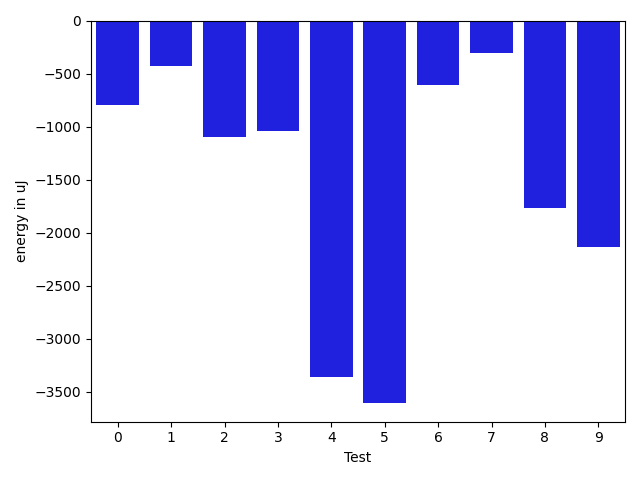

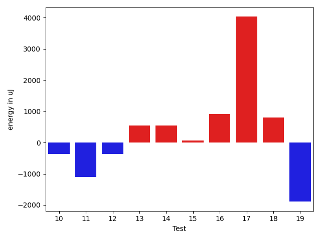

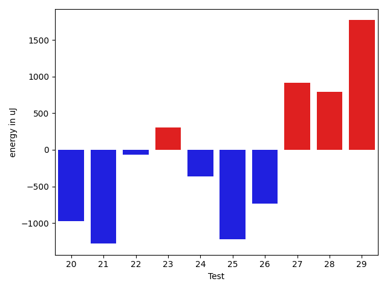

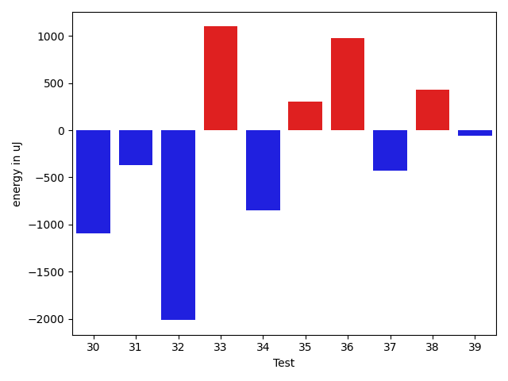

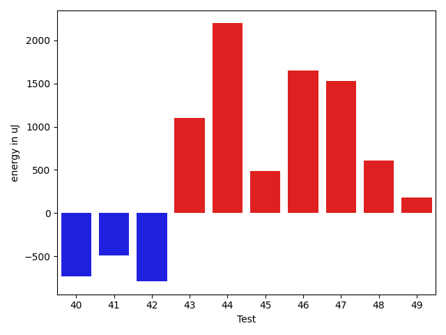

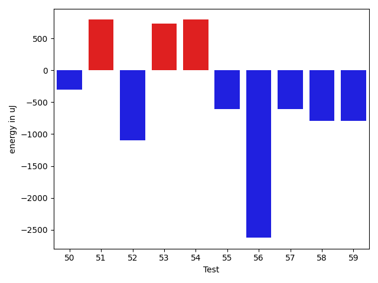

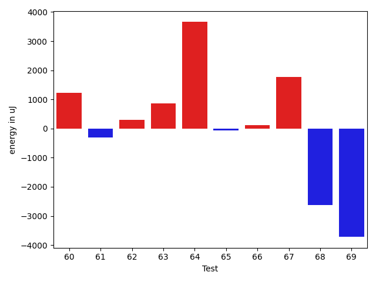

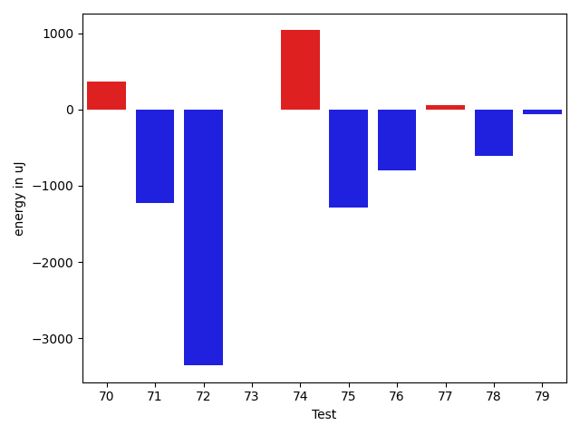

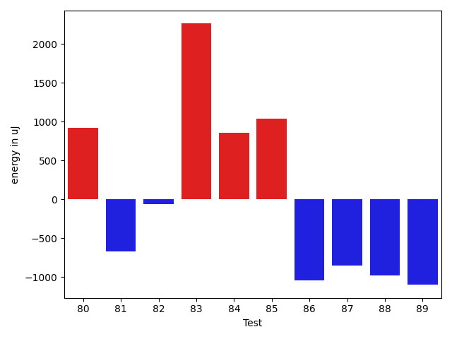

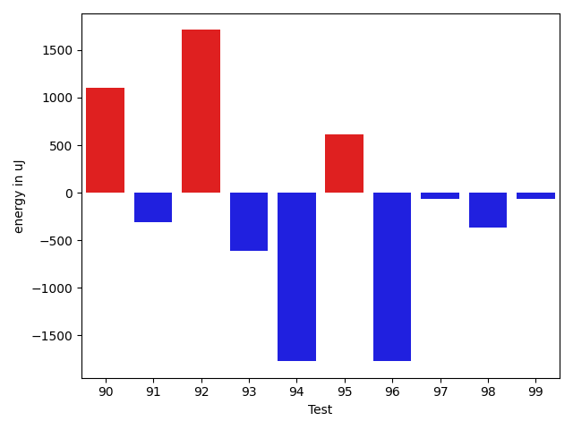

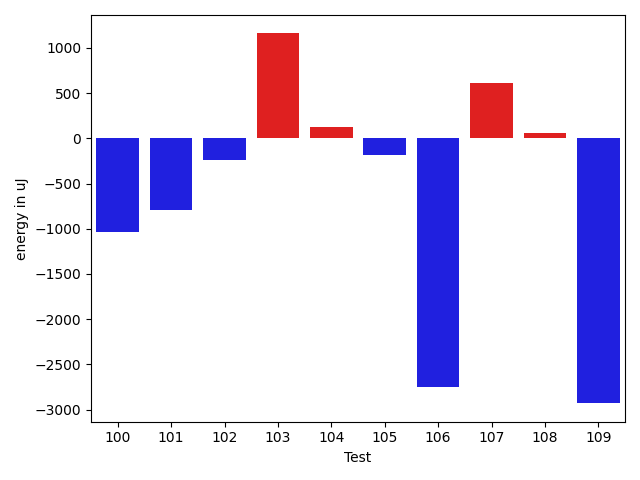

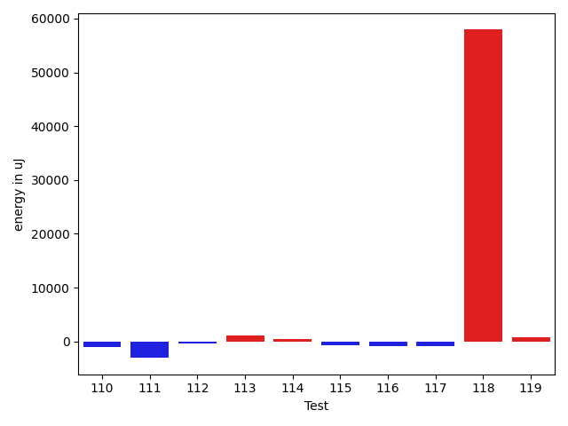

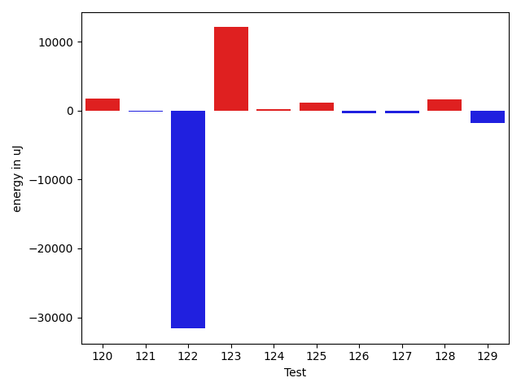

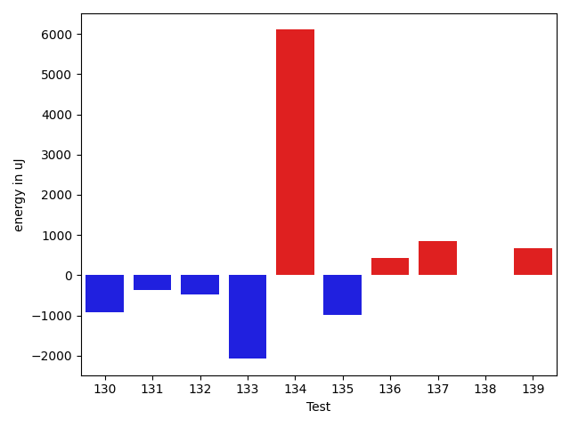

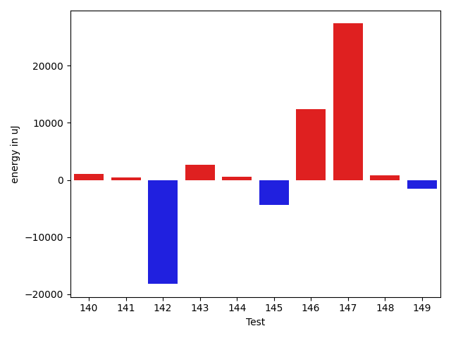

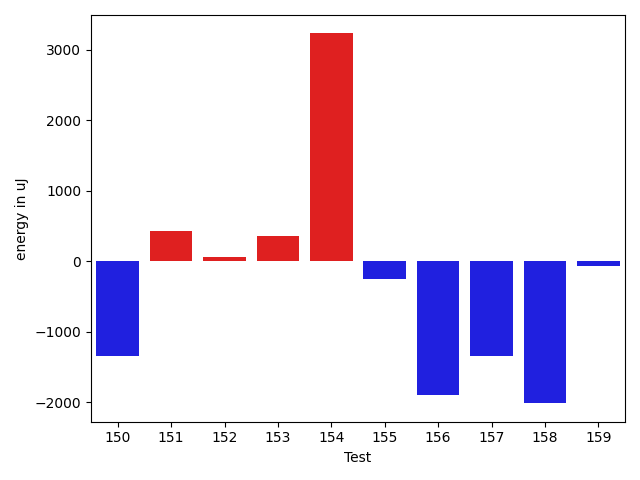

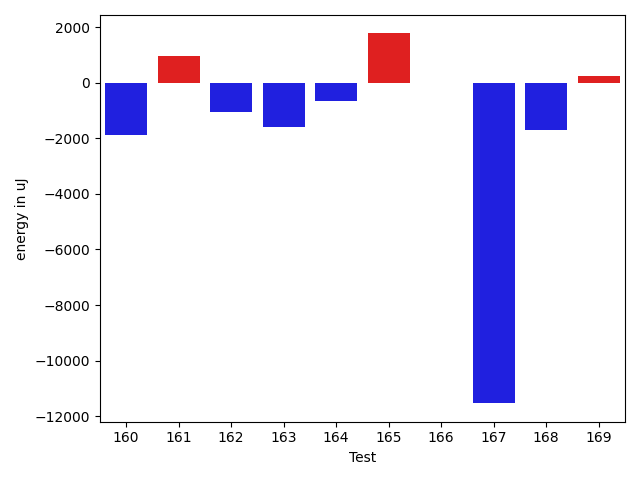

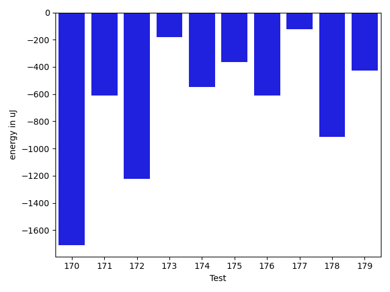

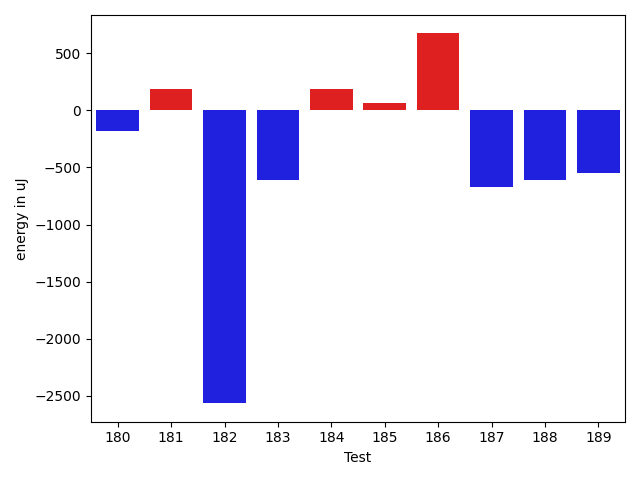

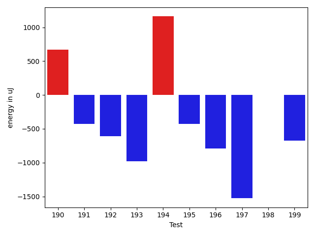

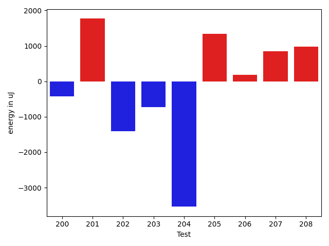

| ID | EnergyV1 | EnergyV2 | DeltaEnergy | σV1 | σV2 |
| --- | --- | --- | --- | --- | --- |
| 0 | 34729 | 33936 | -793 | 37955.09304141745 | 20812.383475468177 |
| 1 | 33752 | 33325 | -427 | 3937.7791497168096 | 2854.265283388788 |
| 2 | 61158 | 60058 | -1100 | 36159.33525885835 | 44194.29606848045 |
| 3 | 34180 | 33142 | -1038 | 9930.128441007948 | 12410.599645935856 |
| 4 | 63477 | 60120 | -3357 | 23100.70311113754 | 21799.09775560046 |
| 5 | 35583 | 31982 | -3601 | 3937.4422216884586 | 2985.563456594366 |
| 6 | 33813 | 33203 | -610 | 3613.020685069895 | 3923.6320693884404 |
| 7 | 33203 | 32898 | -305 | 3298.14009788292 | 2581.5641301398446 |
| 8 | 34363 | 32593 | -1770 | 3159.777741118061 | 26783.1511381088 |
| 9 | 36438 | 34301 | -2137 | 5350.749638550139 | 3162.42229831808 |
| 10 | 33447 | 33081 | -366 | 3359.9424073677815 | 3608.351591823963 |
| 11 | 35828 | 34729 | -1099 | 2972.6068621823215 | 2795.4723756033327 |
| 12 | 35034 | 34668 | -366 | 10138.355885564399 | 12639.886235055841 |
| 13 | 34363 | 34912 | 549 | 6689.8643421688475 | 12176.970637453858 |
| 14 | 34973 | 35522 | 549 | 21394.222247016267 | 27000.93352286496 |
| 15 | 35767 | 35828 | 61 | 67354.7368313594 | 76257.96539680587 |
| 16 | 35644 | 36560 | 916 | 10488.39084210478 | 11792.797156906863 |
| 17 | 73547 | 77575 | 4028 | 38667.04592844396 | 38878.368035665044 |
| 18 | 33691 | 34485 | 794 | 3145.774593309951 | 21813.43693944184 |
| 19 | 37048 | 35156 | -1892 | 4186.300009285875 | 25230.81354968282 |
| 20 | 34668 | 33691 | -977 | 25733.34467795061 | 11975.80763302903 |
| 21 | 35278 | 33997 | -1281 | 3291.6824487359004 | 2847.775134973792 |
| 22 | 34668 | 34606 | -62 | 33103.655451416445 | 10794.025739265617 |
| 23 | 34363 | 34668 | 305 | 4158.875510917119 | 3367.3617272564256 |
| 24 | 33814 | 33447 | -367 | 5406.653083231277 | 24600.052310304916 |
| 25 | 34118 | 32898 | -1220 | 10240.565212517155 | 8408.1651265065 |
| 26 | 34423 | 33691 | -732 | 3686.7563941763224 | 3614.955863863341 |
| 27 | 34240 | 35156 | 916 | 4071.7821714545516 | 3102.5386872868185 |
| 28 | 32654 | 33447 | 793 | 3353.6899036366276 | 29316.10395436304 |
| 29 | 33508 | 35278 | 1770 | 8451.220240406288 | 5639.589590477612 |
| 30 | 34179 | 33081 | -1098 | 4335.9525985230875 | 2700.6327335333294 |
| 31 | 33997 | 33630 | -367 | 2747.284659441027 | 3982.040430866512 |
| 32 | 35583 | 33569 | -2014 | 3744.937318834271 | 3384.854338801176 |
| 33 | 33508 | 34607 | 1099 | 3371.300944080127 | 19373.628464845213 |
| 34 | 35034 | 34180 | -854 | 34342.07873336142 | 3377.180633625644 |
| 35 | 32715 | 33020 | 305 | 2829.6867088778577 | 3268.928894240437 |
| 36 | 34118 | 35095 | 977 | 3032.9243607412695 | 4084.4633707928383 |
| 37 | 34424 | 33997 | -427 | 3393.088565971853 | 7028.319414231366 |
| 38 | 34118 | 34546 | 428 | 2658.236358490343 | 3020.1996063542265 |
| 39 | 33386 | 33325 | -61 | 31086.650441574868 | 2533.169621778852 |
| 40 | 34851 | 34118 | -733 | 4033.280787364329 | 3488.5980526945045 |
| 41 | 33081 | 32593 | -488 | 1917.4186353880402 | 3186.9048357015904 |
| 42 | 34118 | 33325 | -793 | 33395.00756542641 | 3623.901345650873 |
| 43 | 32776 | 33874 | 1098 | 3688.5920911169696 | 3707.4044177735836 |
| 44 | 35095 | 37292 | 2197 | 16115.408114865728 | 19079.165058157883 |
| 45 | 36438 | 36926 | 488 | 285259.2312174993 | 203954.46912069636 |
| 46 | 60729 | 62378 | 1649 | 18580.961307162106 | 20630.74326362556 |
| 47 | 35522 | 37048 | 1526 | 33037.828502727294 | 29296.762502854494 |
| 48 | 34668 | 35278 | 610 | 9748.100815344274 | 8268.206457711878 |
| 49 | 35400 | 35583 | 183 | 4021.4364222164445 | 4321.200532257746 |
| 50 | 33813 | 33508 | -305 | 3480.9852232618673 | 3519.4225796453666 |
| 51 | 33753 | 34546 | 793 | 6615.254182497135 | 6803.4766567392335 |
| 52 | 34912 | 33813 | -1099 | 3197.462885042528 | 2592.311063390156 |
| 53 | 37293 | 38025 | 732 | 43891.882998593304 | 45331.16295672825 |
| 54 | 36499 | 37292 | 793 | 67712.00755425685 | 43393.46492133358 |
| 55 | 34545 | 33935 | -610 | 3506.900767012953 | 4113.338052855123 |
| 56 | 39673 | 37048 | -2625 | 87849.07421458336 | 90809.43234193105 |
| 57 | 35034 | 34424 | -610 | 3622.2443679556277 | 5279.48070373188 |
| 58 | 37170 | 36377 | -793 | 56769.25669605977 | 50689.65724952572 |
| 59 | 35095 | 34301 | -794 | 6014.6448807570605 | 3362.2976984572833 |
| 60 | 33020 | 34240 | 1220 | 2521.4704555149747 | 23440.09690154533 |
| 61 | 33081 | 32776 | -305 | 3543.450305327638 | 3355.0455481855975 |
| 62 | 35827 | 36132 | 305 | 3861.4468209494235 | 3775.611411082978 |
| 63 | 33020 | 33875 | 855 | 3479.9547368138974 | 3683.223782111471 |
| 64 | 35034 | 38696 | 3662 | 17341.565687292623 | 13812.155764176623 |
| 65 | 35889 | 35827 | -62 | 4074.2990516044306 | 38919.502711327805 |
| 66 | 35889 | 36011 | 122 | 4606.2492904695855 | 4502.494622583006 |
| 67 | 33691 | 35461 | 1770 | 4294.92769127303 | 4061.670975026781 |
| 68 | 36560 | 33936 | -2624 | 3389.152616183331 | 3232.3341593604764 |
| 69 | 35401 | 31678 | -3723 | 3748.994311018005 | 3161.6006433607604 |
| 70 | 34851 | 35217 | 366 | 5081.216501667959 | 4551.1340605047435 |
| 71 | 35583 | 34362 | -1221 | 4802.882916540856 | 3722.2749189593787 |
| 72 | 37659 | 34302 | -3357 | 4402.607078748199 | 56312.983744781275 |
| 73 | 33569 | 33569 | 0 | 4742.828528028501 | 2880.629486453811 |
| 74 | 35156 | 36194 | 1038 | 36012.43298389462 | 36983.1208443798 |
| 75 | 35339 | 34058 | -1281 | 4696.223445548458 | 3776.172970870286 |
| 76 | 34973 | 34179 | -794 | 3541.2058187175494 | 4431.689346608554 |
| 77 | 37903 | 37963 | 60 | 88074.79230129103 | 74755.28914407692 |
| 78 | 33142 | 32531 | -611 | 3346.035911343451 | 3732.896779898287 |
| 79 | 34240 | 34180 | -60 | 4258.816725027804 | 4506.4054565999 |
| 80 | 33081 | 33997 | 916 | 3448.7158644152446 | 41100.29105490354 |
| 81 | 35888 | 35217 | -671 | 8995.713890144585 | 8186.601624215021 |
| 82 | 33203 | 33142 | -61 | 3105.9216022631854 | 3469.489775048916 |
| 83 | 34240 | 36499 | 2259 | 3755.0910887368286 | 3899.3487897820837 |
| 84 | 33996 | 34851 | 855 | 15081.714882036973 | 14799.971402074807 |
| 85 | 36255 | 37292 | 1037 | 96880.81580932772 | 67866.27774367662 |
| 86 | 34424 | 33386 | -1038 | 4110.1575917916925 | 3929.6964549943377 |
| 87 | 33448 | 32592 | -856 | 3754.9131432830777 | 2675.6619933192374 |
| 88 | 33387 | 32409 | -978 | 3564.4235439432955 | 3653.4188397768694 |
| 89 | 34607 | 33508 | -1099 | 2788.0043573988546 | 3559.6741618986543 |
| 90 | 33630 | 34729 | 1099 | 2911.3310549121816 | 3286.811916492099 |
| 91 | 34301 | 33996 | -305 | 2829.7356521610127 | 24550.04357806515 |
| 92 | 33996 | 35706 | 1710 | 3548.7438392668882 | 3607.616694556636 |
| 93 | 34179 | 33569 | -610 | 4541.373180738364 | 3291.992109270616 |
| 94 | 33631 | 31860 | -1771 | 3711.1677795995597 | 36266.16784813208 |
| 95 | 32532 | 33142 | 610 | 3252.206998332056 | 5720.787689478759 |
| 96 | 34362 | 32592 | -1770 | 4078.6225710391027 | 41197.97830251921 |
| 97 | 62500 | 62438 | -62 | 20739.04555366611 | 20966.420286450888 |
| 98 | 32654 | 32288 | -366 | 3624.134963435573 | 3121.186617570523 |
| 99 | 33631 | 33569 | -62 | 3219.521349158169 | 4831.203937814499 |
| 100 | 33142 | 32104 | -1038 | 3588.0325911284585 | 3414.613040011672 |
| 101 | 33386 | 32593 | -793 | 3589.502277285732 | 3293.7707072931203 |
| 102 | 35767 | 35522 | -245 | 4277.2703749003285 | 4195.460657015803 |
| 103 | 34180 | 35339 | 1159 | 3693.790644346677 | 3500.0057972207014 |
| 104 | 34240 | 34363 | 123 | 4471.500371954461 | 3346.9710795023 |
| 105 | 33508 | 33325 | -183 | 37149.150378932536 | 3247.639583149709 |
| 106 | 36011 | 33264 | -2747 | 4319.088321118224 | 4692.519379980001 |
| 107 | 34180 | 34790 | 610 | 3746.5976768721443 | 50834.52020605926 |
| 108 | 33325 | 33386 | 61 | 3535.430090484263 | 4710.121493804591 |
| 109 | 77148 | 74219 | -2929 | 68689.8517206654 | 82988.30759178971 |
| 110 | 35767 | 34668 | -1099 | 3759.1464433062756 | 3528.673247836926 |
| 111 | 36255 | 33203 | -3052 | 3839.6117423460396 | 4756.880497377092 |
| 112 | 34851 | 34485 | -366 | 4172.818437733148 | 3466.5407050594104 |
| 113 | 35034 | 36072 | 1038 | 41219.6686544044 | 53312.80408950381 |
| 114 | 36194 | 36682 | 488 | 9614.165725918818 | 13972.325553532255 |
| 115 | 34363 | 33630 | -733 | 9863.21883508144 | 9026.451601706975 |
| 116 | 34362 | 33447 | -915 | 64697.57104476855 | 30078.813718795678 |
| 117 | 34973 | 34118 | -855 | 9916.784618753181 | 8480.240591381393 |
| 118 | 37842 | 95764 | 57922 | 59706.96258794867 | 84140.4483355814 |
| 119 | 33691 | 34485 | 794 | 8879.234513844967 | 10343.497661616382 |
| 120 | 70617 | 72388 | 1771 | 27398.623338310426 | 31402.34043546133 |
| 121 | 34118 | 33996 | -122 | 10132.940011677932 | 13080.3196741625 |
| 122 | 104309 | 72692 | -31617 | 92413.3748465464 | 118002.9333876299 |
| 123 | 49621 | 61707 | 12086 | 21375.957024517258 | 24426.386390290034 |
| 124 | 34179 | 34363 | 184 | 14090.396792460058 | 14850.896243210675 |
| 125 | 37964 | 39123 | 1159 | 44776.86813080283 | 50780.026311664595 |
| 126 | 33630 | 33264 | -366 | 7251.495523848183 | 18385.009062573616 |
| 127 | 34241 | 33813 | -428 | 9963.615527388434 | 30745.60286978509 |
| 128 | 33874 | 35461 | 1587 | 14344.283971609155 | 35929.02079072129 |
| 129 | 82946 | 81176 | -1770 | 36329.24911641746 | 349128.0447582039 |
| 130 | 34729 | 33814 | -915 | 13160.451679558328 | 3536.042230000053 |
| 131 | 76172 | 75805 | -367 | 56648.85180413512 | 53432.514709487274 |
| 132 | 36194 | 35706 | -488 | 30315.207217713232 | 58493.07271414038 |
| 133 | 35705 | 33630 | -2075 | 25256.49724209567 | 3828.9419244387464 |
| 134 | 64941 | 71044 | 6103 | 55262.63955234882 | 158146.2046680304 |
| 135 | 35706 | 34729 | -977 | 8670.025151122329 | 3403.2420195969926 |
| 136 | 35034 | 35462 | 428 | 160178.49585023194 | 27213.692819739714 |
| 137 | 34485 | 35339 | 854 | 212295.70655446977 | 2558.4849405123346 |
| 138 | 36194 | 36193 | -1 | 9908.960496593405 | 285208.293324403 |
| 139 | 35645 | 36316 | 671 | 3941.5025439355177 | 254709.32608491997 |
| 140 | 33935 | 35034 | 1099 | 4031.1189663798395 | 3856.949264987879 |
| 141 | 34912 | 35400 | 488 | 40555.96032677572 | 57638.05966222805 |
| 142 | 132568 | 114380 | -18188 | 271335.29440498824 | 370872.029277818 |
| 143 | 35766 | 38391 | 2625 | 32947.38593648354 | 195653.57856207332 |
| 144 | 35584 | 36133 | 549 | 3509.9905859674677 | 18503.57527607617 |
| 145 | 67138 | 62744 | -4394 | 68984.37572713471 | 94158.67847924765 |
| 146 | 242614 | 255004 | 12390 | 87051.31395636388 | 88351.43029889457 |
| 147 | 348205 | 375548 | 27343 | 118065.40792269794 | 119491.7911395745 |
| 148 | 66039 | 66833 | 794 | 56620.77349939894 | 64435.93807884862 |
| 149 | 36255 | 34668 | -1587 | 12143.834103100815 | 14194.005633220493 |
| 150 | 34728 | 33386 | -1342 | 32078.773584636932 | 2371.5735172032932 |
| 151 | 37232 | 37659 | 427 | 45055.606936586555 | 50029.51274920475 |
| 152 | 36010 | 36072 | 62 | 32961.67432963251 | 36847.08855297263 |
| 153 | 34180 | 34546 | 366 | 3253.243148457669 | 4046.420251539749 |
| 154 | 36133 | 39367 | 3234 | 66746.34821069284 | 91476.72225117894 |
| 155 | 35522 | 35278 | -244 | 7711.743012441534 | 3448.8908735834943 |
| 156 | 35889 | 33997 | -1892 | 32745.643999664157 | 4415.324075811926 |
| 157 | 34484 | 33142 | -1342 | 3914.8823756057222 | 20774.835438986946 |
| 158 | 36682 | 34668 | -2014 | 5241.206028449278 | 4429.810347439912 |
| 159 | 34851 | 34790 | -61 | 3736.6147816526427 | 4147.060663010281 |
| 160 | 34667 | 32775 | -1892 | 3483.429374342959 | 2993.396829502425 |
| 161 | 32715 | 33691 | 976 | 5584.1054728209 | 45887.11014979963 |
| 162 | 33203 | 32165 | -1038 | 3476.994235476317 | 2875.99313184159 |
| 163 | 35461 | 33874 | -1587 | 56221.3741796684 | 2331.0527280311953 |
| 164 | 34241 | 33569 | -672 | 9909.75634789681 | 32859.386397456554 |
| 165 | 32348 | 34119 | 1771 | 4326.360344061352 | 2865.67539274727 |
| 166 | 33142 | 33142 | 0 | 5955.798308796986 | 3544.245993207561 |
| 167 | 150085 | 138550 | -11535 | 34119.3633195267 | 39105.91757610645 |
| 168 | 40345 | 38635 | -1710 | 29158.74017500343 | 31288.266345286123 |
| 169 | 32288 | 32531 | 243 | 2667.9243832498755 | 3712.856385042076 |
| 170 | 36926 | 35217 | -1709 | 38869.42320803401 | 32965.44276863612 |
| 171 | 36132 | 35522 | -610 | 41669.4184522098 | 33929.13057504425 |
| 172 | 34973 | 33752 | -1221 | 4439.266858223372 | 3957.078182580621 |
| 173 | 35583 | 35400 | -183 | 3678.004481505743 | 3572.234148934643 |
| 174 | 33447 | 32897 | -550 | 2967.729217593494 | 3577.6583385038275 |
| 175 | 33813 | 33447 | -366 | 3416.6416474096914 | 7325.177829129728 |
| 176 | 35583 | 34973 | -610 | 3730.818450420765 | 5096.139776831087 |
| 177 | 35339 | 35217 | -122 | 3733.3854528766105 | 3706.326148716699 |
| 178 | 33875 | 32959 | -916 | 3575.7330325713083 | 3954.7295866855716 |
| 179 | 33447 | 33020 | -427 | 4022.364038012177 | 2862.431222959399 |
| 180 | 35278 | 35096 | -182 | 4236.94472507086 | 3032.758653254309 |
| 181 | 37414 | 37597 | 183 | 52681.226624873394 | 23049.935433101677 |
| 182 | 39307 | 36743 | -2564 | 170703.1421643726 | 41875.624540113895 |
| 183 | 69824 | 69214 | -610 | 28169.08238318353 | 21583.40207517951 |
| 184 | 36559 | 36743 | 184 | 82479.9006617773 | 63851.92681660165 |
| 185 | 38758 | 38818 | 60 | 27444.328450641067 | 23143.275875703694 |
| 186 | 36621 | 37293 | 672 | 79408.3080451863 | 55231.90622778288 |
| 187 | 35278 | 34607 | -671 | 4027.6955633488997 | 4290.980272618367 |
| 188 | 38330 | 37720 | -610 | 76625.61620206907 | 33893.178353596304 |
| 189 | 35400 | 34851 | -549 | 9752.365674384526 | 4959.658035926805 |
| 190 | 34241 | 34912 | 671 | 3590.1028299555264 | 3447.3451604822267 |
| 191 | 37842 | 37414 | -428 | 27385.55186714434 | 28240.108793101215 |
| 192 | 38024 | 37414 | -610 | 16127.370281519507 | 13739.584105857079 |
| 193 | 34546 | 33569 | -977 | 4298.582015142795 | 3958.2648773807664 |
| 194 | 38269 | 39429 | 1160 | 88652.17112030007 | 68931.06752134839 |
| 195 | 36193 | 35766 | -427 | 3681.2223723860566 | 3783.05595584831 |
| 196 | 35766 | 34973 | -793 | 3689.4308836049445 | 4346.418816336753 |
| 197 | 35278 | 33752 | -1526 | 4520.961125689979 | 4385.829500758348 |
| 198 | 36987 | 36987 | 0 | 542316.2764921944 | 410848.8438930045 |
| 199 | 35217 | 34546 | -671 | 3606.402374943761 | 3520.490209220216 |
| 200 | 34912 | 34485 | -427 | 3951.968240412645 | 4401.249825646699 |
| 201 | 35583 | 37353 | 1770 | 3947.662913358821 | 18482.25047114828 |
| 202 | 38757 | 37354 | -1403 | 83983.52014463491 | 80628.33722534197 |
| 203 | 38574 | 37841 | -733 | 27764.85495598984 | 71252.29829492235 |
| 204 | 41260 | 37720 | -3540 | 94302.00528247157 | 82924.12285248752 |
| 205 | 35644 | 36987 | 1343 | 90183.11870014753 | 78854.90578278144 |
| 206 | 36743 | 36926 | 183 | 4372.730201479455 | 4451.528318936218 |
| 207 | 36132 | 36987 | 855 | 4990.424764927329 | 6459.87858503032 |
| 208 | 33753 | 34729 | 976 | 4858.374030704328 | 3509.301812309187 |

## Delta Duration per test method

| ID | DurationV1 | DurationsV2 | DeltaDuration |
| --- | --- | --- | --- |
| 0 | 1313179.5 | 1073234.1846153846 | -239945.31538461545 |
| 1 | 534210.4722222222 | 526186.0882352941 | -8024.383986928151 |
| 2 | 2026922.2307692308 | 2038517.6818181819 | 11595.45104895113 |
| 3 | 894245.4782608695 | 837469.431372549 | -56776.046888320474 |
| 4 | 1811210.1789473684 | 1856279.875 | 45069.696052631596 |
| 5 | 569359.3235294118 | 562399.0 | -6960.323529411806 |
| 6 | 647976.7692307692 | 608050.5172413794 | -39926.251989389886 |
| 7 | 397086.05263157893 | 430491.22222222225 | 33405.169590643316 |
| 8 | 660308.7567567568 | 817117.3513513514 | 156808.59459459456 |
| 9 | 427339.77777777775 | 436420.0 | 9080.222222222248 |
| 10 | 860132.0307692308 | 864475.6842105263 | 4343.653441295493 |
| 11 | 620664.0 | 833333.4615384615 | 212669.4615384615 |
| 12 | 1225483.2857142857 | 1226657.8139534884 | 1174.5282392026857 |
| 13 | 1099537.64 | 1195617.8048780488 | 96080.16487804893 |
| 14 | 920493.593220339 | 1042976.9777777778 | 122483.38455743878 |
| 15 | 1542894.0196078431 | 1802540.1463414633 | 259646.12673362019 |
| 16 | 748079.4705882353 | 795327.9444444445 | 47248.473856209195 |
| 17 | 2952879.618556701 | 3099977.222222222 | 147097.6036655209 |
| 18 | 929152.6896551724 | 982447.7538461538 | 53295.064190981444 |
| 19 | 641312.9166666666 | 813995.4722222222 | 172682.55555555562 |
| 20 | 1052261.421875 | 1081166.1311475409 | 28904.709272540873 |
| 21 | 777449.5833333334 | 786388.4 | 8938.816666666651 |
| 22 | 988344.6875 | 706177.6896551724 | -282166.9978448276 |
| 23 | 647218.4285714285 | 710608.9189189189 | 63390.49034749041 |
| 24 | 783900.7222222222 | 904688.551724138 | 120787.82950191572 |
| 25 | 1191816.9090909092 | 1144424.6024096385 | -47392.30668127071 |
| 26 | 690859.8 | 704397.0 | 13537.199999999953 |
| 27 | 645071.8269230769 | 670338.0465116279 | 25266.219588550972 |
| 28 | 538744.9130434783 | 725509.2413793104 | 186764.3283358321 |
| 29 | 1032357.0677966102 | 991024.265625 | -41332.80217161018 |
| 30 | 543511.6060606061 | 610706.1621621621 | 67194.55610155605 |
| 31 | 394929.14285714284 | 388854.4583333333 | -6074.684523809527 |
| 32 | 556756.275862069 | 594961.9677419355 | 38205.69187986653 |
| 33 | 651693.9444444445 | 752176.7741935484 | 100482.82974910387 |
| 34 | 730747.1666666666 | 435458.26086956525 | -295288.9057971014 |
| 35 | 709561.22 | 842613.14 | 133051.92000000004 |
| 36 | 587051.6315789474 | 608813.0 | 21761.368421052583 |
| 37 | 829480.8181818182 | 944369.2307692308 | 114888.41258741252 |
| 38 | 457949.84 | 407019.6666666667 | -50930.17333333334 |
| 39 | 702135.8 | 539670.7391304348 | -162465.06086956523 |
| 40 | 437621.8333333333 | 482296.5833333333 | 44674.75 |
| 41 | 501533.6666666667 | 499841.5909090909 | -1692.0757575758034 |
| 42 | 681884.3448275862 | 540637.9642857143 | -141246.38054187188 |
| 43 | 752564.8771929825 | 804339.3333333334 | 51774.4561403509 |
| 44 | 1094970.551724138 | 1118086.7021276595 | 23116.15040352149 |
| 45 | 3316737.793650794 | 2224125.9830508474 | -1092611.8105999464 |
| 46 | 1835542.0909090908 | 1877387.7575757576 | 41845.666666666744 |
| 47 | 1192706.7878787878 | 1113154.9473684211 | -79551.84051036672 |
| 48 | 976439.0909090909 | 1018808.6206896552 | 42369.52978056425 |
| 49 | 827717.5961538461 | 793110.0588235294 | -34607.53733031673 |
| 50 | 636204.9705882353 | 614260.6176470588 | -21944.352941176505 |
| 51 | 904763.4736842106 | 929863.5396825396 | 25100.065998329083 |
| 52 | 684215.2571428572 | 760160.975 | 75945.7178571428 |
| 53 | 1402523.298245614 | 1645068.8695652173 | 242545.57131960336 |
| 54 | 1485984.5384615385 | 1400214.3636363635 | -85770.17482517497 |
| 55 | 735691.9056603773 | 767915.9166666666 | 32224.011006289278 |
| 56 | 2123639.984375 | 1788460.3880597015 | -335179.59631529846 |
| 57 | 844389.6451612903 | 888498.1228070175 | 44108.477645727224 |
| 58 | 1795731.0158730159 | 1609504.1470588236 | -186226.86881419225 |
| 59 | 865972.3275862068 | 866539.8253968254 | 567.4978106186027 |
| 60 | 654831.0 | 767661.4054054054 | 112830.40540540544 |
| 61 | 468585.9285714286 | 489898.56 | 21312.631428571418 |
| 62 | 408277.85714285716 | 504836.5 | 96558.64285714284 |
| 63 | 522637.3793103448 | 498586.04347826086 | -24051.335832083947 |
| 64 | 1024719.7272727273 | 1010824.7714285714 | -13894.955844155862 |
| 65 | 488160.2380952381 | 759615.6666666666 | 271455.4285714285 |
| 66 | 515422.0 | 516188.625 | 766.625 |
| 67 | 460451.0833333333 | 457848.5625 | -2602.520833333314 |
| 68 | 497138.95238095237 | 516789.5 | 19650.547619047633 |
| 69 | 501885.04347826086 | 451275.8181818182 | -50609.22529644269 |
| 70 | 586341.2121212122 | 683287.6538461539 | 96946.44172494172 |
| 71 | 475202.9 | 681667.2727272727 | 206464.37272727268 |
| 72 | 483090.375 | 862553.8 | 379463.42500000005 |
| 73 | 400706.1818181818 | 424660.05263157893 | 23953.87081339711 |
| 74 | 665370.2380952381 | 671284.3 | 5914.06190476194 |
| 75 | 434900.4117647059 | 434723.5483870968 | -176.86337760911556 |
| 76 | 399550.23529411765 | 374986.625 | -24563.61029411765 |
| 77 | 2092692.8333333333 | 1484078.3421052631 | -608614.4912280701 |
| 78 | 706790.08 | 633743.875 | -73046.20499999996 |
| 79 | 837910.1388888889 | 661382.4117647059 | -176527.72712418297 |
| 80 | 491566.02857142856 | 746449.6842105263 | 254883.65563909773 |
| 81 | 918329.0967741936 | 816245.0 | -102084.09677419357 |
| 82 | 720627.243902439 | 687351.3157894737 | -33275.92811296531 |
| 83 | 389073.2272727273 | 357002.625 | -32070.602272727294 |
| 84 | 1480604.05 | 1441607.732142857 | -38996.317857143 |
| 85 | 2029169.0263157894 | 1308607.394736842 | -720561.6315789474 |
| 86 | 610567.5 | 521655.19444444444 | -88912.30555555556 |
| 87 | 432256.48 | 413406.7368421053 | -18849.7431578947 |
| 88 | 461000.1666666667 | 425972.15789473685 | -35028.00877192983 |
| 89 | 557592.09375 | 544081.5555555555 | -13510.538194444496 |
| 90 | 450012.0689655172 | 455603.82352941175 | 5591.75456389453 |
| 91 | 582293.9722222222 | 704589.5142857142 | 122295.542063492 |
| 92 | 371859.4285714286 | 366273.625 | -5585.80357142858 |
| 93 | 559056.7826086957 | 490856.65 | -68200.13260869565 |
| 94 | 488113.54545454547 | 1078202.4166666667 | 590088.8712121213 |
| 95 | 815280.9 | 811274.5961538461 | -4006.3038461538963 |
| 96 | 554887.2647058824 | 680864.46875 | 125977.20404411759 |
| 97 | 1853480.433962264 | 1827417.3409090908 | -26063.093053173274 |
| 98 | 465707.81481481483 | 455756.7826086957 | -9951.032206119155 |
| 99 | 610736.8139534884 | 546828.2352941176 | -63908.578659370774 |
| 100 | 521374.46875 | 512796.26923076925 | -8578.199519230751 |
| 101 | 450261.95238095237 | 414170.1111111111 | -36091.84126984124 |
| 102 | 647625.5 | 775451.1176470588 | 127825.6176470588 |
| 103 | 432593.14285714284 | 434961.45454545453 | 2368.311688311689 |
| 104 | 524606.0416666666 | 493963.3181818182 | -30642.72348484845 |
| 105 | 857952.7222222222 | 475072.82857142854 | -382879.8936507937 |
| 106 | 482929.2272727273 | 373043.0 | -109886.2272727273 |
| 107 | 480772.8125 | 745298.4444444445 | 264525.6319444445 |
| 108 | 486164.48484848486 | 441759.88 | -44404.60484848486 |
| 109 | 3104581.1515151514 | 3441142.090909091 | 336560.93939393945 |
| 110 | 745147.911111111 | 716604.3666666667 | -28543.544444444356 |
| 111 | 478014.44444444444 | 484240.5 | 6226.055555555562 |
| 112 | 483134.78571428574 | 499500.63157894736 | 16365.84586466162 |
| 113 | 934494.1333333333 | 1387358.3823529412 | 452864.2490196079 |
| 114 | 860558.3111111111 | 1064787.326923077 | 204229.01581196592 |
| 115 | 1282861.8404255318 | 1297347.858695652 | 14486.018270120258 |
| 116 | 1417334.8823529412 | 1372203.2278481012 | -45131.65450484003 |
| 117 | 1252376.7021276595 | 1274049.108695652 | 21672.406567992643 |
| 118 | 2246420.164383562 | 2904254.85483871 | 657834.690455148 |
| 119 | 1226034.2043010753 | 1259922.7731958763 | 33888.56889480096 |
| 120 | 2657664.9191919193 | 2787713.1818181816 | 130048.26262626238 |
| 121 | 1321598.2268041237 | 1387962.1684210526 | 66363.9416169289 |
| 122 | 3456454.765957447 | 3320808.695652174 | -135646.07030527294 |
| 123 | 1839931.1717171718 | 1966753.7373737374 | 126822.5656565656 |
| 124 | 1318053.4719101123 | 1343065.953488372 | 25012.48157825973 |
| 125 | 2245438.484848485 | 2325096.3469387754 | 79657.86209029052 |
| 126 | 1205905.819148936 | 1331669.957894737 | 125764.13874580082 |
| 127 | 1236716.8064516129 | 1421072.4943820224 | 184355.68793040956 |
| 128 | 996912.1964285715 | 1546732.4827586208 | 549820.2863300493 |
| 129 | 2910758.6666666665 | 5317890.757575758 | 2407132.0909090913 |
| 130 | 658439.4193548387 | 656699.1875 | -1740.2318548386684 |
| 131 | 3039921.101010101 | 3100496.9292929294 | 60575.82828282844 |
| 132 | 965765.4545454546 | 1506847.0 | 541081.5454545454 |
| 133 | 826988.425925926 | 806314.6326530612 | -20673.793272864772 |
| 134 | 2556187.1414141413 | 3415002.8181818184 | 858815.6767676771 |
| 135 | 733365.4375 | 667004.1111111111 | -66361.32638888888 |
| 136 | 1759502.625 | 1241232.7083333333 | -518269.91666666674 |
| 137 | 2297184.653846154 | 555038.2692307692 | -1742146.3846153847 |
| 138 | 682514.4848484849 | 2640887.904761905 | 1958373.41991342 |
| 139 | 565466.2580645161 | 1860091.6764705882 | 1294625.418406072 |
| 140 | 592399.7352941176 | 589811.0606060605 | -2588.6746880570427 |
| 141 | 1298787.013888889 | 1681010.0 | 382222.986111111 |
| 142 | 5530069.484848484 | 7335417.474747474 | 1805347.98989899 |
| 143 | 1190892.3720930233 | 2580228.8958333335 | 1389336.5237403102 |
| 144 | 818342.0277777778 | 887914.4545454546 | 69572.42676767684 |
| 145 | 2329652.4736842103 | 2902950.8125 | 573298.3388157897 |
| 146 | 7702155.939393939 | 7972916.151515151 | 270760.2121212119 |
| 147 | 10416692.747474747 | 10496077.767676767 | 79385.02020202018 |
| 148 | 2300810.878787879 | 2602918.505050505 | 302107.62626262615 |
| 149 | 826329.3255813953 | 1037313.9722222222 | 210984.64664082695 |
| 150 | 609786.64 | 475215.2 | -134571.44 |
| 151 | 1353952.5384615385 | 1767765.6615384615 | 413813.12307692296 |
| 152 | 1534413.858974359 | 1705076.3780487804 | 170662.51907442138 |
| 153 | 420682.4347826087 | 496227.5 | 75545.0652173913 |
| 154 | 1494655.4193548388 | 2784055.28125 | 1289399.8618951612 |
| 155 | 684470.9615384615 | 777075.5925925926 | 92604.63105413108 |
| 156 | 735735.1739130435 | 488604.94444444444 | -247130.22946859902 |
| 157 | 874192.6451612903 | 987139.1515151515 | 112946.50635386119 |
| 158 | 397832.64285714284 | 439321.71428571426 | 41489.07142857142 |
| 159 | 519395.39130434784 | 694140.8620689656 | 174745.47076461773 |
| 160 | 585325.4193548387 | 543960.5555555555 | -41364.863799283165 |
| 161 | 1104772.256097561 | 1654331.2 | 549558.943902439 |
| 162 | 732113.3191489362 | 760039.68 | 27926.36085106386 |
| 163 | 887652.2173913043 | 465302.61904761905 | -422349.59834368527 |
| 164 | 972272.75 | 1026293.8703703703 | 54021.120370370336 |
| 165 | 633178.8666666667 | 592682.9166666666 | -40495.95000000007 |
| 166 | 1027021.9615384615 | 931689.1587301587 | -95332.8028083028 |
| 167 | 4923893.777777778 | 4262565.412371134 | -661328.3654066436 |
| 168 | 1821920.4606741574 | 1807891.6235294119 | -14028.837144745514 |
| 169 | 727788.3333333334 | 733662.7450980392 | 5874.4117647057865 |
| 170 | 1092462.696969697 | 1016436.8620689656 | -76025.83490073145 |
| 171 | 1129401.9137931035 | 1041901.0384615385 | -87500.87533156504 |
| 172 | 540215.6428571428 | 541871.8333333334 | 1656.1904761905316 |
| 173 | 560675.5384615385 | 577709.8518518518 | 17034.3133903133 |
| 174 | 719331.4509803922 | 735263.3125 | 15931.861519607832 |
| 175 | 706004.0 | 847588.1764705882 | 141584.1764705882 |
| 176 | 396049.05 | 408978.25 | 12929.200000000012 |
| 177 | 506903.5263157895 | 545765.8484848485 | 38862.322169059014 |
| 178 | 742651.3157894737 | 455893.5294117647 | -286757.786377709 |
| 179 | 449648.8947368421 | 436142.3888888889 | -13506.505847953202 |
| 180 | 443360.6818181818 | 455232.3333333333 | 11871.65151515149 |
| 181 | 1851459.8955223882 | 1119756.0606060605 | -731703.8349163276 |
| 182 | 4072528.6585365855 | 1013703.1025641026 | -3058825.555972483 |
| 183 | 2272142.292929293 | 2147291.5757575757 | -124850.71717171744 |
| 184 | 1872772.875 | 1798391.657142857 | -74381.21785714291 |
| 185 | 1261654.1555555556 | 1345692.5714285714 | 84038.41587301577 |
| 186 | 2284490.5934065934 | 1785285.3033707866 | -499205.29003580683 |
| 187 | 814396.5510204082 | 735444.275 | -78952.27602040814 |
| 188 | 2098164.31372549 | 1248578.677419355 | -849585.6363061352 |
| 189 | 811240.1481481482 | 659467.0 | -151773.1481481482 |
| 190 | 771617.283018868 | 818209.2978723404 | 46592.01485347247 |
| 191 | 1578970.5681818181 | 1672383.6951219512 | 93413.12694013305 |
| 192 | 958160.6666666666 | 1018675.074074074 | 60514.407407407416 |
| 193 | 551599.5 | 568211.3333333334 | 16611.833333333372 |
| 194 | 2072428.6666666667 | 1903485.5151515151 | -168943.1515151516 |
| 195 | 772578.6730769231 | 731788.3333333334 | -40790.33974358975 |
| 196 | 569408.9642857143 | 625589.8333333334 | 56180.86904761905 |
| 197 | 624509.125 | 619218.5555555555 | -5290.569444444496 |
| 198 | 6103178.169014084 | 4448590.643835616 | -1654587.5251784679 |
| 199 | 696746.625 | 829981.1935483871 | 133234.56854838715 |
| 200 | 855679.3902439025 | 655561.5714285715 | -200117.81881533097 |
| 201 | 797050.3529411765 | 938038.1086956522 | 140987.75575447571 |
| 202 | 2259105.690909091 | 2195855.3225806453 | -63250.36832844559 |
| 203 | 1351783.3846153845 | 1551195.4166666667 | 199412.03205128224 |
| 204 | 2446102.069767442 | 1720521.2391304348 | -725580.8306370073 |
| 205 | 1658308.6857142858 | 2069134.9523809524 | 410826.2666666666 |
| 206 | 550786.0833333334 | 511522.47826086957 | -39263.605072463804 |
| 207 | 667214.56 | 725305.625 | 58091.064999999944 |
| 208 | 439376.73333333334 | 459642.77777777775 | 20266.044444444415 |

## Misc.

| ID | Test Class | Test Method |
| --- | --- | --- |
| 0 | com.google.gson.functional.ObjectTest | testDirectedAcyclicGraphDeserialization |
| 1 | com.google.gson.functional.ObjectTest | testEmptyCollectionInAnObjectDeserialization |
| 2 | com.google.gson.functional.ObjectTest | testDirectedAcyclicGraphSerialization |
| 3 | com.google.gson.functional.ObjectTest | testNestedSerialization |
| 4 | com.google.gson.functional.ObjectTest | testArrayOfArraysDeserialization |
| 5 | com.google.gson.functional.ObjectTest | testPrivateNoArgConstructorDeserialization |
| 6 | com.google.gson.functional.ObjectTest | testClassWithTransientFieldsDeserializationTransientFieldsPassedInJsonAreIgnored |
| 7 | com.google.gson.functional.ObjectTest | testPrimitiveArrayFieldSerialization |
| 8 | com.google.gson.functional.ObjectTest | testPrimitiveArrayInAnObjectDeserialization |
| 9 | com.google.gson.functional.ObjectTest | testClassWithNoFieldsSerialization |
| 10 | com.google.gson.functional.ObjectTest | testClassWithObjectFieldSerialization |
| 11 | com.google.gson.functional.ObjectTest | testClassWithEnumFieldSerialization |
| 12 | com.google.gson.functional.ObjectTest | testArrayOfObjectsDeserialization |
| 13 | com.google.gson.functional.ObjectTest | testArrayOfArraysSerialization |
| 14 | com.google.gson.functional.ObjectTest | testAnonymousLocalClassesSerialization |
| 15 | com.google.gson.functional.ObjectTest | testJsonInSingleQuotesDeserialization |
| 16 | com.google.gson.functional.ObjectTest | testBagOfPrimitivesSerialization |
| 17 | com.google.gson.functional.ObjectTest | testSubInterfacesOfCollectionSerialization |
| 18 | com.google.gson.functional.ObjectTest | testNestedDeserialization |
| 19 | com.google.gson.functional.ObjectTest | testJsonInMixedQuotesDeserialization |
| 20 | com.google.gson.functional.ObjectTest | testInheritenceSerialization |
| 21 | com.google.gson.functional.ObjectTest | testNullFieldsDeserialization |
| 22 | com.google.gson.functional.ObjectTest | testClassWithTransientFieldsSerialization |
| 23 | com.google.gson.functional.ObjectTest | testBagOfPrimitivesDeserialization |
| 24 | com.google.gson.functional.ObjectTest | testInnerClassDeserialization |
| 25 | com.google.gson.functional.ObjectTest | testSubInterfacesOfCollectionDeserialization |
| 26 | com.google.gson.functional.ObjectTest | testClassWithEnumFieldDeserialization |
| 27 | com.google.gson.functional.ObjectTest | testBagOfPrimitiveWrappersSerialization |
| 28 | com.google.gson.functional.ObjectTest | testTopLevelEnumDeserialization |
| 29 | com.google.gson.functional.ObjectTest | testInheritenceDeserialization |
| 30 | com.google.gson.functional.ObjectTest | testCircularSerialization |
| 31 | com.google.gson.functional.ObjectTest | testTopLevelEnumSerialization |
| 32 | com.google.gson.functional.ObjectTest | testNullFieldsSerialization |
| 33 | com.google.gson.functional.ObjectTest | testClassWithTransientFieldsDeserialization |
| 34 | com.google.gson.functional.ObjectTest | testSelfReferenceSerialization |
| 35 | com.google.gson.functional.ObjectTest | testInnerClassSerialization |
| 36 | com.google.gson.functional.ObjectTest | testBagOfPrimitiveWrappersDeserialization |
| 37 | com.google.gson.functional.ObjectTest | testArrayOfObjectsSerialization |
| 38 | com.google.gson.functional.ObjectTest | testClassWithNoFieldsDeserialization |
| 39 | com.google.gson.functional.ObjectTest | testNullPrimitiveFieldsDeserialization |
| 40 | com.google.gson.functional.ObjectTest | testEmptyCollectionInAnObjectSerialization |
| 41 | com.google.gson.functional.ObjectTest | testNullObjectFieldsDeserialization |
| 42 | com.google.gson.functional.ObjectTest | testNullArraysDeserialization |
| 43 | com.google.gson.functional.CustomTypeAdaptersTest | testCustomTypeAdapterAppliesToSubClassesSerializedAsBaseClass |
| 44 | com.google.gson.functional.CustomTypeAdaptersTest | testCustomNestedSerializers |
| 45 | com.google.gson.functional.CustomTypeAdaptersTest | testCustomSerializers |
| 46 | com.google.gson.functional.CustomTypeAdaptersTest | testCustomTypeAdapterDoesNotAppliesToSubClasses |
| 47 | com.google.gson.functional.CustomTypeAdaptersTest | testCustomDeserializers |
| 48 | com.google.gson.functional.CustomTypeAdaptersTest | testCustomNestedDeserializers |
| 49 | com.google.gson.functional.CollectionTest | testNullsInListDeserialization |
| 50 | com.google.gson.functional.CollectionTest | testRawCollectionOfBagOfPrimitivesNotAllowed |
| 51 | com.google.gson.functional.CollectionTest | testTopLevelListOfIntegerCollectionsDeserialization |
| 52 | com.google.gson.functional.CollectionTest | testRawCollectionSerialization |
| 53 | com.google.gson.functional.CollectionTest | testCollectionOfBagOfPrimitivesSerialization |
| 54 | com.google.gson.functional.CollectionTest | testTopLevelCollectionOfIntegersSerialization |
| 55 | com.google.gson.functional.CollectionTest | testCollectionOfStringsDeserialization |
| 56 | com.google.gson.functional.CollectionTest | testNullsInListSerialization |
| 57 | com.google.gson.functional.CollectionTest | testCollectionOfEnumsDeserialization |
| 58 | com.google.gson.functional.CollectionTest | testTopLevelCollectionOfIntegersDeserialization |
| 59 | com.google.gson.functional.CollectionTest | testCollectionOfEnumsSerialization |
| 60 | com.google.gson.functional.CollectionTest | testRawCollectionDeserializationNotAlllowed |
| 61 | com.google.gson.functional.CollectionTest | testRawCollectionOfIntegersSerialization |
| 62 | com.google.gson.functional.CollectionTest | testCollectionOfStringsSerialization |
| 63 | com.google.gson.functional.StringTest | testEscapingQuotesInStringSerialization |
| 64 | com.google.gson.functional.StringTest | testStringValueAsSingleElementArraySerialization |
| 65 | com.google.gson.functional.StringTest | testStringValueDeserialization |
| 66 | com.google.gson.functional.StringTest | testStringWithEscapedSlashDeserialization |
| 67 | com.google.gson.functional.StringTest | testSingleQuoteInStringDeserialization |
| 68 | com.google.gson.functional.StringTest | testSingleQuoteInStringSerialization |
| 69 | com.google.gson.functional.StringTest | testEscapedCtrlNInStringDeserialization |
| 70 | com.google.gson.functional.StringTest | testStringValueAsSingleElementArrayDeserialization |
| 71 | com.google.gson.functional.StringTest | testEscapedCtrlNInStringSerialization |
| 72 | com.google.gson.functional.StringTest | testStringValueSerialization |
| 73 | com.google.gson.functional.StringTest | testEscapedCtrlRInStringSerialization |
| 74 | com.google.gson.functional.StringTest | testEscapedBackslashInStringDeserialization |
| 75 | com.google.gson.functional.StringTest | testEscapedCtrlRInStringDeserialization |
| 76 | com.google.gson.functional.StringTest | testEscapedBackslashInStringSerialization |
| 77 | com.google.gson.functional.StringTest | testEscapingQuotesInStringDeserialization |
| 78 | com.google.gson.functional.PrimitiveTest | testPrimitiveBooleanAutoboxedDeserialization |
| 79 | com.google.gson.functional.PrimitiveTest | testPrimitiveIntegerAutoboxedDeserialization |
| 80 | com.google.gson.functional.PrimitiveTest | testBigIntegerDeserialization |
| 81 | com.google.gson.functional.PrimitiveTest | testPrimitiveIntegerAutoboxedInASingleElementArraySerialization |
| 82 | com.google.gson.functional.PrimitiveTest | testPrimitiveDoubleAutoboxedDeserialization |
| 83 | com.google.gson.functional.PrimitiveTest | testSmallValueForBigDecimalSerialization |
| 84 | com.google.gson.functional.PrimitiveTest | testBigDecimalSerialization |
| 85 | com.google.gson.functional.PrimitiveTest | testPrimitiveIntegerAutoboxedInASingleElementArrayDeserialization |
| 86 | com.google.gson.functional.PrimitiveTest | testPrimitiveLongAutoboxedDeserialization |
| 87 | com.google.gson.functional.PrimitiveTest | testBigDecimalInASingleElementArrayDeserialization |
| 88 | com.google.gson.functional.PrimitiveTest | testSmallValueForBigIntegerDeserialization |
| 89 | com.google.gson.functional.PrimitiveTest | testBigIntegerInASingleElementArraySerialization |
| 90 | com.google.gson.functional.PrimitiveTest | testBigIntegerInASingleElementArrayDeserialization |
| 91 | com.google.gson.functional.PrimitiveTest | testBadValueForBigIntegerDeserialization |
| 92 | com.google.gson.functional.PrimitiveTest | testSmallValueForBigIntegerSerialization |
| 93 | com.google.gson.functional.PrimitiveTest | testPrimitiveDoubleAutoboxedInASingleElementArraySerialization |
| 94 | com.google.gson.functional.PrimitiveTest | testBigDecimalDeserialization |
| 95 | com.google.gson.functional.PrimitiveTest | testBigIntegerSerialization |
| 96 | com.google.gson.functional.PrimitiveTest | testPrimitiveLongAutoboxedInASingleElementArrayDeserialization |
| 97 | com.google.gson.functional.PrimitiveTest | testPrimitiveDoubleAutoboxedSerialization |
| 98 | com.google.gson.functional.PrimitiveTest | testSmallValueForBigDecimalDeserialization |
| 99 | com.google.gson.functional.PrimitiveTest | testPrimitiveBooleanAutoboxedInASingleElementArrayDeserialization |
| 100 | com.google.gson.functional.PrimitiveTest | testPrimitiveDoubleAutoboxedInASingleElementArrayDeserialization |
| 101 | com.google.gson.functional.PrimitiveTest | testBigDecimalInASingleElementArraySerialization |
| 102 | com.google.gson.functional.PrimitiveTest | testPrimitiveIntegerAutoboxedSerialization |
| 103 | com.google.gson.functional.PrimitiveTest | testPrimitiveBooleanAutoboxedSerialization |
| 104 | com.google.gson.functional.PrimitiveTest | testReallyLongValuesDeserialization |
| 105 | com.google.gson.functional.PrimitiveTest | testPrimitiveLongAutoboxedInASingleElementArraySerialization |
| 106 | com.google.gson.functional.PrimitiveTest | testPrimitiveLongAutoboxedSerialization |
| 107 | com.google.gson.functional.PrimitiveTest | testReallyLongValuesSerialization |
| 108 | com.google.gson.functional.PrimitiveTest | testPrimitiveBooleanAutoboxedInASingleElementArraySerialization |
| 109 | com.google.gson.functional.ExposeFieldsTest | testNullExposeFieldSerialization |
| 110 | com.google.gson.functional.ExposeFieldsTest | testNoExposedFieldDeserialization |
| 111 | com.google.gson.functional.ExposeFieldsTest | testNoExposedFieldSerialization |
| 112 | com.google.gson.functional.ExposeFieldsTest | testExposeAnnotationSerialization |
| 113 | com.google.gson.functional.ExposeFieldsTest | testExposeAnnotationDeserialization |
| 114 | com.google.gson.functional.ExposeFieldsTest | testArrayWithOneNullExposeFieldObjectSerialization |
| 115 | com.google.gson.functional.ParameterizedTypesTest | testVariableTypeArrayDeserialization |
| 116 | com.google.gson.functional.ParameterizedTypesTest | testParameterizedTypeWithReaderDeserialization |
| 117 | com.google.gson.functional.ParameterizedTypesTest | testParameterizedTypeWithCustomSerializer |
| 118 | com.google.gson.functional.ParameterizedTypesTest | testParameterizedTypesSerialization |
| 119 | com.google.gson.functional.ParameterizedTypesTest | testVariableTypeDeserialization |
| 120 | com.google.gson.functional.ParameterizedTypesTest | testVariableTypeFieldsAndGenericArraysSerialization |
| 121 | com.google.gson.functional.ParameterizedTypesTest | testParameterizedTypeGenericArraysDeserialization |
| 122 | com.google.gson.functional.ParameterizedTypesTest | testParameterizedTypeDeserialization |
| 123 | com.google.gson.functional.ParameterizedTypesTest | testVariableTypeFieldsAndGenericArraysDeserialization |
| 124 | com.google.gson.functional.ParameterizedTypesTest | testTypesWithMultipleParametersDeserialization |
| 125 | com.google.gson.functional.ParameterizedTypesTest | testTypesWithMultipleParametersSerialization |
| 126 | com.google.gson.functional.ParameterizedTypesTest | testParameterizedTypeWithVariableTypeDeserialization |
| 127 | com.google.gson.functional.ParameterizedTypesTest | testParameterizedTypesWithCustomDeserializer |
| 128 | com.google.gson.functional.ParameterizedTypesTest | testParameterizedTypesWithWriterSerialization |
| 129 | com.google.gson.functional.NamingPolicyTest | testGsonWithNonDefaultFieldNamingPolicySerialization |
| 130 | com.google.gson.functional.NamingPolicyTest | testGsonWithSerializedNameFieldNamingPolicyDeserialization |
| 131 | com.google.gson.functional.NamingPolicyTest | testGsonWithSerializedNameFieldNamingPolicySerialization |
| 132 | com.google.gson.functional.NamingPolicyTest | testGsonWithNonDefaultFieldNamingPolicyDeserialiation |
| 133 | com.google.gson.FunctionalWithInternalDependenciesTest | testAnonymousLocalClassesSerialization |
| 134 | com.google.gson.FunctionalWithInternalDependenciesTest | testPrettyPrintList |
| 135 | com.google.gson.FunctionalWithInternalDependenciesTest | testPrettyPrintListOfPrimitiveArrays |
| 136 | com.google.gson.FunctionalWithInternalDependenciesTest | testPrettyPrintArrayOfObjects |
| 137 | com.google.gson.FunctionalWithInternalDependenciesTest | testPrettyPrintArrayOfPrimitives |
| 138 | com.google.gson.FunctionalWithInternalDependenciesTest | testPrettyPrintArrayOfPrimitiveArrays |
| 139 | com.google.gson.FunctionalWithInternalDependenciesTest | testMultipleArrays |
| 140 | com.google.gson.functional.VersioningTest | testIgnoreLaterVersionClassSerialization |
| 141 | com.google.gson.functional.VersioningTest | testVersionedClassesDeserialization |
| 142 | com.google.gson.functional.VersioningTest | testVersionedClassesSerialization |
| 143 | com.google.gson.functional.VersioningTest | testVersionedGsonWithUnversionedClassesSerialization |
| 144 | com.google.gson.functional.VersioningTest | testVersionedGsonWithUnversionedClassesDeserialization |
| 145 | com.google.gson.functional.ConcurrencyTest | testSingleThreadSerialization |
| 146 | com.google.gson.functional.ConcurrencyTest | testMultiThreadSerialization |
| 147 | com.google.gson.functional.ConcurrencyTest | testMultiThreadDeserialization |
| 148 | com.google.gson.functional.ConcurrencyTest | testSingleThreadDeserialization |
| 149 | com.google.gson.functional.ArrayTest | testTopLevelEnumInASingleElementArrayDeserialization |
| 150 | com.google.gson.functional.ArrayTest | testArrayOfStringsSerialization |
| 151 | com.google.gson.functional.ArrayTest | testTopLevelArrayOfIntsDeserialization |
| 152 | com.google.gson.functional.ArrayTest | testArrayOfCollectionSerialization |
| 153 | com.google.gson.functional.ArrayTest | testArrayOfStringsDeserialization |
| 154 | com.google.gson.functional.ArrayTest | testTopLevelArrayOfIntsSerialization |
| 155 | com.google.gson.functional.ArrayTest | testNullsInArraySerialization |
| 156 | com.google.gson.functional.ArrayTest | testEmptyArrayDeserialization |
| 157 | com.google.gson.functional.ArrayTest | testArrayOfCollectionDeserialization |
| 158 | com.google.gson.functional.ArrayTest | testEmptyArraySerialization |
| 159 | com.google.gson.functional.ArrayTest | testNullsInArrayDeserialization |
| 160 | com.google.gson.functional.DefaultTypeAdaptersTest | testBigIntegerFieldDeserialization |
| 161 | com.google.gson.functional.DefaultTypeAdaptersTest | testDefaultDateDeserializationUsingBuilder |
| 162 | com.google.gson.functional.DefaultTypeAdaptersTest | testDateDeserializationWithPattern |
| 163 | com.google.gson.functional.DefaultTypeAdaptersTest | testLocaleDeserializationWithLanguageCountryVariant |
| 164 | com.google.gson.functional.DefaultTypeAdaptersTest | testBigIntegerFieldSerialization |
| 165 | com.google.gson.functional.DefaultTypeAdaptersTest | testSetSerialization |
| 166 | com.google.gson.functional.DefaultTypeAdaptersTest | testDefaultDateSerialization |
| 167 | com.google.gson.functional.DefaultTypeAdaptersTest | testDefaultDateDeserialization |
| 168 | com.google.gson.functional.DefaultTypeAdaptersTest | testBigDecimalFieldSerialization |
| 169 | com.google.gson.functional.DefaultTypeAdaptersTest | testDefaultDateSerializationUsingBuilder |
| 170 | com.google.gson.functional.DefaultTypeAdaptersTest | testUrlDeserialization |
| 171 | com.google.gson.functional.DefaultTypeAdaptersTest | testUrlSerialization |
| 172 | com.google.gson.functional.DefaultTypeAdaptersTest | testUriSerialization |
| 173 | com.google.gson.functional.DefaultTypeAdaptersTest | testUriDeserialization |
| 174 | com.google.gson.functional.DefaultTypeAdaptersTest | testDateSerializationWithPattern |
| 175 | com.google.gson.functional.DefaultTypeAdaptersTest | testBigDecimalFieldDeserialization |
| 176 | com.google.gson.functional.DefaultTypeAdaptersTest | testLocaleSerializationWithLanguageCountry |
| 177 | com.google.gson.functional.DefaultTypeAdaptersTest | testLocaleDeserializationWithLanguage |
| 178 | com.google.gson.functional.DefaultTypeAdaptersTest | testLocaleDeserializationWithLanguageCountry |
| 179 | com.google.gson.functional.DefaultTypeAdaptersTest | testLocaleSerializationWithLanguageCountryVariant |
| 180 | com.google.gson.functional.DefaultTypeAdaptersTest | testLocaleSerializationWithLanguage |
| 181 | com.google.gson.functional.EscapingTest | testEscapingObjectFields |
| 182 | com.google.gson.functional.EscapingTest | testEscapingQuotesInStringArray |
| 183 | com.google.gson.functional.UncategorizedTest | testReturningDerivedClassesDuringDeserialization |
| 184 | com.google.gson.functional.UncategorizedTest | testObjectEqualButNotSameSerialization |
| 185 | com.google.gson.functional.UncategorizedTest | testStaticFieldsAreNotSerialized |
| 186 | com.google.gson.functional.MapTest | testMapSerialization |
| 187 | com.google.gson.functional.MapTest | testMapSerializationEmpty |
| 188 | com.google.gson.functional.MapTest | testMapDeserialization |
| 189 | com.google.gson.functional.MapTest | testRawMapSerialization |
| 190 | com.google.gson.functional.NullObjectAndFieldTest | testNullWrappedPrimitiveMemberSerialization |
| 191 | com.google.gson.functional.NullObjectAndFieldTest | testExplicitSerializationOfNullArrayMembers |
| 192 | com.google.gson.functional.NullObjectAndFieldTest | testExplicitDeserializationOfNulls |
| 193 | com.google.gson.functional.NullObjectAndFieldTest | testCustomSerializationOfNulls |
| 194 | com.google.gson.functional.NullObjectAndFieldTest | testExplicitSerializationOfNulls |
| 195 | com.google.gson.functional.NullObjectAndFieldTest | testNullWrappedPrimitiveMemberDeserialization |
| 196 | com.google.gson.functional.NullObjectAndFieldTest | testExplicitSerializationOfNullStringMembers |
| 197 | com.google.gson.functional.NullObjectAndFieldTest | testExplicitSerializationOfNullCollectionMembers |
| 198 | com.google.gson.functional.PrintFormattingTest | testCompactFormattingLeavesNoWhiteSpace |
| 199 | com.google.gson.GsonTypeAdapterTest | testTypeAdapterDoesNotAffectNonAdaptedTypes |
| 200 | com.google.gson.GsonTypeAdapterTest | testTypeAdapterProperlyConvertsTypes |
| 201 | com.google.gson.GsonTypeAdapterTest | testTypeAdapterThrowsException |
| 202 | com.google.gson.GsonTypeAdapterTest | testDefaultTypeAdapterThrowsParseException |
| 203 | com.google.gson.functional.ReadersWritersTest | testReaderForDeserialization |
| 204 | com.google.gson.functional.ReadersWritersTest | testWriterForSerialization |
| 205 | com.google.gson.functional.InternationalizationTest | testStringsWithRawChineseCharactersDeserialization |
| 206 | com.google.gson.functional.InternationalizationTest | testStringsWithUnicodeChineseCharactersEscapedDeserialization |
| 207 | com.google.gson.functional.InternationalizationTest | testStringsWithUnicodeChineseCharactersSerialization |
| 208 | com.google.gson.functional.InternationalizationTest | testStringsWithUnicodeChineseCharactersDeserialization |

| Test | IterationV1 | IterationV2 | DeltaIteration |
| --- | --- | --- | --- |
| 0 | 68 | 65 | -3 |
| 1 | 36 | 34 | -2 |
| 2 | 91 | 88 | -3 |
| 3 | 46 | 51 | 5 |
| 4 | 95 | 96 | 1 |
| 5 | 34 | 33 | -1 |
| 6 | 39 | 29 | -10 |
| 7 | 19 | 27 | 8 |
| 8 | 37 | 37 | 0 |
| 9 | 18 | 13 | -5 |
| 10 | 65 | 57 | -8 |
| 11 | 34 | 39 | 5 |
| 12 | 84 | 86 | 2 |
| 13 | 75 | 82 | 7 |
| 14 | 59 | 45 | -14 |
| 15 | 51 | 41 | -10 |
| 16 | 34 | 36 | 2 |
| 17 | 97 | 99 | 2 |
| 18 | 58 | 65 | 7 |
| 19 | 36 | 36 | 0 |
| 20 | 64 | 61 | -3 |
| 21 | 48 | 40 | -8 |
| 22 | 32 | 29 | -3 |
| 23 | 42 | 37 | -5 |
| 24 | 54 | 58 | 4 |
| 25 | 77 | 83 | 6 |
| 26 | 40 | 41 | 1 |
| 27 | 52 | 43 | -9 |
| 28 | 23 | 29 | 6 |
| 29 | 59 | 64 | 5 |
| 30 | 33 | 37 | 4 |
| 31 | 14 | 24 | 10 |
| 32 | 29 | 31 | 2 |
| 33 | 36 | 31 | -5 |
| 34 | 18 | 23 | 5 |
| 35 | 50 | 50 | 0 |
| 36 | 38 | 29 | -9 |
| 37 | 55 | 52 | -3 |
| 38 | 25 | 15 | -10 |
| 39 | 30 | 23 | -7 |
| 40 | 24 | 24 | 0 |
| 41 | 30 | 22 | -8 |
| 42 | 29 | 28 | -1 |
| 43 | 57 | 48 | -9 |
| 44 | 58 | 47 | -11 |
| 45 | 63 | 59 | -4 |
| 46 | 99 | 99 | 0 |
| 47 | 66 | 57 | -9 |
| 48 | 55 | 58 | 3 |
| 49 | 52 | 51 | -1 |
| 50 | 34 | 34 | 0 |
| 51 | 57 | 63 | 6 |
| 52 | 35 | 40 | 5 |
| 53 | 57 | 46 | -11 |
| 54 | 52 | 55 | 3 |
| 55 | 53 | 48 | -5 |
| 56 | 64 | 67 | 3 |
| 57 | 62 | 57 | -5 |
| 58 | 63 | 68 | 5 |
| 59 | 58 | 63 | 5 |
| 60 | 33 | 37 | 4 |
| 61 | 14 | 25 | 11 |
| 62 | 14 | 20 | 6 |
| 63 | 29 | 23 | -6 |
| 64 | 33 | 35 | 2 |
| 65 | 21 | 21 | 0 |
| 66 | 17 | 24 | 7 |
| 67 | 24 | 16 | -8 |
| 68 | 21 | 22 | 1 |
| 69 | 23 | 11 | -12 |
| 70 | 33 | 26 | -7 |
| 71 | 20 | 22 | 2 |
| 72 | 16 | 15 | -1 |
| 73 | 11 | 19 | 8 |
| 74 | 21 | 20 | -1 |
| 75 | 17 | 31 | 14 |
| 76 | 17 | 16 | -1 |
| 77 | 30 | 38 | 8 |
| 78 | 50 | 40 | -10 |
| 79 | 36 | 34 | -2 |
| 80 | 35 | 19 | -16 |
| 81 | 31 | 25 | -6 |
| 82 | 41 | 38 | -3 |
| 83 | 22 | 16 | -6 |
| 84 | 60 | 56 | -4 |
| 85 | 38 | 38 | 0 |
| 86 | 38 | 36 | -2 |
| 87 | 25 | 19 | -6 |
| 88 | 18 | 19 | 1 |
| 89 | 32 | 36 | 4 |
| 90 | 29 | 17 | -12 |
| 91 | 36 | 35 | -1 |
| 92 | 14 | 16 | 2 |
| 93 | 23 | 20 | -3 |
| 94 | 33 | 24 | -9 |
| 95 | 50 | 52 | 2 |
| 96 | 34 | 32 | -2 |
| 97 | 53 | 44 | -9 |
| 98 | 27 | 23 | -4 |
| 99 | 43 | 34 | -9 |
| 100 | 32 | 26 | -6 |
| 101 | 21 | 18 | -3 |
| 102 | 20 | 17 | -3 |
| 103 | 21 | 22 | 1 |
| 104 | 24 | 22 | -2 |
| 105 | 18 | 35 | 17 |
| 106 | 22 | 17 | -5 |
| 107 | 16 | 18 | 2 |
| 108 | 33 | 25 | -8 |
| 109 | 99 | 99 | 0 |
| 110 | 45 | 30 | -15 |
| 111 | 27 | 14 | -13 |
| 112 | 28 | 19 | -9 |
| 113 | 30 | 34 | 4 |
| 114 | 45 | 52 | 7 |
| 115 | 94 | 92 | -2 |
| 116 | 85 | 79 | -6 |
| 117 | 94 | 92 | -2 |
| 118 | 73 | 62 | -11 |
| 119 | 93 | 97 | 4 |
| 120 | 99 | 99 | 0 |
| 121 | 97 | 95 | -2 |
| 122 | 94 | 92 | -2 |
| 123 | 99 | 99 | 0 |
| 124 | 89 | 86 | -3 |
| 125 | 99 | 98 | -1 |
| 126 | 94 | 95 | 1 |
| 127 | 93 | 89 | -4 |
| 128 | 56 | 58 | 2 |
| 129 | 99 | 99 | 0 |
| 130 | 31 | 32 | 1 |
| 131 | 99 | 99 | 0 |
| 132 | 44 | 51 | 7 |
| 133 | 54 | 49 | -5 |
| 134 | 99 | 99 | 0 |
| 135 | 32 | 45 | 13 |
| 136 | 64 | 72 | 8 |
| 137 | 26 | 26 | 0 |
| 138 | 33 | 42 | 9 |
| 139 | 31 | 34 | 3 |
| 140 | 34 | 33 | -1 |
| 141 | 72 | 78 | 6 |
| 142 | 99 | 99 | 0 |
| 143 | 43 | 48 | 5 |
| 144 | 36 | 44 | 8 |
| 145 | 95 | 96 | 1 |
| 146 | 99 | 99 | 0 |
| 147 | 99 | 99 | 0 |
| 148 | 99 | 99 | 0 |
| 149 | 43 | 36 | -7 |
| 150 | 25 | 20 | -5 |
| 151 | 52 | 65 | 13 |
| 152 | 78 | 82 | 4 |
| 153 | 23 | 26 | 3 |
| 154 | 31 | 32 | 1 |
| 155 | 26 | 27 | 1 |
| 156 | 23 | 18 | -5 |
| 157 | 62 | 66 | 4 |
| 158 | 14 | 14 | 0 |
| 159 | 23 | 29 | 6 |
| 160 | 31 | 27 | -4 |
| 161 | 82 | 80 | -2 |
| 162 | 47 | 50 | 3 |
| 163 | 23 | 21 | -2 |
| 164 | 56 | 54 | -2 |
| 165 | 30 | 24 | -6 |
| 166 | 78 | 63 | -15 |
| 167 | 99 | 97 | -2 |
| 168 | 89 | 85 | -4 |
| 169 | 42 | 51 | 9 |
| 170 | 33 | 29 | -4 |
| 171 | 58 | 52 | -6 |
| 172 | 28 | 24 | -4 |
| 173 | 26 | 27 | 1 |
| 174 | 51 | 48 | -3 |
| 175 | 38 | 34 | -4 |
| 176 | 20 | 16 | -4 |
| 177 | 38 | 33 | -5 |
| 178 | 19 | 17 | -2 |
| 179 | 19 | 18 | -1 |
| 180 | 22 | 15 | -7 |
| 181 | 67 | 66 | -1 |
| 182 | 41 | 39 | -2 |
| 183 | 99 | 99 | 0 |
| 184 | 48 | 35 | -13 |
| 185 | 45 | 28 | -17 |
| 186 | 91 | 89 | -2 |
| 187 | 49 | 40 | -9 |
| 188 | 51 | 62 | 11 |
| 189 | 27 | 24 | -3 |
| 190 | 53 | 47 | -6 |
| 191 | 88 | 82 | -6 |
| 192 | 39 | 27 | -12 |
| 193 | 22 | 27 | 5 |
| 194 | 42 | 33 | -9 |
| 195 | 52 | 42 | -10 |
| 196 | 28 | 36 | 8 |
| 197 | 32 | 36 | 4 |
| 198 | 71 | 73 | 2 |
| 199 | 40 | 31 | -9 |
| 200 | 41 | 35 | -6 |
| 201 | 51 | 46 | -5 |
| 202 | 55 | 62 | 7 |
| 203 | 39 | 48 | 9 |
| 204 | 43 | 46 | 3 |
| 205 | 35 | 42 | 7 |
| 206 | 24 | 23 | -1 |
| 207 | 25 | 24 | -1 |
| 208 | 15 | 18 | 3 |

| Time Label | Time (s) |
| --- | --- |
| Selection | 22.598384380340576 |
| Injection | 10.575539112091064 |
| Total | 985.8804411888123 |

