# gson 9bf25c

https://github.com/google/gson/commit/9bf25c

## Delta Energy per test method

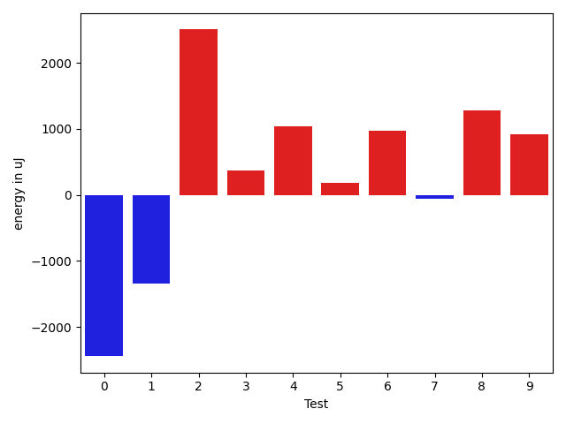

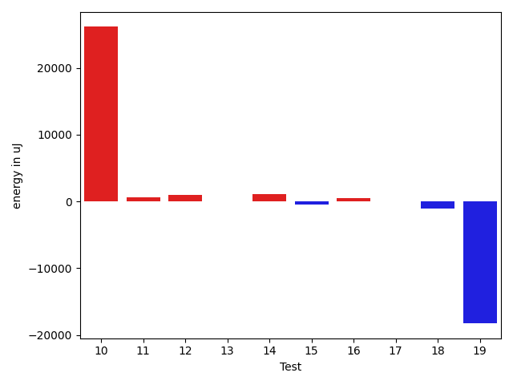

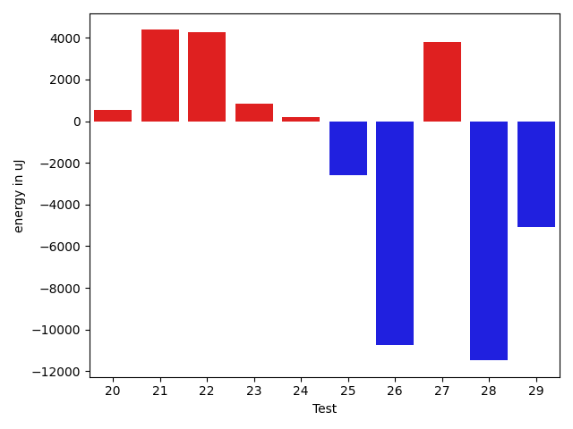

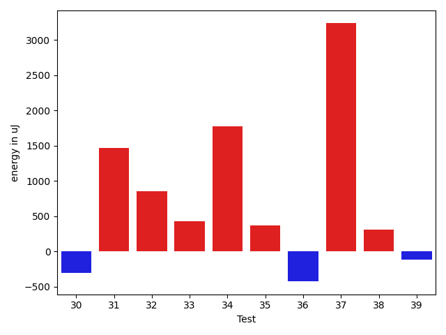

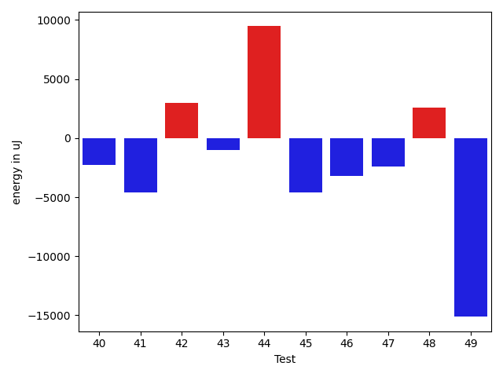

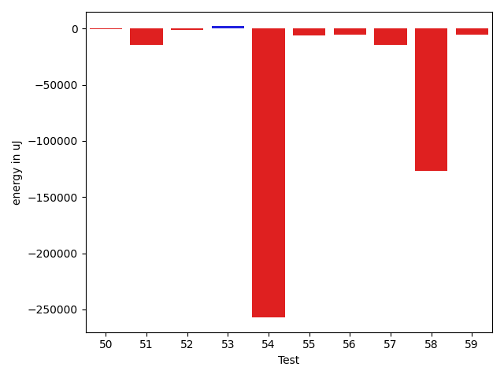

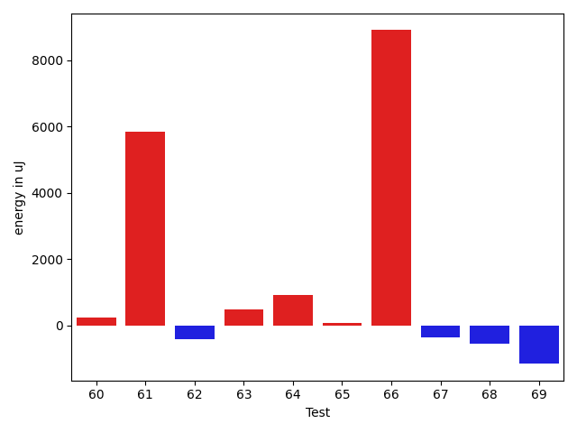

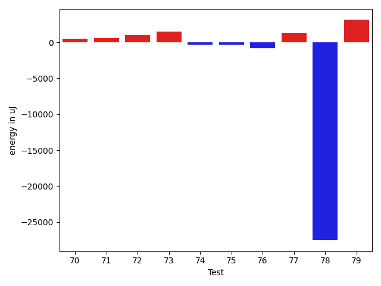

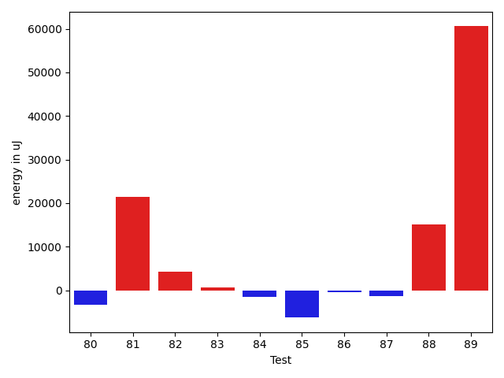

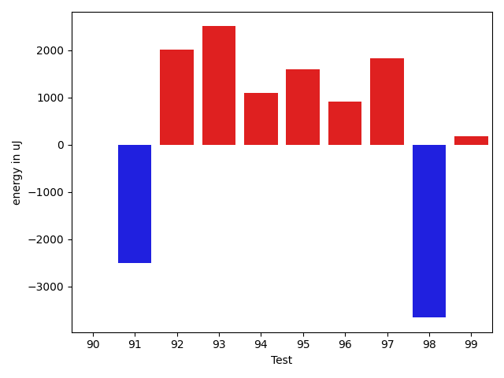

| ID | EnergyV1 | EnergyV2 | DeltaEnergy |
| --- | --- | --- | --- |
| 0 | 141892.33476883534 | 136027.53910052805 | -5864.795668307284 |
| 1 | 148464.0425238507 | 92899.3349850204 | -55564.70753883029 |
| 2 | 42061.91217637887 | 46216.954632608045 | 4155.042456229174 |
| 3 | 39207.41984425907 | 46298.12882384339 | 7090.70897958432 |
| 4 | 38898.02352244999 | 68068.19260136831 | 29170.16907891832 |
| 5 | 50124.10738306325 | 189381.0133036552 | 139256.90592059196 |
| 6 | 48873.479139202915 | 38913.655532355275 | -9959.82360684764 |
| 7 | 106908.3844219091 | 139275.5603141308 | 32367.175892221698 |
| 8 | 59183.561669730596 | 60106.417651416596 | 922.8559816859997 |
| 9 | 245706.44965309245 | 56345.70013032945 | -189360.749522763 |
| 10 | 60778.04100063046 | 47613.50861334041 | -13164.532387290048 |
| 11 | 41236.02722713198 | 48804.499197638244 | 7568.471970506267 |
| 12 | 94041.56548782316 | 70618.14207551672 | -23423.423412306438 |
| 13 | 42052.771699905396 | 46289.55717039108 | 4236.785470485687 |
| 14 | 98159.67237663269 | 45233.21505737305 | -52926.45731925964 |
| 15 | 47584.45131904079 | 162334.2053297064 | 114749.75401066561 |
| 16 | 45871.135526289734 | 81072.10500714733 | 35200.969480857595 |
| 17 | 44970.43424351835 | 41454.541191500524 | -3515.8930520178255 |
| 18 | 47327.7355519993 | 46420.6050293985 | -907.1305226007971 |
| 19 | 45874.056738808344 | 45450.7458119758 | -423.31092683254246 |
| 20 | 179045.63958892183 | 140985.88643649634 | -38059.75315242549 |
| 21 | 42710.57797270179 | 41841.39174524645 | -869.186227455335 |
| 22 | 76050.16039252191 | 75297.65935721919 | -752.5010353027174 |
| 23 | 42864.76836601594 | 47211.60201096715 | 4346.8336449512135 |
| 24 | 116733.73452643263 | 89264.66370416444 | -27469.070822268186 |
| 25 | 45326.09487014271 | 37323.747206980624 | -8002.347663162087 |
| 26 | 36717.69418108475 | 41372.352603294115 | 4654.658422209366 |
| 27 | 172207.49850521726 | 109627.763411445 | -62579.73509377225 |
| 28 | 42318.01425743103 | 41813.77904891968 | -504.23520851135254 |
| 29 | 42532.128762038425 | 41209.44522368908 | -1322.6835383493453 |
| 30 | 42563.77710703667 | 125436.7767792295 | 82872.99967219283 |
| 31 | 41165.9216783979 | 42197.29708799041 | 1031.3754095925106 |
| 32 | 42059.468280411325 | 40096.137088775635 | -1963.3311916356906 |
| 33 | 44479.642807006836 | 39195.40538701415 | -5284.237419992685 |
| 34 | 41744.67890930176 | 37420.37026977539 | -4324.308639526367 |
| 35 | 41497.023483365774 | 43409.36380004883 | 1912.340316683054 |
| 36 | 55838.97649165465 | 56468.35826014053 | 629.3817684858805 |
| 37 | 40098.78619171801 | 45053.802169688104 | 4955.015977970092 |
| 38 | 70153.64118344209 | 86107.79477290544 | 15954.153589463356 |
| 39 | 52706.9718660293 | 74048.62959287368 | 21341.65772684438 |
| 40 | 47406.038949908456 | 47750.180360519444 | 344.1414106109878 |
| 41 | 109475.80044632957 | 71939.38078245107 | -37536.41966387849 |
| 42 | 57505.890844310634 | 50842.57208405214 | -6663.318760258495 |
| 43 | 66724.86973824582 | 104579.70094759791 | 37854.831209352094 |
| 44 | 72030.55819209585 | 74278.47744705345 | 2247.9192549575964 |
| 45 | 45699.629673327945 | 39657.06382704906 | -6042.565846278885 |
| 46 | 43452.5499027504 | 43995.51215346377 | 542.9622507133754 |
| 47 | 43829.90449623503 | 72560.54620156062 | 28730.641705325586 |
| 48 | 41580.90715474593 | 99832.67428622677 | 58251.76713148084 |
| 49 | 42060.02198034624 | 43304.39774638318 | 1244.3757660369447 |
| 50 | 44469.99422431431 | 44000.078312096084 | -469.91591221822455 |
| 51 | 58771.227266576156 | 44054.24540741531 | -14716.98185916085 |
| 52 | 40872.66836425608 | 39945.26296029585 | -927.4054039602343 |
| 53 | 38738.42118386207 | 40753.78671726975 | 2015.365533407683 |
| 54 | 428913.4413977241 | 171619.1979908851 | -257294.243406839 |
| 55 | 131438.1253387466 | 125443.84834008192 | -5994.276998664689 |
| 56 | 50228.73737167803 | 44682.09716757317 | -5546.640204104857 |
| 57 | 74401.50523933771 | 59861.53261477966 | -14539.972624558053 |
| 58 | 170030.5070103352 | 43576.25410935891 | -126454.25290097628 |
| 59 | 48032.69376253478 | 42633.53743928638 | -5399.156323248397 |
| 60 | 46961.30687177822 | 57070.65390556413 | 10109.34703378591 |
| 61 | 44819.0335900272 | 42011.8482763429 | -2807.1853136842983 |
| 62 | 57890.20077898683 | 107774.97879761178 | 49884.77801862495 |
| 63 | 48264.19249524554 | 79758.9703268616 | 31494.777831616062 |
| 64 | 78003.0860127768 | 79263.6750484629 | 1260.5890356861055 |
| 65 | 42375.177292126784 | 42005.341432220244 | -369.83585990653955 |
| 66 | 41632.42260129365 | 42064.8775125294 | 432.454911235749 |
| 67 | 397014.0754621359 | 406999.56336323736 | 9985.487901101471 |
| 68 | 42648.527263408905 | 38898.04688060184 | -3750.4803828070653 |
| 69 | 1291763.9418966128 | 1408961.0835796208 | 117197.14168300806 |
| 70 | 42785.79144467754 | 38216.116060884706 | -4569.675383792834 |
| 71 | 43443.28040381358 | 43730.16285485233 | 286.8824510387494 |
| 72 | 38215.49946420081 | 39744.018295826856 | 1528.5188316260464 |
| 73 | 55015.09592187258 | 45570.54764913504 | -9444.548272737535 |
| 74 | 44987.8905761732 | 45561.21515539396 | 573.3245792207599 |
| 75 | 44526.96212312192 | 44445.26504183932 | -81.6970812826039 |
| 76 | 43934.35079193115 | 42595.64427566528 | -1338.7065162658691 |
| 77 | 45701.075735747814 | 46178.32851886749 | 477.2527831196785 |
| 78 | 44380.071044921875 | 41324.81669616699 | -3055.254348754883 |
| 79 | 45045.796966552734 | 42320.756360054016 | -2725.0406064987183 |
| 80 | 142006.99116436028 | 167422.21270474314 | 25415.22154038286 |
| 81 | 62421.14904546738 | 44012.0890179188 | -18409.060027548578 |
| 82 | 46636.16627717018 | 43516.6111907959 | -3119.555086374283 |
| 83 | 38733.55615640676 | 44178.69748369325 | 5445.141327286488 |
| 84 | 45402.22730669379 | 44432.64832496643 | -969.5789817273617 |
| 85 | 113745.54364139179 | 86605.51062426274 | -27140.033017129055 |
| 86 | 48047.97801720201 | 46799.48316059958 | -1248.4948566024323 |
| 87 | 52748.14345659102 | 45830.68842369055 | -6917.455032900463 |
| 88 | 43369.12800597763 | 46056.90479344223 | 2687.7767874645942 |
| 89 | 41608.633614230115 | 44661.81429301074 | 3053.180678780627 |
| 90 | 40620.63818784269 | 43560.312846161425 | 2939.674658318734 |
| 91 | 97953.52866642227 | 78363.92219419414 | -19589.60647222813 |
| 92 | 104362.80424748498 | 86358.64150793866 | -18004.162739546315 |
| 93 | 118746.2641008959 | 93943.92063895625 | -24802.343461939658 |
| 94 | 40931.16834958922 | 43720.38999761734 | 2789.2216480281204 |
| 95 | 37367.39858984947 | 42029.74287418276 | 4662.344284333289 |
| 96 | 43707.357871730885 | 52611.91373313664 | 8904.555861405752 |
| 97 | 44375.27559757233 | 43066.33499135077 | -1308.9406062215567 |
| 98 | 47499.37951359222 | 43063.7773382079 | -4435.602175384316 |
| 99 | 56046.44241492347 | 44543.16083314768 | -11503.281581775787 |

## Delta Duration per test method

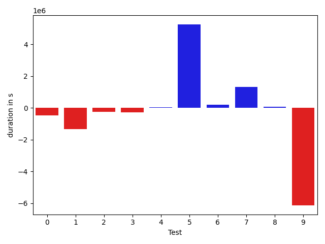

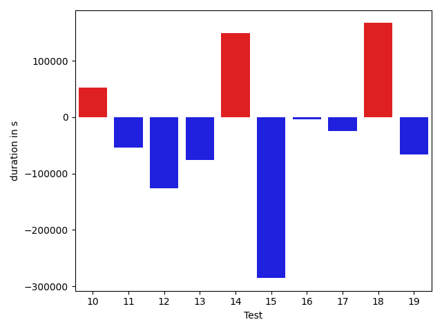

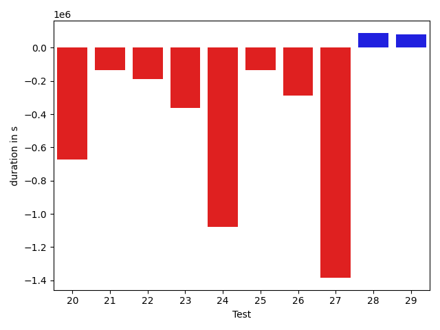

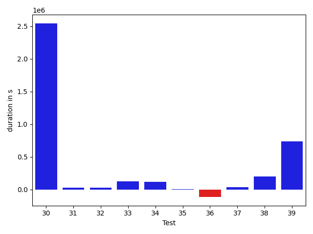

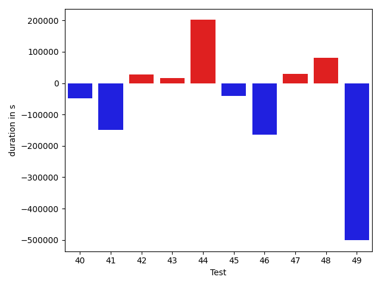

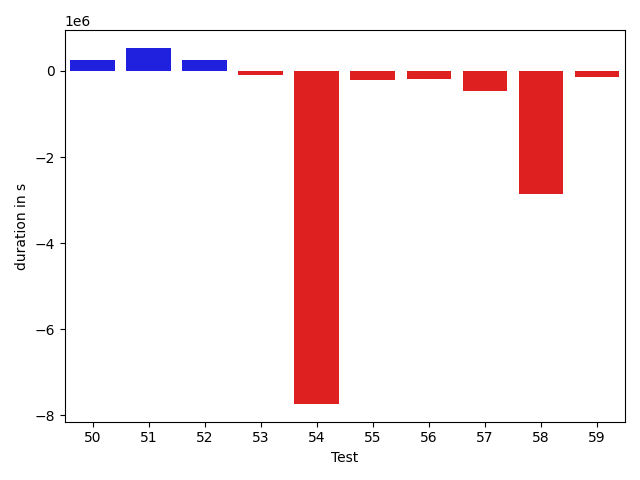

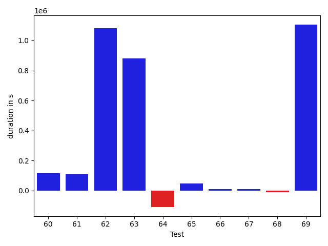

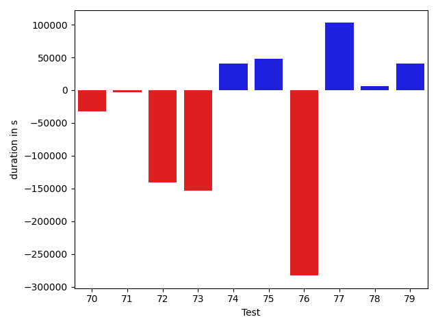

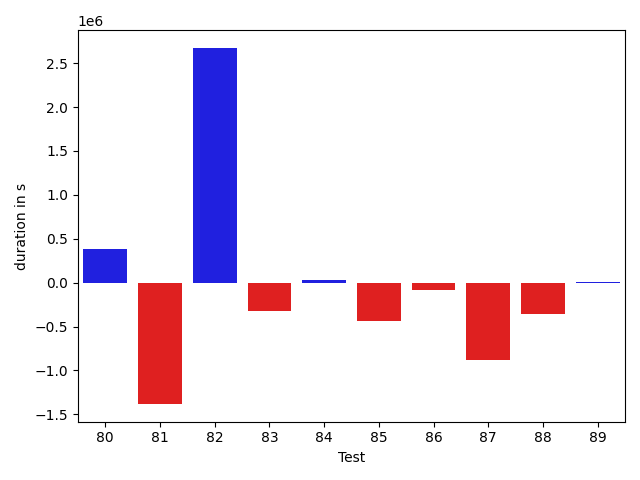

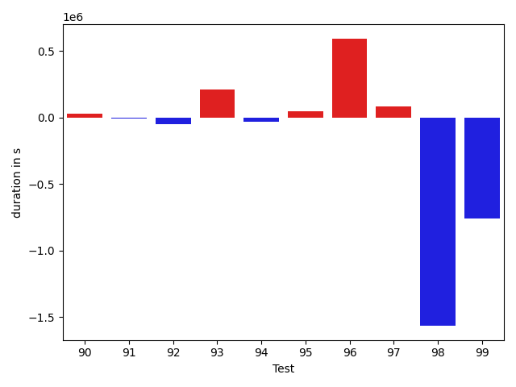

| ID | DurationV1 | DurationsV2 | DeltaDuration |
| --- | --- | --- | --- |
| 0 | 4075693.684861711 | 3607893.7044910863 | -467799.9803706249 |
| 1 | 3815296.0250122026 | 2475026.901492466 | -1340269.1235197363 |
| 2 | 1001536.3205696439 | 761066.8414034805 | -240469.47916616336 |
| 3 | 1107402.1372064934 | 811740.2900973274 | -295661.847109166 |
| 4 | 1357582.4596815314 | 1390079.2032238971 | 32496.74354236573 |
| 5 | 1441047.3751593395 | 6692421.165201014 | 5251373.790041674 |
| 6 | 983241.8171794584 | 1165926.8757372582 | 182685.05855779978 |
| 7 | 2201261.013257635 | 3520855.1339719202 | 1319594.1207142854 |
| 8 | 1461404.899096846 | 1538325.0267747568 | 76920.12767791073 |
| 9 | 7930512.005898415 | 1791418.989290059 | -6139093.016608356 |
| 10 | 1691876.2379336832 | 1404176.0889576583 | -287700.14897602494 |
| 11 | 1520138.075501812 | 1285787.2451256267 | -234350.83037618524 |
| 12 | 2187122.2074515903 | 1536690.4413084085 | -650431.7661431818 |
| 13 | 612481.1629104614 | 452453.8029742241 | -160027.35993623734 |
| 14 | 3546790.8424072266 | 459677.90727233887 | -3087112.9351348877 |
| 15 | 775125.4119474839 | 4727171.352118394 | 3952045.94017091 |
| 16 | 839400.7943350299 | 2296622.3599099237 | 1457221.5655748937 |
| 17 | 952674.1719938586 | 887877.8009119839 | -64796.371081874706 |
| 18 | 1106331.228960037 | 864652.6274928725 | -241678.60146716447 |
| 19 | 1339662.9283091463 | 1222977.6818893969 | -116685.24641974946 |
| 20 | 4080788.18639701 | 3407136.438410272 | -673651.7479867381 |
| 21 | 1440620.1576257423 | 1307086.7153470744 | -133533.44227866782 |
| 22 | 1821315.7185079511 | 1633086.3606939404 | -188229.3578140107 |
| 23 | 1576037.9267673318 | 1213696.4161981586 | -362341.51056917314 |
| 24 | 3228262.796832707 | 2150071.7576319976 | -1078191.0392007092 |
| 25 | 1066250.153431585 | 933632.4410135003 | -132617.71241808473 |
| 26 | 895467.4645724354 | 608145.5618191983 | -287321.90275323705 |
| 27 | 4932212.78058447 | 3547577.7131241467 | -1384635.0674603237 |
| 28 | 430494.9680519104 | 519625.48790359497 | 89130.51985168457 |
| 29 | 458985.9941119412 | 539721.9231282473 | 80735.92901630607 |
| 30 | 1124144.7183879388 | 3667476.4878829527 | 2543331.769495014 |
| 31 | 631030.7872636802 | 662057.088632317 | 31026.301368636778 |
| 32 | 567223.2323236782 | 597841.6509819031 | 30618.418658224866 |
| 33 | 396453.9689359665 | 524348.2223016694 | 127894.25336570293 |
| 34 | 410434.26176452637 | 525377.2395935059 | 114942.97782897949 |
| 35 | 433100.1317873597 | 438752.4123840332 | 5652.280596673489 |
| 36 | 1545707.6643996884 | 1431866.115601061 | -113841.54879862745 |
| 37 | 912379.3162271995 | 946079.9982576446 | 33700.68203044508 |
| 38 | 1900132.9521456177 | 2100515.5074049784 | 200382.5552593607 |
| 39 | 1354277.8064157898 | 2090864.334929956 | 736586.5285141661 |
| 40 | 1245647.036954384 | 1788020.7219046233 | 542373.6849502393 |
| 41 | 2458661.4369400423 | 2091108.985530222 | -367552.45140982023 |
| 42 | 1349862.3757261946 | 1348880.9600125425 | -981.4157136520371 |
| 43 | 1857291.7584560988 | 2452326.6275189472 | 595034.8690628484 |
| 44 | 1504594.8534360414 | 1724828.790711058 | 220233.93727501668 |
| 45 | 1360819.4054295018 | 1535945.4079760427 | 175126.00254654093 |
| 46 | 857318.0904983326 | 1180245.1117464514 | 322927.0212481187 |
| 47 | 1298490.0141623248 | 2084221.4617914055 | 785731.4476290806 |
| 48 | 1318864.7093694094 | 3127478.010816264 | 1808613.3014468546 |
| 49 | 1114039.970948167 | 1416309.361256349 | 302269.390308182 |
| 50 | 499385.3093769707 | 762416.2513702157 | 263030.941993245 |
| 51 | 1304624.797638189 | 1838949.463232448 | 534324.665594259 |
| 52 | 857982.0286151045 | 1111421.3995442106 | 253439.37092910614 |
| 53 | 845977.4203173924 | 763085.8037949968 | -82891.61652239563 |
| 54 | 12549384.981691571 | 4817505.4599715695 | -7731879.5217200015 |
| 55 | 3165848.529640974 | 2951902.078418594 | -213946.45122238016 |
| 56 | 1171812.2349628576 | 982754.9857981151 | -189057.24916474242 |
| 57 | 1664480.4092835616 | 1193603.6609133068 | -470876.7483702549 |
| 58 | 4032910.3892971105 | 1176911.7888237196 | -2855998.600473391 |
| 59 | 866946.3391730734 | 724092.7069433269 | -142853.63222974655 |
| 60 | 893562.3837394512 | 1008593.1687995202 | 115030.78506006906 |
| 61 | 868734.9543500107 | 976326.4929365478 | 107591.53858653712 |
| 62 | 1983296.6664392727 | 3066444.076769838 | 1083147.4103305654 |
| 63 | 1432074.7445823853 | 2313652.78396188 | 881578.0393794947 |
| 64 | 1937515.2065382954 | 1827589.0103933136 | -109926.19614498178 |
| 65 | 829130.6475788483 | 874908.8189179896 | 45778.17133914132 |
| 66 | 976303.3449586565 | 984187.0518042953 | 7883.706845638808 |
| 67 | 9769427.546688892 | 9777332.84656829 | 7905.299879398197 |
| 68 | 1314717.1337907678 | 1304709.7065505423 | -10007.427240225486 |
| 69 | 32758046.947752472 | 33863968.26009759 | 1105921.312345121 |
| 70 | 1111977.2795754978 | 1079715.2574887904 | -32262.02208670741 |
| 71 | 1398811.6040889155 | 1396097.6018730882 | -2714.0022158273496 |
| 72 | 788195.5929014403 | 647783.1836505518 | -140412.4092508885 |
| 73 | 1235734.341429309 | 1082644.3034004744 | -153090.03802883462 |
| 74 | 834863.9064006119 | 875316.3741247798 | 40452.467724167975 |
| 75 | 1059818.0238305058 | 1107269.1745371888 | 47451.15070668305 |
| 76 | 811978.306098938 | 528998.7688941956 | -282979.53720474243 |
| 77 | 374460.3968773484 | 477214.3982143402 | 102754.00133699179 |
| 78 | 428378.7707519531 | 434257.8380279541 | 5879.067276000977 |
| 79 | 369933.50563049316 | 410101.4244134426 | 40167.91878294945 |
| 80 | 3181446.0954362387 | 3562753.8982889284 | 381307.80285268975 |
| 81 | 1813355.801758051 | 432136.0723146675 | -1381219.7294433834 |
| 82 | 478723.4453678131 | 3152357.859375 | 2673634.414007187 |
| 83 | 844202.0480909266 | 519537.9480769364 | -324664.1000139902 |
| 84 | 429576.3880892098 | 456775.4802663028 | 27199.09217709303 |
| 85 | 2526230.6259660954 | 2091116.6182806815 | -435114.0076854138 |
| 86 | 943682.2387385987 | 863280.7391098102 | -80401.49962878844 |
| 87 | 1843048.5578632257 | 965312.0038833282 | -877736.5539798975 |
| 88 | 1076559.8394804227 | 723591.2413039482 | -352968.59817647445 |
| 89 | 1033238.0675447686 | 1038123.4822207277 | 4885.414675959153 |
| 90 | 682461.5082396963 | 623063.8892262578 | -59397.61901343847 |
| 91 | 3082066.4599434407 | 1991435.8264673117 | -1090630.633476129 |
| 92 | 2589994.3238958037 | 2884129.585587641 | 294135.2616918376 |
| 93 | 3463524.282237715 | 2384211.265371179 | -1079313.0168665359 |
| 94 | 773530.4512315486 | 462709.2488403786 | -310821.20239116997 |
| 95 | 641901.1125953197 | 570484.3758484349 | -71416.73674688488 |
| 96 | 673468.4362440717 | 1059259.8641320085 | 385791.4278879368 |
| 97 | 513751.82250642776 | 436920.5489073992 | -76831.27359902859 |
| 98 | 1051971.1551184524 | 834902.2255195243 | -217068.92959892808 |
| 99 | 1264146.5573739384 | 814297.1936511714 | -449849.363722767 |

## Misc.

| ID | Test Class | Test Method |
| --- | --- | --- |
| 0 | com.google.gson.functional.StreamingTypeAdaptersTest | testNullSafe |
| 1 | com.google.gson.functional.JsonAdapterAnnotationOnClassesTest | testJsonAdapterInvoked |
| 2 | com.google.gson.functional.JsonAdapterAnnotationOnClassesTest | testRegisteredDeserializerOverridesJsonAdapter |
| 3 | com.google.gson.functional.JsonAdapterAnnotationOnClassesTest | testRegisteredSerializerOverridesJsonAdapter |
| 4 | com.google.gson.functional.JsonAdapterAnnotationOnClassesTest | testJsonAdapterFactoryInvoked |
| 5 | com.google.gson.functional.CustomDeserializerTest | testDefaultConstructorNotCalledOnObject |
| 6 | com.google.gson.functional.CustomDeserializerTest | testDefaultConstructorNotCalledOnField |
| 7 | com.google.gson.functional.JsonAdapterSerializerDeserializerTest | testJsonSerializerDeserializerBasedJsonAdapterOnFields |
| 8 | com.google.gson.functional.JsonAdapterSerializerDeserializerTest | testJsonSerializerDeserializerBasedJsonAdapterOnClass |
| 9 | com.google.gson.functional.ThrowableFunctionalTest | testExceptionWithoutCause |
| 10 | com.google.gson.functional.ThrowableFunctionalTest | testErrornWithCause |
| 11 | com.google.gson.functional.ThrowableFunctionalTest | testErrorWithoutCause |
| 12 | com.google.gson.functional.ThrowableFunctionalTest | testExceptionWithCause |
| 13 | com.google.gson.functional.StringTest | testEscapingQuotesInStringSerialization |
| 14 | com.google.gson.functional.StringTest | testSingleQuoteInStringSerialization |
| 15 | com.google.gson.functional.ReadersWritersTest | testReadWriteTwoObjects |
| 16 | com.google.gson.functional.ReadersWritersTest | testReadWriteTwoStrings |
| 17 | com.google.gson.functional.MapTest | testConcurrentSkipListMap |
| 18 | com.google.gson.functional.MapTest | testConcurrentHashMap |
| 19 | com.google.gson.functional.MapTest | testConcurrentMap |
| 20 | com.google.gson.functional.MapTest | testConcurrentNavigableMap |
| 21 | com.google.gson.functional.CollectionTest | testStack |
| 22 | com.google.gson.functional.CollectionTest | testPriorityQueue |
| 23 | com.google.gson.functional.CollectionTest | testFieldIsArrayList |
| 24 | com.google.gson.functional.CollectionTest | testWildcardCollectionField |
| 25 | com.google.gson.functional.CollectionTest | testVector |
| 26 | com.google.gson.functional.DelegateTypeAdapterTest | testDelegateInvokedOnStrings |
| 27 | com.google.gson.functional.DelegateTypeAdapterTest | testDelegateInvoked |
| 28 | com.google.gson.functional.TypeAdapterPrecedenceTest | testStreamingHierarchicalFollowedByNonstreaming |
| 29 | com.google.gson.functional.TypeAdapterPrecedenceTest | testNonstreamingFollowedByNonstreaming |
| 30 | com.google.gson.functional.TypeAdapterPrecedenceTest | testStreamingFollowedByNonstreamingHierarchical |
| 31 | com.google.gson.functional.TypeAdapterPrecedenceTest | testNonstreamingHierarchicalFollowedByNonstreaming |
| 32 | com.google.gson.functional.TypeAdapterPrecedenceTest | testStreamingHierarchicalFollowedByNonstreamingHierarchical |
| 33 | com.google.gson.functional.TypeAdapterPrecedenceTest | testStreamingFollowedByNonstreaming |
| 34 | com.google.gson.functional.TypeAdapterPrecedenceTest | testSerializeNonstreamingTypeAdapterFollowedByStreamingTypeAdapter |
| 35 | com.google.gson.functional.TypeAdapterPrecedenceTest | testStreamingFollowedByStreaming |
| 36 | com.google.gson.JsonParserTest | testReadWriteTwoObjects |
| 37 | com.google.gson.JsonParserTest | testParseMixedArray |
| 38 | com.google.gson.functional.ParameterizedTypesTest | testVariableTypeArrayDeserialization |
| 39 | com.google.gson.functional.ParameterizedTypesTest | testVariableTypeDeserialization |
| 40 | com.google.gson.functional.ParameterizedTypesTest | testParameterizedTypeGenericArraysDeserialization |
| 41 | com.google.gson.functional.ParameterizedTypesTest | testVariableTypeFieldsAndGenericArraysDeserialization |
| 42 | com.google.gson.functional.ParameterizedTypesTest | testParameterizedTypeWithVariableTypeDeserialization |
| 43 | com.google.gson.functional.ObjectTest | testSingletonLists |
| 44 | com.google.gson.functional.JsonAdapterAnnotationOnFieldsTest | testPrimitiveFieldAnnotationTakesPrecedenceOverDefault |
| 45 | com.google.gson.functional.JsonAdapterAnnotationOnFieldsTest | testClassAnnotationAdapterFactoryTakesPrecedenceOverDefault |
| 46 | com.google.gson.functional.JsonAdapterAnnotationOnFieldsTest | testJsonAdapterWrappedInNullSafeAsRequested |
| 47 | com.google.gson.functional.JsonAdapterAnnotationOnFieldsTest | testClassAnnotationAdapterTakesPrecedenceOverDefault |
| 48 | com.google.gson.functional.JsonAdapterAnnotationOnFieldsTest | testFieldAnnotationWorksForParameterizedType |
| 49 | com.google.gson.functional.JsonAdapterAnnotationOnFieldsTest | testFieldAnnotationTakesPrecedenceOverClassAnnotation |
| 50 | com.google.gson.functional.JsonAdapterAnnotationOnFieldsTest | testNonPrimitiveFieldAnnotationTakesPrecedenceOverDefault |
| 51 | com.google.gson.functional.JsonAdapterAnnotationOnFieldsTest | testFieldAnnotationTakesPrecedenceOverRegisteredTypeAdapter |
| 52 | com.google.gson.functional.JsonAdapterAnnotationOnFieldsTest | testRegisteredTypeAdapterTakesPrecedenceOverClassAnnotationAdapter |
| 53 | com.google.gson.functional.TypeHierarchyAdapterTest | testRegisterSuperTypeFirst |
| 54 | com.google.gson.functional.TypeHierarchyAdapterTest | testTypeHierarchy |
| 55 | com.google.gson.functional.EnumTest | testEnumSubclass |
| 56 | com.google.gson.functional.EnumTest | testEnumSubclassAsParameterizedType |
| 57 | com.google.gson.functional.EnumTest | testEnumCaseMapping |
| 58 | com.google.gson.functional.EnumTest | testEnumSubclassWithRegisteredTypeAdapter |
| 59 | com.google.gson.functional.EnumTest | testEnumClassWithFields |
| 60 | com.google.gson.functional.EnumTest | testEnumSet |
| 61 | com.google.gson.functional.TypeVariableTest | testBasicTypeVariables |
| 62 | com.google.gson.functional.TypeVariableTest | testAdvancedTypeVariables |
| 63 | com.google.gson.functional.TypeVariableTest | testTypeVariablesViaTypeParameter |
| 64 | com.google.gson.functional.DefaultTypeAdaptersTest | testOverrideBigIntegerTypeAdapter |
| 65 | com.google.gson.functional.DefaultTypeAdaptersTest | testSqlDateSerialization |
| 66 | com.google.gson.functional.DefaultTypeAdaptersTest | testTimestampSerialization |
| 67 | com.google.gson.functional.DefaultTypeAdaptersTest | testDefaultDateDeserializationUsingBuilder |
| 68 | com.google.gson.functional.DefaultTypeAdaptersTest | testOverrideBigDecimalTypeAdapter |
| 69 | com.google.gson.functional.DefaultTypeAdaptersTest | testNullSerialization |
| 70 | com.google.gson.functional.DefaultTypeAdaptersTest | testDateDeserializationWithPattern |
| 71 | com.google.gson.functional.DefaultTypeAdaptersTest | testDateSerializationInCollection |
| 72 | com.google.gson.functional.DefaultTypeAdaptersTest | testBitSetDeserialization |
| 73 | com.google.gson.functional.JavaUtilConcurrentAtomicTest | testAtomicLongArray |
| 74 | com.google.gson.functional.JavaUtilConcurrentAtomicTest | testAtomicLongWithStringSerializationPolicy |
| 75 | com.google.gson.functional.JavaUtilConcurrentAtomicTest | testAtomicIntegerArray |
| 76 | com.google.gson.functional.JavaUtilConcurrentAtomicTest | testAtomicBoolean |
| 77 | com.google.gson.functional.JavaUtilConcurrentAtomicTest | testAtomicLong |
| 78 | com.google.gson.functional.JavaUtilConcurrentAtomicTest | testAtomicInteger |
| 79 | com.google.gson.functional.JavaUtilConcurrentAtomicTest | testAtomicLongArrayWithStringSerializationPolicy |
| 80 | com.google.gson.functional.RuntimeTypeAdapterFactoryFunctionalTest | testSubclassesAutomaticallySerialized |
| 81 | com.google.gson.functional.PrimitiveTest | testQuotedStringSerializationAndDeserialization |
| 82 | com.google.gson.GsonTypeAdapterTest | testTypeAdapterDoesNotAffectNonAdaptedTypes |
| 83 | com.google.gson.GsonTypeAdapterTest | testTypeAdapterThrowsException |
| 84 | com.google.gson.GsonTypeAdapterTest | testTypeAdapterProperlyConvertsTypes |
| 85 | com.google.gson.functional.MapAsArrayTypeAdapterTest | testSerializeComplexMapWithTypeAdapter |
| 86 | com.google.gson.functional.MapAsArrayTypeAdapterTest | testMultipleEnableComplexKeyRegistrationHasNoEffect |
| 87 | com.google.gson.functional.EscapingTest | testGsonAcceptsEscapedAndNonEscapedJsonDeserialization |
| 88 | com.google.gson.functional.EscapingTest | testEscapingObjectFields |
| 89 | com.google.gson.functional.EscapingTest | testGsonDoubleDeserialization |
| 90 | com.google.gson.functional.EscapingTest | testEscapingQuotesInStringArray |
| 91 | com.google.gson.functional.NamingPolicyTest | testComplexFieldNameStrategy |
| 92 | com.google.gson.DefaultInetAddressTypeAdapterTest | testInetAddressSerializationAndDeserialization |
| 93 | com.google.gson.functional.JavaUtilTest | testCurrency |
| 94 | com.google.gson.functional.JavaUtilTest | testProperties |
| 95 | com.google.gson.OverrideCoreTypeAdaptersTest | testOverrideStringAdapter |
| 96 | com.google.gson.OverrideCoreTypeAdaptersTest | testOverrideWrapperBooleanAdapter |
| 97 | com.google.gson.OverrideCoreTypeAdaptersTest | testOverridePrimitiveBooleanAdapter |
| 98 | com.google.gson.functional.CustomTypeAdaptersTest | testRegisterHierarchyAdapterForDate |
| 99 | com.google.gson.functional.UncategorizedTest | testGsonInstanceReusableForSerializationAndDeserialization |

| Test | IterationV1 | IterationV2 | DeltaIteration |
| --- | --- | --- | --- |
| 0 | 99 | 99 | 0 |
| 1 | 99 | 99 | 0 |
| 2 | 50 | 55 | 5 |
| 3 | 64 | 66 | 2 |
| 4 | 95 | 93 | -2 |
| 5 | 55 | 52 | -3 |
| 6 | 70 | 63 | -7 |
| 7 | 99 | 99 | 0 |
| 8 | 97 | 97 | 0 |
| 9 | 99 | 99 | 0 |
| 10 | 99 | 97 | -2 |
| 11 | 87 | 93 | 6 |
| 12 | 99 | 99 | 0 |
| 13 | 19 | 21 | 2 |
| 14 | 20 | 17 | -3 |
| 15 | 78 | 68 | -10 |
| 16 | 69 | 77 | 8 |
| 17 | 80 | 73 | -7 |
| 18 | 70 | 64 | -6 |
| 19 | 99 | 98 | -1 |
| 20 | 99 | 99 | 0 |
| 21 | 96 | 99 | 3 |
| 22 | 99 | 99 | 0 |
| 23 | 89 | 81 | -8 |
| 24 | 98 | 99 | 1 |
| 25 | 75 | 74 | -1 |
| 26 | 33 | 40 | 7 |
| 27 | 99 | 99 | 0 |
| 28 | 19 | 19 | 0 |
| 29 | 30 | 24 | -6 |
| 30 | 91 | 86 | -5 |
| 31 | 39 | 37 | -2 |
| 32 | 31 | 21 | -10 |
| 33 | 21 | 27 | 6 |
| 34 | 17 | 16 | -1 |
| 35 | 26 | 15 | -11 |
| 36 | 81 | 84 | 3 |
| 37 | 68 | 64 | -4 |
| 38 | 99 | 97 | -2 |
| 39 | 97 | 99 | 2 |
| 40 | 99 | 99 | 0 |
| 41 | 99 | 99 | 0 |
| 42 | 96 | 98 | 2 |
| 43 | 99 | 99 | 0 |
| 44 | 99 | 98 | -1 |
| 45 | 98 | 99 | 1 |
| 46 | 75 | 73 | -2 |
| 47 | 95 | 90 | -5 |
| 48 | 99 | 99 | 0 |
| 49 | 89 | 90 | 1 |
| 50 | 40 | 39 | -1 |
| 51 | 94 | 95 | 1 |
| 52 | 68 | 72 | 4 |
| 53 | 53 | 50 | -3 |
| 54 | 99 | 99 | 0 |
| 55 | 99 | 98 | -1 |
| 56 | 92 | 86 | -6 |
| 57 | 85 | 80 | -5 |
| 58 | 92 | 96 | 4 |
| 59 | 61 | 50 | -11 |
| 60 | 76 | 73 | -3 |
| 61 | 68 | 67 | -1 |
| 62 | 99 | 99 | 0 |
| 63 | 97 | 93 | -4 |
| 64 | 99 | 99 | 0 |
| 65 | 56 | 63 | 7 |
| 66 | 76 | 85 | 9 |
| 67 | 99 | 99 | 0 |
| 68 | 99 | 99 | 0 |
| 69 | 99 | 99 | 0 |
| 70 | 76 | 88 | 12 |
| 71 | 96 | 96 | 0 |
| 72 | 30 | 31 | 1 |
| 73 | 94 | 92 | -2 |
| 74 | 67 | 74 | 7 |
| 75 | 89 | 91 | 2 |
| 76 | 18 | 19 | 1 |
| 77 | 25 | 21 | -4 |
| 78 | 14 | 17 | 3 |
| 79 | 17 | 22 | 5 |
| 80 | 99 | 99 | 0 |
| 81 | 23 | 32 | 9 |
| 82 | 22 | 17 | -5 |
| 83 | 34 | 31 | -3 |
| 84 | 26 | 26 | 0 |
| 85 | 99 | 99 | 0 |
| 86 | 83 | 80 | -3 |
| 87 | 80 | 83 | 3 |
| 88 | 56 | 55 | -1 |
| 89 | 46 | 52 | 6 |
| 90 | 37 | 28 | -9 |
| 91 | 87 | 89 | 2 |
| 92 | 99 | 99 | 0 |
| 93 | 99 | 99 | 0 |
| 94 | 31 | 32 | 1 |
| 95 | 23 | 27 | 4 |
| 96 | 47 | 36 | -11 |
| 97 | 22 | 26 | 4 |
| 98 | 86 | 78 | -8 |
| 99 | 49 | 53 | 4 |

| Time Label | Time (s) |
| --- | --- |
| Selection | 36.4004111289978 |
| Injection | 19.852614402770996 |
| Total | 1612.7191441059113 |

