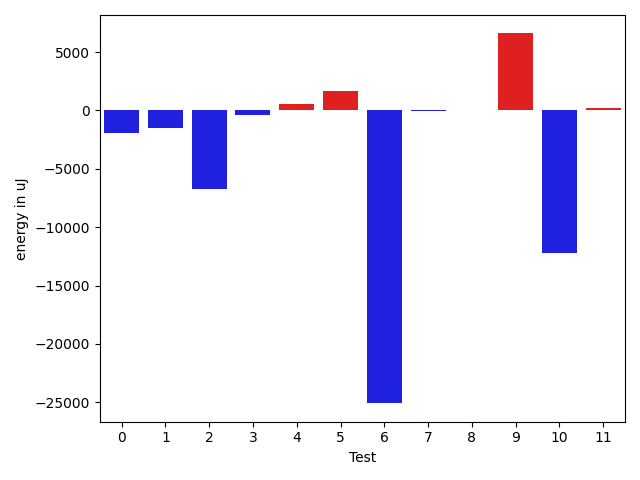

# gson 423ff0

https://github.com/google/gson/commit/423ff0

## Delta Energy per test method

| ID | EnergyV1 | EnergyV2 | DeltaEnergy |
| --- | --- | --- | --- |
| 0 | 127182.47695297265 | 132843.3503215731 | 5660.873368600442 |
| 1 | 73886.25268311337 | 45090.217211252726 | -28796.035471860647 |
| 2 | 171119.68027687556 | 186440.52145724598 | 15320.841180370422 |
| 3 | 86235.24257149373 | 648840.7900535067 | 562605.547482013 |
| 4 | 149146.0224711061 | 142959.497912649 | -6186.52455845708 |
| 5 | 56024.85189409465 | 101395.25073241392 | 45370.39883831926 |
| 6 | 49365.46626704927 | 858183.5307246346 | 808818.0644575853 |
| 7 | 754689.4720472299 | 203222.7110130948 | -551466.761034135 |
| 8 | 70968.90657622565 | 71780.69742998501 | 811.7908537593612 |
| 9 | 38175.22166714106 | 113523.28096314287 | 75348.05929600181 |
| 10 | 593329.7277141558 | 104400.2305290972 | -488929.4971850586 |
| 11 | 37513.88141371001 | 87718.14189706379 | 50204.26048335378 |

## Delta Duration per test method

| ID | DurationV1 | DurationsV2 | DeltaDuration |
| --- | --- | --- | --- |
| 0 | 3851977.4582240647 | 3827396.212137591 | -24581.246086473577 |
| 1 | 2184904.374710663 | 1900179.363595238 | -284725.01111542527 |
| 2 | 5609681.434618349 | 6336583.063821217 | 726901.6292028679 |
| 3 | 3144129.742820937 | 19678327.4588207 | 16534197.715999763 |
| 4 | 4832921.441786883 | 4655883.48319307 | -177037.9585938137 |
| 5 | 1323542.665083774 | 2925586.687973859 | 1602044.022890085 |
| 6 | 1527035.6134523938 | 25684061.523026586 | 24157025.909574192 |
| 7 | 22046102.66664313 | 6879875.407452006 | -15166227.259191126 |
| 8 | 2225782.4765237905 | 2293104.0122789005 | 67321.53575510997 |
| 9 | 1805703.1809878782 | 3787222.082468047 | 1981518.9014801686 |
| 10 | 17208183.316350676 | 2897766.527046947 | -14310416.78930373 |
| 11 | 1125183.1497441344 | 2854670.0659045326 | 1729486.9161603982 |

## Misc.

| ID | Test Class | Test Method |
| --- | --- | --- |
| 0 | com.google.gson.functional.MapTest | testInterfaceTypeMapWithSerializer |
| 1 | com.google.gson.functional.MapTest | testGeneralMapField |
| 2 | com.google.gson.functional.MapTest | testInterfaceTypeMap |
| 3 | com.google.gson.functional.NamingPolicyTest | testGsonWithNonDefaultFieldNamingPolicySerialization |
| 4 | com.google.gson.functional.NamingPolicyTest | testGsonWithNonDefaultFieldNamingPolicyDeserialiation |
| 5 | com.google.gson.functional.NamingPolicyTest | testGsonWithUpperCamelCaseSpacesPolicyDeserialiation |
| 6 | com.google.gson.functional.NamingPolicyTest | testGsonWithUpperCamelCaseSpacesPolicySerialiation |
| 7 | com.google.gson.functional.MapAsArrayTypeAdapterTest | testMultipleEnableComplexKeyRegistrationHasNoEffect |
| 8 | com.google.gson.functional.MapAsArrayTypeAdapterTest | testSerializeComplexMapWithTypeAdapter |
| 9 | com.google.gson.functional.MapAsArrayTypeAdapterTest | testMapWithTypeVariableSerialization |
| 10 | com.google.gson.functional.FieldNamingTest | testUpperCamelCase |
| 11 | com.google.gson.functional.FieldNamingTest | testUpperCamelCaseWithSpaces |

| Test | IterationV1 | IterationV2 | DeltaIteration |
| --- | --- | --- | --- |
| 0 | 99 | 99 | 0 |
| 1 | 99 | 99 | 0 |
| 2 | 99 | 99 | 0 |
| 3 | 79 | 82 | 3 |
| 4 | 82 | 84 | 2 |
| 5 | 53 | 60 | 7 |
| 6 | 62 | 59 | -3 |
| 7 | 93 | 93 | 0 |
| 8 | 99 | 99 | 0 |
| 9 | 99 | 99 | 0 |
| 10 | 93 | 93 | 0 |
| 11 | 70 | 79 | 9 |

| Time Label | Time (s) |
| --- | --- |
| Selection | 34.30575442314148 |
| Injection | 13.868939399719238 |
| Total | 1375.038281917572 |

