# gson 8101ab

https://github.com/google/gson/commit/8101ab

## Delta Energy per test method

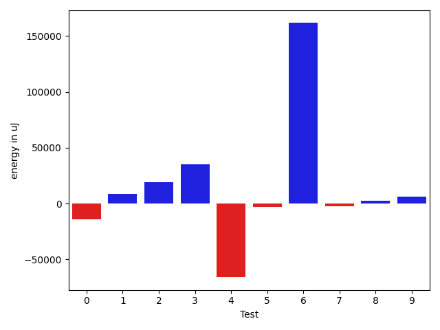

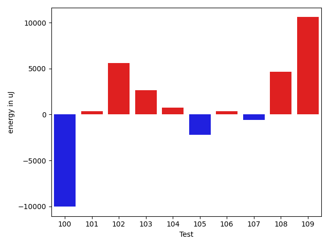

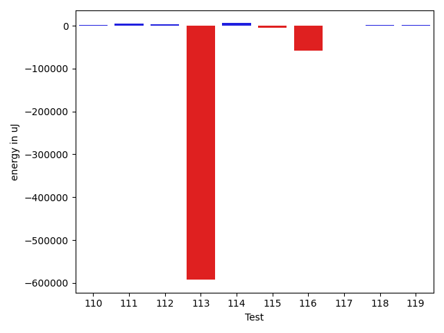

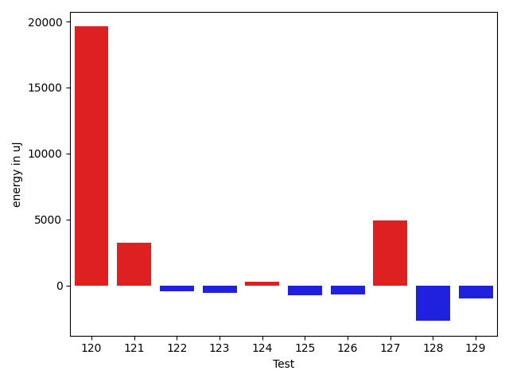

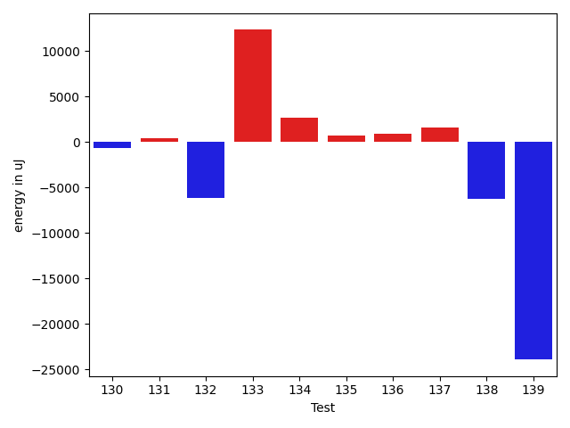

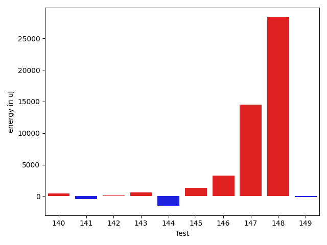

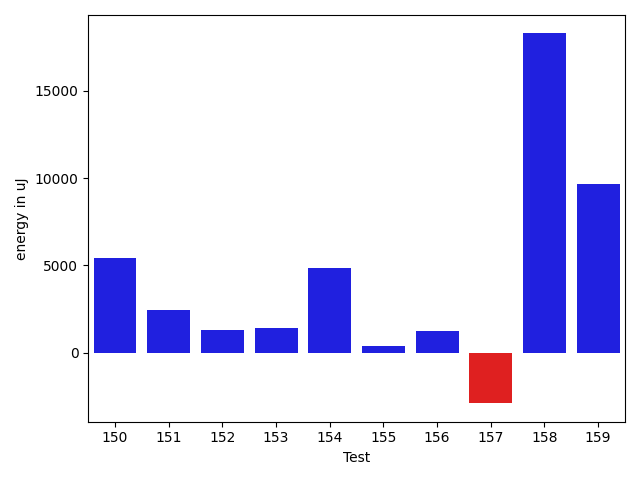

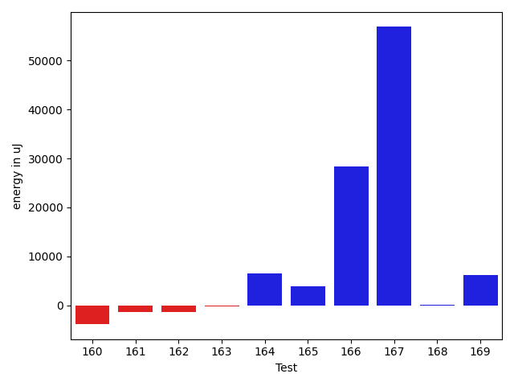

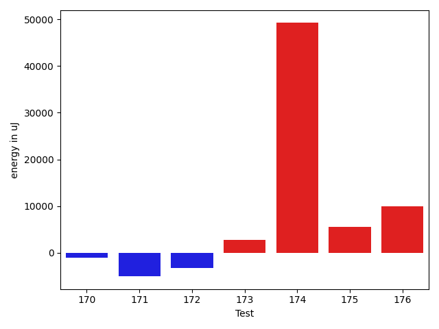

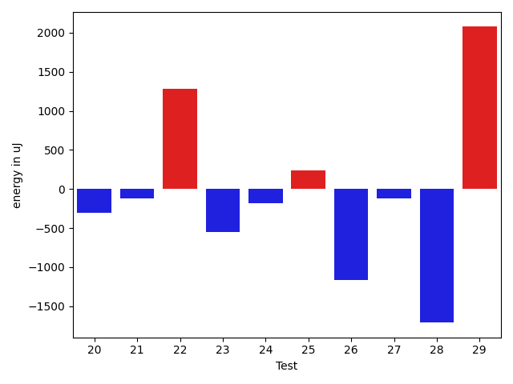

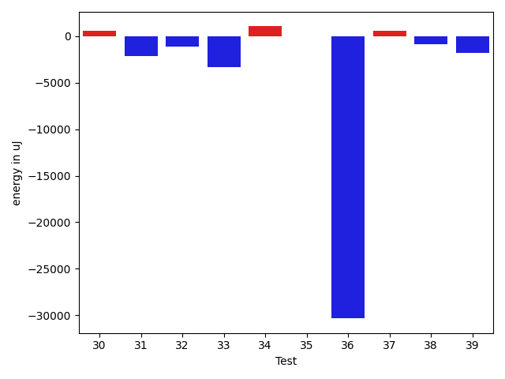

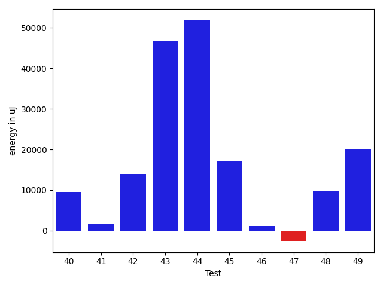

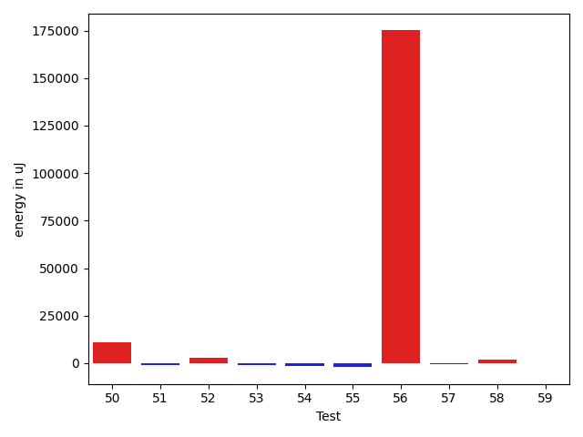

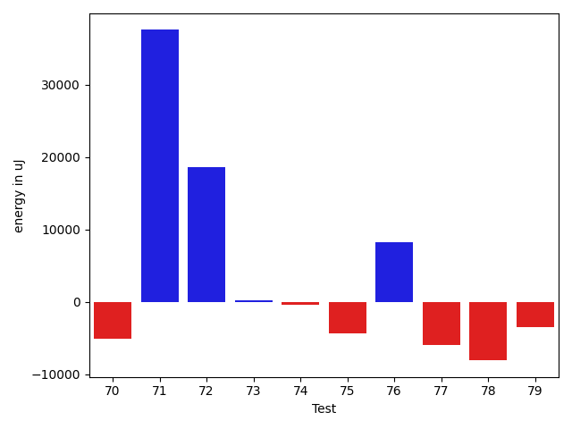

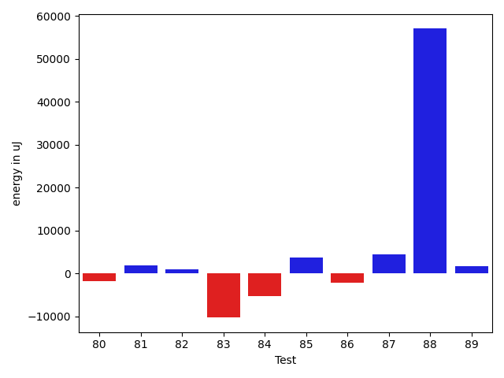

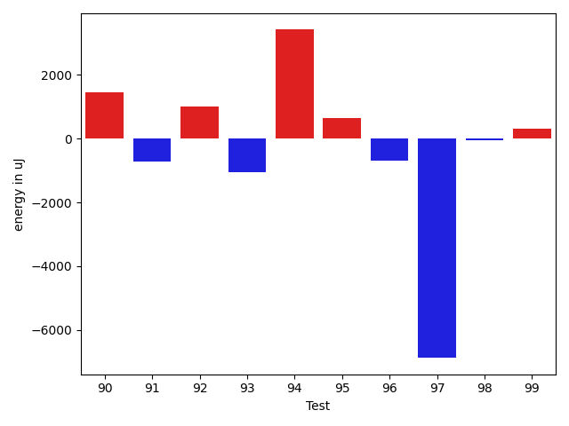

| ID | EnergyV1 | EnergyV2 | DeltaEnergy | σ |
| --- | --- | --- | --- | --- |
| 0 | 57986.52688172043 | 64676.6875 | 6690.160618279573 | 20714.236645304227 | 28741.858341505635 |
| 1 | 49455.8021978022 | 57280.4 | 7824.597802197801 | 15115.750576050063 | 21631.73367478534 |
| 2 | 45827.697916666664 | 45594.45263157895 | -233.24528508771618 | 9458.779603407036 | 9799.326566301348 |
| 3 | 88815.14141414141 | 87572.93939393939 | -1242.2020202020212 | 27166.603746352157 | 26333.141354811592 |
| 4 | 102173.3947368421 | 186078.84210526315 | 83905.44736842104 | 138026.44358114855 | 333550.83134891756 |
| 5 | 43346.51063829787 | 42280.545454545456 | -1065.9651837524143 | 3326.5070164870976 | 5070.927889156459 |
| 6 | 52704.63636363636 | 49900.69696969697 | -2803.939393939392 | 17685.680699570556 | 17204.151493614656 |
| 7 | 93150.95238095238 | 102185.82608695653 | 9034.873706004146 | 83008.130264915 | 86195.57324807324 |
| 8 | 43437.230769230766 | 42258.454545454544 | -1178.7762237762217 | 9012.265955598396 | 2561.5116877972196 |
| 9 | 45774.290322580644 | 45058.42391304348 | -715.8664095371641 | 11780.344532432386 | 9090.970589873772 |
| 10 | 70335.0808080808 | 70414.70707070707 | 79.62626262626145 | 31765.88548172261 | 23164.12129781855 |
| 11 | 42032.03846153846 | 42727.82142857143 | 695.7829670329666 | 3115.7468357802363 | 2597.838690328826 |
| 12 | 48074.23333333333 | 45798.854838709674 | -2275.3784946236556 | 18631.987460070442 | 14073.577849250994 |
| 13 | 42378.42465753425 | 42565.39344262295 | 186.96878508870577 | 3128.633882439892 | 2821.3808227253267 |
| 14 | 375985.4646464646 | 373954.6767676768 | -2030.7878787878435 | 39936.805487061385 | 51678.08908416091 |
| 15 | 41910.74074074074 | 42526.666666666664 | 615.925925925927 | 2996.717890955006 | 2981.668748411286 |
| 16 | 54602.979797979795 | 55061.555555555555 | 458.5757575757598 | 47067.23886358765 | 39263.03467645475 |
| 17 | 41805.8 | 43258.53571428572 | 1452.7357142857145 | 3445.038702249947 | 2661.532687893292 |
| 18 | 52857.64893617021 | 51453.81914893617 | -1403.8297872340409 | 18107.117229296262 | 17166.415198438055 |
| 19 | 46499.78571428572 | 44408.0 | -2091.7857142857174 | 8311.04565519003 | 8007.158750143524 |
| 20 | 42282.916666666664 | 42123.6724137931 | -159.2442528735628 | 2671.9691134172112 | 3025.709739411571 |
| 21 | 42380.318181818184 | 43149.32 | 769.0018181818159 | 3517.184816742499 | 3198.6470604929204 |
| 22 | 42156.86666666667 | 43161.64 | 1004.7733333333308 | 2808.2399438477873 | 1911.321508904245 |
| 23 | 47510.53333333333 | 45310.181818181816 | -2200.3515151515167 | 11337.267204323194 | 8309.696218254277 |
| 24 | 61396.79797979798 | 61711.919191919194 | 315.12121212121565 | 29279.883927841565 | 25837.15984394475 |
| 25 | 52423.951807228914 | 56345.87356321839 | 3921.921755989475 | 18311.06055037788 | 20247.192550559103 |
| 26 | 49225.40476190476 | 46164.188888888886 | -3061.215873015877 | 16543.117091348675 | 13592.99985032692 |
| 27 | 44219.15853658537 | 44325.33734939759 | 106.17881281222071 | 7710.239166942325 | 8965.06966795326 |
| 28 | 54168.5 | 48850.642857142855 | -5317.857142857145 | 28096.705964623325 | 21814.07848879494 |
| 29 | 94241.70707070707 | 101834.72727272728 | 7593.020202020212 | 56911.87965889136 | 57173.081840210754 |
| 30 | 44278.28813559322 | 46070.94827586207 | 1792.6601402688539 | 6676.525453955588 | 9573.870269937883 |
| 31 | 44240.51162790698 | 41840.34285714286 | -2400.1687707641177 | 7680.212470934771 | 3665.4100682138237 |
| 32 | 115283.30120481928 | 91069.09333333334 | -24214.207871485938 | 252490.1650502968 | 213201.8207614043 |
| 33 | 43996.6 | 46927.59090909091 | 2930.990909090913 | 3538.4205516020843 | 28714.515156907677 |
| 34 | 42148.97142857143 | 42882.57575757576 | 733.6043290043308 | 5655.3284708732335 | 4006.390214056924 |
| 35 | 104416.44444444444 | 95949.62857142858 | -8466.815873015861 | 88009.14908041108 | 91207.12684123687 |
| 36 | 83568.04040404041 | 75034.26262626263 | -8533.777777777781 | 48001.55627967801 | 45178.70352180135 |
| 37 | 41357.096153846156 | 41844.6037735849 | 487.50761973874614 | 3799.3993313701544 | 4462.004141214144 |
| 38 | 42640.181818181816 | 41755.525 | -884.6568181818147 | 5290.693513883717 | 4645.209037209735 |
| 39 | 46277.9375 | 43900.36842105263 | -2377.5690789473665 | 11114.708975996346 | 8579.43738316414 |
| 40 | 42132.117647058825 | 42625.4375 | 493.31985294117476 | 3693.9469228065673 | 3126.3267777207407 |
| 41 | 41516.92857142857 | 42157.23529411765 | 640.306722689078 | 3628.4207498242404 | 3455.9616781884697 |
| 42 | 45334.163265306124 | 45296.05263157895 | -38.11063372717763 | 14289.087553661415 | 11254.158730623629 |
| 43 | 43497.666666666664 | 42446.0 | -1051.6666666666642 | 4249.313264778465 | 2537.5848261683786 |
| 44 | 42560.153846153844 | 42713.95652173913 | 153.8026755852843 | 3623.4112772391254 | 2865.306698482819 |
| 45 | 40852.833333333336 | 44797.125 | 3944.2916666666642 | 3668.3485801591373 | 3503.4480909586296 |
| 46 | 43090.666666666664 | 42675.7 | -414.96666666666715 | 4680.70520565248 | 3044.5692486787025 |
| 47 | 41545.28 | 43273.846153846156 | 1728.5661538461572 | 3527.125521100716 | 3520.9062501698636 |
| 48 | 42890.694444444445 | 41778.47222222222 | -1112.2222222222263 | 3888.5114391231205 | 3542.2619616262077 |
| 49 | 46200.26315789474 | 47629.32 | 1429.0568421052594 | 9168.145366270308 | 12167.492684098888 |
| 50 | 51830.4126984127 | 62966.20754716981 | 11135.794848757112 | 23145.09992958153 | 35420.872271925975 |
| 51 | 42542.40350877193 | 41752.76470588235 | -789.6388028895817 | 3602.4422800428492 | 4088.4368295648833 |
| 52 | 52077.369047619046 | 55060.217391304344 | 2982.8483436852985 | 18716.547871678995 | 26167.757368823382 |
| 53 | 43099.01960784314 | 41928.186046511626 | -1170.833561331514 | 2956.615476866565 | 4198.7359795362 |
| 54 | 43227.434782608696 | 41740.16129032258 | -1487.2734922861127 | 3322.9649388576354 | 4484.070293086435 |
| 55 | 44746.375 | 42676.25 | -2070.125 | 8022.372902350962 | 3734.6702358887505 |
| 56 | 43360.857142857145 | 218418.53846153847 | 175057.68131868134 | 4931.642943527946 | 361146.2258528905 |
| 57 | 42644.48888888889 | 42208.02564102564 | -436.4632478632484 | 4401.548266095174 | 3471.1988211211406 |
| 58 | 43251.65909090909 | 45014.54347826087 | 1762.8843873517835 | 8347.982047785237 | 10571.254365344033 |
| 59 | 41944.64444444444 | 41710.82352941176 | -233.8209150326802 | 3342.9339618933914 | 4201.696901397229 |
| 60 | 42109.71428571428 | 41910.72727272727 | -198.98701298701053 | 2963.469996198265 | 4441.710708334 |
| 61 | 43139.96153846154 | 41175.65625 | -1964.305288461539 | 3245.876668124431 | 4317.175433728161 |
| 62 | 110580.109375 | 157282.77142857143 | 46702.66205357143 | 254912.16300050734 | 337269.5040378231 |
| 63 | 41772.166666666664 | 42431.979166666664 | 659.8125 | 3683.287149031721 | 3923.0848166631113 |
| 64 | 71917.15217391304 | 76683.52272727272 | 4766.37055335968 | 33758.25352765917 | 38914.25169785523 |
| 65 | 42443.0 | 42771.649122807015 | 328.6491228070154 | 3782.804115942542 | 3859.471582280281 |
| 66 | 179344.2323232323 | 175542.84848484848 | -3801.38383838383 | 166726.27532205058 | 141424.48937470568 |
| 67 | 43486.16 | 43925.08571428571 | 438.92571428570955 | 6794.728529362549 | 6300.950299626825 |
| 68 | 43764.15730337079 | 43280.392857142855 | -483.76444622793497 | 9474.728438667335 | 6725.5102497485495 |
| 69 | 42655.0 | 42697.2 | 42.19999999999709 | 3386.7249264256357 | 4297.217443881564 |
| 70 | 45932.03448275862 | 45899.84210526316 | -32.192377495463006 | 9124.947181643103 | 9194.428683565637 |
| 71 | 42222.9375 | 42934.470588235294 | 711.5330882352937 | 4825.739347094262 | 3761.346733436702 |
| 72 | 43388.38775510204 | 43684.49152542373 | 296.10377032168617 | 3670.813188094823 | 3522.658252681122 |
| 73 | 42431.22222222222 | 43295.3 | 864.0777777777839 | 4841.72064290688 | 2910.723623087565 |
| 74 | 43087.857142857145 | 46357.391304347824 | 3269.5341614906793 | 7999.31269539074 | 11684.352832217557 |
| 75 | 41230.096774193546 | 42886.71428571428 | 1656.617511520737 | 5364.4165864719525 | 7359.307733636864 |
| 76 | 152516.63636363635 | 119671.65882352942 | -32844.977540106935 | 264679.55620970763 | 204591.3609275272 |
| 77 | 41692.625 | 46611.03571428572 | 4918.410714285717 | 4164.308839336367 | 21185.72080516589 |
| 78 | 42995.9552238806 | 42088.58064516129 | -907.3745787193111 | 7178.559322957427 | 3943.5447479368395 |
| 79 | 104515.80434782608 | 90790.90909090909 | -13724.895256916992 | 64197.48938393815 | 59376.73206576729 |
| 80 | 42434.27868852459 | 42634.36507936508 | 200.08639084049355 | 4962.791322352569 | 4112.744379004671 |
| 81 | 42574.78431372549 | 42087.77272727273 | -487.01158645276155 | 5774.514740035841 | 3668.7882992495956 |
| 82 | 42534.82142857143 | 42230.4375 | -304.38392857142753 | 4197.578298883191 | 4276.195965293657 |
| 83 | 41859.07142857143 | 43239.705882352944 | 1380.6344537815166 | 3705.3918621437083 | 3259.0696031537423 |
| 84 | 41478.290322580644 | 42185.3 | 707.0096774193589 | 5341.464497703689 | 3991.336510911268 |
| 85 | 42349.0 | 42551.290322580644 | 202.290322580644 | 4004.912041673133 | 3556.045023060785 |
| 86 | 42050.666666666664 | 44372.37037037037 | 2321.703703703708 | 3591.168886619261 | 10175.190522006065 |
| 87 | 42582.5306122449 | 43469.846153846156 | 887.3155416012596 | 4344.643885747238 | 3786.29726465466 |
| 88 | 163792.64646464647 | 146055.52525252526 | -17737.121212121216 | 187538.56103779704 | 134724.50562734384 |
| 89 | 52903.666666666664 | 42282.0 | -10621.666666666664 | 48853.641491704584 | 4342.111429554367 |
| 90 | 43795.5 | 45248.54838709677 | 1453.0483870967728 | 5956.24264207649 | 12803.967499627985 |
| 91 | 43227.32 | 42516.03448275862 | -711.2855172413765 | 3596.801642793219 | 3638.6416609418925 |
| 92 | 48271.16438356164 | 49285.829268292684 | 1014.6648847310425 | 13799.492757219003 | 16046.388101912285 |
| 93 | 51311.816326530614 | 50261.463917525776 | -1050.3524090048377 | 18042.628767555325 | 14852.574375113756 |
| 94 | 43885.25 | 47290.698113207545 | 3405.4481132075452 | 7064.313717173301 | 14311.61964989302 |
| 95 | 42669.820512820515 | 43316.34210526316 | 646.5215924426448 | 3603.2941650077955 | 4078.1440520511023 |
| 96 | 42817.3125 | 42109.72727272727 | -707.5852272727279 | 3996.0266367368495 | 3455.0410835844195 |
| 97 | 81720.62711864407 | 74851.10606060606 | -6869.521058038008 | 61550.24081900824 | 57331.04178607458 |
| 98 | 42766.73809523809 | 42701.32 | -65.41809523809206 | 3399.8026557540898 | 3259.6989335826706 |
| 99 | 42508.181818181816 | 42813.295454545456 | 305.11363636363967 | 3061.148560981105 | 3507.211606620807 |
| 100 | 92079.36764705883 | 82048.38333333333 | -10030.984313725494 | 199796.34376622143 | 174925.95402446637 |
| 101 | 42099.16981132075 | 42481.45614035088 | 382.28632903012476 | 3801.1253831873637 | 3790.1062016790697 |
| 102 | 42508.27710843374 | 48098.230769230766 | 5589.953660797029 | 3881.0808589946027 | 14817.071184455013 |
| 103 | 52322.385542168675 | 54974.09302325582 | 2651.707481087142 | 26161.62933000839 | 26821.131156724736 |
| 104 | 42155.26530612245 | 42918.48888888889 | 763.2235827664408 | 3394.685821629425 | 2947.0792970685193 |
| 105 | 46237.78082191781 | 44023.95652173913 | -2213.824300178683 | 12404.454101990917 | 10939.046341120513 |
| 106 | 42798.58928571428 | 43169.620689655174 | 371.0314039408913 | 3025.3664640879556 | 3355.1059278595276 |
| 107 | 44251.35 | 43643.228070175435 | -608.1219298245633 | 8406.728945364739 | 10973.641555248272 |
| 108 | 43073.77777777778 | 47713.709677419356 | 4639.931899641575 | 3860.874606665576 | 27232.60687081259 |
| 109 | 124393.68686868687 | 134984.71717171717 | 10591.030303030304 | 42568.71288730429 | 59287.53612572715 |
| 110 | 43410.11666666667 | 44762.153846153844 | 1352.0371794871753 | 9081.272623906973 | 17590.80481174893 |
| 111 | 42866.58904109589 | 43735.784810126584 | 869.1957690306954 | 6382.4864799488 | 7857.625514482429 |
| 112 | 172384.40404040404 | 132155.63636363635 | -40228.76767676769 | 290270.8146838929 | 200247.4747697602 |
| 113 | 75533.05 | 68177.74666666667 | -7355.30333333333 | 32079.38607497812 | 34558.74804024526 |
| 114 | 45362.22727272727 | 46608.831460674155 | 1246.604187946883 | 10044.508520859537 | 12180.439356880795 |
| 115 | 41649.782608695656 | 44257.41176470588 | 2607.6291560102254 | 4547.295048387431 | 3607.421305795686 |
| 116 | 78062.13157894737 | 76226.13513513513 | -1835.9964438122406 | 168580.3564476271 | 175292.65531354595 |
| 117 | 42166.818181818184 | 43238.857142857145 | 1072.0389610389611 | 3472.6928460930408 | 3788.559838020049 |
| 118 | 42617.0 | 44279.12244897959 | 1662.1224489795932 | 3617.3600931450355 | 12512.320420750777 |
| 119 | 44725.13333333333 | 45346.32608695652 | 621.1927536231888 | 7178.15043215637 | 9472.291580445128 |
| 120 | 115222.32323232324 | 134832.9696969697 | 19610.64646464646 | 112927.8057202229 | 191726.52548659168 |
| 121 | 51396.782608695656 | 54637.34 | 3240.557391304341 | 21843.605771098686 | 26366.026076456797 |
| 122 | 43170.6875 | 42715.35 | -455.33750000000146 | 4025.9284599758785 | 4320.708452036541 |
| 123 | 43277.53125 | 42704.2 | -573.3312500000029 | 3608.37865238994 | 4427.863859695779 |
| 124 | 42461.28571428572 | 42724.44827586207 | 263.1625615763551 | 3592.823701065608 | 3298.1473544192268 |
| 125 | 42391.57575757576 | 41631.67741935484 | -759.898338220919 | 3792.624637134577 | 4243.812827552197 |
| 126 | 42613.9375 | 41904.5 | -709.4375 | 4241.100085307319 | 3419.168082297213 |
| 127 | 47452.55357142857 | 52350.065573770495 | 4897.512002341922 | 24886.170545620334 | 31783.724755603496 |
| 128 | 54785.795918367345 | 52092.454545454544 | -2693.3413729128006 | 21697.64727204366 | 25212.490215649002 |
| 129 | 44083.39705882353 | 43079.70491803279 | -1003.692140790743 | 15790.22057844265 | 4030.232834441687 |
| 130 | 94803.29166666667 | 94175.70707070707 | -627.5845959596045 | 44972.898822725416 | 44033.41446514962 |
| 131 | 44048.70886075949 | 44465.22222222222 | 416.5133614627266 | 9361.825672799947 | 10488.642601863674 |
| 132 | 61469.03333333333 | 55345.45652173913 | -6123.576811594205 | 38577.07034364959 | 28729.122911978848 |
| 133 | 87851.59139784946 | 100171.68478260869 | 12320.093384759224 | 136284.6513662731 | 160534.322309154 |
| 134 | 41439.55263157895 | 44069.895833333336 | 2630.343201754389 | 4315.6092129395665 | 3037.560851513811 |
| 135 | 41948.35897435898 | 42672.023255813954 | 723.6642814549778 | 5113.904251318188 | 3639.7255422236144 |
| 136 | 41854.818181818184 | 42744.325 | 889.5068181818133 | 3942.8427116435073 | 3995.678543048102 |
| 137 | 42258.48780487805 | 43804.5 | 1546.012195121948 | 5071.044113019798 | 7030.950571981869 |
| 138 | 58029.71428571428 | 51747.380281690144 | -6282.334004024138 | 41392.95315435953 | 24947.193012309304 |
| 139 | 142490.5873015873 | 118573.5974025974 | -23916.98989898991 | 229844.14574149853 | 208038.82357438613 |
| 140 | 42485.30612244898 | 43280.10344827586 | 794.797325826883 | 4204.740425893873 | 3928.6564286185726 |
| 141 | 42453.27777777778 | 43028.58181818182 | 575.3040404040366 | 4398.588369586511 | 7147.407966760104 |
| 142 | 42680.06060606061 | 43084.87096774193 | 404.81036168132414 | 4535.611534989181 | 4308.53418485456 |
| 143 | 43159.21951219512 | 43222.26666666667 | 63.0471544715474 | 3170.45984594368 | 3594.0534986434345 |
| 144 | 59666.818181818184 | 47977.58666666667 | -11689.231515151514 | 42354.12029320286 | 25422.516695818213 |
| 145 | 128360.56842105264 | 121200.11578947368 | -7160.452631578955 | 283516.74615587306 | 196483.82488004415 |
| 146 | 82114.28282828283 | 84926.25252525252 | 2811.969696969696 | 42675.27489559919 | 39067.418339894335 |
| 147 | 71815.36363636363 | 69710.60606060606 | -2104.7575757575687 | 37493.190062997994 | 26243.125210702518 |
| 148 | 66776.63636363637 | 69708.16161616161 | 2931.5252525252436 | 36722.3477929084 | 28715.86028791216 |
| 149 | 55255.21212121212 | 48598.0 | -6657.21212121212 | 34349.27324956361 | 20569.99019121464 |
| 150 | 72641.07692307692 | 73897.44318181818 | 1256.3662587412546 | 162954.51434600187 | 155362.26529790548 |
| 151 | 44230.818181818184 | 44112.26315789474 | -118.55502392344351 | 6918.210512424067 | 2712.7661711192463 |
| 152 | 43090.68 | 42116.954545454544 | -973.7254545454562 | 3682.4656817952837 | 4305.596489953224 |
| 153 | 42115.969696969696 | 42599.02777777778 | 483.0580808080849 | 3337.1004060851765 | 3320.011332695778 |
| 154 | 43434.84 | 42164.958333333336 | -1269.8816666666607 | 3432.989643794458 | 4738.993392405595 |
| 155 | 42555.0 | 41952.75 | -602.25 | 3483.8594020616465 | 3905.9223039690455 |
| 156 | 42523.80952380953 | 43386.653846153844 | 862.8443223443173 | 3399.01890073126 | 4318.337785112619 |
| 157 | 43605.52173913043 | 42475.086956521736 | -1130.434782608696 | 3536.984331682979 | 4401.514313654805 |
| 158 | 97739.47368421052 | 189553.35 | 91813.87631578949 | 218631.63466466614 | 348179.41015563736 |
| 159 | 44527.31481481482 | 44073.666666666664 | -453.64814814815327 | 4809.92761100558 | 7738.320730121119 |
| 160 | 42534.23809523809 | 42744.791666666664 | 210.55357142857247 | 3419.07866878062 | 4146.692878861083 |
| 161 | 320200.70707070705 | 323262.37373737374 | 3061.666666666686 | 58907.40404429162 | 115679.40118358868 |
| 162 | 49367.01298701299 | 47189.1976744186 | -2177.8153125943863 | 17581.419106688354 | 15105.929652630686 |
| 163 | 49064.282051282054 | 48969.02702702703 | -95.25502425502782 | 23694.922811620472 | 19558.8080006087 |
| 164 | 53524.05882352941 | 49453.78571428572 | -4070.273109243695 | 16853.819502417522 | 12207.372635762673 |
| 165 | 126573.97435897436 | 42074.07894736842 | -84499.89541160595 | 286655.9405982743 | 4786.280455534388 |
| 166 | 42180.291666666664 | 42973.22222222222 | 792.9305555555547 | 4739.541200362178 | 4524.152077980068 |
| 167 | 47382.82142857143 | 42649.46153846154 | -4733.3598901098885 | 11170.530416660655 | 6877.345246033246 |
| 168 | 64530.454545454544 | 49762.38461538462 | -14768.069930069927 | 57487.33295789229 | 14058.67283121518 |
| 169 | 151015.61224489796 | 114818.51063829787 | -36197.10160660009 | 310394.4614038668 | 250728.48829037667 |
| 170 | 45102.878787878784 | 44071.431818181816 | -1031.4469696969682 | 8896.32274988695 | 7099.554382295373 |
| 171 | 48165.7037037037 | 43104.51612903226 | -5061.187574671443 | 29795.661341898376 | 6047.521693788012 |
| 172 | 45387.21875 | 42062.84210526316 | -3324.37664473684 | 12219.208080248018 | 4085.4481331615834 |
| 173 | 41461.875 | 44202.5 | 2740.625 | 4495.241968946166 | 10210.573999186194 |
| 174 | 81531.328125 | 130744.46153846153 | 49213.13341346153 | 188418.29507931377 | 287043.4455292346 |
| 175 | 61488.77631578947 | 67097.2027027027 | 5608.426386913234 | 30077.525660497075 | 31350.79920485658 |
| 176 | 59895.48148148148 | 69779.94444444444 | 9884.462962962956 | 35495.4817608501 | 43236.854151769156 |

## Delta Duration per test method

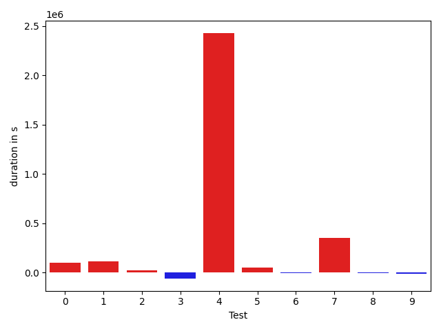

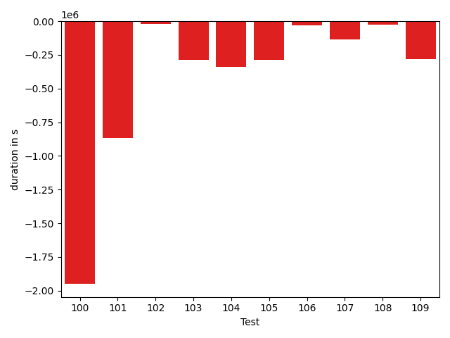

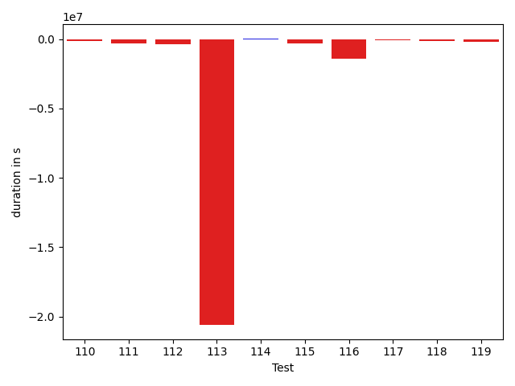

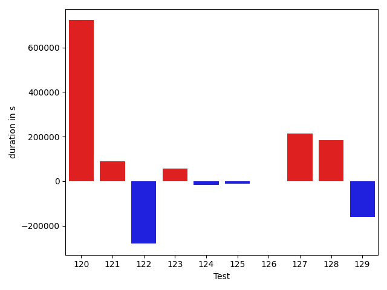

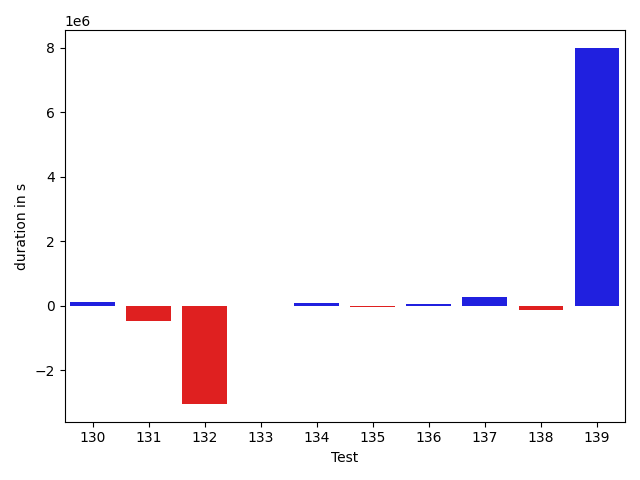

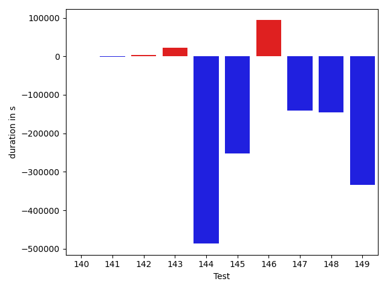

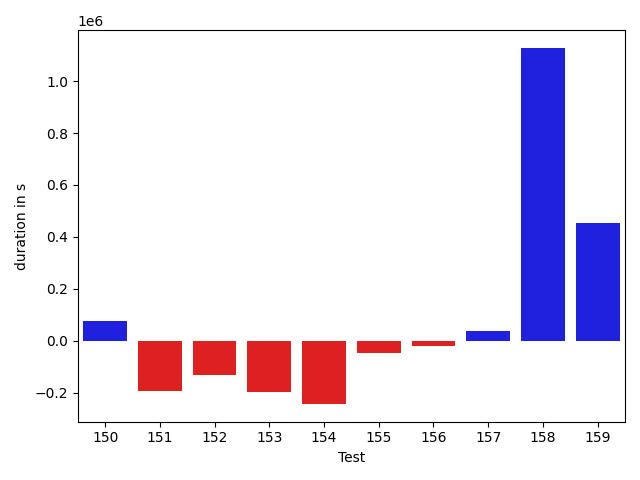

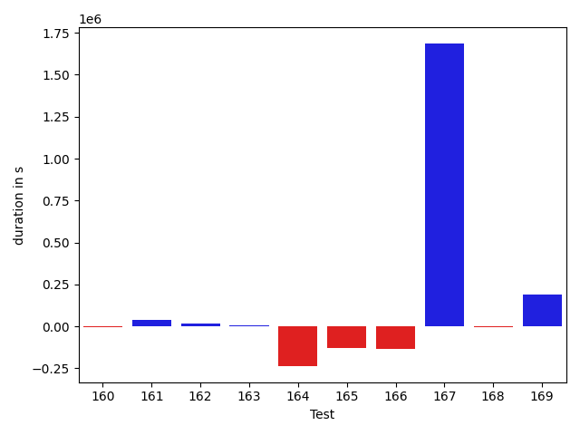

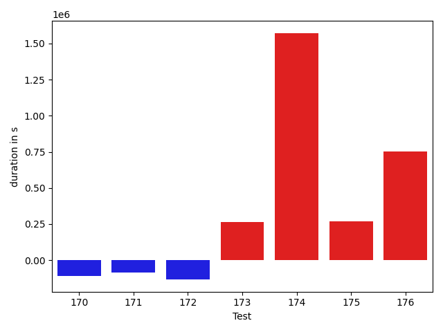

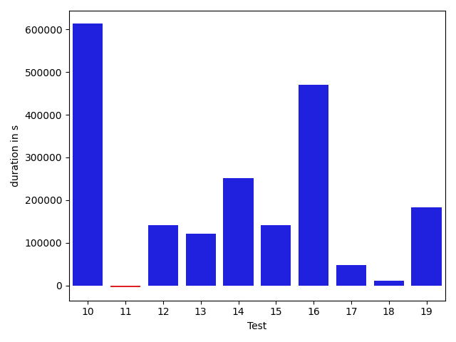

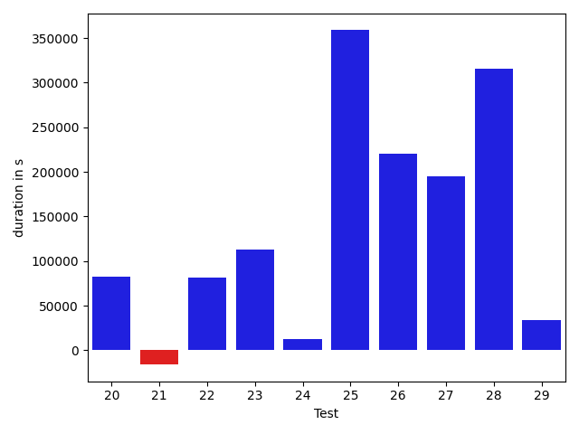

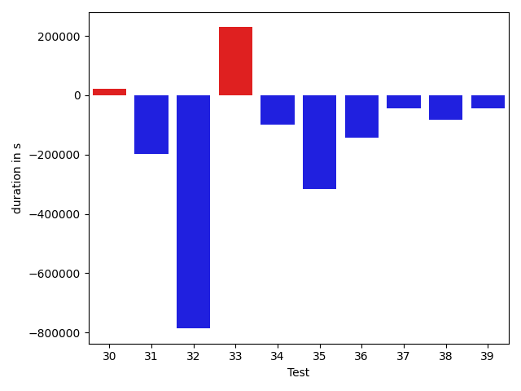

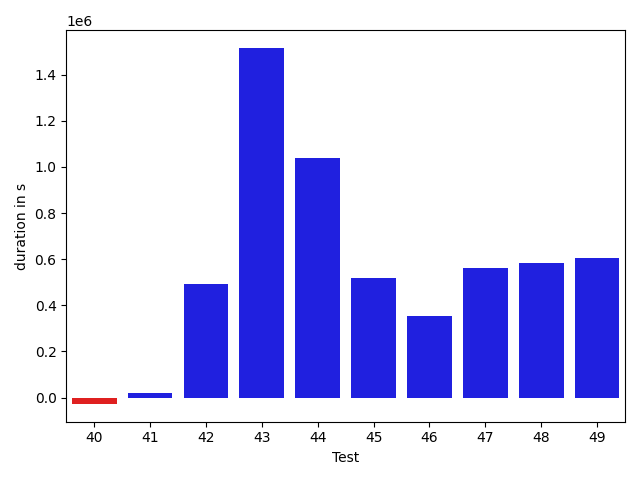

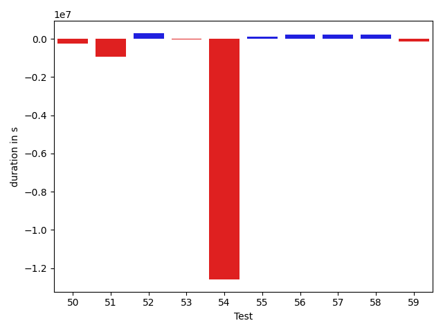

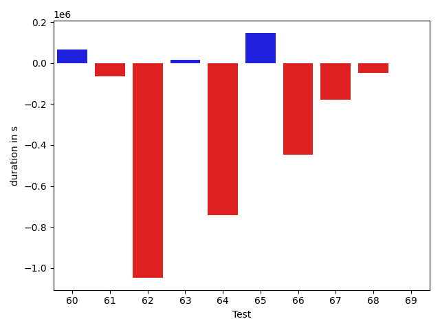

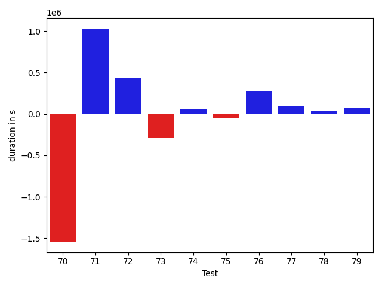

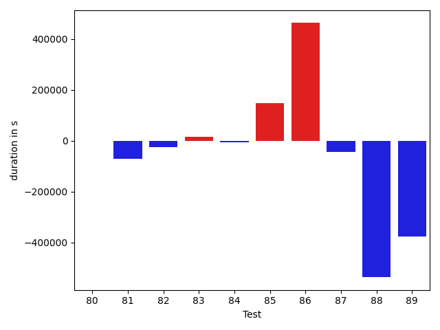

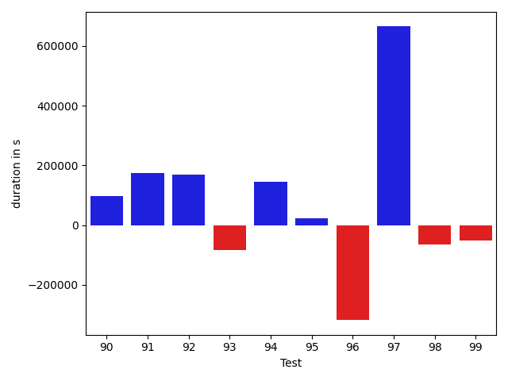

| ID | DurationV1 | DurationsV2 | DeltaDuration |
| --- | --- | --- | --- |
| 0 | 1655186.1182795698 | 1750190.6458333333 | 95004.52755376347 |
| 1 | 1422538.3076923077 | 1535475.4210526317 | 112937.11336032394 |
| 2 | 1290761.4791666667 | 1308651.305263158 | 17889.82609649119 |
| 3 | 2405154.6868686867 | 2342797.373737374 | -62357.31313131284 |
| 4 | 2617305.447368421 | 5047348.565789473 | 2430043.118421052 |
| 5 | 759704.1276595745 | 810401.0227272727 | 50696.895067698206 |
| 6 | 1517458.98989899 | 1513443.1717171718 | -4015.8181818181183 |
| 7 | 2289657.126984127 | 2637839.695652174 | 348182.56866804697 |
| 8 | 933496.4307692308 | 925416.9545454546 | -8079.476223776233 |
| 9 | 1246923.9462365592 | 1233017.956521739 | -13905.98971482017 |
| 10 | 1919575.0404040404 | 1890561.0606060605 | -29013.979797979817 |
| 11 | 809937.2884615385 | 812232.5178571428 | 2295.229395604343 |
| 12 | 1169857.9166666667 | 1004843.4032258064 | -165014.51344086032 |
| 13 | 910947.5753424658 | 957755.9836065574 | 46808.40826409159 |
| 14 | 9317702.404040404 | 9318396.686868686 | 694.2828282825649 |
| 15 | 566580.4444444445 | 544359.2727272727 | -22221.17171717179 |
| 16 | 1545684.4747474748 | 1530749.6464646466 | -14934.82828282821 |
| 17 | 575712.65 | 497344.14285714284 | -78368.50714285718 |
| 18 | 1418067.5 | 1374621.2021276595 | -43446.29787234054 |
| 19 | 793023.4642857143 | 745673.875 | -47349.58928571432 |
| 20 | 807167.7166666667 | 822541.275862069 | 15373.559195402311 |
| 21 | 512411.1818181818 | 463090.2 | -49320.98181818181 |
| 22 | 492397.5 | 451216.2 | -41181.29999999999 |
| 23 | 1094551.88 | 1133287.0909090908 | 38735.210909090936 |
| 24 | 1714404.3333333333 | 1742726.8282828282 | 28322.494949494954 |
| 25 | 1367736.843373494 | 1497073.6896551724 | 129336.84628167842 |
| 26 | 1241748.130952381 | 1239797.5444444444 | -1950.5865079367068 |
| 27 | 1091125.0609756098 | 1141137.939759036 | 50012.87878342625 |
| 28 | 1277409.609375 | 1287829.0571428572 | 10419.44776785723 |
| 29 | 2412121.1717171716 | 2643791.383838384 | 231670.2121212124 |
| 30 | 936004.966101695 | 956843.2413793104 | 20838.27527761541 |
| 31 | 862804.9302325582 | 663603.6571428571 | -199201.27308970108 |
| 32 | 3265044.1686746986 | 2478723.7866666666 | -786320.382008032 |
| 33 | 461659.12 | 690800.7272727273 | 229141.6072727273 |
| 34 | 1097882.8142857142 | 997518.0151515151 | -100364.79913419904 |
| 35 | 2752814.5 | 2435542.285714286 | -317272.2142857141 |
| 36 | 2284723.737373737 | 2142446.717171717 | -142277.02020202018 |
| 37 | 915087.8269230769 | 869771.1320754717 | -45316.69484760519 |
| 38 | 880058.9636363636 | 796282.85 | -83776.11363636365 |
| 39 | 725239.6875 | 682100.1578947369 | -43139.529605263146 |
| 40 | 456169.64705882355 | 424632.8125 | -31536.834558823553 |
| 41 | 444858.3214285714 | 394082.0 | -50776.32142857142 |
| 42 | 1169752.448979592 | 950055.5263157894 | -219696.9226638025 |
| 43 | 436416.8888888889 | 445022.5625 | 8605.673611111124 |
| 44 | 476217.03846153844 | 467502.9130434783 | -8714.125418060168 |
| 45 | 450999.0 | 391279.2916666667 | -59719.708333333314 |
| 46 | 611019.0 | 465532.1 | -145486.90000000002 |
| 47 | 529574.28 | 653763.5 | 124189.21999999997 |
| 48 | 628372.4166666666 | 644907.1111111111 | 16534.694444444496 |
| 49 | 585808.5263157894 | 823521.2 | 237712.67368421052 |
| 50 | 1078382.238095238 | 1490333.3962264152 | 411951.1581311771 |
| 51 | 828790.1754385965 | 845323.0784313725 | 16532.902992776013 |
| 52 | 1429020.107142857 | 1429300.8804347827 | 280.77329192566685 |
| 53 | 699060.9411764706 | 671880.5348837209 | -27180.406292749685 |
| 54 | 632004.7173913043 | 660647.9677419355 | 28643.25035063119 |
| 55 | 841766.6666666666 | 454577.5 | -387189.1666666666 |
| 56 | 547122.0714285715 | 6276366.961538462 | 5729244.89010989 |
| 57 | 733065.0666666667 | 718891.0769230769 | -14173.989743589773 |
| 58 | 963367.4318181818 | 1018815.195652174 | 55447.76383399218 |
| 59 | 736340.0666666667 | 799494.1568627451 | 63154.09019607841 |
| 60 | 499004.5714285714 | 547974.8484848485 | 48970.27705627709 |
| 61 | 585510.9230769231 | 628665.09375 | 43154.17067307688 |
| 62 | 3049639.828125 | 4451186.128571428 | 1401546.3004464284 |
| 63 | 819322.7291666666 | 819139.3958333334 | -183.33333333325572 |
| 64 | 1956981.8152173914 | 1988088.6590909092 | 31106.84387351782 |
| 65 | 730151.2653061225 | 735398.5789473684 | 5247.313641245943 |
| 66 | 4668429.02020202 | 4449792.656565657 | -218636.3636363633 |
| 67 | 974117.0533333333 | 1000920.7 | 26803.64666666661 |
| 68 | 1196547.7640449437 | 1177274.8333333333 | -19272.930711610476 |
| 69 | 439881.5909090909 | 675945.2 | 236063.60909090907 |
| 70 | 755377.3793103448 | 709063.7631578947 | -46313.61615245009 |
| 71 | 637066.875 | 581665.2352941176 | -55401.63970588241 |
| 72 | 783918.612244898 | 766384.4406779661 | -17534.17156693188 |
| 73 | 669256.9722222222 | 662421.875 | -6835.097222222248 |
| 74 | 1050860.0 | 939449.6304347826 | -111410.3695652174 |
| 75 | 615764.0645161291 | 856336.8285714285 | 240572.76405529946 |
| 76 | 4331904.5 | 3243650.776470588 | -1088253.723529412 |
| 77 | 555338.21875 | 700513.0 | 145174.78125 |
| 78 | 985716.1194029851 | 962384.3225806452 | -23331.79682233988 |
| 79 | 2927526.782608696 | 2175889.1136363638 | -751637.668972332 |
| 80 | 873629.4426229508 | 872826.0952380953 | -803.3473848555004 |
| 81 | 846319.3725490196 | 774201.5909090909 | -72117.7816399287 |
| 82 | 564928.4285714285 | 540926.375 | -24002.05357142852 |
| 83 | 545395.25 | 560032.6470588235 | 14637.397058823495 |
| 84 | 591492.2903225806 | 584975.2333333333 | -6517.056989247329 |
| 85 | 580431.7692307692 | 727003.2580645161 | 146571.48883374687 |
| 86 | 533784.1666666666 | 996380.2222222222 | 462596.0555555556 |
| 87 | 787958.4489795918 | 743202.3076923077 | -44756.14128728409 |
| 88 | 4400781.909090909 | 3864187.898989899 | -536594.0101010101 |
| 89 | 782680.7777777778 | 407328.25 | -375352.52777777775 |
| 90 | 951171.8064516129 | 1034942.0161290322 | 83770.20967741939 |
| 91 | 449144.16 | 469452.1379310345 | 20307.97793103452 |
| 92 | 1171842.2602739725 | 1206895.4024390243 | 35053.14216505177 |
| 93 | 1393746.3979591837 | 1407519.3092783506 | 13772.911319166888 |
| 94 | 890224.375 | 991615.7924528302 | 101391.41745283024 |
| 95 | 976867.6923076923 | 1061504.4078947369 | 84636.7155870446 |
| 96 | 756563.3958333334 | 737362.2909090909 | -19201.104924242478 |
| 97 | 1853762.2033898304 | 1700137.5151515151 | -153624.68823831528 |
| 98 | 685892.7619047619 | 716141.24 | 30248.478095238097 |
| 99 | 709027.75 | 738941.9772727273 | 29914.227272727294 |
| 100 | 2437162.779411765 | 2175047.8666666667 | -262114.91274509812 |
| 101 | 808609.358490566 | 836505.245614035 | 27895.88712346903 |
| 102 | 1168883.1204819276 | 1268297.5054945054 | 99414.38501257775 |
| 103 | 1319658.9638554216 | 1414957.1627906978 | 95298.19893527613 |
| 104 | 921786.8775510204 | 711467.2 | -210319.6775510204 |
| 105 | 1135672.2876712328 | 1148227.652173913 | 12555.364502680255 |
| 106 | 822410.9285714285 | 830216.1551724138 | 7805.226600985276 |
| 107 | 1028600.4666666667 | 995582.8421052631 | -33017.62456140353 |
| 108 | 674933.6944444445 | 737948.5161290322 | 63014.82168458775 |
| 109 | 3278281.0505050505 | 3604731.393939394 | 326450.3434343436 |
| 110 | 1079210.3 | 1080664.4487179487 | 1454.1487179487012 |
| 111 | 1145155.3150684931 | 1081782.9746835444 | -63372.340384948766 |
| 112 | 4815963.878787879 | 3602500.484848485 | -1213463.393939394 |
| 113 | 1920178.7625 | 1676666.7733333334 | -243511.98916666652 |
| 114 | 1274551.1818181819 | 1336759.7303370787 | 62208.5485188968 |
| 115 | 528160.9130434783 | 503043.5882352941 | -25117.324808184174 |
| 116 | 1771563.0526315789 | 1787420.0810810812 | 15857.028449502308 |
| 117 | 476370.1818181818 | 462253.28571428574 | -14116.896103896084 |
| 118 | 822786.1086956522 | 874111.3265306122 | 51325.21783495997 |
| 119 | 843534.4888888889 | 878403.1521739131 | 34868.66328502423 |
| 120 | 3037597.0505050505 | 3760454.585858586 | 722857.5353535353 |
| 121 | 1163771.5217391304 | 1254026.2 | 90254.67826086958 |
| 122 | 715895.3125 | 435521.5 | -280373.8125 |
| 123 | 555789.0 | 612877.3 | 57088.30000000005 |
| 124 | 606616.6 | 589270.9655172414 | -17345.634482758585 |
| 125 | 573277.5757575758 | 561434.6774193548 | -11842.898338221014 |
| 126 | 443392.4375 | 443448.75 | 56.3125 |
| 127 | 1031361.3214285715 | 1244640.6557377048 | 213279.33430913335 |
| 128 | 1452216.275510204 | 1635800.797979798 | 183584.5224695939 |
| 129 | 1099066.3382352942 | 939883.6885245901 | -159182.6497107041 |
| 130 | 2650068.7604166665 | 2536727.797979798 | -113340.96243686834 |
| 131 | 1178995.5189873418 | 1132265.2345679011 | -46730.284419440664 |
| 132 | 1690212.288888889 | 1527721.358695652 | -162490.9301932368 |
| 133 | 2238879.6666666665 | 2697847.847826087 | 458968.1811594204 |
| 134 | 738492.8947368421 | 630986.1875 | -107506.70723684214 |
| 135 | 804672.8461538461 | 701043.9534883721 | -103628.89266547398 |
| 136 | 726771.5909090909 | 744844.0 | 18072.40909090906 |
| 137 | 655532.0975609756 | 893655.804347826 | 238123.70678685047 |
| 138 | 1446947.7142857143 | 1238907.2676056337 | -208040.4466800806 |
| 139 | 3876690.8095238097 | 3114169.103896104 | -762521.7056277059 |
| 140 | 661297.8979591837 | 661888.3448275862 | 590.4468684025342 |
| 141 | 852881.074074074 | 851172.2727272727 | -1708.8013468013378 |
| 142 | 594429.6666666666 | 597764.5161290322 | 3334.849462365615 |
| 143 | 638838.731707317 | 660935.6666666666 | 22096.93495934957 |
| 144 | 1694443.3896103897 | 1207741.3066666666 | -486702.0829437231 |
| 145 | 3584917.0210526315 | 3331823.8105263156 | -253093.21052631596 |
| 146 | 2127698.787878788 | 2221571.4343434344 | 93872.64646464633 |
| 147 | 1958491.8282828282 | 1817010.8585858585 | -141480.96969696973 |
| 148 | 1881322.3333333333 | 1735831.4747474748 | -145490.85858585848 |
| 149 | 1234642.1818181819 | 901036.4333333333 | -333605.74848484853 |
| 150 | 2015625.0329670329 | 2075696.9886363635 | 60071.955669330666 |
| 151 | 696587.3636363636 | 383280.8947368421 | -313306.46889952157 |
| 152 | 518880.64 | 448953.2272727273 | -69927.41272727272 |
| 153 | 683473.3333333334 | 642679.2222222222 | -40794.111111111124 |
| 154 | 489952.04 | 486643.875 | -3308.164999999979 |
| 155 | 494369.1111111111 | 487383.21428571426 | -6985.896825396863 |
| 156 | 579253.0476190476 | 560154.5384615385 | -19098.509157509077 |
| 157 | 480933.2173913043 | 480772.95652173914 | -160.26086956518702 |
| 158 | 2398525.3157894737 | 4719573.2 | 2321047.8842105265 |
| 159 | 1053501.851851852 | 925369.7916666666 | -128132.06018518528 |
| 160 | 719893.7857142857 | 712319.7916666666 | -7573.994047619053 |
| 161 | 7725799.575757576 | 8044732.161616161 | 318932.5858585853 |
| 162 | 1254034.5064935065 | 1303513.0 | 49478.49350649351 |
| 163 | 1250329.0897435897 | 1280113.0405405406 | 29783.95079695084 |
| 164 | 1192803.6470588236 | 959670.6785714285 | -233132.9684873951 |
| 165 | 3351592.0256410255 | 762571.552631579 | -2589020.4730094466 |
| 166 | 852631.9166666666 | 528301.1111111111 | -324330.8055555555 |
| 167 | 717544.2142857143 | 763883.3846153846 | 46339.170329670305 |
| 168 | 1304594.2272727273 | 1054052.076923077 | -250542.1503496503 |
| 169 | 4282923.979591837 | 3116498.14893617 | -1166425.830655667 |
| 170 | 803596.0303030303 | 693176.5681818182 | -110419.46212121204 |
| 171 | 807543.2222222222 | 720370.1612903225 | -87173.0609318997 |
| 172 | 697288.28125 | 564443.0263157894 | -132845.25493421056 |
| 173 | 487255.4375 | 751558.0714285715 | 264302.6339285715 |
| 174 | 2139359.328125 | 3710819.2 | 1571459.8718750002 |
| 175 | 1478549.1710526317 | 1749863.6621621621 | 271314.49110953044 |
| 176 | 1231818.5555555555 | 1982614.7222222222 | 750796.1666666667 |

## Misc.

| ID | Test Class | Test Method |
| --- | --- | --- |
| 0 | com.google.gson.functional.StreamingTypeAdaptersTest | testNullSafe |
| 1 | com.google.gson.functional.StreamingTypeAdaptersTest | testSerializeWithCustomTypeAdapter |
| 2 | com.google.gson.functional.StreamingTypeAdaptersTest | testDeserializeWithCustomTypeAdapter |
| 3 | com.google.gson.functional.InstanceCreatorTest | testInstanceCreatorForParametrizedType |
| 4 | com.google.gson.functional.InstanceCreatorTest | testInstanceCreatorReturnsBaseType |
| 5 | com.google.gson.functional.InstanceCreatorTest | testInstanceCreatorReturnsSubTypeForTopLevelObject |
| 6 | com.google.gson.functional.InstanceCreatorTest | testInstanceCreatorForCollectionType |
| 7 | com.google.gson.functional.InstanceCreatorTest | testInstanceCreatorReturnsSubTypeForField |
| 8 | com.google.gson.functional.DefaultTypeAdaptersTest | testDateSerializationWithPatternNotOverridenByTypeAdapter |
| 9 | com.google.gson.functional.DefaultTypeAdaptersTest | testDateSerializationWithPattern |
| 10 | com.google.gson.functional.DefaultTypeAdaptersTest | testOverrideBigIntegerTypeAdapter |
| 11 | com.google.gson.functional.DefaultTypeAdaptersTest | testSqlDateSerialization |
| 12 | com.google.gson.functional.DefaultTypeAdaptersTest | testClassSerialization |
| 13 | com.google.gson.functional.DefaultTypeAdaptersTest | testTimestampSerialization |
| 14 | com.google.gson.functional.DefaultTypeAdaptersTest | testDefaultDateDeserializationUsingBuilder |
| 15 | com.google.gson.functional.DefaultTypeAdaptersTest | testDefaultCalendarSerialization |
| 16 | com.google.gson.functional.DefaultTypeAdaptersTest | testOverrideBigDecimalTypeAdapter |
| 17 | com.google.gson.functional.DefaultTypeAdaptersTest | testDefaultCalendarDeserialization |
| 18 | com.google.gson.functional.DefaultTypeAdaptersTest | testDateSerializationInCollection |
| 19 | com.google.gson.functional.DefaultTypeAdaptersTest | testClassDeserialization |
| 20 | com.google.gson.functional.DefaultTypeAdaptersTest | testDateDeserializationWithPattern |
| 21 | com.google.gson.functional.DefaultTypeAdaptersTest | testDefaultGregorianCalendarSerialization |
| 22 | com.google.gson.functional.DefaultTypeAdaptersTest | testDefaultGregorianCalendarDeserialization |
| 23 | com.google.gson.functional.MapTest | testSerializeMaps |
| 24 | com.google.gson.functional.MapTest | testInterfaceTypeMapWithSerializer |
| 25 | com.google.gson.functional.MapTest | testMapSerializationWithNullValuesSerialized |
| 26 | com.google.gson.functional.MapTest | testMapSubclassDeserialization |
| 27 | com.google.gson.functional.MapTest | testGeneralMapField |
| 28 | com.google.gson.functional.MapTest | testMapSerializationWithNullValueButSerializeNulls |
| 29 | com.google.gson.functional.MapTest | testInterfaceTypeMap |
| 30 | com.google.gson.functional.MapTest | testCustomSerializerForSpecificMapType |
| 31 | com.google.gson.functional.FieldExclusionTest | testDefaultNestedStaticClassIncluded |
| 32 | com.google.gson.functional.FieldExclusionTest | testDefaultInnerClassExclusion |
| 33 | com.google.gson.functional.FieldExclusionTest | testInnerClassExclusion |
| 34 | com.google.gson.functional.CustomDeserializerTest | testCustomDeserializerReturnsNullForArrayElementsForArrayField |
| 35 | com.google.gson.functional.CustomDeserializerTest | testCustomDeserializerReturnsNull |
| 36 | com.google.gson.functional.CustomDeserializerTest | testJsonTypeFieldBasedDeserialization |
| 37 | com.google.gson.functional.CustomDeserializerTest | testCustomDeserializerReturnsNullForArrayElements |
| 38 | com.google.gson.functional.CustomDeserializerTest | testCustomDeserializerReturnsNullForTopLevelObject |
| 39 | com.google.gson.functional.PrimitiveTest | testLongAsStringDeserialization |
| 40 | com.google.gson.functional.PrimitiveTest | testFloatInfinitySerialization |
| 41 | com.google.gson.functional.PrimitiveTest | testNegativeInfinityFloatSerialization |
| 42 | com.google.gson.functional.PrimitiveTest | testDoubleNaNSerialization |
| 43 | com.google.gson.functional.PrimitiveTest | testDoubleInfinitySerialization |
| 44 | com.google.gson.functional.PrimitiveTest | testHtmlCharacterSerialization |
| 45 | com.google.gson.functional.PrimitiveTest | testNegativeInfinitySerialization |
| 46 | com.google.gson.functional.PrimitiveTest | testFloatNaNSerialization |
| 47 | com.google.gson.functional.PrimitiveTest | testLongAsStringSerialization |
| 48 | com.google.gson.functional.NullObjectAndFieldTest | testExplicitSerializationOfNullStringMembers |
| 49 | com.google.gson.functional.NullObjectAndFieldTest | testTopLevelNullObjectDeserialization |
| 50 | com.google.gson.functional.NullObjectAndFieldTest | testCustomSerializationOfNulls |
| 51 | com.google.gson.functional.NullObjectAndFieldTest | testPrintPrintingObjectWithNulls |
| 52 | com.google.gson.functional.NullObjectAndFieldTest | testExplicitSerializationOfNullArrayMembers |
| 53 | com.google.gson.functional.NullObjectAndFieldTest | testCustomTypeAdapterPassesNullSerialization |
| 54 | com.google.gson.functional.NullObjectAndFieldTest | testExplicitSerializationOfNullCollectionMembers |
| 55 | com.google.gson.functional.NullObjectAndFieldTest | testPrintPrintingArraysWithNulls |
| 56 | com.google.gson.functional.NullObjectAndFieldTest | testTopLevelNullObjectSerialization |
| 57 | com.google.gson.functional.NullObjectAndFieldTest | testNullWrappedPrimitiveMemberSerialization |
| 58 | com.google.gson.functional.NullObjectAndFieldTest | testExplicitSerializationOfNulls |
| 59 | com.google.gson.functional.NullObjectAndFieldTest | testCustomTypeAdapterPassesNullDesrialization |
| 60 | com.google.gson.functional.NullObjectAndFieldTest | testNullWrappedPrimitiveMemberDeserialization |
| 61 | com.google.gson.functional.NullObjectAndFieldTest | testExplicitDeserializationOfNulls |
| 62 | com.google.gson.functional.JsonAdapterAnnotationOnClassesTest | testRegisteredAdapterOverridesJsonAdapter |
| 63 | com.google.gson.functional.JsonAdapterAnnotationOnClassesTest | testRegisteredDeserializerOverridesJsonAdapter |
| 64 | com.google.gson.functional.JsonAdapterAnnotationOnClassesTest | testRegisteredSerializerOverridesJsonAdapter |
| 65 | com.google.gson.functional.VersioningTest | testVersionedGsonMixingSinceAndUntilDeserialization |
| 66 | com.google.gson.functional.VersioningTest | testVersionedUntilSerialization |
| 67 | com.google.gson.functional.VersioningTest | testVersionedClassesSerialization |
| 68 | com.google.gson.functional.VersioningTest | testVersionedGsonMixingSinceAndUntilSerialization |
| 69 | com.google.gson.functional.VersioningTest | testIgnoreLaterVersionClassDeserialization |
| 70 | com.google.gson.functional.VersioningTest | testVersionedUntilDeserialization |
| 71 | com.google.gson.functional.VersioningTest | testVersionedGsonWithUnversionedClassesDeserialization |
| 72 | com.google.gson.functional.VersioningTest | testIgnoreLaterVersionClassSerialization |
| 73 | com.google.gson.functional.VersioningTest | testVersionedClassesDeserialization |
| 74 | com.google.gson.functional.VersioningTest | testVersionedGsonWithUnversionedClassesSerialization |
| 75 | com.google.gson.functional.NamingPolicyTest | testGsonWithLowerCaseDashPolicyDeserialiation |
| 76 | com.google.gson.functional.NamingPolicyTest | testGsonDuplicateNameUsingSerializedNameFieldNamingPolicySerialization |
| 77 | com.google.gson.functional.NamingPolicyTest | testGsonWithSerializedNameFieldNamingPolicyDeserialization |
| 78 | com.google.gson.functional.NamingPolicyTest | testGsonWithSerializedNameFieldNamingPolicySerialization |
| 79 | com.google.gson.functional.NamingPolicyTest | testGsonWithNonDefaultFieldNamingPolicyDeserialiation |
| 80 | com.google.gson.functional.NamingPolicyTest | testDeprecatedNamingStrategy |
| 81 | com.google.gson.functional.NamingPolicyTest | testGsonWithNonDefaultFieldNamingPolicySerialization |
| 82 | com.google.gson.functional.NamingPolicyTest | testGsonWithUpperCamelCaseSpacesPolicyDeserialiation |
| 83 | com.google.gson.functional.NamingPolicyTest | testGsonWithLowerCaseUnderscorePolicyDeserialiation |
| 84 | com.google.gson.functional.NamingPolicyTest | testGsonWithLowerCaseUnderscorePolicySerialization |
| 85 | com.google.gson.functional.NamingPolicyTest | testGsonWithLowerCaseDashPolicySerialization |
| 86 | com.google.gson.functional.NamingPolicyTest | testGsonWithUpperCamelCaseSpacesPolicySerialiation |
| 87 | com.google.gson.functional.TypeHierarchyAdapterTest | testRegisterSuperTypeFirst |
| 88 | com.google.gson.functional.TypeHierarchyAdapterTest | testTypeHierarchy |
| 89 | com.google.gson.functional.TypeHierarchyAdapterTest | testRegisterSubTypeFirstAllowed |
| 90 | com.google.gson.functional.CustomTypeAdaptersTest | testCustomNestedSerializers |
| 91 | com.google.gson.functional.CustomTypeAdaptersTest | testCustomAdapterInvokedForMapElementSerialization |
| 92 | com.google.gson.functional.CustomTypeAdaptersTest | testRegisterHierarchyAdapterForDate |
| 93 | com.google.gson.functional.CustomTypeAdaptersTest | testCustomAdapterInvokedForCollectionElementSerializationWithType |
| 94 | com.google.gson.functional.CustomTypeAdaptersTest | testCustomDeserializers |
| 95 | com.google.gson.functional.CustomTypeAdaptersTest | testCustomByteArrayDeserializerAndInstanceCreator |
| 96 | com.google.gson.functional.CustomTypeAdaptersTest | testCustomByteArraySerializer |
| 97 | com.google.gson.functional.CustomTypeAdaptersTest | testEnsureCustomDeserializerNotInvokedForNullValues |
| 98 | com.google.gson.functional.CustomTypeAdaptersTest | testCustomDeserializerInvokedForPrimitives |
| 99 | com.google.gson.functional.CustomTypeAdaptersTest | testCustomTypeAdapterAppliesToSubClassesSerializedAsBaseClass |
| 100 | com.google.gson.functional.CustomTypeAdaptersTest | testCustomSerializers |
| 101 | com.google.gson.functional.CustomTypeAdaptersTest | testCustomNestedDeserializers |
| 102 | com.google.gson.functional.CustomTypeAdaptersTest | testCustomTypeAdapterDoesNotAppliesToSubClasses |
| 103 | com.google.gson.functional.CustomTypeAdaptersTest | testEnsureCustomSerializerNotInvokedForNullValues |
| 104 | com.google.gson.functional.CustomTypeAdaptersTest | testCustomSerializerInvokedForPrimitives |
| 105 | com.google.gson.functional.CustomTypeAdaptersTest | testCustomAdapterInvokedForCollectionElementDeserialization |
| 106 | com.google.gson.functional.CustomTypeAdaptersTest | testCustomAdapterInvokedForMapElementDeserialization |
| 107 | com.google.gson.functional.CustomTypeAdaptersTest | testCustomAdapterInvokedForMapElementSerializationWithType |
| 108 | com.google.gson.functional.CustomTypeAdaptersTest | testCustomAdapterInvokedForCollectionElementSerialization |
| 109 | com.google.gson.functional.EnumTest | testEnumSubclassWithRegisteredTypeAdapter |
| 110 | com.google.gson.functional.MapAsArrayTypeAdapterTest | testMultipleEnableComplexKeyRegistrationHasNoEffect |
| 111 | com.google.gson.functional.MapAsArrayTypeAdapterTest | testMapWithTypeVariableDeserialization |
| 112 | com.google.gson.functional.MapAsArrayTypeAdapterTest | testSerializeComplexMapWithTypeAdapter |
| 113 | com.google.gson.functional.MapAsArrayTypeAdapterTest | testTwoTypesCollapseToOneDeserialize |
| 114 | com.google.gson.functional.MapAsArrayTypeAdapterTest | testMapWithTypeVariableSerialization |
| 115 | com.google.gson.OverrideCoreTypeAdaptersTest | testOverridePrimitiveBooleanAdapter |
| 116 | com.google.gson.OverrideCoreTypeAdaptersTest | testOverrideWrapperBooleanAdapter |
| 117 | com.google.gson.OverrideCoreTypeAdaptersTest | testOverrideStringAdapter |
| 118 | com.google.gson.functional.ExclusionStrategyFunctionalTest | testExclusionStrategyWithMode |
| 119 | com.google.gson.functional.ExclusionStrategyFunctionalTest | testExclusionStrategySerializationDoesNotImpactDeserialization |
| 120 | com.google.gson.functional.ExclusionStrategyFunctionalTest | testExclusionStrategySerialization |
| 121 | com.google.gson.functional.ExclusionStrategyFunctionalTest | testExclusionStrategyDeserialization |
| 122 | com.google.gson.functional.ExclusionStrategyFunctionalTest | testExcludeTopLevelClassDeserialization |
| 123 | com.google.gson.functional.ExclusionStrategyFunctionalTest | testExclusionStrategySerializationDoesNotImpactSerialization |
| 124 | com.google.gson.functional.ExclusionStrategyFunctionalTest | testExcludeTopLevelClassSerializationDoesNotImpactDeserialization |
| 125 | com.google.gson.functional.ExclusionStrategyFunctionalTest | testExcludeTopLevelClassDeserializationDoesNotImpactSerialization |
| 126 | com.google.gson.functional.ExclusionStrategyFunctionalTest | testExcludeTopLevelClassSerialization |
| 127 | com.google.gson.functional.JavaUtilConcurrentAtomicTest | testAtomicLongWithStringSerializationPolicy |
| 128 | com.google.gson.functional.JavaUtilConcurrentAtomicTest | testAtomicLongArrayWithStringSerializationPolicy |
| 129 | com.google.gson.functional.ParameterizedTypesTest | testParameterizedTypeWithReaderDeserialization |
| 130 | com.google.gson.functional.ParameterizedTypesTest | testParameterizedTypeDeserialization |
| 131 | com.google.gson.functional.ParameterizedTypesTest | testParameterizedTypesWithCustomDeserializer |
| 132 | com.google.gson.functional.ParameterizedTypesTest | testParameterizedTypeWithCustomSerializer |
| 133 | com.google.gson.functional.FieldNamingTest | testIdentity |
| 134 | com.google.gson.functional.FieldNamingTest | testLowerCaseWithUnderscores |
| 135 | com.google.gson.functional.FieldNamingTest | testUpperCamelCase |
| 136 | com.google.gson.functional.FieldNamingTest | testUpperCamelCaseWithSpaces |
| 137 | com.google.gson.functional.FieldNamingTest | testLowerCaseWithDashes |
| 138 | com.google.gson.functional.EscapingTest | testGsonAcceptsEscapedAndNonEscapedJsonDeserialization |
| 139 | com.google.gson.functional.CustomSerializerTest | testSubClassSerializerInvokedForBaseClassFieldsHoldingSubClassInstances |
| 140 | com.google.gson.functional.CustomSerializerTest | testBaseClassSerializerInvokedForBaseClassFieldsHoldingSubClassInstances |
| 141 | com.google.gson.functional.CustomSerializerTest | testSubClassSerializerInvokedForBaseClassFieldsHoldingArrayOfSubClassInstances |
| 142 | com.google.gson.functional.CustomSerializerTest | testBaseClassSerializerInvokedForBaseClassFields |
| 143 | com.google.gson.functional.CustomSerializerTest | testSerializerReturnsNull |
| 144 | com.google.gson.functional.CollectionTest | testUserCollectionTypeAdapter |
| 145 | com.google.gson.functional.JsonAdapterAnnotationOnFieldsTest | testRegisteredTypeAdapterTakesPrecedenceOverClassAnnotationAdapter |
| 146 | com.google.gson.functional.JsonAdapterAnnotationOnFieldsTest | testFieldAnnotationTakesPrecedenceOverRegisteredTypeAdapter |
| 147 | com.google.gson.functional.UncategorizedTest | testReturningDerivedClassesDuringDeserialization |
| 148 | com.google.gson.GsonTypeAdapterTest | testDeserializerForAbstractClass |
| 149 | com.google.gson.functional.ArrayTest | testNullsInArrayWithSerializeNullPropertySetSerialization |
| 150 | com.google.gson.functional.TypeAdapterPrecedenceTest | testNonstreamingFollowedByNonstreaming |
| 151 | com.google.gson.functional.TypeAdapterPrecedenceTest | testStreamingFollowedByNonstreamingHierarchical |
| 152 | com.google.gson.functional.TypeAdapterPrecedenceTest | testNonstreamingHierarchicalFollowedByNonstreaming |
| 153 | com.google.gson.functional.TypeAdapterPrecedenceTest | testStreamingFollowedByStreaming |
| 154 | com.google.gson.functional.TypeAdapterPrecedenceTest | testSerializeNonstreamingTypeAdapterFollowedByStreamingTypeAdapter |
| 155 | com.google.gson.functional.TypeAdapterPrecedenceTest | testStreamingFollowedByNonstreaming |
| 156 | com.google.gson.functional.TypeAdapterPrecedenceTest | testStreamingHierarchicalFollowedByNonstreamingHierarchical |
| 157 | com.google.gson.functional.TypeAdapterPrecedenceTest | testStreamingHierarchicalFollowedByNonstreaming |
| 158 | com.google.gson.GsonBuilderTest | testCreatingMoreThanOnce |
| 159 | com.google.gson.GsonBuilderTest | testExcludeFieldsWithModifiers |
| 160 | com.google.gson.GsonBuilderTest | testTransientFieldExclusion |
| 161 | com.google.gson.functional.CircularReferenceTest | testSelfReferenceCustomHandlerSerialization |
| 162 | com.google.gson.functional.ObjectTest | testInnerClassDeserialization |
| 163 | com.google.gson.functional.ObjectTest | testAnonymousLocalClassesCustomSerialization |
| 164 | com.google.gson.functional.ObjectTest | testJsonObjectSerialization |
| 165 | com.google.gson.LongSerializationPolicyTest | testDefaultLongSerializationIntegration |
| 166 | com.google.gson.LongSerializationPolicyTest | testStringLongSerializationIntegration |
| 167 | com.google.gson.functional.ReadersWritersTest | testTopLevelNullObjectDeserializationWithReaderAndSerializeNulls |
| 168 | com.google.gson.functional.ReadersWritersTest | testTopLevelNullObjectSerializationWithWriterAndSerializeNulls |
| 169 | com.google.gson.functional.SecurityTest | testNonExecutableJsonSerialization |
| 170 | com.google.gson.functional.SecurityTest | testNonExecutableJsonDeserialization |
| 171 | com.google.gson.functional.SecurityTest | testJsonWithNonExectuableTokenWithRegularGsonDeserialization |
| 172 | com.google.gson.functional.SecurityTest | testJsonWithNonExectuableTokenWithConfiguredGsonDeserialization |
| 173 | com.google.gson.functional.SecurityTest | testJsonWithNonExectuableTokenSerialization |
| 174 | com.google.gson.MixedStreamTest | testWriteHtmlSafe |
| 175 | com.google.gson.MixedStreamTest | testWriteLenient |
| 176 | com.google.gson.functional.PrintFormattingTest | testJsonObjectWithNullValuesSerialized |

| Test | IterationV1 | IterationV2 | DeltaIteration |
| --- | --- | --- | --- |
| 0 | 93 | 96 | 3 |
| 1 | 91 | 95 | 4 |
| 2 | 96 | 95 | -1 |
| 3 | 99 | 99 | 0 |
| 4 | 76 | 76 | 0 |
| 5 | 47 | 44 | -3 |
| 6 | 99 | 99 | 0 |
| 7 | 63 | 69 | 6 |
| 8 | 65 | 66 | 1 |
| 9 | 93 | 92 | -1 |
| 10 | 99 | 99 | 0 |
| 11 | 52 | 56 | 4 |
| 12 | 60 | 62 | 2 |
| 13 | 73 | 61 | -12 |
| 14 | 99 | 99 | 0 |
| 15 | 27 | 33 | 6 |
| 16 | 99 | 99 | 0 |
| 17 | 20 | 28 | 8 |
| 18 | 94 | 94 | 0 |
| 19 | 28 | 24 | -4 |
| 20 | 60 | 58 | -2 |
| 21 | 22 | 25 | 3 |
| 22 | 30 | 25 | -5 |
| 23 | 75 | 77 | 2 |
| 24 | 99 | 99 | 0 |
| 25 | 83 | 87 | 4 |
| 26 | 84 | 90 | 6 |
| 27 | 82 | 83 | 1 |
| 28 | 64 | 70 | 6 |
| 29 | 99 | 99 | 0 |
| 30 | 59 | 58 | -1 |
| 31 | 43 | 35 | -8 |
| 32 | 83 | 75 | -8 |
| 33 | 25 | 22 | -3 |
| 34 | 70 | 66 | -4 |
| 35 | 72 | 70 | -2 |
| 36 | 99 | 99 | 0 |
| 37 | 52 | 53 | 1 |
| 38 | 55 | 40 | -15 |
| 39 | 32 | 19 | -13 |
| 40 | 17 | 16 | -1 |
| 41 | 28 | 17 | -11 |
| 42 | 49 | 38 | -11 |
| 43 | 18 | 16 | -2 |
| 44 | 26 | 23 | -3 |
| 45 | 12 | 24 | 12 |
| 46 | 12 | 20 | 8 |
| 47 | 25 | 26 | 1 |
| 48 | 36 | 36 | 0 |
| 49 | 19 | 25 | 6 |
| 50 | 63 | 53 | -10 |
| 51 | 57 | 51 | -6 |
| 52 | 84 | 92 | 8 |
| 53 | 51 | 43 | -8 |
| 54 | 46 | 31 | -15 |
| 55 | 24 | 24 | 0 |
| 56 | 14 | 26 | 12 |
| 57 | 45 | 39 | -6 |
| 58 | 44 | 46 | 2 |
| 59 | 45 | 51 | 6 |
| 60 | 28 | 33 | 5 |
| 61 | 26 | 32 | 6 |
| 62 | 64 | 70 | 6 |
| 63 | 48 | 48 | 0 |
| 64 | 92 | 88 | -4 |
| 65 | 49 | 57 | 8 |
| 66 | 99 | 99 | 0 |
| 67 | 75 | 70 | -5 |
| 68 | 89 | 84 | -5 |
| 69 | 22 | 20 | -2 |
| 70 | 29 | 38 | 9 |
| 71 | 32 | 34 | 2 |
| 72 | 49 | 59 | 10 |
| 73 | 36 | 40 | 4 |
| 74 | 42 | 46 | 4 |
| 75 | 31 | 35 | 4 |
| 76 | 88 | 85 | -3 |
| 77 | 32 | 28 | -4 |
| 78 | 67 | 62 | -5 |
| 79 | 46 | 44 | -2 |
| 80 | 61 | 63 | 2 |
| 81 | 51 | 44 | -7 |
| 82 | 28 | 32 | 4 |
| 83 | 28 | 34 | 6 |
| 84 | 31 | 30 | -1 |
| 85 | 26 | 31 | 5 |
| 86 | 24 | 27 | 3 |
| 87 | 49 | 52 | 3 |
| 88 | 99 | 99 | 0 |
| 89 | 18 | 12 | -6 |
| 90 | 62 | 62 | 0 |
| 91 | 25 | 29 | 4 |
| 92 | 73 | 82 | 9 |
| 93 | 98 | 97 | -1 |
| 94 | 56 | 53 | -3 |
| 95 | 78 | 76 | -2 |
| 96 | 48 | 55 | 7 |
| 97 | 59 | 66 | 7 |
| 98 | 42 | 50 | 8 |
| 99 | 44 | 44 | 0 |
| 100 | 68 | 60 | -8 |
| 101 | 53 | 57 | 4 |
| 102 | 83 | 91 | 8 |
| 103 | 83 | 86 | 3 |
| 104 | 49 | 45 | -4 |
| 105 | 73 | 69 | -4 |
| 106 | 56 | 58 | 2 |
| 107 | 60 | 57 | -3 |
| 108 | 36 | 31 | -5 |
| 109 | 99 | 99 | 0 |
| 110 | 60 | 78 | 18 |
| 111 | 73 | 79 | 6 |
| 112 | 99 | 99 | 0 |
| 113 | 80 | 75 | -5 |
| 114 | 88 | 89 | 1 |
| 115 | 23 | 17 | -6 |
| 116 | 38 | 37 | -1 |
| 117 | 22 | 21 | -1 |
| 118 | 46 | 49 | 3 |
| 119 | 45 | 46 | 1 |
| 120 | 99 | 99 | 0 |
| 121 | 46 | 50 | 4 |
| 122 | 16 | 20 | 4 |
| 123 | 32 | 30 | -2 |
| 124 | 35 | 29 | -6 |
| 125 | 33 | 31 | -2 |
| 126 | 16 | 16 | 0 |
| 127 | 56 | 61 | 5 |
| 128 | 98 | 99 | 1 |
| 129 | 68 | 61 | -7 |
| 130 | 96 | 99 | 3 |
| 131 | 79 | 81 | 2 |
| 132 | 90 | 92 | 2 |
| 133 | 93 | 92 | -1 |
| 134 | 38 | 48 | 10 |
| 135 | 39 | 43 | 4 |
| 136 | 44 | 40 | -4 |
| 137 | 41 | 46 | 5 |
| 138 | 63 | 71 | 8 |
| 139 | 63 | 77 | 14 |
| 140 | 49 | 29 | -20 |
| 141 | 54 | 55 | 1 |
| 142 | 33 | 31 | -2 |
| 143 | 41 | 45 | 4 |
| 144 | 77 | 75 | -2 |
| 145 | 95 | 95 | 0 |
| 146 | 99 | 99 | 0 |
| 147 | 99 | 99 | 0 |
| 148 | 99 | 99 | 0 |
| 149 | 33 | 30 | -3 |
| 150 | 91 | 88 | -3 |
| 151 | 22 | 19 | -3 |
| 152 | 25 | 22 | -3 |
| 153 | 33 | 36 | 3 |
| 154 | 25 | 24 | -1 |
| 155 | 18 | 28 | 10 |
| 156 | 21 | 26 | 5 |
| 157 | 23 | 23 | 0 |
| 158 | 19 | 20 | 1 |
| 159 | 54 | 48 | -6 |
| 160 | 42 | 48 | 6 |
| 161 | 99 | 99 | 0 |
| 162 | 77 | 86 | 9 |
| 163 | 78 | 74 | -4 |
| 164 | 17 | 28 | 11 |
| 165 | 39 | 38 | -1 |
| 166 | 24 | 27 | 3 |
| 167 | 28 | 13 | -15 |
| 168 | 22 | 13 | -9 |
| 169 | 49 | 47 | -2 |
| 170 | 33 | 44 | 11 |
| 171 | 27 | 31 | 4 |
| 172 | 32 | 38 | 6 |
| 173 | 16 | 14 | -2 |
| 174 | 64 | 65 | 1 |
| 175 | 76 | 74 | -2 |
| 176 | 27 | 36 | 9 |

| Time Label | Time (s) |
| --- | --- |
| Selection | 34.30825400352478 |
| Injection | 19.644752025604248 |
| Total | 1510.96244931221 |

