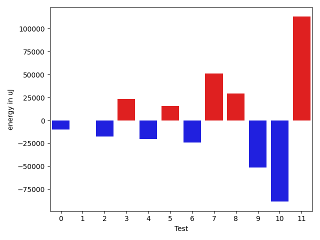
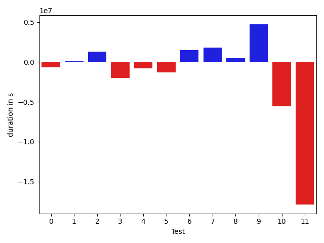

# gson d0e70b

https://github.com/google/gson/commit/d0e70b

## Delta Energy per test method

| ID | EnergyV1 | EnergyV2 | DeltaEnergy | σ |
| --- | --- | --- | --- | --- |
| 0 | 129498.40404040404 | 119555.19191919192 | -9943.212121212127 | 35547.12947677733 | 36155.95053213729 |
| 1 | 61034.93939393939 | 60787.14141414141 | -247.79797979797877 | 41440.30783343266 | 39767.53811918473 |
| 2 | 242418.67676767678 | 225076.12121212122 | -17342.555555555562 | 90745.73553893088 | 89875.93030240454 |
| 3 | 340051.1125 | 363496.8214285714 | 23445.708928571432 | 449621.67517355614 | 456410.3386161864 |
| 4 | 183667.5060240964 | 163319.93902439025 | -20347.56699970615 | 176504.58639362577 | 130405.00416809798 |
| 5 | 90292.703125 | 106020.01785714286 | 15727.314732142855 | 71500.79611263073 | 77432.73427869302 |
| 6 | 221128.64814814815 | 197093.10204081633 | -24035.546107331815 | 392177.22419911687 | 344674.80512797856 |
| 7 | 161375.8842105263 | 212545.70652173914 | 51169.82231121283 | 349541.0533177489 | 388796.7766833179 |
| 8 | 95578.84848484848 | 124846.84848484848 | 29268.0 | 132926.1816162567 | 240494.50487606387 |
| 9 | 234568.0303030303 | 183440.48484848486 | -51127.54545454544 | 423941.160153901 | 343074.8235321023 |
| 10 | 323646.243902439 | 235365.8488372093 | -88280.3950652297 | 484383.8946674768 | 402801.7721569211 |
| 11 | 107505.4375 | 220469.74285714285 | 112964.30535714285 | 221434.36933958804 | 412475.38251726294 |

## Delta Duration per test method

| ID | DurationV1 | DurationsV2 | DeltaDuration |
| --- | --- | --- | --- |
| 0 | 4272854.717171717 | 3958426.8585858587 | -314427.8585858587 |
| 1 | 2162423.3333333335 | 2152115.757575758 | -10307.575757575687 |
| 2 | 8012644.333333333 | 7538115.96969697 | -474528.3636363633 |
| 3 | 10119398.2 | 10915040.297619049 | 795642.0976190493 |
| 4 | 5702225.2289156625 | 4980287.609756097 | -721937.6191595653 |
| 5 | 2557725.234375 | 3072675.339285714 | 514950.1049107141 |
| 6 | 6486152.981481481 | 5789228.346938776 | -696924.6345427055 |
| 7 | 4924795.410526316 | 6731310.793478261 | 1806515.382951945 |
| 8 | 3095293.0404040404 | 4090254.6464646463 | 994961.606060606 |
| 9 | 7307554.848484849 | 5843862.737373738 | -1463692.111111111 |
| 10 | 9749154.670731707 | 7101697.930232558 | -2647456.740499148 |
| 11 | 3260427.6125 | 6849221.228571429 | 3588793.616071429 |

## Misc.

| ID | Test Class | Test Method |
| --- | --- | --- |
| 0 | com.google.gson.functional.MapTest | testInterfaceTypeMapWithSerializer |
| 1 | com.google.gson.functional.MapTest | testGeneralMapField |
| 2 | com.google.gson.functional.MapTest | testInterfaceTypeMap |
| 3 | com.google.gson.functional.NamingPolicyTest | testGsonWithNonDefaultFieldNamingPolicySerialization |
| 4 | com.google.gson.functional.NamingPolicyTest | testGsonWithNonDefaultFieldNamingPolicyDeserialiation |
| 5 | com.google.gson.functional.NamingPolicyTest | testGsonWithUpperCamelCaseSpacesPolicyDeserialiation |
| 6 | com.google.gson.functional.NamingPolicyTest | testGsonWithUpperCamelCaseSpacesPolicySerialiation |
| 7 | com.google.gson.functional.MapAsArrayTypeAdapterTest | testMultipleEnableComplexKeyRegistrationHasNoEffect |
| 8 | com.google.gson.functional.MapAsArrayTypeAdapterTest | testSerializeComplexMapWithTypeAdapter |
| 9 | com.google.gson.functional.MapAsArrayTypeAdapterTest | testMapWithTypeVariableSerialization |
| 10 | com.google.gson.functional.FieldNamingTest | testUpperCamelCase |
| 11 | com.google.gson.functional.FieldNamingTest | testUpperCamelCaseWithSpaces |

| Test | IterationV1 | IterationV2 | DeltaIteration |
| --- | --- | --- | --- |
| 0 | 99 | 99 | 0 |
| 1 | 99 | 99 | 0 |
| 2 | 99 | 99 | 0 |
| 3 | 80 | 84 | 4 |
| 4 | 83 | 82 | -1 |
| 5 | 64 | 56 | -8 |
| 6 | 54 | 49 | -5 |
| 7 | 95 | 92 | -3 |
| 8 | 99 | 99 | 0 |
| 9 | 99 | 99 | 0 |
| 10 | 82 | 86 | 4 |
| 11 | 80 | 70 | -10 |

| Time Label | Time (s) |
| --- | --- |
| Selection | 34.15283226966858 |
| Injection | 14.473119735717773 |
| Total | 1376.1836931705475 |

