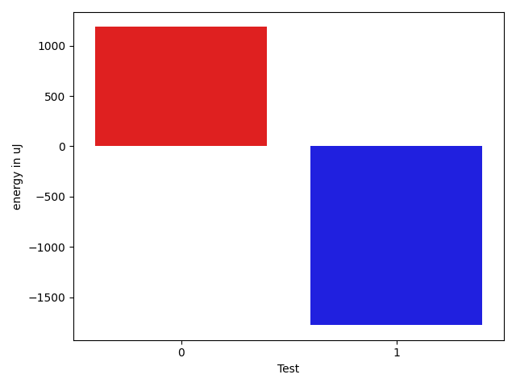

# gson fd37cf

https://github.com/google/gson/commit/fd37cf

## Delta Energy per test method

| ID | EnergyV1 | EnergyV2 | DeltaEnergy | σV1 | σV2 |
| --- | --- | --- | --- | --- | --- |
| 0 | 34057 | 33325 | -732 | 9587.882224375773 | 12242.78655584438 |
| 1 | 104065 | 104431 | 366 | 23622.338232275924 | 18462.210610643902 |

## Delta Duration per test method

| ID | DurationV1 | DurationsV2 | DeltaDuration |
| --- | --- | --- | --- |
| 0 | 2058904.3333333333 | 2003871.6811594204 | -55032.65217391285 |
| 1 | 3879063.212121212 | 3667288.232323232 | -211774.97979797982 |

## Misc.

| ID | Test Class | Test Method |
| --- | --- | --- |
| 0 | com.google.gson.JsonArrayTest | testDeepCopy |
| 1 | com.google.gson.JsonObjectTest | testDeepCopy |

| Test | IterationV1 | IterationV2 | DeltaIteration |
| --- | --- | --- | --- |
| 0 | 63 | 69 | 6 |
| 1 | 99 | 99 | 0 |

| Time Label | Time (s) |
| --- | --- |
| Selection | 34.24498438835144 |
| Injection | 13.275826215744019 |
| Total | 1357.0435132980347 |

