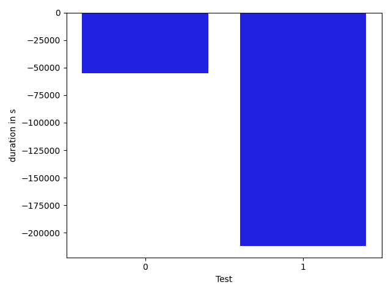

# gson fd37cf

https://github.com/google/gson/commit/fd37cf

## Delta Energy per test method

| ID | EnergyV1 | EnergyV2 | DeltaEnergy |
| --- | --- | --- | --- |
| 0 | 34515.43022581538 | 33543.83825289323 | -971.5919729221496 |
| 1 | 101637.92336566243 | 96543.75445709017 | -5094.168908572261 |

## Delta Duration per test method

| ID | DurationV1 | DurationsV2 | DeltaDuration |
| --- | --- | --- | --- |
| 0 | 2224692.8800333366 | 1790041.433815435 | -434651.44621790154 |
| 1 | 3479295.921713099 | 3907849.7667772947 | 428553.8450641958 |

## Misc.

| ID | Test Class | Test Method |
| --- | --- | --- |
| 0 | com.google.gson.JsonArrayTest | testDeepCopy |
| 1 | com.google.gson.JsonObjectTest | testDeepCopy |

| Test | IterationV1 | IterationV2 | DeltaIteration |
| --- | --- | --- | --- |
| 0 | 63 | 69 | 6 |
| 1 | 99 | 99 | 0 |

| Time Label | Time (s) |
| --- | --- |
| Selection | 34.24498438835144 |
| Injection | 13.275826215744019 |
| Total | 1357.0435132980347 |

