# gson 9e44d6

https://github.com/google/gson/commit/9e44d6

## Delta Energy per test method

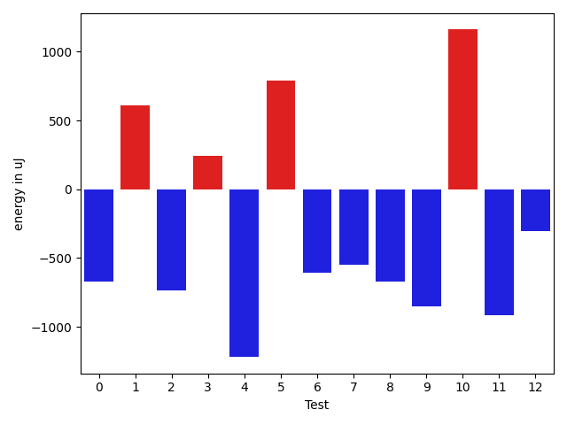

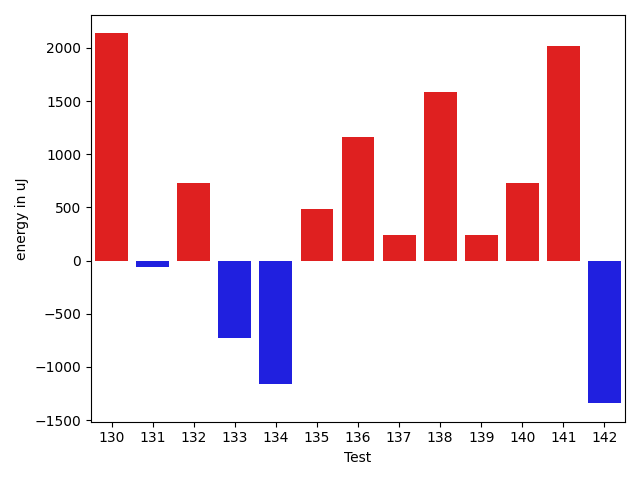

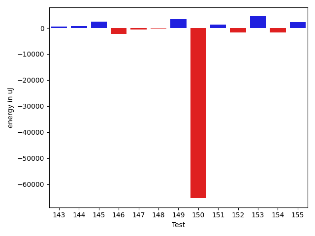

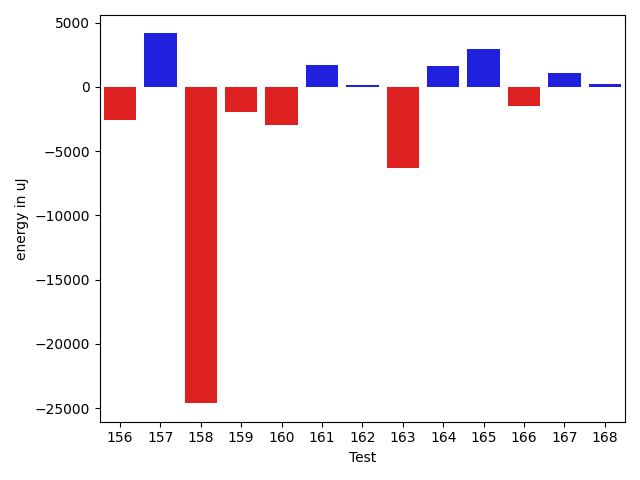

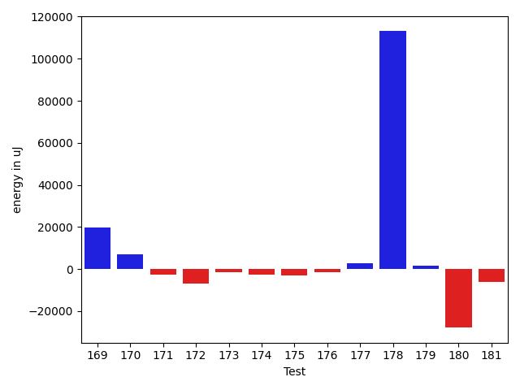

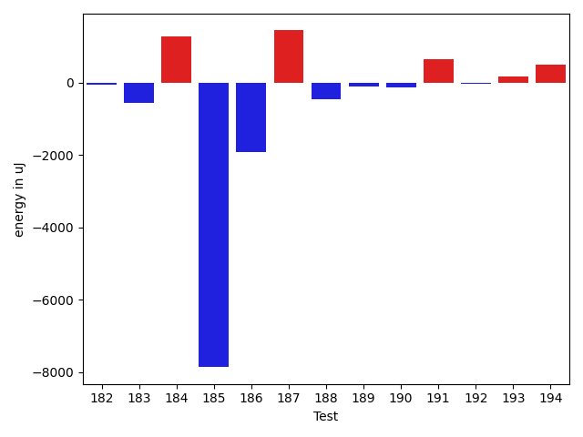

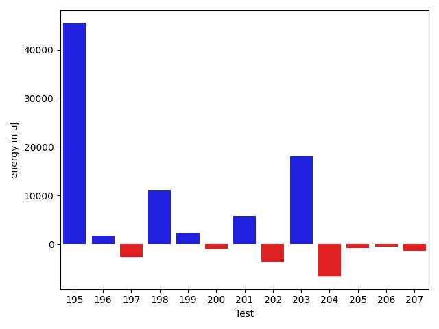

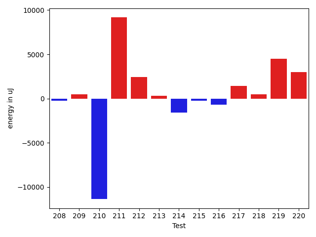

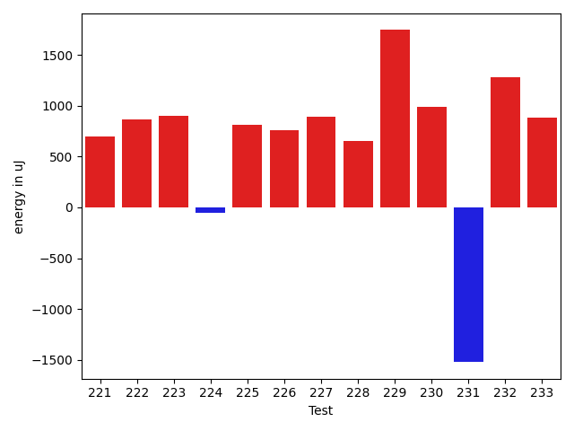

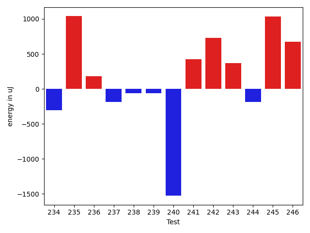

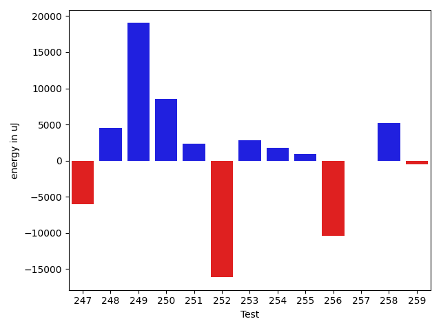

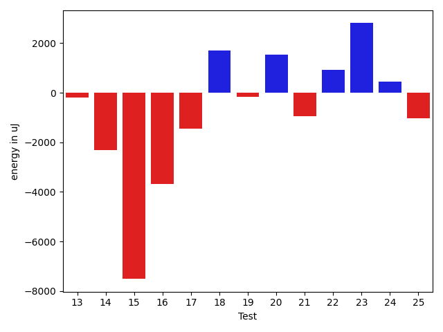

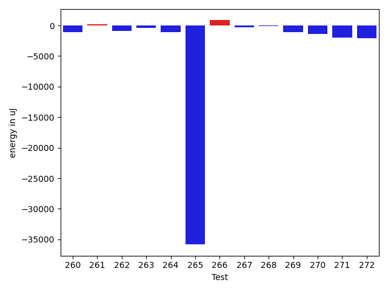

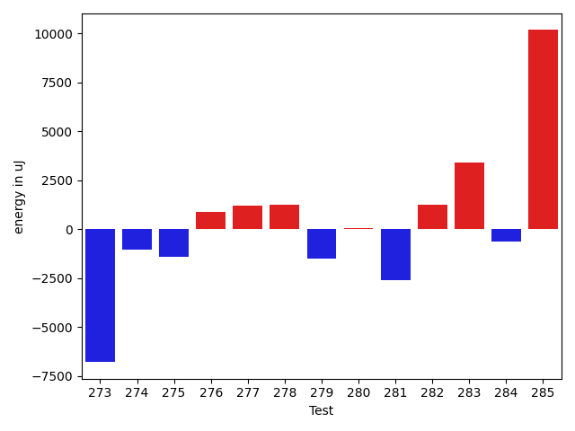

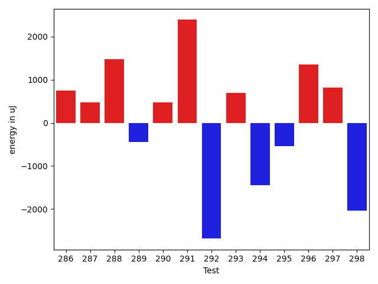

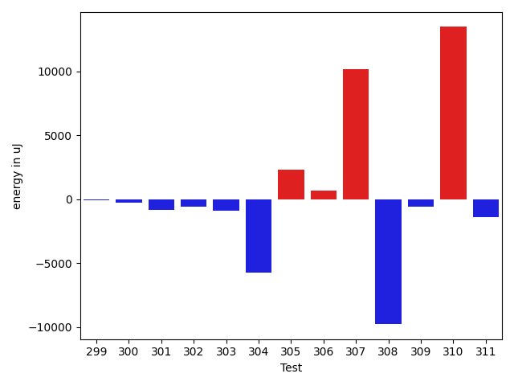

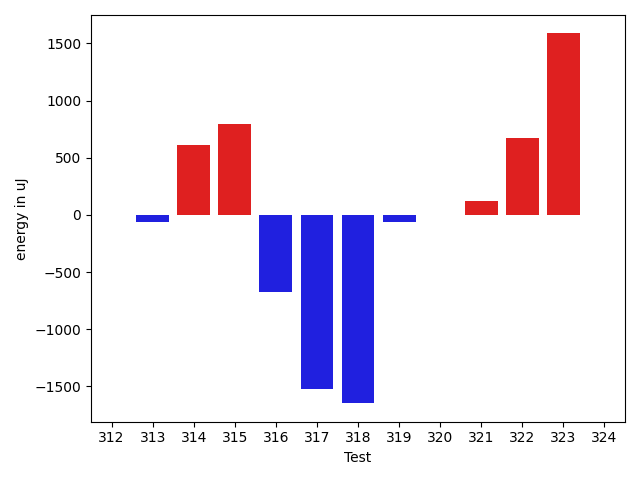

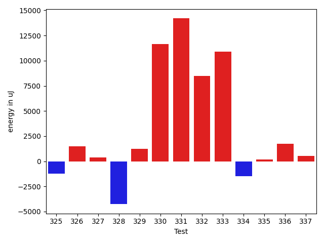

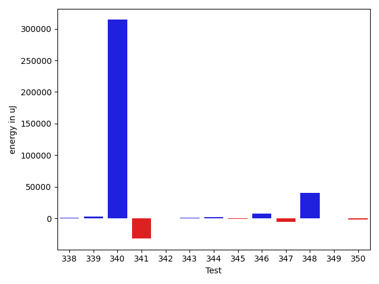

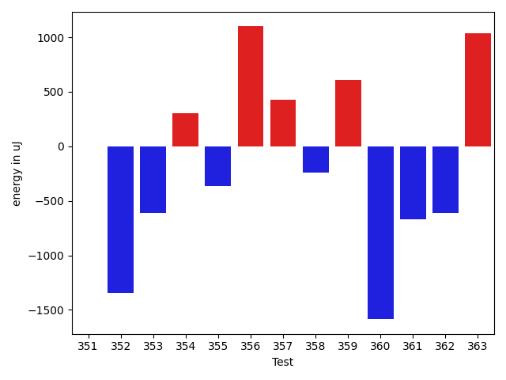

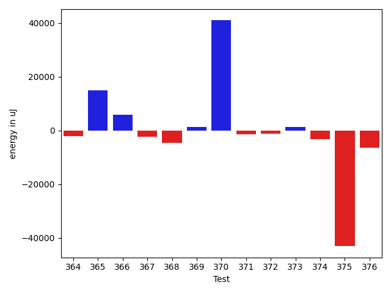

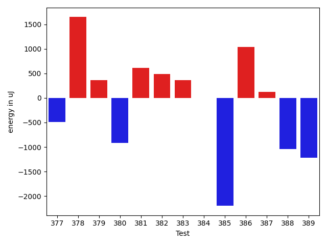

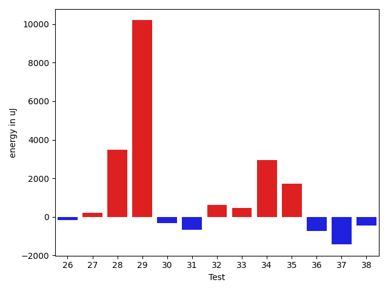

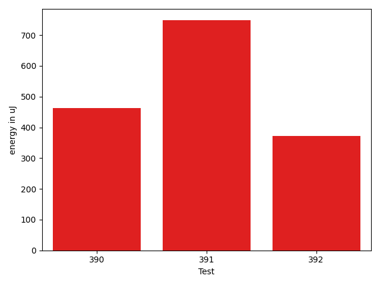

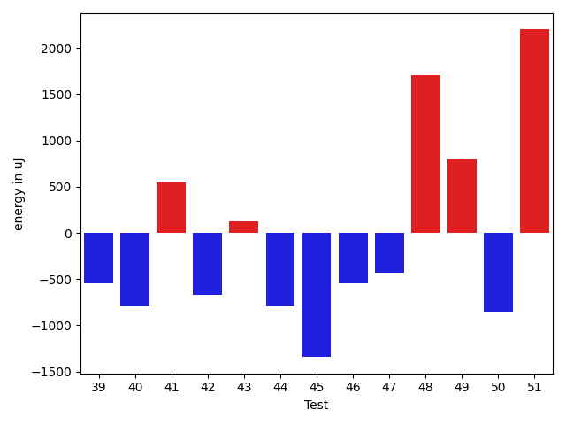

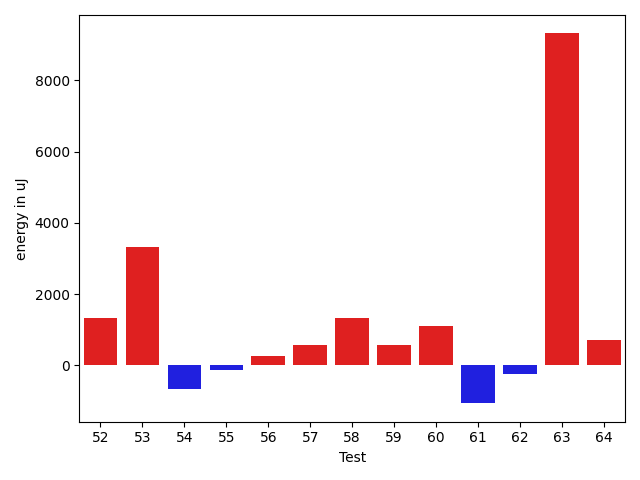

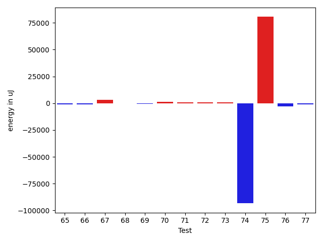

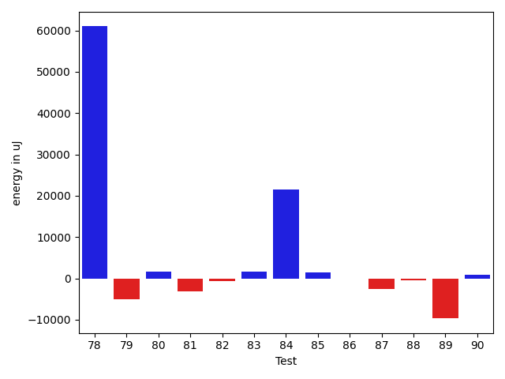

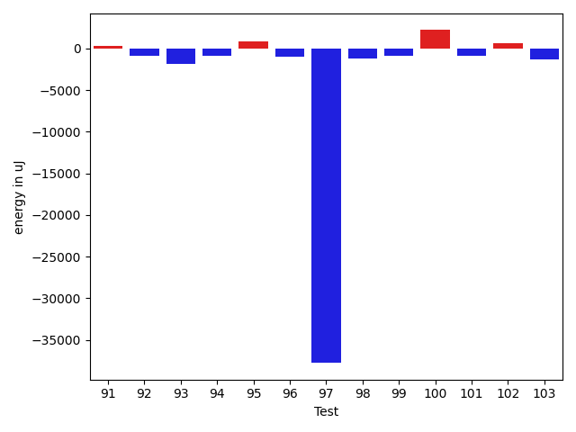

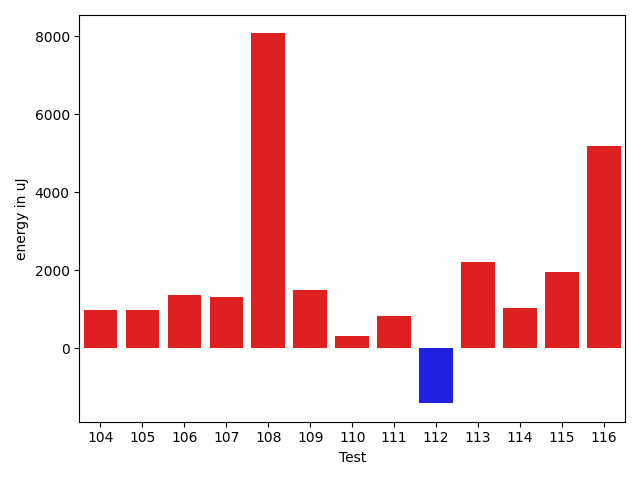

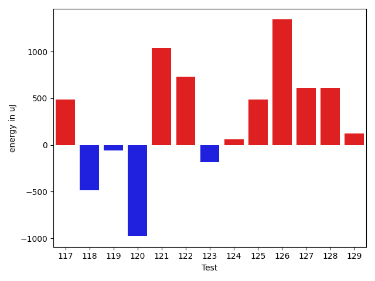

| ID | EnergyV1 | EnergyV2 | DeltaEnergy |
| --- | --- | --- | --- |
| 0 | 44424.182341698724 | 41372.91312464213 | -3051.2692170565933 |
| 1 | 44110.73651706631 | 44934.00531914024 | 823.2688020739297 |
| 2 | 45883.71849624254 | 43697.0768566932 | -2186.641639549336 |
| 3 | 45656.18529025189 | 44262.00352688413 | -1394.1817633677565 |
| 4 | 44563.550404551446 | 47547.14177180372 | 2983.591367252273 |
| 5 | 45317.37246920688 | 44594.691793086706 | -722.6806761201733 |
| 6 | 43877.89065119624 | 42756.91791057587 | -1120.9727406203747 |
| 7 | 55855.78000575727 | 44849.98456242987 | -11005.795443327399 |
| 8 | 44537.573649197664 | 40951.83446662361 | -3585.739182574056 |
| 9 | 74544.93772242636 | 42077.191280991356 | -32467.746441435003 |
| 10 | 45781.140363168575 | 43038.45719058896 | -2742.6831725796146 |
| 11 | 45880.86145852448 | 34382.11285975964 | -11498.74859876484 |
| 12 | 48041.72881989431 | 43648.934306280215 | -4392.794513614099 |
| 13 | 44859.35139741399 | 44671.504677722645 | -187.84671969134797 |
| 14 | 44650.28458021961 | 42332.552628075326 | -2317.731952144284 |
| 15 | 44504.099845293524 | 36997.419675600206 | -7506.680169693318 |
| 16 | 45070.33772810396 | 41398.24283557945 | -3672.09489252451 |
| 17 | 46808.91802364866 | 45373.23527353187 | -1435.6827501167863 |
| 18 | 43042.71070683477 | 44746.95756522406 | 1704.2468583892914 |
| 19 | 45147.84977310446 | 44993.112827061355 | -154.7369460431073 |
| 20 | 43227.136692219516 | 44751.84733048452 | 1524.7106382650018 |
| 21 | 42711.63930382011 | 41763.60713868317 | -948.032165136945 |
| 22 | 41929.21905425312 | 42855.09574874217 | 925.8766944890522 |
| 23 | 41663.236277483404 | 44466.67694441974 | 2803.440666936338 |
| 24 | 41682.252157034396 | 42118.05220648259 | 435.80004944819666 |
| 25 | 42176.82089491165 | 41147.464807924785 | -1029.356086986867 |
| 26 | 74466.60981920862 | 95394.10565372725 | 20927.49583451863 |
| 27 | 42766.56204965338 | 43873.721021935664 | 1107.1589722822828 |
| 28 | 94524.11630287766 | 62209.382378919916 | -32314.73392395775 |
| 29 | 44718.31336212158 | 40681.562551021576 | -4036.750811100006 |
| 30 | 84476.81851021979 | 54880.38723980391 | -29596.43127041588 |
| 31 | 81087.81790837622 | 69135.2212861753 | -11952.596622200916 |
| 32 | 84746.60809805318 | 112406.39916009667 | 27659.791062043485 |
| 33 | 46558.67997617401 | 46541.388231743884 | -17.291744430127437 |
| 34 | 42843.853995158075 | 43107.875918212274 | 264.02192305419885 |
| 35 | 103251.05387372842 | 437248.15262782254 | 333997.0987540941 |
| 36 | 51210.42707973733 | 76389.96944014265 | 25179.54236040532 |
| 37 | 46952.46287947848 | 61135.214364573534 | 14182.751485095054 |
| 38 | 78936.3429136678 | 87562.17350854998 | 8625.83059488218 |
| 39 | 44621.249510426576 | 42227.26444368785 | -2393.985066738729 |
| 40 | 66440.0607753966 | 45989.209305960816 | -20450.851469435787 |
| 41 | 43790.43875488205 | 43519.86433300616 | -270.57442187589186 |
| 42 | 43085.12069128177 | 43577.071464923996 | 491.9507736422238 |
| 43 | 62155.95920255208 | 43963.702203630746 | -18192.256998921337 |
| 44 | 44099.6811801677 | 43900.017161727534 | -199.66401844016946 |
| 45 | 44265.39318960674 | 42502.815491835296 | -1762.5776977714413 |
| 46 | 43623.685006609085 | 43320.44984690492 | -303.2351597041634 |
| 47 | 45026.813692861484 | 41483.965930048114 | -3542.8477628133696 |
| 48 | 42859.73135429058 | 41919.62548084365 | -940.1058734469334 |
| 49 | 41134.47547439118 | 43369.31187525032 | 2234.836400859138 |
| 50 | 45314.80622252611 | 52899.98639656031 | 7585.180174034198 |
| 51 | 42191.29416880994 | 41787.394283908994 | -403.899884900944 |
| 52 | 42266.69328141026 | 41882.73604900876 | -383.95723240150255 |
| 53 | 73950.39981512586 | 46105.238717558255 | -27845.1610975676 |
| 54 | 42708.251895426656 | 43508.20443272591 | 799.9525372992503 |
| 55 | 44444.92234696106 | 41358.354177460445 | -3086.5681695006133 |
| 56 | 45228.188010145976 | 40713.572334368255 | -4514.615675777721 |
| 57 | 44892.254433988164 | 41608.20505319389 | -3284.0493807942767 |
| 58 | 44015.6240477041 | 44884.767530999474 | 869.1434832953746 |
| 59 | 45985.807297482446 | 42632.54190806915 | -3353.2653894132964 |
| 60 | 43392.14386056624 | 43711.759325644634 | 319.61546507839375 |
| 61 | 42378.54708863002 | 40813.123819399974 | -1565.423269230043 |
| 62 | 43680.673051186255 | 43685.423043937044 | 4.749992750788806 |
| 63 | 40910.021855718805 | 44268.729507802054 | 3358.707652083249 |
| 64 | 890600.3912044541 | 168938.42190663802 | -721661.969297816 |
| 65 | 38693.46999902656 | 42838.8603597969 | 4145.39036077034 |
| 66 | 77464.6028124644 | 164130.28936586794 | 86665.68655340353 |
| 67 | 41985.137260465475 | 44144.48758631753 | 2159.3503258520577 |
| 68 | 59912.39620509983 | 43971.04849030048 | -15941.347714799347 |
| 69 | 86857.35211479012 | 42570.82934217015 | -44286.52277261997 |
| 70 | 43346.656478507444 | 39955.42904361936 | -3391.227434888082 |
| 71 | 41264.9744596401 | 45038.36971734211 | 3773.39525770201 |
| 72 | 41630.4546425984 | 43378.38168189884 | 1747.9270393004408 |
| 73 | 39206.15005936197 | 42972.35510432173 | 3766.205044959759 |
| 74 | 40815.51673349909 | 40738.545825891306 | -76.9709076077852 |
| 75 | 38406.35533094406 | 40932.27311962843 | 2525.917788684368 |
| 76 | 40654.015800476074 | 41125.73384094238 | 471.7180404663086 |
| 77 | 39846.610332489014 | 42169.72284066677 | 2323.1125081777573 |
| 78 | 207960.96982100996 | 268938.39869684237 | 60977.42887583241 |
| 79 | 173364.67040670099 | 168301.03886364802 | -5063.631543052965 |
| 80 | 41624.960421569005 | 43188.26200179197 | 1563.3015802229638 |
| 81 | 42232.163530766964 | 39130.19393157959 | -3101.969599187374 |
| 82 | 42921.12756501534 | 42344.02151404321 | -577.1060509721283 |
| 83 | 42221.7972364217 | 43756.908886909485 | 1535.1116504877864 |
| 84 | 66991.04561943779 | 88574.0621929328 | 21583.016573495013 |
| 85 | 43917.65075271539 | 45361.9353945806 | 1444.2846418652116 |
| 86 | 44134.88107779273 | 43981.96053402291 | -152.92054376981832 |
| 87 | 43505.25439396856 | 40915.325885656355 | -2589.9285083122013 |
| 88 | 44156.506291508675 | 43775.58618736267 | -380.9201041460037 |
| 89 | 51423.534898842576 | 41729.26369180064 | -9694.271207041937 |
| 90 | 43725.6630859375 | 44519.935791015625 | 794.272705078125 |
| 91 | 42163.97685827343 | 42508.02277681645 | 344.04591854301543 |
| 92 | 46531.33835857348 | 41538.000656808465 | -4993.337701765013 |
| 93 | 103749.81727601029 | 46832.23246777151 | -56917.58480823878 |
| 94 | 38041.40158081055 | 59151.48568344116 | 21110.084102630615 |
| 95 | 40327.18581390381 | 42653.481596425176 | 2326.295782521367 |
| 96 | 43898.56024421674 | 40916.29561148426 | -2982.2646327324765 |
| 97 | 42574.73237391416 | 42536.761469171324 | -37.97090474283323 |
| 98 | 82897.36449079175 | 76011.05932164344 | -6886.305169148312 |
| 99 | 43269.95099439146 | 43170.56064963472 | -99.3903447567427 |
| 100 | 92111.27206969657 | 91496.1241218004 | -615.1479478961701 |
| 101 | 42738.05183121966 | 44724.824537750035 | 1986.772706530377 |
| 102 | 39632.17365396522 | 45331.955261993186 | 5699.781608027966 |
| 103 | 43230.94003485028 | 42319.14281695709 | -911.7972178931886 |
| 104 | 39490.175189567846 | 39683.56839136832 | 193.3932018004707 |
| 105 | 43041.212701036624 | 43540.732976681844 | 499.52027564521995 |
| 106 | 42169.59179510176 | 44294.66090273112 | 2125.0691076293588 |
| 107 | 67478.51132897762 | 61944.041232258314 | -5534.470096719306 |
| 108 | 39330.68639528216 | 65891.83957959838 | 26561.153184316223 |
| 109 | 39553.736715484214 | 39771.91248992546 | 218.17577444124618 |
| 110 | 41635.94153457308 | 74528.8619747093 | 32892.92044013622 |
| 111 | 132387.2008895105 | 146125.3562691663 | 13738.1553796558 |
| 112 | 46699.49789592487 | 42953.627486042475 | -3745.8704098823946 |
| 113 | 39570.31624904824 | 42572.63320994505 | 3002.316960896809 |
| 114 | 40055.81752474049 | 39229.70034569087 | -826.1171790496155 |
| 115 | 49549.901837843594 | 66858.17228570442 | 17308.27044786083 |
| 116 | 43323.79120257891 | 44301.87072549406 | 978.0795229151481 |
| 117 | 43473.690960777545 | 42071.88686209471 | -1401.8040986828346 |
| 118 | 46641.43183576381 | 63460.72652350986 | 16819.29468774605 |
| 119 | 42849.795189532735 | 40022.736569894594 | -2827.058619638141 |
| 120 | 158966.77110845468 | 139823.710745704 | -19143.060362750664 |
| 121 | 41946.251964006864 | 41612.74112952457 | -333.51083448229474 |
| 122 | 42798.3329336768 | 42405.60618495523 | -392.7267487215722 |
| 123 | 41662.48060797677 | 42183.486814717835 | 521.0062067410618 |
| 124 | 40469.47372661339 | 39833.389882023694 | -636.0838445896952 |
| 125 | 65223.38332446827 | 44150.99721568724 | -21072.38610878103 |
| 126 | 132413.047607003 | 112651.92401629228 | -19761.123590710733 |
| 127 | 43795.66602485019 | 43701.70405055428 | -93.96197429590393 |
| 128 | 39557.84046737416 | 39828.03173846826 | 270.191271094096 |
| 129 | 42969.859079443006 | 41750.66411425001 | -1219.1949651929972 |
| 130 | 43152.99849496833 | 43070.26539707988 | -82.73309788844927 |
| 131 | 53364.56118874727 | 56350.82006442942 | 2986.2588756821497 |
| 132 | 43253.890181902374 | 43895.21480694362 | 641.3246250412485 |
| 133 | 42529.145008414984 | 43023.545174598694 | 494.4001661837101 |
| 134 | 44189.04136445728 | 44405.336167542664 | 216.2948030853804 |
| 135 | 45732.5574564054 | 40509.60339010614 | -5222.954066299259 |
| 136 | 44396.091906507354 | 43213.44950277357 | -1182.6424037337856 |
| 137 | 40788.66211924497 | 78021.9006034165 | 37233.23848417154 |
| 138 | 42312.67832358299 | 43306.6888414121 | 994.0105178291051 |
| 139 | 40036.9306921204 | 41402.55297823178 | 1365.6222861113856 |
| 140 | 49045.55425600082 | 56296.07193732763 | 7250.517681326812 |
| 141 | 44500.031114231155 | 44779.05231216603 | 279.0211979348751 |
| 142 | 41858.33338660114 | 44410.252605616624 | 2551.9192190154863 |
| 143 | 44274.56047629933 | 44768.684948818154 | 494.1244725188226 |
| 144 | 45080.62008866639 | 45923.91161732003 | 843.2915286536445 |
| 145 | 40026.98741619831 | 42395.08720024559 | 2368.0997840472774 |
| 146 | 44272.639060492336 | 41929.66741717514 | -2342.9716433172 |
| 147 | 41014.61644574632 | 40463.40136444237 | -551.215081303948 |
| 148 | 41412.760999679565 | 41170.58381514065 | -242.17718453891575 |
| 149 | 40670.977955963106 | 44084.77356562221 | 3413.7956096591006 |
| 150 | 107084.1569876736 | 41713.02346198261 | -65371.133525690995 |
| 151 | 39392.406817912284 | 40722.590372895414 | 1330.1835549831303 |
| 152 | 41596.05947032228 | 39942.18991071021 | -1653.8695596120742 |
| 153 | 53207.61672864788 | 57652.37938822042 | 4444.762659572538 |
| 154 | 40308.493354498525 | 38690.44238903398 | -1618.050965464543 |
| 155 | 39727.91625279188 | 41968.33387249708 | 2240.4176197052 |
| 156 | 41862.53067912867 | 39265.57091249229 | -2596.9597666363843 |
| 157 | 38793.60127177327 | 42949.28080670639 | 4155.679534933122 |
| 158 | 67707.13080891022 | 43097.06253250758 | -24610.068276402642 |
| 159 | 40961.31025932206 | 39009.35015753661 | -1951.9601017854511 |
| 160 | 41351.64151740726 | 38416.425598333255 | -2935.215919074006 |
| 161 | 44140.09173596096 | 45853.90750111551 | 1713.815765154548 |
| 162 | 43626.99513450236 | 43773.19865189458 | 146.2035173922195 |
| 163 | 51703.230411354525 | 45392.61843994848 | -6310.611971406048 |
| 164 | 42624.239641189575 | 44239.63510847092 | 1615.3954672813416 |
| 165 | 38228.06333579123 | 41195.0497580784 | 2966.9864222871693 |
| 166 | 41639.15068817139 | 40146.7598836422 | -1492.39080452919 |
| 167 | 40862.893149375916 | 41936.17186522484 | 1073.2787158489227 |
| 168 | 42174.434020996094 | 42368.6489982605 | 194.2149772644043 |
| 169 | 38054.38394385576 | 57817.365891394154 | 19762.981947538392 |
| 170 | 36404.09749532584 | 43550.50991346792 | 7146.4124181420775 |
| 171 | 42812.68634080887 | 40107.41921416437 | -2705.267126644496 |
| 172 | 44681.225462887436 | 37935.25085799856 | -6745.974604888877 |
| 173 | 44832.25865581771 | 43357.97342634201 | -1474.285229475703 |
| 174 | 43163.04783905094 | 40633.207831132284 | -2529.840007918654 |
| 175 | 43528.26727151871 | 40563.74247264862 | -2964.5247988700867 |
| 176 | 43201.69375681877 | 41580.47975458391 | -1621.2140022348613 |
| 177 | 41930.77491760254 | 44594.240926742554 | 2663.4660091400146 |
| 178 | 43044.39865037054 | 156351.92728822678 | 113307.52863785625 |
| 179 | 42497.31513977051 | 44129.78463742137 | 1632.4694976508617 |
| 180 | 118237.03784288623 | 90332.51202981199 | -27904.525813074244 |
| 181 | 45639.85738386267 | 39405.2040455838 | -6234.653338278869 |
| 182 | 45124.777304947376 | 40944.54280872643 | -4180.234496220946 |
| 183 | 53755.10231789053 | 40749.897264014464 | -13005.205053876067 |
| 184 | 43974.19861459732 | 41415.36192834377 | -2558.8366862535477 |
| 185 | 48487.06817917712 | 44191.20005726069 | -4295.868121916428 |
| 186 | 43292.71434667468 | 43449.66867475025 | 156.95432807557518 |
| 187 | 44155.63273152472 | 46903.92097417917 | 2748.288242654453 |
| 188 | 42277.50248104038 | 43030.532238095686 | 753.0297570553084 |
| 189 | 44372.85827136887 | 42249.57418767923 | -2123.2840836896357 |
| 190 | 42445.25109947735 | 42154.30043230869 | -290.95066716865404 |
| 191 | 43591.897268291104 | 41016.665150814566 | -2575.2321174765384 |
| 192 | 42964.13458246621 | 52293.20573776758 | 9329.071155301368 |
| 193 | 44549.0613623775 | 84253.88328114929 | 39704.82191877179 |
| 194 | 43016.34628096149 | 41414.55865358672 | -1601.787627374768 |
| 195 | 43003.093155407005 | 88538.9929657507 | 45535.8998103437 |
| 196 | 42910.77164554178 | 44641.98328570061 | 1731.2116401588282 |
| 197 | 45679.17958506495 | 43005.78916513319 | -2673.390419931762 |
| 198 | 41287.35378565478 | 52494.901831122515 | 11207.548045467738 |
| 199 | 40231.896634525314 | 42547.29184594394 | 2315.395211418625 |
| 200 | 43041.14435122212 | 42118.16878771741 | -922.9755635047113 |
| 201 | 42798.68745284926 | 48668.77863851529 | 5870.091185666024 |
| 202 | 45043.54112033699 | 41375.191141884374 | -3668.349978452614 |
| 203 | 41680.94168729299 | 59742.05097455557 | 18061.10928726258 |
| 204 | 47246.66368899372 | 40607.72376282644 | -6638.939926167281 |
| 205 | 44791.77827929827 | 43987.667579398425 | -804.1106998998439 |
| 206 | 44291.53506759637 | 43707.608565961185 | -583.9265016351856 |
| 207 | 47031.54679869303 | 45600.18140475225 | -1431.3653939407814 |
| 208 | 45632.356258833956 | 44917.03839701274 | -715.3178618212187 |
| 209 | 45825.37808249304 | 41093.39803833552 | -4731.980044157521 |
| 210 | 44488.48580932617 | 41465.47802734375 | -3023.007781982422 |
| 211 | 43697.75924682617 | 44053.03349816799 | 355.27425134181976 |
| 212 | 43886.2633432078 | 44803.93397482167 | 917.6706316138734 |
| 213 | 40484.151584645435 | 42725.31386022296 | 2241.1622755775243 |
| 214 | 49268.358772091386 | 89711.85260229526 | 40443.49383020387 |
| 215 | 49715.59331769675 | 45553.692020372546 | -4161.901297324206 |
| 216 | 42472.95731762785 | 44350.586415441656 | 1877.6290978138059 |
| 217 | 41875.69087429117 | 44427.13685907059 | 2551.4459847794205 |
| 218 | 44114.526933956964 | 44002.14485837915 | -112.38207557781425 |
| 219 | 78076.1789889494 | 94573.02903448216 | 16496.85004553276 |
| 220 | 42785.771028091185 | 42458.7198450508 | -327.0511830403848 |
| 221 | 44935.03335766301 | 42380.68109555407 | -2554.352262108936 |
| 222 | 42262.271003814545 | 44319.78366827279 | 2057.5126644582415 |
| 223 | 45015.660214066505 | 43485.385498046875 | -1530.2747160196304 |
| 224 | 40748.88192503662 | 42458.992888878616 | 1710.1109638419948 |
| 225 | 46068.24527947362 | 56899.92870915672 | 10831.6834296831 |
| 226 | 39114.307731449604 | 41897.194237977266 | 2782.8865065276623 |
| 227 | 101003.65376718376 | 45656.40574941905 | -55347.24801776471 |
| 228 | 51196.842949117636 | 45322.53848847343 | -5874.304460644205 |
| 229 | 41369.58161067963 | 37601.54836463928 | -3768.0332460403442 |
| 230 | 42635.7852518727 | 52443.48743043575 | 9807.70217856305 |
| 231 | 43544.14664956304 | 44871.39666058529 | 1327.2500110222536 |
| 232 | 54928.13490735073 | 131187.2829405448 | 76259.14803319407 |
| 233 | 44284.48735924781 | 39128.3760081801 | -5156.11135106771 |
| 234 | 128778.29151016923 | 131144.5210396988 | 2366.2295295295626 |
| 235 | 43418.4351426095 | 43005.02519808564 | -413.40994452386076 |
| 236 | 42766.03631465346 | 38450.571321374264 | -4315.4649932791945 |
| 237 | 40249.40862774849 | 40970.29516410828 | 720.886536359787 |
| 238 | 43935.709149718285 | 39383.50584748387 | -4552.203302234411 |
| 239 | 49052.46350353414 | 37895.25294928625 | -11157.21055424789 |
| 240 | 42405.842848809 | 41403.55461104962 | -1002.2882377593778 |
| 241 | 44433.484993298734 | 44437.17983795537 | 3.694844656638452 |
| 242 | 43732.27190296352 | 44756.68047873443 | 1024.4085757709108 |
| 243 | 42471.39259835881 | 43309.36235929109 | 837.9697609322757 |
| 244 | 42002.019501338895 | 43302.44501966011 | 1300.4255183212153 |
| 245 | 51711.223361518 | 43090.24127156724 | -8620.982089950761 |
| 246 | 42289.06562155499 | 177778.2504820568 | 135489.18486050182 |
| 247 | 45198.70081948582 | 39196.238116780296 | -6002.462702705525 |
| 248 | 39594.56297460678 | 44173.964917006386 | 4579.401942399607 |
| 249 | 41083.971672955515 | 60127.37064940939 | 19043.39897645388 |
| 250 | 36218.07785438714 | 44766.56590164011 | 8548.48804725297 |
| 251 | 40210.17739318646 | 42529.58926805291 | 2319.4118748664478 |
| 252 | 81772.44079723072 | 65639.9539923449 | -16132.486804885819 |
| 253 | 41136.65176636027 | 43977.10831715775 | 2840.4565507974767 |
| 254 | 41025.33808847249 | 42777.70081522316 | 1752.3627267506672 |
| 255 | 40003.92084829013 | 40894.62095230381 | 890.700104013682 |
| 256 | 55433.93246253047 | 45036.927990791875 | -10397.004471738597 |
| 257 | 39949.544226690705 | 39888.772645398545 | -60.77158129215968 |
| 258 | 50499.245320228074 | 55656.484105457566 | 5157.238785229492 |
| 259 | 39673.79591209952 | 39123.65155749666 | -550.1443546028604 |
| 260 | 39784.973825064706 | 41555.37315755065 | 1770.3993324859475 |
| 261 | 44289.75146552101 | 41760.50892571773 | -2529.242539803279 |
| 262 | 42341.069668866694 | 43099.80394466352 | 758.734275796829 |
| 263 | 42818.522374945656 | 40286.31257166673 | -2532.209803278929 |
| 264 | 45232.48696499546 | 42511.484411103214 | -2721.002553892249 |
| 265 | 107859.72697266332 | 66791.04149493088 | -41068.68547773245 |
| 266 | 75667.54814233055 | 41523.90100338415 | -34143.6471389464 |
| 267 | 37760.90821507573 | 43781.855376303196 | 6020.947161227465 |
| 268 | 41839.68273559706 | 45503.100859595615 | 3663.4181239985555 |
| 269 | 54719.69715100761 | 41803.31435349099 | -12916.38279751662 |
| 270 | 42294.95587332036 | 40719.07422253059 | -1575.8816507897718 |
| 271 | 44839.54821938276 | 51965.35673260689 | 7125.808513224125 |
| 272 | 43187.309988975525 | 43363.64990234375 | 176.3399133682251 |
| 273 | 112778.44391875074 | 110571.04182519426 | -2207.4020935564768 |
| 274 | 48000.49375908461 | 52404.35401325408 | 4403.860254169471 |
| 275 | 46321.44702703663 | 43256.18828803301 | -3065.2587390036206 |
| 276 | 44288.7305985006 | 64482.492826686124 | 20193.762228185522 |
| 277 | 44183.84925842285 | 43111.88195800781 | -1071.967300415039 |
| 278 | 42543.1582353459 | 42357.43418563957 | -185.72404970633215 |
| 279 | 43759.38830227591 | 39295.40244483948 | -4463.985857436433 |
| 280 | 45278.599365234375 | 45254.18347167969 | -24.4158935546875 |
| 281 | 43667.127868652344 | 39518.25537109375 | -4148.872497558594 |
| 282 | 42032.464782714844 | 39537.73225557804 | -2494.7325271368027 |
| 283 | 45061.35513687134 | 56777.213806152344 | 11715.858669281006 |
| 284 | 43314.76856382868 | 43892.844832202 | 578.0762683733192 |
| 285 | 40675.571058277405 | 44202.448269081586 | 3526.8772108041812 |
| 286 | 66181.71002635865 | 88574.22224506158 | 22392.512218702934 |
| 287 | 47591.41916373822 | 44167.478538771546 | -3423.9406249666717 |
| 288 | 43574.093811767576 | 43985.37285595677 | 411.27904418919206 |
| 289 | 137249.38821778324 | 126833.41806135 | -10415.970156433235 |
| 290 | 51281.459594968204 | 83145.93703045722 | 31864.477435489018 |
| 291 | 42105.227339603196 | 43923.743261045645 | 1818.5159214424493 |
| 292 | 58142.62710964742 | 81394.0988624118 | 23251.47175276438 |
| 293 | 43529.92408561103 | 42342.803907724694 | -1187.1201778863324 |
| 294 | 41031.658713616736 | 44050.39362926081 | 3018.734915644076 |
| 295 | 42815.41890900582 | 44581.599929271266 | 1766.181020265445 |
| 296 | 43095.43153050542 | 46173.43788731098 | 3078.006356805563 |
| 297 | 39592.186063113535 | 47262.932009975964 | 7670.745946862429 |
| 298 | 42126.63125383854 | 42741.57222641306 | 614.9409725745209 |
| 299 | 42993.382283657615 | 46052.7110478121 | 3059.3287641544885 |
| 300 | 43602.53285267949 | 42091.93607330322 | -1510.5967793762684 |
| 301 | 41585.143083056435 | 43415.68766523898 | 1830.5445821825415 |
| 302 | 42343.177115917206 | 42236.73748742044 | -106.43962849676609 |
| 303 | 40309.65369606018 | 44852.542251586914 | 4542.888555526733 |
| 304 | 45076.322250126825 | 43018.368049719094 | -2057.9542004077302 |
| 305 | 45580.240652404726 | 44129.09811026603 | -1451.1425421386957 |
| 306 | 40392.94452397525 | 47654.47111362778 | 7261.526589652523 |
| 307 | 42077.24094973192 | 44730.124984760536 | 2652.884035028619 |
| 308 | 47670.666784511894 | 43542.16725286732 | -4128.499531644571 |
| 309 | 43724.13710692525 | 48344.97765056067 | 4620.840543635422 |
| 310 | 44298.37910485268 | 43113.08866444696 | -1185.290440405719 |
| 311 | 42224.44804224727 | 44819.61902917037 | 2595.170986923098 |
| 312 | 44854.510927484866 | 45285.004447508094 | 430.4935200232285 |
| 313 | 43157.44863750273 | 42595.59352408722 | -561.8551134155132 |
| 314 | 45851.92330169678 | 42826.969557762146 | -3024.9537439346313 |
| 315 | 56829.29756473628 | 50945.6838067396 | -5883.613757996674 |
| 316 | 42931.70658934116 | 48304.32654956728 | 5372.619960226119 |
| 317 | 43356.86831045151 | 43446.53517329693 | 89.66686284542084 |
| 318 | 42856.40371080581 | 43972.463360355934 | 1116.0596495501231 |
| 319 | 45030.501199599086 | 43911.16966071911 | -1119.3315388799747 |
| 320 | 41133.600235435835 | 40128.21235691714 | -1005.3878785186971 |
| 321 | 42685.8731201371 | 41411.105414283695 | -1274.7677058534027 |
| 322 | 42080.4518904835 | 41830.96759639308 | -249.48429409042 |
| 323 | 45792.56196850538 | 39230.323089508136 | -6562.2388789972465 |
| 324 | 45561.03851411439 | 42237.87039453437 | -3323.1681195800193 |
| 325 | 42430.69152874031 | 42571.22659500172 | 140.53506626140734 |
| 326 | 50181.69582053759 | 44138.00198468467 | -6043.693835852922 |
| 327 | 61921.14984627161 | 40725.60045739077 | -21195.54938888084 |
| 328 | 51454.97510826588 | 43827.73969921656 | -7627.235409049317 |
| 329 | 43628.6059271656 | 41989.47205469478 | -1639.1338724708185 |
| 330 | 41978.34408098932 | 44730.96010617587 | 2752.6160251865513 |
| 331 | 61945.89418638267 | 42518.81800145104 | -19427.076184931626 |
| 332 | 44059.04765833675 | 68286.38848768675 | 24227.340829350003 |
| 333 | 44233.42460567154 | 45320.6791449546 | 1087.254539283058 |
| 334 | 42903.5346159084 | 44542.88661146164 | 1639.3519955532392 |
| 335 | 416177.8789737952 | 549072.8298629016 | 132894.95088910637 |
| 336 | 517380.6266616882 | 598142.5163279349 | 80761.88966624672 |
| 337 | 80991.08621897895 | 76325.7417429299 | -4665.344476049053 |
| 338 | 46772.46982466864 | 47942.06617413483 | 1169.596349466192 |
| 339 | 41182.59457215405 | 44140.541573058814 | 2957.9470009047654 |
| 340 | 340933.2867587558 | 655140.7281980593 | 314207.44143930345 |
| 341 | 428086.93873655633 | 396126.6493559407 | -31960.289380615635 |
| 342 | 44369.17135213634 | 44114.9798040398 | -254.19154809653992 |
| 343 | 44608.633594852465 | 45407.81251566623 | 799.1789208137634 |
| 344 | 41937.85756931576 | 44305.63802572315 | 2367.7804564073886 |
| 345 | 39844.63452841481 | 39352.58341649175 | -492.05111192306504 |
| 346 | 36877.06729078293 | 44250.56041739322 | 7373.493126610294 |
| 347 | 45990.771427871194 | 40346.10325383954 | -5644.668174031656 |
| 348 | 501718.6697759966 | 542427.7772767487 | 40709.107500752085 |
| 349 | 45068.19688335848 | 45043.611290802524 | -24.58559255595901 |
| 350 | 46719.058519819635 | 45278.01657509921 | -1441.0419447204258 |
| 351 | 40245.768885419195 | 45452.56210244618 | 5206.793217026985 |
| 352 | 56019.89697562024 | 57126.726576320914 | 1106.829600700672 |
| 353 | 44865.10803574494 | 42491.42924735168 | -2373.6787883932557 |
| 354 | 62679.49273174639 | 48906.08150609479 | -13773.411225651595 |
| 355 | 130881.67226429767 | 91315.7528750328 | -39565.91938926486 |
| 356 | 43527.41782963276 | 43541.08803653717 | 13.670206904411316 |
| 357 | 44735.95606823606 | 44260.41921751652 | -475.53685071953805 |
| 358 | 65720.31660908848 | 43758.43869106992 | -21961.87791801856 |
| 359 | 44471.96553150621 | 43997.87451276496 | -474.0910187412519 |
| 360 | 39203.82131958008 | 45303.26167297363 | 6099.440353393555 |
| 361 | 46427.405162364565 | 40717.567703306675 | -5709.83745905789 |
| 362 | 42812.87118160725 | 34182.65563338995 | -8630.215548217297 |
| 363 | 44070.60116496682 | 44480.116905122995 | 409.5157401561737 |
| 364 | 43080.10537471715 | 40919.550280610565 | -2160.5550941065885 |
| 365 | 43698.1241314879 | 58584.472666082554 | 14886.348534594654 |
| 366 | 40838.859375 | 46614.57302856445 | 5775.713653564453 |
| 367 | 43642.693541367305 | 41317.439755456755 | -2325.2537859105505 |
| 368 | 50924.52053407565 | 46428.12481380007 | -4496.395720275585 |
| 369 | 43614.0936975496 | 45015.02527842954 | 1400.9315808799365 |
| 370 | 43868.09161907759 | 84880.01175424087 | 41011.92013516328 |
| 371 | 44211.57876508508 | 42757.38199474135 | -1454.196770343733 |
| 372 | 42951.12902259827 | 41681.861389160156 | -1269.2676334381104 |
| 373 | 41894.903577148914 | 43277.871324539185 | 1382.9677473902702 |
| 374 | 43862.480407714844 | 40540.703384399414 | -3321.7770233154297 |
| 375 | 86798.69249039958 | 43722.16416946577 | -43076.528320933816 |
| 376 | 52025.65748599688 | 45631.052795894175 | -6394.6046901027075 |
| 377 | 41298.003404191 | 42814.811407199944 | 1516.8080030089477 |
| 378 | 44291.888561308704 | 43028.857907568105 | -1263.0306537405995 |
| 379 | 113586.74109191142 | 47673.68514773251 | -65913.05594417891 |
| 380 | 43688.79220602501 | 43441.2498543142 | -247.54235171081382 |
| 381 | 42566.88233263604 | 43323.1722843264 | 756.2899516903562 |
| 382 | 45789.963946810196 | 41972.331053240116 | -3817.6328935700803 |
| 383 | 165363.4495500253 | 528921.9954012356 | 363558.54585121037 |
| 384 | 53081.33091075265 | 44333.2433308924 | -8748.08757986025 |
| 385 | 52033.75761506334 | 54425.295884185936 | 2391.538269122597 |
| 386 | 109612.17417021847 | 89844.59832131004 | -19767.575848908426 |
| 387 | 47219.25076432407 | 47136.68099184534 | -82.56977247873147 |
| 388 | 44207.81495755244 | 68186.86994373074 | 23979.0549861783 |
| 389 | 50367.107310802705 | 51454.13791300562 | 1087.030602202918 |
| 390 | 43881.51527309418 | 38367.27260360122 | -5514.24266949296 |
| 391 | 43231.36021253717 | 43304.5949650565 | 73.23475251933269 |
| 392 | 45963.9643137624 | 43773.41419132994 | -2190.5501224324616 |

## Delta Duration per test method

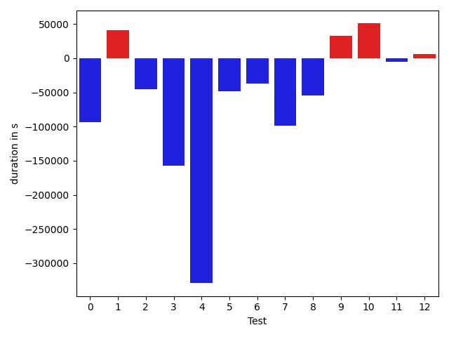

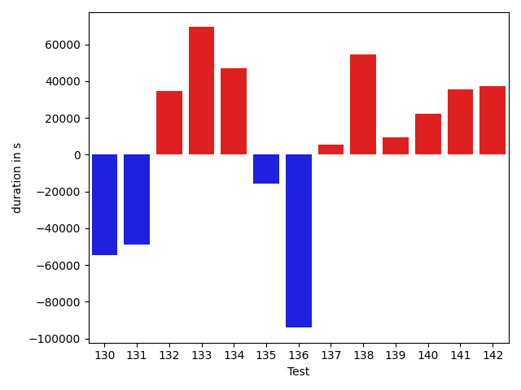

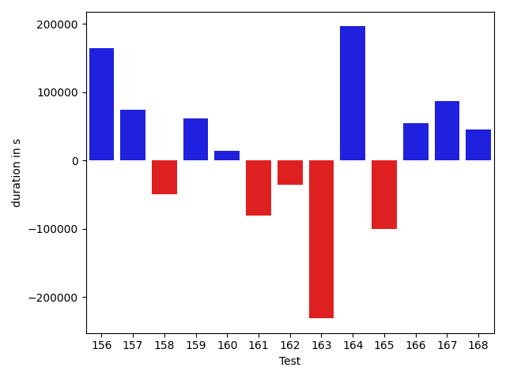

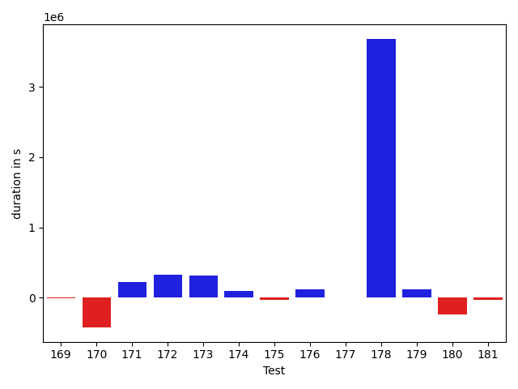

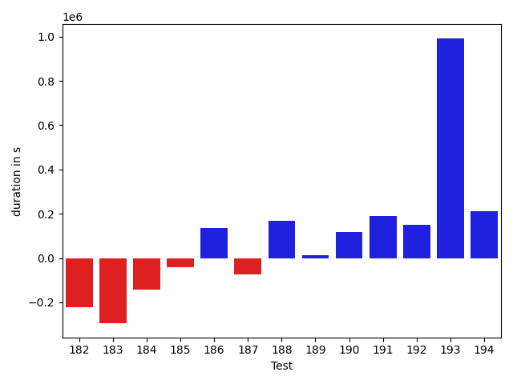

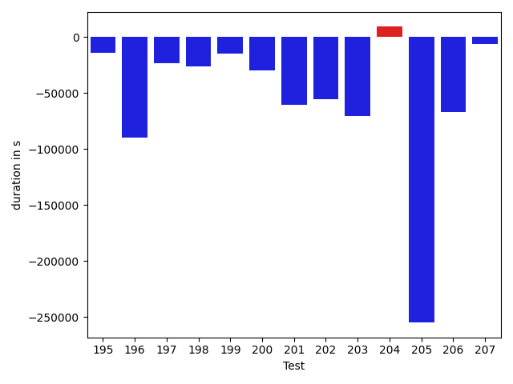

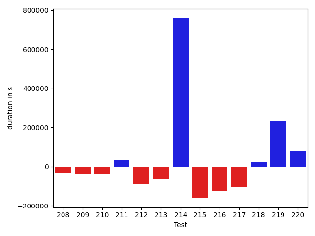

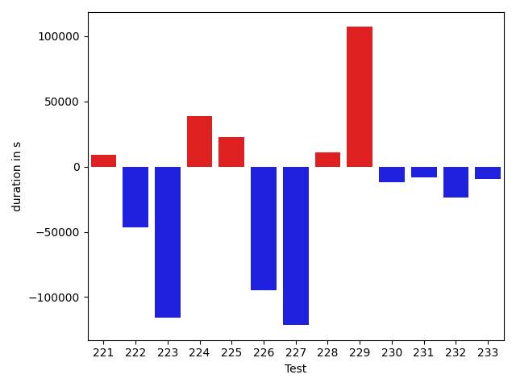

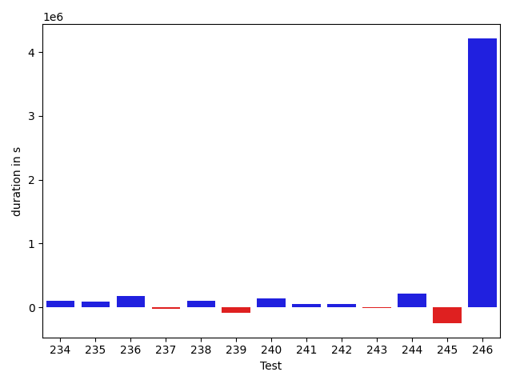

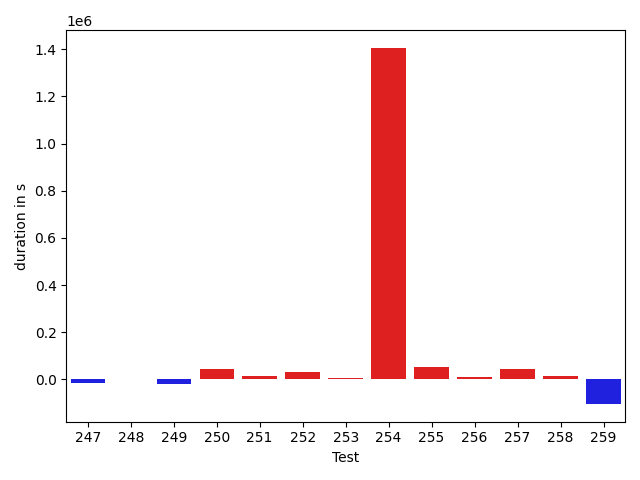

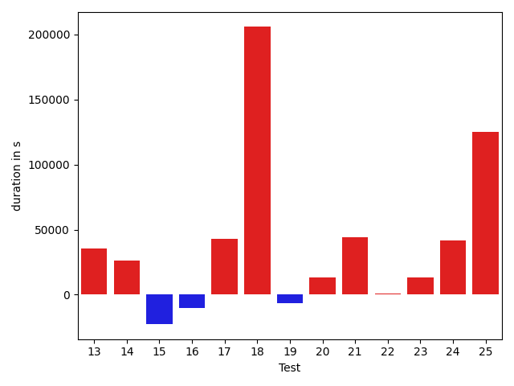

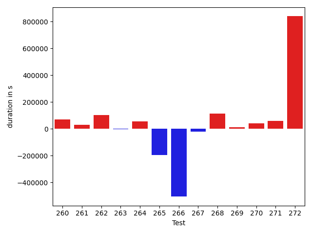

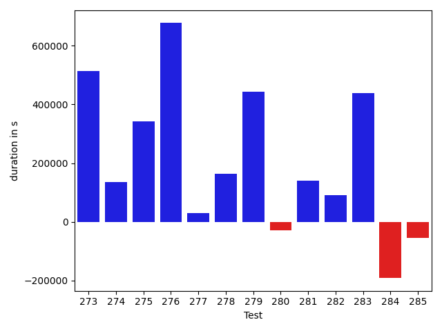

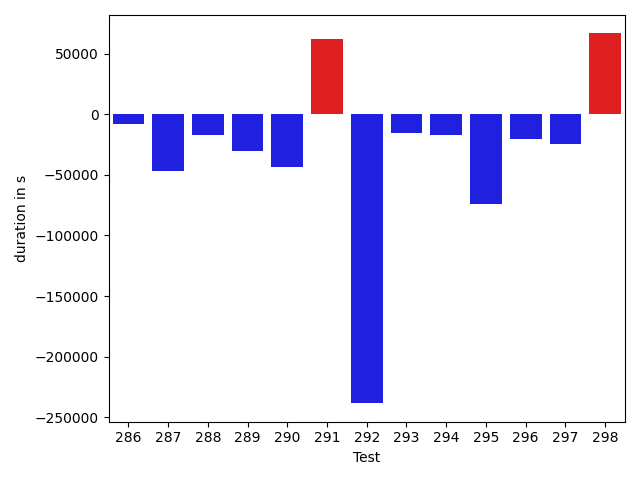

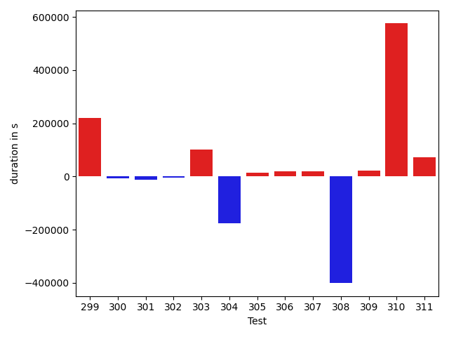

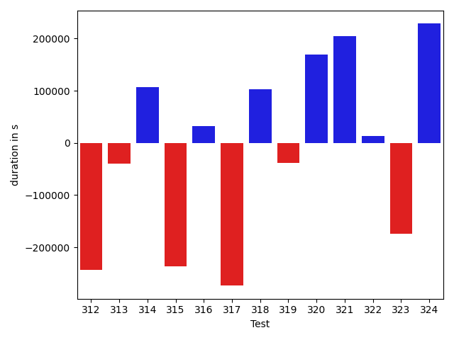

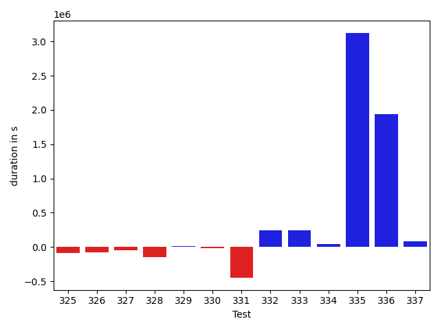

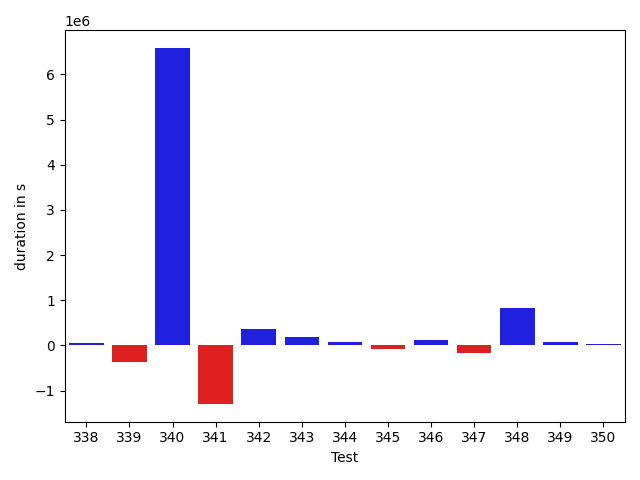

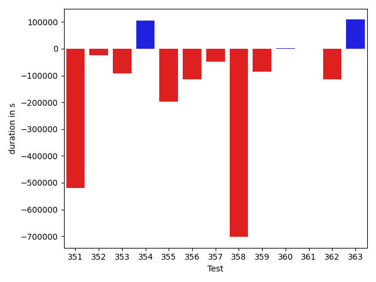

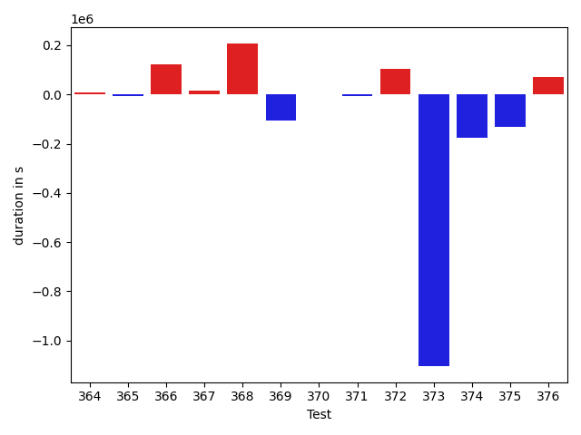

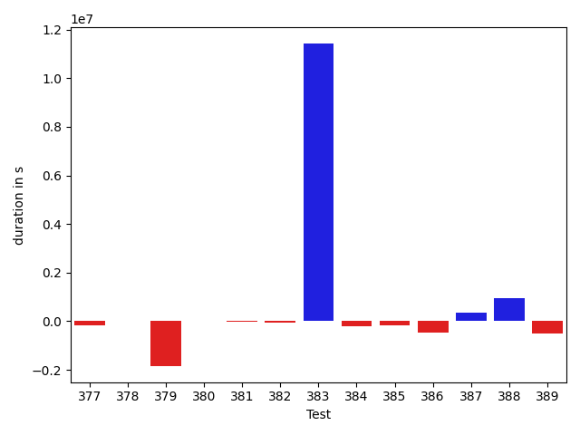

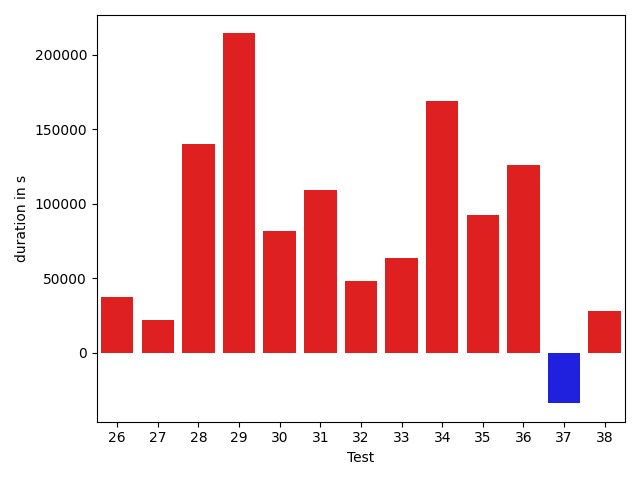

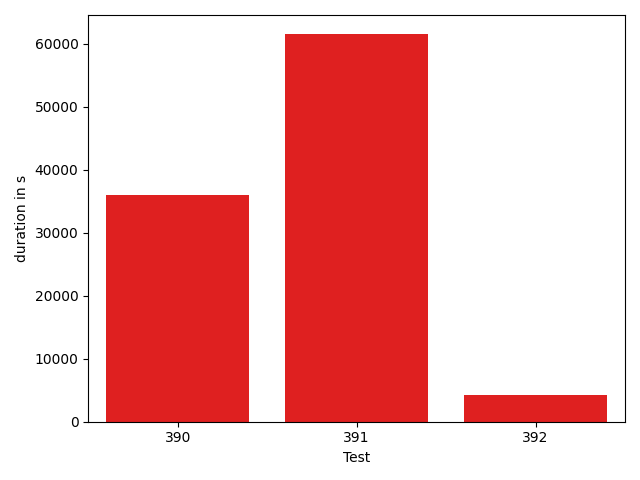

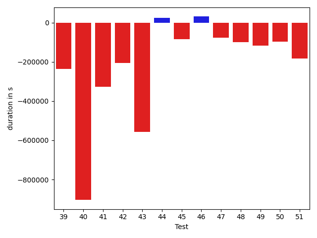

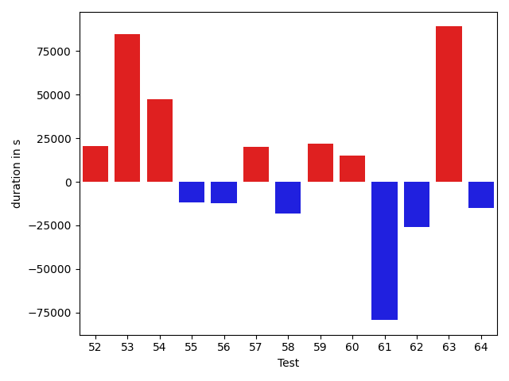

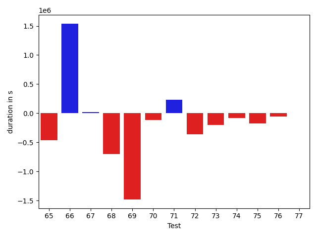

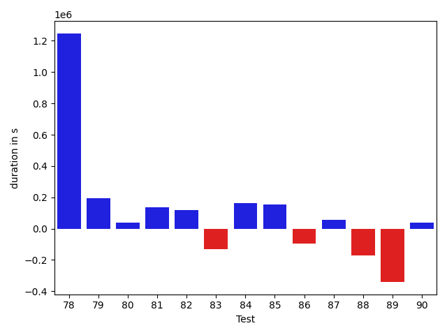

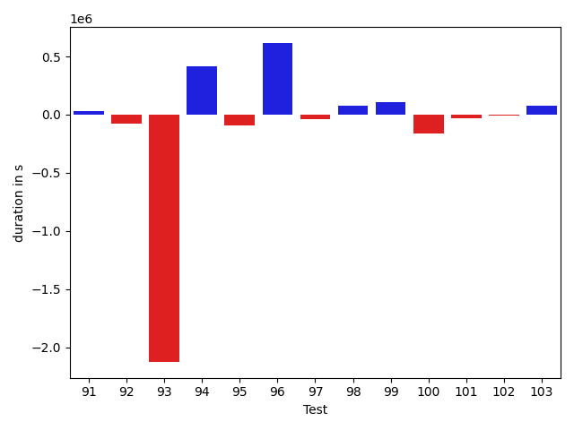

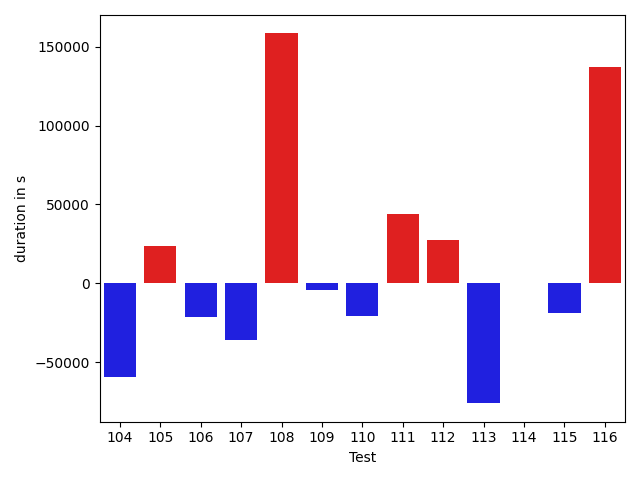

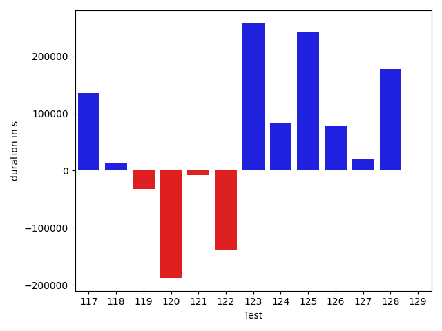

| ID | DurationV1 | DurationsV2 | DeltaDuration |
| --- | --- | --- | --- |
| 0 | 1326836.218436539 | 719802.4268047669 | -607033.7916317721 |
| 1 | 747828.1626469172 | 625782.2835805316 | -122045.87906638556 |
| 2 | 833018.5292084933 | 627058.9482579171 | -205959.58095057623 |
| 3 | 929670.1228657463 | 723603.6194389772 | -206066.50342676905 |
| 4 | 775147.2587124725 | 1058757.1448767693 | 283609.88616429677 |
| 5 | 1199725.166067916 | 1061029.905700441 | -138695.26036747498 |
| 6 | 379086.9263904989 | 413454.0648404956 | 34367.13844999671 |
| 7 | 1344070.7122284397 | 1001112.058862605 | -342958.65336583473 |
| 8 | 1045156.4390621991 | 868053.0413179875 | -177103.3977442116 |
| 9 | 1634825.0084529393 | 849430.8763838382 | -785394.1320691011 |
| 10 | 675149.9647014625 | 639675.9558352983 | -35474.00886616425 |
| 11 | 1026725.8128824884 | 1170711.4555496755 | 143985.64266718714 |
| 12 | 525058.8259971071 | 590157.0632591981 | 65098.23726209102 |
| 13 | 1106544.442849329 | 1069369.8203290924 | -37174.62252023653 |
| 14 | 992294.3692480638 | 798205.531366459 | -194088.8378816048 |
| 15 | 837405.1134905266 | 1093353.3119339468 | 255948.19844342023 |
| 16 | 746610.8176332432 | 735874.3077755098 | -10736.509857733385 |
| 17 | 526808.9551664252 | 505048.6862189757 | -21760.268947449513 |
| 18 | 749287.3523598041 | 917681.6562294684 | 168394.30386966432 |
| 19 | 679049.1859688857 | 754486.031099956 | 75436.84513107035 |
| 20 | 1293977.6609331951 | 1349495.310483036 | 55517.64954984095 |
| 21 | 651192.3142900313 | 600799.6780439949 | -50392.63624603639 |
| 22 | 626637.9214925121 | 702570.9214884178 | 75932.99999590567 |
| 23 | 425119.32620779425 | 463870.3120973874 | 38750.98588959314 |
| 24 | 629848.4760976118 | 669417.3316653013 | 39568.85556768952 |
| 25 | 519256.8218298636 | 577835.5514449489 | 58578.72961508529 |
| 26 | 2125496.867468901 | 2352962.279947868 | 227465.4124789671 |
| 27 | 540493.8419356872 | 526018.4474165613 | -14475.394519125926 |
| 28 | 2025607.6622525826 | 1237949.468164247 | -787658.1940883356 |
| 29 | 440547.55292892456 | 395398.43715167046 | -45149.115777254105 |
| 30 | 1808761.948112778 | 1772211.0216115955 | -36550.92650118237 |
| 31 | 1818310.5800377969 | 1439161.9673566122 | -379148.61268118466 |
| 32 | 2169506.800769598 | 2575682.3409236595 | 406175.5401540613 |
| 33 | 713993.8373534079 | 573001.503224703 | -140992.33412870485 |
| 34 | 1335103.6083732257 | 1309976.0031144412 | -25127.60525878449 |
| 35 | 2489184.6616461775 | 13326131.640858022 | 10836946.979211845 |
| 36 | 1500108.1554122032 | 2057647.9674610212 | 557539.812048818 |
| 37 | 1201717.0802108266 | 1565135.8093674858 | 363418.7291566592 |
| 38 | 1992084.1187516437 | 2060628.698057462 | 68544.5793058183 |
| 39 | 919051.0788462451 | 683592.6657818328 | -235458.4130644123 |
| 40 | 1921623.125358441 | 1017403.6226444284 | -904219.5027140125 |
| 41 | 975750.10375183 | 649037.9084929901 | -326712.19525884 |
| 42 | 1083401.8491022536 | 878920.882568012 | -204480.96653424157 |
| 43 | 1184691.2683239975 | 628642.6340815774 | -556048.6342424201 |
| 44 | 722315.6960252146 | 746793.4554147142 | 24477.75938949955 |
| 45 | 874213.7980463973 | 791538.5172485634 | -82675.28079783393 |
| 46 | 631609.9278576323 | 662830.5139101606 | 31220.58605252835 |
| 47 | 927177.7162054094 | 851366.8181485268 | -75810.89805688255 |
| 48 | 704285.4743673604 | 603951.4197748366 | -100334.05459252372 |
| 49 | 1004624.1002928901 | 887705.340250799 | -116918.76004209113 |
| 50 | 1464176.402623213 | 1367717.5272382766 | -96458.87538493634 |
| 51 | 1470807.3811903528 | 1289394.2594600387 | -181413.1217303141 |
| 52 | 906845.7786357412 | 941135.3162389377 | 34289.537603196455 |
| 53 | 1626927.986842464 | 1516254.7445792896 | -110673.24226317438 |
| 54 | 445768.84090516594 | 759000.9362998009 | 313232.09539463493 |
| 55 | 822279.498697821 | 883422.7717656331 | 61143.273067812086 |
| 56 | 931750.2070036079 | 795683.413210744 | -136066.79379286384 |
| 57 | 950915.9491240658 | 799964.8842419758 | -150951.06488208997 |
| 58 | 859414.5543233352 | 881564.9948702191 | 22150.44054688397 |
| 59 | 740017.3803925995 | 707144.5366570882 | -32872.8437355113 |
| 60 | 779125.1463213402 | 964357.8796526302 | 185232.73333128996 |
| 61 | 811952.5150761686 | 757378.4440461735 | -54574.0710299951 |
| 62 | 641761.626936902 | 621526.67778233 | -20234.94915457198 |
| 63 | 669652.1405602065 | 463988.5722751077 | -205663.56828509877 |
| 64 | 21760928.61510273 | 4007022.2094888845 | -17753906.405613847 |
| 65 | 1079200.9802863149 | 612371.8042740505 | -466829.17601226433 |
| 66 | 2082111.453915523 | 3620665.0640175347 | 1538553.6101020118 |
| 67 | 1076010.4076746001 | 1095862.9944268179 | 19852.58675221773 |
| 68 | 1490534.1274135355 | 786539.3928211222 | -703994.7345924133 |
| 69 | 2029319.3847380439 | 547393.3474281742 | -1481926.0373098697 |
| 70 | 903585.4766495469 | 790951.7331073831 | -112633.74354216375 |
| 71 | 825346.301172572 | 1055989.6065155054 | 230643.3053429334 |
| 72 | 822367.5849194678 | 461456.24628577055 | -360911.33863369725 |
| 73 | 730616.301260291 | 533518.5093168189 | -197097.7919434721 |
| 74 | 795615.8378982646 | 715016.1189800439 | -80599.71891822072 |
| 75 | 644489.4219913483 | 467911.102355212 | -176578.3196361363 |
| 76 | 495004.2426662445 | 438871.58725738525 | -56132.65540885925 |
| 77 | 487577.9823188782 | 491173.4373421669 | 3595.455023288727 |
| 78 | 4982729.907022107 | 6229607.330581425 | 1246877.4235593174 |
| 79 | 4222421.726782919 | 4416499.140893131 | 194077.41411021166 |
| 80 | 533881.4622166045 | 571373.377338849 | 37491.91512224451 |
| 81 | 566381.383389473 | 701893.6123790741 | 135512.22898960114 |
| 82 | 507962.1021832202 | 627215.4584700167 | 119253.35628679651 |
| 83 | 478952.1518978813 | 348128.9303512573 | -130823.22154662397 |
| 84 | 2146904.3406315157 | 2311372.997619051 | 164468.6569875353 |
| 85 | 593032.9919445303 | 745139.4824194585 | 152106.49047492817 |
| 86 | 569081.3536824051 | 472753.0761153312 | -96328.27756707388 |
| 87 | 785087.7265993136 | 842893.6762836305 | 57805.94968431699 |
| 88 | 620884.8178572655 | 451211.5461616516 | -169673.27169561386 |
| 89 | 988801.1975409774 | 648350.8321994363 | -340450.3653415411 |
| 90 | 378845.07421875 | 416439.74671936035 | 37594.67250061035 |
| 91 | 575026.4332739989 | 606276.7698043057 | 31250.336530306842 |
| 92 | 1037494.11536143 | 957252.9237401201 | -80241.19162130984 |
| 93 | 2562473.060271105 | 436399.2699567608 | -2126073.7903143438 |
| 94 | 591067.9058876038 | 1008998.7644042969 | 417930.8585166931 |
| 95 | 492995.08089256287 | 401723.8874407485 | -91271.19345181435 |
| 96 | 845549.9620786522 | 1461468.0555340084 | 615918.0934553562 |
| 97 | 1020544.645314634 | 981741.9166398741 | -38802.728674759855 |
| 98 | 1789494.1775721326 | 1869054.4225215176 | 79560.24494938506 |
| 99 | 940975.0057925865 | 1047695.8948358301 | 106720.8890432436 |
| 100 | 2370554.406837698 | 2207158.134906936 | -163396.2719307621 |
| 101 | 800124.0077068685 | 766237.0740914841 | -33886.93361538439 |
| 102 | 767895.2238911261 | 758698.4046961217 | -9196.819195004413 |
| 103 | 731804.2015086353 | 807343.0766634644 | 75538.87515482912 |
| 104 | 704215.3104380844 | 636715.3140211732 | -67499.99641691125 |
| 105 | 611781.8593316812 | 696768.174702143 | 84986.31537046179 |
| 106 | 486641.51028877497 | 702268.9494243935 | 215627.4391356185 |
| 107 | 1331735.743731699 | 1485622.1570317647 | 153886.4133000658 |
| 108 | 892479.1189379245 | 1039627.4774471768 | 147148.3585092523 |
| 109 | 812115.9553689234 | 864531.254469594 | 52415.299100670614 |
| 110 | 1651654.1890662997 | 1705979.1152452317 | 54324.92617893196 |
| 111 | 2889382.766010031 | 3594797.0160665875 | 705414.2500565564 |
| 112 | 1383418.2348684645 | 1626031.4243663265 | 242613.189497862 |
| 113 | 613272.4294038817 | 794616.5930199786 | 181344.16361609695 |
| 114 | 701650.038120972 | 536968.1463296015 | -164681.89179137046 |
| 115 | 1596902.3327094545 | 1882685.3613758474 | 285783.0286663929 |
| 116 | 909579.6610340541 | 726031.6242788516 | -183548.03675520257 |
| 117 | 788934.1251317135 | 925208.8555369942 | 136274.73040528072 |
| 118 | 1281013.597986611 | 1295463.6085924923 | 14450.010605881223 |
| 119 | 1270923.4999078175 | 1238919.482830352 | -32004.01707746554 |
| 120 | 4221959.508076718 | 4034105.5918635605 | -187853.9162131576 |
| 121 | 861219.1687717466 | 853195.3530295142 | -8023.815742232371 |
| 122 | 948871.9769048344 | 810206.8343003218 | -138665.14260451263 |
| 123 | 602079.0388173983 | 860189.877855508 | 258110.83903810976 |
| 124 | 876666.6761252884 | 959047.4585678118 | 82380.7824425234 |
| 125 | 1070456.0705769546 | 1312712.0186958965 | 242255.94811894186 |
| 126 | 2831285.6281669606 | 2909443.763674712 | 78158.13550775126 |
| 127 | 690932.9780890145 | 711110.0858598319 | 20177.107770817354 |
| 128 | 823673.9928185449 | 1001286.2533977084 | 177612.26057916356 |
| 129 | 1070018.4117469674 | 1071937.1285211965 | 1918.716774229193 |
| 130 | 644750.6992362678 | 775102.9356999216 | 130352.23646365374 |
| 131 | 1796523.9933040203 | 1557879.0852991194 | -238644.9080049009 |
| 132 | 812734.0711271528 | 804588.8502602493 | -8145.22086690343 |
| 133 | 562687.1762060821 | 594622.0543751717 | 31934.878169089556 |
| 134 | 620948.11194971 | 684593.9487256141 | 63645.83677590417 |
| 135 | 654843.662033353 | 850249.9499607373 | 195406.28792738426 |
| 136 | 727467.3982538092 | 887216.7387522182 | 159749.340498409 |
| 137 | 1421940.8324720578 | 1858646.3449243004 | 436705.51245224266 |
| 138 | 692861.4311376713 | 733850.1190383013 | 40988.68790062994 |
| 139 | 782640.1288426823 | 832832.7553579393 | 50192.62651525694 |
| 140 | 1249320.6449006635 | 1404499.026950053 | 155178.38204938942 |
| 141 | 797969.3830134703 | 607114.1654066286 | -190855.2176068417 |
| 142 | 754162.7010924105 | 693812.1812092387 | -60350.51988317177 |
| 143 | 476343.3109538208 | 469789.514199347 | -6553.79675447382 |
| 144 | 643014.3477098641 | 589209.7819122858 | -53804.56579757831 |
| 145 | 706568.8721977118 | 923177.6855246143 | 216608.81332690245 |
| 146 | 1334808.1532875441 | 1181141.622870991 | -153666.53041655314 |
| 147 | 627018.5128144809 | 611764.6169855708 | -15253.895828910172 |
| 148 | 387406.3062944412 | 551466.4338865783 | 164060.12759213708 |
| 149 | 814518.2928024636 | 802197.2695613964 | -12321.023241067189 |
| 150 | 2207688.366201233 | 567519.2260222584 | -1640169.1401789747 |
| 151 | 982291.9790016939 | 731293.6815510832 | -250998.29745061067 |
| 152 | 699313.5831505281 | 740305.9424227087 | 40992.35927218059 |
| 153 | 1033896.0890465692 | 1227595.0732647502 | 193698.984218181 |
| 154 | 1010504.4435110281 | 982580.6333180913 | -27923.8101929368 |
| 155 | 387169.94429016113 | 534375.8609092832 | 147205.91661912203 |
| 156 | 896733.321335268 | 1060816.082580808 | 164082.7612455401 |
| 157 | 586592.3672679439 | 660967.78811111 | 74375.42084316607 |
| 158 | 1202892.1257458355 | 1153205.959551795 | -49686.16619404056 |
| 159 | 958663.5313168317 | 1020544.4591825777 | 61880.927865745965 |
| 160 | 974729.848106371 | 989070.7306159871 | 14340.882509616087 |
| 161 | 963183.1654544149 | 882268.9697698554 | -80914.19568455953 |
| 162 | 644050.3744296026 | 608455.5763408963 | -35594.79808870633 |
| 163 | 912320.9390019876 | 681040.3502811048 | -231280.58872088278 |
| 164 | 404330.7452869415 | 600625.5013132095 | 196294.756026268 |
| 165 | 616313.8137420788 | 515557.26943590696 | -100756.54430617188 |
| 166 | 590447.750415802 | 644760.2663787603 | 54312.515962958336 |
| 167 | 441819.81256866455 | 529089.5096149445 | 87269.6970462799 |
| 168 | 376393.6052246094 | 422292.895904541 | 45899.29067993164 |
| 169 | 1384707.6660912633 | 1371419.6771977749 | -13287.988893488422 |
| 170 | 945979.6609895322 | 522608.08240753703 | -423371.5785819952 |
| 171 | 553832.9110926986 | 780634.7213456575 | 226801.8102529589 |
| 172 | 390827.4557135962 | 720643.1211804464 | 329815.66546685016 |
| 173 | 487896.30309168075 | 805980.4982286692 | 318084.1951369884 |
| 174 | 609471.7847735867 | 703910.4075159578 | 94438.62274237117 |
| 175 | 491593.9682211876 | 460526.84599745274 | -31067.122223734856 |
| 176 | 443096.76537561417 | 561457.7785927523 | 118361.01321713813 |
| 177 | 382814.9504852295 | 389556.93005371094 | 6741.979568481445 |
| 178 | 784636.0776408855 | 4467921.042942439 | 3683284.9653015537 |
| 179 | 425629.1802330017 | 545658.9399008453 | 120029.75966784358 |
| 180 | 2768042.275524003 | 2528245.9969275487 | -239796.2785964543 |
| 181 | 1076020.7736470813 | 1049632.9384160195 | -26387.835231061792 |
| 182 | 714204.6574634314 | 492957.3248343915 | -221247.33262903988 |
| 183 | 913283.1844318265 | 619443.4387107231 | -293839.7457211034 |
| 184 | 602684.1334910393 | 458720.83962345123 | -143963.29386758804 |
| 185 | 635419.6241694391 | 594904.4407086112 | -40515.18346082792 |
| 186 | 568311.8240036562 | 704473.5703166537 | 136161.74631299754 |
| 187 | 1268128.657433909 | 1195246.7373597196 | -72881.92007418931 |
| 188 | 1235488.3497689303 | 1404079.4682950233 | 168591.11852609296 |
| 189 | 688523.9949369649 | 699622.1310550845 | 11098.136118119583 |
| 190 | 605773.6726172835 | 725043.5723150423 | 119269.89969775872 |
| 191 | 571400.7891466831 | 761971.179713581 | 190570.39056689793 |
| 192 | 771129.728519766 | 921157.3473896554 | 150027.6188698894 |
| 193 | 1068826.8954912494 | 2060339.9755235014 | 991513.080032252 |
| 194 | 717268.4635452005 | 929896.3080304996 | 212627.84448529908 |
| 195 | 703357.5627625915 | 2731965.621303322 | 2028608.0585407303 |
| 196 | 619076.0717199021 | 732090.318662145 | 113014.24694224284 |
| 197 | 691847.0294990165 | 764639.8236742864 | 72792.7941752699 |
| 198 | 1000893.4733836944 | 986833.1238717323 | -14060.349511962151 |
| 199 | 681452.8106140833 | 691043.0736780888 | 9590.263064005529 |
| 200 | 697995.9359521533 | 1021671.87746564 | 323675.9415134867 |
| 201 | 710604.380392361 | 856547.4201312955 | 145943.0397389345 |
| 202 | 644723.8766132575 | 897025.124266027 | 252301.24765276955 |
| 203 | 543472.4890885161 | 1214163.6320225087 | 670691.1429339926 |
| 204 | 794651.6528550063 | 814501.4320776865 | 19849.779222680256 |
| 205 | 895697.2634392221 | 816063.1998619204 | -79634.06357730168 |
| 206 | 654982.2673989449 | 585672.3939966554 | -69309.87340228958 |
| 207 | 922166.8688532817 | 1010263.2390249544 | 88096.37017167266 |
| 208 | 655023.3022808323 | 624900.1796096225 | -30123.122671209858 |
| 209 | 761105.4514671719 | 724033.0160356725 | -37072.43543149938 |
| 210 | 367507.63037109375 | 331599.3354187012 | -35908.29495239258 |
| 211 | 361742.0888366699 | 393143.39751541615 | 31401.308678746223 |
| 212 | 874570.6545048119 | 785235.7911612245 | -89334.86334358738 |
| 213 | 770480.4311141337 | 703412.2430208877 | -67068.18809324596 |
| 214 | 988974.2322583924 | 1749609.344238377 | 760635.1119799846 |
| 215 | 1042743.8209358278 | 880486.2908815151 | -162257.53005431267 |
| 216 | 1017147.8684144961 | 890506.5659283783 | -126641.30248611781 |
| 217 | 704177.3015673687 | 596966.832453365 | -107210.4691140037 |
| 218 | 813557.7714026188 | 839436.8324552411 | 25879.061052622274 |
| 219 | 2033434.6843377426 | 2265910.402835816 | 232475.71849807352 |
| 220 | 992404.1740043376 | 1068778.5934527433 | 76374.41944840562 |
| 221 | 686420.2880328998 | 659963.9396381592 | -26456.348394740606 |
| 222 | 813215.7056396793 | 800852.36513368 | -12363.34050599928 |
| 223 | 575365.2569053173 | 397743.31060791016 | -177621.94629740715 |
| 224 | 722648.5674330688 | 799784.8826014379 | 77136.3151683691 |
| 225 | 1097148.5442232366 | 1114990.3520495084 | 17841.807826271746 |
| 226 | 1023879.520536989 | 737389.3614024818 | -286490.1591345072 |
| 227 | 3038367.8458292917 | 1607074.4397229897 | -1431293.406106302 |
| 228 | 1186668.492189733 | 854574.6889066087 | -332093.80328312435 |
| 229 | 493012.21047985554 | 674799.1413664818 | 181786.93088662624 |
| 230 | 894026.7570288044 | 1092276.999315012 | 198250.24228620762 |
| 231 | 778135.8308659515 | 918207.1863629299 | 140071.3554969784 |
| 232 | 1260247.2923716707 | 4476893.7113488875 | 3216646.418977217 |
| 233 | 676139.5328865538 | 617679.057165568 | -58460.47572098579 |
| 234 | 3293824.8319659093 | 3401951.620627749 | 108126.78866183944 |
| 235 | 828174.0879813379 | 919108.9924906157 | 90934.90450927778 |
| 236 | 891622.2333028622 | 1070359.8441320665 | 178737.61082920432 |
| 237 | 572405.2391599417 | 550498.6360139847 | -21906.603145956993 |
| 238 | 409635.05501921475 | 507294.8253536448 | 97659.77033443004 |
| 239 | 652821.6160050884 | 568922.9248048195 | -83898.69120026892 |
| 240 | 723322.6185839418 | 857210.3708497391 | 133887.75226579723 |
| 241 | 550666.2866365007 | 599185.615219822 | 48519.3285833213 |
| 242 | 439635.4034454115 | 486161.7544187037 | 46526.350973292254 |
| 243 | 911819.603550887 | 895504.8075758152 | -16314.795975071727 |
| 244 | 901788.6172503389 | 1115057.1814921242 | 213268.56424178532 |
| 245 | 798482.577625355 | 550082.9150001344 | -248399.6626252206 |
| 246 | 927072.01497497 | 5144045.926784234 | 4216973.911809264 |
| 247 | 482215.2664333647 | 679400.1404317003 | 197184.87399833556 |
| 248 | 1352047.9192275857 | 968110.8478729783 | -383937.07135460735 |
| 249 | 772879.5246085488 | 1151630.4595767811 | 378750.9349682323 |
| 250 | 1287300.3315832964 | 2913676.413642374 | 1626376.0820590775 |
| 251 | 730156.7409655829 | 784508.0018721849 | 54351.26090660202 |
| 252 | 1957224.1364118517 | 1317343.1586984633 | -639880.9777133884 |
| 253 | 852771.452838897 | 601439.0735355881 | -251332.3793033089 |
| 254 | 525142.3069110017 | 507979.4490753114 | -17162.857835690258 |
| 255 | 1337355.5095370412 | 1146029.5555578014 | -191325.9539792398 |
| 256 | 1270683.7252961595 | 1192885.754676397 | -77797.97061976255 |
| 257 | 754538.4639668553 | 696918.5547143053 | -57619.90925254999 |
| 258 | 1343416.0834392512 | 1498223.235966538 | 154807.1525272869 |
| 259 | 1100257.5198123404 | 1185298.708446627 | 85041.18863428663 |
| 260 | 980178.4805228955 | 972047.6628498869 | -8130.81767300854 |
| 261 | 1195284.6723388927 | 1089183.4771028918 | -106101.19523600093 |
| 262 | 588051.8064158931 | 547823.3293374109 | -40228.477078482276 |
| 263 | 878312.3229423773 | 815670.7176700961 | -62641.60527228122 |
| 264 | 873481.0378170842 | 927869.3231313722 | 54388.28531428799 |
| 265 | 3495498.5792231346 | 1444718.5171127818 | -2050780.0621103528 |
| 266 | 2091056.7244139023 | 689867.6869308001 | -1401189.0374831022 |
| 267 | 832675.0540668964 | 436942.0366270542 | -395733.0174398422 |
| 268 | 703799.4711861695 | 693220.0984422122 | -10579.372743957327 |
| 269 | 1438079.2880245605 | 1436195.3475495586 | -1883.9404750019312 |
| 270 | 954728.1236279001 | 889585.4867844483 | -65142.63684345188 |
| 271 | 440433.353315711 | 791829.2631262243 | 351395.90981051326 |
| 272 | 382507.69938468933 | 458868.6181640625 | 76360.91877937317 |
| 273 | 2358989.3456229223 | 2872823.2368477187 | 513833.8912247964 |
| 274 | 749490.3081423528 | 884236.1917610936 | 134745.8836187407 |
| 275 | 731030.3042719325 | 1073728.7510279268 | 342698.44675599434 |
| 276 | 982981.7694547808 | 1660072.1126587517 | 677090.3432039708 |
| 277 | 459991.7275085449 | 489706.19970703125 | 29714.472198486328 |
| 278 | 716940.0297134543 | 880357.8071090683 | 163417.77739561396 |
| 279 | 385420.784035014 | 828728.7605457306 | 443307.9765107166 |
| 280 | 414689.3801269531 | 385550.1906738281 | -29139.189453125 |
| 281 | 392124.0672607422 | 533209.8800048828 | 141085.81274414062 |
| 282 | 413263.71395874023 | 503463.5175858587 | 90199.80362711847 |
| 283 | 388965.35596466064 | 827946.8212280273 | 438981.4652633667 |
| 284 | 886340.7919287293 | 694933.9497321176 | -191406.8421966117 |
| 285 | 845290.3427810739 | 791493.6578060719 | -53796.68497500196 |
| 286 | 1956360.1987357265 | 2034466.8211190419 | 78106.62238331535 |
| 287 | 844996.2926142162 | 1387316.7741761177 | 542320.4815619015 |
| 288 | 1112144.5550024272 | 1033510.3951781744 | -78634.15982425283 |
| 289 | 3334872.573653065 | 3218942.057893091 | -115930.51575997425 |
| 290 | 1086220.611701727 | 1726283.2307422394 | 640062.6190405125 |
| 291 | 854196.0906987451 | 971480.9306195586 | 117284.83992081345 |
| 292 | 1059677.7046077987 | 2107900.6039647004 | 1048222.8993569016 |
| 293 | 833347.3985069655 | 970892.1983379684 | 137544.79983100295 |
| 294 | 642496.1651961192 | 626444.2145371588 | -16051.950658960384 |
| 295 | 536732.4066211432 | 440649.2679076772 | -96083.138713466 |
| 296 | 568647.4002999961 | 482742.1915996671 | -85905.20870032907 |
| 297 | 775521.270999003 | 761372.5454626309 | -14148.725536372047 |
| 298 | 473219.42613112926 | 505765.02335927496 | 32545.597228145692 |
| 299 | 708566.9946836047 | 874494.1200770994 | 165927.12539349473 |
| 300 | 405861.6434921622 | 562662.9617652893 | 156801.31827312708 |
| 301 | 435762.78421644075 | 461649.99618178606 | 25887.211965345312 |
| 302 | 519876.5243499279 | 479447.57871198654 | -40428.94563794136 |
| 303 | 596400.395676136 | 450812.14430618286 | -145588.25136995316 |
| 304 | 765606.6191818716 | 798452.0930795057 | 32845.473897634074 |
| 305 | 500109.6192140952 | 507099.94084664434 | 6990.321632549167 |
| 306 | 920313.5930398442 | 443540.74752647616 | -476772.845513368 |
| 307 | 618982.7045503982 | 691086.314195721 | 72103.60964532278 |
| 308 | 751563.6648888183 | 895221.6413748575 | 143657.97648603923 |
| 309 | 559500.4406955242 | 718103.7849253723 | 158603.34422984812 |
| 310 | 534761.31635499 | 520721.2489423957 | -14040.067412594333 |
| 311 | 628114.5503714511 | 816654.8962024548 | 188540.34583100374 |
| 312 | 845600.1714071248 | 601613.278322208 | -243986.89308491687 |
| 313 | 590201.4697917495 | 549881.9318644563 | -40319.53792729322 |
| 314 | 460005.7292995453 | 566801.9067986012 | 106796.17749905586 |
| 315 | 1332212.2782454833 | 1095790.2280339047 | -236422.0502115786 |
| 316 | 652732.5889471769 | 684557.6062578857 | 31825.01731070876 |
| 317 | 773387.6828360558 | 499745.85596107226 | -273641.8268749835 |
| 318 | 522455.2533086977 | 624853.7537740748 | 102398.50046537712 |
| 319 | 594889.2718743733 | 557057.7290987913 | -37831.54277558206 |
| 320 | 1035031.9077557493 | 1204075.1921323491 | 169043.28437659983 |
| 321 | 592467.1685257182 | 797255.7322410524 | 204788.56371533428 |
| 322 | 473030.2209567949 | 486453.41279826686 | 13423.19184147194 |
| 323 | 762606.307746172 | 587900.453791185 | -174705.8539549869 |
| 324 | 626259.7737206685 | 854754.5345304024 | 228494.76080973388 |
| 325 | 621275.5420392378 | 535924.6806953659 | -85350.86134387192 |
| 326 | 1010342.2040401781 | 932754.5219023617 | -77587.68213781645 |
| 327 | 1024946.6095950054 | 972031.4751334013 | -52915.13446160406 |
| 328 | 561689.051750958 | 416727.47538560815 | -144961.5763653498 |
| 329 | 491896.5541845374 | 500984.5309718251 | 9087.976787287742 |
| 330 | 1185720.7664751187 | 1162756.4320320918 | -22964.33444302692 |
| 331 | 1231240.410223211 | 782326.8901775392 | -448913.5200456717 |
| 332 | 898777.3150733637 | 1142656.462487718 | 243879.14741435437 |
| 333 | 814120.0028330926 | 1055093.192933653 | 240973.19010056043 |
| 334 | 444392.4519145735 | 482671.67280197144 | 38279.22088739794 |
| 335 | 8991778.469263641 | 12116147.648534887 | 3124369.1792712454 |
| 336 | 11989978.690514846 | 13931774.066437937 | 1941795.3759230915 |
| 337 | 1826567.5055159586 | 1908395.8292330618 | 81828.3237171031 |
| 338 | 635751.0710075023 | 678809.0482203672 | 43057.977212864906 |
| 339 | 877719.0961286698 | 515817.4623930566 | -361901.6337356132 |
| 340 | 8539998.446929157 | 15124291.107639804 | 6584292.660710648 |
| 341 | 10920939.4102479 | 9624422.845147537 | -1296516.5651003625 |
| 342 | 805207.373289948 | 1173528.8888621107 | 368321.5155721627 |
| 343 | 557596.9703729809 | 737628.8857326208 | 180031.9153596399 |
| 344 | 540755.4780323836 | 606094.0171593311 | 65338.53912694752 |
| 345 | 722328.0430378476 | 646009.0718286783 | -76318.97120916937 |
| 346 | 1229174.6290416718 | 1357861.7497618822 | 128687.12072021049 |
| 347 | 900709.910973093 | 728910.5535253827 | -171799.35744771035 |
| 348 | 15405554.06907795 | 16222457.38698787 | 816903.3179099206 |
| 349 | 613974.3241744312 | 686911.0279195586 | 72936.70374512742 |
| 350 | 656325.8238877262 | 677285.7586596478 | 20959.934771921602 |
| 351 | 1221823.4566631392 | 701888.277388073 | -519935.1792750661 |
| 352 | 1473053.115030548 | 1448896.8700030702 | -24156.245027477853 |
| 353 | 701017.8531835842 | 608673.9932681937 | -92343.8599153905 |
| 354 | 1324406.348253285 | 1429922.6564030545 | 105516.30814976944 |
| 355 | 2648029.3270185674 | 2451559.1924417103 | -196470.1345768571 |
| 356 | 559033.5814883858 | 445641.00715351105 | -113392.57433487475 |
| 357 | 747098.6167117269 | 699231.332306622 | -47867.28440510493 |
| 358 | 1465493.928226816 | 763144.1615181566 | -702349.7667086594 |
| 359 | 708520.2144784317 | 622322.5456439031 | -86197.66883452865 |
| 360 | 431388.2465057373 | 433231.2318344116 | 1842.9853286743164 |
| 361 | 561731.8560275607 | 560635.2607572228 | -1096.5952703378862 |
| 362 | 589524.5426596403 | 474923.7687225342 | -114600.77393710613 |
| 363 | 429247.2286884226 | 537649.5389500111 | 108402.31026158854 |
| 364 | 496356.0781583232 | 587106.6253055418 | 90750.5471472186 |
| 365 | 514017.2030383042 | 1158834.0001929333 | 644816.7971546291 |
| 366 | 354326.625 | 404760.90760040283 | 50434.28260040283 |
| 367 | 1197077.8720922922 | 1152537.9302039822 | -44539.941888310015 |
| 368 | 1390019.610918125 | 1299855.2983590665 | -90164.31255905842 |
| 369 | 675845.6500451637 | 1195985.909228641 | 520140.2591834774 |
| 370 | 630623.5656499317 | 2657345.196803956 | 2026721.631154024 |
| 371 | 615554.8983308196 | 853675.8732728367 | 238120.9749420171 |
| 372 | 356512.1752939224 | 470038.71044921875 | 113526.53515529633 |
| 373 | 443909.5833575167 | 1855387.567407608 | 1411477.9840500914 |
| 374 | 374314.5546875 | 496076.4702782631 | 121761.91559076309 |
| 375 | 2261233.17372715 | 910341.1732357657 | -1350892.0004913844 |
| 376 | 2980839.30089594 | 988699.9511491844 | -1992139.3497467558 |
| 377 | 679930.9130502808 | 526525.3693216522 | -153405.54372862855 |
| 378 | 607737.5241079151 | 631760.1527856775 | 24022.628677762346 |
| 379 | 2750285.3010891657 | 905931.617364442 | -1844353.6837247238 |
| 380 | 680216.7389259886 | 712498.1638528827 | 32281.424926894135 |
| 381 | 576378.8132356815 | 556547.4948607823 | -19831.318374899216 |
| 382 | 637053.983557545 | 588111.713259955 | -48942.270297589945 |
| 383 | 4473678.120200855 | 15900725.201560318 | 11427047.081359465 |
| 384 | 1189050.0271610315 | 991626.3143230719 | -197423.71283795964 |
| 385 | 1001802.176343197 | 816539.8771253116 | -185262.29921788536 |
| 386 | 2821956.6172759514 | 2357490.671488147 | -464465.9457878042 |
| 387 | 1079117.4878365481 | 1449054.2998329238 | 369936.8119963757 |
| 388 | 740237.8753817927 | 1707119.4321386572 | 966881.5567568645 |
| 389 | 1479502.67805243 | 989653.1618817522 | -489849.51617067785 |
| 390 | 428496.6739435196 | 549655.5433391593 | 121158.86939563975 |
| 391 | 972887.5667332634 | 933349.2476060797 | -39538.31912718376 |
| 392 | 985973.7743703371 | 712139.258372962 | -273834.5159973751 |

## Misc.

| ID | Test Class | Test Method |
| --- | --- | --- |
| 0 | com.google.gson.functional.CustomTypeAdaptersTest | testCustomAdapterInvokedForCollectionElementDeserialization |
| 1 | com.google.gson.functional.CustomTypeAdaptersTest | testCustomAdapterInvokedForMapElementDeserialization |
| 2 | com.google.gson.functional.CustomTypeAdaptersTest | testCustomAdapterInvokedForMapElementSerializationWithType |
| 3 | com.google.gson.functional.CustomTypeAdaptersTest | testCustomNestedSerializers |
| 4 | com.google.gson.functional.CustomTypeAdaptersTest | testCustomNestedDeserializers |
| 5 | com.google.gson.functional.CustomTypeAdaptersTest | testCustomTypeAdapterDoesNotAppliesToSubClasses |
| 6 | com.google.gson.functional.CustomTypeAdaptersTest | testCustomAdapterInvokedForCollectionElementSerialization |
| 7 | com.google.gson.functional.CustomTypeAdaptersTest | testCustomAdapterInvokedForCollectionElementSerializationWithType |
| 8 | com.google.gson.functional.CustomTypeAdaptersTest | testEnsureCustomSerializerNotInvokedForNullValues |
| 9 | com.google.gson.functional.CustomTypeAdaptersTest | testEnsureCustomDeserializerNotInvokedForNullValues |
| 10 | com.google.gson.functional.CustomTypeAdaptersTest | testCustomDeserializerInvokedForPrimitives |
| 11 | com.google.gson.functional.StreamingTypeAdaptersTest | testNullSafe |
| 12 | com.google.gson.functional.StreamingTypeAdaptersTest | testDeserialize2dArray |
| 13 | com.google.gson.functional.StreamingTypeAdaptersTest | testSerializeWithCustomTypeAdapter |
| 14 | com.google.gson.functional.StreamingTypeAdaptersTest | testDeserializeWithCustomTypeAdapter |
| 15 | com.google.gson.functional.StreamingTypeAdaptersTest | testDeserialize1dArray |
| 16 | com.google.gson.functional.StreamingTypeAdaptersTest | testSerializeRecursive |
| 17 | com.google.gson.functional.CustomDeserializerTest | testDefaultConstructorNotCalledOnObject |
| 18 | com.google.gson.functional.CustomDeserializerTest | testCustomDeserializerReturnsNullForArrayElementsForArrayField |
| 19 | com.google.gson.functional.CustomDeserializerTest | testCustomDeserializerReturnsNull |
| 20 | com.google.gson.functional.CustomDeserializerTest | testJsonTypeFieldBasedDeserialization |
| 21 | com.google.gson.functional.CustomDeserializerTest | testCustomDeserializerReturnsNullForArrayElements |
| 22 | com.google.gson.functional.CustomDeserializerTest | testDefaultConstructorNotCalledOnField |
| 23 | com.google.gson.functional.ExclusionStrategyFunctionalTest | testExclusionStrategySerializationDoesNotImpactSerialization |
| 24 | com.google.gson.functional.ExclusionStrategyFunctionalTest | testExclusionStrategyWithMode |
| 25 | com.google.gson.functional.ExclusionStrategyFunctionalTest | testExcludeTopLevelClassSerializationDoesNotImpactDeserialization |
| 26 | com.google.gson.functional.ExclusionStrategyFunctionalTest | testExclusionStrategySerialization |
| 27 | com.google.gson.functional.ExclusionStrategyFunctionalTest | testExclusionStrategySerializationDoesNotImpactDeserialization |
| 28 | com.google.gson.functional.ExclusionStrategyFunctionalTest | testExclusionStrategyDeserialization |
| 29 | com.google.gson.functional.ExclusionStrategyFunctionalTest | testExcludeTopLevelClassDeserializationDoesNotImpactSerialization |
| 30 | com.google.gson.functional.InstanceCreatorTest | testInstanceCreatorForParametrizedType |
| 31 | com.google.gson.functional.InstanceCreatorTest | testInstanceCreatorReturnsBaseType |
| 32 | com.google.gson.functional.InstanceCreatorTest | testInstanceCreatorReturnsSubTypeForField |
| 33 | com.google.gson.functional.InstanceCreatorTest | testInstanceCreatorReturnsSubTypeForTopLevelObject |
| 34 | com.google.gson.functional.InstanceCreatorTest | testInstanceCreatorForCollectionType |
| 35 | com.google.gson.functional.JsonAdapterSerializerDeserializerTest | testJsonSerializerDeserializerBasedJsonAdapterOnFields |
| 36 | com.google.gson.functional.JsonAdapterSerializerDeserializerTest | testDifferentJsonAdaptersForGenericFieldsOfSameRawType |
| 37 | com.google.gson.functional.JsonAdapterSerializerDeserializerTest | testJsonSerializerDeserializerBasedJsonAdapterOnClass |
| 38 | com.google.gson.functional.ThrowableFunctionalTest | testExceptionWithoutCause |
| 39 | com.google.gson.functional.ThrowableFunctionalTest | testErrornWithCause |
| 40 | com.google.gson.functional.ThrowableFunctionalTest | testSerializedNameOnExceptionFields |
| 41 | com.google.gson.functional.ThrowableFunctionalTest | testErrorWithoutCause |
| 42 | com.google.gson.functional.ThrowableFunctionalTest | testExceptionWithCause |
| 43 | com.google.gson.functional.InterfaceTest | testSerializingObjectImplementingInterface |
| 44 | com.google.gson.functional.InterfaceTest | testSerializingInterfaceObjectField |
| 45 | com.google.gson.functional.ParameterizedTypesTest | testParameterizedTypeGenericArraysSerialization |
| 46 | com.google.gson.functional.ParameterizedTypesTest | testParameterizedTypesWithWriterSerialization |
| 47 | com.google.gson.functional.ParameterizedTypesTest | testVariableTypeArrayDeserialization |
| 48 | com.google.gson.functional.ParameterizedTypesTest | testDeepParameterizedTypeDeserialization |
| 49 | com.google.gson.functional.ParameterizedTypesTest | testParameterizedTypeWithCustomSerializer |
| 50 | com.google.gson.functional.ParameterizedTypesTest | testParameterizedTypesSerialization |
| 51 | com.google.gson.functional.ParameterizedTypesTest | testVariableTypeFieldsAndGenericArraysSerialization |
| 52 | com.google.gson.functional.ParameterizedTypesTest | testVariableTypeFieldsAndGenericArraysDeserialization |
| 53 | com.google.gson.functional.ParameterizedTypesTest | testTypesWithMultipleParametersSerialization |
| 54 | com.google.gson.functional.ParameterizedTypesTest | testDeepParameterizedTypeSerialization |
| 55 | com.google.gson.functional.ParameterizedTypesTest | testVariableTypeDeserialization |
| 56 | com.google.gson.functional.ParameterizedTypesTest | testParameterizedTypeGenericArraysDeserialization |
| 57 | com.google.gson.functional.ParameterizedTypesTest | testParameterizedTypeWithVariableTypeDeserialization |
| 58 | com.google.gson.functional.ParameterizedTypesTest | testParameterizedTypesWithCustomDeserializer |
| 59 | com.google.gson.functional.ParameterizedTypesTest | testParameterizedTypeWithReaderDeserialization |
| 60 | com.google.gson.functional.ParameterizedTypesTest | testParameterizedTypeDeserialization |
| 61 | com.google.gson.functional.ParameterizedTypesTest | testTypesWithMultipleParametersDeserialization |
| 62 | com.google.gson.functional.DefaultTypeAdaptersTest | testBadValueForBigDecimalDeserialization |
| 63 | com.google.gson.functional.DefaultTypeAdaptersTest | testBitSetDeserialization |
| 64 | com.google.gson.functional.DefaultTypeAdaptersTest | testNullSerialization |
| 65 | com.google.gson.functional.DefaultTypeAdaptersTest | testTreeSetSerialization |
| 66 | com.google.gson.functional.DefaultTypeAdaptersTest | testDateSerializationInCollection |
| 67 | com.google.gson.functional.DefaultTypeAdaptersTest | testBigIntegerFieldSerialization |
| 68 | com.google.gson.functional.DefaultTypeAdaptersTest | testBigDecimalFieldSerialization |
| 69 | com.google.gson.functional.DefaultTypeAdaptersTest | testBigDecimalFieldDeserialization |
| 70 | com.google.gson.functional.DefaultTypeAdaptersTest | testTreeSetDeserialization |
| 71 | com.google.gson.functional.DefaultTypeAdaptersTest | testClassSerialization |
| 72 | com.google.gson.functional.DefaultTypeAdaptersTest | testSetSerialization |
| 73 | com.google.gson.functional.DefaultTypeAdaptersTest | testBigIntegerFieldDeserialization |
| 74 | com.google.gson.functional.DefaultTypeAdaptersTest | testUrlNullSerialization |
| 75 | com.google.gson.functional.DefaultTypeAdaptersTest | testClassDeserialization |
| 76 | com.google.gson.functional.DefaultTypeAdaptersTest | testUrlNullDeserialization |
| 77 | com.google.gson.functional.DefaultTypeAdaptersTest | testBitSetSerialization |
| 78 | com.google.gson.functional.CircularReferenceTest | testCircularSerialization |
| 79 | com.google.gson.functional.CircularReferenceTest | testSelfReferenceArrayFieldSerialization |
| 80 | com.google.gson.functional.CircularReferenceTest | testDirectedAcyclicGraphDeserialization |
| 81 | com.google.gson.functional.CircularReferenceTest | testSelfReferenceIgnoredInSerialization |
| 82 | com.google.gson.functional.CircularReferenceTest | testDirectedAcyclicGraphSerialization |
| 83 | com.google.gson.functional.InheritanceTest | testBaseSerializedAsSubWhenSpecifiedWithExplicitType |
| 84 | com.google.gson.functional.InheritanceTest | testSubInterfacesOfCollectionSerialization |
| 85 | com.google.gson.functional.InheritanceTest | testClassWithBaseCollectionFieldSerialization |
| 86 | com.google.gson.functional.InheritanceTest | testClassWithBaseFieldSerialization |
| 87 | com.google.gson.functional.InheritanceTest | testSubClassSerialization |
| 88 | com.google.gson.functional.InheritanceTest | testBaseSerializedAsBaseWhenSpecifiedWithExplicitType |
| 89 | com.google.gson.functional.InheritanceTest | testClassWithBaseArrayFieldSerialization |
| 90 | com.google.gson.functional.InheritanceTest | testBaseSerializedAsSub |
| 91 | com.google.gson.functional.InheritanceTest | testSubClassDeserialization |
| 92 | com.google.gson.functional.InheritanceTest | testSubInterfacesOfCollectionDeserialization |
| 93 | com.google.gson.functional.InheritanceTest | testBaseSerializedAsSubForToJsonMethod |
| 94 | com.google.gson.functional.InheritanceTest | testBaseSerializedAsBaseWhenSpecifiedWithExplicitTypeForToJsonMethod |
| 95 | com.google.gson.functional.InheritanceTest | testBaseSerializedAsSubWhenSpecifiedWithExplicitTypeForToJsonMethod |
| 96 | com.google.gson.functional.LeniencyTest | testLenientFromJson |
| 97 | com.google.gson.functional.MapTest | testMapSerializationWithNullValues |
| 98 | com.google.gson.functional.MapTest | testInterfaceTypeMapWithSerializer |
| 99 | com.google.gson.functional.MapTest | testConcurrentSkipListMap |
| 100 | com.google.gson.functional.MapTest | testComplexKeysSerialization |
| 101 | com.google.gson.functional.MapTest | testMapDeserializationWithIntegerKeys |
| 102 | com.google.gson.functional.MapTest | testMapSerializationEmpty |
| 103 | com.google.gson.functional.MapTest | testMapDeserializationWithUnquotedLongKeys |
| 104 | com.google.gson.functional.MapTest | testMapDeserializationWithUnquotedIntegerKeys |
| 105 | com.google.gson.functional.MapTest | testReadMapsWithEmptyStringKey |
| 106 | com.google.gson.functional.MapTest | testMapSerializationWithNullValuesSerialized |
| 107 | com.google.gson.functional.MapTest | testCustomSerializerForSpecificMapType |
| 108 | com.google.gson.functional.MapTest | testGeneralMapField |
| 109 | com.google.gson.functional.MapTest | testMapSerializationWithNullValueButSerializeNulls |
| 110 | com.google.gson.functional.MapTest | testSortedMap |
| 111 | com.google.gson.functional.MapTest | testInterfaceTypeMap |
| 112 | com.google.gson.functional.MapTest | testMapSerializationWithWildcardValues |
| 113 | com.google.gson.functional.MapTest | testDeerializeMapOfMaps |
| 114 | com.google.gson.functional.MapTest | testSerializeMapOfMaps |
| 115 | com.google.gson.functional.MapTest | testParameterizedMapSubclassSerialization |
| 116 | com.google.gson.functional.MapTest | testConcurrentHashMap |
| 117 | com.google.gson.functional.MapTest | testMapDeserializationWithLongKeys |
| 118 | com.google.gson.functional.MapTest | testMapNamePromotionWithJsonElementReader |
| 119 | com.google.gson.functional.MapTest | testConcurrentMap |
| 120 | com.google.gson.functional.MapTest | testConcurrentNavigableMap |
| 121 | com.google.gson.functional.MapTest | testMapSerializationWithNullKey |
| 122 | com.google.gson.functional.MapTest | testMapDeserializationEmpty |
| 123 | com.google.gson.functional.MapTest | testMapOfMapDeserialization |
| 124 | com.google.gson.functional.MapTest | testMapSerializationWithIntegerKeys |
| 125 | com.google.gson.functional.MapTest | testNumberKeyDeserialization |
| 126 | com.google.gson.functional.MapTest | testComplexKeysDeserialization |
| 127 | com.google.gson.functional.MapTest | testMapDeserializationWithDuplicateKeys |
| 128 | com.google.gson.functional.MapTest | testMapDeserializationWithNullKey |
| 129 | com.google.gson.functional.MapTest | testMapSubclassDeserialization |
| 130 | com.google.gson.functional.MapTest | testStringKeyDeserialization |
| 131 | com.google.gson.functional.MapTest | testMapSerialization |
| 132 | com.google.gson.functional.MapTest | testMapDeserializationWithNullValue |
| 133 | com.google.gson.functional.MapTest | testMapSubclassSerialization |
| 134 | com.google.gson.functional.MapTest | testMapDeserializationWithWildcardValues |
| 135 | com.google.gson.functional.MapTest | testHashMapDeserialization |
| 136 | com.google.gson.functional.MapTest | testMapStandardSubclassDeserialization |
| 137 | com.google.gson.functional.MapTest | testMapDeserialization |
| 138 | com.google.gson.functional.MapTest | testBooleanKeyDeserialization |
| 139 | com.google.gson.functional.MapTest | testMapSerializationWithNullValue |
| 140 | com.google.gson.functional.ReadersWritersTest | testReadWriteTwoObjects |
| 141 | com.google.gson.functional.ReadersWritersTest | testTypeMismatchThrowsJsonSyntaxExceptionForReaders |
| 142 | com.google.gson.functional.ReadersWritersTest | testTypeMismatchThrowsJsonSyntaxExceptionForStrings |
| 143 | com.google.gson.functional.ReadersWritersTest | testWriterForSerialization |
| 144 | com.google.gson.functional.ReadersWritersTest | testReaderForDeserialization |
| 145 | com.google.gson.functional.ObjectTest | testEmptyCollectionInAnObjectDeserialization |
| 146 | com.google.gson.functional.ObjectTest | testSingletonLists |
| 147 | com.google.gson.functional.ObjectTest | testStringFieldWithEmptyValueSerialization |
| 148 | com.google.gson.functional.ObjectTest | testNullArraysDeserialization |
| 149 | com.google.gson.functional.ObjectTest | testInnerClassSerialization |
| 150 | com.google.gson.functional.ObjectTest | testEmptyCollectionInAnObjectSerialization |
| 151 | com.google.gson.functional.ObjectTest | testBagOfPrimitiveWrappersSerialization |
| 152 | com.google.gson.functional.ObjectTest | testArrayOfObjectsDeserialization |
| 153 | com.google.gson.functional.ObjectTest | testTruncatedDeserialization |
| 154 | com.google.gson.functional.ObjectTest | testClassWithTransientFieldsSerialization |
| 155 | com.google.gson.functional.ObjectTest | testNullObjectFieldsDeserialization |
| 156 | com.google.gson.functional.ObjectTest | testNestedSerialization |
| 157 | com.google.gson.functional.ObjectTest | testPrivateNoArgConstructorDeserialization |
| 158 | com.google.gson.functional.ObjectTest | testArrayOfObjectsAsFields |
| 159 | com.google.gson.functional.ObjectTest | testArrayOfArraysSerialization |
| 160 | com.google.gson.functional.ObjectTest | testArrayOfObjectsSerialization |
| 161 | com.google.gson.functional.ObjectTest | testInnerClassDeserialization |
| 162 | com.google.gson.functional.ObjectTest | testPrimitiveArrayInAnObjectDeserialization |
| 163 | com.google.gson.functional.ObjectTest | testClassWithObjectFieldSerialization |
| 164 | com.google.gson.functional.ObjectTest | testObjectFieldNamesWithoutQuotesDeserialization |
| 165 | com.google.gson.functional.ObjectTest | testNestedDeserialization |
| 166 | com.google.gson.functional.ObjectTest | testClassWithTransientFieldsDeserialization |
| 167 | com.google.gson.functional.ObjectTest | testClassWithTransientFieldsDeserializationTransientFieldsPassedInJsonAreIgnored |
| 168 | com.google.gson.functional.ObjectTest | testPrimitiveArrayFieldSerialization |
| 169 | com.google.gson.functional.ObjectTest | testJsonInSingleQuotesDeserialization |
| 170 | com.google.gson.functional.ObjectTest | testBagOfPrimitivesSerialization |
| 171 | com.google.gson.functional.ObjectTest | testNullPrimitiveFieldsDeserialization |
| 172 | com.google.gson.functional.ObjectTest | testBagOfPrimitivesDeserialization |
| 173 | com.google.gson.functional.ObjectTest | testNullFieldsDeserialization |
| 174 | com.google.gson.functional.ObjectTest | testArrayOfArraysDeserialization |
| 175 | com.google.gson.functional.ObjectTest | testStringFieldWithNumberValueDeserialization |
| 176 | com.google.gson.functional.ObjectTest | testNullFieldsSerialization |
| 177 | com.google.gson.functional.ObjectTest | testStringFieldWithEmptyValueDeserialization |
| 178 | com.google.gson.functional.ObjectTest | testBagOfPrimitiveWrappersDeserialization |
| 179 | com.google.gson.functional.ObjectTest | testJsonInMixedQuotesDeserialization |
| 180 | com.google.gson.functional.ExposeFieldsTest | testNullExposeFieldSerialization |
| 181 | com.google.gson.functional.ExposeFieldsTest | testExposedInterfaceFieldSerialization |
| 182 | com.google.gson.functional.ExposeFieldsTest | testExposedInterfaceFieldDeserialization |
| 183 | com.google.gson.functional.ExposeFieldsTest | testArrayWithOneNullExposeFieldObjectSerialization |
| 184 | com.google.gson.functional.ExposeFieldsTest | testExposeAnnotationSerialization |
| 185 | com.google.gson.functional.ExposeFieldsTest | testExposeAnnotationDeserialization |
| 186 | com.google.gson.functional.CollectionTest | testRawCollectionSerialization |
| 187 | com.google.gson.functional.CollectionTest | testStack |
| 188 | com.google.gson.functional.CollectionTest | testPriorityQueue |
| 189 | com.google.gson.functional.CollectionTest | testCollectionOfStringsDeserialization |
| 190 | com.google.gson.functional.CollectionTest | testNullsInListSerialization |
| 191 | com.google.gson.functional.CollectionTest | testLinkedListDeserialization |
| 192 | com.google.gson.functional.CollectionTest | testSetDeserialization |
| 193 | com.google.gson.functional.CollectionTest | testWildcardCollectionField |
| 194 | com.google.gson.functional.CollectionTest | testVector |
| 195 | com.google.gson.functional.CollectionTest | testSetSerialization |
| 196 | com.google.gson.functional.CollectionTest | testCollectionOfObjectWithNullSerialization |
| 197 | com.google.gson.functional.CollectionTest | testCollectionOfObjectSerialization |
| 198 | com.google.gson.functional.CollectionTest | testUserCollectionTypeAdapter |
| 199 | com.google.gson.functional.CollectionTest | testTopLevelListOfIntegerCollectionsDeserialization |
| 200 | com.google.gson.functional.CollectionTest | testTopLevelCollectionOfIntegersSerialization |
| 201 | com.google.gson.functional.CollectionTest | testFieldIsArrayList |
| 202 | com.google.gson.functional.CollectionTest | testQueueDeserialization |
| 203 | com.google.gson.functional.CollectionTest | testCollectionOfBagOfPrimitivesSerialization |
| 204 | com.google.gson.functional.CollectionTest | testTopLevelCollectionOfIntegersDeserialization |
| 205 | com.google.gson.functional.CollectionTest | testQueueSerialization |
| 206 | com.google.gson.functional.CollectionTest | testNullsInListDeserialization |
| 207 | com.google.gson.functional.CollectionTest | testWildcardPrimitiveCollectionSerilaization |
| 208 | com.google.gson.functional.CollectionTest | testWildcardPrimitiveCollectionDeserilaization |
| 209 | com.google.gson.functional.CollectionTest | testLinkedListSerialization |
| 210 | com.google.gson.functional.CollectionTest | testCollectionOfStringsSerialization |
| 211 | com.google.gson.functional.CollectionTest | testRawCollectionOfIntegersSerialization |
| 212 | com.google.gson.functional.MoreSpecificTypeSerializationTest | testSubclassFields |
| 213 | com.google.gson.functional.MoreSpecificTypeSerializationTest | testListOfParameterizedSubclassFields |
| 214 | com.google.gson.functional.MoreSpecificTypeSerializationTest | testMapOfSubclassFields |
| 215 | com.google.gson.functional.MoreSpecificTypeSerializationTest | testListOfSubclassFields |
| 216 | com.google.gson.functional.MoreSpecificTypeSerializationTest | testParameterizedSubclassFields |
| 217 | com.google.gson.functional.MoreSpecificTypeSerializationTest | testMapOfParameterizedSubclassFields |
| 218 | com.google.gson.functional.EnumTest | testEnumSubclassAsParameterizedType |
| 219 | com.google.gson.functional.EnumTest | testEnumSubclass |
| 220 | com.google.gson.functional.EnumTest | testEnumSubclassWithRegisteredTypeAdapter |
| 221 | com.google.gson.functional.EnumTest | testClassWithEnumFieldSerialization |
| 222 | com.google.gson.functional.EnumTest | testCollectionOfEnumsDeserialization |
| 223 | com.google.gson.functional.EnumTest | testClassWithEnumFieldDeserialization |
| 224 | com.google.gson.functional.EnumTest | testEnumSet |
| 225 | com.google.gson.functional.EnumTest | testCollectionOfEnumsSerialization |
| 226 | com.google.gson.functional.DelegateTypeAdapterTest | testDelegateInvokedOnStrings |
| 227 | com.google.gson.functional.DelegateTypeAdapterTest | testDelegateInvoked |
| 228 | com.google.gson.JsonParserTest | testReadWriteTwoObjects |
| 229 | com.google.gson.functional.JsonTreeTest | testJsonTreeNull |
| 230 | com.google.gson.functional.JsonTreeTest | testJsonTreeToString |
| 231 | com.google.gson.functional.JsonTreeTest | testToJsonTreeObjectType |
| 232 | com.google.gson.functional.JsonTreeTest | testToJsonTree |
| 233 | com.google.gson.functional.VersioningTest | testVersionedGsonMixingSinceAndUntilDeserialization |
| 234 | com.google.gson.functional.VersioningTest | testVersionedUntilSerialization |
| 235 | com.google.gson.functional.VersioningTest | testVersionedClassesDeserialization |
| 236 | com.google.gson.functional.VersioningTest | testVersionedGsonMixingSinceAndUntilSerialization |
| 237 | com.google.gson.functional.VersioningTest | testVersionedUntilDeserialization |
| 238 | com.google.gson.functional.VersioningTest | testVersionedGsonWithUnversionedClassesDeserialization |
| 239 | com.google.gson.functional.VersioningTest | testVersionedGsonWithUnversionedClassesSerialization |
| 240 | com.google.gson.functional.VersioningTest | testVersionedClassesSerialization |
| 241 | com.google.gson.reflect.TypeTokenTest | testIsAssignableFromWithTypeParameters |
| 242 | com.google.gson.reflect.TypeTokenTest | testIsAssignableFromWithNestedWildcards |
| 243 | com.google.gson.reflect.TypeTokenTest | testParameterizedFactory |
| 244 | com.google.gson.reflect.TypeTokenTest | testArrayFactory |
| 245 | com.google.gson.reflect.TypeTokenTest | testIsAssignableFromWithBasicWildcards |
| 246 | com.google.gson.functional.FieldExclusionTest | testDefaultInnerClassExclusion |
| 247 | com.google.gson.functional.FieldExclusionTest | testDefaultNestedStaticClassIncluded |
| 248 | com.google.gson.functional.JsonParserTest | testExtraCommasInArrays |
| 249 | com.google.gson.functional.JsonParserTest | testExtraCommasInMaps |
| 250 | com.google.gson.functional.JsonParserTest | testChangingCustomTreeAndDeserializing |
| 251 | com.google.gson.functional.JsonParserTest | testBadFieldTypeForDeserializingCustomTree |
| 252 | com.google.gson.functional.JsonParserTest | testDeserializingCustomTree |
| 253 | com.google.gson.functional.JsonParserTest | testBadTypeForDeserializingCustomTree |
| 254 | com.google.gson.functional.JsonParserTest | testBadFieldTypeForCustomDeserializerCustomTree |
| 255 | com.google.gson.functional.JsonAdapterAnnotationOnFieldsTest | testPrimitiveFieldAnnotationTakesPrecedenceOverDefault |
| 256 | com.google.gson.functional.JsonAdapterAnnotationOnFieldsTest | testClassAnnotationAdapterFactoryTakesPrecedenceOverDefault |
| 257 | com.google.gson.functional.JsonAdapterAnnotationOnFieldsTest | testJsonAdapterWrappedInNullSafeAsRequested |
| 258 | com.google.gson.functional.JsonAdapterAnnotationOnFieldsTest | testClassAnnotationAdapterTakesPrecedenceOverDefault |
| 259 | com.google.gson.functional.JsonAdapterAnnotationOnFieldsTest | testFieldAnnotationWorksForParameterizedType |
| 260 | com.google.gson.functional.JsonAdapterAnnotationOnFieldsTest | testFieldAnnotationTakesPrecedenceOverClassAnnotation |
| 261 | com.google.gson.functional.JsonAdapterAnnotationOnFieldsTest | testFieldAnnotationTakesPrecedenceOverRegisteredTypeAdapter |
| 262 | com.google.gson.functional.JsonAdapterAnnotationOnFieldsTest | testNonPrimitiveFieldAnnotationTakesPrecedenceOverDefault |
| 263 | com.google.gson.functional.JsonAdapterAnnotationOnFieldsTest | testJsonAdapterInvokedOnlyForAnnotatedFields |
| 264 | com.google.gson.functional.JsonAdapterAnnotationOnFieldsTest | testRegisteredTypeAdapterTakesPrecedenceOverClassAnnotationAdapter |
| 265 | com.google.gson.functional.SerializedNameTest | testFirstNameIsChosenForSerialization |
| 266 | com.google.gson.functional.SerializedNameTest | testMultipleNamesDeserializedCorrectly |
| 267 | com.google.gson.functional.SerializedNameTest | testMultipleNamesInTheSameString |
| 268 | com.google.gson.functional.TypeVariableTest | testBasicTypeVariables |
| 269 | com.google.gson.functional.TypeVariableTest | testAdvancedTypeVariables |
| 270 | com.google.gson.functional.TypeVariableTest | testTypeVariablesViaTypeParameter |
| 271 | com.google.gson.functional.ArrayTest | testSingleNullInArraySerialization |
| 272 | com.google.gson.functional.ArrayTest | testSingleStringArrayDeserialization |
| 273 | com.google.gson.functional.ArrayTest | testArrayOfPrimitivesAsObjectsDeserialization |
| 274 | com.google.gson.functional.ArrayTest | testObjectArrayWithNonPrimitivesSerialization |
| 275 | com.google.gson.functional.ArrayTest | testTopLevelArrayOfIntsDeserialization |
| 276 | com.google.gson.functional.ArrayTest | testArrayOfCollectionSerialization |
| 277 | com.google.gson.functional.ArrayTest | testNullsInArrayDeserialization |
| 278 | com.google.gson.functional.ArrayTest | testArrayOfCollectionDeserialization |
| 279 | com.google.gson.functional.ArrayTest | testEmptyArrayDeserialization |
| 280 | com.google.gson.functional.ArrayTest | testArrayOfNullDeserialization |
| 281 | com.google.gson.functional.ArrayTest | testArrayOfStringsDeserialization |
| 282 | com.google.gson.functional.ArrayTest | testMultidimenstionalArraysDeserialization |
| 283 | com.google.gson.functional.ArrayTest | testSingleNullInArrayDeserialization |
| 284 | com.google.gson.functional.MapAsArrayTypeAdapterTest | testMultipleEnableComplexKeyRegistrationHasNoEffect |
| 285 | com.google.gson.functional.MapAsArrayTypeAdapterTest | testMapWithTypeVariableDeserialization |
| 286 | com.google.gson.functional.MapAsArrayTypeAdapterTest | testSerializeComplexMapWithTypeAdapter |
| 287 | com.google.gson.functional.MapAsArrayTypeAdapterTest | testTwoTypesCollapseToOneDeserialize |
| 288 | com.google.gson.functional.MapAsArrayTypeAdapterTest | testMapWithTypeVariableSerialization |
| 289 | com.google.gson.functional.RuntimeTypeAdapterFactoryFunctionalTest | testSubclassesAutomaticallySerialized |
| 290 | com.google.gson.functional.NamingPolicyTest | testGsonDuplicateNameUsingSerializedNameFieldNamingPolicySerialization |
| 291 | com.google.gson.functional.NamingPolicyTest | testGsonWithSerializedNameFieldNamingPolicySerialization |
| 292 | com.google.gson.functional.NamingPolicyTest | testGsonWithNonDefaultFieldNamingPolicyDeserialiation |
| 293 | com.google.gson.functional.NamingPolicyTest | testComplexFieldNameStrategy |
| 294 | com.google.gson.functional.NamingPolicyTest | testAtSignInSerializedName |
| 295 | com.google.gson.functional.NamingPolicyTest | testGsonWithUpperCamelCaseSpacesPolicyDeserialiation |
| 296 | com.google.gson.functional.NamingPolicyTest | testGsonWithLowerCaseDashPolicySerialization |
| 297 | com.google.gson.functional.NamingPolicyTest | testDeprecatedNamingStrategy |
| 298 | com.google.gson.functional.NamingPolicyTest | testGsonWithUpperCamelCaseSpacesPolicySerialiation |
| 299 | com.google.gson.functional.NamingPolicyTest | testGsonWithNonDefaultFieldNamingPolicySerialization |
| 300 | com.google.gson.functional.NamingPolicyTest | testGsonWithLowerCaseUnderscorePolicySerialization |
| 301 | com.google.gson.functional.NamingPolicyTest | testGsonWithLowerCaseDashPolicyDeserialiation |
| 302 | com.google.gson.functional.NamingPolicyTest | testGsonWithSerializedNameFieldNamingPolicyDeserialization |
| 303 | com.google.gson.functional.NamingPolicyTest | testGsonWithLowerCaseUnderscorePolicyDeserialiation |
| 304 | com.google.gson.functional.JavaUtilConcurrentAtomicTest | testAtomicLongWithStringSerializationPolicy |
| 305 | com.google.gson.functional.UncategorizedTest | testGsonInstanceReusableForSerializationAndDeserialization |
| 306 | com.google.gson.functional.UncategorizedTest | testStaticFieldsAreNotSerialized |
| 307 | com.google.gson.functional.UncategorizedTest | testInvalidJsonDeserializationFails |
| 308 | com.google.gson.functional.UncategorizedTest | testTrailingWhitespace |
| 309 | com.google.gson.functional.UncategorizedTest | testObjectEqualButNotSameSerialization |
| 310 | com.google.gson.functional.EscapingTest | testGsonDoubleDeserialization |
| 311 | com.google.gson.functional.EscapingTest | testEscapingObjectFields |
| 312 | com.google.gson.functional.EscapingTest | testGsonAcceptsEscapedAndNonEscapedJsonDeserialization |
| 313 | com.google.gson.functional.EscapingTest | testEscapingQuotesInStringArray |
| 314 | com.google.gson.functional.EscapingTest | testEscapeAllHtmlCharacters |
| 315 | com.google.gson.functional.FieldNamingTest | testIdentity |
| 316 | com.google.gson.functional.FieldNamingTest | testLowerCaseWithUnderscores |
| 317 | com.google.gson.functional.FieldNamingTest | testUpperCamelCaseWithSpaces |
| 318 | com.google.gson.functional.FieldNamingTest | testLowerCaseWithDashes |
| 319 | com.google.gson.functional.FieldNamingTest | testUpperCamelCase |
| 320 | com.google.gson.functional.NullObjectAndFieldTest | testAbsentJsonElementsAreSetToNull |
| 321 | com.google.gson.functional.NullObjectAndFieldTest | testNullWrappedPrimitiveMemberSerialization |
| 322 | com.google.gson.functional.NullObjectAndFieldTest | testExplicitSerializationOfNullStringMembers |
| 323 | com.google.gson.functional.NullObjectAndFieldTest | testExplicitDeserializationOfNulls |
| 324 | com.google.gson.functional.NullObjectAndFieldTest | testPrintPrintingObjectWithNulls |
| 325 | com.google.gson.functional.NullObjectAndFieldTest | testExplicitNullSetsFieldToNullDuringDeserialization |
| 326 | com.google.gson.functional.NullObjectAndFieldTest | testExplicitSerializationOfNullArrayMembers |
| 327 | com.google.gson.functional.NullObjectAndFieldTest | testExplicitSerializationOfNulls |
| 328 | com.google.gson.functional.NullObjectAndFieldTest | testNullWrappedPrimitiveMemberDeserialization |
| 329 | com.google.gson.functional.NullObjectAndFieldTest | testExplicitSerializationOfNullCollectionMembers |
| 330 | com.google.gson.functional.RawSerializationTest | testParameterizedObject |
| 331 | com.google.gson.functional.RawSerializationTest | testCollectionOfObjects |
| 332 | com.google.gson.functional.RawSerializationTest | testTwoLevelParameterizedObject |
| 333 | com.google.gson.functional.RawSerializationTest | testThreeLevelParameterizedObject |
| 334 | com.google.gson.functional.RawSerializationTest | testCollectionOfPrimitives |
| 335 | com.google.gson.JavaSerializationTest | testMapIsSerializable |
| 336 | com.google.gson.JavaSerializationTest | testNumberIsSerializable |
| 337 | com.google.gson.JavaSerializationTest | testListIsSerializable |
| 338 | com.google.gson.ParameterizedTypeTest | testOurTypeFunctionality |
| 339 | com.google.gson.ParameterizedTypeTest | testNotEquals |
| 340 | com.google.gson.functional.ConcurrencyTest | testMultiThreadSerialization |
| 341 | com.google.gson.functional.ConcurrencyTest | testMultiThreadDeserialization |
| 342 | com.google.gson.functional.ConcurrencyTest | testSingleThreadSerialization |
| 343 | com.google.gson.functional.ConcurrencyTest | testSingleThreadDeserialization |
| 344 | com.google.gson.FieldAttributesTest | testDeclaredTypeAndClass |
| 345 | com.google.gson.functional.SecurityTest | testJsonWithNonExectuableTokenWithConfiguredGsonDeserialization |
| 346 | com.google.gson.functional.SecurityTest | testNonExecutableJsonDeserialization |
| 347 | com.google.gson.functional.SecurityTest | testJsonWithNonExectuableTokenWithRegularGsonDeserialization |
| 348 | com.google.gson.functional.SecurityTest | testNonExecutableJsonSerialization |
| 349 | com.google.gson.DefaultMapJsonSerializerTest | testNonEmptyMapSerialization |
| 350 | com.google.gson.DefaultMapJsonSerializerTest | testEmptyMapSerialization |
| 351 | com.google.gson.functional.PrettyPrintingTest | testPrettyPrintArrayOfObjects |
| 352 | com.google.gson.functional.PrettyPrintingTest | testPrettyPrintList |
| 353 | com.google.gson.functional.PrettyPrintingTest | testPrettyPrintListOfPrimitiveArrays |
| 354 | com.google.gson.functional.PrettyPrintingTest | testEmptyMapField |
| 355 | com.google.gson.functional.TypeHierarchyAdapterTest | testTypeHierarchy |
| 356 | com.google.gson.MixedStreamTest | testWriteDoesNotMutateState |
| 357 | com.google.gson.MixedStreamTest | testWriteHtmlSafe |
| 358 | com.google.gson.MixedStreamTest | testWriteLenient |
| 359 | com.google.gson.MixedStreamTest | testReadClosed |
| 360 | com.google.gson.MixedStreamTest | testWriteClosed |
| 361 | com.google.gson.MixedStreamTest | testWriteMixedStreamed |
| 362 | com.google.gson.MixedStreamTest | testReaderDoesNotMutateState |
| 363 | com.google.gson.MixedStreamTest | testWriteInvalidState |
| 364 | com.google.gson.MixedStreamTest | testReadMixedStreamed |
| 365 | com.google.gson.OverrideCoreTypeAdaptersTest | testOverrideWrapperBooleanAdapter |
| 366 | com.google.gson.OverrideCoreTypeAdaptersTest | testOverridePrimitiveBooleanAdapter |
| 367 | com.google.gson.functional.JsonAdapterAnnotationOnClassesTest | testSuperclassTypeAdapterNotInvoked |
| 368 | com.google.gson.GsonTypeAdapterTest | testDeserializerForAbstractClass |
| 369 | com.google.gson.functional.PrimitiveTest | testStringsAsBooleans |
| 370 | com.google.gson.functional.PrimitiveTest | testDoubleArrayDeserialization |
| 371 | com.google.gson.functional.PrimitiveTest | testDeserializePrimitiveWrapperAsObjectField |
| 372 | com.google.gson.functional.PrimitiveTest | testDeserializeJsonObjectAsBooleanPrimitive |
| 373 | com.google.gson.functional.PrimitiveTest | testBooleanDeserialization |
| 374 | com.google.gson.functional.PrimitiveTest | testDeserializeJsonArrayAsBooleanWrapper |
| 375 | com.google.gson.functional.PrintFormattingTest | testCompactFormattingLeavesNoWhiteSpace |
| 376 | com.google.gson.GenericArrayTypeTest | testOurTypeFunctionality |
| 377 | com.google.gson.GenericArrayTypeTest | testNotEquals |
| 378 | com.google.gson.functional.CustomSerializerTest | testBaseClassSerializerInvokedForBaseClassFieldsHoldingSubClassInstances |
| 379 | com.google.gson.functional.CustomSerializerTest | testSubClassSerializerInvokedForBaseClassFieldsHoldingSubClassInstances |
| 380 | com.google.gson.functional.CustomSerializerTest | testSubClassSerializerInvokedForBaseClassFieldsHoldingArrayOfSubClassInstances |
| 381 | com.google.gson.functional.CustomSerializerTest | testBaseClassSerializerInvokedForBaseClassFields |
| 382 | com.google.gson.GsonBuilderTest | testTransientFieldExclusion |
| 383 | com.google.gson.GsonBuilderTest | testExcludeFieldsWithModifiers |
| 384 | com.google.gson.regression.JsonAdapterNullSafeTest | testNullSafeBugSerialize |
| 385 | com.google.gson.regression.JsonAdapterNullSafeTest | testNullSafeBugDeserialize |
| 386 | com.google.gson.functional.JavaUtilTest | testCurrency |
| 387 | com.google.gson.functional.TreeTypeAdaptersTest | testSerializeId |
| 388 | com.google.gson.functional.TreeTypeAdaptersTest | testDeserializeId |
| 389 | com.google.gson.internal.GsonTypesTest | testNewParameterizedTypeWithoutOwner |
| 390 | com.google.gson.internal.GsonTypesTest | testGetFirstTypeArgument |
| 391 | com.google.gson.ObjectTypeAdapterTest | testSerialize |
| 392 | com.google.gson.CommentsTest | testParseComments |

| Test | IterationV1 | IterationV2 | DeltaIteration |
| --- | --- | --- | --- |
| 0 | 64 | 56 | -8 |
| 1 | 44 | 55 | 11 |
| 2 | 44 | 41 | -3 |
| 3 | 69 | 76 | 7 |
| 4 | 62 | 44 | -18 |
| 5 | 94 | 84 | -10 |
| 6 | 25 | 25 | 0 |
| 7 | 88 | 81 | -7 |
| 8 | 75 | 77 | 2 |
| 9 | 60 | 43 | -17 |
| 10 | 40 | 46 | 6 |
| 11 | 88 | 84 | -4 |
| 12 | 36 | 41 | 5 |
| 13 | 70 | 67 | -3 |
| 14 | 56 | 48 | -8 |
| 15 | 77 | 75 | -2 |
| 16 | 44 | 41 | -3 |
| 17 | 49 | 39 | -10 |
| 18 | 67 | 58 | -9 |
| 19 | 62 | 53 | -9 |
| 20 | 99 | 99 | 0 |
| 21 | 42 | 52 | 10 |
| 22 | 42 | 46 | 4 |
| 23 | 27 | 29 | 2 |
| 24 | 45 | 42 | -3 |
| 25 | 32 | 36 | 4 |
| 26 | 99 | 99 | 0 |
| 27 | 42 | 36 | -6 |
| 28 | 28 | 40 | 12 |
| 29 | 19 | 23 | 4 |
| 30 | 99 | 99 | 0 |
| 31 | 62 | 61 | -1 |
| 32 | 57 | 56 | -1 |
| 33 | 36 | 53 | 17 |
| 34 | 99 | 99 | 0 |
| 35 | 99 | 99 | 0 |
| 36 | 99 | 99 | 0 |
| 37 | 87 | 91 | 4 |
| 38 | 82 | 83 | 1 |
| 39 | 65 | 68 | 3 |
| 40 | 91 | 94 | 3 |
| 41 | 52 | 59 | 7 |
| 42 | 71 | 71 | 0 |
| 43 | 43 | 52 | 9 |
| 44 | 47 | 52 | 5 |
| 45 | 67 | 72 | 5 |
| 46 | 45 | 47 | 2 |
| 47 | 70 | 69 | -1 |
| 48 | 44 | 48 | 4 |
| 49 | 83 | 85 | 2 |
| 50 | 99 | 99 | 0 |
| 51 | 99 | 99 | 0 |
| 52 | 82 | 78 | -4 |
| 53 | 99 | 99 | 0 |
| 54 | 35 | 25 | -10 |
| 55 | 69 | 72 | 3 |
| 56 | 74 | 77 | 3 |
| 57 | 59 | 68 | 9 |
| 58 | 75 | 66 | -9 |
| 59 | 55 | 57 | 2 |
| 60 | 73 | 70 | -3 |
| 61 | 64 | 58 | -6 |
| 62 | 35 | 44 | 9 |
| 63 | 35 | 30 | -5 |
| 64 | 99 | 99 | 0 |
| 65 | 45 | 47 | 2 |
| 66 | 99 | 99 | 0 |
| 67 | 91 | 88 | -3 |
| 68 | 78 | 77 | -1 |
| 69 | 32 | 33 | 1 |
| 70 | 45 | 37 | -8 |
| 71 | 52 | 68 | 16 |
| 72 | 35 | 36 | 1 |
| 73 | 38 | 34 | -4 |
| 74 | 52 | 61 | 9 |
| 75 | 22 | 26 | 4 |
| 76 | 20 | 18 | -2 |
| 77 | 19 | 24 | 5 |
| 78 | 99 | 99 | 0 |
| 79 | 99 | 99 | 0 |
| 80 | 34 | 29 | -5 |
| 81 | 25 | 21 | -4 |
| 82 | 33 | 27 | -6 |
| 83 | 36 | 21 | -15 |
| 84 | 99 | 99 | 0 |
| 85 | 52 | 51 | -1 |
| 86 | 33 | 45 | 12 |
| 87 | 66 | 68 | 2 |
| 88 | 24 | 21 | -3 |
| 89 | 46 | 45 | -1 |
| 90 | 11 | 17 | 6 |
| 91 | 40 | 39 | -1 |
| 92 | 75 | 78 | 3 |
| 93 | 30 | 33 | 3 |
| 94 | 19 | 19 | 0 |
| 95 | 20 | 27 | 7 |
| 96 | 57 | 49 | -8 |
| 97 | 54 | 56 | 2 |
| 98 | 90 | 89 | -1 |
| 99 | 64 | 65 | 1 |
| 100 | 73 | 60 | -13 |
| 101 | 42 | 45 | 3 |
| 102 | 45 | 43 | -2 |
| 103 | 46 | 52 | 6 |
| 104 | 40 | 37 | -3 |
| 105 | 36 | 36 | 0 |
| 106 | 26 | 28 | 2 |
| 107 | 62 | 55 | -7 |
| 108 | 61 | 48 | -13 |
| 109 | 47 | 45 | -2 |
| 110 | 76 | 77 | 1 |
| 111 | 84 | 83 | -1 |
| 112 | 62 | 57 | -5 |
| 113 | 39 | 46 | 7 |
| 114 | 50 | 48 | -2 |
| 115 | 99 | 99 | 0 |
| 116 | 53 | 46 | -7 |
| 117 | 51 | 63 | 12 |
| 118 | 58 | 58 | 0 |
| 119 | 84 | 82 | -2 |
| 120 | 99 | 99 | 0 |
| 121 | 45 | 44 | -1 |
| 122 | 46 | 39 | -7 |
| 123 | 43 | 42 | -1 |
| 124 | 51 | 52 | 1 |
| 125 | 45 | 48 | 3 |
| 126 | 58 | 63 | 5 |
| 127 | 44 | 37 | -7 |
| 128 | 53 | 46 | -7 |
| 129 | 43 | 51 | 8 |
| 130 | 39 | 43 | 4 |
| 131 | 57 | 61 | 4 |
| 132 | 55 | 47 | -8 |
| 133 | 26 | 22 | -4 |
| 134 | 49 | 42 | -7 |
| 135 | 45 | 49 | 4 |
| 136 | 44 | 42 | -2 |
| 137 | 51 | 54 | 3 |
| 138 | 37 | 44 | 7 |
| 139 | 40 | 40 | 0 |
| 140 | 91 | 90 | -1 |
| 141 | 40 | 46 | 6 |
| 142 | 53 | 56 | 3 |
| 143 | 40 | 40 | 0 |
| 144 | 35 | 29 | -6 |
| 145 | 61 | 63 | 2 |
| 146 | 91 | 92 | 1 |
| 147 | 51 | 45 | -6 |
| 148 | 20 | 30 | 10 |
| 149 | 55 | 63 | 8 |
| 150 | 30 | 27 | -3 |
| 151 | 46 | 40 | -6 |
| 152 | 37 | 33 | -4 |
| 153 | 58 | 57 | -1 |
| 154 | 34 | 43 | 9 |
| 155 | 25 | 25 | 0 |
| 156 | 40 | 38 | -2 |
| 157 | 42 | 42 | 0 |
| 158 | 53 | 55 | 2 |
| 159 | 79 | 69 | -10 |
| 160 | 45 | 51 | 6 |
| 161 | 46 | 55 | 9 |
| 162 | 35 | 35 | 0 |
| 163 | 41 | 41 | 0 |
| 164 | 20 | 22 | 2 |
| 165 | 28 | 40 | 12 |
| 166 | 19 | 24 | 5 |
| 167 | 21 | 23 | 2 |
| 168 | 15 | 19 | 4 |
| 169 | 25 | 43 | 18 |
| 170 | 31 | 35 | 4 |
| 171 | 25 | 32 | 7 |
| 172 | 29 | 35 | 6 |
| 173 | 34 | 25 | -9 |
| 174 | 45 | 50 | 5 |
| 175 | 24 | 24 | 0 |
| 176 | 23 | 31 | 8 |
| 177 | 17 | 20 | 3 |
| 178 | 30 | 33 | 3 |
| 179 | 19 | 28 | 9 |
| 180 | 99 | 99 | 0 |
| 181 | 88 | 85 | -3 |
| 182 | 25 | 27 | 2 |
| 183 | 48 | 38 | -10 |
| 184 | 22 | 24 | 2 |
| 185 | 30 | 34 | 4 |
| 186 | 34 | 30 | -4 |
| 187 | 94 | 97 | 3 |
| 188 | 96 | 97 | 1 |
| 189 | 42 | 36 | -6 |
| 190 | 36 | 40 | 4 |
| 191 | 44 | 41 | -3 |
| 192 | 65 | 64 | -1 |
| 193 | 75 | 77 | 2 |
| 194 | 48 | 58 | 10 |
| 195 | 62 | 65 | 3 |
| 196 | 45 | 51 | 6 |
| 197 | 51 | 50 | -1 |
| 198 | 65 | 61 | -4 |
| 199 | 50 | 53 | 3 |
| 200 | 47 | 51 | 4 |
| 201 | 60 | 58 | -2 |
| 202 | 39 | 43 | 4 |
| 203 | 39 | 42 | 3 |
| 204 | 55 | 53 | -2 |
| 205 | 47 | 51 | 4 |
| 206 | 38 | 53 | 15 |
| 207 | 63 | 64 | 1 |
| 208 | 44 | 46 | 2 |
| 209 | 52 | 62 | 10 |
| 210 | 16 | 15 | -1 |
| 211 | 16 | 24 | 8 |
| 212 | 62 | 68 | 6 |
| 213 | 50 | 48 | -2 |
| 214 | 65 | 53 | -12 |
| 215 | 73 | 81 | 8 |
| 216 | 78 | 80 | 2 |
| 217 | 47 | 39 | -8 |
| 218 | 54 | 46 | -8 |
| 219 | 98 | 98 | 0 |
| 220 | 84 | 90 | 6 |
| 221 | 44 | 57 | 13 |
| 222 | 49 | 58 | 9 |
| 223 | 23 | 15 | -8 |
| 224 | 64 | 61 | -3 |
| 225 | 78 | 85 | 7 |
| 226 | 25 | 25 | 0 |
| 227 | 90 | 90 | 0 |
| 228 | 67 | 67 | 0 |
| 229 | 23 | 22 | -1 |
| 230 | 56 | 67 | 11 |
| 231 | 57 | 46 | -11 |
| 232 | 43 | 41 | -2 |
| 233 | 37 | 36 | -1 |
| 234 | 99 | 99 | 0 |
| 235 | 50 | 46 | -4 |
| 236 | 78 | 75 | -3 |
| 237 | 24 | 21 | -3 |
| 238 | 27 | 31 | 4 |
| 239 | 40 | 32 | -8 |
| 240 | 54 | 41 | -13 |
| 241 | 38 | 50 | 12 |
| 242 | 29 | 34 | 5 |
| 243 | 72 | 69 | -3 |
| 244 | 71 | 84 | 13 |
| 245 | 33 | 48 | 15 |
| 246 | 77 | 69 | -8 |
| 247 | 31 | 30 | -1 |
| 248 | 54 | 68 | 14 |
| 249 | 49 | 51 | 2 |
| 250 | 39 | 47 | 8 |
| 251 | 35 | 37 | 2 |
| 252 | 40 | 31 | -9 |
| 253 | 33 | 43 | 10 |
| 254 | 35 | 27 | -8 |
| 255 | 99 | 97 | -2 |
| 256 | 98 | 97 | -1 |
| 257 | 53 | 61 | 8 |
| 258 | 93 | 95 | 2 |
| 259 | 95 | 96 | 1 |
| 260 | 82 | 69 | -13 |
| 261 | 94 | 87 | -7 |
| 262 | 29 | 36 | 7 |
| 263 | 66 | 62 | -4 |
| 264 | 59 | 61 | 2 |
| 265 | 80 | 78 | -2 |
| 266 | 39 | 39 | 0 |
| 267 | 26 | 24 | -2 |
| 268 | 47 | 46 | -1 |
| 269 | 99 | 98 | -1 |
| 270 | 67 | 75 | 8 |
| 271 | 25 | 25 | 0 |
| 272 | 20 | 12 | -8 |
| 273 | 52 | 50 | -2 |
| 274 | 42 | 40 | -2 |
| 275 | 35 | 26 | -9 |
| 276 | 62 | 66 | 4 |
| 277 | 17 | 13 | -4 |
| 278 | 56 | 47 | -9 |
| 279 | 31 | 20 | -11 |
| 280 | 13 | 14 | 1 |
| 281 | 15 | 14 | -1 |
| 282 | 17 | 26 | 9 |
| 283 | 19 | 16 | -3 |
| 284 | 63 | 58 | -5 |
| 285 | 58 | 64 | 6 |
| 286 | 99 | 99 | 0 |
| 287 | 53 | 52 | -1 |
| 288 | 84 | 80 | -4 |
| 289 | 99 | 99 | 0 |
| 290 | 69 | 82 | 13 |
| 291 | 51 | 63 | 12 |
| 292 | 36 | 36 | 0 |
| 293 | 69 | 62 | -7 |
| 294 | 41 | 51 | 10 |
| 295 | 28 | 30 | 2 |
| 296 | 26 | 27 | 1 |
| 297 | 53 | 56 | 3 |
| 298 | 24 | 32 | 8 |
| 299 | 35 | 50 | 15 |
| 300 | 26 | 19 | -7 |
| 301 | 32 | 27 | -5 |
| 302 | 23 | 27 | 4 |
| 303 | 23 | 19 | -4 |
| 304 | 63 | 62 | -1 |
| 305 | 30 | 28 | -2 |
| 306 | 28 | 29 | 1 |
| 307 | 47 | 32 | -15 |
| 308 | 58 | 50 | -8 |
| 309 | 26 | 33 | 7 |
| 310 | 22 | 31 | 9 |
| 311 | 37 | 33 | -4 |
| 312 | 51 | 40 | -11 |
| 313 | 32 | 30 | -2 |
| 314 | 20 | 25 | 5 |
| 315 | 72 | 87 | 15 |
| 316 | 23 | 28 | 5 |
| 317 | 21 | 30 | 9 |
| 318 | 34 | 32 | -2 |
| 319 | 40 | 30 | -10 |
| 320 | 64 | 58 | -6 |
| 321 | 46 | 33 | -13 |
| 322 | 28 | 29 | 1 |
| 323 | 25 | 37 | 12 |
| 324 | 41 | 35 | -6 |
| 325 | 40 | 40 | 0 |
| 326 | 66 | 80 | 14 |
| 327 | 31 | 31 | 0 |
| 328 | 26 | 30 | 4 |
| 329 | 29 | 30 | 1 |
| 330 | 86 | 85 | -1 |
| 331 | 54 | 59 | 5 |
| 332 | 66 | 78 | 12 |
| 333 | 71 | 71 | 0 |
| 334 | 35 | 22 | -13 |
| 335 | 99 | 99 | 0 |
| 336 | 99 | 99 | 0 |
| 337 | 99 | 99 | 0 |
| 338 | 42 | 42 | 0 |
| 339 | 35 | 29 | -6 |
| 340 | 99 | 99 | 0 |
| 341 | 99 | 99 | 0 |
| 342 | 55 | 52 | -3 |
| 343 | 52 | 41 | -11 |
| 344 | 34 | 38 | 4 |
| 345 | 31 | 28 | -3 |
| 346 | 22 | 31 | 9 |
| 347 | 32 | 29 | -3 |
| 348 | 33 | 37 | 4 |
| 349 | 54 | 44 | -10 |
| 350 | 55 | 52 | -3 |
| 351 | 44 | 53 | 9 |
| 352 | 80 | 71 | -9 |
| 353 | 38 | 37 | -1 |
| 354 | 58 | 53 | -5 |
| 355 | 99 | 99 | 0 |
| 356 | 26 | 22 | -4 |
| 357 | 61 | 60 | -1 |
| 358 | 66 | 59 | -7 |
| 359 | 51 | 44 | -7 |
| 360 | 17 | 18 | 1 |
| 361 | 36 | 27 | -9 |
| 362 | 24 | 24 | 0 |
| 363 | 29 | 27 | -2 |
| 364 | 32 | 32 | 0 |
| 365 | 43 | 39 | -4 |
| 366 | 10 | 18 | 8 |
| 367 | 90 | 92 | 2 |
| 368 | 98 | 95 | -3 |
| 369 | 55 | 57 | 2 |
| 370 | 43 | 43 | 0 |
| 371 | 46 | 51 | 5 |
| 372 | 21 | 16 | -5 |
| 373 | 29 | 19 | -10 |
| 374 | 15 | 22 | 7 |
| 375 | 65 | 60 | -5 |
| 376 | 59 | 64 | 5 |
| 377 | 34 | 35 | 1 |
| 378 | 35 | 30 | -5 |
| 379 | 60 | 63 | 3 |
| 380 | 39 | 38 | -1 |
| 381 | 30 | 34 | 4 |
| 382 | 35 | 40 | 5 |
| 383 | 41 | 47 | 6 |
| 384 | 84 | 83 | -1 |
| 385 | 31 | 32 | 1 |
| 386 | 99 | 99 | 0 |
| 387 | 75 | 77 | 2 |
| 388 | 67 | 72 | 5 |
| 389 | 73 | 75 | 2 |
| 390 | 21 | 29 | 8 |
| 391 | 83 | 77 | -6 |
| 392 | 61 | 61 | 0 |

| Time Label | Time (s) |
| --- | --- |
| Selection | 35.071873903274536 |
| Injection | 22.193363666534424 |
| Total | 1628.5716228485107 |

